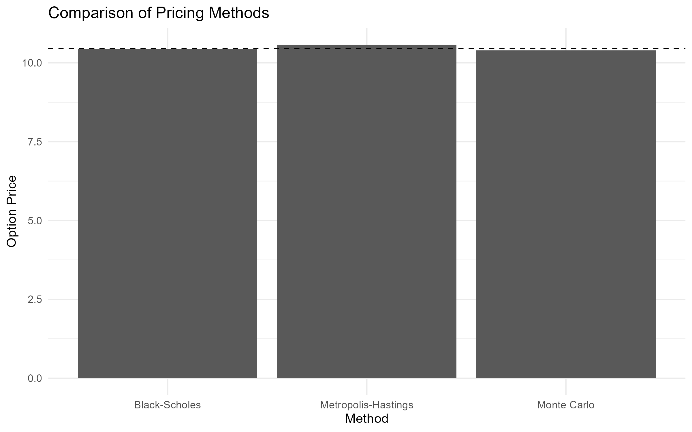
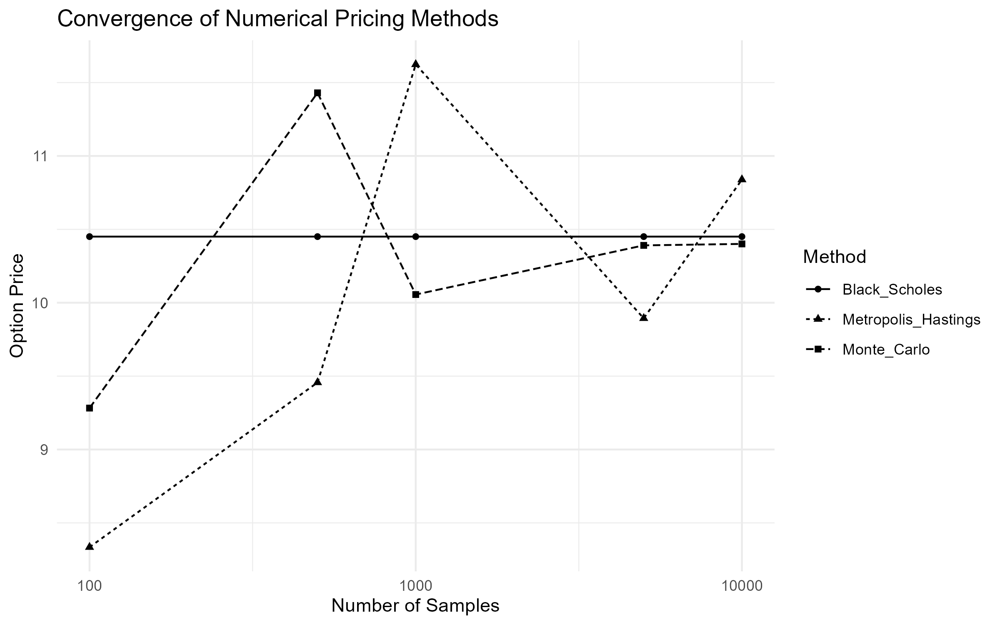
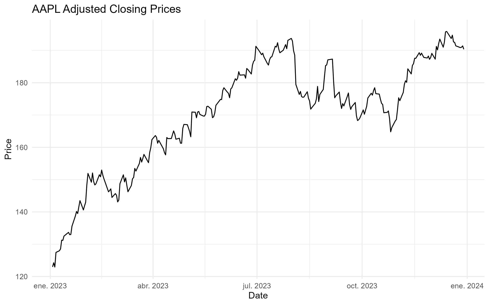
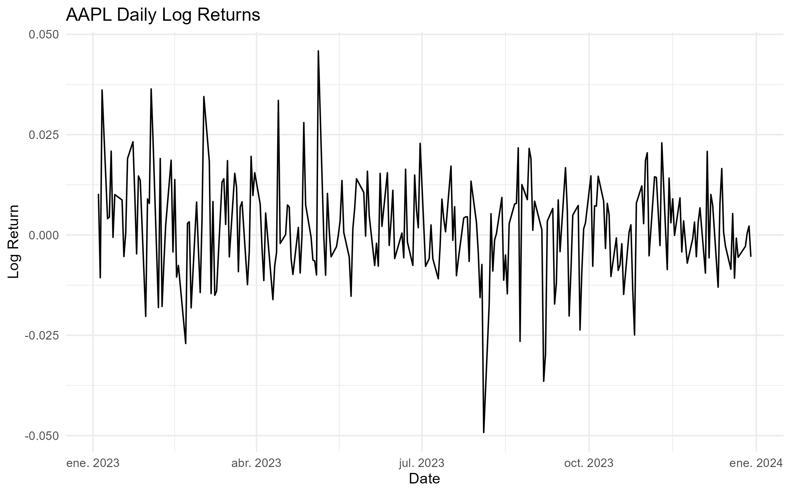
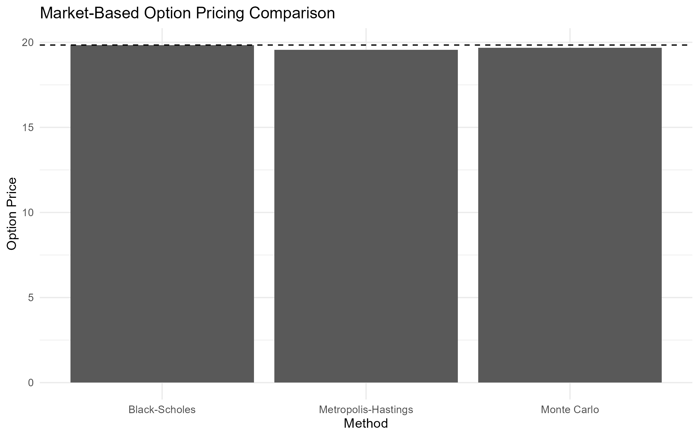

# Option Pricing with Path Integrals

Most option pricing models focus on the value of a contract at maturity. Path integral methods approach the same problem from a different perspective: instead of analysing a single outcome, they evaluate the contribution of all possible price trajectories that could lead to it. This viewpoint is particularly appealing for derivatives whose value depends not only on the final price of the underlying asset, but also on the path followed to reach it.

While the Black–Scholes framework remains one of the most influential models in quantitative finance, many derivatives require numerical techniques because closed-form solutions are either unavailable or difficult to obtain. Path integral methods provide an alternative formulation that naturally expresses option values as weighted averages over entire trajectories, creating a direct connection between option pricing and simulation-based methods.

This project investigates whether a path integral formulation can serve as a practical computational framework for option pricing. The analysis focuses on European call options, where analytical Black–Scholes prices are available and can be used as a benchmark. A path integral representation of the pricing problem is derived, implemented numerically using the Metropolis–Hastings algorithm, and evaluated against both the analytical Black–Scholes solution and conventional Monte Carlo estimates. Historical market data is incorporated to illustrate how the methodology can be applied in a realistic setting.

## Problem Definition

For a standard European option, the Black–Scholes model provides an elegant closed-form solution under a set of simplifying assumptions. The situation becomes more challenging when dealing with contracts that involve early exercise features, path dependence, or more complex market dynamics. In these cases, analytical solutions may no longer exist, and numerical methods become essential.

Most numerical approaches are built around either solving a pricing equation or approximating the evolution of the underlying asset through discrete structures such as lattices. Path integral methods offer a different perspective. Rather than focusing on a single terminal outcome, they formulate the valuation problem as an aggregation over all possible trajectories that the underlying asset could follow between the present and maturity.

This trajectory-based viewpoint is particularly attractive for derivatives whose value depends on the history of the underlying asset rather than on its final price alone. It also provides a natural bridge between option pricing and simulation-based techniques, allowing the valuation problem to be reformulated in terms of sampling and aggregating large ensembles of possible price paths.

The central question explored in this project is whether this alternative formulation can provide a practical foundation for option pricing while remaining consistent with established financial theory. The goal is not to outperform Black–Scholes where an analytical solution already exists, but to examine whether path integrals can serve as a flexible framework for pricing problems where closed-form solutions are no longer available.

## Modeling Approach

The starting point of the model is the same stochastic process used in the Black–Scholes framework. The underlying asset is assumed to follow a geometric Brownian motion, allowing the option pricing problem to be expressed in terms of the probability distribution of future price trajectories.

Rather than working directly with the Black–Scholes partial differential equation, the pricing problem is reformulated using a path integral representation. In this formulation, the value of an option is obtained by aggregating the contribution of all admissible trajectories connecting the current asset price to a future state at maturity. Each trajectory is assigned a statistical weight determined by the underlying stochastic process and contributes to the expected discounted payoff.

To make the problem computationally tractable, the continuous time horizon is discretized into a finite number of intervals. This transforms the original path integral into a multidimensional integration problem whose dimensionality grows with the number of time steps used to represent the trajectory. The resulting formulation provides a numerical approximation of the Black–Scholes propagator while preserving the probabilistic interpretation of the original model.

Evaluating these multidimensional integrals directly quickly becomes impractical as the number of dimensions increases. For this reason, the numerical estimation is performed using Markov Chain Monte Carlo techniques. Among the available sampling methods, the Metropolis–Hastings algorithm was selected because it allows representative trajectories to be generated efficiently from the target distribution without requiring exhaustive exploration of the integration domain.

The analysis focuses on European call options, where analytical Black–Scholes prices are available and can be used as a benchmark. This provides a controlled setting in which the numerical estimates obtained from the path integral formulation can be compared against a well-established analytical solution before considering more complex derivatives.

The overall modeling strategy combines three components: a geometric Brownian motion describing the evolution of the underlying asset, a path integral formulation that expresses option values as weighted averages over entire price trajectories, and a Markov Chain Monte Carlo algorithm used to estimate those values numerically.

## Methodology and Implementation

The objective of this project is not to compete with established option pricing methods, but to explore how ideas originating from the path integral formulation can be translated into a practical numerical workflow. To keep the analysis transparent, the implementation is organized around two experiments. The first uses a controlled setting in which the analytical solution is known. The second applies the same workflow to observed market data.

### Controlled Experiment

The analysis begins with a European call option under the Black-Scholes assumptions. The parameters used throughout the baseline experiment are summarized in @tbl-model-parameters.

| Parameter             |    Value  |
| :-------------------: | :-------: |
| Initial Asset Price   | 100.0000  |
| Strike Price          | 100.0000  |
| Time to Maturity      |   1.0000  |
| Risk-Free Rate        |   0.0500  |
| Volatility            |   0.2000  |

: Model parameters used in the baseline pricing experiment. {#tbl-model-parameters}

Under these assumptions, the Black-Scholes formula provides an exact analytical price. This creates a useful benchmark against which numerical estimators can be evaluated.

Although the path integral formulation is naturally expressed in terms of entire asset price trajectories, a European call option depends only on the terminal asset price. For this reason, the implementation does not attempt to sample complete paths through Markov Chain Monte Carlo. Instead, the problem is simplified by sampling from the terminal log-price distribution implied by the risk-neutral geometric Brownian motion model. This reduction preserves the essential pricing problem while keeping the numerical implementation manageable.

Simulated price paths are nevertheless generated to illustrate the stochastic dynamics underlying the model and to provide a visual representation of the path-based perspective motivating the analysis.

{#fig-simulated-gbm-path}

Three pricing approaches are then compared. The Black-Scholes formula serves as the analytical benchmark, standard Monte Carlo simulation provides a conventional numerical estimator, and a Metropolis-Hastings sampler is used to generate samples from the terminal risk-neutral distribution.

The resulting estimates are reported in @tbl-pricing-methods and visualized in @fig-pricing-method-comparison.

| Method                | Option Price  | Absolute Error  |
| :-------------------: | :-----------: | :-------------: |
| Black-Scholes         |      10.4506  |         0.0000  |
| Monte Carlo           |      10.3896  |         0.0610  |
| Metropolis-Hastings   |      10.5800  |         0.1295  |

: Comparison of option prices obtained using Black-Scholes, Monte Carlo simulation, and Metropolis-Hastings sampling. {#tbl-pricing-methods}

{#fig-pricing-method-comparison}

All three methods produce estimates close to the analytical benchmark. In this simple setting, standard Monte Carlo achieves the smallest numerical error. This result is not surprising. For a European call option, direct Monte Carlo sampling is already an efficient estimator, and the additional complexity introduced by Markov Chain Monte Carlo does not provide a clear advantage.

To better understand the behavior of the numerical estimators, the experiment is repeated for different sample sizes. The results are shown in @tbl-convergence-analysis and @fig-convergence-analysis.

| Samples  | Monte Carlo  | Metropolis-Hastings  | Black-Scholes  |
| :------: | :----------: | :------------------: | :------------: |
|     100  |      9.2822  |              8.3345  |       10.4506  |
|     500  |     11.4302  |              9.4567  |       10.4506  |
|    1000  |     10.0559  |             11.6238  |       10.4506  |
|    5000  |     10.3909  |              9.8939  |       10.4506  |
|   10000  |     10.4008  |             10.8390  |       10.4506  |

: Convergence behavior of Monte Carlo and Metropolis-Hastings estimators as the number of samples increases. {#tbl-convergence-analysis}

{#fig-convergence-analysis}

Both estimators move toward the analytical solution as the sample size increases. The Monte Carlo estimator exhibits a more stable convergence pattern, while the Metropolis-Hastings estimates show larger fluctuations at smaller sample sizes. This behavior is consistent with the autocorrelation introduced by Markov chain sampling and illustrates one of the practical trade-offs associated with MCMC-based methods.

The purpose of this comparison is not to demonstrate that Metropolis-Hastings outperforms Monte Carlo in a problem where the analytical solution is already available. Rather, it provides a controlled environment for validating the implementation and understanding the numerical behavior of the estimator before considering more complex derivatives.

### Market Data Example

After validating the workflow in a controlled setting, the same methodology is applied using observed market data. Historical prices for AAPL are downloaded from Yahoo Finance and used to estimate a spot price and historical volatility.

{#fig-market-price-series}

{#fig-market-log-returns}

The resulting inputs are summarized in @tbl-market-inputs.

| Parameter               | Value      |
| :---------------------: | :--------: |
| Ticker                  | AAPL       |
| Spot Price              | 190.3751   |
| Strike Price            | 190.3751   |
| Time to Maturity        | 1          |
| Risk-Free Rate          | 0.05       |
| Historical Volatility |   0.1992     |

: Market-derived inputs obtained from historical AAPL data. {#tbl-market-inputs}

The objective of this second experiment is not to construct a tradable option pricing model or a production-grade calibration. Instead, it demonstrates that the same workflow can be applied using observed financial data rather than synthetic inputs.

Pricing results obtained from the three methods are reported in @tbl-market-comparison and visualized in @fig-market-pricing-comparison.

| Method               | Option Price  | Absolute Error  |
| :------------------: | :-----------: | :-------------: |
| Black-Scholes        |      19.8397  |         0.0000  |
| Monte Carlo          |      19.6705  |         0.1693  |
| Metropolis-Hastings  |      19.5573  |         0.2824  |

: Option pricing results using market-derived inputs from AAPL historical data. {#tbl-market-comparison}

{#fig-market-pricing-comparison}

The overall conclusions are consistent with those obtained in the controlled experiment. The numerical estimates remain close to the Black-Scholes benchmark, while standard Monte Carlo continues to provide the most accurate approximation among the simulation-based methods considered. At the same time, the exercise demonstrates that the implementation can be applied without modification once the required market inputs have been estimated.

::: {.content-visible when-format="html"}

Additional implementation details are available in the companion Quarto notebook [here](../notebooks-and-scripts/1-applied-data-science/3-option-pricing/r/1-option-pricing-with-path-integrals.html). A companion Python implementation is also available [here](../notebooks-and-scripts/1-applied-data-science/3-option-pricing/python/1-option-pricing-with-path-integrals.html).

:::

::: {.content-visible when-format="pdf"}

Additional implementation details, including the companion Quarto and Python notebooks, are available in the project repository \href{https://github.com/rodrigokang/portfolio/tree/main/notebooks-and-scripts/1-applied-data-science/3-option-pricing}{\faGithub}

:::

## Results, Discussion, and Limitations

The results show that all three pricing approaches considered in this project produce estimates that are reasonably close to one another. In both the controlled experiment and the market-data example, the numerical estimators converge toward values consistent with the Black-Scholes benchmark, indicating that the implementation captures the essential characteristics of the pricing problem.

For the baseline European call option, standard Monte Carlo simulation produced the most accurate numerical approximation among the simulation-based methods. The Metropolis-Hastings estimator also generated reasonable price estimates, but exhibited larger deviations from the analytical solution and greater variability during the convergence analysis.

This outcome is not particularly surprising. The problem considered here is intentionally simple. Under the Black-Scholes assumptions, the terminal distribution of the asset price is known, making direct Monte Carlo simulation both straightforward and efficient. In this setting, introducing a Markov Chain Monte Carlo procedure adds computational complexity without providing a corresponding improvement in accuracy.

From a practical perspective, this observation is one of the most important findings of the project. The results suggest that Metropolis-Hastings should not be viewed as a replacement for standard Monte Carlo methods in simple European option pricing problems. When direct sampling is available, conventional Monte Carlo remains the more natural and efficient choice.

The convergence analysis reinforces this conclusion. As the number of samples increases, both estimators move toward the analytical benchmark. However, the Monte Carlo estimator exhibits a smoother convergence pattern, while the Metropolis-Hastings estimates fluctuate more noticeably at smaller sample sizes. This behavior is consistent with the autocorrelation inherent to Markov chain sampling and highlights one of the practical trade-offs associated with MCMC-based methods. Although Markov chains can explore complex probability distributions, successive samples are not independent, which can reduce sampling efficiency.

At the same time, the fact that Metropolis-Hastings does not outperform Monte Carlo in this experiment does not imply that MCMC methods are uninteresting for option pricing. The primary motivation for studying these techniques arises in situations where direct sampling becomes difficult or inefficient. Many derivatives encountered in practice depend not only on the terminal asset price but on the entire trajectory followed by the underlying asset. In such cases, the dimensionality of the problem increases substantially, and sampling-based approaches inspired by path integrals may become more attractive.

The market-data example provides an additional perspective on the methodology. Using historical AAPL prices, the same workflow produced pricing estimates that remained close to the analytical benchmark. While this exercise should not be interpreted as a production-grade option valuation framework, it demonstrates that the implementation can be applied directly to observed market data once the required inputs have been estimated. The transition from synthetic examples to real financial data required no modifications to the underlying pricing algorithms, which is an encouraging indication of the flexibility of the approach.

Several limitations should be acknowledged. First, the project focuses exclusively on European call options under the Black-Scholes assumptions. These assumptions include constant volatility, a constant risk-free interest rate, frictionless markets, and geometric Brownian motion dynamics. While these simplifications make the problem analytically tractable, they do not fully capture the behavior of real financial markets.

Second, the implementation does not perform a full path-integral simulation. The theoretical discussion motivating the project is expressed in terms of asset price trajectories, but the numerical implementation exploits the fact that European option payoffs depend only on the terminal asset price. As a result, Metropolis-Hastings is applied to the terminal log-price distribution rather than to complete asset paths. This simplification is appropriate for the problem studied here, but it leaves open the question of how the methodology would behave when applied to genuinely path-dependent derivatives.

Finally, the market-data example relies on historical volatility estimated from past returns. In practice, option pricing often incorporates additional sources of information such as implied volatility surfaces, stochastic volatility models, local volatility models, or alternative asset dynamics. Extending the framework to accommodate these features would require a more sophisticated calibration procedure than the one considered in this project.

Despite these limitations, the project successfully demonstrates that concepts originating from the path integral formulation can be translated into a practical computational workflow. For simple European options, the results confirm that standard Monte Carlo simulation remains the most efficient numerical approach among those considered. However, the implementation also provides a foundation for exploring more complex derivatives, where path-dependent payoffs and higher-dimensional probability distributions may create conditions under which MCMC-based techniques become more compelling.

## Technical Appendix (Optional)

The main body of this project focuses on the practical implementation and evaluation of path-integral-inspired option pricing methods. The purpose of this appendix is to provide additional mathematical and computational details supporting the numerical results presented throughout the chapter.

The material is organized around four topics. Appendix A reviews the Black-Scholes framework underlying the pricing model. Appendix B introduces the Monte Carlo estimator used to approximate risk-neutral expectations. Appendix C summarizes the Metropolis-Hastings algorithm employed in the numerical experiments. Finally, Appendix D discusses the path integral perspective motivating the project and its connection to more general path-dependent pricing problems.

The appendix is intended as a technical reference rather than a prerequisite. Readers interested primarily in the implementation and results can safely skip this section without affecting the overall understanding of the project.

### Appendix A. Black-Scholes Framework

The numerical experiments presented in this project are built upon the Black-Scholes framework developed by Black and Scholes and later extended by Merton @black1973pricing @merton1973theory. This appendix summarizes the mathematical assumptions underlying the model and connects them to the numerical implementation.

The starting point is the assumption that the underlying asset follows a geometric Brownian motion. The asset price dynamics are described by

$$
dS_t = \mu S_t,dt + \sigma S_t,dW_t
$$ {#eq-gbm}

where $S_t$ denotes the asset price at time $t$, $\mu$ is the drift parameter, $\sigma$ is the volatility, and $W_t$ represents a standard Wiener process.

@eq-gbm states that the evolution of the asset price contains both a deterministic component and a random component. The deterministic term controls the average growth of the process, while the stochastic term introduces uncertainty into future prices and generates the dispersion observed in the simulated trajectories presented in the main body of the project.

Applying Itô's lemma to the logarithm of the asset price yields a stochastic process with a closed-form solution. The terminal asset price can then be written as

$$
S_T = S_0 \exp\left[\left(\mu-\frac{\sigma^2}{2}\right)T + \sigma\sqrt{T},Z\right]
$$ {#eq-gbm-solution}

where $Z \sim N(0,1)$ is a standard normal random variable.

@eq-gbm-solution implies that the logarithm of the terminal asset price is normally distributed,

$$
\log(S_T)
\sim
N
\left(
\log(S_0) + \left(\mu-\frac{\sigma^2}{2}\right)T,
\sigma^2T
\right)
$$ {#eq-lognormal-distribution}

which means that the terminal asset price itself follows a lognormal distribution.

This result plays a central role throughout the project. The Monte Carlo simulations generate terminal prices using @eq-gbm-solution, while the Metropolis-Hastings implementation samples from the distribution described by @eq-lognormal-distribution. As discussed in the main body of the project, the payoff of a European call option depends only on the terminal asset price, making this distribution the key object of interest.

Under the risk-neutral valuation framework, the expected growth rate of the asset is replaced by the risk-free interest rate $r$. The value of a European call option can then be expressed as

$$
C = e^{-rT}\mathbb{E}\left[\max(S_T-K,0)\right]
$$ {#eq-risk-neutral-pricing}

where $C$ denotes the option value and $K$ is the strike price.

Evaluating @eq-risk-neutral-pricing under the lognormal distribution of $S_T$ leads to the Black-Scholes formula

$$
C = S_0N(d_1) - Ke^{-rT}N(d_2)
$$ {#eq-black-scholes}

with

$$
d_1 =
\frac{
\ln(S_0/K) + (r+\sigma^2/2)T
}
{
\sigma\sqrt{T}
}
$$ {#eq-d1}

and

$$
d_2 = d_1 - \sigma\sqrt{T}
$$ {#eq-d2}

Here, $N(\cdot)$ denotes the cumulative distribution function of the standard normal distribution.

For the purposes of this project, the availability of an analytical solution is particularly valuable. It provides a reference against which the Monte Carlo and Metropolis-Hastings estimators can be evaluated, allowing numerical errors and convergence behavior to be studied in a controlled setting. The Black-Scholes model therefore serves not only as a pricing framework, but also as a benchmark for validating the numerical methods explored throughout the chapter.

### Appendix B. Monte Carlo Option Pricing

The Black-Scholes pricing formula provides a closed-form solution for European call options. However, many derivatives do not admit analytical solutions, making numerical methods necessary. One of the most widely used approaches in quantitative finance is Monte Carlo simulation @rubinstein2016simulation.

The starting point is the risk-neutral valuation formula introduced in @eq-risk-neutral-pricing,

$$
C = e^{-rT}\mathbb{E}\left[\max(S_T-K,0)\right]
$$ {#eq-risk-neutral-pricing-mc}

This expression states that the option value is equal to the discounted expected payoff under the risk-neutral probability measure. In most practical applications, the expectation cannot be evaluated analytically and must be approximated numerically.

Monte Carlo simulation replaces the theoretical expectation with an empirical average computed from a large number of simulated outcomes. If $S_T^{(1)}, S_T^{(2)}, \ldots, S_T^{(N)}$ denote $N$ independent realizations of the terminal asset price, the option value can be approximated by

$$
\hat{C}_N =
e^{-rT}
\frac{1}{N}
\sum_{i=1}^{N}
\max\left(S_T^{(i)}-K,0\right).
$$ {#eq-monte-carlo-estimator}

@eq-monte-carlo-estimator is the estimator implemented in the Python notebook. Each simulation generates a possible terminal asset price according to the geometric Brownian motion model described in Appendix A, computes the corresponding payoff, and averages the results across all simulated scenarios.

An important property of Monte Carlo methods is that the estimator converges to the true expected value as the number of simulations increases. Under standard regularity conditions,

$$
\hat{C}_N
\rightarrow
C
\qquad
\text{as}
\qquad
N \rightarrow \infty.
$$ {#eq-monte-carlo-convergence}

This result follows from the Law of Large Numbers and provides the theoretical justification for the simulation approach.

The accuracy of the estimator is commonly measured through its standard error. For Monte Carlo methods, the estimation error decreases proportionally to

$$
\mathcal{O}\left(N^{-1/2}\right),
$$ {#eq-monte-carlo-error}

which implies that reducing the error by a factor of two requires approximately four times as many simulations.

This characteristic is one of the principal strengths and weaknesses of Monte Carlo methods. On the one hand, the approach is conceptually simple and can be applied to a wide range of pricing problems. On the other hand, convergence can be relatively slow, particularly when high precision is required.

For the European call option considered in this project, Monte Carlo simulation performs remarkably well. The results presented in the main body of the chapter show that the numerical estimates converge rapidly toward the Black-Scholes benchmark as the number of simulations increases. This behavior is expected because the terminal distribution of the underlying asset is known and can be sampled directly.

The role of Monte Carlo simulation in this project is therefore twofold. First, it provides a practical numerical approximation to the Black-Scholes pricing problem. Second, it serves as a baseline against which the Metropolis-Hastings implementation can be evaluated. Since direct sampling is available in this setting, Monte Carlo represents a natural benchmark for assessing the advantages and limitations of alternative sampling-based approaches.

### Appendix C. Metropolis-Hastings Sampling

The Monte Carlo estimator discussed in Appendix B relies on direct sampling from the target distribution. In the Black-Scholes setting considered in this project, this approach is straightforward because the terminal asset price distribution is known analytically. However, many problems in computational finance involve probability distributions that are difficult to sample from directly.

Markov Chain Monte Carlo (MCMC) methods address this challenge by constructing a stochastic process whose long-run behavior reproduces a desired target distribution. Rather than generating independent samples, MCMC algorithms produce a sequence of correlated samples that gradually explore the probability space.

The Metropolis-Hastings algorithm is one of the most widely used MCMC methods. The algorithm begins from an initial state $x$ and proposes a new candidate state $x'$ from a proposal distribution $q(x'|x)$. The proposed state is then accepted with probability

$$
\alpha(x,x')
=
\min
\left(
1,
\frac{\pi(x')q(x|x')}
{\pi(x)q(x'|x)}
\right),
$$ {#eq-mh-acceptance}

where $\pi(\cdot)$ denotes the target probability distribution.

If the proposed state is accepted, the Markov chain moves to $x'$. Otherwise, the chain remains at its current position. Repeating this procedure produces a sequence of samples whose stationary distribution converges to the target distribution.

In the present project, the objective is not to sample complete asset-price trajectories. Instead, the algorithm is applied to the terminal log-price distribution derived in @eq-lognormal-distribution. This simplification is possible because the payoff of a European call option depends only on the terminal asset price.

The target distribution therefore corresponds to

$$
\log(S_T)
\sim
N
\left(
\log(S_0)
+
\left(
r-\frac{\sigma^2}{2}
\right)T,
\sigma^2T
\right),
$$ {#eq-risk-neutral-lognormal}

where the drift parameter has been replaced by the risk-free interest rate in accordance with the risk-neutral valuation framework.

Once samples from the terminal distribution have been generated, option values can be estimated using the same discounted payoff expression introduced in Appendix B. The difference lies not in the pricing equation itself, but in the mechanism used to obtain the samples.

An important consequence of this approach is that successive observations generated by the Markov chain are not independent. This property introduces autocorrelation into the sample and can reduce statistical efficiency relative to direct Monte Carlo simulation.

This observation helps explain the behavior reported in the main body of the project. The Metropolis-Hastings estimator produced option values consistent with the Black-Scholes benchmark, but exhibited larger fluctuations than standard Monte Carlo at smaller sample sizes. Since direct sampling from the terminal distribution is available in this problem, the additional flexibility of MCMC provides little practical advantage.

The purpose of including Metropolis-Hastings in this project is therefore not to outperform conventional Monte Carlo simulation. Rather, it serves as an introduction to sampling techniques that become increasingly relevant when direct sampling is difficult or when the pricing problem depends on higher-dimensional probability distributions. These situations arise naturally in many path-dependent derivatives and motivate the broader path integral perspective discussed in the next appendix.

### Appendix D. Path Integral Perspective

The title of this project refers to the path integral formulation of option pricing. Although the numerical implementation developed throughout the chapter does not perform a full path integral simulation, the underlying motivation originates from a broader perspective on stochastic processes and probability distributions.

The path integral formalism was originally developed in quantum mechanics by Feynman as an alternative formulation of physical dynamics @feynman2010quantum. Rather than describing the evolution of a system through a single trajectory, the theory considers all possible trajectories connecting an initial and a final state. Observable quantities are then obtained by aggregating the contributions of these trajectories.

A similar idea appears naturally in stochastic finance. The future value of a derivative depends on the possible evolutions of the underlying asset, each associated with a particular probability. From this viewpoint, option pricing can be interpreted as an average over a space of possible asset-price paths @linetsky1997path.

In a schematic form, the value of a derivative can be expressed as

$$
C(S_0,t_0)
=
\int \mathcal{D}[S(t)]
,P[S(t)]
,\Phi[S(t)]
$$ {#eq-path-integral-pricing}

where $\mathcal{D}[S(t)]$ denotes integration over all possible trajectories, $P[S(t)]$ represents the probability associated with a given path, and $\Phi[S(t)]$ denotes the payoff functional.

The key distinction between this expression and the formulations presented in the previous appendices is that the object being integrated is no longer a single terminal value, but an entire trajectory.

For the European call option considered in this project, the payoff depends only on the terminal asset price,

$$
\Phi[S(t)]
=
\max(S_T-K,0).
$$ {#eq-european-payoff}

As a consequence, the pricing problem can be reduced to the terminal distribution of $S_T$. This observation explains why the implementation developed in the chapter focuses on sampling terminal prices rather than complete paths. For this particular derivative, the additional information contained in the intermediate trajectory is unnecessary for computing the payoff.

This simplification is one of the reasons why standard Monte Carlo simulation performs so well in the experiments presented earlier. Direct sampling from the terminal distribution is available, making more sophisticated sampling strategies difficult to justify on efficiency grounds alone.

The situation changes when the payoff depends on the entire history of the asset rather than its terminal value. Examples include Asian options, lookback options, barrier options, and many other path-dependent derivatives. In these cases, the trajectory itself becomes part of the pricing problem, and the path integral viewpoint provides a natural conceptual framework for describing the associated probability space @devreese2010path @baaquie2007quantum.

From this perspective, the implementation developed in this project can be viewed as a simplified introduction to a broader class of numerical techniques. The Monte Carlo and Metropolis-Hastings algorithms operate on the terminal distribution because the European call option permits this reduction. More complex derivatives would generally require sampling higher-dimensional objects, including entire asset-price trajectories.

The objective of this chapter was not to build a complete path integral pricing engine, but rather to investigate whether ideas originating from the path integral framework could be translated into a practical computational workflow. The results suggest that, for simple European options, direct Monte Carlo simulation remains the most efficient approach among those considered. At the same time, the project establishes a foundation for exploring more sophisticated derivatives in which the trajectory itself becomes the central object of interest.

## Further Reading

::: {.content-visible when-format="html"}

For readers interested in a more detailed mathematical treatment, including derivations and additional discussion, the accompanying technical note is available [<i class="bi bi-file-earmark-pdf"></i>](../personal-notes/option-pricing-with-path-integrals/option-pricing-with-path-integrals.pdf).
 
:::

::: {.content-visible when-format="pdf"}

For readers interested in a more detailed mathematical treatment, including derivations and additional discussion, the accompanying technical note is available \href{https://raw.githubusercontent.com/rodrigokang/portfolio/main/personal-notes/quant-finance/derivatives/option-pricing-with-path-integrals/option-pricing-with-path-integrals.pdf}{\faFilePdf}.

:::