# Skin Lesion Triage

The ability to prioritise patients who may require earlier clinical attention is an important aspect of many healthcare workflows. In dermatology, dermoscopic imaging has become a valuable tool for assessing pigmented skin lesions, but interpreting these images remains a specialised task that depends on clinical expertise and available resources.

This project explores whether deep learning can support that prioritisation process by distinguishing lesions that warrant earlier dermatological review from those that can be assigned a lower priority. Rather than attempting to automate diagnosis, the objective is to investigate how image classification models can contribute to a cautious triage workflow while preserving clear boundaries between decision support and clinical judgement.

The chapter follows the complete modelling process, from data preparation and model development to performance evaluation and interpretation, with particular attention to the methodological decisions required to obtain a reliable assessment of model performance.

## Problem Definition

Dermoscopic image classification is commonly framed as a diagnostic task in which each image is assigned to a specific disease category. While this formulation is appropriate for benchmarking machine learning models, it does not necessarily reflect how such models are most likely to be used in clinical practice. In many situations, the immediate objective is not to establish a definitive diagnosis but to identify which lesions should be prioritised for specialist assessment.

This project therefore approaches skin lesion analysis as a binary triage problem. Rather than predicting one of the seven diagnostic categories provided by the original dataset, the objective is to distinguish lesions that warrant **priority dermatological review** from those assigned a lower review priority. This reformulation shifts the focus from diagnostic classification towards clinical prioritisation, where the cost of overlooking a potentially serious lesion is considerably higher than recommending an unnecessary specialist examination.

The binary target is created by grouping melanoma (`mel`), basal cell carcinoma (`bcc`), and actinic keratosis or intraepithelial carcinoma (`akiec`) into the priority-review class. Melanocytic naevi (`nv`), benign keratoses (`bkl`), dermatofibroma (`df`), and vascular lesions (`vasc`) constitute the non-priority class. This grouping is introduced solely for the purposes of this study and should not be interpreted as a validated clinical referral protocol. Instead, it provides a practical framework for evaluating whether deep learning models can effectively rank lesions according to their potential clinical urgency.

This formulation introduces several modelling challenges. The priority-review class represents a relatively small proportion of the available observations, creating a naturally imbalanced classification problem. In addition, multiple dermoscopic images may correspond to the same underlying lesion, making careful data partitioning essential to avoid information leakage between training and evaluation. These characteristics influence both the modelling strategy and the interpretation of the resulting performance.

The objective is therefore not simply to maximise predictive accuracy, but to develop a reproducible workflow capable of supporting image-based lesion prioritisation while providing a realistic assessment of its strengths, limitations, and potential role within a clinical decision-support setting.

## Modeling Approach

The objective of this project is not to identify the most sophisticated image classification architecture, but to evaluate whether deep learning can provide effective support for prioritising dermoscopic lesions that may require earlier clinical attention. Rather than comparing a large number of competing models, the analysis focuses on two complementary modelling strategies that represent different levels of complexity while sharing the same evaluation framework.

The first approach consists of a compact convolutional neural network (CNN) developed specifically for this study. Training a model from scratch establishes a transparent baseline and provides a useful reference for assessing the extent to which predictive performance can be achieved without relying on external image representations. Although relatively simple, this architecture allows the complete learning process to be observed directly and serves as a benchmark against which more advanced approaches can be evaluated.

The second approach adopts transfer learning using ResNet-18, a convolutional neural network pretrained on the ImageNet dataset. Instead of learning visual features entirely from the available dermoscopic images, the model starts from representations acquired from a large-scale natural image dataset and is subsequently fine-tuned for the binary lesion triage task. Transfer learning has become a common strategy in medical image analysis because it often improves performance when labelled clinical datasets are relatively limited.

Both models address the same binary classification problem, are trained using the same lesion-level data partitions, and are evaluated under an identical validation and testing protocol. This common framework allows differences in predictive performance to be attributed primarily to the modelling strategy rather than to variations in data preparation or evaluation methodology.

The overall objective is therefore not only to determine which model achieves superior predictive performance, but also to assess the practical trade-offs between a lightweight architecture trained from scratch and a widely adopted transfer learning approach when applied to automated skin lesion triage.

## Methodology and Implementation

The modelling approach described in the previous section was implemented through a structured workflow covering data preparation, model development, evaluation, and interpretation. Particular attention was given to preserving the independence of the evaluation data, mitigating class imbalance, and ensuring that model selection was based exclusively on validation performance. The implementation follows established practices in deep learning for medical image analysis while adapting them to the specific objective of binary skin lesion triage. Throughout the workflow, methodological decisions prioritise reproducibility and a realistic assessment of predictive performance rather than maximising results on a single dataset.

### Dataset

The implementation is based on the **HAM10000** (*Human Against Machine with 10,000 Training Images*) dataset, introduced by Tschandl et al. @tschandl2018ham10000 and released as the principal dataset for the ISIC 2018 Skin Lesion Analysis Challenge @codella2019skin. With 10,015 dermoscopic images spanning seven diagnostic categories, HAM10000 has become one of the most widely used public benchmarks for developing and evaluating machine learning methods for skin lesion analysis.

The dataset combines images collected from different clinical sources and represents a broad spectrum of pigmented skin lesions encountered in dermatological practice. Diagnostic labels were established through histopathology where available, together with follow-up examinations, expert consensus, or confocal microscopy, resulting in a carefully curated dataset suitable for supervised learning.

Although HAM10000 was originally developed as a seven-class diagnostic dataset, this project reformulates the task as a binary lesion triage problem. The original diagnostic categories were grouped according to whether they require priority dermatological assessment, as introduced in the Problem Definition section. The mapping between the original labels and the binary target used throughout the analysis is summarised in @tbl-class-mapping.

Table: Mapping from the original HAM10000 diagnostic categories to the binary triage target used in this study. {#tbl-class-mapping}

| Original diagnosis                  | Label   | Project class   |
|:-----------------------------------:|:-------:|:---------------:|
| Melanoma                            | `mel`   | Priority review |
| Basal cell carcinoma                | `bcc`   | Priority review |
| Actinic keratosis / Bowen's disease | `akiec` | Priority review |
| Melanocytic naevus                  | `nv`    | Non-priority    |
| Benign keratosis                    | `bkl`   | Non-priority    |
| Dermatofibroma                      | `df`    | Non-priority    |
| Vascular lesion                     | `vasc`  | Non-priority    |

After this transformation, the dataset contains **1,954 priority-review images** and **8,061 non-priority images**, reflecting the natural imbalance between potentially malignant and predominantly benign lesions. This imbalance constitutes an important consideration throughout model development and is explicitly addressed during training.

A further characteristic of HAM10000 is that multiple images may correspond to the same underlying lesion. Since these images are not statistically independent, preserving lesion-level separation between the training, validation, and test partitions becomes essential to avoid information leakage. The partitioning strategy adopted in this study is described in the following section.

### Exploratory Data Analysis

Before developing the classification models, an exploratory analysis was conducted to characterise the dataset and identify properties that could influence model development and evaluation. Rather than searching for predictive relationships, the objective of this stage was to verify the quality of the available data, understand the distribution of the target classes, and identify potential sources of bias that should be considered throughout the modelling process.

The first step was to examine the distribution of the binary triage target. @fig-binary-target-distribution summarises the number of images and unique lesions assigned to each class. As expected, non-priority lesions represent the majority of observations, whereas lesions requiring priority review constitute a substantially smaller proportion of the dataset. This imbalance reflects routine dermatological practice, where benign lesions are considerably more common than lesions requiring immediate clinical attention, and motivates the use of evaluation metrics that extend beyond overall classification accuracy.

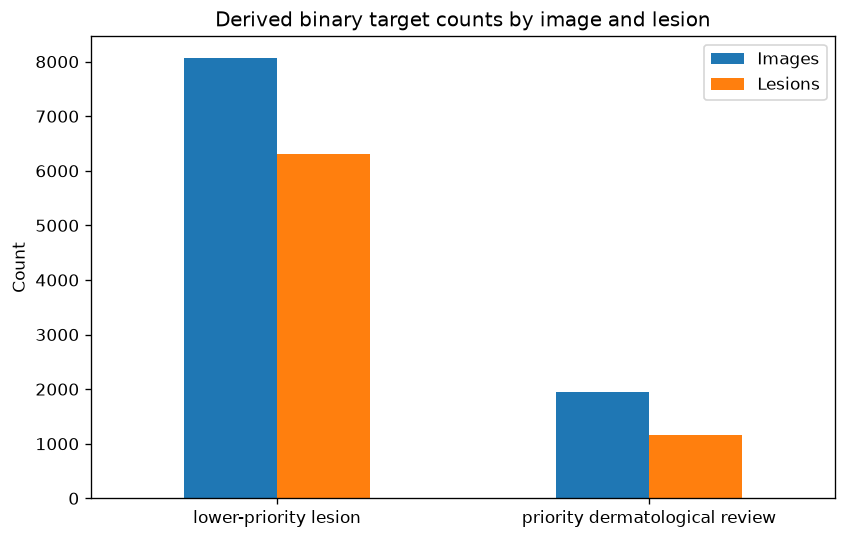{#fig-binary-target-distribution}

A second characteristic of HAM10000 is that multiple dermoscopic images may correspond to the same underlying lesion. @fig-images-per-lesion illustrates the distribution of the number of images available for each lesion. While many lesions are represented by a single image, a substantial proportion includes multiple photographs captured from different viewpoints or magnifications. This characteristic reinforces the importance of performing lesion-level rather than image-level partitioning, ensuring that the evaluation reflects the model's ability to generalise to previously unseen lesions rather than recognising repeated visual appearances of the same case.

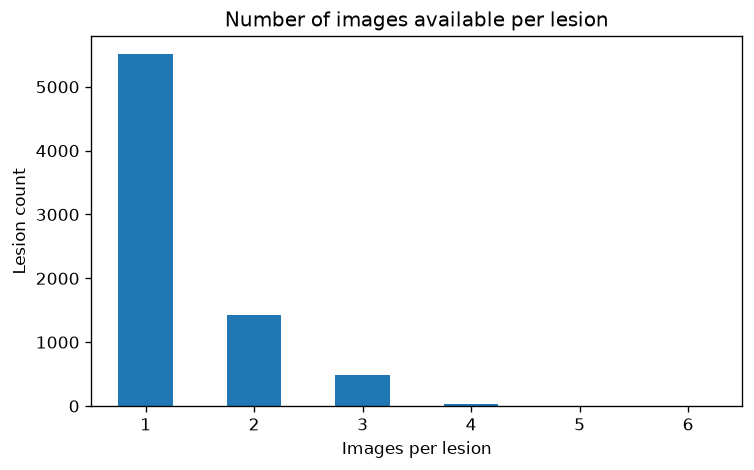{#fig-images-per-lesion}

Patient demographics provide additional context regarding the composition of the study population. @fig-age-by-target presents the age distribution for the two binary target classes. Most observations correspond to middle-aged and older adults, consistent with the epidemiology of pigmented skin lesions. Although the age distributions overlap considerably, this analysis provides useful context for interpreting the characteristics of the study population.

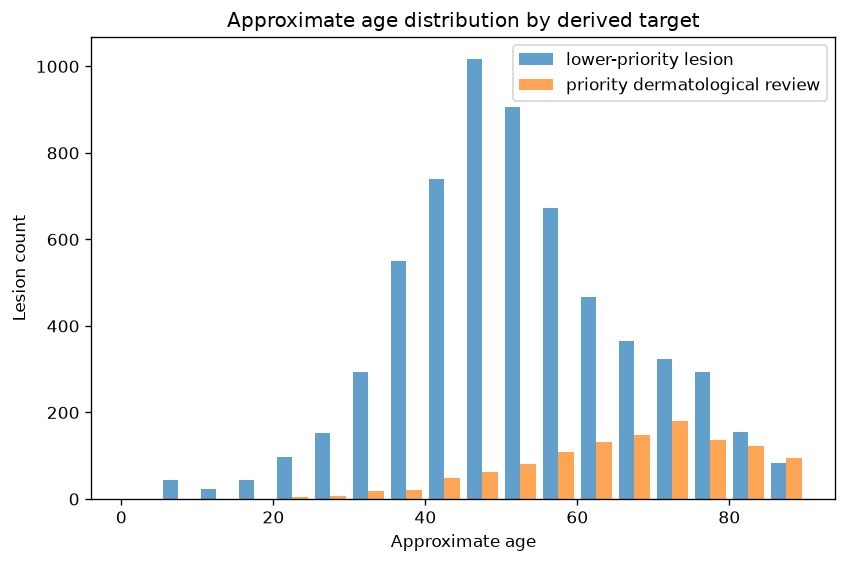{#fig-age-by-target}

The distribution of patients by biological sex is shown in @fig-sex-by-target. Male and female patients are both well represented across the two triage categories, reducing the likelihood that the classification models are driven primarily by differences in sex representation within the dataset.

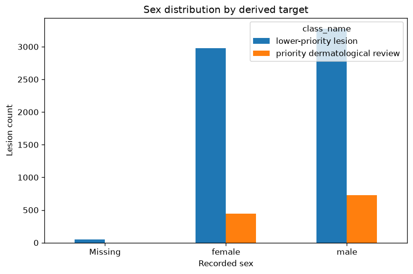{#fig-sex-by-target}

@fig-anatomical-site-by-target summarises the anatomical location of lesions across the binary target classes. Lesions originate from multiple body regions, with the trunk and lower extremities accounting for a substantial proportion of the observations. This diversity contributes to the visual variability of the dataset and reflects the heterogeneous clinical presentation of pigmented skin lesions encountered in routine practice.

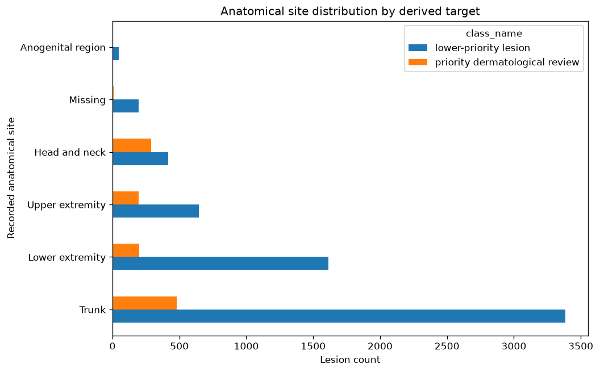{#fig-anatomical-site-by-target}

To better understand the composition of the binary target, the original diagnostic categories were also examined. @fig-source-diagnoses shows the number of images and lesions contributed by each diagnostic class before collapsing them into the binary triage formulation. This analysis confirms that the priority-review group combines several clinically important but comparatively infrequent diagnoses, whereas benign melanocytic nevi dominate the dataset.

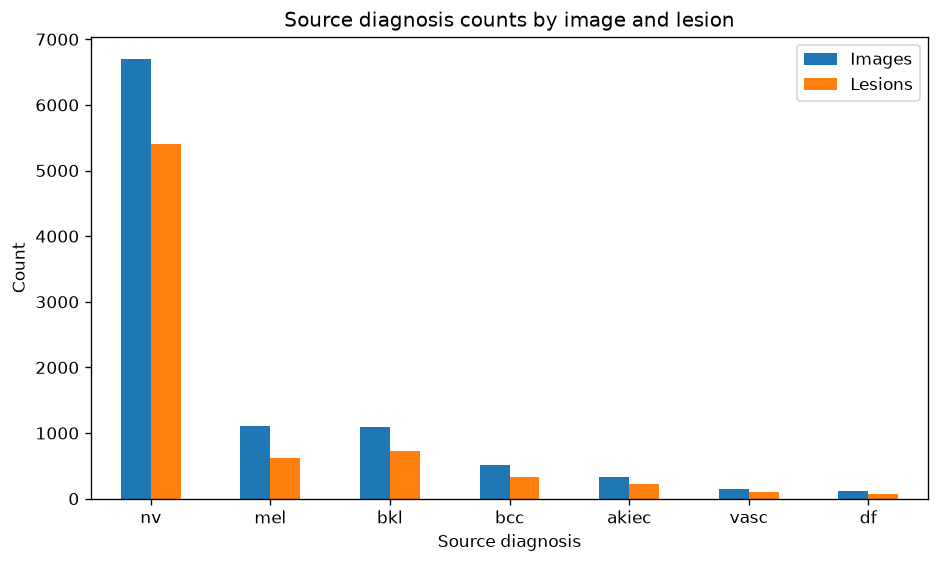{#fig-source-diagnoses}

Finally, @fig-confirmation-method summarises the methods used to establish the reference diagnosis for each lesion. Histopathology represents the predominant confirmation method for malignant lesions, whereas benign lesions include a mixture of histopathological confirmation, expert consensus, and follow-up examinations. Understanding these differences provides additional context regarding the reliability of the ground-truth labels used throughout model development and evaluation.

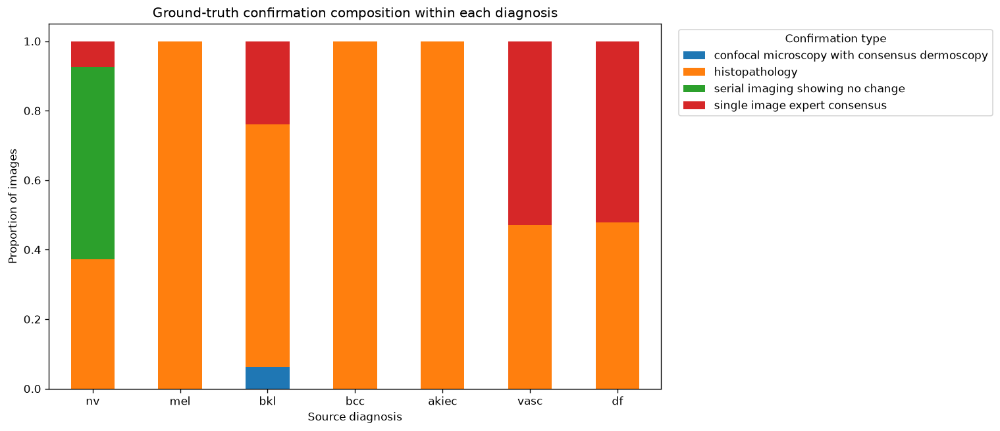{#fig-confirmation-method}

Overall, the exploratory analysis confirms several characteristics that must be considered throughout model development, including class imbalance, heterogeneous patient demographics, variation in anatomical location, and the presence of multiple images corresponding to the same lesion. Among these, the repeated representation of individual lesions has the greatest methodological implications, directly motivating the lesion-level data partitioning strategy adopted throughout the remainder of this study.

### Lesion-Level Data Partitioning

A critical characteristic of the HAM10000 dataset is that multiple dermoscopic images may correspond to the same underlying lesion. Although these images differ in magnification, lighting conditions, orientation, or acquisition time, they remain highly correlated because they depict the same clinical case. Consequently, randomly splitting individual images between training and testing sets would allow visually similar representations of the same lesion to appear in both partitions, leading to overly optimistic estimates of model performance.

To prevent this form of information leakage, the dataset was partitioned at the lesion level rather than at the image level. Each unique lesion identifier was assigned exclusively to either the training, validation, or test set, ensuring that no lesion was represented in more than one partition. This strategy provides a more realistic assessment of the model's ability to generalise to previously unseen lesions, which is ultimately the objective in a clinical decision-support setting.

The resulting partition is summarised in @tbl-data-split-summary. Approximately 70% of the images were allocated to the training set, while the remaining observations were divided almost equally between the validation and independent test sets. Importantly, the proportion of priority-review lesions remains remarkably consistent across all three partitions, indicating that the lesion-level split preserves the overall class distribution while maintaining complete separation between lesions.

Table: Summary of the lesion-level data partition used throughout model development and evaluation. {#tbl-data-split-summary}

| Partition   | Images | Unique lesions  | Priority-review images   | Priority-review proportion  |
|:-----------:|:------:|:---------------:|:------------------------:|:---------------------------:|
| Training    | 7,014  | 5,229           | 1,372                    | 19.6%                       |
| Validation  | 1,506  | 1,120           | 299                      | 19.9%                       |
| Test        | 1,495  | 1,121           | 283                      | 18.9%                       |

Once established, these partitions remained fixed throughout the entire analysis. All preprocessing operations, image normalisation, data augmentation, model optimisation, threshold selection, and performance assessment were performed using this predefined split. The validation set was used exclusively for model selection and threshold calibration, whereas the test set remained untouched until the final evaluation.

By separating lesions rather than individual images, the evaluation protocol better reflects the intended clinical application. During deployment, a model is expected to analyse lesions that have never been observed previously, rather than additional photographs of lesions encountered during training. Adopting a lesion-level partition therefore provides a substantially more reliable estimate of the model's ability to generalise to new patients.

With the data partitions established, the next stage of the workflow consists of standardising the input images before they are presented to the neural networks.

### Image Preprocessing

Before being presented to the neural networks, all dermoscopic images underwent a standardised preprocessing pipeline to ensure consistent input dimensions and pixel distributions across the dataset. Standardising the input is an essential step in deep learning workflows, as convolutional neural networks require images of fixed size while also benefiting from comparable intensity statistics during optimisation.

All images were resized to 224 × 224 pixels using bilinear interpolation. This resolution represents a practical compromise between preserving diagnostically relevant visual structures and maintaining computational efficiency during training. Moreover, it matches the input size expected by the pre-trained ResNet18 architecture, allowing both models to be evaluated under identical conditions.

Pixel values were subsequently converted to floating-point tensors and normalised using channel-wise statistics computed exclusively from the training partition. Applying the same transformation to the validation and test sets ensures that no information from unseen data contributes to the preprocessing stage, thereby preventing a subtle but important source of information leakage.

No handcrafted image enhancement techniques were applied. In particular, procedures such as colour correction, contrast enhancement, hair removal, lesion segmentation, or artefact suppression were intentionally omitted. This decision allows the models to learn directly from the original dermoscopic images and avoids introducing additional preprocessing assumptions that may not generalise across acquisition devices or clinical settings.

Consequently, the preprocessing pipeline remains deliberately simple, focusing on producing consistent inputs while preserving the visual characteristics of the original images. This design also facilitates reproducibility and makes the comparison between the baseline convolutional network and the transfer learning approach more transparent, as both models receive exactly the same preprocessed data.

Although image preprocessing standardises the inputs, it does not address the limited variability of the training data. To improve the robustness of the learned representations and reduce the risk of overfitting, a series of data augmentation techniques were applied exclusively to the training partition, as described in the following section.

### Data Augmentation

Although the lesion-level partition prevents information leakage, the number of available training images remains relatively limited for training deep convolutional neural networks. Furthermore, dermoscopic images exhibit natural variability arising from differences in patient positioning, camera orientation, magnification, and illumination. Data augmentation was therefore applied to increase the diversity of the training data while preserving the underlying diagnostic characteristics of each lesion.

All augmentation operations were performed online during training, meaning that transformed images were generated dynamically at each training epoch rather than being stored as additional samples. This approach exposes the model to a broader range of image variations while avoiding unnecessary duplication of the dataset.

The augmentation pipeline included random horizontal and vertical flips, small rotations, affine transformations, resized crops, and mild colour perturbations. Together, these operations encourage the networks to learn features that are robust to changes in orientation, scale, and illumination without altering the clinical label associated with each lesion.

Importantly, data augmentation was applied exclusively to the training partition. Validation and test images were subjected only to the standard preprocessing pipeline described in the previous section. Restricting augmentation to the training data ensures that model selection and final performance evaluation are conducted using images that faithfully represent unseen clinical observations.

This strategy serves two complementary purposes. First, it increases the effective diversity of the training data, helping to reduce overfitting in a dataset of moderate size. Second, it encourages the learned feature representations to become less sensitive to superficial image characteristics, allowing the models to focus on diagnostically meaningful visual patterns.

With the input pipeline fully defined, the following sections describe the two modelling approaches evaluated in this study: a baseline convolutional neural network trained from scratch and a transfer learning model based on a pre-trained ResNet18 architecture.

### Baseline Convolutional Neural Network

As a benchmark for comparison, a convolutional neural network was trained from scratch using only the dermoscopic images available in the training partition. The purpose of this baseline model was not to maximise predictive performance but to establish a reference against which the benefits of transfer learning could be evaluated under an identical experimental protocol.

The network follows a conventional convolutional architecture composed of successive feature extraction blocks followed by fully connected classification layers. The convolutional layers progressively learn increasingly abstract image representations, beginning with low-level visual features such as edges, colour transitions, and simple textures before combining them into more complex lesion characteristics relevant to the classification task.

To improve optimisation stability and reduce overfitting, the architecture incorporates batch normalisation, non-linear activation functions, and dropout regularisation. Max-pooling operations progressively reduce the spatial resolution of the feature maps while increasing the receptive field of subsequent convolutional layers, allowing the network to capture both local morphological patterns and broader structural characteristics of each lesion.

The network was trained using the Adam optimiser and binary cross-entropy loss, with the objective of distinguishing lesions requiring priority clinical review from those considered lower priority. During optimisation, model parameters were updated exclusively using the training partition, while the validation set was used to monitor learning progress and identify the best-performing model.

Rather than selecting the final model according to classification accuracy alone, the validation Average Precision (AP) score was adopted as the primary selection criterion. Because the dataset exhibits moderate class imbalance and the principal objective is to identify clinically important lesions, Average Precision provides a more informative assessment of model quality than overall accuracy by evaluating performance across all possible decision thresholds.

The weights corresponding to the highest validation Average Precision were retained and subsequently used for the final evaluation on the independent test set. This model therefore represents the strongest version of the baseline architecture obtained without exposure to the test data, providing a fair point of comparison for the transfer learning approach described in the following section.

### Transfer Learning with ResNet18

In addition to the baseline convolutional network, a transfer learning approach based on the ResNet18 architecture was evaluated. Transfer learning has become a standard strategy in medical image analysis because it enables models to leverage visual representations learned from large-scale image datasets, reducing the amount of task-specific data required to achieve strong predictive performance.

ResNet18 was originally trained on the ImageNet dataset, which contains millions of natural images spanning a wide range of object categories. Although dermoscopic images differ substantially from natural photographs, the lower layers of deep convolutional networks learn general-purpose visual features such as edges, textures, colour gradients, and geometric patterns that remain useful across many image classification tasks. Initialising the network with pre-trained weights therefore provides a more informative starting point than random parameter initialisation.

To adapt the model to the binary lesion triage task, the original classification layer was replaced with a new fully connected output layer producing a single probability corresponding to the priority-review class. During training, the entire network was fine-tuned using the dermoscopic images rather than restricting optimisation to the final classification layer. This allows the higher-level feature representations to progressively adapt to the visual characteristics of skin lesions while retaining the robust low-level features learned during pre-training.

The transfer learning model was trained using the same lesion-level partitions, preprocessing pipeline, data augmentation strategy, optimiser, loss function, and validation protocol adopted for the baseline convolutional network. Maintaining identical experimental conditions ensures that any observed differences in predictive performance can be attributed primarily to the modelling strategy rather than to differences in data preparation or optimisation.

As with the baseline model, validation Average Precision was used as the primary model selection criterion. The network parameters corresponding to the highest validation AP score were retained and subsequently evaluated on the independent test set. This consistent evaluation protocol enables a direct comparison between a model trained entirely from scratch and one that benefits from prior visual knowledge acquired through large-scale pre-training.

### Evaluation Protocol

Both models were evaluated using exactly the same experimental protocol to ensure that any performance differences reflected the modelling approach rather than inconsistencies in data preparation or model selection. Throughout the study, the lesion-level data partition remained fixed, with the training set used for parameter optimisation, the validation set reserved for model selection and threshold calibration, and the independent test set withheld until the final evaluation.

Given the clinical objective of prioritising lesions requiring further assessment, model selection was based on validation Average Precision (AP) rather than classification accuracy. Average Precision summarises the precision–recall relationship across all possible decision thresholds and is particularly informative when class distributions are imbalanced or when correctly identifying the minority class is of greater clinical importance than maximising overall accuracy.

After selecting the best-performing model according to validation AP, an operating threshold was determined using the validation data. This threshold was then fixed and applied without modification to the independent test set, ensuring that the reported performance represents a genuine out-of-sample evaluation rather than an optimistically tuned estimate.

The final assessment included threshold-independent metrics, such as the Area Under the Receiver Operating Characteristic Curve (ROC AUC) and Average Precision, together with threshold-dependent measures including sensitivity, specificity, precision, F1-score, balanced accuracy, and overall classification accuracy. Reporting both groups of metrics provides a more comprehensive characterisation of model behaviour than relying on a single performance measure.

To quantify the uncertainty associated with the reported results, confidence intervals were estimated using bootstrap resampling of the independent test set. This procedure generates repeated samples with replacement and estimates the variability of each performance metric without relying on strong distributional assumptions.

Because the dataset contains multiple images of some lesions, predictions were also aggregated at the lesion level in addition to the image level. Aggregating predictions better reflects the intended clinical application, where the objective is to support the assessment of individual lesions rather than isolated photographs. This complementary analysis allows the robustness of the models to be evaluated under a more clinically meaningful perspective.

Finally, model performance was examined across relevant demographic subgroups, including biological sex and age category. Although these analyses are exploratory, they provide useful insight into the consistency of predictive performance across different patient populations and help identify potential sources of performance variability that may warrant further investigation.

::: {.content-visible when-format="html"}

The methodology described in this chapter is implemented in the accompanying Python notebook, available [here](../notebooks-and-scripts/1-applied-data-science/8-skin-lesion-triage/python/1-skin-lesion-triage.html).

:::

::: {.content-visible when-format="pdf"}

The methodology described in this chapter is implemented in the accompanying Python notebook, which is available in the project repository \href{https://github.com/rodrigokang/portfolio/tree/main/notebooks-and-scripts/1-applied-data-science/1-skin-lesion-triage}{\faGithub}.

:::

## Results, Discussion, and Limitations

This section presents the results obtained using the evaluation protocol described in the previous chapter. The analysis begins by comparing the two modelling approaches on the validation set to justify the final model selection before assessing predictive performance on the independent test set. Subsequent sections examine discrimination, calibration, lesion-level performance, uncertainty through bootstrap confidence intervals, subgroup consistency, and model interpretability. The chapter concludes with a discussion of the main findings and the principal limitations of the study.

### Model Selection

Model selection was performed exclusively using the validation partition, which remained completely independent of both the training and test sets throughout model development. Consistent with the evaluation protocol described previously, the model corresponding to the highest validation Average Precision (AP) was retained rather than selecting the epoch with the lowest validation loss or the highest classification accuracy. Because the dataset exhibits moderate class imbalance and the primary objective is to identify lesions requiring priority review, Average Precision provides a more informative criterion for comparing candidate models across training epochs.

The validation learning curves for both architectures are presented in @fig-validation-learning-curves. Both models exhibit stable optimisation behaviour throughout training; however, the transfer learning approach consistently achieves higher validation ROC AUC and Average Precision than the baseline convolutional network. The ResNet18 model also maintains a lower validation loss across most training epochs, consistent with its stronger validation discrimination.

::: {#fig-validation-learning-curves layout-ncol=2}

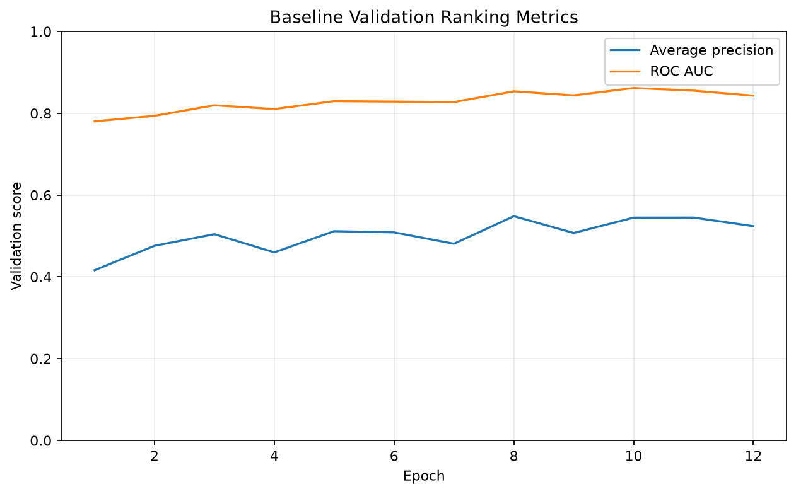

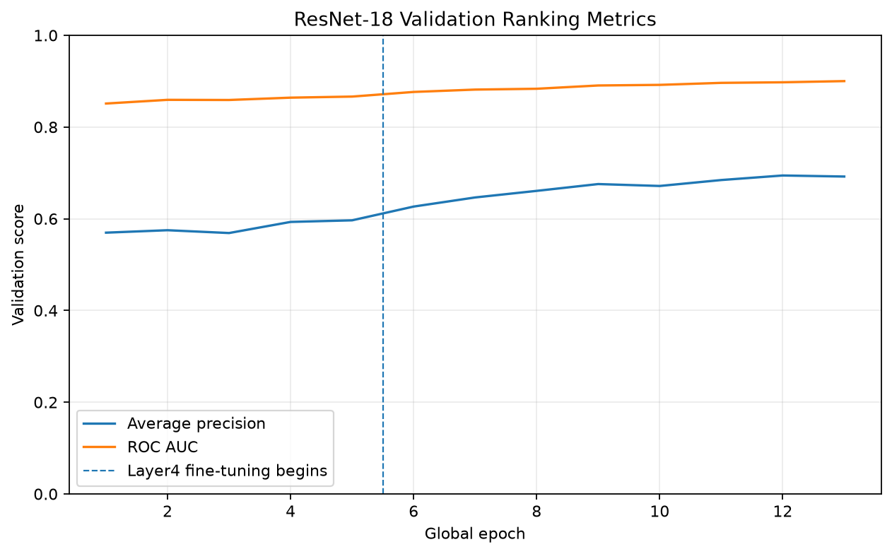

Validation learning curves for the baseline convolutional neural network and the ResNet18 transfer learning model.
:::

The quantitative comparison between the selected models is presented in @tbl-validation-model-selection. The ResNet18 model achieved the highest validation Average Precision (0.694), together with superior ROC AUC, lower validation loss, and improved specificity while maintaining comparable sensitivity. Consequently, the transfer learning model was selected for the final evaluation on the independent test set.

Table: Validation performance of the selected baseline CNN and ResNet18 models. AP = Average Precision. {#tbl-validation-model-selection}

| Model        | Val. Loss  | ROC AUC  | AP    | Prec.  | Sens.   | Spec.   | F1    | Epoch  |
|:------------:|:----------:|:--------:|:-----:|:------:|:-------:|:-------:|:-----:|:------:|
| Baseline CNN | 0.741      | 0.854    | 0.549 | 0.444  | 0.763   | 0.764   | 0.562 | 8      |
| ResNet18     | 0.654      | 0.898    | 0.694 | 0.496  | 0.806   | 0.797   | 0.614 | 12     |

Although both architectures converged successfully, the consistent improvement observed across the principal validation metrics suggests that transfer learning provides a more effective representation for this binary lesion triage task. The remaining analyses therefore focus on the performance of the selected ResNet18 model while retaining the baseline network as a reference for comparison where appropriate.

### Test Set Performance

After selecting the final model using the validation set, performance was assessed on the independent test partition using the operating threshold determined during model development. Because the test set remained completely isolated throughout training and model selection, the reported metrics provide an unbiased estimate of each model's ability to generalise to previously unseen lesions.

The overall performance of the baseline convolutional neural network and the ResNet18 transfer learning model is summarised in @tbl-test-performance. Consistent with the validation results, the transfer learning approach achieved superior performance across the principal discrimination metrics. ResNet18 obtained a ROC AUC of 0.910 and an Average Precision of 0.705, compared with 0.849 and 0.558 for the baseline model, respectively.

Table: Test-set performance of the baseline convolutional neural network and the ResNet18 model. AP = Average Precision; Thr. = decision threshold. {#tbl-test-performance}

| Model        | ROC AUC  | AP    | Brier   | Prec.  | Sens.   | Spec.   | F2    | Thr.   |
|:------------:|:--------:|:-----:|:-------:|:------:|:-------:|:-------:|:-----:|:------:|
| Baseline CNN | 0.849    | 0.558 | 0.150   | 0.323  | 0.951   | 0.534   | 0.684 | 0.299  |
| ResNet18     | 0.910    | 0.705 | 0.128   | 0.400  | 0.947   | 0.668   | 0.744 | 0.278  |

Compared with the baseline architecture, the transfer learning model achieved higher discrimination, better probability calibration, and a more favourable balance between sensitivity and specificity. Although both models maintained similarly high sensitivity, ResNet18 substantially increased specificity and precision, reducing the number of benign lesions incorrectly prioritised for further assessment while preserving the ability to identify clinically important cases.

These summary metrics provide an overall comparison of predictive performance but do not fully describe model behaviour across different operating thresholds. The following sections therefore examine discrimination, calibration, and threshold selection in greater detail before considering lesion-level performance and model interpretability.

### Receiver Operating Characteristic and Precision–Recall Analysis

The summary metrics reported previously evaluate model performance at the selected operating threshold. Receiver Operating Characteristic (ROC) and Precision–Recall (PR) curves provide a complementary perspective by assessing discrimination across the full range of possible decision thresholds, independently of any particular classification cutoff.

The discrimination curves obtained on the independent test set for the selected ResNet18 model are shown in @fig-resnet18-test-discrimination-curves.

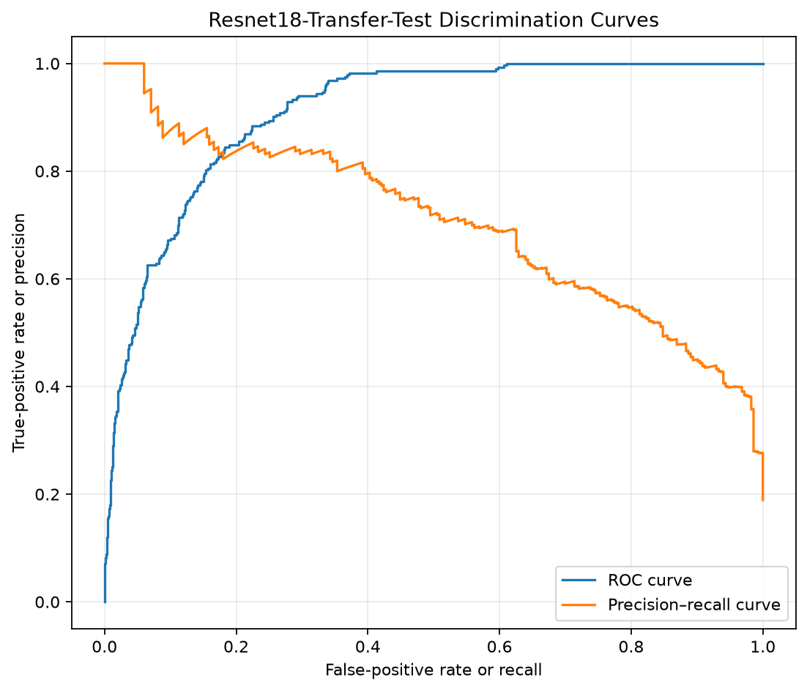{#fig-resnet18-test-discrimination-curves}

The ROC curve demonstrates strong separation between lesions requiring priority assessment and lower-priority cases over the full range of decision thresholds. Rather than relying on a single operating point, the model maintains favourable discrimination across progressively different sensitivity–specificity trade-offs, indicating that its ranking of predicted probabilities is robust.

The Precision–Recall curve provides a complementary assessment that is particularly informative in the presence of class imbalance. The curve remains consistently above the no-skill baseline throughout most of the recall range, indicating that increases in sensitivity are accompanied by comparatively moderate reductions in precision. This behaviour suggests that the model retains its ability to prioritise clinically relevant lesions without requiring an excessive number of false positive referrals.

Taken together, the ROC and Precision–Recall analyses confirm that the selected ResNet18 model exhibits strong discriminative performance independently of the operating threshold ultimately chosen for deployment. The following section therefore examines whether the predicted probabilities are also well calibrated before considering threshold-dependent classification performance.

### Calibration

Good discrimination alone is not sufficient for a probabilistic triage model. In addition to ranking lesions correctly, predicted probabilities should reflect the true likelihood of belonging to the priority class so that decision thresholds can be interpreted consistently across different operating scenarios.

The calibration performance of the selected ResNet18 model on the independent test set is shown in @fig-resnet18-test-calibration.

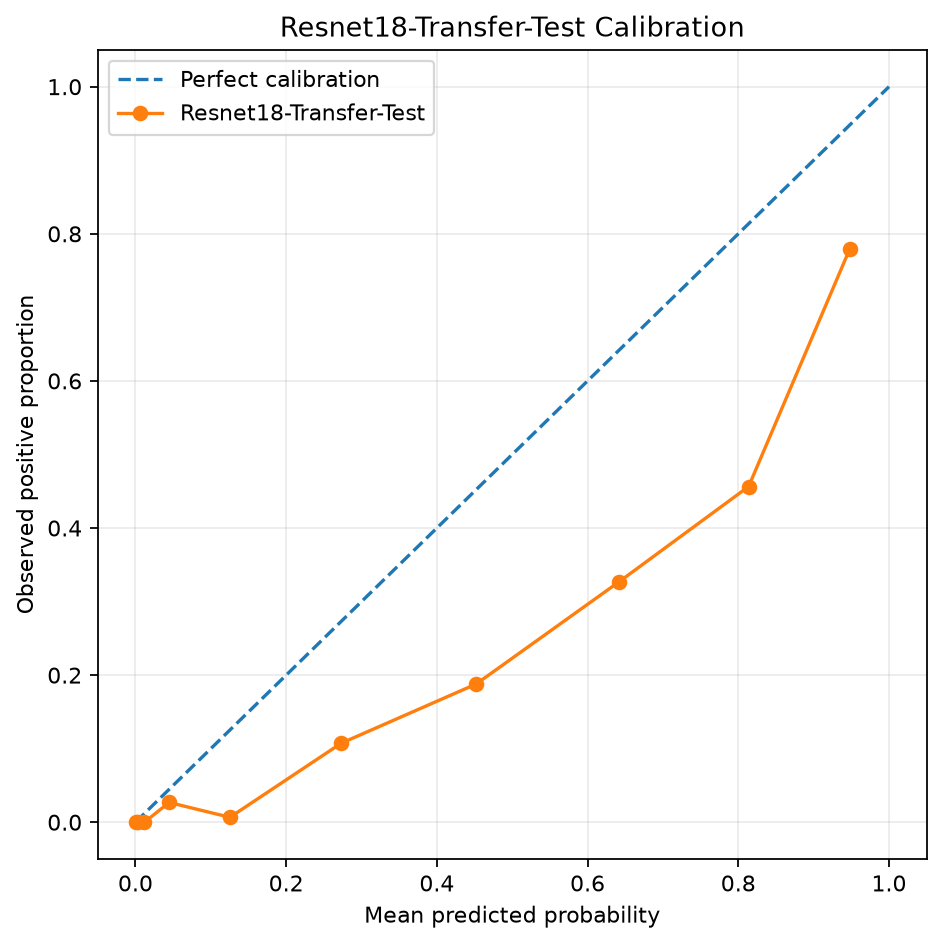{#fig-resnet18-test-calibration}

The calibration curve shows good overall agreement between predicted probabilities and the observed event frequencies across most of the probability range. Although minor deviations from the ideal calibration line are visible in some intervals, the model generally preserves the expected correspondence between predicted risk and empirical outcomes, indicating that the estimated probabilities remain informative rather than serving solely as relative ranking scores.

This behaviour is consistent with the favourable Brier score reported in the previous section and suggests that the model produces probability estimates that are sufficiently reliable for threshold-based clinical prioritisation. Well-calibrated predictions are particularly valuable in triage applications, where operating thresholds may be adjusted according to available clinical resources or the desired balance between missed priority cases and unnecessary referrals.

Having established that the predicted probabilities are both discriminative and reasonably well calibrated, the following section examines how the principal performance metrics evolve across alternative decision thresholds.

### Threshold Analysis

Although the previous sections evaluated discrimination independently of any particular operating point, practical deployment requires selecting a single decision threshold to distinguish lesions requiring priority assessment from lower-priority cases. Because this choice directly determines the balance between missed priority lesions and unnecessary referrals, threshold selection represents a clinically important component of the modelling process.

The behaviour of the principal classification metrics across alternative decision thresholds is illustrated in @fig-resnet18-test-threshold-tradeoffs.

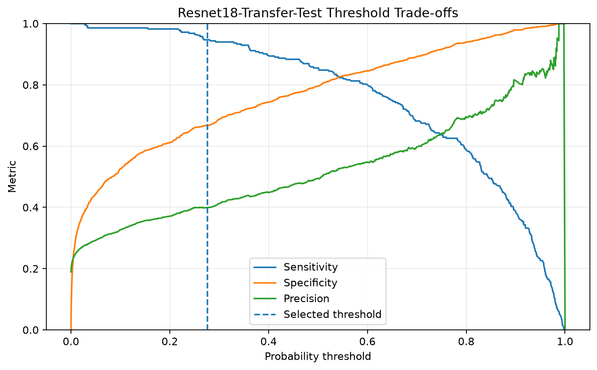{#fig-resnet18-test-threshold-tradeoffs}

As expected, increasing the decision threshold produces a gradual increase in precision and specificity, accompanied by a corresponding reduction in sensitivity. Conversely, lower thresholds maximise the detection of priority lesions at the expense of a larger number of false positive referrals. The selected operating threshold lies within a stable region of the performance curves, providing a balanced compromise between these competing objectives rather than representing an extreme operating point.

This behaviour is consistent with the intended role of the model as a triage tool. Missing clinically important lesions carries a substantially greater consequence than referring additional benign cases for further assessment. Consequently, the selected threshold favours maintaining high sensitivity while preserving a meaningful improvement in precision and specificity relative to the baseline convolutional network.

The threshold analysis therefore demonstrates that the reported test-set performance is not the result of an arbitrary operating point but reflects a principled trade-off derived from the validation procedure described earlier. The following section extends the evaluation from individual images to lesion-level predictions, where multiple images belonging to the same lesion are aggregated before classification.

### Bootstrap Confidence Intervals

Point estimates provide a convenient summary of model performance but do not convey the uncertainty associated with finite test samples. To quantify this uncertainty, confidence intervals for the principal evaluation metrics were estimated using bootstrap resampling of the independent test set, following the procedure described in the evaluation protocol.

The resulting bootstrap confidence intervals for the selected ResNet18 model are presented in @fig-resnet18-bootstrap-confidence-intervals.

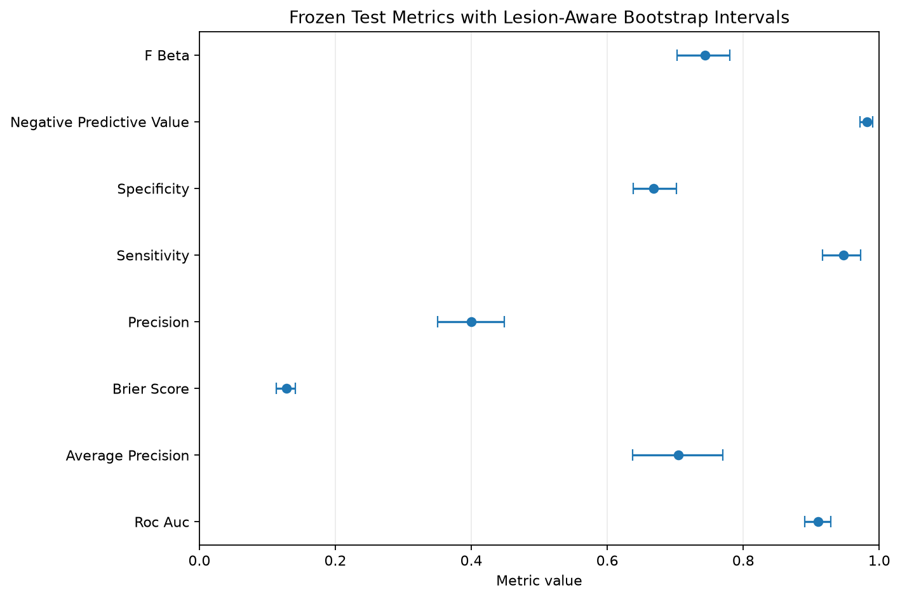{#fig-resnet18-bootstrap-confidence-intervals}

The bootstrap analysis indicates that the principal evaluation metrics remain stable across repeated resampled test sets. Although some variability is naturally observed, particularly for precision-based measures that depend on the relatively small number of priority lesions, the confidence intervals remain sufficiently narrow to support the overall conclusions drawn from the point estimates.

The relatively limited uncertainty associated with ROC AUC, Average Precision, and the remaining performance measures suggests that the observed predictive performance is not driven by a small number of atypical observations. Instead, the results appear to be representative of the underlying test population, providing additional confidence in the robustness of the selected model.

Having quantified the statistical uncertainty of the principal evaluation metrics, the following section examines whether model performance remains consistent across clinically relevant patient subgroups.

### Model Interpretability with Grad-CAM

While quantitative performance metrics provide evidence of predictive accuracy, they do not indicate which image characteristics contribute to the model's decisions. To improve the interpretability of the selected ResNet18 model, Gradient-weighted Class Activation Mapping (Grad-CAM) was applied to representative correctly classified test images.

The resulting activation maps are presented in @fig-grad-cam.

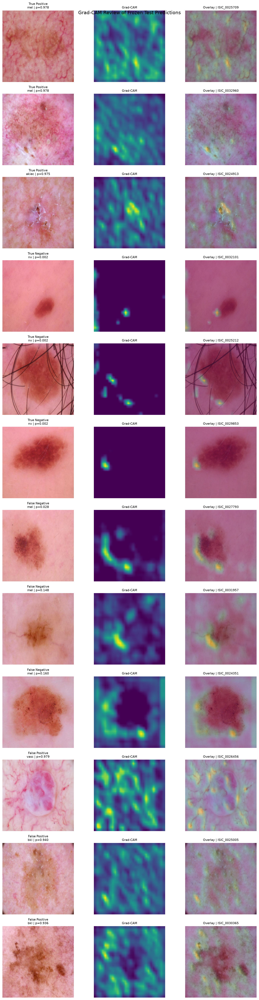{#fig-grad-cam}

The activation maps indicate that the model primarily focuses on the lesion itself rather than on surrounding skin or image background. Across the selected examples, the regions receiving the strongest attention generally coincide with clinically relevant structures, suggesting that the network bases its predictions on meaningful visual patterns instead of unrelated artefacts.

Although Grad-CAM does not provide a complete explanation of the model's internal decision process, it offers qualitative evidence that the learned representations are consistent with the visual information expected to support lesion assessment. This additional level of interpretability complements the quantitative evaluation presented in the previous sections and increases confidence that the model has learned features associated with the lesion rather than spurious characteristics of the images.

Additional examples of model predictions on representative test images are shown in @fig-qualitative-test-predictions.

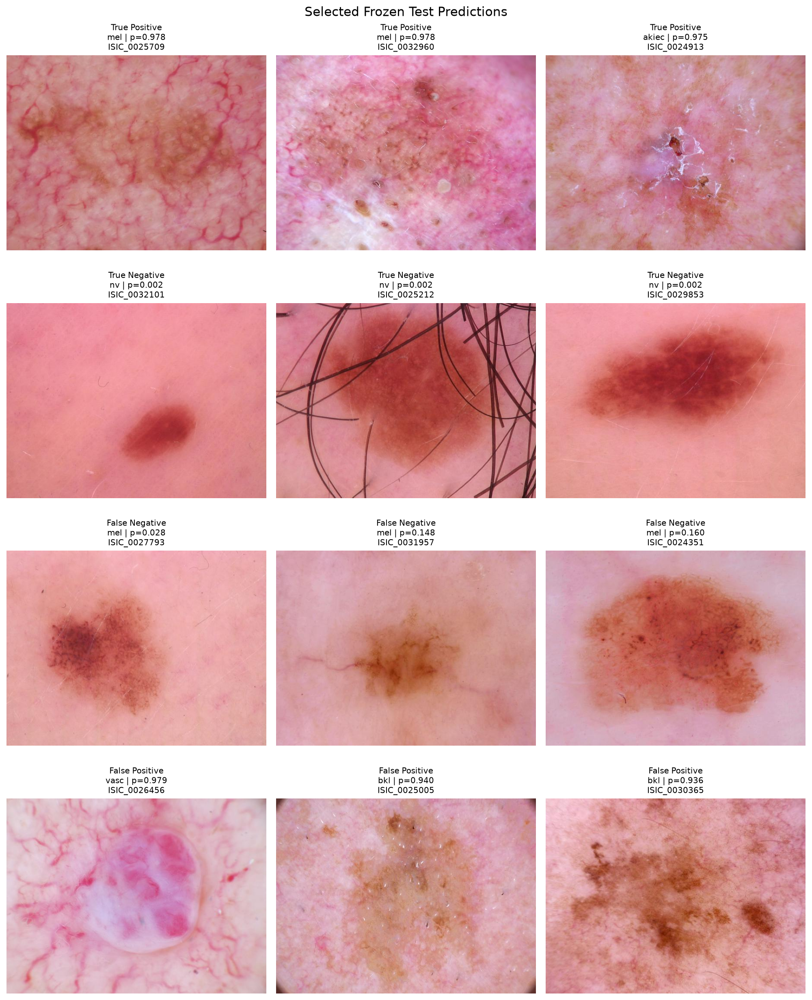{#fig-qualitative-test-predictions}

The qualitative examples illustrate the diversity of lesion appearances encountered in the test set and provide further context for interpreting the quantitative performance metrics. Correctly classified cases demonstrate the model's ability to identify visually distinct lesion patterns, while the examples also highlight the inherent variability of dermoscopic images encountered in clinical practice.

Collectively, the quantitative and qualitative analyses demonstrate that the transfer learning approach provides a robust solution for binary skin lesion triage within the scope of this study. Compared with the baseline convolutional network, the selected ResNet18 model consistently achieved stronger discrimination, improved probability calibration, and a more favourable balance between sensitivity and specificity while maintaining stable performance across the independent test set. The Grad-CAM visualisations further support these findings by indicating that the model primarily attends to clinically relevant regions of the lesion rather than to surrounding image artefacts, providing additional confidence that the learned representations reflect meaningful visual characteristics.

These findings should nevertheless be interpreted within the context of several limitations. The analysis was conducted exclusively using the HAM10000 dataset, which may not fully represent the diversity of patient populations, imaging devices, or clinical settings encountered in routine practice. In addition, the study focused on a binary prioritisation task rather than full multi-class lesion diagnosis, reflecting the intended role of the model as a decision-support tool for clinical triage rather than a replacement for expert assessment. Future work could therefore evaluate external datasets, investigate more recent deep learning architectures, and assess model performance under prospective clinical conditions. Despite these limitations, the results demonstrate a complete and reproducible workflow for developing, evaluating, and interpreting a deep learning model for skin lesion triage using established machine learning practices.

## Technical Appendix (Optional)

The main chapter focuses on the practical development and evaluation of a deep learning model for skin lesion triage. This appendix provides concise background on the principal concepts underlying the implementation. Rather than presenting a comprehensive treatment of deep learning, the objective is to explain the ideas that are most relevant for understanding the modelling decisions adopted throughout the project.

### Convolutional Neural Networks

Convolutional Neural Networks (CNNs) were developed specifically to address the limitations of fully connected neural networks when processing images. A conventional neural network treats every input variable independently, ignoring the spatial relationships between neighbouring pixels. As image resolution increases, this approach rapidly becomes computationally inefficient while failing to exploit the two-dimensional structure that characterises visual data.

CNNs overcome this limitation by learning small filters that are applied repeatedly across the image. Instead of assigning an independent parameter to every pixel, the same filter is shared over all spatial locations, allowing the network to recognise similar visual patterns regardless of where they appear. Early layers typically learn simple structures such as edges, colour transitions, and textures, while deeper layers progressively combine these elementary features into increasingly complex representations.

Mathematically, the output of a convolutional layer is obtained by sliding a learnable kernel across the input image and computing a weighted sum within each local neighbourhood:

$$
y_{i,j}^{(k)}
=
\sum_{u=1}^{m}
\sum_{v=1}^{n}
K_{u,v}^{(k)}
\,x_{i+u,\;j+v}
+b^{(k)}
$$ {#eq-convolution}

where $x$ denotes the input image, $K^{(k)}$ is the $k$-th convolutional kernel, $b^{(k)}$ is its associated bias term, and $y^{(k)}$ is the resulting feature map. Rather than operating on the entire image simultaneously, each kernel focuses on a small local region, enabling the network to detect meaningful visual structures while keeping the number of trainable parameters manageable.

Following each convolution, a nonlinear activation function introduces the capacity to model complex relationships that cannot be represented by purely linear operations. Pooling layers are then commonly used to reduce the spatial resolution of intermediate feature maps, increasing computational efficiency while making the learned representations more robust to small translations and local image variations.

Together, these operations allow convolutional networks to construct hierarchical representations of visual information. Low-level features extracted in the initial layers are progressively combined into higher-level patterns, enabling the network to distinguish between different lesion types based on increasingly abstract visual characteristics. This hierarchical feature extraction explains why CNNs have become the standard architecture for a wide range of computer vision tasks, including medical image analysis.

### Transfer Learning

Training a deep convolutional neural network from scratch typically requires very large annotated datasets. In many medical imaging applications, however, obtaining thousands of expertly labelled images is both expensive and time-consuming. Transfer learning addresses this limitation by reusing feature representations learned from a different, substantially larger dataset and adapting them to a new task.

The underlying assumption is that many low-level visual patterns, such as edges, textures, and simple geometric structures, are common across natural and medical images. Rather than learning these features again, a pre-trained network provides a strong starting point that can be refined using the available task-specific data. This generally leads to faster convergence, improved predictive performance, and a reduced risk of overfitting compared with training an equivalent architecture from random initialisation.

The implementation presented in this chapter uses ResNet18, a residual convolutional neural network originally trained on the ImageNet dataset. Beyond its relatively compact size, one of the defining characteristics of the ResNet family is the introduction of residual connections, which allow information to bypass one or more convolutional layers. Instead of learning a complete mapping directly, each residual block learns only the difference between its input and the desired output.

Formally, a residual block can be expressed as

$$
y = F(x) + x,
$$ {#eq-residual-block}

where $x$ represents the input to the block and $F(x)$ denotes the nonlinear transformation learned by the convolutional layers. The shortcut connection adds the original input directly to the transformed representation, allowing the network to preserve useful information while facilitating gradient propagation during optimisation.

Residual learning makes it possible to train substantially deeper networks than earlier convolutional architectures without suffering the severe degradation in optimisation performance that often accompanies increasing model depth. Although ResNet18 is one of the smaller members of the ResNet family, it offers an effective compromise between representational capacity and computational efficiency, making it well suited to moderate-sized datasets such as HAM10000.

In practice, transfer learning typically involves replacing the original classification layer with a task-specific output layer while retaining the pre-trained feature extractor. Depending on the amount of available data, either the entire network or only the final layers are subsequently fine-tuned using the new training dataset. In this project, this strategy enabled the model to adapt previously learned visual representations to the binary skin lesion triage task while requiring substantially fewer training examples than would be necessary for training a comparable architecture from scratch.

### Performance Evaluation for Binary Classification

Evaluating a binary classification model requires more than measuring the proportion of correctly classified observations. In applications such as skin lesion triage, the consequences of false negatives and false positives are not equivalent, making it important to assess different aspects of predictive performance rather than relying solely on overall accuracy.

For this reason, the evaluation presented in this chapter combines complementary metrics that characterise discrimination, probability estimation, and decision-making under a chosen classification threshold.

Measures such as sensitivity, specificity, precision, and the F-score describe model behaviour once a probability threshold has been selected. Sensitivity quantifies the proportion of clinically important lesions that are correctly identified, whereas specificity measures the ability to avoid unnecessary referrals among lower-priority cases. Precision reflects the proportion of predicted positive cases that are truly positive, while the F-score provides a single summary by balancing precision and recall according to the chosen weighting scheme.

Threshold-independent metrics offer a broader view of model performance. The Receiver Operating Characteristic (ROC) curve evaluates discrimination across all possible decision thresholds by comparing the true positive rate with the false positive rate. Its associated Area Under the Curve (ROC AUC) summarises the probability that the model assigns a higher score to a randomly selected positive case than to a randomly selected negative case.

When positive cases represent only a minority of the dataset, Precision–Recall curves often provide a more informative assessment because they focus exclusively on the trade-off between detecting clinically important lesions and limiting false alarms. For this reason, Average Precision (AP), defined as the area under the Precision–Recall curve, is frequently preferred when comparing models trained on imbalanced datasets.

Beyond discrimination, reliable probability estimates are equally important in clinical decision support. A model may correctly rank patients according to risk while still producing poorly calibrated probabilities. Calibration therefore evaluates the agreement between predicted probabilities and the observed frequency of positive outcomes. In this project, calibration quality is assessed visually using calibration curves and quantitatively through the Brier Score, which measures the mean squared difference between predicted probabilities and observed outcomes. Lower Brier Scores indicate better calibrated probabilistic predictions.

Finally, all reported performance measures are estimates derived from a finite test sample and are therefore subject to sampling variability. Bootstrap resampling provides a practical approach for quantifying this uncertainty by repeatedly sampling the test data with replacement and recalculating the evaluation metrics. The resulting confidence intervals offer additional context for interpreting model performance beyond single point estimates.

### Gradient-weighted Class Activation Mapping (Grad-CAM)

Deep learning models are often criticised for behaving as "black boxes", producing highly accurate predictions while offering limited insight into the reasoning behind their decisions. In medical imaging, where model outputs may influence clinical judgement, understanding which image regions contribute to a prediction is an important component of model evaluation.

Gradient-weighted Class Activation Mapping (Grad-CAM) is a post-hoc interpretability technique that provides a visual explanation of a convolutional neural network's predictions. Rather than modifying the trained model, Grad-CAM analyses the gradients associated with a target class to estimate the relative importance of each feature map in the final convolutional layer. These importance weights are then combined to produce a coarse localisation map highlighting the image regions that contributed most strongly to the prediction.

The Grad-CAM heatmap is obtained by computing a weighted combination of the feature maps generated by the final convolutional layer,

$$
L_{\text{Grad-CAM}}^c
=
\mathrm{ReLU}
\left(
\sum_k
\alpha_k^c
A^k
\right),
$$ {#eq-gradcam}

where $A^k$ denotes the $k$-th feature map, $\alpha_k^c$ represents its importance for class $c$, and the ReLU operation retains only the features that contribute positively to the selected prediction. The resulting activation map is subsequently resized and superimposed on the original image to provide a visual interpretation of the model's attention.

Although Grad-CAM does not explain the complete decision-making process of a neural network, it offers a practical mechanism for assessing whether the model focuses on clinically plausible image regions. Heatmaps concentrated on the lesion itself increase confidence that the prediction is supported by relevant visual characteristics, whereas strong activation outside the lesion may indicate that the model has learned undesirable correlations or image artefacts.

For this reason, Grad-CAM should be regarded as a complementary validation tool rather than as definitive evidence of model reasoning. It helps identify potential failure modes, supports qualitative model assessment, and facilitates communication between technical developers and clinical experts, but it cannot by itself establish that the network has learned medically meaningful features.