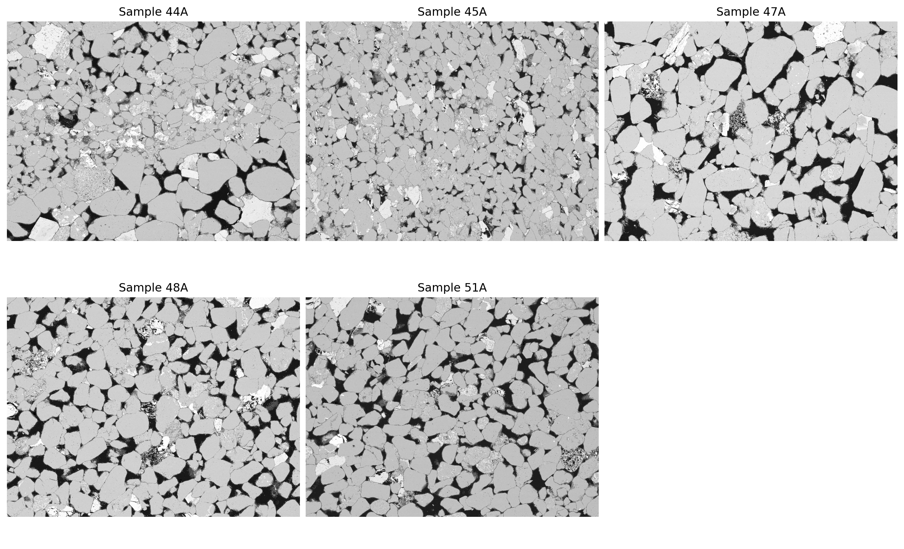
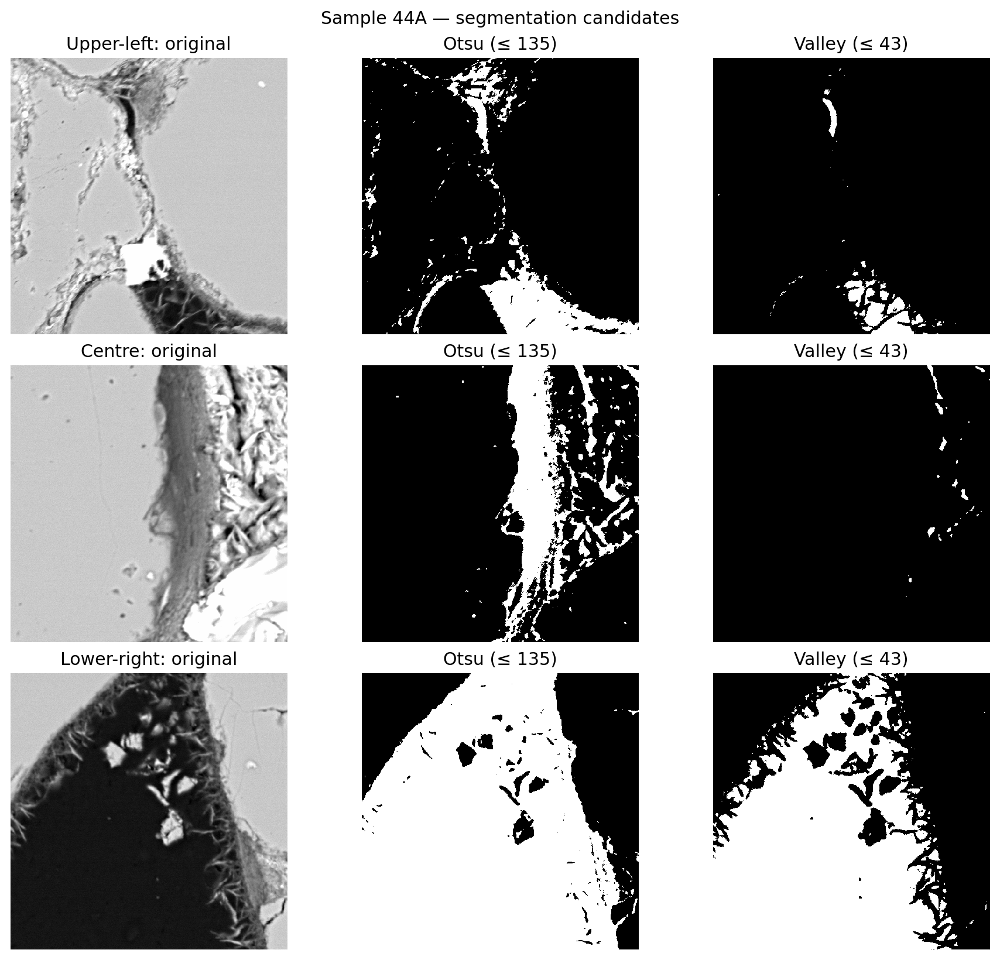
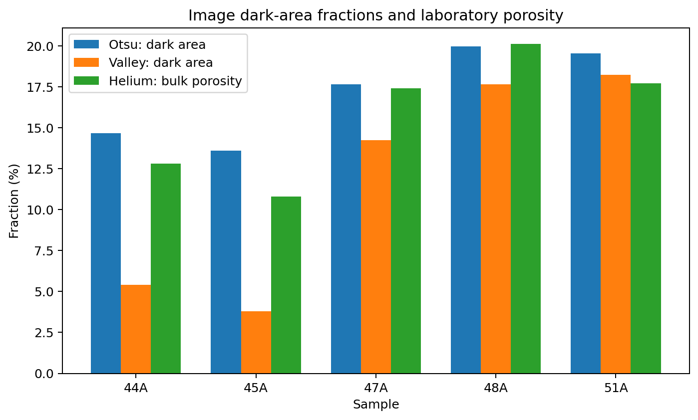
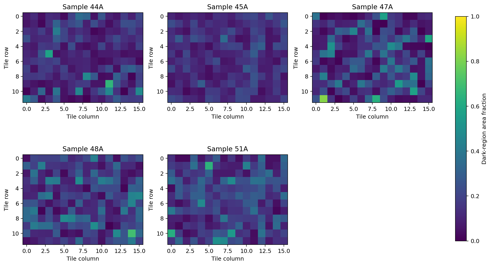
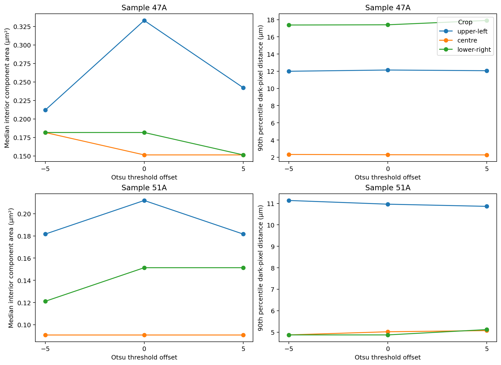
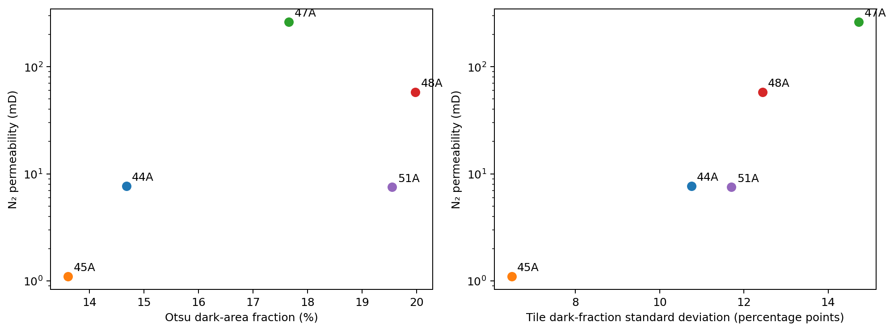

# Pore Structure Characterization from Sandstone SEM Images

This project uses classical computer vision to examine the geometry and spatial distribution of dark regions in scanning electron microscopy (SEM) images of sandstone. Five samples from the Leman Sandstone dataset are analysed using intensity-based segmentation, connected-component measurements, distance transforms, and spatial statistics. The image-derived descriptors are then compared with laboratory porosity and permeability measurements, with particular attention to what can and cannot be inferred from two-dimensional images.

## Problem Definition

The pore structure of a rock influences how fluids are stored and transported through it. Porosity describes the fraction of the rock volume occupied by void space, but it does not fully describe the geometry of that space or the connections between pores. Two rocks with similar porosity may therefore exhibit substantially different permeability. Understanding these differences requires information about the spatial arrangement of the rock's internal structures, beyond a single bulk measurement.

Scanning electron microscopy provides a detailed view of mineral grains, grain boundaries, fractures, and regions that may correspond to pores. These images contain useful geometric information, although converting image intensity into a physical description of pore space is not straightforward. Dark regions may include pores, but they can also represent low-contrast minerals or other features of the specimen and imaging process. The first challenge is therefore to define a reproducible segmentation procedure without assuming that every dark pixel identifies a pore.

The question addressed in this project is how the geometry and spatial distribution of intensity-defined dark regions vary among sandstone samples with different petrophysical properties. The analysis also examines whether these image descriptors offer useful context for samples with similar measured porosity but markedly different permeability. The purpose is characterisation and comparison, rather than permeability prediction or reconstruction of a three-dimensional pore network.

## Modeling Approach

The analysis follows a classical image-processing workflow. Grayscale intensities are examined first, followed by binary segmentation and measurements of the resulting regions. The original image resolution is retained for quantitative calculations. This is important because downsampling could remove small structures or alter their apparent geometry.

### Intensity-Based Segmentation

Backscattered-electron SEM images contain variations in grayscale intensity associated with differences in material and imaging response. In the images considered here, the histograms contain a relatively small low-intensity population and a dominant higher-intensity population. These distributions motivate an initial segmentation of dark regions, but do not establish their geological identity.

Two global thresholding procedures are compared. Otsu's method selects a threshold by maximising the variance between the two intensity classes. A second procedure locates a minimum between the dark and bright peaks of a smoothed histogram. Both thresholds are estimated separately for each image, since the intensity distributions differ among samples. The valley procedure uses predefined peak-search intervals chosen after inspection of this dataset; it is included as a methodological comparison rather than a universal segmentation rule.

For an image with $N$ pixels and threshold $t$, the dark-area fraction is defined as

$$
A_d(t) = \frac{1}{N}\sum_{i=1}^{N}\mathbb{1}(I_i \leq t),
$$ {#eq-dark-area-fraction}

where $I_i$ is the grayscale intensity of pixel $i$ and $\mathbb{1}(\cdot)$ is the indicator function. This quantity is an image-derived area fraction. It is not assumed to be equal to the porosity measured on the rock plug.

Otsu's method is retained as the reference segmentation for the subsequent analysis because it is automatic and reproducible. The alternative threshold and small perturbations of the selected thresholds are used to assess how strongly the measurements depend on this choice. The resulting binary masks are described throughout the project as *dark-region masks*, rather than confirmed pore-space labels.

### Morphological and Spatial Descriptors

The segmented images are examined at two complementary scales. At the local scale, connected-component labelling identifies contiguous dark regions in selected image crops. An eight-neighbour connectivity rule is used, allowing diagonal adjacency. Component area is calculated from the pixel count and the physical pixel dimensions. Components intersecting a crop boundary are excluded from the area summaries because their full extent cannot be observed within that crop. Consequently, these statistics describe fully contained binary components, not an unbiased distribution of all pore sizes.

A Euclidean distance transform provides another description of local geometry. For each dark pixel, it measures the distance to the nearest background pixel in the binary mask. The 90th percentile of these distances is used to characterise the extent of dark regions within each crop. This is a pixel-weighted distance statistic, not a measurement of individual pore radii or pore-throat dimensions. A background border is added around each crop for the calculation, making the treatment of crop boundaries explicit.

At the image scale, the full field of view is divided into equal-sized tiles. The fraction of dark pixels is calculated within each tile, and its standard deviation describes how unevenly dark regions are distributed across the image. These tile statistics provide a spatial complement to the global dark-area fraction. They do not measure the hydraulic connectivity of pore space.

## Methodology and Implementation

### Dataset and Image Inspection

The study uses five images from *Leman Sandstone SEM Images*, published through the Digital Rocks Portal and identified as DRP-307 @scott2020leman. The images correspond to samples 44A, 45A, 47A, 48A, and 51A. The dataset also provides laboratory helium porosity, nitrogen permeability, and formation resistivity factor measurements for each sample.

All five files are eight-bit grayscale PNG images with dimensions of 16,384 × 12,288 pixels. Their stated pixel spacing is 0.174 µm in both directions, corresponding to a field of view of approximately 2.85 × 2.14 mm. This common resolution permits the use of the same physical units and tile dimensions across samples. @fig-sem-samples presents reduced previews of the five original images; the previews are used only for visual inspection.

{#fig-sem-samples}

Because each original image contains more than 200 million pixels, processing is organised sequentially to limit memory use. Full-resolution intensity histograms are calculated directly from the original images, without retaining all five arrays in memory. Image previews are reduced only for display. The metadata, intermediate measurements, figures, and tables are generated by the accompanying Python notebook.

### Segmentation and Assessment

Initial inspection of the intensity histograms and native-resolution crops did not indicate a clear need for denoising or contrast enhancement. The images are therefore segmented using their original grayscale values, avoiding changes to fine boundaries before threshold selection.

Otsu and histogram-valley thresholds are calculated from each image's full-resolution histogram. Their masks are compared on three native-resolution crops per sample, centred at fixed relative positions in the image. @fig-segmentation-44a shows the original crops and the two segmentation candidates for sample 44A. In this example, Otsu includes substantially more intermediate-intensity material than the more restrictive valley threshold.

{#fig-segmentation-44a}

The fraction of dark pixels is calculated from the full-image histograms for both methods, without constructing additional full-resolution masks. The laboratory helium porosity is included as an external point of comparison, not as a target for threshold calibration. Sensitivity is evaluated by changing each threshold by five grayscale levels in either direction. This establishes whether modest changes in the threshold materially affect the segmented area, while leaving the question of physical classification unresolved.

### Local Morphology and Image-Scale Heterogeneity

For each sample, three crops of 1024 × 1024 pixels are selected at the same relative locations used for segmentation inspection. Connected-component areas and distance-transform statistics are computed on the corresponding Otsu masks. The measurements are repeated at Otsu −5 and Otsu +5 to evaluate the sensitivity of the morphological descriptors themselves, rather than relying only on the stability of the segmented fraction.

The complete images are also divided into non-overlapping 1024 × 1024-pixel tiles. At the stated resolution, each tile covers approximately 178 × 178 µm. Dark-area fraction is measured for every tile, producing a 12 × 16 spatial map for each image. These measurements describe the distribution of segmented regions over the full field of view, while the more detailed component and distance measurements remain local to the three selected crops.

The implementation uses NumPy and pandas for numerical analysis, Pillow for image reading, SciPy for connected-component labelling and distance transforms, and Matplotlib for visualisation. No machine-learning model is trained. The emphasis is on interpretable image measurements and explicit evaluation of their limitations.

::: {.content-visible when-format="html"}

The complete implementation, including the Python code, figures, and numerical results, is available in the accompanying Jupyter notebook <a href="../notebooks-and-scripts/1-applied-data-science/9-pore-structure-characterization/python/1-pore-structure-characterization.html" target="_blank" title="View Jupyter notebook"><i class="bi bi-file-earmark-code"></i></a>.

:::

::: {.content-visible when-format="pdf"}

The complete implementation, including the Python code, figures, and numerical results, is available in the project repository \href{https://github.com/rodrigokang/portfolio/tree/main/notebooks-and-scripts/1-applied-data-science/9-pore-structure-characterization/python}{\faGithub}.

:::

## Results, Discussion, and Limitations

### Segmentation Results

The two thresholding procedures produce notably different dark-area fractions, particularly for samples 44A and 45A. For these samples, Otsu identifies 14.68% and 13.61% of the image area as dark, compared with 5.41% and 3.79% using the valley method. The differences are smaller for the remaining samples. This indicates that the estimated dark-area fraction depends on how the boundary between the low- and intermediate-intensity populations is defined.

@fig-porosity-comparison compares both image-derived measurements with laboratory helium porosity. The Otsu fractions are numerically close to the bulk measurements for samples 47A and 48A, while larger differences appear for 44A, 45A, and 51A. The apparent agreement in some samples is not evidence that Otsu has accurately segmented their pores. Helium porosity is a volume measurement on a core plug; the image analysis measures the fraction of pixels classified as dark in a particular two-dimensional section. The two measurements also differ in spatial support and in the structures they can resolve.

{#fig-porosity-comparison}

Small changes of ±5 intensity levels produce gradual changes in the full-image dark-area fraction. Nevertheless, relative stability in area does not guarantee stability in component geometry: joining or separating a narrow connection can alter connected-component measurements without producing a large change in total area. This distinction motivates the additional morphological sensitivity analysis described below.

### Spatial Distribution and Morphology

The tile-level maps in @fig-spatial-heterogeneity show considerable variation within individual images. Samples 44A and 45A have relatively low global dark-area fractions, while 47A, 48A, and 51A contain more pronounced concentrations of dark regions. These concentrations are not spatially uniform. Some tiles have substantially higher dark-area fractions than neighbouring tiles, indicating that a single sample-level percentage conceals local differences.

{#fig-spatial-heterogeneity}

@tbl-sample-comparison summarises the principal laboratory measurements and image descriptors. The standard deviation of tile dark-area fractions is expressed in percentage points. Among these five images, sample 47A has the highest spatial standard deviation, at 14.73 percentage points, followed by 48A at 12.44 and 51A at 11.70. These values reflect variation across the selected tile size; they are not direct measures of pore connectivity.

| Sample | He porosity (%) | N₂ permeability (mD) | Otsu dark area (%) | Tile SD (pp) |
|:------:|----------------:|---------------------:|-------------------:|-------------:|
| 44A    | 12.8            | 7.7                  | 14.68              | 10.75        |
| 45A    | 10.8            | 1.1                  | 13.61              | 6.49         |
| 47A    | 17.4            | 263.0                | 17.65              | 14.73        |
| 48A    | 20.1            | 58.0                 | 19.97              | 12.44        |
| 51A    | 17.7            | 7.5                  | 19.55              | 11.70        |

: Laboratory measurements and image-derived descriptors for the five sandstone samples. Tile SD is the standard deviation of Otsu dark-area fractions over the 1024 × 1024-pixel tiles, in percentage points. {#tbl-sample-comparison}

The local morphological measurements provide a different perspective. Connected-component areas describe the sizes of fully contained binary objects, whereas distance-transform statistics describe how far dark pixels lie from their segmented boundaries. Because only three crops are examined per sample, these measurements should not be interpreted as exhaustive descriptions of the full rock section.

The sensitivity analysis in @fig-morphology-sensitivity focuses on 47A and 51A. Across Otsu ±5, the 90th percentile of dark-pixel distance changes relatively little within most of the selected crops. The median area of fully contained components is less consistent, with some crops showing noticeable changes that are not necessarily monotonic. This is expected when threshold variations change the membership or connectivity of small binary regions. The stability assessment therefore supports cautious use of the distance statistics while discouraging strong conclusions based on small differences in median component area.

{#fig-morphology-sensitivity}

### Comparison with Petrophysical Properties

@fig-petrophysical-comparison places the image-level dark-area fraction and tile-level standard deviation alongside nitrogen permeability. The five samples span a wide permeability range, and neither image descriptor provides a simple ordering that matches permeability across all specimens. In particular, 48A has the highest helium porosity and a larger dark-area fraction than 47A, yet its measured permeability is considerably lower. These observations argue against treating the image dark-area fraction as a direct permeability surrogate.

{#fig-petrophysical-comparison}

Samples 47A and 51A provide a useful comparison. Their measured helium porosities are 17.4% and 17.7%, respectively, but their nitrogen permeabilities are 263 and 7.5 mD. The permeability of 47A is therefore approximately 35 times that of 51A, despite its slightly lower porosity. Their Otsu dark-area fractions are 17.65% and 19.55%, while their tile-level standard deviations are 14.73 and 11.70 percentage points. The images thus differ in the spatial distribution of dark regions even though their bulk porosities are similar.

Local morphology is also heterogeneous. For example, the lower-right crop of 47A has a 90th-percentile dark-pixel distance of 17.40 µm, compared with 4.87 µm for the corresponding crop of 51A. The relation reverses in the central crops, where the values are 2.29 and 5.02 µm. These contrasting measurements show why individual crops cannot be used to rank the overall pore structure of the two samples. They do, however, demonstrate that similar bulk porosity does not imply identical image geometry at the locations examined.

The analysis cannot determine whether these differences account for the observed permeability contrast. Permeability depends strongly on connected flow paths and constrictions within a three-dimensional medium, whereas the present descriptors are obtained from isolated two-dimensional sections. The comparison is therefore descriptive, not a causal explanation or a validated predictive relationship.

### Limitations

The principal uncertainty concerns segmentation. The binary class is defined by grayscale intensity and has not been independently verified against pore labels. Dark regions can contain more than one physical phase, while small pores may remain unresolved or may not be separated from the surrounding material by the selected threshold. The difference between Otsu and histogram-valley masks illustrates the extent to which measurements can depend on this definition.

A second limitation is spatial representativeness. Each image covers only one section of a rock plug, and local morphological measurements are based on three fixed crops. Excluding boundary-touching components avoids assigning artificially truncated areas to those objects, but it also favours components that fit entirely inside a crop. The added background boundary in the distance transform similarly imposes a computational edge on the measured geometry. Neither procedure yields an unbiased three-dimensional pore-size distribution.

The tile analysis describes variability at a chosen spatial scale. A different tile size could produce different standard deviations and spatial patterns. Furthermore, connected components in a two-dimensional mask do not establish the connectivity of the rock's pore network in three dimensions, nor do they identify which paths contribute to fluid flow.

Finally, the dataset contains only five samples, with one SEM image analysed for each. The results are suitable for a focused comparison but do not support statistical generalisation, permeability prediction, or claims about the geological causes of the observed differences. Additional imaging modalities, independently verified pore labels, or three-dimensional measurements would be needed to address those questions.

### Conclusions

The study provides a reproducible workflow for extracting quantitative descriptors from high-resolution sandstone SEM images using classical computer vision. Full-resolution intensity analysis supports image-specific thresholding, while connected-component measurements, distance transforms, and spatial tiling describe complementary aspects of the segmented dark regions.

The results show that dark-area fraction alone does not capture the variation in local geometry or spatial organisation observed across these five images. The comparison between samples 47A and 51A is particularly informative: similar laboratory porosity coexists with markedly different permeability and distinct image-level spatial patterns. These findings support the usefulness of image descriptors as complementary observations, while also illustrating why two-dimensional intensity segmentation cannot substitute for a validated three-dimensional characterisation of pore space.

Within these limits, the project demonstrates how relatively simple image-processing methods can be used to produce interpretable measurements from large scientific images without introducing a predictive model that the available data cannot support.

## Further Reading

::: {.content-visible when-format="html"}

For readers interested in the theoretical foundations of the image analysis methods used in this project, the accompanying technical notes on **Image Processing** cover binary image analysis, connected-component labeling, and distance transforms <a href="../technical-notes/data-science/image-processing/notes.pdf" download><i class="bi bi-file-earmark-pdf"></i></a>.

The notes on **Image Formation** provide further background on image representation, spatial sampling, and the limitations involved in recovering information about a three-dimensional scene from two-dimensional measurements <a href="../technical-notes/data-science/image-formation/notes.pdf" download><i class="bi bi-file-earmark-pdf"></i></a>.

:::

::: {.content-visible when-format="pdf"}

For readers interested in the theoretical foundations of the image analysis methods used in this project, the accompanying technical notes on **Image Processing** cover binary image analysis, connected-component labeling, and distance transforms \href{https://raw.githubusercontent.com/rodrigokang/portfolio/main/technical-notes/data-science/image-processing/notes.pdf}{\faFilePdf}.

The notes on **Image Formation** provide further background on image representation, spatial sampling, and the limitations involved in recovering information about a three-dimensional scene from two-dimensional measurements \href{https://raw.githubusercontent.com/rodrigokang/portfolio/main/technical-notes/data-science/image-formation/notes.pdf}{\faFilePdf}.

:::
