# Credit Card Fraud Detection

Every credit card transaction generates a simple decision: approve it or block it. Most of the time the answer is obvious. The difficulty lies in the small fraction of transactions that appear legitimate but are actually fraudulent. In large payment systems, these events are rare, costly, and constantly changing, creating a learning problem that differs substantially from many conventional classification tasks.

This project uses a publicly available European credit card transaction dataset containing highly anonymized transaction records. The analysis combines unsupervised learning techniques to explore the structure of fraudulent activity with a supervised benchmarking framework designed to evaluate the predictive performance of several classification algorithms.

## Problem Definition

The central difficulty in credit card fraud detection is severe class imbalance. Fraudulent transactions represent only a tiny fraction of overall activity, meaning that a model can achieve high accuracy while failing to identify most fraud cases @dal2015calibrating.

This imbalance creates an unavoidable trade-off. Missing a fraudulent transaction may result in direct financial losses, while incorrectly flagging a legitimate transaction may interrupt a customer purchase and generate unnecessary friction. Effective fraud detection therefore requires more than maximizing a single performance metric. The objective is to identify as many fraudulent transactions as possible while maintaining an acceptable level of false alarms @baesens2015fraud @dal2017credit.

Most machine learning studies approach this problem through supervised classification, using historical examples of fraudulent and legitimate transactions to train predictive models. This approach has produced substantial improvements over traditional rule-based systems and remains the foundation of modern fraud analytics @ngai2011application @al2021financial.

A less explored question is whether fraudulent transactions exhibit recognizable structures before any classification model is trained. If fraud is not a single behavior but a collection of different behaviors, clustering techniques may reveal groups of transactions that share common characteristics. Such patterns could provide additional insight into how fraudulent activity is organized within the feature space and help explain why certain classification models perform better than others @carcillo2021combining.

The project therefore investigates the problem from two complementary perspectives. First, clustering methods are used to explore whether fraudulent transactions form identifiable groups within the feature space. Second, a supervised benchmarking study compares several machine learning algorithms under a common evaluation framework. The objective is not only to determine which models achieve the strongest predictive performance, but also to better understand the structure of fraudulent behavior in a highly imbalanced transaction dataset.

## Modeling Approach

The analysis combines unsupervised and supervised learning techniques to examine credit card fraud from two complementary perspectives. The first investigates whether fraudulent transactions exhibit identifiable structure within the feature space. The second evaluates the extent to which that structure can be exploited for predictive purposes.

The unsupervised stage applies clustering algorithms to the transaction data in order to explore the distribution of fraudulent and legitimate transactions. K-Means, Agglomerative Clustering, and DBSCAN are used because they represent different notions of similarity and cluster formation. K-Means partitions observations around centroids, Agglomerative Clustering builds nested groups through successive merges, and DBSCAN identifies groups based on local density while explicitly accounting for noise points. Together, these methods allow the analysis to examine whether fraudulent transactions form concentrated groups, distinct fraud profiles, or isolated anomalies.

The supervised stage is formulated as a benchmarking study. Rather than focusing on a single predictive model, the project compares a diverse set of classification algorithms representing different modeling philosophies. The benchmark includes Logistic Regression, Naive Bayes, Linear and Quadratic Discriminant Analysis, K-Nearest Neighbors, Linear Support Vector Machines, Decision Trees, Random Forests, and XGBoost. To examine the impact of class imbalance, the models are evaluated under three training strategies: the original transaction distribution, random undersampling, and the Synthetic Minority Oversampling Technique (SMOTE).

Because fraudulent transactions represent only a small fraction of the observations, model evaluation focuses on metrics that remain informative under severe class imbalance. Particular attention is given to precision, recall, F1-score, ROC-AUC, Precision-Recall AUC, and the Kolmogorov-Smirnov statistic. Stratified cross-validation is used throughout the benchmark to ensure consistent comparisons across models.

The underlying assumption of the project is that fraudulent transactions leave detectable signatures in the available features. If such signatures exist, clustering methods should reveal some degree of structure within the transaction space, while supervised learning algorithms should be able to exploit that structure for predictive purposes. Examining both perspectives provides a more complete view of fraud behavior than either approach in isolation.

## Methodology and Implementation

The analysis begins with an unsupervised exploration of the feature space to determine whether fraudulent transactions exhibit identifiable structure without using the target labels. Clustering algorithms are used to examine the distribution of transactions and to assess whether fraud tends to concentrate in specific regions of the data.

The second stage introduces the transaction labels and evaluates a range of supervised learning algorithms within a common benchmarking framework. Together, these two perspectives provide a broader understanding of the problem, combining exploratory analysis with predictive modeling.

### Unsupervised Learning Methodology

The unsupervised learning stage investigates whether fraudulent transactions exhibit identifiable structure in the feature space without using the target labels during model construction. If fraudulent transactions tend to concentrate in specific regions of the transformed feature space, clustering algorithms should be able to reveal these patterns.

The analysis begins with an exploratory examination of the dataset. Particular attention is given to the severe class imbalance that characterizes the fraud detection problem.

The class distribution is summarized below.

| Class        | Transactions  | Percentage (%)  |
| :----------: | :-----------: | :-------------: |
| Legitimate   |      284,315  |         99.827  |
| Fraudulent   |          492  |          0.173  |

: Class distribution in the credit card transaction dataset. {#tbl-target-summary}

@fig-class-distribution illustrates the extreme imbalance between legitimate and fraudulent transactions. Fraudulent transactions represent less than one percent of all observations, making fraud detection a highly imbalanced classification problem.

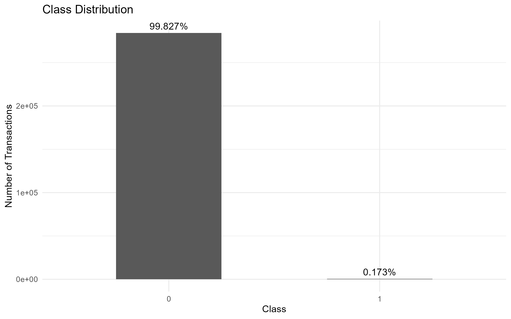{#fig-class-distribution}

Transaction amounts were also examined to characterize the range and concentration of transaction values.

|   Statistic    |     Value  |
| :------------: | :--------: |
| Minimum        |      0.00  |
| 1st Quartile   |      5.60  |
| Median         |     22.00  |
| Mean           |     88.35  |
| 3rd Quartile   |     77.17  |
| Maximum        | 25,691.16  |

: Summary statistics for transaction amounts. {#tbl-transaction-amount-summary}

The distribution of transaction amounts is highly right-skewed, with most transactions concentrated at relatively small values and a small number of extreme observations. This behavior can be observed in @fig-transaction-amount-distribution.

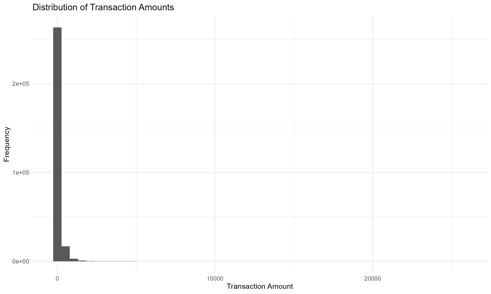{#fig-transaction-amount-distribution}

Transaction amounts were further compared across classes. Although fraudulent and legitimate transactions overlap substantially, @fig-transaction-amount-by-class suggests differences in the distribution of transaction values between the two groups.

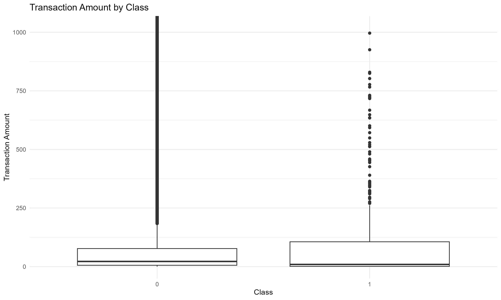{#fig-transaction-amount-by-class}

The variables V1–V28 correspond to principal components obtained through a prior anonymization process. Selected features were visualized to examine differences between fraudulent and legitimate transactions. Several variables exhibit noticeable shifts between classes, suggesting that fraudulent transactions occupy distinct regions of the transformed feature space.

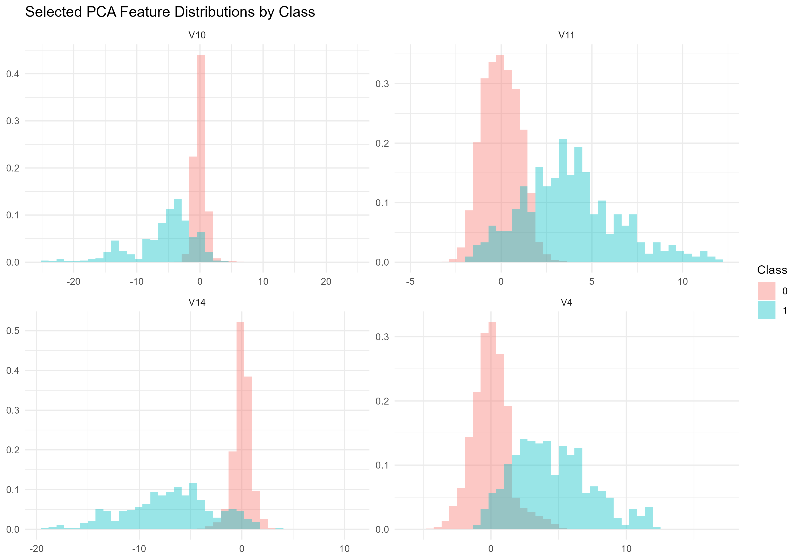{#fig-selected-pca-features}

To complement the univariate analysis, a correlation matrix was computed using all available variables.

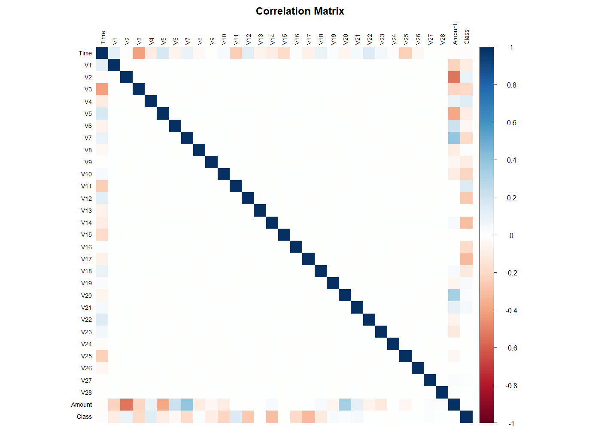{#fig-correlation-matrix}

Following the exploratory analysis, the target variable was separated from the predictors and the Time variable was removed. The data was then partitioned into training and test sets using stratified sampling to preserve the original class distribution. Feature scaling was applied after the train-test split, with scaling parameters estimated exclusively from the training data.

Because the training set contains more than two hundred thousand observations, a stratified sample was extracted from the training data for the clustering analysis. The sample preserves the original fraud rate while reducing computational requirements and allowing a consistent comparison across clustering algorithms.

Three clustering approaches were evaluated:

* K-Means Clustering
* Agglomerative Clustering
* DBSCAN

For K-Means, multiple values of (k) were explored. The elbow method was evaluated using the within-cluster sum of squares (inertia).

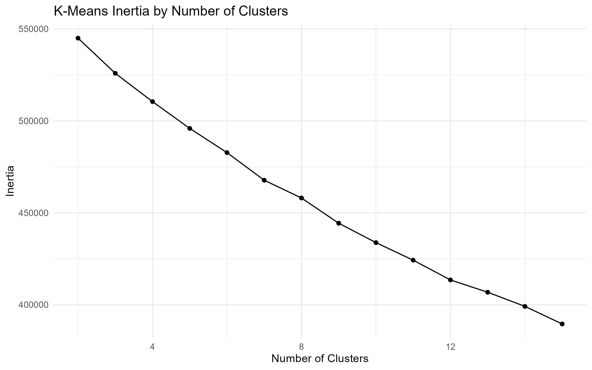{#fig-kmeans-inertia}

The elbow plot does not reveal a clear point at which additional clusters provide diminishing returns. As a result, the number of clusters cannot be determined reliably using inertia alone. Additional validation metrics were evaluated and used as complementary diagnostic tools. Since no single criterion produced a definitive solution, the final choice was guided by interpretability and fraud concentration within the resulting clusters.

A three-cluster solution was retained because it revealed the strongest concentration of fraudulent transactions while remaining straightforward to interpret.

The composition of the resulting clusters was then examined by comparing cluster-level fraud rates against the baseline fraud rate observed in the clustering sample.

| Method                   | Key Finding                                                                                              |
| ------------------------ | -------------------------------------------------------------------------------------------------------- |
| K-Means                  | One cluster exhibited a fraud rate approximately 21 times higher than the baseline fraud rate.           |
| Agglomerative Clustering | A small cluster exhibited a fraud rate approximately 490 times higher than the baseline fraud rate.      |
| DBSCAN                   | Fraudulent transactions were primarily identified as noise points rather than members of dense clusters. |

: Summary of the main findings obtained from the clustering algorithms. {#tbl-clustering-summary}

The clustering results provide complementary perspectives on the structure of fraudulent transactions. K-Means identified a relatively large region characterized by elevated fraud concentration, while Agglomerative Clustering isolated a much smaller cluster with an exceptionally high fraud rate. In contrast, DBSCAN classified fraudulent transactions primarily as noise, suggesting that some fraud patterns behave as isolated anomalies rather than members of dense groups.

Taken together, these results indicate that fraudulent transactions are not uniformly distributed across the feature space. Although the exact structure varies across clustering algorithms, all three methods reveal behavior that differs substantially from the baseline distribution of legitimate transactions.

These findings provide preliminary evidence that fraudulent transactions leave detectable signatures in the available feature space and motivate the supervised learning stage of the analysis.

::: {.content-visible when-format="html"}

Additional implementation details are available in the companion Quarto notebook [here](../notebooks-and-scripts/2-retail-analytics/1-credit-card-fraud-detection-ml-benchmark/r/1-credit-card-fraud-detection-unsupervised.html). A companion Python implementation is also available [here](../notebooks-and-scripts/2-retail-analytics/1-credit-card-fraud-detection-ml-benchmark/python/1-credit-card-fraud-detection-unsupervised.html).

:::

::: {.content-visible when-format="pdf"}

Additional implementation details, including the companion Quarto and Python notebooks, are available in the project repository \href{https://github.com/rodrigokang/portfolio/tree/main/notebooks-and-scripts/2-retail-analytics/1-credit-card-fraud-detection-ml-benchmark}{\faGithub}

:::

## Supervised Learning Benchmark

The supervised stage uses the transaction labels to evaluate how well different classification models can identify fraudulent transactions. The purpose is not to find a model that looks good under a single metric, but to compare modelling choices under conditions that resemble the operational reality of fraud detection: the positive class is rare, the cost of missed fraud is not the same as the cost of a false alarm, and a model that performs well on average may still be unhelpful if it fails to rank suspicious transactions near the top.

The benchmark was implemented in two complementary forms. The Python notebook runs the full comparison across the complete set of candidate algorithms and class imbalance strategies. The R / Quarto notebook focuses on the two retained configurations that are most useful for the final discussion: a Random Forest trained on the original class distribution, and an XGBoost model trained after applying SMOTE. This split keeps the implementation practical while preserving the main modelling comparison.

The training and test sets were created using stratified sampling so that the rare fraud class remained represented in both subsets. Scaling was estimated from the training data only and then applied to the test data, avoiding leakage from unseen transactions into the model preparation step. This is especially important in fraud detection, where small forms of leakage can make a model appear much stronger than it would be in deployment.

The original training distribution is shown in @tbl-class-distribution-training-strategies. The table also shows the SMOTE-resampled version used by the XGBoost model. The resampled dataset is balanced for training purposes only; the test set remains in the original imbalanced distribution.

| Strategy | Class      | Transactions | Percentage (%) |
|:---------|:-----------|-------------:|---------------:|
| Original | Legitimate |      227,446 |         99.825 |
| Original | Fraudulent |          399 |          0.175 |
| SMOTE    | Legitimate |      227,446 |         50.000 |
| SMOTE    | Fraudulent |      227,446 |         50.000 |

: Class distribution by training strategy. {#tbl-class-distribution-training-strategies}

Three imbalance strategies were considered in the broader supervised benchmark: the original class distribution, random undersampling, and SMOTE. The original distribution preserves the natural frequency of fraud, which is useful because it reflects the problem as it is encountered in practice. Random undersampling creates a balanced training set by removing legitimate transactions, which may help some models learn the minority class but also discards a large amount of information. SMOTE creates synthetic minority-class observations, allowing the model to see a denser representation of the fraud region without removing legitimate transactions.

The evaluation framework uses precision, recall, F1-score, ROC-AUC, Precision-Recall AUC, and the Kolmogorov-Smirnov statistic. In this setting, accuracy is deliberately avoided as a headline metric. With fraud representing only $0.173\%$ of transactions, a classifier could obtain high accuracy by predicting almost everything as legitimate.

Precision measures how many flagged transactions are actually fraudulent:

$$
\text{Precision} = \frac{TP}{TP + FP}
$$

Recall measures how many fraudulent transactions are successfully identified:

$$
\text{Recall} = \frac{TP}{TP + FN}
$$

The F1-score combines both quantities into a single summary:

$$
F_1 = 2 \cdot \frac{\text{Precision} \cdot \text{Recall}}{\text{Precision} + \text{Recall}}
$$

For model selection, Precision-Recall AUC is particularly important because it focuses on the minority class. ROC-AUC remains useful, but under severe imbalance it can sometimes look reassuring even when the model generates too many false positives for practical use. The KS statistic adds a further diagnostic view by measuring the maximum separation between the empirical score distributions of legitimate and fraudulent transactions.

The broader Python benchmark selected one leading model from each imbalance strategy. Random Forest performed best under the original class distribution, while XGBoost was the strongest model under both undersampling and SMOTE. The final test-set inspection then focused on whether those benchmark findings translated to unseen transactions.

In the final R / Quarto implementation, the comparison was narrowed to the two most informative retained configurations. Random Forest trained on the original class distribution represents the best-performing model that does not alter the training distribution. XGBoost with SMOTE represents the strongest imbalance-aware alternative. The undersampling-based XGBoost model was not retained for the final comparison because, despite strong cross-validation results on the balanced training data, its test-set behaviour produced too many false positives to be attractive as a practical fraud-screening model.

The final comparison is summarized in @tbl-final-model-comparison.

| Strategy | Model         | Precision | Recall | F1-score | ROC-AUC | PR-AUC | KS statistic |
|:---------|:--------------|----------:|-------:|---------:|--------:|-------:|-------------:|
| Original | Random Forest |    0.9625 | 0.8280 |   0.8902 |  0.9656 | 0.8782 |       0.9056 |
| SMOTE    | XGBoost       |    0.7080 | 0.8602 |   0.7767 |  0.9823 | 0.8594 |       0.9040 |

: Final model comparison on the test set. {#tbl-final-model-comparison}

The two models make a useful trade-off visible. Random Forest is more conservative. It achieves higher precision, a higher F1-score, and the strongest Precision-Recall AUC. In practical terms, when it flags a transaction as fraudulent, it is more likely to be correct. This matters because false alarms are not free: they can block legitimate purchases, inconvenience customers, and create manual review work.

XGBoost with SMOTE is more aggressive. It achieves higher recall and a higher ROC-AUC, meaning it captures a larger share of the fraudulent transactions and ranks the two classes well across thresholds. The cost is lower precision: more legitimate transactions are pulled into the fraud queue. Depending on the operational context, this may still be acceptable. A bank or payment provider with a low-friction review process may prefer higher recall, while a retailer or platform with a strong customer-experience focus may place greater weight on precision.

@fig-final-model-comparison-pr-auc compares the retained models using Precision-Recall AUC. The difference is not large, but Random Forest remains slightly ahead on the metric that is most directly aligned with rare-event detection.

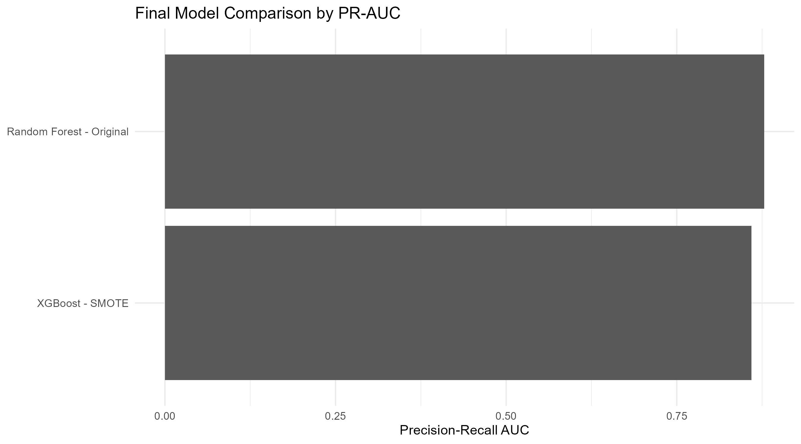{#fig-final-model-comparison-pr-auc}

The confusion matrices in @fig-confusion-matrices show the same trade-off from an operational perspective. Random Forest produces fewer false positives, while XGBoost with SMOTE detects slightly more fraudulent cases at the default threshold. This is the kind of result where the "best" model depends less on the leaderboard and more on the business rule attached to the score.

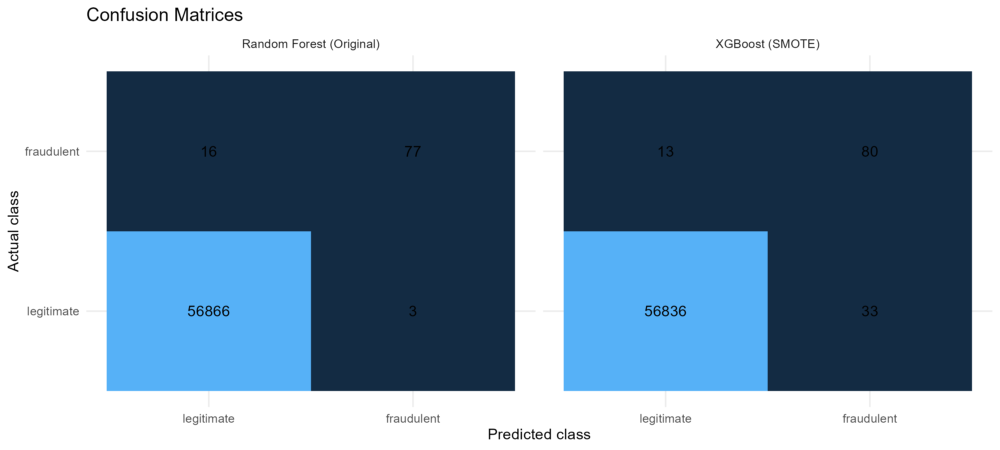{#fig-confusion-matrices}

The ROC curves in @fig-roc-curves show that both models have strong ranking ability across classification thresholds. XGBoost with SMOTE has the higher ROC-AUC, which is consistent with its stronger recall. However, ROC curves should be read carefully in this problem because the number of legitimate transactions is so large that a small false positive rate can still translate into many legitimate transactions being flagged.

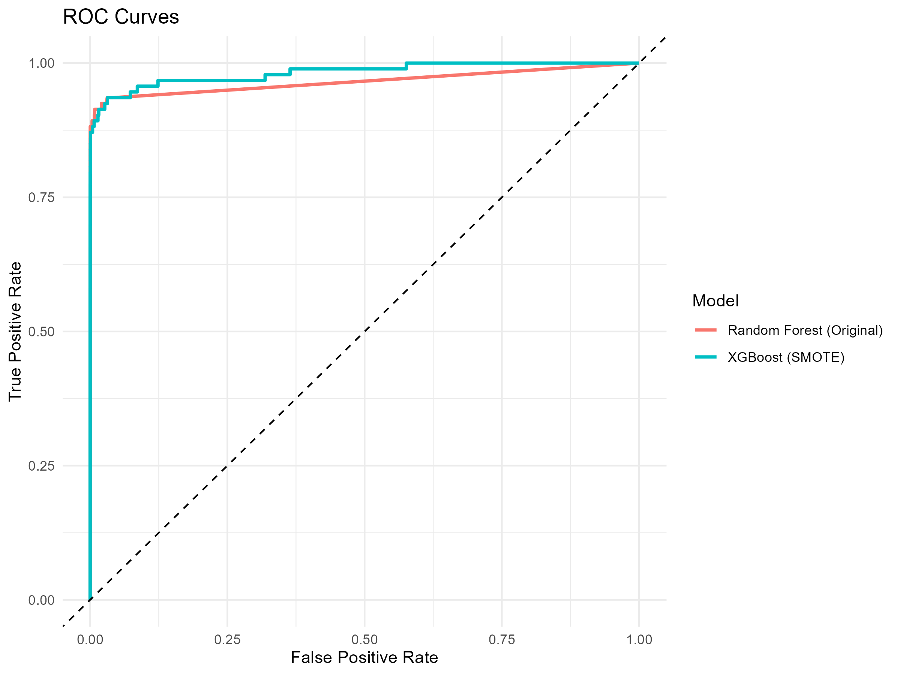{#fig-roc-curves}

The Precision-Recall curves in @fig-precision-recall-curves provide a more direct view of rare-class performance. They show how precision changes as recall increases, which is often closer to the decision that a fraud team needs to make: how many alerts can be reviewed, and how many missed frauds are acceptable?

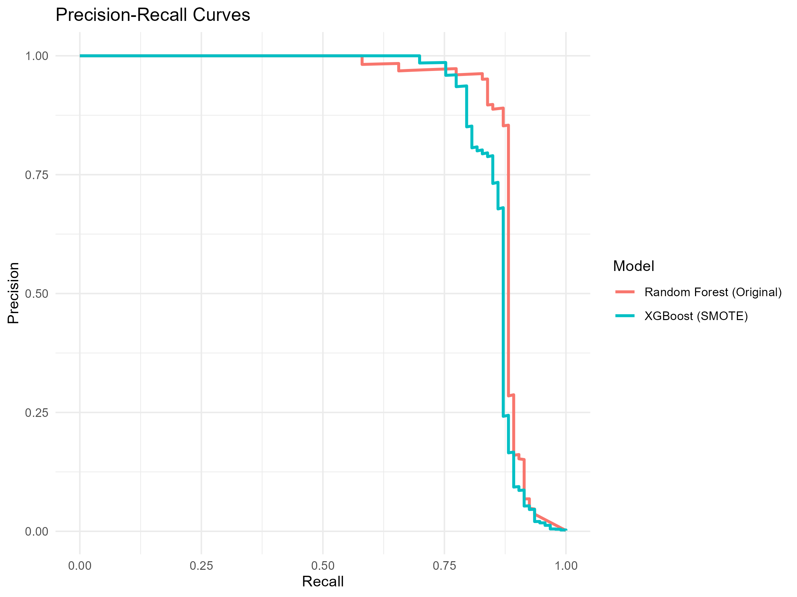{#fig-precision-recall-curves}

The KS statistic provides another way to assess whether the model scores separate legitimate and fraudulent transactions. The values in @tbl-kolmogorov-smirnov-statistic are almost identical for the two retained models.

| Model strategy          | KS statistic |
|:------------------------|-------------:|
| Random Forest - Original |       0.9056 |
| XGBoost - SMOTE          |       0.9040 |

: Kolmogorov-Smirnov statistic for the retained supervised models. {#tbl-kolmogorov-smirnov-statistic}

The diagnostic plot in @fig-kolmogorov-smirnov-diagnostic-plot shows the empirical cumulative distributions of the predicted fraud probabilities for the two classes. A wider separation between the curves indicates stronger discrimination. The near-identical KS values suggest that both models assign noticeably different score distributions to legitimate and fraudulent transactions, even though their default-threshold behaviour differs.

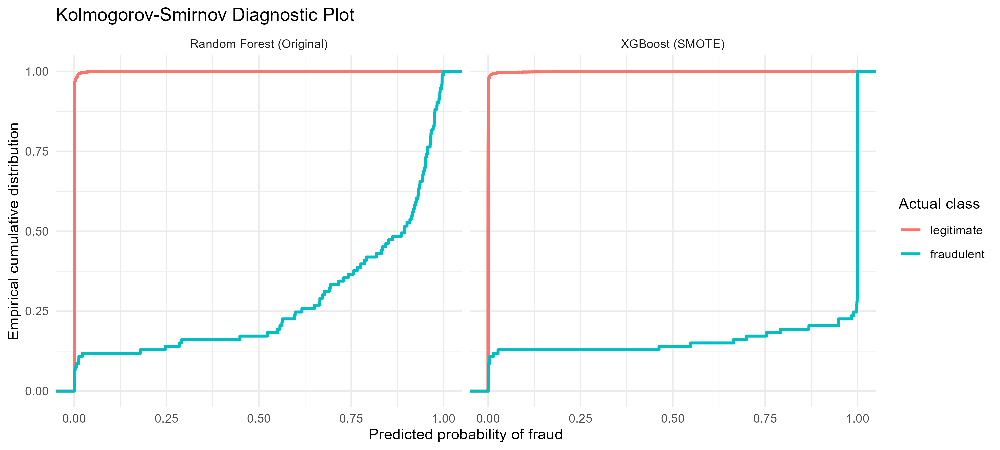{#fig-kolmogorov-smirnov-diagnostic-plot}

From a modelling point of view, the main conclusion is that tree-based ensemble methods are well suited to this dataset. They can capture nonlinear relationships among the anonymized PCA features without requiring a large amount of manual feature engineering. The original Random Forest is a strong and stable option, while SMOTE makes XGBoost more sensitive to fraudulent transactions. The stronger choice depends on the preferred operating point. For a portfolio project aimed at a practical analytics audience, this is an important distinction: the model is not simply selected because it has the largest headline score, but because its error profile fits the decision context.

::: {.content-visible when-format="html"}

Additional implementation details are available in the companion Quarto notebook [here](../notebooks-and-scripts/2-retail-analytics/1-credit-card-fraud-detection-ml-benchmark/r/2-credit-card-fraud-detection-supervised.html). A companion Python implementation is also available [here](../notebooks-and-scripts/2-retail-analytics/1-credit-card-fraud-detection-ml-benchmark/python/2-credit-card-fraud-detection-supervised.html).

:::

::: {.content-visible when-format="pdf"}

Additional implementation details, including the companion Quarto and Python notebooks, are available in the project repository \href{https://github.com/rodrigokang/portfolio/tree/main/notebooks-and-scripts/2-retail-analytics/1-credit-card-fraud-detection-ml-benchmark}{\faGithub}

:::

## Results, Discussion, and Limitations

The results support the original hypothesis of the project: fraudulent transactions are not randomly scattered across the transaction space. The unsupervised analysis showed that fraud tends to concentrate in specific regions or appear as anomalous behaviour, depending on the clustering method used. K-Means found a broader cluster with elevated fraud concentration, Agglomerative Clustering isolated a very small high-risk group, and DBSCAN treated fraudulent observations mainly as noise. These are not identical descriptions of the same phenomenon, but they point in the same direction. Fraudulent transactions leave a detectable signature in the available features.

The supervised benchmark then tested whether that structure could be used predictively. The answer is yes, but with the usual caveat that fraud detection is a decision problem, not only a classification problem. Random Forest trained on the original class distribution produced the strongest Precision-Recall AUC and the highest precision. XGBoost with SMOTE produced higher recall and ROC-AUC, but at the cost of more false positives. Neither result is universally better. The appropriate model depends on how the organization values missed fraud, customer friction, and manual review capacity.

For a retail or payments setting, this distinction is not cosmetic. A model with high recall may look attractive because it catches more fraudulent transactions, but it may also interrupt many legitimate customers. A model with high precision may be easier to operationalize because alerts are more trustworthy, but it may miss a larger share of fraud. In a New Zealand business context, where customer trust, fair treatment, and pragmatic implementation matter, the more credible recommendation is not to claim that one model "solves" fraud detection. A better recommendation is to deploy a calibrated scoring system, select thresholds according to operational capacity, and monitor the model continuously as transaction behaviour changes.

The project also illustrates why evaluation should not rely on accuracy. With such a low fraud rate, accuracy would mostly measure how well the model recognizes legitimate transactions. Precision, recall, PR-AUC, and score-separation diagnostics provide a more honest view of performance. The confusion matrices then translate those metrics back into operational outcomes: how many fraud cases are caught, how many are missed, and how many legitimate customers are affected.

There are several limitations. First, the dataset is anonymized. The PCA-transformed variables are useful for modelling, but they limit business interpretation. In a real implementation, analysts would want to understand which transaction attributes contribute to risk and whether those attributes are stable, fair, and compliant with internal policy. Second, the dataset is static. Fraud patterns change over time, so a model trained once on historical data may degrade as fraudsters adapt. Third, the analysis uses a default classification threshold. In production, the threshold would need to be tuned against business costs, review capacity, and customer impact rather than fixed at $0.5$.

Another limitation is that the project does not include cost-sensitive learning, probability calibration, or temporal validation. These would be natural extensions. A cost-sensitive model could assign different penalties to false negatives and false positives. Calibration would make predicted probabilities easier to interpret as risk scores. Temporal validation would be closer to production, where the model is trained on past transactions and evaluated on future transactions rather than on a random split.

Despite these limitations, the project provides a useful end-to-end benchmark. It moves from exploratory structure to supervised prediction, compares multiple modelling strategies, avoids accuracy as the main success criterion, and discusses the operational implications of the results. For portfolio purposes, the main value is not only the final model score, but the modelling judgement shown along the way.

## Technical Appendix

The project is implemented in both Python and R / Quarto. The Python notebooks provide the broader experimental benchmark, including the full set of candidate supervised models and imbalance strategies. The R / Quarto notebooks reproduce the core analysis and generate the figures and tables used in this chapter.

The dataset contains $284{,}807$ transactions, of which $492$ are fraudulent. The predictors include `Amount`, `Time`, and anonymized variables `V1` to `V28`, which correspond to principal components produced before the dataset was released. For the modelling workflow, the target variable is separated from the predictors, the `Time` variable is removed in the unsupervised stage, and the predictors are scaled after the train-test split.

The unsupervised analysis uses a stratified sample from the scaled training data to keep the clustering experiments computationally manageable while preserving the fraud rate. K-Means is evaluated over multiple values of $k$, Agglomerative Clustering is used as a hierarchical alternative, and DBSCAN is used to test whether fraudulent transactions behave more like density-based clusters or isolated noise points.

The supervised benchmark evaluates Logistic Regression, Naive Bayes, Linear Discriminant Analysis, Quadratic Discriminant Analysis, K-Nearest Neighbors, Linear Support Vector Machines, Decision Trees, Random Forests, and XGBoost. The imbalance strategies are the original training distribution, random undersampling, and SMOTE. The final chapter discussion focuses on Random Forest with the original class distribution and XGBoost with SMOTE because these models provide the clearest operational comparison between precision-oriented and recall-oriented behaviour.
