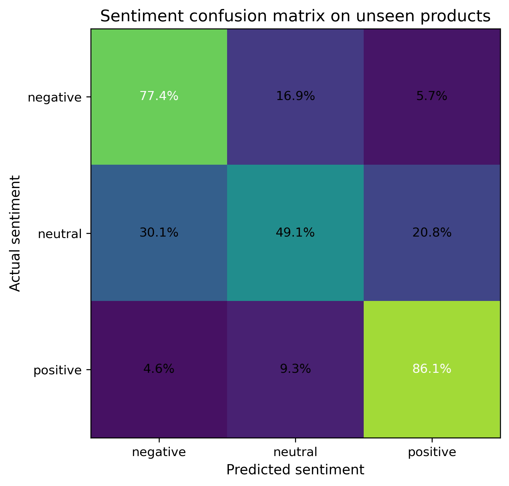

# Understanding Customer Feedback through NLP

Customer reviews capture an aspect of product performance that is difficult to obtain from structured transactional data alone. Beyond the numerical rating, written feedback provides context about what customers value, the problems they encounter after purchase, and the language they use to describe their experience. Analysing this information at scale allows organisations to move beyond aggregate satisfaction metrics and identify recurring themes that can support product improvement, quality assurance, and customer service.

This chapter develops a sentiment classification workflow using the **Amazon Reviews 2023** dataset, focusing on the `All_Beauty` product category. Customer reviews are transformed into numerical representations using TF–IDF features and classified with a multinomial Logistic Regression model. The project also extends beyond model development by packaging the trained Scikit-Learn pipeline as a lightweight inference service exposed through Azure Functions. Running inside Docker and using Azurite to emulate Azure Storage locally, the deployment demonstrates how the analytical workflow can be reproduced in a production-style environment without requiring an Azure subscription.

## Problem Definition

Online retailers receive customer feedback continuously, often accumulating thousands of reviews for a single product. While average star ratings provide a useful summary, they conceal the reasons behind customer satisfaction or dissatisfaction. Two products with similar ratings may generate very different patterns of feedback, making it difficult to identify the issues that deserve attention.

Manual review of this volume of text is rarely practical. As product catalogues expand, organisations need automated methods capable of analysing large collections of reviews consistently while preserving enough linguistic information to distinguish positive, neutral, and negative opinions. Such models can support downstream applications including customer experience monitoring, product quality assessment, and the early detection of emerging issues.

This project addresses that problem by formulating sentiment analysis as a supervised multi-class classification task. Customer ratings are converted into three sentiment categories—negative, neutral, and positive—and the corresponding review text is used to predict the underlying sentiment. The analysis is based on the **Amazon Reviews 2023** dataset, one of the largest publicly available collections of Amazon customer reviews, which combines large-scale review data with detailed product information for research purposes @hou2024bridging.

A practical challenge in review modelling is preventing overly optimistic evaluation caused by information leakage. Reviews of the same product frequently share vocabulary, describe similar characteristics, or even repeat common expressions. If reviews from a single product appear in both the training and test sets, reported performance may reflect memorisation of product-specific language rather than genuine generalisation. To obtain a more realistic assessment, this project partitions the data by product rather than by individual review, ensuring that the model is evaluated on products it has never encountered during training.

The objective is therefore not only to develop an accurate sentiment classifier, but also to demonstrate a workflow that remains reproducible from model development through deployment. The resulting pipeline illustrates how a classical Natural Language Processing approach can be transformed into a lightweight inference service suitable for integration into larger analytical systems while remaining entirely executable on a local machine.

## Modeling Approach

The objective of this project is to develop a sentiment classifier that is both accurate and easily reproducible. Rather than pursuing increasingly complex language models, the emphasis is placed on building a transparent workflow that follows well-established Natural Language Processing practices while remaining suitable for deployment in a lightweight production environment.

The modelling pipeline begins by transforming raw review text into a structured numerical representation. Each review is normalised through a standard text preprocessing stage, including lowercasing, tokenisation, removal of punctuation, stop-word filtering, and lemmatisation. These steps reduce lexical variability while preserving the semantic information required for sentiment classification.

The processed text is then represented using **Term Frequency–Inverse Document Frequency (TF–IDF)**. Unlike simple word counts, TF–IDF assigns greater importance to terms that are characteristic of individual reviews while reducing the influence of words that appear frequently throughout the corpus. This representation has remained a strong baseline for many document classification problems because it combines computational efficiency with good predictive performance on sparse textual data.

The resulting feature vectors are used to train a multinomial Logistic Regression classifier. Despite its conceptual simplicity, Logistic Regression has consistently demonstrated competitive performance for sentiment analysis tasks when paired with appropriate textual representations. The model is also straightforward to interpret, computationally efficient to train, and well suited to deployment scenarios where low inference latency and reproducibility are desirable.

A key aspect of the experimental design is the evaluation strategy. Instead of randomly splitting individual reviews into training and testing sets, the data are partitioned at the **product level**. All reviews associated with a particular product are assigned exclusively to either the training or the testing partition. This prevents the model from learning product-specific vocabulary that could otherwise appear in both sets, providing a more realistic estimate of how well the classifier generalises to previously unseen products.

To improve reproducibility and reduce the risk of implementation inconsistencies, the preprocessing steps, TF–IDF vectoriser, and trained classifier are encapsulated within a single Scikit-Learn pipeline. This design ensures that identical transformations are applied during both training and inference, while also allowing the complete workflow to be exported as a single serialized model artifact.

This packaged pipeline forms the bridge between model development and deployment. Rather than requiring custom inference code, the serialized artifact can be loaded directly by the Azure Functions application, which exposes the trained model through a lightweight HTTP endpoint. Running inside Docker, with Azurite providing a local emulation of Azure Storage, the deployment demonstrates how a traditional machine learning workflow can be packaged as a production-style inference service while remaining fully executable on a local machine.

## Methodology and Implementation

The analytical workflow consists of two complementary stages. The first focuses on developing and evaluating a sentiment classification model from customer reviews, while the second packages the trained model as a lightweight inference service suitable for reproducible local deployment. Although these stages serve different purposes, they share the same Scikit-Learn pipeline, ensuring that identical preprocessing and prediction steps are applied during both model development and inference.

### Data Preparation

The analysis begins by extracting the review text, product identifier and customer rating from the Amazon Reviews 2023 `All_Beauty` category. Records containing empty review text are removed, duplicated observations are discarded, and the remaining data are validated before model development. The original five-star rating is then converted into three sentiment categories, grouping one- and two-star reviews as **negative**, three-star reviews as **neutral**, and four- and five-star reviews as **positive**.

To obtain a realistic assessment of predictive performance, the data are partitioned at the **product level** rather than at the review level. All reviews associated with a given product are assigned exclusively to either the training or the testing partition. This prevents product-specific vocabulary from appearing in both sets and provides a more reliable estimate of how well the classifier generalises to previously unseen products.

### Text Representation and Sentiment Classification

Customer reviews are first normalised through a standard text preprocessing workflow, including lowercasing, punctuation removal, stop-word filtering and lemmatisation. The cleaned text is subsequently transformed into numerical feature vectors using TF–IDF, allowing each review to be represented according to the relative importance of its terms within the corpus.

These feature vectors are used to train a multinomial Logistic Regression classifier. Rather than implementing each processing step independently, the preprocessing operations, TF–IDF vectoriser and classifier are encapsulated within a single Scikit-Learn pipeline. This design simplifies experimentation while ensuring that exactly the same sequence of transformations is applied whenever new reviews are analysed.

### Topic Discovery

While sentiment classification identifies whether customers express positive or negative opinions, it does not explain the underlying reasons for those opinions. To complement the classifier, the project applies topic modelling to the subset of negative reviews in order to identify recurring themes associated with customer dissatisfaction.

Candidate topic models with different numbers of topics are compared using quantitative and qualitative criteria, balancing reconstruction quality with the interpretability of the resulting topics. The selected model provides a concise summary of the most common issues reported by customers, supporting subsequent business interpretation.

### Packaging for Local Deployment

Once the sentiment classifier has been trained, the complete Scikit-Learn pipeline is exported as a serialized model artifact. This packaged pipeline is then exposed through an Azure Functions HTTP endpoint, allowing new customer reviews to be submitted for inference without requiring the original training environment.

The inference service runs inside Docker, while Azurite provides a local emulation of Azure Storage, enabling the complete deployment to be executed on a standard workstation without an Azure subscription. Rather than introducing additional machine learning functionality, this deployment layer demonstrates how an analytical model can be packaged into a lightweight, reproducible service using tools commonly encountered in production environments.

## Results, Discussion, and Limitations

### Data Preparation

The data preparation pipeline retained nearly the entire analytical sample while removing duplicated observations and records containing unusable review text. As summarised in @tbl-data-audit, more than 99% of the original observations were preserved after cleaning, indicating that the source data were of high quality and required only minimal preprocessing before model development.

Table: Summary of data quality checks performed before model development. The cleaning pipeline retained almost all observations while removing duplicates and unusable records. {#tbl-data-audit}

| Metric                             | Value  |
|:----------------------------------:|:------:|
| Input rows                         | 50,000 |
| Whole-row duplicates in raw sample | 45     |
| Invalid ratings                    | 0      |
| Empty review text                  | 47     |
| Missing product identifiers        | 0      |
| Analytical duplicates removed      | 46     |
| Prepared rows                      | 49,907 |
| Retention rate                     | 99.81% |

The small number of discarded records suggests that missing information and duplicated reviews were unlikely to influence the subsequent modelling process. Consequently, the resulting dataset provides a reliable foundation for sentiment classification while avoiding unnecessary sources of bias introduced by incomplete or redundant observations.

### Rating Distribution

Customer ratings exhibit the characteristic imbalance commonly observed in online retail platforms, where positive reviews substantially outnumber negative ones. As shown in @tbl-rating-summary, almost sixty percent of the reviews awarded the maximum five-star rating, whereas low ratings represent a considerably smaller proportion of the dataset.

Table: Distribution of customer ratings in the analytical dataset. {#tbl-rating-summary}

| Rating | Reviews | Median words | Review share |
|:------:|:-------:|:------------:|:------------:|
| 1      | 7,304   | 20           | 14.64%       |
| 2      | 3,017   | 24           | 6.05%        |
| 3      | 4,019   | 24           | 8.05%        |
| 4      | 5,635   | 25           | 11.29%       |
| 5      | 29,932  | 17           | 59.98%       |

Rather than artificially balancing the classes, the original distribution was preserved throughout the analysis. This decision produces a more realistic evaluation setting by reflecting the conditions under which sentiment classification models would typically operate in production. At the same time, it highlights the importance of evaluating model performance using class-specific metrics in addition to overall accuracy, since aggregate measures alone may overestimate performance on underrepresented sentiment classes.

### Sentiment Classification Performance

The TF–IDF Logistic Regression model substantially outperformed the most-frequent baseline across all evaluation metrics, demonstrating that the classifier learned meaningful linguistic patterns rather than simply exploiting the predominance of positive reviews. As shown in @tbl-sentiment-evaluation, overall accuracy increased from 71.1% to 81.3%, while the macro-averaged F1-score more than doubled, providing a more balanced assessment of performance across all sentiment classes.

Table: Comparison between the baseline classifier and the TF–IDF logistic regression model. {#tbl-sentiment-evaluation}

|            Model           |  Macro F1 | Weighted F1 |  Accuracy |
| :------------------------: | :-------: | :---------: | :-------: |
|   Most-frequent baseline   |   0.277   |    0.591    |   0.711   |
| TF–IDF Logistic Regression | **0.674** |  **0.830**  | **0.813** |

The improvement in macro F1 is particularly important because it gives equal weight to each sentiment category regardless of its frequency. Since positive reviews dominate the dataset, accuracy alone would provide an incomplete picture of model performance. The increase in macro F1 therefore indicates that the classifier captures meaningful distinctions across all three sentiment classes rather than relying primarily on the majority class.

A more detailed breakdown is presented in @tbl-sentiment-class-metrics. The classifier achieved its strongest performance for positive reviews, with an F1-score of 0.906, reflecting the relatively consistent language used in favourable customer feedback. Negative reviews were also identified reliably, achieving an F1-score of 0.755. As expected, the neutral class proved considerably more challenging, exhibiting lower precision and recall because reviews with intermediate ratings often combine both positive and negative opinions within the same text.

Table: Precision, recall and F1-score for each sentiment class on the test set. {#tbl-sentiment-class-metrics}

| Sentiment | Precision | Recall | F1-score | Reviews |
| :-------: | :-------: | :----: | :------: | :-----: |
|  Negative |   0.738   |  0.774 |   0.755  |  1,729  |
|  Neutral  |   0.283   |  0.491 |   0.359  |   678   |
|  Positive |   0.955   |  0.861 |   0.906  |  5,927  |

These class-level metrics are further illustrated by the confusion matrix shown in @fig-confusion-matrix. Most classification errors occur between neighbouring sentiment categories rather than between strongly positive and strongly negative reviews. This behaviour is consistent with the subjective nature of customer feedback, where moderately positive or moderately negative reviews frequently contain mixed opinions that are difficult to assign to a single sentiment category.

{#fig-confusion-matrix}

### Topic Modelling

Although sentiment classification identifies whether a review expresses a favourable or unfavourable opinion, it does not reveal the underlying reasons behind customer dissatisfaction. To complement the classifier, topic modelling was applied to the subset of negative reviews with the objective of identifying the most frequently discussed issues across products.

Several candidate models were evaluated by varying the number of topics. As summarised in @tbl-topic-selection, the final configuration of five topics was selected as the best compromise between reconstruction quality, topic coherence, stability and interpretability. While models with a larger number of topics achieved marginal improvements in reconstruction error, these gains came at the expense of producing more fragmented and less meaningful themes.

Table: Quantitative comparison of candidate topic models. The five-topic solution was selected as the best compromise between coherence, stability and interpretability. {#tbl-topic-selection}

| Topics | Reconstruction error | Stability | Term diversity | NPMI coherence | Selected |
| :----: | :------------------: | :-------: | :------------: | :------------: | :------: |
|    4   |        87.632        |   0.897   |      0.875     |      0.155     |    No    |
|  **5** |      **87.393**      | **0.892** |    **0.850**   |    **0.174**   |  **Yes** |
|    6   |        87.200        |   0.877   |      0.847     |      0.174     |    No    |
|    7   |        87.015        |   0.907   |      0.869     |      0.172     |    No    |
|    8   |        86.846        |   0.878   |      0.833     |      0.161     |    No    |

The resulting topics correspond to recurring product issues that can be readily interpreted from a business perspective. Rather than representing abstract statistical groupings, they describe concrete themes such as products failing to perform as expected, concerns about durability, perceived poor value for money and quality issues affecting specific product categories.

Table: Summary of the topics identified in customer reviews and their associated business relevance. {#tbl-topic-summary}

| Topic |             Topic label             | Actionability | Reviews | Products | Negative share |
| :---: | :---------------------------------: | :-----------: | :-----: | :------: | :------------: |
|   0   |   Product did not work as expected  |      High     |  1,243  |   1,117  |     75.70%     |
|   3   | Limited durability or staying power |      High     |  1,122  |   1,010  |     73.08%     |
|   2   |         Poor value for money        |      High     |   705   |    661   |     94.75%     |
|   4   |    Hair-product quality concerns    |     Medium    |  1,739  |   1,471  |     70.79%     |
|   1   |  General dissatisfaction (residual) |      Low      |  8,176  |   6,259  |     68.71%     |

From an operational perspective, these topics are considerably more actionable than sentiment labels alone. A retailer can readily identify which complaints are most prevalent, prioritise investigations into specific product defects, monitor whether recurring issues persist over time and evaluate the effectiveness of corrective actions. In this way, topic modelling complements sentiment classification by transforming large volumes of unstructured customer feedback into information that can directly support product management and customer experience decisions.

### Discussion and Limitations

The results demonstrate that a classical Natural Language Processing pipeline can provide reliable sentiment classification while remaining computationally efficient and straightforward to deploy. By combining TF–IDF features with Logistic Regression, the proposed workflow achieves strong predictive performance without relying on computationally intensive deep learning architectures. This balance between accuracy, interpretability and reproducibility makes the approach well suited to many retail analytics applications, particularly where transparency and ease of maintenance are important considerations.

The integration of topic modelling further extends the analytical value of the workflow. Rather than treating sentiment prediction as an end in itself, the project illustrates how customer feedback can be transformed into structured business intelligence. Identifying recurring themes behind negative reviews provides actionable insights that can support product quality monitoring, customer experience initiatives and prioritisation of corrective actions.

Several limitations should nevertheless be acknowledged. First, the analysis focuses exclusively on the `All_Beauty` product category. Although the modelling framework is readily transferable to other retail domains, vocabulary and customer behaviour may differ substantially across product categories, making additional training necessary before deployment in a different context.

Second, the sentiment labels are derived directly from customer ratings rather than manual annotation of review text. While this strategy enables the construction of large training datasets, it assumes that numerical ratings accurately reflect the sentiment expressed in the written review. In practice, some customers assign moderate ratings despite expressing strongly positive or negative opinions, introducing a degree of label uncertainty that cannot be eliminated entirely.

Finally, the project deliberately adopts a classical machine learning approach instead of recent transformer-based language models. Large language models can often achieve higher predictive performance, particularly for nuanced linguistic phenomena such as sarcasm or complex contextual relationships. However, they also require substantially greater computational resources, more complex deployment pipelines and longer inference times. Within the objectives of this project, the selected approach provides an effective compromise between predictive performance, computational efficiency and reproducibility while naturally supporting deployment as a lightweight inference service.

::: {.content-visible when-format="html"}

A complete Python implementation of the workflow presented in this chapter is available in the companion notebook [here](../notebooks-and-scripts/2-retail-analytics/3-customer-feedback-nlp/python/1-understanding-customer-feedback-nlp.html).

:::

::: {.content-visible when-format="pdf"}

A complete Python implementation of the workflow presented in this chapter is available in the project repository [here](https://github.com/rodrigokang/portfolio/tree/main/notebooks-and-scripts/2-retail-analytics/3-customer-feedback-nlp).

:::

::: {.content-visible when-format="html"}

An Azure-compatible deployment implementing the inference service presented in this chapter is available in the project repository [here](https://github.com/rodrigokang/portfolio/tree/main/notebooks-and-scripts/2-retail-analytics/3-customer-feedback-nlp).

:::

::: {.content-visible when-format="pdf"}

An Azure-compatible deployment implementing the inference service presented in this chapter is available in the project repository [here](https://github.com/rodrigokang/portfolio/tree/main/notebooks-and-scripts/2-retail-analytics/3-customer-feedback-nlp).

:::

## Technical Appendix

The workflow presented in this chapter follows a classical Natural Language Processing (NLP) pipeline for supervised document classification. Although transformer-based language models have become increasingly popular, statistical text representations combined with linear classifiers remain highly competitive for many industrial applications owing to their computational efficiency, interpretability and ease of deployment. Comprehensive treatments of sentiment analysis and opinion mining are provided by Pang and Lee @pang2008opinion and Liu @liu2010sentiment.

### Text Preprocessing

Customer reviews are first transformed into a standardised textual representation before feature extraction. The objective of preprocessing is to reduce lexical variability while preserving the semantic information required for sentiment classification.

The preprocessing pipeline consists of the following sequential operations:

1. **Lowercasing**, ensuring that words differing only by capitalisation are treated as identical tokens.
2. **Tokenisation**, which decomposes each review into individual lexical units.
3. **Removal of punctuation and non-alphabetic characters**, reducing noise introduced by formatting symbols.
4. **Stop-word filtering**, eliminating extremely frequent words (e.g., *the*, *and*, *is*) that contribute little discriminative information.
5. **Lemmatisation**, mapping inflected words to their canonical dictionary form. For example, *running*, *runs* and *ran* are all reduced to the lemma *run*.

Collectively, these transformations reduce the dimensionality of the vocabulary and improve the consistency of the subsequent feature representation. The resulting corpus is therefore less sparse and more suitable for statistical learning algorithms such as TF–IDF vectorisation followed by Logistic Regression.

### TF–IDF Feature Representation

After preprocessing, each review is transformed into a numerical feature vector using the **Term Frequency–Inverse Document Frequency (TF–IDF)** weighting scheme. Unlike a simple bag-of-words representation, TF–IDF assigns higher importance to terms that are frequent within an individual document but relatively uncommon across the entire corpus. This weighting emphasises words that are more informative for distinguishing between sentiment classes while reducing the influence of ubiquitous vocabulary.

For a term $t$ appearing in document $d$, the TF–IDF weight is computed as

$$
\operatorname{TFIDF}(t,d)
=
\operatorname{TF}(t,d)
\cdot
\log\left(\frac{N}{DF(t)}\right),
$$ {#eq-tfidf}

where:

* $\operatorname{TF}(t,d)$ is the **term frequency**, measuring how often term $t$ appears in document $d$;
* $DF(t)$ is the **document frequency**, corresponding to the number of documents containing term $t$;
* $N$ is the total number of documents in the corpus.

The first component measures the local importance of a term within a review, whereas the inverse document frequency discounts words that occur in many documents. As a result, highly informative terms receive greater weights than common vocabulary shared across most reviews.

Applying @eq-tfidf to every term in the vocabulary produces a sparse document-term matrix in which each review is represented as a high-dimensional feature vector. Although the resulting feature space may contain thousands of dimensions, most entries are zero because any individual review contains only a small subset of the overall vocabulary. Sparse representations of this kind are computationally efficient and are particularly well suited to linear classifiers such as Logistic Regression.

### Multinomial Logistic Regression

The sentiment classifier is based on **multinomial Logistic Regression**, a probabilistic linear model designed for multi-class classification problems. Given a TF–IDF feature vector $\mathbf{x}$ representing a customer review, the classifier estimates the probability that the review belongs to each sentiment class and assigns the class with the highest predicted probability.

For a problem with $K$ sentiment classes, the probability of assigning observation $\mathbf{x}$ to class $k$ is computed using the softmax function,

$$
P(y=k\mid\mathbf{x})
=
\frac{\exp\left(\boldsymbol{\theta}_k^\top\mathbf{x}\right)}
{\sum_{j=1}^{K}
\exp\left(\boldsymbol{\theta}_j^\top\mathbf{x}\right)},
$$ {#eq-softmax}

where:

* $\mathbf{x}$ denotes the TF–IDF feature vector associated with a review;
* $\boldsymbol{\theta}_k$ is the parameter vector corresponding to sentiment class $k$;
* $K=3$ represents the negative, neutral and positive sentiment categories.

The softmax transformation ensures that the predicted probabilities form a valid probability distribution,

$$
\sum_{k=1}^{K}
P(y=k\mid\mathbf{x})
=
1.
$$ {#eq-softmax-sum}

Model parameters are estimated by solving the regularised optimisation problem

$$
\hat{\boldsymbol{\theta}}
=
\arg\min_{\boldsymbol{\theta}}
\left\{
-
\mathcal{L}(\boldsymbol{\theta})
+
\lambda
\left\|
\boldsymbol{\theta}
\right\|_2^2
\right\}.
$$ {#eq-l2}

where $\mathcal{L}(\boldsymbol{\theta})$ denotes the log-likelihood of the training data, $\lambda$ is the regularisation parameter, and $|\boldsymbol{\theta}|_2^2$ is the squared Euclidean norm of the parameter vector.

The L2 penalty discourages unnecessarily large parameter estimates, reducing the risk of overfitting while improving generalisation to previously unseen products. This regularisation strategy is particularly effective for TF–IDF representations, where the number of features is typically large and the document-term matrix is highly sparse.

To ensure reproducibility, the preprocessing operations, TF–IDF vectoriser and Logistic Regression classifier are encapsulated within a single Scikit-Learn pipeline. Consequently, exactly the same sequence of transformations is applied during both model training and inference, eliminating inconsistencies between development and deployment environments.

### Topic Modelling

While sentiment classification determines whether a review expresses a positive or negative opinion, it does not explain the underlying reasons behind customer satisfaction or dissatisfaction. Topic modelling addresses this limitation by identifying latent semantic themes shared across groups of reviews, allowing large collections of customer feedback to be summarised into a small number of interpretable topics.

The analysis is performed exclusively on the subset of reviews classified as negative. Restricting the corpus to dissatisfied customers increases the semantic coherence of the extracted topics and produces themes that are directly relevant for product quality assessment and customer experience management.

Selecting an appropriate number of topics is a critical modelling decision. A model with too few topics tends to merge distinct customer concerns into overly broad themes, whereas an excessively large number of topics often fragments coherent issues into several overlapping clusters that are difficult to interpret. Consequently, the optimal solution is not necessarily the one that minimises reconstruction error alone.

To balance statistical performance and practical interpretability, several candidate models were evaluated using multiple complementary criteria:

* **Reconstruction error**, measuring how accurately the latent representation reproduces the original document-term matrix.
* **Topic coherence**, evaluating the semantic relatedness of the highest-weighted words within each topic.
* **Model stability**, assessing the consistency of the extracted topics across repeated model fits.
* **Term diversity**, quantifying the extent to which different topics capture distinct vocabularies rather than repeatedly selecting the same high-frequency terms.

The final model was selected by jointly considering these quantitative measures together with qualitative inspection of the resulting topics. This multi-criteria evaluation avoids selecting a statistically optimal solution that lacks practical interpretability and instead favours a compact set of topics that can be readily translated into actionable business insights.

Once the optimal model has been identified, each review is assigned to its dominant topic according to the highest topic probability. The resulting topic assignments provide an interpretable representation of the principal sources of customer dissatisfaction, complementing the sentiment classifier by explaining *why* customers express negative opinions rather than simply identifying *whether* those opinions are positive or negative.

### Deployment Notes

Although the primary objective of this project is the development of a sentiment classification model, the complete workflow also incorporates a lightweight deployment layer that demonstrates how the trained model can be packaged for inference. Rather than treating deployment as an independent cloud-computing exercise, the implementation focuses on preserving consistency between model development and production-style execution.

The Scikit-Learn preprocessing pipeline, TF–IDF vectoriser and Logistic Regression classifier are encapsulated within a single pipeline object. Once training is complete, this pipeline is serialized using `joblib`, producing a self-contained artifact that includes every transformation required to process new customer reviews. Consequently, no additional preprocessing logic is required during inference, eliminating the risk of discrepancies between training and deployment environments.

The serialized model is loaded by an Azure Functions application, which exposes a RESTful HTTP endpoint for sentiment prediction. Incoming requests containing raw review text are processed using exactly the same pipeline employed during model development, ensuring that every prediction is generated under identical preprocessing and modelling assumptions.

To facilitate reproducibility, the inference service executes inside a Docker container that encapsulates the Python runtime together with all project dependencies. Containerisation guarantees that the application behaves consistently across different operating systems while simplifying installation and deployment.

Although Azure Functions typically interact with Azure Storage services, this project relies on **Azurite**, Microsoft's local emulator for Azure Storage. Azurite reproduces the behaviour of Azure Blob Storage within a local development environment, allowing the complete inference workflow to execute without requiring an active Azure subscription or cloud resources.

This architecture illustrates a common deployment pattern for classical machine learning models. Model development, serialization and inference remain clearly separated, while the prediction service preserves exactly the same preprocessing pipeline validated during experimentation. As a result, the project demonstrates not only how a statistical learning model can be developed and evaluated, but also how it can be packaged into a reproducible, Azure-compatible inference service suitable for subsequent integration into larger analytical systems.