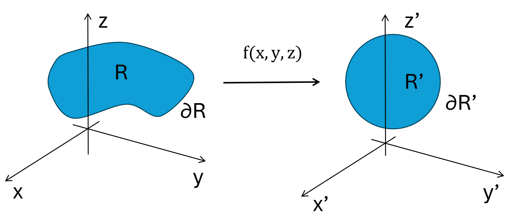
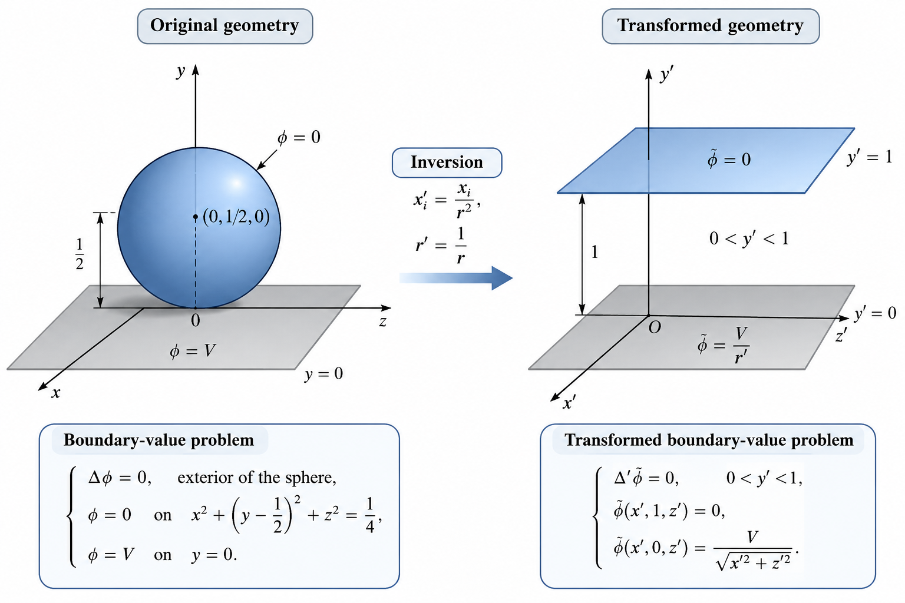
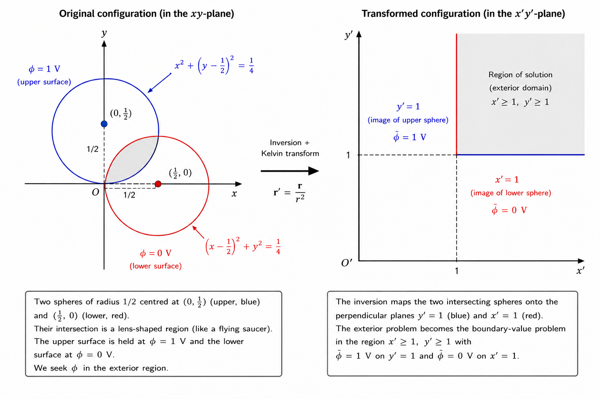
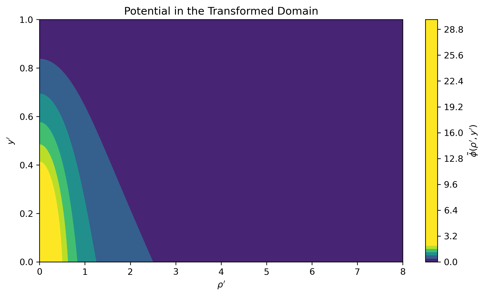
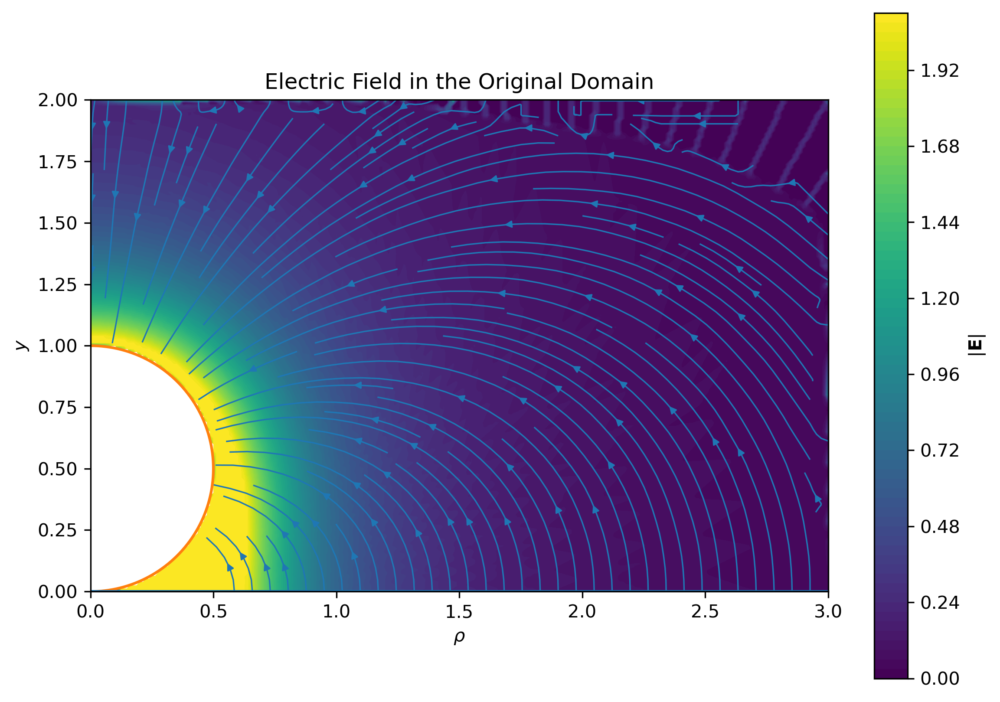
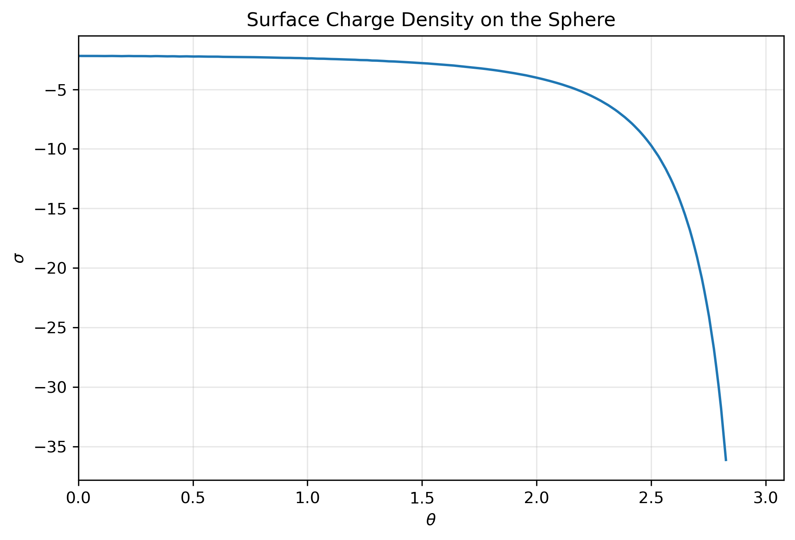
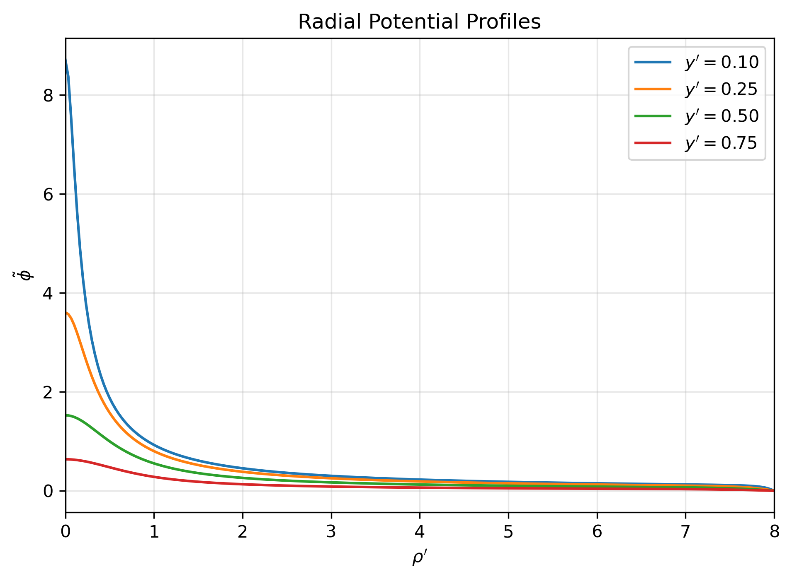
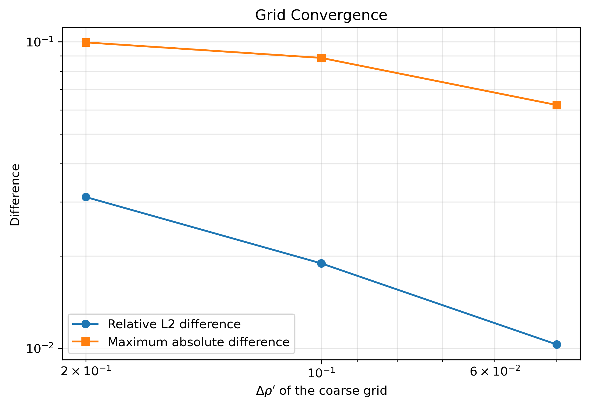
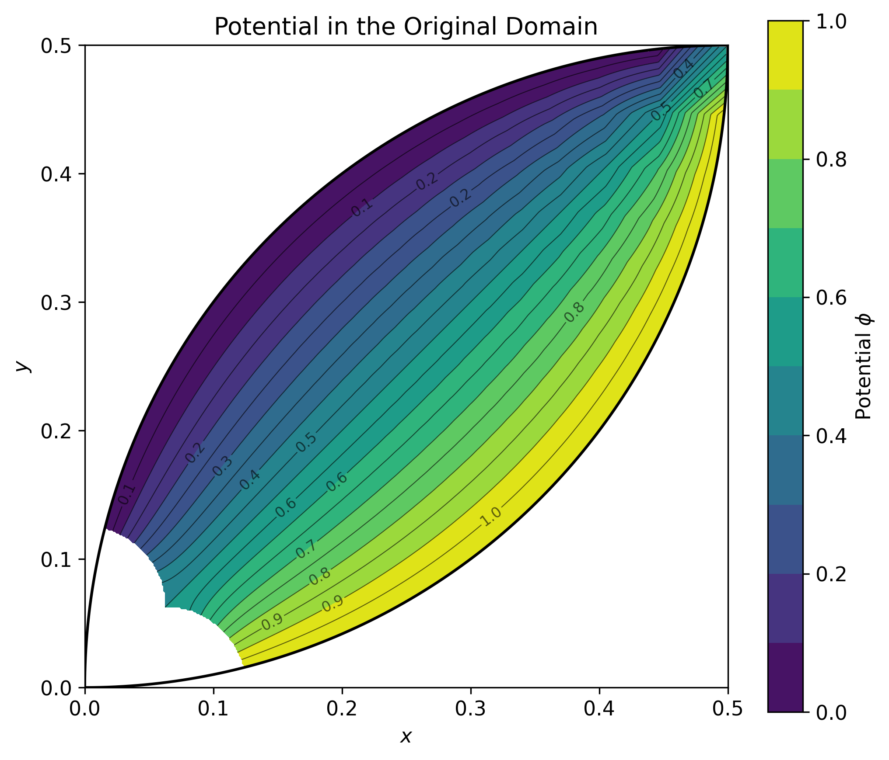

# Conformal Geometry and Electrostatics in Three Dimensions

::: {.callout-note appearance="simple" icon=false collapse="false"}

## Abstract

Conformal transformations are widely recognised for their role in two-dimensional complex analysis, where they provide powerful tools for solving boundary-value problems governed by Laplace's equation. Their three-dimensional counterparts are considerably less familiar, despite possessing equally remarkable geometric properties and important applications in potential theory.

This essay introduces the fundamental concepts underlying conformal geometry in three dimensions and illustrates how these transformations can simplify otherwise challenging electrostatic boundary-value problems. Rather than presenting an exhaustive mathematical treatment, the discussion focuses on the geometric intuition behind conformal mappings, the special role of inversion, and the Kelvin transformation that preserves harmonic functions under inversion.

Two classical electrostatic problems are used to demonstrate these ideas. In the first example, a sphere tangent to an infinite conducting plane is transformed into an equivalent problem between two parallel planes. In the second, two intersecting spheres are mapped onto two perpendicular planes forming the first quadrant. In both cases, the transformed problems can be solved on regular Cartesian grids using the finite difference method, whereas a direct treatment of the original geometries would require a more elaborate numerical formulation.

Beyond these examples, the essay highlights how geometric transformations can become practical computational tools, revealing the close relationship between geometry, partial differential equations, and classical electromagnetism.

**Keywords:** conformal geometry; electrostatics; Laplace equation; inversion; Kelvin transformation; finite difference method; boundary-value problems.

:::

## Introduction

Many problems in mathematical physics are difficult not because the governing equations themselves are particularly complicated, but because the geometry of the domain is. Electrostatics provides a classical example. Although Laplace's equation is one of the simplest partial differential equations encountered in physics,

$$
\nabla^2 \phi = 0,
$$ {#eq-laplace}

its analytical solution often becomes impractical when the conducting boundaries possess complex geometries.

One strategy for overcoming this difficulty is to transform the geometry rather than the equation itself. If a coordinate transformation preserves the form of Laplace's equation, a complicated boundary-value problem may be converted into another with much simpler boundaries while describing exactly the same physical phenomenon. Once the transformed problem has been solved, the solution can be mapped back to the original geometry.

In two dimensions, this idea is well established through complex analysis, where conformal mappings preserve angles and harmonic functions. The theory has been extensively developed and remains one of the most elegant applications of analytic functions to mathematical physics.

The situation in three dimensions is less widely known. Since there is no direct analogue of complex analytic functions, conformal mappings arise from a much more restrictive family of geometric transformations. Nevertheless, these mappings retain the essential property that makes them valuable for potential theory: they preserve harmonic functions under appropriate transformations. Among them, inversion occupies a particularly important place because, when combined with the Kelvin transformation, it provides a powerful mechanism for constructing new solutions of Laplace's equation from existing ones.

The following sections introduce the geometric principles underlying conformal transformations in three dimensions and examine their practical value through two classical electrostatic boundary-value problems. Rather than pursuing a rigorous mathematical treatment, the emphasis is placed on the key ideas that make these transformations useful, together with their application to the numerical solution of physically meaningful problems.

Although the examples presented here belong to classical electrostatics, the underlying concepts extend far beyond this particular application. Conformal geometry continues to play an important role in several areas of mathematics and theoretical physics, illustrating how geometric insight can often provide a simpler route to solving otherwise difficult problems.

## Electrostatics and Coordinate Transformations

The central equation of electrostatics in regions free of electric charge is Laplace's equation (@eq-laplace). Any function satisfying this equation is called a *harmonic function*, and many electrostatic boundary-value problems reduce to finding a harmonic potential that satisfies prescribed conditions on the conducting surfaces.

In practice, the greatest difficulty rarely lies in the differential equation itself. Instead, it arises from the geometry of the domain. Even simple boundary conditions may become analytically intractable when imposed on curved surfaces or irregular conductors. This observation naturally suggests an alternative strategy: rather than attempting to solve the problem in its original geometry, one may seek a coordinate transformation that converts it into an equivalent problem with simpler boundaries.

Suppose that the original Cartesian coordinates,

$$
\mathbf{r} = (x,y,z),
$$ {#eq-original-coordinates}

are transformed into a new coordinate system,

$$
\mathbf{r}' = (x',y',z'),
$$ {#eq-transformed-coordinates}

through a sufficiently smooth and invertible mapping,

$$
\mathbf{r}'=\mathbf{F}(\mathbf{r}).
$$ {#eq-coordinate-transformation}

The electrostatic potential in the transformed coordinates may then be written as

$$
\phi(\mathbf{r})=\tilde{\phi}(\mathbf{r}').
$$ {#eq-transformed-potential}

Applying the chain rule expresses the derivatives of the transformed potential in terms of the Jacobian matrix of the mapping. In general, this process introduces additional terms involving both first- and second-order derivatives of the transformation. Consequently, an arbitrary change of coordinates does not preserve the form of Laplace's equation.

The transformations of interest are therefore those for which these additional terms either vanish or can be absorbed into a simple scaling factor. Under these conditions, every harmonic function in one coordinate system corresponds to another harmonic function in the transformed system, allowing the physical problem to be solved in whichever geometry is more convenient.

The basic idea is illustrated in @fig-conformal-transformation. A region $R$, together with its boundary $\partial R$, is mapped onto a transformed region $R'$ and boundary $\partial R'$. The governing equation and boundary conditions are then reformulated in the transformed coordinates, where the geometry may be easier to handle.

{#fig-conformal-transformation}

Conformal transformations belong precisely to this class. Besides preserving angles locally, they retain the structure required to reconstruct harmonic solutions after the appropriate transformation of the potential. As the following section shows, the family of conformal transformations in three dimensions is remarkably restricted, yet sufficiently rich to solve several classical electrostatic problems in an elegant and practical way.

## Conformal Transformations in Three Dimensions

A coordinate transformation is said to be *conformal* if it preserves angles locally. Although lengths may change from one point to another, the angle between any two intersecting curves remains unchanged after the transformation. From the perspective of electrostatics, this property is particularly valuable because it preserves the local structure of the electric field while allowing the geometry of the domain to be simplified.

Mathematically, consider a smooth transformation

$$
\mathbf{r}'=\mathbf{F}(\mathbf{r}),
$$ {#eq-conformal-mapping}

with Jacobian matrix

$$
J_{ij}=\frac{\partial x_i'}{\partial x_j}.
$$ {#eq-jacobian}

A necessary and sufficient condition for the transformation to be conformal is that the Jacobian satisfy

$$
JJ^{\mathrm T}=\Omega^2 I,
$$ {#eq-conformal-condition}

where $I$ denotes the identity matrix and $\Omega(\mathbf{r})$ is a positive scalar function known as the *conformal factor*. This condition states that the transformation acts locally as an isotropic scaling followed by a rigid rotation. Consequently, every direction is stretched by exactly the same amount, ensuring that angles are preserved.

Unlike the two-dimensional case, where conformal mappings form an infinite family generated by analytic functions, conformal transformations in three-dimensional Euclidean space are remarkably restrictive. Liouville's theorem states that every sufficiently smooth conformal transformation can be constructed from a finite sequence of four elementary operations:

- translations,
- rotations,
- dilations,
- inversions.

The first three correspond to familiar rigid or uniform geometric transformations and preserve Laplace's equation without modification. Inversion, however, is fundamentally different. It transforms finite regions into unbounded ones, exchanges points near the origin with distant points, and introduces the geometric structure that makes many otherwise difficult electrostatic problems analytically tractable.

Among these four transformations, inversion therefore occupies a unique position. Combined with the Kelvin transformation introduced in the next section, it allows harmonic functions to be mapped between geometrically distinct domains while preserving the physical content of the electrostatic problem.

### Elementary Conformal Transformations

Liouville's theorem establishes that every sufficiently smooth conformal transformation in three-dimensional Euclidean space can be obtained through a finite composition of four elementary transformations: translations, rotations, dilations, and inversions. The first three correspond to familiar geometric operations that preserve distances either exactly or up to a constant scaling factor. Inversion, by contrast, fundamentally alters the geometry of space and provides the key ingredient for solving many classical electrostatic boundary-value problems.

Although each of these transformations satisfies the conformality condition (@eq-conformal-condition), their geometric effects differ substantially. They are therefore introduced individually before discussing the Kelvin transformation, which extends inversion to harmonic functions.

#### Translation

A translation shifts every point in space by the same constant vector without modifying the relative positions of neighbouring points. If $\mathbf{a}$ is a constant vector, the transformed coordinates are

$$
\mathbf{r}'=\mathbf{r}+\mathbf{a}.
$$ {#eq-translation}

Since all distances and angles remain unchanged, the Jacobian matrix is simply the identity,

$$
J=I,
$$ {#eq-translation-jacobian}

and therefore

$$
JJ^{\mathrm T}=I.
$$ {#eq-translation-condition}

The conformal factor is consequently equal to unity everywhere,

$$
\Omega=1,
$$ {#eq-translation-scale}

showing that translations are conformal transformations that preserve both the geometry and the form of Laplace's equation.

#### Rotation

A rotation changes the orientation of the coordinate system while preserving distances and angles. Denoting the rotation matrix by $R$, the transformed coordinates are

$$
\mathbf{r}'=R\mathbf{r},
$$ {#eq-rotation}

where the matrix satisfies

$$
RR^{\mathrm T}=I.
$$ {#eq-rotation-orthogonal}

Since the Jacobian of the transformation is simply

$$
J=R,
$$ {#eq-rotation-jacobian}

it immediately follows that

$$
JJ^{\mathrm T}=I,
$$ {#eq-rotation-condition}

and the conformal factor is again

$$
\Omega=1.
$$ {#eq-rotation-scale}

Rotations therefore preserve both the local geometry and the harmonic character of electrostatic potentials.

#### Dilation

A dilation uniformly scales all distances by a positive constant $\lambda$. The transformed coordinates are given by

$$
\mathbf{r}'=\lambda\mathbf{r},
$$ {#eq-dilation}

whose Jacobian is

$$
J=\lambda I.
$$ {#eq-dilation-jacobian}

Consequently,

$$
JJ^{\mathrm T}=\lambda^2I,
$$ {#eq-dilation-condition}

so that the conformal factor becomes

$$
\Omega=\lambda.
$$ {#eq-dilation-scale}

Unlike translations and rotations, a dilation changes the size of every geometric object while preserving its shape. Since every direction is scaled by the same constant factor, angles remain unchanged and the transformation is conformal.

#### Inversion

Among the elementary conformal transformations, inversion is by far the most remarkable. Unlike translations, rotations, and dilations, which preserve the overall character of the geometry, inversion fundamentally reshapes the domain by exchanging points close to the origin with points located far away. This property makes it an exceptionally powerful tool for transforming complicated electrostatic boundary-value problems into geometrically simpler ones.

The inversion with respect to the unit sphere centred at the origin is defined by

$$
\mathbf{r}'=\frac{\mathbf{r}}{r^2},
$$ {#eq-inversion}

where

$$
r=\|\mathbf{r}\|.
$$ {#eq-radius}

From @eq-inversion, it immediately follows that

$$
r'=\frac{1}{r},
$$ {#eq-inversion-radius}

showing that the distance from the origin is inverted. Consequently, points located close to the origin are mapped far away, while distant points are brought towards the origin. The origin itself is mapped to infinity, whereas infinity is mapped back to the origin.

Although distances are not preserved, inversion satisfies the conformality condition (@eq-conformal-condition). Locally, every infinitesimal element undergoes an isotropic scaling, ensuring that angles between intersecting curves remain unchanged. As a result, the local structure of the electric field is preserved even though the global geometry may be transformed dramatically.

A particularly useful property of inversion is that every sphere or plane is mapped into another sphere or plane. More specifically,

- a sphere passing through the centre of inversion becomes a plane;
- a plane not passing through the centre becomes a sphere;
- a sphere not passing through the centre remains a sphere;
- a plane passing through the centre remains unchanged.

These geometric relationships make inversion particularly useful in electrostatics. Curved conducting boundaries that pass through the centre of inversion can become planar boundaries, producing equivalent boundary-value problems that are considerably easier to analyse and solve numerically.

The first configuration considered in this essay is shown in @fig-sphere-plane-transformation. When the point of tangency is chosen as the centre of inversion, the conducting sphere becomes the plane $y'=1$, while the original conducting plane remains the plane $y'=0$. The exterior of the sphere above the original plane is therefore mapped onto the slab $0<y'<1$.

{#fig-sphere-plane-transformation}

A second useful configuration is illustrated in @fig-intersecting-spheres-transformation. Because both spherical boundaries pass through the centre of inversion, they are transformed into planes. Their original angle of intersection is preserved, so the two spheres considered later become perpendicular planes bounding a quadrant-like domain.

{#fig-intersecting-spheres-transformation}

These examples show that inversion does more than alter coordinates: it can replace curved boundaries with planar ones. To use this geometric simplification in electrostatics, however, the potential must also be transformed appropriately.

### The Kelvin Transformation

Although inversion preserves angles, it does not preserve harmonic functions by itself. If a harmonic potential is simply evaluated at the inverted coordinates, the resulting function generally no longer satisfies Laplace's equation. Consequently, inversion alone is insufficient for constructing new electrostatic solutions.

The key observation is that this difficulty can be overcome by introducing an appropriate scaling of the potential. If

$$
\mathbf{r}'=\frac{\mathbf{r}}{r^2},
$$ {#eq-kelvin-inversion}

then the transformed potential is defined as

$$
\phi(\mathbf{r})=\frac{1}{r}\,\tilde{\phi}(\mathbf{r}'),
$$ {#eq-kelvin-transformation}

where $\tilde{\phi}$ denotes the potential in the transformed domain.

This expression is known as the **Kelvin transformation**. The additional factor $1/r$ exactly compensates for the distortion introduced by inversion, ensuring that harmonic functions remain harmonic after the transformation. In other words, if

$$
\nabla'^2\tilde{\phi}=0,
$$ {#eq-laplace-transformed}

then the transformed potential also satisfies

$$
\nabla^2\phi=0.
$$ {#eq-laplace-kelvin}

The proof follows directly from applying the chain rule to @eq-kelvin-transformation together with the properties of inversion. Although the derivation is algebraically involved, the final result is remarkably simple: inversion combined with the scaling factor $1/r$ preserves Laplace's equation exactly.

This property gives the Kelvin transformation its practical significance. Instead of solving Laplace's equation directly in a geometrically complex domain, one may formulate an equivalent problem in transformed coordinates, where curved boundaries may become planar. Once the transformed solution has been obtained, the original potential follows immediately from @eq-kelvin-transformation.

The two examples presented in the following sections illustrate this procedure. In both cases, inversion converts curved conducting surfaces into planar boundaries, the transformed problem is solved numerically using the finite difference method, and the solution is finally mapped back to the original geometry through the Kelvin transformation.

## Example 1: Sphere Tangent to a Conducting Plane

The first application considers a grounded conducting sphere tangent to an infinite conducting plane maintained at a constant potential $V$. The sphere has radius $1/2$ and centre $(0,1/2,0)$, so that it touches the plane $y=0$ at the origin. The physical domain is the region exterior to the sphere and above the plane.

Solving Laplace's equation directly in this geometry is inconvenient because the curved and planar boundaries meet at the inversion point. Inversion about the origin removes this difficulty. As shown in @fig-sphere-plane-transformation, the sphere becomes the plane $y'=1$, the original plane becomes $y'=0$, and the physical domain is mapped onto the slab

$$
0<y'<1.
$$ {#eq-example1-transformed-domain}

The transformed potential satisfies

$$
\nabla'^2\tilde{\phi}=0,
$$ {#eq-example1-laplace}

throughout this slab. Since the sphere is grounded, its transformed boundary condition remains

$$
\tilde{\phi}(x',1,z')=0.
$$ {#eq-example1-bc-upper}

The plane $y=0$ is maintained at potential $V$ in the original geometry. Using the Kelvin transformation, this condition becomes

$$
\tilde{\phi}(x',0,z')
=
\frac{V}{\sqrt{x'^2+z'^2}}.
$$ {#eq-example1-bc-lower}

The transformed geometry is therefore simple, but one of its boundary values is spatially varying. This distinction is important: inversion converts the curved boundary into a plane, while the Kelvin scaling transfers part of the original geometric complexity into the transformed boundary condition.

Once $\tilde{\phi}$ has been computed in the slab, the physical potential is recovered through @eq-kelvin-transformation.

### Numerical Implementation

::: {.content-visible when-format="html"}

The numerical implementation presented in this section is available in the accompanying Python notebook [here](../notebooks-and-scripts/2-writings-and-essays/2-conformal-geometry-in-3-d/python/1-sphere-tangent-to-a-conducting-plane.html).

:::

::: {.content-visible when-format="pdf"}

The numerical implementation presented in this section is available in the project repository \href{https://github.com/rodrigokang/portfolio/tree/main/notebooks-and-scripts/2-writings-and-essays/2-conformal-geometry-in-3-d/python}{\faGithub}.

:::

The transformed boundary-value problem is solved numerically using the finite difference method on a uniform Cartesian grid. Dirichlet conditions are imposed on the planes $y'=0$ and $y'=1$: the upper boundary is grounded, while the lower boundary follows the radially varying condition in @eq-example1-bc-lower. The lateral boundaries are placed sufficiently far from the region of interest to limit finite-domain effects.

After obtaining the numerical solution in the transformed coordinates, the Kelvin transformation is applied to reconstruct the electrostatic potential in the original geometry. The electric field is subsequently computed from

$$
\mathbf{E}=-\nabla\phi.
$$ {#eq-electric-field}

### Results

The first step is to solve Laplace's equation in the transformed domain. Conformal inversion replaces the original sphere-plane geometry with a slab bounded by two parallel planes, making the domain directly compatible with a uniform Cartesian grid.

{#fig-example1-transformed-potential}

@fig-example1-transformed-potential shows the numerical solution in the transformed coordinates. The potential vanishes on the upper plane and inherits the radial variation prescribed on the lower plane. The resulting field remains smooth throughout the interior of the slab, illustrating how inversion simplifies the geometry even when the Kelvin transformation produces a non-uniform boundary condition.

Before reconstructing the physical solution, the numerical accuracy of the finite difference approximation is assessed by evaluating the residual of the discrete Laplace equation throughout the computational domain.

{#fig-example1-residual}

As shown in @fig-example1-residual, the residual remains close to zero across almost the entire computational domain. The small deviations observed near the outer boundaries are consistent with the finite discretisation and confirm that the numerical solution provides an accurate approximation of the harmonic potential.

The transformed solution is then mapped back to the original geometry through the Kelvin transformation.

{#fig-example1-original-potential}

@fig-example1-original-potential presents the reconstructed electrostatic potential surrounding the conducting sphere and the conducting plane. Despite the increased geometric complexity, the Kelvin transformation preserves the harmonic nature of the solution while recovering the physical configuration of interest.

The corresponding equipotential lines provide a clearer visualisation of the reconstructed field.

{#fig-example1-equipotentials}

The equipotential lines conform to the conducting boundaries and become increasingly concentrated near the point of tangency. Their reduced spacing indicates the rapid spatial variation of the potential in the vicinity of the contact region.

The electric field is obtained from the numerical gradient of the reconstructed potential according to @eq-electric-field.

{#fig-example1-electric-field}

@fig-example1-electric-field shows the resulting electric field. As expected for an electrostatic equilibrium, the field lines intersect the conducting surfaces normally. Their increased density close to the point of tangency reflects the local amplification of the electric field caused by the curvature of the geometry.

A quantity of particular physical interest is the surface charge density induced on the conducting sphere.

{#fig-example1-surface-charge}

The surface charge density is strongly concentrated near the point of contact between the sphere and the conducting plane, where the electric field reaches its maximum intensity. This behaviour is consistent with the well-known concentration of charge near regions where the geometry produces large field gradients.

To further examine the reconstructed solution, one-dimensional potential profiles were extracted along representative vertical and radial directions.

{#fig-example1-vertical-profiles}

@fig-example1-vertical-profiles shows the variation of the potential along selected vertical lines. The profiles remain smooth throughout the computational domain and reproduce the expected transition between the conducting boundaries.

{#fig-example1-radial-profiles}

The radial profiles in @fig-example1-radial-profiles provide a complementary view of the reconstructed solution. Their smooth behaviour and absence of spurious oscillations offer additional qualitative evidence that the numerical mapping and interpolation procedures remain stable away from the inversion singularity.

Finally, the numerical convergence of the finite difference implementation was evaluated through a grid-refinement study.

{#fig-example1-grid-convergence}

The convergence study demonstrates that the numerical solution approaches a stable limit as the computational mesh is refined, providing further confidence in both the finite difference implementation and the reconstructed electrostatic solution.

### Summary

This example demonstrates the practical value of conformal inversion in an electrostatic boundary-value problem. Transforming the sphere-plane configuration into a slab removes the curved computational boundary, while the Kelvin transformation preserves the harmonic solution through the required rescaling of the potential.

The residual and grid-refinement analyses support the accuracy of the finite difference solution, while the reconstructed potential, electric field and surface charge density exhibit the behaviour expected from the prescribed boundary conditions. The example therefore provides both a demonstration of the transformation and a benchmark for the numerical reconstruction.

## Example 2: Intersecting Spheres

The second example considers two conducting spheres whose surfaces intersect along a circle. One sphere has centre $(0,1/2,0)$ and the other has centre $(1/2,0,0)$, both with radius $1/2$. Since each sphere passes through the origin, their surfaces intersect at right angles there and enclose a lens-shaped region.

The upper spherical boundary is maintained at potential $1$, while the lower boundary is grounded. The electrostatic potential in the region enclosed by the two surfaces therefore satisfies

$$
\nabla^2\phi=0,
$$ {#eq-example2-laplace-original}

subject to

$$
\phi=1
$$ {#eq-example2-bc-upper-original}

on the upper spherical surface, and

$$
\phi=0
$$ {#eq-example2-bc-lower-original}

on the lower spherical surface.

Solving this boundary-value problem directly is inconvenient because both boundaries are curved and intersect along a circular edge. However, each sphere passes through the centre of inversion. Consequently, both spherical surfaces are transformed into planes.

As shown in @fig-intersecting-spheres-transformation, inversion about the origin maps the sphere centred at $(0,1/2,0)$ onto the plane

$$
y'=1,
$$ {#eq-example2-plane-y}

and the sphere centred at $(1/2,0,0)$ onto the plane

$$
x'=1.
$$ {#eq-example2-plane-x}

Because inversion is conformal, the right angle between the original spherical boundaries is preserved. The lens-shaped physical domain is therefore mapped onto the region bounded by the two perpendicular planes,

$$
x'\geq 1,
\qquad
y'\geq 1.
$$ {#eq-example2-transformed-domain}

The transformed potential satisfies

$$
\nabla'^2\tilde{\phi}=0
$$ {#eq-example2-laplace-transformed}

throughout this quarter-space.

The Kelvin transformation relates the original and transformed potentials through

$$
\phi(\mathbf{r})
=
\frac{1}{r}
\tilde{\phi}\left(\frac{\mathbf{r}}{r^2}\right).
$$ {#eq-example2-kelvin}

Equivalently,

$$
\tilde{\phi}(\mathbf{r}')
=
\frac{1}{r'}
\phi\left(\frac{\mathbf{r}'}{r'^2}\right).
$$ {#eq-example2-kelvin-inverse}

Since the original spherical boundaries are held at constant but different potentials, the transformed boundary conditions are not both constant. On the plane corresponding to the grounded sphere,

$$
\tilde{\phi}(1,y',z')=0.
$$ {#eq-example2-bc-grounded}

On the plane corresponding to the sphere maintained at unit potential,

$$
\tilde{\phi}(x',1,z')
=
\frac{1}{\sqrt{x'^2+1+z'^2}}.
$$ {#eq-example2-bc-unit}

The transformed problem therefore replaces two intersecting curved boundaries with two perpendicular planes, while the Kelvin scaling transfers the geometric complexity into one spatially varying boundary condition.

### Numerical Implementation

::: {.content-visible when-format="html"}

The numerical implementation presented in this section is available in the accompanying Python notebook [here](../notebooks-and-scripts/2-writings-and-essays/2-conformal-geometry-in-3-d/python/2-intersecting-spheres.html).

:::

::: {.content-visible when-format="pdf"}

The numerical implementation presented in this section is available in the project repository \href{https://github.com/rodrigokang/portfolio/tree/main/notebooks-and-scripts/2-writings-and-essays/2-conformal-geometry-in-3-d/python}{\faGithub}.

:::

The transformed boundary-value problem is solved using the same finite difference framework introduced in the previous example. The computational domain is discretised on a uniform Cartesian grid covering the transformed region bounded by the planes $x'=1$ and $y'=1$.

Dirichlet boundary conditions are imposed on both conducting planes. The plane corresponding to the grounded sphere is assigned zero potential, whereas the second plane follows the spatially varying boundary condition induced by the Kelvin transformation. The remaining boundaries of the computational domain are placed sufficiently far from the conductors to minimise finite-domain effects.

Once the transformed potential has been computed, the Kelvin transformation is applied to recover the electrostatic potential in the original geometry. The electric field is then obtained from the reconstructed potential according to @eq-electric-field.

### Results

The numerical solution in the transformed domain is shown in @fig-example2-transformed-potential. The potential satisfies the prescribed boundary conditions on the two perpendicular conducting planes and varies smoothly throughout the computational domain. Although one of the boundary conditions is spatially varying as a consequence of the Kelvin transformation, the solution remains well behaved, demonstrating that the transformed problem is readily handled using a standard finite difference discretisation.

{#fig-example2-transformed-potential}

Applying the inverse Kelvin transformation reconstructs the electrostatic potential in the original geometry, as shown in @fig-example2-original-potential. The equipotential surfaces conform naturally to the intersecting conducting spheres and vary smoothly between the grounded and unit-potential boundaries. The steepest gradients occur near their circular intersection, where the two conducting surfaces meet and the boundary orientation changes abruptly.

{#fig-example2-original-potential}

The corresponding electric field is presented in @fig-example2-electric-field. The field meets the conducting surfaces normally, as required in electrostatic equilibrium, and its magnitude increases noticeably near the circular intersection of the spheres. This concentration reflects the abrupt meeting of the two boundaries and shows that the reconstructed solution retains the expected physical structure after mapping back to the original coordinates.

{#fig-example2-electric-field}

### Summary

This second example shows that the Kelvin transformation is not limited to configurations containing a single curved conductor. Inversion maps the two intersecting spherical surfaces onto perpendicular planes and preserves their angle of intersection, yielding a domain that can be treated with the same Cartesian finite difference framework used in the first example.

Unlike the first example, the emphasis here is on transferability rather than numerical validation. Only the transformed domain and boundary conditions require substantive modification; the underlying solution and reconstruction procedure remains unchanged.

The reconstructed potential and electric field recover the expected behaviour in the original domain, including the increased field intensity near the circular intersection. The result demonstrates that a more intricate curved geometry can be handled without changing the essential computational strategy.

## Discussion

This essay has examined how conformal transformations, and in particular the Kelvin transformation, can be used to simplify three-dimensional electrostatic boundary-value problems governed by Laplace's equation. Although the class of conformal mappings in three dimensions is considerably more restrictive than in two dimensions, inversion provides a remarkably powerful tool whenever the geometry contains spherical boundaries.

The two examples illustrate complementary aspects of the methodology. In the first, inversion transforms the exterior of a sphere tangent to a conducting plane into a slab bounded by parallel planes, providing a convenient benchmark for validating the numerical approach. The second extends the same procedure to two intersecting conducting spheres and shows that it remains effective when several curved boundaries are present.

From a computational perspective, the principal advantage of the transformation lies in replacing geometrically complex domains with regions that are significantly easier to discretise using standard numerical methods. Rather than constructing body-fitted meshes or implementing specialised coordinate systems, the transformed problems can be solved on uniform Cartesian grids using conventional finite difference techniques. Instead, much of the geometric complexity is transferred from the computational domain to the transformed boundary conditions through the Kelvin scaling, often resulting in a more manageable numerical formulation.

These examples also illustrate the complementary roles of analytical and numerical methods in scientific computing. The conformal transformation provides an analytical simplification of the governing equations and geometry, while the finite difference method supplies a practical numerical solution once the transformed boundary-value problem has been formulated. Neither component alone is sufficient to solve the original problems as efficiently as their combined application.

The methodology presented here is inherently limited to geometries for which suitable conformal transformations are available. Nevertheless, many classical electrostatic configurations involving spheres, planes and circles possess precisely the geometric structure required for inversion to be effective. Within this class of problems, the Kelvin transformation offers an elegant bridge between geometry and computation, reducing mathematical complexity while preserving the physical content of the solution.

More broadly, this work illustrates a recurring principle in applied mathematics and scientific computing: an appropriate change of variables can be just as valuable as employing a more sophisticated numerical algorithm. By selecting coordinates adapted to the geometry, an apparently difficult boundary-value problem can often be reformulated so that it can be solved accurately using well-established computational techniques.

## Further Reading

This chapter also led to the Medium article *Before Improving the Algorithm, Improve the Problem: A Lesson from Conformal Geometry and Electrostatics in Three Dimensions*. You can read it [here](https://medium.com/@rodrigokang88/before-improving-the-algorithm-improve-the-problem-0dc4c9865f39).

::: {.content-visible when-format="html"}

For readers interested in a more detailed mathematical treatment, including derivations and additional discussion, the accompanying technical note is available <a href="../personal-notes/computational-physics/electrodynamics/conformal-geometry-in-3d/conformal-geometry-in-3d.pdf" download><i class="bi bi-file-earmark-pdf"></i></a>.

:::

::: {.content-visible when-format="pdf"}

For readers interested in a more detailed mathematical treatment, including derivations and additional discussion, the accompanying technical note is available \href{https://raw.githubusercontent.com/rodrigokang/portfolio/main/personal-notes/computational-physics/electrodynamics/conformal-geometry-in-3d/conformal-geometry-in-3d.pdf}{\faFilePdf}.

:::