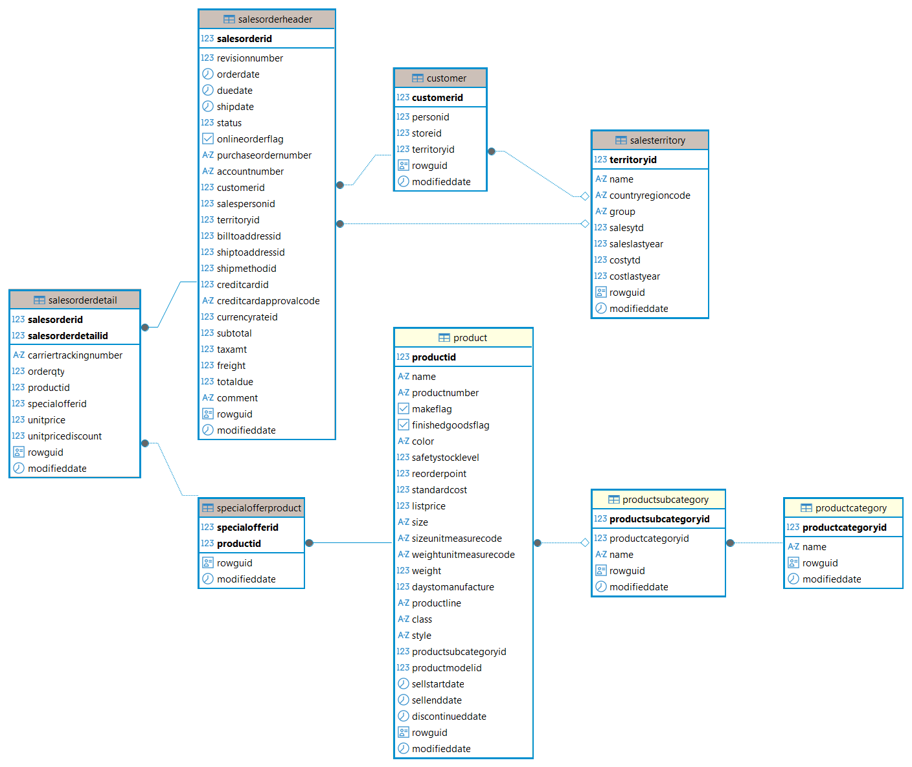

## Database Setup

This project uses the AdventureWorks sample database running on PostgreSQL.

### Data Source

The original AdventureWorks sample database was obtained through the [PostgreSQL Sample Databases catalog](https://wiki.postgresql.org/wiki/Sample_Databases).

This catalog references the AdventureWorks PostgreSQL port, which provides a PostgreSQL-compatible implementation of Microsoft's AdventureWorks database.

### Database Installation

A local PostgreSQL instance was installed and configured. The AdventureWorks database was then created and populated using the installation scripts provided by the PostgreSQL port.

```sql
CREATE DATABASE adventureworks;
```

The installation process automatically created the database schemas, tables, constraints, indexes, and relationships required by the AdventureWorks data model.

### Data Validation

After installation, a series of validation queries were executed to verify that the database had been populated correctly.

Representative row counts included:

| Table                  |    Rows |
| ---------------------- | ------: |
| sales.customer         |  19,820 |
| sales.salesorderheader |  31,465 |
| sales.salesorderdetail | 121,317 |
| production.product     |     504 |

An additional audit was performed to identify empty tables and validate the overall installation.

| Metric           | Value |
| ---------------- | ----: |
| Total Tables     |    68 |
| Populated Tables |    53 |
| Empty Tables     |    15 |

The empty tables correspond to optional entities that are not populated in the sample dataset and do not affect the analyses performed in this project.

### Customer Analytics ERD

A simplified analytical Entity Relationship Diagram (ERD) was created to document the subset of tables used throughout the project.



The analytical model focuses on customer, order, product, product category, and sales territory information, providing the foundation for:

* RFM analysis
* Customer segmentation
* Churn modelling
* Customer Lifetime Value (CLV) estimation
* Customer behavior analytics
