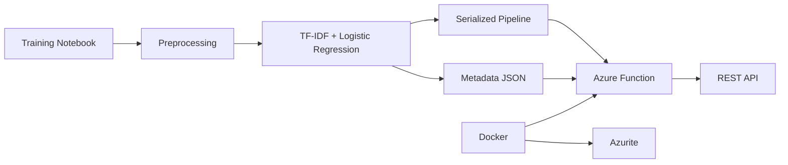
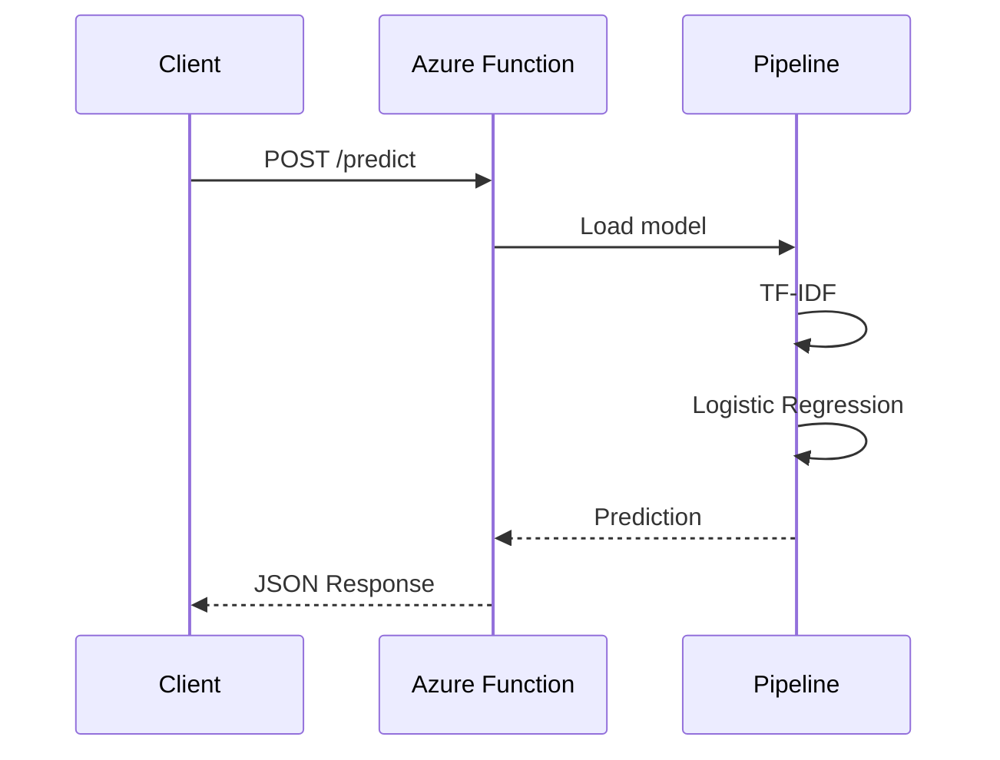

# System Architecture

> For a general project overview, installation instructions, and usage examples, see the main [README](README.md).

This document describes the architecture of the deployment layer implemented for the **Understanding Customer Feedback through NLP** project.

The objective of the deployment architecture is to expose a trained machine learning model through a lightweight REST API while remaining fully reproducible on a local development environment.

The solution intentionally uses technologies that are directly relevant to production machine learning workflows without introducing unnecessary infrastructure.

# High-Level Architecture



# Architecture Overview

The project is divided into two independent stages.

## Training

The training stage is responsible for:

- loading the Amazon Reviews dataset
- cleaning and preprocessing review text
- training the sentiment classifier
- evaluating model performance
- exporting the trained pipeline
- exporting model metadata

The output of this stage consists of two files:

```
sentiment_pipeline.joblib

sentiment_pipeline_metadata.json
```

These artifacts are considered immutable deployment assets.

# Inference

The deployment stage loads the exported model without requiring retraining.

The Azure Function performs the following operations:

1. Receive a JSON request.
2. Validate the payload.
3. Load the serialized pipeline.
4. Generate prediction probabilities.
5. Build a JSON response.
6. Return the prediction.

The deployment layer remains completely independent from the training notebook.

# Components

## Training Notebook

Responsible for:

- experimentation
- feature engineering
- model evaluation
- artifact generation

No deployment logic is included.

## Model Artifact

The trained pipeline is exported using Joblib.

The artifact contains:

- TF-IDF Vectorizer
- Logistic Regression model

Packaging preprocessing together with the classifier guarantees identical behaviour during inference.

## Metadata

The metadata file stores deployment information such as:

- model version
- dataset
- preprocessing settings
- evaluation metric
- training date
- random seed

Separating metadata from the serialized model simplifies version tracking.

## Azure Function

The Azure Function exposes two REST endpoints.

### Health

```
GET /api/health
```

Returns:

- service status
- model availability
- model version

### Prediction

```
POST /api/predict
```

Accepts:

```json
{
    "text":"..."
}
```

Returns:

```json
{
    "sentiment":"positive",
    "confidence":0.93,
    "probabilities":{...},
    "model_version":"1.0.0"
}
```

# Docker

Docker provides an isolated execution environment.

The deployment image contains:

- Python 3.11
- Azure Functions Runtime
- trained model
- metadata
- application source code

This guarantees reproducible execution across different machines.

# Azurite

The project uses Azurite to emulate Azure Storage locally.

No Azure subscription is required.

This allows Azure Functions to behave similarly to a cloud deployment while remaining completely local.

# Request Flow



# Design Decisions

Several design decisions were made intentionally.

## Classical NLP

A TF-IDF representation combined with Logistic Regression was selected because it provides:

- fast training
- strong interpretability
- lightweight deployment
- minimal inference latency

The objective of this project is to demonstrate deployment rather than maximize predictive accuracy.

## Azure Functions

Azure Functions were selected because they provide a lightweight serverless interface for model inference.

The resulting API closely resembles a production deployment while remaining simple enough for a portfolio project.

## Docker

Containerisation guarantees reproducibility.

Any user can rebuild the project using a single command without manually configuring Python or Azure Functions.

## Metadata Versioning

Model metadata is stored separately from the serialized pipeline.

This makes version management explicit and avoids embedding deployment information inside the model object itself.

# Project Scope

This project intentionally focuses on demonstrating an end-to-end machine learning workflow rather than a complete production platform.

Features intentionally left outside the current scope include:

- authentication
- model monitoring
- continuous deployment
- automatic retraining
- telemetry
- distributed inference
- model registry

These features can be incorporated in future iterations if required.