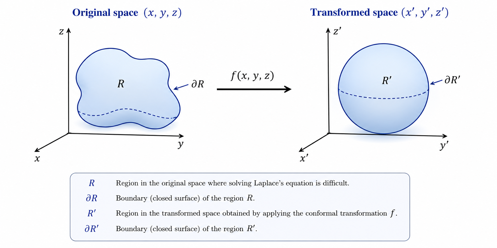
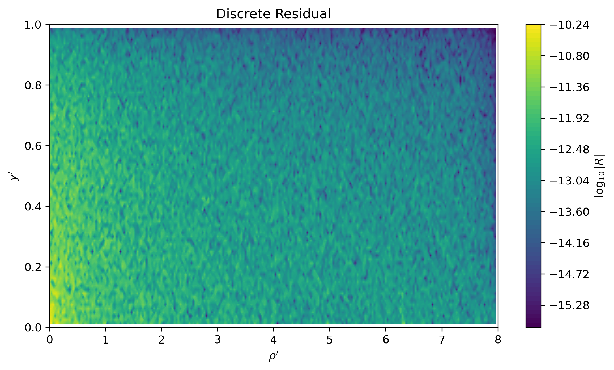
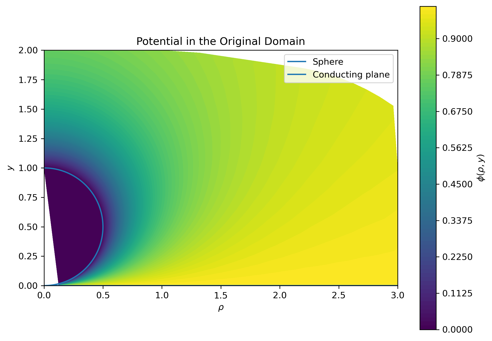
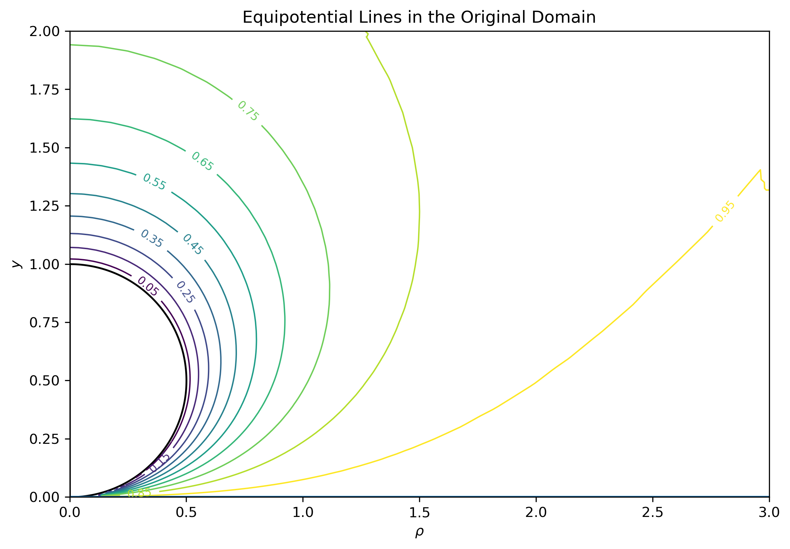
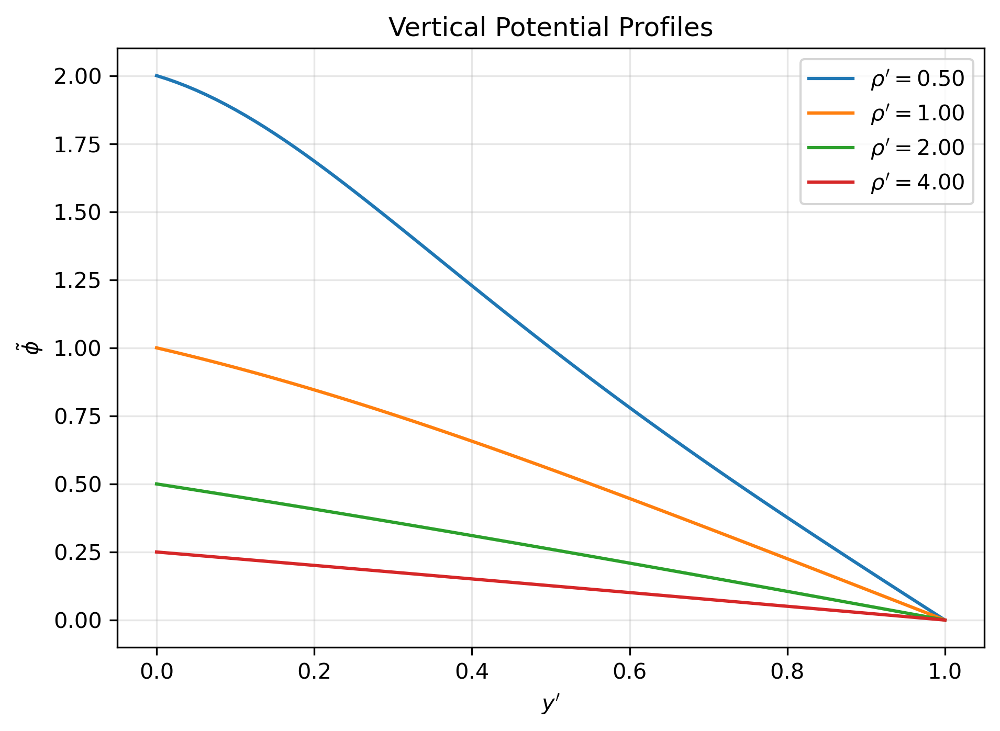
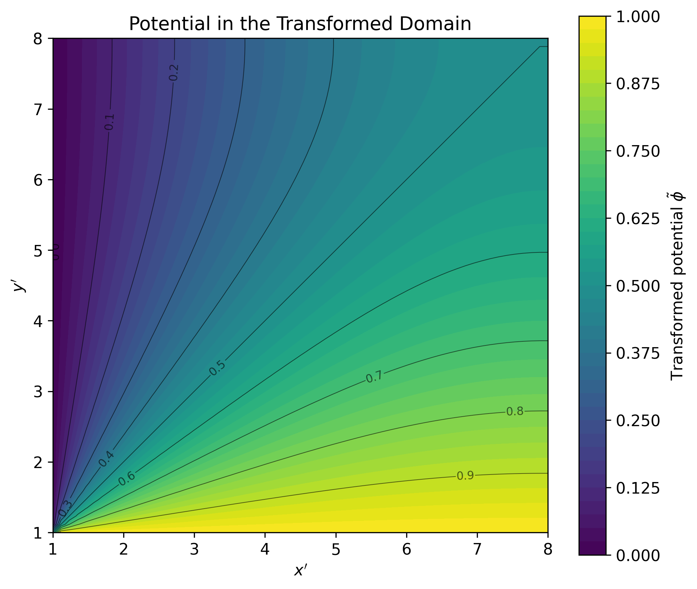
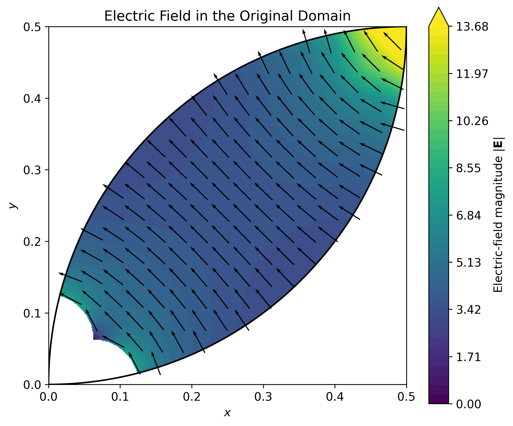

# The Invariance of Laplace's Equation

The study of harmonic functions is closely connected with the geometry of the underlying space. Since the Laplacian depends explicitly on the coordinate system, a natural question arises: under what transformations of space is Laplace's equation preserved?

The objective of this chapter is to answer this question by deriving the conditions that a coordinate transformation must satisfy in order to map harmonic functions into harmonic functions. We first motivate the problem through electrostatics and then investigate the invariance of the Laplacian, beginning with the classical two-dimensional case before extending the analysis to three dimensions.

## Physical Motivation

Laplace's equation arises naturally in many areas of mathematical physics. It governs scalar potentials in regions where no sources are present and appears in a wide variety of physical phenomena, including electrostatics, gravitation, incompressible fluid flow, and steady-state heat conduction. Although the mathematical structure is identical in each of these contexts, the present work is primarily motivated by electrostatics.

In electrostatic problems, the electric field is derived from a scalar potential,

$$
\mathbf{E} = -\nabla \phi.
$$ {#eq-electric-field-potential}

Gauss's law states that

$$
\nabla \cdot \mathbf{E}
=
\frac{\rho}{\varepsilon_0}.
$$ {#eq-gauss-law}

Substituting Equation [-@eq-electric-field-potential] into Equation [-@eq-gauss-law] immediately yields Poisson's equation,

$$
\nabla^2 \phi
=
-\frac{\rho}{\varepsilon_0}.
$$ {#eq-poisson-equation}

In charge-free regions, where the charge density vanishes ($\rho = 0$), Poisson's equation reduces to Laplace's equation,

$$
\nabla^2 \phi
=
0.
$$ {#eq-laplace-equation}

Consequently, every electrostatic problem outside the locations of electric charges is governed by harmonic functions. The geometry of these solutions is therefore intimately connected with the geometry of the underlying space. This naturally raises the following question: under what transformations of space does Laplace's equation preserve its form?

Answering this question is the first step toward understanding the role of conformal transformations in three-dimensional electrostatics.

## Problem Statement

Suppose we have a region

$$
R \subset \mathbb{R}^3
$$ {#eq-region-R}

in which a scalar field $\phi$ satisfies Laplace's equation [-@eq-laplace-equation].

We seek to determine the conditions under which a smooth transformation

$$
f : R \longrightarrow R'
$$ {#eq-transformation}

preserves the form of Laplace's equation. In other words, we ask under what circumstances the transformed potential remains harmonic in the new coordinate system.

Figure [-@fig-conformal-transformation] illustrates the geometric setting. A region $R$ with boundary $\partial R$ is mapped into a transformed region $R'$ by the transformation $f(x,y,z)$. Our objective is to identify the class of transformations for which harmonic functions remain harmonic after the mapping.

{#fig-conformal-transformation}

# Coordinate Transformations Preserving Laplace's Equation

Having formulated the problem, we now investigate the class of coordinate transformations under which Laplace's equation remains invariant. More precisely, we seek transformations that map harmonic functions into harmonic functions, thereby preserving the mathematical structure of electrostatic potential theory.

The analysis begins with the two-dimensional case. Although our primary interest lies in three-dimensional electrostatics, the planar setting provides an instructive example in which the required conditions are completely characterized by complex analysis through the Cauchy--Riemann equations. The derivation illustrates the fundamental mechanism by which the Laplacian transforms under a change of coordinates and establishes ideas that will later be generalized.

We then turn to the three-dimensional case, where the situation changes substantially. Unlike the plane, there is no direct analogue of complex analyticity, and the conditions required to preserve Laplace's equation become considerably more restrictive. Understanding this distinction is one of the main objectives of these notes.

## Two-Dimensional Case

Before addressing the three-dimensional problem, it is instructive to examine the corresponding result in two dimensions. In the plane, the conditions under which Laplace's equation remains invariant are well understood and provide valuable insight into the geometric structure that will later appear in three dimensions.

Consider a smooth coordinate transformation

$$
F(x,y)=\left(x'(x,y),\,y'(x,y)\right).
$$ {#eq-coordinate-transformation-2d}

Assuming that the scalar field is expressed in terms of the transformed coordinates,

$$
\phi=\phi(x',y'),
$$

the first derivatives with respect to the original coordinates are obtained by applying the multivariable chain rule,

$$
\begin{aligned}
\frac{\partial \phi}{\partial x}
&=
\frac{\partial \phi}{\partial x'}
\frac{\partial x'}{\partial x}
+
\frac{\partial \phi}{\partial y'}
\frac{\partial y'}{\partial x},
\\
\frac{\partial \phi}{\partial y}
&=
\frac{\partial \phi}{\partial x'}
\frac{\partial x'}{\partial y}
+
\frac{\partial \phi}{\partial y'}
\frac{\partial y'}{\partial y}.
\end{aligned}
$$ {#eq-first-derivative-chain-rule-2d}

To determine how the Laplacian transforms, the chain rule must be applied once again to obtain the second derivatives.

$$
\begin{aligned}
\frac{\partial^2 \phi}{\partial x^2}
&=
\frac{\partial}{\partial x}
\left(
\frac{\partial\phi}{\partial x'}
\right)
\frac{\partial x'}{\partial x}
+
\frac{\partial\phi}{\partial x'}
\frac{\partial^2x'}{\partial x^2}
\\
&
\qquad+
\frac{\partial}{\partial x}
\left(
\frac{\partial\phi}{\partial y'}
\right)
\frac{\partial y'}{\partial x}
+
\frac{\partial\phi}{\partial y'}
\frac{\partial^2y'}{\partial x^2}
\\
&=
\left(
\frac{\partial^2\phi}{\partial x'^2}
\frac{\partial x'}{\partial x}
+
\frac{\partial^2\phi}{\partial y'\partial x'}
\frac{\partial y'}{\partial x}
\right)
\frac{\partial x'}{\partial x}
+
\frac{\partial\phi}{\partial x'}
\frac{\partial^2x'}{\partial x^2}
\\
&
\qquad+
\left(
\frac{\partial^2\phi}{\partial y'^2}
\frac{\partial y'}{\partial x}
+
\frac{\partial^2\phi}{\partial x'\partial y'}
\frac{\partial x'}{\partial x}
\right)
\frac{\partial y'}{\partial x}
+
\frac{\partial\phi}{\partial y'}
\frac{\partial^2y'}{\partial x^2}.
\end{aligned}
$$ {#eq-second-derivative-x-chain-rule}

Similarly,

$$
\begin{aligned}
\frac{\partial^2 \phi}{\partial y^2}
&=
\frac{\partial}{\partial y}
\left(
\frac{\partial\phi}{\partial x'}
\right)
\frac{\partial x'}{\partial y}
+
\frac{\partial\phi}{\partial x'}
\frac{\partial^2x'}{\partial y^2}
\\
&
\qquad+
\frac{\partial}{\partial y}
\left(
\frac{\partial\phi}{\partial y'}
\right)
\frac{\partial y'}{\partial y}
+
\frac{\partial\phi}{\partial y'}
\frac{\partial^2y'}{\partial y^2}
\\
&=
\left(
\frac{\partial^2\phi}{\partial x'^2}
\frac{\partial x'}{\partial y}
+
\frac{\partial^2\phi}{\partial y'\partial x'}
\frac{\partial y'}{\partial y}
\right)
\frac{\partial x'}{\partial y}
+
\frac{\partial\phi}{\partial x'}
\frac{\partial^2x'}{\partial y^2}
\\
&
\qquad+
\left(
\frac{\partial^2\phi}{\partial y'^2}
\frac{\partial y'}{\partial y}
+
\frac{\partial^2\phi}{\partial x'\partial y'}
\frac{\partial x'}{\partial y}
\right)
\frac{\partial y'}{\partial y}
+
\frac{\partial\phi}{\partial y'}
\frac{\partial^2y'}{\partial y^2}.
\end{aligned}
$$ {#eq-second-derivative-y-chain-rule}

Assuming that $\phi$ is twice continuously differentiable, Clairaut's theorem guarantees the equality of mixed partial derivatives,

$$
\frac{\partial^2\phi}{\partial x'\partial y'}
=
\frac{\partial^2\phi}{\partial y'\partial x'}.
$$ {#eq-clairaut}

Adding Equations [-@eq-second-derivative-x-chain-rule] and [-@eq-second-derivative-y-chain-rule] gives

$$
\begin{aligned}
\frac{\partial^2\phi}{\partial x^2}
+
\frac{\partial^2\phi}{\partial y^2}
&=
\frac{\partial^2\phi}{\partial x'^2}
\left[
\left(
\frac{\partial x'}{\partial x}
\right)^2
+
\left(
\frac{\partial x'}{\partial y}
\right)^2
\right]
\\
&
\quad+
\frac{\partial^2\phi}{\partial y'^2}
\left[
\left(
\frac{\partial y'}{\partial x}
\right)^2
+
\left(
\frac{\partial y'}{\partial y}
\right)^2
\right]
\\
&
\quad+
2
\frac{\partial^2\phi}{\partial x'\partial y'}
\left(
\frac{\partial x'}{\partial x}
\frac{\partial y'}{\partial x}
+
\frac{\partial x'}{\partial y}
\frac{\partial y'}{\partial y}
\right)
\\
&
\quad+
\frac{\partial\phi}{\partial x'}
\left(
\frac{\partial^2x'}{\partial x^2}
+
\frac{\partial^2x'}{\partial y^2}
\right)
\\
&
\quad+
\frac{\partial\phi}{\partial y'}
\left(
\frac{\partial^2y'}{\partial x^2}
+
\frac{\partial^2y'}{\partial y^2}
\right).
\end{aligned}
$$ {#eq-sum-second-derivative-2d-1}

The expression above simplifies considerably if the transformation is conformal. In two dimensions, conformality is equivalent to the Cauchy--Riemann equations,

$$
\begin{aligned}
\frac{\partial x'}{\partial x}
&=
\frac{\partial y'}{\partial y},
\\
\frac{\partial y'}{\partial x}
&=
-
\frac{\partial x'}{\partial y}.
\end{aligned}
$$ {#eq-cauchy-riemann}

These relations imply that the Jacobian of the transformation can be written as

$$
\begin{aligned}
\frac{\partial(x',y')}{\partial(x,y)}
&=
\det
\begin{bmatrix}
\dfrac{\partial x'}{\partial x} &
\dfrac{\partial x'}{\partial y}
\\
\dfrac{\partial y'}{\partial x} &
\dfrac{\partial y'}{\partial y}
\end{bmatrix}
\\
&=
\left(
\frac{\partial x'}{\partial x}
\right)^2
+
\left(
\frac{\partial x'}{\partial y}
\right)^2
\\
&=
\left(
\frac{\partial y'}{\partial x}
\right)^2
+
\left(
\frac{\partial y'}{\partial y}
\right)^2.
\end{aligned}
$$ {#eq-jacobian}

Furthermore, the Cauchy--Riemann equations imply that each coordinate function is harmonic,

$$
\begin{aligned}
\nabla^2x'
&=
0,
\\
\nabla^2y'
&=
0.
\end{aligned}
$$ {#eq-harmonic-functions}

They also imply the orthogonality relation

$$
\frac{\partial x'}{\partial x}
\frac{\partial y'}{\partial x}
+
\frac{\partial x'}{\partial y}
\frac{\partial y'}{\partial y}
=
0.
$$ {#eq-orthogonality-condition}

Substituting Equations [-@eq-jacobian], [-@eq-harmonic-functions] and [-@eq-orthogonality-condition] into Equation [-@eq-sum-second-derivative-2d-1] yields

$$
\frac{\partial^2\phi}{\partial x^2}
+
\frac{\partial^2\phi}{\partial y^2}
=
\frac{\partial(x',y')}{\partial(x,y)}
\left(
\frac{\partial^2\phi}{\partial x'^2}
+
\frac{\partial^2\phi}{\partial y'^2}
\right).
$$ {#eq-sum-second-derivative-2d-2}

Equation [-@eq-sum-second-derivative-2d-2] shows that the Laplacian is preserved up to multiplication by the Jacobian of the coordinate transformation. Consequently, provided that the Jacobian does not vanish, a harmonic function in one coordinate system remains harmonic in the transformed coordinate system.

Therefore, in two dimensions, the transformation

$$
F(x,y)
=
\left(
x'(x,y),
y'(x,y)
\right)
$$ {#eq-conformal-transformation-2d}

preserves Laplace's equation if the following conditions are satisfied:

1. The coordinate functions $x'$ and $y'$ are continuously differentiable.
2. They satisfy the Cauchy-Riemann equations.
3. The Jacobian of the transformation is nonzero.

## Three-Dimensional Case

We now extend the previous analysis to three dimensions. As in the two-dimensional case, our objective is to determine the class of coordinate transformations under which Laplace's equation remains invariant. The derivation follows the same general strategy, beginning with the application of the multivariable chain rule to express derivatives with respect to the original coordinates in terms of those in the transformed coordinate system.

Let

$$
(x,y,z)\longmapsto(x',y',z')
$$

be a continuously differentiable transformation in $\mathbb{R}^3$. Applying the chain rule to the first derivatives of the scalar field $\phi$ gives

$$
\begin{aligned}
&
\frac{\partial \phi}{\partial x} =
\frac{\partial \phi}{\partial x'} \frac{\partial x'}{\partial x}
+
\frac{\partial \phi}{\partial y'} \frac{\partial y'}{\partial x}
+
\frac{\partial \phi}{\partial z'} \frac{\partial z'}{\partial x}
\\
&
\frac{\partial \phi}{\partial y} =
\frac{\partial \phi}{\partial x'} \frac{\partial x'}{\partial y}
+
\frac{\partial \phi}{\partial y'} \frac{\partial y'}{\partial y}
+
\frac{\partial \phi}{\partial z'} \frac{\partial z'}{\partial y}
\\
&
\frac{\partial \phi}{\partial z} =
\frac{\partial \phi}{\partial x'} \frac{\partial x'}{\partial z}
+
\frac{\partial \phi}{\partial y'} \frac{\partial y'}{\partial z}
+
\frac{\partial \phi}{\partial z'} \frac{\partial z'}{\partial z}
\end{aligned}
$$ {#eq-first-derivative-chain-rule-3d}

These identities constitute the starting point for the derivation of the transformed Laplacian. By differentiating them once more with respect to the original coordinates, we obtain the expressions for the second derivatives required to analyze the invariance of Laplace's equation.

Differentiating the first of the relations in @eq-first-derivative-chain-rule-3d once more with respect to $x$ and applying the chain rule repeatedly, we obtain

$$
\begin{aligned}
\frac{\partial^2 \phi}{\partial x^2}
&=
\frac{\partial}{\partial x}
\left(
\frac{\partial\phi}{\partial x'}
\right)
\frac{\partial x'}{\partial x}
+
\frac{\partial\phi}{\partial x'}
\frac{\partial^2x'}{\partial x^2}
\\
&
\qquad+
\frac{\partial}{\partial x}
\left(
\frac{\partial\phi}{\partial y'}
\right)
\frac{\partial y'}{\partial x}
+
\frac{\partial\phi}{\partial y'}
\frac{\partial^2y'}{\partial x^2}
\\
&
\qquad+
\frac{\partial}{\partial x}
\left(
\frac{\partial\phi}{\partial z'}
\right)
\frac{\partial z'}{\partial x}
+
\frac{\partial\phi}{\partial y'}
\frac{\partial^2z'}{\partial x^2}
\\
&=
\left(
\frac{\partial^2\phi}{\partial x'^2}
\frac{\partial x'}{\partial x}
+
\frac{\partial^2\phi}{\partial y'\partial x'}
\frac{\partial y'}{\partial x}
+
\frac{\partial^2\phi}{\partial z'\partial x'}
\frac{\partial z'}{\partial x}
\right)
\frac{\partial x'}{\partial x}
+
\frac{\partial\phi}{\partial x'}
\frac{\partial^2x'}{\partial x^2}
\\
&
\qquad+
\left(
\frac{\partial^2\phi}{\partial y'^2}
\frac{\partial y'}{\partial x}
+
\frac{\partial^2\phi}{\partial x'\partial y'}
\frac{\partial x'}{\partial x}
+
\frac{\partial^2\phi}{\partial y'\partial z'}
\frac{\partial z'}{\partial x}
\right)
\frac{\partial y'}{\partial x}
+
\frac{\partial\phi}{\partial y'}
\frac{\partial^2y'}{\partial x^2}
\\
&
\qquad+
\left(
\frac{\partial^2\phi}{\partial z'^2}
\frac{\partial z'}{\partial x}
+
\frac{\partial^2\phi}{\partial x'\partial z'}
\frac{\partial x'}{\partial x}
+
\frac{\partial^2\phi}{\partial y'\partial z'}
\frac{\partial y'}{\partial x}
\right)
\frac{\partial z'}{\partial x}
+
\frac{\partial\phi}{\partial z'}
\frac{\partial^2z'}{\partial z^2}.
\end{aligned}
$$ {#eq-second-derivative-x-chain-rule-3d}

Differentiating the remaining identities in @eq-first-derivative-chain-rule-3d with respect to $y$ and $z$, respectively, yields the corresponding expressions

$$
\begin{aligned}
\frac{\partial^2 \phi}{\partial y^2}
&=
\frac{\partial}{\partial y}
\left(
\frac{\partial\phi}{\partial x'}
\right)
\frac{\partial x'}{\partial y}
+
\frac{\partial\phi}{\partial x'}
\frac{\partial^2x'}{\partial y^2}
\\
&\qquad+
\frac{\partial}{\partial y}
\left(
\frac{\partial\phi}{\partial y'}
\right)
\frac{\partial y'}{\partial y}
+
\frac{\partial\phi}{\partial y'}
\frac{\partial^2y'}{\partial y^2}
\\
&\qquad+
\frac{\partial}{\partial y}
\left(
\frac{\partial\phi}{\partial z'}
\right)
\frac{\partial z'}{\partial y}
+
\frac{\partial\phi}{\partial z'}
\frac{\partial^2z'}{\partial y^2}
\\[6pt]
&=
\left(
\frac{\partial^2\phi}{\partial x'^2}
\frac{\partial x'}{\partial y}
+
\frac{\partial^2\phi}{\partial y'\partial x'}
\frac{\partial y'}{\partial y}
+
\frac{\partial^2\phi}{\partial z'\partial x'}
\frac{\partial z'}{\partial y}
\right)
\frac{\partial x'}{\partial y}
+
\frac{\partial\phi}{\partial x'}
\frac{\partial^2x'}{\partial y^2}
\\
&\qquad+
\left(
\frac{\partial^2\phi}{\partial y'^2}
\frac{\partial y'}{\partial y}
+
\frac{\partial^2\phi}{\partial x'\partial y'}
\frac{\partial x'}{\partial y}
+
\frac{\partial^2\phi}{\partial z'\partial y'}
\frac{\partial z'}{\partial y}
\right)
\frac{\partial y'}{\partial y}
+
\frac{\partial\phi}{\partial y'}
\frac{\partial^2y'}{\partial y^2}
\\
&\qquad+
\left(
\frac{\partial^2\phi}{\partial z'^2}
\frac{\partial z'}{\partial y}
+
\frac{\partial^2\phi}{\partial x'\partial z'}
\frac{\partial x'}{\partial y}
+
\frac{\partial^2\phi}{\partial y'\partial z'}
\frac{\partial y'}{\partial y}
\right)
\frac{\partial z'}{\partial y}
+
\frac{\partial\phi}{\partial z'}
\frac{\partial^2z'}{\partial y^2}.
\end{aligned}
$$ {#eq-second-derivative-y-chain-rule-3d}

$$
\begin{aligned}
\frac{\partial^2 \phi}{\partial z^2}
&=
\frac{\partial}{\partial z}
\left(
\frac{\partial\phi}{\partial x'}
\right)
\frac{\partial x'}{\partial z}
+
\frac{\partial\phi}{\partial x'}
\frac{\partial^2x'}{\partial z^2}
\\
&\qquad+
\frac{\partial}{\partial z}
\left(
\frac{\partial\phi}{\partial y'}
\right)
\frac{\partial y'}{\partial z}
+
\frac{\partial\phi}{\partial y'}
\frac{\partial^2y'}{\partial z^2}
\\
&\qquad+
\frac{\partial}{\partial z}
\left(
\frac{\partial\phi}{\partial z'}
\right)
\frac{\partial z'}{\partial z}
+
\frac{\partial\phi}{\partial z'}
\frac{\partial^2z'}{\partial z^2}
\\[6pt]
&=
\left(
\frac{\partial^2\phi}{\partial x'^2}
\frac{\partial x'}{\partial z}
+
\frac{\partial^2\phi}{\partial y'\partial x'}
\frac{\partial y'}{\partial z}
+
\frac{\partial^2\phi}{\partial z'\partial x'}
\frac{\partial z'}{\partial z}
\right)
\frac{\partial x'}{\partial z}
+
\frac{\partial\phi}{\partial x'}
\frac{\partial^2x'}{\partial z^2}
\\
&\qquad+
\left(
\frac{\partial^2\phi}{\partial y'^2}
\frac{\partial y'}{\partial z}
+
\frac{\partial^2\phi}{\partial x'\partial y'}
\frac{\partial x'}{\partial z}
+
\frac{\partial^2\phi}{\partial z'\partial y'}
\frac{\partial z'}{\partial z}
\right)
\frac{\partial y'}{\partial z}
+
\frac{\partial\phi}{\partial y'}
\frac{\partial^2y'}{\partial z^2}
\\
&\qquad+
\left(
\frac{\partial^2\phi}{\partial z'^2}
\frac{\partial z'}{\partial z}
+
\frac{\partial^2\phi}{\partial x'\partial z'}
\frac{\partial x'}{\partial z}
+
\frac{\partial^2\phi}{\partial y'\partial z'}
\frac{\partial y'}{\partial z}
\right)
\frac{\partial z'}{\partial z}
+
\frac{\partial\phi}{\partial z'}
\frac{\partial^2z'}{\partial z^2}.
\end{aligned}
$$ {#eq-second-derivative-z-chain-rule-3d}

Applying the same procedure to the derivatives with respect to $y$ and $z$, and adding the resulting expressions, we obtain the transformed Laplacian. Assuming that the coordinate functions are twice continuously differentiable, the mixed second derivatives commute, allowing like terms to be grouped together. The resulting expression is

$$
\begin{aligned}
\frac{\partial^2 \phi}{\partial x^2}
+
\frac{\partial^2 \phi}{\partial y^2}
+
\frac{\partial^2 \phi}{\partial z^2}
&=
\frac{\partial^2 \phi}{\partial x'^2}
    \left[
        \left( \frac{\partial x'}{\partial x} \right)^2
        + \left( \frac{\partial x'}{\partial y} \right)^2
        + \left( \frac{\partial x'}{\partial z} \right)^2
    \right]
\\
&\quad+
\frac{\partial^2 \phi}{\partial y'^2}
    \left[
        \left( \frac{\partial y'}{\partial x} \right)^2
        + \left( \frac{\partial y'}{\partial y} \right)^2
        + \left( \frac{\partial y'}{\partial z} \right)^2
    \right]
\\
&\quad+
\frac{\partial^2 \phi}{\partial z'^2}
    \left[
        \left( \frac{\partial z'}{\partial x} \right)^2
        + \left( \frac{\partial z'}{\partial y} \right)^2
        + \left( \frac{\partial z'}{\partial z} \right)^2
    \right]
\\
&\quad+
2 \frac{\partial^2 \phi}{\partial x' \partial y'}
    \left[
        \frac{\partial x'}{\partial x}\frac{\partial y'}{\partial x}
        + \frac{\partial x'}{\partial y}\frac{\partial y'}{\partial y}
        + \frac{\partial x'}{\partial z}\frac{\partial y'}{\partial z}
    \right]
\\
&\quad+
2 \frac{\partial^2 \phi}{\partial x' \partial z'}
    \left[
        \frac{\partial x'}{\partial x}\frac{\partial z'}{\partial x}
        + \frac{\partial x'}{\partial y}\frac{\partial z'}{\partial y}
        + \frac{\partial x'}{\partial z}\frac{\partial z'}{\partial z}
    \right]
\\
&\quad+
2 \frac{\partial^2 \phi}{\partial y' \partial z'}
    \left[
        \frac{\partial y'}{\partial x}\frac{\partial z'}{\partial x}
        + \frac{\partial y'}{\partial y}\frac{\partial z'}{\partial y}
        + \frac{\partial y'}{\partial z}\frac{\partial z'}{\partial z}
    \right]
\\
&\quad+
\frac{\partial \phi}{\partial x'}
    \left[
        \frac{\partial^2 x'}{\partial x^2}
        + \frac{\partial^2 x'}{\partial y^2}
        + \frac{\partial^2 x'}{\partial z^2}
    \right]
\\
&\quad+
\frac{\partial \phi}{\partial y'}
    \left[
        \frac{\partial^2 y'}{\partial x^2}
        + \frac{\partial^2 y'}{\partial y^2}
        + \frac{\partial^2 y'}{\partial z^2}
    \right]
\\
&\quad+
\frac{\partial \phi}{\partial z'}
    \left[
        \frac{\partial^2 z'}{\partial x^2}
        + \frac{\partial^2 z'}{\partial y^2}
        + \frac{\partial^2 z'}{\partial z^2}
    \right].
\end{aligned}
$$ {#eq-laplacian-chain-rule-3d}

To identify the transformations that preserve the form of Laplace's equation, we now impose a set of first-order differential relations that play the role of the Cauchy-Riemann equations in three dimensions. As in the two-dimensional case, these relations will be shown to imply both the orthogonality of the transformed coordinate gradients and the harmonicity of the coordinate functions, which are precisely the conditions required to simplify @eq-laplacian-chain-rule-3d.

For convenience, we introduce the notation

$$
x_1=x,\qquad
x_2=y,\qquad
x_3=z,
$$

and similarly

$$
x'_1=x',\qquad
x'_2=y',\qquad
x'_3=z'.
$$

The first member of the three-dimensional Cauchy-Riemann system is

$$
\partial_i x'_1
=
\varepsilon_{ijk} \partial_j x'_2 \partial_k x'_3
$$ {#eq-cauchy-riemann-3d-x1}

Expanding @eq-cauchy-riemann-3d-x1 componentwise gives

$$
\begin{aligned}
\partial_1 x'_1 &= \partial_2 x'_2 \partial_3 x'_3 - \partial_3 x'_2 \partial_2 x'_3, \\[6pt]
\partial_2 x'_1 &= \partial_3 x'_2 \partial_1 x'_3 - \partial_1 x'_2 \partial_3 x'_3, \\[6pt]
\partial_3 x'_1 &= \partial_1 x'_2 \partial_2 x'_3 - \partial_2 x'_2 \partial_1 x'_3.
\end{aligned}
$$ {#eq-cauchy-riemann-3d-complete-x1}

Multiplying each equation in @eq-cauchy-riemann-3d-complete-x1 by the corresponding partial derivative of $x'_2$ yields

$$
\begin{aligned}
\partial_1 x'_1 \partial_1 x'_2 
&= \partial_1 x'_2 \partial_2 x'_2 \partial_3 x'_3 - \partial_1 x'_2 \partial_3 x'_2 \partial_2 x'_3, \\[6pt]
\partial_2 x'_1 \partial_2 x'_2 
&= \partial_2 x'_2 \partial_3 x'_2 \partial_1 x'_3 - \partial_1 x'_2 \partial_2 x'_2 \partial_3 x'_3, \\[6pt]
\partial_3 x'_1 \partial_3 x'_2 
&= \partial_1 x'_2 \partial_3 x'_2 \partial_2 x'_3 - \partial_2 x'_2 \partial_3 x'_2 \partial_1 x'_3.
\end{aligned}
$$ {#eq-cauchy-riemann-products-12}

Summing the three identities, all cubic terms cancel pairwise, giving

$$
\begin{aligned}
\nabla x'_1 \cdot \nabla x'_2
&= 
{\color{red}\partial_1 x'_2 \partial_2 x'_2 \partial_3 x'_3} 
- {\color{blue}\partial_1 x'_2 \partial_3 x'_2 \partial_2 x'_3} \\
&\quad + {\color{green}\partial_2 x'_2 \partial_3 x'_2 \partial_1 x'_3} 
- {\color{red}\partial_1 x'_2 \partial_2 x'_2 \partial_3 x'_3} \\
&\quad + {\color{blue}\partial_1 x'_2 \partial_3 x'_2 \partial_2 x'_3} 
- {\color{green}\partial_2 x'_2 \partial_3 x'_2 \partial_1 x'_3} \\[6pt]
&= 0.
\end{aligned}
$$ {#eq-orthogonality-12}

Repeating the same argument after multiplying the relations in @eq-cauchy-riemann-3d-complete-x1 by the corresponding partial derivatives of $x'_3$ yields

$$
\begin{aligned}
\partial_1 x'_1 \partial_1 x'_3 
&= \partial_2 x'_2 \partial_3 x'_3 \partial_1 x'_3 - \partial_3 x'_2 \partial_2 x'_3 \partial_1 x'_3, \\[6pt]
\partial_2 x'_1 \partial_2 x'_3 
&= \partial_3 x'_2 \partial_1 x'_3 \partial_2 x'_3 - \partial_1 x'_2 \partial_3 x'_3 \partial_2 x'_3, \\[6pt]
\partial_3 x'_1 \partial_3 x'_3 
&= \partial_1 x'_2 \partial_2 x'_3 \partial_3 x'_3 - \partial_2 x'_2 \partial_1 x'_3 \partial_3 x'_3.
\end{aligned}
$$ {#eq-cauchy-riemann-products-13}

which immediately implies

$$
\begin{aligned}
\nabla x'_1 \cdot \nabla x'_3
&= 
{\color{red}\partial_2 x'_2 \partial_3 x'_3 \partial_1 x'_3} 
- {\color{blue}\partial_3 x'_2 \partial_2 x'_3 \partial_1 x'_3} \\
&\quad + {\color{green}\partial_3 x'_2 \partial_1 x'_3 \partial_2 x'_3} 
- {\color{red}\partial_1 x'_2 \partial_3 x'_3 \partial_2 x'_3} \\
&\quad + {\color{blue}\partial_1 x'_2 \partial_2 x'_3 \partial_3 x'_3} 
- {\color{green}\partial_2 x'_2 \partial_1 x'_3 \partial_3 x'_3} \\[6pt]
&= 0.
\end{aligned}
$$ {#eq-orthogonality-13}

The same system of differential relations also implies that the transformed coordinate function $x'_1$ is harmonic. Assuming that the coordinate functions are twice continuously differentiable, differentiating the identities in @eq-cauchy-riemann-3d-complete-x1 with respect to the corresponding coordinates gives

$$
\begin{aligned}
\partial^2_{11} x'_1 &= \partial^2_{12} x'_2 \partial_3 x'_3 + \partial_2 x'_2 \partial^2_{13} x'_3 
                       - \partial^2_{13} x'_2 \partial_2 x'_3 - \partial_3 x'_2 \partial^2_{12} x'_3, \\[6pt]
\partial^2_{22} x'_1 &= \partial^2_{23} x'_2 \partial_1 x'_3 + \partial_3 x'_2 \partial^2_{21} x'_3 
                       - \partial^2_{21} x'_2 \partial_3 x'_3 - \partial_1 x'_2 \partial^2_{23} x'_3, \\[6pt]
\partial^2_{33} x'_1 &= \partial^2_{31} x'_2 \partial_2 x'_3 + \partial_1 x'_2 \partial^2_{32} x'_3 
                       - \partial^2_{32} x'_2 \partial_1 x'_3 - \partial_2 x'_2 \partial^2_{31} x'_3.
\end{aligned}
$$ {#eq-second-derivatives-x1-diagonal}

Adding the three expressions and using the commutativity of mixed second derivatives, all terms cancel pairwise, leading to

$$
\begin{aligned}
\nabla^2 x'_1 
&= \partial^2_{11} x'_1 + \partial^2_{22} x'_1 + \partial^2_{33} x'_1 \\[6pt]
&= \big( \partial^2_{12} x'_2 \partial_3 x'_3 + \partial_2 x'_2 \partial^2_{13} x'_3 
      - \partial^2_{13} x'_2 \partial_2 x'_3 - \partial_3 x'_2 \partial^2_{12} x'_3 \big) \\
&\quad + \big( \partial^2_{23} x'_2 \partial_1 x'_3 + \partial_3 x'_2 \partial^2_{21} x'_3 
      - \partial^2_{21} x'_2 \partial_3 x'_3 - \partial_1 x'_2 \partial^2_{23} x'_3 \big) \\
&\quad + \big( \partial^2_{31} x'_2 \partial_2 x'_3 + \partial_1 x'_2 \partial^2_{32} x'_3 
      - \partial^2_{32} x'_2 \partial_1 x'_3 - \partial_2 x'_2 \partial^2_{31} x'_3 \big) \\[6pt]
&= 0.
\end{aligned}
$$ {#eq-laplacian-x1-zero}

The second member of the three-dimensional Cauchy-Riemann system is obtained by cyclic permutation of the transformed coordinates,

$$
\partial_i x'_2
=
\varepsilon_{ijk} \partial_j x'_3 \partial_k x'_1
$$ {#eq-cauchy-riemann-3d-x2}

Expanding @eq-cauchy-riemann-3d-x2 componentwise gives

$$
\begin{aligned}
\partial_1 x'_2 &= \partial_2 x'_3 \partial_3 x'_1 - \partial_3 x'_3 \partial_2 x'_1, \\[6pt]
\partial_2 x'_2 &= \partial_3 x'_3 \partial_1 x'_1 - \partial_1 x'_3 \partial_3 x'_1, \\[6pt]
\partial_3 x'_2 &= \partial_1 x'_3 \partial_2 x'_1 - \partial_2 x'_3 \partial_1 x'_1.
\end{aligned}
$$ {#eq-cauchy-riemann-3d-complete-x2}

Multiplying each equation in @eq-cauchy-riemann-3d-complete-x2 by the corresponding partial derivatives of $x'_1$ and $x'_3$ yields

$$
\begin{aligned}
\partial_1 x'_2 \partial_1 x'_1 
&= \partial_2 x'_3 \partial_3 x'_1 \partial_1 x'_1 - \partial_3 x'_3 \partial_2 x'_1 \partial_1 x'_1, \\[6pt]
\partial_2 x'_2 \partial_2 x'_1 
&= \partial_3 x'_3 \partial_1 x'_1 \partial_2 x'_1 - \partial_1 x'_3 \partial_3 x'_1 \partial_2 x'_1, \\[6pt]
\partial_3 x'_2 \partial_3 x'_1 
&= \partial_1 x'_3 \partial_2 x'_1 \partial_3 x'_1 - \partial_2 x'_3 \partial_1 x'_1 \partial_3 x'_1.
\end{aligned}
$$ {#eq-cauchy-riemann-products-21}

and

$$
\begin{aligned}
\partial_1 x'_2 \partial_1 x'_3 
&= \partial_2 x'_3 \partial_3 x'_1 \partial_1 x'_3 - \partial_3 x'_3 \partial_2 x'_1 \partial_1 x'_3, \\[6pt]
\partial_2 x'_2 \partial_2 x'_3 
&= \partial_3 x'_3 \partial_1 x'_1 \partial_2 x'_3 - \partial_1 x'_3 \partial_3 x'_1 \partial_2 x'_3, \\[6pt]
\partial_3 x'_2 \partial_3 x'_3 
&= \partial_1 x'_3 \partial_2 x'_1 \partial_3 x'_3 - \partial_2 x'_3 \partial_1 x'_1 \partial_3 x'_3.
\end{aligned}
$$ {#eq-cauchy-riemann-products-23}

Summing the corresponding identities, all cubic terms cancel pairwise, yielding

$$
\begin{aligned}
\nabla x'_2 \cdot \nabla x'_1
&= 
{\color{red}\partial_2 x'_3 \partial_3 x'_1 \partial_1 x'_1} 
- {\color{blue}\partial_3 x'_3 \partial_2 x'_1 \partial_1 x'_1} \\
&\quad + {\color{green}\partial_3 x'_3 \partial_1 x'_1 \partial_2 x'_1} 
- {\color{red}\partial_1 x'_3 \partial_3 x'_1 \partial_2 x'_1} \\
&\quad + {\color{blue}\partial_1 x'_3 \partial_2 x'_1 \partial_3 x'_1} 
- {\color{green}\partial_2 x'_3 \partial_1 x'_1 \partial_3 x'_1} \\[6pt]
&= 0.
\end{aligned}
$$ {#eq-orthogonality-21}

and

$$
\begin{aligned}
\nabla x'_2 \cdot \nabla x'_3
&= 
{\color{red}\partial_2 x'_3 \partial_3 x'_1 \partial_1 x'_3} 
- {\color{blue}\partial_3 x'_3 \partial_2 x'_1 \partial_1 x'_3} \\
&\quad + {\color{green}\partial_3 x'_3 \partial_1 x'_1 \partial_2 x'_3} 
- {\color{red}\partial_1 x'_3 \partial_3 x'_1 \partial_2 x'_3} \\
&\quad + {\color{blue}\partial_1 x'_3 \partial_2 x'_1 \partial_3 x'_3} 
- {\color{green}\partial_2 x'_3 \partial_1 x'_1 \partial_3 x'_3} \\[6pt]
&= 0.
\end{aligned}
$$ {#eq-orthogonality-23}

The same differential relations also imply that the transformed coordinate function $x'_2$ is harmonic. Assuming that the coordinate functions are twice continuously differentiable, differentiating the identities in @eq-cauchy-riemann-3d-complete-x2 with respect to the corresponding coordinates gives

$$
\begin{aligned}
\partial^2_{11} x'_2 &= \partial^2_{12} x'_3 \partial_3 x'_1 + \partial_2 x'_3 \partial^2_{13} x'_1 
                       - \partial^2_{13} x'_3 \partial_2 x'_1 - \partial_3 x'_3 \partial^2_{12} x'_1, \\[6pt]
\partial^2_{22} x'_2 &= \partial^2_{23} x'_3 \partial_1 x'_1 + \partial_3 x'_3 \partial^2_{21} x'_1 
                       - \partial^2_{21} x'_3 \partial_3 x'_1 - \partial_1 x'_3 \partial^2_{23} x'_1, \\[6pt]
\partial^2_{33} x'_2 &= \partial^2_{31} x'_3 \partial_2 x'_1 + \partial_1 x'_3 \partial^2_{32} x'_1 
                       - \partial^2_{32} x'_3 \partial_1 x'_1 - \partial_2 x'_3 \partial^2_{31} x'_1.
\end{aligned}
$$ {#eq-second-derivatives-x2-diagonal}

Adding the three expressions and using the commutativity of mixed second derivatives, all terms cancel pairwise, leading to

$$
\begin{aligned}
\nabla^2 x'_2 
&= \partial^2_{11} x'_2 + \partial^2_{22} x'_2 + \partial^2_{33} x'_2 \\[6pt]
&= \big( \partial^2_{12} x'_3 \partial_3 x'_1 + \partial_2 x'_3 \partial^2_{13} x'_1 
      - \partial^2_{13} x'_3 \partial_2 x'_1 - \partial_3 x'_3 \partial^2_{12} x'_1 \big) \\
&\quad + \big( \partial^2_{23} x'_3 \partial_1 x'_1 + \partial_3 x'_3 \partial^2_{21} x'_1 
      - \partial^2_{21} x'_3 \partial_3 x'_1 - \partial_1 x'_3 \partial^2_{23} x'_1 \big) \\
&\quad + \big( \partial^2_{31} x'_3 \partial_2 x'_1 + \partial_1 x'_3 \partial^2_{32} x'_1 
      - \partial^2_{32} x'_3 \partial_1 x'_1 - \partial_2 x'_3 \partial^2_{31} x'_1 \big) \\[6pt]
&= 0.
\end{aligned}
$$ {#eq-laplacian-x2-zero}

The third member of the three-dimensional Cauchy-Riemann system is obtained by the remaining cyclic permutation of the transformed coordinates,

$$
\partial_i x'_3
=
\varepsilon_{ijk} \partial_j x'_1 \partial_k x'_2
$$ {#eq-cauchy-riemann-3d-x3}

Expanding @eq-cauchy-riemann-3d-x3 componentwise gives

$$
\begin{aligned}
\partial_1 x'_3 &= \partial_2 x'_1 \partial_3 x'_2 - \partial_3 x'_1 \partial_2 x'_2, \\[6pt]
\partial_2 x'_3 &= \partial_3 x'_1 \partial_1 x'_2 - \partial_1 x'_1 \partial_3 x'_2, \\[6pt]
\partial_3 x'_3 &= \partial_1 x'_1 \partial_2 x'_2 - \partial_2 x'_1 \partial_1 x'_2.
\end{aligned}
$$ {#eq-cauchy-riemann-3d-complete-x3}

Multiplying each equation in @eq-cauchy-riemann-3d-complete-x3 by the corresponding partial derivatives of $x'_1$ and $x'_2$ yields

$$
\begin{aligned}
\partial_1 x'_3 \partial_1 x'_1 
&= \partial_2 x'_1 \partial_3 x'_2 \partial_1 x'_1 - \partial_3 x'_1 \partial_2 x'_2 \partial_1 x'_1, \\[6pt]
\partial_2 x'_3 \partial_2 x'_1 
&= \partial_3 x'_1 \partial_1 x'_2 \partial_2 x'_1 - \partial_1 x'_1 \partial_3 x'_2 \partial_2 x'_1, \\[6pt]
\partial_3 x'_3 \partial_3 x'_1 
&= \partial_1 x'_1 \partial_2 x'_2 \partial_3 x'_1 - \partial_2 x'_1 \partial_1 x'_2 \partial_3 x'_1.
\end{aligned}
$$ {#eq-cauchy-riemann-products-31}

and

$$
\begin{aligned}
\partial_1 x'_3 \partial_1 x'_2 
&= \partial_2 x'_1 \partial_3 x'_2 \partial_1 x'_2 - \partial_3 x'_1 \partial_2 x'_2 \partial_1 x'_2, \\[6pt]
\partial_2 x'_3 \partial_2 x'_2 
&= \partial_3 x'_1 \partial_1 x'_2 \partial_2 x'_2 - \partial_1 x'_1 \partial_3 x'_2 \partial_2 x'_2, \\[6pt]
\partial_3 x'_3 \partial_3 x'_2 
&= \partial_1 x'_1 \partial_2 x'_2 \partial_3 x'_2 - \partial_2 x'_1 \partial_1 x'_2 \partial_3 x'_2.
\end{aligned}
$$ {#eq-cauchy-riemann-products-32}

Summing the corresponding identities, all cubic terms cancel pairwise, yielding

$$
\begin{aligned}
\nabla x'_3 \cdot \nabla x'_1
&= 
{\color{red}\partial_2 x'_1 \partial_3 x'_2 \partial_1 x'_1} 
- {\color{blue}\partial_3 x'_1 \partial_2 x'_2 \partial_1 x'_1} \\
&\quad + {\color{green}\partial_3 x'_1 \partial_1 x'_2 \partial_2 x'_1} 
- {\color{red}\partial_1 x'_1 \partial_3 x'_2 \partial_2 x'_1} \\
&\quad + {\color{blue}\partial_1 x'_1 \partial_2 x'_2 \partial_3 x'_1} 
- {\color{green}\partial_2 x'_1 \partial_1 x'_2 \partial_3 x'_1} \\[6pt]
&= 0.
\end{aligned}
$$ {#eq-orthogonality-31}

and

$$
\begin{aligned}
\nabla x'_3 \cdot \nabla x'_2
&= 
{\color{red}\partial_2 x'_1 \partial_3 x'_2 \partial_1 x'_2} 
- {\color{blue}\partial_3 x'_1 \partial_2 x'_2 \partial_1 x'_2} \\
&\quad + {\color{green}\partial_3 x'_1 \partial_1 x'_2 \partial_2 x'_2} 
- {\color{red}\partial_1 x'_1 \partial_3 x'_2 \partial_2 x'_2} \\
&\quad + {\color{blue}\partial_1 x'_1 \partial_2 x'_2 \partial_3 x'_2} 
- {\color{green}\partial_2 x'_1 \partial_1 x'_2 \partial_3 x'_2} \\[6pt]
&= 0.
\end{aligned}
$$ {#eq-orthogonality-32}

The same differential relations also imply that the transformed coordinate function $x'_3$ is harmonic. Assuming that the coordinate functions are twice continuously differentiable, differentiating the identities in @eq-cauchy-riemann-3d-complete-x3 with respect to the corresponding coordinates gives

$$
\begin{aligned}
\partial^2_{11} x'_3 &= \partial^2_{12} x'_1 \partial_3 x'_2 + \partial_2 x'_1 \partial^2_{13} x'_2 
                       - \partial^2_{13} x'_1 \partial_2 x'_2 - \partial_3 x'_1 \partial^2_{12} x'_2, \\[6pt]
\partial^2_{22} x'_3 &= \partial^2_{23} x'_1 \partial_1 x'_2 + \partial_3 x'_1 \partial^2_{21} x'_2 
                       - \partial^2_{21} x'_1 \partial_3 x'_2 - \partial_1 x'_1 \partial^2_{23} x'_2, \\[6pt]
\partial^2_{33} x'_3 &= \partial^2_{31} x'_1 \partial_2 x'_2 + \partial_1 x'_1 \partial^2_{32} x'_2 
                       - \partial^2_{32} x'_1 \partial_1 x'_2 - \partial_2 x'_1 \partial^2_{31} x'_2.
\end{aligned}
$$ {#eq-second-derivatives-x3-diagonal}

Adding the three expressions and using the commutativity of mixed second derivatives, all terms cancel pairwise, leading to

$$
\begin{aligned}
\nabla^2 x'_3 
&= \partial^2_{11} x'_3 + \partial^2_{22} x'_3 + \partial^2_{33} x'_3 \\[6pt]
&= \big( \partial^2_{12} x'_1 \partial_3 x'_2 + \partial_2 x'_1 \partial^2_{13} x'_2 
      - \partial^2_{13} x'_1 \partial_2 x'_2 - \partial_3 x'_1 \partial^2_{12} x'_2 \big) \\
&\quad + \big( \partial^2_{23} x'_1 \partial_1 x'_2 + \partial_3 x'_1 \partial^2_{21} x'_2 
      - \partial^2_{21} x'_1 \partial_3 x'_2 - \partial_1 x'_1 \partial^2_{23} x'_2 \big) \\
&\quad + \big( \partial^2_{31} x'_1 \partial_2 x'_2 + \partial_1 x'_1 \partial^2_{32} x'_2 
      - \partial^2_{32} x'_1 \partial_1 x'_2 - \partial_2 x'_1 \partial^2_{31} x'_2 \big) \\[6pt]
&= 0.
\end{aligned}
$$ {#eq-laplacian-x3-zero}

The orthogonality and harmonicity established above have an additional consequence. Together with the three-dimensional Cauchy-Riemann relations, they imply that the Jacobian determinant of the transformation satisfies

$$
\begin{aligned}
J = \frac{\partial (x'_1, x'_2, x'_3)}{\partial (x_1, x_2, x_3)}
&=
\operatorname{det}
\begin{bmatrix}
\partial_1 x'_1 & \partial_2 x'_1 & \partial_3 x'_1 \\
\partial_1 x'_2 & \partial_2 x'_2 & \partial_3 x'_2 \\
\partial_1 x'_3 & \partial_2 x'_3 & \partial_3 x'_3
\end{bmatrix} \\[6pt]
&= \left( \partial_1 x'_1 \right)^2
   + \left( \partial_2 x'_1 \right)^2
   + \left( \partial_3 x'_1 \right)^2 \\[6pt]
&= \left( \partial_1 x'_2 \right)^2
   + \left( \partial_2 x'_2 \right)^2
   + \left( \partial_3 x'_2 \right)^2 \\[6pt]
&= \left( \partial_1 x'_3 \right)^2
   + \left( \partial_2 x'_3 \right)^2
   + \left( \partial_3 x'_3 \right)^2 \\[6pt]
&= |\nabla x'_1|^2
 = |\nabla x'_2|^2
 = |\nabla x'_3|^2.
\end{aligned}
$$ {#eq-jacobian-determinant}

Substituting the orthogonality conditions, the harmonicity of the transformed coordinate functions, and the identity @eq-jacobian-determinant into @eq-laplacian-chain-rule-3d, the transformed Laplacian reduces to

$$
\partial^2_{11} \phi
+
\partial^2_{22} \phi
+
\partial^2_{33} \phi
=
\frac{\partial (x'_1, x'_2, x'_3)}{\partial (x_1, x_2, x_3)}
\left[
\partial^2_{1'1'} \phi
+
\partial^2_{2'2'} \phi
+
\partial^2_{3'3'} \phi
\right].
$$ {#eq-laplacian-simplified}

Equation @eq-laplacian-simplified shows that the Laplace operator is preserved up to the positive scaling factor given by the Jacobian determinant. Consequently, harmonic functions remain harmonic under such transformations.

We may therefore conclude that the transformation

$$
F(x_1,x_2,x_3)
=
\left(
x'_1(x_1,x_2,x_3),
x'_2(x_1,x_2,x_3),
x'_3(x_1,x_2,x_3)
\right)
$$ {#eq-conformal-transformation-3d}

preserves Laplace's equation provided that the following conditions are satisfied:

1. The coordinate functions $x'_1$, $x'_2$, and $x'_3$ are twice continuously differentiable.  
2. They satisfy the three-dimensional Cauchy-Riemann system given by @eq-cauchy-riemann-3d-x1, @eq-cauchy-riemann-3d-x2, and @eq-cauchy-riemann-3d-x3.  
3. The Jacobian determinant of the transformation is nonzero.

The three-dimensional Cauchy-Riemann system therefore provides a sufficient set of conditions for conformal coordinate transformations that preserve the structure of Laplace's equation. This result extends the classical two-dimensional theory and establishes the mathematical foundation for the geometric interpretation developed in the following sections.

# Conformal Transformations in Three Dimensions

In the previous section, we derived the conditions under which a coordinate transformation preserves the form of Laplace's equation. We now reformulate these results using index notation, which provides a more compact representation and establishes a direct connection with the classical theory of conformal transformations in three dimensions.

Throughout this section, repeated indices are assumed to be summed over according to the Einstein summation convention, $\delta_{ij}$ denotes the Kronecker delta, and $\varepsilon_{ijk}$ denotes the Levi-Civita symbol.

## Definition of a Conformal Transformation

Let

$$
T : A \subset \mathbb{R}^n \longrightarrow \mathbb{R}^n.
$$

If $\mathbf{x}\in A$, then

$$
T:\mathbf{x}\longmapsto\mathbf{x}',
$$

where

$$
\mathbf{x}=(x_1,\ldots,x_n),
\qquad
\mathbf{x}'=(x'_1,\ldots,x'_n).
$$

Let $\phi$ be a scalar field satisfying Laplace's equation,

$$
\partial_{ii}^{2}\phi(\mathbf{x})=0.
$$ {#eq-laplace-original}

Our objective is to determine the conditions under which the transformed field also satisfies Laplace's equation,

$$
\partial_{i'i'}^{2}\phi(\mathbf{x}')=0.
$$ {#eq-laplace-transformed}

To establish these conditions, we first relate the Laplacian in the original and transformed coordinate systems. Since

$$
x'_i=x'_i(\mathbf{x}),
$$

the chain rule gives

$$
\partial_i\phi
=
\partial_i x'_j\,\partial_{j'}\phi.
$$

Differentiating once more and applying the chain rule again yields

$$
\partial_{ii}^{2}\phi
=
\partial_i\!\left(
\partial_i x'_j\,\partial_{j'}\phi
\right)
=
\partial_{ii}^{2}x'_j\,\partial_{j'}\phi
+
\partial_i x'_j\,
\partial_i x'_k\,
\partial_{j'k'}^{2}\phi.
$$ {#eq-laplacian-transformation}

Among the coordinate transformations that arise naturally in mathematical physics, a particularly important class is formed by the conformal transformations.

A transformation is said to be conformal if there exists a positive scalar function $\Omega(x)$, called the **conformal factor**, such that

$$
\partial_i x'_j\,
\partial_i x'_k
=
\Omega^2(x)\,\delta_{jk}.
$$ {#eq-conformal-transformation-definition}

Equivalently,

$$
\nabla x'_j\cdot\nabla x'_k
=
\Omega^2(x)\,\delta_{jk},
$$

which states that the gradients of the transformed coordinate functions are mutually orthogonal and have the same magnitude.

Introducing the Jacobian matrix,

$$
J_{ij}
=
\partial_jx'_i,
$$

it follows that

$$
\partial_i x'_j\,
\partial_i x'_k
=
\left(JJ^{T}\right)_{jk}.
$$

Therefore, the defining condition of a conformal transformation can be written compactly as

$$
JJ^{T}
=
\Omega^{2}(x)I.
$$ {#eq-conformal-jacobian}

The remaining question is whether conformality alone guarantees that

$$
\partial_{ii}^{2}x'_j=0.
$$ {#eq-harmonic-coordinate-functions}

If this condition holds, the first term in @eq-laplacian-transformation vanishes, and Laplace's equation is preserved up to the conformal factor.

As we shall see, this property does not hold in arbitrary dimension. In what follows, we restrict our attention to the two- and three-dimensional cases.

### The Two-Dimensional Case

In two dimensions, conformality implies the classical Cauchy-Riemann relations,

$$
\begin{cases}
\nabla x'_1
=
(\partial_1x'_1,\partial_2x'_1)
=
(\mp\partial_2x'_2,\mp\partial_1x'_2),\\[1ex]
\nabla x'_2
=
(\partial_1x'_2,\partial_2x'_2)
=
(\mp\partial_2x'_1,\mp\partial_1x'_1).
\end{cases}
$$ {#eq-cauchy-riemann-2d}

These relations immediately imply that the transformed coordinate functions are harmonic,

$$
\begin{cases}
\Delta x'_1=0,\\
\Delta x'_2=0.
\end{cases}
$$ {#eq-harmonic-coordinate-functions-2d}

Substituting @eq-harmonic-coordinate-functions-2d into @eq-laplacian-transformation gives

$$
\partial_{ii}^{2}\phi
=
\Omega^{2}(x)\delta_{jk}
\partial_{j'k'}^{2}\phi
=
\Omega^{2}(x)\partial_{i'i'}^{2}\phi.
$$ {#eq-laplacian-transformation-2d}

The conformal factor follows directly from @eq-conformal-transformation-definition,

$$
\Omega^{2}(x)
=
\sum_{k=1}^{2}
(\partial_kx'_j)^2,
\qquad
j=1,2.
$$ {#eq-conformal-factor-2d}

Therefore, every two-dimensional conformal transformation preserves Laplace's equation up to the positive scale factor $\Omega^{2}(x)$; equivalently, the Laplacians in the original and transformed coordinate systems are proportional.

A fundamental result in complex analysis, known as the **Riemann Mapping Theorem**, states that if $C$ is a simple closed curve bounding a simply connected region $R\subset\mathbb{C}$, and $C'$ is the boundary of the unit disk $R'\subset\mathbb{C}$, then there exists an analytic function $f(z)$ that establishes a one-to-one correspondence between $R$ and $R'$, mapping each point of $R$ to a unique point of $R'$ and each point of $C$ to the corresponding point of $C'$.

Consequently, every simply connected region in the complex plane is conformally equivalent to the unit disk. From the viewpoint of potential theory, solving Laplace's equation on the unit disk is therefore equivalent to solving it on any simply connected planar region. The proof of the theorem lies beyond the scope of this work. It is worth emphasizing, however, that the theorem guarantees the existence of the conformal transformation but does not provide a constructive procedure for obtaining it. Consequently, although the problem can always be reduced to the unit disk, determining the required conformal mapping is, in general, a nontrivial task.

### The Three-Dimensional Case

In three dimensions, the definition of a conformal transformation leads to the generalized Cauchy-Riemann relations

$$
\partial_i x'_1
=
\pm
\varepsilon_{ijk}
\frac{1}{\Omega(x)}
\,
\partial_jx'_2
\partial_kx'_3.
$$

$$
\partial_i x'_2
=
\pm
\varepsilon_{ijk}
\frac{1}{\Omega(x)}
\,
\partial_jx'_1
\partial_kx'_3.
$$

$$
\partial_i x'_3
=
\pm
\varepsilon_{ijk}
\frac{1}{\Omega(x)}
\,
\partial_jx'_1
\partial_kx'_2.
$$ {#eq-cauchy-riemann-3d}

Differentiating @eq-cauchy-riemann-3d and using the fact that the contraction of a completely antisymmetric tensor with a symmetric tensor vanishes, we obtain

$$
\begin{cases}
\partial_{ii}^{2}x'_1
=
\pm
\varepsilon_{ijk}
\partial_i\!\left(\dfrac{1}{\Omega(x)}\right)
\partial_jx'_2
\partial_kx'_3,
\\[1.2ex]
\partial_{ii}^{2}x'_2
=
\pm
\varepsilon_{ijk}
\partial_i\!\left(\dfrac{1}{\Omega(x)}\right)
\partial_jx'_1
\partial_kx'_3,
\\[1.2ex]
\partial_{ii}^{2}x'_3
=
\pm
\varepsilon_{ijk}
\partial_i\!\left(\dfrac{1}{\Omega(x)}\right)
\partial_jx'_1
\partial_kx'_2.
\end{cases}
$$ {#eq-harmonic-coordinate-functions-3d}

These expressions vanish simultaneously if and only if the conformal factor is constant,

$$
\Omega(x)=\Omega=\mathrm{const}.
$$ {#eq-constant-conformal-factor}

As in the two-dimensional case, the conformal factor satisfies

$$
\Omega^{2}(x)
=
\sum_{k=1}^{3}
(\partial_kx'_j)^2,
\qquad
j=1,2,3.
$$ {#eq-conformal-factor-3d}

Substituting @eq-harmonic-coordinate-functions-3d into @eq-laplacian-transformation yields

$$
\partial_{ii}^{2}\phi
=
\Omega^{2}\delta_{jk}
\partial_{j'k'}^{2}\phi
=
\Omega^{2}\partial_{i'i'}^{2}\phi.
$$ {#eq-laplacian-transformation-3d}

Therefore, in three dimensions, Laplace's equation remains invariant under conformal transformations whose conformal factor is constant.

It is now natural to ask which conformal transformations satisfy this additional requirement. A classical theorem due to Liouville states that every conformal transformation in three dimensions is obtained as a composition of translations, rotations, dilations, and inversions, which are respectively given by

$$
x'_i=x_i+c_i,
$$ {#eq-translation}

$$
x'_i=R_{ij}x_j,
$$ {#eq-rotation}

$$
x'_i=\lambda x_i,
$$ {#eq-dilation}

$$
x'_i=\frac{x_i}{r^2}.
$$ {#eq-inversion}

We now examine each of these transformations in turn to determine whether the conformal factor is constant.

#### Translation

For a translation,

$$
\begin{cases}
\partial_i x'_j
=
\partial_i x_j
+
\partial_i c_j
=
\delta_{ij},
\\[1ex]
\partial_i x'_k
=
\partial_i x_k
+
\partial_i c_k
=
\delta_{ik}.
\end{cases}
$$

Therefore,

$$
\partial_i x'_j\,\partial_i x'_k
=
\delta_{jk}
\quad\Longrightarrow\quad
\Omega=1.
$$ {#eq-translation-conformal-factor}

Thus, translations preserve lengths locally and have a unit conformal factor.

#### Rotation

For a rotation,

$$
\begin{cases}
\partial_i x'_j
=
\partial_i(R_{jl}x_l)
=
R_{jl}\partial_i x_l
=
R_{jl}\delta_{il}
=
R_{ji},
\\[1ex]
\partial_i x'_k
=
\partial_i(R_{kl}x_l)
=
R_{kl}\partial_i x_l
=
R_{kl}\delta_{il}
=
R_{ki}.
\end{cases}
$$

Since the rotation matrix is orthogonal,

$$
\partial_i x'_j\,\partial_i x'_k
=
R_{ji}R_{ki}
=
\delta_{jk}
\quad\Longrightarrow\quad
\Omega=1.
$$ {#eq-rotation-conformal-factor}

Hence, rotations also possess a unit conformal factor.

#### Dilation

For a dilation,

$$
\begin{cases}
\partial_i x'_j
=
\lambda\partial_i x_j
=
\lambda\delta_{ij},
\\[1ex]
\partial_i x'_k
=
\lambda\partial_i x_k
=
\lambda\delta_{ik}.
\end{cases}
$$

Hence,

$$
\partial_i x'_j\,\partial_i x'_k
=
\lambda^2\delta_{ij}\delta_{ik}
=
\lambda^2\delta_{jk}
=
\Omega^2\delta_{jk},
$$

from which it follows that

$$
\Omega=\lambda,
$$ {#eq-dilation-conformal-factor}

assuming a positive dilation factor, $\lambda>0$.

Therefore, dilations possess a constant conformal factor.

#### Inversion

For the inversion @eq-inversion,

$$
\begin{cases}
\partial_i x'_j
=
\partial_i\!\left(\frac{x_j}{r^2}\right)
=
\frac{\delta_{ij}}{r^2}
-
\frac{2x_ix_j}{r^4},
\\[2ex]
\partial_i x'_k
=
\partial_i\!\left(\frac{x_k}{r^2}\right)
=
\frac{\delta_{ik}}{r^2}
-
\frac{2x_ix_k}{r^4}.
\end{cases}
$$

Consequently,

$$
\begin{aligned}
\partial_i x'_j\,\partial_i x'_k
&=
\frac{\delta_{jk}}{r^4}
-\frac{2x_jx_k}{r^6}
-\frac{2x_kx_j}{r^6}
+\frac{4x_ix_ix_jx_k}{r^8}
\\
&=
\frac{\delta_{jk}}{r^4}
-\frac{4x_jx_k}{r^6}
+\frac{4x_jx_k}{r^6}
\\
&=
\frac{1}{r^4}\delta_{jk}.
\end{aligned}
$$

Therefore,

$$
\Omega(x)=\frac{1}{r^2}.
$$ {#eq-inversion-conformal-factor}

Unlike translations, rotations, and dilations, the conformal factor associated with inversion depends on position rather than remaining constant.

Unlike translations, rotations, and dilations, the conformal factor associated with an inversion depends on position rather than remaining constant. Consequently, inversion does not preserve Laplace's equation in the sense established above.

Nevertheless, it is still possible to recover an invariance property by introducing an appropriate scaling of the scalar field.

From @eq-laplacian-transformation we have

$$
\begin{aligned}
\partial_{ii}^{2}\phi
&=
\partial_{ii}^{2}x'_j\,\partial_{j'}\phi
+
\Omega^2(x)\,
\partial_{j'j'}^{2}\phi
\\
&=
\left(
-\delta_{ij}\frac{2x_i}{r^4}
+\frac{4x_ix_ix_j}{r^6}
-\frac{2x_j}{r^4}
-\frac{2x_i}{r^4}\delta_{ji}
\right)
\partial_{j'}\phi
+
\frac{1}{r^4}
\partial_{j'j'}^{2}\phi
\\
&=
-\frac{2x_j}{r^4}\partial_{j'}\phi
+
\frac{1}{r^4}
\partial_{j'j'}^{2}\phi.
\end{aligned}
$$ {#eq-inversion-laplacian}

On the other hand,

$$
\begin{aligned}
r'^5
\partial_{j'j'}^{2}
\left(
\frac{\phi}{r'}
\right)
&=
r'^5
\partial_{j'}
\left(
-\frac{x'_j}{r'^3}\phi
+
\frac{1}{r'}
\partial_{j'}\phi
\right)
\\
&=
r'^5
\left(
-\frac{x'_j}{r'^3}\partial_{j'}\phi
-\frac{x'_j}{r'^3}\partial_{j'}\phi
+
\frac{1}{r'}
\partial_{j'j'}^{2}\phi
\right).
\end{aligned}
$$

Since

$$
r'=\frac{1}{r},
$$ {#eq-inversion-radius}

it follows that

$$
r'^5
\partial_{j'j'}^{2}
\left(
\frac{\phi}{r'}
\right)
=
-\frac{2x_j}{r^4}\partial_{j'}\phi
+
\frac{1}{r^4}
\partial_{j'j'}^{2}\phi.
$$ {#eq-kelvin-transform-identity}

Therefore,

$$
\partial_{ii}^{2}\phi
=
\partial_{ii}^{2}x'_j\,\partial_{j'}\phi
+
\Omega^{2}(x)\,
\partial_{j'j'}^{2}\phi
=
r'^5
\partial_{j'j'}^{2}
\left(
\frac{\phi}{r'}
\right).
$$ {#eq-kelvin-transform}

Hence, although inversion does not preserve Laplace's equation directly, the transformed potential

$$
\tilde{\phi}
=
\frac{\phi}{r'}
$$ {#eq-kelvin-potential}

satisfies an equivalent Laplace equation after multiplication by the appropriate scaling factor.

This result provides a powerful tool for solving electrostatic boundary-value problems.

As an illustration, consider a sphere tangent to the plane $z=0$ at the origin. Suppose that the sphere is held at the constant potential $g$, while the plane is maintained at the constant potential $f$.

The surface of the sphere is described by

$$
1
=
\frac{z}{x^2+y^2+z^2}.
$$ {#eq-tangent-sphere}

Applying the inversion @eq-inversion,

$$
x'_i
=
\frac{x_i}{r^2},
$$

maps the sphere onto a plane, while the plane $z=0$ remains invariant. Consequently, the original boundary-value problem is transformed into Laplace's equation in the region bounded by two parallel planes.

The transformed problem becomes

$$
\begin{cases}
\Delta'\tilde{\phi}=0,\\[0.6em]
\tilde{\phi}\big|_{R'}
=
\dfrac{f}{r'},\\[1.2em]
\tilde{\phi}
=
\dfrac{\phi}{r'}.
\end{cases}
$$ {#eq-transformed-boundary-value-problem}

Once the transformed problem has been solved, the solution in the original geometry is recovered by applying the inverse transformation.

Since inversion is a bijective transformation, every point in the original domain corresponds to a unique point in the transformed domain, and vice versa. Geometrically, inversion may be interpreted as a stereographic projection relating the sphere and the plane.

Moreover, the exterior of the sphere is mapped onto the region between the two planes. This can be verified by considering any point on the sphere's axis located at a distance from the origin greater than the sphere's radius. Its image under inversion lies precisely in the region bounded by the two planes, demonstrating the equivalence of the two geometries under this transformation.

## Illustrative Examples

The theoretical results developed in the previous sections can now be applied to electrostatic boundary-value problems whose geometries make direct analytical solutions difficult or impractical to obtain. In each example, a conformal transformation is used to map the original domain onto a simpler geometry, where Laplace's equation can be solved more conveniently.

The transformed problem is discretized and solved numerically using the finite difference method (FDM), and the corresponding implementation is carried out in Python. Once the numerical solution has been obtained in the transformed domain, the inverse conformal transformation is applied to recover the potential in the original geometry.

The two examples presented below illustrate how conformal transformations and numerical methods complement one another, combining geometric simplification with computational techniques to solve problems that would otherwise be considerably more difficult to analyze.

### Example 1: Sphere Tangent to a Conducting Plane

Consider a sphere of radius $1/2$ centred at $(0,1/2,0)$ and tangent to the plane $y=0$, as shown in Figure [-@fig-sphere-tangent-to-conducting-plane]. The sphere is held at zero potential, while the plane is maintained at a constant potential $V$. Because Laplace's equation is linear, the numerical implementation is carried out with $V=1$ without loss of generality; the solution for any other value of $V$ is obtained by a simple rescaling.

Applying the inversion introduced in the previous section transforms the spherical boundary into a plane while leaving the supporting plane invariant. Consequently, the original exterior boundary-value problem is converted into an equivalent problem posed in the slab bounded by two parallel planes. The original and transformed geometries are illustrated in Figure [-@fig-sphere-tangent-to-conducting-plane].

{#fig-sphere-tangent-to-conducting-plane width=90%}

The surface of the sphere is described by

$$
x^2
+
\left(y-\frac{1}{2}\right)^2
+
z^2
=
\frac{1}{4}.
$$ {#eq-tangent-sphere-example}

Expanding the equation gives

$$
x^2+y^2+z^2-y=0,
$$

or, equivalently,

$$
r^2-y=0.
$$ {#eq-tangent-sphere-radial-form}

We now apply the inversion

$$
x'_i=\frac{x_i}{r^2},
\qquad
r'=\frac{1}{r}.
$$ {#eq-example-inversion}

Since inversion is involutive,

$$
x_i=\frac{x'_i}{r'^2}.
$$

In particular,

$$
y=\frac{y'}{r'^2},
\qquad
r^2=\frac{1}{r'^2}.
$$

Substituting these expressions into @eq-tangent-sphere-radial-form yields

$$
\frac{1}{r'^2}
-
\frac{y'}{r'^2}
=
0,
$$

and therefore

$$
y'=1.
$$ {#eq-sphere-mapped-plane}

Thus, the spherical boundary is mapped onto the plane $y'=1$. Since the original sphere is held at zero potential, its transformed potential is likewise zero:

$$
\tilde{\phi}(x',1,z')=0.
$$ {#eq-upper-plane-boundary-condition}

The plane $y=0$ is invariant under inversion because

$$
y'
=
\frac{y}{r^2},
$$

which vanishes whenever $y=0$. Consequently, the conducting plane is mapped onto the plane $y'=0$.

The boundary condition, however, is modified by the Kelvin transformation of the potential,

$$
\tilde{\phi}
=
\frac{\phi}{r'}.
$$

Since the original plane is maintained at the constant potential $\phi=V$, its image satisfies

$$
\tilde{\phi}
=
\frac{V}{r'}.
$$

Restricting this expression to the plane $y'=0$ gives

$$
r'
=
\sqrt{x'^2+z'^2},
$$

and therefore

$$
\tilde{\phi}(x',0,z')
=
\frac{V}{\sqrt{x'^2+z'^2}}.
$$ {#eq-lower-plane-boundary-condition}

The original exterior domain is therefore transformed into the infinite slab

$$
0<y'<1,
$$

where the boundary-value problem becomes

$$
\begin{cases}
\Delta'\tilde{\phi}=0,
&
0<y'<1,
\\[0.8em]
\tilde{\phi}(x',1,z')=0,
\\[0.8em]
\tilde{\phi}(x',0,z')
=
\dfrac{V}{\sqrt{x'^2+z'^2}}.
\end{cases}
$$ {#eq-parallel-planes-boundary-value-problem}

#### Computational Strategy

The numerical implementation follows the analytical development presented in the previous sections. First, the original electrostatic configuration is mapped onto a simpler computational domain using the inversion transformation. This converts the original boundary-value problem into an equivalent problem defined between two parallel conducting planes, where Laplace's equation can be solved efficiently on a structured Cartesian grid.

The transformed problem is then discretized using the finite difference method and solved subject to the prescribed Dirichlet boundary conditions. Once the potential has been obtained in the transformed coordinates, the inverse transformation is applied to reconstruct the electrostatic potential in the original physical domain. Finally, the electric field is evaluated from the reconstructed potential, allowing the electrostatic behaviour of the original configuration to be analysed.

The overall computational procedure is summarized in Equation [-@eq-computational-workflow].

$$
\begin{aligned}
\text{Original Geometry}
&\longrightarrow
\text{Inversion Transformation}
\\[0.4em]
&\longrightarrow
\text{Finite Difference Solution}
\\[0.4em]
&\longrightarrow
\text{Inverse Transformation}
\\[0.4em]
&\longrightarrow
\text{Electric Field Reconstruction}
\end{aligned}
$$ {#eq-computational-workflow}

The following sections describe each stage of this workflow together with the numerical validation of the reconstructed solution.

#### Numerical Implementation

##### Computational Domain

The inversion transformation converts the original electrostatic problem into a rectangular computational domain bounded by two parallel conducting planes. Since the boundaries become aligned with the coordinate axes, Laplace's equation can be solved on a structured Cartesian grid without introducing geometric approximations associated with the curved surface of the sphere.

The transformed domain is truncated at a sufficiently large radial distance so that the artificial outer boundary has negligible influence on the solution within the region of interest. Uniform grid spacing is adopted in both transformed coordinates, providing a straightforward finite difference discretization and allowing the numerical convergence of the solution to be assessed systematically.

##### Finite Difference Discretization

Following the axisymmetric formulation derived in the previous section, the transformed potential depends only on the radial coordinate $\rho'$ and the vertical coordinate $y'$. Laplace's equation therefore becomes

$$
\frac{\partial^2\Phi'}{\partial\rho'^2}
+
\frac{1}{\rho'}
\frac{\partial\Phi'}{\partial\rho'}
+
\frac{\partial^2\Phi'}{\partial y'^2}
=0.
$$ {#eq-laplace-axisymmetric}

The differential equation is discretized using second-order central finite differences. For an interior node $(\rho'_i,y'_j)$, the discrete equation is

$$
\begin{aligned}
&
\frac{\Phi'_{i+1,j}-2\Phi'_{i,j}+\Phi'_{i-1,j}}
{\Delta\rho'^2}
+
\frac{1}{\rho'_i}
\frac{\Phi'_{i+1,j}-\Phi'_{i-1,j}}
{2\Delta\rho'}
\\[0.6em]
&\qquad
+
\frac{\Phi'_{i,j+1}-2\Phi'_{i,j}+\Phi'_{i,j-1}}
{\Delta y'^2}
=0.
\end{aligned}
$$ {#eq-fdm-laplace}

Equation [-@eq-fdm-laplace] is assembled over all interior nodes, producing a sparse linear system whose unknowns correspond to the transformed potential. The resulting system is solved using a sparse direct solver.

To assess numerical convergence, the computation is repeated on progressively refined meshes. The comparison between consecutive grid resolutions is summarized in Table [-@tbl-grid-convergence].

| $N_\rho$  | $N_y$ | $\Delta\rho'$ | $\Delta y'$ | Relative $L^2$ Difference  | Maximum Difference  |
|:---------:|:-----:|:-------------:|:-----------:|:--------------------------:|:-------------------:|
| 41        | 21    | 0.2500        | 0.0250      | 0.03116                    | 0.09957             |
| 81        | 41    | 0.1250        | 0.0125      | 0.01892                    | 0.08864             |
| 161       | 81    | 0.0625        | 0.00625     | 0.01029                    | 0.06220             |
| 321       | 161   | 0.03125       | 0.003125    | —                          | —                   |

: Grid convergence study for the finite difference solution. The relative $L^2$ difference and the maximum pointwise difference are computed between consecutive mesh refinements. {#tbl-grid-convergence}

Both error measures decrease monotonically as the mesh is refined, indicating that the numerical solution approaches a mesh-independent limit. The finest grid is therefore adopted for the reconstruction of the electrostatic potential in the original geometry.

##### Boundary Conditions

The lower and upper boundaries of the transformed domain correspond to the conducting sphere and the conducting plane, respectively. Since both conductors are maintained at prescribed electric potentials, Dirichlet boundary conditions are imposed directly on these surfaces,

$$
\Phi'(\rho',0)=0,
$$ {#eq-lower-bc}

and

$$
\Phi'\left(\rho',\frac{1}{2}\right)=V.
$$ {#eq-upper-bc}

Along the symmetry axis, the solution satisfies the Neumann condition

$$
\left.
\frac{\partial\Phi'}{\partial\rho'}
\right|_{\rho'=0}
=0,
$$ {#eq-axis-bc}

while the outer boundary is assigned its asymptotic potential obtained from the analytical transformation. Together, Equations [-@eq-lower-bc]–[-@eq-axis-bc] define a well-posed boundary-value problem for the transformed Laplace equation.

The accuracy of the numerical solution is evaluated by monitoring both the residual of Equation [-@eq-fdm-laplace] and the error in the imposed boundary conditions. The resulting validation metrics are summarized in Table [-@tbl-numerical-summary].

| Quantity              | Value                |
|:---------------------:|:--------------------:|
| Maximum Residual      | $5.55\times10^{-11}$ |
| Mean Residual         | $4.75\times10^{-13}$ |
| Lower Boundary Error  | $0$                  |
| Upper Boundary Error  | $0$                  |
| Outer Boundary Error  | $0$                  |

: Summary of the numerical validation. Boundary errors correspond to the maximum deviation from the prescribed Dirichlet conditions. {#tbl-numerical-summary}

The residual remains several orders of magnitude smaller than the imposed potential scale, while the prescribed boundary values are recovered to numerical precision. These results confirm the internal consistency of the finite difference implementation.

##### Numerical Solution Procedure

The numerical calculation begins by constructing the transformed computational grid and imposing the boundary conditions described above. Equation [-@eq-fdm-laplace] is then assembled at each interior node, producing a sparse linear system for the transformed electrostatic potential.

After the transformed solution has been obtained, the residual and boundary-condition errors are evaluated to verify the numerical accuracy of the calculation. The solution is subsequently reconstructed in the original physical domain by applying the inverse inversion transformation to each point of a regular Cartesian grid. Since the transformed mesh does not map onto a uniform Cartesian lattice, interpolation is employed to evaluate the potential at the transformed coordinates corresponding to each physical point.

Finally, the electric field is computed from the reconstructed potential according to

$$
\mathbf{E}
=
-\nabla\Phi.
$$ {#eq-electric-field}

The reconstructed potential, equipotential contours and electric field obtained through this procedure are presented in the following section.

#### Numerical Results

##### Solution in the Transformed Domain

The numerical solution of Laplace's equation in the transformed domain is shown in Figure [-@fig-transformed-potential].

{#fig-transformed-potential}

The potential varies smoothly between the two conducting boundaries while remaining nearly uniform in the radial direction away from the symmetry axis. This behaviour is consistent with the analytical transformation, which converts the original sphere-plane geometry into a slab bounded by two parallel conductors. Since the transformed boundaries are planar, the numerical solution can be represented accurately on a structured Cartesian grid without requiring geometric corrections.

The quality of the numerical solution can be evaluated through the residual of the discrete Laplace equation, shown in Figure [-@fig-residual-map].

{#fig-residual-map}

The residual remains several orders of magnitude smaller than the imposed potential throughout the computational domain. This observation agrees with the values reported in Table [-@tbl-numerical-summary] and confirms that the discrete solution satisfies Equation [-@eq-fdm-laplace] to high numerical accuracy.

The convergence study presented in Table [-@tbl-grid-convergence] provides an additional verification. Both the relative $L^2$ difference and the maximum pointwise difference decrease systematically as the mesh is refined, indicating that the reconstructed solution is approaching a grid-independent limit. Although the convergence is not perfectly asymptotic, the observed behaviour is consistent with the increased spatial gradients introduced by the conformal transformation near the image of the tangency point.

##### Solution in the Original Domain

After solving the transformed boundary-value problem, the inverse inversion transformation is applied to reconstruct the electrostatic potential in the original physical geometry. The resulting potential distribution is shown in Figure [-@fig-original-potential].

{#fig-original-potential}

The reconstructed solution preserves the prescribed potentials on both conducting surfaces while recovering the curvature of the original geometry. Away from the sphere, the potential varies smoothly towards the conducting plane, whereas the equipotential surfaces become progressively distorted in the vicinity of the sphere.

The corresponding equipotential contours are displayed in Figure [-@fig-original-equipotentials].

{#fig-original-equipotentials}

The conformal transformation reproduces the characteristic deformation of the equipotential surfaces around the conducting sphere while maintaining continuity throughout the exterior region. As expected from electrostatic theory, the contours become increasingly concentrated near the contact region, indicating a larger local potential gradient.

The electric field obtained from Equation [-@eq-electric-field] is presented in Figure [-@fig-electric-field].

{#fig-electric-field}

The field lines intersect both conducting surfaces approximately orthogonally, as required by electrostatic equilibrium. Their increasing concentration near the tangency point reflects the strong enhancement of the electric field associated with the local geometric distortion introduced by the sphere-plane contact.

Additional insight into the reconstructed solution is obtained from one-dimensional sections through the potential field. Figure [-@fig-radial-profiles] presents radial profiles evaluated at several heights above the conducting plane, while Figure [-@fig-vertical-profiles] shows vertical profiles extracted at different radial positions.

{#fig-radial-profiles}

The radial profiles illustrate how the influence of the conducting sphere decreases with increasing radial distance. Close to the sphere, the potential changes rapidly, whereas farther away it approaches the nearly uniform behaviour expected above an infinite conducting plane.

{#fig-vertical-profiles}

The vertical profiles exhibit a smooth transition between the prescribed conductor potentials without introducing visible interpolation artefacts. Their monotonic behaviour confirms that the inverse mapping preserves the regularity of the numerical solution and accurately reconstructs the electrostatic potential throughout the physical domain.

Taken together, Figures [-@fig-original-potential]-[-@fig-vertical-profiles] demonstrate that the inversion transformation successfully transfers the numerical solution obtained in the transformed domain back to the original geometry while preserving the principal electrostatic features of the problem.

#### Discussion

The inversion transformation converts the original sphere-plane geometry into a boundary-value problem defined between two parallel conducting planes, considerably simplifying the numerical solution of Laplace's equation. Rather than discretizing a domain bounded by curved surfaces, the finite difference method operates on a structured Cartesian grid, allowing the transformed problem to be solved using standard sparse linear algebra techniques.

The numerical validation demonstrates that the finite difference formulation provides a consistent approximation of the transformed electrostatic problem. As shown in Table [-@tbl-grid-convergence], the differences between consecutive mesh refinements decrease monotonically, indicating convergence towards a mesh-independent solution. Furthermore, the residuals reported in Table [-@tbl-numerical-summary] remain well below the prescribed potential scale, while the boundary conditions are satisfied to numerical precision.

Application of the inverse transformation reconstructs the electrostatic potential in the original physical domain without introducing visible numerical artefacts. The reconstructed equipotential surfaces and electric field recover the characteristic behaviour expected for a conducting sphere in contact with an infinite conducting plane. In particular, the concentration of equipotential contours and electric field lines near the tangency point reflects the strong local enhancement of the electric field produced by the geometric singularity.

Although the inversion transformation greatly simplifies the geometry, numerical accuracy still depends on the discretization of the transformed domain and on the truncation of the computational boundary. The convergence study indicates that these effects remain small for the grid resolutions considered here, making the reconstructed solution sufficiently accurate for the analysis of the electrostatic field.

Overall, this example illustrates how conformal transformations and numerical methods complement one another. The analytical mapping removes the geometric complexity of the original boundary-value problem, while the finite difference method provides an efficient numerical solution in the transformed coordinates. The combination of both techniques makes it possible to analyse electrostatic configurations that are difficult to treat directly in their original geometry while preserving the physical interpretation of the solution.

### Example 2: Intersecting Spheres

Consider two spheres of radius $1/2$, centred at $(0,1/2,0)$ and $(1/2,0,0)$, respectively. Their intersection forms a lens-shaped region, as illustrated in @fig-intersecting-spheres. The upper spherical surface is maintained at a potential of $1\,\mathrm{V}$, whereas the lower spherical surface is held at $0\,\mathrm{V}$. The objective is to determine the electrostatic potential within the lens-shaped region bounded by these two conducting surfaces.

{#fig-intersecting-spheres width=90%}

To simplify the geometry, we again employ the inversion introduced in the previous section together with the Kelvin transformation of the potential,

$$
\phi(\mathbf{r})
=
\frac{1}{r}
\,
\tilde{\phi}\!\left(\frac{\mathbf{r}}{r^2}\right).
$$ {#eq-kelvin-transform-example2}

Equivalently, the inverse Kelvin transformation is given by

$$
\tilde{\phi}(\mathbf{r}')
=
r'
\,
\phi\!\left(\frac{\mathbf{r}'}{r'^2}\right).
$$ {#eq-inverse-kelvin-transform-example2}

The sphere centred at $(0,1/2,0)$ is defined by

$$
x^2+\left(y-\frac12\right)^2+z^2
\le
\frac14.
$$ {#eq-first-sphere-example2}

Expanding the equation gives

$$
x^2+y^2+z^2-y
\le
0,
$$

or, introducing the notation $r^2=x^2+y^2+z^2$,

$$
r^2-y
\le
0.
$$ {#eq-first-sphere-radial}

Applying the inversion,

$$
y'
=
\frac{y}{r^2},
$$

immediately yields

$$
y'
\ge
1.
$$ {#eq-first-transformed-plane}

The second sphere satisfies

$$
\left(x-\frac12\right)^2+y^2+z^2
\le
\frac14.
$$ {#eq-second-sphere-example2}

Expanding the equation gives

$$
x^2+y^2+z^2-x
\le
0,
$$

or

$$
r^2-x
\le
0.
$$ {#eq-second-sphere-radial}

Applying the inversion,

$$
x'
=
\frac{x}{r^2},
$$

gives

$$
x'
\ge
1.
$$ {#eq-second-transformed-plane}

Consequently, the inversion maps the lens-shaped region bounded by the two conducting spheres onto the first quadrant, bounded by the mutually perpendicular planes $y'=1$ and $x'=1$. Since the Kelvin transformation preserves harmonic functions, Laplace's equation retains its form in the transformed coordinates. The transformed boundary-value problem is therefore

$$
\begin{cases}
\Delta' \tilde{\phi}=0,
&
x'>1,\;y'>1,
\\[0.3em]
\tilde{\phi}(x',1,z')=1,
&
x'\ge1,
\\[0.3em]
\tilde{\phi}(1,y',z')=0,
&
y'\ge1.
\end{cases}
$$ {#eq-intersecting-spheres-boundary-value-problem}

The transformed geometry consists of two mutually perpendicular conducting planes with prescribed Dirichlet boundary conditions. This regular Cartesian domain is particularly well suited for a finite difference discretisation, allowing the transformed boundary-value problem to be solved numerically before mapping the solution back to the original geometry through the inverse Kelvin transformation.

#### Numerical Implementation

##### Computational Domain

Following the inversion described in the previous section, the electrostatic problem defined on the intersecting conducting spheres is transformed into a first-quadrant domain bounded by two mutually perpendicular conducting planes. Since the transformed geometry is unbounded, the computational domain is truncated by introducing finite outer boundaries sufficiently far from the region of interest. The resulting rectangular domain provides a convenient setting for the numerical solution of Laplace's equation using a structured Cartesian grid.

The truncation distance is selected so that the artificial boundaries have a negligible influence on the solution near the conductors. A uniform discretization is employed in both coordinate directions, producing a regular mesh that simplifies the implementation of the finite difference scheme.

##### Finite Difference Discretization

Laplace's equation is discretized using the classical five-point finite difference stencil on the uniform Cartesian grid [-@eq-laplace-transformed],

$$
\frac{\partial^2 \phi}{\partial x'^2}
+
\frac{\partial^2 \phi}{\partial y'^2}
=
0.
$$ {#eq-laplace-transformed}

Second-order central differences are used to approximate the spatial derivatives, resulting in a sparse linear system for the nodal values of the transformed potential. The discretization provides second-order accuracy in the grid spacing while preserving the simplicity of the numerical implementation.

The resulting coefficient matrix is assembled in sparse format and solved using a direct sparse linear solver available in the SciPy scientific computing library.

##### Boundary Conditions

The transformed geometry naturally separates the physical and artificial boundaries.

The conducting surfaces become two perpendicular planes, on which Dirichlet boundary conditions are prescribed by [-@eq-bottom-boundary] and [-@eq-left-boundary],

$$
\phi=1,
\qquad y'=0.
$$ {#eq-bottom-boundary}

and

$$
\phi=0,
\qquad x'=0.
$$ {#eq-left-boundary}

Since the computational domain is truncated at finite distances, homogeneous Neumann conditions are imposed on the outer boundaries according to [-@eq-neumann-boundary],

$$
\frac{\partial \phi}{\partial n}=0.
$$ {#eq-neumann-boundary}

These conditions approximate the asymptotic behaviour of the potential at infinity while minimizing reflections introduced by the finite computational domain.

##### Numerical Solution Procedure

Once the transformed boundary-value problem has been assembled, the sparse linear system is solved to obtain the electrostatic potential throughout the transformed domain. The resulting discrete solution is subsequently interpolated using bilinear interpolation in order to evaluate the potential at arbitrary locations.

The inverse conformal transformation is then applied to map the numerical solution back to the original intersecting-sphere geometry. Finally, the electric field is reconstructed by evaluating the gradient of the transformed potential and applying the Jacobian of the inversion through the multivariable chain rule. This procedure produces both the potential distribution and the corresponding electric field in the original physical domain.

#### Numerical Results

##### Solution in the Transformed Domain

Figure @fig-intersecting-spheres-transformed-potential shows the numerical solution obtained in the transformed domain. As expected, the equipotential lines smoothly connect the two conducting boundaries while remaining orthogonal to their surfaces. The solution varies monotonically between the prescribed boundary values, and no numerical oscillations or artificial distortions are observed throughout the computational region.

The regularity of the transformed geometry allows the finite difference method to recover a smooth harmonic solution despite the considerably more complicated geometry of the original problem.

{#fig-intersecting-spheres-transformed-potential}

##### Solution in the Original Domain

The interpolated solution is mapped back to the original geometry through the inverse transformation. The reconstructed potential is shown in Figure @fig-intersecting-spheres-original-potential, where the equipotential surfaces recover the expected distribution around the intersecting conducting spheres.

The electric field, illustrated in Figure @fig-intersecting-spheres-original-electric-field, is obtained from the reconstructed potential. As expected from electrostatic theory, the field is everywhere normal to the equipotential surfaces and becomes increasingly concentrated near the narrow gap between the conductors, where the potential gradient reaches its largest values.

A small undefined region appears near the inversion centre. This region corresponds to points whose inverse images lie outside the truncated computational domain and therefore represents a numerical consequence of the finite truncation rather than a limitation of the inversion itself. Increasing the truncation distance reduces the size of this region.

{#fig-intersecting-spheres-original-potential}

{#fig-intersecting-spheres-original-electric-field}

##### Results and Discussion

The numerical results demonstrate the effectiveness of combining conformal inversion with a finite difference solution of Laplace's equation. Rather than discretizing the complex intersecting-sphere geometry directly, the inversion transforms the problem into a simple rectangular computational domain on which a standard finite difference scheme can be applied efficiently.

The reconstructed solution satisfies the prescribed boundary conditions and exhibits the expected qualitative behaviour of both the electrostatic potential and the electric field. Numerical validation confirms machine-precision agreement with the imposed Dirichlet conditions, negligible symmetry errors, and reconstructed potentials confined to the expected interval between the prescribed conductor potentials.

Table @tbl-intersecting-spheres-validation summarizes the principal validation metrics obtained for the numerical solution. The imposed Dirichlet boundary conditions are satisfied exactly within machine precision, while the complementary symmetry introduced by the inversion is preserved with residuals of approximately $1.36\times10^{-13}$. Moreover, the reconstructed potential remains bounded between the prescribed conductor potentials, indicating that neither the interpolation procedure nor the inverse transformation introduces spurious numerical artefacts.

|                Metric                 |         Value          |
|:-------------------------------------:|:----------------------:|
| Bottom Dirichlet error                |          $0$           |
| Left Dirichlet error                  |          $0$           |
| Right Neumann error                   |          $0$           |
| Top Neumann error                     |          $0$           |
| Transformed symmetry error            | $1.36\times10^{-13}$   |
| Original symmetry error               | $1.36\times10^{-13}$   |
| Minimum reconstructed potential       |          $0$           |
| Maximum reconstructed potential       |          $1$           |

: Numerical validation metrics for the finite difference solution and the reconstructed electrostatic potential. {#tbl-intersecting-spheres-validation}

Overall, this example illustrates how conformal transformations can substantially simplify the numerical treatment of electrostatic boundary-value problems while preserving the essential physical characteristics of the original configuration.