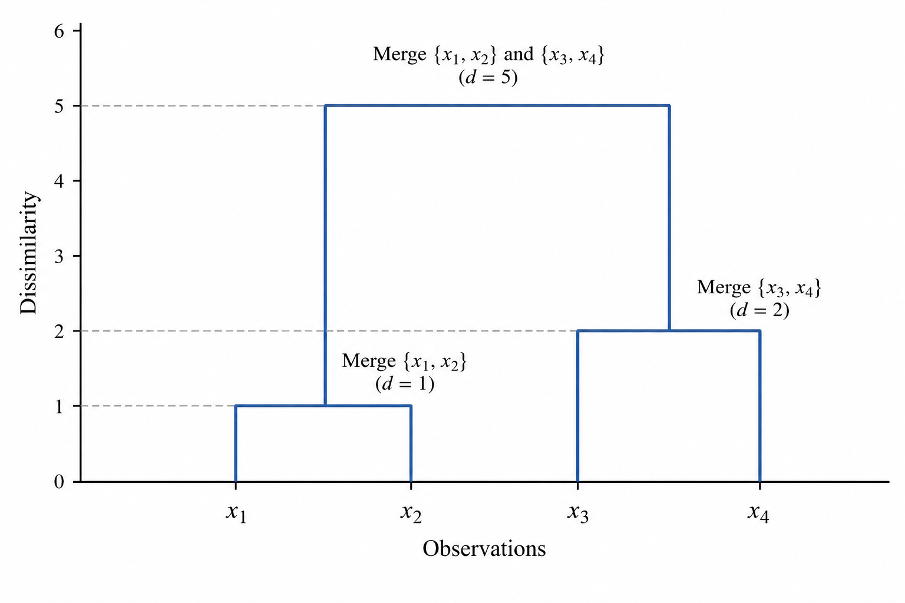

# Introduction

Many datasets contain groups of observations that resemble one another in some respects but differ in others. Identifying these groups can help us understand the structure of the data, describe relationships between observations, and identify patterns that may not be apparent from individual measurements.

Consider a collection of companies described by their financial characteristics, a set of documents represented by their word frequencies, or a group of materials measured through their physical properties. In each case, we may be interested not only in the observations themselves but also in how they relate to one another.

A clustering method addresses this problem by grouping observations according to a chosen measure of similarity or dissimilarity. Unlike supervised learning, clustering does not require predefined class labels. The groups are constructed from the information available in the data and the assumptions introduced through the clustering method.

A conventional clustering result is a partition of the observations into a specified number of groups. Hierarchical clustering takes a different approach: rather than producing only one partition, it constructs a sequence of nested groups that describes relationships at different levels of resolution.

At a fine level, observations may form small groups containing only closely related objects. At a coarser level, these groups may combine into larger ones. The resulting hierarchy provides a way to examine both local relationships and broader patterns without committing to a single number of clusters at the outset.

## Why a Hierarchy?

Suppose we observe four objects represented by a single numerical attribute:

$$
x_1=1,\qquad
x_2=2,\qquad
x_3=7,\qquad
x_4=9.
$$

If proximity is measured by the absolute difference between their values, the first two observations are separated by a distance of $1$, while the last two are separated by a distance of $2$.

These observations suggest two relatively close pairs:

$$
\{x_1,x_2\},
\qquad
\{x_3,x_4\}.
$$

We could stop here and report two clusters. However, this partition does not describe how the individual observations became grouped, nor does it show how the two groups relate to one another.

A hierarchical representation preserves this additional information. Starting with four individual observations, we can progressively combine groups until all observations belong to a single cluster:

$$
\begin{aligned}
\mathcal{P}_0
&=
\big\{
\{x_1\},\{x_2\},\{x_3\},\{x_4\}
\big\},
\\[6pt]
\mathcal{P}_1
&=
\big\{
\{x_1,x_2\},\{x_3\},\{x_4\}
\big\},
\\[6pt]
\mathcal{P}_2
&=
\big\{
\{x_1,x_2\},\{x_3,x_4\}
\big\},
\\[6pt]
\mathcal{P}_3
&=
\big\{
\{x_1,x_2,x_3,x_4\}
\big\}.
\end{aligned}
$$ {#eq-hierarchical-partitions}

Each partition is obtained by merging two clusters from the preceding partition. Consequently, the groups are nested: once two observations belong to the same cluster, they remain together at every subsequent level.

This construction is an example of *agglomerative hierarchical clustering*. It begins with individual observations and builds progressively larger groups. The reverse approach, known as *divisive hierarchical clustering*, starts with the complete dataset and recursively separates it into smaller groups.

The agglomerative approach will be our principal focus.

## The Dendrogram

A hierarchy can be represented by a tree called a *dendrogram*. Its leaves correspond to the original observations, while its internal nodes represent the successive mergers of clusters.

The vertical position of each merger records the dissimilarity associated with that agglomeration. The horizontal arrangement of the leaves is primarily a matter of presentation: their order does not, by itself, define the distance between observations.

The dendrogram therefore contains more information than a single clustering partition. By cutting the tree at a chosen height, we can obtain groups at different levels of resolution without reconstructing the hierarchy.

{#fig-hierarchical-clustering-dendrogram}

The hierarchy in @fig-hierarchical-clustering-dendrogram represents the sequence of partitions introduced in @eq-hierarchical-partitions. The observations $x_1$ and $x_2$ merge at a dissimilarity of $1$, followed by $x_3$ and $x_4$ at a dissimilarity of $2$. Under single linkage, the two resulting clusters merge at a dissimilarity of $5$, corresponding to the distance between $x_2=2$ and $x_3=7$.

The interpretation of a dendrogram depends on the dissimilarity measure and the criterion used to merge clusters. Different criteria can produce different hierarchies from the same observations. A dendrogram should therefore be understood as the result of a specified modelling procedure, rather than as an unambiguous description of the data.

## Applications

Hierarchical clustering is useful when the relationships among observations are themselves of interest, rather than merely their assignment to a fixed number of groups.

In biological classification, a hierarchy can organize organisms or genes according to selected measures of resemblance. In document analysis, it can reveal groups of texts with related content and broader relationships between those groups. In materials science, it can help identify specimens with similar measured properties.

Financial applications provide another example. Assets may be grouped according to their return correlations or other measures of dependence, allowing relationships within a portfolio to be examined at different levels. Such a hierarchy can inform further analysis, although the clustering procedure alone does not determine an optimal portfolio.

Across these applications, the central idea remains the same: observations are represented through selected characteristics, their relationships are quantified, and a hierarchy is constructed from those relationships.

The next step is to formulate this procedure mathematically. We will first define the observations, dissimilarities, partitions, and hierarchical structure before examining how an agglomerative algorithm constructs the dendrogram.

# References

::: {#refs}
:::