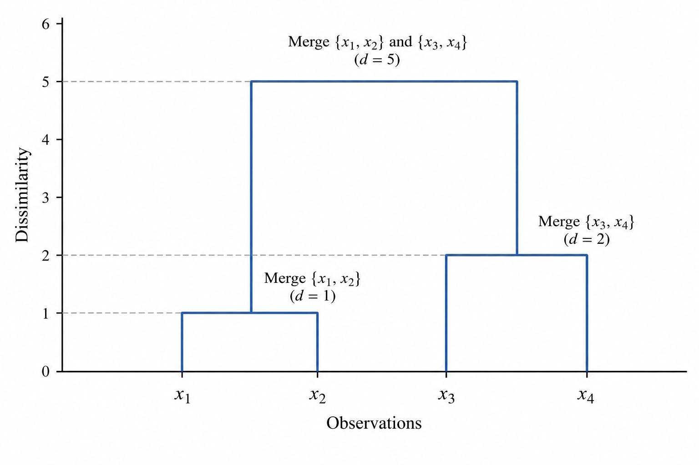
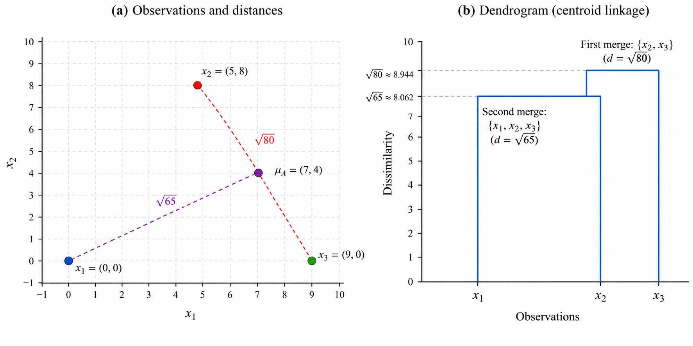

# Introduction

Many datasets contain groups of observations that resemble one another in some respects but differ in others. Identifying these groups can help us understand the structure of the data, describe relationships between observations, and identify patterns that may not be apparent from individual measurements.

Consider a collection of companies described by their financial characteristics, a set of documents represented by their word frequencies, or a group of materials measured through their physical properties. In each case, we may be interested not only in the observations themselves but also in how they relate to one another.

A clustering method addresses this problem by grouping observations according to a chosen measure of similarity or dissimilarity. Unlike supervised learning, clustering does not require predefined class labels. The groups are constructed from the information available in the data and the assumptions introduced through the clustering method.

A conventional clustering result is a partition of the observations into a specified number of groups. Hierarchical clustering takes a different approach: rather than producing only one partition, it constructs a sequence of nested groups that describes relationships at different levels of resolution.

At a fine level, observations may form small groups containing only closely related objects. At a coarser level, these groups may combine into larger ones. The resulting hierarchy provides a way to examine both local relationships and broader patterns without committing to a single number of clusters at the outset.

## Why a Hierarchy?

Suppose we observe four objects represented by a single numerical attribute:

$$
x_1=1,\qquad
x_2=2,\qquad
x_3=7,\qquad
x_4=9.
$$

If proximity is measured by the absolute difference between their values, the first two observations are separated by a distance of $1$, while the last two are separated by a distance of $2$.

These observations suggest two relatively close pairs:

$$
\{x_1,x_2\},
\qquad
\{x_3,x_4\}.
$$

We could stop here and report two clusters. However, this partition does not describe how the individual observations became grouped, nor does it show how the two groups relate to one another.

A hierarchical representation preserves this additional information. Starting with four individual observations, we can progressively combine groups until all observations belong to a single cluster:

$$
\begin{aligned}
\mathcal{P}_0
&=
\big\{
\{x_1\},\{x_2\},\{x_3\},\{x_4\}
\big\},
\\[6pt]
\mathcal{P}_1
&=
\big\{
\{x_1,x_2\},\{x_3\},\{x_4\}
\big\},
\\[6pt]
\mathcal{P}_2
&=
\big\{
\{x_1,x_2\},\{x_3,x_4\}
\big\},
\\[6pt]
\mathcal{P}_3
&=
\big\{
\{x_1,x_2,x_3,x_4\}
\big\}.
\end{aligned}
$$ {#eq-hierarchical-partitions}

Each partition is obtained by merging two clusters from the preceding partition. Consequently, the groups are nested: once two observations belong to the same cluster, they remain together at every subsequent level.

This construction is an example of *agglomerative hierarchical clustering*. It begins with individual observations and builds progressively larger groups. The reverse approach, known as *divisive hierarchical clustering*, starts with the complete dataset and recursively separates it into smaller groups.

The agglomerative approach will be our principal focus.

## The Dendrogram

A hierarchy can be represented by a tree called a *dendrogram*. Its leaves correspond to the original observations, while its internal nodes represent the successive mergers of clusters.

The vertical position of each merger records the dissimilarity associated with that agglomeration. The horizontal arrangement of the leaves is primarily a matter of presentation: their order does not, by itself, define the distance between observations.

The dendrogram therefore contains more information than a single clustering partition. By cutting the tree at a chosen height, we can obtain groups at different levels of resolution without reconstructing the hierarchy.

{#fig-hierarchical-clustering-dendrogram}

The hierarchy in @fig-hierarchical-clustering-dendrogram represents the sequence of partitions introduced in @eq-hierarchical-partitions. The observations $x_1$ and $x_2$ merge at a dissimilarity of $1$, followed by $x_3$ and $x_4$ at a dissimilarity of $2$. Under single linkage, the two resulting clusters merge at a dissimilarity of $5$, corresponding to the distance between $x_2=2$ and $x_3=7$.

The interpretation of a dendrogram depends on the dissimilarity measure and the criterion used to merge clusters. Different criteria can produce different hierarchies from the same observations. A dendrogram should therefore be understood as the result of a specified modelling procedure, rather than as an unambiguous description of the data.

## Applications

Hierarchical clustering is useful when the relationships among observations are themselves of interest, rather than merely their assignment to a fixed number of groups.

In biological classification, a hierarchy can organize organisms or genes according to selected measures of resemblance. In document analysis, it can reveal groups of texts with related content and broader relationships between those groups. In materials science, it can help identify specimens with similar measured properties.

Financial applications provide another example. Assets may be grouped according to their return correlations or other measures of dependence, allowing relationships within a portfolio to be examined at different levels. Such a hierarchy can inform further analysis, although the clustering procedure alone does not determine an optimal portfolio.

Across these applications, the central idea remains the same: observations are represented through selected characteristics, their relationships are quantified, and a hierarchy is constructed from those relationships.

The next step is to formulate this procedure mathematically. We will first define the observations, dissimilarities, partitions, and hierarchical structure before examining how an agglomerative algorithm constructs the dendrogram.

# Mathematical Formulation

Hierarchical clustering begins with a collection of observations and a quantitative description of how different those observations are from one another. The hierarchy is constructed from these pairwise relationships.

Let the dataset contain $N$ observations and $p$ variables. We write the $i$th observation as

$$
\mathbf{x}_i
=
\begin{bmatrix}
x_{i1} \\
x_{i2} \\
\vdots \\
x_{ip}
\end{bmatrix}
\in \mathbb{R}^p,
\qquad
i=1,\ldots,N.
$$ {#eq-observation-vector}

The complete dataset can therefore be represented by the matrix

$$
\mathbf{X}
=
\begin{bmatrix}
\mathbf{x}_1^\top \\
\mathbf{x}_2^\top \\
\vdots \\
\mathbf{x}_N^\top
\end{bmatrix}
\in \mathbb{R}^{N\times p}.
$$ {#eq-data-matrix}

Unlike methods that operate directly on $\mathbf{X}$, hierarchical clustering can be formulated in terms of the pairwise dissimilarities between its rows. The first modelling decision is therefore how those dissimilarities should be defined.

## Dissimilarity Between Observations

A dissimilarity is a function

$$
d:
\mathcal{X}\times\mathcal{X}
\longrightarrow
[0,\infty)
$$ {#eq-dissimilarity-function}

that assigns a non-negative value $d(\mathbf{x}_i,\mathbf{x}_j)$ to each pair of observations. Small values indicate observations regarded as similar under the chosen definition, while large values indicate greater dissimilarity.

It is useful to distinguish a general dissimilarity from a metric. A metric satisfies

$$
d(\mathbf{x}_i,\mathbf{x}_j)\geq 0,
$$

$$
d(\mathbf{x}_i,\mathbf{x}_j)=0
\iff
\mathbf{x}_i=\mathbf{x}_j,
$$

$$
d(\mathbf{x}_i,\mathbf{x}_j)
=
d(\mathbf{x}_j,\mathbf{x}_i),
$$

and

$$
d(\mathbf{x}_i,\mathbf{x}_j)
\leq
d(\mathbf{x}_i,\mathbf{x}_k)
+
d(\mathbf{x}_k,\mathbf{x}_j).
$$ {#eq-triangle-inequality}

The last condition is the triangle inequality. Hierarchical clustering does not, in general, require every input dissimilarity to satisfy all metric properties. This distinction matters because the notion of similarity appropriate to an application need not always correspond to ordinary geometric distance.

### Euclidean Distance

For numerical data, one of the most common choices is Euclidean distance:

$$
d_2(\mathbf{x}_i,\mathbf{x}_j)
=
\left[
\sum_{r=1}^{p}
(x_{ir}-x_{jr})^2
\right]^{1/2}.
$$ {#eq-euclidean-distance}

For example, consider

$$
\mathbf{x}_1=
\begin{bmatrix}
1\\
2
\end{bmatrix},
\qquad
\mathbf{x}_2=
\begin{bmatrix}
4\\
6
\end{bmatrix}.
$$

Their Euclidean distance is

$$
\begin{aligned}
d_2(\mathbf{x}_1,\mathbf{x}_2)
&=
\sqrt{(1-4)^2+(2-6)^2}
\\
&=
\sqrt{9+16}
\\
&=
\sqrt{25}
\\
&=
5.
\end{aligned}
$$

More generally, the Minkowski family is defined by

$$
d_q(\mathbf{x}_i,\mathbf{x}_j)
=
\left[
\sum_{r=1}^{p}
|x_{ir}-x_{jr}|^q
\right]^{1/q},
\qquad q\geq1.
$$ {#eq-minkowski-distance}

Euclidean distance corresponds to $q=2$, while $q=1$ gives the Manhattan distance. The choice is substantive: changing the distance changes the geometry through which the observations are compared and can therefore change the hierarchy that is obtained.

### Similarity and Dissimilarity

In some problems it is more natural to begin with a similarity measure $s(\mathbf{x}_i,\mathbf{x}_j)$, where larger values represent stronger similarity. A corresponding dissimilarity can then be constructed when an appropriate transformation is available.

Correlation provides an important example. If the objective is to compare the *profiles* of two observations rather than their absolute magnitudes, a correlation-based dissimilarity can be defined as

$$
d_{\mathrm{corr}}(\mathbf{x}_i,\mathbf{x}_j)
=
1-\rho_{ij},
$$ {#eq-correlation-dissimilarity}

where $\rho_{ij}$ is the correlation between the feature profiles of observations $i$ and $j$.

This distinction can be important. Two observations can have substantially different magnitudes and therefore be far apart in Euclidean distance, while still exhibiting very similar patterns across their variables. In that case, their correlation can be high and their correlation-based dissimilarity small.

The dissimilarity measure should therefore reflect what it means for two observations to be similar in the problem under study. It is not merely a computational setting chosen after the model has been specified.

## The Dissimilarity Matrix

Once pairwise dissimilarities have been computed, they can be collected in an $N\times N$ matrix

$$
\mathbf{D}
=
\begin{bmatrix}
0 & d_{12} & \cdots & d_{1N} \\
d_{21} & 0 & \cdots & d_{2N} \\
\vdots & \vdots & \ddots & \vdots \\
d_{N1} & d_{N2} & \cdots & 0
\end{bmatrix},
$$ {#eq-dissimilarity-matrix}

where

$$
d_{ij}
=
d(\mathbf{x}_i,\mathbf{x}_j).
$$

For a symmetric dissimilarity,

$$
d_{ij}
=
d_{ji},
$$

so only

$$
\binom{N}{2}
=
\frac{N(N-1)}{2}
$$ {#eq-number-pairwise-dissimilarities}

distinct pairwise values need to be stored, excluding the diagonal.

This quadratic growth is already an important computational property of hierarchical clustering. For $N=1{,}000$ observations, for example, there are

$$
\frac{1000(999)}{2}
=
499{,}500
$$

distinct pairwise dissimilarities. For $N=100{,}000$, the corresponding number is

$$
\frac{100000(99999)}{2}
=
4{,}999{,}950{,}000.
$$

The difficulty of hierarchical clustering on very large datasets therefore does not arise only from the merging procedure. Representing all pairwise relationships can itself become expensive.

## Scaling and the Geometry of the Data

The dissimilarity matrix depends not only on the distance function but also on the representation of the variables.

Suppose that Euclidean distance is used with two variables. If one variable typically varies by units while another varies by thousands, the second variable can dominate the squared distance:

$$
d_2^2(\mathbf{x}_i,\mathbf{x}_j)
=
(x_{i1}-x_{j1})^2
+
(x_{i2}-x_{j2})^2.
$$ {#eq-scale-dependent-distance}

This may be appropriate if those magnitudes have substantive meaning. If the difference is merely a consequence of measurement units, however, the resulting geometry can be misleading.

A common transformation is to standardize each variable:

$$
z_{ir}
=
\frac{x_{ir}-\bar{x}_r}{s_r},
$$ {#eq-standardized-variable}

where

$$
\bar{x}_r
=
\frac{1}{N}
\sum_{i=1}^{N}
x_{ir}
$$ {#eq-variable-mean}

and

$$
s_r
=
\sqrt{
\frac{1}{N-1}
\sum_{i=1}^{N}
(x_{ir}-\bar{x}_r)^2
}.
$$ {#eq-variable-standard-deviation}

After standardization, Euclidean distance becomes

$$
d_2(\mathbf{z}_i,\mathbf{z}_j)
=
\left[
\sum_{r=1}^{p}
\left(
\frac{x_{ir}-x_{jr}}{s_r}
\right)^2
\right]^{1/2}.
$$ {#eq-standardized-euclidean-distance}

Each coordinate difference is now measured relative to the variability of its corresponding variable.

Standardization should not be treated as an automatic preprocessing step. It changes the geometry of the observations and therefore changes the meaning of proximity. Whether this is desirable depends on the variables and on the purpose of the analysis.

## Partitions

To formalize the hierarchical structure, let the complete set of observations be

$$
\mathcal{S}
=
\{1,2,\ldots,N\}.
$$ {#eq-observation-index-set}

A partition of $\mathcal{S}$ is a collection

$$
\mathcal{P}
=
\{C_1,C_2,\ldots,C_K\}
$$ {#eq-partition}

such that every cluster is non-empty,

$$
C_k
\neq
\varnothing,
\qquad
k=1,\ldots,K,
$$

different clusters do not overlap,

$$
C_k\cap C_\ell
=
\varnothing,
\qquad
k\neq\ell,
$$

and together they contain every observation,

$$
\bigcup_{k=1}^{K}C_k
=
\mathcal{S}.
$$ {#eq-partition-properties}

A clustering with $K$ groups therefore corresponds to one partition of the data.

Hierarchical clustering produces something richer: a sequence of partitions.

For an agglomerative procedure, the initial partition contains $N$ singleton clusters,

$$
\mathcal{P}^{(N)}
=
\big\{
\{1\},\{2\},\ldots,\{N\}
\big\},
$$ {#eq-finest-partition}

while the final partition contains the entire dataset,

$$
\mathcal{P}^{(1)}
=
\big\{
\mathcal{S}
\big\}.
$$ {#eq-coarsest-partition}

At each intermediate step, two existing clusters are merged. The sequence therefore has the form

$$
\mathcal{P}^{(N)}
\prec
\mathcal{P}^{(N-1)}
\prec
\cdots
\prec
\mathcal{P}^{(2)}
\prec
\mathcal{P}^{(1)},
$$ {#eq-nested-partitions}

where $\prec$ denotes that the partition on the left is a refinement of the partition on the right.

This nested structure is the defining feature of hierarchical clustering. A cluster created at one stage is not subsequently split by an agglomerative algorithm. Each merge is irreversible.

## From a Hierarchy to an Ultrametric

The hierarchy also defines a new notion of dissimilarity between observations.

Let $h_{ij}$ denote the height of the dendrogram at which observations $i$ and $j$ first belong to the same cluster. Their *cophenetic dissimilarity* is

$$
d_c(i,j)
=
h_{ij}.
$$ {#eq-cophenetic-dissimilarity}

This quantity is not generally equal to the original dissimilarity $d_{ij}$. The original matrix $\mathbf{D}$ is the input to the clustering procedure; the cophenetic dissimilarities are induced by the hierarchy constructed from that input.

For the four-observation example in @fig-hierarchical-clustering-dendrogram,

$$
d_c(1,2)
=
1,
$$

$$
d_c(3,4)
=
2,
$$

while every observation in $\{1,2\}$ first joins every observation in $\{3,4\}$ at height $5$. Hence,

$$
d_c(1,3)
=
d_c(1,4)
=
d_c(2,3)
=
d_c(2,4)
=
5.
$$

Cophenetic dissimilarities satisfy the *ultrametric inequality*

$$
d_c(i,j)
\leq
\max
\left\{
d_c(i,k),
d_c(k,j)
\right\}.
$$ {#eq-ultrametric-inequality}

This condition is stronger than the ordinary triangle inequality.

To see why the hierarchy implies this property, consider three observations $i$, $j$, and $k$. Suppose that

$$
d_c(i,k)
\leq
d_c(k,j).
$$

At height $d_c(k,j)$, observations $k$ and $j$ belong to the same cluster. Since $i$ had already joined $k$ at a height no greater than $d_c(k,j)$, the nested nature of the hierarchy implies that $i$ and $j$ must also belong to the same cluster by that height. Therefore,

$$
d_c(i,j)
\leq
d_c(k,j).
$$

Because under our assumption

$$
d_c(k,j)
=
\max
\left\{
d_c(i,k),
d_c(k,j)
\right\},
$$

we obtain

$$
d_c(i,j)
\leq
\max
\left\{
d_c(i,k),
d_c(k,j)
\right\},
$$

which is @eq-ultrametric-inequality.

The importance of this result is structural. Hierarchical clustering does not simply assign observations to groups: it transforms their pairwise relationships into a tree-compatible geometry.

The original dissimilarities and the cophenetic dissimilarities therefore describe two related but distinct objects. The former describe the input relationships among observations; the latter describe those relationships as represented by the fitted hierarchy.

The next question is how that hierarchy is actually constructed. This requires extending the notion of dissimilarity from pairs of individual observations to pairs of clusters, which leads to the agglomerative algorithm and the different linkage criteria.

# Agglomerative Hierarchical Clustering

The mathematical formulation developed so far describes the objects on which hierarchical clustering operates: observations, pairwise dissimilarities, partitions, and the hierarchy itself. We now consider how an agglomerative procedure constructs that hierarchy.

The central difficulty is straightforward. At the beginning of the procedure, every cluster contains exactly one observation, so the dissimilarity between two clusters is simply the dissimilarity between their observations. After the first merge, however, at least one cluster contains multiple observations. The original dissimilarity $d(\mathbf{x}_i,\mathbf{x}_j)$ is no longer sufficient: we need a rule for measuring the dissimilarity between sets of observations.

This rule is called the *linkage criterion*.

## The Agglomerative Procedure

Let

$$
\mathcal{P}^{(N)}
=
\big\{
\{1\},\{2\},\ldots,\{N\}
\big\}
$$

be the initial partition. At this point there are $N$ clusters, one for each observation.

Suppose that at some stage there are $K$ clusters,

$$
\mathcal{P}^{(K)}
=
\left\{
C_1,C_2,\ldots,C_K
\right\}.
$$

Let

$$
d_L(C_r,C_s)
$$

denote the dissimilarity between clusters $C_r$ and $C_s$ under a linkage criterion $L$.

The pair selected for merging is

$$
(C_a,C_b)
=
\underset{C_r,C_s\in\mathcal{P}^{(K)},\,r<s}{\operatorname{arg\,min}}
\;
d_L(C_r,C_s).
$$ {#eq-agglomerative-merge}

The two selected clusters are replaced by their union,

$$
C_{ab}
=
C_a\cup C_b,
$$ {#eq-cluster-union}

producing a new partition with $K-1$ clusters:

$$
\mathcal{P}^{(K-1)}
=
\left(
\mathcal{P}^{(K)}
\setminus
\{C_a,C_b\}
\right)
\cup
\{C_{ab}\}.
$$ {#eq-agglomerative-partition-update}

The height associated with this merge is

$$
h_{ab}
=
d_L(C_a,C_b).
$$ {#eq-merge-height}

The procedure is repeated until only one cluster remains.

Starting with $N$ singleton clusters and reducing the number of clusters by one at each iteration requires exactly

$$
N-1
$$

merges. The result is therefore not a single partition but the complete nested sequence

$$
\mathcal{P}^{(N)},
\mathcal{P}^{(N-1)},
\ldots,
\mathcal{P}^{(2)},
\mathcal{P}^{(1)}.
$$

This procedure is *greedy*. At every stage it selects the best available merge according to the current inter-cluster dissimilarities, and that decision is not reconsidered later. Once two clusters have been joined, an agglomerative algorithm never separates them again.

This irreversibility is important. Hierarchical clustering does not search over all possible hierarchies for a globally optimal tree under a universal objective function. Instead, the hierarchy is built through a sequence of local decisions determined by the linkage criterion.

## Linkage Criteria

Let $A$ and $B$ be two non-empty clusters. The linkage criterion defines $d_L(A,B)$ from the observations contained in those clusters.

Different linkage criteria answer different versions of the same question: what should it mean for two *groups* of observations to be close?

The distinction is substantive. Consider two clusters containing many observations. They might contain one pair of observations that are extremely close, while their remaining observations are far apart. Alternatively, every observation in one cluster might be moderately close to every observation in the other. Whether these situations should be treated as similar depends on the linkage criterion.

### Single Linkage

Single linkage defines the dissimilarity between two clusters using their closest pair of observations:

$$
d_{\mathrm{SL}}(A,B)
=
\min_{\substack{i\in A\\j\in B}}
d_{ij}.
$$ {#eq-single-linkage}

Only one pair of observations determines the inter-cluster dissimilarity.

Suppose, for example, that

$$
A=\{1,2\},
\qquad
B=\{3,4\},
$$

and that the cross-cluster dissimilarities are

$$
d_{13}=5,
\qquad
d_{14}=8,
\qquad
d_{23}=3,
\qquad
d_{24}=7.
$$

Then

$$
\begin{aligned}
d_{\mathrm{SL}}(A,B)
&=
\min\{d_{13},d_{14},d_{23},d_{24}\}
\\
&=
\min\{5,8,3,7\}
\\
&=
3.
\end{aligned}
$$

The observations corresponding to the other three dissimilarities do not affect this value.

This gives single linkage a natural connectivity interpretation. Two clusters can be joined whenever there exists at least one sufficiently close pair connecting them. Repeated application of this rule can create a sequence of locally close observations extending across a comparatively large region of the data.

This behaviour is known as *chaining*.

To make the issue precise, define the diameter of a cluster $A$ as

$$
\operatorname{diam}(A)
=
\max_{\substack{i,j\in A}}
d_{ij}.
$$ {#eq-cluster-diameter}

Single linkage does not directly control @eq-cluster-diameter. A cluster may therefore have a large diameter even though each merge that produced it involved a small single-linkage dissimilarity.

Consider five observations arranged along a line:

$$
x_1=0,
\qquad
x_2=1,
\qquad
x_3=2,
\qquad
x_4=3,
\qquad
x_5=4.
$$

Using absolute distance, each consecutive pair is separated by only $1$. Single linkage can therefore connect all five observations through successive nearest-neighbour relationships at a linkage distance of $1$, even though

$$
d(x_1,x_5)
=
4.
$$

The method recognizes connectivity rather than requiring every pair of observations in a cluster to be close.

### Complete Linkage

Complete linkage takes the opposite approach. The dissimilarity between two clusters is determined by their most dissimilar pair of observations:

$$
d_{\mathrm{CL}}(A,B)
=
\max_{\substack{i\in A\\j\in B}}
d_{ij}.
$$ {#eq-complete-linkage}

For the previous example,

$$
\begin{aligned}
d_{\mathrm{CL}}(A,B)
&=
\max\{d_{13},d_{14},d_{23},d_{24}\}
\\
&=
\max\{5,8,3,7\}
\\
&=
8.
\end{aligned}
$$

Single and complete linkage therefore evaluate the same set of pairwise dissimilarities but retain opposite extremes:

$$
d_{\mathrm{SL}}(A,B)
=
\min_{\substack{i\in A\\j\in B}}d_{ij},
$$

while

$$
d_{\mathrm{CL}}(A,B)
=
\max_{\substack{i\in A\\j\in B}}d_{ij}.
$$

This difference changes the geometry of the resulting clusters. Single linkage asks whether the two groups contain observations that are close enough to connect them. Complete linkage asks whether even their most separated observations remain sufficiently close.

As a result, complete linkage tends to favour more compact clusters and is less susceptible to chaining. The trade-off is that a single distant pair can substantially increase the dissimilarity between two otherwise similar groups.

### Average Linkage

Average linkage uses all pairwise dissimilarities between the two clusters rather than selecting an extreme value.

If $|A|$ and $|B|$ denote the number of observations in the two clusters, then

$$
d_{\mathrm{AL}}(A,B)
=
\frac{1}{|A||B|}
\sum_{i\in A}
\sum_{j\in B}
d_{ij}.
$$ {#eq-average-linkage}

For the same example,

$$
\begin{aligned}
d_{\mathrm{AL}}(A,B)
&=
\frac{1}{(2)(2)}
\left(
d_{13}+d_{14}+d_{23}+d_{24}
\right)
\\
&=
\frac{1}{4}
(5+8+3+7)
\\
&=
\frac{23}{4}
\\
&=
5.75.
\end{aligned}
$$

For these clusters, the three criteria therefore give

$$
d_{\mathrm{SL}}(A,B)=3,
\qquad
d_{\mathrm{AL}}(A,B)=5.75,
\qquad
d_{\mathrm{CL}}(A,B)=8.
$$

More generally, because the minimum, arithmetic mean, and maximum of a finite collection of real values satisfy

$$
\min z_r
\leq
\frac{1}{m}\sum_{r=1}^{m}z_r
\leq
\max z_r,
$$

we have, for any two clusters $A$ and $B$,

$$
d_{\mathrm{SL}}(A,B)
\leq
d_{\mathrm{AL}}(A,B)
\leq
d_{\mathrm{CL}}(A,B).
$$ {#eq-linkage-ordering}

Average linkage can therefore be viewed as an intermediate criterion between the nearest-neighbour and furthest-neighbour definitions. Unlike single linkage, it cannot be determined by one unusually close pair; unlike complete linkage, it cannot be determined by one unusually distant pair.

This does not imply that average linkage is universally preferable. Each criterion encodes a different definition of inter-cluster proximity, and those definitions can produce different sequences of merges.

### Centroid Linkage

The previous three criteria are defined directly from pairwise dissimilarities between observations. Centroid linkage instead represents each cluster by its center.

For a cluster $A$, define its centroid as

$$
\boldsymbol{\mu}_A
=
\frac{1}{|A|}
\sum_{i\in A}
\mathbf{x}_i.
$$ {#eq-cluster-centroid}

Similarly,

$$
\boldsymbol{\mu}_B
=
\frac{1}{|B|}
\sum_{j\in B}
\mathbf{x}_j.
$$

Centroid linkage defines the inter-cluster dissimilarity as the distance between these two centers:

$$
d_{\mathrm{CE}}(A,B)
=
d(\boldsymbol{\mu}_A,\boldsymbol{\mu}_B).
$$ {#eq-centroid-linkage}

With Euclidean distance,

$$
d_{\mathrm{CE}}(A,B)
=
\left\|
\boldsymbol{\mu}_A-\boldsymbol{\mu}_B
\right\|_2.
$$ {#eq-centroid-linkage-euclidean}

The centroid of a merged cluster can be derived without returning to the individual observations. Let

$$
C=A\cup B,
\qquad
A\cap B=\varnothing.
$$

Then

$$
\boldsymbol{\mu}_C
=
\frac{1}{|C|}
\sum_{i\in C}
\mathbf{x}_i.
$$

Since $C=A\cup B$ and $|C|=|A|+|B|$,

$$
\boldsymbol{\mu}_C
=
\frac{1}{|A|+|B|}
\left(
\sum_{i\in A}\mathbf{x}_i
+
\sum_{j\in B}\mathbf{x}_j
\right).
$$

Using

$$
\sum_{i\in A}\mathbf{x}_i
=
|A|\boldsymbol{\mu}_A
$$

and

$$
\sum_{j\in B}\mathbf{x}_j
=
|B|\boldsymbol{\mu}_B,
$$

we obtain

$$
\boldsymbol{\mu}_{A\cup B}
=
\frac{
|A|\boldsymbol{\mu}_A
+
|B|\boldsymbol{\mu}_B
}{
|A|+|B|
}.
$$ {#eq-merged-cluster-centroid}

The new centroid is therefore a weighted average of the two previous centroids, with weights determined by cluster size.

Centroid linkage has an important property that distinguishes it from single, complete, and average linkage: the sequence of merge dissimilarities need not be monotone.

Consider the three observations

$$
\mathbf{x}_1=(0,0),
\qquad
\mathbf{x}_2=(5,8),
\qquad
\mathbf{x}_3=(9,0).
$$

Their Euclidean distances are

$$
d(\mathbf{x}_1,\mathbf{x}_2)
=
\sqrt{(5-0)^2+(8-0)^2}
=
\sqrt{89},
$$

$$
d(\mathbf{x}_1,\mathbf{x}_3)
=
\sqrt{(9-0)^2+(0-0)^2}
=
9,
$$

and

$$
d(\mathbf{x}_2,\mathbf{x}_3)
=
\sqrt{(9-5)^2+(0-8)^2}
=
\sqrt{80}.
$$

Since

$$
\sqrt{80}
<
9
<
\sqrt{89},
$$

the first merge is

$$
A
=
\{\mathbf{x}_2,\mathbf{x}_3\}
$$

at height

$$
h_1
=
\sqrt{80}.
$$

The centroid of the new cluster is

$$
\begin{aligned}
\boldsymbol{\mu}_A
&=
\frac{\mathbf{x}_2+\mathbf{x}_3}{2}
\\
&=
\frac{(5,8)+(9,0)}{2}
\\
&=
(7,4).
\end{aligned}
$$

The distance from this centroid to the remaining observation $\mathbf{x}_1=(0,0)$ is

$$
\begin{aligned}
d_{\mathrm{CE}}(\{\mathbf{x}_1\},A)
&=
\sqrt{(7-0)^2+(4-0)^2}
\\
&=
\sqrt{49+16}
\\
&=
\sqrt{65}.
\end{aligned}
$$

But

$$
\sqrt{65}
<
\sqrt{80}.
$$

The second merge therefore occurs at a smaller dissimilarity than the first:

$$
h_2
=
\sqrt{65}
<
h_1
=
\sqrt{80}.
$$ {#eq-centroid-inversion}

This phenomenon is called an *inversion*. A later merge appears below an earlier merge when dendrogram height is identified with linkage dissimilarity.

{#fig-centroid-linkage-inversion}

The example in @fig-centroid-linkage-inversion shows why monotonicity of dendrogram heights should not be assumed for every hierarchical clustering criterion. Single, complete, and average linkage do not exhibit this inversion behaviour, whereas centroid linkage can.

## What the Linkage Criterion Changes

The linkage criterion does not modify the original observation-level dissimilarities $d_{ij}$. Instead, it determines how those dissimilarities, or representations derived from the observations, are used once clusters contain more than one member.

For two clusters $A$ and $B$, single, complete, and average linkage operate on the same collection

$$
\mathcal{D}_{AB}
=
\left\{
d_{ij}:i\in A,\;j\in B
\right\},
$$ {#eq-cross-cluster-dissimilarities}

but summarize it differently:

$$
\begin{aligned}
d_{\mathrm{SL}}(A,B)
&=
\min \mathcal{D}_{AB},
\\
d_{\mathrm{AL}}(A,B)
&=
\operatorname{mean}\mathcal{D}_{AB},
\\
d_{\mathrm{CL}}(A,B)
&=
\max \mathcal{D}_{AB}.
\end{aligned}
$$ {#eq-linkage-comparison}

Centroid linkage changes the perspective by replacing each cluster with a representative point and comparing those representatives.

The resulting dendrogram is therefore determined by two conceptually separate choices:

$$
\boxed{
\text{observation dissimilarity}
+
\text{linkage criterion}
\longrightarrow
\text{hierarchy}
}
$$

The first choice determines what it means for individual observations to be similar. The second determines what it means for groups of observations to be similar.

Neither choice is neutral. Together they define the structure that the agglomerative procedure will impose on the data.

The linkage criteria considered so far are based on nearest observations, furthest observations, average pairwise dissimilarity, or cluster centroids. Another important approach asks a different question: which merge causes the smallest increase in within-cluster dispersion? This leads to Ward's minimum variance method.

## Ward's Minimum Variance Method

Single, complete, and average linkage define inter-cluster dissimilarity by summarizing pairwise dissimilarities between observations. Ward's method takes a different approach. Rather than asking how close two clusters are according to selected pairwise distances, it asks how much within-cluster dispersion would increase if the two clusters were merged.

The method is therefore naturally formulated for observations represented in Euclidean space.

Let $A$ be a cluster containing $|A|$ observations, with centroid

$$
\boldsymbol{\mu}_A
=
\frac{1}{|A|}
\sum_{i\in A}
\mathbf{x}_i.
$$

Define the within-cluster sum of squares for $A$ as

$$
W(A)
=
\sum_{i\in A}
\left\|
\mathbf{x}_i-\boldsymbol{\mu}_A
\right\|_2^2.
$$ {#eq-within-cluster-sum-of-squares}

The quantity $W(A)$ measures the total squared Euclidean dispersion of the observations around the cluster centroid. It is equal to zero for a singleton cluster and increases as the observations become more dispersed around their center.

Suppose now that two disjoint clusters $A$ and $B$ are merged to form

$$
C
=
A\cup B.
$$

The change in within-cluster sum of squares produced by this merge is

$$
\Delta(A,B)
=
W(A\cup B)-W(A)-W(B).
$$ {#eq-ward-increase-definition}

Ward's method selects, at each stage, the pair of clusters that minimizes this increase:

$$
(A^\ast,B^\ast)
=
\underset{A,B}{\operatorname{arg\,min}}
\;
\Delta(A,B).
$$ {#eq-ward-merge-rule}

The criterion in @eq-ward-increase-definition can be expressed entirely in terms of the cluster sizes and their centroids. Deriving this expression makes the meaning of Ward's method considerably clearer.

### Derivation of Ward's Criterion

Let

$$
n_A=|A|,
\qquad
n_B=|B|,
$$

and denote the centroid of the merged cluster $C=A\cup B$ by $\boldsymbol{\mu}_C$.

From @eq-merged-cluster-centroid,

$$
\boldsymbol{\mu}_C
=
\frac{
n_A\boldsymbol{\mu}_A
+
n_B\boldsymbol{\mu}_B
}{
n_A+n_B
}.
$$ {#eq-ward-merged-centroid}

We begin with the within-cluster sum of squares of the merged cluster:

$$
W(C)
=
\sum_{i\in A}
\left\|
\mathbf{x}_i-\boldsymbol{\mu}_C
\right\|_2^2
+
\sum_{j\in B}
\left\|
\mathbf{x}_j-\boldsymbol{\mu}_C
\right\|_2^2.
$$ {#eq-ward-merged-wcss}

Consider first the contribution from cluster $A$. For every $i\in A$,

$$
\mathbf{x}_i-\boldsymbol{\mu}_C
=
(\mathbf{x}_i-\boldsymbol{\mu}_A)
+
(\boldsymbol{\mu}_A-\boldsymbol{\mu}_C).
$$

Therefore,

$$
\left\|
\mathbf{x}_i-\boldsymbol{\mu}_C
\right\|_2^2
=
\left\|
(\mathbf{x}_i-\boldsymbol{\mu}_A)
+
(\boldsymbol{\mu}_A-\boldsymbol{\mu}_C)
\right\|_2^2.
$$

Using

$$
\|\mathbf{a}+\mathbf{b}\|_2^2
=
\|\mathbf{a}\|_2^2
+
2\mathbf{a}^{\top}\mathbf{b}
+
\|\mathbf{b}\|_2^2,
$$

we obtain

$$
\begin{aligned}
\left\|
\mathbf{x}_i-\boldsymbol{\mu}_C
\right\|_2^2
&=
\left\|
\mathbf{x}_i-\boldsymbol{\mu}_A
\right\|_2^2
\\
&\quad+
2
(\mathbf{x}_i-\boldsymbol{\mu}_A)^\top
(\boldsymbol{\mu}_A-\boldsymbol{\mu}_C)
\\
&\quad+
\left\|
\boldsymbol{\mu}_A-\boldsymbol{\mu}_C
\right\|_2^2.
\end{aligned}
$$

Summing over all observations in $A$ gives

$$
\begin{aligned}
\sum_{i\in A}
\left\|
\mathbf{x}_i-\boldsymbol{\mu}_C
\right\|_2^2
&=
\sum_{i\in A}
\left\|
\mathbf{x}_i-\boldsymbol{\mu}_A
\right\|_2^2
\\
&\quad+
2
\left[
\sum_{i\in A}
(\mathbf{x}_i-\boldsymbol{\mu}_A)
\right]^\top
(\boldsymbol{\mu}_A-\boldsymbol{\mu}_C)
\\
&\quad+
n_A
\left\|
\boldsymbol{\mu}_A-\boldsymbol{\mu}_C
\right\|_2^2.
\end{aligned}
$$

By the definition of the centroid,

$$
\sum_{i\in A}
(\mathbf{x}_i-\boldsymbol{\mu}_A)
=
\sum_{i\in A}\mathbf{x}_i
-
n_A\boldsymbol{\mu}_A
=
\mathbf{0}.
$$ {#eq-centroid-zero-sum}

The cross term therefore vanishes, leaving

$$
\sum_{i\in A}
\left\|
\mathbf{x}_i-\boldsymbol{\mu}_C
\right\|_2^2
=
W(A)
+
n_A
\left\|
\boldsymbol{\mu}_A-\boldsymbol{\mu}_C
\right\|_2^2.
$$ {#eq-ward-cluster-a-decomposition}

The same argument for cluster $B$ gives

$$
\sum_{j\in B}
\left\|
\mathbf{x}_j-\boldsymbol{\mu}_C
\right\|_2^2
=
W(B)
+
n_B
\left\|
\boldsymbol{\mu}_B-\boldsymbol{\mu}_C
\right\|_2^2.
$$ {#eq-ward-cluster-b-decomposition}

Substituting @eq-ward-cluster-a-decomposition and @eq-ward-cluster-b-decomposition into @eq-ward-merged-wcss,

$$
W(C)
=
W(A)
+
W(B)
+
n_A
\left\|
\boldsymbol{\mu}_A-\boldsymbol{\mu}_C
\right\|_2^2
+
n_B
\left\|
\boldsymbol{\mu}_B-\boldsymbol{\mu}_C
\right\|_2^2.
$$

Consequently, the increase in within-cluster sum of squares is

$$
\Delta(A,B)
=
n_A
\left\|
\boldsymbol{\mu}_A-\boldsymbol{\mu}_C
\right\|_2^2
+
n_B
\left\|
\boldsymbol{\mu}_B-\boldsymbol{\mu}_C
\right\|_2^2.
$$ {#eq-ward-increase-intermediate}

We can simplify this expression further. From @eq-ward-merged-centroid,

$$
\begin{aligned}
\boldsymbol{\mu}_A-\boldsymbol{\mu}_C
&=
\boldsymbol{\mu}_A
-
\frac{
n_A\boldsymbol{\mu}_A+n_B\boldsymbol{\mu}_B
}{
n_A+n_B
}
\\
&=
\frac{
(n_A+n_B)\boldsymbol{\mu}_A
-
n_A\boldsymbol{\mu}_A
-
n_B\boldsymbol{\mu}_B
}{
n_A+n_B
}
\\
&=
\frac{
n_B
(\boldsymbol{\mu}_A-\boldsymbol{\mu}_B)
}{
n_A+n_B
}.
\end{aligned}
$$ {#eq-ward-centroid-difference-a}

Similarly,

$$
\begin{aligned}
\boldsymbol{\mu}_B-\boldsymbol{\mu}_C
&=
\frac{
n_A
(\boldsymbol{\mu}_B-\boldsymbol{\mu}_A)
}{
n_A+n_B
}.
\end{aligned}
$$ {#eq-ward-centroid-difference-b}

Taking squared Euclidean norms,

$$
\left\|
\boldsymbol{\mu}_A-\boldsymbol{\mu}_C
\right\|_2^2
=
\frac{n_B^2}{(n_A+n_B)^2}
\left\|
\boldsymbol{\mu}_A-\boldsymbol{\mu}_B
\right\|_2^2,
$$

and

$$
\left\|
\boldsymbol{\mu}_B-\boldsymbol{\mu}_C
\right\|_2^2
=
\frac{n_A^2}{(n_A+n_B)^2}
\left\|
\boldsymbol{\mu}_A-\boldsymbol{\mu}_B
\right\|_2^2.
$$

Substituting these expressions into @eq-ward-increase-intermediate gives

$$
\begin{aligned}
\Delta(A,B)
&=
n_A
\frac{n_B^2}{(n_A+n_B)^2}
\left\|
\boldsymbol{\mu}_A-\boldsymbol{\mu}_B
\right\|_2^2
\\
&\quad+
n_B
\frac{n_A^2}{(n_A+n_B)^2}
\left\|
\boldsymbol{\mu}_A-\boldsymbol{\mu}_B
\right\|_2^2
\\
&=
\frac{
n_A n_B^2+n_B n_A^2
}{
(n_A+n_B)^2
}
\left\|
\boldsymbol{\mu}_A-\boldsymbol{\mu}_B
\right\|_2^2
\\
&=
\frac{
n_A n_B(n_A+n_B)
}{
(n_A+n_B)^2
}
\left\|
\boldsymbol{\mu}_A-\boldsymbol{\mu}_B
\right\|_2^2.
\end{aligned}
$$

Therefore,

$$
\boxed{
\Delta(A,B)
=
\frac{n_A n_B}{n_A+n_B}
\left\|
\boldsymbol{\mu}_A-\boldsymbol{\mu}_B
\right\|_2^2
}
$$ {#eq-ward-criterion}

Equation @eq-ward-criterion is Ward's minimum variance criterion. At each iteration, the algorithm merges the pair of clusters producing the smallest increase in total within-cluster sum of squares.

## Interpreting the Criterion

The expression in @eq-ward-criterion contains two components:

$$
\left\|
\boldsymbol{\mu}_A-\boldsymbol{\mu}_B
\right\|_2^2
$$

measures the squared separation between the cluster centroids, while

$$
\frac{n_A n_B}{n_A+n_B}
$$

adjusts that separation according to the sizes of the clusters.

This distinguishes Ward's method from ordinary centroid linkage. Centroid linkage compares clusters through

$$
\left\|
\boldsymbol{\mu}_A-\boldsymbol{\mu}_B
\right\|_2,
$$

whereas Ward's criterion also accounts for how many observations are represented by each centroid.

Consider two singleton clusters,

$$
A=\{\mathbf{x}_i\},
\qquad
B=\{\mathbf{x}_j\}.
$$

Then

$$
n_A=n_B=1,
$$

and their centroids are simply

$$
\boldsymbol{\mu}_A=\mathbf{x}_i,
\qquad
\boldsymbol{\mu}_B=\mathbf{x}_j.
$$

Equation @eq-ward-criterion becomes

$$
\begin{aligned}
\Delta(A,B)
&=
\frac{(1)(1)}{1+1}
\left\|
\mathbf{x}_i-\mathbf{x}_j
\right\|_2^2
\\
&=
\frac{1}{2}
\left\|
\mathbf{x}_i-\mathbf{x}_j
\right\|_2^2.
\end{aligned}
$$ {#eq-ward-singletons}

Thus, at the initial stage, minimizing Ward's criterion is equivalent to selecting the pair with the smallest squared Euclidean distance. Once clusters contain different numbers of observations, however, their sizes become part of the criterion.

As a simple example, suppose that two clusters have

$$
n_A=2,
\qquad
n_B=3,
$$

with centroids

$$
\boldsymbol{\mu}_A=
\begin{bmatrix}
1\\
2
\end{bmatrix},
\qquad
\boldsymbol{\mu}_B=
\begin{bmatrix}
4\\
6
\end{bmatrix}.
$$

Their squared centroid distance is

$$
\begin{aligned}
\left\|
\boldsymbol{\mu}_A-\boldsymbol{\mu}_B
\right\|_2^2
&=
(1-4)^2+(2-6)^2
\\
&=
9+16
\\
&=
25.
\end{aligned}
$$

The increase in within-cluster sum of squares produced by merging them is therefore

$$
\begin{aligned}
\Delta(A,B)
&=
\frac{(2)(3)}{2+3}(25)
\\
&=
\frac{6}{5}(25)
\\
&=
30.
\end{aligned}
$$

The number $30$ is not simply a geometric distance between the two centroids. It is the additional within-cluster dispersion introduced by treating the observations in $A$ and $B$ as members of one cluster.

This interpretation is central to Ward's method. A candidate merge is attractive when the two clusters can be combined without substantially increasing the heterogeneity of the resulting cluster.

## Relation to Total Within-Cluster Dispersion

Suppose a partition contains $K$ clusters,

$$
\mathcal{P}^{(K)}
=
\{C_1,\ldots,C_K\}.
$$

Define its total within-cluster sum of squares as

$$
W\left(\mathcal{P}^{(K)}\right)
=
\sum_{k=1}^{K}
W(C_k).
$$ {#eq-total-within-cluster-sum-of-squares}

If $A$ and $B$ are merged, all other clusters remain unchanged. Hence,

$$
\begin{aligned}
W\left(\mathcal{P}^{(K-1)}\right)
-
W\left(\mathcal{P}^{(K)}\right)
&=
W(A\cup B)-W(A)-W(B)
\\
&=
\Delta(A,B).
\end{aligned}
$$ {#eq-ward-partition-increase}

Ward's algorithm can therefore be written as

$$
(A^\ast,B^\ast)
=
\underset{A,B}{\operatorname{arg\,min}}
\left[
W\left(\mathcal{P}^{(K-1)}\right)
-
W\left(\mathcal{P}^{(K)}\right)
\right].
$$ {#eq-ward-partition-rule}

This formulation also clarifies the sense in which Ward's method is a minimum variance procedure. It does not find, for every possible value of $K$, the globally optimal partition minimizing total within-cluster dispersion. The procedure remains agglomerative and greedy: at each stage it chooses the available merge that causes the smallest local increase in that quantity.

This distinction is important when comparing Ward's method with optimization-based clustering methods. The criterion resembles the within-cluster sum-of-squares objective used elsewhere in clustering, but the search procedure is different.

## Ward's Method and Compact Clusters

Because Ward's method penalizes increases in within-cluster dispersion, it tends to favour clusters whose observations remain relatively concentrated around their centroids. This makes its behaviour closer to a compactness criterion than to the connectivity criterion underlying single linkage.

The dependence on squared Euclidean geometry is equally important. The derivation of @eq-ward-criterion relies on centroids and squared Euclidean norms. Ward's method should therefore not be interpreted as an arbitrary linkage rule that can be combined without qualification with any dissimilarity measure.

The criterion also avoids the inversion problem discussed for centroid linkage: merge criterion values are non-decreasing as the hierarchy is constructed. This allows the dendrogram heights to retain their usual interpretation as progressively larger agglomeration levels.

Ward's method gives us another way to define which clusters should be merged, but it does not yet address an important computational question. After a merge, must every inter-cluster dissimilarity be recomputed from the original observations? A general recurrence provides a more efficient and unified answer. This leads to the Lance--Williams formulation.

# Lance--Williams Recurrence

The linkage criteria introduced in the previous section define which pair of clusters should be merged. A second question arises immediately after a merge: how should the dissimilarities between the newly formed cluster and the remaining clusters be computed?

Suppose that clusters $A$ and $B$ have been merged into

$$
A\cup B.
$$

Let $C$ be any other cluster in the current partition. A direct approach would return to the original observations and recompute

$$
d_L(A\cup B,C)
$$

from the definition of the chosen linkage criterion. This is mathematically valid, but in many cases unnecessary.

The Lance--Williams recurrence expresses the new dissimilarity using quantities that were already available before the merge:

$$
d(A\cup B,C)
=
\alpha_A d(A,C)
+
\alpha_B d(B,C)
+
\beta d(A,B)
+
\gamma
\left|
d(A,C)-d(B,C)
\right|.
$$ {#eq-lance-williams-recurrence}

The coefficients $\alpha_A$, $\alpha_B$, $\beta$, and $\gamma$ determine the agglomerative criterion. The general structure of @eq-lance-williams-recurrence remains unchanged; different choices of the coefficients recover different hierarchical clustering methods.

This is useful both conceptually and computationally. Conceptually, several apparently different linkage criteria can be represented within a common framework. Computationally, after merging $A$ and $B$, the algorithm can update the dissimilarity to $C$ from previously stored values instead of reconstructing every comparison from the original observations.

## Single Linkage

For single linkage, the coefficients are

$$
\alpha_A
=
\frac{1}{2},
\qquad
\alpha_B
=
\frac{1}{2},
\qquad
\beta
=
0,
\qquad
\gamma
=
-\frac{1}{2}.
$$ {#eq-lance-williams-single-coefficients}

Substitution into @eq-lance-williams-recurrence gives

$$
d(A\cup B,C)
=
\frac{1}{2}d(A,C)
+
\frac{1}{2}d(B,C)
-
\frac{1}{2}
\left|
d(A,C)-d(B,C)
\right|.
$$ {#eq-lance-williams-single}

To see why this recovers single linkage, let

$$
a=d(A,C),
\qquad
b=d(B,C).
$$

Then

$$
d(A\cup B,C)
=
\frac{1}{2}
\left(
a+b-|a-b|
\right).
$$

Suppose first that $a\leq b$. Then

$$
|a-b|
=
b-a,
$$

and therefore

$$
\begin{aligned}
d(A\cup B,C)
&=
\frac{1}{2}
\left[
a+b-(b-a)
\right]
\\
&=
\frac{1}{2}(2a)
\\
&=
a.
\end{aligned}
$$

Since $a\leq b$,

$$
a
=
\min\{a,b\}.
$$

If instead $b\leq a$, the same argument gives

$$
d(A\cup B,C)
=
b
=
\min\{a,b\}.
$$

Hence,

$$
d(A\cup B,C)
=
\min
\left\{
d(A,C),
d(B,C)
\right\}.
$$ {#eq-single-linkage-update}

This is exactly the update required by single linkage.

The result also has a direct interpretation. If $A$ and $B$ have been joined, the closest observation in $A\cup B$ to cluster $C$ must come either from $A$ or from $B$. No other possibility exists, so the new single-linkage dissimilarity is simply the smaller of the two previous values.

## Complete Linkage

For complete linkage,

$$
\alpha_A
=
\frac{1}{2},
\qquad
\alpha_B
=
\frac{1}{2},
\qquad
\beta
=
0,
\qquad
\gamma
=
\frac{1}{2}.
$$ {#eq-lance-williams-complete-coefficients}

Equation @eq-lance-williams-recurrence becomes

$$
d(A\cup B,C)
=
\frac{1}{2}d(A,C)
+
\frac{1}{2}d(B,C)
+
\frac{1}{2}
\left|
d(A,C)-d(B,C)
\right|.
$$ {#eq-lance-williams-complete}

Again, write

$$
a=d(A,C),
\qquad
b=d(B,C).
$$

If $a\leq b$, then

$$
|a-b|
=
b-a,
$$

and

$$
\begin{aligned}
d(A\cup B,C)
&=
\frac{1}{2}
\left[
a+b+(b-a)
\right]
\\
&=
\frac{1}{2}(2b)
\\
&=
b.
\end{aligned}
$$

Since $b$ is the larger value,

$$
d(A\cup B,C)
=
\max\{a,b\}.
$$

The opposite case gives the same general result:

$$
d(A\cup B,C)
=
\max
\left\{
d(A,C),
d(B,C)
\right\}.
$$ {#eq-complete-linkage-update}

The only difference between the Lance--Williams coefficients for single and complete linkage is therefore the sign of $\gamma$. With $\gamma=-1/2$, the recurrence selects the smaller dissimilarity; with $\gamma=1/2$, it selects the larger one.

## Average Linkage

Average linkage requires the sizes of the merged clusters. Its coefficients are

$$
\alpha_A
=
\frac{|A|}{|A|+|B|},
\qquad
\alpha_B
=
\frac{|B|}{|A|+|B|},
\qquad
\beta
=
0,
\qquad
\gamma
=
0.
$$ {#eq-lance-williams-average-coefficients}

The recurrence therefore reduces to

$$
d(A\cup B,C)
=
\frac{|A|}{|A|+|B|}
d(A,C)
+
\frac{|B|}{|A|+|B|}
d(B,C).
$$ {#eq-average-linkage-update}

Unlike single and complete linkage, this update is a weighted average. The weights account for the number of observations represented by each of the two previous clusters.

This result follows directly from the definition of average linkage. By @eq-average-linkage,

$$
d_{\mathrm{AL}}(A\cup B,C)
=
\frac{1}{(|A|+|B|)|C|}
\sum_{i\in A\cup B}
\sum_{k\in C}
d_{ik}.
$$

Because $A$ and $B$ are disjoint,

$$
\sum_{i\in A\cup B}
\sum_{k\in C}
d_{ik}
=
\sum_{i\in A}
\sum_{k\in C}
d_{ik}
+
\sum_{j\in B}
\sum_{k\in C}
d_{jk}.
$$

From the definition of average linkage,

$$
\sum_{i\in A}
\sum_{k\in C}
d_{ik}
=
|A||C|d_{\mathrm{AL}}(A,C),
$$

and

$$
\sum_{j\in B}
\sum_{k\in C}
d_{jk}
=
|B||C|d_{\mathrm{AL}}(B,C).
$$

Therefore,

$$
\begin{aligned}
d_{\mathrm{AL}}(A\cup B,C)
&=
\frac{
|A||C|d_{\mathrm{AL}}(A,C)
+
|B||C|d_{\mathrm{AL}}(B,C)
}{
(|A|+|B|)|C|
}
\\
&=
\frac{
|A|d_{\mathrm{AL}}(A,C)
+
|B|d_{\mathrm{AL}}(B,C)
}{
|A|+|B|
}.
\end{aligned}
$$

Hence,

$$
\boxed{
d_{\mathrm{AL}}(A\cup B,C)
=
\frac{|A|}{|A|+|B|}
d_{\mathrm{AL}}(A,C)
+
\frac{|B|}{|A|+|B|}
d_{\mathrm{AL}}(B,C)
}
$$ {#eq-average-linkage-update-derived}

This is precisely the Lance--Williams update in @eq-average-linkage-update.

The weighting by cluster size is important. Suppose $|A|=9$ and $|B|=1$. Then

$$
d_{\mathrm{AL}}(A\cup B,C)
=
\frac{9}{10}d(A,C)
+
\frac{1}{10}d(B,C).
$$

The original cluster $A$ contributes nine times as much as $B$ because it represents nine times as many pairwise comparisons with the observations in $C$.

## Centroid Linkage

Centroid linkage can also be expressed through the Lance--Williams recurrence, provided squared Euclidean dissimilarities are used.

Let

$$
d(A,B)
=
\left\|
\boldsymbol{\mu}_A-\boldsymbol{\mu}_B
\right\|_2^2.
$$ {#eq-centroid-squared-dissimilarity}

The corresponding coefficients are

$$
\alpha_A
=
\frac{|A|}{|A|+|B|},
\qquad
\alpha_B
=
\frac{|B|}{|A|+|B|},
$$

$$
\beta
=
-
\frac{|A||B|}{(|A|+|B|)^2},
\qquad
\gamma
=
0.
$$ {#eq-lance-williams-centroid-coefficients}

Thus,

$$
\begin{aligned}
d(A\cup B,C)
&=
\frac{|A|}{|A|+|B|}
d(A,C)
+
\frac{|B|}{|A|+|B|}
d(B,C)
\\
&\quad-
\frac{|A||B|}{(|A|+|B|)^2}
d(A,B).
\end{aligned}
$$ {#eq-centroid-linkage-update}

The negative coefficient multiplying $d(A,B)$ is notable. Once $A$ and $B$ are replaced by their weighted centroid, the new representative can lie closer to another cluster than either of the previous representatives in a way that makes subsequent criterion values decrease. This is consistent with the inversion behaviour illustrated in @fig-centroid-linkage-inversion.

## Ward's Method

Ward's method also admits a Lance--Williams update, although the quantities being updated must be interpreted consistently with the minimum-variance criterion developed in @eq-ward-criterion.

Let $A$ and $B$ be the clusters being merged and let $C$ be another cluster. Using Ward dissimilarities, the coefficients are

$$
\alpha_A
=
\frac{|A|+|C|}{|A|+|B|+|C|},
$$

$$
\alpha_B
=
\frac{|B|+|C|}{|A|+|B|+|C|},
$$

$$
\beta
=
-
\frac{|C|}{|A|+|B|+|C|},
\qquad
\gamma
=
0.
$$ {#eq-lance-williams-ward-coefficients}

Substituting these coefficients into @eq-lance-williams-recurrence gives

$$
\begin{aligned}
d(A\cup B,C)
&=
\frac{|A|+|C|}{|A|+|B|+|C|}
d(A,C)
\\
&\quad+
\frac{|B|+|C|}{|A|+|B|+|C|}
d(B,C)
\\
&\quad-
\frac{|C|}{|A|+|B|+|C|}
d(A,B).
\end{aligned}
$$ {#eq-ward-linkage-update}

The recurrence allows the dissimilarity between the newly formed cluster $A\cup B$ and $C$ to be calculated from three previously available values:

$$
d(A,C),
\qquad
d(B,C),
\qquad
d(A,B),
$$

together with the cluster sizes.

This avoids recomputing the Ward criterion from all of the individual observations after every merge.

## A Common Representation

The linkage criteria considered so far can now be summarized within a single recurrence.

| Method | $\alpha_A$ | $\alpha_B$ | $\beta$ | $\gamma$ |
|:---:|:---:|:---:|:---:|:---:|
| Single | $\frac{1}{2}$ | $\frac{1}{2}$ | $0$ | $-\frac{1}{2}$ |
| Complete | $\frac{1}{2}$ | $\frac{1}{2}$ | $0$ | $\frac{1}{2}$ |
| Average | $\frac{|A|}{|A|+|B|}$ | $\frac{|B|}{|A|+|B|}$ | $0$ | $0$ |
| Centroid | $\frac{|A|}{|A|+|B|}$ | $\frac{|B|}{|A|+|B|}$ | $-\frac{|A||B|}{(|A|+|B|)^2}$ | $0$ |
| Ward | $\frac{|A|+|C|}{|A|+|B|+|C|}$ | $\frac{|B|+|C|}{|A|+|B|+|C|}$ | $-\frac{|C|}{|A|+|B|+|C|}$ | $0$ |

: Lance--Williams coefficients for the hierarchical clustering criteria considered in these notes. {#tbl-lance-williams-coefficients}

Table @tbl-lance-williams-coefficients shows that the same computational structure can represent methods with substantially different geometric interpretations. The coefficients are not arbitrary tuning parameters: they encode the linkage criterion.

This distinction between a clustering criterion and its implementation is useful. Single linkage remains a nearest-neighbour criterion whether it is evaluated directly from the observations or updated through @eq-lance-williams-recurrence. Similarly, Ward's method remains a minimum-variance criterion even when its dissimilarities are maintained recursively.

The recurrence therefore does not define a new clustering method. It provides a common mechanism for updating the quantities required by several existing methods.

## From the Recurrence to an Algorithm

The agglomerative procedure can now be stated in a form suitable for implementation.

Given an initial dissimilarity matrix $\mathbf{D}$:

1. Treat each observation as a singleton cluster.
2. Find the pair of active clusters with the smallest current dissimilarity.
3. Record the merge and its criterion value.
4. Replace the two selected clusters by their union.
5. Use the appropriate Lance--Williams recurrence to compute the dissimilarities between the new cluster and every remaining cluster.
6. Repeat until a single cluster remains.

The mathematical definition of the linkage criterion determines the coefficients used in step 5, while the data structure and search strategy used to perform these operations determine the computational efficiency of the implementation.

A direct implementation can therefore follow the mathematics quite closely. It is sufficient to maintain the active clusters, their sizes, the current dissimilarities, and the sequence of merges. Such an implementation is useful for understanding the method, but it is not necessarily the most efficient way to construct a hierarchy for large datasets.

This distinction leads naturally to the computational aspects of hierarchical clustering: the cost of searching for the next pair to merge, the cost of updating dissimilarities, and the algorithms that avoid repeatedly scanning the entire dissimilarity matrix.

# Computational Considerations

The mathematical definition of agglomerative hierarchical clustering is simple, but a direct implementation can become expensive as the number of observations increases. The main difficulty is not the number of merges: a hierarchy of $N$ observations always requires exactly $N-1$ agglomerations. The computational cost arises from determining which clusters should be merged and maintaining the dissimilarities required to make that decision.

It is useful to distinguish three operations:

1. computing the initial pairwise dissimilarities;
2. identifying the pair of active clusters with minimum dissimilarity;
3. updating the dissimilarities after each merge.

These operations have different computational costs and admit different implementations.

## Initial Pairwise Dissimilarities

For $N$ observations, the number of distinct unordered pairs is

$$
M_N
=
\binom{N}{2}
=
\frac{N(N-1)}{2}.
$$ {#eq-initial-pairwise-count}

Consequently,

$$
M_N
=
O(N^2).
$$ {#eq-pairwise-complexity}

If the dissimilarities are stored explicitly, the memory requirement is therefore quadratic in $N$.

For example, ignoring storage overhead and assuming that each dissimilarity is represented by an $8$-byte floating-point value, storing only the distinct off-diagonal elements requires approximately

$$
8\frac{N(N-1)}{2}
$$

bytes.

For $N=10{,}000$,

$$
\frac{10{,}000(9{,}999)}{2}
=
49{,}995{,}000
$$

dissimilarities are required, corresponding to approximately

$$
8(49{,}995{,}000)
=
399{,}960{,}000
$$

bytes before accounting for any additional data structures.

Thus, even before the agglomerative procedure begins, an implementation based on a complete dissimilarity representation has a fundamental $O(N^2)$ storage component.

## A Direct Agglomerative Implementation

Consider a straightforward implementation that maintains the current inter-cluster dissimilarities.

Suppose that at some iteration there are $K$ active clusters. To identify the next pair to merge by exhaustive search, the algorithm examines

$$
\binom{K}{2}
=
\frac{K(K-1)}{2}
$$ {#eq-active-cluster-pairs}

candidate pairs.

After the merge, the number of clusters decreases from $K$ to $K-1$. Repeating the exhaustive search throughout the hierarchy therefore requires a total number of pair examinations proportional to

$$
\sum_{K=2}^{N}
\binom{K}{2}.
$$ {#eq-naive-search-sum}

We can derive this sum explicitly:

$$
\begin{aligned}
\sum_{K=2}^{N}
\binom{K}{2}
&=
\frac{1}{2}
\sum_{K=2}^{N}
K(K-1)
\\
&=
\frac{1}{2}
\sum_{K=2}^{N}
(K^2-K)
\\
&=
\frac{1}{2}
\left(
\sum_{K=1}^{N}K^2
-
\sum_{K=1}^{N}K
\right).
\end{aligned}
$$

Using

$$
\sum_{K=1}^{N}K
=
\frac{N(N+1)}{2}
$$

and

$$
\sum_{K=1}^{N}K^2
=
\frac{N(N+1)(2N+1)}{6},
$$

we obtain

$$
\begin{aligned}
\sum_{K=2}^{N}
\binom{K}{2}
&=
\frac{1}{2}
\left[
\frac{N(N+1)(2N+1)}{6}
-
\frac{N(N+1)}{2}
\right]
\\
&=
\frac{N(N+1)}{2}
\left[
\frac{2N+1-3}{6}
\right]
\\
&=
\frac{N(N+1)(N-1)}{6}
\\
&=
\frac{N(N^2-1)}{6}.
\end{aligned}
$$ {#eq-naive-search-exact}

The leading term is

$$
\frac{N^3}{6},
$$

so exhaustive search across all cluster pairs throughout the hierarchy has cubic asymptotic cost:

$$
O(N^3).
$$ {#eq-naive-search-complexity}

This provides a more precise explanation of why a mathematically straightforward implementation does not necessarily scale well.

## Updating the Dissimilarities

Finding the next pair is only part of the computation. Once clusters $A$ and $B$ have been merged, the dissimilarity between $A\cup B$ and every remaining cluster must also be determined.

If there are $K$ clusters before the merge, there are $K-2$ unaffected clusters $C$. Using the Lance--Williams recurrence, each new value

$$
d(A\cup B,C)
$$

can be computed from already available dissimilarities in constant time once the required quantities have been retrieved.

The number of update operations over the complete hierarchy is therefore proportional to

$$
\sum_{K=2}^{N}(K-2).
$$

Letting $r=K-2$ gives

$$
\begin{aligned}
\sum_{K=2}^{N}(K-2)
&=
\sum_{r=0}^{N-2}r
\\
&=
\frac{(N-2)(N-1)}{2}.
\end{aligned}
$$ {#eq-lance-williams-update-count}

Hence, the recurrence-based updates themselves require

$$
O(N^2)
$$ {#eq-lance-williams-update-complexity}

operations over the complete hierarchy.

This reveals an important distinction. With an efficient recurrence, updating the dissimilarities need not be the cubic part of the procedure. In a direct implementation, the repeated global search for the smallest active dissimilarity can dominate the computational cost.

## Nearest Neighbors

The exhaustive search strategy repeatedly asks a global question:

> Which pair among all active clusters has the smallest dissimilarity?

An alternative is to exploit nearest-neighbor relationships.

For an active cluster $A$, define a nearest neighbor as

$$
\operatorname{NN}(A)
=
\underset{B\neq A}{\operatorname{arg\,min}}
\;
d(A,B).
$$ {#eq-nearest-neighbor-cluster}

Now suppose that two clusters $A$ and $B$ satisfy

$$
\operatorname{NN}(A)=B
$$

and

$$
\operatorname{NN}(B)=A.
$$

They are then *reciprocal nearest neighbors*.

The idea behind a nearest-neighbor chain is to begin with an arbitrary active cluster and repeatedly move to its nearest neighbor:

$$
C_1
\longrightarrow
C_2
\longrightarrow
C_3
\longrightarrow
\cdots
$$

where

$$
C_{r+1}
=
\operatorname{NN}(C_r).
$$ {#eq-nearest-neighbor-chain}

Eventually, under the usual finite-data setting and an appropriate treatment of ties, the chain encounters a reciprocal pair,

$$
\operatorname{NN}(C_r)=C_{r+1},
\qquad
\operatorname{NN}(C_{r+1})=C_r.
$$ {#eq-reciprocal-nearest-neighbors}

For suitable linkage criteria, this pair can be agglomerated without first performing an exhaustive global search across all active cluster pairs.

The procedure can be summarized as follows:

1. Select an active cluster.
2. Find its nearest neighbor.
3. Continue from that neighbor, extending the chain.
4. Stop when two consecutive clusters are reciprocal nearest neighbors.
5. Merge the reciprocal pair.
6. Update the required dissimilarities.
7. Continue until one cluster remains.

The value of this strategy is not that nearest neighbors change the definition of hierarchical clustering. They provide a more efficient way to identify valid agglomerations for criteria possessing the required structural property.

## Reducibility

The ability to merge reciprocal nearest neighbors safely depends on how the clustering criterion behaves after an agglomeration.

Suppose $A$ and $B$ are closer to one another than either is to another cluster $C$:

$$
d(A,B)
<
d(A,C)
$$

and

$$
d(A,B)
<
d(B,C).
$$

A sufficient reducibility condition requires that after merging $A$ and $B$,

$$
d(A\cup B,C)
\geq
d(A,B).
$$ {#eq-reducibility-condition}

The interpretation is simple. If $A$ and $B$ merge at dissimilarity $d(A,B)$, the newly formed cluster should not subsequently merge with $C$ at a lower criterion value.

If instead

$$
d(A\cup B,C)
<
d(A,B),
$$

the hierarchy contains a reversal in the sequence of merge values. This is precisely the type of inversion encountered earlier with centroid linkage.

Reducibility therefore connects two apparently separate issues: the monotonic interpretation of dendrogram heights and the possibility of using nearest-neighbor chains to construct the hierarchy efficiently.

Single, complete, and average linkage satisfy the required property, as does Ward's minimum variance criterion. Centroid linkage and the related median method cannot in general guarantee it.

This distinction explains why an efficient algorithm cannot be chosen independently of the clustering criterion. Two methods may both fit within the Lance--Williams recurrence while requiring different care in how their hierarchies are constructed.

## Complexity of More Efficient Algorithms

Nearest-neighbor-based algorithms can reduce the computational cost substantially relative to the direct cubic procedure.

For several standard agglomerative criteria, implementations with quadratic time complexity are available:

$$
O(N^2).
$$ {#eq-efficient-hierarchical-time}

This is a substantial improvement over

$$
O(N^3),
$$

but it does not make hierarchical clustering inexpensive for arbitrarily large datasets. Quadratic growth remains severe.

If the number of observations doubles from $N$ to $2N$, a quadratic procedure grows approximately from

$$
N^2
$$

to

$$
(2N)^2
=
4N^2.
$$

A tenfold increase in the number of observations corresponds approximately to a hundredfold increase in a quadratic component:

$$
(10N)^2
=
100N^2.
$$

The distinction between $O(N^3)$ and $O(N^2)$ is therefore important in practice, but so is the distinction between quadratic and genuinely scalable behaviour.

The exact memory requirements depend on the implementation. Algorithms that explicitly retain the complete dissimilarity structure naturally require $O(N^2)$ storage, while alternative representations can reduce storage requirements for particular methods.

## Method and Implementation

The computational discussion reinforces an important distinction made throughout these notes.

A *clustering method* specifies the mathematical criterion used to construct the hierarchy. An *algorithm* specifies how that criterion is implemented computationally.

For example, single linkage is defined by

$$
d_{\mathrm{SL}}(A,B)
=
\min_{\substack{i\in A\\j\in B}}
d_{ij}.
$$

That definition does not prescribe whether the hierarchy must be constructed by repeatedly scanning a complete dissimilarity matrix, by a nearest-neighbor procedure, or by another algorithm that produces the same hierarchy.

Similarly, the Lance--Williams recurrence is an update mechanism rather than a new clustering criterion.

This separation is useful when implementing hierarchical clustering from first principles. A simple implementation can follow the mathematical procedure directly and make every operation transparent, even if its computational complexity is not optimal. More efficient algorithms can then be understood as alternative implementations of the same clustering criteria rather than as different statistical models.

The remaining questions are primarily practical and inferential rather than algorithmic. A fitted hierarchy still requires decisions about how the dendrogram should be interpreted, whether and where it should be cut, how sensitive the result is to the chosen dissimilarity and linkage criterion, and whether the resulting clusters represent meaningful structure rather than artifacts of those choices.

# Practical Considerations and Interpretation

Constructing a dendrogram completes the hierarchical clustering algorithm, but it does not complete the analysis. The resulting tree still has to be interpreted, and that interpretation depends on decisions made before, during, and after the clustering procedure.

Three questions are particularly important:

1. What does the dendrogram actually represent?
2. At what level, if any, should the hierarchy be converted into a partition?
3. How sensitive is the result to the modelling choices used to construct it?

These questions matter because hierarchical clustering always produces a hierarchy. The existence of a dendrogram is therefore not, by itself, evidence that the data possess a meaningful hierarchical structure.

## Reading a Dendrogram

For linkage criteria with monotone merge values, the vertical coordinate of a dendrogram records the dissimilarity at which clusters are joined.

Suppose two clusters $A$ and $B$ merge at height

$$
h
=
d_L(A,B).
$$

A relatively small value of $h$ indicates that the two clusters were considered similar according to the selected dissimilarity and linkage criterion. A relatively large value indicates that the merge occurred only after more similar alternatives had already been combined.

The height of a merge therefore has a direct interpretation. The horizontal position of the leaves generally does not.

This distinction is easy to overlook. Consider three observations whose leaves appear in the order

$$
i,\qquad j,\qquad k.
$$

The fact that $i$ and $j$ are visually adjacent does not imply that they are more similar than $i$ and $k$. Their relationship is determined by the height at which their branches first join.

Using the cophenetic dissimilarity introduced in @eq-cophenetic-dissimilarity,

$$
d_c(i,j)
=
h_{ij},
$$

where $h_{ij}$ is the height of the first common cluster containing observations $i$ and $j$.

Thus, two observations are interpreted as closely related in the fitted hierarchy when they first share a cluster at a relatively low dendrogram height.

The horizontal arrangement is not unique. At any internal node, the two branches can be exchanged without changing the hierarchy. Consequently, a dendrogram should be read primarily from its branching structure and merge heights, not from the apparent horizontal distance between leaves.

## Cutting the Dendrogram

A dendrogram describes the complete hierarchy, but many applications ultimately require a partition into a finite number of clusters.

A horizontal cut at height $h$ produces the clusters whose branches remain disconnected below that level. We can denote the resulting partition by

$$
\mathcal{P}(h).
$$ {#eq-dendrogram-cut-partition}

If the cut intersects $K$ branches, then

$$
|\mathcal{P}(h)|
=
K.
$$ {#eq-dendrogram-cut-clusters}

For monotone agglomerative methods, increasing the cut height can only merge existing groups. It cannot separate them. Therefore, if

$$
h_1<h_2,
$$

then

$$
\mathcal{P}(h_1)
\preceq
\mathcal{P}(h_2),
$$ {#eq-cut-partition-refinement}

where $\preceq$ indicates that the lower-cut partition is a refinement of the higher-cut partition.

Equivalently, specifying a desired number of clusters $K$ amounts to selecting a level of the hierarchy containing $K$ groups.

This flexibility is one of the main advantages of hierarchical clustering. A single fitted hierarchy can be inspected at several levels of resolution without rerunning the agglomerative procedure.

However, the algorithm does not generally determine which level should be regarded as the final clustering.

## Choosing a Level of the Hierarchy

A natural first approach is to inspect the merge heights.

Let

$$
h_1
\leq
h_2
\leq
\cdots
\leq
h_{N-1}
$$

denote the successive merge heights for a monotone agglomerative method.

The increase between consecutive merges is

$$
\Delta h_r
=
h_{r+1}-h_r.
$$ {#eq-consecutive-merge-gap}

A comparatively large value of $\Delta h_r$ means that after forming a certain collection of clusters, the algorithm must accept a substantially larger dissimilarity to continue merging them. This can suggest a useful level at which to inspect the hierarchy.

The reasoning is intuitive. Suppose several observations merge internally at relatively small heights, while the resulting groups merge with one another only at much larger heights. A horizontal cut between those levels preserves the internally cohesive groups while avoiding the larger between-group mergers.

This should be treated as diagnostic evidence rather than as a universal decision rule. A dendrogram may contain several plausible gaps, gradual changes rather than sharp jumps, or no visually compelling separation at all.

In those cases, the appropriate level depends on the purpose of the analysis and may require additional validation.

## Hierarchy Is an Assumption

The nested structure of hierarchical clustering is restrictive.

Suppose a dataset admits a useful partition into two groups,

$$
\mathcal{P}^{(2)}
=
\{A,B\},
$$

and another useful partition into three groups,

$$
\mathcal{Q}^{(3)}
=
\{C,D,E\}.
$$

Hierarchical clustering can represent both partitions in the same tree only if one is compatible with the nesting structure of the other. In particular, the three-cluster partition must be obtainable by subdividing one of the groups in the two-cluster partition.

For example,

$$
A=C\cup D,
\qquad
B=E
$$

would be compatible with a hierarchy.

In contrast, if observations from both $A$ and $B$ are redistributed across $C$, $D$, and $E$, the two partitions are not nested. No single dendrogram can represent both as horizontal cuts.

This is not a computational failure. It is a structural consequence of the hierarchical model.

Hierarchical clustering is therefore particularly natural when nested group structure is scientifically or practically meaningful. When useful partitions at different values of $K$ are not expected to be nested, the hierarchical constraint may be inappropriate.

## The Hierarchy Is Model-Dependent

A dendrogram can look like a direct picture of the structure contained in the data. This interpretation should be made cautiously.

The hierarchy depends on at least three components:

$$
\boxed{
\text{data representation}
+
\text{dissimilarity}
+
\text{linkage}
\longrightarrow
\text{dendrogram}
}
$$

Changing any of these components can change the resulting tree.

For example, using Euclidean distance emphasizes absolute geometric separation, whereas correlation-based dissimilarity emphasizes similarity in profiles. Standardizing variables changes the relative contribution of each coordinate to Euclidean distance. Changing from single to complete or average linkage changes how observation-level dissimilarities are converted into inter-cluster dissimilarities.

The dendrogram should therefore be interpreted as the hierarchy produced by a particular analytical specification, not as a model-free representation of the dataset.

This distinction becomes especially important when small changes in the data or modelling choices lead to substantial changes in the hierarchy.

## Sensitivity to the Linkage Criterion

The linkage criterion determines which aspects of inter-cluster structure control the agglomeration.

For two clusters $A$ and $B$,

$$
d_{\mathrm{SL}}(A,B)
=
\min_{\substack{i\in A\\j\in B}}d_{ij},
$$

$$
d_{\mathrm{AL}}(A,B)
=
\frac{1}{|A||B|}
\sum_{i\in A}
\sum_{j\in B}
d_{ij},
$$

and

$$
d_{\mathrm{CL}}(A,B)
=
\max_{\substack{i\in A\\j\in B}}d_{ij}.
$$

The same observations can therefore produce different hierarchies because each criterion extracts different information from the same set of pairwise dissimilarities.

Single linkage is sensitive to connecting chains of nearby observations. Complete linkage is controlled by the most distant cross-cluster pair. Average linkage depends on the complete set of cross-cluster dissimilarities.

Ward's method changes the criterion more fundamentally by selecting the merge that produces the smallest increase in within-cluster dispersion.

There is therefore no linkage criterion that can be selected independently of the intended notion of cluster structure. The choice should be related to what similarity between groups is intended to mean in the application.

## Monotone Transformations of Dissimilarity

An interesting distinction between linkage criteria appears when the numerical scale of the dissimilarities is transformed.

Let

$$
\widetilde{d}_{ij}
=
g(d_{ij}),
$$ {#eq-monotone-dissimilarity-transformation}

where $g$ is strictly increasing.

Because a strictly increasing function preserves ordering,

$$
d_{ij}<d_{kl}
\iff
g(d_{ij})<g(d_{kl}).
$$ {#eq-monotone-order-preservation}

Single linkage depends only on minima. Therefore,

$$
\begin{aligned}
\min_{\substack{i\in A\\j\in B}}
g(d_{ij})
&=
g\left(
\min_{\substack{i\in A\\j\in B}}
d_{ij}
\right).
\end{aligned}
$$

The pair of clusters minimizing the single-linkage criterion is therefore unchanged by a strictly increasing transformation.

The same argument applies to complete linkage:

$$
\max_{\substack{i\in A\\j\in B}}
g(d_{ij})
=
g\left(
\max_{\substack{i\in A\\j\in B}}
d_{ij}
\right).
$$

Thus, single and complete linkage depend on the ordering of the dissimilarities rather than their particular numerical scale.

Average linkage behaves differently. In general,

$$
\frac{1}{|A||B|}
\sum_{i\in A}
\sum_{j\in B}
g(d_{ij})
\neq
g\left[
\frac{1}{|A||B|}
\sum_{i\in A}
\sum_{j\in B}
d_{ij}
\right].
$$ {#eq-average-monotone-noninvariance}

A monotone transformation can therefore alter the relative average dissimilarities between clusters and change the sequence of mergers.

This illustrates a broader point: some hierarchical criteria depend primarily on the ordering of pairwise relationships, while others depend on their numerical magnitudes.

## Ties

The agglomerative rule in @eq-agglomerative-merge assumes that a unique pair minimizes the current inter-cluster dissimilarity. In practice, ties can occur.

Suppose

$$
d_L(A,B)
=
d_L(C,D)
=
\min_{G,H}d_L(G,H).
$$ {#eq-linkage-tie}

The mathematical criterion alone does not specify which pair should be merged first.

An implementation must therefore adopt a tie-breaking rule. Depending on the linkage criterion and the structure of the data, different valid tie-breaking decisions can produce different binary representations of the hierarchy.

This issue is particularly visible when the dissimilarities take only a small number of distinct values, for example because the original measurements are discrete or heavily rounded.

Ties should therefore not automatically be interpreted as evidence for a precise ordering among equally distant mergers. In such situations, part of the apparent binary structure of the dendrogram can reflect the implementation's ordering convention rather than information contained in the data.

## Outliers

Outlying observations can also affect the hierarchy.

An observation that is far from all others may remain isolated through many stages of the agglomerative procedure and join the rest of the data only at a large dendrogram height. Depending on the linkage criterion, an outlier can also influence the dissimilarity between larger clusters.

Complete linkage is particularly sensitive to large cross-cluster dissimilarities because

$$
d_{\mathrm{CL}}(A,B)
=
\max_{\substack{i\in A\\j\in B}}
d_{ij}.
$$

A single unusually distant observation can therefore affect the complete-linkage relationship between groups containing it.

Single linkage reacts differently because it depends only on the closest cross-cluster pair. An isolated observation may remain separate for a long time, while a sequence of non-outlying intermediate observations can still connect otherwise distant regions through chaining.

The presence of observations with unusual values should consequently be examined rather than treated only as an algorithmic inconvenience. They may represent measurement problems, rare but meaningful cases, or genuine structure in the population.

## Cophenetic Correlation

The distinction between the original dissimilarities and the hierarchy-induced cophenetic dissimilarities provides one way to assess how faithfully the dendrogram represents the pairwise relationships in the input data.

Let

$$
d_{ij}
$$

denote the original dissimilarity between observations $i$ and $j$, and let

$$
d_c(i,j)
$$

denote their cophenetic dissimilarity.

Collect the

$$
M
=
\frac{N(N-1)}{2}
$$

distinct original dissimilarities into a vector

$$
\mathbf{d}
=
(d_1,d_2,\ldots,d_M)^\top
$$

and the corresponding cophenetic dissimilarities into

$$
\mathbf{c}
=
(c_1,c_2,\ldots,c_M)^\top.
$$

The *cophenetic correlation coefficient* is the ordinary Pearson correlation between these two vectors:

$$
r_c
=
\frac{
\sum_{m=1}^{M}
(d_m-\bar{d})
(c_m-\bar{c})
}{
\sqrt{
\sum_{m=1}^{M}
(d_m-\bar{d})^2
}
\sqrt{
\sum_{m=1}^{M}
(c_m-\bar{c})^2
}
}.
$$ {#eq-cophenetic-correlation}

Here,

$$
\bar{d}
=
\frac{1}{M}
\sum_{m=1}^{M}d_m
$$

and

$$
\bar{c}
=
\frac{1}{M}
\sum_{m=1}^{M}c_m.
$$

A larger positive value indicates that pairs regarded as relatively close or distant in the original dissimilarity representation tend to retain that relative pattern in the cophenetic representation induced by the dendrogram.

The coefficient should not be interpreted as proof that the clusters are correct or that a natural hierarchy exists. It measures agreement between the original pairwise dissimilarities and their representation through the fitted tree. It therefore evaluates one aspect of the dendrogram rather than validating the clustering problem as a whole.

## Stability and Interpretation

Because hierarchical clustering is unsupervised, there is usually no observed response against which the fitted hierarchy can be evaluated directly.

A useful practical question is therefore whether important features of the hierarchy persist when reasonable analytical choices or samples are changed.

For example, one may compare results obtained under different but defensible preprocessing choices, dissimilarity measures, or linkage criteria. If a particular group appears only under one narrowly specified configuration, its interpretation should be more cautious than that of a group that persists across several reasonable specifications.

This does not mean that all reasonable methods should produce the same dendrogram. They encode different notions of similarity and cluster structure, so disagreement can itself be informative. The purpose of sensitivity analysis is not to force consensus but to understand which conclusions depend strongly on particular modelling choices.

The same principle applies to perturbations of the observations. If small changes in the data lead to substantially different high-level groupings, the hierarchy should not be presented as if those groupings were sharply determined.

## What a Dendrogram Does and Does Not Establish

A dendrogram provides a compact representation of the nested partitions generated by a hierarchical clustering procedure. It can reveal close local relationships, broader groupings, unusual observations, and multiple useful levels of resolution.

It does not, by itself, establish that:

- the data contain a unique natural number of clusters;
- the selected dissimilarity is the correct representation of similarity;
- the selected linkage criterion is uniquely appropriate;
- every visible branch corresponds to a substantively meaningful group;
- the underlying structure of the data is genuinely hierarchical.

These are questions of modelling and interpretation rather than consequences of the algorithm alone.

Hierarchical clustering is most useful when the dendrogram is treated as a structured representation to be examined rather than as an automatic answer. The hierarchy summarizes relationships under explicit assumptions; the substantive meaning of those relationships must come from the data, the application, and the stability of the conclusions drawn from them.

# Divisive Hierarchical Clustering

The development so far has focused on agglomerative hierarchical clustering. This is the most common direction in which hierarchical clustering is constructed, but it is not the only one.

A hierarchy can also be built in the opposite direction.

Agglomerative clustering begins with $N$ singleton clusters and repeatedly merges them:

$$
N
\longrightarrow
N-1
\longrightarrow
\cdots
\longrightarrow
2
\longrightarrow
1.
$$ {#eq-agglomerative-direction}

Divisive hierarchical clustering begins with all $N$ observations in a single cluster and repeatedly splits existing clusters:

$$
1
\longrightarrow
2
\longrightarrow
\cdots
\longrightarrow
N-1
\longrightarrow
N.
$$ {#eq-divisive-direction}

The two approaches therefore construct the hierarchy from opposite directions.

## Top-Down Construction

Let the complete observation set be

$$
\mathcal{S}
=
\{1,2,\ldots,N\}.
$$

The initial divisive partition is

$$
\mathcal{P}^{(1)}
=
\{\mathcal{S}\}.
$$ {#eq-divisive-initial-partition}

At each stage, one existing cluster is selected and divided into two non-empty daughter clusters.

Suppose the selected cluster is $C$. A binary split produces

$$
C_A\cup C_B=C,
$$

subject to

$$
C_A\cap C_B=\varnothing,
$$

$$
C_A\neq\varnothing,
\qquad
C_B\neq\varnothing.
$$ {#eq-divisive-binary-split}

If the current partition contains $K$ clusters,

$$
\mathcal{P}^{(K)}
=
\{C_1,\ldots,C_K\},
$$

and $C_r$ is selected for division, the next partition is

$$
\mathcal{P}^{(K+1)}
=
\left(
\mathcal{P}^{(K)}
\setminus
\{C_r\}
\right)
\cup
\{C_A,C_B\}.
$$ {#eq-divisive-partition-update}

The process continues until every observation forms its own cluster:

$$
\mathcal{P}^{(N)}
=
\big\{
\{1\},\{2\},\ldots,\{N\}
\big\}.
$$ {#eq-divisive-final-partition}

As in the agglomerative case, the complete procedure contains $N-1$ binary operations. The difference is their direction: agglomerative clustering constructs parent clusters from daughter clusters, whereas divisive clustering constructs daughter clusters from parent clusters.

The result in both cases is a nested sequence of partitions.

## The Splitting Problem

The central decision in an agglomerative algorithm is

> Which two clusters should be merged next?

The corresponding question in a divisive algorithm is more involved:

> Which existing cluster should be divided, and how should its observations be divided into two groups?

For a cluster $C$ containing $n_C$ observations, a binary split requires finding two non-empty subsets $C_A$ and $C_B$ satisfying

$$
C_A\cup C_B=C
$$

and

$$
C_A\cap C_B=\varnothing.
$$

The number of distinct unordered non-trivial binary partitions of $C$ is

$$
2^{n_C-1}-1.
$$ {#eq-number-binary-splits}

To derive this result, observe that each of the $n_C$ observations can initially be assigned to either of two groups, giving

$$
2^{n_C}
$$

possible assignments.

Two assignments place all observations in the same group and therefore do not define a non-trivial split. This leaves

$$
2^{n_C}-2
$$

assignments.

Finally, the division

$$
(C_A,C_B)
$$

represents the same unordered split as

$$
(C_B,C_A),
$$

so the count must be divided by two:

$$
\frac{2^{n_C}-2}{2}
=
2^{n_C-1}-1.
$$

Thus,

$$
\boxed{
\text{number of non-trivial binary splits}
=
2^{n_C-1}-1
}
$$

and exhaustive evaluation quickly becomes impractical as $n_C$ increases.

For example, a cluster containing only $20$ observations already admits

$$
2^{19}-1
=
524{,}287
$$

distinct non-trivial binary splits.

Divisive procedures therefore require a practical rule for constructing a useful split without exhaustively evaluating every possible bipartition.

## A Dissimilarity-Based Divisive Procedure

One such procedure constructs a split directly from pairwise dissimilarities.

Suppose a cluster $G$ is to be divided. Initially, all of its observations belong to $G$, while a second cluster $H$ is empty.

The first step identifies the observation having the largest average dissimilarity from the other observations in $G$.

For observation $i\in G$, define

$$
a(i,G)
=
\frac{1}{|G|-1}
\sum_{\substack{j\in G\\j\neq i}}
d_{ij}.
$$ {#eq-divisive-average-dissimilarity}

The initial observation transferred from $G$ to $H$ is

$$
i^\ast
=
\underset{i\in G}{\operatorname{arg\,max}}
\;
a(i,G).
$$ {#eq-divisive-initial-object}

This observation is, on average, the most dissimilar from the rest of the current cluster. It becomes the first member of the new group:

$$
H=\{i^\ast\}.
$$

The original group is correspondingly reduced to

$$
G
\leftarrow
G\setminus\{i^\ast\}.
$$

The procedure must now determine whether additional observations should move from $G$ to $H$.

For each remaining observation $i\in G$, compare its average dissimilarity from the observations currently in $H$ with its average dissimilarity from the other observations remaining in $G$.

Define

$$
a(i,H)
=
\frac{1}{|H|}
\sum_{j\in H}
d_{ij},
$$ {#eq-divisive-dissimilarity-to-h}

and, provided $|G|>1$,

$$
a(i,G\setminus\{i\})
=
\frac{1}{|G|-1}
\sum_{\substack{j\in G\\j\neq i}}
d_{ij}.
$$ {#eq-divisive-dissimilarity-to-g}

The difference

$$
\delta_i
=
a(i,G\setminus\{i\})
-
a(i,H)
$$ {#eq-divisive-transfer-score}

measures whether observation $i$ is, on average, more dissimilar from the observations remaining in $G$ than from those already transferred to $H$.

If

$$
\delta_i>0,
$$

then

$$
a(i,H)
<
a(i,G\setminus\{i\}),
$$

so observation $i$ is closer on average to the emerging group $H$ than to the observations remaining in $G$.

The next observation selected for transfer is therefore

$$
i^\ast
=
\underset{i\in G}{\operatorname{arg\,max}}
\;
\delta_i.
$$ {#eq-divisive-transfer-rule}

If the largest value satisfies

$$
\delta_{i^\ast}>0,
$$

the observation is moved:

$$
H
\leftarrow
H\cup\{i^\ast\},
$$

$$
G
\leftarrow
G\setminus\{i^\ast\}.
$$

The average dissimilarities are then recomputed and the process is repeated.

When

$$
\max_{i\in G}\delta_i<0,
$$ {#eq-divisive-stopping-rule}

no remaining observation is, on average, closer to $H$ than to the other observations in $G$. The transfer process stops, producing the binary split

$$
C
=
G\cup H.
$$ {#eq-divisive-resulting-split}

This provides a constructive alternative to evaluating all $2^{n_C-1}-1$ possible binary partitions.

## A Small Example

Consider a cluster containing four observations with dissimilarity matrix

$$
\mathbf{D}
=
\begin{bmatrix}
0 & 1 & 7 & 8 \\
1 & 0 & 6 & 7 \\
7 & 6 & 0 & 2 \\
8 & 7 & 2 & 0
\end{bmatrix}.
$$ {#eq-divisive-example-matrix}

Initially,

$$
G=\{1,2,3,4\}.
$$

The average dissimilarity of observation $1$ from the others is

$$
a(1,G)
=
\frac{1+7+8}{3}
=
\frac{16}{3}.
$$

For observation $2$,

$$
a(2,G)
=
\frac{1+6+7}{3}
=
\frac{14}{3}.
$$

For observation $3$,

$$
a(3,G)
=
\frac{7+6+2}{3}
=
5.
$$

For observation $4$,

$$
a(4,G)
=
\frac{8+7+2}{3}
=
\frac{17}{3}.
$$

Since

$$
\frac{17}{3}
>
\frac{16}{3}
>
5
>
\frac{14}{3},
$$

observation $4$ has the largest average dissimilarity and becomes the first member of $H$:

$$
H=\{4\},
\qquad
G=\{1,2,3\}.
$$

Now consider observation $3$. Its average dissimilarity from the other observations remaining in $G$ is

$$
a(3,G\setminus\{3\})
=
\frac{7+6}{2}
=
6.5,
$$

while its average dissimilarity from $H$ is

$$
a(3,H)
=
2.
$$

Hence,

$$
\delta_3
=
6.5-2
=
4.5.
$$

Observation $3$ is therefore substantially closer to the emerging group $H$ than to observations $1$ and $2$ remaining in $G$, so it is transferred:

$$
H=\{3,4\},
\qquad
G=\{1,2\}.
$$

Now consider observation $1$. Its average dissimilarity from the other member of $G$ is

$$
a(1,G\setminus\{1\})
=
1,
$$

while its average dissimilarity from $H$ is

$$
a(1,H)
=
\frac{7+8}{2}
=
7.5.
$$

Thus,

$$
\delta_1
=
1-7.5
=
-6.5.
$$

Similarly, for observation $2$,

$$
a(2,G\setminus\{2\})
=
1,
$$

and

$$
a(2,H)
=
\frac{6+7}{2}
=
6.5,
$$

giving

$$
\delta_2
=
1-6.5
=
-5.5.
$$

Since neither transfer score is positive, the splitting procedure stops. The resulting division is

$$
\{1,2\}
\qquad\text{and}\qquad
\{3,4\}.
$$

The example illustrates the top-down logic clearly. The procedure first identifies an observation that is poorly integrated with the original group and then allows other observations to join the emerging daughter cluster when their average dissimilarities support doing so.

## Recursive Splitting

A single binary split produces two daughter clusters, but a complete hierarchy requires the procedure to continue recursively.

Starting from

$$
\mathcal{P}^{(1)}
=
\{\mathcal{S}\},
$$

the first split produces

$$
\mathcal{P}^{(2)}
=
\{C_1,C_2\}.
$$

One of these clusters is subsequently selected for another split, producing

$$
\mathcal{P}^{(3)}
=
\{C_{11},C_{12},C_2\},
$$

or alternatively

$$
\mathcal{P}^{(3)}
=
\{C_1,C_{21},C_{22}\}.
$$

The procedure continues until the desired resolution is reached or, for a complete hierarchy, until every terminal cluster contains one observation.

The divisive approach can therefore be particularly attractive when the main interest lies near the top of the hierarchy. If only a small number of broad groups is required, the algorithm can focus directly on the large-scale divisions without first constructing all of the fine-scale agglomerations near the leaves.

## Divisive Procedures Based on Other Clustering Methods

The top-down paradigm does not require every split to be constructed from the particular dissimilarity-based procedure above.

A binary partitioning method can instead be applied recursively. For example, a cluster can be divided by applying $K$-means with

$$
K=2,
$$

and then applying the same procedure recursively to selected daughter clusters.

Similarly, a $K$-medoids procedure with

$$
K=2
$$

can be used to construct successive splits.

These approaches illustrate an important distinction: *divisive hierarchical clustering* describes the direction and nested structure of the procedure, while the rule used to construct each binary split can vary.

There are, however, consequences to this flexibility. If the splitting method depends on an initial configuration, as $K$-means typically does, the resulting hierarchy can inherit that dependence. Moreover, an arbitrary sequence of recursive binary partitions does not automatically guarantee monotone dendrogram levels.

Thus, constructing nested partitions is not by itself sufficient to reproduce every property associated with the agglomerative dendrograms considered earlier.

## Agglomerative and Divisive Views

The two paradigms can be summarized schematically as

$$
\boxed{
\begin{array}{ccc}
\text{Agglomerative}
&
:
&
\text{local groups}
\longrightarrow
\text{global structure}
\\[4pt]
\text{Divisive}
&
:
&
\text{global structure}
\longrightarrow
\text{local groups}
\end{array}
}
$$

Agglomerative clustering makes its earliest decisions among individual observations or small clusters. Those decisions become irreversible components of progressively larger groups.

Divisive clustering makes its earliest decisions at the level of the complete dataset or large clusters. Those decisions determine the broad branches within which subsequent finer divisions must occur.

Neither direction removes the hierarchical constraint. In both cases, once the tree has been constructed, partitions at different levels are nested.

The distinction is therefore not between hierarchical and non-hierarchical clustering, but between two ways of constructing the same general type of nested representation.

# Applications and Extensions

Hierarchical clustering is useful when the objective is not only to assign observations to groups, but also to understand relationships among those groups at different levels of resolution.

This distinguishes it from methods that return a single partition. A hierarchical analysis retains information about how local groups combine into broader structures, making it particularly useful when the data may contain nested organization or when the appropriate number of clusters is not known in advance.

The method is therefore best understood not as belonging to one particular application domain, but as a general framework for organizing objects from pairwise relationships.

## Exploratory Structure Discovery

One of the most direct applications of hierarchical clustering is exploratory data analysis.

Suppose a dataset contains observations

$$
\mathbf{x}_1,\mathbf{x}_2,\ldots,\mathbf{x}_N
$$

but no response variable and no known group labels. A hierarchical analysis can be used to investigate whether the observations exhibit organization at several scales.

For example, a dendrogram may reveal that

$$
\{1,2,3\}
$$

forms a relatively tight group, while

$$
\{4,5\}
$$

forms another. At a higher level, these two groups may themselves merge before joining the remaining observations.

The resulting structure contains more information than the statement that the data contain, say, three clusters. It describes relationships among clusters as well as membership within them.

This is particularly useful when several levels of aggregation have substantive meaning. A coarse partition may identify broad families of observations, while lower levels reveal subdivisions within those families.

As discussed earlier, these patterns should not automatically be interpreted as intrinsic structure in the population. The hierarchy remains conditional on the representation of the observations, the dissimilarity measure, and the clustering criterion.

## Two-Way Organization of Data Matrices

A particularly useful application arises when both the rows and columns of a data matrix represent objects that can meaningfully be grouped.

Consider

$$
\mathbf{X}
\in
\mathbb{R}^{N\times p}.
$$

Ordinarily, clustering is applied to the rows,

$$
\mathbf{x}_1,\ldots,\mathbf{x}_N,
$$

producing a hierarchy among the $N$ observations.

But the columns can also be treated as objects. Writing

$$
\mathbf{X}
=
\begin{bmatrix}
\mathbf{x}^{(1)}
&
\mathbf{x}^{(2)}
&
\cdots
&
\mathbf{x}^{(p)}
\end{bmatrix},
$$

where $\mathbf{x}^{(j)}$ denotes the $j$th column, hierarchical clustering can be applied independently to

$$
\mathbf{x}^{(1)},\ldots,\mathbf{x}^{(p)}.
$$

This produces two hierarchies:

$$
\text{row hierarchy}
\qquad\text{and}\qquad
\text{column hierarchy}.
$$

The rows and columns of $\mathbf{X}$ can then be reordered according to these structures.

A well-known example occurs with gene-expression data. The rows of the matrix may represent genes and the columns biological samples. Clustering the genes groups together similar expression profiles, while clustering the samples groups together observations with similar patterns across genes.

The reordered matrix can then be displayed as a heatmap accompanied by two dendrograms.

{#fig-two-way-hierarchical-clustering}

The purpose of the rearrangement in @fig-two-way-hierarchical-clustering is not to change the values in the matrix. It changes only their ordering.

If $\mathbf{P}_r$ and $\mathbf{P}_c$ denote permutation matrices determined from the row and column hierarchies, respectively, the reordered matrix can be written as

$$
\widetilde{\mathbf{X}}
=
\mathbf{P}_r
\mathbf{X}
\mathbf{P}_c^\top.
$$ {#eq-two-way-reordered-matrix}

No observations or variables have been added or removed. The transformation exposes structure by placing similar rows and columns near one another.

This is a useful example of hierarchical clustering serving simultaneously as an analytical and visualization tool.

## Information Organization

Hierarchical clustering can also be applied when the objects are not naturally interpreted as points in a low-dimensional Euclidean space.

The essential input to many hierarchical methods is a dissimilarity matrix,

$$
\mathbf{D}
=
[d_{ij}],
$$

rather than a particular coordinate representation.

This makes the framework applicable whenever meaningful pairwise similarities or dissimilarities can be constructed.

Documents, for example, can be represented through measures of similarity derived from their content. A hierarchy can then organize closely related documents into local groups and those groups into broader collections.

The same general principle applies to other collections of objects for which pairwise relationships are more natural than a predefined set of numerical coordinates.

This was already implicit in the original formulation of hierarchical clustering developed in these notes: once an appropriate dissimilarity matrix has been constructed, the clustering procedure operates on relationships among objects rather than on the semantic meaning of the objects themselves.

## Hierarchical Model-Based Clustering

The classical procedures considered so far are based primarily on dissimilarities and deterministic merging or splitting rules. Hierarchical structure can also be combined with explicit statistical models.

Suppose observations within a cluster are represented by a probability model

$$
p(\mathbf{x}\mid\boldsymbol{\theta}_k),
$$

where $\boldsymbol{\theta}_k$ denotes the parameters associated with cluster $k$.

A mixture model instead represents the overall distribution as

$$
p(\mathbf{x})
=
\sum_{k=1}^{K}
\pi_k
p(\mathbf{x}\mid\boldsymbol{\theta}_k),
$$ {#eq-mixture-model}

where

$$
\pi_k\geq0
$$

and

$$
\sum_{k=1}^{K}\pi_k=1.
$$

Hierarchical model-based approaches organize such local probabilistic models within a tree. Rather than defining a cluster only through pairwise dissimilarities, the groups can therefore be associated with fitted probability distributions.

This changes the statistical interpretation of the clustering problem. Classical agglomerative hierarchical clustering asks which groups should be combined according to a linkage criterion. A model-based hierarchy can instead ask how the data should be recursively represented by probabilistic components.

Model-selection criteria can then enter the construction of the hierarchy. For example, information criteria such as AIC or BIC may be used to compare candidate statistical representations.

These methods should not be confused with Ward's method. Ward's criterion is based on the increase in within-cluster squared dispersion,

$$
\Delta(A,B)
=
\frac{|A||B|}{|A|+|B|}
\left\|
\boldsymbol{\mu}_A-\boldsymbol{\mu}_B
\right\|_2^2,
$$

but it does not specify a probability distribution for the observations. A model-based hierarchy introduces an explicit probabilistic assumption.

## Hierarchical Representations Beyond Classical Linkage

The idea of organizing observations at multiple levels extends beyond the classical linkage methods.

Hierarchical self-organizing maps provide one example. Self-organizing maps construct structured low-dimensional representations of data, and hierarchical variants organize these representations across multiple levels.

Other approaches combine hierarchical organization with graph-based or spectral ideas. In these settings, relationships among observations may be represented through an adjacency structure rather than only through the conventional Euclidean geometry used by methods such as Ward's criterion.

These approaches share the idea of multilevel organization but should not all be regarded as interchangeable versions of classical agglomerative clustering. Their objectives, representations, and algorithms can be substantially different.

The connection is conceptual:

$$
\boxed{
\text{complex collection of observations}
\longrightarrow
\text{nested or multilevel representation}
}
$$

rather than a claim that all hierarchical methods optimize the same criterion.

## Large-Scale Hierarchical Clustering

The $O(N^2)$ computational and storage requirements encountered in classical hierarchical clustering become important when $N$ is large.

This has motivated approaches that change the representation of the clustering problem.

One possibility is to partition the data space into cells and operate on those cells rather than repeatedly comparing every pair of individual observations. Grid-based methods follow this general strategy.

Let the observation space be partitioned into cells

$$
G_1,G_2,\ldots,G_M.
$$

Each cell can be summarized by quantities such as its occupancy or density,

$$
\rho_m
=
\#\{\mathbf{x}_i:\mathbf{x}_i\in G_m\}.
$$ {#eq-grid-cell-density}

The clustering problem can then be expressed partly in terms of relationships among cells rather than exclusively among the original $N$ observations.

Density-based approaches make a related change in perspective. Instead of defining clusters solely through pairwise proximity or centroid dispersion, they identify regions containing relatively high concentrations of observations separated by regions of lower density.

These approaches address problems that classical hierarchical clustering does not solve automatically, including scalability, noise, and clusters with more complicated geometric shapes.

They are therefore better regarded as extensions of the broader clustering landscape than as minor modifications of a linkage coefficient.

## Multiscale Structure

One recurring idea across hierarchical methods is *scale*.

A partition with many clusters describes fine structure. A partition with fewer clusters describes progressively coarser structure. Classical hierarchical clustering expresses this through nested partitions,

$$
\mathcal{P}^{(N)}
\preceq
\mathcal{P}^{(N-1)}
\preceq
\cdots
\preceq
\mathcal{P}^{(1)}.
$$

Other multiscale methods achieve related objectives through different mathematical mechanisms.

For example, grid-based methods can vary the spatial resolution at which observations are aggregated. Transform-based approaches can separate structure according to scale before groups are identified. Model-based methods can place local distributions inside progressively broader probabilistic structures.

The common idea is not a particular linkage criterion but the representation of structure at more than one level of resolution.

This is one reason hierarchical ideas appear across otherwise different clustering methodologies.

## When Hierarchical Clustering Is Useful

The classical hierarchical framework is particularly useful when the nested structure itself carries information.

It is well suited to situations in which:

- relationships among clusters are as important as the final cluster assignments;
- several levels of resolution may be meaningful;
- an informative dissimilarity between observations can be defined;
- visual inspection of the organization through a dendrogram is useful;
- the dataset is sufficiently small for the computational requirements to remain manageable.

Conversely, hierarchical clustering may be less attractive when the principal objective is only to obtain one partition of a very large dataset, when the expected groupings at different values of $K$ are not naturally nested, or when the chosen dissimilarity and linkage criterion do not correspond well to the structure of interest.

The method should therefore be selected because the hierarchical representation is useful for the problem, not merely because a dendrogram can be produced.

# Summary

Hierarchical clustering constructs a nested representation of observations from a chosen notion of dissimilarity. Unlike clustering methods that return only a single partition, it describes how groups are related across multiple levels of resolution.

The starting point is a set of observations,

$$
\mathbf{x}_1,\mathbf{x}_2,\ldots,\mathbf{x}_N,
$$

together with pairwise dissimilarities

$$
d_{ij}
=
d(\mathbf{x}_i,\mathbf{x}_j).
$$

These values define the relationships among individual observations. A linkage criterion extends this notion from observations to clusters,

$$
d_{ij}
\quad\longrightarrow\quad
d_L(A,B),
$$

and therefore determines how the hierarchy is constructed.

In agglomerative hierarchical clustering, the procedure begins with

$$
\mathcal{P}^{(N)}
=
\big\{
\{1\},\{2\},\ldots,\{N\}
\big\}
$$

and repeatedly merges the pair of clusters selected by

$$
(A,B)
=
\underset{C_r\neq C_s}{\operatorname{arg\,min}}
\;
d_L(C_r,C_s).
$$

After exactly $N-1$ mergers, all observations belong to a single cluster.

Different linkage criteria encode different definitions of inter-cluster similarity. Single linkage depends on the closest pair of observations, complete linkage on the most distant pair, average linkage on the average cross-cluster dissimilarity, and centroid linkage on the separation between cluster centroids. Ward's method takes a different but related perspective, selecting the merge that produces the smallest increase in within-cluster dispersion:

$$
\Delta(A,B)
=
\frac{|A||B|}{|A|+|B|}
\left\|
\boldsymbol{\mu}_A-\boldsymbol{\mu}_B
\right\|_2^2.
$$

Many of these methods can be expressed through the Lance--Williams recurrence,

$$
d(A\cup B,C)
=
\alpha_A d(A,C)
+
\alpha_B d(B,C)
+
\beta d(A,B)
+
\gamma
\left|
d(A,C)-d(B,C)
\right|,
$$

which separates the clustering criterion from the mechanism used to update inter-cluster dissimilarities.

The hierarchy can be represented through a dendrogram. For monotone methods, the height at which two branches join records the dissimilarity associated with their merger. This induces a cophenetic dissimilarity between every pair of observations and connects hierarchical clustering with ultrametric structure.

A horizontal cut through the dendrogram converts the hierarchy into a conventional partition. Different cuts produce different numbers of clusters while preserving the nesting property:

$$
\mathcal{P}^{(N)}
\preceq
\mathcal{P}^{(N-1)}
\preceq
\cdots
\preceq
\mathcal{P}^{(1)}.
$$

This nested structure is both a defining feature and a restriction. Useful partitions at different levels need not be hierarchically compatible, and the existence of a dendrogram does not establish that the underlying data possess a natural hierarchy.

The computational implementation is also distinct from the clustering criterion itself. A direct agglomerative implementation that repeatedly searches all active cluster pairs can require

$$
O(N^3)
$$

time, while the complete pairwise dissimilarity representation requires

$$
O(N^2)
$$

storage. Lance--Williams updates and nearest-neighbor-based algorithms can substantially improve the construction of the hierarchy for suitable linkage criteria.

Hierarchical clustering can alternatively proceed in the opposite direction. Divisive methods begin with the complete dataset and recursively split existing clusters,

$$
1
\longrightarrow
2
\longrightarrow
\cdots
\longrightarrow
N,
$$

rather than building the hierarchy from singleton observations upward. Agglomerative and divisive methods therefore construct the same general type of nested representation from opposite directions.

The complete analysis can be summarized as

$$
\boxed{
\text{data}
\longrightarrow
\text{dissimilarity}
\longrightarrow
\text{clustering criterion}
\longrightarrow
\text{hierarchy}
\longrightarrow
\text{interpretation}
}
$$

Each step matters. The data representation determines which differences are visible, the dissimilarity defines what it means for observations to be close, the clustering criterion determines how those relationships are propagated from observations to groups, and the resulting hierarchy must finally be interpreted in the context of the problem.

For this reason, hierarchical clustering should not be viewed simply as an algorithm for producing a dendrogram. It is a framework for representing multilevel structure under explicit assumptions about similarity and group formation. Its value lies not only in obtaining clusters, but in making the relationships among those clusters available for analysis.

# References

::: {#refs}
:::