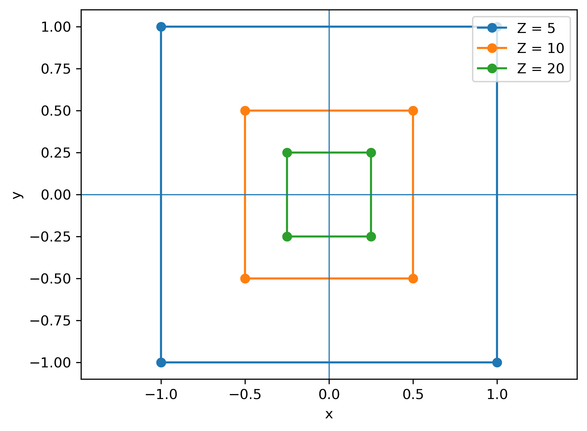
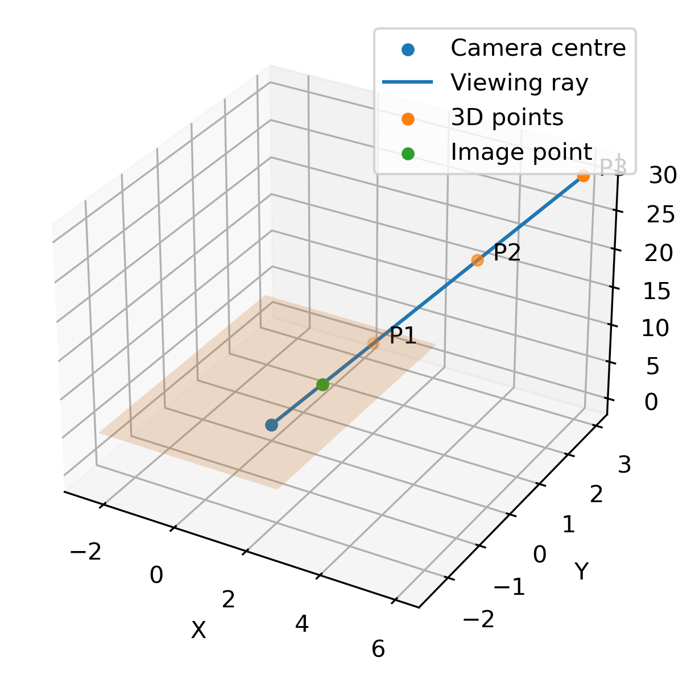
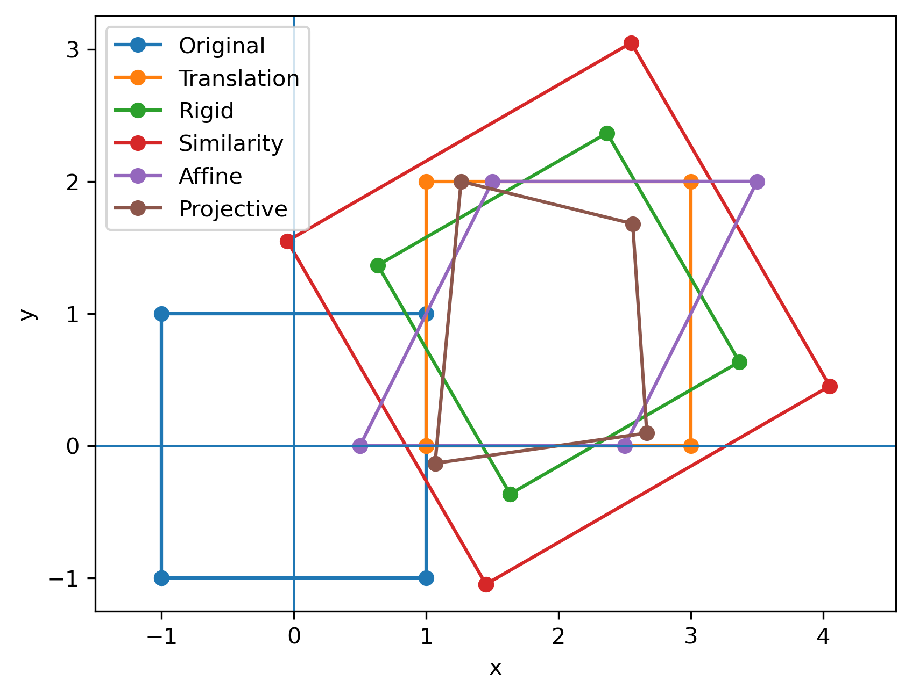
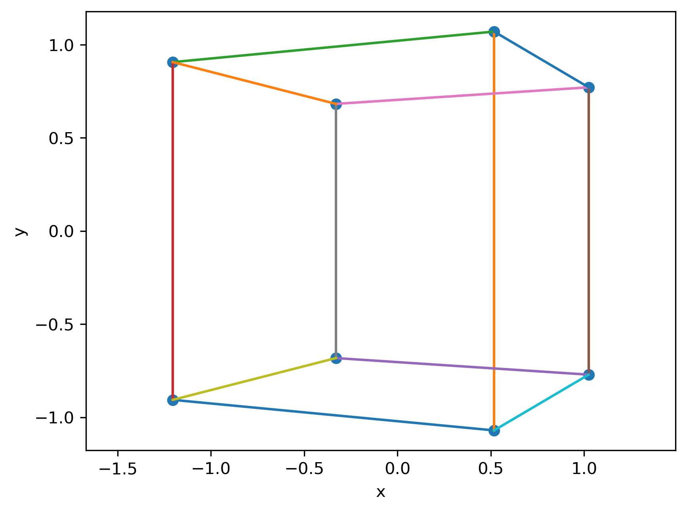
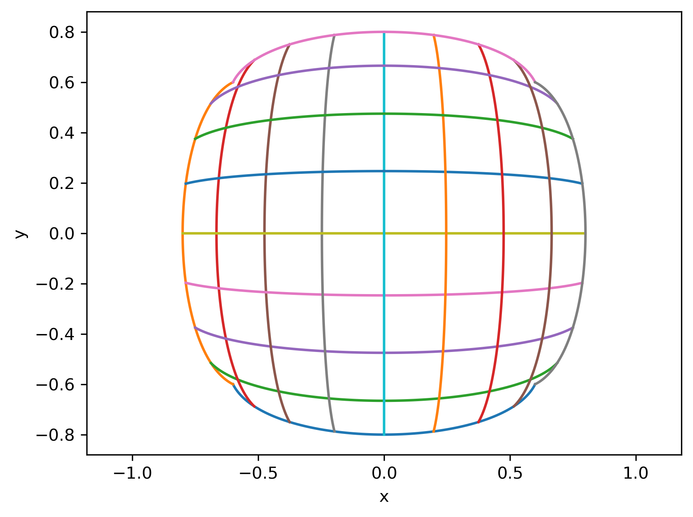
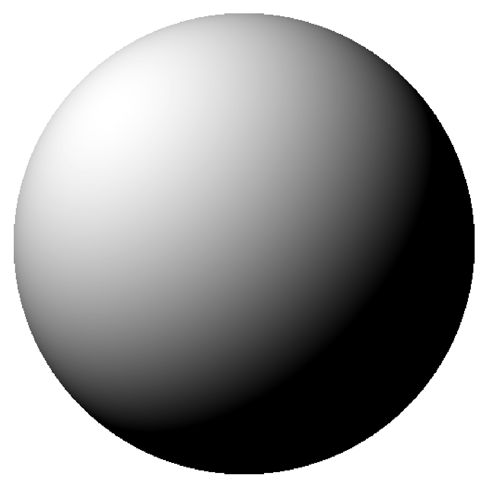
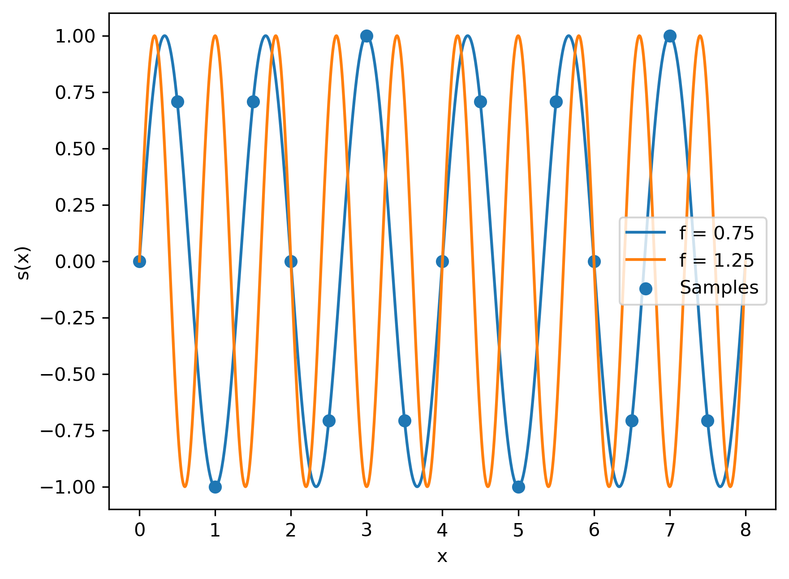

# Computer Vision as an Inverse Problem

Many problems in computer vision can be understood as **inverse problems**. An image is the result of a physical process in which a three-dimensional scene is projected onto a two-dimensional image plane and converted into digital measurements. Computer vision attempts to reason in the opposite direction: given these measurements, we want to recover properties of the scene that produced them.

Schematically, the image formation process can be represented as

$$
S
\xrightarrow{F}
I,
$$

where $S$ represents the properties of the scene, $F$ represents the image formation process, and $I$ is the resulting image. The scene properties may include quantities such as geometry, depth, object shape, surface orientation, reflectance, illumination, and motion.

The corresponding inverse problem is

$$
I
\xrightarrow{\text{inference}}
S.
$$

The difficulty is that information is generally lost or mixed during image formation. As a consequence, different physical scenes may be consistent with the same image measurements. The inverse problem is therefore often **ill-posed**.

A problem is said to be well-posed, in the classical sense of Hadamard, when:

1. a solution exists;
2. the solution is unique; and
3. the solution depends continuously on the observed data.

If one or more of these conditions fails, the problem is said to be **ill-posed**.

In computer vision, this ambiguity can arise in several ways. Geometrically, projecting a three-dimensional scene onto a two-dimensional image can discard information about the spatial structure of the scene, such as depth. Photometrically, the measured intensity at a pixel can depend simultaneously on illumination, surface reflectance, camera optics, and sensor characteristics. Different configurations of these quantities may therefore produce the same, or very similar, image measurements.

# Geometric Image Formation

The first question is how the geometry of a three-dimensional scene is represented in a two-dimensional image. Consider two objects of the same size placed at different distances from a camera. Although their physical dimensions are identical, the more distant object appears smaller in the image.

This effect can be explained using the **pinhole camera model**, a simple geometric model of image formation in which light rays from the scene pass through a single point, called the **camera centre**, before reaching the image plane.

## Pinhole Camera Model

Consider a point in three-dimensional space,

$$
P = (X,Y,Z),
$$

expressed relative to the camera centre. The $Z$-axis points in the viewing direction of the camera, while $X$ and $Y$ describe the horizontal and vertical position of the point.

In a physical pinhole camera, the image plane lies behind the camera centre, producing an inverted image. In computer vision, it is convenient to use an equivalent **virtual image plane** located in front of the camera centre. This convention avoids the sign reversal while preserving the geometry of perspective projection.

Let the virtual image plane be located at a distance $f$ from the camera centre, where $f$ is the **focal length**, and let

$$
p = (x,y)
$$

denote the projection of $P$ onto this plane.

The relationship between the 3D point and its projection follows directly from similar triangles. In the horizontal direction,

$$
\frac{x}{f}
=
\frac{X}{Z},
$$

which gives

$$
x
=
f\frac{X}{Z}.
$$ {#eq-perspective-x}

The same argument in the vertical direction gives

$$
y
=
f\frac{Y}{Z}.
$$ {#eq-perspective-y}

Therefore, the projection of $P=(X,Y,Z)$ onto the image plane is

$$
(x,y)
=
\left(
f\frac{X}{Z},
f\frac{Y}{Z}
\right).
$$ {#eq-perspective-projection}

This mapping is known as **perspective projection**.

To see its effect, consider the point

$$
P = (2,1,10)
$$

and a camera with focal length $f=5$. From @eq-perspective-projection,

$$
x
=
5\frac{2}{10}
=
1,
\qquad
y
=
5\frac{1}{10}
=
0.5.
$$

Therefore,

$$
(2,1,10)
\longrightarrow
(1,0.5).
$$

Now consider a point with the same $X$ and $Y$ coordinates but twice the depth,

$$
P' = (2,1,20).
$$

Its projection is

$$
x'
=
5\frac{2}{20}
=
0.5,
\qquad
y'
=
5\frac{1}{20}
=
0.25,
$$

and therefore

$$
(2,1,20)
\longrightarrow
(0.5,0.25).
$$

Doubling the depth halves both image coordinates relative to the optical axis. More generally, for fixed $X$, $Y$, and $f$,

$$
x,y
\propto
\frac{1}{Z}.
$$

This is the geometric reason why objects appear smaller as their distance from the camera increases.

The effect can also be seen by projecting the same object at different depths. @fig-perspective-depth shows the projection of a square whose physical dimensions remain unchanged while its distance from the camera increases.

{#fig-perspective-depth width=70%}

As the depth $Z$ increases, the projected square contracts towards the optical axis. The change in apparent size follows directly from the $1/Z$ dependence in @eq-perspective-projection.

The focal length has a different effect. For a fixed 3D point,

$$
x,y
\propto
f.
$$

Increasing $f$ therefore increases the size of the projection on the image plane, while decreasing $f$ reduces it.

## Loss of Depth Information

Perspective projection maps a three-dimensional point onto a two-dimensional image point. The inverse mapping, however, is not unique.

Consider again a camera with focal length $f=5$. The point

$$
P=(2,1,10)
$$

is projected onto

$$
p
=
\left(
5\frac{2}{10},
5\frac{1}{10}
\right)
=
(1,0.5).
$$

Now consider a second point obtained by multiplying all three coordinates of $P$ by two:

$$
P'=(4,2,20).
$$

Its projection is

$$
p'
=
\left(
5\frac{4}{20},
5\frac{2}{20}
\right)
=
(1,0.5).
$$

Therefore,

$$
(2,1,10)
\longrightarrow
(1,0.5),
$$

and

$$
(4,2,20)
\longrightarrow
(1,0.5).
$$

Two different points in three-dimensional space produce exactly the same point on the image plane.

More generally, consider a scaled version of a 3D point,

$$
P_\lambda
=
(\lambda X,\lambda Y,\lambda Z),
\qquad
\lambda>0.
$$

Applying perspective projection gives

$$
x_\lambda
=
f\frac{\lambda X}{\lambda Z}
=
f\frac{X}{Z}
=
x,
$$

and similarly,

$$
y_\lambda
=
f\frac{\lambda Y}{\lambda Z}
=
f\frac{Y}{Z}
=
y.
$$

The scale factor $\lambda$ therefore disappears during projection. All points of the form

$$
P_\lambda
=
\lambda(X,Y,Z),
\qquad
\lambda>0,
$$

produce the same image point.

Geometrically, these points lie along the same **viewing ray** originating at the camera centre. An observed image point determines the direction of this ray, but not the position of the original 3D point along it.

Using the perspective projection equations,

$$
x=f\frac{X}{Z},
\qquad
y=f\frac{Y}{Z},
$$

we can solve for $X$ and $Y$ in terms of the unknown depth $Z$:

$$
X=\frac{xZ}{f},
\qquad
Y=\frac{yZ}{f}.
$$

Hence, for a given image point $(x,y)$, the corresponding 3D points can be written as

$$
P(Z)
=
\left(
\frac{xZ}{f},
\frac{yZ}{f},
Z
\right),
\qquad
Z>0.
$$ {#eq-viewing-ray}

The image therefore determines a one-parameter family of possible 3D points rather than a unique point.

This is a fundamental loss of information in perspective projection: **a single image point does not determine the depth of the corresponding 3D point**.

Hence, for a given image point $(x,y)$, the corresponding 3D points can be written as

$$
P(Z)
=
\left(
\frac{xZ}{f},
\frac{yZ}{f},
Z
\right),
\qquad
Z>0.
$$ {#eq-viewing-ray}

The image therefore determines a one-parameter family of possible 3D points rather than a unique point. As illustrated in @fig-viewing-ray, all points lying along the same viewing ray project onto the same point on the image plane.

{#fig-viewing-ray width=75%}

This is a fundamental loss of information in perspective projection: **a single image point does not determine the depth of the corresponding 3D point**.

## Geometric Primitives and Transformations

Images contain geometric structures that can be represented using simple mathematical primitives. Consider, for example, two straight edges detected in an image. If we want to determine where these edges intersect, we first need a convenient representation for points and lines.

### Points and Lines in 2D

A point in the image plane can be represented by its Cartesian coordinates,

$$
p=(x,y),
$$

or equivalently as a column vector,

$$
\mathbf{p}
=
\begin{bmatrix}
x\\
y
\end{bmatrix}.
$$

A line can be described by the equation

$$
ax+by+c=0.
$$ {#eq-line-2d}

We can therefore represent the line by the vector

$$
\mathbf{l}
=
\begin{bmatrix}
a\\
b\\
c
\end{bmatrix}.
$$

For example, consider the two lines

$$
l_1:\quad y=x+1,
$$

and

$$
l_2:\quad y=-x+5.
$$

Writing them in the form of @eq-line-2d gives

$$
l_1:\quad x-y+1=0,
$$

and

$$
l_2:\quad x+y-5=0.
$$

Solving these two equations directly gives

$$
x=2,
\qquad
y=3.
$$

Therefore, the two lines intersect at

$$
p=(2,3).
$$

For two lines this calculation is straightforward. However, geometric operations such as intersections and transformations become easier to express using **homogeneous coordinates**.

### Homogeneous Coordinates

A 2D point

$$
p=(x,y)
$$

can be represented in homogeneous coordinates by adding a third coordinate,

$$
\tilde{\mathbf{p}}
=
\begin{bmatrix}
\tilde{x}\\
\tilde{y}\\
\tilde{w}
\end{bmatrix}.
$$

When $\tilde{w}\neq0$, the corresponding Cartesian coordinates are obtained by dividing by the last coordinate:

$$
x=\frac{\tilde{x}}{\tilde{w}},
\qquad
y=\frac{\tilde{y}}{\tilde{w}}.
$$ {#eq-homogeneous-normalization}

For example,

$$
\begin{bmatrix}
2\\
3\\
1
\end{bmatrix},
\qquad
\begin{bmatrix}
4\\
6\\
2
\end{bmatrix},
\qquad
\begin{bmatrix}
6\\
9\\
3
\end{bmatrix}
$$

all represent the same Cartesian point,

$$
p=(2,3).
$$

More generally, homogeneous vectors that differ only by a non-zero scale factor represent the same point:

$$
\tilde{\mathbf{p}}
\sim
\lambda\tilde{\mathbf{p}},
\qquad
\lambda\neq0.
$$

A particularly convenient representation is obtained by choosing $\tilde{w}=1$,

$$
\bar{\mathbf{p}}
=
\begin{bmatrix}
x\\
y\\
1
\end{bmatrix}.
$$

Using this representation, the line equation

$$
ax+by+c=0
$$

can be written compactly as

$$
\mathbf{l}^{T}\bar{\mathbf{p}}=0.
$$ {#eq-point-line-incidence}

This equation expresses a simple geometric relationship: the point $\bar{\mathbf{p}}$ lies on the line $\mathbf{l}$ if their inner product is zero.

Homogeneous coordinates also provide a direct way to compute the intersection of two lines. If

$$
\mathbf{l}_1
=
\begin{bmatrix}
a_1\\
b_1\\
c_1
\end{bmatrix},
\qquad
\mathbf{l}_2
=
\begin{bmatrix}
a_2\\
b_2\\
c_2
\end{bmatrix},
$$

their intersection is

$$
\tilde{\mathbf{p}}
=
\mathbf{l}_1
\times
\mathbf{l}_2.
$$ {#eq-line-intersection}

For the previous example,

$$
\mathbf{l}_1
=
\begin{bmatrix}
1\\
-1\\
1
\end{bmatrix},
\qquad
\mathbf{l}_2
=
\begin{bmatrix}
1\\
1\\
-5
\end{bmatrix}.
$$

Their cross product is

$$
\tilde{\mathbf{p}}
=
\begin{bmatrix}
1\\
-1\\
1
\end{bmatrix}
\times
\begin{bmatrix}
1\\
1\\
-5
\end{bmatrix}
=
\begin{bmatrix}
4\\
6\\
2
\end{bmatrix}.
$$

Normalizing according to @eq-homogeneous-normalization gives

$$
\bar{\mathbf{p}}
=
\frac{1}{2}
\begin{bmatrix}
4\\
6\\
2
\end{bmatrix}
=
\begin{bmatrix}
2\\
3\\
1
\end{bmatrix},
$$

and therefore

$$
p=(2,3),
$$

which is the same intersection obtained by solving the two line equations directly.

### Geometric Primitives in 3D

The same geometric primitives can be extended to three-dimensional space. A 3D point is represented by

$$
P=(X,Y,Z),
$$

or, in homogeneous coordinates,

$$
\tilde{\mathbf{P}}
=
\begin{bmatrix}
\tilde{X}\\
\tilde{Y}\\
\tilde{Z}\\
\tilde{W}
\end{bmatrix}.
$$

When $\tilde{W}\neq0$, the corresponding Cartesian coordinates are

$$
X=\frac{\tilde{X}}{\tilde{W}},
\qquad
Y=\frac{\tilde{Y}}{\tilde{W}},
\qquad
Z=\frac{\tilde{Z}}{\tilde{W}}.
$$

As in 2D, homogeneous vectors that differ only by a non-zero scale factor represent the same point.

A line in 3D can be described using a point $\mathbf{P}_0$ on the line and a direction vector $\mathbf{d}$. Any point on the line can then be written as

$$
\mathbf{P}(t)
=
\mathbf{P}_0+t\mathbf{d},
\qquad
t\in\mathbb{R}.
$$ {#eq-line-3d}

For example, consider the point

$$
\mathbf{P}_0
=
\begin{bmatrix}
1\\
2\\
3
\end{bmatrix}
$$

and the direction

$$
\mathbf{d}
=
\begin{bmatrix}
2\\
0\\
1
\end{bmatrix}.
$$

The corresponding line is

$$
\mathbf{P}(t)
=
\begin{bmatrix}
1\\
2\\
3
\end{bmatrix}
+
t
\begin{bmatrix}
2\\
0\\
1
\end{bmatrix}.
$$

For $t=2$, for example,

$$
\mathbf{P}(2)
=
\begin{bmatrix}
5\\
2\\
5
\end{bmatrix}.
$$

A plane can be represented by a point $\mathbf{P}_0$ on the plane and a normal vector $\mathbf{n}$ perpendicular to it. A point $\mathbf{P}$ belongs to the plane when the vector $\mathbf{P}-\mathbf{P}_0$ is perpendicular to $\mathbf{n}$:

$$
\mathbf{n}^{T}
(\mathbf{P}-\mathbf{P}_0)
=
0.
$$ {#eq-plane-point-normal}

Expanding this expression gives the familiar plane equation

$$
aX+bY+cZ+d=0,
$$ {#eq-plane-3d}

where

$$
\mathbf{n}
=
\begin{bmatrix}
a\\
b\\
c
\end{bmatrix}.
$$

For example, consider the plane

$$
X+2Y+Z-6=0.
$$

Its normal vector is

$$
\mathbf{n}
=
\begin{bmatrix}
1\\
2\\
1
\end{bmatrix}.
$$

The point

$$
\mathbf{P}
=
\begin{bmatrix}
2\\
1\\
2
\end{bmatrix}
$$

lies on the plane because

$$
2+2(1)+2-6=0.
$$

In homogeneous coordinates, the plane can be represented by

$$
\boldsymbol{\pi}
=
\begin{bmatrix}
a\\
b\\
c\\
d
\end{bmatrix},
$$

so that the incidence relation between a 3D point and a plane takes the compact form

$$
\boldsymbol{\pi}^{T}\tilde{\mathbf{P}}=0.
$$ {#eq-point-plane-incidence}

### 2D Transformations

Suppose that an object has been identified in an image and represented by a set of points. If the object moves, rotates, changes scale, or is observed from a different viewpoint, the coordinates of these points change.

A **geometric transformation** describes how the original coordinates

$$
\mathbf{p}
=
\begin{bmatrix}
x\\
y
\end{bmatrix}
$$

are mapped to new coordinates

$$
\mathbf{p}'
=
\begin{bmatrix}
x'\\
y'
\end{bmatrix}.
$$

Different transformation models allow different kinds of geometric changes.

#### Translation

The simplest transformation moves every point by the same displacement. If

$$
\mathbf{t}
=
\begin{bmatrix}
t_x\\
t_y
\end{bmatrix},
$$

then

$$
\mathbf{p}'
=
\mathbf{p}
+
\mathbf{t}.
$$ {#eq-translation-2d}

For example, consider the point

$$
\mathbf{p}
=
\begin{bmatrix}
1\\
2
\end{bmatrix}
$$

and the translation

$$
\mathbf{t}
=
\begin{bmatrix}
3\\
1
\end{bmatrix}.
$$

The transformed point is

$$
\mathbf{p}'
=
\begin{bmatrix}
1\\
2
\end{bmatrix}
+
\begin{bmatrix}
3\\
1
\end{bmatrix}
=
\begin{bmatrix}
4\\
3
\end{bmatrix}.
$$

Using homogeneous coordinates, translation can be written as a matrix multiplication:

$$
\begin{bmatrix}
x'\\
y'\\
1
\end{bmatrix}
=
\begin{bmatrix}
1 & 0 & t_x\\
0 & 1 & t_y\\
0 & 0 & 1
\end{bmatrix}
\begin{bmatrix}
x\\
y\\
1
\end{bmatrix}.
$$ {#eq-translation-homogeneous}

This is one of the main reasons for introducing homogeneous coordinates: translation, which cannot be represented by a $2\times2$ linear transformation alone, can be incorporated into the same matrix representation used for other geometric transformations.

#### Rotation and Rigid Transformation

A point can be rotated around the origin by an angle $\theta$ using

$$
\mathbf{p}'
=
R(\theta)\mathbf{p},
$$

where

$$
R(\theta)
=
\begin{bmatrix}
\cos\theta & -\sin\theta\\
\sin\theta & \cos\theta
\end{bmatrix}.
$$ {#eq-rotation-2d}

For example, rotating

$$
\mathbf{p}
=
\begin{bmatrix}
1\\
0
\end{bmatrix}
$$

by

$$
\theta=90^\circ
$$

gives

$$
R(90^\circ)
=
\begin{bmatrix}
0 & -1\\
1 & 0
\end{bmatrix},
$$

and therefore

$$
\mathbf{p}'
=
\begin{bmatrix}
0 & -1\\
1 & 0
\end{bmatrix}
\begin{bmatrix}
1\\
0
\end{bmatrix}
=
\begin{bmatrix}
0\\
1
\end{bmatrix}.
$$

Rotation can be combined with translation:

$$
\mathbf{p}'
=
R\mathbf{p}
+
\mathbf{t}.
$$ {#eq-rigid-transformation}

This is called a **rigid**, or **Euclidean**, transformation. In homogeneous coordinates,

$$
\begin{bmatrix}
x'\\
y'\\
1
\end{bmatrix}
=
\begin{bmatrix}
r_{11} & r_{12} & t_x\\
r_{21} & r_{22} & t_y\\
0 & 0 & 1
\end{bmatrix}
\begin{bmatrix}
x\\
y\\
1
\end{bmatrix}.
$$

A rigid transformation can change the position and orientation of an object, but it preserves distances and angles. The object's shape and size therefore remain unchanged.

#### Similarity Transformation

Suppose that the object can also change its apparent size. A uniform scale factor $s$ can be added to the rigid transformation:

$$
\mathbf{p}'
=
sR\mathbf{p}
+
\mathbf{t}.
$$ {#eq-similarity-transformation}

This defines a **similarity transformation**.

For example, if

$$
s=2,
\qquad
R=I,
\qquad
\mathbf{t}=\mathbf{0},
$$

then

$$
\mathbf{p}'=2\mathbf{p}.
$$

Every distance is multiplied by two, while the shape of the object remains unchanged.

A similarity transformation therefore allows translation, rotation, and uniform scaling. Unlike a rigid transformation, it does not preserve lengths, but it preserves angles and relative shape.

#### Affine Transformation

A similarity transformation scales an object uniformly, so its angles and relative shape are preserved. A more general transformation allows different scaling and shearing along different directions.

An **affine transformation** has the form

$$
\mathbf{p}'
=
A\mathbf{p}
+
\mathbf{t},
$$ {#eq-affine-transformation}

where

$$
A
=
\begin{bmatrix}
a_{11} & a_{12}\\
a_{21} & a_{22}
\end{bmatrix}
$$

is an arbitrary $2\times2$ matrix.

Using homogeneous coordinates,

$$
\begin{bmatrix}
x'\\
y'\\
1
\end{bmatrix}
=
\begin{bmatrix}
a_{11} & a_{12} & t_x\\
a_{21} & a_{22} & t_y\\
0 & 0 & 1
\end{bmatrix}
\begin{bmatrix}
x\\
y\\
1
\end{bmatrix}.
$$ {#eq-affine-homogeneous}

Consider, for example,

$$
A
=
\begin{bmatrix}
1 & 0.5\\
0 & 1
\end{bmatrix}.
$$

The resulting transformation is a horizontal shear:

$$
x'=x+0.5y,
\qquad
y'=y.
$$

A square is transformed into a parallelogram. Its lengths and angles generally change, but lines that were parallel before the transformation remain parallel afterwards.

#### Projective Transformation

An affine transformation cannot represent every geometric deformation produced by perspective. For example, two parallel lines in the scene may appear to converge in an image.

A more general mapping is the **projective transformation**, also known as a **homography**. In homogeneous coordinates, it is written as

$$
\tilde{\mathbf{p}}'
=
H\tilde{\mathbf{p}},
$$ {#eq-projective-transformation}

where

$$
H
=
\begin{bmatrix}
h_{11} & h_{12} & h_{13}\\
h_{21} & h_{22} & h_{23}\\
h_{31} & h_{32} & h_{33}
\end{bmatrix}.
$$

Applying the matrix multiplication gives

$$
\tilde{\mathbf{p}}'
=
\begin{bmatrix}
h_{11}x+h_{12}y+h_{13}\\
h_{21}x+h_{22}y+h_{23}\\
h_{31}x+h_{32}y+h_{33}
\end{bmatrix}.
$$

The result is expressed in homogeneous coordinates. Dividing by its third coordinate gives

$$
x'
=
\frac{
h_{11}x+h_{12}y+h_{13}
}{
h_{31}x+h_{32}y+h_{33}
},
$$

and

$$
y'
=
\frac{
h_{21}x+h_{22}y+h_{23}
}{
h_{31}x+h_{32}y+h_{33}
}.
$$ {#eq-projective-normalization}

Unlike an affine transformation, the denominator now depends on the original position $(x,y)$. This allows different parts of the object to undergo different apparent scaling and makes it possible for parallel lines to become non-parallel.

Straight lines, however, remain straight under a projective transformation.

The transformation models considered so far therefore form a hierarchy:

$$
\text{translation}
\subset
\text{rigid}
\subset
\text{similarity}
\subset
\text{affine}
\subset
\text{projective}.
$$

Each successive model allows a larger class of geometric changes, while preserving fewer geometric properties.

The effect of these transformation models on the same square is illustrated in @fig-transformations-2d.

{#fig-transformations-2d width=80%}

### 3D Transformations

The transformations introduced in 2D can also be defined in three-dimensional space. In computer vision, an especially important case is the **rigid transformation**, because it describes changes in the position and orientation of objects and cameras without changing their shape.

Consider a 3D point

$$
\mathbf{P}
=
\begin{bmatrix}
X\\
Y\\
Z
\end{bmatrix}.
$$

A translation by

$$
\mathbf{t}
=
\begin{bmatrix}
t_x\\
t_y\\
t_z
\end{bmatrix}
$$

is given by

$$
\mathbf{P}'
=
\mathbf{P}
+
\mathbf{t}.
$$

A rotation in three dimensions is represented by a $3\times3$ rotation matrix $R$:

$$
\mathbf{P}'
=
R\mathbf{P}.
$$

Combining rotation and translation gives the 3D rigid transformation

$$
\mathbf{P}'
=
R\mathbf{P}
+
\mathbf{t}.
$$ {#eq-rigid-transformation-3d}

Using homogeneous coordinates,

$$
\tilde{\mathbf{P}}
=
\begin{bmatrix}
X\\
Y\\
Z\\
1
\end{bmatrix},
$$

the transformation can be written as

$$
\tilde{\mathbf{P}}'
=
\begin{bmatrix}
R & \mathbf{t}\\
\mathbf{0}^{T} & 1
\end{bmatrix}
\tilde{\mathbf{P}}.
$$ {#eq-rigid-homogeneous-3d}

The resulting $4\times4$ matrix combines rotation and translation into a single transformation.

#### 3D Rotation

Unlike rotation in 2D, where a single angle is sufficient, rotation in 3D can occur around different axes.

A rotation by an angle $\theta$ around the $X$-axis is represented by

$$
R_x(\theta)
=
\begin{bmatrix}
1 & 0 & 0\\
0 & \cos\theta & -\sin\theta\\
0 & \sin\theta & \cos\theta
\end{bmatrix}.
$$

Similarly, rotations around the $Y$- and $Z$-axes are

$$
R_y(\theta)
=
\begin{bmatrix}
\cos\theta & 0 & \sin\theta\\
0 & 1 & 0\\
-\sin\theta & 0 & \cos\theta
\end{bmatrix},
$$

and

$$
R_z(\theta)
=
\begin{bmatrix}
\cos\theta & -\sin\theta & 0\\
\sin\theta & \cos\theta & 0\\
0 & 0 & 1
\end{bmatrix}.
$$

More general rotations can be constructed by combining rotations around different axes. Since matrix multiplication is not commutative,

$$
R_xR_y
\neq
R_yR_x
$$

in general, so the order in which rotations are applied matters.

A valid 3D rotation matrix satisfies

$$
R^{T}R=I
$$

and

$$
\det(R)=1.
$$

These properties ensure that rotation preserves distances, angles, and orientation.

#### From World Coordinates to Camera Coordinates

A 3D point is usually described relative to a **world coordinate system**, while perspective projection is defined relative to the camera centre. Before projecting the point onto the image plane, its coordinates must therefore be expressed in the camera coordinate system.

Let

$$
\mathbf{P}_w
$$

denote a point in world coordinates and

$$
\mathbf{P}_c
$$

the same point expressed relative to the camera. Their relationship can be written as

$$
\mathbf{P}_c
=
R\mathbf{P}_w
+
\mathbf{t}.
$$ {#eq-world-to-camera}

The matrix $R$ describes the relative orientation of the camera coordinate system, while $\mathbf{t}$ accounts for its translation.

Once the point has been transformed into camera coordinates,

$$
\mathbf{P}_c
=
\begin{bmatrix}
X_c\\
Y_c\\
Z_c
\end{bmatrix},
$$

the pinhole projection derived earlier can be applied:

$$
x
=
f\frac{X_c}{Z_c},
\qquad
y
=
f\frac{Y_c}{Z_c}.
$$

The complete geometric process can therefore be written schematically as

$$
\mathbf{P}_w
\xrightarrow{\text{rigid transformation}}
\mathbf{P}_c
\xrightarrow{\text{perspective projection}}
\mathbf{p}.
$$

### 3D-to-2D Projection

Perspective projection was previously derived for a point already expressed relative to the camera. In practice, however, a 3D point is usually represented in a world coordinate system and must first be transformed into camera coordinates.

Let

$$
\mathbf{P}_w
=
\begin{bmatrix}
X_w\\
Y_w\\
Z_w
\end{bmatrix}
$$

be a point in world coordinates. Its coordinates relative to the camera are

$$
\mathbf{P}_c
=
R\mathbf{P}_w+\mathbf{t},
$$

where $R$ and $\mathbf{t}$ describe the transformation from the world coordinate system to the camera coordinate system.

Writing

$$
\mathbf{P}_c
=
\begin{bmatrix}
X_c\\
Y_c\\
Z_c
\end{bmatrix},
$$

perspective projection gives

$$
x
=
f\frac{X_c}{Z_c},
\qquad
y
=
f\frac{Y_c}{Z_c}.
$$

These two operations can be expressed compactly using homogeneous coordinates. The transformation from world coordinates to camera coordinates is

$$
\tilde{\mathbf{P}}_c
=
\begin{bmatrix}
R & \mathbf{t}
\end{bmatrix}
\tilde{\mathbf{P}}_w,
$$

where

$$
\tilde{\mathbf{P}}_w
=
\begin{bmatrix}
X_w\\
Y_w\\
Z_w\\
1
\end{bmatrix}.
$$

Perspective projection can then be represented by

$$
\tilde{\mathbf{p}}
=
\begin{bmatrix}
f & 0 & 0\\
0 & f & 0\\
0 & 0 & 1
\end{bmatrix}
\mathbf{P}_c.
$$

Combining both operations gives

$$
\tilde{\mathbf{p}}
=
\begin{bmatrix}
f & 0 & 0\\
0 & f & 0\\
0 & 0 & 1
\end{bmatrix}
\begin{bmatrix}
R & \mathbf{t}
\end{bmatrix}
\tilde{\mathbf{P}}_w.
$$ {#eq-camera-projection}

If we define

$$
K
=
\begin{bmatrix}
f & 0 & 0\\
0 & f & 0\\
0 & 0 & 1
\end{bmatrix},
$$

then @eq-camera-projection becomes

$$
\tilde{\mathbf{p}}
=
K
\begin{bmatrix}
R & \mathbf{t}
\end{bmatrix}
\tilde{\mathbf{P}}_w.
$$ {#eq-camera-matrix}

The $3\times4$ matrix

$$
P
=
K
\begin{bmatrix}
R & \mathbf{t}
\end{bmatrix}
$$

is the **camera matrix**, so the complete projection can be written as

$$
\tilde{\mathbf{p}}
=
P\tilde{\mathbf{P}}_w.
$$

The matrix $K$ contains parameters associated with the internal geometry of the camera, while $R$ and $\mathbf{t}$ describe its position and orientation relative to the world coordinate system.

The resulting vector

$$
\tilde{\mathbf{p}}
=
\begin{bmatrix}
\tilde{x}\\
\tilde{y}\\
\tilde{w}
\end{bmatrix}
$$

is expressed in homogeneous coordinates. The final image coordinates are obtained by normalization:

$$
x
=
\frac{\tilde{x}}{\tilde{w}},
\qquad
y
=
\frac{\tilde{y}}{\tilde{w}}.
$$

The complete transformation is illustrated in @fig-camera-projection, where a cube defined in world coordinates is first transformed relative to the camera and then projected onto the image plane.

{#fig-camera-projection width=70%}

### Lens Distortion

The pinhole camera model assumes an ideal projection in which straight lines in the scene are projected as straight lines in the image. Real lenses, however, can deviate from this ideal model.

This effect is particularly noticeable with wide-angle lenses, where straight lines may appear curved. This geometric deviation from the ideal projection is known as **lens distortion**.

One of the most common forms is **radial distortion**, in which the displacement of an image point depends on its distance from the optical centre.

Consider the normalized image coordinates

$$
(x_c,y_c),
$$

obtained after perspective projection, and define their squared radial distance as

$$
r_c^2
=
x_c^2+y_c^2.
$$ {#eq-radial-distance}

A simple radial distortion model is

$$
\hat{x}_c
=
x_c
\left(
1+\kappa_1r_c^2+\kappa_2r_c^4
\right),
$$

$$
\hat{y}_c
=
y_c
\left(
1+\kappa_1r_c^2+\kappa_2r_c^4
\right),
$$ {#eq-radial-distortion}

where $\kappa_1$ and $\kappa_2$ are the **radial distortion parameters**.

The multiplicative factor

$$
1+\kappa_1r_c^2+\kappa_2r_c^4
$$

depends only on the radial distance from the centre. Points close to the centre are therefore affected less than points farther away.

Depending on the distortion parameters, straight lines can bend outward or inward. These two characteristic effects are known as **barrel distortion** and **pincushion distortion**, respectively.

The geometric image formation process can therefore be extended from

$$
\text{3D point}
\rightarrow
\text{perspective projection}
\rightarrow
\text{image point}
$$

to

$$
\text{3D point}
\rightarrow
\text{perspective projection}
\rightarrow
\text{lens distortion}
\rightarrow
\text{image point}.
$$

The effect of radial distortion on an otherwise regular grid is illustrated in @fig-lens-distortion. The deformation increases with distance from the centre because the distortion factor depends on $r_c$.

{#fig-lens-distortion width=70%}

# Photometric Image Formation

Geometric image formation describes where a point in the three-dimensional scene appears in the image. It does not explain the intensity or color observed at that location.

These measurements depend on how light interacts with the scene before reaching the camera. A simplified image formation process can be represented as

$$
\text{light source}
\longrightarrow
\text{surface}
\longrightarrow
\text{camera}.
$$

Light emitted by a source reaches a surface, interacts with the material, and a portion of the reflected light travels towards the camera.

## Lighting

An image requires illumination. The amount of light reaching a surface depends on the properties of the light source and its geometric relationship with the surface.

A simple model is a **point light source**, in which the light originates from a single position in three-dimensional space.

Consider a light source located at

$$
\mathbf{L}
$$

and a surface point located at

$$
\mathbf{P}.
$$

The vector from the surface point towards the light is

$$
\mathbf{v}
=
\mathbf{L}-\mathbf{P},
$$

and the corresponding distance is

$$
r
=
\|\mathbf{L}-\mathbf{P}\|.
$$

The unit direction towards the light is therefore

$$
\hat{\mathbf{v}}
=
\frac{\mathbf{L}-\mathbf{P}}
{\|\mathbf{L}-\mathbf{P}\|}.
$$

For an ideal point source, the intensity of the illumination decreases with the square of the distance from the source:

$$
E
\propto
\frac{1}{r^2}.
$$ {#eq-inverse-square-light}

This is known as the **inverse-square law**.

For example, suppose that a surface receives an illumination $E_1$ when it is at distance $r$ from the light source. If the distance is doubled,

$$
r_2=2r,
$$

then

$$
\frac{E_2}{E_1}
=
\frac{1/(2r)^2}{1/r^2}
=
\frac{1}{4}.
$$

The surface therefore receives one quarter of the illumination.

A point source located sufficiently far from the scene can often be approximated by a **directional light source**. In this case, the incoming light rays are approximately parallel and their direction can be treated as constant across the scene.

## Reflectance and Shading

Consider a curved object made from a single material and illuminated by a single light source. Even if the material is uniform, the object does not appear uniformly bright. Some regions face the light directly, while others receive the light at increasingly oblique angles.

This variation in image intensity is known as **shading**.

Let

$$
\hat{\mathbf{n}}
$$

be the unit normal vector of a surface and

$$
\hat{\mathbf{v}}_i
$$

the unit vector pointing from the surface towards the light source.

The angle between them is $\theta_i$, so

$$
\hat{\mathbf{v}}_i
\cdot
\hat{\mathbf{n}}
=
\cos\theta_i.
$$ {#eq-incidence-angle}

When the surface faces the light directly,

$$
\theta_i=0,
$$

and therefore

$$
\cos\theta_i=1.
$$

As the surface turns away from the light, $\theta_i$ increases and the amount of illumination received by the surface decreases.

If the surface faces away from the light,

$$
\hat{\mathbf{v}}_i
\cdot
\hat{\mathbf{n}}<0,
$$

the light source does not directly illuminate that side of the surface. The geometric factor is therefore written as

$$
\cos^{+}\theta_i
=
\max
\left(
0,
\hat{\mathbf{v}}_i
\cdot
\hat{\mathbf{n}}
\right).
$$ {#eq-positive-cosine}

### Lambertian Reflection

A simple model of surface reflectance is the **Lambertian model**. A Lambertian surface reflects incident light diffusely, so its apparent brightness does not depend on the viewing direction.

For a single light source, a simplified Lambertian model can be written as

$$
L_r
=
\rho L_i
\max
\left(
0,
\hat{\mathbf{v}}_i
\cdot
\hat{\mathbf{n}}
\right),
$$ {#eq-lambertian-reflection}

where

- $L_i$ is the incident light;
- $\rho$ describes the diffuse reflectance of the surface;
- $L_r$ is the reflected light.

The observed variation across a uniformly coloured curved surface can therefore arise entirely from changes in surface orientation.

For example, if

$$
\hat{\mathbf{v}}_i
=
\begin{bmatrix}
0\\
0\\
1
\end{bmatrix}
$$

and the surface normal is

$$
\hat{\mathbf{n}}_1
=
\begin{bmatrix}
0\\
0\\
1
\end{bmatrix},
$$

then

$$
\hat{\mathbf{v}}_i
\cdot
\hat{\mathbf{n}}_1
=
1.
$$

If another surface has normal

$$
\hat{\mathbf{n}}_2
=
\begin{bmatrix}
\frac{\sqrt{3}}{2}\\
0\\
\frac{1}{2}
\end{bmatrix},
$$

then

$$
\hat{\mathbf{v}}_i
\cdot
\hat{\mathbf{n}}_2
=
\frac{1}{2}.
$$

Under the same illumination and with the same reflectance, the second surface therefore produces half the diffuse reflected light of the first.

### Bidirectional Reflectance Distribution Function

The Lambertian model describes a particular type of diffuse reflection. Real materials can exhibit more complicated behaviour in which the amount of reflected light depends on both the incoming and outgoing light directions.

A general model for this interaction is the **Bidirectional Reflectance Distribution Function (BRDF)**,

$$
f_r
\left(
\hat{\mathbf{v}}_i,
\hat{\mathbf{v}}_r,
\hat{\mathbf{n}};
\lambda
\right),
$$

where $\hat{\mathbf{v}}_i$ is the incident light direction, $\hat{\mathbf{v}}_r$ is the reflected direction towards the observer, $\hat{\mathbf{n}}$ is the surface normal, and $\lambda$ represents wavelength.

For general illumination, the reflected light in direction $\hat{\mathbf{v}}_r$ depends on the contribution of light arriving from different directions:

$$
L_r(\hat{\mathbf{v}}_r;\lambda)
=
\int
L_i(\hat{\mathbf{v}}_i;\lambda)
f_r
\left(
\hat{\mathbf{v}}_i,
\hat{\mathbf{v}}_r,
\hat{\mathbf{n}};
\lambda
\right)
\cos^{+}\theta_i
\,d\hat{\mathbf{v}}_i.
$$ {#eq-reflection-equation}

In practice, surface reflection is often described as a combination of **diffuse** and **specular** components. Diffuse reflection produces the smooth shading described by the Lambertian model, while specular reflection produces highlights whose appearance depends strongly on the relationship between the light, surface normal, and viewing direction.

The effect of surface orientation is illustrated in @fig-lambertian-shading. The sphere has uniform reflectance, so the variation in intensity is produced entirely by the changing orientation of its surface normal relative to the light direction.

{#fig-lambertian-shading width=55%}

## Optics

The pinhole camera is useful for describing the geometry of image formation, but a real camera uses a lens to collect and focus light onto the sensor.

A simple approximation is the **thin lens model**. Consider an object located at a distance $z_o$ in front of a lens and an image formed at a distance $z_i$ behind it. These distances are related to the focal length $f$ by the **thin lens equation**,

$$
\frac{1}{z_o}
+
\frac{1}{z_i}
=
\frac{1}{f}.
$$ {#eq-thin-lens}

For example, consider a lens with focal length

$$
f=50\text{ mm}
$$

focused on an object located

$$
z_o=1000\text{ mm}
$$

from the lens. From @eq-thin-lens,

$$
\frac{1}{z_i}
=
\frac{1}{50}
-
\frac{1}{1000}
=
\frac{19}{1000},
$$

so

$$
z_i
=
\frac{1000}{19}
\approx
52.6\text{ mm}.
$$

The sensor must therefore lie approximately $52.6$ mm behind the lens for this object distance to be perfectly focused.

As the object becomes increasingly distant,

$$
z_o\rightarrow\infty,
$$

and therefore

$$
\frac{1}{z_o}\rightarrow0.
$$

The thin lens equation then reduces to

$$
z_i=f.
$$

This explains why the focal length can be interpreted, to a first approximation, as the distance between the lens and the image plane when the camera is focused at infinity.

### Focus and Depth of Field

A lens focuses light from a particular object distance onto a corresponding image plane. If the sensor is not located at this image distance, rays originating from a scene point do not converge exactly on the sensor.

Instead, they produce a small blurred region known as the **circle of confusion**.

Objects do not need to be perfectly focused to appear acceptably sharp. The range of object distances for which the circle of confusion remains sufficiently small is called the **depth of field**.

Depth of field depends on several quantities, including focal length, focus distance, and aperture size.

### Aperture

The **aperture** controls the effective diameter $d$ through which light passes through the lens.

Its size is commonly expressed using the **f-number**

$$
N
=
\frac{f}{d},
$$ {#eq-f-number}

where $f$ is the focal length and $d$ is the aperture diameter.

For example, a $50$ mm lens at

$$
f/2
$$

has an aperture diameter

$$
d
=
\frac{50}{2}
=
25\text{ mm}.
$$

At

$$
f/4,
$$

the aperture diameter becomes

$$
d
=
\frac{50}{4}
=
12.5\text{ mm}.
$$

A larger aperture corresponds to a smaller f-number and allows more light to pass through the lens. It also produces a shallower depth of field. Conversely, a smaller aperture corresponds to a larger f-number and generally produces a larger depth of field.

### Optical Imperfections

The thin lens is itself an approximation. Real lenses can introduce additional effects that modify the image.

One example is **chromatic aberration**, which occurs because the refractive properties of the lens depend on wavelength. Different wavelengths can therefore be focused at slightly different positions, producing geometric displacement or blur between color components.

Another effect is **vignetting**, in which image brightness decreases towards the edges of the image.

Modern cameras use compound lens systems and calibration or computational correction to reduce many of these effects.

# The Digital Camera

The image formation process described so far produces a continuous distribution of light on the image plane. A digital camera must convert this physical signal into a finite array of numerical measurements.

Light reaching the camera sensor is captured by an array of photosensitive elements. Each element integrates incoming light over a finite spatial region and during a finite exposure time, producing an electrical signal that can subsequently be converted into a numerical value.

The resulting measurements form a **digital image**.

## Pixels and Image Sampling

A continuous image can be represented conceptually by a function

$$
I(x,y),
$$

where $(x,y)$ denotes a position on the continuous image plane and $I(x,y)$ represents the intensity at that position.

A digital sensor cannot measure this function at every possible position. Instead, measurements are obtained over a discrete spatial grid.

The resulting digital image can be represented as

$$
I[i,j],
$$

where $i$ and $j$ identify a discrete location in the image array.

Each element of this array is called a **pixel**.

For an image containing $M$ rows and $N$ columns,

$$
I
\in
\mathbb{R}^{M\times N}
$$

for a scalar-valued image, with

$$
i=0,\ldots,M-1,
\qquad
j=0,\ldots,N-1.
$$

The conversion from the continuous image

$$
I(x,y)
$$

to the discrete representation

$$
I[i,j]
$$

is a form of **spatial sampling**.

If the physical spacing between adjacent sensor measurements is $\Delta x$ and $\Delta y$, the sampled positions can be written as

$$
x_j=j\Delta x,
\qquad
y_i=i\Delta y,
$$

so that, in an idealized point-sampling model,

$$
I[i,j]
=
I(j\Delta x,i\Delta y).
$$ {#eq-image-sampling}

Smaller sampling intervals correspond to a denser spatial sampling of the continuous image.

The point-sampling model in @eq-image-sampling is an idealization. A physical sensor element has a finite area and integrates incoming light over both space and exposure time. Nevertheless, treating a digital image as samples of an underlying continuous image provides a useful model for studying spatial resolution and aliasing.

### Sampling Density

The physical distance between neighbouring sensor elements is known as the **sampling pitch**. A smaller sampling pitch allows more samples to be acquired over the same sensor area and therefore produces a higher spatial sampling density.

Increasing sampling density, however, does not automatically guarantee that arbitrarily fine image detail can be recovered. The relationship between the spatial variation in the incoming image and the sampling frequency determines whether the sampled image represents that variation correctly.

### Sampling and Aliasing

Sampling converts a continuous signal into a discrete set of measurements. If the sampling density is too low relative to the spatial variation of the signal, different continuous signals can produce the same discrete samples.

This phenomenon is known as **aliasing**.

To see how this occurs, consider a one-dimensional sinusoidal signal

$$
s(x)
=
\sin(2\pi f x),
$$

where $f$ is its frequency.

Suppose that the signal is sampled at frequency $f_s$. The sampling interval is then

$$
\Delta x
=
\frac{1}{f_s},
$$

and the sample positions are

$$
x_k
=
\frac{k}{f_s},
\qquad
k\in\mathbb{Z}.
$$

The resulting discrete signal is

$$
s[k]
=
\sin
\left(
2\pi f\frac{k}{f_s}
\right).
$$ {#eq-sampled-sinusoid}

Now consider two signals with frequencies

$$
f_1=\frac{3}{4}
$$

and

$$
f_2=\frac{5}{4},
$$

sampled at

$$
f_s=2.
$$

Their samples are

$$
s_1[k]
=
\sin
\left(
2\pi\frac{3}{4}\frac{k}{2}
\right)
=
\sin
\left(
\frac{3\pi k}{4}
\right),
$$

and

$$
s_2[k]
=
\sin
\left(
2\pi\frac{5}{4}\frac{k}{2}
\right)
=
\sin
\left(
\frac{5\pi k}{4}
\right).
$$

At integer sampling locations, these signals cannot be uniquely distinguished from their samples. Information about the original continuous signal has been lost.

More generally, frequencies separated by integer multiples of the sampling frequency can become indistinguishable after sampling. This ambiguity is the fundamental problem caused by aliasing.

### Sampling Theorem

A band-limited signal can be reconstructed from its samples only if the sampling frequency is sufficiently high relative to the frequencies contained in the signal.

For a signal whose highest frequency is $f_{\max}$, the sampling frequency must satisfy

$$
f_s
\geq
2f_{\max}.
$$ {#eq-nyquist-condition}

The limiting frequency that can be represented without aliasing is therefore

$$
f_{\max}
\leq
\frac{f_s}{2}.
$$

The quantity

$$
\frac{f_s}{2}
$$

is commonly referred to as the **Nyquist frequency**.

If the signal contains frequencies above this limit, these components can appear as lower-frequency structures after sampling.

In an image, the same phenomenon occurs in two spatial dimensions. Fine repetitive structures such as closely spaced lines, fabrics, grids, or other textures can contain spatial frequencies that exceed the sampling capacity of the sensor. These structures may then appear as false lower-frequency patterns in the digital image.

### Anti-Aliasing

Aliasing cannot generally be removed after the original signal has been sampled, because different continuous signals may already have become indistinguishable.

Instead, frequencies above the representable range should be attenuated **before sampling**.

Conceptually,

$$
\text{continuous signal}
\rightarrow
\text{low-pass filter}
\rightarrow
\text{sampling}.
$$

The low-pass filter removes high-frequency components that would otherwise exceed the Nyquist limit and appear as false lower-frequency structures.

The same principle applies when reducing the resolution of an existing digital image:

$$
\text{image}
\rightarrow
\text{low-pass filter}
\rightarrow
\text{downsampling}.
$$

The filtering operation reduces aliasing at the cost of removing some fine image detail.

The ambiguity produced by undersampling is illustrated in @fig-aliasing. Two continuous sinusoids with different frequencies are sampled at the same discrete locations, producing samples that cannot uniquely identify the original signal.

{#fig-aliasing width=75%}

### Color

The light reaching a camera sensor contains energy distributed across different wavelengths. A color image does not normally store this complete spectral distribution. Instead, it represents the incoming light using a small number of measurements.

In a typical digital camera, color is represented using three components:

$$
(R,G,B),
$$

corresponding to red, green, and blue channels.

The value measured by each channel depends on both the incoming spectral distribution and the spectral sensitivity of the corresponding sensor. If

$$
L(\lambda)
$$

represents the incoming light as a function of wavelength, the three measurements can be modeled as

$$
R
=
\int
L(\lambda)S_R(\lambda)\,d\lambda,
$$

$$
G
=
\int
L(\lambda)S_G(\lambda)\,d\lambda,
$$

$$
B
=
\int
L(\lambda)S_B(\lambda)\,d\lambda,
$$ {#eq-rgb-spectral-response}

where $S_R(\lambda)$, $S_G(\lambda)$, and $S_B(\lambda)$ describe the spectral sensitivities of the three channels.

The mapping from a complete spectrum $L(\lambda)$ to only three measurements necessarily discards information. Different spectral distributions can therefore produce the same RGB values.

For a grayscale image, each pixel contains a single intensity value,

$$
I[i,j].
$$

For an RGB image, each pixel contains three values,

$$
I[i,j]
=
\begin{bmatrix}
R[i,j]\\
G[i,j]\\
B[i,j]
\end{bmatrix}.
$$

An RGB image with $M$ rows and $N$ columns can therefore be represented computationally as an array with dimensions

$$
M\times N\times3.
$$

The three channels provide a numerical representation of color that can be processed independently or jointly by computer vision algorithms.

### Color Filter Arrays

A digital camera does not necessarily measure all three color components independently at every sensor location.

A common solution is a **Color Filter Array (CFA)**, in which different sensor elements are covered by filters that transmit different ranges of wavelengths.

The most widely used arrangement is the **Bayer pattern**, which contains twice as many green measurements as red or blue measurements. A small region of the pattern can be represented schematically as

$$
\begin{matrix}
G & R & G & R\\
B & G & B & G\\
G & R & G & R\\
B & G & B & G
\end{matrix}.
$$

Each sensor location therefore measures primarily one color component rather than a complete RGB triplet.

The missing color components must subsequently be estimated from neighbouring measurements. This process is known as **demosaicing**.

Schematically,

$$
\text{incoming light}
\rightarrow
\text{Bayer CFA}
\rightarrow
\text{single-color samples}
\rightarrow
\text{demosaicing}
\rightarrow
\text{RGB image}.
$$

### Color Spaces

RGB is not the only coordinate system used to represent color. The same color information can be transformed into alternative color spaces designed to separate or emphasize different properties.

For example, the CIE XYZ color space provides a standardized tristimulus representation from which other color spaces can be derived. The CIE L*a*b* space is designed so that numerical differences correspond more closely to perceptual differences.

Another commonly used representation is HSV, which describes color in terms of **hue**, **saturation**, and **value**.

The choice of color representation depends on the operation being performed. RGB is the natural representation for many image acquisition and display systems, while other color spaces can make particular properties of color easier to isolate or compare.

### Color Balance and Gamma

The RGB values produced by a camera are usually processed before the final image is stored.

**Color balance** compensates for the color of the illumination so that neutral surfaces appear approximately neutral in the resulting image. A simple correction can be performed by scaling the red, green, and blue channels independently, although more general color transformations can also be used.

Digital image values may also undergo a nonlinear transformation commonly associated with **gamma correction**. Consequently, stored RGB values should not always be interpreted as quantities that are linearly proportional to the physical light intensity reaching the sensor.

This distinction becomes important when performing operations that assume linear intensity measurements.

### Compression

The final image produced by a digital camera may contain millions of numerical values. Storing or transmitting all of these values directly can require a considerable amount of data, so images are commonly compressed.

Compression methods can be broadly divided into two categories:

- **lossless compression**, in which the original image can be reconstructed exactly;
- **lossy compression**, in which some information is discarded to obtain a greater reduction in data size.

PNG is a common example of lossless image compression, while JPEG uses lossy compression.

### JPEG Compression

JPEG compression exploits both statistical properties of natural images and properties of human visual perception.

The RGB image is first transformed into a representation that separates brightness information from color information. JPEG uses the **YCbCr** color representation, consisting of

$$
Y,
\qquad
C_b,
\qquad
C_r,
$$

where $Y$ represents luma and $C_b$ and $C_r$ represent chrominance information.

The human visual system is generally more sensitive to fine spatial variations in luminance than in chrominance. The chrominance channels can therefore be sampled at a lower spatial resolution with relatively little perceptual degradation.

After chrominance subsampling, the image is divided into small blocks. JPEG applies the **Discrete Cosine Transform (DCT)** to these blocks, transforming pixel values into coefficients associated with different spatial frequencies.

Schematically,

$$
\text{pixel values}
\longrightarrow
\text{DCT}
\longrightarrow
\text{frequency coefficients}.
$$

JPEG commonly applies this transformation to blocks of

$$
8\times8
$$

samples.

The resulting coefficients are then **quantized**. Quantization reduces the precision of the coefficients and is the principal lossy stage of JPEG compression. Coefficients considered less important can be represented with lower precision or become zero.

The remaining values can then be encoded efficiently.

A simplified JPEG pipeline can therefore be represented as

$$
\text{RGB}
\rightarrow
\text{YCbCr}
\rightarrow
\text{chroma subsampling}
\rightarrow
\text{8}\times\text{8 blocks}
\rightarrow
\text{DCT}
\rightarrow
\text{quantization}
\rightarrow
\text{encoding}.
$$

### Compression Artifacts

Lossy compression modifies the image measurements. At sufficiently high compression levels, JPEG can introduce visible artifacts such as discontinuities between blocks and distortions around high-frequency image structures.

These artifacts are not properties of the original scene. They are introduced by the image representation and compression process.

This distinction can be important in computer vision because algorithms that operate on edges, textures, or other local image structures may respond to compression artifacts as if they were genuine image features.