# Point Operations

Consider a grayscale image that appears too dark. A simple way to increase its brightness is to add a constant value to every pixel.

Unlike many image processing operations, this transformation does not require information from neighboring pixels. Each output pixel depends only on the corresponding input pixel.

Operations of this kind are called **point operators**.

Let

$$
f(i,j)
$$

denote the intensity of the input image at pixel $(i,j)$, and let

$$
g(i,j)
$$

denote the corresponding output intensity. A point operator can be written as

$$
g(i,j)
=
h\left(f(i,j)\right),
$$ {#eq-point-operator}

where $h$ is a function that transforms the value of each pixel independently.

For example, consider the grayscale image

$$
F
=
\begin{bmatrix}
20 & 50 & 80 \\
40 & 100 & 150 \\
70 & 160 & 220
\end{bmatrix}.
$$

If the transformation adds $30$ to every pixel,

$$
h(u)=u+30,
$$

the resulting image is

$$
G
=
\begin{bmatrix}
50 & 80 & 110 \\
70 & 130 & 180 \\
100 & 190 & 250
\end{bmatrix}.
$$

No information about the neighborhood of a pixel is required. The value $100$, for example, is transformed into

$$
100
\longrightarrow
130
$$

regardless of the values surrounding it.

## Gain and Bias

A common point transformation combines multiplication and addition:

$$
g(i,j)
=
a f(i,j)+b,
$$ {#eq-gain-bias}

where $a>0$ is the **gain** and $b$ is the **bias**.

The bias shifts pixel intensities by a constant amount. If

$$
a=1,
$$

then

$$
g(i,j)
=
f(i,j)+b.
$$

A positive value of $b$ increases the pixel values, while a negative value decreases them.

For example,

$$
100
\xrightarrow{b=30}
130.
$$

The gain scales pixel intensities. If

$$
b=0,
$$

then

$$
g(i,j)
=
a f(i,j).
$$

For example,

$$
100
\xrightarrow{a=1.5}
150.
$$

Increasing the gain increases the differences between intensity values. For example,

$$
50
\xrightarrow{a=1.5}
75,
$$

while

$$
150
\xrightarrow{a=1.5}
225.
$$

The original difference,

$$
150-50=100,
$$

becomes

$$
225-75=150.
$$

For this reason, the gain parameter is commonly associated with **contrast**, while the bias parameter is associated with **brightness**.

## Gamma Transformation

Gain and bias apply an affine transformation to pixel intensities. A different class of point operators uses a nonlinear mapping to modify the relationship between input and output intensity.

One of the most common examples is the **gamma transformation**.

Assume that pixel intensities have been normalized to the interval

$$
0
\leq
f(i,j)
\leq
1.
$$

A gamma transformation can be written as

$$
g(i,j)
=
\left[
f(i,j)
\right]^\gamma,
$$ {#eq-gamma-transformation}

where $\gamma>0$ controls the shape of the transformation.

When

$$
\gamma=1,
$$

the transformation reduces to the identity,

$$
g(i,j)=f(i,j).
$$

If

$$
0<\gamma<1,
$$

intermediate intensity values increase. For example, with

$$
\gamma=\frac{1}{2},
$$

an input intensity of

$$
f(i,j)=0.25
$$

becomes

$$
g(i,j)
=
(0.25)^{1/2}
=
0.5.
$$

The output is therefore brighter than the input.

Conversely, if

$$
\gamma>1,
$$

intermediate intensity values decrease. For example, with

$$
\gamma=2,
$$

the same input intensity becomes

$$
g(i,j)
=
(0.25)^2
=
0.0625.
$$

The output is therefore darker.

The effect can be summarized as

$$
\begin{aligned}
0<\gamma<1
&\quad\longrightarrow\quad
\text{brighter intermediate intensities},\\
\gamma=1
&\quad\longrightarrow\quad
\text{no change},\\
\gamma>1
&\quad\longrightarrow\quad
\text{darker intermediate intensities}.
\end{aligned}
$$

### Gamma Correction

Gamma transformations are also used to compensate for nonlinear relationships introduced during image acquisition or display.

If an imaging system applies a power-law mapping

$$
f
=
L^\gamma,
$$

where $L$ represents the underlying linear intensity, the mapping can be inverted using

$$
L
=
f^{1/\gamma}.
$$ {#eq-inverse-gamma}

For a system characterized approximately by

$$
\gamma=2.2,
$$

the inverse transformation is therefore

$$
L
=
f^{1/2.2}.
$$

Unlike gain and bias, gamma transformation does not modify all intensity values by the same additive or multiplicative amount. Its effect depends on the input intensity itself, making it a nonlinear point operation.

## Color Transformations

For a grayscale image, a point operator transforms a scalar intensity value. In a color image, each pixel can instead be represented by a vector,

$$
\mathbf{f}(i,j)
=
\begin{bmatrix}
R(i,j)\\
G(i,j)\\
B(i,j)
\end{bmatrix}.
$$

A point operation can therefore transform the three color components jointly.

A simple linear color transformation can be written as

$$
\mathbf{g}(i,j)
=
A\mathbf{f}(i,j),
$$ {#eq-linear-color-transform}

where

$$
A
\in
\mathbb{R}^{3\times3}.
$$

For example, if

$$
A
=
\begin{bmatrix}
a_R & 0 & 0\\
0 & a_G & 0\\
0 & 0 & a_B
\end{bmatrix},
$$

then

$$
\begin{bmatrix}
R'\\
G'\\
B'
\end{bmatrix}
=
\begin{bmatrix}
a_RR\\
a_GG\\
a_BB
\end{bmatrix}.
$$

Each color channel is scaled independently. This type of transformation can be used, for example, to modify the color balance of an image.

More general matrices can mix information between channels,

$$
\begin{bmatrix}
R'\\
G'\\
B'
\end{bmatrix}
=
\begin{bmatrix}
a_{11} & a_{12} & a_{13}\\
a_{21} & a_{22} & a_{23}\\
a_{31} & a_{32} & a_{33}
\end{bmatrix}
\begin{bmatrix}
R\\
G\\
B
\end{bmatrix}.
$$

Although the transformation acts jointly on the color components, it is still a point operation because the output at $(i,j)$ depends only on the input at the same pixel location.

## Compositing

Suppose that a foreground image $F$ is placed over a background image $B$. Rather than selecting one image or the other at each pixel, the two can be combined using an **alpha value**

$$
0\leq\alpha\leq1.
$$

The resulting image is

$$
C
=
(1-\alpha)B+\alpha F.
$$ {#eq-alpha-compositing}

When

$$
\alpha=0,
$$

the output contains only the background,

$$
C=B.
$$

When

$$
\alpha=1,
$$

the output contains only the foreground,

$$
C=F.
$$

For intermediate values, the two images are blended. For example, if

$$
\alpha=0.25,
$$

then

$$
C
=
0.75B+0.25F.
$$

The alpha value can also vary spatially,

$$
\alpha=\alpha(i,j),
$$

allowing different parts of the foreground to have different levels of opacity.

An image containing this additional information can be represented using four channels,

$$
(R,G,B,\alpha).
$$

Pixels with $\alpha=1$ are fully opaque, pixels with $\alpha=0$ are fully transparent, and intermediate values represent partial coverage or opacity.

## Histogram Equalization

The point transformations considered so far require their parameters to be chosen explicitly. For example,

$$
g(i,j)
=
a f(i,j)+b
$$

requires selecting the gain $a$ and bias $b$.

An alternative is to construct the transformation from the distribution of intensity values in the image itself.

Consider a grayscale image with $N$ pixels and discrete intensity values

$$
I
\in
\{0,1,\ldots,L-1\},
$$

where $L$ is the number of possible intensity levels. For an 8-bit image,

$$
L=256.
$$

The **histogram**

$$
h(I)
$$

counts the number of pixels having intensity $I$.

For example, consider the image

$$
F
=
\begin{bmatrix}
0 & 0 & 1 & 1\\
0 & 1 & 1 & 2\\
1 & 1 & 2 & 2\\
1 & 2 & 2 & 3
\end{bmatrix}.
$$

The image contains

$$
N=16
$$

pixels, and its histogram is

$$
\begin{aligned}
h(0)&=3,\\
h(1)&=7,\\
h(2)&=5,\\
h(3)&=1.
\end{aligned}
$$

The histogram describes how frequently each intensity occurs, but it does not directly provide a transformation. For this purpose, we compute the **cumulative distribution function (CDF)**,

$$
c(I)
=
\frac{1}{N}
\sum_{k=0}^{I}
h(k).
$$ {#eq-image-cdf}

For the example above,

$$
c(0)
=
\frac{3}{16},
$$

$$
c(1)
=
\frac{3+7}{16}
=
\frac{10}{16},
$$

$$
c(2)
=
\frac{3+7+5}{16}
=
\frac{15}{16},
$$

and

$$
c(3)
=
1.
$$

The CDF therefore maps each intensity to the fraction of pixels whose intensity is less than or equal to that value.

### Equalization Mapping

Histogram equalization uses the cumulative distribution to construct a new intensity mapping.

For an image with intensity range

$$
0,\ldots,L-1,
$$

a simple mapping is

$$
T(I)
=
(L-1)c(I).
$$ {#eq-histogram-equalization}

The output image is then obtained by applying this transformation to every pixel,

$$
g(i,j)
=
T\left(f(i,j)\right).
$$

For an 8-bit image,

$$
T(I)
=
255\,c(I).
$$

The cumulative distribution is monotonically non-decreasing, so the transformation preserves the ordering of intensity values: pixels that were darker than other pixels do not become brighter than them simply because of the equalization.

The purpose of the transformation is to redistribute the available intensity range according to the observed distribution of pixel values. Intensities that contain many pixels occupy a larger portion of the output range, while less populated regions occupy a smaller portion.

For discrete images, the resulting histogram is not necessarily perfectly uniform because individual intensity levels contain finite numbers of pixels. Histogram equalization should therefore be understood as an attempt to produce a more uniformly distributed use of the available intensity range.

### Limitations

Histogram equalization is not guaranteed to improve the appearance of every image. Because the transformation is determined globally from the intensity distribution, it can modify tonal relationships more aggressively than desired.

It can also amplify noise in dark regions when those regions are expanded over a larger range of output intensities.

A less aggressive transformation can be obtained by combining the equalization mapping with the identity transformation,

$$
T_\alpha(I)
=
\alpha(L-1)c(I)
+
(1-\alpha)I,
$$

where

$$
0\leq\alpha\leq1.
$$

When $\alpha=0$, the image remains unchanged. When $\alpha=1$, full histogram equalization is applied. Intermediate values produce partial equalization.

The effect of the point operations considered above is illustrated in @fig-point-operations. Each transformation changes the pixel values independently once its parameters or mapping function have been determined.

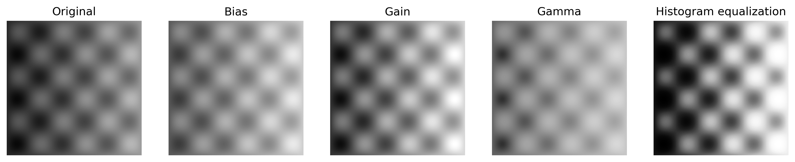{#fig-point-operations width=100%}

# Linear Filtering

Point operations transform each pixel independently. Many image processing tasks, however, require information about the spatial neighborhood surrounding a pixel.

Consider a grayscale image containing small variations in intensity caused by noise. Replacing each pixel by an average of nearby values can reduce these local variations. The new value at a pixel therefore depends not only on the original value at that location, but also on neighboring pixels.

This is a **neighborhood operation**.

A linear neighborhood operator computes each output pixel as a weighted sum of nearby input pixels. Let

$$
f(i,j)
$$

denote the input image and let

$$
h(k,l)
$$

denote a small matrix of weights called a **kernel** or **filter**.

A linear filtering operation can be written as

$$
g(i,j)
=
\sum_{k,l}
f(i+k,j+l)h(k,l).
$$ {#eq-correlation}

The kernel coefficients determine how much each neighboring pixel contributes to the output.

For example, consider the $3\times3$ averaging kernel

$$
H
=
\frac{1}{9}
\begin{bmatrix}
1 & 1 & 1\\
1 & 1 & 1\\
1 & 1 & 1
\end{bmatrix}.
$$ {#eq-average-kernel}

Suppose that the neighborhood centered at a particular pixel is

$$
F
=
\begin{bmatrix}
10 & 20 & 30\\
20 & 40 & 20\\
10 & 20 & 10
\end{bmatrix}.
$$

Applying the kernel gives

$$
g(i,j)
=
\frac{1}{9}
(
10+20+30+
20+40+20+
10+20+10
),
$$

and therefore

$$
g(i,j)
=
20.
$$

The original central value

$$
40
$$

has been replaced by a value determined by its neighborhood,

$$
40
\longrightarrow
20.
$$

Repeating this operation at every image location produces a filtered image.

## Correlation and Convolution

There are two closely related ways to apply a linear filter to an image.

The operation introduced above,

$$
g(i,j)
=
\sum_{k,l}
f(i+k,j+l)h(k,l),
$$

is called **correlation**.

It is commonly denoted as

$$
g
=
f\otimes h.
$$ {#eq-correlation-notation}

A closely related operation reverses the direction of the offsets,

$$
g(i,j)
=
\sum_{k,l}
f(i-k,j-l)h(k,l).
$$ {#eq-convolution}

This operation is called **convolution** and is denoted by

$$
g
=
f*h.
$$ {#eq-convolution-notation}

By changing variables, convolution can equivalently be written as

$$
g(i,j)
=
\sum_{k,l}
f(k,l)h(i-k,j-l).
$$

The difference between correlation and convolution can be interpreted as a reflection of the kernel before it is applied.

For a symmetric kernel such as

$$
H
=
\frac{1}{9}
\begin{bmatrix}
1 & 1 & 1\\
1 & 1 & 1\\
1 & 1 & 1
\end{bmatrix},
$$

the reflected kernel is identical to the original kernel. Correlation and convolution therefore produce the same result.

For an asymmetric kernel, however, the distinction matters.

### Linear Shift-Invariant Operators

Correlation and convolution with a fixed kernel are **linear shift-invariant (LSI)** operations.

Linearity means that the operator obeys superposition. If $H$ denotes the filtering operation,

$$
H(f_1+f_2)
=
H(f_1)+H(f_2).
$$

Shift invariance means that the same kernel is applied in the same way at every image location. Shifting the input image and then filtering it therefore produces the same result as filtering first and shifting the result.

Informally, a shift-invariant filter **behaves the same everywhere in the image**.

## Boundary Handling

When a filter is applied near the boundary of an image, part of the kernel may extend beyond the available pixel values.

For example, consider the image

$$
F
=
\begin{bmatrix}
10 & 20 & 30\\
40 & 50 & 60\\
70 & 80 & 90
\end{bmatrix}
$$

and a $3\times3$ kernel centered on the upper-left pixel.

The kernel requires values at positions outside the image,

$$
\begin{bmatrix}
? & ? & ?\\
? & 10 & 20\\
? & 40 & 50
\end{bmatrix}.
$$

These values must be defined in some way if the filtered image is to preserve the original spatial dimensions.

This process is commonly called **padding**.

### Zero Padding

The simplest approach assigns zero to every position outside the image.

For the previous example, the neighborhood becomes

$$
\begin{bmatrix}
0 & 0 & 0\\
0 & 10 & 20\\
0 & 40 & 50
\end{bmatrix}.
$$

For a $3\times3$ averaging kernel,

$$
H
=
\frac{1}{9}
\begin{bmatrix}
1 & 1 & 1\\
1 & 1 & 1\\
1 & 1 & 1
\end{bmatrix},
$$

the output at the upper-left pixel is therefore

$$
g(0,0)
=
\frac{
10+20+40+50
}{9}
=
\frac{120}{9}
\approx
13.33.
$$

Although zero padding is simple, the artificial zeros can introduce dark values near image boundaries.

### Replication

Another possibility is to extend the image by repeating the nearest boundary value.

The same neighborhood becomes

$$
\begin{bmatrix}
10 & 10 & 20\\
10 & 10 & 20\\
40 & 40 & 50
\end{bmatrix}.
$$

This avoids introducing completely new zero-valued pixels, but propagates the values at the image boundary outside the image.

### Reflection

The image can also be extended by reflecting its values across the boundary.

Conceptually, the signal outside the image is treated as a mirrored continuation of the signal inside it.

This generally produces a smoother continuation at the boundary than zero padding.

### Other Boundary Conditions

Other possible boundary conditions include **constant padding**, where a specified value is used outside the image, and **wrap padding**, where the image is treated as periodic and values leaving one side reappear on the opposite side.

The choice of boundary condition does not change the filter kernel itself. Instead, it determines how the image is extended whenever the kernel requires values outside its original domain.

## Separable Filtering

Applying a two-dimensional kernel directly requires combining all the pixels covered by the kernel at every image location.

For a $K\times K$ kernel, this requires approximately

$$
K^2
$$

multiply-add operations per output pixel.

Some kernels, however, can be decomposed into the product of two one-dimensional kernels. Such kernels are called **separable**.

Consider the kernel

$$
H
=
\frac{1}{16}
\begin{bmatrix}
1 & 2 & 1\\
2 & 4 & 2\\
1 & 2 & 1
\end{bmatrix}.
$$

It can be written as the outer product

$$
H
=
\frac{1}{4}
\begin{bmatrix}
1\\
2\\
1
\end{bmatrix}
\frac{1}{4}
\begin{bmatrix}
1 & 2 & 1
\end{bmatrix}.
$$ {#eq-separable-kernel}

Defining

$$
\mathbf{v}
=
\frac{1}{4}
\begin{bmatrix}
1\\
2\\
1
\end{bmatrix}
$$

and

$$
\mathbf{h}
=
\frac{1}{4}
\begin{bmatrix}
1\\
2\\
1
\end{bmatrix},
$$

the two-dimensional kernel can therefore be expressed as

$$
H
=
\mathbf{v}\mathbf{h}^T.
$$ {#eq-kernel-outer-product}

Instead of filtering the image directly with $H$, we can first apply the horizontal filter

$$
\mathbf{h}^T
=
\frac{1}{4}
\begin{bmatrix}
1 & 2 & 1
\end{bmatrix}
$$

and then apply the vertical filter

$$
\mathbf{v}
=
\frac{1}{4}
\begin{bmatrix}
1\\
2\\
1
\end{bmatrix}.
$$

Thus,

$$
g
=
\mathbf{v} * \left(\mathbf{h}^T * f\right).
$$ {#eq-separable-filtering}

Both procedures produce the same result, but their computational costs are different.

Direct two-dimensional filtering requires approximately

$$
K^2
$$

operations per pixel, whereas separable filtering requires approximately

$$
2K.
$$

For example, with a $15\times15$ kernel,

$$
K^2
=
225,
$$

while the separable implementation requires only

$$
2K
=
30
$$

operations per pixel.

### Detecting Separability

A two-dimensional kernel is separable if it can be expressed as the outer product of two vectors,

$$
H
=
\mathbf{v}\mathbf{h}^T.
$$

From a linear algebra perspective, this means that the kernel matrix has **rank one**.

This can be determined using the singular value decomposition,

$$
H
=
U\Sigma V^T.
$$

If only one singular value is non-zero, then

$$
\operatorname{rank}(H)=1,
$$

and the kernel is separable.

## Smoothing Filters

One of the simplest applications of linear filtering is **smoothing**. The objective is to reduce local variations in pixel intensity by combining information from neighboring pixels.

### Box Filter

The **box filter** replaces each pixel by the average intensity within a local neighborhood.

For a $K\times K$ neighborhood, the kernel is

$$
H
=
\frac{1}{K^2}
\begin{bmatrix}
1 & \cdots & 1\\
\vdots & \ddots & \vdots\\
1 & \cdots & 1
\end{bmatrix}.
$$ {#eq-box-filter}

For example, when $K=3$,

$$
H
=
\frac{1}{9}
\begin{bmatrix}
1 & 1 & 1\\
1 & 1 & 1\\
1 & 1 & 1
\end{bmatrix}.
$$

Since the kernel coefficients sum to one,

$$
\sum_{k,l}h(k,l)=1,
$$

a region of constant intensity remains unchanged by the filter.

For example, if every pixel in a neighborhood has intensity $c$,

$$
g(i,j)
=
\sum_{k,l}c\,h(k,l)
=
c
\sum_{k,l}h(k,l)
=
c.
$$

Local variations, however, are averaged with their surroundings. This produces a smoother image, but also reduces sharp intensity transitions such as edges.

### Gaussian Filter

The box filter assigns the same weight to every pixel within its neighborhood. A smoother weighting can instead assign larger weights to pixels near the center and progressively smaller weights to pixels farther away.

A standard choice is the **Gaussian function**.

In two dimensions,

$$
G(x,y;\sigma)
=
\frac{1}{2\pi\sigma^2}
\exp\left(
-\frac{x^2+y^2}{2\sigma^2}
\right),
$$ {#eq-gaussian-filter}

where $\sigma>0$ controls the spatial scale of the filter.

The Gaussian reaches its maximum at

$$
x=y=0
$$

and decreases as the distance from the center increases.

Because

$$
r^2=x^2+y^2,
$$

the Gaussian can also be written as

$$
G(r;\sigma)
=
\frac{1}{2\pi\sigma^2}
\exp\left(
-\frac{r^2}{2\sigma^2}
\right).
$$

Its value therefore depends only on the distance from the center, not on direction.

The parameter $\sigma$ controls the extent of the smoothing. A small value of $\sigma$ concentrates most of the weight near the center, while a larger value distributes significant weight over a larger neighborhood.

Thus,

$$
\sigma\uparrow
\quad\Longrightarrow\quad
\text{stronger smoothing over a larger spatial scale}.
$$

The two-dimensional Gaussian is separable because

$$
G(x,y;\sigma)
=
G(x;\sigma)G(y;\sigma),
$$

where

$$
G(x;\sigma)
=
\frac{1}{\sqrt{2\pi}\sigma}
\exp\left(
-\frac{x^2}{2\sigma^2}
\right).
$$

A two-dimensional Gaussian filter can therefore be implemented as two successive one-dimensional convolutions: one horizontal and one vertical.

## Image Derivatives

Many structures of interest in an image are associated with changes in intensity rather than with the intensity values themselves.

Consider the one-dimensional intensity profile

$$
f
=
\begin{bmatrix}
20 & 20 & 20 & 80 & 80 & 80
\end{bmatrix}.
$$

The values are constant within each region, but there is a sharp transition from

$$
20
\longrightarrow
80.
$$

A derivative provides a way to measure this spatial change.

For a continuous one-dimensional signal $f(x)$, the derivative is

$$
\frac{df}{dx}.
$$

Digital images are discrete, so derivatives must be approximated using differences between neighboring samples.

A simple forward difference is

$$
\frac{\partial f}{\partial x}
\approx
f(i,j+1)-f(i,j).
$$ {#eq-forward-difference}

This operation can be represented by the kernel

$$
h_x
=
\begin{bmatrix}
-1 & 1
\end{bmatrix}.
$$

Applying it to the intensity profile above gives

$$
\begin{bmatrix}
0 & 0 & 60 & 0 & 0
\end{bmatrix}.
$$

The response is zero in constant regions and large at the intensity transition.

### Central Differences

Instead of comparing a pixel only with the next pixel, the derivative can be approximated using samples on both sides of the location of interest.

The **central difference** is

$$
\frac{\partial f}{\partial x}
\approx
\frac{
f(i,j+1)-f(i,j-1)
}{2}.
$$ {#eq-central-difference}

The corresponding kernel is

$$
h_x
=
\frac{1}{2}
\begin{bmatrix}
-1 & 0 & 1
\end{bmatrix}.
$$

For a two-dimensional image, changes can occur independently along the horizontal and vertical directions. We therefore consider the partial derivatives

$$
f_x
=
\frac{\partial f}{\partial x}
$$

and

$$
f_y
=
\frac{\partial f}{\partial y}.
$$

Using central differences, these can be approximated by

$$
h_x
=
\frac{1}{2}
\begin{bmatrix}
-1 & 0 & 1
\end{bmatrix}
$$

and

$$
h_y
=
\frac{1}{2}
\begin{bmatrix}
-1\\
0\\
1
\end{bmatrix}.
$$

The two partial derivatives form the image gradient,

$$
\nabla f
=
\begin{bmatrix}
f_x\\
f_y
\end{bmatrix}.
$$ {#eq-image-gradient}

The gradient magnitude,

$$
\|\nabla f\|
=
\sqrt{
f_x^2+f_y^2
},
$$ {#eq-gradient-magnitude}

measures the strength of the local intensity change.

Its direction can be described by

$$
\theta
=
\operatorname{atan2}(f_y,f_x).
$$ {#eq-gradient-direction}

Regions with nearly constant intensity produce small gradient magnitudes, while sharp transitions generally produce larger values.

### Sobel Operator

Direct finite differences can be sensitive to small local intensity variations. The **Sobel operator** combines differentiation in one direction with smoothing in the perpendicular direction.

The horizontal derivative kernel can be written as

$$
H_x
=
\frac{1}{8}
\begin{bmatrix}
-1 & 0 & 1\\
-2 & 0 & 2\\
-1 & 0 & 1
\end{bmatrix}.
$$ {#eq-sobel-x}

This kernel is separable,

$$
H_x
=
\frac{1}{4}
\begin{bmatrix}
1\\
2\\
1
\end{bmatrix}
\frac{1}{2}
\begin{bmatrix}
-1 & 0 & 1
\end{bmatrix}.
$$

The first vector performs smoothing in the vertical direction, while the second approximates the derivative in the horizontal direction.

Similarly,

$$
H_y
=
\frac{1}{8}
\begin{bmatrix}
-1 & -2 & -1\\
0 & 0 & 0\\
1 & 2 & 1
\end{bmatrix}
$$ {#eq-sobel-y}

approximates the vertical derivative while smoothing horizontally.

### Second Derivatives

The first derivative measures the rate at which image intensity changes. The second derivative measures how this rate of change itself varies.

For a one-dimensional continuous signal,

$$
\frac{d^2f}{dx^2}
$$

is the derivative of

$$
\frac{df}{dx}.
$$

For a discrete signal, a standard approximation is

$$
\frac{d^2f}{dx^2}
\approx
f(x+1)-2f(x)+f(x-1).
$$ {#eq-second-difference}

The corresponding kernel is

$$
h
=
\begin{bmatrix}
1 & -2 & 1
\end{bmatrix}.
$$

Consider again a transition between two constant intensity regions,

$$
f
=
\begin{bmatrix}
20 & 20 & 20 & 80 & 80 & 80
\end{bmatrix}.
$$

The first difference produces a strong response at the transition. The second difference instead produces responses of opposite sign around the transition.

This sign change is an important property of second-order derivatives and will later provide a way to characterize intensity transitions using **zero crossings**.

### Laplacian

For a two-dimensional image $f(x,y)$, second-order changes can occur along both spatial dimensions.

The **Laplacian** is defined as

$$
\nabla^2 f
=
\frac{\partial^2 f}{\partial x^2}
+
\frac{\partial^2 f}{\partial y^2}.
$$ {#eq-laplacian}

Using the one-dimensional second-difference approximation,

$$
\frac{\partial^2 f}{\partial x^2}
\approx
f(i,j+1)-2f(i,j)+f(i,j-1),
$$

and

$$
\frac{\partial^2 f}{\partial y^2}
\approx
f(i+1,j)-2f(i,j)+f(i-1,j).
$$

Adding both expressions gives

$$
\nabla^2 f(i,j)
\approx
f(i,j-1)
+
f(i,j+1)
+
f(i-1,j)
+
f(i+1,j)
-
4f(i,j).
$$

This operation can be represented by the kernel

$$
H_{\nabla^2}
=
\begin{bmatrix}
0 & 1 & 0\\
1 & -4 & 1\\
0 & 1 & 0
\end{bmatrix}.
$$ {#eq-discrete-laplacian}

The coefficients of the Laplacian kernel sum to zero,

$$
\sum_{k,l}h(k,l)=0.
$$

Consequently, a region of constant intensity produces zero response.

If

$$
f(i,j)=c
$$

throughout the neighborhood, then

$$
\nabla^2 f(i,j)
\approx
c+c+c+c-4c
=
0.
$$

The Laplacian therefore responds to spatial variations rather than to constant image regions.

### Sensitivity to Noise

Second-order derivatives respond strongly to rapid local variations in intensity. This makes the Laplacian useful for detecting image structure, but also makes it sensitive to noise.

A small pixel-to-pixel fluctuation may produce a relatively large second-derivative response.

A common strategy is therefore to smooth the image before computing the Laplacian,

$$
f
\longrightarrow
G_\sigma * f
\longrightarrow
\nabla^2(G_\sigma*f),
$$

where $G_\sigma$ is a Gaussian filter with scale parameter $\sigma$.

## Laplacian of Gaussian

The Laplacian is sensitive to rapid local intensity variations, including variations produced by noise. A natural way to reduce this sensitivity is to smooth the image before computing the second derivative.

Using a Gaussian filter,

$$
G(x,y;\sigma)
=
\frac{1}{2\pi\sigma^2}
\exp\left(
-\frac{x^2+y^2}{2\sigma^2}
\right),
$$

the smoothed image is

$$
f_\sigma
=
G_\sigma*f.
$$ {#eq-gaussian-smoothed-image}

The Laplacian can then be applied to the smoothed image,

$$
\nabla^2 f_\sigma
=
\nabla^2(G_\sigma*f).
$$

Because differentiation and convolution are linear operations,

$$
\nabla^2(G_\sigma*f)
=
(\nabla^2G_\sigma)*f.
$$ {#eq-log-equivalence}

Therefore, instead of first smoothing the image and then computing its Laplacian, both operations can be combined into a single filter,

$$
\operatorname{LoG}(x,y;\sigma)
=
\nabla^2G(x,y;\sigma).
$$ {#eq-log-definition}

The Laplacian of the Gaussian is

$$
\begin{aligned}
\nabla^2G(x,y;\sigma)
&=
\frac{\partial^2G}{\partial x^2}
+
\frac{\partial^2G}{\partial y^2}\\
&=
\left(
\frac{x^2+y^2}{\sigma^4}
-
\frac{2}{\sigma^2}
\right)
G(x,y;\sigma).
\end{aligned}
$$ {#eq-log}

Equivalently,

$$
\nabla^2G(x,y;\sigma)
=
\frac{x^2+y^2-2\sigma^2}{\sigma^4}
G(x,y;\sigma).
$$

### Geometric Interpretation

Since the Laplacian of Gaussian depends on

$$
x^2+y^2,
$$

the filter is rotationally symmetric. Defining

$$
r^2=x^2+y^2,
$$

we can write

$$
\nabla^2G(r;\sigma)
=
\left(
\frac{r^2}{\sigma^4}
-
\frac{2}{\sigma^2}
\right)
G(r;\sigma).
$$

At the center,

$$
r=0,
$$

and therefore

$$
\nabla^2G(0;\sigma)<0.
$$

The filter changes sign when

$$
\frac{r^2}{\sigma^4}
-
\frac{2}{\sigma^2}
=
0,
$$

which gives

$$
r
=
\sqrt{2}\sigma.
$$ {#eq-log-zero-crossing-radius}

Thus, the LoG kernel consists of a central region of one sign surrounded by a region of the opposite sign, with a zero crossing at a radius proportional to $\sigma$.

### Scale

The parameter $\sigma$ determines the spatial scale at which image structure is analyzed.

For small values of $\sigma$, the filter responds to relatively small spatial structures and fine intensity variations.

For larger values of $\sigma$, the Gaussian smoothing suppresses finer variations and the filter responds to structures occurring over larger spatial scales.

Therefore, $\sigma$ is not only a smoothing parameter. It also determines the characteristic scale of the structures to which the LoG responds.

Conceptually,

$$
\sigma\downarrow
\quad\Longrightarrow\quad
\text{finer-scale structures},
$$

while

$$
\sigma\uparrow
\quad\Longrightarrow\quad
\text{coarser-scale structures}.
$$

### Numerical Experiment

The linear filtering operations considered above can be implemented directly from the definition of discrete convolution.

In the following experiment, a synthetic image is corrupted with Gaussian noise and processed using three different linear filters: a box filter, a Gaussian filter, and the Sobel operator.

The box and Gaussian filters reduce local intensity variations by smoothing the image. The Sobel operator instead combines smoothing with first-order differentiation, producing a strong response around intensity transitions.

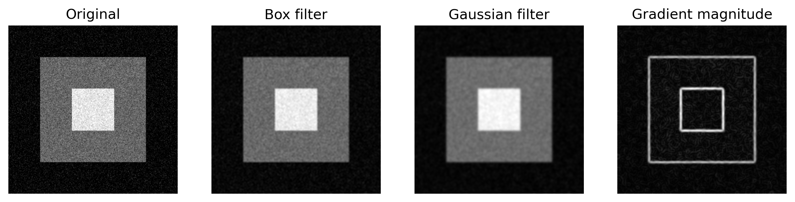{#fig-convolution width=100%}

### Scale Experiment

The effect of the scale parameter $\sigma$ can be examined by applying the Laplacian of Gaussian to structures of different spatial sizes.

For each value of $\sigma$, the LoG kernel analyzes the image at a different spatial scale. Small values preserve and respond to finer image variations, whereas larger values suppress fine-scale structure and produce responses over broader spatial regions.

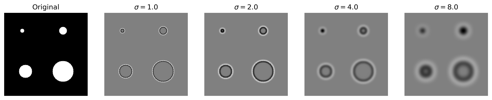{#fig-log-scales width=100%}

The experiment illustrates that $\sigma$ determines the spatial scale of the LoG response. Consequently, the choice of $\sigma$ must be related to the characteristic dimensions of the image structures being analyzed.

### Scale-Normalized Laplacian

Applying the Laplacian of Gaussian at different values of $\sigma$ produces responses at different spatial scales. However, the magnitude of the Laplacian response also changes with $\sigma$.

For scale-space analysis, the Laplacian is therefore commonly normalized by the scale,

$$
\mathcal{L}(x,y;\sigma)
=
\sigma^2
\nabla^2
\left(
G_\sigma*f
\right).
$$ {#eq-scale-normalized-laplacian}

Using the convolution property,

$$
\mathcal{L}(x,y;\sigma)
=
\left(
\sigma^2\nabla^2G_\sigma
\right)*f.
$$

The factor

$$
\sigma^2
$$

compensates for the scale dependence of the second-order derivative and allows responses obtained at different scales to be compared.

### Blob Detection

A **blob** is an image region whose intensity differs from its surroundings over a characteristic spatial extent.

Consider, for example, a bright approximately circular structure on a darker background. Applying the scale-normalized LoG at different values of $\sigma$ produces different responses at the center of the structure.

At scales much smaller than the structure, the filter captures only local variations within the region. At scales much larger than the structure, the structure is strongly smoothed with its surroundings.

Between these extremes, the magnitude of the normalized LoG response reaches an extremum at a scale related to the characteristic size of the structure.

Blob detection can therefore be formulated as the search for extrema of

$$
\sigma^2
\nabla^2
\left(
G_\sigma*f
\right)
$$

over both image position and scale.

### Characteristic Scale

For an ideal circular blob, the extremum of the scale-normalized Laplacian occurs when the blob radius $r$ is related to the Gaussian scale by

$$
r
=
\sqrt{2}\sigma.
$$ {#eq-blob-radius}

Therefore, once the characteristic scale $\sigma^\ast$ has been identified, an approximate blob radius can be estimated as

$$
r
\approx
\sqrt{2}\sigma^\ast.
$$

The scale-space interpretation is particularly useful when the structures of interest occur at different sizes.

Instead of selecting a single value of $\sigma$ beforehand, the image can be analyzed over a set of scales,

$$
\sigma_1,\sigma_2,\ldots,\sigma_M,
$$

and local extrema can be searched across both spatial coordinates and scale.

The detected scale then provides information not only about the presence of a structure, but also about its characteristic spatial size.

### Numerical Experiment

The relationship between spatial scale and blob size can be examined using synthetic circular structures with known radii.

For each circle, the scale-normalized LoG response is evaluated at its center over a sequence of values of $\sigma$. The characteristic scale is then estimated from the maximum absolute response,

$$
\sigma^\ast
=
\underset{\sigma}{\operatorname{arg\,max}}
\left|
\sigma^2
\nabla^2
\left(
G_\sigma*f
\right)
\right|.
$$ {#eq-log-scale-selection}

For an ideal circular blob of radius $r$, the expected relationship is

$$
r
=
\sqrt{2}\sigma^\ast.
$$

The experiment uses circular blobs with radii

$$
r
\in
\{6,12,20,32\}
$$

and evaluates the normalized LoG response over a range of spatial scales.

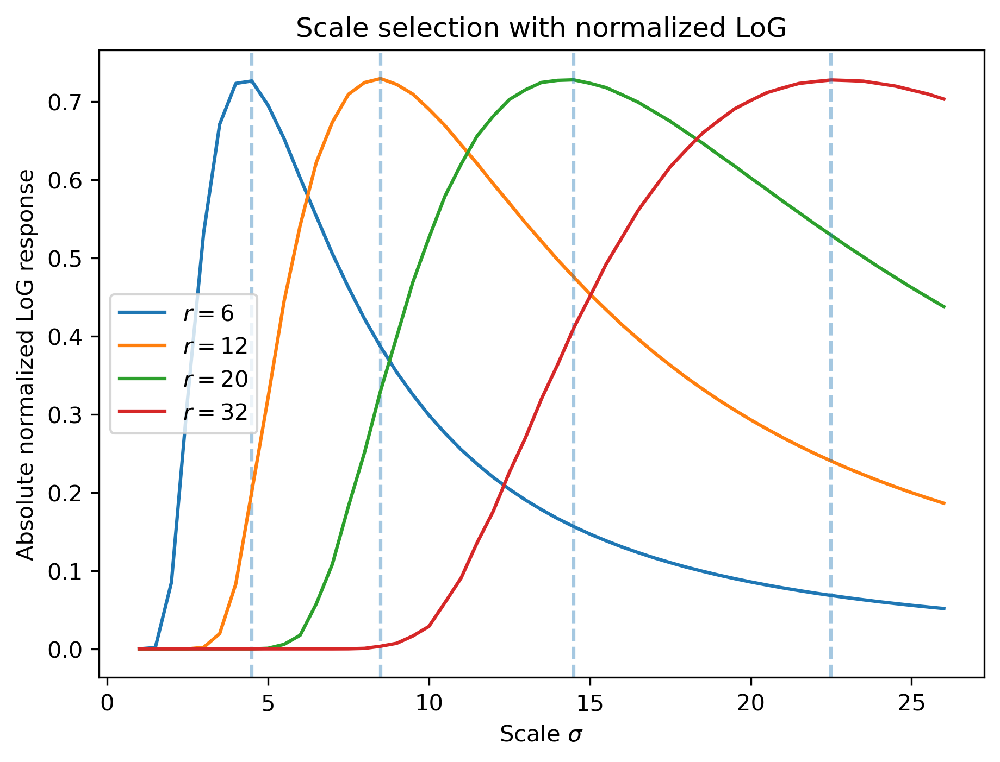{#fig-log-scale-selection width=80%}

# Non-Linear Filtering

Linear filters compute each output pixel as a weighted sum of neighboring pixel values. This works well for many forms of smoothing, but not all types of noise are well described by small intensity fluctuations around the original signal.

Consider the one-dimensional neighborhood

$$
\begin{bmatrix}
20 & 21 & 255 & 19 & 20
\end{bmatrix}.
$$

Most values are close to $20$, but one pixel has the value

$$
255.
$$

Such an isolated extreme value can occur in **impulse noise**, where individual pixels are strongly corrupted.

If the neighborhood is replaced by its mean,

$$
\frac{
20+21+255+19+20
}{5}
=
67,
$$

the corrupted pixel strongly influences the result.

An alternative is to sort the values,

$$
\begin{bmatrix}
19 & 20 & 20 & 21 & 255
\end{bmatrix},
$$

and select the middle value,

$$
20.
$$

This is the basis of the **median filter**.

## Median Filter

For each image location $(i,j)$, the median filter collects the pixel values within a neighborhood $\mathcal{N}_{i,j}$ and replaces the central pixel by their median,

$$
g(i,j)
=
\operatorname{median}
\left\{
f(k,l)
:
(k,l)\in\mathcal{N}_{i,j}
\right\}.
$$ {#eq-median-filter}

For example, consider the neighborhood

$$
\begin{bmatrix}
20 & 21 & 19\\
20 & 255 & 22\\
18 & 20 & 21
\end{bmatrix}.
$$

Sorting its values gives

$$
\begin{bmatrix}
18,
19,
20,
20,
20,
21,
21,
22,
255
\end{bmatrix}.
$$

The median is therefore

$$
20,
$$

and the corrupted central value is replaced according to

$$
255
\longrightarrow
20.
$$

### Non-Linearity

Unlike convolution, median filtering cannot be expressed as a weighted sum of neighboring pixels.

For a linear filter,

$$
H(af_1+bf_2)
=
aH(f_1)+bH(f_2).
$$

The median operator does not generally satisfy this property.

It is therefore a **non-linear neighborhood operator**.

### Edge Preservation

Median filtering can also preserve sharp intensity transitions better than averaging filters.

Consider a neighborhood located close to an edge,

$$
\begin{bmatrix}
20 & 20 & 20\\
20 & 20 & 200\\
200 & 200 & 200
\end{bmatrix}.
$$

The mean is

$$
\frac{
5(20)+4(200)
}{9}
=
100,
$$

which introduces an intermediate intensity that was not present in either region.

The median, however, is

$$
20.
$$

The output therefore remains associated with one of the two intensity regions instead of averaging across the discontinuity.

This property makes median filtering useful when noise must be reduced without smoothing sharp transitions as strongly as a linear averaging filter.

## Bilateral Filter

Gaussian filtering assigns larger weights to nearby pixels and progressively smaller weights to pixels farther away. However, the weights depend only on spatial distance.

This creates a problem near an edge.

Consider two neighboring pixels located on opposite sides of a strong intensity transition,

$$
20
\quad\vert\quad
200.
$$

Although the pixels are spatially close, their intensities suggest that they belong to different image regions. A Gaussian filter nevertheless combines them because their spatial distance is small.

The **bilateral filter** addresses this problem by considering two forms of similarity simultaneously:

1. the spatial distance between pixels;
2. the difference between their intensity values.

For a pixel $(i,j)$, the bilateral filter can be written as

$$
g(i,j)
=
\frac{
\displaystyle
\sum_{k,l}
f(k,l)
w(i,j,k,l)
}{
\displaystyle
\sum_{k,l}
w(i,j,k,l)
}.
$$ {#eq-bilateral-filter}

The normalization by the sum of the weights ensures that the output remains a weighted average of the neighboring intensity values.

### Spatial and Range Weights

The bilateral weight can be constructed as the product of a **spatial weight** and a **range weight**,

$$
w(i,j,k,l)
=
w_s(i,j,k,l)
w_r(i,j,k,l).
$$ {#eq-bilateral-weight}

The spatial component measures the distance between pixel locations. Using a Gaussian,

$$
w_s(i,j,k,l)
=
\exp\left[
-\frac{
(i-k)^2+(j-l)^2
}{
2\sigma_s^2
}
\right],
$$ {#eq-bilateral-spatial}

where $\sigma_s$ determines the spatial extent of the neighborhood.

The range component instead measures the difference between pixel intensities,

$$
w_r(i,j,k,l)
=
\exp\left[
-\frac{
\left(
f(i,j)-f(k,l)
\right)^2
}{
2\sigma_r^2
}
\right],
$$ {#eq-bilateral-range}

where $\sigma_r$ controls how strongly differences in intensity reduce the contribution of neighboring pixels.

Combining both terms gives

$$
w(i,j,k,l)
=
\exp\left[
-\frac{
(i-k)^2+(j-l)^2
}{
2\sigma_s^2
}
\right]
\exp\left[
-\frac{
\left(
f(i,j)-f(k,l)
\right)^2
}{
2\sigma_r^2
}
\right].
$$ {#eq-bilateral-combined}

### Edge Preservation

Consider a central pixel with intensity

$$
f(i,j)=20
$$

and two equally distant neighboring pixels with intensities

$$
22
\qquad\text{and}\qquad
200.
$$

Because their spatial distances are equal, their spatial weights are the same.

Their range weights, however, are very different because

$$
|20-22|
\ll
|20-200|.
$$

Consequently,

$$
w_r(20,22)
\gg
w_r(20,200).
$$

The first pixel contributes strongly to the filtered value, whereas the second contributes very little.

The bilateral filter can therefore smooth intensity variations within a region while reducing averaging across strong intensity discontinuities.

### Filter Parameters

The bilateral filter introduces two scale parameters with different roles.

The spatial parameter

$$
\sigma_s
$$

controls how far the filter extends spatially. Increasing $\sigma_s$ allows pixels farther from the center to contribute significantly.

The range parameter

$$
\sigma_r
$$

controls how different two intensity values can be before their interaction is suppressed.

A small $\sigma_r$ strongly separates pixels with different intensities and therefore preserves strong intensity boundaries.

A large $\sigma_r$ makes the range weights more similar,

$$
w_r
\longrightarrow
1,
$$

so the bilateral filter increasingly behaves like an ordinary spatial Gaussian filter.

### Non-Linearity

Unlike a Gaussian filter, the bilateral filter is not a linear operator.

The weights depend on the image itself through the range term

$$
w_r(i,j,k,l)
=
\exp\left[
-\frac{
\left(
f(i,j)-f(k,l)
\right)^2
}{
2\sigma_r^2
}
\right].
$$

Changing the input image therefore changes not only the pixel values being averaged, but also the weights used to combine them.

Consequently, the bilateral filter cannot be represented as convolution with a single fixed kernel.

### Numerical Experiment

The behavior of linear and non-linear smoothing filters depends on the type of noise affecting the image.

To illustrate this difference, Gaussian, median, and bilateral filtering are applied to the same synthetic image under two different noise models: Gaussian noise and impulse noise.

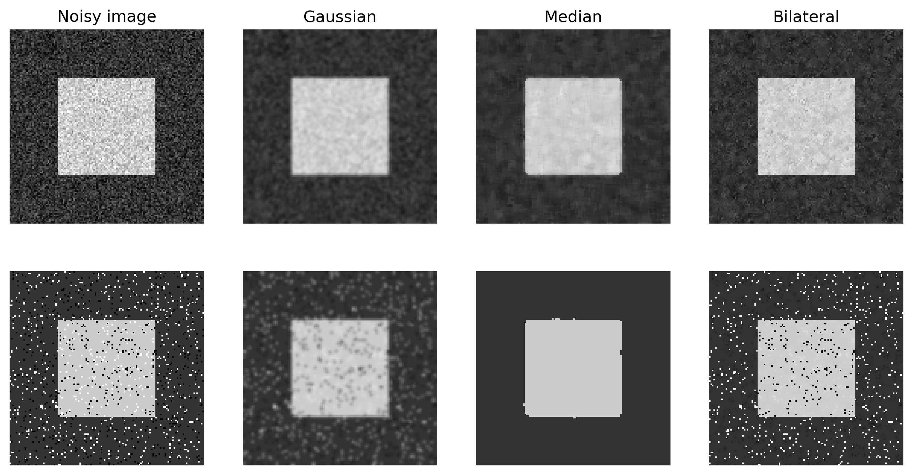{#fig-nonlinear-filtering width=100%}

Gaussian filtering reduces local intensity fluctuations by averaging neighboring pixels, but this averaging also smooths sharp intensity transitions.

Median filtering is particularly effective when individual pixels contain extreme values because the median is much less influenced by isolated outliers than the mean.

Bilateral filtering instead adapts the averaging weights according to both spatial proximity and intensity similarity. This allows smoothing within relatively homogeneous regions while reducing averaging across strong intensity discontinuities.

The comparison also illustrates that no smoothing operator is universally preferable. Its behavior depends on the characteristics of the image and on the type of noise being removed.

# Binary Image Processing

Many computer vision problems eventually require reasoning about regions rather than directly about image intensities.

Suppose that an object of interest has already been separated from the background. The resulting image can be represented as a **binary image**,

$$
f(i,j)
\in
\{0,1\},
$$

where, for example,

$$
f(i,j)=1
$$

indicates that the pixel belongs to the foreground and

$$
f(i,j)=0
$$

indicates that it belongs to the background.

A binary image can therefore be interpreted as a set of foreground pixels,

$$
A
=
\{
(i,j):f(i,j)=1
\}.
$$

Once an image has this form, neighborhood operations can be used to modify the geometry of the foreground regions.

These operations are generally known as **mathematical morphology**.

## Dilation

Consider a small foreground region,

$$
F
=
\begin{bmatrix}
0 & 0 & 0 & 0 & 0\\
0 & 0 & 1 & 0 & 0\\
0 & 1 & 1 & 1 & 0\\
0 & 0 & 1 & 0 & 0\\
0 & 0 & 0 & 0 & 0
\end{bmatrix}.
$$

Suppose that we want to expand this region by one pixel in its immediate horizontal and vertical neighborhood.

For this purpose, we define a **structuring element**

$$
B
=
\begin{bmatrix}
0 & 1 & 0\\
1 & 1 & 1\\
0 & 1 & 0
\end{bmatrix}.
$$

The structuring element defines the neighborhood used by the morphological operation.

The **dilation** of a foreground set $A$ by a structuring element $B$ is denoted by

$$
A\oplus B.
$$

Operationally, a pixel belongs to the dilated foreground if the translated structuring element overlaps the original foreground.

For the binary representation, this can be expressed as

$$
g(i,j)
=
\max_{(k,l)\in B}
f(i-k,j-l),
$$ {#eq-binary-dilation}

where the maximum is taken over the positions included in the structuring element.

Since the image is binary, the output becomes one whenever at least one relevant neighboring pixel is one.

Dilation therefore tends to **expand foreground regions**.

## Erosion

The opposite operation is **erosion**.

The erosion of a foreground set $A$ by a structuring element $B$ is denoted by

$$
A\ominus B.
$$

For a binary image, it can be expressed as

$$
g(i,j)
=
\min_{(k,l)\in B}
f(i+k,j+l).
$$ {#eq-binary-erosion}

Because the image contains only zeros and ones, the output remains one only if all pixels selected by the structuring element belong to the foreground.

Erosion therefore tends to **shrink foreground regions**.

For example, consider

$$
F
=
\begin{bmatrix}
0 & 0 & 0 & 0 & 0\\
0 & 1 & 1 & 1 & 0\\
0 & 1 & 1 & 1 & 0\\
0 & 1 & 1 & 1 & 0\\
0 & 0 & 0 & 0 & 0
\end{bmatrix}.
$$

Using the cross-shaped structuring element

$$
B
=
\begin{bmatrix}
0 & 1 & 0\\
1 & 1 & 1\\
0 & 1 & 0
\end{bmatrix},
$$

only pixels whose complete cross-shaped neighborhood lies inside the foreground survive the erosion.

The central pixel remains part of the foreground, whereas pixels near the boundary are removed.

### Structuring Element

The effect of a morphological operation depends on the shape and size of its structuring element.

For example,

$$
B_1
=
\begin{bmatrix}
0 & 1 & 0\\
1 & 1 & 1\\
0 & 1 & 0
\end{bmatrix}
$$

defines a four-connected neighborhood, whereas

$$
B_2
=
\begin{bmatrix}
1 & 1 & 1\\
1 & 1 & 1\\
1 & 1 & 1
\end{bmatrix}
$$

also includes diagonal neighbors.

Larger structuring elements modify structures over larger spatial extents.

The structuring element therefore determines both the **shape** and the **scale** of the morphological operation.

## Opening and Closing

Dilation and erosion can be combined to produce two important morphological operations.

### Opening

The **opening** of $A$ by $B$ consists of erosion followed by dilation,

$$
A\circ B
=
(A\ominus B)\oplus B.
$$ {#eq-morphological-opening}

The initial erosion removes foreground structures that are too small to contain the structuring element. The subsequent dilation restores the size of the structures that survived.

Opening is therefore useful for removing small foreground regions and narrow protrusions while preserving larger structures.

Conceptually,

$$
\text{opening}
=
\text{erode}
\longrightarrow
\text{dilate}.
$$

### Closing

The **closing** of $A$ by $B$ reverses the order,

$$
A\bullet B
=
(A\oplus B)\ominus B.
$$ {#eq-morphological-closing}

The initial dilation expands foreground regions and can bridge small gaps or fill small holes. The subsequent erosion reduces the expanded regions again.

Closing is therefore useful for filling small gaps and connecting nearby foreground structures.

Conceptually,

$$
\text{closing}
=
\text{dilate}
\longrightarrow
\text{erode}.
$$

## Connected Components

A binary image identifies which pixels belong to the foreground, but it does not explicitly distinguish separate foreground objects.

Consider the binary image

$$
F
=
\begin{bmatrix}
0 & 1 & 1 & 0 & 0 & 0\\
0 & 1 & 1 & 0 & 1 & 1\\
0 & 0 & 0 & 0 & 1 & 1\\
0 & 0 & 1 & 0 & 0 & 0\\
0 & 0 & 1 & 1 & 0 & 0
\end{bmatrix}.
$$

The foreground pixels form several spatially separated regions.

A **connected component** is a maximal set of foreground pixels connected according to a specified neighborhood relation.

### Four-Connectivity

Under **four-connectivity**, a pixel $(i,j)$ is considered adjacent to the pixels immediately above, below, left, and right,

$$
\mathcal{N}_4(i,j)
=
\{
(i-1,j),
(i+1,j),
(i,j-1),
(i,j+1)
\}.
$$ {#eq-four-connectivity}

Diagonal contact alone does not connect two regions.

### Eight-Connectivity

Under **eight-connectivity**, diagonal neighbors are also included,

$$
\mathcal{N}_8(i,j)
=
\{
(i+k,j+l):
k,l\in\{-1,0,1\},
(k,l)\neq(0,0)
\}.
$$ {#eq-eight-connectivity}

Two foreground regions touching only at a corner are therefore separate under four-connectivity but connected under eight-connectivity.

### Connected-Component Labeling

Connected-component labeling assigns a different integer label to each connected foreground region.

For example, a binary image containing three disconnected regions,

$$
F
=
\begin{bmatrix}
0 & 1 & 1 & 0 & 0\\
0 & 1 & 1 & 0 & 1\\
0 & 0 & 0 & 0 & 1\\
1 & 1 & 0 & 0 & 1
\end{bmatrix},
$$

can be transformed into the label image

$$
L
=
\begin{bmatrix}
0 & 1 & 1 & 0 & 0\\
0 & 1 & 1 & 0 & 2\\
0 & 0 & 0 & 0 & 2\\
3 & 3 & 0 & 0 & 2
\end{bmatrix}.
$$

The value

$$
0
$$

represents the background, while the labels

$$
1,2,3
$$

identify the three connected foreground components.

Once the components have been labeled, properties of each region can be computed independently, such as its area, centroid, bounding box, or other geometric measurements.

## Distance Transform

A binary image describes whether each pixel belongs to the foreground or background. In some applications, however, it is useful to know how deeply a foreground pixel lies inside a region.

The **distance transform** assigns to each foreground pixel the distance to the nearest background pixel.

Let

$$
A
$$

denote the set of foreground pixels. For a foreground pixel $\mathbf{x}$, the distance transform can be defined as

$$
D(\mathbf{x})
=
\min_{\mathbf{y}\notin A}
d(\mathbf{x},\mathbf{y}),
$$ {#eq-distance-transform}

where $d(\mathbf{x},\mathbf{y})$ is a chosen distance measure.

Thus,

$$
D(\mathbf{x})=0
$$

for background pixels, while foreground pixels receive increasingly large values as their distance from the boundary increases.

For example, consider a square foreground region,

$$
F
=
\begin{bmatrix}
0 & 0 & 0 & 0 & 0\\
0 & 1 & 1 & 1 & 0\\
0 & 1 & 1 & 1 & 0\\
0 & 1 & 1 & 1 & 0\\
0 & 0 & 0 & 0 & 0
\end{bmatrix}.
$$

Pixels near the foreground boundary have a small distance to the background, whereas the central pixel has a larger distance.

The distance transform therefore converts the binary geometry of the region into a scalar field describing distance from its boundary.

### Numerical Experiment

The binary image processing operations considered above can be combined into a simple region-analysis pipeline.

A synthetic binary image is constructed with two foreground regions, small isolated foreground components, and small holes inside the larger regions. Morphological opening and closing are first used to remove small foreground structures and fill small gaps.

The resulting foreground regions are then identified using four-connected component labeling. Finally, the Euclidean distance transform measures the distance of each foreground pixel to the nearest background pixel.

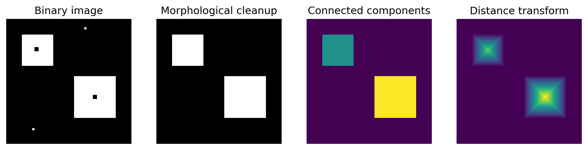{#fig-binary-image-processing width=100%}

# Fourier Analysis

The filtering operations considered so far have been described in the **spatial domain**. An image is represented directly by its pixel values, and filtering combines values located at neighboring spatial positions.

The same signal can also be described in terms of the spatial frequencies that compose it.

To develop this idea, consider first a one-dimensional signal,

$$
f(x)
=
\sin(2\pi \nu x),
$$

where $\nu$ is the spatial frequency.

A small value of $\nu$ produces slow variations,

$$
\text{low frequency}
\quad\longrightarrow\quad
\text{slow spatial variation},
$$

whereas a large value produces rapid variations,

$$
\text{high frequency}
\quad\longrightarrow\quad
\text{rapid spatial variation}.
$$

In an image, smooth regions are therefore associated primarily with low spatial frequencies, while rapid intensity variations, such as fine texture and sharp transitions, involve higher spatial frequencies.

## Fourier Transform

A signal does not generally contain a single spatial frequency. Instead, it can be represented as a combination of sinusoidal components with different frequencies, amplitudes, and phases.

The **Fourier transform** provides this alternative representation.

For a continuous one-dimensional signal $f(x)$, the Fourier transform is

$$
F(\nu)
=
\int_{-\infty}^{\infty}
f(x)
e^{-i2\pi\nu x}
\,dx,
$$ {#eq-fourier-transform}

where $\nu$ denotes spatial frequency and

$$
i^2=-1.
$$

The original signal can be reconstructed using the inverse Fourier transform,

$$
f(x)
=
\int_{-\infty}^{\infty}
F(\nu)
e^{i2\pi\nu x}
\,d\nu.
$$ {#eq-inverse-fourier-transform}

The two representations therefore describe the same signal in different domains,

$$
f(x)
\quad
\longleftrightarrow
\quad
F(\nu).
$$

The function $f(x)$ describes how the signal varies with spatial position, whereas $F(\nu)$ describes its frequency content.

### Magnitude and Phase

The Fourier transform is generally complex and can be written as

$$
F(\nu)
=
\operatorname{Re}\{F(\nu)\}
+
i\operatorname{Im}\{F(\nu)\}.
$$

An equivalent representation separates the transform into **magnitude** and **phase**,

$$
F(\nu)
=
|F(\nu)|
e^{i\phi(\nu)},
$$ {#eq-fourier-polar}

where

$$
|F(\nu)|
=
\sqrt{
\operatorname{Re}\{F(\nu)\}^2
+
\operatorname{Im}\{F(\nu)\}^2
}
$$

is the magnitude and

$$
\phi(\nu)
=
\operatorname{atan2}
\left(
\operatorname{Im}\{F(\nu)\},
\operatorname{Re}\{F(\nu)\}
\right)
$$

is the phase.

The magnitude describes how strongly a frequency is represented in the signal, while the phase contains information about the spatial alignment of the corresponding sinusoidal component.

## Discrete Fourier Transform

Digital signals contain a finite number of samples. For a one-dimensional signal

$$
f[0],f[1],\ldots,f[N-1],
$$

the **Discrete Fourier Transform (DFT)** is

$$
F[k]
=
\sum_{n=0}^{N-1}
f[n]
e^{-i2\pi kn/N},
\qquad
k=0,\ldots,N-1.
$$ {#eq-dft}

The inverse transformation is

$$
f[n]
=
\frac{1}{N}
\sum_{k=0}^{N-1}
F[k]
e^{i2\pi kn/N}.
$$ {#eq-idft}

Each index $k$ corresponds to a discrete frequency component.

The coefficient

$$
F[0]
$$

represents the zero-frequency or **DC component**. Since

$$
e^0=1,
$$

we obtain

$$
F[0]
=
\sum_{n=0}^{N-1}f[n].
$$

Therefore,

$$
\frac{F[0]}{N}
$$

is the mean value of the signal.

## Convolution Theorem

Fourier analysis is particularly useful for image processing because convolution in the spatial domain becomes multiplication in the frequency domain.

If

$$
g
=
f*h,
$$

then

$$
G(\nu)
=
F(\nu)H(\nu),
$$ {#eq-convolution-theorem}

where

$$
F(\nu)
=
\mathcal{F}\{f\},
\qquad
H(\nu)
=
\mathcal{F}\{h\},
$$

and

$$
G(\nu)
=
\mathcal{F}\{g\}.
$$

Thus,

$$
\boxed{
f*h
\quad
\longleftrightarrow
\quad
FH
}
$$

connects spatial filtering directly with frequency-domain filtering.

## Two-Dimensional Fourier Transform

An image varies along two spatial dimensions. Its frequency representation must therefore describe variations in both the horizontal and vertical directions.

For a continuous image $f(x,y)$, the two-dimensional Fourier transform is

$$
F(u,v)
=
\int_{-\infty}^{\infty}
\int_{-\infty}^{\infty}
f(x,y)
e^{-i2\pi(ux+vy)}
\,dx\,dy,
$$ {#eq-fourier-transform-2d}

where

$$
u
$$

and

$$
v
$$

represent the horizontal and vertical spatial frequencies.

The inverse transformation is

$$
f(x,y)
=
\int_{-\infty}^{\infty}
\int_{-\infty}^{\infty}
F(u,v)
e^{i2\pi(ux+vy)}
\,du\,dv.
$$ {#eq-inverse-fourier-transform-2d}

The image and its frequency representation therefore form the pair

$$
f(x,y)
\quad
\longleftrightarrow
\quad
F(u,v).
$$

### Spatial Frequency and Orientation

A two-dimensional sinusoidal component can be written as

$$
f(x,y)
=
\cos
\left[
2\pi(ux+vy)
\right].
$$ {#eq-2d-sinusoid}

The pair

$$
\mathbf{k}
=
\begin{bmatrix}
u\\
v
\end{bmatrix}
$$

defines a spatial frequency vector.

Its magnitude,

$$
\|\mathbf{k}\|
=
\sqrt{u^2+v^2},
$$ {#eq-spatial-frequency-magnitude}

determines how rapidly the image intensity varies in space.

The direction of $\mathbf{k}$ determines the direction of intensity variation. Lines of constant phase satisfy

$$
ux+vy
=
\text{constant},
$$

and are therefore perpendicular to the frequency vector.

Consequently, the Fourier representation contains information about both the spatial scale and orientation of image structures.

## Two-Dimensional Discrete Fourier Transform

For a digital image

$$
f[m,n],
$$

with height $M$ and width $N$, the two-dimensional Discrete Fourier Transform is

$$
F[k,l]
=
\sum_{m=0}^{M-1}
\sum_{n=0}^{N-1}
f[m,n]
e^{-i2\pi
\left(
\frac{km}{M}
+
\frac{ln}{N}
\right)},
$$ {#eq-dft-2d}

where

$$
k=0,\ldots,M-1
$$

and

$$
l=0,\ldots,N-1.
$$

The inverse transform is

$$
f[m,n]
=
\frac{1}{MN}
\sum_{k=0}^{M-1}
\sum_{l=0}^{N-1}
F[k,l]
e^{i2\pi
\left(
\frac{km}{M}
+
\frac{ln}{N}
\right)}.
$$ {#eq-idft-2d}

As in the one-dimensional case, the transform converts a spatial representation into a frequency representation,

$$
f[m,n]
\quad
\longleftrightarrow
\quad
F[k,l].
$$

### Magnitude Spectrum

Because the Fourier transform is complex, its magnitude can be computed as

$$
|F(k,l)|
=
\sqrt{
\operatorname{Re}\{F(k,l)\}^2
+
\operatorname{Im}\{F(k,l)\}^2
}.
$$

The magnitude spectrum indicates the relative strength of the spatial frequencies present in the image.

For visualization, the zero-frequency component is commonly shifted to the center of the spectrum.

Under this representation,

$$
\text{center}
\quad\longrightarrow\quad
\text{low spatial frequencies},
$$

while

$$
\text{farther from the center}
\quad\longrightarrow\quad
\text{higher spatial frequencies}.
$$

Since Fourier magnitudes can span a large dynamic range, the spectrum is also commonly displayed using a logarithmic transformation such as

$$
S(k,l)
=
\log
\left(
1+|F(k,l)|
\right).
$$ {#eq-log-spectrum}

### Convolution in the Frequency Domain

The convolution theorem extends directly to two-dimensional signals.

If an image $f$ is convolved with a filter $h$,

$$
g
=
f*h,
$$

then their Fourier transforms satisfy

$$
G(u,v)
=
F(u,v)H(u,v).
$$ {#eq-convolution-theorem-2d}

Thus, spatial convolution corresponds to pointwise multiplication in the frequency domain,

$$
\boxed{
f*h
\quad
\longleftrightarrow
\quad
FH
}.
$$

The function

$$
H(u,v)
$$

describes how the filter modifies each spatial frequency and is therefore called its **frequency response**.

### Frequency and Orientation Experiment

The relationship between image structure and the Fourier spectrum can be examined using sinusoidal images with known spatial frequencies.

Each sinusoidal image contains a single frequency vector. Because the image is real-valued, its Fourier spectrum contains two symmetric components corresponding to positive and negative frequencies.

Increasing the spatial frequency moves these components farther from the center of the spectrum. Changing the direction of the frequency vector changes their orientation.

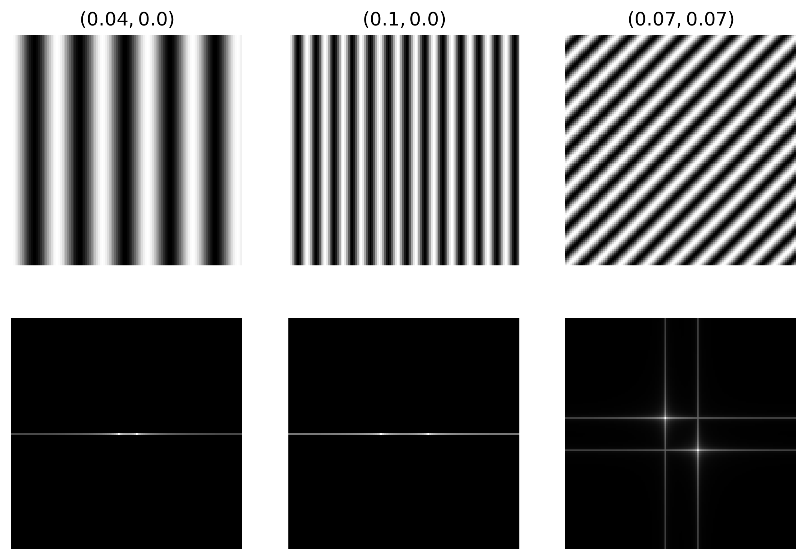{#fig-fourier-spectra width=90%}

### Frequency-Domain Filtering

Filtering can also be performed directly in the frequency domain.

Consider an image formed by the combination of a low-frequency sinusoid and a higher-frequency sinusoid,

$$
f
=
f_{\mathrm{low}}
+
0.5f_{\mathrm{high}}.
$$

Its Fourier spectrum contains components at both spatial frequencies.

An ideal low-pass filter can be defined by a circular frequency mask,

$$
H(u,v)
=
\begin{cases}
1,
&
\sqrt{u^2+v^2}
\leq
r,
\\[4pt]
0,
&
\sqrt{u^2+v^2}
>
r,
\end{cases}
$$ {#eq-ideal-low-pass}

where $r$ is the cutoff frequency.

The filtered spectrum is then

$$
G(u,v)
=
F(u,v)H(u,v).
$$

After applying the inverse Fourier transform,

$$
g
=
\mathcal{F}^{-1}
\{G\},
$$

the high-frequency component is removed while the low-frequency component remains.

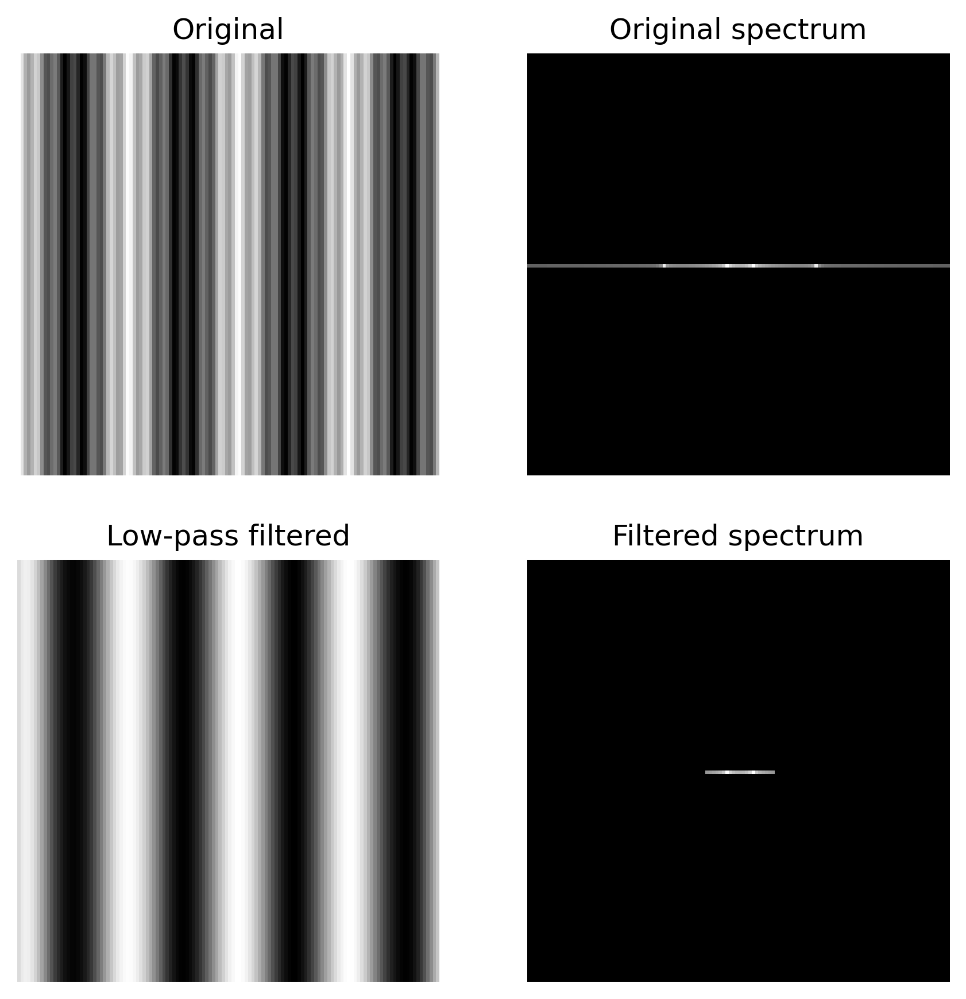{#fig-fourier-low-pass width=75%}

# Multi-Resolution Image Processing

Images are often processed at different spatial resolutions.

A high-resolution image preserves fine spatial detail but requires more samples, while a lower-resolution image represents the same scene using fewer samples and therefore retains mainly coarser spatial structure.

Constructing such representations requires two fundamental operations:

- **interpolation**, which increases the number of samples;
- **decimation**, which reduces the number of samples.

## Interpolation

Consider a one-dimensional signal containing two neighboring samples,

$$
f[0]=20,
\qquad
f[1]=100.
$$

Suppose that we want to estimate a new sample halfway between them.

The simplest possibility is to select the value of the nearest existing sample. This is known as **nearest-neighbor interpolation**.

A smoother alternative is to assume that the signal varies linearly between the two samples. The value halfway between them is then

$$
g
=
(1-0.5)20
+
0.5(100)
=
60.
$$

This is **linear interpolation**.

### Linear Interpolation

Suppose that a value is required at a position $x$ located between two known samples

$$
x_0
\leq
x
\leq
x_1.
$$

Define

$$
\alpha
=
\frac{x-x_0}{x_1-x_0}.
$$

Then

$$
0\leq\alpha\leq1,
$$

and linear interpolation estimates the value as

$$
g(x)
=
(1-\alpha)f(x_0)
+
\alpha f(x_1).
$$ {#eq-linear-interpolation}

At the original sample locations,

$$
\alpha=0
\qquad\text{or}\qquad
\alpha=1,
$$

so the interpolated signal passes through the known samples.

### Bilinear Interpolation

For two-dimensional images, linear interpolation can be applied independently along the two spatial dimensions.

Consider four neighboring pixels,

$$
\begin{matrix}
f_{00} & f_{10}\\
f_{01} & f_{11},
\end{matrix}
$$

and a point whose relative coordinates inside the pixel cell are

$$
(\alpha,\beta),
\qquad
0\leq\alpha,\beta\leq1.
$$

Bilinear interpolation gives

$$
\begin{aligned}
g(\alpha,\beta)
={}&
(1-\alpha)(1-\beta)f_{00}
+
\alpha(1-\beta)f_{10}
\\
&+
(1-\alpha)\beta f_{01}
+
\alpha\beta f_{11}.
\end{aligned}
$$ {#eq-bilinear-interpolation}

The four neighboring pixels therefore contribute according to their relative distance from the interpolation point.

## Decimation

Reducing image resolution requires more than simply discarding pixels.

Suppose that an image is reduced by a factor

$$
r=2.
$$

A direct subsampling operation would retain only every second pixel,

$$
g(i,j)
=
f(2i,2j).
$$

However, reducing the sampling rate also reduces the highest spatial frequency that can be represented without aliasing.

High-frequency image components must therefore be removed before downsampling.

The basic decimation procedure is

$$
\boxed{
\text{low-pass filtering}
\rightarrow
\text{downsampling}
}
$$

or, more explicitly,

$$
f
\longrightarrow
h*f
\longrightarrow
\downarrow r.
$$

### Anti-Aliasing

Downsampling reduces the sampling frequency of the image. Consequently, spatial frequencies that were representable in the original image may no longer be representable at the lower resolution.

If these frequencies are retained, they can appear as incorrect lower-frequency structures in the downsampled image.

A low-pass filter is therefore applied before subsampling,

$$
\tilde{f}
=
h*f,
$$

followed by

$$
g(i,j)
=
\tilde{f}(ri,rj).
$$ {#eq-image-decimation}

The low-pass filter acts as an **anti-aliasing filter** by suppressing frequencies that cannot be represented reliably after the sampling rate is reduced.

## Multi-Resolution Representations

A single image represents a scene at one particular spatial resolution. However, image structures can occur at very different spatial scales.

A small feature may be clearly visible at high resolution but disappear after sufficient downsampling, while larger structures remain visible across several resolutions.

A **multi-resolution representation** describes the same image at a sequence of progressively coarser spatial resolutions.

One of the most common representations is an **image pyramid**,

$$
G_0,G_1,\ldots,G_L,
$$

where

$$
G_0
$$

is the original image and each subsequent level contains a lower-resolution representation.

### Gaussian Pyramid

A Gaussian pyramid is constructed recursively by smoothing and downsampling the image.

Starting from

$$
G_0=f,
$$

each subsequent level is obtained as

$$
G_{l+1}
=
\downarrow_2
\left(
h*G_l
\right),
$$ {#eq-gaussian-pyramid}

where $h$ is a low-pass filter and

$$
\downarrow_2
$$

denotes downsampling by a factor of two along each spatial dimension.

The construction can therefore be written as

$$
G_0
\longrightarrow
G_1
\longrightarrow
G_2
\longrightarrow
\cdots
\longrightarrow
G_L.
$$

If the original image has dimensions

$$
M\times N,
$$

the successive levels have approximately

$$
\frac{M}{2}\times\frac{N}{2},
$$

$$
\frac{M}{4}\times\frac{N}{4},
$$

and so forth.

Because the sampling rate changes by a factor of two between adjacent levels, this representation is called an **octave pyramid**.

### Spatial Scale

Each level of the Gaussian pyramid represents the image at a different spatial scale.

Fine image structures are progressively suppressed as the image is smoothed and downsampled, while larger structures remain visible at coarser levels.

Thus,

$$
l=0
$$

contains the finest available spatial detail, whereas increasing $l$ produces progressively coarser representations.

The pyramid therefore provides a discrete representation of image structure across spatial scales.

## Laplacian Pyramid

The Gaussian pyramid stores progressively lower-frequency representations of the image. A different representation can be obtained by storing the information that is lost between consecutive levels.

Consider two adjacent Gaussian pyramid levels,

$$
G_l
$$

and

$$
G_{l+1}.
$$

The lower-resolution image $G_{l+1}$ can first be interpolated back to the resolution of $G_l$,

$$
\widehat{G}_l
=
\operatorname{expand}
\left(
G_{l+1}
\right).
$$

Because $G_{l+1}$ has already been low-pass filtered, $\widehat{G}_l$ contains a smoother approximation of $G_l$.

The difference

$$
L_l
=
G_l-\widehat{G}_l
$$ {#eq-laplacian-pyramid}

contains the information present at level $l$ that is not represented by the next coarser level.

The sequence

$$
L_0,L_1,\ldots,L_{L-1},
$$

together with the final Gaussian level

$$
G_L,
$$

forms the **Laplacian pyramid**.

### Frequency Interpretation

Each Gaussian pyramid level contains a low-pass representation of the image.

The difference between two successive low-pass representations isolates information over a more restricted range of spatial frequencies.

Consequently, the Laplacian pyramid levels behave approximately as **band-pass representations**,

$$
L_l
=
G_l-\widehat{G}_l.
$$

Fine-scale Laplacian levels contain relatively high-frequency image structure, while coarser levels represent progressively lower-frequency spatial structure.

The final Gaussian level retains the lowest-frequency information.

### Image Reconstruction

The Laplacian pyramid retains the information required to reconstruct the original image.

From

$$
L_l
=
G_l-\widehat{G}_l,
$$

we obtain

$$
G_l
=
L_l+\widehat{G}_l.
$$ {#eq-laplacian-reconstruction}

Starting from the coarsest Gaussian level,

$$
G_L,
$$

the previous level can be reconstructed by interpolation and addition,

$$
G_{L-1}
=
L_{L-1}
+
\operatorname{expand}
\left(
G_L
\right).
$$

Repeating the process gives

$$
G_{L-2},
G_{L-3},
\ldots,G_0.
$$

Thus, the Laplacian levels together with the final Gaussian level provide a representation from which the original image can be reconstructed.

## Wavelets

The Fourier transform represents an image in terms of sinusoidal components with different spatial frequencies and orientations. These components extend across the entire spatial domain.

For image analysis, however, it is often useful to describe not only **which frequencies are present**, but also **where the corresponding structures occur**.

Wavelets provide a representation that is localized in both space and frequency.

Rather than representing an image using global sinusoidal components, a wavelet decomposition uses localized functions at different spatial positions and scales.

This gives the general relationship

$$
\boxed{
\text{Fourier}
\rightarrow
\text{frequency}
}
$$

and

$$
\boxed{
\text{wavelets}
\rightarrow
\text{space + frequency + scale}.
}
$$

### Wavelet Decomposition

A wavelet decomposition can be understood as a sequence of filtering and downsampling operations.

At each level, the signal is separated into two components:

- a **low-pass component**, which represents the coarse structure;
- a **high-pass component**, which represents detail.

The low-pass component can then be decomposed again,

$$
f
\longrightarrow
\begin{cases}
L_1,\\
H_1,
\end{cases}
$$

followed by

$$
L_1
\longrightarrow
\begin{cases}
L_2,\\
H_2,
\end{cases}
$$

and so forth.

The resulting representation separates the signal into components associated with different spatial scales.

### Two-Dimensional Wavelet Decomposition

For an image, low-pass and high-pass filtering can be applied independently along the two spatial dimensions.

A single decomposition level produces four components,

$$
LL,\qquad
LH,\qquad
HL,\qquad
HH.
$$

The $LL$ component is obtained by low-pass filtering along both dimensions and contains the coarse image structure.

The remaining components contain spatial detail associated with different directions,

$$
LH,\qquad HL,\qquad HH.
$$

Thus, a single decomposition separates the image into one coarse representation and three detail representations.

The decomposition can then be applied recursively to the $LL$ component,

$$
LL_1
\rightarrow
LL_2
\rightarrow
LL_3
\rightarrow
\cdots,
$$

producing a multi-resolution representation.

### Numerical Experiment

The Gaussian and Laplacian pyramid constructions can be examined using a synthetic image containing structures at different spatial scales.

The Gaussian pyramid is constructed by repeatedly applying a low-pass filter and downsampling the result by a factor of two. Fine spatial structures progressively disappear as the pyramid level increases.

The Laplacian pyramid is obtained by expanding each lower-resolution Gaussian level and subtracting it from the preceding level,

$$
L_l
=
G_l
-
\operatorname{expand}
\left(
G_{l+1}
\right).
$$

Each Laplacian level therefore contains spatial information that is not represented at the next coarser resolution.

The original image can be reconstructed recursively using

$$
G_l
=
L_l
+
\operatorname{expand}
\left(
G_{l+1}
\right).
$$

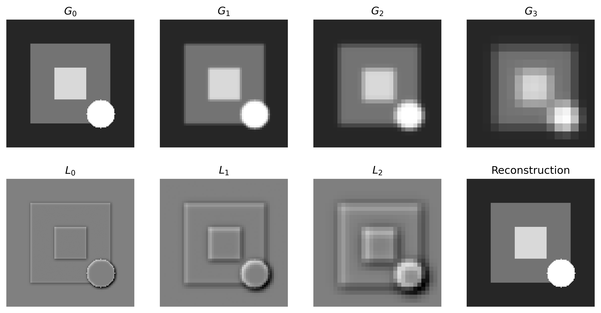{#fig-image-pyramids width=100%}

## Image Blending

Consider two images $A$ and $B$ that must be combined into a single image.

A binary mask

$$
M(i,j)\in\{0,1\}
$$

can be used to determine which source contributes at each pixel. A direct composite is

$$
C(i,j)
=
M(i,j)A(i,j)
+
\left[1-M(i,j)\right]B(i,j).
$$ {#eq-direct-blending}

If the mask changes abruptly between regions, however, the boundary between the two source images may become visible.

A smoother transition can be obtained by performing the blending independently at different spatial scales.

### Multi-Resolution Blending

Multi-resolution blending combines the source images independently at each level of a Laplacian pyramid.

Let

$$
L_l^A
$$

and

$$
L_l^B
$$

denote the Laplacian pyramid levels of the two source images.

A Gaussian pyramid is constructed from the blending mask,

$$
G_0^M,
G_1^M,
\ldots,
G_L^M.
$$

At each pyramid level, the two Laplacian representations are combined according to

$$
L_l^C
=
G_l^M L_l^A
+
\left(1-G_l^M\right)L_l^B.
$$ {#eq-pyramid-blending}

The resulting pyramid

$$
L_0^C,
L_1^C,
\ldots,
L_L^C
$$

is then reconstructed to obtain the blended image.

The Gaussian mask changes with pyramid level. At fine scales, the transition between the source images remains relatively narrow, while at coarser scales it extends over a larger spatial region.

Consequently, high-frequency details can change relatively quickly across the blending boundary, while lower-frequency image variations are combined over a broader region.

This scale-dependent transition reduces visible seams without unnecessarily mixing fine texture from both images.

### Numerical Experiment

The effect of multi-resolution blending can be examined by combining two synthetic images using a vertical mask.

A direct composite changes from one source image to the other at the mask boundary. In contrast, pyramid blending combines the images independently at several spatial scales using a Gaussian pyramid of the mask.

The resulting transition is therefore scale dependent: coarse image variations are blended over a broader spatial region, while fine details remain more localized.

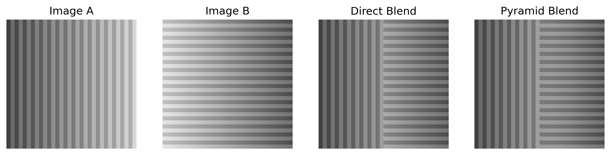{#fig-image-blending width=90%}

# Geometric Transformations

Many image-processing operations modify pixel values while leaving their spatial locations unchanged. A geometric transformation instead modifies the spatial domain of the image.

For example, an image may be translated, rotated, scaled, or warped into a new coordinate system.

If a point in the source image has coordinates

$$
\mathbf{x}
=
\begin{bmatrix}
x\\
y
\end{bmatrix},
$$

a geometric transformation maps it to a new position

$$
\mathbf{x}'
=
h(\mathbf{x}).
$$

The transformation therefore changes the spatial arrangement of the image rather than directly modifying its intensity values.

## Parametric Transformations

A global parametric transformation applies the same geometric mapping throughout the image.

Using homogeneous coordinates,

$$
\tilde{\mathbf{x}}
=
\begin{bmatrix}
x\\
y\\
1
\end{bmatrix},
$$

many common two-dimensional transformations can be represented as

$$
\tilde{\mathbf{x}}'
=
H\tilde{\mathbf{x}},
$$ {#eq-image-transformation}

where $H$ is the transformation matrix.

Examples include translation, rotation, scaling, affine transformations, and projective transformations.

For example, an affine transformation can be written as

$$
\begin{bmatrix}
x'\\
y'\\
1
\end{bmatrix}
=
\begin{bmatrix}
a_{11} & a_{12} & t_x\\
a_{21} & a_{22} & t_y\\
0 & 0 & 1
\end{bmatrix}
\begin{bmatrix}
x\\
y\\
1
\end{bmatrix}.
$$ {#eq-affine-image-transformation}

The matrix can represent combinations of translation, rotation, scaling, and shear.

## Image Warping

Applying a geometric transformation to an image requires determining the intensity values of the pixels in the transformed image.

A direct approach is **forward warping**. Each source pixel is transformed according to

$$
\mathbf{x}'
=
h(\mathbf{x}),
$$

and its intensity is transferred to the corresponding position in the destination image.

However, transformed coordinates generally do not coincide exactly with the destination pixel grid. Moreover, some destination pixels may receive no source value at all, producing holes in the transformed image.

### Inverse Warping

A more reliable approach is **inverse warping**.

Instead of mapping source pixels into the destination image, each destination pixel

$$
\mathbf{x}'
$$

is mapped backwards into the source image,

$$
\mathbf{x}
=
h^{-1}(\mathbf{x}').
$$

The destination intensity is then obtained from the source image,

$$
g(\mathbf{x}')
=
f\left(
h^{-1}(\mathbf{x}')
\right).
$$ {#eq-inverse-warping}

The procedure is therefore

$$
\boxed{
\text{destination pixel}
\rightarrow
\text{source position}
\rightarrow
\text{sample source image}.
}
$$

Because every destination pixel is explicitly processed, inverse warping avoids the holes that can occur with forward warping.

### Resampling

The source location obtained by inverse warping does not generally coincide with integer pixel coordinates.

For example,

$$
\mathbf{x}
=
\begin{bmatrix}
43.27\\
81.64
\end{bmatrix}
$$

lies between several source pixels.

The source image must therefore be evaluated using interpolation,

$$
g(\mathbf{x}')
=
\operatorname{interpolate}
\left(
f,
h^{-1}(\mathbf{x}')
\right).
$$

Nearest-neighbor interpolation can be used as the simplest method, while bilinear interpolation estimates the value from the four surrounding source pixels.

### Numerical Experiment

An affine image transformation can be implemented using inverse warping.

For each destination pixel $\mathbf{x}'$, the corresponding source position is computed as

$$
\tilde{\mathbf{x}}
=
H^{-1}
\tilde{\mathbf{x}}'.
$$

Because the resulting source coordinates are generally non-integer, the image intensity is estimated using bilinear interpolation.

The experiment combines rotation, scaling, and translation in a single affine transformation.

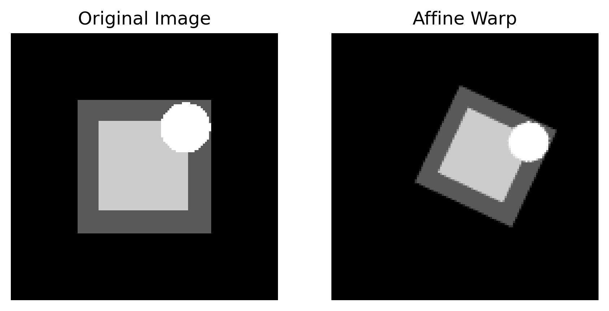{#fig-image-warping width=75%}

## Local Image Warping

Global parametric transformations apply the same transformation model throughout an image. Some applications, however, require different regions of the image to move by different amounts.

These transformations can be represented using a spatially varying displacement field,

$$
\mathbf{x}'
=
\mathbf{x}
+
\mathbf{d}(\mathbf{x}),
$$

where

$$
\mathbf{d}(\mathbf{x})
=
\begin{bmatrix}
d_x(\mathbf{x})\\
d_y(\mathbf{x})
\end{bmatrix}
$$

specifies the displacement associated with each image position.

### Mesh-Based Warping

A local deformation can be specified using a sparse set of corresponding control points,

$$
\mathbf{p}_k
\longrightarrow
\mathbf{p}'_k,
\qquad
k=1,\ldots,K.
$$

The displacement of each control point is

$$
\mathbf{d}_k
=
\mathbf{p}'_k-\mathbf{p}_k.
$$

These sparse displacements can then be interpolated to construct a dense deformation over the image.

One approach is to triangulate the control points and define an affine transformation within each triangle. Neighboring triangles can therefore undergo different transformations while together producing a local image warp.

## Feature-Based Morphing

Image morphing combines geometric warping with image blending.

Consider two images $A$ and $B$. A simple cross-dissolve produces the intermediate image

$$
C_t
=
(1-t)A+tB,
\qquad
t\in[0,1].
$$

If corresponding structures occupy different spatial positions in the two images, however, both structures may remain visible during the transition, producing ghosting.

Morphing addresses this problem by first warping both images toward a common intermediate geometry.

Let

$$
A_t
$$

and

$$
B_t
$$

denote the two images warped toward their intermediate configuration. The resulting frame is then

$$
C_t
=
(1-t)A_t+tB_t.
$$ {#eq-image-morphing}

Thus, the basic procedure is

$$
\boxed{
\text{correspondences}
\rightarrow
\text{intermediate geometry}
\rightarrow
\text{warp both images}
\rightarrow
\text{blend}.
}
$$