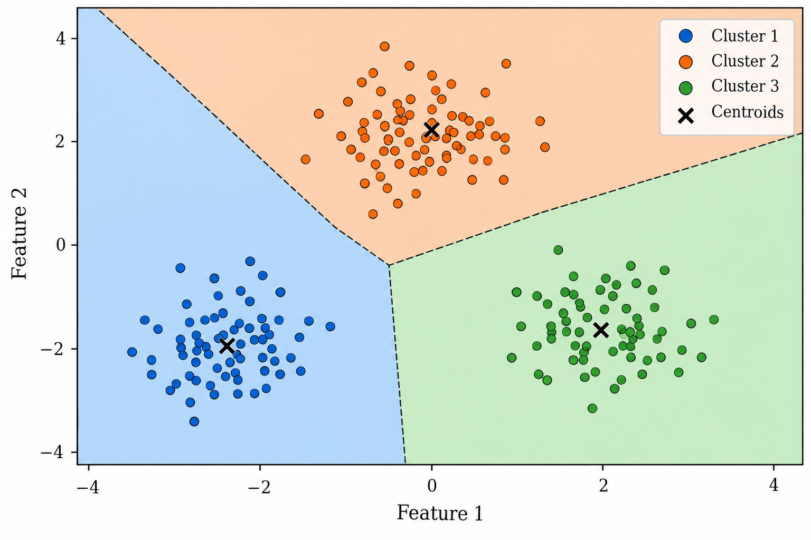

# Introduction

Many learning problems begin with a response variable. Given a set of predictors, the objective is to explain or predict an observed outcome. Clustering addresses a different problem. The data consist only of observations and their measured features, and the objective is to determine whether some structure can be found among them.

Suppose that a dataset contains $N$ observations,

$$
\mathbf{x}_1,\mathbf{x}_2,\ldots,\mathbf{x}_N,
$$

where each observation is represented by $p$ features,

$$
\mathbf{x}_i =
\begin{bmatrix}
x_{i1} & x_{i2} & \cdots & x_{ip}
\end{bmatrix}^{T}
\in \mathbb{R}^{p}.
$$

No response variable is available to indicate how these observations should be organized. Nevertheless, some observations may be more similar to each other than to the rest of the data. If this structure exists, it can be useful to divide the observations into groups whose members are relatively similar within each group and relatively different across groups. This is the basic clustering problem.

Clustering is therefore an **unsupervised learning** problem. Unlike classification, the groups are not known beforehand and there are no class labels from which they can be learned. The groups are inferred from the structure of the observations themselves.

This distinction is important. A cluster is not the same object as a class. A class has an externally defined meaning, whereas a cluster is the result of organizing observations according to a particular definition of similarity. Even when class labels happen to be available for evaluation, a clustering algorithm does not necessarily recover those classes.

Consider, for example, a dataset containing fraudulent and legitimate transactions. If the fraud labels are hidden and the transactions are clustered using only their measured features, there is no reason to assume that two resulting clusters will correspond to fraud and non-fraud. The dominant structure in the feature space may instead reflect transaction amounts, purchasing behaviour, geography, or some combination of the available variables.

This leads to a more fundamental question: what does it mean for two observations to be similar?

Different clustering methods answer this question in different ways. K-Means gives a particularly simple answer. Observations are represented in Euclidean space, each cluster is represented by a point called its **centroid**, and a good partition is one in which observations lie close to the centroid of the cluster to which they belong.

The simplicity of this idea is one of the reasons K-Means is widely used. The method reduces a potentially complicated dataset to $K$ representative points and an assignment of each observation to one of them. At the same time, this simplicity introduces assumptions that must be understood. The meaning of distance depends on the scale of the variables, the method favours particular cluster geometries, the solution can depend on its initialization, and the number of clusters $K$ must be specified in advance.

These properties make K-Means useful not only as a clustering algorithm but also as a clear setting in which to study several fundamental questions in unsupervised learning: how a clustering problem is formulated, how a partition can be represented by an objective function, how that objective can be optimized, and how a clustering result should be evaluated when no single correct partition is known.

# The Clustering Problem

Let the dataset be represented by the matrix

$$
\mathbf{X}
=
\begin{bmatrix}
\mathbf{x}_1^{T} \\
\mathbf{x}_2^{T} \\
\vdots \\
\mathbf{x}_N^{T}
\end{bmatrix}
\in \mathbb{R}^{N\times p}.
$$

A clustering of these observations into $K$ groups can be represented by the sets

$$
C_1,C_2,\ldots,C_K,
$$

where each $C_k$ contains the indices of the observations assigned to the $k$-th cluster.

For these sets to define a partition of the data, every observation must belong to one cluster,

$$
\bigcup_{k=1}^{K} C_k
=
\{1,2,\ldots,N\},
$$ {#eq-cluster-completeness}

and no observation can simultaneously belong to two different clusters,

$$
C_k \cap C_l = \varnothing,
\qquad
k\neq l.
$$ {#eq-cluster-disjointness}

For standard K-Means, the clusters are also taken to be non-empty,

$$
|C_k| > 0,
\qquad
k=1,\ldots,K.
$$ {#eq-cluster-nonempty}

These conditions define what constitutes a valid partition, but they do not yet tell us which partition should be preferred.

This is the central difficulty of clustering. Without known labels, there is no direct target against which every possible partition can be compared. A clustering method must therefore introduce a criterion that formalizes what it means for a partition to be good.

A natural requirement is that observations assigned to the same cluster should be similar. This property is commonly referred to as **within-cluster compactness**. A second desirable property is that different clusters should be well separated. These two ideas are related but are not identical, and different clustering methods and validation measures formalize them in different ways.

K-Means is built primarily around the first idea. It seeks clusters whose observations are compact around representative points.

## Representing a Cluster by a Prototype

Suppose that a cluster $C_k$ is represented by a prototype $\boldsymbol{\mu}_k \in \mathbb{R}^{p}$. The distance between an observation $\mathbf{x}_i$ and this prototype can be measured using the Euclidean norm,

$$
\left\|
\mathbf{x}_i-\boldsymbol{\mu}_k
\right\|_2
=
\sqrt{
\sum_{j=1}^{p}
\left(
x_{ij}-\mu_{kj}
\right)^2
}.
$$ {#eq-euclidean-distance}

For K-Means, the corresponding squared Euclidean distance is used,

$$
\left\|
\mathbf{x}_i-\boldsymbol{\mu}_k
\right\|_2^2
=
\sum_{j=1}^{p}
\left(
x_{ij}-\mu_{kj}
\right)^2.
$$ {#eq-squared-euclidean-distance}

Squaring the distance does not change which of a fixed collection of prototypes is closest to an observation, since the square function is monotonically increasing for non-negative values. It does, however, give K-Means its particular optimization structure: the point that minimizes the sum of squared Euclidean distances within a cluster is its arithmetic mean. This result will be derived explicitly below.

The use of Euclidean distance is therefore not an incidental implementation choice. It is part of the definition of standard K-Means and is directly connected to the use of the mean as the cluster prototype.

To see the geometry intuitively, consider observations with two features. For a fixed collection of centroids, every point in the plane can be assigned to its nearest centroid. This divides the feature space into regions, one for each centroid. The boundaries between these regions are formed by points that are equally distant from neighbouring centroids.

{#fig-k-means-voronoi-partition}

This nearest-centroid geometry is one half of K-Means. The other half is determining where the centroids themselves should be located.

# From Clustering to K-Means

Assume initially that the partition

$$
C_1,C_2,\ldots,C_K
$$

is known. For each cluster $C_k$, we would like to choose a representative point $\boldsymbol{\mu}_k$ that is as close as possible to the observations assigned to that cluster.

Using squared Euclidean distance, the total within-cluster variation around a candidate point $\mathbf{m}$ is

$$
J_k(\mathbf{m})
=
\sum_{i\in C_k}
\left\|
\mathbf{x}_i-\mathbf{m}
\right\|_2^2.
$$ {#eq-cluster-objective-candidate}

The question is therefore

$$
\underset{\mathbf{m}\in\mathbb{R}^{p}}{\operatorname{arg\,min}}
\;
J_k(\mathbf{m}).
$$ {#eq-centroid-minimization-problem}

Let

$$
\overline{\mathbf{x}}_k
=
\frac{1}{|C_k|}
\sum_{i\in C_k}
\mathbf{x}_i
$$ {#eq-cluster-mean}

be the arithmetic mean of the observations in $C_k$. For any candidate $\mathbf{m}$,

$$
\mathbf{x}_i-\mathbf{m}
=
\left(
\mathbf{x}_i-\overline{\mathbf{x}}_k
\right)
+
\left(
\overline{\mathbf{x}}_k-\mathbf{m}
\right).
$$

Taking the squared Euclidean norm gives

$$
\begin{aligned}
\left\|
\mathbf{x}_i-\mathbf{m}
\right\|_2^2
&=
\left\|
\mathbf{x}_i-\overline{\mathbf{x}}_k
\right\|_2^2
+
2
\left(
\mathbf{x}_i-\overline{\mathbf{x}}_k
\right)^T
\left(
\overline{\mathbf{x}}_k-\mathbf{m}
\right) \\
&\quad+
\left\|
\overline{\mathbf{x}}_k-\mathbf{m}
\right\|_2^2.
\end{aligned}
$$ {#eq-centroid-expansion}

Summing over all observations in $C_k$,

$$
\begin{aligned}
J_k(\mathbf{m})
&=
\sum_{i\in C_k}
\left\|
\mathbf{x}_i-\overline{\mathbf{x}}_k
\right\|_2^2 \\
&\quad+
2
\left[
\sum_{i\in C_k}
\left(
\mathbf{x}_i-\overline{\mathbf{x}}_k
\right)
\right]^T
\left(
\overline{\mathbf{x}}_k-\mathbf{m}
\right) \\
&\quad+
|C_k|
\left\|
\overline{\mathbf{x}}_k-\mathbf{m}
\right\|_2^2.
\end{aligned}
$$

The middle term vanishes because deviations from the mean sum to zero:

$$
\begin{aligned}
\sum_{i\in C_k}
\left(
\mathbf{x}_i-\overline{\mathbf{x}}_k
\right)
&=
\sum_{i\in C_k}\mathbf{x}_i
-
\sum_{i\in C_k}\overline{\mathbf{x}}_k \\
&=
\sum_{i\in C_k}\mathbf{x}_i
-
|C_k|\overline{\mathbf{x}}_k \\
&=
\sum_{i\in C_k}\mathbf{x}_i
-
|C_k|
\left(
\frac{1}{|C_k|}
\sum_{i\in C_k}\mathbf{x}_i
\right) \\
&=
\mathbf{0}.
\end{aligned}
$$ {#eq-zero-sum-deviations}

Consequently,

$$
J_k(\mathbf{m})
=
\sum_{i\in C_k}
\left\|
\mathbf{x}_i-\overline{\mathbf{x}}_k
\right\|_2^2
+
|C_k|
\left\|
\overline{\mathbf{x}}_k-\mathbf{m}
\right\|_2^2.
$$ {#eq-centroid-decomposition}

The first term does not depend on $\mathbf{m}$, while the second term is non-negative. Therefore,

$$
J_k(\mathbf{m})
\geq
\sum_{i\in C_k}
\left\|
\mathbf{x}_i-\overline{\mathbf{x}}_k
\right\|_2^2,
$$

with equality if and only if

$$
\mathbf{m}
=
\overline{\mathbf{x}}_k.
$$

Hence,

$$
\boxed{
\boldsymbol{\mu}_k
=
\underset{\mathbf{m}\in\mathbb{R}^{p}}{\operatorname{arg\,min}}
\sum_{i\in C_k}
\left\|
\mathbf{x}_i-\mathbf{m}
\right\|_2^2
=
\frac{1}{|C_k|}
\sum_{i\in C_k}\mathbf{x}_i
}
$$ {#eq-optimal-centroid}

The arithmetic mean is therefore not chosen merely because it is a convenient summary statistic. It follows directly from the squared Euclidean objective.

For example, consider a one-dimensional cluster containing the observations

$$
C_k=\{2,4,9\}.
$$

Its centroid is

$$
\mu_k
=
\frac{2+4+9}{3}
=
5.
$$

The within-cluster sum of squares at the centroid is

$$
\begin{aligned}
J_k(5)
&=
(2-5)^2+(4-5)^2+(9-5)^2 \\
&=
9+1+16 \\
&=
26.
\end{aligned}
$$

If another representative point is used, for example $m=6$,

$$
\begin{aligned}
J_k(6)
&=
(2-6)^2+(4-6)^2+(9-6)^2 \\
&=
16+4+9 \\
&=
29.
\end{aligned}
$$

Equation @eq-centroid-decomposition explains the difference exactly:

$$
J_k(6)
=
J_k(5)
+
3(5-6)^2
=
26+3
=
29.
$$

The result extends immediately to every cluster in the partition. Once the cluster assignments are fixed, the optimal representative of each cluster is its mean. Substituting these optimal representatives into the criterion gives the K-Means within-cluster sum of squares,

$$
J(C_1,\ldots,C_K)
=
\sum_{k=1}^{K}
\sum_{i\in C_k}
\left\|
\mathbf{x}_i-\boldsymbol{\mu}_k
\right\|_2^2,
$$ {#eq-k-means-objective}

where

$$
\boldsymbol{\mu}_k
=
\frac{1}{|C_k|}
\sum_{i\in C_k}\mathbf{x}_i.
$$

The K-Means problem can therefore be written as

$$
\boxed{
\underset{C_1,\ldots,C_K}{\operatorname{minimize}}
\;
\sum_{k=1}^{K}
\sum_{i\in C_k}
\left\|
\mathbf{x}_i-\boldsymbol{\mu}_k
\right\|_2^2
}
$$ {#eq-k-means-optimization}

subject to the partition conditions in @eq-cluster-completeness, @eq-cluster-disjointness, and @eq-cluster-nonempty.

This formulation makes the statistical meaning of K-Means precise. For a fixed value of $K$, the method searches for a partition whose observations are as compact as possible around their cluster means under squared Euclidean distance.

The definition is simple. Finding the globally optimal partition is not. Even a modest dataset can admit an enormous number of possible partitions. K-Means therefore relies on an iterative optimization procedure rather than enumerating every possible grouping. The standard procedure alternates between two operations: assigning observations to their nearest centroid and recomputing each centroid from the observations currently assigned to it. This is Lloyd's algorithm and provides the computational link between the objective in @eq-k-means-optimization and a practical clustering method.

# Lloyd's Algorithm

The K-Means objective in @eq-k-means-optimization defines the clustering problem, but it does not provide a direct procedure for finding the optimal partition. In principle, one could evaluate every possible partition of the observations into $K$ non-empty clusters and retain the one with the smallest within-cluster sum of squares. Except for very small datasets, however, the number of possible partitions makes exhaustive search impractical.

The standard computational approach is **Lloyd's algorithm**. Rather than optimizing the cluster assignments and centroids simultaneously, the algorithm alternates between them. When the centroids are fixed, each observation is assigned to its nearest centroid. When the assignments are fixed, each centroid is replaced by the mean of the observations assigned to it.

It is useful to express the objective in a form where both quantities appear explicitly. Let $c_i\in\{1,\ldots,K\}$ denote the cluster assigned to observation $\mathbf{x}_i$, and let

$$
\boldsymbol{\mu}_1,\ldots,\boldsymbol{\mu}_K
$$

denote the cluster centroids. The objective can then be written as

$$
J(\mathbf{c},\boldsymbol{\mu})
=
\sum_{i=1}^{N}
\left\|
\mathbf{x}_i-\boldsymbol{\mu}_{c_i}
\right\|_2^2,
$$ {#eq-k-means-assignment-objective}

where

$$
\mathbf{c}
=
(c_1,\ldots,c_N)
$$

contains the cluster assignments and

$$
\boldsymbol{\mu}
=
(\boldsymbol{\mu}_1,\ldots,\boldsymbol{\mu}_K)
$$

contains the centroids.

Lloyd's algorithm performs alternating minimization of @eq-k-means-assignment-objective with respect to these two sets of variables.

## Assignment Step

Suppose that the centroids

$$
\boldsymbol{\mu}_1^{(t)},\ldots,\boldsymbol{\mu}_K^{(t)}
$$

are fixed at iteration $t$. Since the contribution of observation $\mathbf{x}_i$ to the objective is

$$
\left\|
\mathbf{x}_i-\boldsymbol{\mu}_{c_i}^{(t)}
\right\|_2^2,
$$

the optimal assignment for that observation is obtained independently of the assignments of the other observations:

$$
c_i^{(t+1)}
=
\underset{k\in\{1,\ldots,K\}}{\operatorname{arg\,min}}
\left\|
\mathbf{x}_i-\boldsymbol{\mu}_k^{(t)}
\right\|_2^2.
$$ {#eq-k-means-assignment-step}

In other words, each observation is assigned to its nearest centroid.

Because @eq-k-means-assignment-step selects the smallest squared distance among all $K$ centroids,

$$
\left\|
\mathbf{x}_i-\boldsymbol{\mu}_{c_i^{(t+1)}}^{(t)}
\right\|_2^2
\leq
\left\|
\mathbf{x}_i-\boldsymbol{\mu}_{c_i^{(t)}}^{(t)}
\right\|_2^2
$$

for every observation $i$. Summing over all observations gives

$$
J\left(\mathbf{c}^{(t+1)},\boldsymbol{\mu}^{(t)}\right)
\leq
J\left(\mathbf{c}^{(t)},\boldsymbol{\mu}^{(t)}\right).
$$ {#eq-assignment-step-descent}

Therefore, the assignment step cannot increase the K-Means objective.

Geometrically, this step partitions the feature space into the Voronoi regions illustrated in @fig-k-means-voronoi-partition. Every point inside a region is closer to its corresponding centroid than to any other centroid. For fixed centroids, the boundaries of the K-Means clusters are therefore determined entirely by Euclidean distance.

## Centroid Update Step

Once the assignments have been updated, the partition

$$
C_1^{(t+1)},\ldots,C_K^{(t+1)}
$$

is held fixed. The next problem is to determine the centroid of each cluster.

For cluster $C_k^{(t+1)}$, the relevant part of the objective is

$$
J_k(\boldsymbol{\mu}_k)
=
\sum_{i\in C_k^{(t+1)}}
\left\|
\mathbf{x}_i-\boldsymbol{\mu}_k
\right\|_2^2.
$$

As shown in @eq-optimal-centroid, this quantity is minimized by the arithmetic mean. Therefore,

$$
\boldsymbol{\mu}_k^{(t+1)}
=
\frac{1}{|C_k^{(t+1)}|}
\sum_{i\in C_k^{(t+1)}}
\mathbf{x}_i.
$$ {#eq-k-means-centroid-update}

For the fixed assignments $\mathbf{c}^{(t+1)}$, it follows that

$$
J\left(\mathbf{c}^{(t+1)},\boldsymbol{\mu}^{(t+1)}\right)
\leq
J\left(\mathbf{c}^{(t+1)},\boldsymbol{\mu}^{(t)}\right).
$$ {#eq-centroid-step-descent}

The centroid update step therefore cannot increase the objective either.

## Alternating Optimization

Combining @eq-assignment-step-descent and @eq-centroid-step-descent gives

$$
J\left(\mathbf{c}^{(t+1)},\boldsymbol{\mu}^{(t+1)}\right)
\leq
J\left(\mathbf{c}^{(t+1)},\boldsymbol{\mu}^{(t)}\right)
\leq
J\left(\mathbf{c}^{(t)},\boldsymbol{\mu}^{(t)}\right).
$$ {#eq-k-means-monotonic-descent}

Hence the sequence of objective values generated by Lloyd's algorithm is monotonically non-increasing:

$$
J^{(0)}
\geq
J^{(1)}
\geq
J^{(2)}
\geq
\cdots.
$$ {#eq-k-means-objective-sequence}

The qualification **non-increasing** is important. An iteration does not necessarily produce a strict decrease. Once the assignments and centroids cease to change, the objective remains constant and the algorithm has reached a fixed point.

The complete procedure can therefore be summarized as follows:

1. Choose $K$ initial centroids.
2. Assign each observation to its nearest centroid using @eq-k-means-assignment-step.
3. Recompute each centroid using @eq-k-means-centroid-update.
4. Repeat the assignment and update steps until the stopping criterion is satisfied.

A common stopping criterion is that the cluster assignments no longer change. Practical implementations may also stop when the change in the objective or the centroid positions falls below a specified tolerance, or when a maximum number of iterations is reached.

{#fig-k-means-lloyd-iterations}

The important point is that Lloyd's algorithm is not an arbitrary sequence of heuristic operations. Each of its two steps solves one part of the K-Means optimization problem exactly while holding the other part fixed. The algorithm is therefore an alternating optimization procedure for the objective in @eq-k-means-assignment-objective.

# Convergence and Local Minima

The monotonic behaviour established in @eq-k-means-monotonic-descent explains why Lloyd's algorithm converges, but it does not imply that the final solution is the globally optimal clustering.

The distinction is fundamental.

For fixed $N$ and $K$, there is only a finite number of possible partitions of the observations into $K$ non-empty clusters. Each assignment step and centroid update cannot increase the objective. Once the assignments stop changing, the centroids obtained from those assignments also remain unchanged. The algorithm has therefore reached a fixed point.

However, the K-Means objective is not jointly convex in the assignments and centroids. Alternating minimization can consequently stabilize at different solutions depending on the initial centroids.

A simple one-dimensional example makes this clear. Consider the observations

$$
X=\{0,6,10\}
$$

and suppose that $K=2$.

One possible partition is

$$
C_1=\{0,6\},
\qquad
C_2=\{10\}.
$$

The corresponding centroids are

$$
\mu_1
=
\frac{0+6}{2}
=
3,
$$

and

$$
\mu_2=10.
$$

The objective value is therefore

$$
\begin{aligned}
J
&=
(0-3)^2+(6-3)^2+(10-10)^2 \\
&=
9+9+0 \\
&=
18.
\end{aligned}
$$

This partition can be stable under Lloyd's algorithm. With centroids at $3$ and $10$, the distances for the observation $6$ are

$$
|6-3|=3
$$

and

$$
|6-10|=4,
$$

so $6$ remains assigned to the first cluster. The other two observations also remain with their current centroids. No assignment changes, and the algorithm stops.

Now consider a different partition,

$$
C_1=\{0\},
\qquad
C_2=\{6,10\}.
$$

Its centroids are

$$
\mu_1=0
$$

and

$$
\mu_2
=
\frac{6+10}{2}
=
8.
$$

The objective becomes

$$
\begin{aligned}
J
&=
(0-0)^2+(6-8)^2+(10-8)^2 \\
&=
0+4+4 \\
&=
8.
\end{aligned}
$$

This solution is also stable, but

$$
8 < 18.
$$

Therefore, the first solution is a fixed point of Lloyd's algorithm even though another partition has a substantially smaller objective value.

{#fig-k-means-local-minima}

This example separates two statements that should not be confused:

$$
\boxed{\text{Lloyd's algorithm converges}}
$$

does not imply

$$
\boxed{\text{Lloyd's algorithm finds the global minimum}}.
$$

The practical consequence is that the initial configuration matters. Different starting centroids can lead the algorithm through different sequences of partitions and eventually to different local minima. This motivates the use of multiple initializations and more systematic initialization procedures.

# Initialization

The example in @fig-k-means-local-minima shows that Lloyd's algorithm can converge to different solutions for the same dataset and the same value of $K$. The objective decreases monotonically during each run, but the particular local minimum that is reached depends on the starting configuration.

Initialization is therefore part of the optimization problem rather than a minor implementation detail.

Lloyd's algorithm can be initialized either by specifying an initial partition of the observations or by selecting an initial set of centroids. In practice, working directly with initial centroids is often more convenient. Let

$$
\boldsymbol{\mu}_1^{(0)},\ldots,\boldsymbol{\mu}_K^{(0)}
$$

denote these initial centroids. The first assignment step then produces

$$
c_i^{(1)}
=
\underset{k\in\{1,\ldots,K\}}{\operatorname{arg\,min}}
\left\|
\mathbf{x}_i-\boldsymbol{\mu}_k^{(0)}
\right\|_2^2,
$$

after which the usual assignment and centroid update steps continue until convergence.

## Random Initialization

A simple strategy is to choose the initial centroids randomly from the observations in the dataset. If $K$ distinct observations are sampled,

$$
\boldsymbol{\mu}_1^{(0)},\ldots,\boldsymbol{\mu}_K^{(0)}
\in
\{\mathbf{x}_1,\ldots,\mathbf{x}_N\},
$$

they provide a valid set of starting points for Lloyd's algorithm.

The advantage is simplicity. The disadvantage follows directly from the local nature of the optimization: different random samples may place the initial centroids in substantially different regions of the feature space and therefore lead to different final partitions.

Suppose, for example, that the data contain three well-separated groups. One initialization may place one centroid inside each group. Another may place two centroids inside the same group and the remaining centroid elsewhere. Although Lloyd's algorithm improves the objective from either starting configuration, the trajectories through the space of possible partitions need not be the same, and the final objective values can differ.

The random seed therefore affects a single run of the algorithm. Setting the seed is useful for reproducibility, but it does not make a particular initialization intrinsically better.

## Multiple Initializations

A direct way to reduce sensitivity to initialization is to run Lloyd's algorithm several times from different starting configurations.

Suppose that the algorithm is executed $R$ times. Let

$$
J^{(r)},
\qquad
r=1,\ldots,R,
$$

denote the final objective value obtained from run $r$. The retained solution is

$$
r^{*}
=
\underset{r\in\{1,\ldots,R\}}{\operatorname{arg\,min}}
J^{(r)}.
$$ {#eq-best-k-means-run}

The corresponding partition and centroids are then

$$
\mathbf{c}^{*}
=
\mathbf{c}^{(r^{*})},
\qquad
\boldsymbol{\mu}^{*}
=
\boldsymbol{\mu}^{(r^{*})}.
$$

This procedure does not change the K-Means objective and does not guarantee that the global minimum has been found. It simply explores several basins of attraction and retains the best solution encountered according to the same objective that defines K-Means.

This distinction is important. If ten initializations produce objective values

$$
J^{(1)},J^{(2)},\ldots,J^{(10)},
$$

selecting

$$
\min_{1\leq r\leq 10}J^{(r)}
$$

establishes only that this solution is the best among those ten runs. It does not establish that no better partition exists.

Multiple initializations are nevertheless a practical consequence of the optimization structure derived above. Since a single run can terminate at a poor local minimum, repeating the optimization from different starting points reduces the dependence of the final result on any particular initialization.

{#fig-k-means-multiple-initializations}

Initialization and the number of clusters should not be confused. Multiple starts attempt to find a better solution for a **fixed** $K$. They do not determine whether that value of $K$ is appropriate for the data. Selecting $K$ is a separate problem.

# Choosing the Number of Clusters

K-Means requires the number of clusters $K$ to be specified before the algorithm is run. In some applications this number is determined externally. A segmentation problem may, for example, require exactly $K$ operational groups because the resulting clusters must be assigned to $K$ available resources.

In other applications, however, clustering is exploratory. The purpose is to investigate whether the observations exhibit a meaningful grouping structure, and the appropriate value of $K$ is not known in advance.

These are different problems. In the first case, $K$ is a constraint supplied by the application. In the second, it must be investigated from the data together with the substantive meaning of the resulting clusters.

There is an important reason why the K-Means objective alone cannot solve the second problem.

Let

$$
J_K
$$

denote the minimum within-cluster sum of squares obtained for a clustering with $K$ clusters,

$$
J_K
=
\min_{C_1,\ldots,C_K}
\sum_{k=1}^{K}
\sum_{i\in C_k}
\left\|
\mathbf{x}_i-\boldsymbol{\mu}_k
\right\|_2^2.
$$ {#eq-k-means-objective-k}

Consider an optimal partition for $K$ clusters. If one of those clusters is divided into two non-empty clusters, the original solution remains available as a limiting benchmark: allowing an additional centroid cannot force the best achievable within-cluster sum of squares to become larger. Therefore,

$$
J_{K+1}
\leq
J_K.
$$ {#eq-k-means-objective-monotonic-k}

Repeatedly applying this result gives

$$
J_1
\geq
J_2
\geq
J_3
\geq
\cdots
\geq
J_N.
$$

At the extreme case $K=N$, every observation can form its own cluster. The centroid of cluster $C_i=\{i\}$ is then the observation itself,

$$
\boldsymbol{\mu}_i
=
\mathbf{x}_i,
$$

and consequently

$$
\left\|
\mathbf{x}_i-\boldsymbol{\mu}_i
\right\|_2^2
=
0.
$$

Summing over all observations gives

$$
J_N=0.
$$ {#eq-k-means-k-equals-n}

Hence, choosing $K$ by simply solving

$$
\underset{K}{\operatorname{arg\,min}}\;J_K
$$

would produce the trivial solution

$$
K=N.
$$

The within-cluster sum of squares can therefore evaluate the compactness of a K-Means solution for a given $K$, but its raw minimum cannot by itself determine the number of clusters.

## The Elbow Method

The Elbow Method uses the same monotonic behaviour from a different perspective. Rather than selecting the value of $K$ with the smallest objective, K-Means is fitted for a sequence of values

$$
K=1,2,\ldots,K_{\max},
$$

and the corresponding objective values

$$
J_1,J_2,\ldots,J_{K_{\max}}
$$

are plotted against $K$.

Increasing $K$ initially may produce substantial reductions in within-cluster variation. Eventually, additional clusters may yield progressively smaller improvements. If the curve exhibits a pronounced change in slope, this point is commonly referred to as an **elbow**.

For example, suppose that the fitted objective values are

$$
\begin{array}{c|ccccc}
K & 1 & 2 & 3 & 4 & 5 \\
\hline
J_K & 520 & 260 & 120 & 98 & 86
\end{array}.
$$

The successive reductions are

$$
J_1-J_2
=
520-260
=
260,
$$

$$
J_2-J_3
=
260-120
=
140,
$$

$$
J_3-J_4
=
120-98
=
22,
$$

and

$$
J_4-J_5
=
98-86
=
12.
$$

In this hypothetical example, the improvement becomes much smaller after $K=3$. The curve would therefore exhibit an elbow around that region.

{#fig-k-means-elbow-method}

The Elbow Method is useful because it asks a more sensible question than simply minimizing $J_K$: how much additional compactness is gained by increasing model complexity from $K$ to $K+1$?

It does not, however, define a unique mathematical solution. Some datasets exhibit a clear change in slope, while others produce a smooth curve with no obvious elbow. Even when a bend is visible, its location can require judgement.

For this reason, the Elbow Method should be interpreted as a diagnostic rather than as a rule that identifies a uniquely correct number of clusters.

More generally, selecting $K$ raises a broader issue. A clustering algorithm will return a partition for any admissible value of $K$, but the existence of a partition does not establish that the data contain a corresponding natural grouping. Evaluating that question requires criteria that go beyond the K-Means objective itself. This leads to the problem of **cluster validation**.

# Cluster Validation

K-Means produces a partition whenever a valid value of $K$ and an initialization are supplied. This computational fact should not be confused with evidence that the resulting clusters represent meaningful structure in the data.

A clustering result can therefore be examined from two different perspectives. **Internal validation** evaluates the partition using only information contained in the observations and their cluster assignments. **External validation** compares the partition with information that was not used to construct it, such as known class labels.

The distinction is particularly important in unsupervised learning. Internal validation asks whether the clusters exhibit desirable geometric properties in the feature space. External validation asks whether those clusters correspond to some independently defined structure. These questions are related, but they are not equivalent.

## Internal Validation

Most internal validation criteria are based on two fundamental properties: **compactness** and **separation**.

Compactness describes how closely observations within the same cluster are grouped together. The K-Means objective itself is a compactness measure,

$$
J
=
\sum_{k=1}^{K}
\sum_{i\in C_k}
\left\|
\mathbf{x}_i-\boldsymbol{\mu}_k
\right\|_2^2.
$$

Smaller values indicate that observations lie closer to their respective centroids.

Separation concerns the distinction between different clusters. Depending on the validation measure, separation may be represented by distances between centroids, distances between observations belonging to different clusters, or other measures of inter-cluster structure.

A useful internal validation criterion therefore attempts, in some form, to balance the two objectives

$$
\text{high within-cluster compactness}
$$

and

$$
\text{high between-cluster separation}.
$$

These objectives should not be interpreted as defining a universally correct clustering. They encode a particular geometric notion of what constitutes a useful partition.

### Silhouette Coefficient

The Silhouette coefficient evaluates each observation by comparing two quantities: how close it is to the observations in its own cluster and how close it is to observations in the nearest alternative cluster.

Suppose observation $\mathbf{x}_i$ belongs to cluster $C_k$. Its average distance to the other observations in the same cluster is

$$
a(i)
=
\frac{1}{|C_k|-1}
\sum_{\substack{j\in C_k \\ j\neq i}}
d(\mathbf{x}_i,\mathbf{x}_j),
$$ {#eq-silhouette-a}

where $d(\cdot,\cdot)$ denotes the chosen distance measure.

The quantity $a(i)$ measures within-cluster dissimilarity for observation $i$. A small value indicates that the observation lies close to the other members of its cluster.

Next, consider another cluster $C_l$, where $l\neq k$. The average distance from $\mathbf{x}_i$ to the observations in that cluster is

$$
d(i,C_l)
=
\frac{1}{|C_l|}
\sum_{j\in C_l}
d(\mathbf{x}_i,\mathbf{x}_j).
$$ {#eq-silhouette-other-cluster-distance}

Among all clusters other than the one containing $\mathbf{x}_i$, define

$$
b(i)
=
\min_{l\neq k}
d(i,C_l).
$$ {#eq-silhouette-b}

The quantity $b(i)$ is therefore the average dissimilarity between observation $i$ and its nearest alternative cluster.

The Silhouette coefficient for observation $i$ is

$$
s(i)
=
\frac{b(i)-a(i)}
{\max\{a(i),b(i)\}}.
$$ {#eq-silhouette-coefficient}

This normalization gives

$$
-1
\leq
s(i)
\leq
1.
$$

The interpretation follows directly from the relative magnitudes of $a(i)$ and $b(i)$.

If

$$
a(i)\ll b(i),
$$

then observation $i$ is substantially closer to its own cluster than to the nearest alternative cluster, and

$$
s(i)\approx 1.
$$

If

$$
a(i)\approx b(i),
$$

then the observation lies approximately as close to its own cluster as to another cluster, giving

$$
s(i)\approx 0.
$$

Finally, if

$$
a(i)>b(i),
$$

then the observation is, on average, closer to another cluster than to the cluster to which it was assigned, and

$$
s(i)<0.
$$

The coefficient therefore combines compactness and separation at the level of individual observations.

For a clustering containing $N$ observations, the average Silhouette coefficient is

$$
\overline{s}
=
\frac{1}{N}
\sum_{i=1}^{N}s(i).
$$ {#eq-average-silhouette}

This provides a single summary of the partition and can be computed for different values of $K$. Larger average values indicate, according to this criterion, a stronger combination of within-cluster cohesion and separation from neighbouring clusters.

The average alone, however, can hide substantial variation within and between clusters. A **Silhouette plot** retains the individual values $s(i)$ and groups them according to their assigned cluster. This makes it possible to examine whether a high average is broadly representative of the partition or is produced by only part of the data.

{#fig-k-means-silhouette-plot}

Silhouette values should nevertheless be interpreted as evidence about a particular geometric property of the partition rather than as proof that the clustering is correct. Different data structures can affect the criterion, and maximizing the average Silhouette coefficient does not establish the existence of a uniquely correct value of $K$.

### Calinski--Harabasz Index

The Calinski--Harabasz index approaches internal validation through a decomposition of variation. It compares the dispersion of the cluster centroids around the overall mean with the dispersion of observations around their respective cluster centroids.

Let

$$
\overline{\mathbf{x}}
=
\frac{1}{N}
\sum_{i=1}^{N}\mathbf{x}_i
$$

denote the overall mean of the observations.

The within-cluster sum of squares is

$$
W_K
=
\sum_{k=1}^{K}
\sum_{i\in C_k}
\left\|
\mathbf{x}_i-\boldsymbol{\mu}_k
\right\|_2^2.
$$ {#eq-ch-within}

This is the same within-cluster variation minimized by K-Means.

The corresponding between-cluster sum of squares is

$$
B_K
=
\sum_{k=1}^{K}
|C_k|
\left\|
\boldsymbol{\mu}_k-\overline{\mathbf{x}}
\right\|_2^2.
$$ {#eq-ch-between}

Large $B_K$ indicates that the cluster centroids are widely separated relative to the overall centre of the data, while small $W_K$ indicates compact clusters.

The Calinski--Harabasz index combines these quantities as

$$
CH(K)
=
\frac{
B_K/(K-1)
}{
W_K/(N-K)
}.
$$ {#eq-calinski-harabasz}

The factors $K-1$ and $N-K$ adjust the between- and within-cluster quantities for their respective degrees of freedom.

A larger value of $CH(K)$ corresponds to greater between-cluster dispersion relative to within-cluster dispersion. Unlike the raw K-Means objective, which necessarily tends to decrease as $K$ increases, the ratio attempts to balance the gain in compactness against the additional partitioning of the data.

This does not make the index an absolute criterion for the number of clusters. Its value still reflects a particular definition of cluster quality and can be affected by the structure of the observations.

### Davies--Bouldin Index

The Davies--Bouldin index evaluates clustering from another perspective. Instead of constructing a single global ratio of between- and within-cluster variation, it compares each cluster with the cluster that resembles it most strongly.

Let the dispersion of cluster $C_k$ around its centroid be represented by

$$
S_k
=
\frac{1}{|C_k|}
\sum_{i\in C_k}
\left\|
\mathbf{x}_i-\boldsymbol{\mu}_k
\right\|_2.
$$ {#eq-db-cluster-dispersion}

For two clusters $C_k$ and $C_l$, let the distance between their centroids be

$$
M_{kl}
=
\left\|
\boldsymbol{\mu}_k-\boldsymbol{\mu}_l
\right\|_2.
$$ {#eq-db-centroid-distance}

Their similarity can then be represented by

$$
R_{kl}
=
\frac{S_k+S_l}{M_{kl}}.
$$ {#eq-db-cluster-similarity}

The numerator increases when the clusters are more dispersed, while the denominator increases when their centroids are farther apart. Large values of $R_{kl}$ therefore indicate a less desirable combination of within-cluster dispersion and between-cluster separation.

For each cluster $C_k$, the Davies--Bouldin construction identifies the cluster with which it has the largest similarity,

$$
R_k
=
\max_{l\neq k}R_{kl}.
$$ {#eq-db-worst-cluster}

The final index averages these values across all clusters,

$$
DB
=
\frac{1}{K}
\sum_{k=1}^{K}R_k.
$$ {#eq-davies-bouldin}

Because smaller values correspond to lower within-cluster dispersion relative to between-cluster separation, the preferred partition under this criterion has a smaller Davies--Bouldin index.

The use of the maximum in @eq-db-worst-cluster is significant. The index evaluates each cluster according to its most problematic neighbouring cluster before averaging across the partition. It therefore captures a different aspect of clustering structure from either the average Silhouette coefficient or the Calinski--Harabasz index.

## Interpreting Internal Validation Measures

Silhouette, Calinski--Harabasz, and Davies--Bouldin all reward some combination of compactness and separation, but they do not measure these properties in the same way.

Silhouette operates primarily at the level of individual observations and compares each observation with its nearest alternative cluster. Calinski--Harabasz compares global between-cluster and within-cluster dispersion. Davies--Bouldin evaluates each cluster relative to its most similar neighbouring cluster.

Consequently, agreement among the indices can strengthen the evidence for a particular clustering structure, but disagreement should not be treated simply as a voting problem in which the majority determines the correct result. Different indices can respond differently to characteristics such as noise, unequal densities, nested subclusters, and unequal cluster sizes.

This is an important limitation of internal validation. Every internal measure evaluates the clustering using properties of the same feature space from which the clusters were constructed. A favourable internal score establishes that the partition satisfies the geometric criterion encoded by that measure. It does not establish that the clusters correspond to an externally meaningful phenomenon.

That distinction becomes especially important when external labels are available. Comparing clusters with those labels is no longer internal validation; it is a different problem.

## External Validation

Internal validation evaluates a clustering using properties derived from the observations and the partition itself. In some applications, however, additional information is available that was not used by the clustering algorithm. Known class labels are an important example.

Suppose that K-Means produces the partition

$$
\mathcal{P}
=
\{P_1,\ldots,P_K\},
$$

while an external set of class labels defines another partition

$$
\mathcal{C}
=
\{C_1,\ldots,C_{K'}\}.
$$

The number of clusters $K$ and the number of classes $K'$ need not be equal. More importantly, the two partitions have fundamentally different meanings. The clusters in $\mathcal{P}$ were obtained from the geometry of the feature space, whereas the classes in $\mathcal{C}$ were defined independently of the K-Means optimization.

Their correspondence can be represented by a contingency matrix. Let

$$
n_{kl}
=
|P_k\cap C_l|
$$ {#eq-external-contingency-entry}

denote the number of observations belonging simultaneously to cluster $P_k$ and class $C_l$. The resulting matrix is

$$
\mathbf{N}
=
\begin{bmatrix}
n_{11} & n_{12} & \cdots & n_{1K'} \\
n_{21} & n_{22} & \cdots & n_{2K'} \\
\vdots & \vdots & \ddots & \vdots \\
n_{K1} & n_{K2} & \cdots & n_{KK'}
\end{bmatrix}.
$$ {#eq-external-contingency-matrix}

The row totals

$$
n_{k\cdot}
=
\sum_{l=1}^{K'}n_{kl}
$$

are the cluster sizes, while the column totals

$$
n_{\cdot l}
=
\sum_{k=1}^{K}n_{kl}
$$

are the class sizes.

If clusters correspond closely to the external classes, the contingency matrix will exhibit a strong association between particular rows and columns, up to the arbitrary ordering of the cluster labels. If the two structures differ substantially, observations from the same class may be distributed across several clusters, or individual clusters may contain observations from several classes.

{#fig-k-means-external-validation}

The contingency matrix is therefore the basic object from which many external clustering validation measures are constructed. Some measures examine class composition within clusters, while others consider pairwise agreement or information shared between the two partitions.

The purpose of external validation is not to modify the K-Means solution after the fact. The external labels did not participate in the optimization. Instead, they provide an independent reference against which the discovered structure can be compared.

This distinction preserves the unsupervised nature of the clustering procedure.

### Clusters Are Not Classes

The difference between a cluster and a class becomes particularly important when the external labels describe a phenomenon of substantive interest.

Consider again a transaction dataset with two known classes,

$$
C_1=\{\text{legitimate transactions}\},
$$

and

$$
C_2=\{\text{fraudulent transactions}\}.
$$

Suppose that these labels are hidden while K-Means is fitted with $K=2$. The optimization problem remains

$$
\min_{P_1,P_2}
\sum_{k=1}^{2}
\sum_{i\in P_k}
\left\|
\mathbf{x}_i-\boldsymbol{\mu}_k
\right\|_2^2.
$$

Nothing in this objective contains the fraud labels.

Consequently,

$$
K=K'=2
$$

does not imply

$$
P_1=C_1
\qquad\text{and}\qquad
P_2=C_2.
$$

The two clusters minimize within-cluster squared Euclidean variation. The two classes represent an externally defined distinction between legitimate and fraudulent transactions. They coincide only if that class distinction is sufficiently aligned with the geometry emphasized by the K-Means objective.

The contingency matrix might, for example, take the form

$$
\begin{array}{c|cc}
& \text{Legitimate} & \text{Fraud} \\
\hline
P_1 & 900 & 15 \\
P_2 & 80 & 5
\end{array}.
$$

Both clusters contain observations from both classes. The existence of two clusters therefore does not recover the two-class structure.

This is not a contradiction or necessarily a failure of the optimization algorithm. Lloyd's algorithm may have correctly minimized the K-Means objective while discovering a structure that differs from the external classification problem.

The distinction is fundamental:

$$
\boxed{
\text{clustering structure}
\neq
\text{class structure}
}
$$

unless the data provide evidence that the two are aligned.

# Geometric Assumptions and Limitations

The objective function derived in @eq-k-means-optimization determines not only how K-Means operates but also the types of structure it tends to recover. Understanding these consequences is necessary before interpreting a partition as meaningful.

## Feature Scale

Squared Euclidean distance treats every coordinate according to its numerical scale. Expanding @eq-squared-euclidean-distance,

$$
\left\|
\mathbf{x}_i-\boldsymbol{\mu}_k
\right\|_2^2
=
\sum_{j=1}^{p}
\left(
x_{ij}-\mu_{kj}
\right)^2.
$$

Suppose that feature $j$ is multiplied by a constant $a_j$. Its contribution becomes

$$
\left[
a_j
\left(
x_{ij}-\mu_{kj}
\right)
\right]^2
=
a_j^2
\left(
x_{ij}-\mu_{kj}
\right)^2.
$$

A feature whose numerical scale is multiplied by $10$ therefore contributes a factor of

$$
10^2=100
$$

more to its squared deviations, all else being equal.

Feature scaling is consequently not merely a preprocessing convention. It changes the geometry of the optimization problem and therefore can change the resulting partition.

Standardization is one possible response. For feature $j$,

$$
z_{ij}
=
\frac{x_{ij}-\overline{x}_j}{s_j},
$$ {#eq-k-means-standardization}

where $\overline{x}_j$ and $s_j$ denote its sample mean and standard deviation. The transformed variables then have comparable empirical scales.

This does not imply that standardization should be applied mechanically. If differences in scale carry meaningful information, removing them also changes the meaning of distance. The appropriate representation depends on what similarity is intended to mean in the application.

## Cluster Geometry

For fixed centroids, the assignment step allocates every observation to its nearest centroid. As shown in @fig-k-means-voronoi-partition, this produces Voronoi regions separated by linear boundaries.

Together with the squared Euclidean objective, this gives K-Means a preference for compact groups that can be represented effectively by their means. When the underlying structure has strongly non-convex shapes, substantially different dispersions, or other geometries poorly summarized by a centroid, the resulting partition may not correspond to the structure that would be visually or substantively regarded as natural.

This is not an implementation defect. It follows from the definition of the model itself.

## Sensitivity to Outliers

The squared Euclidean objective also gives observations with large deviations substantial influence.

For a single deviation of magnitude $d$, the contribution to the objective is

$$
d^2.
$$

If the distance doubles,

$$
(2d)^2
=
4d^2.
$$

If it increases by a factor of ten,

$$
(10d)^2
=
100d^2.
$$

An observation far from its assigned centroid can therefore contribute disproportionately to the objective.

The centroid itself is an arithmetic mean,

$$
\boldsymbol{\mu}_k
=
\frac{1}{|C_k|}
\sum_{i\in C_k}\mathbf{x}_i,
$$

and is consequently affected by extreme observations. Outliers can therefore influence K-Means in two related ways: they contribute large squared distances to the objective and can move the centroid used to represent the cluster.

## Unequal Cluster Sizes and the Uniform Effect

A further issue arises when the natural groups or external classes have strongly unequal sizes.

Wu et al. describe a **uniform effect** in K-Means: the method can tend toward clusters with more similar sizes even when the underlying class distribution is strongly imbalanced. One way to quantify the imbalance of a collection of group sizes is through the coefficient of variation,

$$
CV
=
\frac{s}{\overline{n}},
$$ {#eq-cluster-size-cv}

where $\overline{n}$ is the mean group size and $s$ is their sample standard deviation.

A small $CV$ corresponds to relatively similar group sizes, whereas a large $CV$ indicates stronger size imbalance.

This matters because a partition with geometrically compact clusters can differ substantially from an externally defined class structure when one class is much larger than the others. A large class may be divided into several clusters, while observations from smaller classes may be absorbed into clusters dominated by more numerous observations.

{#fig-k-means-uniform-effect}

This limitation is especially relevant when clustering is compared with an imbalanced classification problem. If one class is rare, the fact that it is substantively important does not give it additional weight in the K-Means objective.

For fraud detection, fraudulent transactions may represent a small minority of all observations. K-Means does not know that this minority is the phenomenon of interest. A small fraud class can therefore be distributed across clusters whose dominant geometric structure is determined by other characteristics of the transactions.

The appropriate conclusion is not that K-Means should reproduce the class imbalance. Rather, the class distribution and the cluster distribution answer different questions. If known labels are available, their correspondence should be examined explicitly through external validation rather than assumed from the clustering result.

## Limitations of External Validation

External validation also requires careful interpretation. A high correspondence between clusters and classes can be useful evidence when recovery of those classes is relevant to the application, but the external labels do not define the K-Means objective.

Conversely, weak correspondence does not by itself imply that the clustering contains no useful structure. It may indicate that K-Means has organized the observations according to a different source of variation.

The choice of external validation measure can also matter, particularly when class sizes are highly imbalanced. A measure that rewards the purity of individual clusters can appear favourable even when a large class has been fragmented across several clusters.

For example, suppose a class $C_1$ is divided among three clusters,

$$
C_1
\longrightarrow
P_1,P_2,P_3,
$$

and each of those clusters contains almost exclusively observations from $C_1$. Each cluster may individually appear highly pure, even though the integrity of the original class has been lost.

This illustrates why external validation should consider both how classes are represented within clusters and how observations from the same class are distributed across clusters.

External validation therefore does not convert clustering into classification. It provides a separate framework for asking whether the unsupervised structure discovered by K-Means corresponds to an independently defined structure of interest.

# Practical Considerations

The mathematical formulation of K-Means is compact, but a practical implementation requires several additional decisions. These do not change the objective function, although they can affect how reliably and reproducibly the algorithm is computed.

## Empty Clusters

The centroid update

$$
\boldsymbol{\mu}_k
=
\frac{1}{|C_k|}
\sum_{i\in C_k}\mathbf{x}_i
$$

requires

$$
|C_k|>0.
$$

During Lloyd's algorithm, however, it is possible for an assignment step to leave a cluster with no observations. If

$$
C_k=\varnothing,
$$

then

$$
|C_k|=0,
$$

and the centroid update is undefined.

This is not a property of the K-Means objective itself but an implementation issue that must be handled explicitly. One possible strategy is to reinitialize the empty centroid using an observation from the dataset and continue the optimization. Other implementations may use different rules.

The important point is that an empty cluster should not be silently assigned an arbitrary numerical centroid. Its appearance means that the current collection of $K$ prototypes no longer represents $K$ non-empty groups, violating the partition condition in @eq-cluster-nonempty.

When implementing Lloyd's algorithm directly, the treatment of empty clusters should therefore be explicit and reproducible.

## Stopping Criteria

The theoretical version of Lloyd's algorithm can stop when the cluster assignments no longer change:

$$
\mathbf{c}^{(t+1)}
=
\mathbf{c}^{(t)}.
$$ {#eq-k-means-assignment-convergence}

At that point, recomputing the centroids produces the same cluster means and the algorithm has reached a fixed point.

Numerical implementations can also use the movement of the centroids. For example, define

$$
\Delta^{(t)}
=
\max_{1\leq k\leq K}
\left\|
\boldsymbol{\mu}_k^{(t+1)}
-
\boldsymbol{\mu}_k^{(t)}
\right\|_2.
$$ {#eq-k-means-centroid-change}

The algorithm may be considered numerically converged when

$$
\Delta^{(t)}
<
\varepsilon,
$$ {#eq-k-means-tolerance}

where $\varepsilon>0$ is a specified tolerance.

A maximum number of iterations is also useful as a computational safeguard. These criteria serve different purposes: unchanged assignments identify a fixed partition, a tolerance accounts for numerical precision, and a maximum iteration count places an explicit bound on computation.

## Reproducibility

Random initialization makes the result of a single K-Means run stochastic even though Lloyd's assignment and update steps are deterministic once the initial centroids have been chosen.

If

$$
\boldsymbol{\mu}^{(0)}
$$

changes, the sequence

$$
\left(
\mathbf{c}^{(1)},
\boldsymbol{\mu}^{(1)}
\right),
\left(
\mathbf{c}^{(2)},
\boldsymbol{\mu}^{(2)}
\right),
\ldots
$$

can also change, potentially producing a different local minimum.

For experiments and comparisons, the random initialization process should therefore be controlled by a reproducible random seed. When multiple initializations are used, the seed makes the collection of starting configurations reproducible rather than eliminating their variation.

Reproducibility and robustness to initialization are separate ideas. A fixed seed allows the same result to be obtained again; multiple initializations reduce dependence on one particular starting configuration.

## Cluster Labels

The numerical labels assigned to clusters have no intrinsic meaning.

For example, the partition

$$
\mathcal{P}
=
\{P_1,P_2,P_3\}
$$

represents exactly the same clustering structure as

$$
\mathcal{P}'
=
\{P_3,P_1,P_2\}.
$$

Only the membership of the sets matters. Renaming cluster $1$ as cluster $3$ changes neither the objective nor the geometry of the partition.

This label invariance should be kept in mind when comparing different runs. Two solutions may describe the same partition while assigning different numerical labels to corresponding clusters.

# K-Means as Hard Clustering

The K-Means formulation developed so far is geometric. Each observation is assigned deterministically to the nearest centroid, and each centroid is the mean of the observations assigned to it.

There is also a useful probabilistic interpretation. K-Means is closely related to a particular Gaussian mixture model and can be understood as a limiting case in which probabilistic cluster memberships become deterministic.

Consider a mixture of $K$ Gaussian distributions,

$$
p(\mathbf{x})
=
\sum_{k=1}^{K}
\pi_k
\,
\mathcal{N}
\left(
\mathbf{x}
\mid
\boldsymbol{\mu}_k,
\sigma^2\mathbf{I}
\right),
$$ {#eq-isotropic-gaussian-mixture}

where $\pi_k$ is the mixing proportion of component $k$,

$$
\sum_{k=1}^{K}\pi_k=1,
$$

and every component has the same isotropic covariance matrix

$$
\boldsymbol{\Sigma}_k
=
\sigma^2\mathbf{I}.
$$

The density of component $k$ for observation $\mathbf{x}_i$ is proportional to

$$
\exp
\left(
-\frac{
\left\|
\mathbf{x}_i-\boldsymbol{\mu}_k
\right\|_2^2
}{
2\sigma^2
}
\right).
$$ {#eq-isotropic-gaussian-density}

In a Gaussian mixture model, the membership of an observation is represented by a **responsibility**,

$$
\gamma_{ik}
=
P
\left(
z_i=k
\mid
\mathbf{x}_i
\right),
$$

which gives the posterior probability that observation $i$ belongs to component $k$.

Using Bayes' rule,

$$
\gamma_{ik}
=
\frac{
\pi_k
\exp
\left(
-\frac{
\left\|
\mathbf{x}_i-\boldsymbol{\mu}_k
\right\|_2^2
}{
2\sigma^2
}
\right)
}{
\displaystyle
\sum_{l=1}^{K}
\pi_l
\exp
\left(
-\frac{
\left\|
\mathbf{x}_i-\boldsymbol{\mu}_l
\right\|_2^2
}{
2\sigma^2
}
\right)
}.
$$ {#eq-gaussian-responsibility}

Unlike K-Means, these assignments are generally **soft**:

$$
0
\leq
\gamma_{ik}
\leq
1,
$$

and

$$
\sum_{k=1}^{K}\gamma_{ik}=1.
$$

An observation near the boundary between two components may therefore have substantial responsibility for both.

Now consider what happens as the common variance approaches zero,

$$
\sigma^2\rightarrow 0.
$$

Let component $r$ have the nearest mean to observation $\mathbf{x}_i$, so that

$$
\left\|
\mathbf{x}_i-\boldsymbol{\mu}_r
\right\|_2^2
<
\left\|
\mathbf{x}_i-\boldsymbol{\mu}_k
\right\|_2^2
$$

for every $k\neq r$.

For any competing component $k$, consider the ratio of its exponential term to that of component $r$:

$$
\frac{
\exp
\left(
-\frac{
\left\|
\mathbf{x}_i-\boldsymbol{\mu}_k
\right\|_2^2
}{
2\sigma^2
}
\right)
}{
\exp
\left(
-\frac{
\left\|
\mathbf{x}_i-\boldsymbol{\mu}_r
\right\|_2^2
}{
2\sigma^2
}
\right)
}
=
\exp
\left[
-\frac{
\left\|
\mathbf{x}_i-\boldsymbol{\mu}_k
\right\|_2^2
-
\left\|
\mathbf{x}_i-\boldsymbol{\mu}_r
\right\|_2^2
}{
2\sigma^2
}
\right].
$$ {#eq-responsibility-ratio}

Because component $r$ is closer,

$$
\left\|
\mathbf{x}_i-\boldsymbol{\mu}_k
\right\|_2^2
-
\left\|
\mathbf{x}_i-\boldsymbol{\mu}_r
\right\|_2^2
>
0.
$$

Therefore,

$$
\lim_{\sigma^2\rightarrow0}
\exp
\left[
-\frac{
\left\|
\mathbf{x}_i-\boldsymbol{\mu}_k
\right\|_2^2
-
\left\|
\mathbf{x}_i-\boldsymbol{\mu}_r
\right\|_2^2
}{
2\sigma^2
}
\right]
=
0.
$$

Consequently,

$$
\gamma_{ir}
\rightarrow1
$$

and

$$
\gamma_{ik}
\rightarrow0,
\qquad
k\neq r.
$$ {#eq-hard-assignment-limit}

The probabilistic assignment therefore becomes a hard nearest-centroid assignment:

$$
c_i
=
\underset{k}{\operatorname{arg\,min}}
\left\|
\mathbf{x}_i-\boldsymbol{\mu}_k
\right\|_2^2.
$$

This is precisely the assignment step of K-Means.

{#fig-k-means-hard-soft-clustering}

The connection also appears in the centroid update. In the Gaussian mixture model, the mean of component $k$ is estimated as a responsibility-weighted average,

$$
\boldsymbol{\mu}_k
=
\frac{
\displaystyle
\sum_{i=1}^{N}
\gamma_{ik}\mathbf{x}_i
}{
\displaystyle
\sum_{i=1}^{N}
\gamma_{ik}
}.
$$ {#eq-gmm-weighted-mean}

In the hard-assignment limit,

$$
\gamma_{ik}
\rightarrow
\begin{cases}
1, & i\in C_k, \\
0, & i\notin C_k,
\end{cases}
$$

so @eq-gmm-weighted-mean becomes

$$
\boldsymbol{\mu}_k
=
\frac{
\displaystyle
\sum_{i\in C_k}\mathbf{x}_i
}{
|C_k|
},
$$

which is exactly the K-Means centroid update in @eq-k-means-centroid-update.

This relationship provides another interpretation of the algorithm. A Gaussian mixture model retains uncertainty about cluster membership through continuous responsibilities, whereas K-Means assigns every observation completely to one cluster. In this sense, K-Means is a **hard clustering** method.

The connection should not be interpreted as saying that K-Means is equivalent to an arbitrary Gaussian mixture model. The correspondence arises under the specific assumption of Gaussian components with a common isotropic covariance and in the limiting case where that variance approaches zero. General Gaussian mixture models can estimate different covariance structures and represent substantially richer cluster geometries.

# References

::: {#refs}
:::