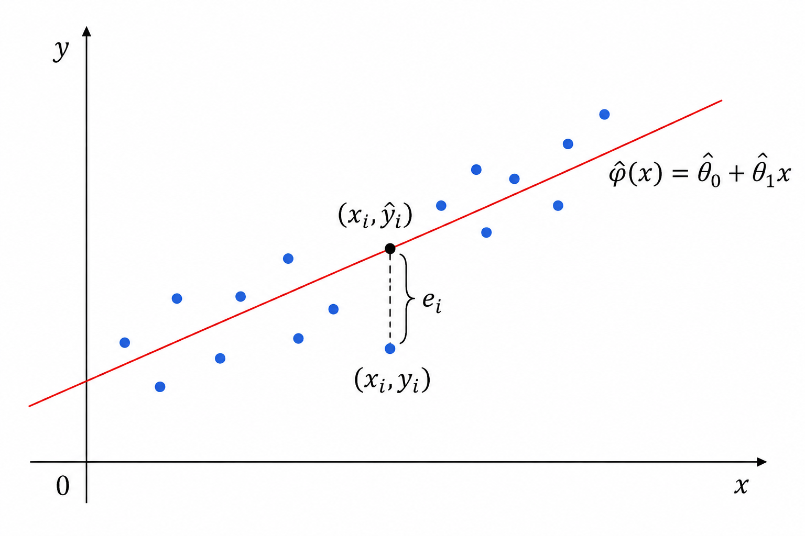
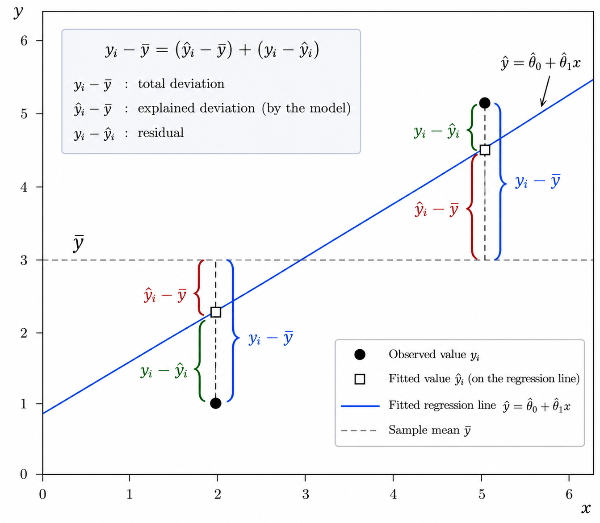
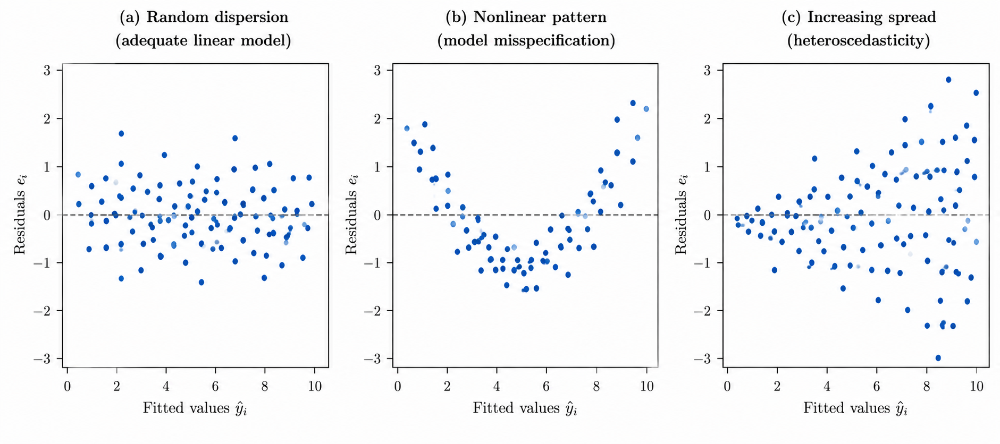
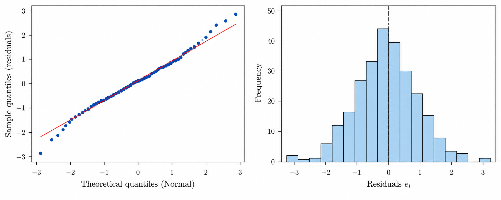

# Machine Learning Modelling

A central part of data science is finding patterns in data. To do that, we try to identify the underlying structure or relationships in the data and represent them through models. This process is called modelling. A model is an abstract and simplified representation of some aspect of reality.

Broadly speaking, we can approach modelling from first principles or from data:

$$
\text{Modelling}
\longrightarrow
\begin{cases}
\text{First-Principles Modelling — Deductive} \\
\text{Data-Driven Modelling — Inductive}
\end{cases}
$$ {#eq-modelling-approaches}

First-principles modelling derives the structure of a model from established theoretical principles, such as physical laws. Data-driven modelling identifies relationships through empirical evidence, either by establishing a functional relationship from observations or by learning one from data.

For example, Kepler's laws were originally formulated from astronomical observations and were later explained through Newtonian mechanics. Similarly, an empirically established linear relationship may allow us to specify a linear regression model without searching across multiple model families.

The distinction is important because model specification and parameter estimation are separate problems. Prior theoretical or empirical knowledge can constrain the space of candidate models before any parameters are estimated. When several candidate models or hyperparameter configurations remain, model selection provides a way to compare them using their predictive performance.

Machine learning belongs broadly to the data-driven approach, although theoretical and empirical knowledge can guide the choice of model structure, features and constraints.

## Learning Paradigms

Depending on the information available and the learning problem, we can distinguish between supervised, unsupervised and reinforcement learning.

In supervised learning, we have labelled data, meaning that each observation includes a response or target variable. If the response is quantitative, we typically have a regression problem; if it is categorical, we have a classification problem.

In unsupervised learning, there is no response variable. Instead, we're interested in discovering structure in the data itself, for example through clustering or dimensionality reduction.

Reinforcement learning is different from both. An agent learns by interacting with an environment, taking actions and receiving rewards, with the goal of learning a policy that maximises cumulative reward over time.

$$
\text{ML}
\longrightarrow
\begin{cases}
\text{SL}
&
\begin{cases}
\text{Regression}     & Y \text{ quantitative} \\
\text{Classification} & Y \text{ categorical}
\end{cases}
\\
\text{UL} & \text{no response } Y
\\
\text{RL} & (s_t,a_t,r_t)
\end{cases}
$$ {#eq-learning-paradigms}

In practice, these approaches are not mutually exclusive. For example, in predicting microbiologically influenced corrosion (MIC), mechanistic models based on Lotka–Volterra dynamics and Monod kinetics can be combined with data-driven regression and classification methods. The same principle applies to weather forecasting, where physical models of atmospheric dynamics can be complemented by machine-learning techniques.

# Notation

Throughout these notes, $N$ denotes the number of observations and $M$ the number of predictors.

## Predictors

The predictor variables are denoted by

$$
X
=
\left(X_1,X_2,\dots,X_M\right).
$$ {#eq-predictor-variables}

For the $i$-th observation, the predictor values are collected in the vector

$$
\mathbf{x}_i
=
\begin{pmatrix}
x_{i1} \\
x_{i2} \\
\vdots \\
x_{iM}
\end{pmatrix}
=
\left(
x_{i1},
x_{i2},
\dots,
x_{iM}
\right)^T
\in\mathbb{R}^M,
$$ {#eq-predictor-vector}

where $x_{ij}$ denotes the observed value of predictor $j$ for observation $i$.

The complete set of predictors can then be arranged into the $N\times M$ matrix

$$
\mathbf{X}
=
\begin{pmatrix}
\mathbf{x}_1^T \\
\mathbf{x}_2^T \\
\vdots \\
\mathbf{x}_N^T
\end{pmatrix}
=
\begin{pmatrix}
x_{11} & x_{12} & \cdots & x_{1M} \\
x_{21} & x_{22} & \cdots & x_{2M} \\
\vdots & \vdots & \ddots & \vdots \\
x_{N1} & x_{N2} & \cdots & x_{NM}
\end{pmatrix}
\in\mathbb{R}^{N\times M}.
$$ {#eq-predictor-matrix}

Each row of $\mathbf{X}$ represents one observation, while each column represents one predictor. In particular, $\mathbf{x}_i^T$ is the $i$-th row of the predictor matrix.

## Response and Prediction

For a quantitative response, the response variable is denoted by

$$
Y\in\mathbb{R}.
$$ {#eq-quantitative-response}

The observed response for observation $i$ is denoted by $y_i$, and the complete set of responses is collected in the vector

$$
\mathbf{y}
=
\begin{pmatrix}
y_1 \\
y_2 \\
\vdots \\
y_N
\end{pmatrix}
\in\mathbb{R}^N.
$$ {#eq-response-vector}

For a categorical response, the response variable is denoted by

$$
C\in\mathcal{C},
$$ {#eq-categorical-response}

where $\mathcal{C}$ is the set of possible classes. For example, for a problem with $K$ classes,

$$
\mathcal{C}
=
\{1,2,\dots,K\}.
$$ {#eq-class-space}

The observed class for observation $i$ is denoted by $c_i\in\mathcal{C}$, and the complete set of observed class labels is collected in

$$
\mathbf{c}
=
\begin{pmatrix}
c_1 \\
c_2 \\
\vdots \\
c_N
\end{pmatrix}
\in\mathcal{C}^N.
$$ {#eq-class-vector}

Given a new predictor vector

$$
\mathbf{x}\in\mathbb{R}^M,
$$ {#eq-new-predictor-vector}

a regression model produces an estimate of the quantitative response,

$$
\hat{Y}
=
\hat{\varphi}(\mathbf{x}),
$$ {#eq-regression-prediction}

where

$$
\hat{\varphi}:\mathbb{R}^M\rightarrow\mathbb{R}.
$$ {#eq-regression-mapping}

Similarly, a classification model produces an estimate of the categorical response,

$$
\hat{C}
=
\hat{\varphi}(\mathbf{x}),
$$ {#eq-classification-prediction}

where

$$
\hat{\varphi}:\mathbb{R}^M\rightarrow\mathcal{C}.
$$ {#eq-classification-mapping}

# Supervised Learning

## Dataset

In supervised learning, each observation is paired with its corresponding response. For a regression problem, the dataset is denoted by

$$
\mathcal{D}
=
\left\{
(\mathbf{x}_i,y_i)
\right\}_{i=1}^{N},
$$ {#eq-regression-dataset}

where $\mathbf{x}_i\in\mathbb{R}^M$ is the predictor vector for observation $i$ and $y_i\in\mathbb{R}$ is its corresponding quantitative response.

For a classification problem, the dataset is denoted by

$$
\mathcal{D}
=
\left\{
(\mathbf{x}_i,c_i)
\right\}_{i=1}^{N},
$$ {#eq-classification-dataset}

where $c_i\in\mathcal{C}$ is the class label associated with observation $i$.

When the dataset is partitioned for model development and evaluation, the corresponding subsets are denoted by

$$
\mathcal{D}_{\mathrm{train}},
\qquad
\mathcal{D}_{\mathrm{val}},
\qquad
\mathcal{D}_{\mathrm{test}},
$$ {#eq-dataset-partitions}

for the training, validation, and test sets, respectively.

The structure of a regression dataset is illustrated in @tbl-regression-dataset.

| Observation | $X_1$ | $X_2$ | $\cdots$ | $X_M$ | $Y$ |
|:-----------:|:-----:|:-----:|:--------:|:-----:|:---:|
| $1$ | $x_{11}$ | $x_{12}$ | $\cdots$ | $x_{1M}$ | $y_1$ |
| $2$ | $x_{21}$ | $x_{22}$ | $\cdots$ | $x_{2M}$ | $y_2$ |
| $\vdots$ | $\vdots$ | $\vdots$ | $\ddots$ | $\vdots$ | $\vdots$ |
| $N$ | $x_{N1}$ | $x_{N2}$ | $\cdots$ | $x_{NM}$ | $y_N$ |

: Tabular representation of a supervised regression dataset. {#tbl-regression-dataset}

The columns $X_1,X_2,\dots,X_M$ correspond to the predictors, while $Y$ corresponds to the response variable. Each row represents one observation, so that row $i$ corresponds to the pair

$$
(\mathbf{x}_i,y_i),
$$ {#eq-observation-pair}

where $\mathbf{x}_i$ is defined in @eq-predictor-vector.

For a classification problem, the same structure applies, replacing the quantitative response $Y$ and its observed values $y_i$ with the categorical response $C$ and class labels $c_i$, respectively.

## Underlying Relationship

For a regression problem, we can represent the relationship between the response and the predictors as

$$
Y
=
\varphi(X)
+
\varepsilon,
$$ {#eq-underlying-relationship}

where $\varphi$ represents the systematic relationship between the predictors and the response, and $\varepsilon$ represents the random component that cannot be explained by the predictors.

For the $i$-th observation,

$$
y_i
=
\varphi(\mathbf{x}_i)
+
\varepsilon_i.
$$ {#eq-observed-relationship}

The goal is to use the available data to estimate the unknown relationship $\varphi$. The resulting estimate is denoted by $\hat{\varphi}$.

Given a new predictor vector $\mathbf{x}$, the corresponding prediction is then

$$
\hat{Y}
=
\hat{\varphi}(\mathbf{x}).
$$ {#eq-predicted-response}

For classification, the same general goal applies: we want to learn the relationship between the predictors and the categorical response, although the relationship is not generally expressed through the additive form in @eq-underlying-relationship.

## Estimating the Relationship

There are different ways of approaching the estimation of $\varphi$. At a high level, we can distinguish between prespecifying a functional form and allowing a more flexible relationship to be learned from the data:

$$
\text{Estimating } \varphi
\longrightarrow
\begin{cases}
\text{Prespecifying a Functional Form} \\
\text{Learning a Flexible Relationship from Data}.
\end{cases}
$$ {#eq-estimating-relationship}

In the first approach, the general structure of the relationship is specified before fitting the model. For example, we may assume a linear relationship,

$$
\varphi_{\boldsymbol{\theta}}(\mathbf{x})
=
\theta_0
+
\sum_{j=1}^{M}\theta_jx_j.
$$ {#eq-linear-functional-form}

The learning problem then reduces to estimating the parameters

$$
\boldsymbol{\theta}
=
(\theta_0,\theta_1,\dots,\theta_M)^T.
$$ {#eq-parameter-vector}

Linear regression is a canonical example of this approach. Polynomial regression and other explicitly parameterised functional forms follow the same general idea.

Alternatively, we may use a more flexible model class and allow the data to determine a larger part of the structure of the relationship. Examples include k-nearest neighbours, decision trees, random forests, boosting methods, and neural networks.

These two approaches should not be interpreted as assumptions versus no assumptions. Every learning method imposes some restrictions or preferences on the relationships that can be learned. This is known as **inductive bias**.

For example, linear regression restricts the model to linear relationships, k-nearest neighbours relies on the idea that nearby observations in predictor space should tend to have similar responses, decision trees represent relationships through recursive partitions of the predictor space, and neural networks restrict the learned relationship through their architecture and composition of transformations.

## Model Fitting

Once a model has been specified, we need a criterion for determining how well it fits the observed data. This is usually expressed through a cost function, also commonly referred to as a loss function or objective function, which we denote by $J$.

The general strategy is to find the model that minimises this function:

$$
\hat{\varphi}
=
\underset{\varphi}{\arg\min}
\;
J\left[Y,\varphi(X)\right].
$$ {#eq-model-fitting}

When the model is parameterised by a vector of parameters $\boldsymbol{\theta}$, this can instead be written as

$$
\hat{\boldsymbol{\theta}}
=
\underset{\boldsymbol{\theta}}{\arg\min}
\;
J(\boldsymbol{\theta}).
$$ {#eq-parameter-estimation}

The particular form of $J$ depends on the problem and determines what constitutes an optimal prediction. Consider first the $L_2$ loss, where prediction errors are measured by their squared magnitude. The expected cost associated with a function $\varphi$ is

$$
J(\varphi)
=
\mathbb{E}
\left[
\left(
Y-\varphi(X)
\right)^2
\right].
$$ {#eq-expected-squared-error}

Using the definition of expectation with respect to the joint distribution of $X$ and $Y$, this can also be written as

$$
J(\varphi)
=
\int
\left[
y-\varphi(x)
\right]^2
P(dx,dy),
$$ {#eq-expected-squared-error-integral}

where $P(dx,dy)$ denotes integration with respect to the joint probability distribution of $(X,Y)$. If $X$ and $Y$ have a joint probability density $p_{X,Y}(x,y)$, the same expression becomes

$$
J(\varphi)
=
\int_{\mathbb{R}^M}
\int_{\mathbb{R}}
\left[
y-\varphi(x)
\right]^2
p_{X,Y}(x,y)
\,dy\,dx.
$$ {#eq-expected-squared-error-density}

By conditioning on $X$ and using the [law of iterated expectation](https://en.wikipedia.org/wiki/Law_of_total_expectation), @eq-expected-squared-error can be written as

$$
J(\varphi)
=
\mathbb{E}_X
\left[
\mathbb{E}_{Y\mid X}
\left[
\left(
Y-\varphi(X)
\right)^2
\mid X
\right]
\right].
$$ {#eq-conditional-expected-squared-error}

The expected squared error can therefore be minimised pointwise. For a fixed value $X=x$, the quantity $\varphi(x)$ is simply a scalar. Let $\alpha\in\mathbb{R}$ represent a candidate value for this prediction. We then seek

$$
\varphi(x)
=
\underset{\alpha\in\mathbb{R}}{\arg\min}
\;
\mathbb{E}
\left[
(Y-\alpha)^2
\mid X=x
\right].
$$ {#eq-l2-pointwise-minimisation}

To solve this minimisation explicitly, define

$$
J(\alpha)
=
\mathbb{E}
\left[
(Y-\alpha)^2
\mid X=x
\right].
$$ {#eq-l2-conditional-cost}

Expanding the squared term and using the linearity of expectation gives

$$
J(\alpha)
=
\mathbb{E}
\left[
Y^2\mid X=x
\right]
-
2\alpha
\mathbb{E}
\left[
Y\mid X=x
\right]
+
\alpha^2.
$$ {#eq-l2-cost-expanded}

Differentiating with respect to $\alpha$,

$$
\frac{dJ}{d\alpha}
=
-2
\mathbb{E}
\left[
Y\mid X=x
\right]
+
2\alpha.
$$ {#eq-l2-cost-derivative}

Setting the derivative equal to zero gives

$$
\alpha
=
\mathbb{E}
\left[
Y\mid X=x
\right].
$$ {#eq-l2-optimal-alpha}

Since

$$
\frac{d^2J}{d\alpha^2}
=
2
>
0,
$$

this stationary point is a minimum. Therefore,

$$
\varphi(x)
=
\mathbb{E}
\left[
Y\mid X=x
\right].
$$ {#eq-regression-function}

Under $L_2$ loss, the optimal prediction is therefore the **conditional mean** of $Y$ given $X=x'$. This conditional expectation is commonly referred to as the **regression function**. Importantly, this is a general result: no linear relationship between $X$ and $Y$ has been assumed.

The choice of loss function changes what constitutes an optimal prediction. To see this, consider instead the $L_1$ loss, where prediction errors are measured by their absolute magnitude:

$$
J(\varphi)
=
\mathbb{E}
\left[
\left|
Y-\varphi(X)
\right|
\right].
$$ {#eq-expected-absolute-error}

As before, conditioning on $X$ allows the problem to be minimised pointwise:

$$
\varphi(x)
=
\underset{\alpha\in\mathbb{R}}{\arg\min}
\;
\mathbb{E}
\left[
|Y-\alpha|
\mid X=x
\right].
$$ {#eq-l1-pointwise-minimisation}

For a fixed $X=x$, define

$$
J(\alpha)
=
\mathbb{E}
\left[
|Y-\alpha|
\mid X=x
\right].
$$ {#eq-l1-conditional-cost}

Assuming that the conditional distribution of $Y$ given $X=x$ has a density $p(y\mid x)$, the expectation can be split at $\alpha$:

$$
J(\alpha)
=
\int_{-\infty}^{\alpha}
(\alpha-y)p(y\mid x)\,dy
+
\int_{\alpha}^{\infty}
(y-\alpha)p(y\mid x)\,dy.
$$ {#eq-l1-cost-integral}

Differentiating with respect to $\alpha$ gives

$$
\frac{dJ}{d\alpha}
=
\int_{-\infty}^{\alpha}
p(y\mid x)\,dy
-
\int_{\alpha}^{\infty}
p(y\mid x)\,dy.
$$ {#eq-l1-cost-derivative}

Introducing the conditional cumulative distribution function

$$
F_{Y\mid X}(\alpha\mid x)
=
P(Y\leq\alpha\mid X=x),
$$ {#eq-conditional-cdf}

we obtain

$$
\frac{dJ}{d\alpha}
=
2F_{Y\mid X}(\alpha\mid x)-1.
$$ {#eq-l1-cost-cdf}

At the minimum,

$$
F_{Y\mid X}(\alpha\mid x)
=
\frac{1}{2},
$$ {#eq-l1-median-condition}

which means that the optimal value of $\alpha$ is the median of the conditional distribution. Therefore,

$$
\varphi(x)
=
\operatorname{median}
\left(
Y\mid X=x
\right).
$$ {#eq-l1-optimal-prediction}

Under $L_1$ loss, the optimal prediction is therefore the **conditional median** rather than the conditional mean.

The two results can be summarised as

$$
\begin{aligned}
L_2
&\quad\longrightarrow\quad
\mathbb{E}[Y\mid X=x],
\\
L_1
&\quad\longrightarrow\quad
\operatorname{median}(Y\mid X=x).
\end{aligned}
$$ {#eq-l1-l2-summary}

Thus, the choice of cost function does more than determine how prediction errors are penalised: it determines which property of the conditional distribution is optimal to predict.

# Linear Regression Models

::: {.callout-note appearance="simple" icon=false collapse="false"}

**Linear regression** is a statistical method used to model the relationship between a response variable and one or more predictors, or covariates. When there is a single predictor, the model is called **Simple Linear Regression**; when there is more than one predictor, it is called **Multiple Linear Regression**.

\medskip

Linear regression is a fundamental statistical model and is also widely used as a supervised machine learning method for regression problems. It provides a natural starting point for studying regression, introducing many of the concepts that also appear in more sophisticated models.

:::

## Simple Linear Regression

From @eq-regression-function, under squared-error loss the optimal regression function is

$$
\varphi(x)
=
\mathbb{E}[Y\mid X=x].
$$

Simple linear regression assumes that this conditional mean can be represented as a linear function of a single predictor:

$$
\varphi(x)
=
\mathbb{E}[Y\mid X=x]
=
\theta_0+\theta_1x.
$$ {#eq-simple-linear-regression-function}

The corresponding statistical model is

$$
Y
=
\theta_0+\theta_1X+\varepsilon,
$$ {#eq-simple-linear-regression-model}

where $\theta_0$ is the **intercept**, $\theta_1$ is the **slope**, and $\varepsilon$ represents the part of the response that is not explained by the linear relationship. In particular, the model assumes

$$
\mathbb{E}[\varepsilon\mid X]=0,
$$ {#eq-zero-conditional-mean}

so that

$$
\mathbb{E}[Y\mid X=x]
=
\theta_0+\theta_1x.
$$

For a training dataset

$$
\mathcal{D}_{\mathrm{train}}
=
\{(x_i,y_i)\}_{i=1}^{N},
$$ {#eq-simple-linear-regression-training-data}

where $x_i$ is the predictor and $y_i$ is the corresponding response for observation $i$, the data can be represented in tabular form:

| Observation | $X$ | $Y$ |
|:-----------:|:---:|:---:|
| $1$ | $x_1$ | $y_1$ |
| $2$ | $x_2$ | $y_2$ |
| $\vdots$ | $\vdots$ | $\vdots$ |
| $i$ | $x_i$ | $y_i$ |
| $\vdots$ | $\vdots$ | $\vdots$ |
| $N$ | $x_N$ | $y_N$ |

: Training dataset for simple linear regression. {#tbl-training-dataset}

For observation $i$, the model is

$$
y_i
=
\theta_0+\theta_1x_i+\varepsilon_i.
$$ {#eq-simple-linear-regression-observation}

The goal is to estimate the unknown parameters $\theta_0$ and $\theta_1$ from the observed data. Once the estimates $\hat{\theta}_0$ and $\hat{\theta}_1$ have been obtained, the fitted regression function is

$$
\hat{\varphi}(x)
=
\hat{\theta}_0+\hat{\theta}_1x.
$$ {#eq-fitted-regression-function}

For observation $i$, the corresponding fitted value is

$$
\hat{y}_i
=
\hat{\varphi}(x_i)
=
\hat{\theta}_0+\hat{\theta}_1x_i.
$$ {#eq-fitted-value}

For each observation, the difference between the observed response and its fitted value is called the **residual**:

$$
e_i
=
y_i-\hat{y}_i
=
y_i-\hat{\theta}_0-\hat{\theta}_1x_i.
$$ {#eq-residual}

It is important to distinguish the residual $e_i$ from the error term $\varepsilon_i$. The error term is defined with respect to the unknown population regression function,

$$
\varepsilon_i
=
y_i-\varphi(x_i)
=
y_i-\theta_0-\theta_1x_i,
$$ {#eq-error-term}

and is therefore unobserved because the true parameters $\theta_0$ and $\theta_1$ are unknown. In contrast, the residual $e_i$ is computed after fitting the model and measures the discrepancy between the observed response $y_i$ and its fitted value $\hat{y}_i$. Residuals also provide observable quantities for investigating the statistical assumptions of the fitted model.

As illustrated in @fig-rss, each residual corresponds to the vertical difference between an observed response $y_i$ and the value $\hat{y}_i$ predicted by the fitted regression line.

{#fig-rss width=85%}

Model fitting therefore requires choosing $\hat{\theta}_0$ and $\hat{\theta}_1$ according to a criterion that measures the discrepancies between the observed and fitted responses. For simple linear regression, the standard approach is **Ordinary Least Squares**.

### Ordinary Least Squares

**Ordinary Least Squares (OLS)** estimates the model parameters by choosing the values of $\theta_0$ and $\theta_1$ that minimise the sum of the squared differences between the observed responses and the values predicted by the regression line.

In terms of the general objective function introduced previously, simple linear regression with squared-error loss uses the **Residual Sum of Squares (RSS)** as the objective function over the training data:

$$
\begin{split}
J(\theta_0,\theta_1)
&=
\operatorname{RSS}(\theta_0,\theta_1) \\
&=
(y_1-\theta_0-\theta_1x_1)^2
+
(y_2-\theta_0-\theta_1x_2)^2
+
\cdots
+
(y_N-\theta_0-\theta_1x_N)^2 \\
&=
\sum_{i=1}^{N}
\left(
y_i-\theta_0-\theta_1x_i
\right)^2.
\end{split}
$$ {#eq-rss}

The OLS estimates $\hat{\theta}_0$ and $\hat{\theta}_1$ are therefore defined as the parameter values that minimise the RSS:

$$
(\hat{\theta}_0,\hat{\theta}_1)
=
\underset{\theta_0,\theta_1}{\operatorname{argmin}}
\;
\operatorname{RSS}(\theta_0,\theta_1).
$$ {#eq-ols-optimization}

Once the model has been fitted, the RSS evaluated at the estimated parameters can equivalently be written in terms of the residuals:

$$
\operatorname{RSS}(\hat{\theta}_0,\hat{\theta}_1)
=
\sum_{i=1}^{N}e_i^2.
$$ {#eq-rss-residuals}

### Parameter Estimation

To obtain the OLS estimates analytically, we minimise $\operatorname{RSS}(\theta_0,\theta_1)$ with respect to both parameters. The critical points of the RSS satisfy

$$
\nabla
\operatorname{RSS}(\theta_0,\theta_1)
=
\left(
\frac{\partial\operatorname{RSS}}{\partial\theta_0},
\frac{\partial\operatorname{RSS}}{\partial\theta_1}
\right)
=
(0,0).
$$ {#eq-rss-gradient}

#### Estimation of the Intercept

Differentiating the RSS with respect to $\theta_0$ gives

$$
\begin{split}
\frac{\partial\operatorname{RSS}}{\partial\theta_0}
&=
\frac{\partial}{\partial\theta_0}
\sum_{i=1}^{N}
(y_i-\theta_0-\theta_1x_i)^2 \\
&=
-2
\sum_{i=1}^{N}
(y_i-\theta_0-\theta_1x_i).
\end{split}
$$ {#eq-rss-intercept-derivative}

Setting this derivative equal to zero,

$$
-2
\sum_{i=1}^{N}
(y_i-\hat{\theta}_0-\hat{\theta}_1x_i)
=
0.
$$

Therefore,

$$
\begin{split}
\sum_{i=1}^{N}
(y_i-\hat{\theta}_0-\hat{\theta}_1x_i)
&=
0 \\
\sum_{i=1}^{N}y_i
-
N\hat{\theta}_0
-
\hat{\theta}_1\sum_{i=1}^{N}x_i
&=
0.
\end{split}
$$

Hence,

$$
\begin{split}
N\hat{\theta}_0
&=
\sum_{i=1}^{N}y_i
-
\hat{\theta}_1
\sum_{i=1}^{N}x_i \\
\hat{\theta}_0
&=
\frac{1}{N}
\sum_{i=1}^{N}y_i
-
\hat{\theta}_1
\frac{1}{N}
\sum_{i=1}^{N}x_i.
\end{split}
$$

Defining the sample means as

$$
\bar{x}
=
\frac{1}{N}
\sum_{i=1}^{N}x_i,
\qquad
\bar{y}
=
\frac{1}{N}
\sum_{i=1}^{N}y_i,
$$ {#eq-sample-means}

we obtain

$$
\hat{\theta}_0
=
\bar{y}
-
\hat{\theta}_1\bar{x}.
$$ {#eq-ols-intercept}

Thus, the fitted regression line passes through the point $(\bar{x},\bar{y})$.

#### Estimation of the Slope

Differentiating the RSS with respect to $\theta_1$ gives

$$
\begin{split}
\frac{\partial\operatorname{RSS}}{\partial\theta_1}
&=
\frac{\partial}{\partial\theta_1}
\sum_{i=1}^{N}
(y_i-\theta_0-\theta_1x_i)^2 \\
&=
-2
\sum_{i=1}^{N}
x_i
(y_i-\theta_0-\theta_1x_i).
\end{split}
$$ {#eq-rss-slope-derivative}

Setting this derivative equal to zero,

$$
\sum_{i=1}^{N}
x_i
(y_i-\hat{\theta}_0-\hat{\theta}_1x_i)
=
0.
$$ {#eq-slope-normal-equation}

Using @eq-ols-intercept, the fitted residual associated with arbitrary $x_i$ can be written as

$$
\begin{split}
y_i-\hat{\theta}_0-\hat{\theta}_1x_i
&=
y_i-
(\bar{y}-\hat{\theta}_1\bar{x})
-
\hat{\theta}_1x_i \\
&=
(y_i-\bar{y})
-
\hat{\theta}_1(x_i-\bar{x}).
\end{split}
$$ {#eq-centered-residual}

Substituting @eq-centered-residual into @eq-slope-normal-equation gives

$$
\sum_{i=1}^{N}
x_i
\left[
(y_i-\bar{y})
-
\hat{\theta}_1(x_i-\bar{x})
\right]
=
0.
$$

Since

$$
x_i
=
(x_i-\bar{x})+\bar{x},
$$

we have

$$
\begin{split}
0
&=
\sum_{i=1}^{N}
(x_i-\bar{x})
\left[
(y_i-\bar{y})
-
\hat{\theta}_1(x_i-\bar{x})
\right] \\
&\quad+
\bar{x}
\sum_{i=1}^{N}
\left[
(y_i-\bar{y})
-
\hat{\theta}_1(x_i-\bar{x})
\right].
\end{split}
$$

By the definition of the sample means,

$$
\sum_{i=1}^{N}(y_i-\bar{y})
=
0,
\qquad
\sum_{i=1}^{N}(x_i-\bar{x})
=
0,
$$

so the second term vanishes. Therefore,

$$
\sum_{i=1}^{N}
(x_i-\bar{x})
\left[
(y_i-\bar{y})
-
\hat{\theta}_1(x_i-\bar{x})
\right]
=
0.
$$

Expanding,

$$
\sum_{i=1}^{N}
(x_i-\bar{x})(y_i-\bar{y})
-
\hat{\theta}_1
\sum_{i=1}^{N}
(x_i-\bar{x})^2
=
0.
$$

Hence,

$$
\sum_{i=1}^{N}
(x_i-\bar{x})(y_i-\bar{y})
=
\hat{\theta}_1
\sum_{i=1}^{N}
(x_i-\bar{x})^2.
$$

Provided that the predictor is not constant, so that

$$
\sum_{i=1}^{N}
(x_i-\bar{x})^2
>
0,
$$

the OLS estimate of the slope is

$$
\hat{\theta}_1
=
\frac{
\displaystyle
\sum_{i=1}^{N}
(x_i-\bar{x})(y_i-\bar{y})
}{
\displaystyle
\sum_{i=1}^{N}
(x_i-\bar{x})^2
}.
$$ {#eq-ols-slope}

The slope can also be related directly to the sample covariance and variance. Defining

$$
s_{XY}
=
\frac{1}{N-1}
\sum_{i=1}^{N}
(x_i-\bar{x})(y_i-\bar{y}),
$$

and

$$
s_X^2
=
\frac{1}{N-1}
\sum_{i=1}^{N}
(x_i-\bar{x})^2,
$$

the common normalisation factor cancels, giving

$$
\hat{\theta}_1
=
\frac{s_{XY}}{s_X^2}.
$$ {#eq-ols-slope-covariance}

Together, @eq-ols-intercept and @eq-ols-slope give the OLS parameter estimates for simple linear regression:

$$
\begin{aligned}
\hat{\theta}_0
&=
\bar{y}
-
\hat{\theta}_1\bar{x},
\\
\hat{\theta}_1
&=
\frac{
\displaystyle
\sum_{i=1}^{N}
(x_i-\bar{x})(y_i-\bar{y})
}{
\displaystyle
\sum_{i=1}^{N}
(x_i-\bar{x})^2
}.
\end{aligned}
$$ {#eq-ols-estimates}

### Hessian and the Minimum of the RSS

The first-order conditions identify a critical point of the RSS. To determine the nature of this critical point, we examine the second derivatives of the objective function.

The second derivative with respect to $\theta_0$ is

$$
\frac{\partial^2\operatorname{RSS}}
{\partial\theta_0^2}
=
2N.
$$

The second derivative with respect to $\theta_1$ is

$$
\frac{\partial^2\operatorname{RSS}}
{\partial\theta_1^2}
=
2
\sum_{i=1}^{N}x_i^2.
$$

The mixed second derivative is

$$
\frac{\partial^2\operatorname{RSS}}
{\partial\theta_0\partial\theta_1}
=
2
\sum_{i=1}^{N}x_i.
$$

Therefore, the Hessian matrix of the RSS is

$$
H
=
\frac{\partial^2\operatorname{RSS}}
{\partial\boldsymbol{\theta}^2}
=
\begin{bmatrix}
2N
&
2\displaystyle\sum_{i=1}^{N}x_i
\\
2\displaystyle\sum_{i=1}^{N}x_i
&
2\displaystyle\sum_{i=1}^{N}x_i^2
\end{bmatrix}.
$$ {#eq-rss-hessian}

The first leading principal minor is

$$
2N>0.
$$

The determinant of the Hessian is

$$
\begin{split}
\det(H)
&=
(2N)
\left(
2\sum_{i=1}^{N}x_i^2
\right)
-
\left(
2\sum_{i=1}^{N}x_i
\right)^2 \\
&=
4N
\sum_{i=1}^{N}x_i^2
-
4
\left(
\sum_{i=1}^{N}x_i
\right)^2 \\
&=
4N
\left[
\sum_{i=1}^{N}x_i^2
-
\frac{
\left(
\sum_{i=1}^{N}x_i
\right)^2
}{N}
\right] \\
&=
4N
\sum_{i=1}^{N}
(x_i-\bar{x})^2.
\end{split}
$$ {#eq-hessian-determinant}

If the predictor has non-zero variation,

$$
\sum_{i=1}^{N}
(x_i-\bar{x})^2
>
0,
$$

then

$$
\det(H)>0.
$$

Since the first leading principal minor is also positive, the Hessian is positive definite:

$$
H\succ0.
$$

Consequently, $\operatorname{RSS}(\theta_0,\theta_1)$ is strictly convex with respect to the parameters. The critical point $(\hat{\theta}_0,\hat{\theta}_1)$ is therefore the unique global minimum of the RSS:

$$
\operatorname{RSS}(\hat{\theta}_0,\hat{\theta}_1)
=
\min_{\theta_0,\theta_1}
\operatorname{RSS}(\theta_0,\theta_1).
$$ {#eq-rss-global-minimum}

Thus, provided that the predictor has non-zero variation, the OLS estimates are uniquely determined and define the regression line that minimises the sum of the squared residuals over the training data.

### Numerical Optimisation

The analytical derivation of the OLS estimates provides an exact solution to the minimisation of the Residual Sum of Squares. However, many machine learning models involve objective functions for which an analytical solution is unavailable or computationally impractical. In such cases, numerical optimisation methods are used to obtain parameter estimates iteratively.

Numerical optimisation methods can be distinguished by the derivative information they use. First-order methods, such as Gradient Descent, rely on the gradient of the objective function. Second-order methods, such as Newton's Method, additionally use the Hessian to account for the local curvature of the objective function. Quasi-Newton methods, such as BFGS, approximate curvature information using successive gradient evaluations.

For simple linear regression, the optimisation problem is

$$
\min_{\boldsymbol{\theta}\in\mathbb{R}^2}
J(\boldsymbol{\theta}),
\qquad
\boldsymbol{\theta}
=
\begin{pmatrix}
\theta_0 \\
\theta_1
\end{pmatrix},
$$ {#eq-rss-numerical-optimisation}

where

$$
J(\boldsymbol{\theta})
=
\sum_{i=1}^{N}
\left(
y_i-\theta_0-\theta_1x_i
\right)^2.
$$

As established in @eq-rss-hessian and @eq-hessian-determinant, the RSS is a strictly convex quadratic function of the parameters whenever the predictor has non-zero variation. Consequently, its unique global minimum provides a known reference against which numerical optimisation methods can be examined.

The following sections focus on Newton's Method and BFGS, using the RSS to illustrate how curvature information can guide the iterative estimation of model parameters. A more detailed treatment of Gradient Descent is deferred to neural network optimisation, where first-order methods play a central role in model training.

#### Newton's Method

Newton's Method is an iterative optimisation algorithm that uses first- and second-order derivatives to determine how the parameters should be updated. Unlike methods that rely exclusively on the gradient, Newton's Method incorporates the local curvature of the objective function through its Hessian matrix.

Consider a twice continuously differentiable objective function $J:\mathbb{R}^M\rightarrow\mathbb{R}$ and a current parameter estimate $\boldsymbol{\theta}^{(k)}$. A second-order Taylor approximation around this point is

$$
\begin{split}
J(\boldsymbol{\theta}^{(k)}+\boldsymbol{\delta})
\approx{}&
J(\boldsymbol{\theta}^{(k)})
+
\nabla J(\boldsymbol{\theta}^{(k)})^T
\boldsymbol{\delta}
\\
&+
\frac{1}{2}
\boldsymbol{\delta}^T
H(\boldsymbol{\theta}^{(k)})
\boldsymbol{\delta},
\end{split}
$$ {#eq-newton-taylor}

where $\boldsymbol{\delta}$ is a parameter displacement, $\nabla J$ is the gradient, and $H$ is the Hessian matrix of the objective function.

The idea behind Newton's Method is to choose $\boldsymbol{\delta}$ by minimising this local quadratic approximation. Differentiating with respect to $\boldsymbol{\delta}$ gives

$$
\nabla J(\boldsymbol{\theta}^{(k)})
+
H(\boldsymbol{\theta}^{(k)})
\boldsymbol{\delta}
=
\mathbf{0}.
$$ {#eq-newton-quadratic-stationarity}

If the Hessian is positive definite, the quadratic approximation has a unique minimum. Solving for the displacement gives

$$
\boldsymbol{\delta}^{(k)}
=
-
H(\boldsymbol{\theta}^{(k)})^{-1}
\nabla J(\boldsymbol{\theta}^{(k)}).
$$ {#eq-newton-displacement}

The resulting parameter update is

$$
\boldsymbol{\theta}^{(k+1)}
=
\boldsymbol{\theta}^{(k)}
-
H(\boldsymbol{\theta}^{(k)})^{-1}
\nabla J(\boldsymbol{\theta}^{(k)}).
$$ {#eq-newton-update}

In practice, the Newton direction is usually computed by solving the linear system

$$
H(\boldsymbol{\theta}^{(k)})
\boldsymbol{\delta}^{(k)}
=
-
\nabla J(\boldsymbol{\theta}^{(k)}),
$$

rather than explicitly forming the inverse of the Hessian.

For a general objective function, the quadratic approximation is only locally accurate. Consequently, Newton's Method may require multiple iterations, and a step length may be introduced to control the update:

$$
\boldsymbol{\theta}^{(k+1)}
=
\boldsymbol{\theta}^{(k)}
+
\alpha_k\boldsymbol{\delta}^{(k)},
$$ {#eq-newton-step-length}

where $\alpha_k>0$ is the step length. The original Newton update corresponds to $\alpha_k=1$.

**Application to the Residual Sum of Squares**

For simple linear regression, the parameter vector is

$$
\boldsymbol{\theta}
=
\begin{pmatrix}
\theta_0\\
\theta_1
\end{pmatrix},
$$

and the objective function is

$$
J(\boldsymbol{\theta})
=
\sum_{i=1}^{N}
(y_i-\theta_0-\theta_1x_i)^2.
$$

From @eq-rss-intercept-derivative and @eq-rss-slope-derivative, the gradient is

$$
\nabla J(\boldsymbol{\theta})
=
-2
\begin{pmatrix}
\displaystyle
\sum_{i=1}^{N}
(y_i-\theta_0-\theta_1x_i)
\\[8pt]
\displaystyle
\sum_{i=1}^{N}
x_i(y_i-\theta_0-\theta_1x_i)
\end{pmatrix}.
$$ {#eq-newton-rss-gradient}

The Hessian, previously derived in @eq-rss-hessian, is

$$
H
=
2
\begin{pmatrix}
N
&
\displaystyle\sum_{i=1}^{N}x_i
\\[8pt]
\displaystyle\sum_{i=1}^{N}x_i
&
\displaystyle\sum_{i=1}^{N}x_i^2
\end{pmatrix}.
$$

Notice that the Hessian does not depend on $\boldsymbol{\theta}$. This is because the RSS is a quadratic function of the regression parameters.

When the predictor has non-zero variation, the Hessian is positive definite and therefore invertible. Newton's Method can then be applied directly:

$$
\boldsymbol{\theta}^{(k+1)}
=
\boldsymbol{\theta}^{(k)}
-
H^{-1}
\nabla J(\boldsymbol{\theta}^{(k)}).
$$ {#eq-newton-rss-update}

**Convergence in One Iteration**

The quadratic structure of the RSS gives Newton's Method a particularly useful property: with the exact Hessian and a full step, the algorithm reaches the OLS solution in a single iteration from any initial parameter vector.

To demonstrate this, let

$$
\hat{\boldsymbol{\theta}}
=
\begin{pmatrix}
\hat{\theta}_0\\
\hat{\theta}_1
\end{pmatrix}
$$

denote the unique OLS solution derived in @eq-ols-estimates. Since it minimises the RSS,

$$
\nabla J(\hat{\boldsymbol{\theta}})
=
\mathbf{0}.
$$

Because $J$ is quadratic and its Hessian is constant, its gradient is an affine function of the parameters. Therefore,

$$
\nabla J(\boldsymbol{\theta})
=
\nabla J(\hat{\boldsymbol{\theta}})
+
H(\boldsymbol{\theta}-\hat{\boldsymbol{\theta}}).
$$

Using the first-order optimality condition,

$$
\nabla J(\boldsymbol{\theta})
=
H(\boldsymbol{\theta}-\hat{\boldsymbol{\theta}}).
$$ {#eq-newton-rss-gradient-identity}

Substituting @eq-newton-rss-gradient-identity into the Newton update gives

$$
\begin{split}
\boldsymbol{\theta}^{(k+1)}
&=
\boldsymbol{\theta}^{(k)}
-
H^{-1}
H
(\boldsymbol{\theta}^{(k)}-\hat{\boldsymbol{\theta}})
\\
&=
\boldsymbol{\theta}^{(k)}
-
(\boldsymbol{\theta}^{(k)}-\hat{\boldsymbol{\theta}})
\\
&=
\hat{\boldsymbol{\theta}}.
\end{split}
$$ {#eq-newton-one-iteration}

Thus, for any initial parameter vector $\boldsymbol{\theta}^{(0)}$,

$$
\boldsymbol{\theta}^{(1)}
=
\hat{\boldsymbol{\theta}}.
$$ {#eq-newton-rss-convergence}

This result holds because the second-order Taylor approximation is exact for a quadratic objective function. In this case, Newton's Method does not merely approximate the location of the minimum: its first full update recovers the analytical OLS solution.

For more general machine learning objectives, the Hessian may vary with the parameters, may not be positive definite, or may be computationally expensive to evaluate and factorise. These considerations motivate quasi-Newton methods, which approximate curvature information rather than requiring the exact Hessian at every iteration.

::: {.callout-note appearance="simple" icon=false collapse="false"}

**Algorithm:** *Newton's Method*

\medskip

Iteratively minimise a twice-differentiable objective function using its gradient and Hessian.

\medskip

**Input:** objective function $J(\boldsymbol{\theta})$, initial parameter vector $\boldsymbol{\theta}^{(0)}$, convergence tolerance $\tau>0$, maximum number of iterations $K$.  
**Output:** final parameter estimate $\boldsymbol{\theta}^{*}$ and termination status.

1. Initialise the parameters at $\boldsymbol{\theta}^{(0)}$.

2. For $k=0,1,\ldots,K-1$:

   a. Evaluate the gradient:

   $$
   \mathbf{g}_k
   =
   \nabla J(\boldsymbol{\theta}^{(k)}).
   $$

   b. If $\|\mathbf{g}_k\|_2\leq\tau$, terminate with convergence.

   c. Evaluate the Hessian:

   $$
   H_k
   =
   H(\boldsymbol{\theta}^{(k)}).
   $$

   d. Compute the Newton direction by solving:

   $$
   H_k\boldsymbol{\delta}^{(k)}
   =
   -\mathbf{g}_k.
   $$

   e. Choose a step length $\alpha_k>0$ and update:

   $$
   \boldsymbol{\theta}^{(k+1)}
   =
   \boldsymbol{\theta}^{(k)}
   +
   \alpha_k\boldsymbol{\delta}^{(k)}.
   $$

3. If the maximum number of iterations is reached without satisfying the convergence criterion, terminate with the corresponding status.

4. Return the final parameter estimate $\boldsymbol{\theta}^{*}$ and termination status.

:::

The algorithm assumes that the Newton direction is well-defined. When the Hessian is positive definite, the direction is a descent direction whenever the gradient is non-zero. For a general objective function, additional safeguards may be required if the Hessian is singular or indefinite.

For the RSS of simple linear regression with a non-constant predictor, the Hessian is constant and positive definite. Consequently, the Newton direction is always well-defined, and a full step $\alpha_k=1$ reaches the analytical OLS solution in a single iteration, in exact arithmetic.

#### BFGS

Newton's Method uses the Hessian of the objective function to account for its local curvature. Although this information can substantially improve the search direction, evaluating and factorising the Hessian may become computationally expensive as the number of model parameters increases.

**Quasi-Newton methods** address this limitation by constructing an approximation of the Hessian, or its inverse, from information obtained during successive iterations. Rather than evaluating the exact Hessian at every step, these methods update their curvature approximation using changes in the parameters and gradients.

The **Broyden–Fletcher–Goldfarb–Shanno (BFGS)** algorithm is a quasi-Newton method that combines gradient information with an iteratively updated approximation of the Hessian.

Let

$$
B_k
\approx
H(\boldsymbol{\theta}^{(k)})
$$

denote the Hessian approximation at iteration $k$. The search direction is obtained by solving

$$
B_k\boldsymbol{\delta}^{(k)}
=
-
\nabla J(\boldsymbol{\theta}^{(k)}).
$$ {#eq-bfgs-direction}

The parameters are then updated according to

$$
\boldsymbol{\theta}^{(k+1)}
=
\boldsymbol{\theta}^{(k)}
+
\alpha_k\boldsymbol{\delta}^{(k)},
$$ {#eq-bfgs-update}

where $\alpha_k>0$ is the step length.

Unlike Newton's Method, BFGS does not require the exact Hessian to compute the search direction. Instead, it uses the gradients evaluated at successive parameter estimates to update $B_k$.

**The Secant Condition**

After an iteration, define the parameter displacement

$$
\mathbf{s}_k
=
\boldsymbol{\theta}^{(k+1)}
-
\boldsymbol{\theta}^{(k)},
$$ {#eq-bfgs-parameter-displacement}

and the corresponding change in the gradient

$$
\mathbf{y}_k
=
\nabla J(\boldsymbol{\theta}^{(k+1)})
-
\nabla J(\boldsymbol{\theta}^{(k)}).
$$ {#eq-bfgs-gradient-displacement}

For a twice continuously differentiable objective function, the gradient change can be expressed as

$$
\mathbf{y}_k
=
\int_0^1
H(\boldsymbol{\theta}^{(k)}+t\mathbf{s}_k)
\mathbf{s}_k
\,dt.
$$ {#eq-bfgs-gradient-integral}

This identity shows that the change in the gradient contains information about the curvature of the objective function along the displacement $\mathbf{s}_k$.

BFGS incorporates this information by requiring the updated Hessian approximation to satisfy the **secant condition**:

$$
B_{k+1}\mathbf{s}_k
=
\mathbf{y}_k.
$$ {#eq-bfgs-secant-condition}

The secant condition requires the updated approximation to reproduce the observed gradient change along the most recent parameter displacement.

However, this condition alone does not uniquely determine $B_{k+1}$. BFGS therefore uses a specific symmetric, rank-two update that satisfies the secant condition while preserving positive definiteness under an appropriate curvature condition.

**The BFGS Update**

The BFGS Hessian approximation is updated according to

$$
B_{k+1}
=
B_k
-
\frac{
B_k\mathbf{s}_k\mathbf{s}_k^TB_k
}{
\mathbf{s}_k^TB_k\mathbf{s}_k
}
+
\frac{
\mathbf{y}_k\mathbf{y}_k^T
}{
\mathbf{y}_k^T\mathbf{s}_k
}.
$$ {#eq-bfgs-hessian-update}

The first correction modifies the previous curvature approximation along the most recent displacement. The second incorporates the curvature information inferred from the observed change in the gradient.

The update is well-defined and preserves positive definiteness when $B_k$ is positive definite and

$$
\mathbf{y}_k^T\mathbf{s}_k
>
0.
$$ {#eq-bfgs-curvature-condition}

This is known as the **curvature condition**.

When the objective function is strictly convex along the step, the condition is satisfied for any non-zero displacement. For more general objectives, a line-search procedure satisfying suitable Wolfe conditions can be used to enforce it.

If $B_k$ remains positive definite, the BFGS direction is a descent direction whenever the gradient is non-zero:

$$
\begin{split}
\nabla J(\boldsymbol{\theta}^{(k)})^T
\boldsymbol{\delta}^{(k)}
&=
-
\nabla J(\boldsymbol{\theta}^{(k)})^T
B_k^{-1}
\nabla J(\boldsymbol{\theta}^{(k)})
\\
&<
0.
\end{split}
$$ {#eq-bfgs-descent-direction}

Thus, the Hessian approximation provides curvature information while retaining the descent property of the search direction.

**Inverse Hessian Formulation**

BFGS can also be formulated by updating an approximation of the inverse Hessian directly.

Let

$$
G_k
\approx
H(\boldsymbol{\theta}^{(k)})^{-1},
$$

and define

$$
\rho_k
=
\frac{1}{
\mathbf{y}_k^T\mathbf{s}_k
}.
$$ {#eq-bfgs-rho}

The inverse BFGS update is

$$
\begin{split}
G_{k+1}
={}&
\left(
I-\rho_k\mathbf{s}_k\mathbf{y}_k^T
\right)
G_k
\left(
I-\rho_k\mathbf{y}_k\mathbf{s}_k^T
\right)
\\
&+
\rho_k\mathbf{s}_k\mathbf{s}_k^T.
\end{split}
$$ {#eq-bfgs-inverse-update}

The search direction can then be computed directly as

$$
\boldsymbol{\delta}^{(k)}
=
-
G_k
\nabla J(\boldsymbol{\theta}^{(k)}).
$$ {#eq-bfgs-inverse-direction}

This formulation avoids solving a linear system at every iteration, although it still requires storing and updating a dense matrix. Consequently, standard BFGS has quadratic memory requirements in the number of parameters.

For problems with very large parameter spaces, limited-memory variants such as L-BFGS retain only a small number of recent parameter and gradient differences rather than storing the full inverse Hessian approximation.

The following algorithm uses the inverse Hessian formulation.

::: {.callout-note appearance="simple" icon=false collapse="false"}

**Algorithm:** *BFGS*

\medskip

Iteratively seek a minimum of a differentiable objective function by updating an approximation of the inverse Hessian using successive gradient evaluations.

\medskip

**Input:** objective function $J(\boldsymbol{\theta})$, initial parameter vector $\boldsymbol{\theta}^{(0)}$, initial positive-definite inverse Hessian approximation $G_0$, convergence tolerance $\tau>0$, maximum number of iterations $K$.  
**Output:** final parameter estimate $\boldsymbol{\theta}^{*}$ and termination status.

1. Initialise the parameters at $\boldsymbol{\theta}^{(0)}$ and the inverse Hessian approximation at $G_0$.

2. For $k=0,1,\ldots,K-1$:

   a. Evaluate the gradient:

   $$
   \mathbf{g}_k
   =
   \nabla J(\boldsymbol{\theta}^{(k)}).
   $$

   b. If $\|\mathbf{g}_k\|_2\leq\tau$, terminate with convergence.

   c. Compute the search direction:

   $$
   \boldsymbol{\delta}^{(k)}
   =
   -G_k\mathbf{g}_k.
   $$

   d. Choose a step length $\alpha_k>0$ satisfying an appropriate line-search criterion.

   e. Update the parameters:

   $$
   \boldsymbol{\theta}^{(k+1)}
   =
   \boldsymbol{\theta}^{(k)}
   +
   \alpha_k\boldsymbol{\delta}^{(k)}.
   $$

   f. Evaluate the new gradient:

   $$
   \mathbf{g}_{k+1}
   =
   \nabla J(\boldsymbol{\theta}^{(k+1)}).
   $$

   g. Compute the parameter and gradient differences:

   $$
   \begin{aligned}
   \mathbf{s}_k
   &=
   \boldsymbol{\theta}^{(k+1)}
   -
   \boldsymbol{\theta}^{(k)},
   \\
   \mathbf{y}_k
   &=
   \mathbf{g}_{k+1}
   -
   \mathbf{g}_k.
   \end{aligned}
   $$

   h. Compute:

   $$
   \rho_k
   =
   \frac{1}{
   \mathbf{y}_k^T\mathbf{s}_k
   }.
   $$

   i. Update the inverse Hessian approximation:

   $$
   \begin{split}
   G_{k+1}
   ={}&
   \left(
   I-\rho_k\mathbf{s}_k\mathbf{y}_k^T
   \right)
   G_k
   \left(
   I-\rho_k\mathbf{y}_k\mathbf{s}_k^T
   \right)
   \\
   &+
   \rho_k\mathbf{s}_k\mathbf{s}_k^T.
   \end{split}
   $$

3. If the maximum number of iterations is reached without satisfying the convergence criterion, terminate with the corresponding status.

4. Return the final parameter estimate $\boldsymbol{\theta}^{*}$ and termination status.

:::

For simple linear regression, the RSS is a quadratic function of the parameters, and its Hessian is constant:

$$
H
=
2
\begin{pmatrix}
N
&
\displaystyle\sum_{i=1}^{N}x_i
\\[8pt]
\displaystyle\sum_{i=1}^{N}x_i
&
\displaystyle\sum_{i=1}^{N}x_i^2
\end{pmatrix}.
$$

Assuming the predictor has non-zero variation, $H$ is positive definite.

Because the gradient is affine, the change in the gradient satisfies

$$
\mathbf{y}_k
=
H\mathbf{s}_k.
$$ {#eq-bfgs-rss-gradient-change}

Consequently,

$$
\mathbf{y}_k^T\mathbf{s}_k
=
\mathbf{s}_k^TH\mathbf{s}_k
>
0
$$

for every non-zero displacement $\mathbf{s}_k$.

Thus, the curvature condition is automatically satisfied for any non-zero BFGS step on this objective function.

The constant Hessian also makes the RSS a convenient setting for examining how BFGS reconstructs curvature information through successive iterations.

In contrast to Newton's Method, which reaches the OLS solution in one full iteration using the exact Hessian, BFGS begins with an approximation and progressively updates it using observed gradient changes.

For a strictly convex quadratic objective in $M$ parameters, BFGS with exact line searches and a positive-definite initial approximation reaches the minimiser in at most $M$ iterations in exact arithmetic. In simple linear regression, where $M=2$, this gives a theoretical bound of two iterations.

This finite-termination property depends on the quadratic structure of the objective function and the use of exact line searches. It does not generally hold for arbitrary nonlinear objectives or in finite-precision numerical computation.

### Statistical Assumptions

Ordinary Least Squares provides a method for estimating the parameters of a linear regression model by minimising the residual sum of squares. However, the existence of an OLS solution does not, by itself, establish the statistical properties of the resulting estimators.

To study these properties, we must specify how the observed data are generated and how the unobserved error term behaves.

Consider the simple linear regression model

$$
Y_i
=
\theta_0
+
\theta_1X_i
+
\varepsilon_i,
\qquad
i=1,\ldots,N,
$$ {#eq-slr-statistical-model}

where $\theta_0$ and $\theta_1$ are unknown population parameters and $\varepsilon_i$ represents the difference between the observed response and its systematic component.

The assumptions below provide a framework for examining the behaviour of the OLS estimators. Unless otherwise stated, the statistical statements are conditional on the observed predictor values, treating the design matrix as fixed.

#### Linearity in the Parameters

The regression model is assumed to be linear in its unknown parameters:

$$
\varphi_{\boldsymbol{\theta}}(x)
=
\theta_0+\theta_1x.
$$

Linearity refers to the way the parameters enter the model, rather than necessarily requiring a linear relationship between the response and every possible transformation of the predictor.

For example, the model

$$
Y_i
=
\theta_0
+
\theta_1X_i
+
\theta_2X_i^2
+
\varepsilon_i
$$

is still linear in its parameters, even though its systematic component is quadratic in $X_i$.

For simple linear regression, we restrict attention to the intercept and slope parameters.

#### Variation in the Predictor

The observed predictor values must not all be identical. Equivalently,

$$
\sum_{i=1}^{N}
(x_i-\bar{x})^2
>
0.
$$ {#eq-slr-predictor-variation}

This condition ensures that the denominator of the OLS slope estimator is non-zero:

$$
\hat{\theta}_1
=
\frac{
\sum_{i=1}^{N}
(x_i-\bar{x})(y_i-\bar{y})
}{
\sum_{i=1}^{N}
(x_i-\bar{x})^2
}.
$$

If every observation has the same predictor value, the intercept and slope cannot be identified separately from the available data.

As established in the analysis of the RSS Hessian, non-zero predictor variation also ensures that the OLS objective function is strictly convex in the two regression parameters and therefore has a unique global minimiser.

#### Zero Conditional Mean

The error term is assumed to have zero conditional expectation given the predictor values:

$$
\mathbb{E}
\left[
\varepsilon_i
\mid
X_1,\ldots,X_N
\right]
=
0,
\qquad
i=1,\ldots,N.
$$ {#eq-slr-zero-conditional-mean}

This condition implies that, after accounting for the systematic component of the model, the remaining error has no systematic conditional tendency to be positive or negative.

In particular, it implies

$$
\mathbb{E}
\left[
Y_i
\mid
X_1,\ldots,X_N
\right]
=
\theta_0+\theta_1X_i.
$$ {#eq-slr-conditional-expectation}

Thus, the regression function represents the conditional mean of the response.

The zero conditional mean assumption is central to the unbiasedness of the OLS estimators. It can fail, for example, when a relevant omitted variable affects the response and is associated with the included predictor.

The condition is stronger than requiring only

$$
\mathbb{E}[\varepsilon_i]=0.
$$

An error term may have zero unconditional mean while still exhibiting a systematic relationship with the predictor.

#### Homoscedasticity

Homoscedasticity requires the conditional variance of the error term to remain constant across observations:

$$
\operatorname{Var}
\left(
\varepsilon_i
\mid
X_1,\ldots,X_N
\right)
=
\sigma^2,
\qquad
i=1,\ldots,N.
$$ {#eq-slr-homoscedasticity}

Here, $\sigma^2$ is an unknown population parameter representing the common conditional error variance.

Under homoscedasticity, the variability of the response around the regression function does not systematically increase or decrease with the predictor.

When this assumption fails, the errors are said to exhibit **heteroscedasticity**:

$$
\operatorname{Var}
\left(
\varepsilon_i
\mid
X_1,\ldots,X_N
\right)
=
\sigma_i^2.
$$

Heteroscedasticity does not, by itself, make the OLS coefficient estimators biased. However, it changes their variance structure and can invalidate conventional standard errors and associated inferential procedures.

#### Uncorrelated Errors

The error terms are assumed to be conditionally uncorrelated across distinct observations:

$$
\operatorname{Cov}
\left(
\varepsilon_i,\varepsilon_j
\mid
X_1,\ldots,X_N
\right)
=
0,
\qquad
i\neq j.
$$ {#eq-slr-uncorrelated-errors}

Together with homoscedasticity, this gives the conditional covariance structure

$$
\operatorname{Cov}
\left(
\boldsymbol{\varepsilon}
\mid
X_1,\ldots,X_N
\right)
=
\sigma^2 I_N,
$$ {#eq-slr-error-covariance}

where

$$
\boldsymbol{\varepsilon}
=
(\varepsilon_1,\ldots,\varepsilon_N)^T
$$

and $I_N$ is the $N\times N$ identity matrix.

This assumption is particularly relevant when observations are collected over time or within groups, where errors may share unobserved influences.

Uncorrelated errors are not necessarily statistically independent. Independence is a stronger condition that also rules out nonlinear forms of dependence.

#### Normality of the Errors

For exact finite-sample inference using the conventional $t$ and $F$ distributions, an additional assumption is commonly introduced:

$$
\boldsymbol{\varepsilon}
\mid
X_1,\ldots,X_N
\sim
\mathcal{N}
\left(
\mathbf{0},
\sigma^2 I_N
\right).
$$ {#eq-slr-normal-errors}

Under this assumption, the errors are conditionally jointly normally distributed, with zero mean, constant variance and zero covariance across distinct observations.

Normality is not required to calculate the OLS estimates or establish their unbiasedness under the preceding assumptions. Nor is it required for the Gauss–Markov theorem.

Its role is to provide exact sampling distributions for the estimators and test statistics in finite samples.

When normality is not assumed, approximate inference may still be possible through asymptotic results, provided the relevant regularity conditions hold.

### Properties of the OLS Estimators

The OLS estimators are functions of the observed data and therefore have sampling distributions. Their values vary from one sample to another, even when the underlying population parameters remain unchanged.

To study their statistical properties, consider the simple linear regression model

$$
Y_i
=
\theta_0
+
\theta_1x_i
+
\varepsilon_i,
\qquad
i=1,\ldots,N,
$$ {#eq-slr-properties-model}

where the predictor values are treated as fixed and the errors satisfy

$$
\mathbb{E}[\varepsilon_i]=0.
$$

The OLS estimators are

$$
\hat{\theta}_1
=
\frac{
\sum_{i=1}^{N}(x_i-\bar{x})(Y_i-\bar{Y})
}{
\sum_{i=1}^{N}(x_i-\bar{x})^2
}
$$

and

$$
\hat{\theta}_0
=
\bar{Y}
-
\hat{\theta}_1\bar{x}.
$$

We use uppercase $Y_i$ and $\bar{Y}$ to emphasise that the estimators are random variables before the sample responses are observed.

#### Unbiasedness

An estimator $\hat{\theta}$ of a population parameter $\theta$ is unbiased if

$$
\mathbb{E}[\hat{\theta}]
=
\theta.
$$ {#eq-unbiased-estimator}

Equivalently, its bias is zero:

$$
\operatorname{Bias}(\hat{\theta})
=
\mathbb{E}[\hat{\theta}]
-
\theta
=
0.
$$ {#eq-estimator-bias}

Unbiasedness is a property of the sampling distribution, not a guarantee that an estimate obtained from a particular sample equals the true parameter.

**Unbiasedness of the Slope Estimator**

The OLS slope estimator is

$$
\hat{\theta}_1
=
\frac{
\sum_{i=1}^{N}
(x_i-\bar{x})(Y_i-\bar{Y})
}{
\sum_{i=1}^{N}
(x_i-\bar{x})^2
}.
$$

Using the identity

$$
\sum_{i=1}^{N}
(x_i-\bar{x})
=
0,
$$

we can rewrite the numerator as

$$
\begin{aligned}
\sum_{i=1}^{N}
(x_i-\bar{x})(Y_i-\bar{Y})
&=
\sum_{i=1}^{N}
(x_i-\bar{x})Y_i
\\
&\quad-
\bar{Y}
\sum_{i=1}^{N}
(x_i-\bar{x})
\\
&=
\sum_{i=1}^{N}
(x_i-\bar{x})Y_i.
\end{aligned}
$$

Therefore,

$$
\hat{\theta}_1
=
\frac{
\sum_{i=1}^{N}
(x_i-\bar{x})Y_i
}{
\sum_{i=1}^{N}
(x_i-\bar{x})^2
}.
$$ {#eq-slope-estimator-random}

Substituting the regression model gives

$$
\hat{\theta}_1
=
\frac{
\sum_{i=1}^{N}
(x_i-\bar{x})
(\theta_0+\theta_1x_i+\varepsilon_i)
}{
\sum_{i=1}^{N}
(x_i-\bar{x})^2
}.
$$

Expanding the numerator,

$$
\begin{aligned}
\hat{\theta}_1
=
\frac{1}{
\sum_{i=1}^{N}(x_i-\bar{x})^2
}
\Bigg[
&\theta_0
\sum_{i=1}^{N}(x_i-\bar{x})
\\
&+
\theta_1
\sum_{i=1}^{N}(x_i-\bar{x})x_i
\\
&+
\sum_{i=1}^{N}(x_i-\bar{x})\varepsilon_i
\Bigg].
\end{aligned}
$$

The first term vanishes because the centred predictor values sum to zero.

For the second term, observe that

$$
\begin{aligned}
\sum_{i=1}^{N}
(x_i-\bar{x})x_i
&=
\sum_{i=1}^{N}
(x_i-\bar{x})
\left[
(x_i-\bar{x})+\bar{x}
\right]
\\
&=
\sum_{i=1}^{N}
(x_i-\bar{x})^2
+
\bar{x}
\sum_{i=1}^{N}
(x_i-\bar{x})
\\
&=
\sum_{i=1}^{N}
(x_i-\bar{x})^2.
\end{aligned}
$$

Consequently,

$$
\hat{\theta}_1
=
\theta_1
+
\frac{
\sum_{i=1}^{N}
(x_i-\bar{x})\varepsilon_i
}{
\sum_{i=1}^{N}
(x_i-\bar{x})^2
}.
$$ {#eq-slope-estimator-error-decomposition}

This expression separates the population slope from the estimation error introduced by the random disturbances.

Taking expectations,

$$
\begin{aligned}
\mathbb{E}[\hat{\theta}_1]
&=
\theta_1
+
\frac{
\sum_{i=1}^{N}
(x_i-\bar{x})
\mathbb{E}[\varepsilon_i]
}{
\sum_{i=1}^{N}
(x_i-\bar{x})^2
}
\\
&=
\theta_1.
\end{aligned}
$$ {#eq-slope-unbiasedness}

Thus, the OLS slope estimator is unbiased:

$$
\boxed{
\mathbb{E}[\hat{\theta}_1]
=
\theta_1
}.
$$

This result requires the zero conditional mean assumption and non-zero predictor variation. Homoscedasticity, uncorrelated errors and normality are not required for unbiasedness.

**Unbiasedness of the Intercept Estimator**

The intercept estimator is

$$
\hat{\theta}_0
=
\bar{Y}
-
\hat{\theta}_1\bar{x}.
$$

Taking the sample mean of the regression model,

$$
\begin{aligned}
\bar{Y}
&=
\frac{1}{N}
\sum_{i=1}^{N}
(\theta_0+\theta_1x_i+\varepsilon_i)
\\
&=
\theta_0
+
\theta_1\bar{x}
+
\bar{\varepsilon},
\end{aligned}
$$

where

$$
\bar{\varepsilon}
=
\frac{1}{N}
\sum_{i=1}^{N}
\varepsilon_i.
$$

Substituting into the intercept estimator,

$$
\begin{aligned}
\hat{\theta}_0
&=
\theta_0
+
\theta_1\bar{x}
+
\bar{\varepsilon}
-
\hat{\theta}_1\bar{x}
\\
&=
\theta_0
+
\bar{\varepsilon}
-
\bar{x}(\hat{\theta}_1-\theta_1).
\end{aligned}
$$ {#eq-intercept-estimator-error-decomposition}

Taking expectations,

$$
\begin{aligned}
\mathbb{E}[\hat{\theta}_0]
&=
\theta_0
+
\mathbb{E}[\bar{\varepsilon}]
-
\bar{x}
\left(
\mathbb{E}[\hat{\theta}_1]-\theta_1
\right)
\\
&=
\theta_0.
\end{aligned}
$$ {#eq-intercept-unbiasedness}

Therefore, the OLS intercept estimator is also unbiased:

$$
\boxed{
\mathbb{E}[\hat{\theta}_0]
=
\theta_0
}.
$$

The two results establish that, under the zero conditional mean assumption, the sampling distributions of the OLS coefficient estimators are centred on their respective population parameters.

They do not, however, describe how widely the estimates vary around those parameters. To quantify that uncertainty, we must derive the variances of the estimators.

#### Variance of the Estimators

Although unbiasedness ensures that the expected value of an estimator equals the corresponding population parameter, it does not describe the variability of the estimator across repeated samples.

The variance of an estimator quantifies this variability and provides the basis for measuring estimation uncertainty.

To derive the variances of the OLS estimators, we additionally assume that the errors are homoscedastic and conditionally uncorrelated:

$$
\operatorname{Var}(\varepsilon_i)
=
\sigma^2,
$$

and

$$
\operatorname{Cov}(\varepsilon_i,\varepsilon_j)
=
0,
\qquad i\neq j.
$$

As before, the predictor values are treated as fixed. For notational convenience, define

$$
S_{xx}
=
\sum_{i=1}^{N}
(x_i-\bar{x})^2.
$$ {#eq-slr-sxx}

The assumption of non-zero predictor variation ensures that $S_{xx}>0$.

**Variance of the Slope Estimator**

Recall the error decomposition obtained in @eq-slope-estimator-error-decomposition:

$$
\hat{\theta}_1
=
\theta_1
+
\frac{1}{S_{xx}}
\sum_{i=1}^{N}
(x_i-\bar{x})\varepsilon_i.
$$

Since $\theta_1$ is a fixed population parameter,

$$
\operatorname{Var}(\hat{\theta}_1)
=
\operatorname{Var}
\left(
\frac{1}{S_{xx}}
\sum_{i=1}^{N}
(x_i-\bar{x})\varepsilon_i
\right).
$$

The predictor values and $S_{xx}$ are fixed, so

$$
\operatorname{Var}(\hat{\theta}_1)
=
\frac{1}{S_{xx}^2}
\operatorname{Var}
\left(
\sum_{i=1}^{N}
(x_i-\bar{x})\varepsilon_i
\right).
$$

For a linear combination of random variables,

$$
\begin{aligned}
\operatorname{Var}
\left(
\sum_{i=1}^{N}a_i\varepsilon_i
\right)
={}&
\sum_{i=1}^{N}
a_i^2\operatorname{Var}(\varepsilon_i)
\\
&+
2\sum_{i<j}
a_i a_j
\operatorname{Cov}(\varepsilon_i,\varepsilon_j).
\end{aligned}
$$

Because the errors are uncorrelated, the covariance terms vanish. Applying homoscedasticity gives

$$
\begin{aligned}
\operatorname{Var}(\hat{\theta}_1)
&=
\frac{1}{S_{xx}^2}
\sum_{i=1}^{N}
(x_i-\bar{x})^2\sigma^2
\\
&=
\frac{\sigma^2}{S_{xx}^2}
\sum_{i=1}^{N}
(x_i-\bar{x})^2
\\
&=
\frac{\sigma^2}{S_{xx}}.
\end{aligned}
$$

Therefore,

$$
\operatorname{Var}(\hat{\theta}_1)
=
\frac{\sigma^2}{
\sum_{i=1}^{N}(x_i-\bar{x})^2
}.
$$ {#eq-slr-slope-variance}

This expression shows that the variance of the estimated slope depends on two quantities: the error variance and the dispersion of the predictor values.

A larger error variance increases estimation uncertainty, whereas greater predictor variation reduces it.

Since

$$
S_{xx}
=
(N-1)s_X^2,
$$

where $s_X^2$ is the sample variance of the observed predictor values, we can also write

$$
\operatorname{Var}(\hat{\theta}_1)
=
\frac{\sigma^2}{
(N-1)s_X^2
}.
$$ {#eq-slr-slope-variance-sample}

For a fixed predictor variance, increasing the sample size reduces the variance of the slope estimator.

**Variance of the Intercept Estimator**

Recall the intercept decomposition from @eq-intercept-estimator-error-decomposition:

$$
\hat{\theta}_0
=
\theta_0
+
\bar{\varepsilon}
-
\bar{x}(\hat{\theta}_1-\theta_1).
$$

Since $\theta_0$ and $\theta_1$ are fixed,

$$
\operatorname{Var}(\hat{\theta}_0)
=
\operatorname{Var}
\left(
\bar{\varepsilon}
-
\bar{x}\hat{\theta}_1
\right).
$$

Using the variance identity

$$
\operatorname{Var}(A-cB)
=
\operatorname{Var}(A)
+
c^2\operatorname{Var}(B)
-
2c\operatorname{Cov}(A,B),
$$

we obtain

$$
\begin{aligned}
\operatorname{Var}(\hat{\theta}_0)
={}&
\operatorname{Var}(\bar{\varepsilon})
+
\bar{x}^2
\operatorname{Var}(\hat{\theta}_1)
\\
&-
2\bar{x}
\operatorname{Cov}
(\bar{\varepsilon},\hat{\theta}_1).
\end{aligned}
$$ {#eq-slr-intercept-variance-decomposition}

We evaluate these terms separately.

First, because the errors are uncorrelated and have common variance $\sigma^2$,

$$
\begin{aligned}
\operatorname{Var}(\bar{\varepsilon})
&=
\operatorname{Var}
\left(
\frac{1}{N}
\sum_{i=1}^{N}\varepsilon_i
\right)
\\
&=
\frac{1}{N^2}
\sum_{i=1}^{N}
\operatorname{Var}(\varepsilon_i)
\\
&=
\frac{N\sigma^2}{N^2}
\\
&=
\frac{\sigma^2}{N}.
\end{aligned}
$$ {#eq-slr-mean-error-variance}

Next, consider the covariance term:

$$
\begin{aligned}
\operatorname{Cov}
(\bar{\varepsilon},\hat{\theta}_1)
&=
\operatorname{Cov}
\left(
\frac{1}{N}\sum_{i=1}^{N}\varepsilon_i,
\theta_1+
\frac{1}{S_{xx}}
\sum_{j=1}^{N}
(x_j-\bar{x})\varepsilon_j
\right)
\\
&=
\frac{1}{NS_{xx}}
\sum_{i=1}^{N}
\sum_{j=1}^{N}
(x_j-\bar{x})
\operatorname{Cov}
(\varepsilon_i,\varepsilon_j).
\end{aligned}
$$

Since the errors are uncorrelated, only terms with $i=j$ remain:

$$
\begin{aligned}
\operatorname{Cov}
(\bar{\varepsilon},\hat{\theta}_1)
&=
\frac{1}{NS_{xx}}
\sum_{i=1}^{N}
(x_i-\bar{x})\sigma^2
\\
&=
\frac{\sigma^2}{NS_{xx}}
\sum_{i=1}^{N}
(x_i-\bar{x})
\\
&=
0.
\end{aligned}
$$ {#eq-slr-mean-error-slope-covariance}

Substituting these results into @eq-slr-intercept-variance-decomposition,

$$
\begin{aligned}
\operatorname{Var}(\hat{\theta}_0)
&=
\frac{\sigma^2}{N}
+
\bar{x}^2
\frac{\sigma^2}{S_{xx}}
\\
&=
\sigma^2
\left(
\frac{1}{N}
+
\frac{\bar{x}^2}{S_{xx}}
\right).
\end{aligned}
$$

Therefore,

$$
\operatorname{Var}(\hat{\theta}_0)
=
\sigma^2
\left[
\frac{1}{N}
+
\frac{\bar{x}^2}{
\sum_{i=1}^{N}(x_i-\bar{x})^2
}
\right].
$$ {#eq-slr-intercept-variance}

Unlike the slope variance, the variance of the intercept also depends on the location of the predictor values relative to zero.

When $\bar{x}=0$, the expression reduces to

$$
\operatorname{Var}(\hat{\theta}_0)
=
\frac{\sigma^2}{N}.
$$

This reflects the fact that the intercept represents the conditional mean response at $x=0$. When zero lies far from the centre of the observed predictor values, estimating that response generally involves greater uncertainty.

**Covariance Between the OLS Estimators**

The intercept and slope estimators are calculated from the same observations and are therefore not generally uncorrelated.

Using

$$
\hat{\theta}_0
=
\theta_0
+
\bar{\varepsilon}
-
\bar{x}(\hat{\theta}_1-\theta_1),
$$

we obtain

$$
\begin{aligned}
\operatorname{Cov}
(\hat{\theta}_0,\hat{\theta}_1)
&=
\operatorname{Cov}
(\bar{\varepsilon},\hat{\theta}_1)
-
\bar{x}
\operatorname{Var}(\hat{\theta}_1)
\\
&=
-
\bar{x}
\frac{\sigma^2}{S_{xx}}.
\end{aligned}
$$

Hence,

$$
\operatorname{Cov}
(\hat{\theta}_0,\hat{\theta}_1)
=
-
\frac{\bar{x}\sigma^2}{
\sum_{i=1}^{N}(x_i-\bar{x})^2
}.
$$ {#eq-slr-coefficient-covariance}

The sign of the covariance depends on the sign of $\bar{x}$. In particular, when the predictor is centred so that $\bar{x}=0$, the intercept and slope estimators are uncorrelated.

The variances and covariance can be collected into the covariance matrix

$$
\operatorname{Cov}
\begin{pmatrix}
\hat{\theta}_0\\
\hat{\theta}_1
\end{pmatrix}
=
\sigma^2
\begin{pmatrix}
\displaystyle
\frac{1}{N}
+
\frac{\bar{x}^2}{S_{xx}}
&
\displaystyle
-\frac{\bar{x}}{S_{xx}}
\\[10pt]
\displaystyle
-\frac{\bar{x}}{S_{xx}}
&
\displaystyle
\frac{1}{S_{xx}}
\end{pmatrix}.
$$ {#eq-slr-coefficient-covariance-matrix}

These expressions quantify the sampling variability of the OLS coefficient estimators under the classical error assumptions.

The corresponding standard deviations,

$$
\operatorname{SD}(\hat{\theta}_j)
=
\sqrt{
\operatorname{Var}(\hat{\theta}_j)
},
\qquad j=0,1,
$$

describe the typical scale of estimation uncertainty. Since the population error variance $\sigma^2$ is generally unknown, these standard deviations must be estimated from the data before they can be used in statistical inference.

#### Gauss–Markov Theorem

The unbiasedness of the OLS estimators establishes that their sampling distributions are centred on the population parameters. However, unbiasedness alone does not determine whether an estimator is statistically efficient.

Different unbiased estimators may exhibit different sampling variances. An estimator with a smaller variance produces estimates that are more concentrated around the population parameter across repeated samples.

The **Gauss–Markov theorem** establishes an important optimality property of Ordinary Least Squares under the classical linear regression assumptions.

::: {.callout-note appearance="simple" icon=false collapse="false"}

**Theorem:** *Gauss–Markov*

\medskip

Consider the linear regression model

$$
Y_i
=
\theta_0
+
\theta_1x_i
+
\varepsilon_i,
\qquad i=1,\ldots,N,
$$

where the predictor values are fixed, exhibit non-zero variation, and the errors satisfy

$$
\mathbb{E}[\varepsilon_i]=0,
$$

$$
\operatorname{Var}(\varepsilon_i)=\sigma^2,
$$

and

$$
\operatorname{Cov}(\varepsilon_i,\varepsilon_j)=0,
\qquad i\neq j.
$$

Under these assumptions, the OLS estimators are the **Best Linear Unbiased Estimators (BLUE)** of the regression coefficients.

:::

The acronym BLUE has a precise statistical meaning:

- **Best:** minimum variance among linear unbiased estimators of the same parameter.
- **Linear:** the estimator is a linear combination of the observed responses.
- **Unbiased:** its expected value equals the population parameter.
- **Estimator:** a statistic used to estimate an unknown population parameter.

The word *best* is therefore restricted to a particular class of estimators and a particular criterion: sampling variance.

The theorem does not establish that OLS has the smallest variance among all possible estimators, including nonlinear or biased estimators. Nor does it require the errors to follow a normal distribution.

**Proof for the Slope Estimator**

Consider an arbitrary linear estimator of the population slope:

$$
\tilde{\theta}_1
=
\sum_{i=1}^{N}a_iY_i,
$$ {#eq-gm-general-slope-estimator}

where the coefficients $a_i$ may depend on the fixed predictor values but not on the observed responses.

Substituting the regression model,

$$
\begin{aligned}
\tilde{\theta}_1
&=
\sum_{i=1}^{N}
a_i
(\theta_0+\theta_1x_i+\varepsilon_i)
\\
&=
\theta_0\sum_{i=1}^{N}a_i
+
\theta_1\sum_{i=1}^{N}a_ix_i
+
\sum_{i=1}^{N}a_i\varepsilon_i.
\end{aligned}
$$

Taking expectations,

$$
\mathbb{E}[\tilde{\theta}_1]
=
\theta_0\sum_{i=1}^{N}a_i
+
\theta_1\sum_{i=1}^{N}a_ix_i.
$$

For the estimator to be unbiased for $\theta_1$ for every possible value of the regression parameters, its coefficients must satisfy

$$
\sum_{i=1}^{N}a_i=0
$$

and

$$
\sum_{i=1}^{N}a_ix_i=1.
$$ {#eq-gm-slope-unbiasedness-conditions}

Now recall that the OLS slope estimator can be expressed as

$$
\hat{\theta}_1
=
\sum_{i=1}^{N}w_iY_i,
$$

where

$$
w_i
=
\frac{x_i-\bar{x}}{S_{xx}}
$$ {#eq-gm-slope-weights}

and

$$
S_{xx}
=
\sum_{i=1}^{N}(x_i-\bar{x})^2.
$$

These weights satisfy both unbiasedness conditions:

$$
\sum_{i=1}^{N}w_i
=
\frac{1}{S_{xx}}
\sum_{i=1}^{N}(x_i-\bar{x})
=
0
$$

and

$$
\begin{aligned}
\sum_{i=1}^{N}w_ix_i
&=
\frac{1}{S_{xx}}
\sum_{i=1}^{N}
(x_i-\bar{x})x_i
\\
&=
\frac{S_{xx}}{S_{xx}}
\\
&=
1.
\end{aligned}
$$

Any other linear unbiased slope estimator can therefore be written using weights

$$
a_i=w_i+c_i,
$$ {#eq-gm-slope-weight-decomposition}

where the additional coefficients $c_i$ satisfy

$$
\sum_{i=1}^{N}c_i=0
$$

and

$$
\sum_{i=1}^{N}c_ix_i=0.
$$ {#eq-gm-slope-additional-conditions}

Under homoscedasticity and uncorrelated errors, the variance of the alternative estimator is

$$
\operatorname{Var}(\tilde{\theta}_1)
=
\sigma^2
\sum_{i=1}^{N}a_i^2.
$$

Substituting $a_i=w_i+c_i$,

$$
\begin{aligned}
\operatorname{Var}(\tilde{\theta}_1)
&=
\sigma^2
\sum_{i=1}^{N}
(w_i+c_i)^2
\\
&=
\sigma^2
\sum_{i=1}^{N}w_i^2
+
2\sigma^2
\sum_{i=1}^{N}w_ic_i
+
\sigma^2
\sum_{i=1}^{N}c_i^2.
\end{aligned}
$$ {#eq-gm-slope-variance-decomposition}

Consider the cross term:

$$
\begin{aligned}
\sum_{i=1}^{N}w_ic_i
&=
\frac{1}{S_{xx}}
\sum_{i=1}^{N}
(x_i-\bar{x})c_i
\\
&=
\frac{1}{S_{xx}}
\left[
\sum_{i=1}^{N}x_ic_i
-
\bar{x}\sum_{i=1}^{N}c_i
\right]
\\
&=
0.
\end{aligned}
$$

Consequently,

$$
\operatorname{Var}(\tilde{\theta}_1)
=
\sigma^2
\sum_{i=1}^{N}w_i^2
+
\sigma^2
\sum_{i=1}^{N}c_i^2.
$$

Since

$$
\operatorname{Var}(\hat{\theta}_1)
=
\sigma^2
\sum_{i=1}^{N}w_i^2,
$$

we obtain

$$
\operatorname{Var}(\tilde{\theta}_1)
=
\operatorname{Var}(\hat{\theta}_1)
+
\sigma^2
\sum_{i=1}^{N}c_i^2.
$$ {#eq-gm-slope-variance-comparison}

Because a sum of squares is non-negative,

$$
\operatorname{Var}(\tilde{\theta}_1)
\geq
\operatorname{Var}(\hat{\theta}_1).
$$ {#eq-gm-slope-minimum-variance}

Thus, no other linear unbiased estimator of the population slope has a smaller variance than the OLS slope estimator.

If $\sigma^2>0$, equality holds only when $c_i=0$ for every observation, meaning that the alternative estimator coincides with OLS.

**Proof for the Intercept Estimator**

The same argument can be applied to the population intercept.

Consider an arbitrary linear estimator

$$
\tilde{\theta}_0
=
\sum_{i=1}^{N}a_iY_i.
$$ {#eq-gm-general-intercept-estimator}

Taking expectations under the regression model gives

$$
\mathbb{E}[\tilde{\theta}_0]
=
\theta_0\sum_{i=1}^{N}a_i
+
\theta_1\sum_{i=1}^{N}a_ix_i.
$$

For unbiasedness with respect to $\theta_0$, the weights must satisfy

$$
\sum_{i=1}^{N}a_i=1
$$

and

$$
\sum_{i=1}^{N}a_ix_i=0.
$$ {#eq-gm-intercept-unbiasedness-conditions}

Recall that

$$
\hat{\theta}_0
=
\bar{Y}
-
\bar{x}\hat{\theta}_1.
$$

Substituting the weighted representation of the OLS slope estimator,

$$
\begin{aligned}
\hat{\theta}_0
&=
\frac{1}{N}\sum_{i=1}^{N}Y_i
-
\bar{x}
\sum_{i=1}^{N}w_iY_i
\\
&=
\sum_{i=1}^{N}
\left(
\frac{1}{N}
-
\bar{x}w_i
\right)Y_i.
\end{aligned}
$$

Define the OLS intercept weights as

$$
v_i
=
\frac{1}{N}
-
\bar{x}
\frac{x_i-\bar{x}}{S_{xx}}.
$$ {#eq-gm-intercept-weights}

These weights satisfy

$$
\begin{aligned}
\sum_{i=1}^{N}v_i
&=
\sum_{i=1}^{N}\frac{1}{N}
-
\bar{x}\sum_{i=1}^{N}w_i
\\
&=
1
\end{aligned}
$$

and

$$
\begin{aligned}
\sum_{i=1}^{N}v_ix_i
&=
\frac{1}{N}\sum_{i=1}^{N}x_i
-
\bar{x}\sum_{i=1}^{N}w_ix_i
\\
&=
\bar{x}-\bar{x}
\\
&=
0.
\end{aligned}
$$

Any alternative linear unbiased intercept estimator can therefore be expressed using

$$
a_i=v_i+c_i,
$$

where

$$
\sum_{i=1}^{N}c_i=0
$$

and

$$
\sum_{i=1}^{N}c_ix_i=0.
$$

Its variance is

$$
\begin{aligned}
\operatorname{Var}(\tilde{\theta}_0)
&=
\sigma^2
\sum_{i=1}^{N}(v_i+c_i)^2
\\
&=
\sigma^2\sum_{i=1}^{N}v_i^2
+
2\sigma^2\sum_{i=1}^{N}v_ic_i
+
\sigma^2\sum_{i=1}^{N}c_i^2.
\end{aligned}
$$

The cross term vanishes:

$$
\begin{aligned}
\sum_{i=1}^{N}v_ic_i
&=
\frac{1}{N}\sum_{i=1}^{N}c_i
-
\frac{\bar{x}}{S_{xx}}
\sum_{i=1}^{N}(x_i-\bar{x})c_i
\\
&=
0.
\end{aligned}
$$

Therefore,

$$
\operatorname{Var}(\tilde{\theta}_0)
=
\operatorname{Var}(\hat{\theta}_0)
+
\sigma^2
\sum_{i=1}^{N}c_i^2.
$$ {#eq-gm-intercept-variance-comparison}

Since the additional term is non-negative,

$$
\operatorname{Var}(\tilde{\theta}_0)
\geq
\operatorname{Var}(\hat{\theta}_0).
$$ {#eq-gm-intercept-minimum-variance}

The OLS intercept estimator consequently has minimum variance among all linear unbiased estimators of the population intercept.

**Interpretation of the Result**

The Gauss–Markov theorem establishes that, under the classical linear regression assumptions, the OLS estimators combine unbiasedness with minimum variance within the class of linear unbiased estimators.

The result does not depend on the normality of the errors. It follows from the structure of the regression model and the assumptions governing the first two moments of the disturbances.

If homoscedasticity or the absence of error correlation fails, OLS may remain unbiased under the zero conditional mean assumption, but the Gauss–Markov efficiency result no longer follows. In such settings, alternative estimation methods may achieve smaller variances by accounting for the error covariance structure.

The theorem completes the fundamental statistical characterisation of the OLS coefficient estimators. The next step is to estimate the unknown error variance and use the resulting standard errors to construct confidence intervals and perform hypothesis tests.

### Statistical Inference

The OLS estimators provide estimates of the population regression coefficients, while their sampling variances describe the uncertainty associated with those estimates.

However, the variance expressions derived previously depend on the unknown error variance $\sigma^2$. To quantify estimation uncertainty in practice, we must first estimate this parameter from the observed data.

Statistical inference uses the resulting estimates of variability to construct confidence intervals and perform hypothesis tests about the population regression coefficients.

#### Estimation of Error Variance

Consider the simple linear regression model

$$
Y_i
=
\theta_0
+
\theta_1x_i
+
\varepsilon_i,
\qquad
i=1,\ldots,N,
$$

under the classical assumptions

$$
\mathbb{E}[\varepsilon_i]=0,
$$

$$
\operatorname{Var}(\varepsilon_i)=\sigma^2,
$$

and

$$
\operatorname{Cov}(\varepsilon_i,\varepsilon_j)=0,
\qquad i\neq j.
$$

The error variance $\sigma^2$ measures the variability of the response around the population regression function. It is generally unknown because the population errors

$$
\varepsilon_i
=
Y_i-\theta_0-\theta_1x_i
$$

cannot be observed directly.

Instead, we use the fitted regression model to calculate the residuals

$$
e_i
=
Y_i
-
\hat{\theta}_0
-
\hat{\theta}_1x_i.
$$

The residual sum of squares is then

$$
\operatorname{RSS}
=
\sum_{i=1}^{N}e_i^2.
$$

Although the residuals provide information about the population errors, they are not identical to them. The regression coefficients have been estimated using the same observations, and this fitting process reduces the residual sum of squares relative to the sum of squared population errors.

Consequently, dividing the RSS by $N$ does not produce an unbiased estimator of $\sigma^2$.

**Residual Sum of Squares and Degrees of Freedom**

Recall the error decomposition of the slope estimator:

$$
\hat{\theta}_1-\theta_1
=
\frac{
\sum_{i=1}^{N}(x_i-\bar{x})\varepsilon_i
}{
S_{xx}
},
$$

where

$$
S_{xx}
=
\sum_{i=1}^{N}(x_i-\bar{x})^2.
$$

The corresponding intercept decomposition is

$$
\hat{\theta}_0-\theta_0
=
\bar{\varepsilon}
-
\bar{x}(\hat{\theta}_1-\theta_1).
$$

Substituting the regression model into the residual expression gives

$$
\begin{aligned}
e_i
&=
Y_i
-
\hat{\theta}_0
-
\hat{\theta}_1x_i
\\
&=
\theta_0+\theta_1x_i+\varepsilon_i
-
\hat{\theta}_0
-
\hat{\theta}_1x_i
\\
&=
\varepsilon_i
-
(\hat{\theta}_0-\theta_0)
-
x_i(\hat{\theta}_1-\theta_1).
\end{aligned}
$$

Using the intercept decomposition,

$$
\begin{aligned}
e_i
&=
\varepsilon_i
-
\bar{\varepsilon}
+
\bar{x}(\hat{\theta}_1-\theta_1)
-
x_i(\hat{\theta}_1-\theta_1)
\\
&=
(\varepsilon_i-\bar{\varepsilon})
-
(x_i-\bar{x})(\hat{\theta}_1-\theta_1).
\end{aligned}
$$ {#eq-slr-residual-error-decomposition}

This expression separates each residual into a centred population error and a correction associated with estimating the slope.

Squaring and summing over all observations,

$$
\begin{aligned}
\operatorname{RSS}
={}&
\sum_{i=1}^{N}
(\varepsilon_i-\bar{\varepsilon})^2
\\
&-
2(\hat{\theta}_1-\theta_1)
\sum_{i=1}^{N}
(x_i-\bar{x})
(\varepsilon_i-\bar{\varepsilon})
\\
&+
(\hat{\theta}_1-\theta_1)^2
\sum_{i=1}^{N}
(x_i-\bar{x})^2.
\end{aligned}
$$

Because

$$
\sum_{i=1}^{N}(x_i-\bar{x})=0,
$$

the cross-product term simplifies to

$$
\begin{aligned}
\sum_{i=1}^{N}
(x_i-\bar{x})
(\varepsilon_i-\bar{\varepsilon})
&=
\sum_{i=1}^{N}
(x_i-\bar{x})\varepsilon_i
\\
&=
S_{xx}(\hat{\theta}_1-\theta_1).
\end{aligned}
$$

Substituting this identity into the RSS expression,

$$
\begin{aligned}
\operatorname{RSS}
={}&
\sum_{i=1}^{N}
(\varepsilon_i-\bar{\varepsilon})^2
\\
&-
2S_{xx}(\hat{\theta}_1-\theta_1)^2
\\
&+
S_{xx}(\hat{\theta}_1-\theta_1)^2.
\end{aligned}
$$

Therefore,

$$
\operatorname{RSS}
=
\sum_{i=1}^{N}
(\varepsilon_i-\bar{\varepsilon})^2
-
S_{xx}(\hat{\theta}_1-\theta_1)^2.
$$ {#eq-slr-rss-error-decomposition}

This identity allows us to derive the expected value of the RSS directly.

**Unbiased Estimation of the Error Variance**

Taking expectations in @eq-slr-rss-error-decomposition,

$$
\begin{aligned}
\mathbb{E}[\operatorname{RSS}]
={}&
\mathbb{E}
\left[
\sum_{i=1}^{N}
(\varepsilon_i-\bar{\varepsilon})^2
\right]
\\
&-
S_{xx}
\mathbb{E}
\left[
(\hat{\theta}_1-\theta_1)^2
\right].
\end{aligned}
$$

We evaluate the two terms separately.

For the first term, use the identity

$$
\sum_{i=1}^{N}
(\varepsilon_i-\bar{\varepsilon})^2
=
\sum_{i=1}^{N}\varepsilon_i^2
-
N\bar{\varepsilon}^2.
$$

Since the errors have zero mean and common variance,

$$
\mathbb{E}[\varepsilon_i^2]
=
\sigma^2.
$$

Also, because the errors are uncorrelated,

$$
\operatorname{Var}(\bar{\varepsilon})
=
\frac{\sigma^2}{N}.
$$

The mean error has zero expectation, so

$$
\mathbb{E}[\bar{\varepsilon}^2]
=
\frac{\sigma^2}{N}.
$$

Consequently,

$$
\begin{aligned}
\mathbb{E}
\left[
\sum_{i=1}^{N}
(\varepsilon_i-\bar{\varepsilon})^2
\right]
&=
N\sigma^2
-
N\frac{\sigma^2}{N}
\\
&=
(N-1)\sigma^2.
\end{aligned}
$$ {#eq-slr-centred-error-expected-squares}

For the second term, recall that the OLS slope estimator is unbiased:

$$
\mathbb{E}[\hat{\theta}_1]
=
\theta_1.
$$

Therefore,

$$
\begin{aligned}
\mathbb{E}
\left[
(\hat{\theta}_1-\theta_1)^2
\right]
&=
\operatorname{Var}(\hat{\theta}_1)
\\
&=
\frac{\sigma^2}{S_{xx}}.
\end{aligned}
$$

Multiplying by $S_{xx}$ gives

$$
S_{xx}
\mathbb{E}
\left[
(\hat{\theta}_1-\theta_1)^2
\right]
=
\sigma^2.
$$ {#eq-slr-slope-estimation-expected-squares}

Substituting both results into the expected RSS,

$$
\begin{aligned}
\mathbb{E}[\operatorname{RSS}]
&=
(N-1)\sigma^2
-
\sigma^2
\\
&=
(N-2)\sigma^2.
\end{aligned}
$$ {#eq-slr-expected-rss}

The result establishes that the expected residual sum of squares is proportional to the population error variance, with proportionality factor $N-2$.

We can therefore define the estimator

$$
\hat{\sigma}^2
=
\frac{\operatorname{RSS}}{N-2}.
$$ {#eq-slr-error-variance-estimator}

Taking expectations,

$$
\begin{aligned}
\mathbb{E}[\hat{\sigma}^2]
&=
\frac{1}{N-2}
\mathbb{E}[\operatorname{RSS}]
\\
&=
\frac{(N-2)\sigma^2}{N-2}
\\
&=
\sigma^2.
\end{aligned}
$$ {#eq-slr-error-variance-unbiasedness}

Thus, $\hat{\sigma}^2$ is an unbiased estimator of the population error variance, provided $N>2$ and the regression parameters are identifiable.

The denominator $N-2$ represents the **residual degrees of freedom**. In simple linear regression, two parameters are estimated from the observations: the intercept and the slope.

The fitted residuals consequently satisfy two constraints:

$$
\sum_{i=1}^{N}e_i=0
$$

and

$$
\sum_{i=1}^{N}x_ie_i=0.
$$

These are the normal equations obtained when minimising the RSS with respect to the intercept and slope.

For a non-constant predictor, the two constraints are independent, leaving $N-2$ residual degrees of freedom.

The derivation above establishes why this adjustment produces an unbiased estimator of the error variance, rather than relying solely on the interpretation of degrees of freedom.

**Residual Standard Error**

The population error standard deviation is

$$
\sigma
=
\sqrt{\operatorname{Var}(\varepsilon_i)}.
$$

Its natural estimate is the square root of the estimated error variance:

$$
\hat{\sigma}
=
\sqrt{
\frac{\operatorname{RSS}}{N-2}
}.
$$ {#eq-slr-residual-standard-error}

This quantity is known as the **Residual Standard Error (RSE)**:

$$
\operatorname{RSE}
=
\hat{\sigma}.
$$

The RSE measures the estimated standard deviation of the errors around the population regression function. It has the same physical units as the response variable.

For example, if the response represents an asset return measured in percentage points, the RSE is also expressed in percentage points.

An important distinction is that, although

$$
\mathbb{E}[\hat{\sigma}^2]
=
\sigma^2,
$$

it does not generally follow that

$$
\mathbb{E}[\hat{\sigma}]
=
\sigma.
$$

Taking the square root of an unbiased variance estimator does not generally produce an unbiased standard deviation estimator.

Finally, the RSE should not be confused with the standard errors of the estimated regression coefficients.

The RSE estimates the variability of the model errors, whereas the standard errors of $\hat{\theta}_0$ and $\hat{\theta}_1$ quantify uncertainty in the estimated regression parameters.

The latter are obtained by substituting $\hat{\sigma}^2$ into the coefficient variance expressions derived previously.

#### Confidence Intervals

The OLS estimators provide point estimates of the population regression coefficients. However, different random samples generally produce different estimates, even when the underlying population parameters remain unchanged.

A confidence interval complements a point estimate by providing a range of plausible values for the population parameter, based on the sampling variability of the estimator.

To construct exact finite-sample confidence intervals for the regression coefficients, we introduce the normality assumption established previously:

$$
\boldsymbol{\varepsilon}
\sim
\mathcal{N}
\left(
\mathbf{0},
\sigma^2 I_N
\right).
$$

Under this assumption, the OLS coefficient estimators are normally distributed because they are linear combinations of the observed responses, which are themselves linear combinations of normally distributed errors.

**Sampling Distributions of the OLS Estimators**

Recall that the slope estimator can be expressed as

$$
\hat{\theta}_1
=
\theta_1
+
\frac{1}{S_{xx}}
\sum_{i=1}^{N}
(x_i-\bar{x})\varepsilon_i,
$$

where

$$
S_{xx}
=
\sum_{i=1}^{N}(x_i-\bar{x})^2.
$$

Since the errors are jointly normally distributed, the slope estimator follows a normal distribution with the mean and variance derived previously:

$$
\hat{\theta}_1
\sim
\mathcal{N}
\left(
\theta_1,
\frac{\sigma^2}{S_{xx}}
\right).
$$ {#eq-slr-slope-sampling-distribution}

Similarly, the intercept estimator satisfies

$$
\hat{\theta}_0
\sim
\mathcal{N}
\left(
\theta_0,
\sigma^2
\left[
\frac{1}{N}
+
\frac{\bar{x}^2}{S_{xx}}
\right]
\right).
$$ {#eq-slr-intercept-sampling-distribution}

Standardising these estimators gives

$$
Z_1
=
\frac{
\hat{\theta}_1-\theta_1
}{
\sigma/\sqrt{S_{xx}}
}
\sim
\mathcal{N}(0,1)
$$

and

$$
Z_0
=
\frac{
\hat{\theta}_0-\theta_0
}{
\sigma
\sqrt{
\frac{1}{N}
+
\frac{\bar{x}^2}{S_{xx}}
}
}
\sim
\mathcal{N}(0,1).
$$

If $\sigma$ were known, these standardised statistics could be used directly to construct confidence intervals using the standard normal distribution.

In practice, however, the population error standard deviation is generally unknown and must be estimated from the observed data.

**Estimated Standard Errors**

The standard deviation of the sampling distribution of an estimator is called its **standard error**.

For the OLS slope estimator,

$$
\operatorname{SE}(\hat{\theta}_1)
=
\frac{\sigma}{\sqrt{S_{xx}}}.
$$

For the intercept estimator,

$$
\operatorname{SE}(\hat{\theta}_0)
=
\sigma
\sqrt{
\frac{1}{N}
+
\frac{\bar{x}^2}{S_{xx}}
}.
$$

These expressions depend on the unknown population error standard deviation $\sigma$.

Using the Residual Standard Error,

$$
\hat{\sigma}
=
\sqrt{
\frac{\operatorname{RSS}}{N-2}
},
$$

we obtain the estimated standard errors

$$
\widehat{\operatorname{SE}}(\hat{\theta}_1)
=
\frac{\hat{\sigma}}{\sqrt{S_{xx}}}
$$ {#eq-slr-slope-estimated-se}

and

$$
\widehat{\operatorname{SE}}(\hat{\theta}_0)
=
\hat{\sigma}
\sqrt{
\frac{1}{N}
+
\frac{\bar{x}^2}{S_{xx}}
}.
$$ {#eq-slr-intercept-estimated-se}

These quantities estimate the standard deviations of the sampling distributions of the OLS coefficient estimators.

A smaller estimated standard error indicates that the corresponding coefficient estimate is expected to exhibit less sampling variability, under the assumed regression model.

**Student's t-distribution**

Replacing the unknown $\sigma$ with its estimate introduces additional uncertainty into the standardised coefficient estimators.

Under the normal linear regression model, the residual sum of squares satisfies

$$
\frac{\operatorname{RSS}}{\sigma^2}
\sim
\chi^2_{N-2}.
$$ {#eq-slr-rss-chi-squared}

Equivalently,

$$
\frac{(N-2)\hat{\sigma}^2}{\sigma^2}
\sim
\chi^2_{N-2}.
$$ {#eq-slr-variance-chi-squared}

The normalised coefficient estimators are independent of the residual variance estimator under the normal linear regression model.

Consequently, each statistic formed by dividing a standard normal variable by the square root of an independent chi-squared variable divided by its degrees of freedom follows a Student's t-distribution.

For the slope,

$$
\begin{aligned}
T_1
&=
\frac{
\hat{\theta}_1-\theta_1
}{
\widehat{\operatorname{SE}}(\hat{\theta}_1)
}
\\
&=
\frac{
(\hat{\theta}_1-\theta_1)/
\operatorname{SE}(\hat{\theta}_1)
}{
\sqrt{
(N-2)\hat{\sigma}^2/
[(N-2)\sigma^2]
}
}
\\
&\sim
t_{N-2}.
\end{aligned}
$$ {#eq-slr-slope-t-distribution}

Similarly, for the intercept,

$$
T_0
=
\frac{
\hat{\theta}_0-\theta_0
}{
\widehat{\operatorname{SE}}(\hat{\theta}_0)
}
\sim
t_{N-2}.
$$ {#eq-slr-intercept-t-distribution}

The degrees of freedom are $N-2$ because the residual variance estimator is calculated after estimating the intercept and slope.

As the degrees of freedom increase, the Student's t-distribution approaches the standard normal distribution.

**Confidence Intervals for Regression Coefficients**

Let $1-\alpha$ denote the desired confidence level, and let

$$
t_{1-\alpha/2,N-2}
$$

represent the corresponding quantile of the Student's t-distribution with $N-2$ degrees of freedom.

For the slope estimator,

$$
P
\left(
-t_{1-\alpha/2,N-2}
\leq
\frac{
\hat{\theta}_1-\theta_1
}{
\widehat{\operatorname{SE}}(\hat{\theta}_1)
}
\leq
t_{1-\alpha/2,N-2}
\right)
=
1-\alpha.
$$

Rearranging the inequalities,

$$
\begin{aligned}
P\Big(
\hat{\theta}_1
-
t_{1-\alpha/2,N-2}
\widehat{\operatorname{SE}}(\hat{\theta}_1)
&\leq
\theta_1
\\
\leq
\hat{\theta}_1
+
t_{1-\alpha/2,N-2}
\widehat{\operatorname{SE}}(\hat{\theta}_1)
\Big)
&=
1-\alpha.
\end{aligned}
$$

Therefore, a two-sided confidence interval for the population slope is

$$
\hat{\theta}_1
\pm
t_{1-\alpha/2,N-2}
\widehat{\operatorname{SE}}(\hat{\theta}_1).
$$ {#eq-slr-slope-confidence-interval}

The corresponding confidence interval for the population intercept is

$$
\hat{\theta}_0
\pm
t_{1-\alpha/2,N-2}
\widehat{\operatorname{SE}}(\hat{\theta}_0).
$$ {#eq-slr-intercept-confidence-interval}

Both intervals can be expressed using the general form

$$
\text{Point Estimate}
\pm
\text{Critical Value}
\times
\text{Estimated Standard Error}.
$$ {#eq-slr-confidence-interval-general}

For a 95% confidence level,

$$
\alpha=0.05,
$$

so the critical value is

$$
t_{0.975,N-2}.
$$

For sufficiently large samples, this value approaches approximately $1.96$. This motivates the familiar approximation of constructing a 95% confidence interval using approximately two estimated standard errors on either side of the point estimate.

However, the exact finite-sample interval under the normal regression model uses the appropriate Student's t quantile.

**Interpretation of Confidence Intervals**

A confidence interval is constructed using a random sample, so its endpoints vary across repeated samples.

For a fixed population parameter, the confidence level describes the long-run coverage probability of the interval construction procedure.

For example, if the same sampling and estimation procedure were repeated many times, approximately 95% of the resulting 95% confidence intervals would contain the true population parameter.

Once a particular interval has been calculated, the population parameter is fixed and the interval either contains it or does not. The frequentist confidence level does not assign a 95% probability to the parameter lying within that particular realised interval.

Confidence intervals therefore quantify estimation uncertainty through the sampling distribution of the estimator, conditional on the assumptions of the statistical model.

**Confidence Interval for the Mean Response**

Confidence intervals can also be constructed for the population regression function at a particular predictor value $x_0$.

Recall that

$$
\varphi(x_0)
=
\mathbb{E}[Y\mid X=x_0]
=
\theta_0+\theta_1x_0.
$$

The estimated mean response is

$$
\hat{\varphi}(x_0)
=
\hat{\theta}_0+\hat{\theta}_1x_0.
$$ {#eq-slr-estimated-mean-response}

To derive its variance, use the variance of a linear combination:

$$
\begin{aligned}
\operatorname{Var}
\left(
\hat{\varphi}(x_0)
\right)
={}&
\operatorname{Var}(\hat{\theta}_0)
+
x_0^2\operatorname{Var}(\hat{\theta}_1)
\\
&+
2x_0
\operatorname{Cov}
(\hat{\theta}_0,\hat{\theta}_1).
\end{aligned}
$$

Substituting the expressions derived previously,

$$
\begin{aligned}
\operatorname{Var}
\left(
\hat{\varphi}(x_0)
\right)
={}&
\sigma^2
\left(
\frac{1}{N}
+
\frac{\bar{x}^2}{S_{xx}}
\right)
\\
&+
x_0^2\frac{\sigma^2}{S_{xx}}
-
2x_0\frac{\bar{x}\sigma^2}{S_{xx}}.
\end{aligned}
$$

Collecting terms,

$$
\begin{aligned}
\operatorname{Var}
\left(
\hat{\varphi}(x_0)
\right)
&=
\sigma^2
\left[
\frac{1}{N}
+
\frac{
x_0^2-2x_0\bar{x}+\bar{x}^2
}{
S_{xx}
}
\right]
\\
&=
\sigma^2
\left[
\frac{1}{N}
+
\frac{(x_0-\bar{x})^2}{S_{xx}}
\right].
\end{aligned}
$$ {#eq-slr-mean-response-variance}

Replacing $\sigma$ with its estimate gives

$$
\widehat{\operatorname{SE}}
\left(
\hat{\varphi}(x_0)
\right)
=
\hat{\sigma}
\sqrt{
\frac{1}{N}
+
\frac{(x_0-\bar{x})^2}{S_{xx}}
}.
$$ {#eq-slr-mean-response-estimated-se}

A two-sided confidence interval for the population mean response at $x_0$ is therefore

$$
\hat{\varphi}(x_0)
\pm
t_{1-\alpha/2,N-2}
\widehat{\operatorname{SE}}
\left(
\hat{\varphi}(x_0)
\right).
$$ {#eq-slr-mean-response-confidence-interval}

The interval is narrowest when $x_0=\bar{x}$, because

$$
(x_0-\bar{x})^2=0.
$$

Its width increases as $x_0$ moves away from the centre of the observed predictor values.

This reflects the greater uncertainty associated with estimating the regression function at predictor values farther from the centre of the sample.

A confidence interval for the mean response should not be confused with a prediction interval for an individual future observation. The latter must account for both uncertainty in the estimated regression function and the additional variability of the future observation around that function.

#### Hypothesis Testing

Confidence intervals quantify uncertainty about population parameters by identifying ranges of values compatible with the observed data and the assumed statistical model.

Hypothesis testing addresses a related question: whether the observed sample provides sufficient statistical evidence against a particular statement about a population parameter.

In simple linear regression, hypothesis tests are commonly used to examine whether a regression coefficient differs from a specified value. Of particular interest is the hypothesis that the population slope is zero, which corresponds to the absence of a linear relationship in the specified conditional mean model.

**Null and Alternative Hypotheses**

A statistical hypothesis is a statement about an unknown population parameter.

The **null hypothesis**, denoted by $H_0$, specifies the parameter value to be examined. The **alternative hypothesis**, denoted by $H_1$, describes the competing possibility.

For a regression coefficient $\theta_j$, a two-sided hypothesis test can be written as

$$
\begin{aligned}
H_0 &: \theta_j=\theta_{j,0},\\
H_1 &: \theta_j\neq\theta_{j,0},
\end{aligned}
$$ {#eq-slr-general-hypotheses}

where $\theta_{j,0}$ is the hypothesised population value.

The objective is to determine whether the observed estimate $\hat{\theta}_j$ is sufficiently inconsistent with $\theta_{j,0}$ to reject the null hypothesis at a specified significance level.

Because the estimator varies across random samples, a difference between $\hat{\theta}_j$ and $\theta_{j,0}$ is not, by itself, sufficient evidence against $H_0$. The difference must be evaluated relative to the sampling variability of the estimator.

**Student's t-statistic**

Recall that, under the normal linear regression model,

$$
\frac{
\hat{\theta}_j-\theta_j
}{
\widehat{\operatorname{SE}}(\hat{\theta}_j)
}
\sim
t_{N-2},
\qquad j=0,1.
$$

Under the null hypothesis $\theta_j=\theta_{j,0}$, the corresponding test statistic is

$$
T_j
=
\frac{
\hat{\theta}_j-\theta_{j,0}
}{
\widehat{\operatorname{SE}}(\hat{\theta}_j)
}.
$$ {#eq-slr-general-t-statistic}

If $H_0$ is true, then

$$
T_j\sim t_{N-2}.
$$ {#eq-slr-null-t-distribution}

The numerator measures the difference between the estimated coefficient and the hypothesised population value.

The denominator expresses that difference in units of the estimated standard error.

Consequently, a large absolute value of the statistic indicates that the observed estimate lies relatively far from the hypothesised value, compared with the sampling variability expected under the model.

For a two-sided test, evidence against $H_0$ can arise from unusually large positive or negative values of the statistic.

**Significance Level and Rejection Region**

Before evaluating the observed statistic, we specify a significance level $\alpha$.

The significance level is the probability of rejecting the null hypothesis when it is true, under the assumed model and a test calibrated to have that rejection probability.

This error is called a **Type I error**.

Common choices include

$$
\alpha=0.10,\qquad
\alpha=0.05,\qquad
\alpha=0.01.
$$

For a two-sided test, the rejection region is divided between the two tails of the null distribution.

Let

$$
t_{1-\alpha/2,N-2}
$$

denote the corresponding positive critical value of the Student's t-distribution.

We reject the null hypothesis when

$$
|t_{\mathrm{obs}}|
>
t_{1-\alpha/2,N-2},
$$ {#eq-slr-t-rejection-region}

where $t_{\mathrm{obs}}$ is the value of the test statistic calculated from the observed sample.

For a significance level of $5\%$, the critical value is

$$
t_{0.975,N-2}.
$$

The rejection rule therefore depends on both the selected significance level and the residual degrees of freedom.

**The p-value**

An alternative way to express the evidence against the null hypothesis is through the **p-value**.

The p-value is the probability, assuming that the null hypothesis and the statistical model are correct, of obtaining a test statistic at least as extreme as the one observed.

For the two-sided Student's t-test,

$$
p
=
P
\left(
|T_{N-2}|
\geq
|t_{\mathrm{obs}}|
\right).
$$ {#eq-slr-two-sided-p-value}

Because the Student's t-distribution is symmetric,

$$
p
=
2P
\left(
T_{N-2}
\geq
|t_{\mathrm{obs}}|
\right).
$$ {#eq-slr-two-sided-p-value-symmetry}

Equivalently, if $F_{t_{N-2}}$ denotes its cumulative distribution function,

$$
p
=
2
\left[
1-
F_{t_{N-2}}
\left(
|t_{\mathrm{obs}}|
\right)
\right].
$$ {#eq-slr-two-sided-p-value-cdf}

The p-value can be compared with the chosen significance level:

- If $p<\alpha$, reject $H_0$.
- If $p\geq\alpha$, do not reject $H_0$.

Failing to reject the null hypothesis does not establish that it is true. It indicates that the observed data do not provide sufficient evidence against it at the selected significance level.

Similarly, the p-value is not the probability that the null hypothesis is true. It is a probability calculated under the assumption that the null hypothesis is true.

**Hypothesis Test for the Population Slope**

The most common hypothesis test in simple linear regression examines whether the population slope differs from zero:

$$
\begin{aligned}
H_0 &: \theta_1=0,\\
H_1 &: \theta_1\neq0.
\end{aligned}
$$ {#eq-slr-slope-hypotheses}

Recall the population regression function:

$$
\varphi(x)
=
\theta_0+\theta_1x.
$$

Under the null hypothesis,

$$
\varphi(x)
=
\theta_0.
$$

Thus, the conditional mean of the response does not vary with the predictor within the specified linear model.

The test statistic is

$$
t_{\mathrm{obs}}
=
\frac{
\hat{\theta}_1
}{
\widehat{\operatorname{SE}}(\hat{\theta}_1)
}.
$$ {#eq-slr-slope-t-test}

Using the estimated standard error derived previously,

$$
\widehat{\operatorname{SE}}(\hat{\theta}_1)
=
\frac{\hat{\sigma}}{\sqrt{S_{xx}}},
$$

we obtain

$$
t_{\mathrm{obs}}
=
\frac{
\hat{\theta}_1\sqrt{S_{xx}}
}{
\hat{\sigma}
}.
$$ {#eq-slr-slope-t-test-expanded}

Under $H_0$ and the normal linear regression assumptions,

$$
T_1\sim t_{N-2}.
$$

A sufficiently large absolute value of the observed statistic provides evidence against the hypothesis of a zero population slope.

Rejecting $H_0$ supports the conclusion that the population slope differs from zero within the assumed regression model.

However, statistical significance does not establish that the relationship is causal, nor does it necessarily imply that the estimated effect is large enough to be practically important.

**Hypothesis Test for the Population Intercept**

The same procedure can be applied to the intercept:

$$
\begin{aligned}
H_0 &: \theta_0=0,\\
H_1 &: \theta_0\neq0.
\end{aligned}
$$ {#eq-slr-intercept-hypotheses}

The corresponding statistic is

$$
t_{\mathrm{obs}}
=
\frac{
\hat{\theta}_0
}{
\widehat{\operatorname{SE}}(\hat{\theta}_0)
}.
$$ {#eq-slr-intercept-t-test}

This test examines whether the population mean response at $x=0$ differs from zero.

Its practical interpretation depends on the meaning of the predictor and whether zero is a meaningful reference value.

For example, when the predictor is centred around its sample mean, the intercept represents the estimated mean response at that reference point. In other applications, zero may lie outside the observed predictor range, making the intercept test less informative for the substantive modelling problem.

**Relationship Between Hypothesis Tests and Confidence Intervals**

A two-sided hypothesis test and a confidence interval can be understood as two ways of using the same sampling distribution.

Recall that a $(1-\alpha)$ confidence interval for a regression coefficient is

$$
\hat{\theta}_j
\pm
t_{1-\alpha/2,N-2}
\widehat{\operatorname{SE}}(\hat{\theta}_j).
$$

The null hypothesis

$$
H_0:\theta_j=\theta_{j,0}
$$

is rejected at significance level $\alpha$ when

$$
\left|
\frac{
\hat{\theta}_j-\theta_{j,0}
}{
\widehat{\operatorname{SE}}(\hat{\theta}_j)
}
\right|
>
t_{1-\alpha/2,N-2}.
$$

Multiplying both sides by the estimated standard error,

$$
|\hat{\theta}_j-\theta_{j,0}|
>
t_{1-\alpha/2,N-2}
\widehat{\operatorname{SE}}(\hat{\theta}_j).
$$

This inequality is equivalent to the hypothesised value lying outside the corresponding confidence interval.

Therefore, for the same two-sided test and confidence level,

$$
\begin{aligned}
\text{Reject }H_0
\quad\Longleftrightarrow\quad
\theta_{j,0}
\text{ lies outside the }
(1-\alpha)
\text{ confidence interval}.
\end{aligned}
$$ {#eq-slr-ci-test-equivalence}

In particular, a two-sided test of

$$
H_0:\theta_1=0
$$

at the $5\%$ significance level rejects the null hypothesis exactly when the corresponding 95% confidence interval for the slope excludes zero, under the same model assumptions.

This equivalence provides a useful connection between estimation and hypothesis testing: the confidence interval displays a range of parameter values compatible with the data, while the hypothesis test evaluates one specified value.

#### Analysis of Variance

Analysis of Variance (ANOVA) provides a framework for decomposing the variability of the observed response into a component associated with the fitted regression model and a residual component.

In simple linear regression, this decomposition also provides the basis for an overall significance test of the model.

**Decomposition of Total Variability**

Consider the fitted regression model

$$
\hat y_i
=
\hat\theta_0+\hat\theta_1x_i.
$$

The deviation of an observed response from the sample mean can be written as

$$
y_i-\bar y
=
(\hat y_i-\bar y)
+
(y_i-\hat y_i).
$$ {#eq-slr-anova-deviation-decomposition}

The first term on the right-hand side represents the deviation of the fitted response from the sample mean, while the second term is the residual.

Since

$$
e_i=y_i-\hat y_i,
$$

we can equivalently write

$$
y_i-\bar y
=
(\hat y_i-\bar y)+e_i.
$$

The geometric interpretation of this decomposition is illustrated in @fig-slr-anova-decomposition. Each observed deviation from the sample mean is separated into a component represented by the fitted regression and a residual component.

{#fig-slr-anova-decomposition}

Squaring and summing over all observations,

$$
\begin{aligned}
\sum_{i=1}^{N}(y_i-\bar y)^2
={}&
\sum_{i=1}^{N}(\hat y_i-\bar y)^2
\\
&+
\sum_{i=1}^{N}e_i^2
\\
&+
2\sum_{i=1}^{N}(\hat y_i-\bar y)e_i.
\end{aligned}
$$

To establish the decomposition of the total sum of squares, we must show that the cross-product term is zero.

Recall that the OLS normal equations imply

$$
\sum_{i=1}^{N}e_i=0
$$

and

$$
\sum_{i=1}^{N}x_ie_i=0.
$$

Using the fitted regression equation,

$$
\begin{aligned}
\sum_{i=1}^{N}(\hat y_i-\bar y)e_i
&=
\sum_{i=1}^{N}
(\hat\theta_0+\hat\theta_1x_i-\bar y)e_i
\\
&=
(\hat\theta_0-\bar y)
\sum_{i=1}^{N}e_i
+
\hat\theta_1
\sum_{i=1}^{N}x_ie_i
\\
&=0.
\end{aligned}
$$

Therefore,

$$
\sum_{i=1}^{N}(y_i-\bar y)^2
=
\sum_{i=1}^{N}(\hat y_i-\bar y)^2
+
\sum_{i=1}^{N}(y_i-\hat y_i)^2.
$$ {#eq-slr-anova-sum-of-squares-decomposition}

This identity holds for OLS regression with an intercept and follows from the orthogonality between the fitted values and the residuals.

**Sums of Squares**

The decomposition motivates three quantities.

The **Total Sum of Squares (TSS)** measures the total variability of the observed response around its sample mean:

$$
\mathrm{TSS}
=
\sum_{i=1}^{N}(y_i-\bar y)^2.
$$ {#eq-slr-tss}

The **Model Sum of Squares (MSS)** measures the variability of the fitted response around the sample mean:

$$
\mathrm{MSS}
=
\sum_{i=1}^{N}(\hat y_i-\bar y)^2.
$$ {#eq-slr-mss}

This quantity is also commonly called the Regression Sum of Squares or Explained Sum of Squares.

The **Residual Sum of Squares (RSS)** measures the variability remaining after fitting the regression model:

$$
\mathrm{RSS}
=
\sum_{i=1}^{N}(y_i-\hat y_i)^2.
$$ {#eq-slr-anova-rss}

The fundamental ANOVA identity is therefore

$$
\mathrm{TSS}
=
\mathrm{MSS}
+
\mathrm{RSS}.
$$ {#eq-slr-anova-identity}

The decomposition separates the observed variability into a component represented by the fitted regression and a component remaining in the residuals.

**Degrees of Freedom and Mean Squares**

Each sum of squares has an associated number of degrees of freedom.

For the total sum of squares, the deviations from the sample mean satisfy

$$
\sum_{i=1}^{N}(y_i-\bar y)=0.
$$

Consequently, the total sum of squares has $N-1$ degrees of freedom.

In simple linear regression, the fitted regression contributes one degree of freedom associated with the slope parameter.

The residual sum of squares has $N-2$ degrees of freedom because both the intercept and slope are estimated from the observed data.

The degrees of freedom therefore satisfy

$$
N-1
=
1+(N-2).
$$ {#eq-slr-anova-degrees-of-freedom}

Dividing a sum of squares by its associated degrees of freedom produces a **mean square**.

For the regression component,

$$
\mathrm{MS}_{\mathrm{Reg}}
=
\frac{\mathrm{MSS}}{1}
=
\mathrm{MSS}.
$$ {#eq-slr-regression-mean-square}

For the residual component,

$$
\mathrm{MS}_{\mathrm{Res}}
=
\frac{\mathrm{RSS}}{N-2}.
$$ {#eq-slr-residual-mean-square}

Recall that the unbiased estimator of the population error variance is

$$
\hat\sigma^2
=
\frac{\mathrm{RSS}}{N-2}.
$$

Thus,

$$
\mathrm{MS}_{\mathrm{Res}}
=
\hat\sigma^2.
$$ {#eq-slr-residual-mean-square-error-variance}

The residual mean square estimates the population error variance under the classical regression assumptions.

The sums of squares, degrees of freedom, and corresponding mean squares for simple linear regression are summarised in @tbl-slr-anova.

| Source | Sum of Squares | Degrees of Freedom | Mean Square |
|:---|:---:|:---:|:---:|
| Regression | $\mathrm{MSS}$ | $1$ | $\mathrm{MSS}/1$ |
| Residual | $\mathrm{RSS}$ | $N-2$ | $\mathrm{RSS}/(N-2)$ |
| Total | $\mathrm{TSS}$ | $N-1$ | $\mathrm{TSS}/(N-1)$ |

: ANOVA table for simple linear regression with an intercept. {#tbl-slr-anova}

**The F-statistic**

The overall significance of the regression model can be examined by comparing the regression mean square with the residual mean square.

For simple linear regression, the hypotheses are

$$
\begin{aligned}
H_0 &: \theta_1=0,\\
H_1 &: \theta_1\neq0.
\end{aligned}
$$ {#eq-slr-anova-hypotheses}

Under the null hypothesis, the population regression function is constant:

$$
\varphi(x)=\theta_0.
$$

The predictor does not contribute a nonzero linear term to the conditional mean model.

The F-statistic is defined as

$$
F
=
\frac{
\mathrm{MS}_{\mathrm{Reg}}
}{
\mathrm{MS}_{\mathrm{Res}}
}.
$$ {#eq-slr-anova-f-statistic}

Substituting the mean square expressions,

$$
F
=
\frac{
\mathrm{MSS}/1
}{
\mathrm{RSS}/(N-2)
}.
$$ {#eq-slr-anova-f-statistic-expanded}

Under $H_0$ and the normal linear regression assumptions,

$$
F
\sim
F_{1,N-2}.
$$ {#eq-slr-anova-f-distribution}

The numerator and denominator degrees of freedom are associated with the regression and residual components, respectively.

Large observed values of $F$ indicate that the regression mean square is large relative to the residual mean square.

The p-value is calculated from the upper tail of the corresponding F-distribution:

$$
p
=
P
\left(
F_{1,N-2}
\geq
F_{\mathrm{obs}}
\right).
$$ {#eq-slr-anova-f-p-value}

The null hypothesis is rejected when

$$
p<\alpha,
$$

where $\alpha$ is the selected significance level.

**Relationship Between the F-test and the t-test**

In simple linear regression, the overall F-test and the two-sided t-test for the population slope examine the same null hypothesis:

$$
H_0:\theta_1=0.
$$

The corresponding statistics satisfy an exact algebraic relationship.

Recall that

$$
\hat\theta_1
=
\frac{S_{xy}}{S_{xx}},
$$

where

$$
S_{xy}
=
\sum_{i=1}^{N}
(x_i-\bar x)(y_i-\bar y).
$$

The fitted response satisfies

$$
\hat y_i-\bar y
=
\hat\theta_1(x_i-\bar x).
$$

Consequently,

$$
\begin{aligned}
\mathrm{MSS}
&=
\sum_{i=1}^{N}
(\hat y_i-\bar y)^2
\\
&=
\hat\theta_1^2
\sum_{i=1}^{N}(x_i-\bar x)^2
\\
&=
\hat\theta_1^2S_{xx}.
\end{aligned}
$$ {#eq-slr-mss-slope-identity}

Substituting into the F-statistic,

$$
\begin{aligned}
F
&=
\frac{
\hat\theta_1^2S_{xx}
}{
\hat\sigma^2
}
\\
&=
\left(
\frac{
\hat\theta_1\sqrt{S_{xx}}
}{
\hat\sigma
}
\right)^2.
\end{aligned}
$$

But the t-statistic for testing a zero population slope is

$$
t
=
\frac{
\hat\theta_1\sqrt{S_{xx}}
}{
\hat\sigma
}.
$$

Therefore,

$$
F=t^2.
$$ {#eq-slr-f-t-equivalence}

This identity explains why the overall F-test and the two-sided t-test for the slope produce the same p-value in simple linear regression with an intercept.

The t-statistic retains the sign of the estimated slope, whereas the F-statistic is nonnegative and measures the magnitude of the evidence without indicating the direction of the relationship.

### Model Evaluation

Estimating a regression model and establishing the statistical properties of its estimators do not, by themselves, determine whether the fitted model provides an adequate representation of the observed data.

Model evaluation examines the behaviour of the fitted regression, the structure of its residuals, and the uncertainty associated with its predictions.

In simple linear regression, residual analysis provides diagnostic information about the assumptions underlying the model, while the coefficient of determination summarises the proportion of observed response variability represented by the fitted regression. Prediction intervals extend the analysis by quantifying uncertainty associated with individual future observations.

#### Residual Analysis

Consider the simple linear regression model

$$
Y_i
=
\theta_0+\theta_1x_i+\varepsilon_i,
$$

with fitted response

$$
\hat y_i
=
\hat\theta_0+\hat\theta_1x_i.
$$

The residual associated with observation $i$ is

$$
e_i
=
y_i-\hat y_i.
$$ {#eq-slr-residual-definition}

Residuals measure the differences between observed and fitted responses. They provide an observable approximation to the unobserved population errors and are therefore useful for investigating the adequacy of the fitted regression model.

However, residuals and population errors are not identical. The residuals depend on the estimated regression coefficients, which are themselves calculated from the observed data.

Consequently, the residuals satisfy constraints imposed by the OLS fitting procedure and may exhibit statistical properties that differ from those of the population errors.

**Residual Properties Under OLS**

Recall that the normal equations for simple linear regression with an intercept imply

$$
\sum_{i=1}^{N}e_i=0
$$ {#eq-slr-residual-sum-zero}

and

$$
\sum_{i=1}^{N}x_ie_i=0.
$$ {#eq-slr-residual-predictor-orthogonality}

The first identity establishes that the sample mean of the residuals is zero:

$$
\bar e
=
\frac{1}{N}
\sum_{i=1}^{N}e_i
=
0.
$$

The second establishes that the residuals are orthogonal to the observed predictor values.

Because the fitted responses are linear combinations of the intercept and predictor,

$$
\hat y_i
=
\hat\theta_0+\hat\theta_1x_i,
$$

we also have

$$
\begin{aligned}
\sum_{i=1}^{N}\hat y_ie_i
&=
\hat\theta_0\sum_{i=1}^{N}e_i
+
\hat\theta_1\sum_{i=1}^{N}x_ie_i
\\
&=
0.
\end{aligned}
$$ {#eq-slr-residual-fitted-orthogonality}

These identities hold by construction for an OLS regression with an intercept, provided the model is fitted successfully.

They do not establish that the population errors have zero conditional mean or that the specified regression function is correct.

In particular, a residual mean of zero is not sufficient evidence that the model is unbiased as a representation of the population conditional mean.

**Residuals Versus Fitted Values**

A residual plot displays the residuals against the corresponding fitted responses:

$$
(\hat y_i,e_i),
\qquad
i=1,\ldots,N.
$$

Under an adequately specified linear regression model with constant error variance, we expect the residuals to exhibit no systematic pattern around zero, with a reasonably stable vertical spread across the fitted values.

A residual plot can reveal several potential problems.

A curved pattern may indicate that the conditional mean relationship is not adequately represented by a linear function.

A systematic increase or decrease in residual dispersion may indicate heteroscedasticity, meaning that the conditional error variance changes with the predictor.

Clusters or other structured patterns may suggest omitted variables, unmodelled subgroups, or dependence in the observations.

The residuals-versus-fitted plot is illustrated in @fig-slr-residuals-fitted.

{#fig-slr-residuals-fitted}

A visually unstructured residual plot is consistent with an adequate linear specification, but it cannot establish that the assumptions hold.

Conversely, a systematic residual pattern provides a reason to investigate the model, the data-generating process, or the measurement procedure.

**Linearity and Model Specification**

The simple linear regression model assumes that the population conditional mean is linear in the predictor:

$$
\mathbb{E}[Y\mid X=x]
=
\theta_0+\theta_1x.
$$

If the actual conditional mean contains a nonlinear component, the fitted linear regression may leave systematic structure in the residuals.

For example, suppose the population relationship is

$$
\mathbb{E}[Y\mid X=x]
=
\theta_0+\theta_1x+\theta_2x^2,
$$

but we fit a simple linear regression that omits the quadratic term.

The fitted model may systematically overestimate the response in some regions of the predictor and underestimate it in others.

This behaviour can produce curvature in the residual plot.

Such a pattern indicates that the linear model may not adequately represent the conditional mean over the observed predictor range.

The presence of curvature does not necessarily imply that the appropriate response is to fit a high-degree polynomial. The modelling decision should account for the underlying problem, the available data, and the intended use of the model.

**Homoscedasticity**

The classical homoscedasticity assumption states that

$$
\operatorname{Var}(\varepsilon_i\mid X_1,\ldots,X_N)
=
\sigma^2,
$$

for every observation $i$.

Under this assumption, the conditional error variance does not change with the predictor values.

A residual plot may reveal violations of this assumption when the vertical dispersion changes systematically across the fitted responses.

For example, a funnel-shaped pattern may indicate that the variability of the response increases as the fitted value increases.

This behaviour is called **heteroscedasticity**.

Heteroscedasticity does not, by itself, imply that the OLS coefficient estimators are biased. However, it generally invalidates the conventional homoscedastic variance expressions used to construct standard errors, confidence intervals, and hypothesis tests.

Possible responses include investigating the variance structure, transforming the response when substantively appropriate, using heteroscedasticity-robust standard errors for inference, or considering weighted least squares when a suitable variance model is available.

**Dependence Between Errors**

The classical regression assumptions also require the population errors to be uncorrelated across observations:

$$
\operatorname{Cov}(\varepsilon_i,\varepsilon_j)
=
0,
\qquad i\neq j,
$$

conditional on the predictor design.

Dependence may arise when observations are collected sequentially in time, repeatedly from the same experimental unit, or within related groups.

For time-ordered observations, plotting residuals against the observation index or time can reveal systematic temporal patterns.

A sequence of predominantly positive residuals followed by predominantly negative residuals, for example, may suggest positive serial dependence.

The residual sequence can be represented as

$$
(t_i,e_i),
\qquad
i=1,\ldots,N,
$$

where $t_i$ denotes the observation time or ordering variable.

The interpretation of this diagnostic depends on the data structure. An arbitrary row order generally has no substantive meaning, whereas chronological order may be essential for detecting temporal dependence.

Residual dependence can affect the sampling variances of the OLS estimators and invalidate conventional inferential procedures.

Importantly, a residual plot cannot establish independence. It can only reveal patterns that warrant further investigation.

**Normality of Errors**

The normal linear regression model assumes

$$
\boldsymbol{\varepsilon}
\sim
\mathcal{N}
\left(
\mathbf{0},
\sigma^2I_N
\right).
$$

Normality is not required for the OLS coefficient estimators to be unbiased or for the Gauss–Markov theorem to apply.

However, it supports the exact finite-sample Student's t and F distributions used in the inferential procedures derived previously.

The distributional behaviour of the residuals can be investigated using a histogram or a normal quantile–quantile plot, commonly called a **Q–Q plot**.

A normal Q–Q plot compares ordered residual values with theoretical quantiles from a normal distribution.

If the residual distribution is approximately compatible with normality, the plotted points tend to follow an approximately straight reference line.

Systematic departures may indicate skewness, heavy tails, or unusual observations.

A normal Q–Q plot is illustrated in @fig-slr-residuals-qq.

{#fig-slr-residuals-qq}

Residuals are not independent observations from the population error distribution. Their distribution is affected by the fitting procedure, and their variances can differ across observations.

Consequently, residual normality diagnostics should be interpreted as approximate diagnostic tools rather than direct tests of the unobserved error distribution.

**Outliers, Leverage, and Influential Observations**

Residual analysis can also identify observations that warrant closer examination.

An **outlier in the response direction** is an observation whose response differs substantially from its fitted value.

A **high-leverage observation** has a predictor value that lies relatively far from the centre of the observed predictor distribution.

An **influential observation** is one whose inclusion or exclusion substantially changes the fitted regression.

These concepts are related but not equivalent.

An observation can have high leverage without having a large residual, and a large residual does not necessarily imply that the observation has a substantial effect on the estimated coefficients.

In simple linear regression with an intercept, the leverage of observation $i$ is

$$
h_{ii}
=
\frac{1}{N}
+
\frac{(x_i-\bar x)^2}{S_{xx}}.
$$ {#eq-slr-leverage}

The expression shows that leverage increases as the predictor value moves farther from the sample mean.

Under the classical homoscedastic regression assumptions, the residual variance is

$$
\operatorname{Var}(e_i)
=
\sigma^2(1-h_{ii}).
$$ {#eq-slr-residual-variance-leverage}

Thus, observations with different leverage values can have different residual variances even when the population errors are homoscedastic.

This motivates the use of standardised residuals:

$$
r_i
=
\frac{
e_i
}{
\hat\sigma\sqrt{1-h_{ii}}
}.
$$ {#eq-slr-standardised-residual}

Standardised residuals account for the estimated variation in residual dispersion associated with leverage.

They are useful for identifying observations with unusually large residuals relative to their expected variability.

Additional influence diagnostics, such as Cook's distance, combine information about residual magnitude and leverage to assess the effect of individual observations on the fitted model.

Observations identified by these diagnostics should not be removed automatically. They may reflect measurement errors, unusual but valid cases, or important features of the underlying population.

Their treatment should depend on the data-generating process and the purpose of the analysis.

**Interpretation of Residual Diagnostics**

Residual analysis provides evidence about possible departures from the assumed regression model, but no single diagnostic establishes model adequacy.

The main diagnostic questions are whether the residuals exhibit systematic structure, whether their dispersion changes across the predictor range, whether dependence is present, and whether individual observations exert disproportionate influence on the fitted regression.

These questions should be considered alongside the substantive interpretation of the model and its intended application.

A model can exhibit a relatively small residual sum of squares while still violating assumptions required for conventional statistical inference. Conversely, a model with statistically well-behaved residuals may have limited predictive usefulness for the problem under consideration.

Residual diagnostics therefore complement, rather than replace, quantitative measures of model fit and predictive uncertainty.

#### Coefficient of Determination

The coefficient of determination, denoted by $R^2$, measures the proportion of the observed response variability represented by the fitted regression model.

It provides a dimensionless measure of goodness of fit and can be derived directly from the decomposition of variability established in the analysis of variance.

**Definition of the Coefficient of Determination**

Recall the ANOVA identity for ordinary least squares regression with an intercept:

$$
\mathrm{TSS}
=
\mathrm{MSS}
+
\mathrm{RSS},
$$

where

$$
\mathrm{TSS}
=
\sum_{i=1}^{N}(y_i-\bar y)^2,
$$

$$
\mathrm{MSS}
=
\sum_{i=1}^{N}(\hat y_i-\bar y)^2,
$$

and

$$
\mathrm{RSS}
=
\sum_{i=1}^{N}(y_i-\hat y_i)^2.
$$

The coefficient of determination is defined as

$$
R^2
=
\frac{\mathrm{MSS}}{\mathrm{TSS}},
$$

provided that $\mathrm{TSS}>0$.

Using the ANOVA identity,

$$
\mathrm{MSS}
=
\mathrm{TSS}-\mathrm{RSS},
$$

we obtain

$$
\begin{aligned}
R^2
&=
\frac{\mathrm{TSS}-\mathrm{RSS}}{\mathrm{TSS}}
\\
&=
1-\frac{\mathrm{RSS}}{\mathrm{TSS}}.
\end{aligned}
$$

Therefore,

$$
R^2
=
\frac{\mathrm{MSS}}{\mathrm{TSS}}
=
1-\frac{\mathrm{RSS}}{\mathrm{TSS}}.
$$ {#eq-slr-coefficient-determination}

The first expression represents the proportion of total variability associated with the fitted regression, while the second expresses the same quantity in terms of the variability remaining in the residuals.

**Interpretation of $R^2$**

For OLS regression with an intercept,

$$
\mathrm{TSS}
=
\mathrm{MSS}
+
\mathrm{RSS},
$$

and both $\mathrm{MSS}$ and $\mathrm{RSS}$ are nonnegative.

Consequently,

$$
0\leq\mathrm{RSS}\leq\mathrm{TSS},
$$

which implies

$$
0\leq R^2\leq1.
$$ {#eq-slr-r2-bounds}

The limiting cases have straightforward interpretations.

If

$$
R^2=1,
$$

then

$$
\mathrm{RSS}=0.
$$

Every observed response coincides with its fitted value:

$$
y_i=\hat y_i,
\qquad i=1,\ldots,N.
$$

The fitted regression reproduces all observations in the sample exactly.

If

$$
R^2=0,
$$

then

$$
\mathrm{MSS}=0.
$$

The fitted responses coincide with the sample mean:

$$
\hat y_i=\bar y,
\qquad i=1,\ldots,N.
$$

In simple linear regression with a non-constant predictor, this corresponds to an estimated slope of zero.

For intermediate values,

$$
0<R^2<1,
$$

the coefficient represents the proportion of the observed response variability accounted for by the fitted regression.

For example, an $R^2$ of $0.75$ indicates that the fitted model accounts for $75\%$ of the total squared deviations of the observed responses from their sample mean.

This interpretation concerns variability within the observed sample. It does not establish that the predictor causally explains the response, nor does it guarantee that the model will reproduce the same proportion of variability in new observations.

**Relationship Between $R^2$ and Pearson's Correlation Coefficient**

In simple linear regression with an intercept, the coefficient of determination is equal to the square of the sample Pearson correlation coefficient between the predictor and response.

To establish this relationship, define

$$
S_{xx}
=
\sum_{i=1}^{N}(x_i-\bar x)^2,
$$

$$
S_{yy}
=
\sum_{i=1}^{N}(y_i-\bar y)^2,
$$

and

$$
S_{xy}
=
\sum_{i=1}^{N}
(x_i-\bar x)(y_i-\bar y).
$$

The sample Pearson correlation coefficient is

$$
r_{xy}
=
\frac{S_{xy}}{\sqrt{S_{xx}S_{yy}}},
$$ {#eq-slr-pearson-correlation}

provided that both variables have nonzero sample variability.

Recall that the OLS slope estimator is

$$
\hat\theta_1
=
\frac{S_{xy}}{S_{xx}}.
$$

Because the fitted regression passes through the point $(\bar x,\bar y)$,

$$
\hat\theta_0
=
\bar y-\hat\theta_1\bar x.
$$

The fitted response can therefore be expressed as

$$
\begin{aligned}
\hat y_i
&=
\hat\theta_0+\hat\theta_1x_i
\\
&=
\bar y
+
\hat\theta_1(x_i-\bar x).
\end{aligned}
$$

Subtracting the sample mean,

$$
\hat y_i-\bar y
=
\hat\theta_1(x_i-\bar x).
$$

The model sum of squares becomes

$$
\begin{aligned}
\mathrm{MSS}
&=
\sum_{i=1}^{N}(\hat y_i-\bar y)^2
\\
&=
\hat\theta_1^2
\sum_{i=1}^{N}(x_i-\bar x)^2
\\
&=
\hat\theta_1^2S_{xx}.
\end{aligned}
$$

Substituting the OLS slope estimator,

$$
\begin{aligned}
\mathrm{MSS}
&=
\left(
\frac{S_{xy}}{S_{xx}}
\right)^2S_{xx}
\\
&=
\frac{S_{xy}^2}{S_{xx}}.
\end{aligned}
$$

Since

$$
\mathrm{TSS}=S_{yy},
$$

the coefficient of determination satisfies

$$
\begin{aligned}
R^2
&=
\frac{\mathrm{MSS}}{\mathrm{TSS}}
\\
&=
\frac{S_{xy}^2}{S_{xx}S_{yy}}
\\
&=
\left(
\frac{S_{xy}}{\sqrt{S_{xx}S_{yy}}}
\right)^2.
\end{aligned}
$$

Therefore,

$$
R^2=r_{xy}^2.
$$ {#eq-slr-r2-pearson-identity}

This identity holds for simple OLS regression with an intercept when both the predictor and response have nonzero sample variability.

It does not generally hold for multiple linear regression when $r_{xy}$ refers to the correlation between the response and an individual predictor.

The correlation coefficient retains information about the direction of the linear relationship:

$$
-1\leq r_{xy}\leq1.
$$

In contrast, $R^2$ is nonnegative and does not indicate whether the estimated slope is positive or negative.

For simple linear regression,

$$
\operatorname{sign}(\hat\theta_1)
=
\operatorname{sign}(r_{xy}),
$$

while

$$
R^2=r_{xy}^2
$$

measures the strength of the sample linear association without retaining its direction.

**Limitations of the Coefficient of Determination**

Although $R^2$ provides a useful summary of goodness of fit, it should not be interpreted as a complete measure of model quality.

First, $R^2$ does not establish whether the assumed functional relationship is appropriate. A model may account for a substantial proportion of observed variability while leaving systematic nonlinear patterns or heteroscedasticity in its residuals.

Second, $R^2$ does not quantify the absolute magnitude of the prediction errors. Because it is a ratio of sums of squares, it is dimensionless, whereas the Residual Standard Error is expressed in the units of the response variable.

Third, a high $R^2$ does not imply a causal relationship between the predictor and response.

Finally, the coefficient of determination calculated on the observations used to fit the model measures in-sample goodness of fit. It does not, by itself, establish predictive performance on new observations.

For OLS regression with an intercept, adding predictors cannot increase the training RSS and therefore cannot decrease the training $R^2$.

Consequently, a more flexible model may achieve a higher training $R^2$ without providing better predictions on unseen data.

Predictive performance should instead be assessed using observations that were not used to estimate the model parameters, such as a validation or test dataset.

For a test dataset, one possible measure is

$$
R_{\mathrm{test}}^2
=
1-
\frac{
\sum_{i=1}^{N_{\mathrm{test}}}
(y_i-\hat y_i)^2
}{
\sum_{i=1}^{N_{\mathrm{test}}}
(y_i-\bar y_{\mathrm{test}})^2
},
$$ {#eq-slr-test-r2}

where $\hat y_i$ denotes the prediction obtained from the previously fitted model.

Unlike the training coefficient of determination for OLS regression with an intercept, this out-of-sample quantity can be negative.

A negative value indicates that the model's squared prediction error on the test observations exceeds that of the constant predictor equal to the test response mean.

The test response mean is used here as the reference in the conventional definition of test $R^2$; it should not be confused with a deployable baseline estimated exclusively from training data.

The coefficient of determination should therefore be considered alongside residual diagnostics, error magnitudes, and out-of-sample predictive performance when evaluating a regression model.

#### Prediction Intervals

A confidence interval for the mean response quantifies uncertainty about the population regression function at a specified predictor value.

A prediction interval addresses a different problem: estimating a range within which an individual future response may fall.

The distinction arises because an individual observation is subject to both uncertainty in the estimated regression function and the variability of the population errors around that function.

**Prediction of a Future Observation**

Consider the simple linear regression model

$$
Y_i
=
\theta_0+\theta_1x_i+\varepsilon_i,
$$

where the population errors have zero mean and constant variance $\sigma^2$.

Suppose we wish to predict a new response at a specified predictor value $x_0$.

The future observation is represented by

$$
Y_0
=
\theta_0+\theta_1x_0+\varepsilon_0,
$$ {#eq-slr-future-observation}

where $\varepsilon_0$ is the error associated with the new observation.

The fitted regression provides the point prediction

$$
\hat y_0
=
\hat\varphi(x_0)
=
\hat\theta_0+\hat\theta_1x_0.
$$ {#eq-slr-point-prediction}

The prediction error is

$$
Y_0-\hat y_0.
$$

Substituting the population and fitted regression functions,

$$
\begin{aligned}
Y_0-\hat y_0
&=
\theta_0+\theta_1x_0+\varepsilon_0
-
\hat\theta_0-\hat\theta_1x_0
\\
&=
\varepsilon_0
-
\left[
(\hat\theta_0-\theta_0)
+
x_0(\hat\theta_1-\theta_1)
\right].
\end{aligned}
$$

Recall that

$$
\varphi(x_0)
=
\theta_0+\theta_1x_0
$$

and

$$
\hat\varphi(x_0)
=
\hat\theta_0+\hat\theta_1x_0.
$$

The prediction error can therefore be expressed as

$$
Y_0-\hat y_0
=
\varepsilon_0
-
\left[
\hat\varphi(x_0)-\varphi(x_0)
\right].
$$ {#eq-slr-prediction-error-decomposition}

This decomposition separates two sources of uncertainty:

1. The random error associated with the future observation.
2. The estimation error associated with the fitted regression function.

A confidence interval for the mean response accounts only for the second component. A prediction interval must account for both.

**Variance of the Prediction Error**

Assume that the future error $\varepsilon_0$ is independent of the errors used to fit the regression model and has the same variance:

$$
\operatorname{Var}(\varepsilon_0)
=
\sigma^2.
$$

Because the fitted regression function depends on the training observations, the independence assumption implies

$$
\operatorname{Cov}
\left(
\varepsilon_0,
\hat\varphi(x_0)
\right)
=
0.
$$

Taking the variance of @eq-slr-prediction-error-decomposition,

$$
\begin{aligned}
\operatorname{Var}(Y_0-\hat y_0)
={}&
\operatorname{Var}(\varepsilon_0)
\\
&+
\operatorname{Var}
\left(
\hat\varphi(x_0)-\varphi(x_0)
\right)
\\
&-
2\operatorname{Cov}
\left(
\varepsilon_0,
\hat\varphi(x_0)-\varphi(x_0)
\right).
\end{aligned}
$$

Since $\varphi(x_0)$ is a fixed population quantity and the covariance term is zero,

$$
\operatorname{Var}(Y_0-\hat y_0)
=
\sigma^2
+
\operatorname{Var}
\left(
\hat\varphi(x_0)
\right).
$$ {#eq-slr-prediction-error-variance}

Recall the variance of the estimated mean response derived previously:

$$
\operatorname{Var}
\left(
\hat\varphi(x_0)
\right)
=
\sigma^2
\left[
\frac{1}{N}
+
\frac{(x_0-\bar x)^2}{S_{xx}}
\right].
$$

Substituting this expression,

$$
\begin{aligned}
\operatorname{Var}(Y_0-\hat y_0)
&=
\sigma^2
+
\sigma^2
\left[
\frac{1}{N}
+
\frac{(x_0-\bar x)^2}{S_{xx}}
\right]
\\
&=
\sigma^2
\left[
1
+
\frac{1}{N}
+
\frac{(x_0-\bar x)^2}{S_{xx}}
\right].
\end{aligned}
$$

Therefore,

$$
\operatorname{Var}(Y_0-\hat y_0)
=
\sigma^2
\left[
1
+
\frac{1}{N}
+
\frac{(x_0-\bar x)^2}{S_{xx}}
\right].
$$ {#eq-slr-prediction-variance}

The additional term $1$ inside the brackets represents the variability of the future observation around the population regression function.

It is this term that distinguishes individual prediction uncertainty from uncertainty in the estimated mean response.

**Estimated Standard Error of Prediction**

The population error standard deviation $\sigma$ is generally unknown.

Using the Residual Standard Error,

$$
\hat\sigma
=
\sqrt{
\frac{\mathrm{RSS}}{N-2}
},
$$

we obtain the estimated standard error of prediction:

$$
\widehat{\operatorname{SE}}_{\mathrm{pred}}(x_0)
=
\hat\sigma
\sqrt{
1
+
\frac{1}{N}
+
\frac{(x_0-\bar x)^2}{S_{xx}}
}.
$$ {#eq-slr-prediction-standard-error}

This quantity estimates the standard deviation of the prediction error for an individual future observation at $x_0$.

The expression contains three contributions:

- The term $1$ represents the irreducible variability of the future observation under the assumed model.
- The term $1/N$ represents part of the uncertainty associated with estimating the regression function.
- The term $(x_0-\bar x)^2/S_{xx}$ accounts for the additional estimation uncertainty associated with the location of the predictor value relative to the observed sample.

Even if the regression coefficients were known exactly, an individual future observation would still contain the random error $\varepsilon_0$.

Consequently, the uncertainty of an individual prediction does not generally vanish as the sample size increases.

**Construction of a Prediction Interval**

Under the normal linear regression model, assume that the future error is independent of the training errors and follows

$$
\varepsilon_0
\sim
\mathcal N(0,\sigma^2).
$$

The prediction error is then normally distributed with mean zero and variance given by @eq-slr-prediction-variance.

Furthermore, under the normal regression assumptions, the prediction error is independent of the residual variance estimator.

Consequently,

$$
T_{\mathrm{pred}}
=
\frac{
Y_0-\hat y_0
}{
\hat\sigma
\sqrt{
1
+
\frac{1}{N}
+
\frac{(x_0-\bar x)^2}{S_{xx}}
}
}
\sim
t_{N-2}.
$$ {#eq-slr-prediction-t-distribution}

Let $1-\alpha$ denote the desired prediction coverage level.

Using the corresponding Student's t quantile,

$$
P
\left(
-t_{1-\alpha/2,N-2}
\leq
T_{\mathrm{pred}}
\leq
t_{1-\alpha/2,N-2}
\right)
=
1-\alpha.
$$

Rearranging the inequalities gives

$$
\begin{aligned}
P\Bigg(
\hat y_0
-
t_{1-\alpha/2,N-2}
\widehat{\operatorname{SE}}_{\mathrm{pred}}(x_0)
&\leq
Y_0
\\
\leq
\hat y_0
+
t_{1-\alpha/2,N-2}
\widehat{\operatorname{SE}}_{\mathrm{pred}}(x_0)
\Bigg)
&=
1-\alpha.
\end{aligned}
$$

Therefore, a two-sided prediction interval for an individual future observation is

$$
\hat y_0
\pm
t_{1-\alpha/2,N-2}
\hat\sigma
\sqrt{
1
+
\frac{1}{N}
+
\frac{(x_0-\bar x)^2}{S_{xx}}
}.
$$ {#eq-slr-prediction-interval}

For a 95% prediction interval,

$$
\alpha=0.05,
$$

and the critical value is

$$
t_{0.975,N-2}.
$$

The resulting interval has 95% coverage for an individual future observation under repeated sampling and the assumed regression model.

It does not imply that 95% of all possible future observations must fall within a particular interval calculated from one fitted model.

**Confidence Intervals Versus Prediction Intervals**

The confidence interval for the population mean response at $x_0$ is

$$
\hat\varphi(x_0)
\pm
t_{1-\alpha/2,N-2}
\hat\sigma
\sqrt{
\frac{1}{N}
+
\frac{(x_0-\bar x)^2}{S_{xx}}
}.
$$ {#eq-slr-mean-ci-comparison}

The prediction interval for an individual future response is

$$
\hat\varphi(x_0)
\pm
t_{1-\alpha/2,N-2}
\hat\sigma
\sqrt{
1
+
\frac{1}{N}
+
\frac{(x_0-\bar x)^2}{S_{xx}}
}.
$$ {#eq-slr-individual-pi-comparison}

Both intervals are centred on the same point prediction:

$$
\hat\varphi(x_0)
=
\hat\theta_0+\hat\theta_1x_0.
$$

However, the prediction interval contains an additional variance contribution associated with the future observation.

Therefore, for the same predictor value and confidence level, the prediction interval is wider than the confidence interval for the mean response whenever $\hat\sigma>0$.

The distinction can be summarised as follows.

| Quantity | Confidence Interval | Prediction Interval |
|:---:|:---:|:---:|
| Target | Population mean response $\varphi(x_0)$ | Individual future response $Y_0$ |
| Estimation uncertainty | Included | Included |
| Future observation error | Not included | Included |
| Additional variance term | $0$ | $\sigma^2$ |

: Comparison between confidence intervals for the mean response and prediction intervals for individual observations. {#tbl-slr-confidence-prediction-comparison}

**Effect of the Predictor Value**

Both intervals depend on the distance between the prediction point $x_0$ and the sample mean $\bar x$.

The relevant term is

$$
\frac{(x_0-\bar x)^2}{S_{xx}}.
$$

This term is minimised when

$$
x_0=\bar x.
$$

Consequently, both the confidence interval for the mean response and the prediction interval for an individual observation are narrowest at the centre of the observed predictor values.

Their widths increase as $x_0$ moves away from $\bar x$.

This behaviour reflects the increasing uncertainty in the estimated regression function at predictor values farther from the centre of the observed sample.

In particular, predictions outside the observed predictor range involve extrapolation.

Although the same algebraic expressions can be evaluated at such values, their statistical validity depends on whether the assumed linear relationship and error structure remain appropriate beyond the observed data.

Prediction intervals quantify uncertainty under the specified model; they do not account automatically for model misspecification or changes in the underlying data-generating process.

## Multiple Linear Regression

Simple linear regression models the relationship between a response variable and a single predictor. Many applications, however, involve several variables that may contribute to the behaviour of the response.

Multiple linear regression extends the same modelling framework to incorporate multiple predictors. It allows us to estimate the association between the response and each predictor while accounting for the other variables included in the model.

The fundamental principles of ordinary least squares remain unchanged. The main difference is that the parameters must now be estimated jointly, making matrix notation a natural framework for deriving and analysing the model.

### Model Formulation

Consider a dataset containing $N$ observations and $M$ predictors. For observation $i$, let

$$
\mathbf{x}_i
=
(x_{i1},x_{i2},\ldots,x_{iM})^T
$$

denote the vector of predictor values, where $x_{ij}$ is the value of predictor $j$ for observation $i$.

The multiple linear regression model is

$$
Y_i
=
\theta_0
+
\sum_{j=1}^{M}\theta_jx_{ij}
+
\varepsilon_i,
\qquad
i=1,\ldots,N.
$$ {#eq-mlr-model}

Equivalently,

$$
Y_i
=
\theta_0
+
\theta_1x_{i1}
+
\theta_2x_{i2}
+
\cdots
+
\theta_Mx_{iM}
+
\varepsilon_i.
$$

The model contains $M+1$ unknown regression coefficients:

$$
\boldsymbol{\theta}
=
(\theta_0,\theta_1,\ldots,\theta_M)^T.
$$ {#eq-mlr-parameter-vector}

The intercept $\theta_0$ represents the population mean response when all predictors are zero, provided that this reference point is meaningful within the application.

Each coefficient $\theta_j$, for $j=1,\ldots,M$, represents the change in the population mean response associated with a one-unit increase in predictor $j$, holding the other predictors fixed.

The random error $\varepsilon_i$ represents the difference between the observed response and the population regression function evaluated at the corresponding predictor values.

**The Population Regression Function**

As in simple linear regression, the model can be expressed in terms of the conditional expectation of the response.

Assuming that

$$
\mathbb{E}[\varepsilon_i\mid\mathbf{X}_i=\mathbf{x}_i]
=
0,
$$

the population regression function is

$$
\begin{aligned}
\varphi(\mathbf{x}_i)
&=
\mathbb{E}[Y_i\mid\mathbf{X}_i=\mathbf{x}_i]
\\
&=
\theta_0
+
\sum_{j=1}^{M}\theta_jx_{ij}.
\end{aligned}
$$ {#eq-mlr-population-regression-function}

Here, $\mathbf{X}_i$ denotes the random predictor vector, while $\mathbf{x}_i$ denotes its observed value.

More generally, for a predictor vector

$$
\mathbf{x}
=
(x_1,x_2,\ldots,x_M)^T,
$$

we write

$$
\varphi(\mathbf{x})
=
\theta_0
+
\sum_{j=1}^{M}\theta_jx_j.
$$ {#eq-mlr-general-regression-function}

The regression function describes the conditional mean response associated with a specified combination of predictor values.

Individual observations may differ from this conditional mean because of the random error term.

**Interpretation of the Regression Coefficients**

The interpretation of a regression coefficient is more specific in multiple linear regression than in simple linear regression.

Consider the population regression function

$$
\varphi(\mathbf{x})
=
\theta_0
+
\theta_1x_1
+
\cdots
+
\theta_Mx_M.
$$

If predictor $x_j$ increases by an amount $\Delta x_j$, while all other predictors remain fixed, the change in the population mean response is

$$
\begin{aligned}
\Delta\varphi
&=
\varphi(
x_1,\ldots,x_j+\Delta x_j,\ldots,x_M
)
-
\varphi(\mathbf{x})
\\
&=
\theta_j\Delta x_j.
\end{aligned}
$$ {#eq-mlr-coefficient-interpretation}

For a one-unit increase,

$$
\Delta x_j=1,
$$

and therefore

$$
\Delta\varphi=\theta_j.
$$

Equivalently, the partial derivative of the regression function with respect to predictor $x_j$ is

$$
\frac{\partial\varphi(\mathbf{x})}{\partial x_j}
=
\theta_j.
$$ {#eq-mlr-partial-derivative}

Thus, each coefficient describes a partial association between the predictor and the population mean response, conditional on the other predictors included in the model.

This distinction matters when predictors are associated with one another. The coefficient obtained from a multiple regression need not equal the slope obtained by regressing the response on that predictor alone.

Moreover, holding other predictors fixed is a property of the specified regression function. It does not, by itself, establish that changing a predictor would cause the response to change by the corresponding amount.

**Linearity in the Parameters**

The term *linear regression* refers to linearity in the unknown regression coefficients, rather than necessarily requiring every predictor to enter the model in its original form.

For example, consider

$$
Y_i
=
\theta_0
+
\theta_1x_i
+
\theta_2x_i^2
+
\varepsilon_i.
$$ {#eq-mlr-polynomial-example}

Although the population regression function is quadratic in $x_i$, the model remains linear in the parameters

$$
\theta_0,\theta_1,\theta_2.
$$

It can be regarded as a multiple linear regression with two predictor terms:

$$
x_{i1}=x_i,
\qquad
x_{i2}=x_i^2.
$$

Similarly, transformations and interactions can be incorporated into a linear regression model:

$$
Y_i
=
\theta_0
+
\theta_1x_{i1}
+
\theta_2x_{i2}
+
\theta_3x_{i1}x_{i2}
+
\varepsilon_i.
$$ {#eq-mlr-interaction-example}

This model is linear in its coefficients even though it includes an interaction between predictors.

In the presence of an interaction, the partial association of one predictor with the mean response depends on the value of the other predictor. For example,

$$
\frac{\partial\varphi(\mathbf{x}_i)}{\partial x_{i1}}
=
\theta_1+\theta_3x_{i2}.
$$

Consequently, the interpretation of individual coefficients must account for the structure of the predictor terms included in the model.

**The Fitted Regression Function**

The population parameters are generally unknown and must be estimated from the observed dataset.

Let

$$
\hat{\boldsymbol{\theta}}
=
(\hat\theta_0,\hat\theta_1,\ldots,\hat\theta_M)^T
$$

denote the estimated parameter vector.

The fitted regression function is

$$
\hat\varphi(\mathbf{x})
=
\hat\theta_0
+
\sum_{j=1}^{M}\hat\theta_jx_j.
$$ {#eq-mlr-fitted-regression-function}

For observation $i$, the fitted response is

$$
\hat y_i
=
\hat\varphi(\mathbf{x}_i)
=
\hat\theta_0
+
\sum_{j=1}^{M}\hat\theta_jx_{ij}.
$$ {#eq-mlr-fitted-response}

The corresponding residual is

$$
e_i
=
y_i-\hat y_i.
$$ {#eq-mlr-residual}

As in simple linear regression, ordinary least squares estimates the coefficients by minimising the sum of squared residuals:

$$
\hat{\boldsymbol{\theta}}
=
\underset{\boldsymbol{\theta}}{\operatorname{argmin}}
\sum_{i=1}^{N}
\left(
y_i
-
\theta_0
-
\sum_{j=1}^{M}\theta_jx_{ij}
\right)^2.
$$ {#eq-mlr-ols-objective}

The estimation problem now involves $M+1$ parameters rather than two. Matrix notation provides a compact representation of the model and allows the least squares solution to be derived for an arbitrary number of predictors.

### Matrix Representation

The multiple linear regression model can be expressed compactly by collecting all observations into a single system of linear equations.

Recall that, for observation $i$,

$$
Y_i
=
\theta_0
+
\sum_{j=1}^{M}\theta_jx_{ij}
+
\varepsilon_i,
\qquad
i=1,\ldots,N.
$$

Writing the model explicitly for all $N$ observations gives

$$
\begin{aligned}
Y_1
&=
\theta_0+\theta_1x_{11}+\cdots+\theta_Mx_{1M}
+\varepsilon_1,
\\
Y_2
&=
\theta_0+\theta_1x_{21}+\cdots+\theta_Mx_{2M}
+\varepsilon_2,
\\
&\ \vdots
\\
Y_N
&=
\theta_0+\theta_1x_{N1}+\cdots+\theta_Mx_{NM}
+\varepsilon_N.
\end{aligned}
$$

These equations can be represented as

$$
\begin{bmatrix}
Y_1\\
Y_2\\
\vdots\\
Y_N
\end{bmatrix}
=
\begin{bmatrix}
1 & x_{11} & \cdots & x_{1M}\\
1 & x_{21} & \cdots & x_{2M}\\
\vdots & \vdots & \ddots & \vdots\\
1 & x_{N1} & \cdots & x_{NM}
\end{bmatrix}
\begin{bmatrix}
\theta_0\\
\theta_1\\
\vdots\\
\theta_M
\end{bmatrix}
+
\begin{bmatrix}
\varepsilon_1\\
\varepsilon_2\\
\vdots\\
\varepsilon_N
\end{bmatrix}.
$$ {#eq-mlr-expanded-matrix-model}

**The Design Matrix**

Define the response vector as

$$
\mathbf Y
=
\begin{bmatrix}
Y_1\\
Y_2\\
\vdots\\
Y_N
\end{bmatrix}
\in\mathbb R^N,
$$

and the parameter vector as

$$
\boldsymbol{\theta}
=
\begin{bmatrix}
\theta_0\\
\theta_1\\
\vdots\\
\theta_M
\end{bmatrix}
\in\mathbb R^{M+1}.
$$

The observed predictor values are collected in the *design matrix*:

$$
\mathbf X
=
\begin{bmatrix}
1 & x_{11} & \cdots & x_{1M}\\
1 & x_{21} & \cdots & x_{2M}\\
\vdots & \vdots & \ddots & \vdots\\
1 & x_{N1} & \cdots & x_{NM}
\end{bmatrix}
\in\mathbb R^{N\times(M+1)}.
$$ {#eq-mlr-design-matrix}

Each row corresponds to an observation, while each column corresponds to a regression coefficient.

The first column consists entirely of ones and is associated with the intercept $\theta_0$.

The remaining $M$ columns contain the observed values of the predictors.

For convenience, define the augmented predictor vector

$$
\tilde{\mathbf x}_i
=
\begin{bmatrix}
1\\
x_{i1}\\
\vdots\\
x_{iM}
\end{bmatrix}
\in\mathbb R^{M+1}.
$$ {#eq-mlr-augmented-predictor}

The design matrix can then be written as

$$
\mathbf X
=
\begin{bmatrix}
\tilde{\mathbf x}_1^T\\
\tilde{\mathbf x}_2^T\\
\vdots\\
\tilde{\mathbf x}_N^T
\end{bmatrix}.
$$

The augmented predictor vector differs from the original predictor vector $\mathbf x_i$ only by the inclusion of a leading entry equal to one.

This convention allows the intercept to be incorporated into the same matrix multiplication as the remaining regression coefficients.

**The Matrix Regression Model**

Collecting the random errors into the vector

$$
\boldsymbol{\varepsilon}
=
\begin{bmatrix}
\varepsilon_1\\
\varepsilon_2\\
\vdots\\
\varepsilon_N
\end{bmatrix}
\in\mathbb R^N,
$$

the multiple linear regression model becomes

$$
\mathbf Y
=
\mathbf X\boldsymbol{\theta}
+
\boldsymbol{\varepsilon}.
$$ {#eq-mlr-matrix-model}

The dimensions are consistent:

$$
\underbrace{\mathbf Y}_{N\times1}
=
\underbrace{\mathbf X}_{N\times(M+1)}
\underbrace{\boldsymbol{\theta}}_{(M+1)\times1}
+
\underbrace{\boldsymbol{\varepsilon}}_{N\times1}.
$$

The vector

$$
\mathbf X\boldsymbol{\theta}
$$

contains the population mean responses corresponding to the observed predictor values.

Under the zero conditional mean assumption,

$$
\mathbb E[
\boldsymbol{\varepsilon}\mid\mathbf X
]
=
\mathbf 0,
$$

we obtain

$$
\mathbb E[
\mathbf Y\mid\mathbf X
]
=
\mathbf X\boldsymbol{\theta}.
$$ {#eq-mlr-conditional-mean}

Throughout the following derivations, the design matrix is treated as fixed, or equivalently, the statistical properties are considered conditionally on the observed design matrix.

**The Fitted Model and Residual Vector**

Once the regression coefficients have been estimated, the fitted response vector is

$$
\hat{\mathbf Y}
=
\mathbf X\hat{\boldsymbol{\theta}},
$$ {#eq-mlr-fitted-vector}

where

$$
\hat{\boldsymbol{\theta}}
=
\begin{bmatrix}
\hat\theta_0\\
\hat\theta_1\\
\vdots\\
\hat\theta_M
\end{bmatrix}.
$$

The residual vector is defined as

$$
\mathbf e
=
\mathbf Y-\hat{\mathbf Y}.
$$

Substituting the fitted response vector,

$$
\mathbf e
=
\mathbf Y-\mathbf X\hat{\boldsymbol{\theta}}.
$$ {#eq-mlr-residual-vector}

Its components are the individual residuals:

$$
\mathbf e
=
\begin{bmatrix}
y_1-\hat y_1\\
y_2-\hat y_2\\
\vdots\\
y_N-\hat y_N
\end{bmatrix}.
$$

The residual vector must be distinguished from the population error vector $\boldsymbol{\varepsilon}$.

The population errors describe deviations from the unknown population regression function, whereas the residuals describe deviations from the fitted regression function obtained from the observed data.

**Matrix Form of the Least Squares Objective**

The residual sum of squares is

$$
\mathrm{RSS}
=
\sum_{i=1}^{N}e_i^2.
$$

Using the residual vector,

$$
\mathrm{RSS}
=
\mathbf e^T\mathbf e.
$$

Therefore,

$$
\mathrm{RSS}
=
\left(
\mathbf Y-\mathbf X\hat{\boldsymbol{\theta}}
\right)^T
\left(
\mathbf Y-\mathbf X\hat{\boldsymbol{\theta}}
\right).
$$ {#eq-mlr-rss-matrix}

To formulate the optimisation problem, define the objective function for an arbitrary parameter vector $\boldsymbol{\theta}$:

$$
J(\boldsymbol{\theta})
=
\left(
\mathbf Y-\mathbf X\boldsymbol{\theta}
\right)^T
\left(
\mathbf Y-\mathbf X\boldsymbol{\theta}
\right).
$$ {#eq-mlr-ols-matrix-objective}

Ordinary least squares seeks a parameter vector that minimises this objective:

$$
\hat{\boldsymbol{\theta}}
\in
\underset{\boldsymbol{\theta}\in\mathbb R^{M+1}}
{\operatorname{argmin}}
J(\boldsymbol{\theta}).
$$ {#eq-mlr-ols-matrix-minimisation}

The matrix formulation expresses the estimation problem as the minimisation of a quadratic function of the regression coefficients.

Its analytical solution and the conditions under which that solution is unique are developed in the following section.

### Ordinary Least Squares

Ordinary least squares estimates the regression coefficients by minimising the sum of squared differences between the observed responses and the fitted values.

For multiple linear regression, the objective is a quadratic function of the parameter vector

$$
\boldsymbol{\theta}
=
(\theta_0,\theta_1,\ldots,\theta_M)^T.
$$

The matrix representation allows the minimisation problem to be solved without deriving a separate expression for each coefficient.

**Residual Sum of Squares**

Recall the regression model

$$
\mathbf Y
=
\mathbf X\boldsymbol{\theta}
+
\boldsymbol{\varepsilon},
$$

and define the least squares objective as

$$
J(\boldsymbol{\theta})
=
(\mathbf Y-\mathbf X\boldsymbol{\theta})^T
(\mathbf Y-\mathbf X\boldsymbol{\theta}).
$$

Expanding the matrix product,

$$
\begin{aligned}
J(\boldsymbol{\theta})
={}&
\mathbf Y^T\mathbf Y
-
\boldsymbol{\theta}^T\mathbf X^T\mathbf Y
\\
&-
\mathbf Y^T\mathbf X\boldsymbol{\theta}
+
\boldsymbol{\theta}^T\mathbf X^T\mathbf X
\boldsymbol{\theta}.
\end{aligned}
$$

The two cross terms are equal because

$$
\boldsymbol{\theta}^T\mathbf X^T\mathbf Y
$$

is a scalar and therefore equals its transpose:

$$
\begin{aligned}
\boldsymbol{\theta}^T\mathbf X^T\mathbf Y
&=
\left(
\boldsymbol{\theta}^T\mathbf X^T\mathbf Y
\right)^T
\\
&=
\mathbf Y^T\mathbf X\boldsymbol{\theta}.
\end{aligned}
$$

Consequently,

$$
J(\boldsymbol{\theta})
=
\mathbf Y^T\mathbf Y
-
2\boldsymbol{\theta}^T\mathbf X^T\mathbf Y
+
\boldsymbol{\theta}^T\mathbf X^T\mathbf X
\boldsymbol{\theta}.
$$ {#eq-mlr-rss-expanded}

This expression is quadratic in the regression coefficients.

**Normal Equations**

To find a stationary point of the objective, differentiate @eq-mlr-rss-expanded with respect to the parameter vector.

The relevant matrix differentiation identities are

$$
\nabla_{\boldsymbol{\theta}}
(\mathbf a^T\boldsymbol{\theta})
=
\mathbf a
$$

and

$$
\nabla_{\boldsymbol{\theta}}
(\boldsymbol{\theta}^T\mathbf A\boldsymbol{\theta})
=
(\mathbf A+\mathbf A^T)\boldsymbol{\theta},
$$

where $\mathbf a$ and $\mathbf A$ are constant with respect to $\boldsymbol{\theta}$.

Applying these identities,

$$
\begin{aligned}
\nabla_{\boldsymbol{\theta}}J
={}&
\nabla_{\boldsymbol{\theta}}
(\mathbf Y^T\mathbf Y)
\\
&-
2\nabla_{\boldsymbol{\theta}}
(\boldsymbol{\theta}^T\mathbf X^T\mathbf Y)
\\
&+
\nabla_{\boldsymbol{\theta}}
(\boldsymbol{\theta}^T\mathbf X^T\mathbf X
\boldsymbol{\theta}).
\end{aligned}
$$

The first term vanishes because it does not depend on the parameter vector:

$$
\nabla_{\boldsymbol{\theta}}
(\mathbf Y^T\mathbf Y)
=
\mathbf 0.
$$

For the second term,

$$
\nabla_{\boldsymbol{\theta}}
(\boldsymbol{\theta}^T\mathbf X^T\mathbf Y)
=
\mathbf X^T\mathbf Y.
$$

For the quadratic term,

$$
\begin{aligned}
&\nabla_{\boldsymbol{\theta}}
(\boldsymbol{\theta}^T\mathbf X^T\mathbf X
\boldsymbol{\theta})
\\
&\qquad=
\left[
\mathbf X^T\mathbf X
+
(\mathbf X^T\mathbf X)^T
\right]\boldsymbol{\theta}.
\end{aligned}
$$

Since $\mathbf X^T\mathbf X$ is symmetric,

$$
(\mathbf X^T\mathbf X)^T
=
\mathbf X^T\mathbf X,
$$

and therefore

$$
\nabla_{\boldsymbol{\theta}}
(\boldsymbol{\theta}^T\mathbf X^T\mathbf X
\boldsymbol{\theta})
=
2\mathbf X^T\mathbf X\boldsymbol{\theta}.
$$

Combining the terms gives

$$
\nabla_{\boldsymbol{\theta}}J
=
-2\mathbf X^T\mathbf Y
+
2\mathbf X^T\mathbf X\boldsymbol{\theta}.
$$ {#eq-mlr-ols-gradient}

At a stationary point,

$$
\nabla_{\boldsymbol{\theta}}J
=
\mathbf 0.
$$

Hence,

$$
-2\mathbf X^T\mathbf Y
+
2\mathbf X^T\mathbf X\boldsymbol{\theta}
=
\mathbf 0.
$$

Rearranging,

$$
\mathbf X^T\mathbf X\boldsymbol{\theta}
=
\mathbf X^T\mathbf Y.
$$

The resulting system is known as the *normal equations*:

$$
\mathbf X^T\mathbf X\hat{\boldsymbol{\theta}}
=
\mathbf X^T\mathbf Y.
$$ {#eq-mlr-normal-equations}

The normal equations express the first-order optimality condition for ordinary least squares.

**Analytical Solution**

If $\mathbf X^T\mathbf X$ is invertible, the normal equations have the unique solution

$$
\hat{\boldsymbol{\theta}}
=
(\mathbf X^T\mathbf X)^{-1}
\mathbf X^T\mathbf Y.
$$ {#eq-mlr-ols-estimator}

This is the ordinary least squares estimator for multiple linear regression.

The expression generalises the intercept and slope estimators derived previously for simple linear regression.

It also shows that, for a fixed design matrix, the estimated parameter vector is a linear transformation of the response vector.

**Hessian and the Minimum of the RSS**

The normal equations identify stationary points of the least squares objective. To establish their optimality, consider the Hessian.

Differentiating @eq-mlr-ols-gradient gives

$$
\nabla_{\boldsymbol{\theta}}^2J
=
2\mathbf X^T\mathbf X.
$$ {#eq-mlr-ols-hessian}

For any vector

$$
\mathbf v\in\mathbb R^{M+1},
$$

we have

$$
\begin{aligned}
\mathbf v^T
\nabla_{\boldsymbol{\theta}}^2J
\mathbf v
&=
2\mathbf v^T\mathbf X^T\mathbf X\mathbf v
\\
&=
2(\mathbf X\mathbf v)^T(\mathbf X\mathbf v)
\\
&=
2\|\mathbf X\mathbf v\|_2^2
\\
&\geq0.
\end{aligned}
$$

Therefore, the Hessian is positive semidefinite and the least squares objective is convex.

Every solution of the normal equations is consequently a global minimiser of the RSS.

If

$$
\mathbf X\mathbf v\neq\mathbf 0
\qquad
\text{for every }\mathbf v\neq\mathbf 0,
$$

then

$$
\mathbf v^T
\nabla_{\boldsymbol{\theta}}^2J
\mathbf v
>
0
\qquad
\text{for every }\mathbf v\neq\mathbf 0.
$$

In this case, the Hessian is positive definite and the objective is strictly convex.

Strict convexity guarantees that the least squares parameter vector is unique.

**Existence and Uniqueness of the OLS Solution**

The matrix $\mathbf X^T\mathbf X$ is invertible if and only if the columns of $\mathbf X$ are linearly independent.

Equivalently,

$$
\operatorname{rank}(\mathbf X)
=
M+1.
$$ {#eq-mlr-full-column-rank}

This condition is known as *full column rank*.

Because

$$
\operatorname{rank}(\mathbf X)
\leq
\min(N,M+1),
$$

full column rank requires

$$
N\geq M+1.
$$

However, having at least as many observations as parameters is not sufficient by itself. The columns of the design matrix must also be linearly independent.

For example, if one predictor is an exact linear combination of other predictor columns, the design matrix does not have full column rank.

Under full column rank,

$$
\mathbf X^T\mathbf X
$$

is positive definite, and the OLS estimator is uniquely determined by @eq-mlr-ols-estimator.

If the design matrix is rank deficient, the inverse

$$
(\mathbf X^T\mathbf X)^{-1}
$$

does not exist.

Nevertheless, the least squares problem still has at least one minimiser.

To see why, suppose that $\hat{\boldsymbol{\theta}}$ is any solution of the normal equations. For an arbitrary parameter vector $\boldsymbol{\theta}$, write

$$
\boldsymbol{\theta}
=
\hat{\boldsymbol{\theta}}+\boldsymbol{\delta}.
$$

The residual vector associated with $\boldsymbol{\theta}$ is

$$
\begin{aligned}
\mathbf Y-\mathbf X\boldsymbol{\theta}
&=
\mathbf Y-\mathbf X\hat{\boldsymbol{\theta}}
-
\mathbf X\boldsymbol{\delta}
\\
&=
\hat{\mathbf e}-\mathbf X\boldsymbol{\delta},
\end{aligned}
$$

where

$$
\hat{\mathbf e}
=
\mathbf Y-\mathbf X\hat{\boldsymbol{\theta}}.
$$

Expanding the objective,

$$
\begin{aligned}
J(\boldsymbol{\theta})
&=
(\hat{\mathbf e}-\mathbf X\boldsymbol{\delta})^T
(\hat{\mathbf e}-\mathbf X\boldsymbol{\delta})
\\
&=
\hat{\mathbf e}^T\hat{\mathbf e}
-
2\boldsymbol{\delta}^T\mathbf X^T\hat{\mathbf e}
+
\boldsymbol{\delta}^T\mathbf X^T\mathbf X
\boldsymbol{\delta}.
\end{aligned}
$$

The normal equations imply

$$
\mathbf X^T\hat{\mathbf e}
=
\mathbf 0.
$$

Thus,

$$
J(\boldsymbol{\theta})
=
J(\hat{\boldsymbol{\theta}})
+
\|\mathbf X\boldsymbol{\delta}\|_2^2.
$$ {#eq-mlr-ols-global-minimum}

Since the second term is nonnegative,

$$
J(\boldsymbol{\theta})
\geq
J(\hat{\boldsymbol{\theta}}).
$$

This confirms directly that any solution of the normal equations is a global minimiser.

When the design matrix is rank deficient, there exists a nonzero vector $\mathbf v$ such that

$$
\mathbf X\mathbf v=\mathbf 0.
$$

If $\hat{\boldsymbol{\theta}}$ minimises the RSS, then

$$
\hat{\boldsymbol{\theta}}+\mathbf v
$$

produces the same fitted responses:

$$
\begin{aligned}
\mathbf X(\hat{\boldsymbol{\theta}}+\mathbf v)
&=
\mathbf X\hat{\boldsymbol{\theta}}
+
\mathbf X\mathbf v
\\
&=
\mathbf X\hat{\boldsymbol{\theta}}.
\end{aligned}
$$

The regression coefficients are therefore not uniquely identifiable, even though the fitted response vector is unique.

A particular least squares solution can be obtained using the Moore–Penrose pseudoinverse:

$$
\hat{\boldsymbol{\theta}}^{+}
=
\mathbf X^{+}\mathbf Y.
$$ {#eq-mlr-ols-pseudoinverse}

This solution has the smallest Euclidean norm among all least squares minimisers.

When $\mathbf X$ has full column rank, the pseudoinverse reduces to

$$
\mathbf X^{+}
=
(\mathbf X^T\mathbf X)^{-1}\mathbf X^T,
$$

recovering the ordinary least squares estimator derived above.

**Numerical Considerations**

Although @eq-mlr-ols-estimator provides a useful analytical expression, numerical implementations generally should not form the inverse of $\mathbf X^T\mathbf X$ explicitly.

Forming the normal equations can amplify numerical conditioning problems because, in the full-column-rank case,

$$
\kappa_2(\mathbf X^T\mathbf X)
=
\kappa_2(\mathbf X)^2,
$$

where $\kappa_2$ denotes the condition number in the Euclidean norm.

Consequently, a poorly conditioned design matrix can lead to substantial numerical instability when the coefficients are computed through the normal equations.

QR decomposition and singular value decomposition provide alternative approaches to solving least squares problems without explicitly inverting $\mathbf X^T\mathbf X$.

These methods are particularly relevant when predictors are strongly associated or the design matrix is close to rank deficient.

### Geometric Interpretation

Ordinary least squares can be interpreted geometrically as an orthogonal projection in Euclidean space.

The response vector

$$
\mathbf Y\in\mathbb R^N
$$

represents a point in an $N$-dimensional space. The regression model seeks a vector of fitted responses that is as close as possible to $\mathbf Y$, subject to the constraint that it can be expressed as a linear combination of the columns of the design matrix.

This interpretation provides a geometric explanation of the normal equations and establishes the properties of the fitted values and residuals.

**Orthogonal Projection**

Consider the design matrix

$$
\mathbf X
=
\begin{bmatrix}
\mathbf x^{(0)} &
\mathbf x^{(1)} &
\cdots &
\mathbf x^{(M)}
\end{bmatrix},
$$

where $\mathbf x^{(j)}\in\mathbb R^N$ denotes column $j$ of the design matrix and

$$
\mathbf x^{(0)}
=
\begin{bmatrix}
1\\
1\\
\vdots\\
1
\end{bmatrix}
$$

is the intercept column.

The column space of $\mathbf X$ is

$$
\mathcal C(\mathbf X)
=
\left\{
\mathbf X\boldsymbol{\theta}
:
\boldsymbol{\theta}\in\mathbb R^{M+1}
\right\}.
$$ {#eq-mlr-column-space}

Equivalently,

$$
\mathcal C(\mathbf X)
=
\operatorname{span}
\left\{
\mathbf x^{(0)},
\mathbf x^{(1)},
\ldots,
\mathbf x^{(M)}
\right\}.
$$

Every vector that the regression model can produce belongs to this subspace.

In particular, the fitted response vector satisfies

$$
\hat{\mathbf Y}
=
\mathbf X\hat{\boldsymbol{\theta}}
\in
\mathcal C(\mathbf X).
$$

Ordinary least squares selects the vector in this subspace that minimises the Euclidean distance to the observed response vector:

$$
\hat{\mathbf Y}
=
\underset{
\mathbf z\in\mathcal C(\mathbf X)
}{
\operatorname{argmin}
}
\|\mathbf Y-\mathbf z\|_2^2.
$$ {#eq-mlr-geometric-minimisation}

The resulting vector is the orthogonal projection of $\mathbf Y$ onto $\mathcal C(\mathbf X)$.

To establish this property, recall the normal equations:

$$
\mathbf X^T\mathbf X\hat{\boldsymbol{\theta}}
=
\mathbf X^T\mathbf Y.
$$

Rearranging,

$$
\mathbf X^T
\left(
\mathbf Y-\mathbf X\hat{\boldsymbol{\theta}}
\right)
=
\mathbf 0.
$$

Since

$$
\mathbf e
=
\mathbf Y-\mathbf X\hat{\boldsymbol{\theta}},
$$

we obtain

$$
\mathbf X^T\mathbf e
=
\mathbf 0.
$$ {#eq-mlr-residual-orthogonality}

This equation states that the residual vector is orthogonal to every column of the design matrix:

$$
\left(\mathbf x^{(j)}\right)^T\mathbf e
=
0,
\qquad
j=0,\ldots,M.
$$

Because every vector in $\mathcal C(\mathbf X)$ is a linear combination of these columns, the residual vector is orthogonal to the entire column space.

In particular,

$$
\hat{\mathbf Y}^T\mathbf e
=
0.
$$ {#eq-mlr-fitted-residual-orthogonality}

The observed response vector can therefore be decomposed as

$$
\mathbf Y
=
\hat{\mathbf Y}
+
\mathbf e,
$$ {#eq-mlr-orthogonal-decomposition}

where

$$
\hat{\mathbf Y}\in\mathcal C(\mathbf X)
$$

and

$$
\mathbf e\in\mathcal C(\mathbf X)^\perp.
$$

Here, $\mathcal C(\mathbf X)^\perp$ denotes the orthogonal complement of the column space.

The fitted and residual vectors are perpendicular components of the observed response vector.

**Projection Matrix**

Assume that the design matrix has full column rank:

$$
\operatorname{rank}(\mathbf X)
=
M+1.
$$

The OLS estimator is

$$
\hat{\boldsymbol{\theta}}
=
(\mathbf X^T\mathbf X)^{-1}
\mathbf X^T\mathbf Y.
$$

Substituting this expression into the fitted response vector gives

$$
\begin{aligned}
\hat{\mathbf Y}
&=
\mathbf X\hat{\boldsymbol{\theta}}
\\
&=
\mathbf X
(\mathbf X^T\mathbf X)^{-1}
\mathbf X^T\mathbf Y.
\end{aligned}
$$

Define the projection matrix

$$
\mathbf H
=
\mathbf X
(\mathbf X^T\mathbf X)^{-1}
\mathbf X^T.
$$ {#eq-mlr-projection-matrix}

The fitted response vector can then be written as

$$
\hat{\mathbf Y}
=
\mathbf H\mathbf Y.
$$ {#eq-mlr-hat-matrix}

The matrix $\mathbf H$ is commonly called the *hat matrix* because it transforms the response vector into its fitted counterpart.

Its dimensions are

$$
\mathbf H\in\mathbb R^{N\times N}.
$$

Although the regression model contains $M+1$ parameters, the projection matrix operates in the $N$-dimensional observation space.

The hat matrix has two fundamental algebraic properties.

*Symmetry.*

Taking the transpose,

$$
\begin{aligned}
\mathbf H^T
&=
\left[
\mathbf X
(\mathbf X^T\mathbf X)^{-1}
\mathbf X^T
\right]^T
\\
&=
\mathbf X
\left[
(\mathbf X^T\mathbf X)^{-1}
\right]^T
\mathbf X^T.
\end{aligned}
$$

Since $\mathbf X^T\mathbf X$ is symmetric, its inverse is also symmetric:

$$
\left[
(\mathbf X^T\mathbf X)^{-1}
\right]^T
=
(\mathbf X^T\mathbf X)^{-1}.
$$

Therefore,

$$
\mathbf H^T
=
\mathbf H.
$$ {#eq-mlr-hat-symmetry}

*Idempotence.*

Multiplying the projection matrix by itself,

$$
\begin{aligned}
\mathbf H^2
={}&
\mathbf X
(\mathbf X^T\mathbf X)^{-1}
\mathbf X^T
\\
&\quad\cdot
\mathbf X
(\mathbf X^T\mathbf X)^{-1}
\mathbf X^T.
\end{aligned}
$$

Grouping the central factors,

$$
\begin{aligned}
\mathbf H^2
&=
\mathbf X
(\mathbf X^T\mathbf X)^{-1}
(\mathbf X^T\mathbf X)
(\mathbf X^T\mathbf X)^{-1}
\mathbf X^T
\\
&=
\mathbf X
(\mathbf X^T\mathbf X)^{-1}
\mathbf X^T
\\
&=
\mathbf H.
\end{aligned}
$$

Thus,

$$
\mathbf H^2
=
\mathbf H.
$$ {#eq-mlr-hat-idempotence}

Idempotence means that applying the projection a second time does not change a vector that has already been projected:

$$
\mathbf H\hat{\mathbf Y}
=
\mathbf H^2\mathbf Y
=
\hat{\mathbf Y}.
$$

Together, symmetry and idempotence characterise an orthogonal projection matrix.

The rank of $\mathbf H$ equals the dimension of the column space:

$$
\operatorname{rank}(\mathbf H)
=
\operatorname{rank}(\mathbf X)
=
M+1.
$$

Since an idempotent matrix has eigenvalues equal to zero or one, its trace equals its rank. Therefore,

$$
\operatorname{tr}(\mathbf H)
=
M+1.
$$ {#eq-mlr-hat-trace}

This result will be useful when deriving the degrees of freedom associated with the residual sum of squares.

**Residual-Maker Matrix**

The residual vector is

$$
\mathbf e
=
\mathbf Y-\hat{\mathbf Y}.
$$

Using @eq-mlr-hat-matrix,

$$
\begin{aligned}
\mathbf e
&=
\mathbf Y-\mathbf H\mathbf Y
\\
&=
(\mathbf I_N-\mathbf H)\mathbf Y,
\end{aligned}
$$

where $\mathbf I_N$ is the $N\times N$ identity matrix.

Define the *residual-maker matrix*

$$
\mathbf R
=
\mathbf I_N-\mathbf H.
$$ {#eq-mlr-residual-maker}

The residual vector becomes

$$
\mathbf e
=
\mathbf R\mathbf Y.
$$ {#eq-mlr-residual-maker-action}

The matrix $\mathbf R$ projects the observed response vector onto the orthogonal complement of the design matrix's column space.

Like the hat matrix, it is symmetric:

$$
\begin{aligned}
\mathbf R^T
&=
(\mathbf I_N-\mathbf H)^T
\\
&=
\mathbf I_N-\mathbf H^T
\\
&=
\mathbf R.
\end{aligned}
$$

It is also idempotent:

$$
\begin{aligned}
\mathbf R^2
&=
(\mathbf I_N-\mathbf H)^2
\\
&=
\mathbf I_N-2\mathbf H+\mathbf H^2
\\
&=
\mathbf I_N-\mathbf H
\\
&=
\mathbf R.
\end{aligned}
$$

Therefore,

$$
\mathbf R^T=\mathbf R,
\qquad
\mathbf R^2=\mathbf R.
$$ {#eq-mlr-residual-maker-properties}

The two projection matrices are complementary:

$$
\mathbf H+\mathbf R
=
\mathbf I_N,
$$

and

$$
\mathbf H\mathbf R
=
\mathbf R\mathbf H
=
\mathbf 0.
$$ {#eq-mlr-complementary-projections}

Consequently,

$$
\mathbf Y
=
\mathbf H\mathbf Y
+
\mathbf R\mathbf Y
=
\hat{\mathbf Y}+\mathbf e.
$$

The decomposition separates the observed response into its fitted and residual components.

Under full column rank,

$$
\operatorname{rank}(\mathbf R)
=
N-M-1,
$$

and hence

$$
\operatorname{tr}(\mathbf R)
=
N-M-1.
$$ {#eq-mlr-residual-maker-trace}

This quantity corresponds to the residual degrees of freedom in multiple linear regression.

**Geometric Decomposition of the RSS**

The orthogonality of the fitted and residual vectors provides a direct interpretation of the least squares objective.

Because

$$
\mathbf Y
=
\hat{\mathbf Y}+\mathbf e
$$

and

$$
\hat{\mathbf Y}^T\mathbf e=0,
$$

the squared Euclidean norm satisfies

$$
\begin{aligned}
\|\mathbf Y\|_2^2
&=
\|\hat{\mathbf Y}+\mathbf e\|_2^2
\\
&=
\|\hat{\mathbf Y}\|_2^2
+
2\hat{\mathbf Y}^T\mathbf e
+
\|\mathbf e\|_2^2
\\
&=
\|\hat{\mathbf Y}\|_2^2
+
\|\mathbf e\|_2^2.
\end{aligned}
$$

Thus,

$$
\|\mathbf Y\|_2^2
=
\|\hat{\mathbf Y}\|_2^2
+
\mathrm{RSS}.
$$ {#eq-mlr-uncentred-geometric-decomposition}

This is a Pythagorean decomposition of the observed response vector.

When the model includes an intercept, the vector

$$
\bar y\mathbf 1_N
$$

also belongs to the column space of the design matrix.

Furthermore, the residual vector is orthogonal to the intercept column:

$$
\mathbf 1_N^T\mathbf e=0.
$$

Therefore,

$$
\sum_{i=1}^{N}e_i=0,
$$

and

$$
\bar{\hat y}=\bar y.
$$

Subtracting the sample mean from the observed and fitted response vectors gives

$$
\mathbf Y-\bar y\mathbf 1_N
=
(\hat{\mathbf Y}-\bar y\mathbf 1_N)
+
\mathbf e.
$$

The two terms on the right remain orthogonal, so

$$
\begin{aligned}
\|\mathbf Y-\bar y\mathbf 1_N\|_2^2
={}&
\|\hat{\mathbf Y}-\bar y\mathbf 1_N\|_2^2
\\
&+
\|\mathbf e\|_2^2.
\end{aligned}
$$

Recognising the corresponding sums of squares,

$$
\mathrm{TSS}
=
\mathrm{MSS}
+
\mathrm{RSS}.
$$ {#eq-mlr-geometric-anova}

The ANOVA identity derived previously for simple linear regression is therefore a consequence of the same orthogonal projection structure in multiple linear regression.

**Rank-Deficient Design Matrices**

The geometric interpretation does not require the design matrix to have full column rank.

When $\mathbf X$ is rank deficient, the OLS parameter vector may not be unique, but the orthogonal projection of $\mathbf Y$ onto $\mathcal C(\mathbf X)$ remains unique.

Using the Moore–Penrose pseudoinverse,

$$
\mathbf H
=
\mathbf X\mathbf X^+.
$$ {#eq-mlr-general-projection-matrix}

This expression defines the orthogonal projection matrix even when $\mathbf X^T\mathbf X$ is singular.

If

$$
r=\operatorname{rank}(\mathbf X),
$$

then

$$
\operatorname{tr}(\mathbf H)=r
$$

and

$$
\operatorname{tr}(\mathbf R)=N-r.
$$

The full-column-rank expressions are recovered when

$$
r=M+1.
$$

### Statistical Properties and Inference

The ordinary least squares estimator was derived as the parameter vector that minimises the residual sum of squares. This optimisation criterion determines how the coefficients are calculated, but it does not, by itself, establish their statistical properties.

To study the behaviour of the estimator under repeated sampling, we must specify assumptions about the relationship between the predictors and the random errors.

These assumptions allow us to derive the expected value and covariance matrix of the estimated coefficients, establish the conditions under which OLS is the best linear unbiased estimator, and subsequently construct confidence intervals and hypothesis tests.

**Statistical Assumptions**

Consider the multiple linear regression model

$$
\mathbf Y
=
\mathbf X\boldsymbol{\theta}
+
\boldsymbol{\varepsilon},
$$

where

$$
\mathbf Y,\boldsymbol{\varepsilon}
\in\mathbb R^N,
\qquad
\mathbf X\in\mathbb R^{N\times(M+1)},
\qquad
\boldsymbol{\theta}\in\mathbb R^{M+1}.
$$

The following assumptions will be used to establish the classical properties of ordinary least squares.

*Linearity in the parameters.*

The conditional mean response is represented by

$$
\mathbb E[\mathbf Y\mid\mathbf X]
=
\mathbf X\boldsymbol{\theta}.
$$

The model is linear in the unknown coefficients, although the columns of the design matrix may contain transformations or interactions of the original predictors.

*Full column rank.*

The design matrix satisfies

$$
\operatorname{rank}(\mathbf X)
=
M+1.
$$

This condition ensures that the regression coefficients are uniquely identifiable and that

$$
(\mathbf X^T\mathbf X)^{-1}
$$

exists.

*Zero conditional mean.*

The errors satisfy

$$
\mathbb E[
\boldsymbol{\varepsilon}\mid\mathbf X
]
=
\mathbf 0.
$$ {#eq-mlr-zero-conditional-mean}

This assumption implies that the population regression function correctly represents the conditional mean of the response.

*Homoscedasticity and uncorrelated errors.*

The conditional covariance matrix of the errors is

$$
\operatorname{Cov}
(
\boldsymbol{\varepsilon}\mid\mathbf X
)
=
\sigma^2\mathbf I_N,
$$ {#eq-mlr-error-covariance}

where

$$
\sigma^2>0.
$$

The diagonal entries of this matrix represent the common error variance:

$$
\operatorname{Var}
(
\varepsilon_i\mid\mathbf X
)
=
\sigma^2.
$$

The off-diagonal entries represent the covariances between distinct errors:

$$
\operatorname{Cov}
(
\varepsilon_i,\varepsilon_j\mid\mathbf X
)
=
0,
\qquad i\neq j.
$$

These conditions require constant error variance and zero pairwise error covariance. They do not, by themselves, require the errors to be statistically independent.

The assumptions above are sufficient for the classical Gauss–Markov result.

For exact finite-sample inference using Student's $t$ and Fisher's $F$ distributions, we will additionally assume that the error vector is conditionally multivariate normal:

$$
\boldsymbol{\varepsilon}\mid\mathbf X
\sim
\mathcal N_N
(
\mathbf 0,
\sigma^2\mathbf I_N
).
$$ {#eq-mlr-normal-errors}

Normality is not required for the unbiasedness of OLS or for the Gauss–Markov theorem.

**Unbiasedness of the OLS Estimator**

Recall the ordinary least squares estimator:

$$
\hat{\boldsymbol{\theta}}
=
(\mathbf X^T\mathbf X)^{-1}
\mathbf X^T\mathbf Y.
$$

Substituting the population regression model,

$$
\begin{aligned}
\hat{\boldsymbol{\theta}}
&=
(\mathbf X^T\mathbf X)^{-1}
\mathbf X^T
(
\mathbf X\boldsymbol{\theta}
+
\boldsymbol{\varepsilon}
)
\\
&=
(\mathbf X^T\mathbf X)^{-1}
\mathbf X^T\mathbf X
\boldsymbol{\theta}
\\
&\quad+
(\mathbf X^T\mathbf X)^{-1}
\mathbf X^T\boldsymbol{\varepsilon}.
\end{aligned}
$$

Since

$$
(\mathbf X^T\mathbf X)^{-1}
\mathbf X^T\mathbf X
=
\mathbf I_{M+1},
$$

we obtain

$$
\hat{\boldsymbol{\theta}}
=
\boldsymbol{\theta}
+
(\mathbf X^T\mathbf X)^{-1}
\mathbf X^T\boldsymbol{\varepsilon}.
$$ {#eq-mlr-estimator-error-decomposition}

This expression separates the population parameter vector from the estimation error.

Taking the conditional expectation,

$$
\begin{aligned}
\mathbb E[
\hat{\boldsymbol{\theta}}\mid\mathbf X
]
&=
\boldsymbol{\theta}
\\
&\quad+
(\mathbf X^T\mathbf X)^{-1}
\mathbf X^T
\mathbb E[
\boldsymbol{\varepsilon}\mid\mathbf X
].
\end{aligned}
$$

Under the zero conditional mean assumption,

$$
\mathbb E[
\boldsymbol{\varepsilon}\mid\mathbf X
]
=
\mathbf 0.
$$

Therefore,

$$
\mathbb E[
\hat{\boldsymbol{\theta}}\mid\mathbf X
]
=
\boldsymbol{\theta}.
$$ {#eq-mlr-ols-unbiasedness}

The OLS estimator is conditionally unbiased.

Equivalently, each estimated coefficient satisfies

$$
\mathbb E[
\hat\theta_j\mid\mathbf X
]
=
\theta_j,
\qquad
j=0,\ldots,M.
$$

Unbiasedness means that, under repeated sampling with the same design matrix, the expected estimated coefficient equals its population value.

It does not imply that the estimated coefficients obtained from an individual dataset coincide with the population parameters.

**Covariance Matrix of the OLS Estimator**

The estimated coefficients are random variables because they depend on the observed response vector.

Their joint variability is described by the covariance matrix

$$
\operatorname{Cov}
(
\hat{\boldsymbol{\theta}}\mid\mathbf X
).
$$

Recall @eq-mlr-estimator-error-decomposition:

$$
\hat{\boldsymbol{\theta}}
=
\boldsymbol{\theta}
+
(\mathbf X^T\mathbf X)^{-1}
\mathbf X^T\boldsymbol{\varepsilon}.
$$

Define the matrix

$$
\mathbf A
=
(\mathbf X^T\mathbf X)^{-1}
\mathbf X^T.
$$

The estimator can be written as

$$
\hat{\boldsymbol{\theta}}
=
\boldsymbol{\theta}
+
\mathbf A\boldsymbol{\varepsilon}.
$$

Because $\boldsymbol{\theta}$ is fixed, adding it does not change the covariance matrix:

$$
\operatorname{Cov}
(
\hat{\boldsymbol{\theta}}\mid\mathbf X
)
=
\operatorname{Cov}
(
\mathbf A\boldsymbol{\varepsilon}\mid\mathbf X
).
$$

For a fixed matrix $\mathbf A$ and a random vector $\mathbf Z$,

$$
\operatorname{Cov}(\mathbf A\mathbf Z)
=
\mathbf A
\operatorname{Cov}(\mathbf Z)
\mathbf A^T.
$$

Applying this identity conditionally on the design matrix,

$$
\operatorname{Cov}
(
\hat{\boldsymbol{\theta}}\mid\mathbf X
)
=
\mathbf A
\operatorname{Cov}
(
\boldsymbol{\varepsilon}\mid\mathbf X
)
\mathbf A^T.
$$

Under homoscedasticity and uncorrelated errors,

$$
\operatorname{Cov}
(
\boldsymbol{\varepsilon}\mid\mathbf X
)
=
\sigma^2\mathbf I_N.
$$

Consequently,

$$
\begin{aligned}
\operatorname{Cov}
(
\hat{\boldsymbol{\theta}}\mid\mathbf X
)
&=
\sigma^2\mathbf A\mathbf A^T
\\
&=
\sigma^2
(\mathbf X^T\mathbf X)^{-1}
\mathbf X^T\mathbf X
(\mathbf X^T\mathbf X)^{-1}
\\
&=
\sigma^2
(\mathbf X^T\mathbf X)^{-1}.
\end{aligned}
$$

Therefore,

$$
\operatorname{Cov}
(
\hat{\boldsymbol{\theta}}\mid\mathbf X
)
=
\sigma^2
(\mathbf X^T\mathbf X)^{-1}.
$$ {#eq-mlr-ols-covariance}

This is the covariance matrix of the OLS estimator under the classical regression assumptions.

To interpret its entries, define

$$
\mathbf C
=
(\mathbf X^T\mathbf X)^{-1}.
$$

Then

$$
\operatorname{Cov}
(
\hat{\boldsymbol{\theta}}\mid\mathbf X
)
=
\sigma^2\mathbf C.
$$

The diagonal elements give the variances of the individual coefficient estimators:

$$
\operatorname{Var}
(
\hat\theta_j\mid\mathbf X
)
=
\sigma^2C_{jj}.
$$ {#eq-mlr-coefficient-variance}

The corresponding standard deviations are

$$
\operatorname{SD}
(
\hat\theta_j\mid\mathbf X
)
=
\sigma\sqrt{C_{jj}}.
$$ {#eq-mlr-coefficient-standard-deviation}

The off-diagonal elements describe the covariances between estimated coefficients:

$$
\operatorname{Cov}
(
\hat\theta_j,\hat\theta_k\mid\mathbf X
)
=
\sigma^2C_{jk},
\qquad j\neq k.
$$ {#eq-mlr-coefficient-covariance}

These covariances arise because the coefficients are estimated jointly from the same observations.

The structure of the design matrix therefore affects not only the precision of individual coefficients but also their joint sampling behaviour.

**Gauss–Markov Theorem**

The unbiasedness and covariance results establish two important properties of OLS. The Gauss–Markov theorem provides a further result concerning its efficiency within a particular class of estimators.

Under the classical linear regression assumptions, the OLS estimator is the *Best Linear Unbiased Estimator* (BLUE) of the regression coefficients.

Here, *linear* means linear in the observed response vector, *unbiased* means that the estimator has the correct expected value, and *best* means that its covariance matrix is no larger than that of any other linear unbiased estimator in the positive-semidefinite ordering.

To establish this result, consider an arbitrary linear estimator

$$
\tilde{\boldsymbol{\theta}}
=
\mathbf B\mathbf Y,
$$

where

$$
\mathbf B
\in
\mathbb R^{(M+1)\times N}
$$

is fixed conditionally on the design matrix.

For this estimator to be unbiased for every possible parameter vector,

$$
\mathbb E[
\tilde{\boldsymbol{\theta}}\mid\mathbf X
]
=
\boldsymbol{\theta}.
$$

Since

$$
\mathbb E[
\mathbf Y\mid\mathbf X
]
=
\mathbf X\boldsymbol{\theta},
$$

we have

$$
\begin{aligned}
\mathbb E[
\tilde{\boldsymbol{\theta}}\mid\mathbf X
]
&=
\mathbf B\mathbf X\boldsymbol{\theta}.
\end{aligned}
$$

Unbiasedness for every $\boldsymbol{\theta}$ therefore requires

$$
\mathbf B\mathbf X
=
\mathbf I_{M+1}.
$$ {#eq-mlr-linear-unbiased-condition}

Recall that OLS can be expressed as

$$
\hat{\boldsymbol{\theta}}
=
\mathbf A\mathbf Y,
$$

where

$$
\mathbf A
=
(\mathbf X^T\mathbf X)^{-1}\mathbf X^T.
$$

Because

$$
\mathbf A\mathbf X
=
\mathbf I_{M+1},
$$

the OLS estimator belongs to the class of linear unbiased estimators.

Any other estimator in this class can be represented as

$$
\mathbf B
=
\mathbf A+\mathbf D,
$$

where

$$
\mathbf D
=
\mathbf B-\mathbf A.
$$

Using the unbiasedness conditions,

$$
\begin{aligned}
\mathbf D\mathbf X
&=
\mathbf B\mathbf X-\mathbf A\mathbf X
\\
&=
\mathbf I_{M+1}-\mathbf I_{M+1}
\\
&=
\mathbf 0.
\end{aligned}
$$ {#eq-mlr-gauss-markov-dx}

The covariance matrix of the alternative estimator is

$$
\begin{aligned}
\operatorname{Cov}
(
\tilde{\boldsymbol{\theta}}\mid\mathbf X
)
&=
\mathbf B
\operatorname{Cov}
(
\mathbf Y\mid\mathbf X
)
\mathbf B^T
\\
&=
\sigma^2\mathbf B\mathbf B^T.
\end{aligned}
$$

Substituting $\mathbf B=\mathbf A+\mathbf D$,

$$
\begin{aligned}
\operatorname{Cov}
(
\tilde{\boldsymbol{\theta}}\mid\mathbf X
)
=
\sigma^2
\big(
\mathbf A\mathbf A^T
+
\mathbf A\mathbf D^T
+
\mathbf D\mathbf A^T
+
\mathbf D\mathbf D^T
\big).
\end{aligned}
$$

The cross terms vanish because

$$
\begin{aligned}
\mathbf A\mathbf D^T
&=
(\mathbf X^T\mathbf X)^{-1}
\mathbf X^T\mathbf D^T
\\
&=
(\mathbf X^T\mathbf X)^{-1}
(\mathbf D\mathbf X)^T
\\
&=
\mathbf 0,
\end{aligned}
$$

and therefore

$$
\mathbf D\mathbf A^T
=
\mathbf 0.
$$

It follows that

$$
\operatorname{Cov}
(
\tilde{\boldsymbol{\theta}}\mid\mathbf X
)
=
\sigma^2\mathbf A\mathbf A^T
+
\sigma^2\mathbf D\mathbf D^T.
$$

Recognising the OLS covariance matrix,

$$
\operatorname{Cov}
(
\tilde{\boldsymbol{\theta}}\mid\mathbf X
)
=
\operatorname{Cov}
(
\hat{\boldsymbol{\theta}}\mid\mathbf X
)
+
\sigma^2\mathbf D\mathbf D^T.
$$ {#eq-mlr-gauss-markov-covariance-decomposition}

For any vector

$$
\mathbf v\in\mathbb R^{M+1},
$$

we have

$$
\begin{aligned}
\mathbf v^T
(\sigma^2\mathbf D\mathbf D^T)
\mathbf v
&=
\sigma^2
\|\mathbf D^T\mathbf v\|_2^2
\\
&\geq0.
\end{aligned}
$$

Thus, the matrix

$$
\sigma^2\mathbf D\mathbf D^T
$$

is positive semidefinite.

Consequently,

$$
\operatorname{Cov}
(
\tilde{\boldsymbol{\theta}}\mid\mathbf X
)
-
\operatorname{Cov}
(
\hat{\boldsymbol{\theta}}\mid\mathbf X
)
\succeq
\mathbf 0.
$$ {#eq-mlr-gauss-markov-result}

This establishes that no other linear unbiased estimator has a smaller covariance matrix than OLS in the positive-semidefinite ordering.

In particular, for every coefficient,

$$
\operatorname{Var}
(
\tilde\theta_j\mid\mathbf X
)
\geq
\operatorname{Var}
(
\hat\theta_j\mid\mathbf X
).
$$

The theorem does not state that OLS has the smallest variance among all conceivable estimators. Its optimality applies to the class of linear unbiased estimators under the stated assumptions.

Normality of the errors is not required for this result.

**Maximum Likelihood Estimation**

Ordinary least squares estimates the regression coefficients by minimising the residual sum of squares. Maximum likelihood estimation approaches the same problem from a probabilistic perspective: it seeks the parameter values under which the observed responses are most likely to have been generated.

To formulate the likelihood, consider the multiple linear regression model

$$
\mathbf Y
=
\mathbf X\boldsymbol{\theta}
+
\boldsymbol{\varepsilon},
$$

and assume that, conditionally on the design matrix,

$$
\boldsymbol{\varepsilon}\mid\mathbf X
\sim
\mathcal N_N
\left(
\mathbf 0,
\sigma^2\mathbf I_N
\right).
$$

Consequently, the response vector follows a multivariate normal distribution:

$$
\mathbf Y\mid\mathbf X
\sim
\mathcal N_N
\left(
\mathbf X\boldsymbol{\theta},
\sigma^2\mathbf I_N
\right).
$$ {#eq-mlr-response-distribution}

The unknown parameters are the regression coefficient vector $\boldsymbol{\theta}$ and the error variance $\sigma^2$.

**Likelihood Function**

Under the Gaussian model, the conditional density of an individual response is

$$
f(y_i\mid\mathbf x_i;\boldsymbol{\theta},\sigma^2)
=
\frac{1}{\sqrt{2\pi\sigma^2}}
\exp
\left[
-\frac{
(y_i-\tilde{\mathbf x}_i^T\boldsymbol{\theta})^2
}{
2\sigma^2
}
\right],
$$

where $\tilde{\mathbf x}_i$ is the augmented predictor vector containing the intercept term.

Because the errors are conditionally independent, the joint likelihood is the product of the individual densities:

$$
L(\boldsymbol{\theta},\sigma^2;
\mathbf Y,\mathbf X)
=
\prod_{i=1}^{N}
f(y_i\mid\mathbf x_i;\boldsymbol{\theta},\sigma^2).
$$

Substituting the Gaussian density,

$$
\begin{aligned}
L(\boldsymbol{\theta},\sigma^2;
\mathbf Y,\mathbf X)
={}&
\prod_{i=1}^{N}
\frac{1}{\sqrt{2\pi\sigma^2}}
\\
&\times
\exp
\left[
-\frac{
(y_i-\tilde{\mathbf x}_i^T\boldsymbol{\theta})^2
}{
2\sigma^2
}
\right].
\end{aligned}
$$

Combining the normalising factors and exponential terms,

$$
L(\boldsymbol{\theta},\sigma^2;
\mathbf Y,\mathbf X)
=
(2\pi\sigma^2)^{-N/2}
\exp
\left[
-\frac{
\sum_{i=1}^{N}
(y_i-\tilde{\mathbf x}_i^T\boldsymbol{\theta})^2
}{
2\sigma^2
}
\right].
$$

Recognising the residual sum of squares in matrix form,

$$
J(\boldsymbol{\theta})
=
(\mathbf Y-\mathbf X\boldsymbol{\theta})^T
(\mathbf Y-\mathbf X\boldsymbol{\theta}),
$$

the likelihood becomes

$$
L(\boldsymbol{\theta},\sigma^2;
\mathbf Y,\mathbf X)
=
(2\pi\sigma^2)^{-N/2}
\exp
\left[
-\frac{
J(\boldsymbol{\theta})
}{
2\sigma^2
}
\right].
$$ {#eq-mlr-gaussian-likelihood}

The maximum likelihood estimators are defined by

$$
(\hat{\boldsymbol{\theta}}_{\mathrm{MLE}},
\hat\sigma^2_{\mathrm{MLE}})
\in
\underset{
\boldsymbol{\theta}\in\mathbb R^{M+1},
\;\sigma^2>0
}{
\operatorname{argmax}
}
L(\boldsymbol{\theta},\sigma^2;
\mathbf Y,\mathbf X).
$$ {#eq-mlr-mle-definition}

**Log-Likelihood Function**

Because the natural logarithm is strictly increasing, maximising the likelihood is equivalent to maximising its logarithm.

Taking the logarithm of @eq-mlr-gaussian-likelihood gives

$$
\begin{aligned}
\ell(\boldsymbol{\theta},\sigma^2)
={}&
-\frac{N}{2}\ln(2\pi)
\\
&-
\frac{N}{2}\ln(\sigma^2)
\\
&-
\frac{1}{2\sigma^2}
J(\boldsymbol{\theta}).
\end{aligned}
$$ {#eq-mlr-gaussian-log-likelihood}

The log-likelihood separates the contribution of the error variance from the residual sum of squares.

For a fixed positive value of $\sigma^2$, the only term depending on the regression coefficients is

$$
-\frac{1}{2\sigma^2}J(\boldsymbol{\theta}).
$$

Since the multiplier is negative, maximising the log-likelihood with respect to $\boldsymbol{\theta}$ is equivalent to minimising the RSS.

This establishes the connection between maximum likelihood estimation and ordinary least squares under the Gaussian error model.

**Maximum Likelihood Estimator of the Regression Coefficients**

Differentiate the log-likelihood with respect to the parameter vector:

$$
\nabla_{\boldsymbol{\theta}}\ell
=
-\frac{1}{2\sigma^2}
\nabla_{\boldsymbol{\theta}}J.
$$

Recall the gradient of the least squares objective:

$$
\nabla_{\boldsymbol{\theta}}J
=
-2\mathbf X^T\mathbf Y
+
2\mathbf X^T\mathbf X\boldsymbol{\theta}.
$$

Substituting,

$$
\begin{aligned}
\nabla_{\boldsymbol{\theta}}\ell
&=
-\frac{1}{2\sigma^2}
\left(
-2\mathbf X^T\mathbf Y
+
2\mathbf X^T\mathbf X\boldsymbol{\theta}
\right)
\\
&=
\frac{1}{\sigma^2}
\left(
\mathbf X^T\mathbf Y
-
\mathbf X^T\mathbf X\boldsymbol{\theta}
\right).
\end{aligned}
$$ {#eq-mlr-mle-score-theta}

Setting the gradient equal to zero,

$$
\mathbf X^T\mathbf Y
-
\mathbf X^T\mathbf X\boldsymbol{\theta}
=
\mathbf 0.
$$

Rearranging gives the normal equations:

$$
\mathbf X^T\mathbf X\boldsymbol{\theta}
=
\mathbf X^T\mathbf Y.
$$

Assuming that $\mathbf X$ has full column rank,

$$
\hat{\boldsymbol{\theta}}_{\mathrm{MLE}}
=
(\mathbf X^T\mathbf X)^{-1}
\mathbf X^T\mathbf Y.
$$ {#eq-mlr-mle-theta}

Therefore,

$$
\hat{\boldsymbol{\theta}}_{\mathrm{MLE}}
=
\hat{\boldsymbol{\theta}}_{\mathrm{OLS}}.
$$ {#eq-mlr-mle-ols-equivalence}

Under independent Gaussian errors with constant variance, maximum likelihood estimation and ordinary least squares produce the same estimated regression coefficients.

This equivalence does not mean that Gaussian errors are required to calculate the OLS estimator. The least squares objective and its analytical solution remain well-defined without specifying a probability distribution for the errors.

Normality provides the probabilistic model under which the OLS coefficients also maximise the likelihood.

**Maximum Likelihood Estimator of the Error Variance**

The error variance is also an unknown parameter of the Gaussian regression model.

To derive its maximum likelihood estimator, differentiate @eq-mlr-gaussian-log-likelihood with respect to $\sigma^2$.

Treating $\boldsymbol{\theta}$ as fixed during this differentiation,

$$
\begin{aligned}
\frac{\partial\ell}{\partial\sigma^2}
&=
-\frac{N}{2\sigma^2}
+
\frac{J(\boldsymbol{\theta})}{2(\sigma^2)^2}.
\end{aligned}
$$ {#eq-mlr-mle-score-variance}

Setting the derivative equal to zero,

$$
-\frac{N}{2\sigma^2}
+
\frac{J(\boldsymbol{\theta})}{2(\sigma^2)^2}
=
0.
$$

Multiplying by $2(\sigma^2)^2$ gives

$$
-N\sigma^2
+
J(\boldsymbol{\theta})
=
0.
$$

Therefore,

$$
\sigma^2
=
\frac{J(\boldsymbol{\theta})}{N}.
$$

Evaluating the objective at the maximum likelihood estimate of the regression coefficients,

$$
J(\hat{\boldsymbol{\theta}}_{\mathrm{MLE}})
=
\mathrm{RSS},
$$

we obtain

$$
\hat\sigma^2_{\mathrm{MLE}}
=
\frac{\mathrm{RSS}}{N}.
$$ {#eq-mlr-mle-error-variance}

The corresponding maximum likelihood estimate of the error standard deviation is

$$
\hat\sigma_{\mathrm{MLE}}
=
\sqrt{
\frac{\mathrm{RSS}}{N}
}.
$$ {#eq-mlr-mle-error-standard-deviation}

These expressions assume that the fitted RSS is strictly positive. If $\mathrm{RSS}=0$, the Gaussian likelihood is unbounded as $\sigma^2$ approaches zero, so no finite maximum exists over the parameter space $\sigma^2>0$.

**Maximum Likelihood and Unbiased Variance Estimation**

The maximum likelihood estimator of the error variance uses $N$ in the denominator:

$$
\hat\sigma^2_{\mathrm{MLE}}
=
\frac{\mathrm{RSS}}{N}.
$$

However, the residuals are calculated after estimating $M+1$ regression coefficients from the same observations.

Under the classical regression assumptions and full column rank,

$$
\mathbb E[
\mathrm{RSS}\mid\mathbf X
]
=
(N-M-1)\sigma^2.
$$

Consequently,

$$
\begin{aligned}
\mathbb E[
\hat\sigma^2_{\mathrm{MLE}}
\mid\mathbf X
]
&=
\frac{1}{N}
\mathbb E[
\mathrm{RSS}\mid\mathbf X
]
\\
&=
\frac{N-M-1}{N}\sigma^2.
\end{aligned}
$$ {#eq-mlr-mle-variance-expectation}

For a full-column-rank model with at least one fitted parameter, the maximum likelihood estimator therefore underestimates the population error variance on average.

The unbiased estimator instead divides the RSS by the residual degrees of freedom:

$$
\hat\sigma^2
=
\frac{\mathrm{RSS}}{N-M-1}.
$$ {#eq-mlr-unbiased-variance-preview}

This estimator requires

$$
N>M+1.
$$

The distinction illustrates that maximum likelihood estimation and unbiased estimation are different statistical criteria.

Maximum likelihood selects parameter values that maximise the probability density assigned to the observed data under the specified model. Unbiased estimation requires that the expected value of an estimator equal the corresponding population parameter.

The derivation of the residual degrees of freedom and the unbiased variance estimator is developed in the following section.

**Estimation of Error Variance**

The error variance $\sigma^2$ describes the variability of the response around the population regression function after accounting for the predictors included in the model.

Under the classical regression assumptions,

$$
\operatorname{Cov}
(
\boldsymbol{\varepsilon}\mid\mathbf X
)
=
\sigma^2\mathbf I_N.
$$

The population errors are not observable because the true regression coefficients are unknown. Consequently, the error variance must be estimated from the residuals of the fitted model.

The residual sum of squares is

$$
\mathrm{RSS}
=
\mathbf e^T\mathbf e,
$$

where

$$
\mathbf e
=
\mathbf Y-\mathbf X\hat{\boldsymbol{\theta}}.
$$

Although the RSS measures the unexplained variation in the observed responses, dividing it by the number of observations does not generally produce an unbiased estimator of $\sigma^2$.

The reason is that the residuals are constrained by the estimation of the regression coefficients.

**Residual Sum of Squares and the Error Vector**

Recall the residual-maker matrix

$$
\mathbf R
=
\mathbf I_N-\mathbf H,
$$

where

$$
\mathbf H
=
\mathbf X
(\mathbf X^T\mathbf X)^{-1}
\mathbf X^T.
$$

The residual vector can be expressed as

$$
\mathbf e
=
\mathbf R\mathbf Y.
$$

Substituting the population regression model,

$$
\begin{aligned}
\mathbf e
&=
\mathbf R
(
\mathbf X\boldsymbol{\theta}
+
\boldsymbol{\varepsilon}
)
\\
&=
\mathbf R\mathbf X\boldsymbol{\theta}
+
\mathbf R\boldsymbol{\varepsilon}.
\end{aligned}
$$

Because the projection matrix satisfies

$$
\mathbf H\mathbf X
=
\mathbf X,
$$

we have

$$
\begin{aligned}
\mathbf R\mathbf X
&=
(\mathbf I_N-\mathbf H)\mathbf X
\\
&=
\mathbf X-\mathbf X
\\
&=
\mathbf 0.
\end{aligned}
$$

Therefore,

$$
\mathbf e
=
\mathbf R\boldsymbol{\varepsilon}.
$$ {#eq-mlr-residual-error-relation}

This result shows that the residual vector is the orthogonal projection of the population error vector onto the orthogonal complement of the design matrix's column space.

The RSS can consequently be written as

$$
\begin{aligned}
\mathrm{RSS}
&=
\mathbf e^T\mathbf e
\\
&=
\boldsymbol{\varepsilon}^T
\mathbf R^T\mathbf R
\boldsymbol{\varepsilon}.
\end{aligned}
$$

The residual-maker matrix is symmetric and idempotent:

$$
\mathbf R^T=\mathbf R,
\qquad
\mathbf R^2=\mathbf R.
$$

Hence,

$$
\mathrm{RSS}
=
\boldsymbol{\varepsilon}^T
\mathbf R
\boldsymbol{\varepsilon}.
$$ {#eq-mlr-rss-error-quadratic-form}

This representation allows the expected RSS to be derived from the covariance structure of the population errors.

**Expected Residual Sum of Squares**

For a random vector $\mathbf Z$ with mean $\boldsymbol{\mu}$ and covariance matrix $\boldsymbol{\Sigma}$, and a fixed matrix $\mathbf A$ of compatible dimensions,

$$
\mathbb E[
\mathbf Z^T\mathbf A\mathbf Z
]
=
\operatorname{tr}
(
\mathbf A\boldsymbol{\Sigma}
)
+
\boldsymbol{\mu}^T
\mathbf A
\boldsymbol{\mu}.
$$ {#eq-mlr-quadratic-form-expectation}

To see why, use the identity

$$
\mathbf Z^T\mathbf A\mathbf Z
=
\operatorname{tr}
(
\mathbf A\mathbf Z\mathbf Z^T
).
$$

Taking expectations,

$$
\begin{aligned}
\mathbb E[
\mathbf Z^T\mathbf A\mathbf Z
]
&=
\operatorname{tr}
\left(
\mathbf A
\mathbb E[
\mathbf Z\mathbf Z^T
]
\right).
\end{aligned}
$$

Since

$$
\mathbb E[
\mathbf Z\mathbf Z^T
]
=
\boldsymbol{\Sigma}
+
\boldsymbol{\mu}\boldsymbol{\mu}^T,
$$

the result follows.

Applying this identity conditionally on the design matrix, with

$$
\mathbf Z=\boldsymbol{\varepsilon},
\qquad
\mathbf A=\mathbf R,
$$

gives

$$
\begin{aligned}
\mathbb E[
\mathrm{RSS}\mid\mathbf X
]
={}&
\operatorname{tr}
\left(
\mathbf R
\operatorname{Cov}
(
\boldsymbol{\varepsilon}\mid\mathbf X
)
\right)
\\
&+
\mathbb E[
\boldsymbol{\varepsilon}\mid\mathbf X
]^T
\mathbf R
\mathbb E[
\boldsymbol{\varepsilon}\mid\mathbf X
].
\end{aligned}
$$

Under the zero conditional mean assumption,

$$
\mathbb E[
\boldsymbol{\varepsilon}\mid\mathbf X
]
=
\mathbf 0,
$$

the second term vanishes.

Under homoscedasticity and uncorrelated errors,

$$
\operatorname{Cov}
(
\boldsymbol{\varepsilon}\mid\mathbf X
)
=
\sigma^2\mathbf I_N.
$$

Consequently,

$$
\begin{aligned}
\mathbb E[
\mathrm{RSS}\mid\mathbf X
]
&=
\operatorname{tr}
(
\sigma^2\mathbf R
)
\\
&=
\sigma^2
\operatorname{tr}(\mathbf R).
\end{aligned}
$$ {#eq-mlr-expected-rss-trace}

Recall that

$$
\mathbf R
=
\mathbf I_N-\mathbf H.
$$

By linearity of the trace,

$$
\begin{aligned}
\operatorname{tr}(\mathbf R)
&=
\operatorname{tr}(\mathbf I_N)
-
\operatorname{tr}(\mathbf H).
\end{aligned}
$$

The identity matrix has trace $N$, while the projection matrix has trace equal to its rank.

Under full column rank,

$$
\operatorname{tr}(\mathbf H)
=
M+1.
$$

Therefore,

$$
\operatorname{tr}(\mathbf R)
=
N-M-1.
$$

Substituting into @eq-mlr-expected-rss-trace,

$$
\mathbb E[
\mathrm{RSS}\mid\mathbf X
]
=
(N-M-1)\sigma^2.
$$ {#eq-mlr-expected-rss}

This identity establishes the relationship between the expected residual sum of squares, the population error variance, and the residual degrees of freedom.

**Unbiased Estimator of the Error Variance**

To construct an unbiased estimator, divide the RSS by its residual degrees of freedom:

$$
\hat\sigma^2
=
\frac{\mathrm{RSS}}{N-M-1}.
$$ {#eq-mlr-unbiased-error-variance}

Taking the conditional expectation,

$$
\begin{aligned}
\mathbb E[
\hat\sigma^2\mid\mathbf X
]
&=
\frac{1}{N-M-1}
\mathbb E[
\mathrm{RSS}\mid\mathbf X
]
\\
&=
\frac{1}{N-M-1}
(N-M-1)\sigma^2
\\
&=
\sigma^2.
\end{aligned}
$$

Thus,

$$
\mathbb E[
\hat\sigma^2\mid\mathbf X
]
=
\sigma^2.
$$ {#eq-mlr-unbiased-error-variance-proof}

The estimator is conditionally unbiased under the classical regression assumptions.

The denominator

$$
N-M-1
$$

is the number of observations minus the number of estimated regression coefficients, including the intercept.

It is also the dimension of the orthogonal complement of the column space of the design matrix.

This provides both a statistical and a geometric interpretation of the residual degrees of freedom.

**Residual Standard Error**

The error standard deviation is estimated by taking the square root of the unbiased variance estimator:

$$
\hat\sigma
=
\sqrt{
\frac{\mathrm{RSS}}{N-M-1}
}.
$$ {#eq-mlr-residual-standard-error}

This quantity is called the *residual standard error* (RSE).

It measures the typical scale of the residual variation in the units of the response variable.

Although $\hat\sigma^2$ is unbiased for $\sigma^2$, its square root is not generally unbiased for $\sigma$:

$$
\mathbb E[
\hat\sigma\mid\mathbf X
]
\neq
\sigma.
$$

The distinction follows from the nonlinearity of the square-root transformation.

The residual standard error is nevertheless a fundamental quantity in regression inference because it provides an estimate of the unknown error scale.

In particular, the estimated covariance matrix of the OLS coefficients is

$$
\widehat{
\operatorname{Cov}
(
\hat{\boldsymbol{\theta}}\mid\mathbf X
)
}
=
\hat\sigma^2
(\mathbf X^T\mathbf X)^{-1}.
$$ {#eq-mlr-estimated-coefficient-covariance}

The estimated standard error of coefficient $\hat\theta_j$ is therefore

$$
\operatorname{SE}(\hat\theta_j)
=
\hat\sigma
\sqrt{
\left[
(\mathbf X^T\mathbf X)^{-1}
\right]_{jj}
}.
$$ {#eq-mlr-coefficient-standard-error}

These standard errors will be used to construct confidence intervals and test hypotheses about individual regression coefficients.

**Sampling Distribution of the Residual Variance**

Under the additional assumption of conditionally Gaussian errors,

$$
\boldsymbol{\varepsilon}\mid\mathbf X
\sim
\mathcal N_N
(
\mathbf 0,
\sigma^2\mathbf I_N
),
$$

the RSS has an exact sampling distribution.

Recall that

$$
\mathrm{RSS}
=
\boldsymbol{\varepsilon}^T
\mathbf R
\boldsymbol{\varepsilon}.
$$

Define the standardised error vector

$$
\mathbf Z
=
\frac{\boldsymbol{\varepsilon}}{\sigma}.
$$

Then

$$
\mathbf Z\mid\mathbf X
\sim
\mathcal N_N
(
\mathbf 0,\mathbf I_N
),
$$

and

$$
\frac{\mathrm{RSS}}{\sigma^2}
=
\mathbf Z^T\mathbf R\mathbf Z.
$$

Because $\mathbf R$ is symmetric and idempotent, it can be orthogonally diagonalised as

$$
\mathbf R
=
\mathbf Q
\boldsymbol{\Lambda}
\mathbf Q^T,
$$

where $\mathbf Q$ is orthogonal and $\boldsymbol{\Lambda}$ is diagonal.

The eigenvalues of an idempotent matrix are zero or one.

Since

$$
\operatorname{rank}(\mathbf R)
=
N-M-1,
$$

exactly $N-M-1$ eigenvalues are equal to one, while the remaining eigenvalues are zero.

Define

$$
\mathbf U
=
\mathbf Q^T\mathbf Z.
$$

Orthogonal transformations preserve the standard multivariate normal distribution, so

$$
\mathbf U\mid\mathbf X
\sim
\mathcal N_N
(
\mathbf 0,\mathbf I_N
).
$$

Therefore,

$$
\begin{aligned}
\frac{\mathrm{RSS}}{\sigma^2}
&=
\mathbf U^T
\boldsymbol{\Lambda}
\mathbf U
\\
&=
\sum_{i=1}^{N-M-1}U_i^2.
\end{aligned}
$$

The sum of squares of $N-M-1$ independent standard normal random variables follows a chi-squared distribution:

$$
\frac{\mathrm{RSS}}{\sigma^2}
\mid\mathbf X
\sim
\chi^2_{N-M-1}.
$$ {#eq-mlr-rss-chi-squared}

Equivalently, because

$$
\mathrm{RSS}
=
(N-M-1)\hat\sigma^2,
$$

we obtain

$$
\frac{
(N-M-1)\hat\sigma^2
}{
\sigma^2
}
\mid\mathbf X
\sim
\chi^2_{N-M-1}.
$$ {#eq-mlr-error-variance-chi-squared}

This exact distribution provides the basis for inference about the population error variance and is also essential for deriving the Student's $t$ and Fisher's $F$ distributions used in regression analysis.

**Confidence Intervals and t-tests**

Ordinary least squares provides point estimates of the regression coefficients. Statistical inference extends these estimates by quantifying their sampling uncertainty and allowing hypotheses about the population parameters to be tested.

Under the classical regression assumptions, the OLS estimator is unbiased and has covariance matrix

$$
\operatorname{Cov}
(
\hat{\boldsymbol{\theta}}\mid\mathbf X
)
=
\sigma^2(\mathbf X^T\mathbf X)^{-1}.
$$

For exact finite-sample inference, assume additionally that

$$
\boldsymbol{\varepsilon}\mid\mathbf X
\sim
\mathcal N_N
(
\mathbf 0,\sigma^2\mathbf I_N
).
$$

**Sampling Distribution of the OLS Estimator**

Recall that

$$
\hat{\boldsymbol{\theta}}
=
\boldsymbol{\theta}
+
(\mathbf X^T\mathbf X)^{-1}
\mathbf X^T\boldsymbol{\varepsilon}.
$$

The estimator is an affine transformation of a multivariate normal random vector. Consequently,

$$
\hat{\boldsymbol{\theta}}\mid\mathbf X
\sim
\mathcal N_{M+1}
\left(
\boldsymbol{\theta},
\sigma^2(\mathbf X^T\mathbf X)^{-1}
\right).
$$ {#eq-mlr-ols-sampling-distribution}

Define

$$
\mathbf C
=
(\mathbf X^T\mathbf X)^{-1}.
$$

The marginal distribution of an individual coefficient estimator is

$$
\hat\theta_j\mid\mathbf X
\sim
\mathcal N
(
\theta_j,\sigma^2C_{jj}
),
\qquad j=0,\ldots,M.
$$ {#eq-mlr-coefficient-sampling-distribution}

If the population error variance were known, the standardised statistic

$$
Z_j
=
\frac{
\hat\theta_j-\theta_j
}{
\sigma\sqrt{C_{jj}}
}
$$

would follow a standard normal distribution:

$$
Z_j\mid\mathbf X
\sim
\mathcal N(0,1).
$$

In practice, however, $\sigma^2$ is generally unknown and must be estimated from the residuals.

**Independence of the OLS Estimator and the RSS**

To derive the sampling distribution obtained after replacing $\sigma$ with its estimate, we first establish the independence of the OLS estimator and the residual sum of squares.

Recall the fitted and residual vectors:

$$
\hat{\mathbf Y}
=
\mathbf H\mathbf Y,
\qquad
\mathbf e
=
\mathbf R\mathbf Y,
$$

where

$$
\mathbf H
=
\mathbf X(\mathbf X^T\mathbf X)^{-1}\mathbf X^T
$$

and

$$
\mathbf R
=
\mathbf I_N-\mathbf H.
$$

The two projection matrices satisfy

$$
\mathbf H\mathbf R
=
\mathbf 0.
$$

Under the Gaussian model, the fitted and residual vectors are jointly normal because both are linear transformations of the response vector.

Their conditional cross-covariance is

$$
\begin{aligned}
\operatorname{Cov}
(
\hat{\mathbf Y},\mathbf e
\mid\mathbf X
)
&=
\mathbf H
\operatorname{Cov}
(
\mathbf Y\mid\mathbf X
)
\mathbf R^T
\\
&=
\sigma^2\mathbf H\mathbf R
\\
&=
\mathbf 0.
\end{aligned}
$$

Jointly normal random vectors with zero cross-covariance are independent. Therefore,

$$
\hat{\mathbf Y}
\;\perp\!\!\!\perp\;
\mathbf e
\mid\mathbf X.
$$

The estimated coefficient vector is also independent of the residual vector. To see this directly, write

$$
\hat{\boldsymbol{\theta}}
=
\mathbf A\mathbf Y,
\qquad
\mathbf A
=
(\mathbf X^T\mathbf X)^{-1}\mathbf X^T.
$$

Then

$$
\begin{aligned}
\operatorname{Cov}
(
\hat{\boldsymbol{\theta}},\mathbf e
\mid\mathbf X
)
&=
\sigma^2\mathbf A\mathbf R
\\
&=
\sigma^2
(\mathbf X^T\mathbf X)^{-1}
\mathbf X^T\mathbf R
\\
&=
\mathbf 0,
\end{aligned}
$$

because

$$
\mathbf X^T\mathbf R
=
\mathbf 0.
$$

It follows that

$$
\hat{\boldsymbol{\theta}}
\;\perp\!\!\!\perp\;
\mathbf e
\mid\mathbf X.
$$

Since the RSS is a function of the residual vector,

$$
\mathrm{RSS}
=
\mathbf e^T\mathbf e,
$$

we obtain

$$
\hat{\boldsymbol{\theta}}
\;\perp\!\!\!\perp\;
\mathrm{RSS}
\mid\mathbf X.
$$ {#eq-mlr-ols-rss-independence}

This independence is essential for the exact Student's $t$ distribution.

**Student's t Distribution**

Let

$$
\nu
=
N-M-1
$$

denote the residual degrees of freedom.

From the previous section,

$$
\frac{
\nu\hat\sigma^2
}{
\sigma^2
}
\mid\mathbf X
\sim
\chi^2_\nu.
$$

For coefficient $j$, define

$$
Z_j
=
\frac{
\hat\theta_j-\theta_j
}{
\sigma\sqrt{C_{jj}}
}.
$$

We have

$$
Z_j\mid\mathbf X
\sim
\mathcal N(0,1).
$$

Furthermore, $Z_j$ and $\hat\sigma^2$ are conditionally independent.

By the definition of Student's $t$ distribution,

$$
\frac{
Z_j
}{
\sqrt{
(\nu\hat\sigma^2/\sigma^2)/\nu
}
}
\mid\mathbf X
\sim
t_\nu.
$$

Simplifying the denominator gives

$$
\frac{
\hat\theta_j-\theta_j
}{
\hat\sigma\sqrt{C_{jj}}
}
\mid\mathbf X
\sim
t_{N-M-1}.
$$ {#eq-mlr-coefficient-t-distribution}

Recall that the estimated standard error of $\hat\theta_j$ is

$$
\operatorname{SE}(\hat\theta_j)
=
\hat\sigma\sqrt{C_{jj}}.
$$

Therefore,

$$
\frac{
\hat\theta_j-\theta_j
}{
\operatorname{SE}(\hat\theta_j)
}
\mid\mathbf X
\sim
t_{N-M-1}.
$$ {#eq-mlr-coefficient-t-statistic}

The Student's $t$ distribution accounts for the additional uncertainty introduced by estimating the unknown error variance.

**Confidence Intervals for Individual Coefficients**

A two-sided confidence interval for $\theta_j$ can be constructed from @eq-mlr-coefficient-t-statistic.

Let

$$
t_{1-\alpha/2,\nu}
$$

denote the $(1-\alpha/2)$ quantile of Student's $t$ distribution with $\nu$ degrees of freedom.

Then

$$
\begin{aligned}
P\Bigg(
-t_{1-\alpha/2,\nu}
\leq
\frac{
\hat\theta_j-\theta_j
}{
\operatorname{SE}(\hat\theta_j)
}
\leq
t_{1-\alpha/2,\nu}
\;\Bigg|\;\mathbf X
\Bigg)
=
1-\alpha.
\end{aligned}
$$

Rearranging the inequalities yields the confidence interval

$$
\hat\theta_j
\pm
t_{1-\alpha/2,N-M-1}
\operatorname{SE}(\hat\theta_j).
$$ {#eq-mlr-coefficient-confidence-interval}

Substituting the estimated standard error,

$$
\hat\theta_j
\pm
t_{1-\alpha/2,N-M-1}
\hat\sigma
\sqrt{
\left[
(\mathbf X^T\mathbf X)^{-1}
\right]_{jj}
}.
$$ {#eq-mlr-coefficient-confidence-interval-expanded}

For a fixed design matrix, the interval construction has conditional coverage probability $1-\alpha$ under the stated model assumptions.

The confidence level describes the long-run coverage of the procedure under repeated sampling. It does not assign a probability to the fixed population coefficient after the interval has been calculated.

**Hypothesis Testing for Individual Coefficients**

Consider the two-sided hypothesis test

$$
H_0:\theta_j=\theta_{j,0}
$$

against

$$
H_1:\theta_j\neq\theta_{j,0},
$$

where $\theta_{j,0}$ is a specified value.

Under the null hypothesis,

$$
t_j
=
\frac{
\hat\theta_j-\theta_{j,0}
}{
\operatorname{SE}(\hat\theta_j)
}
$$

follows Student's $t$ distribution with $N-M-1$ degrees of freedom:

$$
t_j\mid H_0,\mathbf X
\sim
t_{N-M-1}.
$$ {#eq-mlr-individual-coefficient-test}

At significance level $\alpha$, the two-sided rejection rule is

$$
|t_j|
>
t_{1-\alpha/2,N-M-1}.
$$ {#eq-mlr-individual-coefficient-rejection}

The corresponding two-sided p-value is

$$
p_j
=
2\left[
1-
F_{t_{N-M-1}}(|t_j|)
\right],
$$ {#eq-mlr-individual-coefficient-p-value}

where $F_{t_{N-M-1}}$ is the cumulative distribution function of Student's $t$ distribution.

A common special case is

$$
H_0:\theta_j=0.
$$

For a slope coefficient, this hypothesis tests whether the corresponding predictor has a zero partial linear association with the conditional mean response, given the other predictors included in the model.

A failure to reject this hypothesis does not establish that the coefficient is exactly zero. Similarly, statistical significance alone does not establish a causal relationship or practical importance.

**Inference for Linear Combinations of Coefficients**

The same framework can be extended beyond individual coefficients.

Consider a linear combination

$$
\psi
=
\mathbf a^T\boldsymbol{\theta},
$$

where

$$
\mathbf a\in\mathbb R^{M+1}
$$

is a specified, nonzero vector.

Its estimator is

$$
\hat\psi
=
\mathbf a^T\hat{\boldsymbol{\theta}}.
$$

Because $\hat{\boldsymbol{\theta}}$ is multivariate normal,

$$
\hat\psi\mid\mathbf X
\sim
\mathcal N
\left(
\mathbf a^T\boldsymbol{\theta},
\sigma^2
\mathbf a^T
(\mathbf X^T\mathbf X)^{-1}
\mathbf a
\right).
$$ {#eq-mlr-linear-combination-distribution}

The estimated standard error is

$$
\operatorname{SE}(\hat\psi)
=
\hat\sigma
\sqrt{
\mathbf a^T
(\mathbf X^T\mathbf X)^{-1}
\mathbf a
}.
$$ {#eq-mlr-linear-combination-standard-error}

Therefore,

$$
\frac{
\hat\psi-\psi
}{
\operatorname{SE}(\hat\psi)
}
\mid\mathbf X
\sim
t_{N-M-1}.
$$ {#eq-mlr-linear-combination-t-distribution}

A $(1-\alpha)$ confidence interval for $\psi$ is

$$
\hat\psi
\pm
t_{1-\alpha/2,N-M-1}
\operatorname{SE}(\hat\psi).
$$ {#eq-mlr-linear-combination-confidence-interval}

This formulation includes inference for individual coefficients as a special case.

For example, choosing $\mathbf a$ as a coordinate vector isolates one coefficient. Choosing a vector with entries $1$ and $-1$ in two coefficient positions allows inference about their difference.

**Confidence Interval for the Mean Response**

Consider a specified predictor vector

$$
\mathbf x_0
=
(x_{01},\ldots,x_{0M})^T,
$$

with augmented representation

$$
\tilde{\mathbf x}_0
=
(1,x_{01},\ldots,x_{0M})^T.
$$

The population mean response at this predictor configuration is

$$
\varphi(\mathbf x_0)
=
\tilde{\mathbf x}_0^T
\boldsymbol{\theta}.
$$

Its estimator is

$$
\hat\varphi(\mathbf x_0)
=
\tilde{\mathbf x}_0^T
\hat{\boldsymbol{\theta}}.
$$

This is a linear combination of the regression coefficients, with

$$
\mathbf a
=
\tilde{\mathbf x}_0.
$$

Consequently, its estimated standard error is

$$
\operatorname{SE}
\left[
\hat\varphi(\mathbf x_0)
\right]
=
\hat\sigma
\sqrt{
\tilde{\mathbf x}_0^T
(\mathbf X^T\mathbf X)^{-1}
\tilde{\mathbf x}_0
}.
$$ {#eq-mlr-mean-response-standard-error}

The $(1-\alpha)$ confidence interval for the population mean response is

$$
\hat\varphi(\mathbf x_0)
\pm
t_{1-\alpha/2,N-M-1}
\hat\sigma
\sqrt{
\tilde{\mathbf x}_0^T
(\mathbf X^T\mathbf X)^{-1}
\tilde{\mathbf x}_0
}.
$$ {#eq-mlr-mean-response-confidence-interval}

This interval quantifies uncertainty in the estimated conditional mean response at the specified predictor configuration.

It does not describe the full variability of an individual future observation, which also contains a new random error term.

**F-tests for Linear Restrictions**

The individual $t$-tests developed previously allow hypotheses about a single coefficient or a single linear combination of coefficients to be examined.

Many regression problems, however, require several coefficients to be tested simultaneously.

For example, we may wish to determine whether a group of predictors contributes to the regression model after accounting for the remaining predictors, or whether all slope coefficients are jointly equal to zero.

These questions can be formulated as tests of linear restrictions on the population parameter vector.

**General Linear Hypothesis**

Consider the multiple linear regression model

$$
\mathbf Y
=
\mathbf X\boldsymbol{\theta}
+
\boldsymbol{\varepsilon},
$$

where

$$
\boldsymbol{\theta}
\in\mathbb R^{M+1}.
$$

The general linear null hypothesis is

$$
H_0:
\mathbf A\boldsymbol{\theta}
=
\mathbf b,
$$ {#eq-mlr-general-linear-hypothesis}

where

$$
\mathbf A
\in
\mathbb R^{Q\times(M+1)}
$$

is a specified restriction matrix and

$$
\mathbf b\in\mathbb R^Q
$$

contains the values imposed by the null hypothesis.

Assume that

$$
\operatorname{rank}(\mathbf A)=Q,
$$

so the hypothesis imposes $Q$ linearly independent restrictions.

The alternative hypothesis is

$$
H_1:
\mathbf A\boldsymbol{\theta}
\neq
\mathbf b.
$$

Here, the inequality means that at least one of the specified restrictions does not hold.

For example, suppose that the model contains three predictors:

$$
Y_i
=
\theta_0
+
\theta_1x_{i1}
+
\theta_2x_{i2}
+
\theta_3x_{i3}
+
\varepsilon_i.
$$

To test

$$
H_0:
\theta_2=\theta_3=0,
$$

define

$$
\mathbf A
=
\begin{bmatrix}
0&0&1&0\\
0&0&0&1
\end{bmatrix},
\qquad
\mathbf b
=
\begin{bmatrix}
0\\
0
\end{bmatrix}.
$$

Then

$$
\mathbf A\boldsymbol{\theta}
=
\begin{bmatrix}
\theta_2\\
\theta_3
\end{bmatrix},
$$

and the hypothesis is represented by

$$
\mathbf A\boldsymbol{\theta}
=
\mathbf 0.
$$

This formulation also accommodates restrictions involving combinations of coefficients, such as

$$
H_0:
\theta_1+\theta_2=1.
$$

**Distribution of the Estimated Restrictions**

Recall that, under the Gaussian regression assumptions,

$$
\hat{\boldsymbol{\theta}}\mid\mathbf X
\sim
\mathcal N_{M+1}
\left(
\boldsymbol{\theta},
\sigma^2(\mathbf X^T\mathbf X)^{-1}
\right).
$$

Because $\mathbf A$ is fixed conditionally on the design matrix,

$$
\mathbf A\hat{\boldsymbol{\theta}}
\mid\mathbf X
\sim
\mathcal N_Q
\left(
\mathbf A\boldsymbol{\theta},
\sigma^2
\mathbf A
(\mathbf X^T\mathbf X)^{-1}
\mathbf A^T
\right).
$$ {#eq-mlr-restrictions-sampling-distribution}

Under the null hypothesis,

$$
\mathbf A\boldsymbol{\theta}
=
\mathbf b.
$$

Therefore,

$$
\mathbf A\hat{\boldsymbol{\theta}}-\mathbf b
\mid H_0,\mathbf X
\sim
\mathcal N_Q
\left(
\mathbf 0,
\sigma^2\mathbf V
\right),
$$

where

$$
\mathbf V
=
\mathbf A
(\mathbf X^T\mathbf X)^{-1}
\mathbf A^T.
$$ {#eq-mlr-restrictions-covariance-factor}

Since $\mathbf X$ has full column rank and $\mathbf A$ has full row rank, $\mathbf V$ is positive definite and invertible.

The standardised quadratic form

$$
W
=
\frac{
(\mathbf A\hat{\boldsymbol{\theta}}-\mathbf b)^T
\mathbf V^{-1}
(\mathbf A\hat{\boldsymbol{\theta}}-\mathbf b)
}{
\sigma^2
}
$$

follows a chi-squared distribution with $Q$ degrees of freedom:

$$
W\mid H_0,\mathbf X
\sim
\chi^2_Q.
$$ {#eq-mlr-restrictions-chi-squared}

The number of degrees of freedom equals the number of independent restrictions being tested.

**Derivation of the F-statistic**

The population error variance is generally unknown, so the chi-squared statistic cannot be calculated directly.

Recall the unbiased variance estimator

$$
\hat\sigma^2
=
\frac{\mathrm{RSS}}{N-M-1}.
$$

Under the Gaussian model,

$$
\frac{
(N-M-1)\hat\sigma^2
}{
\sigma^2
}
\mid\mathbf X
\sim
\chi^2_{N-M-1}.
$$

The OLS coefficient estimator is independent of the RSS. Consequently, the quadratic form $W$, which depends on $\hat{\boldsymbol{\theta}}$, is independent of $\hat\sigma^2$.

The ratio of two independent chi-squared random variables, each divided by its degrees of freedom, follows Fisher's $F$ distribution.

Therefore,

$$
F
=
\frac{
W/Q
}{
\hat\sigma^2/\sigma^2
}
\mid H_0,\mathbf X
\sim
F_{Q,N-M-1}.
$$

Substituting the expression for $W$ and simplifying gives

$$
F
=
\frac{
(\mathbf A\hat{\boldsymbol{\theta}}-\mathbf b)^T
\left[
\mathbf A
(\mathbf X^T\mathbf X)^{-1}
\mathbf A^T
\right]^{-1}
(\mathbf A\hat{\boldsymbol{\theta}}-\mathbf b)
}{
Q\hat\sigma^2
}.
$$ {#eq-mlr-general-f-statistic}

Under the null hypothesis,

$$
F\mid H_0,\mathbf X
\sim
F_{Q,N-M-1}.
$$ {#eq-mlr-general-f-distribution}

Large values of the statistic indicate that the estimated coefficients depart from the restrictions by an amount that is large relative to their sampling variability.

At significance level $\alpha$, the null hypothesis is rejected when

$$
F
>
F_{1-\alpha;Q,N-M-1},
$$ {#eq-mlr-general-f-rejection}

where $F_{1-\alpha;Q,N-M-1}$ is the corresponding quantile of Fisher's $F$ distribution.

The p-value is

$$
p
=
1-
F_{Q,N-M-1}^{\mathrm{CDF}}
(F_{\mathrm{obs}}),
$$ {#eq-mlr-general-f-p-value}

where $F_{\mathrm{obs}}$ is the observed statistic and $F_{Q,N-M-1}^{\mathrm{CDF}}$ denotes the cumulative distribution function.

**Restricted and Unrestricted Models**

The general linear hypothesis can also be examined by comparing the residual sums of squares from two models.

The *unrestricted model* allows all $M+1$ regression coefficients to be estimated freely:

$$
\hat{\boldsymbol{\theta}}_U
=
\underset{
\boldsymbol{\theta}\in\mathbb R^{M+1}
}{
\operatorname{argmin}
}
J(\boldsymbol{\theta}).
$$

Its residual sum of squares is

$$
\mathrm{RSS}_U
=
J(\hat{\boldsymbol{\theta}}_U).
$$

The *restricted model* imposes the null hypothesis:

$$
\hat{\boldsymbol{\theta}}_R
=
\underset{
\boldsymbol{\theta}:
\mathbf A\boldsymbol{\theta}=\mathbf b
}{
\operatorname{argmin}
}
J(\boldsymbol{\theta}).
$$

Its residual sum of squares is

$$
\mathrm{RSS}_R
=
J(\hat{\boldsymbol{\theta}}_R).
$$

The restricted model minimises the same objective over a smaller set of admissible parameter vectors.

Therefore,

$$
\mathrm{RSS}_R
\geq
\mathrm{RSS}_U.
$$ {#eq-mlr-restricted-rss-inequality}

Imposing restrictions cannot improve the minimum RSS.

The relevant question is whether the increase in RSS is sufficiently large, relative to the residual variation of the unrestricted model, to provide evidence against the restrictions.

**Derivation of the Partial F-test**

We can derive the restricted estimator using Lagrange multipliers.

Consider the constrained objective

$$
\mathcal L
(
\boldsymbol{\theta},
\boldsymbol{\lambda}
)
=
J(\boldsymbol{\theta})
+
2\boldsymbol{\lambda}^T
(
\mathbf A\boldsymbol{\theta}-\mathbf b
),
$$

where

$$
\boldsymbol{\lambda}\in\mathbb R^Q.
$$

Differentiating with respect to $\boldsymbol{\theta}$,

$$
\nabla_{\boldsymbol{\theta}}\mathcal L
=
-2\mathbf X^T\mathbf Y
+
2\mathbf X^T\mathbf X\boldsymbol{\theta}
+
2\mathbf A^T\boldsymbol{\lambda}.
$$

At the constrained optimum,

$$
\mathbf X^T\mathbf X
\hat{\boldsymbol{\theta}}_R
-
\mathbf X^T\mathbf Y
+
\mathbf A^T\boldsymbol{\lambda}
=
\mathbf 0.
$$

The unrestricted estimator satisfies

$$
\mathbf X^T\mathbf X
\hat{\boldsymbol{\theta}}_U
=
\mathbf X^T\mathbf Y.
$$

Subtracting these equations,

$$
\mathbf X^T\mathbf X
(
\hat{\boldsymbol{\theta}}_R
-
\hat{\boldsymbol{\theta}}_U
)
+
\mathbf A^T\boldsymbol{\lambda}
=
\mathbf 0.
$$

Hence,

$$
\hat{\boldsymbol{\theta}}_R
=
\hat{\boldsymbol{\theta}}_U
-
(\mathbf X^T\mathbf X)^{-1}
\mathbf A^T\boldsymbol{\lambda}.
$$

Imposing the restriction

$$
\mathbf A\hat{\boldsymbol{\theta}}_R
=
\mathbf b
$$

gives

$$
\mathbf A\hat{\boldsymbol{\theta}}_U
-
\mathbf A
(\mathbf X^T\mathbf X)^{-1}
\mathbf A^T
\boldsymbol{\lambda}
=
\mathbf b.
$$

Therefore,

$$
\boldsymbol{\lambda}
=
\left[
\mathbf A
(\mathbf X^T\mathbf X)^{-1}
\mathbf A^T
\right]^{-1}
(
\mathbf A\hat{\boldsymbol{\theta}}_U
-
\mathbf b
).
$$

Substituting back,

$$
\begin{aligned}
\hat{\boldsymbol{\theta}}_R
={}&
\hat{\boldsymbol{\theta}}_U
\\
&-
(\mathbf X^T\mathbf X)^{-1}
\mathbf A^T
\left[
\mathbf A
(\mathbf X^T\mathbf X)^{-1}
\mathbf A^T
\right]^{-1}
\\
&\quad\cdot
(
\mathbf A\hat{\boldsymbol{\theta}}_U
-
\mathbf b
).
\end{aligned}
$$ {#eq-mlr-restricted-ols-estimator}

To relate the two residual sums of squares, recall that the unrestricted estimator minimises the quadratic objective.

For any parameter vector $\boldsymbol{\theta}$,

$$
J(\boldsymbol{\theta})
=
J(\hat{\boldsymbol{\theta}}_U)
+
(
\boldsymbol{\theta}
-
\hat{\boldsymbol{\theta}}_U
)^T
\mathbf X^T\mathbf X
(
\boldsymbol{\theta}
-
\hat{\boldsymbol{\theta}}_U
).
$$

Evaluating this identity at the restricted estimator,

$$
\begin{aligned}
\mathrm{RSS}_R-\mathrm{RSS}_U
={}&
(
\hat{\boldsymbol{\theta}}_R
-
\hat{\boldsymbol{\theta}}_U
)^T
\mathbf X^T\mathbf X
\\
&\quad\cdot
(
\hat{\boldsymbol{\theta}}_R
-
\hat{\boldsymbol{\theta}}_U
).
\end{aligned}
$$

Substituting @eq-mlr-restricted-ols-estimator and simplifying,

$$
\begin{aligned}
\mathrm{RSS}_R-\mathrm{RSS}_U
={}&
(
\mathbf A\hat{\boldsymbol{\theta}}_U
-
\mathbf b
)^T
\\
&\cdot
\left[
\mathbf A
(\mathbf X^T\mathbf X)^{-1}
\mathbf A^T
\right]^{-1}
\\
&\cdot
(
\mathbf A\hat{\boldsymbol{\theta}}_U
-
\mathbf b
).
\end{aligned}
$$ {#eq-mlr-rss-difference-restrictions}

This is precisely the quadratic form appearing in the numerator of the general $F$-statistic.

Consequently,

$$
F
=
\frac{
(\mathrm{RSS}_R-\mathrm{RSS}_U)/Q
}{
\mathrm{RSS}_U/(N-M-1)
}.
$$ {#eq-mlr-partial-f-statistic}

Under the null hypothesis,

$$
F\mid H_0,\mathbf X
\sim
F_{Q,N-M-1}.
$$

This is the *partial F-test*.

Its numerator measures the increase in unexplained variation caused by imposing the restrictions, divided by the number of independent restrictions.

Its denominator estimates the population error variance using the unrestricted model.

**Overall F-test**

A particularly important application is the overall significance test for multiple linear regression.

Consider the model with an intercept and $M$ predictors:

$$
Y_i
=
\theta_0
+
\sum_{j=1}^{M}\theta_jx_{ij}
+
\varepsilon_i.
$$

The overall null hypothesis is

$$
H_0:
\theta_1=\theta_2=\cdots=\theta_M=0.
$$ {#eq-mlr-overall-f-null}

The alternative is that at least one slope coefficient is nonzero.

Under the null hypothesis, the conditional mean response is constant:

$$
\mathbb E[Y_i\mid\mathbf X]
=
\theta_0.
$$

The restricted model therefore contains only an intercept.

Its fitted values are all equal to the sample mean:

$$
\hat y_{i,R}
=
\bar y.
$$

Consequently, the restricted RSS is

$$
\begin{aligned}
\mathrm{RSS}_R
&=
\sum_{i=1}^{N}
(y_i-\bar y)^2
\\
&=
\mathrm{TSS}.
\end{aligned}
$$

The unrestricted model contains the intercept and all $M$ predictors, so

$$
\mathrm{RSS}_U
=
\mathrm{RSS}.
$$

There are $M$ independent restrictions:

$$
Q=M.
$$

Substituting into the partial $F$-statistic,

$$
F
=
\frac{
(\mathrm{TSS}-\mathrm{RSS})/M
}{
\mathrm{RSS}/(N-M-1)
}.
$$

Using the ANOVA identity

$$
\mathrm{TSS}
=
\mathrm{MSS}+\mathrm{RSS},
$$

we obtain

$$
F
=
\frac{
\mathrm{MSS}/M
}{
\mathrm{RSS}/(N-M-1)
}.
$$ {#eq-mlr-overall-f-statistic}

Under the overall null hypothesis,

$$
F\mid H_0,\mathbf X
\sim
F_{M,N-M-1}.
$$ {#eq-mlr-overall-f-distribution}

The overall $F$-test evaluates whether the predictors are jointly associated with the conditional mean response through the specified linear model.

It does not identify which individual predictors are responsible for a rejection of the null hypothesis.

**Relationship Between t-tests and F-tests**

A single linear restriction can be tested using either Student's $t$ distribution or Fisher's $F$ distribution.

Consider

$$
H_0:
\mathbf a^T\boldsymbol{\theta}
=
b,
$$

where $\mathbf a$ is a nonzero vector.

The corresponding $t$-statistic is

$$
t
=
\frac{
\mathbf a^T\hat{\boldsymbol{\theta}}-b
}{
\hat\sigma
\sqrt{
\mathbf a^T
(\mathbf X^T\mathbf X)^{-1}
\mathbf a
}
}.
$$

For the general linear hypothesis, choose

$$
\mathbf A=\mathbf a^T,
\qquad
Q=1.
$$

The $F$-statistic becomes

$$
F
=
\frac{
(
\mathbf a^T\hat{\boldsymbol{\theta}}-b
)^2
}{
\hat\sigma^2
\mathbf a^T
(\mathbf X^T\mathbf X)^{-1}
\mathbf a
}.
$$

Therefore,

$$
F=t^2.
$$ {#eq-mlr-f-t-equivalence}

The corresponding distributions satisfy

$$
T_\nu^2
\sim
F_{1,\nu}.
$$

Thus, a two-sided $t$-test and an $F$-test for the same single linear restriction produce identical p-values.

The $t$-statistic retains the sign of the estimated departure from the null hypothesis, whereas the $F$-statistic measures its squared magnitude.

For multiple independent restrictions, the general $F$-test provides the corresponding joint test.

### Model Diagnostics

The classical regression assumptions establish the conditions under which ordinary least squares has desirable statistical properties. In an applied problem, however, the structure of the observed data may affect the precision, stability, and interpretation of the estimated model.

Model diagnostics examine these properties after fitting the regression. They help distinguish between a model that can be estimated algebraically and one whose coefficients and predictions can be interpreted with sufficient confidence for the intended application.

**Multicollinearity**

Multicollinearity refers to linear relationships among the predictor columns of the design matrix.

It is important to distinguish between *perfect multicollinearity*, in which an exact linear dependency exists, and *near multicollinearity*, in which the dependency is approximate.

Perfect multicollinearity prevents unique identification of the regression coefficients. Near multicollinearity does not necessarily prevent estimation, but it can substantially increase the variability of the estimated coefficients and make numerical computation less stable.

**Perfect Multicollinearity**

Consider a multiple linear regression model with two predictors:

$$
Y_i
=
\theta_0
+
\theta_1x_{i1}
+
\theta_2x_{i2}
+
\varepsilon_i.
$$

Suppose that the second predictor is an exact multiple of the first:

$$
x_{i2}
=
c x_{i1},
\qquad
i=1,\ldots,N.
$$

The regression function becomes

$$
\begin{aligned}
\varphi(\mathbf x_i)
&=
\theta_0
+
\theta_1x_{i1}
+
\theta_2c x_{i1}
\\
&=
\theta_0
+
(\theta_1+c\theta_2)x_{i1}.
\end{aligned}
$$

The data can identify the combination

$$
\theta_1+c\theta_2,
$$

but cannot uniquely identify $\theta_1$ and $\theta_2$ separately.

Different coefficient vectors can therefore produce identical fitted responses.

In matrix terms, the predictor columns are linearly dependent, so

$$
\operatorname{rank}(\mathbf X)
<
M+1.
$$

Consequently,

$$
\mathbf X^T\mathbf X
$$

is singular, and the usual inverse-based OLS expression is not defined.

Perfect multicollinearity can also arise when a predictor is a linear combination of several other predictors or when an intercept is included alongside a complete set of mutually exclusive category indicators.

The problem is one of identifiability: the available data do not distinguish between all the coefficients in the specified parameterisation.

**Near Multicollinearity**

Now suppose that two predictors are strongly associated but not exactly linearly dependent.

For example,

$$
x_{i2}
=
c x_{i1}
+
\delta_i,
$$

where the deviations $\delta_i$ are small but do not vanish for every observation.

The design matrix may still have full column rank:

$$
\operatorname{rank}(\mathbf X)
=
M+1.
$$

The OLS estimator is therefore unique:

$$
\hat{\boldsymbol{\theta}}
=
(\mathbf X^T\mathbf X)^{-1}
\mathbf X^T\mathbf Y.
$$

Nevertheless, the coefficients can be difficult to estimate precisely because the data contain relatively little information for distinguishing their separate contributions.

Recall the covariance matrix of the OLS estimator:

$$
\operatorname{Cov}
(
\hat{\boldsymbol{\theta}}\mid\mathbf X
)
=
\sigma^2
(\mathbf X^T\mathbf X)^{-1}.
$$

When the columns of $\mathbf X$ are nearly linearly dependent, the inverse can contain large entries.

The variances

$$
\operatorname{Var}
(
\hat\theta_j\mid\mathbf X
)
=
\sigma^2
\left[
(\mathbf X^T\mathbf X)^{-1}
\right]_{jj}
$$

may consequently become large.

This leads to wider confidence intervals and less precise estimates of individual coefficients.

Near multicollinearity does not, by itself, violate the zero conditional mean assumption or introduce bias into OLS. Its principal statistical consequence under the classical model is increased estimation variance.

**Variance Inflation Factor**

The effect of multicollinearity on an individual slope coefficient can be quantified using the *Variance Inflation Factor* (VIF).

Assume that the regression model includes an intercept and that predictor $j$ has nonzero sample variation.

Define its centred sum of squares as

$$
S_{jj}
=
\sum_{i=1}^{N}
(x_{ij}-\bar x_j)^2.
$$ {#eq-mlr-predictor-centred-sum-squares}

Consider an auxiliary regression in which predictor $j$ is treated as the response and is regressed on all the remaining predictors, including an intercept:

$$
x_{ij}
=
\gamma_0
+
\sum_{\substack{k=1\\k\neq j}}^{M}
\gamma_kx_{ik}
+
u_i.
$$ {#eq-mlr-vif-auxiliary-regression}

Let

$$
R_j^2
$$

denote the coefficient of determination from this auxiliary regression.

The quantity $R_j^2$ measures how much of the sample variation in predictor $j$ can be explained by the remaining predictors through a linear regression.

The variance of the corresponding OLS slope estimator can be expressed as

$$
\operatorname{Var}
(
\hat\theta_j\mid\mathbf X
)
=
\frac{
\sigma^2
}{
S_{jj}(1-R_j^2)
}.
$$ {#eq-mlr-vif-coefficient-variance}

To understand this expression, consider the residuals from the auxiliary regression.

These residuals represent the component of predictor $j$ that cannot be reproduced by a linear combination of the remaining predictor columns.

Their residual sum of squares is

$$
\mathrm{RSS}_j
=
S_{jj}(1-R_j^2).
$$

The OLS variance of $\hat\theta_j$ is inversely proportional to this remaining variation.

When the other predictors explain most of the variation in predictor $j$,

$$
R_j^2\rightarrow1,
$$

the denominator becomes small and the coefficient variance increases.

Define

$$
\operatorname{VIF}_j
=
\frac{1}{1-R_j^2}.
$$ {#eq-mlr-vif-definition}

The coefficient variance can then be written as

$$
\operatorname{Var}
(
\hat\theta_j\mid\mathbf X
)
=
\frac{\sigma^2}{S_{jj}}
\operatorname{VIF}_j.
$$ {#eq-mlr-vif-variance-decomposition}

The factor

$$
\frac{\sigma^2}{S_{jj}}
$$

is the variance that would arise for the slope if predictor $j$ were orthogonal, after centring, to the remaining predictors while retaining the same observed values and error variance.

The VIF therefore measures the multiplicative increase in coefficient variance associated with its linear relationship to the other predictors.

Because

$$
0\leq R_j^2\leq1,
$$

we have

$$
\operatorname{VIF}_j\geq1.
$$

If

$$
R_j^2=0,
$$

then

$$
\operatorname{VIF}_j=1.
$$

In this case, the other predictors do not explain any of the centred sample variation in predictor $j$ through the auxiliary linear regression.

As

$$
R_j^2\rightarrow1,
$$

the VIF increases without bound.

At perfect multicollinearity,

$$
R_j^2=1,
$$

and the coefficient is not uniquely identifiable.

The VIF is a diagnostic measure rather than a hypothesis test. There is no universal threshold that determines whether a given level of multicollinearity is acceptable for every regression problem.

Its interpretation depends on the required precision of the coefficients, the sample size, the predictor variation, and the intended use of the model.

**Derivation of the Coefficient Variance Formula**

The expression in @eq-mlr-vif-coefficient-variance can be understood through the Frisch–Waugh–Lovell theorem.

Partition the design matrix as

$$
\mathbf X
=
\begin{bmatrix}
\mathbf Z & \mathbf x_j
\end{bmatrix},
$$

where $\mathbf x_j\in\mathbb R^N$ contains the observed values of predictor $j$, and $\mathbf Z$ contains the intercept and all remaining predictor columns.

Assume that the relevant matrices have full column rank.

Define the residual-maker matrix associated with $\mathbf Z$:

$$
\mathbf R_Z
=
\mathbf I_N
-
\mathbf Z
(\mathbf Z^T\mathbf Z)^{-1}
\mathbf Z^T.
$$ {#eq-mlr-fwl-residual-maker}

The vector

$$
\mathbf R_Z\mathbf x_j
$$

contains the residuals obtained by regressing predictor $j$ on the remaining predictors.

The Frisch–Waugh–Lovell theorem gives

$$
\hat\theta_j
=
\frac{
\mathbf x_j^T\mathbf R_Z\mathbf Y
}{
\mathbf x_j^T\mathbf R_Z\mathbf x_j
}.
$$ {#eq-mlr-fwl-coefficient}

This expression shows that the coefficient of predictor $j$ is estimated using the component of that predictor that is orthogonal to the remaining design columns.

Because $\mathbf R_Z$ is symmetric and idempotent,

$$
\begin{aligned}
\operatorname{Var}
(
\hat\theta_j\mid\mathbf X
)
&=
\sigma^2
\frac{
\mathbf x_j^T
\mathbf R_Z^2
\mathbf x_j
}{
(
\mathbf x_j^T\mathbf R_Z\mathbf x_j
)^2
}
\\
&=
\frac{
\sigma^2
}{
\mathbf x_j^T\mathbf R_Z\mathbf x_j
}.
\end{aligned}
$$

The denominator is the auxiliary residual sum of squares:

$$
\mathbf x_j^T\mathbf R_Z\mathbf x_j
=
S_{jj}(1-R_j^2).
$$

Therefore,

$$
\operatorname{Var}
(
\hat\theta_j\mid\mathbf X
)
=
\frac{
\sigma^2
}{
S_{jj}(1-R_j^2)
},
$$

recovering @eq-mlr-vif-coefficient-variance.

This derivation clarifies the statistical meaning of multicollinearity: the precision of an individual slope depends on the variation in its predictor that remains after removing the linear contribution of the other predictors.

**Conditioning of the Design Matrix**

Multicollinearity also has a numerical interpretation.

Consider the singular value decomposition of the design matrix:

$$
\mathbf X
=
\mathbf U\boldsymbol{\Sigma}\mathbf V^T.
$$

For a full-column-rank design matrix, its singular values satisfy

$$
s_1\geq s_2\geq\cdots\geq s_{M+1}>0.
$$

The Euclidean condition number is

$$
\kappa_2(\mathbf X)
=
\frac{s_1}{s_{M+1}}.
$$ {#eq-mlr-design-condition-number}

A large condition number indicates that the design matrix has directions in parameter space along which changes in the fitted response are small relative to changes in the coefficients.

This occurs when the design columns are nearly linearly dependent.

Since

$$
\mathbf X^T\mathbf X
=
\mathbf V
\boldsymbol{\Sigma}^T
\boldsymbol{\Sigma}
\mathbf V^T,
$$

the eigenvalues of $\mathbf X^T\mathbf X$ are the squared singular values of $\mathbf X$.

Consequently,

$$
\kappa_2(\mathbf X^T\mathbf X)
=
\kappa_2(\mathbf X)^2.
$$ {#eq-mlr-normal-equations-conditioning}

Forming the normal equations therefore squares the condition number in the Euclidean norm.

This explains why directly solving the normal equations can be numerically unstable when the design matrix is poorly conditioned.

QR decomposition and singular value decomposition are generally preferable for numerical least squares computation in such situations.

The condition number must nevertheless be interpreted with care. Unlike the VIF, it is sensitive to the relative scaling of the design columns.

For example, expressing one predictor in metres rather than millimetres changes the numerical condition number without changing the underlying regression problem or the fitted responses.

Condition numbers are therefore often examined after appropriately scaling the predictor columns.

**Consequences for Regression Analysis**

Multicollinearity primarily affects the estimation and interpretation of individual coefficients.

Its possible consequences include large coefficient standard errors, strong covariance between estimated coefficients, sensitivity of coefficient estimates to small changes in the observed data, and numerical instability in poorly conditioned computations.

A model can nevertheless produce useful fitted responses even when individual coefficients are estimated imprecisely.

This distinction follows from the difference between estimating the coefficient vector and estimating a linear combination of its components.

For a specified predictor configuration $\tilde{\mathbf x}_0$, the fitted mean response is

$$
\hat\varphi(\mathbf x_0)
=
\tilde{\mathbf x}_0^T
\hat{\boldsymbol{\theta}}.
$$

Its conditional variance is

$$
\operatorname{Var}
\left[
\hat\varphi(\mathbf x_0)\mid\mathbf X
\right]
=
\sigma^2
\tilde{\mathbf x}_0^T
(\mathbf X^T\mathbf X)^{-1}
\tilde{\mathbf x}_0.
$$ {#eq-mlr-multicollinearity-prediction-variance}

The covariance terms between coefficients can partly offset their individual variances for some predictor configurations.

However, predictions can become highly uncertain when they require extrapolation along poorly supported directions of the predictor space.

Whether multicollinearity presents a practical problem therefore depends on whether the objective is to interpret individual coefficients, estimate specific contrasts, or predict responses at particular predictor configurations.

Regularised regression methods provide one approach to reducing coefficient instability by modifying the least squares objective. Ridge Regression, in particular, will be developed later as a method that introduces controlled bias in exchange for potentially reduced estimation variance.

**Leverage and Influence**

Regression diagnostics should examine not only the overall fit of a model but also the contribution of individual observations to the estimated coefficients and fitted responses.

An observation may have an unusual predictor configuration, an unusually large residual, or a substantial effect on the fitted regression model. These properties are related, but they are not equivalent.

Leverage describes the position of an observation in the predictor space. Residual diagnostics describe its departure from the fitted regression function. Influence describes the sensitivity of the fitted model to that observation.

**Leverage**

Recall that the fitted response vector is

$$
\hat{\mathbf Y}
=
\mathbf H\mathbf Y,
$$

where

$$
\mathbf H
=
\mathbf X
(\mathbf X^T\mathbf X)^{-1}
\mathbf X^T
$$

is the hat matrix.

Write its elements as

$$
\mathbf H
=
\begin{bmatrix}
h_{11} & h_{12} & \cdots & h_{1N}\\
h_{21} & h_{22} & \cdots & h_{2N}\\
\vdots & \vdots & \ddots & \vdots\\
h_{N1} & h_{N2} & \cdots & h_{NN}
\end{bmatrix}.
$$

The fitted response for observation $i$ is

$$
\hat y_i
=
\sum_{k=1}^{N}h_{ik}y_k.
$$ {#eq-mlr-hat-fitted-observation}

Thus, each fitted response is a linear combination of all observed responses.

The diagonal element

$$
h_{ii}
$$

is called the *leverage* of observation $i$.

Let $\tilde{\mathbf x}_i$ denote its augmented predictor vector. Then

$$
h_{ii}
=
\tilde{\mathbf x}_i^T
(\mathbf X^T\mathbf X)^{-1}
\tilde{\mathbf x}_i.
$$ {#eq-mlr-leverage}

Leverage depends only on the design matrix. It does not depend on the observed response values.

An observation can therefore have high leverage even when its response lies close to the fitted regression function.

**Properties of Leverage**

The hat matrix is symmetric and idempotent:

$$
\mathbf H^T=\mathbf H,
\qquad
\mathbf H^2=\mathbf H.
$$

From idempotence,

$$
h_{ii}
=
(\mathbf H^2)_{ii}
=
\sum_{k=1}^{N}h_{ik}^2.
$$

Consequently,

$$
h_{ii}\geq0.
$$

Because $\mathbf I_N-\mathbf H$ is also an orthogonal projection matrix, its diagonal elements are nonnegative:

$$
1-h_{ii}\geq0.
$$

Therefore,

$$
0\leq h_{ii}\leq1.
$$ {#eq-mlr-leverage-bounds}

For a full-column-rank model,

$$
\sum_{i=1}^{N}h_{ii}
=
\operatorname{tr}(\mathbf H)
=
M+1.
$$ {#eq-mlr-leverage-sum}

The average leverage is therefore

$$
\bar h
=
\frac{M+1}{N}.
$$ {#eq-mlr-average-leverage}

If the model includes an intercept, each leverage also satisfies

$$
h_{ii}\geq\frac{1}{N}.
$$

This follows because the constant vector belongs to the column space of the design matrix.

Leverage values substantially above the average indicate observations with predictor configurations that are unusual relative to the observed design.

Rules such as

$$
h_{ii}>
2\frac{M+1}{N}
$$

or

$$
h_{ii}>
3\frac{M+1}{N}
$$

are sometimes used as screening heuristics. They are not universal statistical decision thresholds.

**Geometric Interpretation of Leverage**

Leverage can also be related to the distance of an observation from the centre of the predictor space.

Let

$$
\mathbf x_i
=
(x_{i1},\ldots,x_{iM})^T
$$

be the original predictor vector, excluding the intercept, and define the sample mean vector

$$
\bar{\mathbf x}
=
\frac{1}{N}
\sum_{i=1}^{N}\mathbf x_i.
$$

The centred predictor cross-product matrix is

$$
\mathbf S
=
\sum_{i=1}^{N}
(\mathbf x_i-\bar{\mathbf x})
(\mathbf x_i-\bar{\mathbf x})^T.
$$ {#eq-mlr-centred-predictor-cross-product}

When the model includes an intercept and the design matrix has full column rank, leverage can be written as

$$
h_{ii}
=
\frac{1}{N}
+
(\mathbf x_i-\bar{\mathbf x})^T
\mathbf S^{-1}
(\mathbf x_i-\bar{\mathbf x}).
$$ {#eq-mlr-leverage-centred}

The second term is a squared distance from the predictor mean, adjusted for the scale and correlation structure of the predictors.

An observation may therefore have high leverage because it is far from the centre of the observed predictor configurations in a direction where the data contain relatively little variation.

For simple linear regression, this expression reduces to

$$
h_{ii}
=
\frac{1}{N}
+
\frac{
(x_i-\bar x)^2
}{
S_{xx}
}.
$$ {#eq-mlr-leverage-simple-regression}

This result makes the geometric interpretation particularly clear: observations with predictor values far from the sample mean have higher leverage.

**Residual Variance**

Recall that the residual vector is

$$
\mathbf e
=
\mathbf R\mathbf Y,
$$

where

$$
\mathbf R
=
\mathbf I_N-\mathbf H.
$$

Under the classical regression assumptions,

$$
\operatorname{Cov}
(
\mathbf Y\mid\mathbf X
)
=
\sigma^2\mathbf I_N.
$$

Therefore,

$$
\begin{aligned}
\operatorname{Cov}
(
\mathbf e\mid\mathbf X
)
&=
\mathbf R
\operatorname{Cov}
(
\mathbf Y\mid\mathbf X
)
\mathbf R^T
\\
&=
\sigma^2\mathbf R\mathbf R^T
\\
&=
\sigma^2\mathbf R.
\end{aligned}
$$

Hence,

$$
\operatorname{Cov}
(
\mathbf e\mid\mathbf X
)
=
\sigma^2(\mathbf I_N-\mathbf H).
$$ {#eq-mlr-residual-covariance}

The variance of residual $i$ is the corresponding diagonal element:

$$
\operatorname{Var}
(
e_i\mid\mathbf X
)
=
\sigma^2(1-h_{ii}).
$$ {#eq-mlr-residual-variance}

The residual variance therefore depends on leverage.

High-leverage observations have smaller residual variance under the classical model because their observed responses exert greater influence on their own fitted values.

This is one reason why raw residual magnitudes should not always be compared directly across observations.

**Standardised Residuals**

A standardised residual adjusts the raw residual for its estimated standard deviation:

$$
r_i
=
\frac{
e_i
}{
\hat\sigma\sqrt{1-h_{ii}}
}.
$$ {#eq-mlr-standardised-residual}

Here,

$$
\hat\sigma^2
=
\frac{\mathrm{RSS}}{N-M-1}
$$

is the error variance estimate obtained from the full regression model.

Standardisation makes residuals more comparable across observations with different leverage values.

However, because $\hat\sigma$ is calculated using all observations, including observation $i$, the standardised residual does not generally follow an exact Student's $t$ distribution.

In particular, an observation with a large residual can increase the estimated error variance and thereby reduce the magnitude of its own standardised residual.

This motivates the use of externally studentized residuals.

**Externally Studentized Residuals**

Let

$$
\hat{\boldsymbol{\theta}}_{(i)}
$$

denote the OLS estimator obtained after deleting observation $i$.

Similarly, define

$$
\mathrm{RSS}_{(i)}
$$

as the residual sum of squares of the model fitted without observation $i$.

The error variance estimate based on the reduced dataset is

$$
\hat\sigma_{(i)}^2
=
\frac{
\mathrm{RSS}_{(i)}
}{
N-M-2
}.
$$ {#eq-mlr-deleted-error-variance}

The denominator reflects the removal of one observation while retaining the same $M+1$ regression coefficients.

The externally studentized residual is

$$
t_i
=
\frac{
e_i
}{
\hat\sigma_{(i)}
\sqrt{1-h_{ii}}
}.
$$ {#eq-mlr-externally-studentized-residual}

Under the Gaussian regression assumptions, and provided the model remains full rank after deleting observation $i$,

$$
t_i\mid\mathbf X
\sim
t_{N-M-2}.
$$ {#eq-mlr-externally-studentized-distribution}

This exact distribution requires positive residual degrees of freedom after deletion:

$$
N>M+2.
$$

Externally studentized residuals can be used to identify observations whose responses are unusually far from the fitted relationship after accounting for leverage and residual variability.

When examining many observations simultaneously, however, individual reference thresholds do not automatically control the probability of at least one false positive across the dataset.

**Influence on the Estimated Coefficients**

Leverage and residual magnitude describe different properties of an observation. Influence combines these ideas by examining how the fitted model changes when an observation is removed.

Let

$$
\hat{\boldsymbol{\theta}}
$$

denote the estimator obtained from all observations and

$$
\hat{\boldsymbol{\theta}}_{(i)}
$$

the estimator obtained after deleting observation $i$.

For a full-column-rank model that remains full rank after deletion,

$$
\hat{\boldsymbol{\theta}}_{(i)}
=
\hat{\boldsymbol{\theta}}
-
\frac{
(\mathbf X^T\mathbf X)^{-1}
\tilde{\mathbf x}_i e_i
}{
1-h_{ii}
}.
$$ {#eq-mlr-case-deletion-coefficients}

This identity allows the effect of deleting an observation to be calculated without fitting the model again.

It shows that the change in the coefficient vector depends on the residual, the predictor configuration, and leverage.

In particular,

$$
\hat{\boldsymbol{\theta}}
-
\hat{\boldsymbol{\theta}}_{(i)}
=
\frac{
(\mathbf X^T\mathbf X)^{-1}
\tilde{\mathbf x}_i e_i
}{
1-h_{ii}
}.
$$ {#eq-mlr-coefficient-deletion-difference}

An observation with a small residual may have high leverage but little effect on the fitted coefficients when deleted.

Conversely, an observation with a substantial residual and high leverage may have a large influence on the fitted model.

The case-deletion identity provides the basis for several influence diagnostics.

**Cook's Distance**

Cook's distance measures the change in the fitted response vector caused by deleting an observation.

Let

$$
p=M+1
$$

denote the number of regression coefficients, including the intercept.

Define

$$
\hat{\mathbf Y}
=
\mathbf X\hat{\boldsymbol{\theta}}
$$

and

$$
\hat{\mathbf Y}_{(i)}
=
\mathbf X\hat{\boldsymbol{\theta}}_{(i)}.
$$

Both vectors are evaluated at the original $N$ predictor configurations, even though the second model was estimated without observation $i$.

Cook's distance is

$$
D_i
=
\frac{
\left(
\hat{\mathbf Y}
-
\hat{\mathbf Y}_{(i)}
\right)^T
\left(
\hat{\mathbf Y}
-
\hat{\mathbf Y}_{(i)}
\right)
}{
p\hat\sigma^2
}.
$$ {#eq-mlr-cooks-distance-definition}

Using the case-deletion identity, Cook's distance can be expressed as

$$
D_i
=
\frac{
e_i^2
}{
p\hat\sigma^2
}
\frac{
h_{ii}
}{
(1-h_{ii})^2
}.
$$ {#eq-mlr-cooks-distance}

In terms of the standardised residual,

$$
r_i
=
\frac{
e_i
}{
\hat\sigma\sqrt{1-h_{ii}}
},
$$

the expression becomes

$$
D_i
=
\frac{r_i^2}{p}
\frac{h_{ii}}{1-h_{ii}}.
$$ {#eq-mlr-cooks-distance-standardised}

This decomposition makes the relationship between residual magnitude and leverage explicit.

Cook's distance is large when deleting an observation causes a substantial change in the fitted regression model relative to the estimated error variance.

It is an influence diagnostic, not a formal test that automatically determines whether an observation should be excluded.

**Interpreting Diagnostic Results**

Leverage, residual magnitude, and influence should be interpreted together.

An observation with high leverage but a small residual may be well aligned with the fitted relationship and have little influence when removed.

An observation with a large residual but low leverage may represent an unusual response without substantially changing the estimated coefficients.

An observation with both high leverage and a large residual may have substantial influence on the fitted model.

These diagnostics identify observations that warrant further examination. They do not establish that the observations are erroneous.

An influential observation may reflect a data-entry problem, an unusual but valid case, an omitted predictor, a nonlinear relationship, or a part of the predictor space that is poorly represented by the remaining observations.

Deleting observations solely because they have large diagnostic values can alter the target population and introduce selection bias.

The appropriate response depends on the data-generating process, the intended application, and whether the observation belongs to the population the model is intended to represent.

**Model Fit and Adjusted R²**

The residual sum of squares measures the unexplained variation remaining after fitting a regression model. To interpret this quantity, it is useful to compare it with the variation in the response before accounting for the predictors.

For an OLS model containing an intercept, this comparison leads to the analysis of variance decomposition and the coefficient of determination.

**Decomposition of the Response Variation**

Let

$$
\bar y
=
\frac{1}{N}
\sum_{i=1}^{N}y_i
$$

denote the sample mean of the observed responses.

The total sum of squares is

$$
\mathrm{TSS}
=
\sum_{i=1}^{N}
(y_i-\bar y)^2.
$$ {#eq-mlr-total-sum-squares}

It measures the total variation of the observed responses around their sample mean.

The residual sum of squares is

$$
\mathrm{RSS}
=
\sum_{i=1}^{N}
(y_i-\hat y_i)^2.
$$ {#eq-mlr-model-fit-rss}

The model sum of squares is

$$
\mathrm{MSS}
=
\sum_{i=1}^{N}
(\hat y_i-\bar y)^2.
$$ {#eq-mlr-model-sum-squares}

To establish the relationship between these quantities, write

$$
y_i-\bar y
=
(y_i-\hat y_i)
+
(\hat y_i-\bar y).
$$

Squaring and summing,

$$
\begin{aligned}
\mathrm{TSS}
={}&
\sum_{i=1}^{N}
(y_i-\hat y_i)^2
\\
&+
\sum_{i=1}^{N}
(\hat y_i-\bar y)^2
\\
&+
2\sum_{i=1}^{N}
(y_i-\hat y_i)
(\hat y_i-\bar y).
\end{aligned}
$$

The final term vanishes under OLS with an intercept.

To see this, define

$$
\mathbf e
=
\mathbf Y-\hat{\mathbf Y}.
$$

The normal equations imply

$$
\mathbf X^T\mathbf e
=
\mathbf 0.
$$

Because the intercept column belongs to $\mathbf X$,

$$
\mathbf 1_N^T\mathbf e
=
0.
$$

Furthermore, the fitted response vector belongs to the column space of $\mathbf X$, so

$$
\hat{\mathbf Y}^T\mathbf e
=
0.
$$

Therefore,

$$
\begin{aligned}
\sum_{i=1}^{N}
(y_i-\hat y_i)
(\hat y_i-\bar y)
&=
\mathbf e^T
(
\hat{\mathbf Y}
-
\bar y\mathbf 1_N
)
\\
&=
0.
\end{aligned}
$$

The total variation decomposes as

$$
\mathrm{TSS}
=
\mathrm{MSS}
+
\mathrm{RSS}.
$$ {#eq-mlr-anova-decomposition}

This is the analysis of variance decomposition for OLS regression with an intercept.

Geometrically, it is an application of the Pythagorean theorem: the centred response vector is decomposed into orthogonal fitted and residual components.

**Coefficient of Determination**

The coefficient of determination is defined as

$$
R^2
=
\frac{\mathrm{MSS}}{\mathrm{TSS}}.
$$

Using @eq-mlr-anova-decomposition,

$$
R^2
=
1-
\frac{\mathrm{RSS}}{\mathrm{TSS}}.
$$ {#eq-mlr-coefficient-determination}

For an OLS model containing an intercept, with nonconstant observed responses,

$$
0\leq R^2\leq1.
$$ {#eq-mlr-r-squared-bounds}

The coefficient of determination measures the proportion of the observed response variation around its sample mean accounted for by the fitted linear regression model.

For example, a value of

$$
R^2=0.80
$$

means that the fitted model accounts for $80\%$ of the centred response variation in the dataset used to calculate the statistic.

This is a descriptive measure of in-sample fit. It does not establish that the regression relationship is causal or that the model will achieve comparable performance on new observations.

The conventional bounds and variance-decomposition interpretation depend on the intercept and the OLS fitting criterion. For regression models without an intercept, the same expression need not lie between zero and one.

**Effect of Adding Predictors**

Consider two nested regression models fitted by OLS to the same observations.

Let the restricted model contain $M_R$ predictors and the unrestricted model contain $M_U$ predictors, where

$$
M_U>M_R.
$$

The unrestricted model contains every predictor in the restricted model, together with additional predictors.

Because the restricted parameter space is contained within the unrestricted parameter space,

$$
\mathrm{RSS}_U
\leq
\mathrm{RSS}_R.
$$

The TSS is identical for both models because they use the same observed responses.

Consequently,

$$
\begin{aligned}
R_U^2
&=
1-
\frac{\mathrm{RSS}_U}{\mathrm{TSS}}
\\
&\geq
1-
\frac{\mathrm{RSS}_R}{\mathrm{TSS}}
\\
&=
R_R^2.
\end{aligned}
$$

Thus,

$$
R_U^2\geq R_R^2.
$$ {#eq-mlr-r-squared-monotonicity}

Adding predictors to an OLS model cannot decrease its ordinary in-sample $R^2$, provided the models are nested and fitted to the same observations with the same response variable.

This property creates a limitation when $R^2$ is used to compare models of different complexity.

An additional predictor may increase $R^2$ even when it contributes little useful information about the population regression relationship.

**Adjusted Coefficient of Determination**

The adjusted coefficient of determination modifies $R^2$ by accounting for the residual degrees of freedom.

Recall that the unbiased error variance estimator is

$$
\hat\sigma^2
=
\frac{\mathrm{RSS}}{N-M-1}.
$$

The sample variance of the observed response is

$$
s_Y^2
=
\frac{\mathrm{TSS}}{N-1}.
$$

The adjusted coefficient of determination is defined as

$$
R_{\mathrm{adj}}^2
=
1-
\frac{
\mathrm{RSS}/(N-M-1)
}{
\mathrm{TSS}/(N-1)
}.
$$ {#eq-mlr-adjusted-r-squared}

Equivalently,

$$
R_{\mathrm{adj}}^2
=
1-
\frac{\hat\sigma^2}{s_Y^2}.
$$ {#eq-mlr-adjusted-r-squared-variance}

Using

$$
1-R^2
=
\frac{\mathrm{RSS}}{\mathrm{TSS}},
$$

we obtain

$$
R_{\mathrm{adj}}^2
=
1-
(1-R^2)
\frac{N-1}{N-M-1}.
$$ {#eq-mlr-adjusted-r-squared-expanded}

The correction reflects the number of regression coefficients estimated relative to the available observations.

Unlike ordinary $R^2$, adjusted $R^2$ can decrease when predictors are added to the model.

For an intercept-only model,

$$
M=0,
\qquad
\mathrm{RSS}=\mathrm{TSS},
$$

and therefore

$$
R_{\mathrm{adj}}^2=0.
$$

For a model with predictors, adjusted $R^2$ may be negative if its residual mean square exceeds the sample variance of the response.

**When Does an Additional Predictor Increase Adjusted R²?**

Consider two nested models fitted to the same observations.

The restricted model contains $M_R$ predictors, while the unrestricted model contains $M_U$ predictors.

Define

$$
Q=M_U-M_R
$$

as the number of additional predictors and

$$
\nu_U=N-M_U-1
$$

as the unrestricted residual degrees of freedom.

Adjusted $R^2$ increases when

$$
R_{\mathrm{adj},U}^2
>
R_{\mathrm{adj},R}^2.
$$

Using its definition, this condition is equivalent to

$$
\frac{\mathrm{RSS}_U}{\nu_U}
<
\frac{\mathrm{RSS}_R}{\nu_U+Q}.
$$

Multiplying by the positive denominators,

$$
(\nu_U+Q)\mathrm{RSS}_U
<
\nu_U\mathrm{RSS}_R.
$$

Rearranging,

$$
Q\mathrm{RSS}_U
<
\nu_U
(
\mathrm{RSS}_R-\mathrm{RSS}_U
).
$$

Dividing by $Q\mathrm{RSS}_U$ gives

$$
\frac{
(\mathrm{RSS}_R-\mathrm{RSS}_U)/Q
}{
\mathrm{RSS}_U/\nu_U
}
>
1.
$$

The expression on the left is the partial $F$-statistic developed previously.

Therefore,

$$
R_{\mathrm{adj},U}^2
>
R_{\mathrm{adj},R}^2
\quad\Longleftrightarrow\quad
F_{\mathrm{partial}}>1.
$$ {#eq-mlr-adjusted-r-squared-f-condition}

For a single additional predictor,

$$
Q=1,
$$

and the equivalence

$$
F=t^2
$$

gives

$$
R_{\mathrm{adj},U}^2
>
R_{\mathrm{adj},R}^2
\quad\Longleftrightarrow\quad
|t|>1.
$$ {#eq-mlr-adjusted-r-squared-t-condition}

This result reveals that adjusted $R^2$ and formal hypothesis testing use different criteria for evaluating additional predictors.

An increase in adjusted $R^2$ is not equivalent to rejecting a hypothesis at a conventional significance level.

**Model Fit and Predictive Performance**

Both ordinary and adjusted $R^2$ are calculated from the observations used to fit the model.

They therefore describe properties of the fitted model on the training dataset rather than directly measuring its ability to generalise to new observations.

A model can have a high training $R^2$ while performing poorly on unseen data, particularly when the model is excessively flexible relative to the amount of available information.

Predictive performance should be assessed using observations that were not used to estimate the regression coefficients.

For a test dataset containing $N_{\mathrm{test}}$ observations, the mean squared error is

$$
\mathrm{MSE}_{\mathrm{test}}
=
\frac{1}{N_{\mathrm{test}}}
\sum_{i=1}^{N_{\mathrm{test}}}
(y_i-\hat y_i)^2.
$$ {#eq-mlr-test-mse}

The corresponding root mean squared error is

$$
\mathrm{RMSE}_{\mathrm{test}}
=
\sqrt{
\mathrm{MSE}_{\mathrm{test}}
}.
$$ {#eq-mlr-test-rmse}

The RMSE is expressed in the original units of the response variable, making it useful for interpreting the typical scale of prediction errors.

A test-set coefficient of determination can also be defined as

$$
R_{\mathrm{test}}^2
=
1-
\frac{
\sum_{i=1}^{N_{\mathrm{test}}}
(y_i-\hat y_i)^2
}{
\sum_{i=1}^{N_{\mathrm{test}}}
(y_i-\bar y_{\mathrm{test}})^2
},
$$ {#eq-mlr-test-r-squared}

where $\bar y_{\mathrm{test}}$ is the mean of the observed test responses.

Unlike the ordinary training $R^2$ for an intercept-containing OLS model, the test-set $R^2$ can be negative.

A negative value indicates that the model's squared prediction error on the test dataset exceeds the squared error obtained by predicting the test-response mean for every test observation.

This comparison is descriptive: the test-response mean is calculated from the test responses and is not, by itself, a deployable prediction rule.

The choice of evaluation metric should reflect the intended application. Coefficient inference, explanation of observed variation, and prediction on unseen data are related but distinct objectives.

Adjusted $R^2$ is useful for describing the fit of linear regression models while accounting for the number of estimated coefficients. It does not replace residual diagnostics, assessment of model assumptions, or out-of-sample evaluation.

# Regularised Linear Regression

Ordinary least squares estimates the regression coefficients by minimising the residual sum of squares. Under the classical regression assumptions, the estimator is unbiased and has minimum covariance among linear unbiased estimators.

These properties do not imply that OLS always provides the smallest prediction error among all possible estimators.

In particular, an unbiased estimator may have substantial variance when the available data provide limited information about certain directions in parameter space. This problem becomes especially relevant when predictors are strongly correlated or the number of coefficients is large relative to the number of observations.

Regularised linear regression modifies the estimation objective to control the magnitude or structure of the coefficient vector. The resulting estimator is generally biased, but its reduced variance may lead to more accurate predictions on unseen data.

## Motivation and Bias–Variance Trade-off

The objective of predictive modelling is not merely to reproduce the observations used to estimate a model. It is to obtain a fitted function that performs well on new observations generated by the same underlying process.

To examine this objective mathematically, we begin with the expected squared prediction error.

**Expected Prediction Error**

Consider a regression problem in which the response is generated according to

$$
Y
=
f(\mathbf x)+\varepsilon,
$$

where $f(\mathbf x)$ is the population conditional mean response and

$$
\mathbb E[\varepsilon\mid\mathbf x]=0.
$$

Assume that the conditional error variance is constant:

$$
\operatorname{Var}(\varepsilon\mid\mathbf x)
=
\sigma^2.
$$

Let

$$
\mathcal D_{\mathrm{train}}
$$

denote the training dataset and

$$
\hat f(\mathbf x;\mathcal D_{\mathrm{train}})
$$

the fitted regression function obtained from that dataset.

The explicit dependence on $\mathcal D_{\mathrm{train}}$ is important: if a different training dataset were observed, the estimated coefficients and fitted function would generally change.

Now consider a fixed predictor configuration $\mathbf x_*$ and a new response

$$
Y_*
=
f(\mathbf x_*)+\varepsilon_*.
$$

Assume that the new error $\varepsilon_*$ is independent of the training dataset, conditional on $\mathbf x_*$, and satisfies

$$
\mathbb E[\varepsilon_*\mid\mathbf x_*]=0,
\qquad
\operatorname{Var}(\varepsilon_*\mid\mathbf x_*)=\sigma^2.
$$

The expected squared prediction error at $\mathbf x_*$ is

$$
\operatorname{Err}(\mathbf x_*)
=
\mathbb E
\left[
\left(
Y_*-\hat f(\mathbf x_*)
\right)^2
\mid\mathbf x_*
\right].
$$ {#eq-regularisation-expected-prediction-error}

The expectation is taken over the possible training datasets and the new response.

This quantity measures the expected error of the learning procedure, rather than the error of one particular fitted model on one particular observation.

**Bias–Variance Decomposition**

Substituting the data-generating relationship into @eq-regularisation-expected-prediction-error gives

$$
\begin{aligned}
\operatorname{Err}(\mathbf x_*)
&=
\mathbb E
\left[
\left(
f(\mathbf x_*)
+
\varepsilon_*
-
\hat f(\mathbf x_*)
\right)^2
\mid\mathbf x_*
\right].
\end{aligned}
$$

Expanding the square,

$$
\begin{aligned}
\operatorname{Err}(\mathbf x_*)
={}&
\mathbb E
\left[
\left(
f(\mathbf x_*)-\hat f(\mathbf x_*)
\right)^2
\mid\mathbf x_*
\right]
\\
&+
2\mathbb E
\left[
\varepsilon_*
\left(
f(\mathbf x_*)-\hat f(\mathbf x_*)
\right)
\mid\mathbf x_*
\right]
\\
&+
\mathbb E
\left[
\varepsilon_*^2\mid\mathbf x_*
\right].
\end{aligned}
$$

The cross term vanishes because the new error has zero conditional mean and is independent of the fitted function.

Furthermore,

$$
\mathbb E
\left[
\varepsilon_*^2\mid\mathbf x_*
\right]
=
\sigma^2.
$$

Therefore,

$$
\operatorname{Err}(\mathbf x_*)
=
\mathbb E
\left[
\left(
f(\mathbf x_*)-\hat f(\mathbf x_*)
\right)^2
\mid\mathbf x_*
\right]
+
\sigma^2.
$$ {#eq-regularisation-error-reducible-irreducible}

The first term describes the expected squared error in estimating the population regression function. The second represents the variability of a new response around that function.

To decompose the first term, define

$$
\mu_{\hat f}(\mathbf x_*)
=
\mathbb E
\left[
\hat f(\mathbf x_*)
\mid\mathbf x_*
\right].
$$

Adding and subtracting this expectation,

$$
\begin{aligned}
f(\mathbf x_*)-\hat f(\mathbf x_*)
={}&
f(\mathbf x_*)-\mu_{\hat f}(\mathbf x_*)
\\
&+
\mu_{\hat f}(\mathbf x_*)-\hat f(\mathbf x_*).
\end{aligned}
$$

Squaring and taking expectations,

$$
\begin{aligned}
&\mathbb E
\left[
\left(
f(\mathbf x_*)-\hat f(\mathbf x_*)
\right)^2
\mid\mathbf x_*
\right]
\\
&\quad=
\left(
f(\mathbf x_*)-\mu_{\hat f}(\mathbf x_*)
\right)^2
\\
&\qquad+
\mathbb E
\left[
\left(
\hat f(\mathbf x_*)-\mu_{\hat f}(\mathbf x_*)
\right)^2
\mid\mathbf x_*
\right].
\end{aligned}
$$

The cross term again vanishes because

$$
\mathbb E
\left[
\hat f(\mathbf x_*)-\mu_{\hat f}(\mathbf x_*)
\mid\mathbf x_*
\right]
=
0.
$$

Define the prediction bias as

$$
\operatorname{Bias}
\left[
\hat f(\mathbf x_*)
\right]
=
\mathbb E
\left[
\hat f(\mathbf x_*)
\mid\mathbf x_*
\right]
-
f(\mathbf x_*).
$$ {#eq-regularisation-prediction-bias}

The prediction variance is

$$
\operatorname{Var}
\left[
\hat f(\mathbf x_*)
\mid\mathbf x_*
\right]
=
\mathbb E
\left[
\left(
\hat f(\mathbf x_*)-\mu_{\hat f}(\mathbf x_*)
\right)^2
\mid\mathbf x_*
\right].
$$ {#eq-regularisation-prediction-variance}

Combining the results gives

$$
\begin{aligned}
\operatorname{Err}(\mathbf x_*)
={}&
\sigma^2
\\
&+
\operatorname{Bias}
\left[
\hat f(\mathbf x_*)
\right]^2
\\
&+
\operatorname{Var}
\left[
\hat f(\mathbf x_*)
\mid\mathbf x_*
\right].
\end{aligned}
$$ {#eq-regularisation-bias-variance-decomposition}

This is the bias–variance decomposition of expected squared prediction error.

The three components have distinct interpretations.

The irreducible error $\sigma^2$ represents the variability of a new response around the population conditional mean. It cannot be eliminated by improving the estimate of that mean.

The squared bias measures the systematic departure of the average fitted prediction from the population regression function.

The variance measures the sensitivity of the fitted prediction to the particular training dataset used for estimation.

All three components are nonnegative.

The decomposition therefore shows that reducing prediction error does not necessarily require eliminating bias. A biased estimator can have smaller expected squared prediction error than an unbiased estimator if the reduction in variance is sufficiently large.

**Prediction Variance under Ordinary Least Squares**

Consider the correctly specified multiple linear regression model

$$
\mathbf Y
=
\mathbf X\boldsymbol{\theta}
+
\boldsymbol{\varepsilon},
$$

where

$$
\mathbf X
\in
\mathbb R^{N\times(M+1)}
$$

has full column rank.

Assume that

$$
\mathbb E[
\boldsymbol{\varepsilon}\mid\mathbf X
]
=
\mathbf 0
$$

and

$$
\operatorname{Cov}
(
\boldsymbol{\varepsilon}\mid\mathbf X
)
=
\sigma^2\mathbf I_N.
$$

The OLS estimator is

$$
\hat{\boldsymbol{\theta}}_{\mathrm{OLS}}
=
(\mathbf X^T\mathbf X)^{-1}
\mathbf X^T\mathbf Y.
$$

We have already established that

$$
\mathbb E
[
\hat{\boldsymbol{\theta}}_{\mathrm{OLS}}
\mid\mathbf X
]
=
\boldsymbol{\theta}
$$

and

$$
\operatorname{Cov}
(
\hat{\boldsymbol{\theta}}_{\mathrm{OLS}}
\mid\mathbf X
)
=
\sigma^2
(\mathbf X^T\mathbf X)^{-1}.
$$

For a specified predictor configuration $\mathbf x_*$, define its augmented vector

$$
\tilde{\mathbf x}_*
=
(1,x_{*1},\ldots,x_{*M})^T.
$$

The fitted mean response is

$$
\hat\varphi_{\mathrm{OLS}}(\mathbf x_*)
=
\tilde{\mathbf x}_*^T
\hat{\boldsymbol{\theta}}_{\mathrm{OLS}}.
$$

Under the correctly specified model, the population mean response is

$$
\varphi(\mathbf x_*)
=
\tilde{\mathbf x}_*^T
\boldsymbol{\theta}.
$$

Taking the conditional expectation,

$$
\begin{aligned}
\mathbb E
[
\hat\varphi_{\mathrm{OLS}}(\mathbf x_*)
\mid\mathbf X
]
&=
\tilde{\mathbf x}_*^T
\mathbb E
[
\hat{\boldsymbol{\theta}}_{\mathrm{OLS}}
\mid\mathbf X
]
\\
&=
\tilde{\mathbf x}_*^T
\boldsymbol{\theta}
\\
&=
\varphi(\mathbf x_*).
\end{aligned}
$$

Thus, OLS is unbiased for the mean response at $\mathbf x_*$ under the stated assumptions.

Its prediction variance is

$$
\begin{aligned}
&\operatorname{Var}
\left[
\hat\varphi_{\mathrm{OLS}}(\mathbf x_*)
\mid\mathbf X
\right]
\\
&\quad=
\operatorname{Var}
\left[
\tilde{\mathbf x}_*^T
\hat{\boldsymbol{\theta}}_{\mathrm{OLS}}
\mid\mathbf X
\right]
\\
&\quad=
\tilde{\mathbf x}_*^T
\operatorname{Cov}
(
\hat{\boldsymbol{\theta}}_{\mathrm{OLS}}
\mid\mathbf X
)
\tilde{\mathbf x}_*
\\
&\quad=
\sigma^2
\tilde{\mathbf x}_*^T
(\mathbf X^T\mathbf X)^{-1}
\tilde{\mathbf x}_*.
\end{aligned}
$$

Therefore,

$$
\operatorname{Var}
\left[
\hat\varphi_{\mathrm{OLS}}(\mathbf x_*)
\mid\mathbf X
\right]
=
\sigma^2
\tilde{\mathbf x}_*^T
(\mathbf X^T\mathbf X)^{-1}
\tilde{\mathbf x}_*.
$$ {#eq-regularisation-ols-prediction-variance}

For a new response at $\mathbf x_*$, the expected squared prediction error becomes

$$
\operatorname{Err}_{\mathrm{OLS}}(\mathbf x_*)
=
\sigma^2
+
\sigma^2
\tilde{\mathbf x}_*^T
(\mathbf X^T\mathbf X)^{-1}
\tilde{\mathbf x}_*.
$$ {#eq-regularisation-ols-prediction-error}

The first term is the irreducible error, while the second is the variance associated with estimating the regression function from the training data.

**Average Prediction Variance over the Training Design**

The previous expression depends on the predictor configuration at which the prediction is evaluated.

A useful summary can be obtained by averaging the prediction variance over the $N$ predictor configurations in the training design.

For observation $i$,

$$
\operatorname{Var}
\left[
\hat\varphi_{\mathrm{OLS}}(\mathbf x_i)
\mid\mathbf X
\right]
=
\sigma^2
\tilde{\mathbf x}_i^T
(\mathbf X^T\mathbf X)^{-1}
\tilde{\mathbf x}_i.
$$

Recall that the leverage of observation $i$ is

$$
h_{ii}
=
\tilde{\mathbf x}_i^T
(\mathbf X^T\mathbf X)^{-1}
\tilde{\mathbf x}_i.
$$

Consequently,

$$
\operatorname{Var}
\left[
\hat\varphi_{\mathrm{OLS}}(\mathbf x_i)
\mid\mathbf X
\right]
=
\sigma^2h_{ii}.
$$ {#eq-regularisation-ols-fitted-variance-leverage}

Averaging over the training design,

$$
\begin{aligned}
&\frac{1}{N}
\sum_{i=1}^{N}
\operatorname{Var}
\left[
\hat\varphi_{\mathrm{OLS}}(\mathbf x_i)
\mid\mathbf X
\right]
\\
&\quad=
\frac{\sigma^2}{N}
\sum_{i=1}^{N}h_{ii}
\\
&\quad=
\frac{\sigma^2}{N}
\operatorname{tr}(\mathbf H).
\end{aligned}
$$

For a full-column-rank design matrix,

$$
\operatorname{tr}(\mathbf H)
=
M+1.
$$

Therefore,

$$
\frac{1}{N}
\sum_{i=1}^{N}
\operatorname{Var}
\left[
\hat\varphi_{\mathrm{OLS}}(\mathbf x_i)
\mid\mathbf X
\right]
=
\frac{M+1}{N}\sigma^2.
$$ {#eq-regularisation-average-ols-prediction-variance}

This result establishes a direct relationship between the average variance of the fitted mean response, the number of estimated regression coefficients, and the number of observations.

For simple linear regression, $M=1$, giving

$$
\frac{2\sigma^2}{N}.
$$

For multiple linear regression, the corresponding expression is

$$
\frac{M+1}{N}\sigma^2,
$$

where the additional parameter is the intercept.

If a new response is generated independently at each of the same predictor configurations, the average expected squared prediction error is

$$
\frac{1}{N}
\sum_{i=1}^{N}
\operatorname{Err}_{\mathrm{OLS}}(\mathbf x_i)
=
\sigma^2
+
\frac{M+1}{N}\sigma^2.
$$ {#eq-regularisation-average-ols-prediction-error}

The averaging is performed over the fixed training predictor configurations, while the expectation concerns possible training responses and independent new responses.

This result does not describe prediction error averaged over an arbitrary population distribution of new predictors. It also assumes that the linear model is correctly specified and that the design matrix has full column rank.

Nevertheless, it demonstrates analytically that estimating additional coefficients introduces sampling variability into the fitted regression function.

**Motivation for Regularisation**

The bias–variance decomposition provides a different perspective on the objective of regression estimation.

OLS minimises the residual sum of squares:

$$
J(\boldsymbol{\theta})
=
\|
\mathbf Y-\mathbf X\boldsymbol{\theta}
\|_2^2.
$$

Under the classical assumptions, it is unbiased and has minimum covariance among linear unbiased estimators.

However, prediction error depends on both bias and variance.

An alternative estimator may deliberately introduce bias while reducing the variability of its predictions across possible training datasets.

Let

$$
\hat{\boldsymbol{\theta}}_\lambda
$$

denote a regularised estimator controlled by a nonnegative parameter $\lambda$.

The corresponding fitted mean response is

$$
\hat\varphi_\lambda(\mathbf x_*)
=
\tilde{\mathbf x}_*^T
\hat{\boldsymbol{\theta}}_\lambda.
$$

Its expected squared prediction error can be decomposed as

$$
\begin{aligned}
\operatorname{Err}_\lambda(\mathbf x_*)
={}&
\sigma^2
\\
&+
\operatorname{Bias}
\left[
\hat\varphi_\lambda(\mathbf x_*)
\right]^2
\\
&+
\operatorname{Var}
\left[
\hat\varphi_\lambda(\mathbf x_*)
\right].
\end{aligned}
$$ {#eq-regularisation-regularised-prediction-error}

Compared with OLS, regularisation may increase the squared bias while decreasing the prediction variance.

A reduction in expected squared prediction error occurs when the reduction in variance exceeds the increase in squared bias.

This is the central statistical motivation for regularised linear regression.

The next step is to introduce a specific modification of the least squares objective and examine how it changes the estimated coefficients.

Ridge Regression achieves this by adding a quadratic penalty on the coefficient vector.

## Ridge Regression

Ridge Regression is a regularised linear regression method that modifies the ordinary least squares objective by introducing a quadratic penalty on the regression coefficients.

The penalty discourages large coefficient magnitudes and can reduce the sensitivity of the fitted model to variations in the training data.

Unlike OLS, Ridge generally produces a biased estimator. However, the reduction in estimation variance may compensate for the introduced bias and improve expected prediction performance.

**Penalised Least Squares**

Consider the multiple linear regression model

$$
\mathbf Y
=
\mathbf X\boldsymbol{\theta}
+
\boldsymbol{\varepsilon},
$$

where

$$
\mathbf X
\in
\mathbb R^{N\times(M+1)}
$$

includes an intercept column.

Partition the parameter vector as

$$
\boldsymbol{\theta}
=
\begin{bmatrix}
\theta_0\\
\boldsymbol{\beta}
\end{bmatrix},
$$

where

$$
\boldsymbol{\beta}
=
(\theta_1,\ldots,\theta_M)^T
$$

contains the slope coefficients.

The ordinary least squares objective is

$$
J(\boldsymbol{\theta})
=
\|
\mathbf Y-\mathbf X\boldsymbol{\theta}
\|_2^2.
$$

Ridge Regression introduces the penalty

$$
\lambda\|\boldsymbol{\beta}\|_2^2
=
\lambda
\sum_{j=1}^{M}\theta_j^2,
$$

where

$$
\lambda\geq0
$$

is the regularisation parameter.

The Ridge objective is therefore

$$
J_\lambda(\boldsymbol{\theta})
=
\|
\mathbf Y-\mathbf X\boldsymbol{\theta}
\|_2^2
+
\lambda
\sum_{j=1}^{M}\theta_j^2.
$$ {#eq-ridge-objective}

The Ridge estimator is defined as

$$
\hat{\boldsymbol{\theta}}_\lambda
=
\underset{\boldsymbol{\theta}}{\operatorname{argmin}}
\;
J_\lambda(\boldsymbol{\theta}).
$$ {#eq-ridge-estimator-definition}

The intercept is not penalised in this formulation.

This convention allows the model to adjust its overall response level without incurring a regularisation penalty.

When

$$
\lambda=0,
$$

the Ridge objective reduces to ordinary least squares.

For positive $\lambda$, the penalty introduces a preference for coefficient vectors with smaller slope magnitudes.

**Matrix Formulation**

Define the penalty matrix

$$
\mathbf P
=
\begin{bmatrix}
0 & \mathbf 0^T\\
\mathbf 0 & \mathbf I_M
\end{bmatrix}.
$$ {#eq-ridge-penalty-matrix}

Then

$$
\boldsymbol{\theta}^T
\mathbf P
\boldsymbol{\theta}
=
\sum_{j=1}^{M}\theta_j^2.
$$

The Ridge objective can be written compactly as

$$
J_\lambda(\boldsymbol{\theta})
=
(\mathbf Y-\mathbf X\boldsymbol{\theta})^T
(\mathbf Y-\mathbf X\boldsymbol{\theta})
+
\lambda
\boldsymbol{\theta}^T
\mathbf P
\boldsymbol{\theta}.
$$ {#eq-ridge-matrix-objective}

Expanding,

$$
\begin{aligned}
J_\lambda(\boldsymbol{\theta})
={}&
\mathbf Y^T\mathbf Y
-
2\boldsymbol{\theta}^T\mathbf X^T\mathbf Y
\\
&+
\boldsymbol{\theta}^T\mathbf X^T\mathbf X
\boldsymbol{\theta}
+
\lambda
\boldsymbol{\theta}^T\mathbf P
\boldsymbol{\theta}.
\end{aligned}
$$

Differentiating with respect to the parameter vector,

$$
\nabla J_\lambda(\boldsymbol{\theta})
=
-2\mathbf X^T\mathbf Y
+
2\mathbf X^T\mathbf X\boldsymbol{\theta}
+
2\lambda\mathbf P\boldsymbol{\theta}.
$$

At a stationary point,

$$
-2\mathbf X^T\mathbf Y
+
2\mathbf X^T\mathbf X\hat{\boldsymbol{\theta}}_\lambda
+
2\lambda\mathbf P
\hat{\boldsymbol{\theta}}_\lambda
=
\mathbf 0.
$$

Rearranging,

$$
(
\mathbf X^T\mathbf X
+
\lambda\mathbf P
)
\hat{\boldsymbol{\theta}}_\lambda
=
\mathbf X^T\mathbf Y.
$$ {#eq-ridge-normal-equations}

These are the Ridge normal equations.

If the matrix on the left is invertible, the solution is

$$
\hat{\boldsymbol{\theta}}_\lambda
=
(
\mathbf X^T\mathbf X
+
\lambda\mathbf P
)^{-1}
\mathbf X^T\mathbf Y.
$$ {#eq-ridge-closed-form}

For a full-column-rank design matrix, the solution is unique for every $\lambda\geq0$.

For $\lambda>0$, uniqueness also holds when the slope columns are linearly dependent, provided the model contains a nonzero intercept column.

This follows because the penalty is positive in every nonzero slope direction, while the data-fitting term identifies the intercept direction.

**Convexity and Uniqueness**

The Hessian of the Ridge objective is

$$
\nabla^2J_\lambda(\boldsymbol{\theta})
=
2(
\mathbf X^T\mathbf X
+
\lambda\mathbf P
).
$$ {#eq-ridge-hessian}

For any vector $\mathbf v\in\mathbb R^{M+1}$,

$$
\begin{aligned}
\mathbf v^T
\nabla^2J_\lambda
\mathbf v
&=
2\mathbf v^T\mathbf X^T\mathbf X\mathbf v
+
2\lambda\mathbf v^T\mathbf P\mathbf v
\\
&=
2\|\mathbf X\mathbf v\|_2^2
+
2\lambda
\sum_{j=1}^{M}v_j^2.
\end{aligned}
$$

Both terms are nonnegative when $\lambda\geq0$.

Therefore, the Ridge objective is convex.

If the design matrix has full column rank, the first term is strictly positive for every nonzero $\mathbf v$, making the objective strictly convex.

More generally, when $\lambda>0$ and the intercept column is nonzero, the quadratic form is strictly positive for every nonzero $\mathbf v$.

Thus, under these conditions, the Ridge objective has a unique global minimiser.

**Centred Formulation**

The role of the unpenalised intercept becomes clearer when the predictors and response are centred.

Write the design matrix as

$$
\mathbf X
=
\begin{bmatrix}
\mathbf 1_N & \mathbf Z
\end{bmatrix},
$$

where

$$
\mathbf Z\in\mathbb R^{N\times M}
$$

contains the original predictors.

The objective becomes

$$
J_\lambda(\theta_0,\boldsymbol{\beta})
=
\|
\mathbf Y
-
\theta_0\mathbf 1_N
-
\mathbf Z\boldsymbol{\beta}
\|_2^2
+
\lambda\|\boldsymbol{\beta}\|_2^2.
$$

Differentiating with respect to the intercept,

$$
\frac{\partial J_\lambda}{\partial\theta_0}
=
-2\sum_{i=1}^{N}
\left(
y_i-\theta_0-\mathbf z_i^T\boldsymbol{\beta}
\right).
$$

Setting this derivative to zero gives

$$
\hat\theta_{0,\lambda}
=
\bar y
-
\bar{\mathbf z}^T
\hat{\boldsymbol{\beta}}_\lambda,
$$ {#eq-ridge-intercept}

where

$$
\bar{\mathbf z}
=
\frac{1}{N}
\sum_{i=1}^{N}\mathbf z_i.
$$

Define the centred response vector

$$
\mathbf y_c
=
\mathbf Y-\bar y\mathbf 1_N
$$

and the centred predictor matrix

$$
\mathbf Z_c
=
\mathbf Z
-
\mathbf 1_N\bar{\mathbf z}^T.
$$

Substituting the optimal intercept into the objective yields

$$
J_\lambda(\boldsymbol{\beta})
=
\|
\mathbf y_c-\mathbf Z_c\boldsymbol{\beta}
\|_2^2
+
\lambda\|\boldsymbol{\beta}\|_2^2.
$$ {#eq-ridge-centred-objective}

Differentiating,

$$
\nabla J_\lambda(\boldsymbol{\beta})
=
-2\mathbf Z_c^T\mathbf y_c
+
2\mathbf Z_c^T\mathbf Z_c\boldsymbol{\beta}
+
2\lambda\boldsymbol{\beta}.
$$

The resulting estimator is

$$
\hat{\boldsymbol{\beta}}_\lambda
=
(
\mathbf Z_c^T\mathbf Z_c
+
\lambda\mathbf I_M
)^{-1}
\mathbf Z_c^T\mathbf y_c.
$$ {#eq-ridge-centred-solution}

For every $\lambda>0$, the matrix

$$
\mathbf Z_c^T\mathbf Z_c
+
\lambda\mathbf I_M
$$

is positive definite, even if the centred predictors are linearly dependent.

The intercept is then recovered using @eq-ridge-intercept.

This centred formulation will be used to study the statistical properties of Ridge.

**Geometric Interpretation**

Ordinary least squares minimises the residual sum of squares without imposing an explicit restriction on the coefficient magnitudes.

Ridge can also be formulated as a constrained optimisation problem:

$$
\begin{aligned}
\underset{\theta_0,\boldsymbol{\beta}}{\operatorname{minimise}}
\quad&
\|
\mathbf Y
-
\theta_0\mathbf 1_N
-
\mathbf Z\boldsymbol{\beta}
\|_2^2
\\
\text{subject to}
\quad&
\|\boldsymbol{\beta}\|_2^2
\leq t,
\end{aligned}
$$ {#eq-ridge-constrained-form}

where $t\geq0$ controls the admissible coefficient magnitude.

The constraint defines a Euclidean ball in the slope-parameter space.

For two predictors,

$$
\theta_1^2+\theta_2^2\leq t
$$

defines a disk.

The penalised and constrained formulations are related through the Lagrange multiplier associated with the constraint. For a suitable choice of $t$, a penalised Ridge solution also solves the corresponding constrained problem.

The regularisation parameter controls the strength of the penalty:

- Small $\lambda$ allows the fitted coefficients to remain close to the OLS solution when that solution is unique.
- Large $\lambda$ places greater emphasis on reducing coefficient magnitudes.
- As $\lambda\rightarrow\infty$, the slope coefficients approach zero, while the intercept approaches the sample response mean.

The penalty does not generally set individual slope coefficients exactly to zero for finite positive $\lambda$.

This distinction will become important when introducing Lasso Regression.

**Spectral Interpretation**

The effect of Ridge can be examined through the singular value decomposition of the centred predictor matrix.

Let

$$
\mathbf Z_c
=
\mathbf U
\boldsymbol{\Sigma}
\mathbf V^T
$$

be its compact singular value decomposition, with rank $r$ and positive singular values

$$
s_1,\ldots,s_r.
$$

Then

$$
\mathbf Z_c^T\mathbf Z_c
=
\mathbf V
\boldsymbol{\Sigma}^T
\boldsymbol{\Sigma}
\mathbf V^T
$$

on the row space of $\mathbf Z_c$.

The Ridge estimator can be expressed as

$$
\hat{\boldsymbol{\beta}}_\lambda
=
\sum_{k=1}^{r}
\frac{s_k}{s_k^2+\lambda}
\mathbf v_k
\mathbf u_k^T\mathbf y_c.
$$ {#eq-ridge-spectral-solution}

For a full-column-rank centred design, the OLS estimator has the corresponding representation

$$
\hat{\boldsymbol{\beta}}_{\mathrm{OLS}}
=
\sum_{k=1}^{M}
\frac{1}{s_k}
\mathbf v_k
\mathbf u_k^T\mathbf y_c.
$$ {#eq-ridge-spectral-ols}

Comparing the two expressions,

$$
\frac{s_k}{s_k^2+\lambda}
=
\frac{s_k^2}{s_k^2+\lambda}
\frac{1}{s_k}.
$$

Define the shrinkage factor

$$
d_k(\lambda)
=
\frac{s_k^2}{s_k^2+\lambda}.
$$ {#eq-ridge-shrinkage-factor}

For $\lambda>0$,

$$
0<d_k(\lambda)<1.
$$

Ridge therefore shrinks the coefficient components associated with the singular directions of the design matrix.

The shrinkage is stronger when $s_k^2$ is small relative to $\lambda$.

These are precisely the directions in which OLS is most sensitive to noise.

The spectral representation explains how Ridge controls instability caused by small singular values without requiring the corresponding predictor columns to be removed.

**Bias of the Ridge Estimator**

To study the statistical properties of Ridge, assume the centred response follows

$$
\mathbf y_c
=
\mathbf Z_c\boldsymbol{\beta}
+
\boldsymbol{\varepsilon}_c,
$$

where

$$
\boldsymbol{\varepsilon}_c
=
\left(
\mathbf I_N
-
\frac{1}{N}
\mathbf 1_N\mathbf 1_N^T
\right)
\boldsymbol{\varepsilon}.
$$

Under the classical regression assumptions,

$$
\mathbb E[
\boldsymbol{\varepsilon}_c
\mid\mathbf Z
]
=
\mathbf 0.
$$

Define

$$
\mathbf A
=
\mathbf Z_c^T\mathbf Z_c.
$$

The Ridge estimator is

$$
\hat{\boldsymbol{\beta}}_\lambda
=
(
\mathbf A+\lambda\mathbf I_M
)^{-1}
\mathbf Z_c^T\mathbf y_c.
$$

Substituting the model,

$$
\begin{aligned}
\hat{\boldsymbol{\beta}}_\lambda
={}&
(
\mathbf A+\lambda\mathbf I_M
)^{-1}
\mathbf A\boldsymbol{\beta}
\\
&+
(
\mathbf A+\lambda\mathbf I_M
)^{-1}
\mathbf Z_c^T\boldsymbol{\varepsilon}_c.
\end{aligned}
$$

Taking conditional expectations,

$$
\mathbb E[
\hat{\boldsymbol{\beta}}_\lambda
\mid\mathbf Z
]
=
(
\mathbf A+\lambda\mathbf I_M
)^{-1}
\mathbf A\boldsymbol{\beta}.
$$ {#eq-ridge-expected-coefficients}

Using

$$
\mathbf A
=
(
\mathbf A+\lambda\mathbf I_M
)
-
\lambda\mathbf I_M,
$$

we obtain

$$
\begin{aligned}
\mathbb E[
\hat{\boldsymbol{\beta}}_\lambda
\mid\mathbf Z
]
&=
\left[
\mathbf I_M
-
\lambda
(
\mathbf A+\lambda\mathbf I_M
)^{-1}
\right]
\boldsymbol{\beta}.
\end{aligned}
$$

Therefore,

$$
\operatorname{Bias}
(
\hat{\boldsymbol{\beta}}_\lambda
\mid\mathbf Z
)
=
-\lambda
(
\mathbf A+\lambda\mathbf I_M
)^{-1}
\boldsymbol{\beta}.
$$ {#eq-ridge-coefficient-bias}

For positive $\lambda$, Ridge is generally biased.

The bias depends on the regularisation parameter, the predictor geometry, and the population coefficient vector.

**Covariance Matrix of the Ridge Estimator**

The random component of the Ridge estimator is

$$
(
\mathbf A+\lambda\mathbf I_M
)^{-1}
\mathbf Z_c^T\boldsymbol{\varepsilon}_c.
$$

Its conditional covariance is

$$
\begin{aligned}
&\operatorname{Cov}
(
\hat{\boldsymbol{\beta}}_\lambda
\mid\mathbf Z
)
\\
&\quad=
(
\mathbf A+\lambda\mathbf I_M
)^{-1}
\mathbf Z_c^T
\operatorname{Cov}
(
\boldsymbol{\varepsilon}_c
\mid\mathbf Z
)
\mathbf Z_c
(
\mathbf A+\lambda\mathbf I_M
)^{-1}.
\end{aligned}
$$

Although the centred errors are correlated, their covariance satisfies

$$
\operatorname{Cov}
(
\boldsymbol{\varepsilon}_c
\mid\mathbf Z
)
=
\sigma^2
\left(
\mathbf I_N
-
\frac{1}{N}
\mathbf 1_N\mathbf 1_N^T
\right).
$$

Because the columns of $\mathbf Z_c$ are centred,

$$
\mathbf Z_c^T
\operatorname{Cov}
(
\boldsymbol{\varepsilon}_c
\mid\mathbf Z
)
\mathbf Z_c
=
\sigma^2\mathbf A.
$$

Consequently,

$$
\operatorname{Cov}
(
\hat{\boldsymbol{\beta}}_\lambda
\mid\mathbf Z
)
=
\sigma^2
(
\mathbf A+\lambda\mathbf I_M
)^{-1}
\mathbf A
(
\mathbf A+\lambda\mathbf I_M
)^{-1}.
$$ {#eq-ridge-coefficient-covariance}

For a full-column-rank centred design, the OLS covariance is

$$
\operatorname{Cov}
(
\hat{\boldsymbol{\beta}}_{\mathrm{OLS}}
\mid\mathbf Z
)
=
\sigma^2\mathbf A^{-1}.
$$

In the eigenvector basis of $\mathbf A$, the Ridge variance contribution associated with eigenvalue $s_k^2$ is

$$
\sigma^2
\frac{s_k^2}{(s_k^2+\lambda)^2},
$$

whereas the OLS contribution is

$$
\frac{\sigma^2}{s_k^2}.
$$

For $\lambda>0$,

$$
\frac{s_k^2}{(s_k^2+\lambda)^2}
<
\frac{1}{s_k^2}.
$$

Thus, Ridge reduces the coefficient variance in every singular direction of a full-column-rank centred design.

The reduction is achieved at the cost of introducing bias.

**Prediction Bias and Variance**

For a new predictor configuration $\mathbf x_*$, define the centred predictor vector

$$
\mathbf z_*
=
\mathbf x_*-\bar{\mathbf z}.
$$

The Ridge prediction is

$$
\hat\varphi_\lambda(\mathbf x_*)
=
\bar y
+
\mathbf z_*^T
\hat{\boldsymbol{\beta}}_\lambda.
$$ {#eq-ridge-prediction}

The population conditional mean is

$$
\varphi(\mathbf x_*)
=
\theta_0+\mathbf x_*^T\boldsymbol{\beta}.
$$

Under the classical regression assumptions, the prediction bias is

$$
\operatorname{Bias}
[
\hat\varphi_\lambda(\mathbf x_*)
\mid\mathbf Z
]
=
-\lambda
\mathbf z_*^T
(
\mathbf A+\lambda\mathbf I_M
)^{-1}
\boldsymbol{\beta}.
$$ {#eq-ridge-prediction-bias}

The prediction variance is

$$
\begin{aligned}
&\operatorname{Var}
[
\hat\varphi_\lambda(\mathbf x_*)
\mid\mathbf Z
]
\\
&\quad=
\frac{\sigma^2}{N}
+
\sigma^2
\mathbf z_*^T
(
\mathbf A+\lambda\mathbf I_M
)^{-1}
\mathbf A
(
\mathbf A+\lambda\mathbf I_M
)^{-1}
\mathbf z_*.
\end{aligned}
$$ {#eq-ridge-prediction-variance}

The first term is the variance of the sample response mean, which remains unpenalised. The second is the variance contributed by estimating the regularised slope coefficients.

For an independent new response at $\mathbf x_*$, the expected squared prediction error is therefore

$$
\begin{aligned}
\operatorname{Err}_\lambda(\mathbf x_*)
={}&
\sigma^2
\\
&+
\operatorname{Bias}
[
\hat\varphi_\lambda(\mathbf x_*)
\mid\mathbf Z
]^2
\\
&+
\operatorname{Var}
[
\hat\varphi_\lambda(\mathbf x_*)
\mid\mathbf Z
].
\end{aligned}
$$ {#eq-ridge-prediction-error}

Ridge improves expected squared prediction error relative to OLS at a particular predictor configuration when its reduction in prediction variance exceeds the squared bias it introduces.

This improvement is not guaranteed for every value of $\lambda$ or every predictor configuration.

**Feature Scaling and the Regularisation Parameter**

The Ridge penalty is defined in terms of the numerical magnitudes of the slope coefficients:

$$
\lambda
\sum_{j=1}^{M}\theta_j^2.
$$

These magnitudes depend on the units in which the predictors are expressed.

For example, changing a predictor from metres to millimetres changes its coefficient by a corresponding scale factor, even though the underlying fitted relationship can remain unchanged.

Without feature scaling, the penalty therefore treats predictors expressed in different units differently.

A common approach is to standardise the predictors before fitting Ridge:

$$
z_{ij}
=
\frac{
x_{ij}-\bar x_j
}{
s_j
},
$$ {#eq-ridge-standardisation}

where $s_j$ is a positive scale estimate for predictor $j$.

The response need not be standardised, and the intercept remains unpenalised.

The regularisation parameter $\lambda$ controls the balance between fitting the observed responses and shrinking the coefficients.

Its numerical value depends on the scaling of the objective. For example, minimising

$$
\|
\mathbf Y-\mathbf X\boldsymbol{\theta}
\|_2^2
+
\lambda\|\boldsymbol{\beta}\|_2^2
$$

and minimising

$$
\frac{1}{N}
\|
\mathbf Y-\mathbf X\boldsymbol{\theta}
\|_2^2
+
\lambda\|\boldsymbol{\beta}\|_2^2
$$

use different numerical values of $\lambda$ to represent the same relative penalty strength.

The parameter is typically selected using a validation procedure that estimates predictive performance on data not used to fit the corresponding model.

## Lasso Regression

Lasso Regression is a regularised linear regression method that combines least squares estimation with an absolute-value penalty on the regression coefficients.

Like Ridge, Lasso introduces bias to control the variability of the fitted model. Its distinguishing property is that the penalty can produce coefficients that are exactly zero.

Consequently, Lasso performs coefficient estimation and variable selection within the same optimisation problem.

**Penalised Least Squares**

Consider the multiple linear regression model

$$
\mathbf Y
=
\mathbf X\boldsymbol{\theta}
+
\boldsymbol{\varepsilon},
$$

where the design matrix includes an intercept column.

Partition the coefficient vector as

$$
\boldsymbol{\theta}
=
\begin{bmatrix}
\theta_0\\
\boldsymbol{\beta}
\end{bmatrix},
$$

with

$$
\boldsymbol{\beta}
=
(\theta_1,\ldots,\theta_M)^T.
$$

The Lasso objective is

$$
J_\lambda(\boldsymbol{\theta})
=
\|
\mathbf Y-\mathbf X\boldsymbol{\theta}
\|_2^2
+
\lambda
\|\boldsymbol{\beta}\|_1,
$$ {#eq-lasso-objective}

where

$$
\|\boldsymbol{\beta}\|_1
=
\sum_{j=1}^{M}|\theta_j|
$$

and

$$
\lambda\geq0.
$$

The estimator is defined as

$$
\hat{\boldsymbol{\theta}}_\lambda
\in
\underset{\boldsymbol{\theta}}{\operatorname{argmin}}
\;
J_\lambda(\boldsymbol{\theta}).
$$ {#eq-lasso-estimator-definition}

The intercept is not penalised.

When $\lambda=0$, the objective reduces to ordinary least squares.

For positive $\lambda$, the penalty discourages large coefficient magnitudes and may set some coefficients exactly to zero.

Unlike the quadratic Ridge penalty, the absolute-value penalty is not differentiable at zero. This property is central to the variable-selection behaviour of Lasso.

**Centred Formulation**

As in Ridge Regression, the intercept can be eliminated from the optimisation problem by centring the predictors and response.

Write

$$
\mathbf X
=
\begin{bmatrix}
\mathbf 1_N & \mathbf Z
\end{bmatrix}.
$$

The objective becomes

$$
J_\lambda(\theta_0,\boldsymbol{\beta})
=
\|
\mathbf Y
-
\theta_0\mathbf 1_N
-
\mathbf Z\boldsymbol{\beta}
\|_2^2
+
\lambda\|\boldsymbol{\beta}\|_1.
$$

Because the penalty does not depend on the intercept,

$$
\frac{\partial J_\lambda}{\partial\theta_0}
=
-2\sum_{i=1}^{N}
\left(
y_i-\theta_0-\mathbf z_i^T\boldsymbol{\beta}
\right).
$$

Setting this derivative to zero gives

$$
\hat\theta_{0,\lambda}
=
\bar y
-
\bar{\mathbf z}^T
\hat{\boldsymbol{\beta}}_\lambda.
$$ {#eq-lasso-intercept}

Define

$$
\mathbf y_c
=
\mathbf Y-\bar y\mathbf 1_N
$$

and

$$
\mathbf Z_c
=
\mathbf Z-\mathbf 1_N\bar{\mathbf z}^T.
$$

Substituting the optimal intercept yields

$$
J_\lambda(\boldsymbol{\beta})
=
\|
\mathbf y_c-\mathbf Z_c\boldsymbol{\beta}
\|_2^2
+
\lambda\|\boldsymbol{\beta}\|_1.
$$ {#eq-lasso-centred-objective}

The Lasso slope estimator therefore satisfies

$$
\hat{\boldsymbol{\beta}}_\lambda
\in
\underset{\boldsymbol{\beta}\in\mathbb R^M}
{\operatorname{argmin}}
\left\{
\|
\mathbf y_c-\mathbf Z_c\boldsymbol{\beta}
\|_2^2
+
\lambda\|\boldsymbol{\beta}\|_1
\right\}.
$$ {#eq-lasso-centred-estimator}

For the remainder of this section, let

$$
\mathbf Z=\mathbf Z_c,
\qquad
\mathbf y=\mathbf y_c,
$$

so that both the predictors and response are centred.

**Convexity and Optimality Conditions**

The Lasso objective is the sum of two convex functions:

$$
J_\lambda(\boldsymbol{\beta})
=
\|
\mathbf y-\mathbf Z\boldsymbol{\beta}
\|_2^2
+
\lambda\|\boldsymbol{\beta}\|_1.
$$

The least squares term is differentiable, with gradient

$$
\nabla
\|
\mathbf y-\mathbf Z\boldsymbol{\beta}
\|_2^2
=
-2\mathbf Z^T
(
\mathbf y-\mathbf Z\boldsymbol{\beta}
).
$$

The $L_1$ penalty is convex but not differentiable whenever at least one coefficient is zero.

The appropriate generalisation of the gradient is the *subdifferential*.

For the absolute-value function,

$$
\partial|\theta|
=
\begin{cases}
\{1\},
&
\theta>0,
\\[4pt]
[-1,1],
&
\theta=0,
\\[4pt]
\{-1\},
&
\theta<0.
\end{cases}
$$ {#eq-lasso-absolute-subdifferential}

At a minimiser of a convex function, the zero vector belongs to its subdifferential.

Thus, the Lasso optimality condition is

$$
\mathbf 0
\in
-2\mathbf Z^T
(
\mathbf y-\mathbf Z\hat{\boldsymbol{\beta}}_\lambda
)
+
\lambda
\partial
\|\hat{\boldsymbol{\beta}}_\lambda\|_1.
$$ {#eq-lasso-optimality}

Equivalently, there exists a vector

$$
\mathbf s
=
(s_1,\ldots,s_M)^T
$$

such that

$$
2\mathbf Z^T
(
\mathbf y-\mathbf Z\hat{\boldsymbol{\beta}}_\lambda
)
=
\lambda\mathbf s,
$$ {#eq-lasso-kkt-vector}

where

$$
s_j
=
\begin{cases}
1,
&
\hat\theta_{j,\lambda}>0,
\\[4pt]
[-1,1],
&
\hat\theta_{j,\lambda}=0,
\\[4pt]
-1,
&
\hat\theta_{j,\lambda}<0.
\end{cases}
$$

For a nonzero coefficient,

$$
2\mathbf z_j^T
(
\mathbf y-\mathbf Z\hat{\boldsymbol{\beta}}_\lambda
)
=
\lambda
\operatorname{sign}
(
\hat\theta_{j,\lambda}
).
$$ {#eq-lasso-kkt-nonzero}

For a zero coefficient,

$$
\left|
2\mathbf z_j^T
(
\mathbf y-\mathbf Z\hat{\boldsymbol{\beta}}_\lambda
)
\right|
\leq
\lambda.
$$ {#eq-lasso-kkt-zero}

These conditions explain how Lasso produces sparse coefficient vectors.

A coefficient may remain exactly zero whenever the absolute correlation between its predictor and the current residual vector, expressed through the corresponding inner product, is sufficiently small relative to the penalty.

The condition is evaluated jointly with all other coefficients; it is not simply a threshold on the predictor's marginal correlation with the response.

**Soft Thresholding**

The mechanism becomes explicit when the centred predictors are orthogonal.

Assume

$$
\mathbf Z^T\mathbf Z
=
\mathbf I_M.
$$

Expanding the objective,

$$
\begin{aligned}
J_\lambda(\boldsymbol{\beta})
={}&
\mathbf y^T\mathbf y
-
2\boldsymbol{\beta}^T\mathbf Z^T\mathbf y
\\
&+
\boldsymbol{\beta}^T\boldsymbol{\beta}
+
\lambda
\sum_{j=1}^{M}|\theta_j|.
\end{aligned}
$$

Define

$$
a_j
=
\mathbf z_j^T\mathbf y.
$$

The optimisation separates into $M$ independent problems:

$$
\hat\theta_{j,\lambda}
=
\underset{\theta_j\in\mathbb R}
{\operatorname{argmin}}
\left\{
\theta_j^2
-
2a_j\theta_j
+
\lambda|\theta_j|
\right\}.
$$ {#eq-lasso-coordinate-problem}

For $\theta_j>0$, differentiation gives

$$
2\theta_j-2a_j+\lambda=0,
$$

so

$$
\theta_j
=
a_j-\frac{\lambda}{2}.
$$

This solution is positive when

$$
a_j>\frac{\lambda}{2}.
$$

For $\theta_j<0$,

$$
2\theta_j-2a_j-\lambda=0,
$$

giving

$$
\theta_j
=
a_j+\frac{\lambda}{2}.
$$

This solution is negative when

$$
a_j<-\frac{\lambda}{2}.
$$

When

$$
|a_j|
\leq
\frac{\lambda}{2},
$$

the subgradient condition is satisfied at

$$
\theta_j=0.
$$

Combining the three cases,

$$
\hat\theta_{j,\lambda}
=
\begin{cases}
a_j-\dfrac{\lambda}{2},
&
a_j>\dfrac{\lambda}{2},
\\[8pt]
0,
&
|a_j|\leq\dfrac{\lambda}{2},
\\[8pt]
a_j+\dfrac{\lambda}{2},
&
a_j<-\dfrac{\lambda}{2}.
\end{cases}
$$ {#eq-lasso-soft-threshold-piecewise}

Define the soft-thresholding operator

$$
S(a,\gamma)
=
\operatorname{sign}(a)
\max
\left(
|a|-\gamma,0
\right),
$$ {#eq-lasso-soft-threshold-operator}

with $S(0,\gamma)=0$.

Then

$$
\hat\theta_{j,\lambda}
=
S
\left(
a_j,\frac{\lambda}{2}
\right).
$$ {#eq-lasso-soft-threshold-solution}

The threshold $\lambda/2$ follows from the convention used in @eq-lasso-objective, where the residual sum of squares has no factor of $1/2$.

The soft-thresholding operator has two effects.

First, it reduces the magnitude of nonzero coefficients.

Second, it sets coefficients exactly to zero when their corresponding unpenalised estimates are sufficiently small.

This second property distinguishes Lasso from Ridge.

**Comparison with Ridge under Orthogonal Predictors**

Under the same orthogonality assumption,

$$
\mathbf Z^T\mathbf Z
=
\mathbf I_M,
$$

the Ridge solution is

$$
\hat{\boldsymbol{\beta}}_{\lambda,\mathrm{Ridge}}
=
\frac{1}{1+\lambda}
\mathbf Z^T\mathbf y.
$$

For coefficient $j$,

$$
\hat\theta_{j,\lambda,\mathrm{Ridge}}
=
\frac{a_j}{1+\lambda}.
$$ {#eq-lasso-ridge-orthogonal}

Ridge applies a continuous multiplicative shrinkage factor.

Lasso instead gives

$$
\hat\theta_{j,\lambda,\mathrm{Lasso}}
=
S
\left(
a_j,\frac{\lambda}{2}
\right).
$$

The difference is structural.

Ridge reduces coefficient magnitudes continuously but does not generally produce exact zeros for finite positive $\lambda$.

Lasso combines shrinkage with coefficient selection.

**Constrained Formulation and Geometry**

Lasso can also be expressed as a constrained optimisation problem:

$$
\begin{aligned}
\underset{\boldsymbol{\beta}}{\operatorname{minimise}}
\quad&
\|
\mathbf y-\mathbf Z\boldsymbol{\beta}
\|_2^2
\\
\text{subject to}
\quad&
\|\boldsymbol{\beta}\|_1
\leq t.
\end{aligned}
$$ {#eq-lasso-constrained-form}

For two coefficients, the constraint is

$$
|\theta_1|+|\theta_2|
\leq t.
$$

Its feasible region is a diamond in the coefficient plane.

By comparison, the Ridge constraint

$$
\theta_1^2+\theta_2^2
\leq t
$$

defines a disk.

The corners of the Lasso constraint lie on the coordinate axes, where one coefficient is exactly zero.

As the least squares contours expand from the unpenalised solution, they may first meet the Lasso feasible region at one of these corners.

This geometric interpretation is consistent with the exact-zero solutions derived from the subgradient conditions.

It provides intuition for sparsity, although the optimality conditions give the more general mathematical explanation.

**Coordinate Descent**

For general predictor matrices, the Lasso coefficients are coupled through

$$
\mathbf Z^T\mathbf Z.
$$

Consequently, there is no general closed-form solution analogous to the Ridge estimator.

A common numerical approach is coordinate descent, which updates one coefficient at a time while holding the others fixed.

Consider coefficient $\theta_j$ and define the partial residual

$$
\mathbf r_j
=
\mathbf y
-
\sum_{k\ne j}
\mathbf z_k\theta_k.
$$ {#eq-lasso-partial-residual}

The objective as a function of $\theta_j$ becomes

$$
J_j(\theta_j)
=
\|
\mathbf r_j-\mathbf z_j\theta_j
\|_2^2
+
\lambda|\theta_j|
+
C,
$$

where $C$ does not depend on $\theta_j$.

Expanding,

$$
\begin{aligned}
J_j(\theta_j)
={}&
\mathbf r_j^T\mathbf r_j
-
2\theta_j\mathbf z_j^T\mathbf r_j
\\
&+
\theta_j^2\mathbf z_j^T\mathbf z_j
+
\lambda|\theta_j|
+
C.
\end{aligned}
$$

Let

$$
a_j
=
\mathbf z_j^T\mathbf z_j
$$

and

$$
c_j
=
\mathbf z_j^T\mathbf r_j.
$$

For $a_j>0$, the coordinate-wise minimiser is

$$
\theta_j^{\mathrm{new}}
=
\frac{
S(c_j,\lambda/2)
}{
a_j
}.
$$ {#eq-lasso-coordinate-update}

Equivalently,

$$
\theta_j^{\mathrm{new}}
=
\frac{
S
\left(
\mathbf z_j^T\mathbf r_j,
\lambda/2
\right)
}{
\mathbf z_j^T\mathbf z_j
}.
$$ {#eq-lasso-coordinate-update-expanded}

Coordinate descent repeatedly applies these updates until a suitable convergence criterion is satisfied.

The algorithm is particularly convenient because each coordinate update has an explicit soft-thresholding solution, even though the full optimisation problem generally does not.

**Uniqueness and Correlated Predictors**

The Lasso objective is convex, so every local minimiser is a global minimiser.

However, convexity alone does not guarantee uniqueness.

If the centred design matrix has full column rank, the least squares term is strictly convex and the Lasso coefficient vector is unique.

When the predictors are linearly dependent, multiple coefficient vectors may minimise the objective.

For example, suppose two centred predictors are identical:

$$
\mathbf z_1=\mathbf z_2.
$$

Their combined fitted contribution is

$$
\mathbf z_1\theta_1
+
\mathbf z_2\theta_2
=
\mathbf z_1(\theta_1+\theta_2).
$$

For a fixed positive combined coefficient

$$
\theta_1+\theta_2=c,
$$

every nonnegative allocation satisfying this equality has the same penalty:

$$
|\theta_1|+|\theta_2|
=
c.
$$

The fitted values and objective can therefore be identical for multiple coefficient vectors.

This illustrates why Lasso variable selection may be unstable when predictors are strongly correlated.

Different training samples, or different optimal coefficient vectors in a nonunique problem, may assign the predictive contribution to different correlated variables.

An exact zero should consequently be interpreted as a property of the penalised fit, not as proof that the corresponding predictor has no relationship with the response.

**Feature Scaling and Selection of the Penalty**

As with Ridge, the Lasso penalty depends on the numerical scale of the predictors.

A common procedure is to standardise the predictors before fitting the model, while leaving the intercept unpenalised.

The regularisation parameter controls the strength of shrinkage and variable selection.

At

$$
\lambda=0,
$$

Lasso reduces to OLS.

As $\lambda$ increases, stronger penalisation generally produces smaller coefficient magnitudes and may increase the number of coefficients equal to zero.

For sufficiently large $\lambda$, all slope coefficients are zero and the fitted model reduces to the sample response mean.

Under the objective convention used here, the all-zero slope vector satisfies the optimality conditions when

$$
\lambda
\geq
2
\|
\mathbf Z^T\mathbf y
\|_\infty,
$$ {#eq-lasso-lambda-max}

where

$$
\|
\mathbf Z^T\mathbf y
\|_\infty
=
\max_{1\leq j\leq M}
|
\mathbf z_j^T\mathbf y
|.
$$

The regularisation parameter is commonly selected through cross-validation or another validation procedure designed to estimate performance on unseen observations.

Predictor standardisation and any other preprocessing steps must be estimated using the training portion of each validation split to avoid data leakage.

The selected model should then be evaluated on data not used to choose the regularisation parameter.

## Regularisation and Multicollinearity

Multicollinearity arises when predictors contain redundant linear information. In multiple linear regression, this redundancy affects the estimation of individual coefficients because the data provide limited information for distinguishing the contributions of correlated predictors.

Regularisation addresses this difficulty by introducing additional structure into the estimation problem.

Ridge and Lasso both constrain coefficient magnitudes, but they respond differently to correlated predictors. Ridge primarily stabilises estimation through continuous shrinkage, while Lasso combines shrinkage with variable selection.

Understanding these differences requires distinguishing coefficient identifiability, numerical stability, estimation variance, and predictive performance.

**Multicollinearity and the OLS Estimator**

Recall that the OLS estimator is

$$
\hat{\boldsymbol{\theta}}_{\mathrm{OLS}}
=
(\mathbf X^T\mathbf X)^{-1}
\mathbf X^T\mathbf Y.
$$

Its existence as a unique coefficient vector requires the design matrix to have full column rank.

Under the classical regression assumptions,

$$
\operatorname{Cov}
(
\hat{\boldsymbol{\theta}}_{\mathrm{OLS}}
\mid\mathbf X
)
=
\sigma^2
(\mathbf X^T\mathbf X)^{-1}.
$$

When predictors are nearly linearly dependent, the matrix

$$
\mathbf X^T\mathbf X
$$

has one or more small eigenvalues.

Its inverse consequently has large eigenvalues in the corresponding directions.

This can produce substantial coefficient variance even when the fitted responses are relatively stable over the observed predictor configurations.

To examine the mechanism, consider the centred predictor matrix

$$
\mathbf Z_c
\in
\mathbb R^{N\times M}
$$

and its singular value decomposition

$$
\mathbf Z_c
=
\mathbf U
\boldsymbol{\Sigma}
\mathbf V^T.
$$

For a full-column-rank centred design,

$$
\hat{\boldsymbol{\beta}}_{\mathrm{OLS}}
=
\sum_{k=1}^{M}
\frac{
\mathbf u_k^T\mathbf y_c
}{
s_k
}
\mathbf v_k,
$$ {#eq-reg-multicollinearity-ols-svd}

where $s_k>0$ are the singular values.

The variance of the estimated coefficient component in direction $\mathbf v_k$ is

$$
\operatorname{Var}
\left[
\mathbf v_k^T
\hat{\boldsymbol{\beta}}_{\mathrm{OLS}}
\mid\mathbf Z
\right]
=
\frac{\sigma^2}{s_k^2}.
$$ {#eq-reg-multicollinearity-ols-direction-variance}

A small singular value therefore corresponds to a direction of high estimation variance.

The difficulty is not necessarily that the model cannot fit the observed responses. Rather, different coefficient vectors may produce similar fitted responses because the observed predictors provide little information for distinguishing among them.

**Ridge as a Stabilisation Method**

Ridge modifies the centred OLS objective by introducing a quadratic penalty:

$$
J_\lambda(\boldsymbol{\beta})
=
\|
\mathbf y_c-\mathbf Z_c\boldsymbol{\beta}
\|_2^2
+
\lambda\|\boldsymbol{\beta}\|_2^2.
$$

Its solution is

$$
\hat{\boldsymbol{\beta}}_{\lambda,\mathrm{Ridge}}
=
(
\mathbf Z_c^T\mathbf Z_c
+
\lambda\mathbf I_M
)^{-1}
\mathbf Z_c^T\mathbf y_c.
$$ {#eq-reg-multicollinearity-ridge-estimator}

For $\lambda>0$, the matrix

$$
\mathbf Z_c^T\mathbf Z_c
+
\lambda\mathbf I_M
$$

is positive definite, including when the centred design matrix is rank deficient.

The quadratic penalty therefore provides a unique slope coefficient vector without requiring the predictors to be linearly independent.

In the singular-vector basis,

$$
\hat{\boldsymbol{\beta}}_{\lambda,\mathrm{Ridge}}
=
\sum_{k=1}^{r}
\frac{s_k}{s_k^2+\lambda}
(
\mathbf u_k^T\mathbf y_c
)
\mathbf v_k,
$$ {#eq-reg-multicollinearity-ridge-svd}

where

$$
r=\operatorname{rank}(\mathbf Z_c).
$$

The corresponding variance contribution is

$$
\operatorname{Var}
\left[
\mathbf v_k^T
\hat{\boldsymbol{\beta}}_{\lambda,\mathrm{Ridge}}
\mid\mathbf Z
\right]
=
\sigma^2
\frac{s_k^2}{(s_k^2+\lambda)^2}.
$$ {#eq-reg-multicollinearity-ridge-direction-variance}

For a positive singular value,

$$
\frac{s_k^2}{(s_k^2+\lambda)^2}
<
\frac{1}{s_k^2}
$$

whenever $\lambda>0$.

Thus, Ridge reduces coefficient variance in the singular directions of a full-column-rank design.

The effect is particularly relevant when $s_k^2$ is small relative to the regularisation parameter.

Ridge does not recover information that is absent from the observed design. Instead, it selects a stable coefficient vector by imposing a preference for smaller coefficient magnitudes.

**Conditioning of the Regularised System**

The spectral effect can also be described through the condition number.

For a full-column-rank centred design, let

$$
s_{\max}
$$

and

$$
s_{\min}
$$

denote its largest and smallest singular values.

The condition number of the OLS normal-equation matrix is

$$
\kappa_2
(
\mathbf Z_c^T\mathbf Z_c
)
=
\frac{s_{\max}^2}{s_{\min}^2}.
$$ {#eq-reg-multicollinearity-ols-condition}

For Ridge,

$$
\kappa_2
(
\mathbf Z_c^T\mathbf Z_c
+
\lambda\mathbf I_M
)
=
\frac{
s_{\max}^2+\lambda
}{
s_{\min}^2+\lambda
}.
$$ {#eq-reg-multicollinearity-ridge-condition}

When $\lambda>0$,

$$
\frac{
s_{\max}^2+\lambda
}{
s_{\min}^2+\lambda
}
\leq
\frac{s_{\max}^2}{s_{\min}^2}.
$$

The inequality is strict when the largest and smallest singular values differ.

Therefore, adding a positive Ridge penalty improves the spectral conditioning of the coefficient matrix.

For a rank-deficient centred design, the smallest eigenvalue of the regularised matrix is $\lambda$, so its condition number is finite for every $\lambda>0$.

This is a numerical benefit of regularisation, distinct from its statistical effect on the bias and variance of the estimator.

**Lasso and Correlated Predictors**

Lasso uses the objective

$$
J_\lambda(\boldsymbol{\beta})
=
\|
\mathbf y_c-\mathbf Z_c\boldsymbol{\beta}
\|_2^2
+
\lambda\|\boldsymbol{\beta}\|_1.
$$

Its $L_1$ penalty can produce coefficients that are exactly zero.

This makes Lasso useful when a sparse coefficient representation is desired.

However, sparsity and stability are different properties.

Suppose two predictors are highly correlated and contain similar information about the response.

Lasso may assign a nonzero coefficient to one predictor while setting the coefficient of the other to zero.

A different training sample may lead to a different selection, even when the resulting predictions are similar.

In the limiting case of identical predictors,

$$
\mathbf z_1=\mathbf z_2,
$$

the fitted contribution depends only on

$$
\theta_1+\theta_2.
$$

For a fixed positive combined coefficient $c$,

$$
\theta_1+\theta_2=c,
$$

every nonnegative allocation satisfies

$$
|\theta_1|+|\theta_2|=c.
$$

Consequently, multiple coefficient vectors may produce identical fitted responses and identical Lasso objective values.

Lasso can therefore yield a sparse representation without uniquely identifying which correlated predictor should receive the nonzero coefficient.

An exact zero in a Lasso model should not be interpreted as evidence that the corresponding predictor is unrelated to the response or has no independent scientific relevance.

It indicates that the coefficient is zero in a particular penalised solution.

**Ridge and Lasso: Different Estimation Objectives**

The distinction between Ridge and Lasso can be summarised through their penalties:

$$
\begin{aligned}
J_{\lambda,\mathrm{Ridge}}
&=
\mathrm{RSS}
+
\lambda
\sum_{j=1}^{M}\theta_j^2,
\\[6pt]
J_{\lambda,\mathrm{Lasso}}
&=
\mathrm{RSS}
+
\lambda
\sum_{j=1}^{M}|\theta_j|.
\end{aligned}
$$ {#eq-reg-multicollinearity-penalty-comparison}

Ridge applies continuous shrinkage to coefficient components. It is particularly relevant when the objective is to stabilise estimation while retaining the contributions of multiple correlated predictors.

Lasso combines shrinkage with variable selection. It is particularly relevant when the modelling objective includes obtaining a sparse coefficient representation.

Neither method automatically establishes which predictors are causally important.

Both methods introduce a modelling preference through the penalty, and the resulting coefficients depend on the chosen regularisation strength.

**Elastic Net**

The different properties of Ridge and Lasso motivate a combined penalty.

Elastic Net uses

$$
J_{\lambda,\alpha}
(
\boldsymbol{\beta}
)
=
\|
\mathbf y_c-\mathbf Z_c\boldsymbol{\beta}
\|_2^2
+
\lambda
\left[
\alpha\|\boldsymbol{\beta}\|_1
+
(1-\alpha)\|\boldsymbol{\beta}\|_2^2
\right],
$$ {#eq-reg-multicollinearity-elastic-net}

where

$$
\lambda\geq0
$$

and

$$
0\leq\alpha\leq1.
$$

Under this convention,

$$
\alpha=1
$$

gives Lasso, while

$$
\alpha=0
$$

gives Ridge.

For intermediate values, the objective combines an $L_1$ penalty, which can produce sparsity, with an $L_2$ penalty, which encourages coefficient shrinkage and improves stability.

When

$$
\lambda>0,
\qquad
\alpha<1,
$$

the positive quadratic penalty makes the centred objective strictly convex.

Consequently, Elastic Net has a unique slope coefficient vector, even when the centred design matrix is rank deficient.

This property distinguishes it from Lasso in settings with exact linear dependencies.

Elastic Net provides a way to combine variable selection with quadratic regularisation, although its effectiveness still depends on the selected penalty parameters and the structure of the data.

**Regularisation and Predictive Performance**

Regularisation changes the estimator, but its effect on predictive performance depends on the underlying regression problem.

For a fixed predictor configuration $\mathbf x_*$, the expected squared prediction error can be decomposed as

$$
\begin{aligned}
\operatorname{Err}_\lambda(\mathbf x_*)
={}&
\sigma^2
\\
&+
\operatorname{Bias}
[
\hat\varphi_\lambda(\mathbf x_*)
]^2
\\
&+
\operatorname{Var}
[
\hat\varphi_\lambda(\mathbf x_*)
].
\end{aligned}
$$

Increasing the regularisation strength generally changes both the bias and variance of the fitted prediction.

A smaller coefficient variance does not, by itself, guarantee smaller prediction error.

Regularisation improves expected squared prediction error only when the reduction in variance compensates for the additional squared bias.

The appropriate penalty and regularisation strength therefore depend on the modelling objective and the data-generating process.

**Selection and Evaluation**

A regularisation parameter should be selected using data that are separate from those used to fit the corresponding candidate model.

Cross-validation is a common approach.

For each candidate penalty value, the model is fitted on the training portion of a split and evaluated on the corresponding validation portion.

The selected penalty is then used to fit the final model on the designated training data.

An independent test dataset can subsequently be used to estimate predictive performance without reusing the observations that determined the regularisation strength.

Feature standardisation must be fitted within each training split and then applied to its validation split. Otherwise, information from the validation observations can enter the fitting procedure.

The same principle applies to any preprocessing operation whose parameters are estimated from the data.

When the observations have temporal, grouped, or dependent structure, the validation procedure must also respect that structure.

**Concluding Perspective**

Ordinary least squares, Ridge, and Lasso solve related but distinct estimation problems.

OLS minimises the residual sum of squares without penalising coefficient magnitudes.

Ridge introduces a quadratic penalty that stabilises coefficient estimation and reduces variance in directions where the design contains limited information.

Lasso introduces an absolute-value penalty that combines coefficient shrinkage with the possibility of exact zeros.

Elastic Net combines the two penalty structures.

The bias–variance trade-off explains why a penalised estimator can outperform an unbiased estimator in expected squared prediction error.

The appropriate method depends on whether the primary objective is coefficient estimation, predictive accuracy, numerical stability, or a sparse representation of the regression relationship.

# References

::: {#refs}
:::

