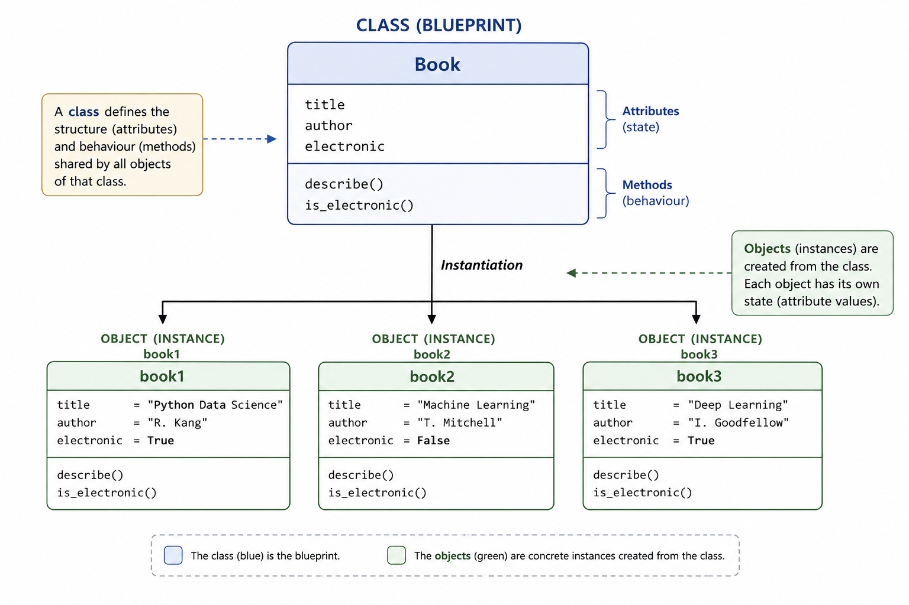

# Object-Oriented Programming

```{python}
import math
import numpy as np
```

Object-oriented programming (OOP) is a programming paradigm in which data and the operations associated with that data are organised into **objects**.

An object combines two broad components:

- **state**, represented by data stored in attributes;
- **behaviour**, represented by methods that operate on that state.

Rather than treating data and functions as completely separate entities, object-oriented programming allows related data and behaviour to be represented together.

In Python, OOP is particularly important because the language itself is strongly object-oriented. Integers, strings, lists, functions, DataFrames, fitted machine learning models, and many other structures encountered in scientific computing are objects.

For example:

```{python}
x = 10
text = "Python"
values = [1, 2, 3]

print(type(x))
print(type(text))
print(type(values))
```

Each object belongs to a particular **class**.

The class determines the general structure and behaviour available to objects of that type.

For example, a list provides methods such as:

```{python}
values.append(4)

values
```

The method `.append()` is behaviour defined by the `list` class and made available to list objects.

Object-oriented programming therefore provides a way to define new types of objects with their own:

- attributes;
- methods;
- validation rules;
- relationships with other objects.

# Classes and Objects

A **class** defines the structure and behaviour associated with a type of object.

An **object**, also called an **instance**, is a concrete object created from that class.

Conceptually:

$$
\text{class}
\longrightarrow
\text{instances}.
$$

{#fig-class-objects width=85%}

For example, suppose that an application needs to represent books.

A class named `Book` can define what information and behaviour should be associated with a book, while individual books are represented by instances of that class.

A minimal class can be defined using the `class` statement:

```{python}
class Book:
    pass
```

The class now exists as a new Python type:

```{python}
Book
```

An instance can be created by calling the class:

```{python}
book = Book()
```

Its type is:

```{python}
type(book)
```

The relationship is:

```{python}
isinstance(book, Book)
```

Thus:

```text
Book
    class

book
    instance of Book
```

A class should not be thought of merely as a container for variables and functions. It defines an abstraction representing a particular kind of object in the program.

# Attributes

Objects usually contain data describing their current state.

These values are stored in **attributes**.

There are two important kinds of attributes to distinguish:

- instance attributes;
- class attributes.

## Instance Attributes

An instance attribute belongs to a particular object.

For example, different books may have different titles and authors.

Instance attributes are commonly created during object initialisation.

```{python}
class Book:

    def __init__(self, title, author):
        self.title = title
        self.author = author
```

Two instances can now be created:

```{python}
book1 = Book(
    title="The Lord of the Rings",
    author="J.R.R. Tolkien"
)

book2 = Book(
    title="The Hobbit",
    author="J.R.R. Tolkien"
)
```

Their attributes can be accessed using dot notation:

```{python}
book1.title
```

```{python}
book2.title
```

Although both objects belong to the same class, each instance maintains its own state.

Conceptually:

```text
Book
├── book1
│   ├── title = "The Lord of the Rings"
│   └── author = "J.R.R. Tolkien"
│
└── book2
    ├── title = "The Hobbit"
    └── author = "J.R.R. Tolkien"
```

This distinction between the **definition of a type** and the **state of individual instances** is fundamental to object-oriented programming.

## Class Attributes

A class attribute belongs to the class itself and is shared conceptually by its instances unless shadowed at the instance level.

For example:

```{python}
class Book:

    category = "book"

    def __init__(self, title, author):
        self.title = title
        self.author = author
```

The class attribute can be accessed through the class:

```{python}
Book.category
```

and through an instance:

```{python}
book = Book(
    title="The Hobbit",
    author="J.R.R. Tolkien"
)

book.category
```

The distinction is:

```text
class attribute
    associated with the class

instance attribute
    associated with an individual instance
```

Class attributes are useful for information that logically belongs to the class as a whole rather than to one particular object.

# Object Initialisation

When an object is created, it often needs an initial state.

Python classes commonly define this state using the special method:

```python
__init__()
```

For example:

```{python}
class Book:

    def __init__(
        self,
        title,
        author,
        electronic=False
    ):
        self.title = title
        self.author = author
        self.electronic = electronic
```

An object can then be initialised as:

```{python}
book = Book(
    title="The Lord of the Rings",
    author="J.R.R. Tolkien"
)
```

Its attributes are:

```{python}
book.title
```

```{python}
book.author
```

```{python}
book.electronic
```

The call:

```python
Book(...)
```

creates an instance and causes its initialisation machinery to run. In ordinary class definitions, `__init__()` is then responsible for initialising the already created instance.

For this reason, although `__init__()` is often informally called a *constructor*, it is more precisely an **initialiser**.

The distinction is normally not important when simply using classes, but it provides a more accurate mental model of Python's object system.

# The `self` Parameter

The first parameter of an instance method conventionally has the name:

```python
self
```

`self` refers to the particular instance on which the method is operating.

Consider:

```{python}
class Book:

    def __init__(
        self,
        title,
        author
    ):
        self.title = title
        self.author = author
```

When:

```python
book = Book(
    "The Hobbit",
    "J.R.R. Tolkien"
)
```

is evaluated, the assignments:

```python
self.title = title
self.author = author
```

store the supplied values on that particular instance.

Thus:

```text
self.title
```

means:

> the `title` attribute belonging to this instance.

If another object is created:

```{python}
another_book = Book(
    "1984",
    "George Orwell"
)
```

then:

```{python}
book.title
```

and:

```{python}
another_book.title
```

refer to attributes stored on two different objects.

`self` is therefore what allows the same method definition to operate on different instances while accessing the state of the appropriate object.

# Default Attribute Values

Initialisation parameters can use default values in the same way as ordinary function parameters.

For example:

```{python}
class Book:

    def __init__(
        self,
        title,
        author="",
        electronic=False
    ):
        self.title = title
        self.author = author
        self.electronic = electronic
```

A book can now be created without explicitly specifying every attribute:

```{python}
book = Book(
    title="One Thousand and One Nights"
)

book.title
```

```{python}
book.author
```

```{python}
book.electronic
```

Defaults are useful when a value has a meaningful and predictable default state.

They should not be used merely to avoid specifying information that is logically required for a valid object.

# Inspecting Instance Attributes

For ordinary Python objects, instance attributes are commonly stored in an internal dictionary.

It can be inspected using:

```{python}
book.__dict__
```

For example:

```text
{
    "title": ...,
    "author": ...,
    "electronic": ...
}
```

This is useful for understanding how simple Python objects store their state.

However, application code should normally access attributes through the object's public interface rather than relying directly on `__dict__`.

Not every Python object necessarily exposes instance state in this exact form.

# Methods

Attributes represent object state.

**Methods** define behaviour associated with the object.

Suppose that a `Book` should provide a human-readable description.

```{python}
class Book:

    def __init__(
        self,
        title,
        author,
        electronic=False
    ):
        self.title = title
        self.author = author
        self.electronic = electronic

    def describe(self):
        return (
            f"{self.title} "
            f"by {self.author}"
        )
```

An instance can then call the method:

```{python}
book = Book(
    title="The Hobbit",
    author="J.R.R. Tolkien"
)

book.describe()
```

The method has access to the object's state through `self`.

For example:

```python
self.title
self.author
```

refer to attributes belonging to the instance that invoked the method.

## Methods that Modify State

Methods can also modify object state.

Consider:

```{python}
class Book:

    def __init__(
        self,
        title,
        author,
        available=True
    ):
        self.title = title
        self.author = author
        self.available = available

    def borrow(self):
        self.available = False

    def return_book(self):
        self.available = True
```

Create an object:

```{python}
book = Book(
    title="The Hobbit",
    author="J.R.R. Tolkien"
)

book.available
```

Borrowing the book changes its state:

```{python}
book.borrow()

book.available
```

Returning it changes the state again:

```{python}
book.return_book()

book.available
```

The object therefore combines:

```text
state
    title
    author
    available

behaviour
    borrow()
    return_book()
```

This combination of related state and behaviour is one of the central motivations for object-oriented design.

# Instance Methods

The methods considered above are **instance methods**.

An instance method:

- receives the instance as its first argument;
- conventionally names that argument `self`;
- can access instance attributes;
- can modify instance state;
- can call other instance methods.

For example:

```{python}
class Rectangle:

    def __init__(
        self,
        width,
        height
    ):
        self.width = width
        self.height = height

    def area(self):
        return (
            self.width
            * self.height
        )

    def perimeter(self):
        return (
            2
            * (
                self.width
                + self.height
            )
        )
```

Create an instance:

```{python}
rectangle = Rectangle(
    width=4,
    height=3
)
```

The methods operate on that particular rectangle:

```{python}
rectangle.area()
```

```{python}
rectangle.perimeter()
```

The same method definitions can be reused for another instance:

```{python}
another_rectangle = Rectangle(
    width=10,
    height=5
)

another_rectangle.area()
```

The code implementing `area()` does not need to know in advance which rectangle will use it.

The appropriate state is obtained through `self`.

# Methods with Additional Parameters

Instance methods can receive additional parameters beyond `self`.

For example:

```{python}
class BankAccount:

    def __init__(
        self,
        balance=0
    ):
        self.balance = balance

    def deposit(
        self,
        amount
    ):
        self.balance += amount
```

Create an account:

```{python}
account = BankAccount(
    balance=100
)
```

and deposit money:

```{python}
account.deposit(50)

account.balance
```

Here:

```text
self
```

identifies the account being modified, while:

```text
amount
```

provides information associated with the particular method call.

# Returning Values from Methods

Methods can return values exactly like ordinary functions.

For example:

```{python}
class BankAccount:

    def __init__(
        self,
        balance=0
    ):
        self.balance = balance

    def deposit(
        self,
        amount
    ):
        self.balance += amount

    def get_balance(self):
        return self.balance
```

Then:

```{python}
account = BankAccount(100)

account.deposit(50)

current_balance = account.get_balance()

current_balance
```

Whether a method should:

- return a value;
- modify state;
- or do both

depends on the semantics of the object and the operation being represented.

# Classes as Abstractions

The main purpose of a class is not merely to group functions under a common name.

A useful class represents a coherent abstraction.

For example:

```text
BankAccount
```

may reasonably contain:

```text
state
    balance

behaviour
    deposit()
    withdraw()
```

because the data and operations belong naturally to the same concept.

By contrast, creating a class only to collect unrelated utility functions often provides little benefit over ordinary functions or modules.

This leads to an important design principle:

> Use a class when state and behaviour form a meaningful object abstraction.

Object-oriented programming is therefore a design tool, not a requirement that every piece of Python code be expressed as a class.

# OOP in Data Science and Machine Learning

Object-oriented programming appears extensively in the Python machine learning ecosystem.

A typical estimator interface illustrates the pattern:

```python
model = SomeEstimator(
    parameter=value
)

model.fit(
    X_train,
    y_train
)

predictions = model.predict(
    X_test
)
```

Conceptually:

```text
class
    SomeEstimator

instance
    model

configuration/state
    parameters
    fitted quantities

behaviour
    fit()
    predict()
```

Before fitting, the object contains its configuration.

After fitting, the same object may also contain state learned from the training data.

This is one reason OOP is useful for machine learning systems: a model naturally combines:

- configuration;
- learned state;
- operations that depend on that state.

Similar patterns appear in:

- estimators;
- preprocessing transformers;
- pipelines;
- dataset abstractions;
- model wrappers;
- experiment components.

Understanding classes and objects therefore helps not only when writing custom Python classes, but also when reasoning about the interfaces of the libraries used throughout machine learning.

# Functions or Classes?

Not every task should be implemented using object-oriented programming.

Suppose a calculation depends only on its inputs:

```{python}
def mean_squared_error(
    y_true,
    y_pred
):
    return np.mean(
        (y_true - y_pred) ** 2
    )
```

There is no persistent state and no obvious object whose behaviour is being represented.

A function is therefore a natural abstraction.

By contrast, consider a fitted model that must preserve parameters learned from training data:

```text
model
├── configuration
├── fitted parameters
├── fit()
└── predict()
```

Here an object is a natural representation because state must persist between operations.

A useful rule of thumb is:

> Prefer a function when the operation is primarily a transformation of inputs into outputs. Consider a class when several operations belong to a coherent abstraction with persistent state.

The choice should follow the structure of the problem rather than a preference for one programming paradigm.

# Static Methods

An instance method operates on a particular instance and therefore receives `self`.

Sometimes, however, an operation is logically related to a class without requiring access to either:

- a particular instance;
- the class itself.

In this situation, Python provides **static methods**.

A static method is declared using the `@staticmethod` decorator.

Consider the `Rectangle` class:

```{python}
class Rectangle:

    def __init__(
        self,
        width,
        height
    ):
        self.width = width
        self.height = height

    def area(self):
        return (
            self.width
            * self.height
        )

    @staticmethod
    def have_same_size(
        rectangle1,
        rectangle2
    ):
        return (
            rectangle1.width
            == rectangle2.width
            and
            rectangle1.height
            == rectangle2.height
        )
```

Create two rectangles:

```{python}
rectangle1 = Rectangle(
    width=7,
    height=5
)

rectangle2 = Rectangle(
    width=7,
    height=5
)
```

The static method can be called through the class:

```{python}
Rectangle.have_same_size(
    rectangle1,
    rectangle2
)
```

Unlike an instance method, the static method does not receive:

```python
self
```

automatically.

It also does not receive the class itself.

Conceptually:

```text
instance method
    receives self
    operates naturally on instance state

static method
    receives neither self nor cls
    represents a utility logically associated with the class
```

The method could technically have been written as an ordinary function outside the class.

The reason for placing it inside `Rectangle` is organisational: comparing the dimensions of two rectangles is conceptually related to rectangles.

This leads to an important design question:

> Does this operation genuinely belong to the abstraction represented by the class?

If not, an ordinary function may be clearer.

# Class Methods

A **class method** receives the class itself rather than a particular instance.

It is declared using the `@classmethod` decorator.

By convention, its first parameter is named:

```python
cls
```

For example:

```{python}
class Rectangle:

    def __init__(
        self,
        width,
        height
    ):
        self.width = width
        self.height = height

    @classmethod
    def square(
        cls,
        side
    ):
        return cls(
            width=side,
            height=side
        )
```

The method can be called through the class:

```{python}
square = Rectangle.square(5)

square.width
```

```{python}
square.height
```

The important expression is:

```python
cls(...)
```

Rather than explicitly writing:

```python
Rectangle(...)
```

the method creates an instance of whichever class is represented by `cls`.

Class methods are therefore particularly useful as **alternative constructors**.

## Alternative Constructors

Suppose rectangle dimensions are supplied as a string:

```text
"10x5"
```

A class method can convert this external representation into a `Rectangle`.

```{python}
class Rectangle:

    def __init__(
        self,
        width,
        height
    ):
        self.width = width
        self.height = height

    @classmethod
    def from_string(
        cls,
        dimensions
    ):
        width, height = dimensions.split("x")

        return cls(
            width=float(width),
            height=float(height)
        )
```

The alternative constructor can then be used as:

```{python}
rectangle = Rectangle.from_string(
    "10x5"
)

rectangle.width
```

```{python}
rectangle.height
```

The ordinary constructor:

```python
Rectangle(...)
```

and the alternative constructor:

```python
Rectangle.from_string(...)
```

create the same kind of object from different input representations.

This pattern appears frequently in Python libraries.

## Instance, Static, and Class Methods

The three method types can now be compared directly.

| Method type | First implicit argument | Typical purpose |
|---|---|---|
| Instance method | `self` | Operate on instance state |
| Class method | `cls` | Operate on the class or construct instances |
| Static method | None | Class-related utility independent of instance and class state |

The distinction is primarily about **which context the method requires**.

If an operation requires the state of a particular object, it should normally be an instance method.

If it requires the class itself, a class method may be appropriate.

If it requires neither but logically belongs to the class abstraction, a static method may be appropriate.

# Properties

Attributes can normally be accessed directly:

```python
rectangle.width
```

Sometimes, however, a value should behave like an attribute while being computed dynamically.

Python provides the `@property` decorator for this purpose.

Consider:

```{python}
class Rectangle:

    def __init__(
        self,
        width,
        height
    ):
        self.width = width
        self.height = height

    @property
    def area(self):
        return (
            self.width
            * self.height
        )
```

Create a rectangle:

```{python}
rectangle = Rectangle(
    width=4,
    height=3
)
```

The area is accessed as:

```{python}
rectangle.area
```

rather than:

```python
rectangle.area()
```

Although `area` is implemented through a method, it behaves externally like an attribute.

The value is calculated whenever it is accessed.

If the width changes:

```{python}
rectangle.width = 10

rectangle.area
```

the property reflects the new state automatically.

## Computed Attributes

Properties are particularly natural for quantities derived entirely from existing object state.

For example:

```{python}
class Circle:

    def __init__(
        self,
        radius
    ):
        self.radius = radius

    @property
    def diameter(self):
        return 2 * self.radius

    @property
    def circumference(self):
        return (
            2
            * np.pi
            * self.radius
        )

    @property
    def area(self):
        return (
            np.pi
            * self.radius ** 2
        )
```

Create a circle:

```{python}
circle = Circle(
    radius=3
)
```

The derived quantities are accessed naturally:

```{python}
circle.diameter
```

```{python}
circle.circumference
```

```{python}
circle.area
```

These values do not need to be stored separately.

They are functions of:

```python
circle.radius
```

Storing them independently could create inconsistent state.

For example, if both `radius` and `area` were stored independently, changing the radius would require remembering to update the area.

A computed property avoids that duplication.

# Controlled Attribute Access

Properties can also control how an attribute is read or modified.

Suppose a rectangle should never have a non-positive width.

One possible implementation is:

```{python}
class Rectangle:

    def __init__(
        self,
        width,
        height
    ):
        self.width = width
        self.height = height

    @property
    def width(self):
        return self._width

    @width.setter
    def width(
        self,
        value
    ):
        if value <= 0:
            raise ValueError(
                "Width must be positive."
            )

        self._width = value
```

Now:

```{python}
rectangle = Rectangle(
    width=4,
    height=3
)

rectangle.width
```

The assignment:

```python
self.width = width
```

inside `__init__()` invokes the property setter.

A valid update works normally:

```{python}
rectangle.width = 10

rectangle.width
```

An invalid update raises an exception:

```{python}
try:
    rectangle.width = -5
except ValueError as error:
    print(error)
```

The external interface remains:

```python
rectangle.width
```

even though access is now controlled internally.

# Public and Non-Public Attributes

Some object-oriented languages enforce access modifiers such as:

```text
public
private
protected
```

Python generally follows a different philosophy.

Access restrictions are largely communicated through **naming conventions** rather than strictly enforced by the language.

An attribute such as:

```python
self.width
```

is treated as part of the public interface.

An attribute beginning with a single underscore:

```python
self._width
```

conventionally means:

> This attribute is intended for internal use.

For example:

```{python}
class Temperature:

    def __init__(
        self,
        celsius
    ):
        self._celsius = celsius

    @property
    def celsius(self):
        return self._celsius
```

The underscore does not make `_celsius` inaccessible.

Python still allows:

```python
temperature._celsius
```

The underscore communicates an interface convention rather than creating strict privacy.

This is consistent with a broader Python principle:

> Encapsulation is primarily about designing a clear interface, not about making internal state impossible to access.

# Encapsulation

**Encapsulation** refers to keeping related state and behaviour together while exposing a controlled interface to the rest of the program.

Consider a bank account:

```{python}
class BankAccount:

    def __init__(
        self,
        initial_balance=0
    ):
        if initial_balance < 0:
            raise ValueError(
                "Initial balance cannot be negative."
            )

        self._balance = initial_balance

    @property
    def balance(self):
        return self._balance

    def deposit(
        self,
        amount
    ):
        if amount <= 0:
            raise ValueError(
                "Deposit must be positive."
            )

        self._balance += amount

    def withdraw(
        self,
        amount
    ):
        if amount <= 0:
            raise ValueError(
                "Withdrawal must be positive."
            )

        if amount > self._balance:
            raise ValueError(
                "Insufficient funds."
            )

        self._balance -= amount
```

Create an account:

```{python}
account = BankAccount(
    initial_balance=100
)
```

The balance can be inspected:

```{python}
account.balance
```

and modified through meaningful operations:

```{python}
account.deposit(50)

account.balance
```

```{python}
account.withdraw(30)

account.balance
```

The class controls the rules governing valid state transitions.

The important idea is not merely that `_balance` begins with an underscore.

The important idea is that the object provides an interface:

```text
balance
deposit()
withdraw()
```

through which its state can be used consistently.

# Special Methods

Python classes can define methods with names surrounded by double underscores:

```text
__init__()
__str__()
__repr__()
__len__()
...
```

These are commonly called **special methods** or **dunder methods**.

They allow user-defined classes to participate in Python's standard syntax and built-in operations.

For example:

```python
print(object)
```

can invoke:

```python
object.__str__()
```

while:

```python
len(object)
```

can invoke:

```python
object.__len__()
```

Special methods are therefore part of Python's **data model**.

Rather than inventing a completely separate interface for custom objects, classes can integrate with ordinary Python syntax.

# String Representation with `__str__()`

Without a custom string representation:

```{python}
class Rectangle:

    def __init__(
        self,
        width,
        height
    ):
        self.width = width
        self.height = height
```

printing an instance produces a default representation:

```{python}
rectangle = Rectangle(
    width=4,
    height=3
)

print(rectangle)
```

A more useful representation can be defined using:

```python
__str__()
```

For example:

```{python}
class Rectangle:

    def __init__(
        self,
        width,
        height
    ):
        self.width = width
        self.height = height

    def __str__(self):
        return (
            f"Rectangle("
            f"width={self.width}, "
            f"height={self.height}"
            f")"
        )
```

Now:

```{python}
rectangle = Rectangle(
    width=4,
    height=3
)

print(rectangle)
```

produces a representation designed specifically for human-readable output.

The method:

```python
__str__()
```

should return a string.

It should not itself print the string.

# `__repr__()` and `__str__()`

Python also provides:

```python
__repr__()
```

for an object's representation.

The conceptual distinction is:

```text
__str__()
    readable representation for users

__repr__()
    informative representation for developers
```

For example:

```{python}
class Rectangle:

    def __init__(
        self,
        width,
        height
    ):
        self.width = width
        self.height = height

    def __repr__(self):
        return (
            f"Rectangle("
            f"width={self.width!r}, "
            f"height={self.height!r}"
            f")"
        )

    def __str__(self):
        return (
            f"{self.width} × "
            f"{self.height} rectangle"
        )
```

Create an object:

```{python}
rectangle = Rectangle(
    width=4,
    height=3
)
```

Calling:

```{python}
repr(rectangle)
```

uses `__repr__()`.

Calling:

```{python}
str(rectangle)
```

uses `__str__()`.

And:

```{python}
print(rectangle)
```

uses the human-readable string representation.

A useful `__repr__()` should make the object's identity and important state easy to inspect during development.

# Equality and Object Identity

Two objects can contain the same state without being the same object.

Consider:

```{python}
rectangle1 = Rectangle(
    width=4,
    height=3
)

rectangle2 = Rectangle(
    width=4,
    height=3
)
```

They are separate instances:

```{python}
rectangle1 is rectangle2
```

The operator:

```python
is
```

tests **object identity**.

It asks whether two references point to the same object.

By contrast:

```python
==
```

tests equality according to the semantics defined for the class.

Without a custom equality implementation, user-defined objects generally compare according to their inherited default behaviour.

# Defining Equality with `__eq__()`

A class can define its own equality semantics using:

```python
__eq__()
```

For example:

```{python}
class Rectangle:

    def __init__(
        self,
        width,
        height
    ):
        self.width = width
        self.height = height

    def __eq__(
        self,
        other
    ):
        if not isinstance(
            other,
            Rectangle
        ):
            return NotImplemented

        return (
            self.width == other.width
            and
            self.height == other.height
        )
```

Create two separate objects:

```{python}
rectangle1 = Rectangle(
    width=4,
    height=3
)

rectangle2 = Rectangle(
    width=4,
    height=3
)
```

They do not have the same identity:

```{python}
rectangle1 is rectangle2
```

but they now have equal values according to the semantics of the class:

```{python}
rectangle1 == rectangle2
```

This distinction is fundamental:

```text
identity
    Are these references to the same object?

equality
    Should these objects be considered equivalent?
```

# Other Special Methods

Python provides many additional special methods.

For example, a collection-like object may implement:

```python
__len__()
```

A numerical object may implement operators such as:

```python
__add__()
__sub__()
__mul__()
```

A container may implement:

```python
__getitem__()
```

These methods allow custom objects to participate naturally in Python expressions.

For example, if a class implements:

```python
__len__()
```

then:

```python
len(obj)
```

can be used.

If it implements:

```python
__add__()
```

then:

```python
obj1 + obj2
```

can acquire a class-specific meaning.

The general pattern is:

```text
Python syntax
        ↓
special method
        ↓
class-defined behaviour
```

This is one of the mechanisms through which Python achieves polymorphic behaviour across different types.

# A Note on `__del__()`

Python also provides the special method:

```python
__del__()
```

which may be called when an object is being finalised.

For example:

```python
class Example:

    def __del__(self):
        print(
            "Object is being finalised."
        )
```

However, `__del__()` should not generally be understood as an ordinary destructor that must be explicitly implemented for each class.

Similarly:

```python
del object_name
```

deletes a reference bound to that name; it does not necessarily imply that the underlying object is immediately destroyed.

Object lifetime depends on Python's memory-management mechanisms and on whether other references to the object still exist.

For this reason, `__del__()` is rarely necessary in ordinary data science or machine learning code.

Resources that require deterministic cleanup are usually better handled through mechanisms designed explicitly for that purpose, such as context managers.

The practical lesson is therefore:

> Know that `__del__()` exists, but do not rely on it as the standard mechanism for managing object lifetime or external resources.

# Designing a Small Class

The concepts considered so far can be combined into a more complete example.

Suppose that a dataset object should store:

- a name;
- a feature matrix;
- a target vector.

It should also provide information about the number of observations and features.

```{python}
class Dataset:

    def __init__(
        self,
        name,
        X,
        y
    ):
        if len(X) != len(y):
            raise ValueError(
                "X and y must contain "
                "the same number of observations."
            )

        self.name = name
        self.X = X
        self.y = y

    @property
    def n_samples(self):
        return len(self.X)

    @property
    def n_features(self):
        return self.X.shape[1]

    def __repr__(self):
        return (
            f"Dataset("
            f"name={self.name!r}, "
            f"n_samples={self.n_samples}, "
            f"n_features={self.n_features}"
            f")"
        )
```

Create some data:

```{python}
X = np.array([
    [1.2, 3.4],
    [2.1, 1.8],
    [3.5, 2.7]
])

y = np.array([
    0,
    1,
    0
])
```

and construct the object:

```{python}
dataset = Dataset(
    name="example",
    X=X,
    y=y
)

dataset
```

Its computed properties are:

```{python}
dataset.n_samples
```

```{python}
dataset.n_features
```

This class combines several OOP concepts:

```text
Dataset
│
├── instance state
│   ├── name
│   ├── X
│   └── y
│
├── validation
│   └── compatible sample counts
│
├── computed properties
│   ├── n_samples
│   └── n_features
│
└── representation
    └── __repr__()
```

The class provides a useful abstraction because the state and the operations describing that state belong naturally together.

# OOP and Interface Design

An important consequence of encapsulation is that code using an object should ideally depend on its **public interface** rather than on unnecessary details of its internal implementation.

For the `Dataset` class, external code can rely on:

```python
dataset.name
dataset.X
dataset.y
dataset.n_samples
dataset.n_features
```

without needing to know exactly how every derived value is calculated internally.

This separation becomes increasingly important as software grows.

A class can change its internal implementation while preserving the same external interface.

In machine learning libraries, this is one reason users can interact with models through stable operations such as:

```python
fit()
predict()
transform()
```

without needing to understand the internal implementation of every estimator.

A well-designed class therefore does more than group code.

It defines a **contract** between the object and the code that uses it.

# Inheritance

**Inheritance** allows a class to reuse and extend the behaviour of another class.

The existing class is commonly called the **parent class**, **base class**, or **superclass**.

The new class is commonly called the **child class**, **derived class**, or **subclass**.

Conceptually:

```text
parent class
    ↓
child class
```

The child class can inherit:

- attributes;
- methods;
- properties;
- other behaviour defined by the parent.

Inheritance is useful when several classes represent related concepts that share common structure or behaviour.

Consider two classes representing children and adults.

Without inheritance, we might write:

```python
class Child:

    def __init__(
        self,
        name,
        age
    ):
        self.name = name
        self.age = age
        self.is_adult = False


class Adult:

    def __init__(
        self,
        name,
        age
    ):
        self.name = name
        self.age = age
        self.is_adult = True
```

The classes contain considerable duplicated code.

Both objects have:

```text
name
age
```

and differ mainly in the value of:

```text
is_adult
```

A more general abstraction is a `Person` class.

```{python}
class Person:

    def __init__(
        self,
        name,
        age
    ):
        self.name = name
        self.age = age

    def introduce(self):
        return (
            f"My name is {self.name} "
            f"and I am {self.age} years old."
        )
```

The more specialised classes can inherit from `Person`.

```{python}
class Child(Person):

    is_adult = False


class Adult(Person):

    is_adult = True
```

Create instances:

```{python}
child = Child(
    name="Alice",
    age=12
)

adult = Adult(
    name="David",
    age=35
)
```

Both inherited the initialisation logic:

```{python}
child.name
```

```{python}
adult.name
```

and the method:

```{python}
child.introduce()
```

```{python}
adult.introduce()
```

The subclasses extend the common `Person` abstraction with more specific meaning.

# Single Inheritance

When a class inherits from one parent class, the relationship is called **single inheritance**.

The syntax is:

```python
class ChildClass(ParentClass):
    ...
```

For example:

```{python}
class Person:

    def __init__(
        self,
        name,
        age
    ):
        self.name = name
        self.age = age


class Employee(Person):

    def work(self):
        return (
            f"{self.name} is working."
        )
```

Create an employee:

```{python}
employee = Employee(
    name="Alice",
    age=30
)
```

The subclass has access to inherited state:

```{python}
employee.name
```

and its own additional behaviour:

```{python}
employee.work()
```

The relationship can be described as:

```text
Person
    ↓
Employee
```

An `Employee` **is a** `Person` with additional specialised behaviour.

This "`is-a`" interpretation is useful when evaluating whether inheritance is conceptually appropriate.

# Inheritance Chains

A subclass can itself become the parent of another class.

For example:

```{python}
class Person:
    ...


class Child(Person):
    ...


class Teenager(Child):
    ...
```

The relationship becomes:

```text
Person
    ↓
Child
    ↓
Teenager
```

A `Teenager` inherits behaviour from both:

```text
Child
Person
```

through the inheritance hierarchy.

Inheritance can therefore build progressively more specialised abstractions.

However, deep inheritance hierarchies can become difficult to reason about.

Inheritance should generally be used to represent meaningful conceptual relationships rather than simply to avoid writing a few repeated lines of code.

# Extending a Parent Class

A subclass can add new attributes and methods while preserving inherited behaviour.

Consider:

```{python}
class Person:

    def __init__(
        self,
        name,
        age
    ):
        self.name = name
        self.age = age


class Employee(Person):

    def __init__(
        self,
        name,
        age,
        employee_id
    ):
        self.name = name
        self.age = age
        self.employee_id = employee_id
```

This works, but the assignments:

```python
self.name = name
self.age = age
```

duplicate logic already present in the parent class.

Python provides `super()` to avoid this duplication.

# `super()`

`super()` provides access to the next implementation in the method resolution order, which in ordinary single inheritance corresponds naturally to the parent-class implementation.

The previous subclass can be written as:

```{python}
class Person:

    def __init__(
        self,
        name,
        age
    ):
        self.name = name
        self.age = age


class Employee(Person):

    def __init__(
        self,
        name,
        age,
        employee_id
    ):
        super().__init__(
            name=name,
            age=age
        )

        self.employee_id = employee_id
```

Create an employee:

```{python}
employee = Employee(
    name="Alice",
    age=30,
    employee_id="E001"
)
```

The call:

```python
super().__init__(
    name=name,
    age=age
)
```

reuses the initialisation logic already defined by `Person`.

The subclass then adds only its specialised state:

```python
self.employee_id
```

This makes the relationship between the two implementations explicit.

# Method Overriding

A subclass can provide a new implementation of a method already defined by its parent class.

This is called **method overriding**.

Consider:

```{python}
class Person:

    def introduce(self):
        return "I am a person."


class Employee(Person):

    def introduce(self):
        return "I am an employee."
```

Create instances:

```{python}
person = Person()
employee = Employee()
```

Calling:

```{python}
person.introduce()
```

uses the implementation in `Person`.

Calling:

```{python}
employee.introduce()
```

uses the implementation in `Employee`.

The subclass has overridden the inherited behaviour.

Conceptually:

```text
Person.introduce()
        ↓ overridden by
Employee.introduce()
```

The interface remains the same:

```python
introduce()
```

but the behaviour depends on the object's class.

# Extending an Overridden Method

Overriding does not always mean replacing the parent implementation completely.

A subclass can reuse the inherited behaviour and extend it.

Consider:

```{python}
class Person:

    def __init__(
        self,
        name
    ):
        self.name = name

    def introduce(self):
        return (
            f"My name is {self.name}."
        )
```

A specialised subclass might add more information:

```{python}
class Employee(Person):

    def __init__(
        self,
        name,
        role
    ):
        super().__init__(name)

        self.role = role

    def introduce(self):
        base_introduction = (
            super().introduce()
        )

        return (
            f"{base_introduction} "
            f"I work as a {self.role}."
        )
```

Create an employee:

```{python}
employee = Employee(
    name="Alice",
    role="Data Scientist"
)

employee.introduce()
```

The child method extends rather than duplicates the parent method.

This is one of the main practical uses of `super()`.

# Polymorphism

**Polymorphism** means that the same interface can be used with objects of different types, while the behaviour depends on the object involved.

Python already provides many familiar examples.

For instance:

```{python}
len("Python")
```

and:

```{python}
len([1, 2, 3, 4])
```

use the same function:

```python
len()
```

with different object types.

The objects respond according to the behaviour defined by their respective classes.

## Polymorphism through Methods

Consider:

```{python}
class Person:

    def introduce(self):
        return "I am a person."


class Employee(Person):

    def introduce(self):
        return "I am an employee."


class Student(Person):

    def introduce(self):
        return "I am a student."
```

Create several objects:

```{python}
objects = [
    Person(),
    Employee(),
    Student()
]
```

The same method call can be applied to each object:

```{python}
for obj in objects:
    print(
        obj.introduce()
    )
```

The expression:

```python
obj.introduce()
```

has the same syntactic form each time.

The object's class determines the behaviour.

This is polymorphism.

# Duck Typing

Python often relies on a broader form of polymorphism sometimes described as **duck typing**.

The central idea is:

> Code often cares more about whether an object supports the required behaviour than about whether it belongs to one particular class hierarchy.

Consider:

```{python}
class Dog:

    def speak(self):
        return "Woof"


class Person:

    def speak(self):
        return "Hello"
```

The classes are unrelated by inheritance.

Nevertheless:

```{python}
def make_speak(obj):
    return obj.speak()
```

works with both:

```{python}
make_speak(
    Dog()
)
```

```{python}
make_speak(
    Person()
)
```

The function requires only that the object provide:

```python
.speak()
```

This is an important characteristic of Python's object model.

Polymorphism does not require every object to inherit from the same explicitly declared parent class.

# Polymorphism in Machine Learning APIs

Machine learning libraries make extensive use of common interfaces.

For example, several different estimators may support:

```python
model.fit(
    X_train,
    y_train
)

model.predict(
    X_test
)
```

The internal algorithms can differ substantially:

```text
linear regression
random forest
gradient boosting
neural model
...
```

yet client code can interact with them through a shared conceptual interface.

This makes code such as:

```python
for model in models:
    model.fit(
        X_train,
        y_train
    )

    predictions = model.predict(
        X_test
    )
```

possible.

The value is not merely shorter syntax.

A stable interface allows code to depend on **behaviour** rather than on implementation details.

# Multiple Inheritance

Python also allows a class to inherit from more than one parent class.

This is called **multiple inheritance**.

The syntax is:

```python
class Child(
    ParentA,
    ParentB
):
    ...
```

For example:

```{python}
class Employee:

    def work(self):
        return "Working"


class Calendar:

    def show_schedule(self):
        return "Showing schedule"


class BusinessPerson(
    Employee,
    Calendar
):
    pass
```

Create an instance:

```{python}
person = BusinessPerson()
```

The object has access to behaviour inherited from both classes:

```{python}
person.work()
```

```{python}
person.show_schedule()
```

Conceptually:

```text
Employee ─────┐
              ├── BusinessPerson
Calendar ─────┘
```

Multiple inheritance can be useful when a class genuinely combines several independent behaviours.

However, it introduces additional complexity when parent classes define methods with the same name.

# Method Resolution Order

Consider:

```{python}
class A:

    def identify(self):
        return "A"


class B:

    def identify(self):
        return "B"


class C(
    A,
    B
):
    pass
```

Calling:

```{python}
C().identify()
```

requires Python to decide which implementation should be used.

Python resolves such situations according to the **method resolution order**, or **MRO**.

The MRO can be inspected using:

```{python}
C.mro()
```

or:

```{python}
C.__mro__
```

For this example, the sequence begins conceptually as:

```text
C
A
B
object
```

Therefore:

```python
C().identify()
```

uses the implementation from `A`.

The rule should not be reduced simply to:

> Python always chooses the first parent written in the class definition.

That description works for some simple cases but does not capture Python's complete inheritance algorithm.

The more precise statement is:

> Python searches classes according to the method resolution order.

This becomes particularly important in more complex multiple-inheritance hierarchies.

# `super()` and the MRO

The behaviour of `super()` is also defined in relation to the MRO.

Consider:

```{python}
class A:

    def identify(self):
        return "A"


class B(A):

    def identify(self):
        return (
            "B -> "
            + super().identify()
        )
```

Calling:

```{python}
B().identify()
```

moves from:

```text
B
```

to the next class in the MRO:

```text
A
```

In multiple inheritance, the same principle applies.

`super()` does not literally mean:

> Call my parent.

A more accurate mental model is:

> Continue method lookup from the next class in the current MRO.

For ordinary single inheritance the two interpretations usually produce the same practical result, but the second is more general and accurate.

# Cooperative Multiple Inheritance

Multiple inheritance becomes substantially easier to manage when classes cooperate through `super()`.

Consider:

```{python}
class A:

    def process(self):
        return ["A"]


class B(A):

    def process(self):
        result = super().process()
        result.append("B")
        return result


class C(B):

    def process(self):
        result = super().process()
        result.append("C")
        return result
```

Calling:

```{python}
C().process()
```

follows the MRO and allows each implementation to contribute to the final behaviour.

This pattern is sometimes called **cooperative inheritance**.

It becomes especially relevant in frameworks that use mixins or multiple inheritance deliberately.

For introductory analytical code, however, simple inheritance structures are usually easier to maintain.

# Inheritance from Built-In Classes

Python also allows user-defined classes to inherit from built-in types.

For example:

```{python}
class PositiveInt(int):

    def __new__(
        cls,
        value
    ):
        if value <= 0:
            raise ValueError(
                "Value must be positive."
            )

        return super().__new__(
            cls,
            value
        )
```

Create a value:

```{python}
value = PositiveInt(5)
```

It behaves like an integer:

```{python}
value + 10
```

and is also an instance of the custom class:

```{python}
isinstance(
    value,
    PositiveInt
)
```

Subclassing built-in immutable types sometimes requires working with `__new__()` rather than only `__init__()`, because object creation and initialisation are separate stages.

This is a more advanced example, but it reinforces an earlier point: `__init__()` initialises an object; it does not perform every aspect of object creation.

# When Inheritance Is Appropriate

Inheritance is useful when the child class represents a genuine specialisation of the parent.

For example:

```text
Person
    ↓
Employee
```

can be interpreted naturally as:

> An Employee is a Person.

Similarly:

```text
RegularPolygon
    ↓
Square
```

can be interpreted as:

> A Square is a RegularPolygon.

Inheritance becomes less convincing when the relationship cannot naturally be described as "`is-a`".

For example:

```text
Car
Engine
```

A car is not an engine.

Instead:

> A car has an engine.

This type of relationship is usually better represented using **composition**.

# Composition

Composition constructs an object from other objects rather than inheriting their behaviour.

Consider:

```{python}
class Engine:

    def start(self):
        return "Engine started"


class Car:

    def __init__(
        self,
        engine
    ):
        self.engine = engine

    def start(self):
        return self.engine.start()
```

Create the component:

```{python}
engine = Engine()
```

and inject it into the composed object:

```{python}
car = Car(
    engine=engine
)
```

The car delegates engine-related behaviour:

```{python}
car.start()
```

The relationship is:

```text
Car
    has an
Engine
```

rather than:

```text
Car
    is an
Engine
```

## Composition versus Inheritance

A useful distinction is:

```text
inheritance
    "is-a"

composition
    "has-a"
```

Inheritance shares behaviour through a type hierarchy.

Composition assembles behaviour from collaborating objects.

Composition often provides greater flexibility because a component can be replaced without changing the outer object's inheritance hierarchy.

For example:

```{python}
class ElectricEngine:

    def start(self):
        return "Electric motor started"
```

The same `Car` class can now use:

```{python}
electric_car = Car(
    engine=ElectricEngine()
)

electric_car.start()
```

The `Car` class does not need to inherit from every possible engine implementation.

# Composition in Machine Learning Systems

Composition appears naturally in machine learning workflows.

A pipeline may conceptually contain:

```text
Pipeline
│
├── preprocessing component
├── feature-selection component
└── estimator component
```

The pipeline **has** these components.

It is not necessarily useful to model the relationship as:

```text
Pipeline is a Scaler
Pipeline is a Classifier
```

Composition makes the architecture clearer.

For example, conceptually:

```python
pipeline = Pipeline(
    transformer=transformer,
    estimator=model
)
```

The outer object coordinates several specialised objects.

This pattern is often more maintainable than constructing a deep inheritance hierarchy.

# Prefer Composition or Inheritance?

Neither technique is universally superior.

Inheritance can be useful when:

- the subclass is genuinely a specialised form of the parent;
- the parent defines a stable interface;
- substituting the subclass where the parent is expected makes conceptual sense.

Composition can be useful when:

- an object contains or coordinates another object;
- behaviour should be replaceable independently;
- several components collaborate;
- inheritance would create artificial relationships.

A useful design question is:

> Is this object a specialised version of another object, or does it contain another object as one of its components?

The answer often suggests the appropriate design.

# Dataclasses

The classes written so far define `__init__()` manually.

For classes whose primary role is to hold structured data, Python provides the `dataclasses` module.

The `@dataclass` decorator can generate common methods automatically.

For example:

```{python}
from dataclasses import dataclass
```

Define:

```{python}
@dataclass
class Observation:

    feature1: float
    feature2: float
    target: int
```

An object can be constructed naturally:

```{python}
observation = Observation(
    feature1=1.2,
    feature2=3.4,
    target=1
)

observation
```

The decorator automatically creates an appropriate `__init__()`.

It also provides a useful representation:

```{python}
print(observation)
```

and value-based equality:

```{python}
observation1 = Observation(
    1.2,
    3.4,
    1
)

observation2 = Observation(
    1.2,
    3.4,
    1
)

observation1 == observation2
```

Without a custom implementation, ordinary classes would not automatically provide this field-based equality behaviour.

# Default Values in Dataclasses

Fields can have defaults:

```{python}
@dataclass
class Experiment:

    name: str
    random_state: int = 42
    verbose: bool = False
```

Create an object:

```{python}
experiment = Experiment(
    name="baseline"
)

experiment
```

The generated interface is similar to writing an ordinary class manually, but with substantially less boilerplate.

# Dataclasses Are Still Classes

A dataclass can contain methods:

```{python}
@dataclass
class Point2D:

    x: float
    y: float

    @property
    def norm(self):
        return np.sqrt(
            self.x ** 2
            + self.y ** 2
        )
```

Create:

```{python}
point = Point2D(
    x=3,
    y=4
)

point.norm
```

The `@dataclass` decorator does not create a different programming paradigm.

It automates common class machinery for data-oriented objects.

# When to Use a Dataclass

A dataclass is particularly useful when a class primarily represents structured state.

Examples might include:

```text
ModelConfiguration
ExperimentResult
Observation
HyperparameterSet
TrainingMetadata
```

For example:

```{python}
@dataclass
class ModelResult:

    model_name: str
    rmse: float
    training_time: float
```

Then:

```{python}
result = ModelResult(
    model_name="Random Forest",
    rmse=3.8,
    training_time=12.4
)

result
```

This is often clearer than manually writing:

```python
__init__()
__repr__()
__eq__()
```

when those methods would simply operate mechanically on stored fields.

# OOP as a Design Choice

The concepts introduced in this chapter should not lead to the conclusion that more classes automatically produce better Python code.

Consider three possible abstractions:

```text
function
class
dataclass
```

Each serves a different purpose.

A **function** is often appropriate when:

```text
inputs
    ↓
transformation
    ↓
output
```

with little or no persistent state.

A **class** becomes useful when:

```text
state
+
behaviour
+
lifecycle
```

form a coherent abstraction.

A **dataclass** becomes useful when:

```text
structured state
```

is the dominant concern and common object machinery would otherwise be repetitive.

The important skill is therefore not merely knowing how to define classes.

It is recognising when object-oriented structure improves the representation of the problem.

# OOP in a Machine Learning Workflow

Consider a simple transformer that learns a mean and standard deviation from training data.

```{python}
class Standardizer:

    def __init__(self):
        self.mean_ = None
        self.std_ = None

    def fit(
        self,
        X
    ):
        self.mean_ = np.mean(
            X,
            axis=0
        )

        self.std_ = np.std(
            X,
            axis=0
        )

        return self

    def transform(
        self,
        X
    ):
        if (
            self.mean_ is None
            or self.std_ is None
        ):
            raise RuntimeError(
                "The transformer must be fitted "
                "before calling transform()."
            )

        return (
            X - self.mean_
        ) / self.std_

    def fit_transform(
        self,
        X
    ):
        return (
            self
            .fit(X)
            .transform(X)
        )
```

The object has two distinct states.

Before fitting:

```text
mean_ = None
std_ = None
```

After fitting:

```text
mean_ = learned feature means
std_ = learned feature standard deviations
```

Create some data:

```{python}
X = np.array([
    [1.0, 10.0],
    [2.0, 20.0],
    [3.0, 30.0],
    [4.0, 40.0]
])
```

Fit the transformer:

```{python}
standardizer = Standardizer()

standardizer.fit(X)
```

Inspect the learned state:

```{python}
standardizer.mean_
```

```{python}
standardizer.std_
```

Transform the observations:

```{python}
X_standardized = (
    standardizer.transform(X)
)

X_standardized
```

This example demonstrates why OOP is natural for many machine learning components.

The object must preserve information learned during one operation:

```python
fit()
```

so that the same information can be used later by:

```python
transform()
```

A stateless function alone would need the learned quantities to be passed around separately.

The object packages:

```text
configuration
learned state
behaviour
```

into one coherent abstraction.

# Learned Attributes

Machine learning libraries often distinguish parameters supplied before fitting from quantities learned during fitting.

A common naming convention, used for example throughout estimator-style APIs, is to append an underscore to learned attributes:

```text
mean_
std_
coef_
classes_
```

Conceptually:

```text
before fit()
    configuration exists

after fit()
    learned state also exists
```

This makes the lifecycle of a fitted object easier to reason about.

The broader OOP principle is that an object's valid behaviour can depend on its current state.

# Interface Consistency

Suppose several transformers implement:

```python
fit()
transform()
```

and several estimators implement:

```python
fit()
predict()
```

Higher-level code can work with these objects without knowing every implementation detail.

For example:

```python
def train_and_predict(
    model,
    X_train,
    y_train,
    X_test
):
    model.fit(
        X_train,
        y_train
    )

    return model.predict(
        X_test
    )
```

The function depends on the expected **interface**:

```text
fit()
predict()
```

rather than on one exact class.

This combines several concepts considered in this chapter:

- abstraction;
- encapsulation;
- polymorphism;
- object state;
- interface design.

# Inheritance versus Interface

A useful final distinction is that two objects do not necessarily need to share a parent class in order to expose a compatible interface.

For example:

```python
model_a.fit(...)
model_a.predict(...)

model_b.fit(...)
model_b.predict(...)
```

may be usable through the same higher-level code even if their internal implementations are unrelated.

This is especially natural in Python because of duck typing.

Therefore:

> Shared behaviour does not automatically imply that a shared inheritance hierarchy is required.

Sometimes inheritance is the correct representation.

Sometimes composition is clearer.

Sometimes independently implemented classes with a compatible interface are sufficient.

Good object-oriented design depends on choosing the simplest structure that accurately represents the relationships in the problem.

# Problems

The following problems review the main object-oriented programming concepts introduced in this chapter. They begin with class construction and instance state, then progress through methods, properties, class and static methods, inheritance, polymorphism, composition, and object-oriented patterns used in machine learning.

## Problem 1 — `RationalNumber`

Create a class called `RationalNumber`.

The constructor should receive:

```python
numerator
denominator=1
```

and create the instance attributes:

```text
numerator
denominator
```

Both values must be integers.

If either argument is not an integer, raise an appropriate exception.

Also prevent the denominator from being zero.

Create the following objects:

```python
RationalNumber(3, 4)
RationalNumber(5)
```

Explain what state is stored independently by each instance.

## Problem 2 — String Representation

Extend `RationalNumber` so that:

```python
print(rational)
```

displays the object in the form:

```text
3 / 4
```

Implement this behaviour using:

```python
__str__()
```

Then implement:

```python
__repr__()
```

so that:

```python
repr(rational)
```

returns a developer-oriented representation such as:

```text
RationalNumber(numerator=3, denominator=4)
```

Explain the conceptual difference between `__str__()` and `__repr__()`.

## Problem 3 — Rational Number Behaviour

Extend `RationalNumber` with the following behaviour:

```python
quotient
```

as a property returning:

$$
\frac{\text{numerator}}
     {\text{denominator}}.
$$

Add a method:

```python
simplify()
```

that reduces the rational number using the greatest common divisor.

For example:

```python
q = RationalNumber(8, 12)
q.simplify()

print(q)
```

should produce:

```text
2 / 3
```

Consider whether `simplify()` should:

1. mutate the existing object; or
2. return a new `RationalNumber`.

Implement one design and justify the choice.

## Problem 4 — Static Methods for Rational Arithmetic

Add static methods:

```python
add(p, q)
subtract(p, q)
multiply(p, q)
divide(p, q)
```

to `RationalNumber`.

Each method should receive two `RationalNumber` instances and return a new `RationalNumber`.

For example:

```python
p = RationalNumber(1, 2)
q = RationalNumber(2, 3)

result = RationalNumber.add(
    p,
    q
)
```

The result should represent:

$$
\frac{1}{2}
+
\frac{2}{3}
=
\frac{7}{6}.
$$

Explain why these methods can reasonably be static methods.

Then discuss whether implementing operator methods such as:

```python
__add__()
```

might produce a more natural interface.

## Problem 5 — Alternative Constructors

Add the following class methods to `RationalNumber`:

```python
zero()
one()
from_float()
```

They should behave conceptually as:

```python
RationalNumber.zero()
# 0 / 1

RationalNumber.one()
# 1 / 1

RationalNumber.from_float(5.4)
# equivalent rational representation
```

Use an appropriate standard-library mechanism to convert a finite decimal representation to a rational form.

Explain why these methods are naturally represented as class methods rather than static methods.

## Problem 6 — Properties in `RationalNumber`

Refactor `RationalNumber` so that:

```python
quotient
```

is accessed as a property:

```python
q.quotient
```

rather than:

```python
q.quotient()
```

Then implement a read-only property:

```python
is_proper
```

that returns `True` when:

$$
|\text{numerator}|
<
|\text{denominator}|.
$$

Explain why these quantities are better represented as computed properties than stored attributes.

## Problem 7 — `Point3D` from `Point2D`

Suppose the following class already exists:

```python
class Point2D:

    def __init__(
        self,
        x,
        y
    ):
        self.x = x
        self.y = y

    def __str__(self):
        return (
            f"({self.x}, {self.y})"
        )

    @classmethod
    def zero(cls):
        return cls(
            0,
            0
        )
```

Create:

```python
Point3D
```

that inherits from `Point2D`.

It should add:

```text
z
```

and appropriately override:

```python
__init__()
__str__()
zero()
```

Use `super()` where appropriate.

For example:

```python
p = Point3D(
    1,
    2,
    3
)
```

should represent:

```text
(1, 2, 3)
```

Explain which behaviour is inherited and which behaviour is overridden.

## Problem 8 — Multiple Inheritance and `Pyramid`

Suppose `Square` and `Triangle` are classes representing regular polygons.

Create a class:

```python
Pyramid
```

representing a regular square pyramid.

The object should store:

```text
base
height
```

and provide properties for:

```text
slant_height
area
volume
```

where:

$$
l
=
\sqrt{
\left(
\frac{b}{2}
\right)^2
+
h^2
},
$$

the total surface area is:

$$
A
=
b^2
+
2bl,
$$

and the volume is:

$$
V
=
\frac{1}{3}
b^2h.
$$

If you use multiple inheritance, inspect:

```python
Pyramid.mro()
```

and explain how method resolution affects calls to `super()`.

Then discuss whether composition or single inheritance might provide a simpler design.

## Problem 9 — `Student`

Define a class:

```python
Student
```

with instance attributes:

```text
sid
name
gender
type
```

where:

```python
type
```

defaults to:

```text
"learning"
```

Add a method:

```python
say_name()
```

that returns a string containing the student's name.

Create:

```python
student1 = Student(
    "001",
    "Susan",
    "F"
)

student2 = Student(
    "002",
    "Mike",
    "M"
)
```

Call `say_name()` for both objects.

Explain why `self` does not appear explicitly in the method call.

## Problem 10 — Methods with Additional Arguments

Extend `Student` with:

```python
report(score)
```

where `score` must satisfy:

$$
0
\leq
\text{score}
\leq
100.
$$

The method should return a formatted report containing:

```text
student name
student id
score
```

Raise an exception if the score is outside the valid range.

Explain the roles of:

```python
self
```

and:

```python
score
```

inside the method.

## Problem 11 — Instance Independence

Create:

```python
student1
student2
```

from the `Student` class.

Modify:

```python
student1.type
```

without modifying:

```python
student2.type
```

Then inspect the attributes of both instances.

Explain why modifying one instance attribute does not normally alter the corresponding attribute of another instance.

## Problem 12 — Counting Instances

Add a class attribute:

```python
n
```

to `Student`.

Every time a new `Student` object is created, increase:

```python
Student.n
```

by one.

Then add a class method:

```python
num_instances()
```

that returns the current number of created instances.

Explain why:

```python
n
```

belongs more naturally to the class than to individual instances.

## Problem 13 — `Sensor`

Define:

```python
Sensor
```

with the instance attributes:

```text
name
location
record_date
data
```

where `data` initially contains an empty dictionary.

Add:

```python
add_data(t, data)
```

which stores:

```text
"time"
"data"
```

inside the dictionary.

The two supplied arrays must contain the same number of observations.

Also add:

```python
clear_data()
```

that removes the stored measurements.

Create a sensor and add a short synthetic measurement series.

Explain why `data` should be created inside `__init__()` rather than as a mutable class attribute.

## Problem 14 — Overriding with `Accelerometer`

Create:

```python
Accelerometer
```

as a subclass of `Sensor`.

Add:

```python
show_type()
```

returning:

```text
I am an accelerometer.
```

Then create:

```python
UCBAcc
```

as a subclass of `Accelerometer`.

Override:

```python
show_type()
```

so that it additionally includes the sensor name.

Use `super()` to reuse the parent implementation.

Explain the difference between:

```text
inheriting a method
```

and:

```text
overriding a method
```

## Problem 15 — Extending a Parent Initialiser

Create:

```python
NewSensor
```

that inherits from `Sensor` and adds the instance attribute:

```text
brand
```

Its constructor should call:

```python
super().__init__(...)
```

rather than duplicating the parent initialisation logic.

Explain why the following implementation is less maintainable:

```python
self.name = name
self.location = location
self.record_date = record_date
self.data = {}
```

inside the subclass.

## Problem 16 — `RegularPolygon`

Create:

```python
RegularPolygon
```

with:

```text
base
n
```

where:

- `base` is the side length;
- `n` is the number of sides.

Implement:

```python
__str__()
```

to produce a description of the polygon.

Create the computed properties:

```text
apothem
perimeter
area
```

For a regular polygon:

$$
a
=
\frac{b}
     {2\tan(\pi/n)},
$$

$$
P
=
nb,
$$

and:

$$
A
=
\frac{Pa}{2}.
$$

Validate that:

```text
base > 0
n >= 3
```

## Problem 17 — Polygon Subclasses

Create:

```python
Triangle
Square
Pentagon
```

as subclasses of `RegularPolygon`.

Each subclass should only need to specify the appropriate number of sides.

For example:

```python
square = Square(
    base=4
)
```

should behave like:

```python
RegularPolygon(
    base=4,
    n=4
)
```

Explain why this is an appropriate use of inheritance.

## Problem 18 — Three-Dimensional Shapes

Create:

```python
Tetrahedron
Cube
```

where:

- `Tetrahedron` specialises `Triangle`;
- `Cube` specialises `Square`.

Add appropriate:

```text
surface_area
volume
```

properties.

For a cube of side $a$:

$$
A = 6a^2,
$$

$$
V = a^3.
$$

For a regular tetrahedron:

$$
A
=
\sqrt{3}a^2,
$$

$$
V
=
\frac{a^3}
     {6\sqrt{2}}.
$$

Explain which inherited properties remain meaningful and which need to be overridden.

## Problem 19 — `Circle`

Create:

```python
Circle
```

with:

```text
radius
```

and properties:

```text
diameter
perimeter
area
```

where:

$$
d=2r,
$$

$$
P=2\pi r,
$$

and:

$$
A=\pi r^2.
$$

Raise an exception if the radius is not positive.

Explain why these values should be computed rather than stored independently.

## Problem 20 — `Cylinder`: Inheritance or Composition?

Create a class representing a cylinder with:

```text
radius
height
```

and computed:

```text
surface_area
volume
```

where:

$$
A
=
2\pi r^2
+
2\pi rh,
$$

and:

$$
V
=
\pi r^2h.
$$

First consider whether the class should inherit from `Circle`.

Then consider a composition-based design in which the cylinder contains a circular base object.

Implement one version and justify the design.

## Problem 21 — Identity Versus Equality

Create two `Rectangle` objects with identical dimensions.

Before implementing `__eq__()`, compare:

```python
rectangle1 is rectangle2
```

and:

```python
rectangle1 == rectangle2
```

Then implement value-based equality using `__eq__()`.

Repeat the comparison.

Explain the difference between:

```text
object identity
```

and:

```text
object equality
```

## Problem 22 — A Read-Only Property

Create:

```python
BankAccount
```

with internal state:

```python
_balance
```

Provide a read-only property:

```python
balance
```

and methods:

```python
deposit()
withdraw()
```

Enforce:

```text
deposit amount > 0
withdrawal amount > 0
withdrawal <= current balance
```

Do not provide a direct setter for `balance`.

Explain how this design helps preserve valid object state.

## Problem 23 — Class, Static, or Instance Method?

For each operation below, decide whether it should most naturally be:

```text
instance method
class method
static method
ordinary function
```

and justify the decision.

1. Calculate the area of one rectangle using its stored dimensions.
2. Construct a rectangle from the string `"10x5"`.
3. Determine whether two rectangles have identical dimensions.
4. Calculate the Euclidean distance between two arbitrary coordinate tuples.
5. Return the number of `Student` instances created.

There may be more than one defensible design for some items. The objective is to justify the required context.

## Problem 24 — Duck Typing

Create two unrelated classes:

```python
Dog
Robot
```

that both implement:

```python
speak()
```

Then define:

```python
def make_speak(obj):
    ...
```

without performing explicit type checks.

Call it with both objects.

Explain why inheritance is unnecessary for this form of polymorphism.

## Problem 25 — Polymorphic Interface

Create three classes:

```python
LinearModel
TreeModel
MeanModel
```

Each should implement:

```python
fit(X, y)
predict(X)
```

The internal implementations can be deliberately simple.

Store the objects in:

```python
models
```

and execute:

```python
for model in models:
    model.fit(X, y)
    predictions = model.predict(X)
```

Explain what makes this code polymorphic.

## Problem 26 — Method Resolution Order

Consider:

```python
class A:

    def identify(self):
        return "A"


class B:

    def identify(self):
        return "B"


class C(
    A,
    B
):
    pass
```

Without executing the code, predict:

```python
C().identify()
```

Then inspect:

```python
C.mro()
```

Reverse the parent order:

```python
class D(
    B,
    A
):
    pass
```

and compare the result.

Explain why the correct general rule is based on MRO rather than simply saying "`super()` uses the first parent."

## Problem 27 — Cooperative `super()`

Create:

```python
class A
class B(A)
class C(B)
```

where every implementation of:

```python
process()
```

calls:

```python
super().process()
```

and contributes one item to a list.

Verify that calling:

```python
C().process()
```

follows the complete MRO.

Explain why calling parent classes explicitly by name can make cooperative inheritance harder to maintain.

## Problem 28 — Composition

Create:

```python
Scaler
Model
Pipeline
```

where:

```text
Pipeline
    has a Scaler
    has a Model
```

The `Pipeline` should coordinate:

```python
fit()
predict()
```

without inheriting from either component.

Explain why composition represents the relationship more naturally than multiple inheritance.

## Problem 29 — Dataclass

Use:

```python
@dataclass
```

to create:

```python
ModelResult
```

containing:

```text
model_name
rmse
training_time
```

Create two objects with identical values and verify value-based equality.

Then write approximately the equivalent ordinary class manually.

Identify which boilerplate the dataclass removes.

## Problem 30 — Mutable Defaults in Dataclasses

Consider the conceptual class:

```python
@dataclass
class Experiment:
    metrics: list = ...
```

Explain why a mutable list should not be used directly as a shared default.

Implement the correct version using:

```python
field(default_factory=list)
```

Create two instances and verify that modifying one instance's list does not alter the other.

## Problem 31 — `Dataset` Abstraction

Create:

```python
Dataset
```

storing:

```text
name
X
y
```

Validate that:

```python
len(X) == len(y)
```

and add properties:

```text
n_samples
n_features
```

Implement:

```python
__repr__()
```

so that the object clearly reports its structure.

Explain why this abstraction is more useful than storing `X`, `y`, and `name` as unrelated global variables.

## Problem 32 — Stateful `Standardizer`

Implement:

```python
Standardizer
```

with:

```python
fit()
transform()
fit_transform()
```

The object should learn:

```text
mean_
std_
```

from training data.

Before fitting:

```python
mean_ = None
std_ = None
```

After fitting, these attributes should contain one value per feature.

Raise an error if:

```python
transform()
```

is called before:

```python
fit()
```

Also detect features with zero standard deviation.

Explain why this object naturally requires persistent state.

## Problem 33 — Separate Fit and Transform Data

Using the `Standardizer` from Problem 32, create:

```python
X_train
X_test
```

Fit only on:

```python
X_train
```

and transform both datasets using the same learned parameters.

Explain why fitting a new standardizer independently on `X_test` would produce an invalid evaluation workflow.

## Problem 34 — Alternative Constructor for a Model Configuration

Create a dataclass:

```python
ModelConfig
```

with fields such as:

```text
learning_rate
max_depth
random_state
```

Add a class method:

```python
from_dict()
```

that creates the configuration from a dictionary.

Explain why this is an alternative constructor.

## Problem 35 — Inheritance or Composition?

For each relationship below, decide whether inheritance, composition, or neither is the most natural design.

1. `Employee` and `Person`
2. `Car` and `Engine`
3. `Pipeline` and `Estimator`
4. `Square` and `RegularPolygon`
5. `Dataset` and `DataFrame`
6. `RandomForestModel` and a generic estimator interface

Justify each decision using ideas such as:

```text
is-a
has-a
shared interface
state
substitutability
```

## Problem 36 — Refactoring a Procedural Workflow

Consider:

```python
mean = None
std = None

def fit_standardizer(X):
    global mean
    global std

    mean = X.mean(axis=0)
    std = X.std(axis=0)


def transform(X):
    return (
        X - mean
    ) / std
```

Refactor the workflow into a class.

Then compare the two designs in terms of:

- state ownership;
- risk of accidental interference;
- ability to maintain several independently fitted standardizers;
- testability.

## Problem 37 — Two Independently Fitted Objects

Create:

```python
standardizer_a
standardizer_b
```

and fit them on two different datasets.

Verify that:

```python
standardizer_a.mean_
```

and:

```python
standardizer_b.mean_
```

contain independent learned state.

Explain why instance state is important when several fitted models or transformers coexist in memory.

## Problem 38 — Interface-Based Evaluation

Write:

```python
def evaluate_model(
    model,
    X_train,
    y_train,
    X_test,
    y_test
):
    ...
```

The function should assume only that `model` supports:

```python
fit()
predict()
```

Calculate mean squared error from the predictions.

Test the function with at least two different model classes that implement the required interface.

Explain why the evaluation function does not need to know the internal implementation of either model.

## Problem 39 — Diagnose a Poor Class

Consider:

```python
class Utilities:

    @staticmethod
    def calculate_mean(values):
        ...

    @staticmethod
    def read_csv(path):
        ...

    @staticmethod
    def send_email(address):
        ...

    @staticmethod
    def calculate_distance(x, y):
        ...
```

Critique the design.

Does the class represent a coherent object abstraction?

Propose a clearer organisation using functions, modules, or more meaningful classes.

## Problem 40 — Integrated OOP Reasoning

Consider:

```python
class Transformer:

    def fit(
        self,
        X
    ):
        return self

    def transform(
        self,
        X
    ):
        raise NotImplementedError


class MeanCenterer(Transformer):

    def __init__(self):
        self.mean_ = None

    def fit(
        self,
        X
    ):
        self.mean_ = X.mean(
            axis=0
        )

        return self

    def transform(
        self,
        X
    ):
        if self.mean_ is None:
            raise RuntimeError(
                "Transformer is not fitted."
            )

        return X - self.mean_


class Pipeline:

    def __init__(
        self,
        transformer,
        model
    ):
        self.transformer = transformer
        self.model = model

    def fit(
        self,
        X,
        y
    ):
        X_transformed = (
            self.transformer
            .fit(X)
            .transform(X)
        )

        self.model.fit(
            X_transformed,
            y
        )

        return self

    def predict(
        self,
        X
    ):
        X_transformed = (
            self.transformer
            .transform(X)
        )

        return self.model.predict(
            X_transformed
        )
```

Without executing the code, explain the complete design.

Your answer should identify:

1. the role of `Transformer`;
2. what behaviour `MeanCenterer` inherits;
3. what behaviour it overrides;
4. which state is learned during `fit()`;
5. why `fit()` returns `self`;
6. why `Pipeline` uses composition rather than inheriting from its components;
7. how polymorphism allows different transformers or models to be substituted;
8. what would happen if `predict()` were called before the transformer had been fitted;
9. which attributes belong to the `Pipeline` instance and which belong to its component instances;
10. why this design resembles interfaces commonly used in machine learning libraries.

Finally, summarise the architecture using the concepts:

```text
state
behaviour
inheritance
composition
polymorphism
interface
```