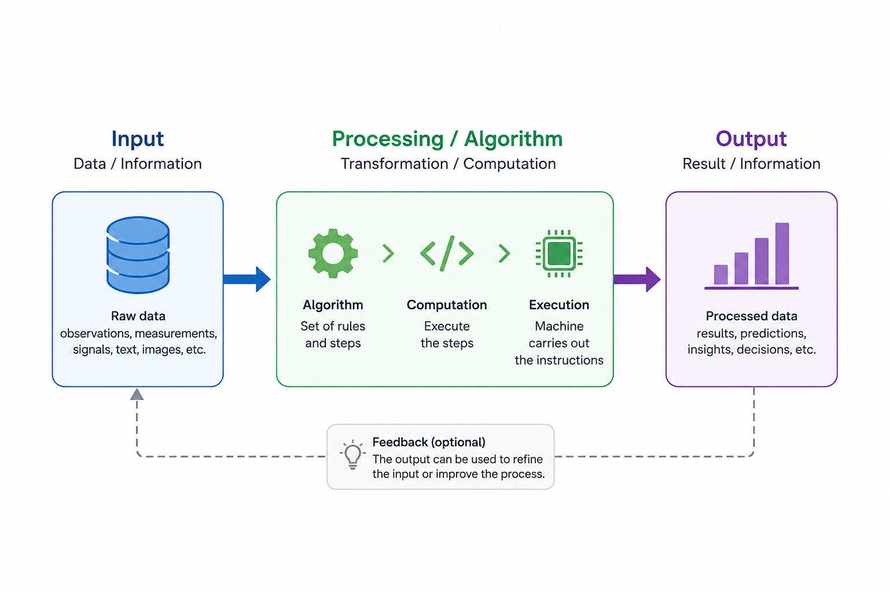

# Programming Foundations with `Python`

Python is one of the most widely used programming languages in Data Science. Its adoption is largely driven by a combination of readability, expressive power, and a mature open-source ecosystem. Libraries such as NumPy, pandas, Matplotlib, scikit-learn, TensorFlow, and PyTorch provide a broad scientific computing environment capable of supporting tasks ranging from data ingestion and exploration to modelling, deployment, and automation.

Beyond its practical utility, Python encourages a particular approach to programming: clarity over unnecessary complexity, readability over cleverness, and explicitness over ambiguity. Many of these principles are captured in *The Zen of Python* and are reflected in the design and conventions of the language.

For Data Science, proficiency in Python involves more than familiarity with syntax or individual libraries. It requires an understanding of how information is represented, how algorithms transform that information, how programs are structured, and how computational instructions are ultimately executed.

## Essential Concepts of Computation

At its core, **computation** can be understood as a structured transformation of information. A computational process typically receives some form of input, applies a defined procedure or algorithm, and produces an output.

{#fig-computational-process width=70%}

A computational system can be considered in terms of two closely related components: **hardware** and **software**. Hardware comprises the physical components of a computer system, including processors, memory, storage, and input/output devices. Software provides the instructions and abstractions that determine how those physical resources are used to perform computational tasks.

An **operating system** provides the fundamental software layer between applications and the underlying hardware. It manages computational resources such as processors, memory, storage, files, and input/output devices, while providing services through which programs can be executed. Common operating systems include Linux, Windows, and macOS.

An **algorithm** is a finite and well-defined sequence of instructions designed to solve a problem or perform a task. Algorithms are abstract: they are independent of the particular programming language used to implement them. A programming language provides a formal mechanism for expressing those algorithms in a form that can ultimately be executed by a computer.

Programming languages are commonly described according to their level of abstraction. **Low-level languages** provide relatively direct control over machine operations, whereas **high-level languages** provide abstractions that allow programs to be expressed in forms closer to human reasoning and problem formulation.

The distinction between **compiled** and **interpreted** languages is useful but should not be treated as absolute. Source code may pass through several stages of compilation and interpretation before execution. In the standard CPython implementation, for example, Python source code is compiled into an intermediate representation known as **bytecode**, which is then executed by the Python virtual machine.

Programming languages can also support different **programming paradigms**, which provide alternative ways of structuring computational logic. Common paradigms include procedural, object-oriented, functional, and declarative programming. Python is a **multi-paradigm language**, supporting procedural, object-oriented, and functional programming styles.

A **program** is an organized collection of instructions that implements one or more algorithms. Python source code is commonly stored in plain-text files with the `.py` extension. Programs can range from small scripts designed to perform a specific task to large software systems composed of multiple packages and modules.

Python itself is a high-level, general-purpose programming language designed with a strong emphasis on readability and simplicity. Its relatively concise syntax, extensive standard library, large open-source ecosystem, and support for multiple programming paradigms have made it particularly important in scientific computing, Data Science, Machine Learning, automation, and software development.

The design philosophy of Python is summarized in *The Zen of Python*, which can be displayed directly from the interpreter:

```{python}
# Zen of Python
import this
```

## Python Scripts and Interactive Computing

Python scripts are plain-text files containing Python source code, typically identified by the `.py` extension. They constitute one of the fundamental ways of organizing and executing Python programs.

A script can be executed by passing its filename to the Python interpreter:

```bash
python script.py
```

Depending on the operating system and Python installation, the Python 3 interpreter may instead be exposed explicitly as `python3`:

```bash
python3 script.py
```

Python development can also be supported by **Integrated Development Environments (IDEs)** and code editors, which provide features such as syntax highlighting, code completion, debugging, source control integration, and project management.

For exploratory analysis and scientific computing, Python is also commonly used through **interactive computing environments**, particularly Jupyter.

### The Jupyter Ecosystem

The **Jupyter Project** provides an open-source environment for interactive computing, combining executable code, documentation, mathematical notation, and visualization within the same computational document.

Originating from the IPython project in 2014, Jupyter evolved into a multi-language execution environment. Its name reflects three of the languages associated with its origins: **Julia, Python, and R**.

The Jupyter ecosystem includes several related tools:

- **Jupyter Notebook** — an interactive environment for creating computational documents that combine code, text, mathematical expressions, and visualizations.
- **JupyterLab** — a web-based development environment that extends the notebook experience with file navigation, terminals, text editors, and other integrated tools.
- **JupyterHub** — a multi-user platform for deploying and managing Jupyter environments.

### IPython and Jupyter Magic Commands

IPython and Jupyter provide **magic commands** for common interactive operations. Line magics begin with `%`, while cell magics begin with `%%`.

The available magic commands can be inspected with:

```python
%lsmagic
```

Some useful line magics include:

```text
%pwd
%cd path/to/directory
%run script.py
%who
%whos
%time expression
%timeit expression
```

The `%pwd` command displays the current working directory:

```text
%pwd
```

The `%cd` command changes the current working directory:

```text
%cd path/to/project
```

A Python script can be executed from Jupyter using `%run`:

```text
%run script.py
```

IPython also distinguishes between **magic commands** and **shell commands**. A command prefixed with `%` is interpreted by IPython, whereas a command prefixed with `!` is passed to the operating-system shell:

```text
%pwd
!python --version
```

## Python Modules: Reusable Code and Namespaces

A **module** is a Python file containing definitions and statements that can be reused by other parts of a program. Modules provide a fundamental mechanism for organizing related functionality into separate, reusable units.

A module may contain functions, classes, variables, constants, and executable statements. Its definitions can be made available to another module or script using the `import` statement:

```{python}
import math

radius = 5
area = math.pi * radius**2

area
```

Modules provide several practical advantages:

- **Code organization** — related functionality can be grouped into logical units, simplifying the structure, comprehension, and maintenance of a codebase.
- **Reusability** — functionality defined in a module can be reused across different parts of a program or across separate projects, reducing code duplication and promoting consistency.
- **Namespace management** — each module defines its own namespace, helping to prevent naming conflicts and providing context for variables, functions, and classes.
- **Encapsulation** — modules provide abstraction boundaries that separate implementation details from the interfaces used by other parts of a program.

### Importing Modules

A module can be imported directly:

```{python}
import math

math.sqrt(16)
```

An alias can be assigned to a module when it is imported:

```{python}
import math as mt

mt.sqrt(16)
```

Aliases are particularly common for frequently used Data Science libraries:

```python
import numpy as np
import pandas as pd
import matplotlib.pyplot as plt
```

Specific objects can also be imported directly from a module:

```{python}
from math import sqrt, pi

sqrt(16)
```

Imported objects can themselves be assigned aliases:

```{python}
from math import factorial as fact

fact(5)
```

Python also supports wildcard imports:

```python
from module_name import *
```

This form imports all public names from a module into the current namespace. In general, explicit imports are preferable because they make dependencies clearer and reduce the possibility of naming conflicts.

### Inspecting Modules and Namespaces

A **namespace** is a mapping between names and Python objects. Modules define their own namespaces, allowing identifiers to be organized without necessarily introducing them into the namespace of the importing program.

The built-in `dir()` function can be used to inspect the names associated with an object:

```{python}
import math

dir(math)
```

When called without an argument:

```python
dir()
```

`dir()` provides the names available in the current scope.

For many imported modules, the `__file__` attribute identifies the file from which the module was loaded:

```python
import numpy as np

np.__file__
```

Not every module necessarily provides a `__file__` attribute. Built-in modules, for example, may not correspond to a conventional source file.

Python also provides the built-in `help()` system for inspecting documentation:

```python
help(math)
help(math.sqrt)
```

Within IPython and Jupyter, documentation can also be inspected interactively using `?`:

```text
math.sqrt?
```

and, when additional implementation information is available:

```text
math.sqrt??
```

### Module Loading and Reloading

When a module is imported, Python normally caches the resulting module object in `sys.modules`. Importing the same module again within the same Python process therefore does not normally execute its top-level code again.

This behaviour is particularly relevant during interactive development in Jupyter. If the source code of an imported module changes, the object already loaded in memory may continue to represent its previous state.

Restarting the kernel reconstructs the Python process from a clean state. Alternatively, a module can be reloaded explicitly using `importlib`:

```python
import importlib
import my_module

importlib.reload(my_module)
```

IPython also provides the `autoreload` extension:

```text
%load_ext autoreload
%autoreload 2
```

This can be useful during interactive development because imported modules can be automatically reloaded when their source code changes.

## Python Execution from the Command Line

Python can be started interactively from a terminal:

```bash
python
```

or, depending on the system:

```bash
python3
```

The interactive interpreter provides direct access to Python's built-in documentation system:

```python
help()
```

Documentation for a specific object can be requested directly:

```python
help(str)
help(print)
```

The interactive interpreter can be exited with:

```python
exit()
```

or:

```python
quit()
```

On Unix-like operating systems, a Python script can specify its interpreter using a **shebang** at the beginning of the file:

```python
#!/usr/bin/env python3
```

The command:

```bash
chmod +x script.py
```

adds executable permission to the script. It can then be executed directly:

```bash
./script.py
```

The shebang and executable permission mechanism is primarily relevant to Unix-like operating systems such as Linux and macOS. On Windows, Python scripts are normally executed through the Python interpreter, the Python launcher, or a development environment.

## Environment and Package Management with Conda

A **Python environment** provides an isolated context containing a particular Python interpreter together with a defined collection of installed packages and dependencies.

Isolated environments are useful because different projects may require different Python versions or different versions of the same libraries. Environment management reduces dependency conflicts and helps make computational environments reproducible.

**Conda** provides both environment management and package management.

Available Conda environments can be listed with:

```bash
conda env list
```

or:

```bash
conda info --envs
```

A new environment can be created with a specific Python version:

```bash
conda create --name my_env python=3.12
```

An environment can be activated with:

```bash
conda activate my_env
```

and deactivated with:

```bash
conda deactivate
```

Packages installed in the active environment can be listed with:

```bash
conda list
```

Packages in a specific environment can be inspected without activating it:

```bash
conda list --name my_env
```

A package can be installed into the active environment:

```bash
conda install numpy
```

or directly into a specified environment:

```bash
conda install --name my_env numpy
```

An environment and all of its packages can be removed with:

```bash
conda remove --name my_env --all
```

Conda itself can be updated with:

```bash
conda update conda
```

All packages in a particular environment can be updated with:

```bash
conda update --name my_env --all
```

For reproducibility, the specification of an environment can be exported to a YAML file:

```bash
conda env export --name my_env > environment.yml
```

An environment can subsequently be recreated from that specification:

```bash
conda env create --file environment.yml
```

The resulting `environment.yml` provides a portable description of the environment and its dependencies.

### Reference Resources

Official documentation and project resources:

- [Python](https://www.python.org/) — Official Python website, language documentation, and downloads.
- [Python Standard Library](https://docs.python.org/3/library/) — Reference documentation for modules included with Python.
- [IPython](https://ipython.readthedocs.io/) — Documentation for IPython, including interactive features and magic commands.
- [Jupyter](https://jupyter.org/) — Documentation and resources for the Jupyter ecosystem.
- [Conda](https://docs.conda.io/) — Documentation for Conda package and environment management.
- [Anaconda](https://www.anaconda.com/) — Python distribution and platform commonly used for scientific computing and Data Science.

## The Python Ecosystem

Python's open-source nature has supported the development of a broad ecosystem of specialized libraries, particularly for scientific computing, Data Science, and Machine Learning.

Some of the most widely used libraries and modules include:

- [pandas](https://pandas.pydata.org/) — Data manipulation and analysis library providing data structures such as the `DataFrame` for working with structured and tabular data.
- [NumPy](https://numpy.org/) — Core numerical computing library providing multidimensional arrays and a broad collection of mathematical operations.
- [Matplotlib](https://matplotlib.org/) — Visualization library for creating static, animated, and interactive plots and figures.
- [`math`](https://docs.python.org/3/library/math.html) — Standard-library module providing mathematical functions for real-valued calculations.
- [`cmath`](https://docs.python.org/3/library/cmath.html) — Standard-library module providing mathematical functions for complex-valued calculations.
- [SciPy](https://scipy.org/) — Scientific computing library built on NumPy, providing functionality for optimization, integration, interpolation, signal processing, statistics, linear algebra, and related numerical methods.
- [scikit-learn](https://scikit-learn.org/stable/) — Machine Learning library providing consistent interfaces for tasks such as classification, regression, clustering, dimensionality reduction, preprocessing, model selection, and evaluation.
- [TensorFlow](https://www.tensorflow.org/) — Machine Learning framework for numerical computation and the development and deployment of Machine Learning and deep learning models.
- [PyTorch](https://pytorch.org/) — Machine Learning framework widely used for deep learning, research, and model development.
- [Keras](https://keras.io/) — High-level API for building and training neural networks.

Together with Python's standard library, these external libraries provide a broad computational environment for tasks ranging from general-purpose programming and numerical computation to data analysis, visualization, Machine Learning, and scientific computing.

## Representing Information in Python

A fundamental question in any programming language is what kinds of information the language can represent and manipulate. This is directly related to the computational process introduced earlier: input → processing → output. Information must first be represented in a form that a program can operate on before any meaningful computation can take place.

In Python, every value is an **object**, and every object has a **type**. A type determines the nature of the value, the operations that can be performed on it, and aspects of how it behaves during program execution.

Python provides several built-in types for representing individual values, including:

- `bool` — Boolean values used to represent logical states.
- `int` — integer numbers.
- `float` — floating-point numbers.
- `complex` — complex numbers.
- `str` — sequences of Unicode characters used to represent text.

Python also provides built-in data structures for organizing multiple objects, including:

- `list` — ordered and mutable collections.
- `tuple` — ordered and immutable collections.
- `dict` — mappings between keys and values.
- `set` — unordered collections of unique elements.

The broader Python ecosystem provides additional data structures designed for numerical and data-oriented computation. In particular, NumPy provides multidimensional arrays through `ndarray`, while pandas provides structures such as `Series` and `DataFrame` for working with labelled and tabular data.

Understanding these types and structures requires understanding how Python associates objects with names. This introduces the concept of **variables**.

# Working with Python Variables

In Python, a variable is best understood as a **name bound to an object**. Assignment creates an association between a name and an object, allowing that object to be referenced and manipulated throughout a program.

Variables do not need to be declared in advance. A name is created when an object is assigned to it using the assignment operator `=`:

```{python}
x = 1
x
```

Another name can refer to an object of a different type:

```{python}
message = "hello"
message
```

The `=` symbol represents **assignment**, not mathematical equality. The expression on the right-hand side is evaluated first, and the resulting object is then associated with the name on the left-hand side.

For example:

```{python}
x = 3
y = x + 1

y
```

Here, `x + 1` is evaluated first, producing the integer object `4`, which is then assigned to `y`.

## Multiple Assignment

Python allows several names to be assigned in a single statement:

```{python}
x, y, z = 10, 20, 30

print(x)
print(y)
print(z)
```

This syntax is based on **unpacking**: the values on the right-hand side are assigned to the corresponding names on the left-hand side.

It is particularly useful when working with related values or when unpacking elements from data structures.

For example, two variables can be swapped without requiring an explicit temporary variable:

```{python}
x = 10
y = 20

x, y = y, x

print(x)
print(y)
```

## Variable Naming

Variable names are identifiers and must follow Python's identifier rules. In general, an identifier:

- may contain letters, digits, and underscores;
- cannot begin with a digit;
- cannot contain spaces;
- cannot contain characters such as `@`, `#`, `$`, or `%`;
- cannot be a reserved Python keyword.

Python identifiers are **case-sensitive**, so the following names refer to different variables:

```python
age
Age
AGE
```

Python supports Unicode characters in identifiers. In practice, English-language identifiers are generally preferable for code intended to be shared across teams and environments.

Beyond the syntactic rules, consistent naming conventions improve readability. Python code conventionally follows the recommendations defined in **PEP 8**.

Common naming styles include:

- `snake_case` — lowercase words separated by underscores; the standard convention for variables and functions in Python, e.g. `user_age`, `total_count`, `average_height`.
- `PascalCase` — words begin with capital letters; conventionally used for class names, e.g. `User`, `CustomerProfile`, `DataProcessor`.
- `camelCase` — the first word begins with lowercase and subsequent words are capitalized, e.g. `userAge`, `totalCount`. This style is common in other languages but is not the standard convention for Python variables and functions.
- `kebab-case` — words separated by hyphens, e.g. `user-age`. This form is used in contexts such as URLs and configuration files but is **not valid as a Python identifier**, because `-` is interpreted as the subtraction operator.

Meaningful names should describe the role of the object they reference. For example:

```python
average_height = 1.76
customer_count = 125
model_accuracy = 0.91
```

is generally clearer than:

```python
a = 1.76
b = 125
c = 0.91
```

Short names remain appropriate when their meaning is conventional or immediately clear from the surrounding context, such as `i` in a short loop or `x` and `y` in mathematical expressions.

## Python Keywords

Python reserves a set of words with predefined syntactic meanings. These words cannot be used as variable names.

The current list can be inspected using the `keyword` module:

```{python}
import keyword

keyword.kwlist
```

It is generally preferable to inspect the list programmatically rather than maintain a static list, since the language can evolve between Python versions.

## Reassignment and Operations with Variables

Once a name has been assigned to a numerical object, it can be used in expressions:

```{python}
x = 3

x + 1
```

The result of an expression can be assigned to another name:

```{python}
y = x + 1

y
```

A name can also be **reassigned**:

```{python}
x = 3
x = x + 1

x
```

This statement is valid because assignment is not mathematical equality. Python first evaluates the expression `x + 1` using the object currently associated with `x`, and then rebinds `x` to the resulting object.

Python provides **augmented assignment operators** as a concise form for common update operations:

```{python}
x = 7
x += 2

x
```

The most common augmented assignment operators include:

| Operator | Example   | Corresponding operation  |
|:--------:|:---------:|:------------------------:|
| `+=`     | `x += y`  | Addition                 |
| `-=`     | `x -= y`  | Subtraction              |
| `*=`     | `x *= y`  | Multiplication           |
| `/=`     | `x /= y`  | Division                 |
| `//=`    | `x //= y` | Floor division           |
| `%=`     | `x %= y`  | Modulo                   |
| `**=`    | `x **= y` | Exponentiation           |

: Common augmented assignment operators in Python. {#tbl-augmented-assignment}

Although expressions such as `x += y` are often informally described as shorthand for `x = x + y`, their behaviour can differ for some mutable objects because augmented assignment may modify an object in place. This distinction becomes relevant when considering mutability and object references.

## Comments

Comments provide contextual information within source code without being executed by the Python interpreter. A single-line comment begins with `#`:

```{python}
# Calculate the area of a circle
radius = 5
area = math.pi * radius**2
```

Comments can also appear after a statement:

```python
max_iterations = 100  # Upper limit for the optimisation procedure
```

Comments are most useful when they explain **why** a decision was made, clarify an assumption, document a non-obvious constraint, or provide context that cannot be expressed clearly through the code itself.

Comments that merely restate obvious code generally add noise rather than useful information. For example:

```python
# Assign 10 to x
x = 10
```

provides little additional information.

In general, clear naming and straightforward program structure should make the behaviour of the code understandable, while comments should provide context where the code alone cannot adequately communicate intent.

# Problems

The following problems are intended to reinforce the concepts developed throughout these notes. They focus on conceptual understanding, interpretation of Python behaviour, and technical reasoning rather than on writing substantial programs.

## Problem 1 — From Algorithm to Execution

Consider the following statements:

1. An algorithm is the same thing as a Python program.
2. A high-level programming language provides abstractions that reduce the need to work directly with machine-level operations.
3. Python source code is executed directly by the processor without any intermediate representation.
4. A programming language provides a formal way to express algorithms in a form that can ultimately be executed by a computer.

For each statement:

1. Determine whether it is correct.
2. If it is incorrect, identify the conceptual error.
3. Explain the relationship among an **algorithm**, a **programming language**, a **program**, and the underlying computer hardware.

## Problem 2 — Compiled or Interpreted?

Python is often described as an interpreted language.

### Questions

1. Why is this description useful but incomplete?
2. Describe, at a high level, what happens to Python source code when it is executed by CPython.
3. What is Python bytecode?
4. What role does the Python virtual machine play?
5. Why should the distinction between compiled and interpreted languages not be treated as absolute?

## Problem 3 — Programming Paradigms

Python supports procedural, object-oriented, and functional programming styles.

### Questions

1. What does it mean to describe Python as a **multi-paradigm language**?
2. Does using one paradigm prevent a program from using another?
3. Why might different paradigms be useful for different parts of the same application?
4. Give a conceptual example of a task that could naturally be expressed procedurally and another that could naturally be represented through objects.

## Problem 4 — Script or Interactive Environment?

Consider the following tasks:

1. Exploring a newly received dataset.
2. Developing a reusable command-line program.
3. Testing a mathematical expression quickly.
4. Creating a reproducible production pipeline.
5. Experimenting interactively with plots and intermediate calculations.

### Questions

1. Which tasks are naturally suited to an interactive environment such as Jupyter?
2. Which are more naturally suited to Python scripts or modules?
3. What advantages does interactive computing provide?
4. What risks or limitations can arise when a complex workflow depends heavily on notebook execution state?
5. Why can the distinction matter for reproducibility?

## Problem 5 — Magic Commands and Shell Commands

Consider the following commands used inside an IPython or Jupyter session:

```text
%pwd
%run analysis.py
!python --version
%timeit expression
````

### Questions

1. Which commands are interpreted by IPython?
2. Which command is passed to the operating-system shell?
3. What is the difference between `%run analysis.py` and executing `python analysis.py` from a terminal?
4. Why are magic commands not part of the Python language itself?
5. Would a `.py` script containing `%pwd` necessarily execute successfully with the standard Python interpreter? Explain.

## Problem 6 — Modules and Namespaces

Suppose a module named `statistics_tools.py` contains:

```python
threshold = 0.8

def score(x):
    return x * 2
```

Another program executes:

```python
import statistics_tools
```

### Questions

1. What namespace is created or accessed by the module?
2. How would the program refer to `threshold`?
3. How would it call `score()`?
4. Why does `import statistics_tools` reduce the risk of naming collisions compared with importing every name directly?
5. What conceptual role does the module name play in expressions such as `statistics_tools.score(...)`?

## Problem 7 — Import Styles

Consider the following alternatives:

```python
import math
```

```python
import math as mt
```

```python
from math import sqrt, pi
```

```python
from math import *
```

### Questions

1. How does each form affect the current namespace?
2. Which forms preserve the module name as part of the reference?
3. What advantages can aliases provide?
4. Why are explicit imports generally preferable to wildcard imports?
5. Under what circumstances could two wildcard imports create a subtle error?
6. Which import style would you generally prefer in shared production code, and why?

## Problem 8 — Inspecting a Module

Suppose you import a module:

```python
import math
```

### Questions

1. What information does `dir(math)` provide?
2. How is `dir()` without an argument conceptually different?
3. What is the purpose of `help(math.sqrt)`?
4. In IPython, what is the purpose of `math.sqrt?`?
5. What additional information may `math.sqrt??` provide?
6. Why might `module.__file__` not exist for every module?

## Problem 9 — Module Caching

Suppose a module contains:

```python
print("module loaded")
```

and is imported twice during the same Python process:

```python
import my_module
import my_module
```

### Questions

1. Would you normally expect `"module loaded"` to be printed once or twice?
2. Why?
3. What role does `sys.modules` play?
4. Suppose the source file changes after the first import. Why might importing it again not reflect the change?
5. What are three ways to obtain the updated module during interactive development?
6. What is the conceptual difference between restarting the kernel and reloading only one module?

## Problem 10 — Python Environments

Two projects require different package versions:

* Project A requires Python 3.11 and version 1 of a library.
* Project B requires Python 3.12 and version 2 of the same library.

### Questions

1. Why can installing all dependencies globally create problems?
2. How does an isolated environment help?
3. What does a Python environment contain conceptually?
4. Why is environment isolation important for reproducibility?
5. What information does an `environment.yml` file attempt to preserve?
6. Does recreating an environment guarantee that all external aspects of an analysis are reproducible? Explain.

## Problem 11 — Conda Commands

Explain the purpose of each command:

```bash
conda env list
```

```bash
conda create --name ds_env python=3.12
```

```bash
conda activate ds_env
```

```bash
conda install numpy
```

```bash
conda list
```

```bash
conda env export --name ds_env > environment.yml
```

```bash
conda env create --file environment.yml
```

### Follow-up Questions

1. What is the difference between creating an environment and activating it?
2. What happens conceptually when a package is installed while an environment is active?
3. Why might an environment specification be committed to version control?

## Problem 12 — Python Ecosystem

Consider the following tasks:

1. Numerical array computation.
2. Tabular data manipulation.
3. Static plotting.
4. Scientific optimisation and integration.
5. Conventional Machine Learning.
6. Deep-learning model development.

### Questions

1. Which libraries mentioned in these notes are commonly associated with each task?
2. Why is NumPy foundational to much of the scientific Python ecosystem?
3. How does pandas differ conceptually from NumPy?
4. What role does scikit-learn typically occupy relative to TensorFlow or PyTorch?
5. Why should familiarity with libraries not be confused with proficiency in Python itself?

## Problem 13 — Objects and Types

Consider the following objects:

```python
True
42
3.14
2 + 3j
"data"
```

### Questions

1. Identify the built-in type of each object.
2. What does it mean to say that every Python value is an object?
3. What role does an object's type play?
4. Can two objects contain apparently similar information while having different types?
5. Why does type matter when determining which operations are valid?

## Problem 14 — Scalar Types and Data Structures

Classify the following Python types according to whether they normally represent individual values or collections of values:

```text
bool
int
float
complex
str
list
tuple
dict
set
```

### Questions

1. Which collection types are ordered?
2. Which are mutable?
3. Which are mappings?
4. Which enforce uniqueness of elements?
5. Why is `str` somewhat unusual when distinguishing scalar values from collections or sequences?

## Problem 15 — What Is a Variable in Python?

Consider:

```python
x = 10
```

### Questions

1. What exactly is `x`?
2. What exactly is `10`?
3. Does Python store the integer value *inside* the variable in the same conceptual sense as a labelled box?
4. What does it mean to say that `x` is **bound to an object**?
5. Why is this description more useful when later studying mutability and references?

## Problem 16 — Assignment Is Not Equality

Consider:

```python
x = 3
x = x + 1
```

### Questions

1. Why is the second statement valid in Python even though the corresponding mathematical equation

$$
x=x+1
$$

would be inconsistent over ordinary numbers?
2. Describe the order in which Python evaluates the second statement.
3. What object is associated with `x` before the second assignment?
4. What object is associated with `x` afterwards?
5. Why is the term **reassignment** appropriate?

## Problem 17 — Names and Objects

Consider:

```python
x = 10
y = x
```

### Questions

1. What does `y = x` conceptually do?
2. Does it necessarily create a completely independent copy of the object associated with `x`?
3. How many names are involved?
4. How many integer objects need to be involved conceptually?
5. Why will this distinction become important when mutable objects are introduced?

## Problem 18 — Multiple Assignment

Consider:

```python
x, y, z = 10, 20, 30
```

### Questions

1. Explain this statement in terms of unpacking.
2. Which value is associated with each name?
3. What condition must hold between the number of values and the number of receiving names in this simple case?
4. Predict conceptually what would happen if there were three names but only two values.

## Problem 19 — Variable Swapping

Consider:

```python
x = 10
y = 20

x, y = y, x
```

### Questions

1. What are the final values associated with `x` and `y`?
2. Why is an explicit temporary variable unnecessary?
3. Explain the operation using the idea of evaluating the right-hand side before performing assignment.
4. How would the equivalent swap normally be written in a language without this unpacking syntax?

## Problem 20 — Valid and Invalid Identifiers

Determine which of the following are valid Python identifiers:

```text
customer_age
2nd_customer
customer2
customer-age
_customer
customer age
total$
Age
age
class
model_accuracy
```

For every invalid identifier, explain why it is invalid.

### Follow-up Questions

1. Are `Age` and `age` the same identifier?
2. Can Python identifiers contain Unicode characters?
3. Why might Unicode identifiers nevertheless be undesirable in shared technical code?

## Problem 21 — Naming Conventions

Consider the following names:

```text
customer_age
CustomerAge
customerAge
customer-age
x
avg_h
average_customer_height
```

### Questions

1. Identify the naming style represented by each.
2. Which style is conventionally used for Python variables and functions?
3. Which style is conventionally used for class names?
4. Which example is not a valid Python identifier?
5. Is a one-letter name such as `x` always poor style?
6. When are short mathematical names appropriate?
7. Why is `average_customer_height` generally more informative than `a` in application code?

## Problem 22 — Python Keywords

Suppose a programmer writes:

```python
class = "A"
```

### Questions

1. Why is this invalid?
2. What is a Python keyword?
3. How can the current keyword list be inspected programmatically?
4. Why is inspecting the keyword list preferable to maintaining a manually written list in long-lived notes or software?

## Problem 23 — Reassignment and Dynamic Typing

Consider:

```python
x = 10
x = "ten"
```

### Questions

1. Is this valid Python?
2. Has the name `x` changed type?
3. Or is it more precise to say that `x` has been rebound to an object of a different type?
4. What does this example suggest about Python's variable model?
5. Why can imprecise language such as "the variable stores a type" become confusing?

## Problem 24 — Augmented Assignment

Consider:

```python
x = 7
x += 2
```

### Questions

1. What is the final value associated with `x`?
2. Why is `x += 2` often described informally as equivalent to `x = x + 2`?
3. Why is that equivalence not universally exact for all Python objects?
4. What role does mutability play in the difference?
5. Why is this distinction largely invisible when using immutable integers?

## Problem 25 — Predict the Result of Augmented Assignment

Without executing the code, determine the final value of `x` in each case:

```python
x = 20
x -= 3
```

```python
x = 5
x *= 4
```

```python
x = 17
x //= 5
```

```python
x = 17
x %= 5
```

```python
x = 2
x **= 5
```

### Follow-up Question

Explain the conceptual difference among ordinary division, floor division, modulo, and exponentiation.

## Problem 26 — Comments and Code Quality

Consider the following two fragments:

```python
# Assign 100 to max_iterations
max_iterations = 100
```

and

```python
# Limit iterations because the optimisation procedure may otherwise
# continue for an impractically long time on poorly scaled data.
max_iterations = 100
```

### Questions

1. Which comment is more useful?
2. Why?
3. What kinds of information should comments ideally communicate?
4. Why can comments that merely restate code reduce readability?
5. What should be preferred when meaning can be communicated through clear naming alone?

## Problem 27 — Namespace Collision

Suppose two modules contain functions with the same name:

```python
module_a.transform
module_b.transform
```

A programmer writes:

```python
from module_a import transform
from module_b import transform
```

### Questions

1. Which `transform` name will be available after both imports?
2. What problem has occurred conceptually?
3. How could module-qualified imports avoid the ambiguity?
4. Why is this an argument against indiscriminate wildcard imports?

## Problem 28 — Reproducibility in Interactive Computing

A data scientist performs the following actions in a notebook:

1. Imports a module.
2. Modifies the module's source file externally.
3. Runs a later notebook cell expecting the new behaviour.
4. Receives results corresponding to the old implementation.

### Questions

1. Explain why this can happen.
2. How could `importlib.reload()` help?
3. How could IPython's `autoreload` extension help?
4. Why might restarting the kernel still be the safest option in some situations?
5. What broader lesson does this illustrate about hidden execution state in interactive environments?

## Problem 29 — Environment Reproducibility Scenario

A colleague sends you a Python project together with an `environment.yml` file.

The project worked correctly on their computer but fails on yours.

### Questions

1. What problem is the environment file intended to solve?
2. What command could be used to recreate the environment?
3. Name several reasons why the project could still fail even after recreating the environment successfully.
4. Why does dependency reproducibility not necessarily imply complete computational reproducibility?

## Problem 30 — Integrated Technical Scenario

A data scientist creates a Conda environment, starts JupyterLab, imports a custom module, loads pandas and NumPy using conventional aliases, and then creates several variables during an analysis.

Later, the custom module is edited outside Jupyter, a variable is rebound to an object of another type, and the notebook is executed out of order.

### Questions

Explain the concepts involved in this scenario, including:

1. environment isolation;
2. interactive computing;
3. module imports;
4. module caching;
5. namespaces;
6. aliases;
7. variables as names bound to objects;
8. reassignment;
9. object types;
10. execution state.

Finally, explain why understanding these foundational concepts is important even when most day-to-day Data Science work is performed through high-level libraries such as pandas, NumPy, or scikit-learn.