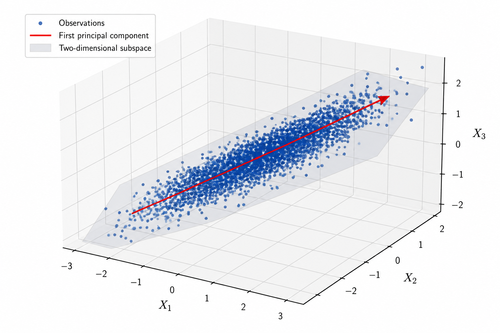
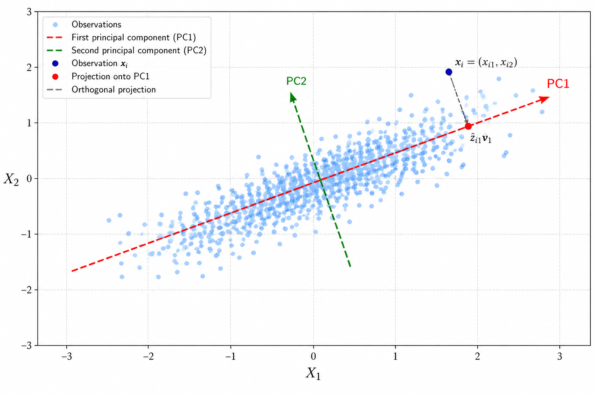
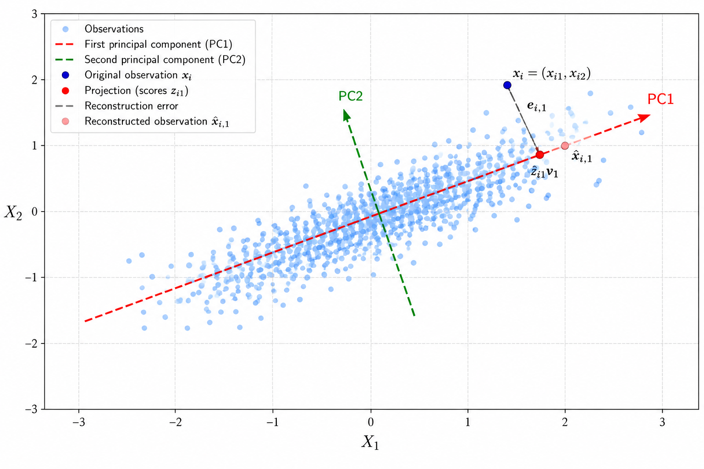
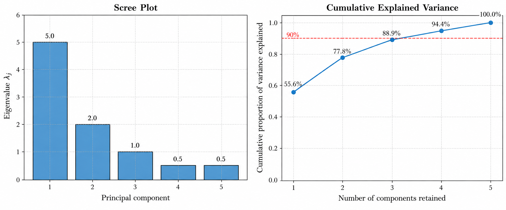
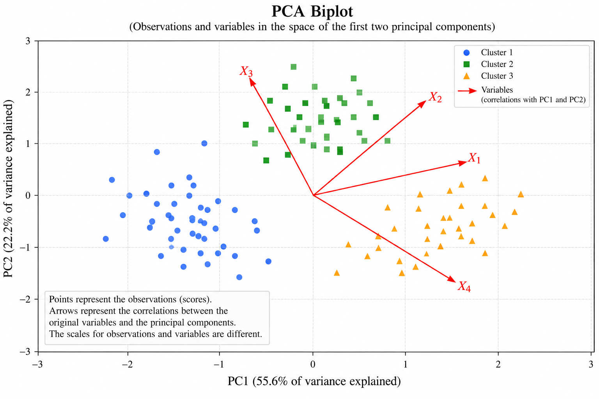
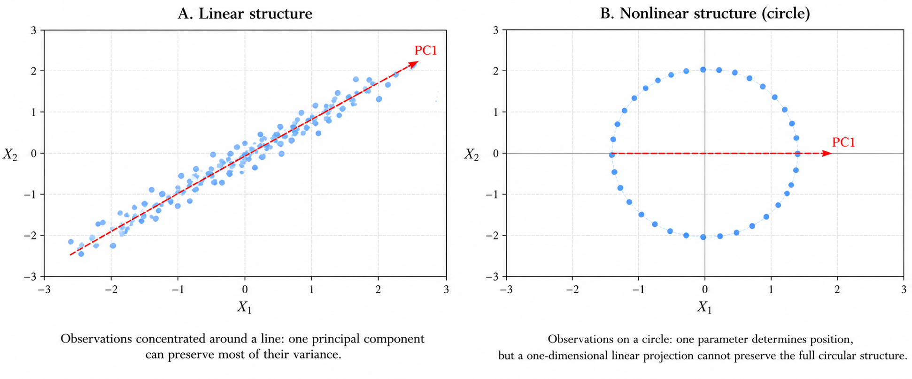

# Introduction

In many data analysis problems, each observation is described by a large number of variables. A medical study may record hundreds of clinical measurements, an experiment may collect signals from multiple sensors, and a financial dataset may contain the returns of numerous assets. Although these measurements provide different views of the system under investigation, working with all of them simultaneously can make the analysis difficult.

Consider a dataset containing $N$ observations and $M$ variables, $X_1, X_2, \ldots, X_M$. One way to explore the relationships between the variables is to examine their pairwise scatterplots. However, the number of possible pairs increases rapidly with $M$:

$$
\binom{M}{2}
=
\frac{M!}{2!(M-2)!}
=
\frac{M(M-1)}{2}.
$$

With only ten variables, there are already 45 possible scatterplots. With one hundred variables, there are 4,950. Even if we could examine all these plots, each would reveal only a two-dimensional view of the dataset. Relationships involving several variables simultaneously could remain difficult to identify.

The problem is not limited to visualisation. A large number of variables can increase computational costs, complicate the interpretation of statistical models, and become particularly challenging when the number of observations is small relative to the number of variables. In such circumstances, a useful question is whether all the recorded variables are necessary to describe the main structure of the data.

## Redundancy and Dimensionality

The number of variables used to describe a system does not necessarily correspond to the number of independent dimensions needed to represent it.

Suppose we record the height of several individuals in both centimetres and inches. Although the dataset contains two variables, one is an exact linear transformation of the other. Both measurements describe the same characteristic, and the observations can therefore be represented along a single direction without losing information.

A similar situation arises when the relationship is not exact. For example, measurements of different parts of the human body may be correlated because they are influenced by common characteristics such as overall body size. These variables are not interchangeable, but some of their variability may be summarised by a smaller number of dimensions.

This idea becomes particularly useful when we consider a physical system observed through multiple measurements. A simple harmonic oscillator, for instance, may be monitored by several sensors recording different projections of its motion. Although the resulting dataset contains multiple variables, the underlying motion may be described by substantially fewer degrees of freedom. Measurement noise can further obscure this simpler structure.

The objective is therefore not necessarily to identify which original variables should be discarded. Instead, we may seek a new representation that combines the available measurements into a smaller number of variables while preserving the dominant patterns of variation.

{#fig-intrinsic-dimensionality}

## Principal Component Analysis

Principal Component Analysis (PCA) is an unsupervised statistical method that constructs a new set of variables, called *principal components*, from linear combinations of the original variables. These components define directions along which the observations exhibit progressively smaller amounts of variance.

The first principal component identifies the direction of greatest variance in the data. The second identifies the direction of greatest remaining variance while being orthogonal to the first. Subsequent components follow the same principle, each subject to orthogonality with the preceding directions.

{#fig-principal-component-directions}

If most of the variability is concentrated along the first few components, the observations can be projected onto the subspace defined by those directions. In this way, a dataset originally described by $M$ variables may be approximated using only $q$ components, where $q < M$.

The resulting representation can make it easier to visualise observations, investigate relationships between variables, and identify patterns that are difficult to recognise in the original feature space. Principal components can also be used as inputs to subsequent statistical or machine learning models, reducing the number of predictors and eliminating linear correlations between the retained components.

PCA is not limited to dimensionality reduction. Its low-dimensional representation can also be used to reconstruct approximate observations, investigate unusual patterns, and, under suitable assumptions, estimate missing values by exploiting relationships between variables.

These applications follow from a common mathematical principle: PCA seeks an orthogonal coordinate system in which the variance of the data is concentrated as much as possible in the first few directions.

The method does not, however, establish that the directions of greatest variance correspond to the most important physical, biological, or economic mechanisms. Nor does it imply that components with small variance contain only noise. The usefulness of a principal component ultimately depends on the question being investigated.

In the following sections, we develop PCA from its mathematical formulation, derive the principal components as solutions to a constrained optimisation problem, and examine how they can be computed and interpreted.

# Mathematical Formulation

PCA begins with a dataset containing $N$ observations of $M$ variables. We represent the data by a matrix

$$
\mathbf{X}
=
\begin{bmatrix}
x_{11} & x_{12} & \cdots & x_{1M} \\
x_{21} & x_{22} & \cdots & x_{2M} \\
\vdots & \vdots & \ddots & \vdots \\
x_{N1} & x_{N2} & \cdots & x_{NM}
\end{bmatrix}
\in \mathbb{R}^{N \times M},
$$

where each row corresponds to an observation and each column corresponds to a variable. The entry $x_{ij}$ denotes the value of variable $X_j$ recorded for observation $i$.

The $i$-th observation can therefore be represented by the column vector

$$
\mathbf{x}_i
=
\begin{bmatrix}
x_{i1} \\
x_{i2} \\
\vdots \\
x_{iM}
\end{bmatrix}
\in \mathbb{R}^{M}.
$$

Although the dataset contains $M$ variables, our objective is to determine whether the observations can be represented adequately in a space of lower dimension. To develop this idea, we first need to consider how the variables are prepared and how their joint variability is described.

## Centering the Data

PCA is ordinarily performed on centred data. For each variable $X_j$, we calculate its sample mean:

$$
\bar{x}_j
=
\frac{1}{N}
\sum_{i=1}^{N}x_{ij}.
$$

We then subtract this mean from every observation of the corresponding variable:

$$
x_{ij}^{c}
=
x_{ij}-\bar{x}_j.
$$

The resulting centred data matrix is

$$
\mathbf{X}_c
=
\begin{bmatrix}
x_{11}-\bar{x}_1 & \cdots & x_{1M}-\bar{x}_M \\
x_{21}-\bar{x}_1 & \cdots & x_{2M}-\bar{x}_M \\
\vdots & \ddots & \vdots \\
x_{N1}-\bar{x}_1 & \cdots & x_{NM}-\bar{x}_M
\end{bmatrix}.
$$

By construction, every column of $\mathbf{X}_c$ has sample mean zero:

$$
\frac{1}{N}
\sum_{i=1}^{N}x_{ij}^{c}
=
\frac{1}{N}
\sum_{i=1}^{N}(x_{ij}-\bar{x}_j)
=
0.
$$

Geometrically, centering translates the cloud of observations so that its centroid coincides with the origin. It does not change the distances between observations or the variance of any variable.

This step is important because PCA seeks directions that describe variation around the centre of the data. Without centering, a decomposition of the original data matrix may be influenced by the location of the observations relative to the origin, rather than only by their variability around the sample mean.

## The Covariance Matrix

The sample covariance between two variables $X_j$ and $X_k$ is defined as

$$
s_{jk}
=
\frac{1}{N-1}
\sum_{i=1}^{N}
(x_{ij}-\bar{x}_j)
(x_{ik}-\bar{x}_k).
$$

When $j=k$, this expression reduces to the sample variance of $X_j$:

$$
s_{jj}
=
\frac{1}{N-1}
\sum_{i=1}^{N}
(x_{ij}-\bar{x}_j)^2.
$$

Collecting the variances and covariances of all $M$ variables gives the sample covariance matrix

$$
\mathbf{S}
=
\begin{bmatrix}
s_{11} & s_{12} & \cdots & s_{1M} \\
s_{21} & s_{22} & \cdots & s_{2M} \\
\vdots & \vdots & \ddots & \vdots \\
s_{M1} & s_{M2} & \cdots & s_{MM}
\end{bmatrix}
\in \mathbb{R}^{M \times M}.
$$

Using the centred data matrix, we can express the covariance matrix more compactly as

$$
\mathbf{S}
=
\frac{1}{N-1}
\mathbf{X}_c^\top\mathbf{X}_c.
$$

To see why, consider the entry in row $j$ and column $k$ of the matrix product:

$$
\left(
\mathbf{X}_c^\top\mathbf{X}_c
\right)_{jk}
=
\sum_{i=1}^{N}
(x_{ij}-\bar{x}_j)
(x_{ik}-\bar{x}_k).
$$

Dividing this expression by $N-1$ gives precisely the sample covariance $s_{jk}$.

The covariance matrix contains the information needed to describe the linear variability of the dataset. Its diagonal entries measure the variability of individual variables, while its off-diagonal entries describe how pairs of variables vary together.

Two properties will be particularly important in the derivation of PCA.

First, $\mathbf{S}$ is symmetric:

$$
\mathbf{S}^\top=\mathbf{S}.
$$

Second, it is positive semidefinite. For any vector
$\mathbf{a}\in\mathbb{R}^{M}$,

$$
\begin{aligned}
\mathbf{a}^\top\mathbf{S}\mathbf{a}
&=
\frac{1}{N-1}
\mathbf{a}^\top
\mathbf{X}_c^\top\mathbf{X}_c
\mathbf{a}
\\[4pt]
&=
\frac{1}{N-1}
(\mathbf{X}_c\mathbf{a})^\top
(\mathbf{X}_c\mathbf{a})
\\[4pt]
&=
\frac{1}{N-1}
\|\mathbf{X}_c\mathbf{a}\|_2^2
\\[4pt]
&\geq 0.
\end{aligned}
$$

Consequently, all eigenvalues of the sample covariance matrix are real and non-negative. They need not be distinct, and some may be zero.

These properties allow us to formulate PCA as a problem involving the eigenvalues and eigenvectors of $\mathbf{S}$.

## Scaling the Variables

Centering and scaling are different operations. Centering removes the sample mean, whereas scaling changes the relative magnitude of the variables.

This distinction matters because PCA is sensitive to the scale of the measurements.

Suppose a dataset contains height measured in centimetres and weight measured in kilograms. If height is instead recorded in metres, its numerical variance changes by a factor of $10^4$, even though the underlying measurements describe exactly the same individuals.

Since PCA seeks directions of maximum variance, changing the units of measurement can change the resulting principal components.

A common approach is to standardise each variable by its sample standard deviation:

$$
s_j
=
\sqrt{
\frac{1}{N-1}
\sum_{i=1}^{N}
(x_{ij}-\bar{x}_j)^2
}.
$$

The standardised observations are then

$$
x_{ij}^{*}
=
\frac{x_{ij}-\bar{x}_j}{s_j}.
$$

Each standardised variable has sample mean zero and sample variance one, provided that $s_j>0$.

If PCA is performed on the standardised data matrix $\mathbf{X}^{*}$, its sample covariance matrix is the correlation matrix of the original variables:

$$
\mathbf{R}
=
\frac{1}{N-1}
(\mathbf{X}^{*})^\top
\mathbf{X}^{*}.
$$

Thus, PCA based on the covariance matrix and PCA based on the correlation matrix are closely related, but they do not necessarily produce the same components.

Covariance-based PCA retains the original relative scales of the variables. Correlation-based PCA gives each variable unit variance before determining the principal directions.

Neither choice is universally appropriate. The decision depends on whether differences in the original variances carry meaningful information for the problem under investigation.

For the mathematical development that follows, we assume that the data have been centred and denote their sample covariance matrix by $\mathbf{S}$. When standardisation is required, the same derivations apply to the standardised data and their correlation matrix.

## Principal Components as Linear Combinations

Consider a vector

$$
\boldsymbol{\gamma}_1
=
\begin{bmatrix}
\gamma_{11} \\
\gamma_{21} \\
\vdots \\
\gamma_{M1}
\end{bmatrix}
\in\mathbb{R}^{M}.
$$

We can use its coefficients to construct a new variable as a linear combination of the original centred variables:

$$
Z_1
=
\gamma_{11}X_1^{c}
+
\gamma_{21}X_2^{c}
+
\cdots
+
\gamma_{M1}X_M^{c}.
$$

In vector notation,

$$
Z_1
=
\boldsymbol{\gamma}_1^\top
\mathbf{X}^{c},
$$

where $\mathbf{X}^{c}$ denotes the random vector of centred variables.

For an individual observation $\mathbf{x}_i^{c}$, the corresponding value of the new variable is

$$
z_{i1}
=
\boldsymbol{\gamma}_1^\top
\mathbf{x}_i^{c}
=
\sum_{j=1}^{M}
\gamma_{j1}x_{ij}^{c}.
$$

The coefficients $\gamma_{11},\ldots,\gamma_{M1}$ are called the *loadings* of the first principal component, and $\boldsymbol{\gamma}_1$ is its loading vector. The values $z_{11},\ldots,z_{N1}$ are the *scores* of the observations on that component.

Geometrically, the loading vector defines a direction in the original feature space, while the scores describe the positions of the observations along that direction.

Our objective is to find the direction along which the projected observations exhibit the greatest sample variance.

The variance of the first component can be written as

$$
\begin{aligned}
\operatorname{Var}(Z_1)
&=
\operatorname{Var}
\left(
\boldsymbol{\gamma}_1^\top
\mathbf{X}^{c}
\right)
\\[4pt]
&=
\boldsymbol{\gamma}_1^\top
\mathbf{S}
\boldsymbol{\gamma}_1.
\end{aligned}
$$

Here and in the optimisation problem below, $\operatorname{Var}$ denotes the sample variance calculated from the observed component scores.

Without an additional restriction, this variance could be increased indefinitely by multiplying every loading by an arbitrarily large constant. To prevent this, we require the loading vector to have unit Euclidean norm:

$$
\|\boldsymbol{\gamma}_1\|_2^2
=
\boldsymbol{\gamma}_1^\top
\boldsymbol{\gamma}_1
=
\sum_{j=1}^{M}
\gamma_{j1}^{2}
=
1.
$$

The first principal component is therefore obtained by solving the constrained optimisation problem

$$
\begin{aligned}
\max_{\boldsymbol{\gamma}_1\in\mathbb{R}^{M}}
\quad&
\boldsymbol{\gamma}_1^\top
\mathbf{S}
\boldsymbol{\gamma}_1
\\[6pt]
\text{subject to}
\quad&
\boldsymbol{\gamma}_1^\top
\boldsymbol{\gamma}_1=1.
\end{aligned}
$$

The second principal component is constructed by maximising the variance of another linear combination, subject to the additional requirement that its loading vector be orthogonal to the first. Subsequent components follow the same principle.

This formulation leads directly to the mathematical derivation of PCA.

# Derivation of Principal Components

We have formulated the first principal component as the solution to the constrained optimisation problem

$$
\begin{aligned}
\max_{\boldsymbol{\gamma}_1\in\mathbb{R}^{M}}
\quad&
\boldsymbol{\gamma}_1^\top
\mathbf{S}
\boldsymbol{\gamma}_1
\\[6pt]
\text{subject to}
\quad&
\boldsymbol{\gamma}_1^\top
\boldsymbol{\gamma}_1=1.
\end{aligned}
$$

The objective is to find a unit vector defining the direction along which the projected observations have the greatest sample variance. Once this direction has been determined, subsequent components are obtained by imposing additional orthogonality constraints.

## The First Principal Component

We begin by introducing a Lagrange multiplier, $\lambda_1$, associated with the unit-norm constraint. The Lagrangian is

$$
\mathcal{L}
(\boldsymbol{\gamma}_1,\lambda_1)
=
\boldsymbol{\gamma}_1^\top
\mathbf{S}
\boldsymbol{\gamma}_1
-
\lambda_1
\left(
\boldsymbol{\gamma}_1^\top
\boldsymbol{\gamma}_1-1
\right).
$$

A necessary condition for an optimum is that the gradient of the Lagrangian with respect to the loading vector vanishes:

$$
\nabla_{\boldsymbol{\gamma}_1}
\mathcal{L}
=
\mathbf{0}.
$$

To calculate this gradient, recall that the covariance matrix is symmetric. Therefore,

$$
\nabla_{\boldsymbol{\gamma}_1}
\left(
\boldsymbol{\gamma}_1^\top
\mathbf{S}
\boldsymbol{\gamma}_1
\right)
=
\left(
\mathbf{S}+\mathbf{S}^\top
\right)
\boldsymbol{\gamma}_1
=
2\mathbf{S}\boldsymbol{\gamma}_1.
$$

Similarly,

$$
\nabla_{\boldsymbol{\gamma}_1}
\left(
\boldsymbol{\gamma}_1^\top
\boldsymbol{\gamma}_1
\right)
=
2\boldsymbol{\gamma}_1.
$$

Substituting these expressions into the stationarity condition gives

$$
\begin{aligned}
\nabla_{\boldsymbol{\gamma}_1}
\mathcal{L}
&=
2\mathbf{S}\boldsymbol{\gamma}_1
-
2\lambda_1\boldsymbol{\gamma}_1
\\[4pt]
&=
2
\left(
\mathbf{S}-\lambda_1\mathbf{I}
\right)
\boldsymbol{\gamma}_1
\\[4pt]
&=
\mathbf{0}.
\end{aligned}
$$

Hence,

$$
\left(
\mathbf{S}-\lambda_1\mathbf{I}
\right)
\boldsymbol{\gamma}_1
=
\mathbf{0},
$$

or equivalently,

$$
\mathbf{S}\boldsymbol{\gamma}_1
=
\lambda_1\boldsymbol{\gamma}_1.
$$

This is the eigenvalue equation for the sample covariance matrix.

Since the loading vector must have unit norm, it cannot be the zero vector. A non-trivial solution therefore requires

$$
\det
\left(
\mathbf{S}-\lambda_1\mathbf{I}
\right)
=
0.
$$

The possible values of $\lambda_1$ are the eigenvalues of $\mathbf{S}$, and the corresponding loading vectors are its eigenvectors.

However, the eigenvalue equation alone does not identify which eigenvector maximises the variance. We must still determine which of its solutions corresponds to the required maximum.

### Selecting the Direction of Maximum Variance

Suppose that $\boldsymbol{\gamma}_1$ is a unit eigenvector associated with an eigenvalue $\lambda_1$. Its projected variance is

$$
\begin{aligned}
\operatorname{Var}(Z_1)
&=
\boldsymbol{\gamma}_1^\top
\mathbf{S}
\boldsymbol{\gamma}_1
\\[4pt]
&=
\boldsymbol{\gamma}_1^\top
\left(
\lambda_1\boldsymbol{\gamma}_1
\right)
\\[4pt]
&=
\lambda_1
\boldsymbol{\gamma}_1^\top
\boldsymbol{\gamma}_1
\\[4pt]
&=
\lambda_1.
\end{aligned}
$$

Thus, the variance of a principal component equals the eigenvalue associated with its loading vector.

Because $\mathbf{S}$ is symmetric and positive semidefinite, its eigenvalues are real and non-negative. We can arrange them in descending order:

$$
\lambda_1
\geq
\lambda_2
\geq
\cdots
\geq
\lambda_M
\geq
0.
$$

The first principal component must therefore be associated with the largest eigenvalue.

We can establish this result more generally without restricting our attention to stationary points. Since $\mathbf{S}$ is symmetric, it admits an orthonormal basis of eigenvectors,

$$
\boldsymbol{\gamma}_1,
\boldsymbol{\gamma}_2,
\ldots,
\boldsymbol{\gamma}_M.
$$

Any unit vector $\mathbf{a}\in\mathbb{R}^{M}$ can be expressed as

$$
\mathbf{a}
=
\sum_{j=1}^{M}
c_j\boldsymbol{\gamma}_j,
$$

where

$$
\sum_{j=1}^{M}c_j^2=1.
$$

Using the eigenvalue equation and the orthonormality of the eigenvectors, its projected variance becomes

$$
\begin{aligned}
\mathbf{a}^\top\mathbf{S}\mathbf{a}
&=
\left(
\sum_{j=1}^{M}
c_j\boldsymbol{\gamma}_j
\right)^\top
\mathbf{S}
\left(
\sum_{k=1}^{M}
c_k\boldsymbol{\gamma}_k
\right)
\\[4pt]
&=
\sum_{j=1}^{M}
\sum_{k=1}^{M}
c_jc_k\lambda_k
\boldsymbol{\gamma}_j^\top
\boldsymbol{\gamma}_k
\\[4pt]
&=
\sum_{j=1}^{M}
\lambda_jc_j^2
\\[4pt]
&\leq
\lambda_1
\sum_{j=1}^{M}c_j^2
\\[4pt]
&=
\lambda_1.
\end{aligned}
$$

The upper bound is attained by choosing
$\mathbf{a}=\boldsymbol{\gamma}_1$. Therefore,

$$
\max_{\|\mathbf{a}\|_2=1}
\mathbf{a}^\top\mathbf{S}\mathbf{a}
=
\lambda_1.
$$

This establishes that the first principal component is the projection of the centred observations onto a unit eigenvector associated with the largest eigenvalue of the sample covariance matrix.

If the largest eigenvalue is repeated, the maximising direction is not unique: any unit vector in its eigenspace attains the same maximum variance.

## The Second Principal Component

The first principal component identifies the direction of greatest variance, but it does not necessarily describe all the variability in the dataset. We now seek a second direction that captures as much of the remaining variance as possible.

Let

$$
\boldsymbol{\gamma}_2
=
\begin{bmatrix}
\gamma_{12} \\
\gamma_{22} \\
\vdots \\
\gamma_{M2}
\end{bmatrix}
$$

be the loading vector of the second component. Its score for observation $i$ is

$$
z_{i2}
=
\boldsymbol{\gamma}_2^\top
\mathbf{x}_i^c.
$$

As before, we require the loading vector to have unit norm:

$$
\boldsymbol{\gamma}_2^\top
\boldsymbol{\gamma}_2=1.
$$

We also require the second component to be uncorrelated with the first:

$$
\operatorname{Cov}(Z_1,Z_2)=0.
$$

To express this condition in terms of the loading vectors, consider

$$
\begin{aligned}
\operatorname{Cov}(Z_1,Z_2)
&=
\operatorname{Cov}
\left(
\boldsymbol{\gamma}_1^\top\mathbf{X}^c,
\boldsymbol{\gamma}_2^\top\mathbf{X}^c
\right)
\\[4pt]
&=
\boldsymbol{\gamma}_1^\top
\operatorname{Cov}(\mathbf{X}^c)
\boldsymbol{\gamma}_2
\\[4pt]
&=
\boldsymbol{\gamma}_1^\top
\mathbf{S}
\boldsymbol{\gamma}_2.
\end{aligned}
$$

Since $\mathbf{S}$ is symmetric and

$$
\mathbf{S}\boldsymbol{\gamma}_1
=
\lambda_1\boldsymbol{\gamma}_1,
$$

we obtain

$$
\begin{aligned}
\operatorname{Cov}(Z_1,Z_2)
&=
\left(
\mathbf{S}\boldsymbol{\gamma}_1
\right)^\top
\boldsymbol{\gamma}_2
\\[4pt]
&=
\lambda_1
\boldsymbol{\gamma}_1^\top
\boldsymbol{\gamma}_2.
\end{aligned}
$$

Provided that $\lambda_1>0$, the condition of zero covariance is equivalent to

$$
\boldsymbol{\gamma}_1^\top
\boldsymbol{\gamma}_2=0.
$$

Thus, requiring the second component to be uncorrelated with the first is equivalent to requiring their loading vectors to be orthogonal.

If $\lambda_1=0$, the centred dataset has no sample variance, and PCA cannot identify a direction of greater variability. We therefore assume that the dataset has non-zero total variance.

The optimisation problem for the second principal component is

$$
\begin{aligned}
\max_{\boldsymbol{\gamma}_2\in\mathbb{R}^{M}}
\quad&
\boldsymbol{\gamma}_2^\top
\mathbf{S}
\boldsymbol{\gamma}_2
\\[6pt]
\text{subject to}
\quad&
\boldsymbol{\gamma}_2^\top
\boldsymbol{\gamma}_2=1,
\\[4pt]
&
\boldsymbol{\gamma}_2^\top
\boldsymbol{\gamma}_1=0.
\end{aligned}
$$

### Derivation Using Lagrange Multipliers

We introduce two multipliers: $\lambda_2$ for the unit-norm constraint and $\alpha$ for the orthogonality constraint.

The Lagrangian is

$$
\begin{aligned}
\mathcal{L}
(\boldsymbol{\gamma}_2,\lambda_2,\alpha)
={}&
\boldsymbol{\gamma}_2^\top
\mathbf{S}
\boldsymbol{\gamma}_2
\\
&-
\lambda_2
\left(
\boldsymbol{\gamma}_2^\top
\boldsymbol{\gamma}_2-1
\right)
\\
&-
\alpha
\boldsymbol{\gamma}_2^\top
\boldsymbol{\gamma}_1.
\end{aligned}
$$

Differentiating with respect to $\boldsymbol{\gamma}_2$ and setting the gradient equal to zero gives

$$
2\mathbf{S}\boldsymbol{\gamma}_2
-
2\lambda_2\boldsymbol{\gamma}_2
-
\alpha\boldsymbol{\gamma}_1
=
\mathbf{0}.
$$

To determine $\alpha$, multiply both sides by
$\boldsymbol{\gamma}_1^\top$:

$$
\begin{aligned}
&
2\boldsymbol{\gamma}_1^\top
\mathbf{S}
\boldsymbol{\gamma}_2
-
2\lambda_2
\boldsymbol{\gamma}_1^\top
\boldsymbol{\gamma}_2
-
\alpha
\boldsymbol{\gamma}_1^\top
\boldsymbol{\gamma}_1
=
0.
\end{aligned}
$$

We already know that

$$
\boldsymbol{\gamma}_1^\top
\boldsymbol{\gamma}_2=0
$$

and

$$
\boldsymbol{\gamma}_1^\top
\boldsymbol{\gamma}_1=1.
$$

Furthermore, using the symmetry of $\mathbf{S}$ and the eigenvalue equation for the first component,

$$
\begin{aligned}
\boldsymbol{\gamma}_1^\top
\mathbf{S}
\boldsymbol{\gamma}_2
&=
\left(
\mathbf{S}\boldsymbol{\gamma}_1
\right)^\top
\boldsymbol{\gamma}_2
\\[4pt]
&=
\lambda_1
\boldsymbol{\gamma}_1^\top
\boldsymbol{\gamma}_2
\\[4pt]
&=
0.
\end{aligned}
$$

Consequently,

$$
-\alpha=0,
$$

so

$$
\alpha=0.
$$

Substituting this result into the original stationarity condition yields

$$
2\mathbf{S}\boldsymbol{\gamma}_2
-
2\lambda_2\boldsymbol{\gamma}_2
=
\mathbf{0},
$$

or

$$
\mathbf{S}\boldsymbol{\gamma}_2
=
\lambda_2\boldsymbol{\gamma}_2.
$$

We have recovered another eigenvalue equation.

The second principal component is therefore associated with an eigenvector corresponding to the second-largest eigenvalue, chosen orthogonal to the first loading vector.

Its variance is

$$
\operatorname{Var}(Z_2)=\lambda_2.
$$

## Subsequent Principal Components

The same reasoning extends to the remaining components.

The $j$-th principal component is obtained by maximising

$$
\boldsymbol{\gamma}_j^\top
\mathbf{S}
\boldsymbol{\gamma}_j
$$

subject to

$$
\boldsymbol{\gamma}_j^\top
\boldsymbol{\gamma}_j=1
$$

and

$$
\boldsymbol{\gamma}_j^\top
\boldsymbol{\gamma}_k=0,
\qquad
k=1,\ldots,j-1.
$$

Its loading vector satisfies

$$
\mathbf{S}\boldsymbol{\gamma}_j
=
\lambda_j\boldsymbol{\gamma}_j,
$$

and its variance is

$$
\operatorname{Var}(Z_j)=\lambda_j.
$$

The components are ordered so that

$$
\operatorname{Var}(Z_1)
\geq
\operatorname{Var}(Z_2)
\geq
\cdots
\geq
\operatorname{Var}(Z_M).
$$

Each successive component captures the greatest variance available among directions orthogonal to those already selected.

If some eigenvalues are repeated, the individual loading vectors within the corresponding eigenspace are not uniquely determined. Nevertheless, an orthonormal basis can always be selected, and the associated eigenspace remains well defined.

## The Principal Component Transformation

Having obtained the loading vectors, we can collect them as columns of a matrix:

$$
\boldsymbol{\Gamma}
=
\begin{bmatrix}
\boldsymbol{\gamma}_1 &
\boldsymbol{\gamma}_2 &
\cdots &
\boldsymbol{\gamma}_M
\end{bmatrix}
\in\mathbb{R}^{M\times M}.
$$

Because the loading vectors form an orthonormal basis,

$$
\boldsymbol{\Gamma}^\top
\boldsymbol{\Gamma}
=
\boldsymbol{\Gamma}
\boldsymbol{\Gamma}^\top
=
\mathbf{I}.
$$

Thus, $\boldsymbol{\Gamma}$ is an orthogonal matrix.

The transformation of an individual centred observation is

$$
\mathbf{z}_i
=
\boldsymbol{\Gamma}^\top
\mathbf{x}_i^c.
$$

For the entire dataset, whose observations are arranged in rows, the corresponding transformation is

$$
\mathbf{Z}
=
\mathbf{X}_c
\boldsymbol{\Gamma},
$$

where

$$
\mathbf{Z}
=
\begin{bmatrix}
z_{11} & z_{12} & \cdots & z_{1M} \\
z_{21} & z_{22} & \cdots & z_{2M} \\
\vdots & \vdots & \ddots & \vdots \\
z_{N1} & z_{N2} & \cdots & z_{NM}
\end{bmatrix}.
$$

The columns of $\mathbf{Z}$ contain the scores of all observations on the respective principal components.

Geometrically, the transformation expresses the centred observations in a new orthonormal coordinate system whose axes are aligned with the principal directions.

### Covariance of the Principal Components

We can now determine the covariance matrix of the transformed data:

$$
\begin{aligned}
\mathbf{S}_Z
&=
\frac{1}{N-1}
\mathbf{Z}^\top\mathbf{Z}
\\[4pt]
&=
\frac{1}{N-1}
\left(
\mathbf{X}_c\boldsymbol{\Gamma}
\right)^\top
\left(
\mathbf{X}_c\boldsymbol{\Gamma}
\right)
\\[4pt]
&=
\boldsymbol{\Gamma}^\top
\left(
\frac{1}{N-1}
\mathbf{X}_c^\top\mathbf{X}_c
\right)
\boldsymbol{\Gamma}
\\[4pt]
&=
\boldsymbol{\Gamma}^\top
\mathbf{S}
\boldsymbol{\Gamma}.
\end{aligned}
$$

From the eigenvalue equations, we have

$$
\mathbf{S}\boldsymbol{\Gamma}
=
\boldsymbol{\Gamma}\boldsymbol{\Lambda},
$$

where

$$
\boldsymbol{\Lambda}
=
\begin{bmatrix}
\lambda_1 & 0 & \cdots & 0 \\
0 & \lambda_2 & \cdots & 0 \\
\vdots & \vdots & \ddots & \vdots \\
0 & 0 & \cdots & \lambda_M
\end{bmatrix}.
$$

Therefore,

$$
\begin{aligned}
\mathbf{S}_Z
&=
\boldsymbol{\Gamma}^\top
\mathbf{S}
\boldsymbol{\Gamma}
\\[4pt]
&=
\boldsymbol{\Gamma}^\top
\boldsymbol{\Gamma}
\boldsymbol{\Lambda}
\\[4pt]
&=
\boldsymbol{\Lambda}.
\end{aligned}
$$

The covariance matrix of the principal components is diagonal:

$$
\boxed{
\operatorname{Cov}(\mathbf{Z})
=
\boldsymbol{\Lambda}
}
$$

Its diagonal entries are the variances of the components, while its off-diagonal entries are zero. The principal components are therefore mutually uncorrelated.

This result does not imply that the components are statistically independent. Zero covariance guarantees independence only under additional assumptions, such as when the transformed variables are jointly Gaussian.

The original covariance matrix can also be recovered from the eigenvalue decomposition:

$$
\boxed{
\mathbf{S}
=
\boldsymbol{\Gamma}
\boldsymbol{\Lambda}
\boldsymbol{\Gamma}^\top
}
$$

This expression shows that PCA does not discard information when all components are retained. It provides an alternative coordinate system in which the covariance structure becomes diagonal.

Dimensionality reduction occurs when we retain only the first few components. The mathematical consequences of that approximation will be examined after introducing the numerical methods used to compute the principal directions.

# Numerical Solution Using Power Iteration

The derivation of PCA established that the first principal component is associated with an eigenvector of the sample covariance matrix corresponding to its largest eigenvalue:

$$
\mathbf{S}\boldsymbol{\gamma}_1
=
\lambda_1\boldsymbol{\gamma}_1.
$$

For a small covariance matrix, the eigenvalues and eigenvectors can be obtained directly using a numerical eigendecomposition. However, when the number of variables is large, computing the complete eigendecomposition may be unnecessary if we are interested only in the dominant principal direction.

An alternative is to approximate this direction iteratively. The *power iteration method* exploits the fact that repeated multiplication by a matrix tends to amplify the contribution of its dominant eigenvector relative to the contributions of the remaining eigenvectors.

## The Power Iteration Method

Let $\mathbf{S}\in\mathbb{R}^{M\times M}$ be the sample covariance matrix, with eigenvalues ordered as

$$
\lambda_1
\geq
\lambda_2
\geq
\cdots
\geq
\lambda_M
\geq
0.
$$

We begin with an arbitrary non-zero vector
$\boldsymbol{\gamma}^{(0)}\in\mathbb{R}^{M}$ and normalise it:

$$
\boldsymbol{\gamma}^{(0)}
\leftarrow
\frac{
\boldsymbol{\gamma}^{(0)}
}{
\|\boldsymbol{\gamma}^{(0)}\|_2
}.
$$

At each iteration, we multiply the current approximation by the covariance matrix:

$$
\widetilde{\boldsymbol{\gamma}}^{(k+1)}
=
\mathbf{S}\boldsymbol{\gamma}^{(k)}.
$$

The resulting vector is then normalised:

$$
\boldsymbol{\gamma}^{(k+1)}
=
\frac{
\widetilde{\boldsymbol{\gamma}}^{(k+1)}
}{
\|\widetilde{\boldsymbol{\gamma}}^{(k+1)}\|_2
}.
$$

Combining both operations gives the power iteration:

$$
\boldsymbol{\gamma}^{(k+1)}
=
\frac{
\mathbf{S}\boldsymbol{\gamma}^{(k)}
}{
\|\mathbf{S}\boldsymbol{\gamma}^{(k)}\|_2
}.
$$

The normalisation is necessary because repeated multiplication generally changes the magnitude of the vector. In PCA, we are interested in its direction, and the loading vector must satisfy the unit-norm constraint.

The iteration is well defined provided that
$\mathbf{S}\boldsymbol{\gamma}^{(k)}\neq\mathbf{0}$.

## Why Does Power Iteration Work?

The convergence of the method follows from the eigendecomposition of the covariance matrix.

Since $\mathbf{S}$ is symmetric, its eigenvectors form an orthonormal basis of $\mathbb{R}^{M}$. We can therefore express the initial vector as

$$
\boldsymbol{\gamma}^{(0)}
=
\sum_{j=1}^{M}
c_j\boldsymbol{\gamma}_j,
$$

where $\boldsymbol{\gamma}_j$ is an eigenvector associated with $\lambda_j$.

Multiplying by $\mathbf{S}$ gives

$$
\begin{aligned}
\mathbf{S}\boldsymbol{\gamma}^{(0)}
&=
\mathbf{S}
\left(
\sum_{j=1}^{M}
c_j\boldsymbol{\gamma}_j
\right)
\\[4pt]
&=
\sum_{j=1}^{M}
c_j\mathbf{S}\boldsymbol{\gamma}_j
\\[4pt]
&=
\sum_{j=1}^{M}
c_j\lambda_j\boldsymbol{\gamma}_j.
\end{aligned}
$$

After a second multiplication,

$$
\mathbf{S}^2\boldsymbol{\gamma}^{(0)}
=
\sum_{j=1}^{M}
c_j\lambda_j^2\boldsymbol{\gamma}_j.
$$

Repeating the operation $k$ times yields

$$
\mathbf{S}^k\boldsymbol{\gamma}^{(0)}
=
\sum_{j=1}^{M}
c_j\lambda_j^k\boldsymbol{\gamma}_j.
$$

Assume that the largest eigenvalue is strictly greater than the second largest,

$$
\lambda_1>\lambda_2,
$$

and that the initial vector has a non-zero component along the dominant eigenvector:

$$
c_1\neq0.
$$

Because $\mathbf{S}$ is positive semidefinite, these assumptions imply $\lambda_1>0$.

We can factor $\lambda_1^k$ from the expression:

$$
\begin{aligned}
\mathbf{S}^k\boldsymbol{\gamma}^{(0)}
=
\lambda_1^k
\left[
c_1\boldsymbol{\gamma}_1
+
\sum_{j=2}^{M}
c_j
\left(
\frac{\lambda_j}{\lambda_1}
\right)^k
\boldsymbol{\gamma}_j
\right].
\end{aligned}
$$

Since

$$
0
\leq
\frac{\lambda_j}{\lambda_1}
<
1,
\qquad j=2,\ldots,M,
$$

we have

$$
\lim_{k\to\infty}
\left(
\frac{\lambda_j}{\lambda_1}
\right)^k
=
0.
$$

Consequently,

$$
\lim_{k\to\infty}
\frac{
\mathbf{S}^k\boldsymbol{\gamma}^{(0)}
}{
\|\mathbf{S}^k\boldsymbol{\gamma}^{(0)}\|_2
}
=
\operatorname{sign}(c_1)
\boldsymbol{\gamma}_1.
$$

The iteration therefore converges to the dominant eigenvector, up to its sign.

The result also explains why the choice of initial vector matters. If $c_1=0$, the initial vector is orthogonal to the dominant eigenvector, and multiplication by $\mathbf{S}$ cannot introduce a component along that direction.

In practice, a randomly initialised vector will generally have a non-zero projection onto the dominant eigendirection.

### Convergence Rate

The relative contribution of the second eigenvector after $k$ iterations is proportional to

$$
\left(
\frac{\lambda_2}{\lambda_1}
\right)^k.
$$

Thus, the convergence rate depends on the separation between the two largest eigenvalues.

If $\lambda_1$ is substantially greater than $\lambda_2$, the unwanted components decay rapidly. If the two eigenvalues are close, convergence may be slow.

For example, suppose that

$$
\lambda_1=10,
\qquad
\lambda_2=2.
$$

After five iterations, the relative contribution associated with the second eigenvector is multiplied by

$$
\left(
\frac{2}{10}
\right)^5
=
0.00032.
$$

By contrast, if

$$
\lambda_1=10,
\qquad
\lambda_2=9.5,
$$

the corresponding factor after five iterations is

$$
\left(
\frac{9.5}{10}
\right)^5
\approx
0.774.
$$

In the second case, many more iterations may be required to obtain an accurate approximation of the dominant direction.

If the largest eigenvalue is repeated, the method cannot generally identify a unique dominant eigenvector. Instead, it may converge to a direction within the eigenspace associated with the largest eigenvalue.

## Estimating the Dominant Eigenvalue

Once we have obtained an approximation of the dominant eigenvector, we can estimate its associated eigenvalue.

Recall that an exact unit eigenvector satisfies

$$
\mathbf{S}\boldsymbol{\gamma}_1
=
\lambda_1\boldsymbol{\gamma}_1.
$$

Multiplying by $\boldsymbol{\gamma}_1^\top$ gives

$$
\begin{aligned}
\boldsymbol{\gamma}_1^\top
\mathbf{S}
\boldsymbol{\gamma}_1
&=
\lambda_1
\boldsymbol{\gamma}_1^\top
\boldsymbol{\gamma}_1
\\[4pt]
&=
\lambda_1.
\end{aligned}
$$

This motivates the *Rayleigh quotient*:

$$
\rho(\boldsymbol{\gamma})
=
\frac{
\boldsymbol{\gamma}^\top
\mathbf{S}
\boldsymbol{\gamma}
}{
\boldsymbol{\gamma}^\top
\boldsymbol{\gamma}
}.
$$

Since every iterate is normalised, the eigenvalue estimate at iteration $k$ reduces to

$$
\widehat{\lambda}_1^{(k)}
=
\left(
\boldsymbol{\gamma}^{(k)}
\right)^\top
\mathbf{S}
\boldsymbol{\gamma}^{(k)}.
$$

This expression has a direct interpretation in PCA: it is the sample variance of the observations projected onto the current approximation of the first principal direction.

## Stopping Criterion

An iterative algorithm requires a criterion for deciding when the approximation is sufficiently accurate.

One possibility is to measure the change between successive loading vectors. However, eigenvectors are defined only up to their sign: $\boldsymbol{\gamma}$ and $-\boldsymbol{\gamma}$ represent the same principal direction.

A more direct criterion is based on the residual of the eigenvalue equation.

At iteration $k$, define

$$
\mathbf{r}^{(k)}
=
\mathbf{S}\boldsymbol{\gamma}^{(k)}
-
\widehat{\lambda}_1^{(k)}
\boldsymbol{\gamma}^{(k)}.
$$

For an exact eigenvector,

$$
\mathbf{r}^{(k)}=\mathbf{0}.
$$

We can therefore stop when

$$
\|\mathbf{r}^{(k)}\|_2
<
\varepsilon,
$$

where $\varepsilon>0$ is a prescribed tolerance.

The residual measures how closely the current approximation satisfies the eigenvalue equation. Unlike a comparison of successive iterates, it does not depend on the arbitrary sign chosen for the loading vector.

For numerical implementations, a scale-aware criterion may be preferable:

$$
\frac{
\|\mathbf{r}^{(k)}\|_2
}{
\|\mathbf{S}\|_2
}
<
\varepsilon,
$$

provided that $\mathbf{S}\neq\mathbf{0}$. Here,
$\|\mathbf{S}\|_2$ denotes the matrix spectral norm, which equals its largest eigenvalue because $\mathbf{S}$ is positive semidefinite.

Computing this norm exactly would itself require spectral information, so a practical implementation may instead use a readily available matrix-norm estimate or combine an absolute tolerance with a maximum number of iterations.

A small residual indicates that the current vector is close to satisfying an eigenvalue equation. It does not, by itself, establish that the associated eigenvalue is the largest one. The convergence assumptions discussed earlier remain important.

## Power Iteration Without Explicitly Computing the Covariance Matrix

The sample covariance matrix is

$$
\mathbf{S}
=
\frac{1}{N-1}
\mathbf{X}_c^\top\mathbf{X}_c.
$$

Substituting this expression into the power iteration gives

$$
\boldsymbol{\gamma}^{(k+1)}
=
\frac{
\frac{1}{N-1}
\mathbf{X}_c^\top
\mathbf{X}_c
\boldsymbol{\gamma}^{(k)}
}{
\left\|
\frac{1}{N-1}
\mathbf{X}_c^\top
\mathbf{X}_c
\boldsymbol{\gamma}^{(k)}
\right\|_2
}.
$$

The factor $1/(N-1)$ is positive and cancels during normalisation. Therefore,

$$
\boldsymbol{\gamma}^{(k+1)}
=
\frac{
\mathbf{X}_c^\top
\mathbf{X}_c
\boldsymbol{\gamma}^{(k)}
}{
\left\|
\mathbf{X}_c^\top
\mathbf{X}_c
\boldsymbol{\gamma}^{(k)}
\right\|_2
}.
$$

The matrix-vector product can be evaluated in two steps:

$$
\mathbf{u}^{(k)}
=
\mathbf{X}_c
\boldsymbol{\gamma}^{(k)},
$$

followed by

$$
\widetilde{\boldsymbol{\gamma}}^{(k+1)}
=
\mathbf{X}_c^\top
\mathbf{u}^{(k)}.
$$

Finally,

$$
\boldsymbol{\gamma}^{(k+1)}
=
\frac{
\widetilde{\boldsymbol{\gamma}}^{(k+1)}
}{
\|\widetilde{\boldsymbol{\gamma}}^{(k+1)}\|_2
}.
$$

This formulation avoids explicitly constructing the $M\times M$ covariance matrix.

For a dense data matrix, each iteration requires approximately $O(NM)$ arithmetic operations for the two matrix-vector products. Explicitly forming the covariance matrix would require approximately $O(NM^2)$ operations and $O(M^2)$ storage.

Avoiding the covariance matrix can therefore be useful when the number of variables is large and only the dominant component is required.

Once the loading vector has been obtained, the scores of the observations on the first principal component are calculated as

$$
\mathbf{z}_1
=
\mathbf{X}_c\boldsymbol{\gamma}_1.
$$

Their sample variance provides an estimate of the dominant eigenvalue:

$$
\widehat{\lambda}_1
=
\frac{1}{N-1}
\mathbf{z}_1^\top\mathbf{z}_1.
$$

## Scope of the Method

Power iteration provides a simple numerical procedure for approximating the dominant principal direction. Its main advantage in the present context is that it follows directly from the eigenvalue problem derived in the preceding section.

However, PCA frequently requires more than one component. Repeatedly applying the basic method does not automatically produce the remaining principal directions, because each iteration tends to converge towards the same dominant eigendirection.

Additional procedures can be introduced to compute several eigenvectors, but a more general approach is to work directly with the singular value decomposition of the centred data matrix.

This provides the basis for the next section.

# A More General Solution Using SVD

The derivation of PCA established that the principal directions are the eigenvectors of the sample covariance matrix,

$$
\mathbf{S}
=
\frac{1}{N-1}
\mathbf{X}_c^\top\mathbf{X}_c.
$$

One approach to computing PCA is therefore to construct $\mathbf{S}$ and calculate its eigendecomposition. However, this is not the only possibility. The principal components can also be obtained directly from the centred data matrix using the *singular value decomposition* (SVD).

This alternative is particularly important when the number of variables is large, since the covariance matrix contains $M^2$ entries regardless of the number of observations.

## Singular Value Decomposition

Consider the centred data matrix

$$
\mathbf{X}_c
\in
\mathbb{R}^{N\times M}.
$$

Let

$$
r=\operatorname{rank}(\mathbf{X}_c).
$$

The compact singular value decomposition of $\mathbf{X}_c$ is

$$
\mathbf{X}_c
=
\mathbf{U}_r
\mathbf{D}_r
\mathbf{V}_r^\top,
$$

where

$$
\mathbf{U}_r
\in
\mathbb{R}^{N\times r},
$$

$$
\mathbf{D}_r
\in
\mathbb{R}^{r\times r},
$$

and

$$
\mathbf{V}_r
\in
\mathbb{R}^{M\times r}.
$$

The columns of $\mathbf{U}_r$ and $\mathbf{V}_r$ are orthonormal:

$$
\mathbf{U}_r^\top\mathbf{U}_r
=
\mathbf{I}_r,
$$

$$
\mathbf{V}_r^\top\mathbf{V}_r
=
\mathbf{I}_r.
$$

The matrix $\mathbf{D}_r$ is diagonal:

$$
\mathbf{D}_r
=
\begin{bmatrix}
d_1 & 0 & \cdots & 0 \\
0 & d_2 & \cdots & 0 \\
\vdots & \vdots & \ddots & \vdots \\
0 & 0 & \cdots & d_r
\end{bmatrix},
$$

where

$$
d_1\geq d_2\geq\cdots\geq d_r>0.
$$

The values $d_1,\ldots,d_r$ are the non-zero singular values of the centred data matrix.

The columns of $\mathbf{U}_r$ are called the *left singular vectors*, while the columns of $\mathbf{V}_r$ are the *right singular vectors*.

The distinction between these two sets of vectors is important. The right singular vectors belong to the original $M$-dimensional feature space, whereas the left singular vectors belong to the $N$-dimensional observation space.

## Relationship Between SVD and PCA

To establish the connection with PCA, substitute the singular value decomposition into the sample covariance matrix:

$$
\mathbf{S}
=
\frac{1}{N-1}
\mathbf{X}_c^\top\mathbf{X}_c.
$$

Since

$$
\mathbf{X}_c
=
\mathbf{U}_r
\mathbf{D}_r
\mathbf{V}_r^\top,
$$

its transpose is

$$
\mathbf{X}_c^\top
=
\mathbf{V}_r
\mathbf{D}_r
\mathbf{U}_r^\top.
$$

Therefore,

$$
\begin{aligned}
\mathbf{S}
&=
\frac{1}{N-1}
\left(
\mathbf{V}_r
\mathbf{D}_r
\mathbf{U}_r^\top
\right)
\left(
\mathbf{U}_r
\mathbf{D}_r
\mathbf{V}_r^\top
\right)
\\[6pt]
&=
\frac{1}{N-1}
\mathbf{V}_r
\mathbf{D}_r
\left(
\mathbf{U}_r^\top\mathbf{U}_r
\right)
\mathbf{D}_r
\mathbf{V}_r^\top
\\[6pt]
&=
\frac{1}{N-1}
\mathbf{V}_r
\mathbf{D}_r^2
\mathbf{V}_r^\top.
\end{aligned}
$$

We have obtained an eigendecomposition of the covariance matrix.

Recall that the spectral decomposition derived previously was

$$
\mathbf{S}
=
\boldsymbol{\Gamma}
\boldsymbol{\Lambda}
\boldsymbol{\Gamma}^\top.
$$

Comparing both expressions shows that the right singular vectors of $\mathbf{X}_c$ are the loading vectors associated with its non-zero principal components:

$$
\boldsymbol{\gamma}_j
=
\mathbf{v}_j,
\qquad
j=1,\ldots,r.
$$

The corresponding eigenvalues are

$$
\lambda_j
=
\frac{d_j^2}{N-1}.
$$

Thus, the singular values determine the variances of the principal components, while the right singular vectors determine their directions.

This relationship can also be established directly from the defining equations of SVD.

For each singular triplet,

$$
\mathbf{X}_c\mathbf{v}_j
=
d_j\mathbf{u}_j
$$

and

$$
\mathbf{X}_c^\top\mathbf{u}_j
=
d_j\mathbf{v}_j.
$$

Multiplying the first equation by $\mathbf{X}_c^\top$ gives

$$
\begin{aligned}
\mathbf{X}_c^\top
\mathbf{X}_c
\mathbf{v}_j
&=
d_j
\mathbf{X}_c^\top
\mathbf{u}_j
\\[4pt]
&=
d_j^2\mathbf{v}_j.
\end{aligned}
$$

Dividing by $N-1$ yields

$$
\mathbf{S}\mathbf{v}_j
=
\frac{d_j^2}{N-1}
\mathbf{v}_j.
$$

This is precisely the eigenvalue equation obtained from the constrained optimisation problem.

SVD and the eigendecomposition of the covariance matrix therefore lead to the same principal directions, up to sign and possible choices of basis within eigenspaces associated with repeated eigenvalues.

## Scores and Loadings from SVD

The principal component score matrix was defined as

$$
\mathbf{Z}
=
\mathbf{X}_c\boldsymbol{\Gamma}.
$$

If we retain the $r$ principal directions associated with non-zero singular values, their score matrix is

$$
\mathbf{Z}_r
=
\mathbf{X}_c\mathbf{V}_r.
$$

Substituting the singular value decomposition,

$$
\begin{aligned}
\mathbf{Z}_r
&=
\mathbf{U}_r
\mathbf{D}_r
\mathbf{V}_r^\top
\mathbf{V}_r
\\[4pt]
&=
\mathbf{U}_r
\mathbf{D}_r.
\end{aligned}
$$

Consequently,

$$
\mathbf{Z}_r
=
\mathbf{U}_r\mathbf{D}_r.
$$

The score vector associated with the $j$-th principal component is therefore

$$
\mathbf{z}_j
=
d_j\mathbf{u}_j.
$$

This gives us a direct interpretation of the SVD factors:

- The columns of $\mathbf{V}_r$ are the loading vectors defining the principal directions.
- The columns of $\mathbf{U}_r\mathbf{D}_r$ contain the scores of the observations on those directions.
- The squared singular values, divided by $N-1$, give the sample variances of the corresponding components.

The distinction between $\mathbf{U}_r$ and the score matrix is worth emphasising. The left singular vectors are normalised, but the principal component scores are obtained only after multiplying them by the corresponding singular values.

### Covariance of the Scores

We can verify that the SVD scores are mutually uncorrelated.

Since

$$
\mathbf{Z}_r
=
\mathbf{U}_r\mathbf{D}_r,
$$

their sample covariance matrix is

$$
\begin{aligned}
\mathbf{S}_Z
&=
\frac{1}{N-1}
\mathbf{Z}_r^\top\mathbf{Z}_r
\\[4pt]
&=
\frac{1}{N-1}
\mathbf{D}_r
\mathbf{U}_r^\top
\mathbf{U}_r
\mathbf{D}_r
\\[4pt]
&=
\frac{1}{N-1}
\mathbf{D}_r^2.
\end{aligned}
$$

Therefore,

$$
\mathbf{S}_Z
=
\begin{bmatrix}
\lambda_1 & 0 & \cdots & 0 \\
0 & \lambda_2 & \cdots & 0 \\
\vdots & \vdots & \ddots & \vdots \\
0 & 0 & \cdots & \lambda_r
\end{bmatrix}.
$$

This reproduces the result obtained from the eigendecomposition of the covariance matrix.

## A Simple Numerical Example

Consider three observations of two variables:

$$
\mathbf{X}_c
=
\begin{bmatrix}
1 & 1 \\
0 & 0 \\
-1 & -1
\end{bmatrix}.
$$

Both variables have sample mean zero, so the matrix is already centred.

The second variable is identical to the first. Although the observations are represented in a two-dimensional space, they lie on a single line.

The sample covariance matrix is

$$
\begin{aligned}
\mathbf{S}
&=
\frac{1}{3-1}
\mathbf{X}_c^\top\mathbf{X}_c
\\[4pt]
&=
\frac{1}{2}
\begin{bmatrix}
2 & 2 \\
2 & 2
\end{bmatrix}
\\[4pt]
&=
\begin{bmatrix}
1 & 1 \\
1 & 1
\end{bmatrix}.
\end{aligned}
$$

Its eigenvalues satisfy

$$
\det
\left(
\mathbf{S}-\lambda\mathbf{I}
\right)
=
0.
$$

Expanding the determinant,

$$
\begin{aligned}
(1-\lambda)^2-1
&=
0
\\[4pt]
\lambda^2-2\lambda
&=
0
\\[4pt]
\lambda(\lambda-2)
&=
0.
\end{aligned}
$$

Hence,

$$
\lambda_1=2,
\qquad
\lambda_2=0.
$$

A unit eigenvector associated with the largest eigenvalue is

$$
\boldsymbol{\gamma}_1
=
\frac{1}{\sqrt{2}}
\begin{bmatrix}
1\\
1
\end{bmatrix}.
$$

The first principal component scores are

$$
\begin{aligned}
\mathbf{z}_1
&=
\mathbf{X}_c
\boldsymbol{\gamma}_1
\\[4pt]
&=
\begin{bmatrix}
1 & 1 \\
0 & 0 \\
-1 & -1
\end{bmatrix}
\frac{1}{\sqrt{2}}
\begin{bmatrix}
1\\
1
\end{bmatrix}
\\[6pt]
&=
\begin{bmatrix}
\sqrt{2}\\
0\\
-\sqrt{2}
\end{bmatrix}.
\end{aligned}
$$

Their sample variance is

$$
\begin{aligned}
\operatorname{Var}(Z_1)
&=
\frac{1}{2}
\left[
(\sqrt{2})^2
+
0^2
+
(-\sqrt{2})^2
\right]
\\[4pt]
&=
2.
\end{aligned}
$$

This agrees with the dominant eigenvalue.

Now consider the compact SVD of the data matrix:

$$
\mathbf{X}_c
=
\mathbf{U}_r
\mathbf{D}_r
\mathbf{V}_r^\top,
$$

where $r=1$ and

$$
\mathbf{U}_r
=
\frac{1}{\sqrt{2}}
\begin{bmatrix}
1\\
0\\
-1
\end{bmatrix},
$$

$$
\mathbf{D}_r
=
\begin{bmatrix}
2
\end{bmatrix},
$$

and

$$
\mathbf{V}_r
=
\frac{1}{\sqrt{2}}
\begin{bmatrix}
1\\
1
\end{bmatrix}.
$$

Multiplying these matrices reproduces the original data:

$$
\begin{aligned}
\mathbf{U}_r
\mathbf{D}_r
\mathbf{V}_r^\top
&=
\frac{1}{\sqrt{2}}
\begin{bmatrix}
1\\
0\\
-1
\end{bmatrix}
(2)
\frac{1}{\sqrt{2}}
\begin{bmatrix}
1 & 1
\end{bmatrix}
\\[6pt]
&=
\begin{bmatrix}
1 & 1\\
0 & 0\\
-1 & -1
\end{bmatrix}.
\end{aligned}
$$

The relationship between the singular value and the dominant eigenvalue is

$$
\lambda_1
=
\frac{d_1^2}{N-1}
=
\frac{2^2}{2}
=
2.
$$

Similarly,

$$
\mathbf{U}_r\mathbf{D}_r
=
\begin{bmatrix}
\sqrt{2}\\
0\\
-\sqrt{2}
\end{bmatrix}
=
\mathbf{z}_1.
$$

The example illustrates that SVD and the covariance eigendecomposition produce the same PCA representation.

It also shows that a dataset may contain more recorded variables than independent dimensions. Here, one singular value is non-zero, and a single principal component is sufficient to represent the centred observations exactly.

## Rank and the Number of Principal Components

The number of non-zero singular values equals the rank of the centred data matrix:

$$
r
=
\operatorname{rank}(\mathbf{X}_c).
$$

Since

$$
\mathbf{X}_c
\in
\mathbb{R}^{N\times M},
$$

its rank cannot exceed

$$
r\leq\min(N,M).
$$

Centering imposes an additional restriction.

Each column of the centred matrix sums to zero:

$$
\sum_{i=1}^{N}x_{ij}^{c}=0.
$$

In matrix notation,

$$
\mathbf{1}_N^\top\mathbf{X}_c
=
\mathbf{0}^\top,
$$

where $\mathbf{1}_N$ is the vector of $N$ ones.

Thus, the rows of $\mathbf{X}_c$ are linearly dependent, and

$$
r\leq N-1.
$$

Combining both restrictions gives

$$
r
\leq
\min(N-1,M).
$$

This result has an important consequence when the number of variables exceeds the number of observations.

Suppose a dataset contains 40 observations and 1,000 variables. Although its covariance matrix has dimensions

$$
1000\times1000,
$$

the centred data matrix can have at most 39 non-zero singular values.

Therefore, at most 39 principal components can have non-zero sample variance.

The remaining directions belong to the null space of the sample covariance matrix and have zero variance in the observed dataset.

This does not imply that the corresponding directions have zero variance in the population. It is a limitation of what can be identified from the available sample.

## Computational Considerations

The eigendecomposition and SVD formulations are mathematically equivalent for PCA, but their computational properties differ.

Constructing the covariance matrix requires forming

$$
\mathbf{X}_c^\top\mathbf{X}_c,
$$

which produces an $M\times M$ matrix.

For a dense dataset, explicitly forming this product requires approximately $O(NM^2)$ arithmetic operations and $O(M^2)$ storage.

When $M$ is large, this can become expensive even if the number of observations is relatively small.

SVD provides a way to work directly with the original $N\times M$ matrix without explicitly constructing the covariance matrix.

It also avoids an important numerical issue: forming $\mathbf{X}_c^\top\mathbf{X}_c$ squares the non-zero singular values.

To understand the consequence, suppose that the largest and smallest non-zero singular values of $\mathbf{X}_c$ are $d_1$ and $d_r$.

The condition number associated with its non-zero singular spectrum is

$$
\kappa(\mathbf{X}_c)
=
\frac{d_1}{d_r}.
$$

For the covariance matrix, the ratio between its largest and smallest positive eigenvalues is

$$
\begin{aligned}
\frac{\lambda_1}{\lambda_r}
&=
\frac{d_1^2/(N-1)}
{d_r^2/(N-1)}
\\[4pt]
&=
\left(
\frac{d_1}{d_r}
\right)^2.
\end{aligned}
$$

Therefore,

$$
\frac{\lambda_1}{\lambda_r}
=
\kappa(\mathbf{X}_c)^2.
$$

This squaring can amplify numerical difficulties when the columns of the data matrix are nearly linearly dependent.

For these reasons, computing PCA through SVD is often preferable to explicitly forming the covariance matrix, particularly when numerical accuracy is important.

However, no single computational procedure is optimal for every dataset. The appropriate algorithm depends on the dimensions of the matrix, its structure, the number of components required, and the available computational resources.

### When the Number of Variables Is Large

If $M$ is much greater than $N$, we can also exploit the relationship between the two matrices

$$
\mathbf{X}_c^\top\mathbf{X}_c
\in
\mathbb{R}^{M\times M}
$$

and

$$
\mathbf{X}_c\mathbf{X}_c^\top
\in
\mathbb{R}^{N\times N}.
$$

From SVD,

$$
\mathbf{X}_c\mathbf{X}_c^\top
=
\mathbf{U}_r
\mathbf{D}_r^2
\mathbf{U}_r^\top.
$$

Thus, both matrices have the same non-zero eigenvalues, equal to the squared singular values of $\mathbf{X}_c$.

If we obtain a left singular vector $\mathbf{u}_j$ and its corresponding positive singular value $d_j$, the right singular vector can be recovered from

$$
\mathbf{X}_c^\top\mathbf{u}_j
=
d_j\mathbf{v}_j.
$$

Therefore,

$$
\mathbf{v}_j
=
\frac{1}{d_j}
\mathbf{X}_c^\top\mathbf{u}_j.
$$

This relationship explains why PCA can sometimes be computed through an eigenvalue problem in the smaller observation space rather than the larger feature space.

It is particularly relevant when the dataset contains many more variables than observations.

The direct SVD approach remains useful because it provides the left singular vectors, singular values, and right singular vectors within a single decomposition.

## From the Full Representation to Dimensionality Reduction

The compact SVD expresses the centred data matrix as

$$
\mathbf{X}_c
=
\sum_{j=1}^{r}
d_j
\mathbf{u}_j
\mathbf{v}_j^\top.
$$

Each term is a rank-one matrix describing the contribution of one singular direction to the observed data.

Since the singular values are arranged in descending order, the first terms correspond to the principal components with the largest sample variances.

This suggests a natural approximation: retain only the first $q$ terms, where $q<r$.

The resulting matrix is

$$
\widehat{\mathbf{X}}_{c,q}
=
\sum_{j=1}^{q}
d_j
\mathbf{u}_j
\mathbf{v}_j^\top.
$$

Equivalently,

$$
\widehat{\mathbf{X}}_{c,q}
=
\mathbf{U}_q
\mathbf{D}_q
\mathbf{V}_q^\top.
$$

The next section will examine why this truncated representation is optimal under a squared reconstruction-error criterion and how dimensionality reduction can be understood as an approximation of the original observations.

# Dimensionality Reduction and Reconstruction

The singular value decomposition expresses the centred data matrix as

$$
\mathbf{X}_c
=
\sum_{j=1}^{r}
d_j\mathbf{u}_j\mathbf{v}_j^\top,
$$

where $r=\operatorname{rank}(\mathbf{X}_c)$ and the singular values are ordered so that

$$
d_1\geq d_2\geq\cdots\geq d_r>0.
$$

Each term represents the contribution of one principal direction to the data matrix. If we retain all $r$ terms, the decomposition reproduces the centred observations exactly. However, the purpose of dimensionality reduction is to determine whether a smaller number of components can provide an adequate approximation.

Let $q<r$ denote the number of components we wish to retain. We collect the corresponding loading vectors into the matrix

$$
\boldsymbol{\Gamma}_q
=
\begin{bmatrix}
\boldsymbol{\gamma}_1 &
\boldsymbol{\gamma}_2 &
\cdots &
\boldsymbol{\gamma}_q
\end{bmatrix}
\in\mathbb{R}^{M\times q}.
$$

Because these vectors are orthonormal,

$$
\boldsymbol{\Gamma}_q^\top
\boldsymbol{\Gamma}_q
=
\mathbf{I}_q.
$$

The columns of $\boldsymbol{\Gamma}_q$ span a $q$-dimensional subspace of the original feature space. PCA represents each observation through its coordinates in this subspace.

## Projection onto the Principal Subspace

Consider an individual centred observation

$$
\mathbf{x}_i^c\in\mathbb{R}^{M}.
$$

Its coordinates along the first $q$ principal directions are obtained by

$$
\mathbf{z}_{i,q}
=
\boldsymbol{\Gamma}_q^\top
\mathbf{x}_i^c,
$$

where

$$
\mathbf{z}_{i,q}
=
\begin{bmatrix}
z_{i1}\\
z_{i2}\\
\vdots\\
z_{iq}
\end{bmatrix}
\in\mathbb{R}^{q}.
$$

Each coordinate is the projection of the observation onto a principal direction:

$$
z_{ij}
=
\boldsymbol{\gamma}_j^\top
\mathbf{x}_i^c.
$$

For the complete dataset, the reduced score matrix is

$$
\mathbf{Z}_q
=
\mathbf{X}_c\boldsymbol{\Gamma}_q
\in\mathbb{R}^{N\times q}.
$$

The original observations were represented by $M$ variables. Their reduced representation now requires only $q$ coordinates.

However, these coordinates are not generally a subset of the original variables. Each principal component is a linear combination of them, so dimensionality reduction changes the representation rather than simply removing columns from the dataset.

## Reconstruction of the Observations

Once an observation has been projected onto the principal subspace, we can use its scores to reconstruct an approximation in the original feature space.

For the $i$-th centred observation, this approximation is

$$
\widehat{\mathbf{x}}_{i,q}^{c}
=
\boldsymbol{\Gamma}_q
\mathbf{z}_{i,q}.
$$

Substituting the definition of the scores gives

$$
\widehat{\mathbf{x}}_{i,q}^{c}
=
\boldsymbol{\Gamma}_q
\boldsymbol{\Gamma}_q^\top
\mathbf{x}_i^c.
$$

Equivalently,

$$
\widehat{\mathbf{x}}_{i,q}^{c}
=
\sum_{j=1}^{q}
z_{ij}\boldsymbol{\gamma}_j.
$$

This expression shows that reconstruction consists of combining the retained principal directions, weighted by the scores of the observation.

The matrix

$$
\mathbf{P}_q
=
\boldsymbol{\Gamma}_q
\boldsymbol{\Gamma}_q^\top
$$

is the orthogonal projection matrix onto the subspace spanned by the first $q$ loading vectors.

Indeed, it is symmetric:

$$
\mathbf{P}_q^\top
=
\mathbf{P}_q,
$$

and idempotent:

$$
\begin{aligned}
\mathbf{P}_q^2
&=
\boldsymbol{\Gamma}_q
\boldsymbol{\Gamma}_q^\top
\boldsymbol{\Gamma}_q
\boldsymbol{\Gamma}_q^\top
\\[4pt]
&=
\boldsymbol{\Gamma}_q
\mathbf{I}_q
\boldsymbol{\Gamma}_q^\top
\\[4pt]
&=
\mathbf{P}_q.
\end{aligned}
$$

The reconstructed observation is therefore its orthogonal projection onto the principal subspace.

{#fig-pca-reconstruction}

For the complete centred dataset, reconstruction can be written as

$$
\widehat{\mathbf{X}}_{c,q}
=
\mathbf{Z}_q
\boldsymbol{\Gamma}_q^\top.
$$

Since

$$
\mathbf{Z}_q
=
\mathbf{X}_c\boldsymbol{\Gamma}_q,
$$

we obtain

$$
\widehat{\mathbf{X}}_{c,q}
=
\mathbf{X}_c
\boldsymbol{\Gamma}_q
\boldsymbol{\Gamma}_q^\top.
$$

The reconstructed matrix has the same dimensions as the original data matrix,

$$
\widehat{\mathbf{X}}_{c,q}
\in\mathbb{R}^{N\times M},
$$

but its rank cannot exceed $q$.

Thus, although reconstruction returns the observations to the original feature space, the reconstructed data contain at most $q$ independent linear dimensions.

### Recovering the Original Scale

The reconstruction obtained above corresponds to centred observations. To recover an approximation of the original data, we must add the sample means that were removed during centering.

Let

$$
\overline{\mathbf{x}}
=
\begin{bmatrix}
\bar{x}_1\\
\bar{x}_2\\
\vdots\\
\bar{x}_M
\end{bmatrix}.
$$

Then

$$
\widehat{\mathbf{x}}_{i,q}
=
\overline{\mathbf{x}}
+
\boldsymbol{\Gamma}_q
\mathbf{z}_{i,q}.
$$

For the complete dataset,

$$
\widehat{\mathbf{X}}_q
=
\widehat{\mathbf{X}}_{c,q}
+
\mathbf{1}_N
\overline{\mathbf{x}}^\top.
$$

If the variables were also standardised before performing PCA, their original scales must be restored by multiplying the reconstructed standardised values by the corresponding sample standard deviations before adding the means.

These preprocessing parameters must be retained whenever PCA is used to transform or reconstruct new observations.

## Reconstruction Error

Dimensionality reduction generally introduces an approximation error because the discarded principal directions may contain some of the original variability.

For observation $i$, define the reconstruction error vector as

$$
\mathbf{e}_{i,q}
=
\mathbf{x}_i^c
-
\widehat{\mathbf{x}}_{i,q}^{c}.
$$

Substituting the reconstruction formula,

$$
\mathbf{e}_{i,q}
=
\left(
\mathbf{I}
-
\boldsymbol{\Gamma}_q
\boldsymbol{\Gamma}_q^\top
\right)
\mathbf{x}_i^c.
$$

The squared Euclidean reconstruction error is

$$
\|\mathbf{e}_{i,q}\|_2^2
=
\left\|
\mathbf{x}_i^c
-
\widehat{\mathbf{x}}_{i,q}^{c}
\right\|_2^2.
$$

For the complete dataset, the total squared reconstruction error is

$$
E_q
=
\sum_{i=1}^{N}
\left\|
\mathbf{x}_i^c
-
\widehat{\mathbf{x}}_{i,q}^{c}
\right\|_2^2.
$$

Using the Frobenius norm, this can be expressed more compactly as

$$
E_q
=
\left\|
\mathbf{X}_c
-
\widehat{\mathbf{X}}_{c,q}
\right\|_F^2.
$$

Recall that the squared Frobenius norm of a matrix is the sum of the squares of all its entries:

$$
\|\mathbf{A}\|_F^2
=
\sum_i\sum_j a_{ij}^2.
$$

Consequently, $E_q$ measures the total squared difference between the original centred observations and their reconstructions.

## Maximising Variance and Minimising Reconstruction Error

We can now establish the equivalence between the two interpretations of PCA.

Consider any matrix

$$
\mathbf{A}
\in\mathbb{R}^{M\times q}
$$

whose columns are orthonormal:

$$
\mathbf{A}^\top\mathbf{A}
=
\mathbf{I}_q.
$$

The matrix

$$
\mathbf{P}
=
\mathbf{A}\mathbf{A}^\top
$$

projects observations onto the subspace spanned by those columns.

The reconstruction of the centred data is

$$
\widehat{\mathbf{X}}_c
=
\mathbf{X}_c\mathbf{P}.
$$

Its squared reconstruction error is

$$
E(\mathbf{A})
=
\left\|
\mathbf{X}_c
-
\mathbf{X}_c\mathbf{P}
\right\|_F^2.
$$

Because $\mathbf{P}$ is an orthogonal projection, the reconstructed data and the residuals are orthogonal:

$$
\begin{aligned}
(\mathbf{X}_c\mathbf{P})^\top
\mathbf{X}_c(\mathbf{I}-\mathbf{P})
&=
\mathbf{P}
\mathbf{X}_c^\top\mathbf{X}_c
(\mathbf{I}-\mathbf{P}).
\end{aligned}
$$

This expression need not be the zero matrix for an arbitrary projection. However, its trace is zero, since

$$
\begin{aligned}
\operatorname{Tr}
\left[
\mathbf{P}
\mathbf{X}_c^\top\mathbf{X}_c
(\mathbf{I}-\mathbf{P})
\right]
&=
\operatorname{Tr}
\left[
(\mathbf{I}-\mathbf{P})
\mathbf{P}
\mathbf{X}_c^\top\mathbf{X}_c
\right]
\\[4pt]
&=
0.
\end{aligned}
$$

Here we used the cyclic property of the trace and the identity

$$
(\mathbf{I}-\mathbf{P})\mathbf{P}
=
\mathbf{0}.
$$

The reconstructed data and residuals are therefore orthogonal under the Frobenius inner product.

Applying the Pythagorean theorem gives

$$
\|\mathbf{X}_c\|_F^2
=
\|\mathbf{X}_c\mathbf{P}\|_F^2
+
\|\mathbf{X}_c(\mathbf{I}-\mathbf{P})\|_F^2.
$$

Hence,

$$
E(\mathbf{A})
=
\|\mathbf{X}_c\|_F^2
-
\|\mathbf{X}_c\mathbf{P}\|_F^2.
$$

The first term does not depend on the chosen subspace. Therefore, minimising the reconstruction error is equivalent to maximising the squared norm of the projected data.

Since

$$
\mathbf{X}_c\mathbf{P}
=
\mathbf{X}_c\mathbf{A}\mathbf{A}^\top,
$$

we can write

$$
\begin{aligned}
\|\mathbf{X}_c\mathbf{P}\|_F^2
&=
\operatorname{Tr}
\left(
\mathbf{P}
\mathbf{X}_c^\top\mathbf{X}_c
\mathbf{P}
\right)
\\[4pt]
&=
\operatorname{Tr}
\left(
\mathbf{A}^\top
\mathbf{X}_c^\top\mathbf{X}_c
\mathbf{A}
\right)
\\[4pt]
&=
(N-1)
\operatorname{Tr}
\left(
\mathbf{A}^\top
\mathbf{S}
\mathbf{A}
\right).
\end{aligned}
$$

If

$$
\mathbf{A}
=
\begin{bmatrix}
\mathbf{a}_1 &
\cdots &
\mathbf{a}_q
\end{bmatrix},
$$

then

$$
\operatorname{Tr}
\left(
\mathbf{A}^\top
\mathbf{S}
\mathbf{A}
\right)
=
\sum_{j=1}^{q}
\mathbf{a}_j^\top
\mathbf{S}
\mathbf{a}_j.
$$

Each term is the sample variance of the observations projected onto the corresponding direction.

Thus, the reconstruction problem

$$
\begin{aligned}
\min_{\mathbf{A}}
\quad&
\left\|
\mathbf{X}_c
-
\mathbf{X}_c
\mathbf{A}\mathbf{A}^\top
\right\|_F^2
\\[6pt]
\text{subject to}
\quad&
\mathbf{A}^\top\mathbf{A}
=
\mathbf{I}_q
\end{aligned}
$$

is equivalent to

$$
\begin{aligned}
\max_{\mathbf{A}}
\quad&
\operatorname{Tr}
\left(
\mathbf{A}^\top
\mathbf{S}
\mathbf{A}
\right)
\\[6pt]
\text{subject to}
\quad&
\mathbf{A}^\top\mathbf{A}
=
\mathbf{I}_q.
\end{aligned}
$$

We have recovered the variance-maximisation principle used to derive the principal components.

### Why the First Components Provide the Optimal Subspace

The equivalence above shows that maximising retained variance minimises reconstruction error. We can go one step further and establish why the first $q$ eigenvectors provide the required maximum.

Let

$$
\mathbf{S}
=
\boldsymbol{\Gamma}
\boldsymbol{\Lambda}
\boldsymbol{\Gamma}^\top
$$

be the eigendecomposition of the covariance matrix, with

$$
\lambda_1\geq\cdots\geq\lambda_M\geq0.
$$

For an arbitrary orthonormal matrix $\mathbf{A}$, define

$$
\mathbf{B}
=
\boldsymbol{\Gamma}^\top\mathbf{A}.
$$

Since $\boldsymbol{\Gamma}$ is orthogonal,

$$
\mathbf{B}^\top\mathbf{B}
=
\mathbf{I}_q.
$$

The retained variance becomes

$$
\begin{aligned}
\operatorname{Tr}
\left(
\mathbf{A}^\top
\mathbf{S}
\mathbf{A}
\right)
&=
\operatorname{Tr}
\left(
\mathbf{B}^\top
\boldsymbol{\Lambda}
\mathbf{B}
\right)
\\[4pt]
&=
\sum_{j=1}^{M}
\lambda_j w_j,
\end{aligned}
$$

where

$$
w_j
=
\sum_{k=1}^{q}b_{jk}^2.
$$

Because $\mathbf{B}$ has orthonormal columns, these weights satisfy

$$
0\leq w_j\leq1
$$

and

$$
\sum_{j=1}^{M}w_j=q.
$$

To maximise the weighted sum, the available weight must be assigned to the largest eigenvalues. Therefore,

$$
\sum_{j=1}^{M}
\lambda_jw_j
\leq
\sum_{j=1}^{q}\lambda_j.
$$

The upper bound is attained by choosing

$$
\mathbf{A}
=
\boldsymbol{\Gamma}_q,
$$

the matrix containing the first $q$ eigenvectors.

Consequently,

$$
\max_{\mathbf{A}^\top\mathbf{A}=\mathbf{I}_q}
\operatorname{Tr}
\left(
\mathbf{A}^\top
\mathbf{S}
\mathbf{A}
\right)
=
\sum_{j=1}^{q}\lambda_j.
$$

The first $q$ principal directions therefore span a subspace that maximises the retained variance and minimises the squared reconstruction error.

If the eigenvalue at the truncation boundary is repeated, the optimal subspace may not be unique.

## Reconstruction Error from SVD

The singular value decomposition provides another way to express the reconstruction error.

Recall that

$$
\mathbf{X}_c
=
\sum_{j=1}^{r}
d_j\mathbf{u}_j\mathbf{v}_j^\top.
$$

Retaining only the first $q$ terms gives

$$
\widehat{\mathbf{X}}_{c,q}
=
\sum_{j=1}^{q}
d_j\mathbf{u}_j\mathbf{v}_j^\top.
$$

The difference between the original and reconstructed matrices is

$$
\mathbf{X}_c
-
\widehat{\mathbf{X}}_{c,q}
=
\sum_{j=q+1}^{r}
d_j\mathbf{u}_j\mathbf{v}_j^\top.
$$

Because the singular vectors are orthonormal, the rank-one terms are mutually orthogonal under the Frobenius inner product. Therefore,

$$
\begin{aligned}
E_q
&=
\left\|
\mathbf{X}_c
-
\widehat{\mathbf{X}}_{c,q}
\right\|_F^2
\\[4pt]
&=
\sum_{j=q+1}^{r}d_j^2.
\end{aligned}
$$

Using the relationship

$$
\lambda_j
=
\frac{d_j^2}{N-1},
$$

we obtain

$$
E_q
=
(N-1)
\sum_{j=q+1}^{r}\lambda_j.
$$

This result gives a direct interpretation of the discarded eigenvalues: their sum, multiplied by $N-1$, equals the total squared reconstruction error.

The average squared reconstruction error per observation is

$$
\frac{E_q}{N}
=
\frac{N-1}{N}
\sum_{j=q+1}^{r}\lambda_j.
$$

Alternatively, dividing by $N-1$ gives the sum of the discarded sample variances:

$$
\frac{E_q}{N-1}
=
\sum_{j=q+1}^{r}\lambda_j.
$$

The distinction between these two normalisations is important when interpreting reconstruction error numerically.

## The Best Rank-$q$ Approximation

So far, we have shown that the first $q$ principal directions provide the optimal orthogonal projection of the centred observations.

A stronger result is that the truncated SVD provides the best approximation among all matrices of rank at most $q$, even when those matrices are not explicitly constructed through an orthogonal projection.

This is the content of the *Eckart–Young–Mirsky theorem* for the Frobenius norm.

Let $\mathbf{B}$ be any matrix satisfying

$$
\operatorname{rank}(\mathbf{B})\leq q.
$$

The theorem states that

$$
\min_{\operatorname{rank}(\mathbf{B})\leq q}
\|\mathbf{X}_c-\mathbf{B}\|_F^2
=
\sum_{j=q+1}^{r}d_j^2.
$$

The minimum is attained by

$$
\mathbf{B}
=
\widehat{\mathbf{X}}_{c,q}
=
\mathbf{U}_q
\mathbf{D}_q
\mathbf{V}_q^\top.
$$

We can understand why this result follows from the projection formulation.

For any matrix $\mathbf{B}$ of rank at most $q$, let $\mathbf{P}_{\mathbf{B}}$ be the orthogonal projection onto its row space. Then

$$
\mathbf{B}
=
\mathbf{B}\mathbf{P}_{\mathbf{B}}.
$$

We can decompose the approximation error as

$$
\begin{aligned}
\mathbf{X}_c-\mathbf{B}
={}&
\mathbf{X}_c
(\mathbf{I}-\mathbf{P}_{\mathbf{B}})
\\
&+
\left(
\mathbf{X}_c\mathbf{P}_{\mathbf{B}}
-
\mathbf{B}
\right).
\end{aligned}
$$

The two terms are orthogonal under the Frobenius inner product because their rows belong to orthogonal subspaces. Hence,

$$
\begin{aligned}
\|\mathbf{X}_c-\mathbf{B}\|_F^2
={}&
\|
\mathbf{X}_c
(\mathbf{I}-\mathbf{P}_{\mathbf{B}})
\|_F^2
\\
&+
\|
\mathbf{X}_c\mathbf{P}_{\mathbf{B}}
-
\mathbf{B}
\|_F^2.
\end{aligned}
$$

The second term is non-negative, so

$$
\|\mathbf{X}_c-\mathbf{B}\|_F^2
\geq
\|
\mathbf{X}_c
(\mathbf{I}-\mathbf{P}_{\mathbf{B}})
\|_F^2.
$$

The row space of $\mathbf{B}$ has dimension at most $q$. From the preceding result, the smallest possible projection error over all such subspaces is attained by the first $q$ principal directions.

Therefore,

$$
\|\mathbf{X}_c-\mathbf{B}\|_F^2
\geq
\sum_{j=q+1}^{r}d_j^2.
$$

The truncated SVD attains this lower bound, establishing its optimality.

The result is important because it shows that PCA is not merely a convenient way to construct a reduced representation. Under the squared-error criterion, its truncated reconstruction is optimal among all linear low-rank approximations of the centred data matrix.

## A Simple Numerical Example

Consider the centred dataset

$$
\mathbf{X}_c
=
\begin{bmatrix}
2 & 1\\
-2 & 1\\
0 & -2
\end{bmatrix}.
$$

The sample covariance matrix is

$$
\begin{aligned}
\mathbf{S}
&=
\frac{1}{2}
\mathbf{X}_c^\top\mathbf{X}_c
\\[4pt]
&=
\frac{1}{2}
\begin{bmatrix}
8 & 0\\
0 & 6
\end{bmatrix}
\\[4pt]
&=
\begin{bmatrix}
4 & 0\\
0 & 3
\end{bmatrix}.
\end{aligned}
$$

Its eigenvalues are

$$
\lambda_1=4,
\qquad
\lambda_2=3.
$$

The corresponding principal directions are

$$
\boldsymbol{\gamma}_1
=
\begin{bmatrix}
1\\
0
\end{bmatrix},
\qquad
\boldsymbol{\gamma}_2
=
\begin{bmatrix}
0\\
1
\end{bmatrix}.
$$

Suppose we retain only the first principal component.

The reduced scores are

$$
\begin{aligned}
\mathbf{z}_1
&=
\mathbf{X}_c
\boldsymbol{\gamma}_1
\\[4pt]
&=
\begin{bmatrix}
2\\
-2\\
0
\end{bmatrix}.
\end{aligned}
$$

The reconstructed data matrix is

$$
\begin{aligned}
\widehat{\mathbf{X}}_{c,1}
&=
\mathbf{z}_1
\boldsymbol{\gamma}_1^\top
\\[4pt]
&=
\begin{bmatrix}
2\\
-2\\
0
\end{bmatrix}
\begin{bmatrix}
1 & 0
\end{bmatrix}
\\[4pt]
&=
\begin{bmatrix}
2 & 0\\
-2 & 0\\
0 & 0
\end{bmatrix}.
\end{aligned}
$$

The residual matrix is

$$
\mathbf{X}_c
-
\widehat{\mathbf{X}}_{c,1}
=
\begin{bmatrix}
0 & 1\\
0 & 1\\
0 & -2
\end{bmatrix}.
$$

Therefore, the total squared reconstruction error is

$$
\begin{aligned}
E_1
&=
1^2+1^2+(-2)^2
\\[4pt]
&=
6.
\end{aligned}
$$

The same result follows directly from the discarded eigenvalue:

$$
E_1
=
(N-1)\lambda_2
=
2(3)
=
6.
$$

Although the first component captures more variance than the second, the discarded direction still contains a substantial amount of variability. This illustrates why retaining only the first component is not necessarily an adequate approximation.

The number of components should be selected according to the amount of variability we need to preserve and the intended use of the reduced representation.

## What Does PCA Preserve?

The mathematical results establish that PCA retains as much sample variance as possible within a linear subspace of a prescribed dimension. Equivalently, it minimises the squared Euclidean reconstruction error of the centred observations.

These properties do not imply that the retained components preserve every kind of information that may be relevant to a particular problem.

For example, a direction with relatively small variance may contain information that distinguishes two classes of observations. Removing that direction could make a subsequent classification problem more difficult, even if the reconstructed data retain most of their total variance.

Similarly, the optimality of PCA depends on the chosen error criterion. A representation that minimises squared reconstruction error is not necessarily optimal under a different loss function or for a different analytical objective.

The practical question is therefore not simply whether a reduced representation explains a large proportion of the variance, but whether it preserves the aspects of the data that matter for the intended application.

This leads naturally to the problem of selecting the number of principal components.

# Explained Variance and Component Selection

The principal components are ordered according to the variance of the observations projected onto their corresponding directions:

$$
\lambda_1
\geq
\lambda_2
\geq
\cdots
\geq
\lambda_M
\geq
0.
$$

When all components are retained, PCA provides an alternative representation of the centred dataset without losing information. Dimensionality reduction occurs when we retain only the first $q$ components and discard the remaining directions.

The question is how to choose $q$.

A smaller number of components provides a more compact representation, but it also increases the reconstruction error. Retaining more components preserves additional variability, although some of that variability may be associated with measurement noise or patterns that are not relevant to the intended application.

Several criteria can help us examine this trade-off.

## Total Variance

Recall that the sample covariance matrix is

$$
\mathbf{S}
=
\frac{1}{N-1}
\mathbf{X}_c^\top\mathbf{X}_c.
$$

Its diagonal entries are the sample variances of the original variables:

$$
s_{11},s_{22},\ldots,s_{MM}.
$$

The total sample variance is therefore

$$
V_{\text{total}}
=
\sum_{j=1}^{M}s_{jj}.
$$

Using the trace of the covariance matrix, we can write

$$
V_{\text{total}}
=
\operatorname{Tr}(\mathbf{S}).
$$

From the eigendecomposition,

$$
\mathbf{S}
=
\boldsymbol{\Gamma}
\boldsymbol{\Lambda}
\boldsymbol{\Gamma}^\top.
$$

Applying the cyclic property of the trace,

$$
\begin{aligned}
\operatorname{Tr}(\mathbf{S})
&=
\operatorname{Tr}
\left(
\boldsymbol{\Gamma}
\boldsymbol{\Lambda}
\boldsymbol{\Gamma}^\top
\right)
\\[4pt]
&=
\operatorname{Tr}
\left(
\boldsymbol{\Gamma}^\top
\boldsymbol{\Gamma}
\boldsymbol{\Lambda}
\right)
\\[4pt]
&=
\operatorname{Tr}
\left(
\boldsymbol{\Lambda}
\right)
\\[4pt]
&=
\sum_{j=1}^{M}\lambda_j.
\end{aligned}
$$

Consequently,

$$
V_{\text{total}}
=
\sum_{j=1}^{M}\lambda_j.
$$

This result shows that PCA redistributes the total sample variance among a new set of orthogonal directions. It does not change the total variance when all components are retained.

The total variance can also be expressed through the singular values of the centred data matrix:

$$
V_{\text{total}}
=
\frac{1}{N-1}
\sum_{j=1}^{r}d_j^2,
$$

where $r=\operatorname{rank}(\mathbf{X}_c)$.

These expressions assume that the dataset has non-zero total variance. If every centred observation is zero, there is no variability to explain and the usual variance proportions are undefined.

## Proportion of Variance Explained

The variance of the $j$-th principal component is

$$
\operatorname{Var}(Z_j)=\lambda_j.
$$

We can therefore define its *proportion of variance explained* (PVE) as

$$
\operatorname{PVE}_j
=
\frac{
\lambda_j
}{
\displaystyle\sum_{k=1}^{M}\lambda_k
}.
$$

Using the singular values, the same quantity becomes

$$
\operatorname{PVE}_j
=
\frac{
d_j^2
}{
\displaystyle\sum_{k=1}^{r}d_k^2
},
\qquad j=1,\ldots,r.
$$

Multiplying by 100 expresses the result as a percentage:

$$
\operatorname{PVE}_j(\%)
=
100
\frac{
\lambda_j
}{
\displaystyle\sum_{k=1}^{M}\lambda_k
}.
$$

Since the eigenvalues are non-negative, every proportion lies between zero and one:

$$
0\leq\operatorname{PVE}_j\leq1.
$$

Furthermore,

$$
\sum_{j=1}^{M}
\operatorname{PVE}_j
=
1.
$$

The PVE describes the contribution of an individual component relative to the total sample variance.

For example, if the first component explains 60% of the variance, its direction accounts for 60% of the total variability measured by the sum of the original variables' sample variances.

This does not mean that the component explains 60% of every original variable, nor that it preserves 60% of every kind of information contained in the dataset.

## Cumulative Explained Variance

When selecting several components, we are generally interested in their combined contribution rather than the contribution of each component separately.

The *cumulative proportion of variance explained* by the first $q$ components is

$$
\operatorname{CPVE}(q)
=
\frac{
\displaystyle\sum_{j=1}^{q}\lambda_j
}{
\displaystyle\sum_{j=1}^{M}\lambda_j
}.
$$

Equivalently,

$$
\operatorname{CPVE}(q)
=
\sum_{j=1}^{q}
\operatorname{PVE}_j.
$$

The cumulative proportion is non-decreasing:

$$
\operatorname{CPVE}(q+1)
\geq
\operatorname{CPVE}(q).
$$

If all components associated with non-zero eigenvalues are retained, then

$$
\operatorname{CPVE}(r)=1.
$$

A common approach is to specify a target proportion of variance, denoted by $\tau$, and select the smallest number of components satisfying

$$
\operatorname{CPVE}(q)\geq\tau.
$$

Formally,

$$
q^{*}
=
\min
\left\{
q:
\operatorname{CPVE}(q)\geq\tau
\right\}.
$$

For example, we might investigate the number of components required to retain 90% or 95% of the total sample variance.

These values are illustrative thresholds, not universal requirements. The appropriate amount of retained variance depends on the intended application and the consequences of discarding information.

### A Numerical Example

Suppose that a dataset contains five variables and its covariance matrix has the following eigenvalues:

$$
\lambda_1=5,
\qquad
\lambda_2=2,
\qquad
\lambda_3=1,
\qquad
\lambda_4=0.5,
\qquad
\lambda_5=0.5.
$$

The total sample variance is

$$
V_{\text{total}}
=
5+2+1+0.5+0.5
=
9.
$$

The proportions of variance explained are

$$
\begin{aligned}
\operatorname{PVE}_1
&=
\frac{5}{9}
\approx0.556,
\\[4pt]
\operatorname{PVE}_2
&=
\frac{2}{9}
\approx0.222,
\\[4pt]
\operatorname{PVE}_3
&=
\frac{1}{9}
\approx0.111,
\\[4pt]
\operatorname{PVE}_4
&=
\frac{0.5}{9}
\approx0.056,
\\[4pt]
\operatorname{PVE}_5
&=
\frac{0.5}{9}
\approx0.056.
\end{aligned}
$$

The corresponding cumulative proportions are:

| Components retained | Individual PVE | Cumulative PVE |
|:---:|:---:|:---:|
| 1 | 55.6% | 55.6% |
| 2 | 22.2% | 77.8% |
| 3 | 11.1% | 88.9% |
| 4 | 5.6% | 94.4% |
| 5 | 5.6% | 100.0% |

: Individual and cumulative proportions of variance explained by five principal components. Percentages are rounded to one decimal place. {#tbl-pve-example}

If our objective were to retain at least 90% of the total sample variance, we would select four components.

If a lower threshold were acceptable, three components would retain approximately 88.9% of the variance.

The choice depends on the trade-off between dimensionality and the amount of variability we are prepared to discard.

## Explained Variance and Reconstruction Error

The cumulative explained variance is directly related to the reconstruction error derived in the preceding section.

Recall that the total squared reconstruction error after retaining $q$ components is

$$
E_q
=
(N-1)
\sum_{j=q+1}^{r}\lambda_j.
$$

The total squared magnitude of the centred data is

$$
\|\mathbf{X}_c\|_F^2
=
(N-1)
\sum_{j=1}^{r}\lambda_j.
$$

Therefore, the proportion of squared variation lost through reconstruction is

$$
\begin{aligned}
\frac{
E_q
}{
\|\mathbf{X}_c\|_F^2
}
&=
\frac{
\displaystyle\sum_{j=q+1}^{r}\lambda_j
}{
\displaystyle\sum_{j=1}^{r}\lambda_j
}
\\[6pt]
&=
1-
\frac{
\displaystyle\sum_{j=1}^{q}\lambda_j
}{
\displaystyle\sum_{j=1}^{r}\lambda_j
}.
\end{aligned}
$$

Hence,

$$
\frac{
E_q
}{
\|\mathbf{X}_c\|_F^2
}
=
1-\operatorname{CPVE}(q).
$$

This relationship gives the cumulative explained variance a second interpretation.

If the first $q$ components retain 95% of the total sample variance, the corresponding PCA reconstruction loses 5% of the total squared magnitude of the centred observations.

It does not follow that every reconstructed observation has an error of 5%, or that every original variable is reconstructed with the same accuracy. Reconstruction errors may differ substantially across observations and variables.

## Scree Plot

A *scree plot* displays the eigenvalues of the covariance matrix, or their corresponding proportions of variance explained, in descending order.

The horizontal axis represents the component index, while the vertical axis represents the variance associated with each component.

The plot provides a visual summary of how rapidly the contribution of successive components decreases.

If the first few eigenvalues are substantially larger than the remaining ones, much of the total variance is concentrated in a small number of directions. A low-dimensional representation may therefore preserve a substantial proportion of the observed variability.

In some datasets, the scree plot exhibits a noticeable change in slope, commonly called an *elbow*. Components preceding this point account for relatively large increments in explained variance, while subsequent components contribute progressively smaller amounts.

An elbow can provide a useful visual guide, but it is not a mathematically unique selection criterion. Some datasets exhibit a gradual decline without an obvious change in slope, and different analysts may identify different elbow locations.

{#fig-explained-variance}

The two plots answer related but different questions.

The scree plot shows how much each additional component contributes. The cumulative explained variance plot shows how much of the total variability is preserved by the selected representation.

Examining them together is generally more informative than relying on either plot alone.

## Other Criteria for Selecting Components

Explained variance is an important diagnostic, but it is not the only consideration when selecting the dimensionality of a PCA representation.

### Kaiser Criterion

When PCA is performed on standardised variables, each original variable has sample variance one.

For a correlation matrix of $M$ variables,

$$
\operatorname{Tr}(\mathbf{R})=M.
$$

The average eigenvalue is therefore

$$
\frac{1}{M}
\sum_{j=1}^{M}\lambda_j
=
1.
$$

The *Kaiser criterion* proposes retaining components whose eigenvalues exceed one:

$$
\lambda_j>1.
$$

The underlying idea is that a retained component should account for more variance than an individual standardised variable.

This criterion is associated with PCA and factor-analysis applications based on correlation matrices. It should not be applied mechanically to covariance-based PCA, where the average eigenvalue depends on the scales and variances of the original variables.

Even for correlation-based PCA, the criterion is a heuristic rather than a guarantee that the retained components provide the most useful representation.

### Reconstruction Accuracy

If PCA is being used for data compression or reconstruction, the reconstruction error may be more directly relevant than a prescribed variance threshold.

For a chosen number of components, we can calculate

$$
E_q
=
\left\|
\mathbf{X}_c
-
\widehat{\mathbf{X}}_{c,q}
\right\|_F^2.
$$

We may also report the mean squared reconstruction error per observation:

$$
\operatorname{MSRE}(q)
=
\frac{1}{N}
\left\|
\mathbf{X}_c
-
\widehat{\mathbf{X}}_{c,q}
\right\|_F^2.
$$

Examining how this quantity changes with $q$ makes the trade-off between compression and reconstruction accuracy explicit.

For applications involving new observations, reconstruction accuracy should also be evaluated on data not used to estimate the principal directions.

### Downstream Model Performance

PCA is frequently used as a preprocessing step before regression, classification, clustering, or another statistical method.

In these cases, the most useful number of components may depend on the performance of the subsequent procedure.

For example, a classification problem may depend on a direction that contributes relatively little to the total variance. Selecting components exclusively through a high cumulative-variance threshold could discard information that helps distinguish the classes.

A practical approach is to treat the number of retained components as a model-selection parameter and evaluate the complete modelling pipeline.

When cross-validation is used, centering, scaling, and PCA must be fitted separately within each training fold. The corresponding validation fold is then transformed using the parameters estimated from that training fold.

Fitting PCA on the complete dataset before cross-validation would allow information from the validation observations to influence the representation used during model fitting.

The final test set, when available, should remain separate from component selection and other modelling decisions.

## Interpreting the Selected Dimensionality

The number of retained principal components is sometimes interpreted as an estimate of the effective dimensionality of a dataset.

If most of the sample variance is concentrated in a few components, the observations may admit a useful lower-dimensional linear representation.

However, the number of components selected by a variance threshold is not necessarily the number of underlying physical mechanisms or independent sources responsible for generating the data.

Correlated variables may reflect several interacting processes, and a single process may produce variation along multiple principal directions.

Moreover, the selected dimensionality can depend on centering, scaling, sampling variability, measurement noise, and the criterion used to choose $q$.

PCA therefore provides a way to examine the linear structure of a dataset, rather than a definitive determination of its underlying causal or physical dimensionality.

The next step is to understand what the principal directions and scores reveal about the original variables and observations.

# Interpretation of Principal Components

The mathematical construction of PCA provides a new coordinate system in which the sample variance is concentrated in the first few directions. However, obtaining the principal components is only part of the analysis. We also need to understand what these directions represent and how individual observations are positioned within the resulting space.

Two quantities play distinct roles in this interpretation:

- The *loadings* describe how the original variables contribute to each principal component.
- The *scores* describe the positions of the observations along the principal directions.

Together, they provide complementary views of the relationships between variables and the structure of the dataset.

## Interpreting the Loadings

Recall that the $j$-th principal component is defined as

$$
Z_j
=
\boldsymbol{\gamma}_j^\top
\mathbf{X}^{c},
$$

where

$$
\boldsymbol{\gamma}_j
=
\begin{bmatrix}
\gamma_{1j}\\
\gamma_{2j}\\
\vdots\\
\gamma_{Mj}
\end{bmatrix}.
$$

Expanding the expression gives

$$
Z_j
=
\gamma_{1j}X_1^c
+
\gamma_{2j}X_2^c
+
\cdots
+
\gamma_{Mj}X_M^c.
$$

The coefficients $\gamma_{1j},\ldots,\gamma_{Mj}$ are the loadings associated with the $j$-th principal component.

They describe the orientation of the component in the original feature space. Their relative magnitudes and signs help us understand which variables contribute to the direction and how those contributions are combined.

### Magnitude of the Loadings

Consider a principal component with loading vector

$$
\boldsymbol{\gamma}_1
=
\begin{bmatrix}
0.70\\
0.68\\
0.22
\end{bmatrix}.
$$

The first two variables have relatively large coefficients, while the third has a smaller coefficient.

This suggests that the first principal direction is more strongly aligned with the first two coordinate axes than with the third.

However, loading magnitudes must be interpreted in the context of the preprocessing applied to the data.

If the original variables have different units or substantially different variances, the numerical magnitude of a loading does not, by itself, establish how strongly a variable is statistically associated with the component.

For that purpose, it is often useful to examine the correlations between the original variables and the principal component scores.

### Signs of the Loadings

The signs of the loadings describe how variables contribute to the component relative to one another.

Suppose a component is defined as

$$
Z_1
=
0.6X_1^c
+
0.6X_2^c
-
0.4X_3^c.
$$

The first two variables contribute in the same direction, while the third contributes in the opposite direction.

Observations with large positive scores tend to have relatively large values of $X_1$ and $X_2$ and relatively small values of $X_3$, although the precise relationship depends on the remaining variation in the dataset.

This interpretation is relative to the orientation chosen for the component.

Recall that if

$$
\mathbf{S}\boldsymbol{\gamma}_j
=
\lambda_j\boldsymbol{\gamma}_j,
$$

then

$$
\mathbf{S}(-\boldsymbol{\gamma}_j)
=
\lambda_j(-\boldsymbol{\gamma}_j).
$$

Both vectors define the same principal direction.

Changing the sign of a loading vector also changes the signs of all scores on that component:

$$
Z_j
\longrightarrow
-Z_j.
$$

The variance, explained variance, reconstruction and geometric relationships remain unchanged.

Therefore, the absolute sign of a principal component has no intrinsic meaning. What matters for interpretation is the relationship between the loadings within a consistently oriented component.

## Correlations Between Variables and Components

A loading coefficient and the correlation between an original variable and a principal component are related, but they are not generally identical.

To derive this relationship, consider the sample covariance between the original variable $X_k$ and the $j$-th component:

$$
\operatorname{Cov}(X_k,Z_j).
$$

Since

$$
Z_j
=
\boldsymbol{\gamma}_j^\top
\mathbf{X}^{c},
$$

we obtain

$$
\begin{aligned}
\operatorname{Cov}(X_k,Z_j)
&=
\mathbf{e}_k^\top
\mathbf{S}
\boldsymbol{\gamma}_j
\\[4pt]
&=
\mathbf{e}_k^\top
\left(
\lambda_j\boldsymbol{\gamma}_j
\right)
\\[4pt]
&=
\lambda_j\gamma_{kj},
\end{aligned}
$$

where $\mathbf{e}_k$ is the $k$-th standard basis vector.

The sample standard deviation of $X_k$ is

$$
s_k=\sqrt{s_{kk}},
$$

and the sample standard deviation of $Z_j$ is

$$
\sqrt{\lambda_j}.
$$

Consequently, for $s_k>0$ and $\lambda_j>0$,

$$
\begin{aligned}
\operatorname{Corr}(X_k,Z_j)
&=
\frac{
\operatorname{Cov}(X_k,Z_j)
}{
s_k\sqrt{\lambda_j}
}
\\[4pt]
&=
\frac{
\lambda_j\gamma_{kj}
}{
s_k\sqrt{\lambda_j}
}
\\[4pt]
&=
\frac{
\sqrt{\lambda_j}\gamma_{kj}
}{
s_k
}.
\end{aligned}
$$

Thus,

$$
\operatorname{Corr}(X_k,Z_j)
=
\frac{
\sqrt{\lambda_j}\gamma_{kj}
}{
s_k
}.
$$

If PCA is performed on standardised variables, then $s_k=1$, and the expression simplifies to

$$
\operatorname{Corr}(X_k,Z_j)
=
\sqrt{\lambda_j}\gamma_{kj}.
$$

This distinction is important because the term *loading* is not used identically across all PCA references and software implementations. Some use it for the coefficients of the unit eigenvectors, while others use it for coefficients scaled by the square roots of the eigenvalues.

In these notes, we retain the convention introduced in the mathematical formulation: $\gamma_{kj}$ denotes an entry of a unit loading vector. When discussing variable–component correlations, we calculate them explicitly.

## A Numerical Example

Consider two centred variables with sample covariance matrix

$$
\mathbf{S}
=
\begin{bmatrix}
4 & 2\\
2 & 4
\end{bmatrix}.
$$

The eigenvalues satisfy

$$
\det
\left(
\mathbf{S}-\lambda\mathbf{I}
\right)
=
0.
$$

Therefore,

$$
\begin{aligned}
(4-\lambda)^2-4
&=
0
\\[4pt]
\lambda^2-8\lambda+12
&=
0
\\[4pt]
(\lambda-6)(\lambda-2)
&=
0.
\end{aligned}
$$

The eigenvalues are

$$
\lambda_1=6,
\qquad
\lambda_2=2.
$$

A corresponding orthonormal set of loading vectors is

$$
\boldsymbol{\gamma}_1
=
\frac{1}{\sqrt{2}}
\begin{bmatrix}
1\\
1
\end{bmatrix},
$$

and

$$
\boldsymbol{\gamma}_2
=
\frac{1}{\sqrt{2}}
\begin{bmatrix}
1\\
-1
\end{bmatrix}.
$$

The principal components are therefore

$$
Z_1
=
\frac{X_1^c+X_2^c}{\sqrt{2}},
$$

and

$$
Z_2
=
\frac{X_1^c-X_2^c}{\sqrt{2}}.
$$

The first component represents variation in which both variables tend to increase or decrease together.

The second represents variation in which the variables move in opposite directions.

Since

$$
\operatorname{Var}(X_1)
=
\operatorname{Var}(X_2)
=
4,
$$

both original variables have sample standard deviation two.

Their correlations with the first component are

$$
\begin{aligned}
\operatorname{Corr}(X_1,Z_1)
&=
\frac{
\sqrt{6}
}{
2\sqrt{2}
}
\\[4pt]
&=
\frac{\sqrt{3}}{2}
\approx0.866,
\end{aligned}
$$

and

$$
\operatorname{Corr}(X_2,Z_1)
\approx0.866.
$$

For the second component,

$$
\operatorname{Corr}(X_1,Z_2)=0.5,
$$

while

$$
\operatorname{Corr}(X_2,Z_2)=-0.5.
$$

The resulting relationships are:

| Variable | Correlation with PC1 | Correlation with PC2 |
|:---:|:---:|:---:|
| $X_1$ | 0.866 | 0.500 |
| $X_2$ | 0.866 | −0.500 |

: Correlations between the original variables and the two principal components. {#tbl-variable-component-correlations}

The first component captures the common variation of the two variables, while the second captures their contrast.

The example illustrates how PCA can reveal interpretable patterns when the relationships between the original variables are sufficiently simple.

In a larger dataset, the components may combine many variables, making interpretation less straightforward.

## Interpreting the Scores

While loadings describe the principal directions, scores describe the observations in the new coordinate system.

For observation $i$, the score on component $j$ is

$$
z_{ij}
=
\boldsymbol{\gamma}_j^\top
\mathbf{x}_i^c.
$$

A positive score indicates that the centred observation lies in the positive direction of the corresponding loading vector. A negative score indicates that it lies in the opposite direction.

The magnitude of the score indicates how far the observation lies from the origin along that direction.

For example, consider the first component from the preceding numerical example:

$$
Z_1
=
\frac{X_1^c+X_2^c}{\sqrt{2}}.
$$

An observation with relatively large values of both variables will tend to have a large positive score.

An observation with relatively small values of both variables will tend to have a large negative score.

An observation whose two centred values approximately cancel may have a score close to zero, even if the individual values are not close to their respective means.

The scores must therefore be interpreted together with the loadings.

### Score Plots

A score plot displays observations according to their coordinates on selected principal components.

For example, a two-dimensional score plot may use

$$
(z_{i1},z_{i2})
$$

to represent observation $i$.

The horizontal axis corresponds to the first principal component, while the vertical axis corresponds to the second.

Because the principal components are uncorrelated, the sample covariance between these plotted coordinates is zero.

The plot can help reveal patterns such as groups of observations, gradients across the dataset and observations that lie far from the main concentration of points.

However, visible separation in a score plot does not necessarily establish the existence of distinct populations or classes. Apparent groupings may depend on the selected components, preprocessing choices or sampling variability.

Similarly, observations that appear close together in a two-dimensional score plot may differ substantially along components that have not been displayed.

### Distances in the Reduced Space

The principal component transformation is orthogonal when all components are retained. Therefore, it preserves Euclidean distances:

$$
\begin{aligned}
\|\mathbf{z}_i-\mathbf{z}_k\|_2^2
&=
\left\|
\boldsymbol{\Gamma}^\top
(\mathbf{x}_i^c-\mathbf{x}_k^c)
\right\|_2^2
\\[4pt]
&=
\|\mathbf{x}_i^c-\mathbf{x}_k^c\|_2^2.
\end{aligned}
$$

When only the first $q$ components are retained, the distance becomes

$$
\|\mathbf{z}_{i,q}-\mathbf{z}_{k,q}\|_2^2
=
\sum_{j=1}^{q}
(z_{ij}-z_{kj})^2.
$$

The full squared distance can be decomposed as

$$
\|\mathbf{x}_i^c-\mathbf{x}_k^c\|_2^2
=
\sum_{j=1}^{M}
(z_{ij}-z_{kj})^2.
$$

Consequently,

$$
\|\mathbf{z}_{i,q}-\mathbf{z}_{k,q}\|_2^2
\leq
\|\mathbf{x}_i^c-\mathbf{x}_k^c\|_2^2.
$$

Dimensionality reduction cannot increase the Euclidean distance between two observations under this orthogonal projection, but it can remove differences that occur along discarded directions.

This is an important consideration when PCA is used before clustering or nearest-neighbour methods.

## Biplots

A *biplot* combines information about the observations and the original variables in a common low-dimensional display.

In a two-component PCA representation, observations are plotted using their scores,

$$
(z_{i1},z_{i2}),
$$

while variables are represented by vectors whose coordinates depend on the chosen biplot scaling.

A common correlation-based representation uses the variable–component correlations:

$$
\left(
\operatorname{Corr}(X_k,Z_1),
\operatorname{Corr}(X_k,Z_2)
\right).
$$

In this representation, variables strongly associated with the displayed components tend to have longer vectors.

The direction of a variable vector indicates how that variable relates to the two displayed components.

{#fig-pca-biplot}

### Interpreting Variable Vectors

When variable vectors are represented by correlations, their relative orientations can provide useful information about relationships between the original variables.

Variables whose vectors point in similar directions tend to be positively correlated within the displayed component space.

Variables whose vectors point in approximately opposite directions tend to be negatively correlated within that space.

Vectors that are approximately perpendicular indicate little association through the displayed components.

However, these geometric relationships are approximate when the biplot includes only a subset of the principal components.

To see why, consider standardised variables. Their correlation can be expressed through the complete set of principal components:

$$
\operatorname{Corr}(X_k,X_l)
=
\sum_{j=1}^{r}
\lambda_j
\gamma_{kj}\gamma_{lj}.
$$

Using the variable–component correlations,

$$
\operatorname{Corr}(X_k,X_l)
=
\sum_{j=1}^{r}
\operatorname{Corr}(X_k,Z_j)
\operatorname{Corr}(X_l,Z_j).
$$

If only the first two components are displayed, the corresponding dot product is

$$
\begin{aligned}
&
\operatorname{Corr}(X_k,Z_1)
\operatorname{Corr}(X_l,Z_1)
\\
&\quad+
\operatorname{Corr}(X_k,Z_2)
\operatorname{Corr}(X_l,Z_2).
\end{aligned}
$$

This quantity represents the contribution of the first two components to the correlation between the variables. It equals their complete correlation only when the omitted components contribute nothing to that relationship.

Thus, interpreting angles between variable vectors requires attention to how well the displayed components represent the variables under investigation.

### Biplot Scaling

Not every PCA biplot uses the same coordinates for observations and variables.

Some representations emphasise distances between observations, while others emphasise relationships between variables. The coordinates of the plotted vectors may involve eigenvectors, singular values or variable–component correlations.

For this reason, the scaling convention should always be stated when presenting a biplot.

A variable arrow and an observation point should not be interpreted as though they necessarily share the same physical units or numerical scale.

## Interpretation and Domain Knowledge

PCA can reveal patterns in the covariance structure of a dataset, but the mathematical construction does not assign substantive meaning to those patterns.

Suppose a component has large positive loadings for several measurements of body size. It may be reasonable to investigate whether the component represents overall body size.

Similarly, a component in a financial dataset may contrast groups of assets that respond differently to market conditions.

These interpretations are hypotheses informed by the variables and the application domain. They do not follow automatically from the eigenvalue equation.

A principal component may combine several underlying mechanisms, and a single mechanism may contribute to more than one component.

Furthermore, a strong association between variables does not establish a causal relationship.

For example, ice cream sales and shark attacks may both increase during warmer periods. A principal component could capture their shared variation, but it would not establish that one variable causes the other. Seasonal conditions may influence both.

PCA describes statistical structure; causal interpretation requires additional assumptions, evidence or an appropriate research design.

The usefulness of a component should therefore be evaluated in relation to the original measurements, the preprocessing decisions and the scientific or business question being investigated.

The following sections examine practical considerations and limitations that affect these interpretations.

# Practical Considerations

The mathematical formulation of PCA assumes that the data matrix is available, that its variables are appropriately represented, and that the covariance structure provides a meaningful description of the relationships between observations.

In practice, these conditions require attention. Decisions made before computing the principal components can substantially affect their directions, explained variances and interpretation.

The following considerations are particularly important when PCA is applied to real datasets or incorporated into a machine learning pipeline.

## Centering and Scaling

Centering is part of the usual covariance-based formulation of PCA. Each variable is transformed according to

$$
x_{ij}^{c}
=
x_{ij}-\bar{x}_j.
$$

The principal directions are then calculated from the variability of the observations around their sample mean.

Scaling requires a separate decision.

If the variables are measured in different units, or if their variances differ substantially, variables with larger numerical variation may have a greater influence on the principal directions.

For example, suppose a dataset contains annual income, age and a measurement expressed as a proportion. Their numerical scales differ considerably, and covariance-based PCA may be dominated by the variability of income.

Standardisation transforms each variable according to

$$
x_{ij}^{*}
=
\frac{x_{ij}-\bar{x}_j}{s_j},
$$

where $s_j$ is its sample standard deviation.

PCA performed on these standardised variables is equivalent to PCA based on their sample correlation matrix.

However, standardisation should not be treated as an automatic requirement. In some applications, differences in variance are scientifically meaningful. Scaling every variable to unit variance would remove those differences from the criterion used to determine the principal directions.

The appropriate choice depends on the interpretation of the variables and the objective of the analysis.

### Variables with Zero Variance

Standardisation is undefined when a variable has zero sample variance:

$$
s_j=0.
$$

Such a variable takes the same value for every observation and contributes no information about variation within the sample.

It can be removed before standardisation without changing the non-zero principal components of the centred dataset.

Variables with very small variance may also require attention. Standardising them can amplify small measurement fluctuations, potentially giving noisy variables an influence that is disproportionate to their practical importance.

## Outliers and Influential Observations

Conventional PCA is sensitive to outliers because it is based on sample means, variances and covariances.

Consider the sample covariance between two variables:

$$
s_{jk}
=
\frac{1}{N-1}
\sum_{i=1}^{N}
(x_{ij}-\bar{x}_j)
(x_{ik}-\bar{x}_k).
$$

An observation that lies far from the sample mean can make a large contribution to this sum.

Similarly, the variance of a projection onto a unit vector $\boldsymbol{\gamma}$ is

$$
\boldsymbol{\gamma}^\top
\mathbf{S}
\boldsymbol{\gamma}
=
\frac{1}{N-1}
\sum_{i=1}^{N}
\left(
\boldsymbol{\gamma}^\top
\mathbf{x}_i^c
\right)^2.
$$

Because the projected values are squared, observations with unusually large scores can strongly influence the direction that maximises variance.

As a result, the first principal component may align with a small number of extreme observations rather than the main concentration of the data.

This is not necessarily an error. An unusual observation may represent a genuine and important feature of the system. However, its influence should be understood before interpreting the resulting components.

A practical PCA analysis should therefore include an examination of the original variables and, where appropriate, the component scores and reconstruction errors.

Removing observations solely because they appear unusual in a PCA plot may discard meaningful information. Decisions about exclusion should be supported by the application context and the quality of the measurements.

Robust alternatives to conventional PCA will be considered in the section on extensions.

## Missing Data

The standard covariance and SVD formulations developed in these notes assume a complete numerical data matrix.

Missing values complicate the analysis because the sample means, covariances and matrix decomposition cannot be calculated in the usual way without additional decisions.

Several approaches are possible.

### Complete-Case Analysis

One approach is to remove observations containing missing values.

This produces a complete data matrix, allowing PCA to be applied directly.

However, complete-case analysis may substantially reduce the number of available observations. It can also introduce bias when the probability that a value is missing is related to the unobserved value or other characteristics of the observations.

Consequently, removing incomplete observations is not always an appropriate default.

### Imputation

Another approach is to estimate missing values before performing PCA.

A simple procedure replaces each missing value with the sample mean of its variable.

More sophisticated approaches may use relationships between variables to construct the estimates.

However, imputation changes the data matrix and can therefore change its covariance structure. Mean imputation, for example, can reduce the observed variability of a variable and alter its relationships with other variables.

The choice of imputation method should be considered part of the statistical analysis rather than merely a technical requirement for running PCA.

### PCA-Based Imputation

A low-dimensional PCA model can also be used to estimate missing values by exploiting the relationships represented by the retained components.

A general strategy is to initialise the missing entries, estimate a PCA representation, reconstruct the data and update the missing entries using their reconstructed values.

These operations can be repeated until an appropriate convergence criterion is satisfied.

Such methods require additional assumptions and decisions, including the number of retained components and the treatment of observed entries during reconstruction.

They should not be confused with ordinary PCA applied to a complete data matrix.

## Stability of Principal Components

The principal components are estimated from a finite sample. If the dataset changes, the sample covariance matrix generally changes as well.

Consequently, the estimated loading vectors and explained variances may also change.

The stability of individual loading vectors depends partly on the separation between their associated eigenvalues.

Suppose the first two eigenvalues satisfy

$$
\lambda_1\gg\lambda_2.
$$

In this situation, the dominant principal direction is relatively well separated from the remaining directions.

By contrast, if

$$
\lambda_1\approx\lambda_2,
$$

small changes in the covariance matrix may produce substantial changes in the orientation of the individual eigenvectors.

This is particularly important when two or more eigenvalues are equal or nearly equal.

If

$$
\lambda_1=\lambda_2,
$$

the first principal direction is not uniquely determined. Any orthonormal basis of the corresponding eigenspace provides an equally valid representation of the variance within that space.

Even when individual loading vectors are unstable, the subspace spanned by a group of closely related components may remain comparatively stable, provided that the group is sufficiently separated from the remaining eigenvalues.

This distinction matters when interpreting individual components.

For example, if two principal components explain nearly identical amounts of variance, assigning a specific physical meaning to each one may be less reliable than interpreting their combined subspace.

### Assessing Stability

When interpretation is important, the stability of PCA results can be investigated by repeating the analysis on different samples of the data.

Bootstrap resampling is one possible approach.

For each resampled dataset, PCA is fitted again, and the resulting eigenvalues, loading vectors or principal subspaces are compared.

Because loading vectors are defined only up to sign, their orientations must be aligned before comparing them.

When eigenvalues are close, comparing subspaces may be more informative than comparing individual loading vectors.

These analyses help distinguish persistent covariance patterns from features that depend strongly on the particular sample.

## Transforming New Observations

PCA is often used as part of a predictive modelling pipeline. In this setting, the principal components are estimated from a training dataset and subsequently used to transform new observations.

The preprocessing parameters and loading vectors must remain fixed after fitting.

Let the training data have sample mean

$$
\overline{\mathbf{x}}_{\text{train}}
$$

and let

$$
\boldsymbol{\Gamma}_q
$$

contain the first $q$ loading vectors estimated from those data.

For a new observation $\mathbf{x}_{\text{new}}$, the reduced representation is

$$
\mathbf{z}_{\text{new},q}
=
\boldsymbol{\Gamma}_q^\top
\left(
\mathbf{x}_{\text{new}}
-
\overline{\mathbf{x}}_{\text{train}}
\right).
$$

The new observation must not be centred using its own values or a mean calculated from the test dataset.

If standardisation was applied during training, the new observation must also be scaled using the training standard deviations:

$$
x_{\text{new},j}^{*}
=
\frac{
x_{\text{new},j}
-
\bar{x}_{j,\text{train}}
}{
s_{j,\text{train}}
}.
$$

The same loading vectors are then applied to the standardised observation.

### Reconstruction of New Observations

A reduced observation can be reconstructed using

$$
\widehat{\mathbf{x}}_{\text{new},q}
=
\overline{\mathbf{x}}_{\text{train}}
+
\boldsymbol{\Gamma}_q
\mathbf{z}_{\text{new},q}.
$$

If PCA was fitted on standardised data, the reconstruction must first be returned to the original scale using the training standard deviations and means.

The reconstruction error of the new observation can then be calculated as

$$
e_{\text{new},q}
=
\left\|
\mathbf{x}_{\text{new}}
-
\widehat{\mathbf{x}}_{\text{new},q}
\right\|_2^2.
$$

This quantity measures how well the retained principal subspace represents the new observation.

A large reconstruction error may indicate that the observation contains substantial variation along directions discarded by the PCA model.

However, a small reconstruction error does not necessarily mean that an observation is typical of the training data. An observation can lie far from the training observations while remaining close to the retained principal subspace.

Scores and reconstruction errors therefore provide different information about unusual observations.

## PCA Within a Machine Learning Pipeline

When PCA is used before a supervised learning algorithm, it must be fitted without using information from the validation or test observations.

Consider a pipeline consisting of

$$
\text{Imputation}
\longrightarrow
\text{Scaling}
\longrightarrow
\text{PCA}
\longrightarrow
\text{Predictive Model}.
$$

The parameters of each data-dependent preprocessing step must be estimated from the training data.

The validation or test observations are then transformed using those fitted parameters.

This requirement also applies during cross-validation.

For each fold, the imputation method, scaler, PCA transformation and predictive model must be fitted using only the corresponding training partition.

The validation partition is transformed using those fitted operations and used to evaluate the resulting model.

Although PCA is unsupervised, fitting it on the complete dataset before cross-validation still allows information from validation observations to influence the feature representation.

This constitutes data leakage and can produce an evaluation that does not accurately represent performance on genuinely unseen data.

The number of retained components should also be selected within the model-selection procedure rather than chosen using the final test set.

## Computational Considerations

The appropriate numerical approach depends on the dimensions and structure of the dataset and on the number of components required.

If the number of variables is relatively small, eigendecomposition of the covariance matrix may be practical.

If the dataset contains many variables, explicitly constructing the covariance matrix may require substantial memory:

$$
\mathbf{S}\in\mathbb{R}^{M\times M}.
$$

Direct SVD avoids the need to construct this matrix and is often preferable when numerical accuracy is important.

If only the dominant principal direction is required, Power Iteration provides a simple alternative based on matrix-vector products.

For larger problems requiring several components, specialised numerical methods can compute a truncated decomposition without obtaining every singular vector.

Examples include Krylov-subspace methods, such as Lanczos-based procedures, and randomized SVD algorithms.

These methods are useful when the number of retained components is much smaller than the dimensions of the original data matrix.

Their computational advantages depend on the data structure, numerical tolerances and implementation.

### Sparse Data

Some applications produce matrices containing mostly zero entries, as occurs in text analysis and certain high-dimensional scientific datasets.

Explicit centering can destroy sparsity because subtracting a non-zero column mean turns many zero entries into non-zero values.

Consequently, constructing the centred matrix explicitly may require substantially more memory than storing the original sparse matrix.

Matrix-vector products involving centred data can instead be evaluated without materialising every centred entry.

For example, if

$$
\mathbf{X}_c
=
\mathbf{X}
-
\mathbf{1}_N
\overline{\mathbf{x}}^\top,
$$

then

$$
\mathbf{X}_c\mathbf{v}
=
\mathbf{X}\mathbf{v}
-
\mathbf{1}_N
\left(
\overline{\mathbf{x}}^\top\mathbf{v}
\right).
$$

This expression permits the centred matrix-vector product to be calculated using the original data matrix and the stored column means.

It is important to distinguish such an implementation of centred PCA from applying SVD directly to an uncentred matrix. The latter solves a different decomposition problem and need not produce the same principal directions.

## Reproducibility and Interpretation

A reproducible PCA analysis should preserve the preprocessing decisions and the parameters needed to transform future observations.

These include the selected variables, their order, the training means, any scaling parameters, the retained loading vectors and the number of components.

When an iterative or randomised numerical method is used, its initialisation, stopping tolerance and random seed may also be relevant.

The arbitrary sign of each loading vector should be considered when comparing results across implementations or repeated analyses.

Finally, the interpretation of PCA results should remain connected to the purpose of the analysis. A mathematically valid decomposition may still provide an unhelpful representation if the selected variables, preprocessing or retained components do not reflect the information needed for the intended application.

These practical considerations lead to a broader examination of what PCA can and cannot represent.

# Limitations of PCA

PCA provides a systematic way to examine the covariance structure of a dataset and construct a lower-dimensional representation. Its mathematical properties are well established: the principal directions maximise successive amounts of sample variance, and the first $q$ components provide an optimal rank-$q$ approximation under a squared reconstruction-error criterion.

However, these results depend on the objective and assumptions of the method. A representation that preserves most of the variance is not necessarily the most useful representation for every scientific or predictive problem.

Understanding these limitations is essential when deciding whether PCA is appropriate and how its results should be interpreted.

## Linearity

PCA constructs each component as a linear combination of the original variables:

$$
Z_j
=
\boldsymbol{\gamma}_j^\top
\mathbf{X}^c.
$$

Consequently, dimensionality reduction is performed by projecting observations onto a linear subspace.

This works well when the observations are concentrated around a line, plane or higher-dimensional linear subspace. However, a dataset may possess a simple underlying structure that cannot be represented adequately by a low-dimensional linear subspace.

### A Circular Example

Consider observations generated by

$$
X_1=\cos\theta,
$$

$$
X_2=\sin\theta,
$$

where

$$
0\leq\theta<2\pi.
$$

The observations lie on the unit circle:

$$
X_1^2+X_2^2=1.
$$

Although each observation has two coordinates, its position on the circle is determined by a single parameter, $\theta$.

In this sense, the circle has one intrinsic degree of freedom.

However, the circle does not lie on a straight line. Its intrinsic dimension is one, but the smallest linear subspace containing the entire circle is two-dimensional.

Suppose that $\theta$ is uniformly distributed over the interval $[0,2\pi)$. By symmetry,

$$
\mathbb{E}[X_1]
=
\mathbb{E}[X_2]
=
0.
$$

Furthermore,

$$
\begin{aligned}
\operatorname{Var}(X_1)
&=
\mathbb{E}[\cos^2\theta]
\\[4pt]
&=
\frac{1}{2},
\end{aligned}
$$

and

$$
\begin{aligned}
\operatorname{Var}(X_2)
&=
\mathbb{E}[\sin^2\theta]
\\[4pt]
&=
\frac{1}{2}.
\end{aligned}
$$

The covariance between the variables is

$$
\begin{aligned}
\operatorname{Cov}(X_1,X_2)
&=
\mathbb{E}[\cos\theta\sin\theta]
\\[4pt]
&=
0.
\end{aligned}
$$

The population covariance matrix is therefore

$$
\boldsymbol{\Sigma}
=
\begin{bmatrix}
1/2 & 0\\
0 & 1/2
\end{bmatrix}.
$$

Its eigenvalues are equal:

$$
\lambda_1=\lambda_2=\frac{1}{2}.
$$

PCA cannot identify a unique direction of maximum variance because every unit direction in the plane has the same projected variance.

If we retain only one component, the proportion of variance explained is

$$
\operatorname{PVE}_1
=
\frac{1/2}{1/2+1/2}
=
\frac{1}{2}.
$$

Thus, a one-dimensional PCA representation retains only 50% of the total variance, even though the observations are generated by a single parameter.

{#fig-nonlinear-structure}

This example shows that a low intrinsic dimension does not necessarily imply that PCA can represent the observations accurately using the same number of components.

Nonlinear dimensionality-reduction methods address different aspects of this problem, although they introduce their own assumptions and limitations.

## Orthogonality of Principal Components

The loading vectors of PCA are orthonormal:

$$
\boldsymbol{\gamma}_j^\top
\boldsymbol{\gamma}_k
=
0,
\qquad j\neq k.
$$

This property makes the resulting components uncorrelated and provides a convenient coordinate system for representing the data.

However, the processes responsible for generating observations need not act along orthogonal directions.

For example, two physical mechanisms may influence the same measurements in partially overlapping ways. Their corresponding directions in the feature space may form an angle other than $90^\circ$.

PCA does not attempt to identify these mechanisms individually. It identifies orthogonal directions that describe the covariance structure.

An orthogonal basis can still span the same space as a set of non-orthogonal directions, so orthogonality does not necessarily prevent accurate reconstruction. The limitation arises when we interpret individual principal directions as though they were the original generating mechanisms.

The distinction is important:

- PCA components are uncorrelated linear combinations of the observed variables.
- The underlying sources or mechanisms need not be uncorrelated, orthogonal or statistically independent.

PCA alone cannot establish that a principal component corresponds to a unique physical or causal process.

## Maximum Variance Is Not Always Maximum Relevance

PCA determines its components without reference to a target variable.

This makes it an unsupervised method, but it also means that the directions of greatest variance are not necessarily those that contain the most useful information for a subsequent prediction task.

Consider a dataset containing two centred variables, $X_1$ and $X_2$, with covariance matrix

$$
\mathbf{S}
=
\begin{bmatrix}
100 & 0\\
0 & 1
\end{bmatrix}.
$$

The first principal component is aligned with $X_1$ and explains

$$
\operatorname{PVE}_1
=
\frac{100}{101}
\approx0.9901.
$$

Thus, retaining only the first component preserves approximately 99% of the total variance.

Now suppose that the target variable is

$$
Y=X_2+\varepsilon,
$$

where $\varepsilon$ is independent noise with mean zero.

The second variable contains the information used to generate the target, while the first variable is uncorrelated with it.

If PCA retains only the first component, the reduced representation discards $X_2$, even though the reconstruction retains almost all the variance of the original predictors.

The resulting representation may therefore be unsuitable for predicting $Y$.

This example demonstrates that explained variance and predictive relevance measure different properties.

When PCA is used before a supervised model, the number of retained components should be evaluated in relation to the performance of the complete modelling procedure, rather than selected exclusively through a variance threshold.

## Sensitivity to Scale

PCA depends on the covariance structure of the variables, and covariance depends on their measurement scales.

Suppose a variable is transformed according to

$$
X_j^{*}=aX_j,
$$

where $a$ is a non-zero constant.

Its variance becomes

$$
\operatorname{Var}(X_j^{*})
=
a^2\operatorname{Var}(X_j).
$$

Its covariance with another variable becomes

$$
\operatorname{Cov}(X_j^{*},X_k)
=
a\operatorname{Cov}(X_j,X_k).
$$

Consequently, changing the units of a variable changes the covariance matrix and may change the principal directions.

Standardisation can reduce this dependence on measurement units, but it introduces a different assumption: each variable is assigned unit sample variance before PCA is performed.

This may be appropriate when the variables represent different measurements whose original numerical scales are not directly comparable.

It may be less appropriate when differences in variance are themselves meaningful.

There is no universally correct scaling procedure independent of the problem being investigated.

## Sensitivity to Outliers

Conventional PCA uses squared deviations from the sample mean. As a result, observations far from the main concentration of the data can exert substantial influence on the covariance matrix.

A small number of extreme observations may change the direction of the first principal component, the distribution of explained variance and the apparent structure of the score plot.

This limitation is especially relevant when a dataset contains measurement errors, contamination or observations generated under unusual operating conditions.

However, unusual observations are not necessarily invalid. They may represent rare but important behaviour.

The appropriate response depends on the application: an extreme observation may require investigation, correction, separate analysis or deliberate retention.

Robust PCA methods provide alternatives when the objective is to estimate a structure that is less sensitive to certain forms of contamination.

## Dependence on the Observed Sample

PCA is ordinarily estimated from a sample covariance matrix:

$$
\mathbf{S}
=
\frac{1}{N-1}
\mathbf{X}_c^\top\mathbf{X}_c.
$$

The resulting eigenvalues and eigenvectors are sample-dependent estimates.

If the observations are changed, the covariance matrix generally changes, and the estimated components may change as well.

This becomes particularly important when the number of variables is large relative to the number of observations.

Recall that

$$
\operatorname{rank}(\mathbf{X}_c)
\leq
\min(N-1,M).
$$

If $M>N-1$, the sample covariance matrix is necessarily singular, even when the population covariance matrix is not.

Furthermore, a component that explains substantial sample variance may not represent a stable pattern in the population.

A high proportion of explained variance is therefore not, by itself, evidence that the corresponding component will remain stable in new samples.

When PCA is used for interpretation or modelling, the stability of the estimated subspace should be considered alongside its explained variance.

## Loss of Information Through Dimensionality Reduction

The complete PCA transformation is invertible when all $M$ components are retained:

$$
\mathbf{Z}
=
\mathbf{X}_c\boldsymbol{\Gamma},
$$

$$
\mathbf{X}_c
=
\mathbf{Z}\boldsymbol{\Gamma}^\top.
$$

When only $q<M$ components are retained, the reconstruction becomes

$$
\widehat{\mathbf{X}}_{c,q}
=
\mathbf{X}_c
\boldsymbol{\Gamma}_q
\boldsymbol{\Gamma}_q^\top.
$$

The discarded directions cannot generally be recovered from the reduced scores.

The total squared reconstruction error is

$$
E_q
=
(N-1)
\sum_{j=q+1}^{r}\lambda_j.
$$

This expression quantifies the loss under the squared Euclidean criterion.

However, it does not describe every consequence of discarding components.

Two observations may have similar reduced scores while differing substantially along discarded directions. A low-variance direction may also contain information that is scientifically meaningful, predictive or important for detecting unusual behaviour.

The reduced representation should therefore be regarded as an approximation designed for a particular objective, rather than a universally sufficient replacement for the original dataset.

## Statistical Structure Is Not Causal Structure

PCA describes relationships among variables through their covariance matrix.

These relationships may arise from direct interactions, common external influences, measurement procedures or combinations of several mechanisms.

For example, ice cream sales and shark attacks may both increase during warmer periods. Their shared seasonal variation could contribute to a principal component, but PCA would not establish that either variable causes the other.

A component that combines correlated measurements should not automatically be interpreted as an underlying causal factor.

Causal conclusions require additional evidence, assumptions or research designs beyond the covariance decomposition.

## When PCA Is Appropriate

The limitations discussed above do not diminish the mathematical properties of PCA. Rather, they clarify the conditions under which those properties are useful.

PCA is particularly relevant when the objective is to investigate linear covariance patterns, construct an orthogonal representation, reduce the number of variables or approximate observations while controlling squared reconstruction error.

It may be less suitable when the main structure is nonlinear, when low-variance directions are essential to the task, or when the objective is to identify independent or causal generating mechanisms.

In these situations, PCA may still provide a useful exploratory analysis or baseline representation, but its results should not be interpreted as solving a different problem from the one it was designed to address.

Several extensions of PCA modify its assumptions or objectives to address particular limitations. These methods are considered in the following section.

# Extensions of PCA

The preceding sections developed conventional PCA for a numerical data matrix whose observations are represented by a fixed set of variables. The method constructs orthogonal linear combinations that maximise sample variance and provide optimal low-rank approximations under a squared Euclidean reconstruction-error criterion.

Many applications require a different representation of the observations or impose additional requirements on the components.

For example, observations may be functions rather than finite-dimensional vectors, the loading vectors may need to involve only a small number of variables, or the dataset may contain outliers that substantially influence the sample covariance matrix.

Other applications involve categorical data or several related groups of variables measured on the same observations.

A range of methods extends or adapts the ideas underlying PCA to these settings. The following overview focuses on their mathematical objectives and their relationship with conventional PCA.

## Functional Principal Component Analysis

Conventional PCA represents each observation as a vector,

$$
\mathbf{x}_i
=
\begin{bmatrix}
x_{i1}\\
\vdots\\
x_{iM}
\end{bmatrix}.
$$

However, some observations are more naturally represented as functions.

Examples include temperature curves recorded throughout a day, electrocardiogram signals, growth trajectories and measurements of a physical system over time.

In these cases, the observation is a function

$$
x_i(t),
\qquad t\in\mathcal{T},
$$

where $\mathcal{T}$ denotes the domain over which the function is observed.

*Functional Principal Component Analysis* (FPCA) extends the variance-maximisation principle to functional data.

### Mean and Covariance Functions

The sample mean function is

$$
\bar{x}(t)
=
\frac{1}{N}
\sum_{i=1}^{N}x_i(t).
$$

The centred functions are

$$
x_i^c(t)
=
x_i(t)-\bar{x}(t).
$$

Rather than estimating a covariance matrix between a finite set of variables, FPCA estimates a covariance function:

$$
C(s,t)
=
\frac{1}{N-1}
\sum_{i=1}^{N}
x_i^c(s)x_i^c(t).
$$

This function describes the covariance between measurements at two locations or times, $s$ and $t$.

### Functional Principal Components

The functional analogue of a loading vector is an eigenfunction $\varphi_j(t)$ satisfying

$$
\int_{\mathcal{T}}
C(s,t)\varphi_j(t)\,dt
=
\lambda_j\varphi_j(s).
$$

The eigenfunctions are orthonormal under the functional inner product:

$$
\int_{\mathcal{T}}
\varphi_j(t)\varphi_k(t)\,dt
=
\delta_{jk},
$$

where $\delta_{jk}$ is the Kronecker delta.

The score of observation $i$ on the $j$-th functional component is

$$
z_{ij}
=
\int_{\mathcal{T}}
x_i^c(t)\varphi_j(t)\,dt.
$$

A truncated reconstruction is then

$$
\widehat{x}_{i,q}(t)
=
\bar{x}(t)
+
\sum_{j=1}^{q}
z_{ij}\varphi_j(t).
$$

This expression is the functional counterpart of the reconstruction formula derived for conventional PCA.

The principal difference is that the loading vectors have been replaced by functions describing patterns of variation across the domain.

For example, the first functional component of a collection of daily temperature curves might describe differences in overall temperature level, while another component might describe differences in the timing or amplitude of daily fluctuations.

These interpretations depend on the observed data and are not imposed by the method.

In practice, functional observations are often available only at discrete measurement points. FPCA therefore requires decisions about smoothing, basis representations or numerical approximation of the covariance operator.

## Sparse Principal Component Analysis

In conventional PCA, each principal component is a linear combination of the original variables:

$$
Z_j
=
\sum_{k=1}^{M}
\gamma_{kj}X_k^c.
$$

The loading vectors are generally dense, meaning that many coefficients are non-zero.

When $M$ is large, this can make the components difficult to interpret. A component involving hundreds or thousands of variables may provide an effective representation of variance without offering a concise description of which measurements contribute most strongly to it.

*Sparse Principal Component Analysis* (Sparse PCA) introduces a preference for loading vectors containing relatively few non-zero coefficients.

### Sparsity-Constrained Formulation

One possible formulation of the first sparse component is

$$
\begin{aligned}
\max_{\boldsymbol{\gamma}}
\quad&
\boldsymbol{\gamma}^\top
\mathbf{S}
\boldsymbol{\gamma}
\\[6pt]
\text{subject to}
\quad&
\|\boldsymbol{\gamma}\|_2=1,
\\
&
\|\boldsymbol{\gamma}\|_0\leq k,
\end{aligned}
$$

where

$$
\|\boldsymbol{\gamma}\|_0
=
\#\{j:\gamma_j\neq0\}
$$

counts the number of non-zero entries in the loading vector.

The parameter $k$ limits the number of original variables contributing to the component.

For example, if a dataset contains 100 variables and $k=5$, the first sparse component is restricted to a linear combination involving at most five of them.

The sparsity constraint changes the optimisation problem. The loading vector is no longer free to use every variable in order to maximise variance.

Consequently, Sparse PCA generally introduces a trade-off between variance preservation and interpretability.

### Penalised Formulations

Directly constraining the number of non-zero coefficients can lead to a difficult combinatorial optimisation problem.

For this reason, some Sparse PCA methods use penalties that encourage coefficients to become zero.

A schematic penalised formulation is

$$
\begin{aligned}
\max_{\boldsymbol{\gamma}}
\quad&
\boldsymbol{\gamma}^\top
\mathbf{S}
\boldsymbol{\gamma}
-
\alpha
\|\boldsymbol{\gamma}\|_1
\\[6pt]
\text{subject to}
\quad&
\|\boldsymbol{\gamma}\|_2=1,
\end{aligned}
$$

where

$$
\|\boldsymbol{\gamma}\|_1
=
\sum_{j=1}^{M}|\gamma_j|
$$

and $\alpha\geq0$ controls the strength of the sparsity penalty.

This expression illustrates the general principle; different Sparse PCA algorithms use different objectives and constraints.

Sparse components can be useful when the objective includes identifying compact groups of variables, such as genes, sensor measurements or financial indicators.

Unlike conventional PCA, however, sparse loading vectors are not necessarily mutually orthogonal, and their scores are not necessarily uncorrelated. These properties depend on the particular formulation and algorithm.

## Robust Principal Component Analysis

Conventional PCA is sensitive to extreme observations because the sample covariance matrix is constructed from products of deviations from the mean.

When a dataset contains outliers or corrupted measurements, the dominant principal directions may be strongly influenced by a relatively small number of observations.

*Robust PCA* refers to a family of approaches designed to estimate useful low-dimensional structure under forms of contamination that can substantially affect conventional PCA.

The term covers several different mathematical formulations.

### Robust Covariance Estimation

One approach replaces the conventional sample covariance matrix with a robust estimate,

$$
\widehat{\boldsymbol{\Sigma}}_{\mathrm{robust}}.
$$

Principal directions are then obtained from

$$
\widehat{\boldsymbol{\Sigma}}_{\mathrm{robust}}
\boldsymbol{\gamma}_j
=
\lambda_j\boldsymbol{\gamma}_j.
$$

The aim is to estimate the dominant covariance structure while reducing the influence of certain unusual observations.

The result depends on the robust estimator and its assumptions about contamination.

### Low-Rank and Sparse Decomposition

Another influential formulation models an observed data matrix as

$$
\mathbf{X}
=
\mathbf{L}
+
\mathbf{E},
$$

where $\mathbf{L}$ is a low-rank matrix and $\mathbf{E}$ contains sparse corruptions.

The underlying idea is that most entries follow a relatively simple low-dimensional structure, while a smaller number of entries may have been substantially corrupted.

One formulation seeks to solve

$$
\begin{aligned}
\min_{\mathbf{L},\mathbf{E}}
\quad&
\|\mathbf{L}\|_*
+
\alpha\|\mathbf{E}\|_1
\\[6pt]
\text{subject to}
\quad&
\mathbf{X}=\mathbf{L}+\mathbf{E}.
\end{aligned}
$$

Here,

$$
\|\mathbf{L}\|_*
=
\sum_j d_j(\mathbf{L})
$$

is the nuclear norm, defined as the sum of the singular values of $\mathbf{L}$, while

$$
\|\mathbf{E}\|_1
=
\sum_i\sum_j|e_{ij}|
$$

is the entrywise $\ell_1$ norm.

The nuclear norm encourages a low-rank solution, while the $\ell_1$ penalty encourages sparse corruption.

This formulation is commonly associated with *Principal Component Pursuit*.

It is important not to confuse the two approaches. Robust covariance estimation and low-rank-plus-sparse decomposition address related concerns but solve different statistical and optimisation problems.

Neither approach guarantees that every unusual observation or measurement will be identified correctly. Their usefulness depends on the structure and extent of contamination.

## PCA for Symbolic Data

Conventional PCA assumes that each variable takes a single numerical value for each observation.

However, some datasets describe observations using more complex forms of information.

For example, an observation may be represented by an interval,

$$
X_j\in[a_j,b_j],
$$

rather than a single value.

Other variables may describe distributions, sets of categories or aggregated characteristics of groups rather than individual measurements.

These forms of representation are studied within *Symbolic Data Analysis*.

### Interval-Valued Observations

Suppose an observation is described by the interval

$$
x_{ij}
=
[a_{ij},b_{ij}].
$$

Replacing this interval with its midpoint,

$$
m_{ij}
=
\frac{a_{ij}+b_{ij}}{2},
$$

allows conventional PCA to be applied to the midpoint matrix.

However, doing so discards the information contained in the interval width,

$$
w_{ij}
=
b_{ij}-a_{ij}.
$$

Two observations with identical midpoints but very different interval widths become indistinguishable under midpoint-based PCA.

Symbolic PCA methods seek to account for the richer representation of the observations.

Depending on the formulation, this may involve analysing interval centres and ranges, defining suitable measures of variability or constructing component scores that are themselves interval-valued.

There is no single universal PCA formulation for every type of symbolic variable.

The mathematical treatment depends on whether observations are represented by intervals, distributions, categorical sets or another symbolic structure.

The main connection with conventional PCA is the objective of finding a lower-dimensional representation that preserves important aspects of the observed variability, while respecting the type of data being analysed.

## Correspondence Analysis

*Correspondence Analysis* (CA) is a multivariate method designed primarily for contingency tables and related forms of non-negative frequency data.

Although it shares important geometric ideas with PCA and can be computed using SVD, its objective is different from maximising the ordinary covariance of numerical variables.

Consider a contingency table

$$
\mathbf{F}
=
[f_{ij}]
\in
\mathbb{R}^{I\times J},
$$

where $f_{ij}\geq0$ represents the frequency associated with row category $i$ and column category $j$.

Let the total frequency be

$$
n
=
\sum_{i=1}^{I}
\sum_{j=1}^{J}
f_{ij}.
$$

We define the matrix of relative frequencies as

$$
\mathbf{P}
=
\frac{1}{n}\mathbf{F}.
$$

The row and column marginal proportions are

$$
\mathbf{r}
=
\mathbf{P}\mathbf{1}_J
$$

and

$$
\mathbf{c}
=
\mathbf{P}^\top\mathbf{1}_I.
$$

If the row and column categories are statistically independent, the corresponding relative-frequency matrix has the form

$$
\mathbf{r}\mathbf{c}^\top.
$$

Correspondence Analysis investigates deviations from this independence structure.

### Standardised Residual Matrix

Define the diagonal matrices

$$
\mathbf{D}_r
=
\operatorname{diag}(\mathbf{r})
$$

and

$$
\mathbf{D}_c
=
\operatorname{diag}(\mathbf{c}).
$$

Assuming all retained row and column masses are positive, the standardised residual matrix is

$$
\mathbf{A}
=
\mathbf{D}_r^{-1/2}
\left(
\mathbf{P}
-
\mathbf{r}\mathbf{c}^\top
\right)
\mathbf{D}_c^{-1/2}.
$$

Correspondence Analysis applies SVD to this matrix:

$$
\mathbf{A}
=
\mathbf{U}
\mathbf{D}
\mathbf{V}^\top.
$$

The resulting coordinates provide a low-dimensional representation of the associations between row and column categories.

Unlike conventional PCA, the geometry is based on weighted profiles and the chi-squared metric rather than ordinary Euclidean distances between centred numerical observations.

The squared singular values represent the contributions of the corresponding dimensions to the total *inertia* of the contingency table.

The total inertia is related to the Pearson chi-squared statistic:

$$
\mathcal{I}
=
\frac{\chi^2}{n}.
$$

Correspondence Analysis is therefore closely related to PCA through its use of orthogonal decompositions and low-dimensional representations, but it is designed for a different data structure and metric.

## Multiple Factor Analysis

Some datasets contain several groups of variables measured on the same observations.

For example, a study of urban mobility may combine:

- Transport usage measurements.
- Weather conditions.
- Demographic characteristics.
- Spatial or infrastructure indicators.

Applying conventional PCA to all variables simultaneously is possible, but groups containing more variables or greater overall variability may exert disproportionate influence on the resulting components.

*Multiple Factor Analysis* (MFA) is designed to analyse several related groups of variables while balancing their contributions to a common representation.

### Grouped Data Matrix

Suppose the data matrix is partitioned into $G$ groups:

$$
\mathbf{X}
=
\begin{bmatrix}
\mathbf{X}^{(1)}
&
\mathbf{X}^{(2)}
&
\cdots
&
\mathbf{X}^{(G)}
\end{bmatrix}.
$$

Each group contains measurements on the same $N$ observations.

For quantitative groups, a common MFA procedure begins by centering and, when appropriate, standardising the variables within each group.

A separate PCA is then performed on each group.

Let

$$
\lambda_1^{(g)}
$$

denote the largest eigenvalue obtained from the analysis of group $g$.

The variables in that group are weighted by

$$
\frac{1}{\sqrt{\lambda_1^{(g)}}}.
$$

The resulting weighted data matrix is

$$
\widetilde{\mathbf{X}}
=
\begin{bmatrix}
\displaystyle
\frac{\mathbf{X}^{(1)}}{\sqrt{\lambda_1^{(1)}}}
&
\cdots
&
\displaystyle
\frac{\mathbf{X}^{(G)}}{\sqrt{\lambda_1^{(G)}}}
\end{bmatrix}.
$$

A global PCA is then performed on the weighted matrix.

This weighting makes the first eigenvalue of each separately analysed group equal to one after rescaling, preventing a group from dominating the global analysis solely because its leading variance is larger.

It does not force every group to contribute equally to every global component.

### Interpretation

MFA provides a common representation of the observations while retaining information about the contributions of the individual groups.

This can help investigate whether several groups describe similar patterns or reveal different aspects of the observations.

For example, a mobility dataset might show that weather conditions and transport usage contribute to a common seasonal pattern, while infrastructure measurements contribute to a different direction.

MFA is particularly useful when the grouping of variables is substantively meaningful and should be reflected in the analysis.

It is distinct from *Factor Analysis*, which will be discussed in the next section. Despite their similar names, Multiple Factor Analysis and Factor Analysis address different statistical problems.

## Choosing an Appropriate Method

The methods discussed in this section share the broad objective of finding informative representations of complex data, but they are not interchangeable.

| Method | Main consideration |
|:---:|:---:|
| Conventional PCA | Linear covariance structure and squared reconstruction error |
| Functional PCA | Observations represented by functions or trajectories |
| Sparse PCA | Components involving relatively few variables |
| Robust PCA | Low-dimensional structure under specified forms of contamination |
| PCA for Symbolic Data | Observations represented by intervals or other complex-valued descriptions |
| Correspondence Analysis | Associations in contingency tables and categorical frequency data |
| Multiple Factor Analysis | Joint analysis of several meaningful groups of variables |

: Relationship between PCA and selected extensions or related multivariate methods. {#tbl-pca-extensions}

The appropriate method depends on the representation of the observations and the objective of the analysis.

In particular, the mathematical optimality of conventional PCA should not be transferred automatically to these alternatives. Changing the data representation, constraints, weighting or loss function generally changes the optimisation problem and the interpretation of its solution.

The next section examines another important distinction: the relationship between PCA and statistical Factor Analysis.

# PCA and Factor Analysis

Principal Component Analysis and Factor Analysis are frequently discussed together because both can be used to investigate relationships among variables and construct lower-dimensional representations of multivariate data.

However, their mathematical objectives are different.

PCA constructs linear combinations of observed variables that maximise successive amounts of variance. Its components are defined by the eigendecomposition of the sample covariance or correlation matrix.

Factor Analysis (FA), by contrast, introduces a statistical model in which unobserved variables, called *latent factors*, account for part of the covariance among the observed variables.

The distinction becomes clearer when we examine the mathematical formulation of Factor Analysis.

## The Factor Model

Let

$$
\mathbf{X}
=
\begin{bmatrix}
X_1\\
X_2\\
\vdots\\
X_M
\end{bmatrix}
$$

be a random vector containing $M$ observed variables.

Factor Analysis assumes that these variables can be represented through a smaller number of latent factors:

$$
\mathbf{X}
=
\boldsymbol{\mu}
+
\mathbf{L}\mathbf{F}
+
\boldsymbol{\varepsilon},
$$

where

$$
\boldsymbol{\mu}
\in\mathbb{R}^{M}
$$

is the mean vector,

$$
\mathbf{L}
\in\mathbb{R}^{M\times q}
$$

is the factor loading matrix,

$$
\mathbf{F}
\in\mathbb{R}^{q}
$$

is the vector of latent factors, and

$$
\boldsymbol{\varepsilon}
\in\mathbb{R}^{M}
$$

is the vector of variable-specific errors.

Typically,

$$
q<M.
$$

The model assumes that a relatively small number of latent factors can account for important relationships among the observed variables.

Expanding the model for variable $X_j$ gives

$$
X_j
=
\mu_j
+
\sum_{k=1}^{q}
l_{jk}F_k
+
\varepsilon_j.
$$

The coefficient $l_{jk}$ describes how the $k$-th factor contributes to the $j$-th observed variable.

The term $\varepsilon_j$ represents the part of the variable not accounted for by the common factors.

Unlike a principal component, a latent factor is not initially defined as a particular linear combination of the observed variables. It is introduced as an unobserved quantity within a statistical model.

## Assumptions of the Factor Model

To derive the covariance structure, consider the conventional orthogonal factor model.

We assume that

$$
\mathbb{E}[\mathbf{F}]
=
\mathbf{0},
$$

$$
\mathbb{E}[\boldsymbol{\varepsilon}]
=
\mathbf{0},
$$

and

$$
\operatorname{Cov}(\mathbf{F})
=
\mathbf{I}_q.
$$

Thus, the factors have unit variance and are mutually uncorrelated.

We also assume that the factors and variable-specific errors are uncorrelated:

$$
\operatorname{Cov}
(\mathbf{F},\boldsymbol{\varepsilon})
=
\mathbf{0}.
$$

Finally, the conventional model assumes that the specific errors are mutually uncorrelated:

$$
\operatorname{Cov}
(\boldsymbol{\varepsilon})
=
\boldsymbol{\Psi},
$$

where

$$
\boldsymbol{\Psi}
=
\begin{bmatrix}
\psi_1 & 0 & \cdots & 0\\
0 & \psi_2 & \cdots & 0\\
\vdots & \vdots & \ddots & \vdots\\
0 & 0 & \cdots & \psi_M
\end{bmatrix}.
$$

Each $\psi_j\geq0$ represents the variance of the specific error associated with variable $X_j$.

These assumptions describe the conventional orthogonal factor model. Other factor models permit correlated factors or more general error structures.

## Deriving the Covariance Matrix

We can now derive the covariance matrix implied by the factor model.

Starting from

$$
\mathbf{X}
=
\boldsymbol{\mu}
+
\mathbf{L}\mathbf{F}
+
\boldsymbol{\varepsilon},
$$

the mean is

$$
\begin{aligned}
\mathbb{E}[\mathbf{X}]
&=
\boldsymbol{\mu}
+
\mathbf{L}\mathbb{E}[\mathbf{F}]
+
\mathbb{E}[\boldsymbol{\varepsilon}]
\\[4pt]
&=
\boldsymbol{\mu}.
\end{aligned}
$$

Consequently,

$$
\mathbf{X}
-
\boldsymbol{\mu}
=
\mathbf{L}\mathbf{F}
+
\boldsymbol{\varepsilon}.
$$

The covariance matrix is

$$
\boldsymbol{\Sigma}
=
\operatorname{Cov}(\mathbf{X}).
$$

Substituting the factor model,

$$
\begin{aligned}
\boldsymbol{\Sigma}
&=
\operatorname{Cov}
\left(
\mathbf{L}\mathbf{F}
+
\boldsymbol{\varepsilon}
\right)
\\[4pt]
&=
\mathbf{L}
\operatorname{Cov}(\mathbf{F})
\mathbf{L}^{\top}
+
\operatorname{Cov}
(\boldsymbol{\varepsilon})
\\
&\quad+
\mathbf{L}
\operatorname{Cov}
(\mathbf{F},\boldsymbol{\varepsilon})
+
\operatorname{Cov}
(\boldsymbol{\varepsilon},\mathbf{F})
\mathbf{L}^{\top}.
\end{aligned}
$$

Under the assumptions introduced above, the cross-covariance terms vanish.

Since

$$
\operatorname{Cov}(\mathbf{F})
=
\mathbf{I}_q
$$

and

$$
\operatorname{Cov}
(\boldsymbol{\varepsilon})
=
\boldsymbol{\Psi},
$$

we obtain

$$
\begin{aligned}
\boldsymbol{\Sigma}
&=
\mathbf{L}
\mathbf{I}_q
\mathbf{L}^{\top}
+
\boldsymbol{\Psi}
\\[4pt]
&=
\mathbf{L}\mathbf{L}^{\top}
+
\boldsymbol{\Psi}.
\end{aligned}
$$

Therefore, the covariance structure of the conventional orthogonal factor model is

$$
\boldsymbol{\Sigma}
=
\mathbf{L}\mathbf{L}^{\top}
+
\boldsymbol{\Psi}.
$$

This equation expresses the central idea of Factor Analysis: the covariance matrix is decomposed into a part associated with common latent factors and a part associated with variable-specific variation.

The matrix

$$
\mathbf{L}\mathbf{L}^{\top}
$$

has rank at most $q$.

However, the complete covariance matrix need not have low rank because the diagonal matrix $\boldsymbol{\Psi}$ may contribute positive variance in every observed direction.

This is an important difference from an exact low-rank representation of the observed data.

## Common Variance and Unique Variance

Consider the diagonal entry corresponding to variable $X_j$.

From

$$
\boldsymbol{\Sigma}
=
\mathbf{L}\mathbf{L}^{\top}
+
\boldsymbol{\Psi},
$$

we obtain

$$
\operatorname{Var}(X_j)
=
\sum_{k=1}^{q}l_{jk}^{2}
+
\psi_j.
$$

The first term is the variance attributed to the common factors:

$$
h_j^2
=
\sum_{k=1}^{q}l_{jk}^{2}.
$$

The quantity $h_j^2$ is called the *communality* of variable $X_j$.

The second term,

$$
\psi_j,
$$

is called its *uniqueness*.

Thus,

$$
\operatorname{Var}(X_j)
=
h_j^2+\psi_j.
$$

If the variables are standardised, then

$$
\operatorname{Var}(X_j)=1,
$$

and therefore

$$
h_j^2+\psi_j=1.
$$

The communality represents the proportion of the variable's variance accounted for by the common factors under this standardisation.

The uniqueness represents the remaining proportion.

It is important to interpret uniqueness carefully. It may contain measurement error, variation specific to the observed variable, or other variation not represented by the selected common factors.

Factor Analysis does not automatically distinguish these sources.

### Covariance Between Observed Variables

For two distinct variables, $X_j$ and $X_l$, the conventional model gives

$$
\operatorname{Cov}(X_j,X_l)
=
\sum_{k=1}^{q}
l_{jk}l_{lk}.
$$

The uniqueness matrix contributes nothing to this off-diagonal covariance because it is diagonal.

Therefore, under the model assumptions, the covariance between distinct observed variables is explained through their common factors.

This is the main statistical objective of Factor Analysis: to account for relationships among observed variables through a smaller number of latent dimensions.

## A Numerical Example

Consider three standardised variables described by a single-factor model:

$$
\mathbf{X}
=
\mathbf{L}F
+
\boldsymbol{\varepsilon},
$$

where

$$
\mathbf{L}
=
\begin{bmatrix}
0.8\\
0.7\\
0.6
\end{bmatrix}.
$$

Assume that

$$
\operatorname{Var}(F)=1
$$

and

$$
\boldsymbol{\Psi}
=
\begin{bmatrix}
0.36 & 0 & 0\\
0 & 0.51 & 0\\
0 & 0 & 0.64
\end{bmatrix}.
$$

The communalities are

$$
h_1^2=0.8^2=0.64,
$$

$$
h_2^2=0.7^2=0.49,
$$

and

$$
h_3^2=0.6^2=0.36.
$$

The corresponding uniquenesses are

$$
\psi_1=0.36,
\qquad
\psi_2=0.51,
\qquad
\psi_3=0.64.
$$

For every variable,

$$
h_j^2+\psi_j=1.
$$

The common-factor contribution to the covariance matrix is

$$
\begin{aligned}
\mathbf{L}\mathbf{L}^{\top}
&=
\begin{bmatrix}
0.8\\
0.7\\
0.6
\end{bmatrix}
\begin{bmatrix}
0.8 & 0.7 & 0.6
\end{bmatrix}
\\[6pt]
&=
\begin{bmatrix}
0.64 & 0.56 & 0.48\\
0.56 & 0.49 & 0.42\\
0.48 & 0.42 & 0.36
\end{bmatrix}.
\end{aligned}
$$

Adding the uniqueness matrix gives

$$
\begin{aligned}
\boldsymbol{\Sigma}
&=
\mathbf{L}\mathbf{L}^{\top}
+
\boldsymbol{\Psi}
\\[6pt]
&=
\begin{bmatrix}
1 & 0.56 & 0.48\\
0.56 & 1 & 0.42\\
0.48 & 0.42 & 1
\end{bmatrix}.
\end{aligned}
$$

The model describes three observed variables whose pairwise correlations arise from their shared association with one latent factor.

The first variable has the largest communality, while the third has the smallest.

Although all three variables contribute to the common factor, the proportion of variance accounted for by that factor differs across them.

The numerical example also illustrates why the factor loading vector should not be interpreted as a unit eigenvector.

Here,

$$
\|\mathbf{L}\|_2^2
=
0.8^2+0.7^2+0.6^2
=
1.49.
$$

The factor loading vector is not constrained to have unit norm in the way a PCA loading vector is.

The two types of loadings therefore have different mathematical definitions.

## PCA and Factor Analysis: Different Decompositions

The covariance matrix plays a central role in both methods, but it is used differently.

In PCA, we calculate the eigendecomposition

$$
\boldsymbol{\Sigma}
=
\boldsymbol{\Gamma}
\boldsymbol{\Lambda}
\boldsymbol{\Gamma}^{\top}.
$$

For the first $q$ components, we obtain the approximation

$$
\boldsymbol{\Sigma}
\approx
\boldsymbol{\Gamma}_q
\boldsymbol{\Lambda}_q
\boldsymbol{\Gamma}_q^{\top}.
$$

The approximation retains the covariance contribution of the dominant principal directions.

The omitted contribution is

$$
\sum_{j=q+1}^{M}
\lambda_j
\boldsymbol{\gamma}_j
\boldsymbol{\gamma}_j^{\top}.
$$

This omitted matrix is not generally diagonal.

In Factor Analysis, by contrast, the model is

$$
\boldsymbol{\Sigma}
=
\mathbf{L}\mathbf{L}^{\top}
+
\boldsymbol{\Psi},
$$

where the conventional formulation assumes that $\boldsymbol{\Psi}$ is diagonal.

The distinction is fundamental.

PCA approximates the covariance matrix by retaining directions associated with the largest eigenvalues.

Factor Analysis seeks a covariance structure in which common factors account for the relationships between variables, while variable-specific variances are represented separately.

Consequently, a truncated PCA decomposition is not generally a fitted Factor Analysis model.

## Estimating the Factor Model

PCA has a direct spectral solution once the sample covariance matrix has been calculated.

Factor Analysis requires the estimation of the loading matrix and uniquenesses:

$$
\mathbf{L},
\qquad
\boldsymbol{\Psi}.
$$

The estimation procedure depends on the statistical assumptions and the chosen objective.

### Maximum Likelihood Estimation

A common approach assumes that the observed variables follow a multivariate normal distribution:

$$
\mathbf{X}
\sim
\mathcal{N}
\left(
\boldsymbol{\mu},
\boldsymbol{\Sigma}
\right),
$$

with

$$
\boldsymbol{\Sigma}
=
\mathbf{L}\mathbf{L}^{\top}
+
\boldsymbol{\Psi}.
$$

The model parameters can then be estimated by maximising the likelihood of the observed data.

For a sample covariance matrix $\mathbf{S}$, the covariance-dependent part of the negative Gaussian log-likelihood, up to an additive constant and a positive multiplicative factor, is

$$
\mathcal{J}
(\mathbf{L},\boldsymbol{\Psi})
=
\log
\left|
\mathbf{L}\mathbf{L}^{\top}
+
\boldsymbol{\Psi}
\right|
+
\operatorname{Tr}
\left[
\mathbf{S}
\left(
\mathbf{L}\mathbf{L}^{\top}
+
\boldsymbol{\Psi}
\right)^{-1}
\right].
$$

This expression assumes a positive-definite model covariance matrix. The exact likelihood normalisation depends on how the sample mean and covariance are estimated.

Unlike conventional PCA, the estimation problem does not reduce simply to selecting the eigenvectors associated with the largest sample eigenvalues.

### Principal Axis Factoring

Another approach, commonly called *Principal Axis Factoring*, uses an iterative procedure involving estimated communalities.

The diagonal entries of the correlation matrix are replaced by estimates of the common variances, and a factor solution is obtained from the resulting reduced matrix.

The communalities can then be updated and the procedure repeated.

Although this approach involves eigenvalue calculations, it is not equivalent to conventional PCA.

The distinction lies in the treatment of total variance versus common variance.

## Factor Rotation

An important feature of Factor Analysis is that the loading matrix is generally not uniquely determined by the covariance structure.

Consider the orthogonal factor model

$$
\boldsymbol{\Sigma}
=
\mathbf{L}\mathbf{L}^{\top}
+
\boldsymbol{\Psi}.
$$

Let $\mathbf{Q}$ be an orthogonal matrix:

$$
\mathbf{Q}^{\top}\mathbf{Q}
=
\mathbf{I}_q.
$$

Define a new loading matrix

$$
\widetilde{\mathbf{L}}
=
\mathbf{L}\mathbf{Q}.
$$

Then

$$
\begin{aligned}
\widetilde{\mathbf{L}}
\widetilde{\mathbf{L}}^{\top}
&=
\mathbf{L}
\mathbf{Q}
\mathbf{Q}^{\top}
\mathbf{L}^{\top}
\\[4pt]
&=
\mathbf{L}\mathbf{L}^{\top}.
\end{aligned}
$$

Therefore,

$$
\boldsymbol{\Sigma}
=
\widetilde{\mathbf{L}}
\widetilde{\mathbf{L}}^{\top}
+
\boldsymbol{\Psi}.
$$

The rotated loading matrix reproduces the same covariance structure.

This property motivates factor rotation.

### Orthogonal Rotation

Orthogonal rotations preserve the assumption that the factors are mutually uncorrelated.

A common example is *Varimax*, which seeks a loading pattern in which variables tend to have relatively large loadings on a smaller number of factors and smaller loadings on the remaining factors.

The objective is to facilitate interpretation.

Rotation does not necessarily improve the fit of the conventional factor model because an orthogonal rotation preserves the model-implied covariance matrix.

Instead, it changes how the common factor space is represented.

### Oblique Rotation

Oblique rotations allow the factors to be correlated.

In this setting,

$$
\operatorname{Cov}(\mathbf{F})
=
\boldsymbol{\Phi},
$$

where $\boldsymbol{\Phi}$ need not equal the identity matrix.

The covariance model becomes

$$
\boldsymbol{\Sigma}
=
\mathbf{L}
\boldsymbol{\Phi}
\mathbf{L}^{\top}
+
\boldsymbol{\Psi}.
$$

This can be appropriate when the underlying constructs are expected to be associated with one another.

For example, latent dimensions representing related psychological or behavioural characteristics may be correlated.

The choice between orthogonal and oblique rotation should therefore reflect the modelling assumptions and the intended interpretation.

## Factor Scores and Principal Component Scores

Another important difference concerns the representation of individual observations.

In PCA, once the loading vectors have been estimated, the scores are determined directly:

$$
\mathbf{z}_i
=
\boldsymbol{\Gamma}^{\top}
\left(
\mathbf{x}_i-\boldsymbol{\mu}
\right).
$$

The scores are linear combinations of the observed variables.

In Factor Analysis, the latent factors are unobserved random variables. Their realised values are not directly available from the fitted covariance structure.

Factor scores must therefore be estimated.

Under a Gaussian factor model, the conditional expectation of the factors given an observation is

$$
\mathbb{E}
\left[
\mathbf{F}
\mid
\mathbf{X}=\mathbf{x}
\right]
=
\mathbf{L}^{\top}
\boldsymbol{\Sigma}^{-1}
\left(
\mathbf{x}-\boldsymbol{\mu}
\right),
$$

for the conventional orthogonal model with unit factor covariance.

This provides one possible factor-score estimator.

Other estimation procedures are also used, and they need not produce identical scores.

The distinction is that PCA scores are defined by the chosen principal directions, whereas estimated factor scores depend on the fitted latent-variable model and the score-estimation procedure.

## Choosing Between PCA and Factor Analysis

The appropriate method depends on the question being investigated.

If the objective is to construct a compact representation of numerical observations while preserving as much sample variance as possible, PCA provides a direct mathematical solution.

If the objective is to investigate whether the relationships among observed variables can be represented through a smaller number of latent factors, Factor Analysis provides an explicit statistical model for that purpose.

The distinction can be summarised as follows.

| Aspect | PCA | Factor Analysis |
|:---:|:---:|:---:|
| Primary objective | Represent observed variance | Model covariance through latent factors |
| Reduced dimensions | Principal components | Latent factors |
| Mathematical formulation | Eigendecomposition or SVD | Statistical covariance model |
| Variance treatment | Total observed variance | Common and unique variance |
| Loading vectors | Unit eigenvectors under the convention used in these notes | Parameters describing associations with latent factors |
| Individual scores | Defined projections of observations | Estimated latent-factor values |
| Rotation | Not required for the variance-maximising PCA solution | Commonly used to facilitate factor interpretation |
| Statistical assumptions | No latent-variable model required | Assumptions about factors and specific errors |

: Comparison of Principal Component Analysis and conventional Factor Analysis. {#tbl-pca-factor-analysis}

The methods can sometimes produce similar loading patterns, particularly when a dataset contains a strong common covariance structure.

However, similar numerical results do not make their objectives or interpretations equivalent.

PCA describes the observed variability through an orthogonal coordinate system. Factor Analysis proposes a model in which latent factors account for part of the covariance among the observed variables.

The distinction is especially important when the resulting dimensions are assigned substantive interpretations. A principal component should not automatically be described as a latent factor, and a fitted factor should not be interpreted merely as a direction of maximum total variance.

# Applications and Further Considerations

The preceding sections established the mathematical foundations of PCA, examined its numerical implementation, and discussed its interpretation, limitations and relationship with other multivariate methods.

We can now consider how these results translate into practical applications.

PCA is useful in several settings because it provides more than a procedure for reducing the number of variables. The same decomposition can be used to investigate covariance patterns, visualise observations, construct low-rank approximations and examine how individual observations relate to the dominant structure of a dataset.

However, these applications do not necessarily share the same objective. A representation that is useful for visualisation may not be the most appropriate representation for prediction or anomaly detection.

## Exploratory Data Analysis and Visualisation

One of the most common applications of PCA is the exploratory analysis of datasets containing many correlated variables.

When observations are described by more than three variables, their complete feature-space representation cannot be displayed directly in an ordinary scatterplot.

PCA provides a way to construct two- or three-dimensional views using the directions that preserve the greatest amounts of sample variance.

For example, the first two principal component scores can be displayed as

$$
(z_{i1},z_{i2}),
\qquad i=1,\ldots,N.
$$

These coordinates can reveal patterns that may be difficult to recognise through individual variables or pairwise scatterplots.

Possible applications include examining similarities between biological samples, comparing experimental conditions, investigating relationships between financial assets and exploring patterns in measurements collected from industrial processes.

The score plot provides information about the observations, while the loadings and variable–component correlations help explain how the original variables contribute to the displayed directions.

These two perspectives should be interpreted together.

A visible pattern in the score plot does not necessarily correspond to a known category or a distinct generating mechanism. Similarly, the absence of visible separation in the first two components does not establish that the observations lack meaningful structure.

The first components are selected according to variance, not according to their ability to reveal a particular grouping.

## Data Compression

PCA can be used to reduce the amount of information required to represent numerical observations.

Consider a centred data matrix

$$
\mathbf{X}_c
\in
\mathbb{R}^{N\times M}.
$$

Its truncated SVD is

$$
\widehat{\mathbf{X}}_{c,q}
=
\mathbf{U}_q
\mathbf{D}_q
\mathbf{V}_q^\top.
$$

Equivalently,

$$
\widehat{\mathbf{X}}_{c,q}
=
\mathbf{Z}_q
\boldsymbol{\Gamma}_q^\top.
$$

Rather than storing every entry of the original data matrix, a reduced representation can be constructed from the score matrix and the retained loading vectors.

The score matrix contains

$$
Nq
$$

entries, while the loading matrix contains

$$
Mq
$$

entries.

The sample means must also be retained to reconstruct the original observations.

Ignoring additional metadata and storage overhead, the resulting representation therefore requires approximately

$$
Nq+Mq+M
$$

numerical values.

The original data matrix contains

$$
NM
$$

values.

A reduced representation may provide a storage advantage when

$$
Nq+Mq+M<NM.
$$

This inequality illustrates why the number of retained components matters. A low-rank approximation is not automatically a more compact representation for every combination of $N$, $M$ and $q$.

The benefit also depends on the original storage format. For example, a sparse matrix may already have an efficient representation that is not improved by storing dense PCA scores and loading vectors.

### Reconstruction Quality

Compression through PCA is generally lossy when fewer than $r$ non-zero components are retained.

The reconstruction error is

$$
E_q
=
\left\|
\mathbf{X}_c
-
\widehat{\mathbf{X}}_{c,q}
\right\|_F^2.
$$

From the singular value decomposition,

$$
E_q
=
\sum_{j=q+1}^{r}d_j^2.
$$

Thus, the discarded singular values determine the squared reconstruction error.

The application determines whether this loss is acceptable.

For some purposes, preserving the dominant structure may be sufficient. In others, small differences in the original measurements may be important even when they contribute little to the total variance.

## Signal Processing and Noise Reduction

PCA can be useful when several measurements contain a shared signal together with measurement noise.

Suppose an observation can be represented as

$$
\mathbf{X}
=
\mathbf{S}
+
\boldsymbol{\varepsilon},
$$

where $\mathbf{S}$ denotes the signal of interest and $\boldsymbol{\varepsilon}$ denotes noise.

If the signal is concentrated in a relatively low-dimensional linear subspace, PCA may identify directions that capture much of its variability.

A truncated reconstruction,

$$
\widehat{\mathbf{X}}_{c,q}
=
\mathbf{X}_c
\boldsymbol{\Gamma}_q
\boldsymbol{\Gamma}_q^\top,
$$

can then suppress variation along the discarded directions.

This provides a possible mechanism for noise reduction.

However, PCA does not distinguish signal from noise directly. It distinguishes directions according to their observed variance.

Noise with large variance may influence the first components, while a weak but meaningful signal may lie along a low-variance direction.

The interpretation of discarded components as noise therefore requires assumptions about the measurement process.

PCA-based denoising is particularly relevant when the observations contain correlated measurements and the signal is expected to occupy a smaller linear subspace than the complete feature space.

## Anomaly Detection

PCA can also be used to investigate observations that differ from the dominant structure of a dataset.

Two complementary quantities are useful for this purpose.

### Variation Within the Principal Subspace

Let

$$
\mathbf{z}_{i,q}
=
\boldsymbol{\Gamma}_q^\top
\mathbf{x}_i^c
$$

be the retained score vector of observation $i$.

The quantity

$$
\|\mathbf{z}_{i,q}\|_2^2
$$

measures its squared distance from the origin within the retained principal subspace.

However, the principal components have different variances. A score that is unusual along a low-variance retained component may be less numerically extreme than a typical score along the first component.

A variance-standardised score distance is

$$
T_i^2
=
\sum_{j=1}^{q}
\frac{z_{ij}^2}{\lambda_j},
$$

provided that the retained eigenvalues are positive.

This quantity is commonly associated with *Hotelling's* $T^2$ statistic in PCA-based monitoring.

It measures how far an observation lies from the centre of the data relative to the variability along the retained components.

The precise statistical interpretation and any decision threshold depend on the estimation procedure and the assumptions used for monitoring.

### Variation Outside the Principal Subspace

The reconstruction residual is

$$
\mathbf{e}_{i,q}
=
\mathbf{x}_i^c
-
\widehat{\mathbf{x}}_{i,q}^c.
$$

Its squared magnitude is

$$
Q_i
=
\|\mathbf{e}_{i,q}\|_2^2.
$$

This quantity is also called the *squared prediction error* (SPE) in PCA-based process monitoring.

It measures how much of the observation lies outside the retained principal subspace.

The distinction between $T_i^2$ and $Q_i$ is important.

An observation may have an unusually large score along a retained direction while remaining close to the principal subspace. In that case, its $T_i^2$ may be large while its reconstruction error is small.

Conversely, an observation may lie near the centre of the retained score space but contain substantial variation along discarded directions. Its reconstruction error may then be large.

The two measures therefore describe different departures from the structure represented by the PCA model.

This distinction can be useful in industrial monitoring, sensor analysis and other applications where unusual observations need to be investigated.

## PCA as a Preprocessing Method

PCA is frequently incorporated into a broader machine learning procedure.

For example, a modelling pipeline may have the form

$$
\text{Raw Data}
\longrightarrow
\text{Preprocessing}
\longrightarrow
\text{PCA}
\longrightarrow
\text{Predictive Model}.
$$

The reduced component scores become the inputs to the subsequent model.

This can be useful when the original variables are highly correlated or when the number of variables is large relative to the number of observations.

However, reducing the number of predictors does not guarantee improved predictive performance.

PCA is fitted without using the target variable, so it may discard low-variance directions that are important for prediction.

The number of components should therefore be treated as part of the modelling procedure and evaluated according to the intended predictive objective.

### Principal Component Regression

One direct application is *Principal Component Regression* (PCR).

Suppose the response variable is $Y$ and the original predictor vector is

$$
\mathbf{X}
\in\mathbb{R}^{M}.
$$

Instead of fitting a regression model using all original predictors, PCR first constructs the principal component scores.

A linear regression model is then fitted using the first $q$ components:

$$
Y
=
\beta_0
+
\sum_{j=1}^{q}
\beta_jZ_j
+
\varepsilon.
$$

In matrix notation, for the training observations,

$$
\mathbf{y}
=
\beta_0\mathbf{1}_N
+
\mathbf{Z}_q\boldsymbol{\beta}
+
\boldsymbol{\varepsilon}.
$$

Because the principal component scores are mutually uncorrelated in the training sample, the reduced predictors do not exhibit the linear correlations present in the original variables.

Nevertheless, PCR does not select components according to their association with the response.

A component that explains little predictor variance may still be important for predicting $Y$.

For this reason, the number of components in PCR should generally be selected using predictive evaluation rather than explained variance alone.

## Applications Across Domains

The same mathematical framework can support substantially different analyses.

In computational physics, PCA may be used to investigate correlated measurements, identify dominant patterns in simulation outputs or construct reduced representations of complex systems.

In computer vision, PCA can provide low-dimensional representations of images or image-derived features. Its effectiveness depends on whether the relevant image variation can be represented adequately through linear combinations.

In finance, PCA can be applied to asset returns or other market measurements to investigate common patterns of variation. The resulting components describe the observed covariance structure and should not automatically be interpreted as uniquely identified economic mechanisms.

In industrial applications, PCA can help investigate relationships between sensor measurements, monitor operating conditions and examine deviations from an estimated low-dimensional structure.

In machine learning, PCA may be used for exploratory analysis, feature transformation, compression or as a baseline against which more specialised dimensionality-reduction methods can be compared.

Across these applications, the mathematical procedure remains closely related. What changes is the meaning assigned to the variables, the preprocessing, the number of components retained and the criterion used to evaluate the representation.

## Final Considerations

PCA provides a useful example of how statistical modelling, linear algebra and numerical computation come together in a single method.

Its starting point is the sample covariance matrix:

$$
\mathbf{S}
=
\frac{1}{N-1}
\mathbf{X}_c^\top\mathbf{X}_c.
$$

The principal directions arise from the eigenvalue problem

$$
\mathbf{S}\boldsymbol{\gamma}_j
=
\lambda_j\boldsymbol{\gamma}_j.
$$

The same directions can be obtained through the singular value decomposition of the centred data matrix:

$$
\mathbf{X}_c
=
\mathbf{U}_r
\mathbf{D}_r
\mathbf{V}_r^\top.
$$

The reduced representation is

$$
\mathbf{Z}_q
=
\mathbf{X}_c\boldsymbol{\Gamma}_q,
$$

and the corresponding reconstruction is

$$
\widehat{\mathbf{X}}_{c,q}
=
\mathbf{Z}_q
\boldsymbol{\Gamma}_q^\top.
$$

These expressions connect the principal mathematical results developed throughout the notes.

The first $q$ components maximise retained sample variance and minimise squared reconstruction error among linear subspaces of dimension $q$. Through truncated SVD, the same reconstruction is optimal among matrix approximations of rank at most $q$ under the Frobenius norm.

However, the usefulness of this representation cannot be established from explained variance alone.

A PCA analysis should be evaluated in relation to the original variables, the structure of the observations and the objective for which the reduced representation is constructed.

The central contribution of PCA is not that it identifies every important aspect of a dataset, but that it provides a mathematically precise way to investigate and approximate its dominant linear variation.

# References

::: {#refs}
:::

