# Introduction

Most applications need to retain information beyond the execution of a single program. A retailer records customers, products, orders, and payments; a bank maintains accounts and transactions; a hospital stores patient and treatment records. In each case, the data is not simply an input to a computation. It represents part of the persistent state of the organisation.

Storing this information in files is possible, but persistence alone is not sufficient. As the volume of data grows and multiple applications or users interact with it, a number of additional problems arise. The data must have a well-defined structure, relationships between records must remain valid, concurrent modifications must not leave the system in an incorrect state, and committed information must survive failures. At the same time, applications need to retrieve and modify the data efficiently without depending on its physical representation.

A database system addresses these problems by separating the logical representation of data from much of the machinery required to store, retrieve, protect, and recover it. A **database** is a persistent collection of related data, while a **database management system (DBMS)** is the software responsible for managing that data. Among other tasks, a DBMS provides mechanisms for defining data structures, querying and modifying data, enforcing integrity constraints, coordinating concurrent access, recovering from failures, and managing physical storage [@ullman2009database].

This distinction is important. A database is not the same thing as a DBMS, and neither is equivalent to a particular data model or query language. In the practical environment used throughout these notes, **PostgreSQL** is the DBMS and **Northwind** is the database. The relational model provides the logical framework used to represent the data, while SQL provides the principal language through which that data is defined, queried, and modified.

## Why Database Management Is Necessary

Consider a simple order-processing system. At a minimum, it may need to represent customers, products, orders, and the products included in each order. A straightforward implementation could store each type of record in a separate file. As long as the system remains small and only one program accesses the data, this may appear sufficient.

The limitations become clearer as the system evolves. Suppose an order refers to a customer that does not exist, two processes attempt to modify the same product simultaneously, or the application terminates after a payment has been recorded but before the corresponding order has been updated. Suppose also that a report needs to combine millions of orders with customer and product information. These are no longer simply questions of storing values. They concern **integrity**, **concurrency**, **recovery**, and **efficient access**.

A DBMS therefore provides more than persistent storage. Its role can be understood through several closely related responsibilities:

- **Data definition:** describing the structure and relationships of the stored data.
- **Data manipulation:** retrieving, inserting, updating, and deleting data through a high-level interface.
- **Integrity:** preventing database states that violate declared rules.
- **Concurrency control:** coordinating transactions that access the same data at the same time.
- **Recovery:** preserving committed work and restoring a valid state after failures.
- **Physical data management:** organising records, pages, indexes, and buffers so that data can be accessed efficiently.
- **Query processing:** transforming declarative queries into executable operations and selecting efficient execution strategies.

These responsibilities are strongly connected. An index, for example, is a physical access structure, but whether it is useful depends on the queries being executed. Buffer management affects query execution as well as recovery. Concurrency control interacts with transaction rollback, and transaction recovery depends on the order in which log records and modified data reach persistent storage. A relational database system is therefore best understood as a collection of interacting mechanisms rather than as SQL syntax alone.

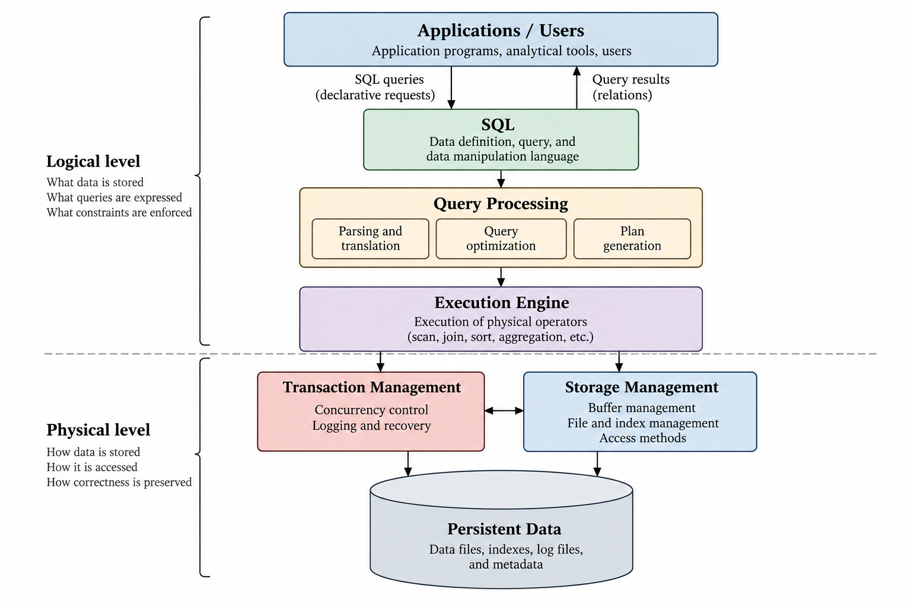{#fig-relational-database-system}

At a high level, the path from an application request to persistent data can be represented as

$$
\text{Application}
\rightarrow
\text{SQL}
\rightarrow
\text{Query Processing}
\rightarrow
\text{Execution}
\rightarrow
\text{Storage}.
$$

This path is accompanied by mechanisms that preserve the correctness of the database:

$$
\text{Constraints}
+
\text{Concurrency Control}
+
\text{Logging and Recovery}.
$$

The distinction between the **logical** and **physical** levels is fundamental. At the logical level, users reason about relations, attributes, keys, constraints, and queries. At the physical level, the DBMS works with records, pages, indexes, buffers, and storage devices. The purpose of the DBMS is not to make the physical level irrelevant, but to prevent applications from having to manage it directly.

This separation is one of the central ideas behind relational database systems. An application can express *what* information it requires without specifying every physical operation required to obtain it. The DBMS can then choose an execution strategy based on the available indexes, the organisation of the data, the amount of memory available, and estimates of the cost of alternative plans.

## The Relational Approach

Database systems can organise information according to different data models. A **data model** specifies the structures used to represent data, the operations that can be performed on those structures, and the constraints that determine which database states are valid [@ullman2009database]. The relational model represents data using relations and provides operations for constructing new relations from existing ones.

Its significance is not merely that relations resemble tables. The relational approach separates the logical description of information from the physical paths used to reach it. An application can request customers satisfying a condition, combine orders with the corresponding products, or aggregate sales by customer without navigating explicit physical pointers from one record to another.

This leads to an important distinction that will be maintained throughout these notes:

$$
\text{Relational Model}
\neq
\text{SQL}
\neq
\text{PostgreSQL}.
$$

The **relational model** is the underlying logical model. **SQL** is a database language influenced by that model, with its own semantics and features. **PostgreSQL** is a concrete DBMS that implements SQL and a large collection of additional mechanisms required to store and process data in practice.

Understanding these layers separately makes it possible to move between theory and implementation without confusing one with the other. The relational model explains the structure and meaning of the data; SQL provides a practical language for working with it; and PostgreSQL exposes how those operations are implemented by an actual database system.

The next step is therefore to define the relational model precisely, beginning with relations, attributes, domains, tuples, schemas, and instances.

# The Relational Model

The relational model provides a logical framework for representing structured data independently of the physical mechanisms used to store it. Rather than requiring an application to navigate records through physical links or storage locations, data is represented through **relations**, and relationships between data are expressed in terms of values. This separation between logical structure and physical representation is one of the defining characteristics of the relational approach.

A data model can be understood in terms of three components: the structures used to represent data, the operations available for manipulating those structures, and the constraints that determine which states are valid [@ullman2009database]. In the relational model, the principal structure is the relation; relational operations transform one or more relations into another relation; and constraints express properties that valid database states must satisfy.

The distinction between these three components will remain important throughout these notes:

$$
\text{Relational Model}
=
\text{Structure}
+
\text{Operations}
+
\text{Constraints}.
$$

The structure of the model is developed first. Its operations will lead naturally to relational algebra and SQL, while its constraints will provide the basis for keys, referential integrity, functional dependencies, and relational database design.

## Relations

A **relation** consists of a set of tuples whose components are associated with a fixed collection of attributes. Informally, a relation can be visualised as a table: each row represents a tuple and each column represents an attribute. The tabular representation is useful, but the underlying relational concepts are more precise than the visual analogy alone.

Consider a simplified relation representing customers:

| customer_id | company_name | city | country |
|:---:|:---:|:---:|:---:|
| ALFKI | Alfreds Futterkiste | Berlin | Germany |
| ANATR | Ana Trujillo Emparedados y helados | México D.F. | Mexico |
| AROUT | Around the Horn | London | UK |

The names `customer_id`, `company_name`, `city`, and `country` are **attributes**. Each horizontal record is a **tuple**, and the complete collection of tuples constitutes a relation.

More formally, let the attributes of a relation be

$$
A_1,A_2,\ldots,A_n,
$$

and let $D_i$ denote the domain associated with attribute $A_i$. A tuple can then be represented as

$$
t=(a_1,a_2,\ldots,a_n),
$$

where

$$
a_i \in D_i
$$

for each $i=1,\ldots,n$.

A relation $R$ over these attributes is a finite set of such tuples:

$$
R \subseteq D_1 \times D_2 \times \cdots \times D_n.
$$ {#eq-relation-cartesian-product}

Equation @eq-relation-cartesian-product gives the mathematical basis of a relation. The Cartesian product $D_1 \times D_2 \times \cdots \times D_n$ contains every possible combination of values from the corresponding domains, while the relation contains only those tuples that belong to the current database state.

For example, if `customer_id` belongs to a domain of valid customer identifiers, `company_name` to a domain of character strings, and `country` to a domain of country names, the `customers` relation contains only the combinations that represent customers currently recorded in the database. The domains describe the values that may occur; the relation identifies the combinations that actually occur.

### Attributes and Domains

An **attribute** identifies a particular component of the information represented by a relation. Its **domain** specifies the set of values from which that component may be drawn.

If a relation schema contains an attribute `unit_price`, for example, its values belong conceptually to a domain of admissible prices. Similarly, an attribute `order_date` draws its values from a date domain, while `customer_id` draws values from the domain used to identify customers.

Domains are important because values are meaningful not only because of their physical representation but also because of what they represent. Two attributes may both be stored as character strings while describing entirely different concepts. A customer identifier and a country name therefore need not be regarded as interchangeable simply because both happen to use textual representations in a DBMS.

This illustrates another distinction that will become important when SQL and PostgreSQL are introduced:

$$
\text{Domain}
\neq
\text{Physical Data Type}.
$$

A domain is a modelling concept describing the permissible values and meaning of an attribute. A DBMS data type is part of the concrete mechanism used to represent and constrain those values. SQL and PostgreSQL provide types and additional constraints through which conceptual domains can be implemented, but the two ideas are not identical.

### Tuples

A **tuple** represents one element of a relation. If $R$ has attributes $A_1,\ldots,A_n$, a tuple $t$ assigns a value to each of those attributes. The value associated with attribute $A_i$ can be denoted by

$$
t[A_i].
$$

For the first customer in the previous example,

$$
t[\text{customer\_id}]=\text{ALFKI}
$$

and

$$
t[\text{country}]=\text{Germany}.
$$

Thinking of tuples as mappings from attributes to values is more precise than thinking only in terms of positions within a row. Attribute names give the components their meaning; their visual order in a displayed table is not an intrinsic property of the relation.

The same principle applies to the tuples themselves. Because a relation is mathematically a set, its tuples have no inherent ordering. Consequently,

$$
\boxed{\text{A relation has no intrinsic row order.}}
$$

The fact that a DBMS displays one row before another does not, by itself, establish an ordering property of the relation. When a particular order is required in SQL, it must be requested explicitly, typically through `ORDER BY`.

A second consequence of the set definition is that a mathematical relation cannot contain duplicate tuples:

$$
t \in R
$$

is a statement of membership, not of how many times $t$ occurs.

This point will require an important qualification when SQL is introduced. The classical relational model uses **set semantics**, whereas SQL query results commonly use **bag**, or multiset, semantics and may therefore contain duplicates. The distinction is deliberate and should not be hidden by treating a relation and an SQL result as exactly the same object.

## Relation Schemas and Instances

A relation must be distinguished from the description of its structure. A **relation schema** specifies the name of the relation together with its attributes and their associated domains. It can be written abstractly as

$$
R(A_1,A_2,\ldots,A_n).
$$

For example, a simplified customer schema could be represented as

$$
\operatorname{Customers}(
\text{customer\_id},
\text{company\_name},
\text{city},
\text{country}
).
$$

The schema describes the structure of the relation. The tuples present at a particular point in time constitute an **instance** of that schema.

This distinction can be expressed as

$$
\boxed{\text{Schema} \neq \text{Instance}.}
$$

The schema is comparatively stable: a customer relation may continue to contain the same attributes for a long period. Its instance changes whenever customers are inserted, removed, or their stored values are modified.

If $R$ denotes a relation schema, its state at time $t$ can be written as

$$
r_t(R).
$$

An update changes the instance:

$$
r_t(R)
\rightarrow
r_{t+1}(R),
$$

without necessarily changing the schema $R$ itself.

For example, inserting a new customer changes the current instance of `customers`, while adding a new attribute to the definition of `customers` changes its schema. These are fundamentally different operations.

A **database schema** extends the same idea to the database as a whole. It describes the collection of relation schemas and the constraints connecting them. A **database instance** is the collection of relation instances present at a particular time.

The distinction therefore applies at two levels:

$$
\begin{aligned}
\text{Relation Schema} &\longleftrightarrow \text{Relation Instance},\\
\text{Database Schema} &\longleftrightarrow \text{Database Instance}.
\end{aligned}
$$

In Northwind, relations such as `customers`, `orders`, `products`, and `order_details` form part of the database schema. The particular customers, orders, and products currently stored form part of its database instance.

{#fig-schema-and-instance}

## Degree and Cardinality

Two simple measures help describe a relation. The **degree**, or arity, of a relation is the number of attributes in its schema. If

$$
R(A_1,A_2,\ldots,A_n),
$$

then

$$
\operatorname{degree}(R)=n.
$$

The **cardinality** of a relation instance is the number of tuples it contains. If $r(R)$ denotes an instance of $R$, then

$$
\operatorname{cardinality}(r(R))=|r(R)|.
$$

These terms describe different dimensions of a relation. Adding another attribute changes its degree, whereas inserting another tuple changes the cardinality of its current instance.

For a relation with four attributes and ninety-one tuples,

$$
\operatorname{degree}(R)=4
$$

while

$$
\operatorname{cardinality}(r(R))=91.
$$

The distinction becomes useful later because query-processing costs often depend strongly on relation cardinalities, while schema structure depends on the attributes and relationships defined at the logical level.

## Keys

A database needs a reliable way to distinguish tuples representing different entities. In the relational model, this requirement is expressed through **keys**.

Let $R$ be a relation schema and let $K$ be a subset of its attributes. $K$ is a **superkey** if no two distinct tuples in any valid instance of $R$ can agree on all attributes in $K$. Formally, for any distinct tuples $t_1$ and $t_2$,

$$
t_1[K] \neq t_2[K].
$$ {#eq-superkey-uniqueness}

A superkey may contain more attributes than are necessary to guarantee uniqueness. A **candidate key** is a minimal superkey: it uniquely identifies tuples, but no proper subset of it does.

Therefore, if $K$ is a candidate key,

$$
K \text{ is a superkey}
$$

and

$$
\forall K' \subset K,\qquad K' \text{ is not a superkey}.
$$

The word *minimal* refers to set inclusion, not to the number of characters, storage size, or numerical magnitude of the key.

Suppose `customer_id` uniquely identifies each customer. Then

$$
\{\text{customer\_id}\}
$$

is a candidate key. The larger set

$$
\{\text{customer\_id},\text{country}\}
$$

is also capable of uniquely identifying customers, but it is only a superkey because `country` is unnecessary for uniqueness.

A relation may have more than one candidate key. One of them can be selected as the **primary key**, while the remaining candidate keys are often described as alternate keys. The choice of primary key does not make the other candidate keys cease to be keys in the relational sense.

This gives the hierarchy

$$
\boxed{
\text{Candidate Key}
\subseteq
\text{Superkey}
}
$$

in the sense that every candidate key is a superkey, while not every superkey is minimal and therefore not every superkey is a candidate key.

Keys are logical constraints on valid relation instances. They should therefore not be confused with indexes:

$$
\boxed{\text{Relational Key} \neq \text{Index}.}
$$

A key states a uniqueness property of the data. An index is a physical access structure intended to support efficient retrieval. A DBMS may create or use an index to enforce a key constraint, but that implementation choice does not make the two concepts equivalent.

## Relationships Between Relations

Relations rarely exist independently. Their attributes allow information represented in one relation to be associated with information represented in another.

Consider simplified schemas for customers and orders:

$$
\operatorname{Customers}(
\underline{\text{customer\_id}},
\text{company\_name},
\text{city},
\text{country}
)
$$

and

$$
\operatorname{Orders}(
\underline{\text{order\_id}},
\text{customer\_id},
\text{order\_date}
).
$$

The `customer_id` attribute in `orders` associates an order with the customer to whom it belongs. In relational database terminology, this association is commonly represented through a **foreign key**.

If $R$ contains a set of attributes $F$ whose values reference a candidate key $K$ of another relation $S$, the foreign-key constraint requires each applicable value of $F$ to correspond to an existing key value in $S$. In the simplified example,

$$
\text{Orders.customer\_id}
\rightarrow
\text{Customers.customer\_id}
$$

can be read informally as a reference from the customer identifier stored with an order to the corresponding customer.

This relationship expresses a constraint on valid database states. An order should not refer to an arbitrary customer identifier that has no corresponding customer. The DBMS can enforce this property through **referential integrity**.

The arrow above denotes a reference rather than a functional dependency. Functional dependencies will be introduced separately when relational design and normalization are considered. Keeping these concepts distinct avoids assigning the same notation or interpretation to two different kinds of relationship.

The customer-order example also illustrates a **one-to-many relationship**: one customer may be associated with many orders, while each order is associated with at most one customer through this reference. More complex relationships can be represented by combining relations and keys. The `order_details` relation, for example, provides the natural bridge between orders and products and allows a many-to-many relationship to be represented relationally.

{#fig-relational-relationships}

The significance of this representation is that relationships are expressed through values and constraints rather than through application-managed physical links. The DBMS remains free to choose how the corresponding records are stored and accessed.

## Logical and Physical Independence

The relational model describes what the data means and how it is logically organised without prescribing a particular physical representation. A relation does not specify which disk page contains a tuple, whether an index exists, whether records are physically adjacent, or which algorithm should be used to evaluate a query.

This separation provides a degree of **physical data independence**. Physical structures can often be changed without changing the logical queries issued by applications. An index may be added, removed, or replaced; data may occupy different pages; and the query optimizer may select different execution plans while the logical query remains unchanged.

For example, the query

```sql
SELECT company_name
FROM customers
WHERE country = 'Germany';
```

states which information is required. It does not specify whether PostgreSQL should scan every tuple in `customers`, use an index, access pages in a particular order, or employ a particular buffering strategy.

Conceptually,

$$
\text{Declarative Query}
\rightarrow
\text{Logical Operations}
\rightarrow
\text{Physical Execution Plan}.
$$

The distinction does not imply that physical representation is unimportant. Physical organisation can have a substantial effect on performance. Rather, it means that the relational interface allows logical reasoning to remain largely independent of those implementation details.

This principle will provide an important connection between the first and second halves of these notes. Relations, schemas, keys, constraints, and relational algebra describe the logical level; pages, indexes, buffers, physical operators, and query plans explain how a DBMS makes those abstractions work efficiently in practice.

# Conceptual Database Design

The relational model provides the structures used to represent data, but it does not by itself determine which relations a database should contain. Before relations can be defined, the relevant parts of the real-world domain must be identified and their relationships understood. This is the purpose of **conceptual database design**.

A useful way to view the design process is as a sequence of increasingly concrete representations:

$$
\text{Real-World Requirements}
\rightarrow
\text{Conceptual Model}
\rightarrow
\text{Relational Schema}
\rightarrow
\text{Database Implementation}.
$$

The conceptual model describes the information that the database must represent without committing prematurely to tables, data types, indexes, or other implementation details. The resulting model can then be translated into a relational schema and ultimately implemented in a DBMS such as PostgreSQL.

One of the most established approaches to conceptual database design is the **Entity-Relationship (E/R) model**. Its basic concepts are entities, attributes, relationships, and constraints on those relationships [@ullman2009database]. The E/R model is not part of the relational model itself. Rather, it provides a higher-level representation from which a relational design can be derived.

## Entities and Entity Sets

An **entity** is a distinguishable object or concept about which information is represented. A particular customer, product, or order can therefore be treated as an entity. An **entity set** is a collection of entities of the same general kind.

For example, an order-processing domain may contain the entity sets `Customer`, `Order`, and `Product`. Individual members might include a particular customer identified by `ALFKI`, an order identified by `10248`, or a particular product.

Each entity set is described by **attributes**. A `Customer` entity may have attributes such as `customer_id`, `company_name`, `city`, and `country`, while a `Product` entity may have `product_id`, `product_name`, and `unit_price`.

At this stage, these attributes describe properties of conceptual entities. They should not yet be confused with physical columns stored in a particular format. The distinction mirrors the separation established earlier between the logical meaning of data and its implementation.

An entity set generally requires a way to distinguish one entity from another. A **key** is a set of attributes whose values uniquely identify an entity within the entity set. For `Customer`, the attribute `customer_id` can serve this purpose; for `Order`, `order_id` can identify individual orders.

The key concept therefore appears at both the conceptual and relational levels. During conceptual modelling it identifies entities; after translation into the relational model it contributes to the key constraints of the corresponding relation.

## Relationships

Entities rarely have meaning in complete isolation. A **relationship** expresses an association among entities belonging to one or more entity sets.

For example, a customer may place an order:

$$
\text{Customer}
\xrightarrow{\text{places}}
\text{Order}.
$$

Similarly, an order contains products:

$$
\text{Order}
\xleftrightarrow{\text{contains}}
\text{Product}.
$$

A collection of relationships of the same type forms a **relationship set**. The E/R model therefore represents not only the objects present in the domain but also the associations that connect them.

Relationships may themselves have attributes. Consider the relationship between an order and a product. The quantity purchased and the discount applied do not naturally describe the product independently of an order, nor the order independently of a product. They describe the participation of that particular product in that particular order.

Conceptually,

$$
\operatorname{Contains}(
\text{Order},
\text{Product},
\text{quantity},
\text{discount}
).
$$

This distinction becomes important when the conceptual model is translated into relations because relationships with their own attributes often require a separate relation.

## Cardinality Constraints

A relationship does not merely state that two kinds of entities can be associated. It may also constrain how many entities can participate on each side. These restrictions are commonly expressed through **cardinality constraints**.

Three common patterns are:

$$
\text{one-to-one }(1:1),
$$

$$
\text{one-to-many }(1:N),
$$

and

$$
\text{many-to-many }(M:N).
$$

In the customer-order relationship, one customer may place many orders, while each order is associated with one customer. This is therefore a one-to-many relationship:

$$
\text{Customer}
\;1
\longleftrightarrow
N\;
\text{Order}.
$$

The order-product relationship is different. An order may contain many products, and a product may appear in many different orders:

$$
\text{Order}
\;M
\longleftrightarrow
N\;
\text{Product}.
$$

Cardinality is not merely diagrammatic notation. It expresses a rule about the domain being modelled and has consequences for the resulting relational schema. A one-to-many relationship can often be represented by placing the key of the entity on the one side into the relation corresponding to the many side. A many-to-many relationship generally requires a separate relation containing keys from both participating relations.

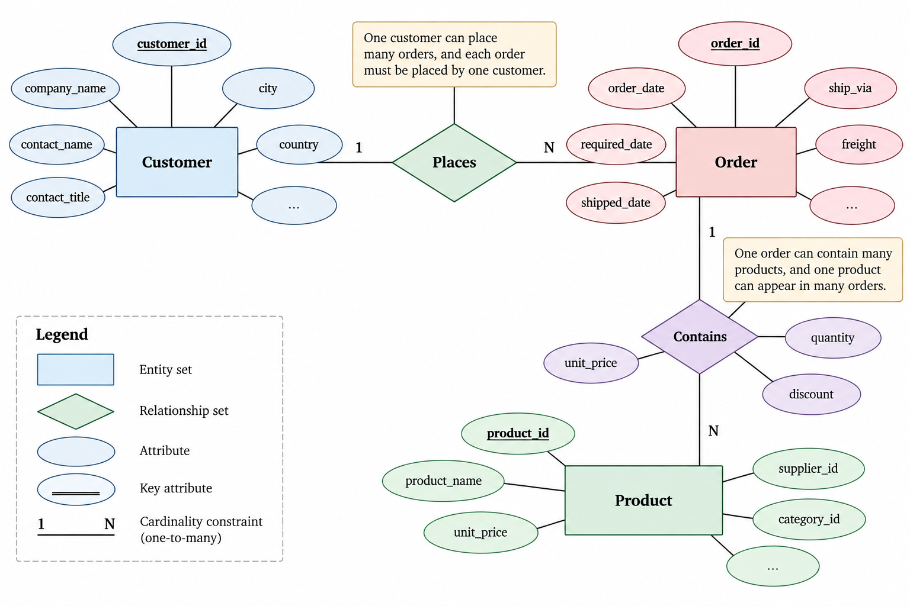{#fig-entity-relationship-model}

Cardinality constraints should be derived from the meaning of the domain rather than from the contents of a particular database instance. The fact that a particular customer currently has only one order does not make the relationship one-to-one. The constraint describes what valid states of the database are permitted to contain.

This reflects a broader principle that will recur throughout relational design:

$$
\boxed{\text{Observed Data} \neq \text{Data Constraint}.}
$$

A constraint describes what must hold for all valid database states, not merely what happens to hold in the data currently observed.

## Participation and Referential Constraints

Cardinality describes how many entities may participate in a relationship, but database design may also need to express whether participation is optional or required.

For example, if every order must belong to a customer, the participation of `Order` in the customer-order relationship is mandatory. If the domain permits customers that have never placed an order, the participation of `Customer` in the same relationship is optional.

These requirements eventually influence the relational implementation. A mandatory reference may require that a foreign-key attribute cannot be `NULL`, while referential integrity ensures that a referenced entity actually exists.

It is useful, however, to preserve the distinction between the conceptual rule and its implementation:

$$
\text{Domain Requirement}
\rightarrow
\text{Conceptual Constraint}
\rightarrow
\text{Relational Constraint}
\rightarrow
\text{SQL Implementation}.
$$

The first question is what the relationship means. Only afterwards should the appropriate SQL mechanism be chosen.

## Weak Entities

Most entities can be identified using attributes that belong to the entity itself. In some cases, however, an entity cannot be uniquely identified without reference to another entity. Such an entity is called a **weak entity**.

Suppose, for example, that an order contains numbered lines and that `line_number` is unique only within a particular order. The value `line_number = 1` does not identify a line globally because many orders can contain their own first line. An order line might instead be identified by

$$
(\text{order\_id},\text{line\_number}).
$$

The weak entity depends on the identifying entity for part of its identity.

Conceptually,

$$
\text{Order}
\rightarrow
\text{Order Line},
$$

where `Order Line` has a partial key such as `line_number`, while the key of `Order` completes its identification.

After translation to the relational model, this commonly produces a composite key. The idea is useful because it shows that composite keys do not arise arbitrarily: they can reflect the identity structure of the domain being represented.

Not every relation with a composite key corresponds to a weak entity, however. Composite keys can arise for other reasons, particularly when representing many-to-many relationships.

## From an E/R Model to Relations

Once the conceptual structure has been established, it must be translated into a relational schema. The mapping is systematic in many common cases, although different valid relational designs may sometimes represent the same conceptual model.

For a regular entity set, the basic mapping is direct:

$$
\text{Entity Set}
\rightarrow
\text{Relation}.
$$

Its simple attributes become attributes of the relation, and its key becomes a candidate key of that relation.

For example,

$$
\operatorname{Customer}(
\underline{\text{customer\_id}},
\text{company\_name},
\text{city},
\text{country}
)
$$

can become the relation

$$
\operatorname{Customers}(
\underline{\text{customer\_id}},
\text{company\_name},
\text{city},
\text{country}
).
$$

A one-to-many relationship can commonly be represented by adding the key from the one side as a foreign key on the many side. Given

$$
\text{Customer}
\;1
\longleftrightarrow
N\;
\text{Order},
$$

the relational representation can include

$$
\operatorname{Orders}(
\underline{\text{order\_id}},
\text{customer\_id},
\text{order\_date}
),
$$

where `customer_id` references the key of `Customers`.

The resulting structure expresses the relationship without requiring a separate relation solely for the customer-order association:

$$
\text{Customers.customer\_id}
\longleftarrow
\text{Orders.customer\_id}.
$$

A many-to-many relationship generally requires a different mapping. Suppose orders and products are related by

$$
\text{Order}
\;M
\longleftrightarrow
N\;
\text{Product}.
$$

Placing a single `product_id` inside `Orders` would incorrectly restrict an order to one product. Similarly, placing a single `order_id` inside `Products` would incorrectly restrict a product to one order. A separate relation resolves the many-to-many relationship:

$$
\operatorname{OrderDetails}(
\underline{\text{order\_id}},
\underline{\text{product\_id}},
\text{unit\_price},
\text{quantity},
\text{discount}
).
$$

The pair

$$
(\text{order\_id},\text{product\_id})
$$

can form a composite key, while its individual components reference `Orders` and `Products`, respectively.

The transformation can therefore be understood as

$$
\text{Many-to-Many Relationship}
\rightarrow
\text{Associative Relation}
\rightarrow
\text{Two One-to-Many Relationships}.
$$

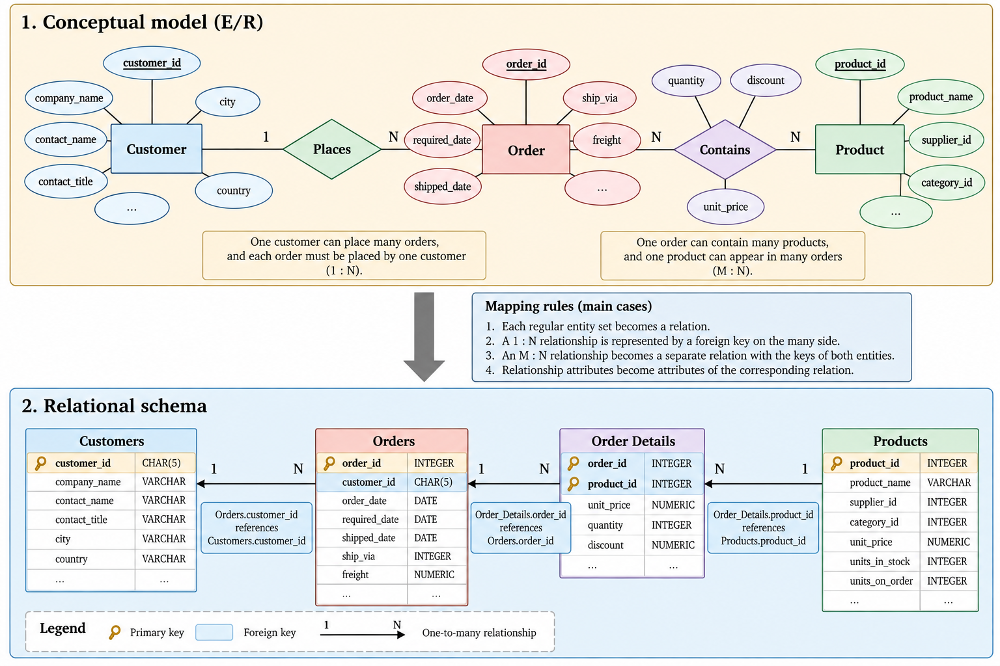{#fig-er-to-relational-mapping}

This mapping illustrates why relational database design should begin with the semantics of the domain rather than with an arbitrary collection of tables. The structure of the relational schema should preserve the entities, relationships, and constraints identified during conceptual design.

## Relationship Attributes and Associative Relations

The `OrderDetails` example also demonstrates why some relationships naturally become relations of their own.

Consider `quantity`. It is not a property of a product alone:

$$
\text{Product}
\not\rightarrow
\text{quantity purchased}.
$$

The same product can be purchased in different quantities in different orders. Nor is `quantity` a property of the order alone because an order can contain several products with different quantities.

Instead, the value belongs to a particular order-product combination:

$$
(\text{order\_id},\text{product\_id})
\rightarrow
\text{quantity}.
$$

The same reasoning applies to a discount that is specific to a product within an order. Such attributes provide a semantic reason for representing the relationship as an associative relation rather than treating it merely as a technical bridge between two tables.

This is an important design principle:

$$
\boxed{\text{Attributes should be attached to the concept whose meaning determines them.}}
$$

The principle will become more precise later through functional dependencies.

## Subtypes and Inheritance

Some domains contain entities that share common properties while particular subsets have additional attributes or behaviour. Conceptual modelling can represent this through **subtypes**, often described using an *is-a* relationship.

For example,

$$
\text{Employee}
\supset
\{\text{Sales Representative},\text{Manager}\}.
$$

Every sales representative is an employee, but not every employee is necessarily a sales representative. Attributes common to all employees can therefore be associated with the general entity type, while subtype-specific attributes can be associated with the appropriate subtype.

There is no single relational representation that is optimal for every subtype structure. Common approaches include using one relation for the general entity and additional relations for its subtypes, or using a single relation containing the attributes required by all possible subtypes. The latter may introduce `NULL` values for attributes that do not apply to every entity.

This is an example of a broader point: translation from a conceptual model to a relational schema is systematic, but it is not always mechanically unique. Different relational representations may preserve the same conceptual meaning while producing different trade-offs in integrity, redundancy, simplicity, and query behaviour.

For the purposes of these notes, subtype modelling is secondary to the more common entity, one-to-many, and many-to-many patterns. Its importance lies primarily in showing that conceptual design and relational design are related but distinct activities.

## From Conceptual Design to Relational Design

A conceptual model attempts to represent the domain correctly, but translating that model into relations does not by itself guarantee that the resulting relational schema has desirable structural properties.

A relation may still contain unnecessary redundancy. Attributes may depend on only part of a key, or on other non-key attributes. Such structures can lead to repeated information and to insertion, deletion, or update anomalies.

Conceptual design and relational design therefore answer related but different questions:

$$
\boxed{
\begin{aligned}
\text{Conceptual Design:}&\quad \text{What information and relationships must be represented?}\\
\text{Relational Design:}&\quad \text{How should that information be organised into relations?}
\end{aligned}
}
$$

The first question leads from the domain to a relational schema. The second requires examining the dependencies within that schema and determining whether its decomposition into relations preserves information while avoiding unnecessary redundancy.

The mathematical tool used to make that reasoning precise is the **functional dependency**. Functional dependencies provide the connection between keys, redundancy, decomposition, and normal forms, and therefore form the basis for the next stage of relational database design.

# Functional Dependencies and Relational Design

A conceptual model identifies the entities and relationships that a database must represent, and its translation produces an initial collection of relations. This does not guarantee, however, that every resulting relation has a good internal structure. A relation may store the same fact repeatedly, combine attributes that describe different concepts, or create dependencies that make modifications unnecessarily difficult.

Relational design studies these structural properties. Its purpose is not simply to divide large relations into smaller ones, but to organise information so that facts are represented with as little unnecessary redundancy as possible while preserving the information and constraints required by the database.

The central concept used to reason about these properties is the **functional dependency**.

## Redundancy and Modification Anomalies

Consider a relation that combines information about orders and customers:

$$
\operatorname{OrderCustomer}(
\text{order\_id},
\text{order\_date},
\text{customer\_id},
\text{company\_name},
\text{city},
\text{country}
).
$$

Suppose a customer can place many orders. If the customer's company name, city, and country are stored with every order, the same customer information is repeated whenever another order is inserted.

A simplified instance might contain:

| order_id | order_date | customer_id | company_name | city | country |
|:---:|:---|:---:|:---:|:---:|:---:|
| 10643 | 1997-08-25 | ALFKI | Alfreds Futterkiste | Berlin | Germany |
| 10692 | 1997-10-03 | ALFKI | Alfreds Futterkiste | Berlin | Germany |
| 10702 | 1997-10-13 | ALFKI | Alfreds Futterkiste | Berlin | Germany |

The repetition is not merely inefficient storage. It means that one fact about the customer is represented in several tuples. If the customer's city changes, every tuple containing that customer must be updated consistently.

This structure can produce three familiar classes of **modification anomaly**.

An **update anomaly** occurs when a fact represented in multiple tuples must be changed in several places. If only some occurrences are updated, the relation can contain contradictory information about the same customer.

An **insertion anomaly** occurs when one fact cannot be recorded without supplying an unrelated fact. If customer information exists only inside `OrderCustomer`, a new customer cannot be represented until that customer places an order unless artificial or missing order values are introduced.

A **deletion anomaly** occurs when deleting one fact unintentionally removes another. If the only order belonging to a customer is deleted, the database may also lose the only stored representation of that customer's company name and address.

These anomalies have a common cause: facts with different dependencies have been combined in the same relation. In the example, order information depends on the order, while customer information depends on the customer.

This motivates a more precise way of describing how attributes depend on one another.

## Functional Dependencies

Let $R$ be a relation schema and let $X$ and $Y$ be sets of attributes of $R$. A **functional dependency**, written

$$
X \rightarrow Y,
$$

holds on $R$ if, for every valid instance $r(R)$, any two tuples that agree on all attributes in $X$ must also agree on all attributes in $Y$ [@ullman2009database].

Formally,

$$
\forall t_1,t_2 \in r(R),
\qquad
t_1[X]=t_2[X]
\Rightarrow
t_1[Y]=t_2[Y].
$$ {#eq-functional-dependency}

The attributes in $X$ are called the **determinant**, while $Y$ contains the attributes functionally determined by $X$.

In the customer example, if each `customer_id` identifies exactly one customer, then the following dependency holds:

$$
\text{customer\_id}
\rightarrow
\{\text{company\_name},\text{city},\text{country}\}.
$$

This states that whenever two tuples have the same `customer_id`, they must also have the same company name, city, and country.

Similarly, if `order_id` uniquely identifies an order,

$$
\text{order\_id}
\rightarrow
\{\text{order\_date},\text{customer\_id}\}.
$$

Combining these dependencies already explains the redundancy in `OrderCustomer`. Because `order_id` determines `customer_id`, and `customer_id` determines the customer attributes, the customer attributes are repeated for every order belonging to the same customer.

A functional dependency is a property of the intended semantics of the relation, not a pattern inferred merely from the current data. If every customer currently happens to live in a different city, the observed instance might suggest

$$
\text{city}
\rightarrow
\text{customer\_id},
$$

but this does not establish a valid functional dependency unless the domain requires every city to contain at most one customer.

Therefore,

$$
\boxed{\text{Observed Uniqueness} \neq \text{Functional Dependency}.}
$$

Functional dependencies describe constraints that must hold for every valid instance of the relation.

## Functional Dependencies and Keys

Keys can be expressed naturally in terms of functional dependencies.

Let the complete set of attributes of relation schema $R$ be denoted by $\operatorname{attrs}(R)$. A set of attributes $K$ is a superkey if

$$
K \rightarrow \operatorname{attrs}(R).
$$

In other words, the values of $K$ determine every attribute of the relation.

A candidate key is a minimal set with this property. Thus, $K$ is a candidate key if

$$
K \rightarrow \operatorname{attrs}(R)
$$

and no proper subset $K' \subset K$ satisfies

$$
K' \rightarrow \operatorname{attrs}(R).
$$

Functional dependencies therefore generalise the notion of a key. A key determines the entire relation, whereas a functional dependency may describe a dependency between only some of its attributes.

For example, consider

$$
R(A,B,C,D)
$$

with dependencies

$$
A \rightarrow B,
$$

$$
B \rightarrow C,
$$

and

$$
A \rightarrow D.
$$

Because $A$ determines $B$, $B$ determines $C$, and $A$ directly determines $D$, it follows that

$$
A \rightarrow ABCD.
$$

Therefore, $A$ is a superkey. Since the empty set does not determine the relation, $A$ is also minimal and hence a candidate key.

The reasoning used in this example can be made systematic through inference rules and attribute closure.

## Reasoning About Functional Dependencies

A set of functional dependencies often implies dependencies that are not stated explicitly. If

$$
A \rightarrow B
$$

and

$$
B \rightarrow C,
$$

then it follows that

$$
A \rightarrow C.
$$

To reason formally about such implications, functional dependencies can be manipulated using **Armstrong's axioms**. These rules are sound and complete for functional dependency inference [@ullman2009database].

### Reflexivity

If $Y \subseteq X$, then

$$
X \rightarrow Y.
$$

For example,

$$
\{A,B\}\rightarrow A.
$$

This dependency follows simply because agreement on both $A$ and $B$ necessarily implies agreement on $A$.

### Augmentation

If

$$
X \rightarrow Y,
$$

then for any set of attributes $Z$,

$$
XZ \rightarrow YZ.
$$

For example, from

$$
A \rightarrow B
$$

we can infer

$$
AC \rightarrow BC.
$$

### Transitivity

If

$$
X \rightarrow Y
$$

and

$$
Y \rightarrow Z,
$$

then

$$
X \rightarrow Z.
$$

For example,

$$
\text{order\_id}
\rightarrow
\text{customer\_id}
$$

and

$$
\text{customer\_id}
\rightarrow
\text{country}
$$

imply

$$
\text{order\_id}
\rightarrow
\text{country}.
$$

These axioms are sufficient to derive every functional dependency logically implied by a given set of dependencies. Several convenient rules follow from them, including union, decomposition, and pseudotransitivity.

For example, if

$$
X \rightarrow Y
$$

and

$$
X \rightarrow Z,
$$

then union gives

$$
X \rightarrow YZ.
$$

Conversely, if

$$
X \rightarrow YZ,
$$

then decomposition gives

$$
X \rightarrow Y
$$

and

$$
X \rightarrow Z.
$$

The objective is not to manipulate dependencies mechanically for their own sake. These rules provide the formal basis for determining keys, detecting redundancy, and verifying whether a decomposition preserves important properties of the original relation.

## Attribute Closure

A particularly useful way to reason about functional dependencies is through **attribute closure**.

Given a set of attributes $X$ and a set of functional dependencies $F$, the closure of $X$ under $F$, denoted by

$$
X^+,
$$

is the set of all attributes functionally determined by $X$ using the dependencies in $F$.

The closure can be computed iteratively. Begin with

$$
X^+=X.
$$

Then repeatedly apply every functional dependency

$$
Y \rightarrow Z
$$

for which

$$
Y \subseteq X^+.
$$

Whenever this condition holds, add the attributes in $Z$ to the closure:

$$
X^+ \leftarrow X^+ \cup Z.
$$

The process terminates when no additional attributes can be added.

Consider

$$
R(A,B,C,D,E)
$$

with

$$
F=
\{
A\rightarrow B,\;
B\rightarrow C,\;
AC\rightarrow D,\;
D\rightarrow E
\}.
$$

To compute $A^+$, begin with

$$
A^+=\{A\}.
$$

Since

$$
A\rightarrow B,
$$

we obtain

$$
A^+=\{A,B\}.
$$

Because $B\rightarrow C$,

$$
A^+=\{A,B,C\}.
$$

Now both $A$ and $C$ belong to the closure, so the dependency

$$
AC\rightarrow D
$$

can be applied:

$$
A^+=\{A,B,C,D\}.
$$

Finally, because

$$
D\rightarrow E,
$$

we obtain

$$
A^+=\{A,B,C,D,E\}.
$$

Therefore,

$$
A^+=\operatorname{attrs}(R),
$$

so $A$ is a superkey. Since $A$ consists of a single attribute and no proper subset can determine all attributes, $A$ is also a candidate key.

Attribute closure gives us two particularly useful tests. First,

$$
Y\subseteq X^+
$$

if and only if the dependency

$$
X\rightarrow Y
$$

is implied by $F$.

Second,

$$
X^+=\operatorname{attrs}(R)
$$

if and only if $X$ is a superkey.

Thus, closure provides a practical bridge between functional dependencies and key discovery.

## Finding Candidate Keys

When a relation has several attributes and dependencies, identifying candidate keys may require testing combinations of attributes. Attribute closure makes this process systematic.

Consider

$$
R(A,B,C,D)
$$

with

$$
F=
\{
A\rightarrow B,\;
C\rightarrow D
\}.
$$

Neither $A$ nor $C$ alone determines the complete relation:

$$
A^+=\{A,B\},
$$

$$
C^+=\{C,D\}.
$$

Now consider the combination $AC$:

$$
(AC)^+=\{A,C\}.
$$

Applying $A\rightarrow B$ gives

$$
(AC)^+=\{A,B,C\},
$$

and applying $C\rightarrow D$ gives

$$
(AC)^+=\{A,B,C,D\}.
$$

Hence,

$$
(AC)^+=\operatorname{attrs}(R),
$$

so $AC$ is a superkey.

To determine whether it is a candidate key, minimality must also be checked. Since neither

$$
A^+
$$

nor

$$
C^+
$$

contains all attributes of $R$, neither attribute can be removed. Therefore,

$$
\boxed{AC\text{ is a candidate key}.}
$$

This illustrates why uniqueness alone is insufficient when reasoning about candidate keys. A candidate key must satisfy both **uniqueness** and **minimality**.

## Minimal Bases

A set of functional dependencies may contain redundant information. Before using dependencies for some design algorithms, it is useful to replace the original set by an equivalent but simpler set, commonly called a **minimal basis** or **minimal cover**.

The objective is to obtain a set of dependencies with three properties:

1. Every functional dependency has a single attribute on its right-hand side.
2. No dependency contains an unnecessary attribute on its left-hand side.
3. No functional dependency can be removed without changing the dependencies implied by the set.

Suppose

$$
F=
\{
A\rightarrow BC,\;
B\rightarrow C,\;
A\rightarrow B
\}.
$$

The first dependency can be decomposed into

$$
A\rightarrow B
$$

and

$$
A\rightarrow C.
$$

The set can therefore be written as

$$
F'=
\{
A\rightarrow B,\;
A\rightarrow C,\;
B\rightarrow C
\}.
$$

But $A\rightarrow C$ is already implied by

$$
A\rightarrow B
$$

and

$$
B\rightarrow C.
$$

Consequently, it is redundant and can be removed:

$$
F_{\min}=
\{
A\rightarrow B,\;
B\rightarrow C
\}.
$$

The minimal basis preserves the logical content relevant to functional dependency inference while removing unnecessary dependencies. This becomes useful when constructing decompositions systematically.

## Decomposition

When a relation contains undesirable dependencies, it may be replaced by several smaller relations. This operation is called **decomposition**.

Suppose

$$
R(A,B,C)
$$

is decomposed into

$$
R_1(A,B)
$$

and

$$
R_2(A,C).
$$

For an instance $r(R)$, the corresponding projected instances are

$$
r_1=\pi_{A,B}(r)
$$

and

$$
r_2=\pi_{A,C}(r).
$$

The decomposition is useful only if the smaller relations collectively preserve the information represented by the original relation. Simply dividing attributes into groups is not enough.

Two properties are particularly important:

- **lossless join**, which ensures that the original relation can be reconstructed without introducing false tuples;
- **dependency preservation**, which determines whether the original functional dependencies can be enforced using the decomposed relations independently.

These properties address different questions and should not be confused.

## Lossless-Join Decomposition

A decomposition is **lossless** if joining the decomposed relations reconstructs exactly the original relation.

For a decomposition of $R$ into $R_1$ and $R_2$,

$$
R_1\cup R_2=R,
$$

the decomposition is lossless with respect to a set of dependencies $F$ if, for every valid instance $r(R)$ satisfying $F$,

$$
\pi_{R_1}(r)
\bowtie
\pi_{R_2}(r)
=
r.
$$ {#eq-lossless-decomposition}

The equality is important. Projection followed by a join should recover the original tuples and **only** the original tuples.

Consider

$$
R(A,B,C)
$$

with tuples

| A | B | C |
|:---:|:---:|:---:|
| 1 | x | p |
| 2 | x | q |

Suppose $R$ is decomposed into

$$
R_1(A,B)
$$

and

$$
R_2(B,C).
$$

The projections are

$$
R_1=
\{(1,x),(2,x)\}
$$

and

$$
R_2=
\{(x,p),(x,q)\}.
$$

Joining them on $B$ produces

| A | B | C |
|:---:|:---:|:---:|
| 1 | x | p |
| 1 | x | q |
| 2 | x | p |
| 2 | x | q |

Two tuples have appeared that were not present in the original relation. These are **spurious tuples**, and the decomposition is therefore lossy.

For a binary decomposition of $R$ into $R_1$ and $R_2$, a useful criterion is that the decomposition is lossless with respect to $F$ if at least one of the following dependencies is implied by $F$:

$$
R_1\cap R_2
\rightarrow
R_1
$$

or

$$
R_1\cap R_2
\rightarrow
R_2.
$$ {#eq-binary-lossless-condition}

In other words, the attributes shared by the two relations must functionally determine all attributes of at least one component.

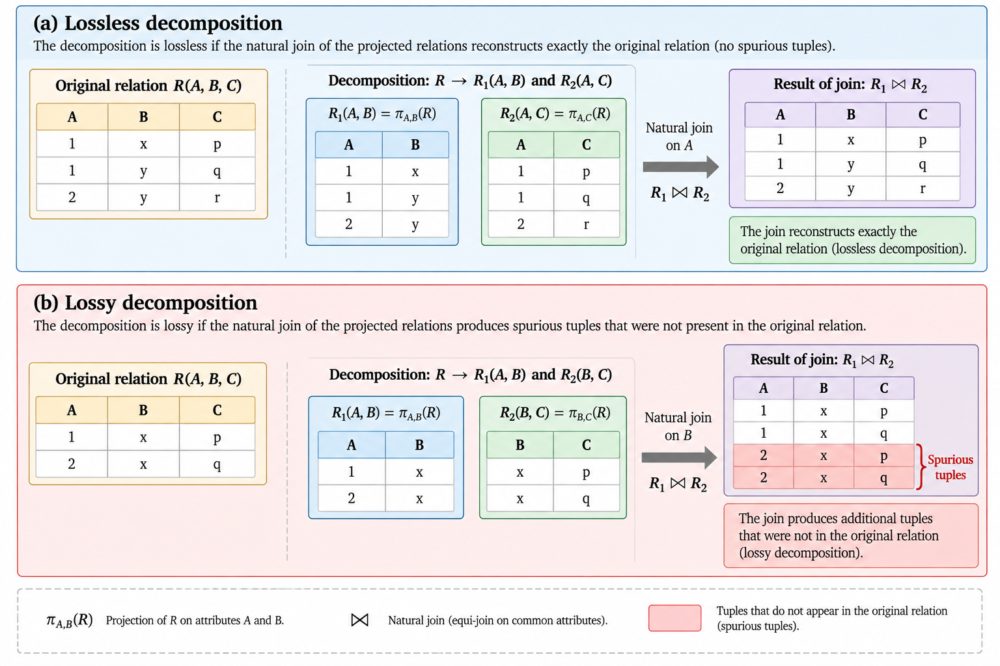{#fig-lossless-and-lossy-decomposition}

## Dependency Preservation

A decomposition may be lossless while making some original dependencies difficult to enforce.

Suppose a relation $R$ is decomposed into

$$
R_1,R_2,\ldots,R_k.
$$

The functional dependencies that involve attributes contained within each $R_i$ can be enforced locally on that relation. A decomposition is **dependency preserving** if these projected dependencies together imply all functional dependencies of the original schema.

Conceptually,

$$
F
\equiv
\left(
F_1\cup F_2\cup\cdots\cup F_k
\right)^+,
$$

where $F_i$ represents the dependencies that can be enforced within $R_i$.

The practical significance is important. If a dependency is not preserved, verifying it may require joining multiple relations. The decomposition may still represent the data correctly, but enforcing its constraints becomes more difficult.

Losslessness and dependency preservation therefore address separate design objectives:

$$
\boxed{
\begin{aligned}
\text{Lossless Join} &\rightarrow \text{Can the original information be reconstructed exactly?}\\
\text{Dependency Preservation} &\rightarrow \text{Can the original dependencies be enforced locally?}
\end{aligned}
}
$$

A good relational design seeks to control redundancy without sacrificing the information or constraints that give the data its meaning.

## Normal Forms

**Normalization** provides systematic criteria for identifying relational structures that may contain undesirable redundancy. A normal form does not measure the quality of a database in every possible respect. Rather, each normal form imposes particular restrictions on the dependencies permitted within a relation.

The progression is often presented as

$$
\text{1NF}
\rightarrow
\text{2NF}
\rightarrow
\text{3NF}
\rightarrow
\text{BCNF}
\rightarrow
\text{4NF}.
$$

This sequence is useful, but it can be misleading if treated as a checklist whose objective is simply to reach the highest possible level. The important questions remain which dependencies create redundancy, what decomposition removes it, and what properties are preserved as a result.

### First Normal Form

A relation is in **First Normal Form (1NF)** when each attribute position contains a single value from the corresponding domain rather than a nested relation or collection of values.

For example, an attribute containing

```text
products = {Chai, Chang, Aniseed Syrup}
```

treats several product values as a single component. A relational representation instead places the individual order-product associations in separate tuples, such as those represented by `order_details`.

For the relational structures considered throughout these notes, 1NF will generally be assumed.

### Second Normal Form

**Second Normal Form (2NF)** addresses dependencies on only part of a composite candidate key. A relation in 1NF is in 2NF if every non-prime attribute is fully functionally dependent on every candidate key rather than on a proper subset of one.

Consider

$$
R(
\text{order\_id},
\text{product\_id},
\text{product\_name},
\text{quantity}
)
$$

with candidate key

$$
(\text{order\_id},\text{product\_id}).
$$

Suppose

$$
\text{product\_id}
\rightarrow
\text{product\_name}.
$$

Then `product_name` depends on only part of the composite key. Storing it in this relation repeats the product name for every order containing that product.

The natural decomposition separates the product fact from the order-product fact:

$$
\operatorname{Products}(
\text{product\_id},
\text{product\_name}
)
$$

and

$$
\operatorname{OrderDetails}(
\text{order\_id},
\text{product\_id},
\text{quantity}
).
$$

2NF is useful for understanding partial dependencies, but the more general design criteria provided by Third Normal Form and Boyce-Codd Normal Form are usually more important in practice.

### Third Normal Form

To define **Third Normal Form (3NF)** precisely, an attribute is called **prime** if it belongs to at least one candidate key.

A relation schema $R$ is in 3NF with respect to a set of functional dependencies $F$ if, for every nontrivial dependency

$$
X\rightarrow A
$$

implied by $F$, at least one of the following conditions holds:

1. $X$ is a superkey; or
2. $A$ is a prime attribute.

A dependency is **nontrivial** when

$$
A\notin X.
$$

Consider again a relation containing order and customer information:

$$
R(
\text{order\_id},
\text{customer\_id},
\text{company\_name}
)
$$

with

$$
\text{order\_id}
\rightarrow
\text{customer\_id}
$$

and

$$
\text{customer\_id}
\rightarrow
\text{company\_name}.
$$

If `order_id` is the only candidate key, then `customer_id` is not a superkey and `company_name` is not prime. Therefore,

$$
\text{customer\_id}
\rightarrow
\text{company\_name}
$$

violates 3NF.

The decomposition

$$
R_1(
\text{order\_id},
\text{customer\_id}
)
$$

and

$$
R_2(
\text{customer\_id},
\text{company\_name}
)
$$

separates the two facts and eliminates the repeated customer name from the order relation.

### Boyce-Codd Normal Form

**Boyce-Codd Normal Form (BCNF)** imposes a stronger requirement. A relation schema $R$ is in BCNF if, for every nontrivial functional dependency

$$
X\rightarrow Y
$$

implied by $F$,

$$
X
$$

is a superkey.

Equivalently,

$$
\boxed{
X\rightarrow Y
\text{ nontrivial}
\Rightarrow
X\text{ is a superkey}.
}
$$ {#eq-bcnf-condition}

BCNF therefore requires every determinant of a nontrivial dependency to identify an entire tuple.

Because 3NF permits a dependency whose determinant is not a superkey when the right-hand side is prime, BCNF is stricter:

$$
\boxed{\text{BCNF} \Rightarrow \text{3NF}.}
$$

The converse does not necessarily hold.

The distinction exists for an important reason. BCNF eliminates redundancy associated with functional dependencies more aggressively, but a BCNF decomposition may fail to preserve all dependencies. 3NF permits certain structures that BCNF rejects in exchange for the possibility of preserving dependencies.

Thus,

$$
\boxed{\text{Higher Normal Form} \neq \text{Automatically Better Design}.}
$$

The design decision must consider the properties preserved by the decomposition, not merely the name of the resulting normal form.

## BCNF Decomposition

Suppose a relation $R$ violates BCNF because

$$
X\rightarrow Y
$$

is a nontrivial functional dependency and $X$ is not a superkey.

A standard decomposition separates the attributes determined by $X$ from the remaining attributes:

$$
R_1=X\cup Y
$$

and

$$
R_2=R-(Y-X).
$$

Consider

$$
R(A,B,C)
$$

with dependencies

$$
A\rightarrow B
$$

and

$$
B\rightarrow C.
$$

Since

$$
A^+=\{A,B,C\},
$$

$A$ is a candidate key.

However,

$$
B^+=\{B,C\},
$$

so $B$ is not a superkey. Therefore,

$$
B\rightarrow C
$$

violates BCNF.

Using the violating dependency, decompose $R$ into

$$
R_1(B,C)
$$

and

$$
R_2(A,B).
$$

In $R_1$, $B$ is a key because

$$
B\rightarrow C.
$$

In $R_2$, $A$ is a key because

$$
A\rightarrow B.
$$

Both resulting relations are therefore in BCNF.

The decomposition is also lossless because

$$
R_1\cap R_2=\{B\}
$$

and

$$
B\rightarrow R_1.
$$

This example illustrates the complete reasoning process:

$$
\text{Dependencies}
\rightarrow
\text{Closure}
\rightarrow
\text{Keys}
\rightarrow
\text{BCNF Violation}
\rightarrow
\text{Decomposition}
\rightarrow
\text{Lossless-Join Check}.
$$

Normalization becomes much easier to reason about when approached through this sequence rather than by memorising normal-form definitions independently.

## Synthesis into Third Normal Form

BCNF decomposition guarantees a lossless decomposition, but it does not guarantee dependency preservation. When preserving the original functional dependencies is important, a decomposition into 3NF can be constructed systematically from a minimal basis.

Let $F_{\min}$ be a minimal basis for the functional dependencies. For each dependency

$$
X\rightarrow A
$$

in $F_{\min}$, construct a relation containing

$$
X\cup\{A\}.
$$

Relations that are contained entirely within another generated relation can be removed. If none of the resulting relations contains a candidate key of the original relation, add one relation containing a candidate key.

The resulting decomposition can be constructed so that it is in 3NF, preserves the functional dependencies, and has the lossless-join property.

This produces an important contrast:

$$
\begin{array}{c|c|c}
 & \text{Lossless Join} & \text{Dependency Preservation} \\
\hline
\text{BCNF decomposition} & \text{Yes} & \text{Not always} \\
\text{3NF synthesis} & \text{Yes} & \text{Yes}
\end{array}
$$

The distinction explains why 3NF remains practically important even though BCNF imposes a stronger condition on functional dependencies.

## Multivalued Dependencies and Fourth Normal Form

Functional dependencies describe situations in which one set of attributes determines another. Some forms of redundancy arise even when no problematic functional dependency exists.

Consider a relation

$$
R(
\text{employee},
\text{language},
\text{skill}
)
$$

where an employee may speak several languages and possess several technical skills, and suppose these two sets are independent.

If an employee speaks two languages and has three skills, representing both facts in a single relation requires all six combinations. The redundancy does not arise because `employee` functionally determines a single language or a single skill. Instead, each employee determines a **set** of languages independently of the set of skills.

This situation can be expressed through a **multivalued dependency**:

$$
\text{employee}
\twoheadrightarrow
\text{language}.
$$

The corresponding independent dependency is

$$
\text{employee}
\twoheadrightarrow
\text{skill}.
$$

A relation is in **Fourth Normal Form (4NF)** if, for every nontrivial multivalued dependency

$$
X\twoheadrightarrow Y,
$$

$X$ is a superkey.

The problematic relation can therefore be decomposed into

$$
R_1(
\text{employee},
\text{language}
)
$$

and

$$
R_2(
\text{employee},
\text{skill}
).
$$

The independent facts are then represented independently rather than through their Cartesian combinations.

Fourth Normal Form extends the same underlying design principle beyond functional dependencies:

$$
\boxed{\text{Independent facts should be represented independently.}}
$$

For most transactional relational designs, functional dependencies, 3NF, and BCNF provide the central tools. Multivalued dependencies and 4NF become important when independent multi-valued properties would otherwise create systematic redundancy.

## Normalization as a Design Tool

Normalization should not be treated as a mechanical objective of transforming every database into the highest normal form possible. It is a method for reasoning about dependencies, redundancy, and the consequences of decomposition.

A sound normalization analysis asks:

1. What facts does the relation represent?
2. Which functional dependencies follow from the semantics of those facts?
3. What are the candidate keys?
4. Which dependencies introduce redundancy?
5. Does a proposed decomposition preserve the original information?
6. Are the relevant dependencies still enforceable?
7. What trade-offs does the resulting design introduce for the expected workload?

The general reasoning process can be summarised as

$$
\boxed{
\text{Semantics}
\rightarrow
\text{Functional Dependencies}
\rightarrow
\text{Keys}
\rightarrow
\text{Redundancy}
\rightarrow
\text{Decomposition}
\rightarrow
\text{Normal Forms}.
}
$$

This perspective also explains why normalization belongs to logical database design rather than physical optimization. Decomposing a relation because its attributes represent different facts is fundamentally different from creating an index because a particular query needs a faster access path.

A well-designed relational schema provides the structures on which queries operate. The next step is therefore to study those operations formally through **relational algebra**, which provides the mathematical foundation for selecting, projecting, combining, grouping, and transforming relations.

# Relational Algebra

The relational model requires not only structures for representing data but also operations for retrieving and transforming it. **Relational algebra** provides a formal collection of such operations. Each operator takes one or more relations as input and produces another relation as output [@ullman2009database].

This property is known as **closure**:

$$
\text{Relations}
\xrightarrow{\text{Relational Operators}}
\text{Relations}.
$$

Because the result of an operation is itself a relation, operations can be composed. The output of one expression can become the input to another, allowing complex queries to be constructed from a relatively small set of operators.

Consider the simplified schemas

$$
\operatorname{Customers}(
\text{customer\_id},
\text{company\_name},
\text{city},
\text{country}
)
$$

and

$$
\operatorname{Orders}(
\text{order\_id},
\text{customer\_id},
\text{order\_date}
).
$$

A query such as "find the names of customers from Germany who have placed an order" can be expressed by combining operations that select German customers, join them with orders, and retain only the required company names. Relational algebra provides a precise language for describing this transformation.

This formal representation is useful for more than mathematical notation. Relational algebra provides a conceptual foundation for understanding how declarative queries can be transformed, simplified, and ultimately converted into executable query plans.

## Selection

The **selection** operator chooses tuples satisfying a predicate. If $R$ is a relation and $P$ is a condition evaluated over its tuples, selection is written as

$$
\sigma_P(R).
$$

The result contains exactly those tuples $t$ for which $P(t)$ is true:

$$
\sigma_P(R)
=
\{t\in R\mid P(t)\}.
$$ {#eq-selection}

For example, customers located in Germany can be represented as

$$
\sigma_{\text{country}=\text{'Germany'}}(\text{Customers}).
$$

If `Customers` contains

| customer_id | company_name | city | country |
|:---:|:---:|:---:|:---:|
| ALFKI | Alfreds Futterkiste | Berlin | Germany |
| ANATR | Ana Trujillo | México D.F. | Mexico |
| AROUT | Around the Horn | London | UK |
| BLAUS | Blauer See Delikatessen | Mannheim | Germany |

then the selection produces

| customer_id | company_name | city | country |
|:---:|:---:|:---:|:---:|
| ALFKI | Alfreds Futterkiste | Berlin | Germany |
| BLAUS | Blauer See Delikatessen | Mannheim | Germany |

Selection changes the **cardinality** of the relation but does not change its degree. The resulting relation has the same attributes as the input relation:

$$
\operatorname{degree}(\sigma_P(R))
=
\operatorname{degree}(R),
$$

while

$$
|\sigma_P(R)|
\leq
|R|.
$$

Several predicates can be combined using logical operators. For example,

$$
\sigma_{\text{country}=\text{'Germany'}\land\text{city}=\text{'Berlin'}}(\text{Customers})
$$

selects customers satisfying both conditions.

Selection corresponds conceptually to filtering tuples. In SQL, this role is commonly associated with `WHERE`, although relational algebra and SQL should not be treated as identical languages.

## Projection

The **projection** operator chooses attributes rather than tuples. If $A_1,\ldots,A_k$ are attributes of relation $R$, projection is written as

$$
\pi_{A_1,\ldots,A_k}(R).
$$

For example,

$$
\pi_{\text{company\_name},\text{country}}(\text{Customers})
$$

retains only the company name and country attributes.

If the input is

| customer_id | company_name | city | country |
|:---:|:---:|:---:|:---:|
| ALFKI | Alfreds Futterkiste | Berlin | Germany |
| BLAUS | Blauer See Delikatessen | Mannheim | Germany |

then the projection is

| company_name | country |
|:---:|:---:|
| Alfreds Futterkiste | Germany |
| Blauer See Delikatessen | Germany |

Projection changes the degree of a relation:

$$
\operatorname{degree}
\left(
\pi_{A_1,\ldots,A_k}(R)
\right)
=
k.
$$

In classical relational algebra, relations are sets. Projection therefore eliminates duplicate tuples that may arise after attributes are removed.

Suppose

| customer_id | country |
|;---:|:---:|
| ALFKI | Germany |
| BLAUS | Germany |
| ANATR | Mexico |

Then

$$
\pi_{\text{country}}(\text{Customers})
$$

produces

| country |
|:---:|
| Germany |
| Mexico |

rather than two occurrences of `Germany`.

This behaviour is an important point of divergence from SQL. SQL generally preserves duplicates unless they are explicitly removed, for example with `DISTINCT`.

Thus,

$$
\boxed{\text{Relational Projection} \neq \text{SQL SELECT list exactly}.}
$$

The correspondence is conceptually useful, but the semantics are not identical.

## Combining Selection and Projection

Because relational algebra is closed, selection and projection can be composed. To obtain the names of German customers, for example,

$$
\pi_{\text{company\_name}}
\left(
\sigma_{\text{country}=\text{'Germany'}}
(\text{Customers})
\right).
$$

The expression should be read from the inside outward. First,

$$
\sigma_{\text{country}=\text{'Germany'}}
(\text{Customers})
$$

constructs a relation containing German customers. Then

$$
\pi_{\text{company\_name}}
$$

retains only their company names.

This composition illustrates an important idea:

$$
\boxed{\text{Complex Query}=\text{Composition of Relational Operations}.}
$$

The same logical request can sometimes be represented by several algebraically equivalent expressions. This property will later become important for query optimization because equivalent expressions may have very different physical execution costs.

## Renaming

The **rename** operator changes the name of a relation or its attributes without changing its tuples. It is commonly denoted by $\rho$.

For example,

$$
\rho_C(\text{Customers})
$$

renames the relation `Customers` as $C$.

Attributes can also be renamed. Conceptually,

$$
\rho_{\text{customer\_id}\rightarrow\text{id}}(\text{Customers})
$$

changes the attribute name while preserving the underlying values.

Renaming becomes especially important when the same relation appears more than once in an expression or when two relations contain attributes with identical names. It allows references to remain unambiguous without altering the information represented.

## Set Operations

Because relations are sets, standard set operations can be applied when the participating relations have compatible schemas.

### Union

The union

$$
R\cup S
$$

contains every tuple belonging to either $R$ or $S$:

$$
R\cup S
=
\{t\mid t\in R\lor t\in S\}.
$$

For union to be meaningful, $R$ and $S$ must be **union-compatible**: they must have corresponding attributes drawn from compatible domains.

For example, if two relations contain customer identifiers from different regions,

$$
\text{EuropeanCustomers}
\cup
\text{AmericanCustomers}
$$

produces the set of customer identifiers appearing in either relation.

### Intersection

The intersection

$$
R\cap S
$$

contains tuples present in both relations:

$$
R\cap S
=
\{t\mid t\in R\land t\in S\}.
$$

For example, if one relation contains customers who placed orders in 1996 and another contains customers who placed orders in 1997,

$$
\text{Customers1996}
\cap
\text{Customers1997}
$$

contains customers appearing in both sets.

### Difference

The difference

$$
R-S
$$

contains tuples belonging to $R$ but not to $S$:

$$
R-S
=
\{t\mid t\in R\land t\notin S\}.
$$

Using the same example,

$$
\text{Customers1996}
-
\text{Customers1997}
$$

returns customers who appear in the first relation but not the second.

Set difference is particularly useful for expressing queries involving absence, such as customers who have never placed an order or products that have not appeared in a particular collection of transactions.

## Cartesian Product

The **Cartesian product** combines every tuple of one relation with every tuple of another:

$$
R\times S.
$$

If

$$
|R|=m
$$

and

$$
|S|=n,
$$

then

$$
|R\times S|=mn.
$$ {#eq-cartesian-product-cardinality}

The degree is additive:

$$
\operatorname{degree}(R\times S)
=
\operatorname{degree}(R)
+
\operatorname{degree}(S).
$$

Suppose

$$
R=
\{r_1,r_2\}
$$

and

$$
S=
\{s_1,s_2,s_3\}.
$$

Then

$$
R\times S
=
\{
(r_1,s_1),
(r_1,s_2),
(r_1,s_3),
(r_2,s_1),
(r_2,s_2),
(r_2,s_3)
\}.
$$

The Cartesian product is fundamental because it provides the basis from which joins can be defined. By itself, however, it often produces many combinations that have no semantic meaning.

For example,

$$
\text{Customers}\times\text{Orders}
$$

pairs every customer with every order, including orders belonging to other customers. The meaningful combinations can be obtained by selecting those for which the customer identifiers agree:

$$
\sigma_{\text{Customers.customer\_id}
=
\text{Orders.customer\_id}}
(
\text{Customers}\times\text{Orders}
).
$$

This expression leads directly to the join operator.

## Joins

A **join** combines tuples from two relations according to a condition. It is one of the most important operations in relational database systems because information that has been separated into well-designed relations frequently needs to be recombined when queried.

A general conditional join, or **theta join**, can be defined as

$$
R\bowtie_{\theta}S
=
\sigma_{\theta}(R\times S).
$$ {#eq-theta-join}

For customers and orders,

$$
\text{Customers}
\bowtie_{
\text{Customers.customer\_id}
=
\text{Orders.customer\_id}
}
\text{Orders}
$$

pairs each order with its corresponding customer.

The equality condition makes this particular case an **equi-join**.

A **natural join** automatically joins relations on attributes with the same name and compatible meaning, retaining only one copy of each common join attribute. If both `Customers` and `Orders` contain `customer_id`, then

$$
\text{Customers}\bowtie\text{Orders}
$$

can express the corresponding natural join.

Natural join is concise mathematically, but its implicit matching rule requires care in practical database work. Two attributes sharing the same name do not necessarily represent the same concept, and schema changes can alter which attributes are matched. Explicit join conditions are therefore often clearer in SQL.

{#fig-core-relational-operators}

## Join Cardinality

The cardinality of a join depends on the relationship between the participating relations.

For arbitrary relations,

$$
0
\leq
|R\bowtie_{\theta}S|
\leq
|R||S|.
$$

The upper bound corresponds to the Cartesian product when every pair satisfies the join condition.

More useful bounds can be obtained when key constraints are known. Suppose `Customers.customer_id` is a key of `Customers` and `Orders.customer_id` is a foreign key referencing it. If every order contains a valid non-null customer reference, then each order matches exactly one customer.

Consequently,

$$
|\text{Customers}\bowtie\text{Orders}|
=
|\text{Orders}|.
$$

This result follows from the relational constraints rather than from the join syntax alone. It illustrates how schema information can be used to reason about query results and, later, about query cardinality estimates.

## Outer Joins

An ordinary join retains only tuples that satisfy the join condition. Sometimes the desired result must also preserve tuples for which no match exists. **Outer joins** extend join semantics for this purpose.

A **left outer join**

$$
R\;\leftouterjoin\;S
$$

preserves every tuple from $R$. When no corresponding tuple exists in $S$, the missing attributes are represented using null values.

Similarly, a **right outer join** preserves all tuples from $S$, while a **full outer join** preserves unmatched tuples from both relations.

Conceptually, a left outer join can be viewed as

$$
\text{Matched Tuples}
+
\text{Unmatched Left Tuples}.
$$

For example, an inner join between `Customers` and `Orders` returns customers only when matching orders exist. A left outer join can retain customers even when they have never placed an order.

Outer joins therefore answer a different question from inner joins:

$$
\boxed{
\begin{aligned}
\text{Inner Join:}&\quad \text{Which tuples match?}\\
\text{Outer Join:}&\quad \text{Which tuples match, while preserving specified nonmatches?}
\end{aligned}
}
$$

The use of null values introduces semantics that go beyond the classical set-based relational model. Their consequences will be examined more carefully when SQL and its three-valued logic are introduced.

## Duplicate Elimination

Extended relational algebra commonly includes a duplicate-elimination operator, denoted by

$$
\delta(R).
$$

Under strict set semantics, this operation would be unnecessary because a relation cannot contain duplicate tuples. It becomes useful when the algebra is extended to model SQL-style **bag semantics**, under which a tuple may occur more than once.

If

$$
R=
\{a,a,b,b,b,c\}
$$

is interpreted as a bag, then

$$
\delta(R)
=
\{a,b,c\}.
$$

This corresponds conceptually to the role played by `DISTINCT` in SQL.

The distinction between set and bag semantics affects more than duplicate elimination. It can change cardinalities throughout a query and therefore influence both the meaning and cost of operations.

## Grouping and Aggregation

Many database queries do not merely retrieve individual tuples; they summarise collections of tuples. Extended relational algebra therefore introduces **grouping and aggregation**, commonly represented using the operator $\gamma$.

Suppose `OrderDetails` contains `order_id`, `unit_price`, `quantity`, and `discount`. Ignoring discount for the moment, the value associated with one line can be represented as

$$
\text{line\_value}
=
\text{unit\_price}\times\text{quantity}.
$$

The total value for each order can then be represented conceptually as

$$
\gamma_{
\text{order\_id};
\operatorname{SUM}(\text{unit\_price}\times\text{quantity})
\rightarrow\text{order\_total}
}
(\text{OrderDetails}).
$$

The operator partitions tuples according to the grouping attributes and computes an aggregate for each group.

Common aggregate functions include

$$
\operatorname{COUNT},
\qquad
\operatorname{SUM},
\qquad
\operatorname{AVG},
\qquad
\operatorname{MIN},
\qquad
\operatorname{MAX}.
$$

If a relation contains $n$ tuples and grouping produces $g$ distinct groups, then the resulting grouped relation contains

$$
g\leq n
$$

tuples, assuming one result tuple is produced per group.

Grouping changes the level at which information is represented. A relation containing one tuple per order line can be transformed into one containing one tuple per order, customer, country, or another grouping unit.

This distinction is fundamental in analytical queries because the interpretation of an aggregate depends on its **grain**.

## Extended Projection

Projection can also be extended beyond simply selecting existing attributes. An **extended projection** may compute expressions and assign names to the resulting attributes.

For example,

$$
\pi_{
\text{order\_id},
(\text{unit\_price}\times\text{quantity})
\rightarrow\text{line\_value}
}
(\text{OrderDetails})
$$

constructs a relation containing the order identifier and a derived line value.

This provides an algebraic counterpart to expressions appearing in a SQL `SELECT` list.

Extended projection is useful because many queries construct new values rather than merely returning stored attributes. Arithmetic transformations, conditional expressions, and other derived quantities can therefore be viewed as part of the relational transformation itself.

## Sorting

Classical relations are unordered sets, so ordering is not part of the classical relational model. Practical query languages nevertheless frequently need ordered output.

Extended relational algebra can represent sorting with an operator such as

$$
\tau_{\text{order\_date}}(\text{Orders}).
$$

The result should be understood as an ordered sequence for presentation or subsequent processing rather than as a classical mathematical relation in the strictest sense.

This distinction matters:

$$
\boxed{\text{Relation} \neq \text{Ordered Table Display}.}
$$

A query result may appear consistently ordered during several executions without that order being logically guaranteed. If order matters, it must be requested explicitly.

In SQL, this requirement is expressed through `ORDER BY`.

## Relational Expressions as Query Trees

Nested relational algebra expressions can be represented as trees. Leaves correspond to input relations, while internal nodes correspond to relational operators.

Consider the request:

> Find the company names of German customers who have placed orders.

One possible relational algebra expression is

$$
\pi_{\text{company\_name}}
\left(
\sigma_{\text{country}=\text{'Germany'}}
(\text{Customers})
\bowtie_{
\text{Customers.customer\_id}
=
\text{Orders.customer\_id}
}
\text{Orders}
\right).
$$

Its logical structure can be represented as

$$
\begin{array}{c}
\pi_{\text{company\_name}}\\
|\\
\bowtie_{\text{customer\_id}}\\
/\qquad\backslash\\
\sigma_{\text{country}=\text{'Germany'}}\qquad\text{Orders}\\
|\\
\text{Customers}
\end{array}
$$

The tree makes the sequence of logical operations explicit. However, it does not yet determine how those operations will be physically executed.

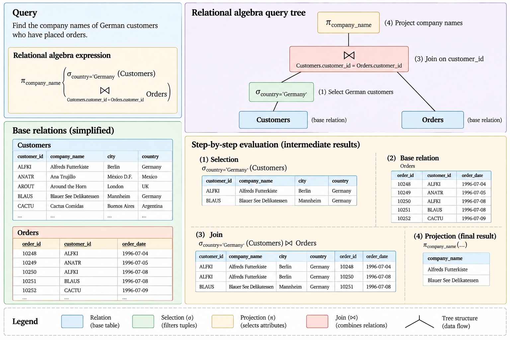{#fig-relational-query-tree}

This distinction will become central later:

$$
\boxed{\text{Logical Operator} \neq \text{Physical Operator}.}
$$

A logical join specifies which tuples should be combined. It does not determine whether the DBMS should use a nested-loop join, hash join, merge join, or another physical algorithm.

## Algebraic Equivalences

Different relational algebra expressions can produce the same result. These **equivalences** are important because they allow a query to be transformed without changing its logical meaning.

For example, selections can generally be cascaded:

$$
\sigma_{P\land Q}(R)
=
\sigma_P(\sigma_Q(R)).
$$

They can also be reordered:

$$
\sigma_P(\sigma_Q(R))
=
\sigma_Q(\sigma_P(R)).
$$

Selections involving only attributes from one side of a join can often be applied before the join. If predicate $P$ references only attributes of $R$, then

$$
\sigma_P(R\bowtie S)
=
\sigma_P(R)\bowtie S.
$$ {#eq-selection-pushdown}

This equivalence has an important practical consequence. Suppose

$$
|R|=1{,}000{,}000
$$

but the predicate retains only

$$
|\sigma_P(R)|=10{,}000
$$

tuples.

Joining first potentially exposes the join operator to a relation containing one million tuples, whereas applying the selection first reduces that input to ten thousand tuples. The two expressions may be logically equivalent while presenting very different execution opportunities.

Projection can often be pushed downward as well, provided that attributes required by subsequent operators are retained. Removing unused attributes early can reduce the width of intermediate tuples.

A Cartesian product followed by an appropriate selection can be rewritten as a join:

$$
\sigma_{\theta}(R\times S)
=
R\bowtie_{\theta}S.
$$

These transformations illustrate a central principle of query processing:

$$
\boxed{\text{Logical Equivalence} \neq \text{Equal Execution Cost}.}
$$

Relational algebra therefore serves two purposes. It provides a formal language for expressing queries, and it provides transformation rules through which equivalent logical expressions can be explored.

## Relational Algebra and SQL

Relational algebra and SQL are closely related, but they are not interchangeable.

A useful conceptual correspondence is

| Relational algebra | SQL construct |
|:---:|:---:|
| $\sigma$ | `WHERE` |
| $\pi$ | `SELECT` list |
| $\bowtie$ | `JOIN ... ON` |
| $\cup$ | `UNION` |
| $-$ | `EXCEPT` |
| $\delta$ | `DISTINCT` |
| $\gamma$ | `GROUP BY` and aggregates |
| $\tau$ | `ORDER BY` |

These correspondences describe roles rather than exact semantic identities.

Classical relational algebra is fundamentally based on sets, whereas SQL commonly operates with bags. Classical relations do not contain null values, whereas SQL does. SQL also provides ordering, aggregation, scalar expressions, subqueries, window functions, and many other facilities whose semantics extend beyond the basic relational algebra.

Consequently,

$$
\boxed{\text{Relational Algebra} \neq \text{SQL}.}
$$

Relational algebra provides the logical vocabulary required to reason about transformations of relations. SQL provides the practical declarative language through which those transformations are requested from a DBMS.

This distinction also explains an important property of SQL. A user normally specifies **what** result is required rather than prescribing the physical sequence of operations used to obtain it. The DBMS can translate the SQL query into a logical representation, transform that representation using equivalences such as selection pushdown, and choose physical algorithms based on estimated execution costs.

The progression from the relational model to executable database operations can therefore be represented as

$$
\boxed{
\text{Relational Model}
\rightarrow
\text{Relational Algebra}
\rightarrow
\text{SQL}
\rightarrow
\text{Logical Plan}
\rightarrow
\text{Physical Plan}.
}
$$

The next step is to examine SQL itself: how relational operations are expressed in a practical database language, how SQL's bag and `NULL` semantics differ from the classical relational model, and how queries, aggregation, subqueries, and data modification are expressed in PostgreSQL.

# SQL

Relational algebra provides a formal language for describing transformations of relations, but database applications require a practical language through which those transformations can be expressed and executed. **SQL** provides this interface. It combines facilities for querying data, defining database structures, modifying database state, declaring constraints, controlling transactions, and managing access to database objects [@ullman2009database].

SQL is strongly influenced by the relational model, but it is not a direct implementation of classical relational algebra. Several differences are fundamental. SQL normally permits duplicate rows, supports `NULL` values, introduces three-valued logic, provides aggregation and ordering, and contains constructs that extend well beyond the classical relational operators.

The relationship established earlier should therefore remain explicit:

$$
\boxed{
\text{Relational Model}
\neq
\text{Relational Algebra}
\neq
\text{SQL}.
}
$$

In these notes, SQL will first be studied as a declarative query language. PostgreSQL-specific implementation details will be introduced separately where they affect behaviour or provide concrete mechanisms for concepts developed at the relational level.

## Declarative Querying

SQL is primarily **declarative**. A query describes the required result without normally prescribing the physical algorithm that must be used to produce it.

Consider the request to retrieve customers located in Germany:

```sql
SELECT customer_id, company_name
FROM customers
WHERE country = 'Germany';
```

The query specifies the required attributes, the source relation, and the condition that qualifying rows must satisfy. It does not specify whether the DBMS should perform a sequential scan, use an index, read particular pages first, or employ a particular buffering strategy.

Conceptually,

$$
\text{SQL Query}
\rightarrow
\text{Logical Interpretation}
\rightarrow
\text{Physical Execution Strategy}.
$$

This separation is fundamental. The same SQL query can be executed using different physical plans as the database contents, indexes, statistics, available memory, or optimizer estimates change.

## The SELECT-FROM-WHERE Query

The basic SQL query has the form

```sql
SELECT <expressions>
FROM <sources>
WHERE <predicate>;
```

Its three clauses perform conceptually different roles. `FROM` identifies the source relations, `WHERE` determines which combinations of rows qualify, and `SELECT` determines which expressions appear in the result.

For example,

```sql
SELECT company_name, city
FROM customers
WHERE country = 'Germany';
```

has a natural relational-algebra interpretation:

$$
\pi_{\text{company\_name},\text{city}}
\left(
\sigma_{\text{country}=\text{'Germany'}}
(\text{Customers})
\right).
$$

This correspondence is useful, but it should not be interpreted as a literal execution order. SQL describes a result declaratively; the DBMS is free to transform the query into an equivalent logical representation and choose an appropriate physical plan.

A useful conceptual evaluation order for a simple query is

$$
\texttt{FROM}
\rightarrow
\texttt{WHERE}
\rightarrow
\texttt{SELECT}.
$$

This differs from the written order of the clauses:

$$
\texttt{SELECT}
\rightarrow
\texttt{FROM}
\rightarrow
\texttt{WHERE}.
$$

The distinction helps explain, among other things, why an alias created in a `SELECT` list is generally not available to the `WHERE` clause of the same query level: the filtering condition conceptually applies before the final projection is constructed.

## Expressions and Aliases

The `SELECT` list need not contain only stored attributes. SQL can construct expressions from existing values.

For example,

```sql
SELECT
    order_id,
    product_id,
    unit_price * quantity AS gross_value
FROM order_details;
```

The expression

$$
\text{gross\_value}
=
\text{unit\_price}\times\text{quantity}
$$

creates a derived value for each qualifying row.

The alias `gross_value` gives the resulting expression a name. Aliases can also be assigned to tables:

```sql
SELECT
    c.customer_id,
    c.company_name
FROM customers AS c
WHERE c.country = 'Germany';
```

Table aliases become particularly useful when several relations participate in a query or when the same relation appears more than once.

## Bag Semantics and DISTINCT

Classical relational algebra operates on sets. SQL generally operates on **bags**, or multisets, in which the same row may occur more than once.

Suppose several customers are located in Germany. The query

```sql
SELECT country
FROM customers;
```

may return `Germany` multiple times because each qualifying input row contributes a result row.

To request duplicate elimination explicitly,

```sql
SELECT DISTINCT country
FROM customers;
```

can be used.

Conceptually,

$$
\texttt{SELECT DISTINCT}
\quad\longleftrightarrow\quad
\delta.
$$

This gives an important semantic distinction:

$$
\boxed{
\texttt{SELECT}
\neq
\text{Relational Projection exactly}.
}
$$

Relational projection produces a set and therefore eliminates duplicate tuples. SQL projection normally preserves multiplicity unless `DISTINCT` or another operation removes duplicates.

Bag semantics are not a minor implementation detail. Multiplicity affects joins, aggregation, intermediate result sizes, and therefore both query meaning and execution cost.

## Predicates

The `WHERE` clause retains rows for which its predicate evaluates to `TRUE`.

Predicates may contain comparisons such as

```sql
unit_price > 20
```

or combinations of conditions:

```sql
country = 'Germany'
AND city = 'Berlin'
```

Logical operators allow predicates to be composed using `AND`, `OR`, and `NOT`.

For ordinary non-null values, these operations resemble familiar Boolean logic. SQL becomes more subtle when `NULL` participates in an expression because SQL uses three truth values rather than two.

Before introducing that complication, joins provide the next important extension of the basic query.

## Joins in SQL

Information represented in separate relations is commonly recombined using `JOIN`.

For example,

```sql
SELECT
    o.order_id,
    c.company_name,
    o.order_date
FROM orders AS o
JOIN customers AS c
    ON o.customer_id = c.customer_id;
```

The join condition

```sql
o.customer_id = c.customer_id
```

expresses the logical relationship between orders and customers.

Its relational-algebra counterpart is approximately

$$
\text{Orders}
\bowtie_{
\text{Orders.customer\_id}
=
\text{Customers.customer\_id}
}
\text{Customers}.
$$

Modern SQL makes the join relationship explicit through `JOIN ... ON`. This is generally clearer than representing a join as a Cartesian product followed by a predicate in `WHERE`, even though the two may be logically equivalent for an inner join.

For example,

```sql
SELECT
    o.order_id,
    c.company_name
FROM orders AS o
CROSS JOIN customers AS c
WHERE o.customer_id = c.customer_id;
```

expresses essentially the same logical matching condition, but obscures the distinction between predicates that connect relations and predicates that filter the resulting rows.

Explicit join syntax therefore helps communicate the logical structure of a query.

## Inner and Outer Joins

An `INNER JOIN` retains matching combinations of rows:

```sql
SELECT
    c.customer_id,
    c.company_name,
    o.order_id
FROM customers AS c
INNER JOIN orders AS o
    ON c.customer_id = o.customer_id;
```

Customers with no matching order do not appear.

A `LEFT JOIN` preserves every row from the left relation:

```sql
SELECT
    c.customer_id,
    c.company_name,
    o.order_id
FROM customers AS c
LEFT JOIN orders AS o
    ON c.customer_id = o.customer_id;
```

When a customer has no matching order, the customer still appears and attributes contributed by `orders` are represented by `NULL`.

This makes outer joins useful for questions involving absence, such as identifying customers who have never placed an order.

For example,

```sql
SELECT
    c.customer_id,
    c.company_name
FROM customers AS c
LEFT JOIN orders AS o
    ON c.customer_id = o.customer_id
WHERE o.order_id IS NULL;
```

The outer join preserves customers without orders, and the subsequent predicate retains precisely those unmatched rows.

The distinction between `ON` and `WHERE` becomes especially important with outer joins.

Consider:

```sql
SELECT
    c.customer_id,
    o.order_id
FROM customers AS c
LEFT JOIN orders AS o
    ON c.customer_id = o.customer_id
   AND o.order_id > 10500;
```

The condition on `order_id` participates in determining which `orders` rows match each customer. Customers for which no qualifying order exists are still preserved by the left join.

Now consider:

```sql
SELECT
    c.customer_id,
    o.order_id
FROM customers AS c
LEFT JOIN orders AS o
    ON c.customer_id = o.customer_id
WHERE o.order_id > 10500;
```

Here the outer join is formed first at the logical level and the `WHERE` predicate is then applied. Rows representing customers without a matching order contain `NULL` for `o.order_id`, and the comparison does not evaluate to `TRUE`. Those rows are therefore removed.

Consequently,

$$
\boxed{
\text{Predicate in }\texttt{ON}
\neq
\text{Same predicate in }\texttt{WHERE}
}
$$

for outer joins in general.

This is a semantic difference, not merely a matter of SQL style.

## NULL and Missing Information

SQL provides the special marker `NULL` to represent the absence of a known value. It should not be interpreted as a conventional value such as zero, an empty string, or the word `"unknown"`.

Thus,

$$
\boxed{
\texttt{NULL}
\neq
0
\neq
\text{empty string}.
}
$$

The meaning of missingness depends on the domain. A `NULL` may indicate that a value is unknown, unavailable, or not applicable. SQL does not encode all of these interpretations separately; it provides the same marker and associated semantics.

A direct equality comparison cannot be used to test for `NULL`:

```sql
WHERE region = NULL
```

does not ask whether `region` contains the null marker in the intended way.

SQL instead provides

```sql
WHERE region IS NULL
```

and

```sql
WHERE region IS NOT NULL
```

for null testing.

The reason becomes clearer through SQL's three-valued logic.

## Three-Valued Logic

Classical Boolean logic uses two truth values:

$$
\{\text{TRUE},\text{FALSE}\}.
$$

SQL predicates may additionally evaluate to

$$
\text{UNKNOWN}.
$$

Thus,

$$
\{\text{TRUE},\text{FALSE},\text{UNKNOWN}\}.
$$

A comparison involving `NULL` generally produces `UNKNOWN`. For example,

$$
\texttt{NULL = 5}
\rightarrow
\text{UNKNOWN},
$$

and even

$$
\texttt{NULL = NULL}
\rightarrow
\text{UNKNOWN}.
$$

The `WHERE` clause retains only rows for which its predicate evaluates to `TRUE`. Rows producing either `FALSE` or `UNKNOWN` are discarded.

The behaviour of `AND`, `OR`, and `NOT` can be summarised by the following truth tables.

| $P$ | $Q$ | $P$ `AND` $Q$ |
|:---:|:---:|:---:|
| TRUE | TRUE | TRUE |
| TRUE | FALSE | FALSE |
| TRUE | UNKNOWN | UNKNOWN |
| FALSE | TRUE | FALSE |
| FALSE | FALSE | FALSE |
| FALSE | UNKNOWN | FALSE |
| UNKNOWN | TRUE | UNKNOWN |
| UNKNOWN | FALSE | FALSE |
| UNKNOWN | UNKNOWN | UNKNOWN |

For `OR`:

| $P$ | $Q$ | $P$ `OR` $Q$ |
|:---:|:---:|:---:|
| TRUE | TRUE | TRUE |
| TRUE | FALSE | TRUE |
| TRUE | UNKNOWN | TRUE |
| FALSE | TRUE | TRUE |
| FALSE | FALSE | FALSE |
| FALSE | UNKNOWN | UNKNOWN |
| UNKNOWN | TRUE | TRUE |
| UNKNOWN | FALSE | UNKNOWN |
| UNKNOWN | UNKNOWN | UNKNOWN |

For `NOT`:

| $P$ | `NOT` $P$ |
|:---:|:---:|
| TRUE | FALSE |
| FALSE | TRUE |
| UNKNOWN | UNKNOWN |

Three-valued logic has consequences that are easy to miss if SQL predicates are interpreted as ordinary Boolean expressions.

For example,

```sql
WHERE region = 'WA'
OR region <> 'WA'
```

does not necessarily retain every row. If `region` is `NULL`, both comparisons evaluate to `UNKNOWN`, so the complete predicate also evaluates to `UNKNOWN`.

Therefore,

$$
P\lor\neg P
$$

is not guaranteed to evaluate to `TRUE` under SQL's three-valued logic when $P$ is `UNKNOWN`.

This is one of the clearest examples of why SQL semantics cannot simply be identified with classical relational algebra.

## Set and Bag Operations

SQL provides operators for combining complete query results.

`UNION` combines two compatible results and removes duplicates:

```sql
SELECT customer_id
FROM orders_1996

UNION

SELECT customer_id
FROM orders_1997;
```

`UNION ALL` preserves duplicates:

```sql
SELECT customer_id
FROM orders_1996

UNION ALL

SELECT customer_id
FROM orders_1997;
```

Similarly, SQL provides `INTERSECT` and `EXCEPT` for intersection and difference.

The distinction between `UNION` and `UNION ALL` reflects the broader distinction between set and bag semantics:

$$
\boxed{
\texttt{UNION}
=
\text{union with duplicate elimination}
}
$$

while

$$
\boxed{
\texttt{UNION ALL}
=
\text{bag-preserving combination}.
}
$$

When duplicate elimination is unnecessary, requesting it can also introduce additional work because the DBMS must determine which result rows are duplicates.

## Aggregation

SQL provides aggregate functions that summarise collections of rows. Common aggregates include

```sql
COUNT(...)
SUM(...)
AVG(...)
MIN(...)
MAX(...)
```

For example,

```sql
SELECT COUNT(*) AS number_of_orders
FROM orders;
```

returns one row representing the number of input rows.

A numerical aggregate can be applied to an expression:

```sql
SELECT SUM(unit_price * quantity) AS gross_value
FROM order_details;
```

Conceptually,

$$
\text{gross value}
=
\sum_{i=1}^{n}
\text{unit\_price}_i
\text{quantity}_i.
$$

Aggregates interact with `NULL` in ways that must be understood explicitly. `COUNT(*)` counts rows, while `COUNT(attribute)` counts rows for which the specified expression is non-null. Functions such as `SUM` and `AVG` generally ignore null inputs rather than treating them as zero.

Consequently,

$$
\boxed{
\texttt{COUNT(*)}
\neq
\texttt{COUNT(attribute)}
}
$$

when the attribute can contain `NULL`.

## GROUP BY

Aggregation becomes more powerful when rows are partitioned into groups.

For example,

```sql
SELECT
    customer_id,
    COUNT(*) AS number_of_orders
FROM orders
GROUP BY customer_id;
```

partitions the input according to `customer_id` and produces one result row for each group.

If the orders are partitioned into groups

$$
G_1,G_2,\ldots,G_k,
$$

then

$$
\operatorname{COUNT}(G_i)
$$

produces the number of rows in group $G_i$.

The result has a different **grain** from the input. `orders` may contain one row per order, while the grouped result contains one row per customer.

This change of grain is fundamental:

$$
\boxed{
\text{Row Grain Before Aggregation}
\neq
\text{Row Grain After Aggregation}.
}
$$

Many analytical SQL errors arise from failing to identify the grain represented by each intermediate result.

Multiple grouping attributes define groups according to their combinations:

```sql
SELECT
    customer_id,
    employee_id,
    COUNT(*) AS number_of_orders
FROM orders
GROUP BY customer_id, employee_id;
```

The resulting grain is one row per distinct `(customer_id, employee_id)` combination.

## HAVING

`WHERE` and `HAVING` both express predicates, but they operate at different stages of a grouped query.

`WHERE` filters input rows before grouping:

```sql
SELECT
    customer_id,
    COUNT(*) AS number_of_orders
FROM orders
WHERE order_date >= DATE '1997-01-01'
GROUP BY customer_id;
```

`HAVING` filters groups after aggregation:

```sql
SELECT
    customer_id,
    COUNT(*) AS number_of_orders
FROM orders
GROUP BY customer_id
HAVING COUNT(*) >= 10;
```

The distinction can be represented as

$$
\texttt{WHERE}
\rightarrow
\texttt{GROUP BY}
\rightarrow
\texttt{HAVING}.
$$

Thus,

$$
\boxed{
\texttt{WHERE filters rows;}
\qquad
\texttt{HAVING filters groups.}
}
$$

This is a semantic distinction rather than a stylistic convention.

## Logical Query Processing

The clauses of a SQL query are written in an order convenient for expressing the desired result, but their conceptual dependencies are easier to understand through a **logical query-processing order**.

For a typical grouped query, a useful simplified model is

$$
\texttt{FROM/JOIN}
\rightarrow
\texttt{WHERE}
\rightarrow
\texttt{GROUP BY}
\rightarrow
\texttt{HAVING}
\rightarrow
\texttt{SELECT}
\rightarrow
\texttt{DISTINCT}
\rightarrow
\texttt{ORDER BY}.
$$

Consider

```sql
SELECT
    c.country,
    COUNT(*) AS number_of_orders
FROM customers AS c
JOIN orders AS o
    ON c.customer_id = o.customer_id
WHERE o.order_date >= DATE '1997-01-01'
GROUP BY c.country
HAVING COUNT(*) >= 10
ORDER BY number_of_orders DESC;
```

Conceptually, the relations are first combined, rows outside the required date range are removed, the remaining rows are grouped by country, groups with fewer than ten orders are discarded, the output expressions are constructed, and the final result is ordered.

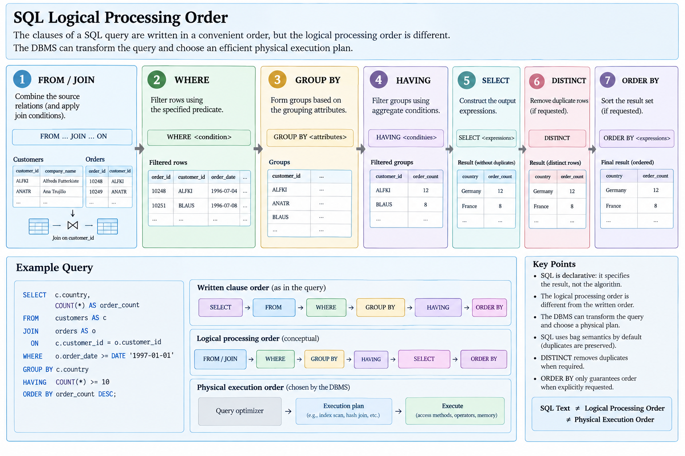{#fig-sql-logical-processing}

This model explains SQL semantics, but it still does **not** prescribe physical execution order. A query optimizer may transform operations extensively while preserving the required result.

Therefore,

$$
\boxed{
\text{Logical Query Processing Order}
\neq
\text{Physical Execution Order}.
}
$$

## Subqueries

A SQL query can contain another query as an expression or relational input. Such a query is called a **subquery**.

For example, customers who have placed at least one order can be expressed using `IN`:

```sql
SELECT
    customer_id,
    company_name
FROM customers
WHERE customer_id IN (
    SELECT customer_id
    FROM orders
);
```

The inner query constructs a collection of customer identifiers, and the outer query tests customer identifiers against that result.

Subqueries can appear in several contexts and can return scalar values, sets of values, or relations depending on how they are used.

A **scalar subquery** is expected to return a single value:

```sql
SELECT
    product_name,
    unit_price
FROM products
WHERE unit_price > (
    SELECT AVG(unit_price)
    FROM products
);
```

The inner query computes one value,

$$
\overline{p}
=
\frac{1}{n}
\sum_{i=1}^{n}p_i,
$$

and the outer query retains products whose price exceeds that average.

## EXISTS

`EXISTS` tests whether a subquery produces at least one row.

For example,

```sql
SELECT
    c.customer_id,
    c.company_name
FROM customers AS c
WHERE EXISTS (
    SELECT 1
    FROM orders AS o
    WHERE o.customer_id = c.customer_id
);
```

The logical question is not what values the subquery returns, but whether a matching row exists.

Formally, for each customer $c$,

$$
\operatorname{EXISTS}(c)
=
\begin{cases}
\text{TRUE}, & \text{if at least one matching order exists},\\
\text{FALSE}, & \text{otherwise}.
\end{cases}
$$

The `SELECT 1` inside the subquery emphasises that the projected value is irrelevant to the existence test.

## Correlated Subqueries

The preceding `EXISTS` query is a **correlated subquery** because the inner query references a value from the outer query:

```sql
o.customer_id = c.customer_id
```

Conceptually, the subquery can be understood as being evaluated relative to each outer row.

This conceptual interpretation does not imply that the DBMS must physically execute the subquery once for every customer. The optimizer may transform a correlated subquery into a join or another equivalent plan.

Thus,

$$
\boxed{
\text{Correlated Logical Expression}
\neq
\text{Necessarily Repeated Physical Execution}.
}
$$

This distinction is another example of the separation between SQL semantics and query execution.

## IN, EXISTS, ANY, and ALL

SQL provides several ways to compare values against subquery results.

`IN` tests membership:

```sql
WHERE customer_id IN (
    SELECT customer_id
    FROM orders
)
```

`EXISTS` tests whether any row exists:

```sql
WHERE EXISTS (
    SELECT 1
    FROM orders AS o
    WHERE o.customer_id = c.customer_id
)
```

`ANY` requires a comparison to hold for at least one value returned by a subquery:

```sql
WHERE unit_price > ANY (
    SELECT unit_price
    FROM products
    WHERE category_id = 1
)
```

Conceptually,

$$
x > \operatorname{ANY}(S)
$$

means

$$
\exists s\in S:\;x>s.
$$

`ALL` requires the comparison to hold for every returned value:

$$
x > \operatorname{ALL}(S)
$$

means

$$
\forall s\in S:\;x>s.
$$

The presence of `NULL` can complicate these expressions because comparisons may evaluate to `UNKNOWN`. This is particularly important with negated membership tests.

## NOT IN and NULL

Consider

```sql
WHERE customer_id NOT IN (
    SELECT customer_id
    FROM orders
)
```

If the subquery can return `NULL`, the result may differ from the intuitive interpretation "customer identifier does not occur among the orders."

The reason is that

$$
x\neq\texttt{NULL}
$$

evaluates to `UNKNOWN`.

A `NOT IN` predicate is conceptually related to requiring inequality with every value in the subquery. If one of those comparisons is `UNKNOWN`, the complete predicate may fail to become `TRUE`.

For existence-style anti-matching, `NOT EXISTS` often expresses the intended logic more directly:

```sql
SELECT
    c.customer_id,
    c.company_name
FROM customers AS c
WHERE NOT EXISTS (
    SELECT 1
    FROM orders AS o
    WHERE o.customer_id = c.customer_id
);
```

The important lesson is not to memorise one construct as universally superior, but to reason explicitly about nullability and three-valued logic.

## Common Table Expressions

A complex query can often be made easier to reason about by naming an intermediate query using a **Common Table Expression (CTE)**.

For example,

```sql
WITH customer_orders AS (
    SELECT
        customer_id,
        COUNT(*) AS number_of_orders
    FROM orders
    GROUP BY customer_id
)
SELECT
    customer_id,
    number_of_orders
FROM customer_orders
WHERE number_of_orders >= 10;
```

The CTE defines a named intermediate result that can be referenced by the following query.

Conceptually,

$$
\text{Complex Query}
\rightarrow
\text{Named Intermediate Relation}
\rightarrow
\text{Final Query}.
$$

A CTE should primarily be understood as a query-structuring construct. Whether it is physically materialized or incorporated into a broader execution plan is an implementation question and should not be inferred solely from the syntax.

Recursive CTEs extend this idea and will be considered separately when recursive querying is introduced.

## Ordering

SQL results have no guaranteed order unless an ordering requirement is explicitly stated.

For example,

```sql
SELECT
    customer_id,
    company_name
FROM customers
ORDER BY company_name;
```

requests ascending ordering by company name.

Descending order can be requested with

```sql
ORDER BY company_name DESC;
```

Multiple expressions can establish a lexicographic ordering:

```sql
ORDER BY country, company_name;
```

The first expression provides the primary ordering criterion; subsequent expressions resolve ties.

This reinforces the relational principle introduced earlier:

$$
\boxed{
\text{Observed Output Order}
\neq
\text{Guaranteed Output Order}.
}
$$

Without `ORDER BY`, the order in which rows happen to appear should not be treated as part of the query result's logical meaning.

## Data Modification

SQL is not limited to querying. It also provides statements that modify database state.

An insertion adds rows:

```sql
INSERT INTO customers (
    customer_id,
    company_name,
    city,
    country
)
VALUES (
    'EXAMP',
    'Example Company',
    'Auckland',
    'New Zealand'
);
```

An update modifies values in qualifying rows:

```sql
UPDATE customers
SET city = 'Wellington'
WHERE customer_id = 'EXAMP';
```

A deletion removes qualifying rows:

```sql
DELETE FROM customers
WHERE customer_id = 'EXAMP';
```

These operations transform one database instance into another:

$$
D_t
\xrightarrow{\text{INSERT, UPDATE, DELETE}}
D_{t+1}.
$$

The transformation is valid only if the resulting database satisfies the constraints that govern its schema. SQL modification must therefore be understood together with keys, foreign keys, checks, and transaction management.

The `WHERE` clause is particularly consequential in `UPDATE` and `DELETE`. Omitting it changes the operation from modifying selected rows to modifying every row in the target table.

## SQL as an Interface to a Database System

SQL provides a declarative interface, but the execution of a statement involves several layers of the DBMS.

A query such as

```sql
SELECT
    c.company_name,
    COUNT(*) AS number_of_orders
FROM customers AS c
JOIN orders AS o
    ON c.customer_id = o.customer_id
GROUP BY c.customer_id, c.company_name;
```

can be viewed through the progression

$$
\text{SQL Text}
\rightarrow
\text{Parsing and Semantic Analysis}
\rightarrow
\text{Logical Representation}
\rightarrow
\text{Optimization}
\rightarrow
\text{Physical Plan}
\rightarrow
\text{Execution}.
$$

The SQL statement is therefore not an execution plan.

$$
\boxed{\text{SQL Text} \neq \text{Physical Plan}.}
$$

Nor does syntactic validity guarantee semantic validity. A query can be grammatically valid while referring to a nonexistent relation, comparing incompatible concepts, violating grouping requirements, or attempting a modification prohibited by database constraints.

SQL should therefore be understood as the boundary between logical requests and the mechanisms of the DBMS. The next step is to examine how the structures and rules developed so far are declared and enforced: tables, data types, primary and foreign keys, uniqueness, nullability, checks, referential actions, and other **integrity constraints**.

# Integrity Constraints

A relational database does not consist of arbitrary collections of tuples. Its schema describes not only how data is structured but also which database states are considered valid. **Integrity constraints** express these requirements and allow the DBMS to reject modifications that would produce an invalid state [@ullman2009database].

If $D$ denotes a database instance and $C$ denotes the set of constraints defined over its schema, validity can be expressed conceptually as

$$
D \models C,
$$

meaning that the database instance $D$ satisfies the constraints in $C$.

A modification transforms one database state into another:

$$
D_t
\xrightarrow{\text{operation}}
D_{t+1}.
$$

For the resulting state to be valid,

$$
D_{t+1}\models C.
$$

This perspective is important because constraints are not merely checks performed when data is entered. They are statements about the set of database states that the system is permitted to represent.

## Declarative Integrity

Some data rules can be enforced entirely by application code. A program could check whether a customer exists before inserting an order, verify that a price is non-negative, or search for duplicate identifiers before inserting a customer.

The difficulty is that the database may be accessed by multiple applications, scripts, users, or processes. If an integrity rule exists only inside one application, another access path may bypass it.

A relational DBMS therefore allows many constraints to be declared as part of the database schema itself.

Conceptually,

$$
\text{Application Validation}
\neq
\text{Database Integrity Constraint}.
$$

Application validation can improve usability and detect invalid input early, but database constraints establish rules at the shared data boundary.

Whenever a rule can be represented accurately using a declarative constraint, declaring it in the database gives the DBMS direct responsibility for preserving that invariant.

## Defining Relations in SQL

SQL provides **Data Definition Language (DDL)** statements for defining database structures. The central operation is `CREATE TABLE`.

A simplified customer table can be defined as

```sql
CREATE TABLE customers (
    customer_id   VARCHAR(5),
    company_name  VARCHAR(100),
    city          VARCHAR(50),
    country       VARCHAR(50)
);
```

This statement translates part of a logical relation schema into a concrete SQL schema.

Conceptually,

$$
\operatorname{Customers}(
\text{customer\_id},
\text{company\_name},
\text{city},
\text{country}
)
$$

becomes a table whose columns have SQL data types.

This translation reinforces the distinction introduced earlier:

$$
\text{Relational Attribute and Domain}
\rightarrow
\text{SQL Column, Type, and Constraints}.
$$

The SQL representation implements the conceptual design, but the two levels should not be identified as exactly the same thing.

## Data Types

Each SQL column is associated with a data type that constrains the values that can be represented and determines which operations are meaningful.

Common categories include character strings, exact and approximate numeric values, dates and times, and Boolean values.

For example,

```sql
CREATE TABLE products (
    product_id    INTEGER,
    product_name  VARCHAR(100),
    unit_price    NUMERIC(10, 2),
    discontinued  BOOLEAN
);
```

The declaration

```sql
unit_price NUMERIC(10, 2)
```

provides a concrete representation for monetary values with a specified precision and scale.

A data type constrains representation, but it does not necessarily express the complete conceptual domain. `NUMERIC(10, 2)`, for example, can represent negative numbers even if a product price is required to be non-negative.

Therefore,

$$
\boxed{
\text{SQL Data Type}
\neq
\text{Complete Business Domain}.
}
$$

Additional integrity constraints may be required to express the intended semantics.

## NOT NULL

Unless restricted otherwise, an SQL column may generally permit `NULL`. A `NOT NULL` constraint requires every row to contain a non-null value for the specified column.

For example,

```sql
CREATE TABLE products (
    product_id    INTEGER NOT NULL,
    product_name  VARCHAR(100) NOT NULL,
    unit_price    NUMERIC(10, 2)
);
```

The constraint

```sql
product_name VARCHAR(100) NOT NULL
```

states that a product without a known product name is not a valid row for this table.

`NOT NULL` should therefore be derived from the semantics of the domain rather than applied mechanically. An optional attribute and an unknown required attribute do not necessarily represent the same situation.

## Primary Keys

A relational candidate key uniquely identifies tuples and is minimal with respect to that property. SQL provides the `PRIMARY KEY` constraint to designate a primary identifier for a table.

For example,

```sql
CREATE TABLE customers (
    customer_id   VARCHAR(5) PRIMARY KEY,
    company_name  VARCHAR(100) NOT NULL,
    city          VARCHAR(50),
    country       VARCHAR(50)
);
```

The constraint states that `customer_id` identifies each row in `customers`.

A composite primary key can contain several columns:

```sql
CREATE TABLE order_details (
    order_id    INTEGER,
    product_id  INTEGER,
    quantity    INTEGER NOT NULL,

    PRIMARY KEY (order_id, product_id)
);
```

Here uniqueness applies to the pair

$$
(\text{order\_id},\text{product\_id}),
$$

not necessarily to either component individually.

Thus, two rows may contain the same `order_id` provided that their `product_id` values differ, and the same product may appear in many orders.

This directly implements the composite-key reasoning developed during conceptual and relational design.

## UNIQUE Constraints

A table may contain candidate keys other than the one selected as its primary key. SQL can enforce alternative uniqueness requirements using `UNIQUE`.

For example,

```sql
CREATE TABLE employees (
    employee_id  INTEGER PRIMARY KEY,
    email        VARCHAR(255) UNIQUE
);
```

Both `employee_id` and, subject to the intended null semantics, `email` may provide uniqueness properties, but only one is designated as the primary key.

This reflects the relational distinction between candidate keys and the chosen primary key:

$$
\text{Candidate Keys}
\supseteq
\{\text{Primary Key}\}.
$$

A `UNIQUE` constraint should not be interpreted simply as an instruction to create an index. Its logical purpose is to express a uniqueness invariant. A DBMS may use an index as the physical mechanism for enforcing that invariant, but the constraint and the access structure remain different concepts.

Therefore,

$$
\boxed{
\texttt{UNIQUE Constraint}
\neq
\text{Index}.
}
$$

## Foreign Keys

A **foreign key** expresses a referential relationship between tables.

Suppose `customers` is defined as

```sql
CREATE TABLE customers (
    customer_id   VARCHAR(5) PRIMARY KEY,
    company_name  VARCHAR(100) NOT NULL
);
```

and each order must refer to an existing customer:

```sql
CREATE TABLE orders (
    order_id     INTEGER PRIMARY KEY,
    customer_id  VARCHAR(5) NOT NULL,
    order_date   DATE,

    FOREIGN KEY (customer_id)
        REFERENCES customers (customer_id)
);
```

The foreign-key constraint requires the referencing value in `orders.customer_id` to correspond to an admissible referenced key value in `customers.customer_id`.

Conceptually,

$$
\text{Orders.customer\_id}
\longrightarrow
\text{Customers.customer\_id}.
$$

The arrow here denotes a reference, not a functional dependency.

If an insertion attempts to create an order whose customer does not exist, the resulting database state would violate referential integrity and must therefore be rejected unless the required referenced row is created appropriately.

The constraint expresses an invariant across relations:

$$
\boxed{
\text{Every applicable foreign-key reference must resolve to a valid referenced row.}
}
$$

Foreign keys can also be composite. If a referenced candidate key contains attributes $(A,B)$, the corresponding foreign key must represent the compatible combination of values rather than independently referencing each component.

## Referential Actions

Referential integrity raises an additional question: what should happen when a referenced row is modified or deleted?

Suppose customer `ALFKI` has existing orders. Deleting that customer could leave those orders referring to an entity that no longer exists.

SQL allows the schema to specify a **referential action**.

A restrictive policy can prevent the deletion:

```sql
FOREIGN KEY (customer_id)
    REFERENCES customers (customer_id)
    ON DELETE RESTRICT
```

A cascading policy can propagate the deletion:

```sql
FOREIGN KEY (customer_id)
    REFERENCES customers (customer_id)
    ON DELETE CASCADE
```

Other policies may replace the referencing value with `NULL` or another permitted value when the referenced row disappears.

These behaviours encode different domain semantics:

$$
\begin{aligned}
\text{RESTRICT} &\rightarrow \text{Reject the referenced modification},\\
\text{CASCADE} &\rightarrow \text{Propagate the modification},\\
\text{SET NULL} &\rightarrow \text{Remove the reference while preserving the row}.
\end{aligned}
$$

None of these actions is universally correct. The appropriate choice depends on what the relationship means.

Deleting a temporary dependent object may reasonably imply deleting its components. Deleting a customer, by contrast, may not justify destroying historical order records merely because `CASCADE` is technically available.

Referential actions are therefore part of database semantics, not simply administrative convenience.

## CHECK Constraints

A `CHECK` constraint expresses a predicate that values in a row must satisfy.

For example,

```sql
CREATE TABLE order_details (
    order_id    INTEGER,
    product_id  INTEGER,
    quantity    INTEGER NOT NULL,
    discount    NUMERIC(4, 3) NOT NULL,

    CHECK (quantity > 0),
    CHECK (discount >= 0 AND discount <= 1),

    PRIMARY KEY (order_id, product_id)
);
```

The intended conditions can be represented as

$$
\text{quantity}>0
$$

and

$$
0\leq\text{discount}\leq1.
$$

The constraints eliminate database states containing non-positive quantities or discounts outside the permitted interval.

A named constraint can make the rule easier to identify:

```sql
CONSTRAINT valid_discount
    CHECK (discount >= 0 AND discount <= 1)
```

Naming becomes useful when constraints must later be inspected, modified, or interpreted from database error messages.

`CHECK` constraints are particularly appropriate for rules involving values within the same row. More complex rules involving several rows or tables may require different mechanisms.

## Constraints and NULL

Constraints must be interpreted together with SQL's `NULL` semantics.

Consider

```sql
CHECK (unit_price >= 0)
```

If `unit_price` is `NULL`, the comparison

```sql
unit_price >= 0
```

evaluates to `UNKNOWN`, not `FALSE`.

A `CHECK` constraint rejects rows when its condition evaluates to `FALSE`; an `UNKNOWN` result does not by itself violate the check. Consequently, if a price must both exist and be non-negative, the schema should express both requirements:

```sql
unit_price NUMERIC(10, 2) NOT NULL
    CHECK (unit_price >= 0)
```

Conceptually,

$$
\boxed{
\text{Value Required}
+
\text{Value Range}
}
$$

are separate constraints.

This is another practical consequence of three-valued logic.

## Constraint Scope

Different SQL constraints operate over different scopes.

`NOT NULL` constrains an individual column value. A row-level `CHECK` commonly constrains values within one row. `UNIQUE` and `PRIMARY KEY` constrain relationships among multiple rows of one table. `FOREIGN KEY` constrains relationships between rows in different tables.

This can be represented conceptually as

$$
\begin{array}{c|c}
\text{Constraint} & \text{Typical Scope}\\
\hline
\texttt{NOT NULL} & \text{Column value}\\
\texttt{CHECK} & \text{Row}\\
\texttt{UNIQUE} & \text{Table}\\
\texttt{PRIMARY KEY} & \text{Table}\\
\texttt{FOREIGN KEY} & \text{Relations between tables}
\end{array}
$$

As the scope of a rule expands, enforcing it may require examining more database state. This has consequences not only for schema design but also for concurrency control and physical implementation.

## Altering a Schema

Database schemas evolve. SQL provides `ALTER TABLE` for modifying an existing table definition.

For example, a new constraint can be added:

```sql
ALTER TABLE products
ADD CONSTRAINT non_negative_unit_price
CHECK (unit_price >= 0);
```

A new column can also be introduced:

```sql
ALTER TABLE customers
ADD COLUMN website VARCHAR(255);
```

Schema modification differs fundamentally from data modification:

$$
\boxed{
\text{DDL changes the schema;}
\qquad
\text{DML changes the instance.}
}
$$

An `UPDATE` changes values in the current database instance. An `ALTER TABLE` changes the structure or constraints under which database instances are represented.

Schema evolution must also consider existing data. Introducing a new constraint is meaningful only if existing rows can satisfy the resulting schema requirements or are handled appropriately during the migration.

## Declarative Constraints and Procedural Enforcement

Declarative constraints should generally be preferred when they can express the required invariant accurately.

For example,

```sql
CHECK (quantity > 0)
```

states directly what must be true.

A procedural implementation that manually tests the value before every insertion would distribute the same rule across application logic and potentially multiple access paths.

The declarative form has an important conceptual advantage:

$$
\text{Constraint}
=
\text{Property that must hold},
$$

rather than

$$
\text{Constraint}
=
\text{Procedure for checking the property}.
$$

This mirrors the declarative nature of SQL queries themselves. The database designer specifies the invariant, while the DBMS determines how it will be enforced.

Not every integrity rule can be represented through basic declarative constraints, however. Some rules depend on events, transitions, or relationships that extend beyond the expressive scope of `PRIMARY KEY`, `FOREIGN KEY`, `UNIQUE`, `NOT NULL`, and ordinary `CHECK` constraints.

## Triggers

A **trigger** is a database mechanism that executes an action in response to specified events.

Conceptually, a trigger follows an **Event-Condition-Action** structure:

$$
\boxed{
\text{Event}
\rightarrow
\text{Condition}
\rightarrow
\text{Action}.
}
$$

The event may be an insertion, update, or deletion. A condition can determine whether the trigger action should execute, and the action performs the required database operation.

For example, a system may need to record certain changes in an audit relation whenever rows are modified. A trigger can associate that behaviour directly with the relevant database event.

Triggers can execute before or after an operation and may operate at different granularities depending on the DBMS, such as once per affected row or once per statement.

They are powerful because they allow database behaviour to be attached to modifications independently of the application issuing them. The same property also makes them easier to overlook when reasoning about a system.

A statement such as

```sql
UPDATE products
SET unit_price = unit_price * 1.05;
```

may therefore have effects beyond the visible modification if triggers execute additional actions.

For this reason,

$$
\boxed{
\text{Declarative Constraint}
\;\text{should be preferred when it is sufficient.}
}
$$

Triggers are better reserved for behaviour that genuinely requires procedural reaction to database events rather than for rules already expressible as ordinary constraints.

## Assertions

At the conceptual SQL level, an **assertion** represents a constraint over the database as a whole rather than one attached to a particular table.

For example, a business rule might require a condition involving several relations to remain true for every valid database state.

Conceptually,

$$
\operatorname{ASSERT}(P(D)),
$$

where $P$ is a predicate over the database instance.

Assertions are useful theoretically because they demonstrate that integrity constraints are not inherently limited to individual rows or tables. In practice, support for general assertions is not universal, so equivalent rules may need to be represented through other database mechanisms.

The important concept is the distinction between the invariant itself and the particular mechanism available in a DBMS for enforcing it.

## Integrity as a Property of Transactions

Constraints become particularly important when several related modifications must occur together.

Suppose an operation modifies multiple relations:

$$
D_0
\rightarrow
D_1
\rightarrow
D_2
\rightarrow
D_3.
$$

An intermediate state such as $D_1$ or $D_2$ may temporarily arise while the operation is being performed. What matters from the perspective of the completed transaction is that the transition begins with a valid database state and, if committed successfully, produces another valid state:

$$
D_{\text{valid}}
\xrightarrow{\text{transaction}}
D'_{\text{valid}}.
$$

This observation connects integrity constraints to transaction management. Constraints describe which states are valid; transactions provide a controlled mechanism for moving the database from one state to another in the presence of multiple operations, concurrent activity, and possible failures.

The relationship can be summarized as

$$
\boxed{
\text{Schema}
+
\text{Constraints}
\rightarrow
\text{Valid States},
}
$$

while

$$
\boxed{
\text{Transactions}
\rightarrow
\text{Controlled Transitions Between States}.
}
$$

Before studying transactions in detail, however, another form of database abstraction is useful. Applications frequently need to expose a derived representation of stored data without duplicating the underlying information. Relational database systems provide this abstraction through **views**, while indexes address a different problem: how data can be located efficiently without changing its logical representation.

# Views and Indexes

A relational database provides a logical representation of data through relations, but applications do not always need to interact directly with every base relation in the schema. Some users require only a subset of the available attributes, some queries repeatedly combine the same relations, and some applications benefit from an interface that remains stable even when the underlying schema changes. **Views** provide a logical mechanism for defining such derived representations.

A different problem arises when the required data is logically well defined but expensive to locate. A query may request only a few tuples from a relation containing millions of rows. Evaluating that request by examining every row may be unnecessarily expensive. **Indexes** provide physical access structures that can make certain retrieval operations substantially more efficient [@ullman2009database].

The distinction is fundamental:

$$
\boxed{
\begin{aligned}
\text{View} &\rightarrow \text{Logical Abstraction},\\
\text{Index} &\rightarrow \text{Physical Access Structure}.
\end{aligned}
}
$$

Both may influence how a database is used, but they solve different problems and belong to different levels of the system.

## Views

A **view** is a relation defined by a query over other relations. Rather than storing an independent copy of the query result in the ordinary case, the database stores the view definition and derives its contents from the underlying data when the view is referenced.

Suppose an application frequently needs basic customer information but should not depend on every attribute stored in `customers`. A view can expose the required representation:

```sql
CREATE VIEW customer_directory AS
SELECT
    customer_id,
    company_name,
    city,
    country
FROM customers;
```

The view can subsequently be queried as if it were a relation:

```sql
SELECT
    company_name,
    city
FROM customer_directory
WHERE country = 'Germany';
```

Conceptually, if the view $V$ is defined by query $Q$ over database instance $D$, then

$$
V(D)=Q(D).
$$

The contents of the view are therefore derived from the underlying database state.

This leads to an important distinction:

$$
\boxed{\text{View Definition} \neq \text{Stored Copy of the View Result}.}
$$

For an ordinary view, the persistent object is principally the query definition. The tuples visible through the view depend on the current state of its underlying relations.

## Views as Logical Abstraction

Views can hide details that an application does not need to know.

Suppose customer order activity is repeatedly obtained by joining `customers` and `orders`:

```sql
CREATE VIEW customer_orders AS
SELECT
    c.customer_id,
    c.company_name,
    o.order_id,
    o.order_date
FROM customers AS c
JOIN orders AS o
    ON c.customer_id = o.customer_id;
```

Applications can then query

```sql
SELECT
    company_name,
    order_date
FROM customer_orders;
```

without repeating the join definition.

Conceptually,

$$
\text{Base Relations}
\xrightarrow{\text{View Definition}}
\text{Derived Logical Relation}.
$$

The view does not change the logical information contained in the base relations. It provides another interface through which that information can be expressed and accessed.

This abstraction can serve several purposes: simplifying repeated queries, exposing only relevant attributes, encapsulating parts of the schema, and providing a controlled interface for particular users or applications.

## View Expansion

Because an ordinary view is defined by a query, a query referencing that view can conceptually be rewritten in terms of the underlying relations.

Suppose

```sql
CREATE VIEW german_customers AS
SELECT
    customer_id,
    company_name,
    city
FROM customers
WHERE country = 'Germany';
```

and an application submits

```sql
SELECT company_name
FROM german_customers
WHERE city = 'Berlin';
```

Conceptually, the view reference can be expanded into

```sql
SELECT company_name
FROM customers
WHERE country = 'Germany'
  AND city = 'Berlin';
```

At the relational-algebra level, the view definition can be represented as

$$
V
=
\pi_{\text{customer\_id},\text{company\_name},\text{city}}
\left(
\sigma_{\text{country}=\text{'Germany'}}
(\text{Customers})
\right).
$$

The query over the view adds another selection and projection:

$$
\pi_{\text{company\_name}}
\left(
\sigma_{\text{city}=\text{'Berlin'}}
(V)
\right).
$$

Substituting the view definition gives

$$
\pi_{\text{company\_name}}
\left(
\sigma_{\text{city}=\text{'Berlin'}}
\left(
\pi_{\text{customer\_id},\text{company\_name},\text{city}}
\left(
\sigma_{\text{country}=\text{'Germany'}}
(\text{Customers})
\right)
\right)
\right).
$$

The DBMS can then transform the resulting logical expression while preserving its semantics.

A view should therefore not be understood as forcing the DBMS to execute the view query first and then execute the outer query against a separate temporary table.

$$
\boxed{\text{Logical View Boundary} \neq \text{Necessary Physical Execution Boundary}.}
$$

This is another manifestation of the distinction between logical representation and physical execution.

## Views and Data Independence

Views can provide a degree of **logical data independence** between applications and the underlying schema.

Suppose an application expects a particular set of attributes even though the underlying database is reorganized into several relations. A compatible view may sometimes preserve the application's logical interface while allowing the base schema to evolve.

Conceptually,

$$
\text{Application}
\rightarrow
\text{View Interface}
\rightarrow
\text{Base Schema}.
$$

The application depends on the interface exposed by the view rather than directly on every implementation detail of the underlying relations.

This does not make arbitrary schema changes transparent. Changes that alter the meaning or availability of required information may still require application changes. Views provide a layer of abstraction, not complete independence from database semantics.

## Views and Access Control

A view can also expose only part of the information contained in a base relation.

For example,

```sql
CREATE VIEW public_employee_directory AS
SELECT
    employee_id,
    first_name,
    last_name,
    title
FROM employees;
```

can provide a representation that omits attributes not required by users of the directory.

Combined with database privileges, views can therefore participate in access-control design:

$$
\text{Base Relation}
\rightarrow
\text{Restricted View}
\rightarrow
\text{Authorized User}.
$$

The view determines which information is exposed, while the authorization system determines who is permitted to access the corresponding object. These are related mechanisms but should remain conceptually distinct.

## Updating Views

A view can always be considered as a queryable derived relation, but not every view can be modified unambiguously.

Consider

```sql
CREATE VIEW german_customers AS
SELECT
    customer_id,
    company_name,
    city,
    country
FROM customers
WHERE country = 'Germany';
```

An update to a customer name through this view has a clear interpretation because the corresponding base row can be identified.

More complex views may not have such an obvious mapping. Consider an aggregate view:

```sql
CREATE VIEW customer_order_counts AS
SELECT
    customer_id,
    COUNT(*) AS number_of_orders
FROM orders
GROUP BY customer_id;
```

Suppose an application attempts conceptually to change

```text
number_of_orders = 10
```

to

```text
number_of_orders = 11
```

for a particular customer. There is no unique base-table modification implied by this request. Should a new order be inserted? If so, what should its identifier, date, employee, freight, and other values be?

The problem is one of invertibility:

$$
\text{Base Data}
\xrightarrow{Q}
\text{View Result}
$$

does not imply that there exists a unique inverse transformation

$$
\text{View Modification}
\xrightarrow{?}
\text{Base Modification}.
$$

Consequently, view updatability depends on the structure of the view definition and the capabilities of the DBMS.

The important conceptual distinction is

$$
\boxed{\text{Queryable View} \neq \text{Necessarily Updatable View}.}
$$

## Materialized Views

An ordinary view stores a query definition and derives its result from the current base data. A **materialized view** instead stores the result of a query physically.

Conceptually,

$$
\text{Ordinary View}
=
\text{Stored Definition}
+
\text{Derived Result at Query Time},
$$

whereas

$$
\text{Materialized View}
=
\text{Stored Definition}
+
\text{Stored Derived Result}.
$$

Suppose a database repeatedly computes an expensive aggregate:

```sql
CREATE MATERIALIZED VIEW customer_sales AS
SELECT
    o.customer_id,
    SUM(od.unit_price * od.quantity * (1 - od.discount)) AS total_sales
FROM orders AS o
JOIN order_details AS od
    ON o.order_id = od.order_id
GROUP BY o.customer_id;
```

The resulting aggregate can be stored rather than recomputed from the base relations every time it is requested.

This creates a trade-off. Querying the stored result may be much cheaper, but the result can become stale when the underlying relations change.

If the base database changes from state $D_t$ to $D_{t+1}$,

$$
D_t
\rightarrow
D_{t+1},
$$

the stored materialized result

$$
M_t=Q(D_t)
$$

does not automatically imply

$$
M_t=Q(D_{t+1}).
$$

The materialized view must therefore be maintained or refreshed according to the mechanisms provided by the DBMS.

Materialization trades additional storage and maintenance work for potentially cheaper reads:

$$
\boxed{
\text{Materialization}
\rightarrow
\text{More Storage and Maintenance}
\quad\text{for}\quad
\text{Potentially Less Query Work}.
}
$$

This trade-off appears repeatedly in database-system design.

## Views and Materialized Views

The difference between an ordinary view and a materialized view can be summarized as follows:

| Property | View | Materialized View |
|:---:|:---:|:---:|
| Stores query definition | Yes | Yes |
| Stores query result | Normally no | Yes |
| Reflects current base data through query evaluation | Yes | Depends on refresh state |
| Requires additional storage for result | No substantial result storage | Yes |
| Can reduce repeated computation by storing result | No | Yes |

The distinction is not simply one of syntax. It changes the relationship between logical state and physically stored derived data.

A materialized view is therefore closer to a controlled form of precomputation than to an ordinary logical view.

## Indexes

A view changes how data can be represented logically. An **index** addresses a different problem: how rows satisfying a condition can be located efficiently.

Suppose `customers` contains a large number of rows and a query requests one customer:

```sql
SELECT
    customer_id,
    company_name
FROM customers
WHERE customer_id = 'ALFKI';
```

Without an appropriate access structure, one possible strategy is to inspect the relation sequentially until qualifying rows are found.

If the relation occupies $B(R)$ pages, a complete scan has an approximate page-access cost of

$$
C_{\text{scan}}(R)\approx B(R).
$$

An index maintains additional information that allows the DBMS to locate candidate rows through an alternative access path.

Conceptually,

$$
\text{Search Condition}
\rightarrow
\text{Index}
\rightarrow
\text{Candidate Data Locations}.
$$

The index does not alter the logical contents of the relation:

$$
\boxed{
\text{Relation With Index}
\equiv
\text{Relation Without Index}
}
$$

with respect to the information logically represented.

What changes is the set of physical strategies available for retrieving that information.

## Search Keys

An index is constructed using one or more attributes or expressions that form its **search key**.

For example,

```sql
CREATE INDEX idx_customers_country
ON customers (country);
```

creates an index whose search key is `country`.

This terminology must be distinguished carefully from relational keys.

The attribute `country` need not uniquely identify a customer. Many customers may have the same country. It can nevertheless be a useful search key because queries may frequently search by country.

Thus,

$$
\boxed{
\text{Index Search Key}
\neq
\text{Relational Candidate Key}.
}
$$

A relational key expresses a logical uniqueness property. An index search key specifies values used to organize a physical access structure.

An index can also be unique:

```sql
CREATE UNIQUE INDEX idx_example
ON some_table (some_column);
```

but uniqueness is an additional property, not part of the general definition of an index.

## Indexes as Redundant Physical Structures

An index contains information derived from the indexed relation. It therefore introduces deliberate physical redundancy.

If a tuple is inserted, deleted, or an indexed value is modified, the corresponding index structure must also remain consistent.

Conceptually,

$$
\text{Table Modification}
\rightarrow
\begin{cases}
\text{Update Table Storage}\\
\text{Update Relevant Indexes}
\end{cases}
$$

Indexes therefore involve a trade-off:

$$
\boxed{
\text{Potentially Faster Reads}
\quad\leftrightarrow\quad
\text{Additional Storage and Write Maintenance}.
}
$$

Creating more indexes is consequently not a monotonic path toward better performance. An index should justify its maintenance and storage costs through the workload it supports.

## Selectivity

Whether an index is useful depends partly on how much of the relation a predicate is expected to retrieve.

For predicate $P$ over relation $R$, define its **selectivity** as

$$
s_P
=
\frac{|\sigma_P(R)|}{|R|}.
$$ {#eq-index-selectivity}

If a relation contains one million rows and a predicate matches one thousand,

$$
s_P
=
\frac{1{,}000}{1{,}000{,}000}
=
0.001.
$$

The predicate selects

$$
0.1\%
$$

of the relation.

An index may provide a substantial advantage if those rows can be located through relatively little index and data-page access.

If a predicate instead matches eight hundred thousand rows,

$$
s_P
=
\frac{800{,}000}{1{,}000{,}000}
=
0.8,
$$

then most of the relation must be retrieved anyway. Traversing an index and then accessing many table pages may offer little advantage over scanning the relation directly.

Therefore,

$$
\boxed{\text{Index Exists} \neq \text{Index Should Be Used}.}
$$

The optimizer must compare available access strategies based on estimated costs.

## Indexes and Query Predicates

An index on attribute $A$ may support queries whose predicates allow the DBMS to use the index organization effectively.

For example,

```sql
CREATE INDEX idx_products_unit_price
ON products (unit_price);
```

may provide an access path for queries such as

```sql
SELECT
    product_id,
    product_name,
    unit_price
FROM products
WHERE unit_price >= 50;
```

However, the mere presence of an indexed attribute inside a predicate does not guarantee that the index will be selected.

The DBMS must consider factors such as the estimated number of matching rows, the physical organization of the index, the cost of retrieving the corresponding table pages, available statistics, and alternative execution plans.

The correct mental model is therefore not

$$
\text{Predicate on Indexed Column}
\Rightarrow
\text{Index Scan},
$$

but rather

$$
\text{Predicate}
+
\text{Available Access Paths}
+
\text{Statistics}
+
\text{Cost Model}
\rightarrow
\text{Chosen Plan}.
$$

## Composite Indexes

An index may contain more than one search-key attribute.

For example,

```sql
CREATE INDEX idx_orders_customer_date
ON orders (customer_id, order_date);
```

organizes index entries according to a composite search key.

The order of the attributes is significant. Conceptually, entries are ordered first by `customer_id` and then, among equal customer identifiers, by `order_date`.

This is analogous to lexicographic ordering:

$$
(a_1,b_1)<(a_2,b_2)
$$

when either

$$
a_1<a_2,
$$

or

$$
a_1=a_2
\quad\text{and}\quad
b_1<b_2.
$$

Consequently, a composite index on

$$
(A,B)
$$

is not generally equivalent to an index on

$$
(B,A).
$$

The useful ordering provided by the index depends on the prefix of the search key and on the predicates and ordering requirements of the query.

Therefore,

$$
\boxed{
\operatorname{Index}(A,B)
\neq
\operatorname{Index}(B,A).
}
$$

This is one reason index design must be based on actual query patterns rather than on columns considered individually.

## Indexes and Ordering

An ordered index may sometimes provide values in an order useful to a query.

Suppose an index exists on

```sql
(customer_id, order_date)
```

and a query requests

```sql
SELECT
    order_id,
    order_date
FROM orders
WHERE customer_id = 'ALFKI'
ORDER BY order_date;
```

The physical ordering of index entries may help locate the required customer's orders while also providing them in a useful order.

This can potentially avoid a separate sorting operation.

The benefit is workload-dependent. The optimizer must determine whether scanning the index in the required order is cheaper than using another access path and sorting the result separately.

An index therefore provides not only a mechanism for finding rows but also a **physical property** that may be useful to subsequent operators.

This idea will become important when query optimization is studied.

## Indexes and Constraints

Indexes and constraints frequently interact, particularly for uniqueness and referential integrity, but they remain conceptually distinct.

A primary-key constraint states

$$
\text{Key values must uniquely identify rows}.
$$

An index states

$$
\text{Entries are physically organized to support particular access patterns}.
$$

A DBMS may use an index to enforce a primary key or unique constraint efficiently. This does not mean that the constraint exists merely for performance or that every index represents a constraint.

The distinction can be summarized as

$$
\boxed{
\begin{aligned}
\text{Constraint} &\rightarrow \text{What database states are valid},\\
\text{Index} &\rightarrow \text{How data may be accessed physically}.
\end{aligned}
}
$$

This separation between logical correctness and physical performance is one of the most important recurring themes in relational database systems.

## Choosing Indexes for a Workload

An index should be evaluated in the context of the operations performed by the database.

Consider a workload containing frequent queries of the form

```sql
SELECT
    order_id,
    order_date
FROM orders
WHERE customer_id = ?;
```

and

```sql
SELECT
    order_id,
    order_date
FROM orders
WHERE customer_id = ?
  AND order_date >= ?;
```

An index beginning with `customer_id` may be relevant to both access patterns.

If the workload instead primarily inserts large volumes of orders and rarely retrieves them by customer, the same index may provide little benefit relative to its maintenance cost.

Index selection is therefore a workload-design problem:

$$
\boxed{
\text{Useful Index}
=
f(
\text{Queries},
\text{Selectivity},
\text{Updates},
\text{Ordering},
\text{Physical Cost}
).
}
$$

There is no universally optimal collection of indexes independent of the workload.

## Views, Materialized Views, and Indexes

Views, materialized views, and indexes can now be distinguished precisely.

An ordinary view stores a logical query definition:

$$
V=Q(D).
$$

A materialized view stores the derived result:

$$
M\leftarrow Q(D).
$$

An index stores a physical access structure over data:

$$
I\leftarrow\operatorname{IndexStructure}(R,K).
$$

Their purposes are therefore different:

| Object | Primary Purpose | Stores Derived Rows | Main Level |
|:---:|:---:|:---:|:---:|
| View | Logical abstraction | No | Logical |
| Materialized view | Precomputed derived result | Yes | Logical and physical |
| Index | Efficient data access | No independent query result | Physical |

This distinction can be represented as

$$
\boxed{
\text{View}
\neq
\text{Materialized View}
\neq
\text{Index}.
}
$$

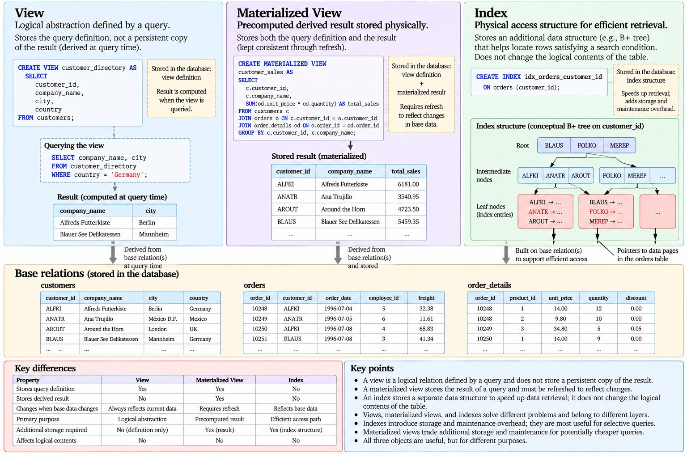{#fig-views-materialized-views-indexes}

The distinction also illustrates the broader architecture of a relational DBMS. Users and applications reason primarily about logical relations and queries, while the system maintains physical structures that support their efficient execution.

The internal organization of indexes has intentionally not been developed here. Understanding why an index may reduce access cost is sufficient at this stage; understanding how structures such as B+ trees and hash indexes achieve that result requires first examining pages, records, buffers, and the physical storage model.

Before descending to that level, it is useful to complete the path between applications and the database. SQL statements are rarely issued only through an interactive client: production systems establish connections, bind parameters, execute statements through database drivers, and manage transactions across an application boundary. These mechanisms form the **database interface** between application code and the DBMS.

# Database Interfaces

SQL provides the language through which data is defined, queried, and modified, but production applications rarely interact with a database only through an interactive SQL client. An application normally communicates with the DBMS through a **database interface**: a software layer responsible for establishing connections, transmitting statements and parameters, receiving results, reporting errors, and coordinating transaction boundaries [@ullman2009database].

A simplified application path can be represented as

$$
\text{Application}
\rightarrow
\text{Database Driver}
\rightarrow
\text{DBMS}
\rightarrow
\text{Database}.
$$

For the practical environment used in these notes, this will eventually become

$$
\text{Python}
\rightarrow
\text{PostgreSQL Driver}
\rightarrow
\text{PostgreSQL}
\rightarrow
\text{Northwind}.
$$

The second expression is a concrete implementation of the first, not the underlying concept itself. Database interfaces should therefore be understood independently of any particular programming language or driver.

## Application-Database Interaction

An application typically needs to perform several steps before an SQL statement can affect the database. It establishes communication with the DBMS, submits a statement, supplies any required values, waits for execution, retrieves results or status information, and eventually releases the resources associated with the interaction.

Conceptually,

$$
\text{Connect}
\rightarrow
\text{Submit}
\rightarrow
\text{Execute}
\rightarrow
\text{Retrieve}
\rightarrow
\text{Close}.
$$

This simple sequence hides several distinct abstractions. In particular, a connection, a session, a statement, a result set, and a transaction are related but not interchangeable concepts.

Understanding these boundaries becomes important when applications maintain several simultaneous database interactions or when failures occur between individual statements.

## Connections and Sessions

A **connection** provides a communication channel between a client and the DBMS. Establishing a connection generally requires information identifying the database service and credentials or another authentication mechanism.

Once communication has been established, the DBMS maintains state associated with the client's interaction. This logical interaction is commonly described as a **session**.

Conceptually,

$$
\text{Client}
\xleftrightarrow{\text{Connection}}
\text{Database Session}.
$$

A session may contain state such as configuration settings, temporary objects, prepared statements, and transaction state.

The terms are closely related in practical APIs, but the distinction is useful:

$$
\boxed{\text{Connection} \neq \text{Session}.}
$$

A connection emphasizes the communication mechanism, while a session emphasizes the logical context maintained by the DBMS for the client interaction.

Neither should be confused with a transaction.

## Connections and Transactions

A database connection can exist before, during, and after a particular transaction.

Conceptually,

$$
\text{Connection}
\supset
\{
T_1,T_2,\ldots,T_n
\},
$$

where several transactions may execute sequentially during the lifetime of the same connection.

A transaction instead represents a logical unit of database work:

$$
T:
D_t
\rightarrow
D_{t+1}.
$$

For example, an application may establish one connection, execute one transaction that inserts an order, commit it, execute another transaction that updates customer information, commit again, and only then close the connection.

Therefore,

$$
\boxed{\text{Connection} \neq \text{Transaction}.}
$$

Closing a connection and completing a transaction are different operations with different semantics. Transaction boundaries must be understood explicitly rather than inferred from the lifetime of the communication channel.

The internal properties of transactions will be developed later. At this stage, the important point is that application interfaces must provide a way to delimit and control them.

## Database Drivers

A **database driver** implements the communication between an application environment and a DBMS.

The application uses an API exposed by the driver rather than manually implementing the DBMS communication protocol. Through this API it can perform operations such as opening connections, submitting SQL, binding parameter values, retrieving rows, controlling transactions, and handling database errors.

Conceptually,

$$
\text{Application API}
\rightarrow
\text{Driver}
\rightarrow
\text{Database Protocol}
\rightarrow
\text{DBMS}.
$$

The driver does not replace SQL. SQL remains the database language, while the driver provides the programmatic mechanism through which SQL and associated values are exchanged with the DBMS.

This gives another useful distinction:

$$
\boxed{
\text{SQL}
\neq
\text{Database API}
\neq
\text{Database Driver}.
}
$$

Different programming environments can expose different APIs while communicating with the same DBMS and executing logically equivalent SQL statements.

## The Impedance Mismatch

Application programs and relational databases represent information differently. This difference is commonly described as the **impedance mismatch** between the programming-language environment and the relational model.

A relational query produces a collection of tuples:

$$
R=
\{t_1,t_2,\ldots,t_n\},
$$

while an application typically works with language-specific values, collections, objects, iterators, or other data structures.

The database interface must therefore map values between two environments:

$$
\text{Database Values}
\xleftrightarrow{\text{Mapping}}
\text{Programming-Language Values}.
$$

A database `DATE`, for example, may become a date object in the programming language. A numeric database value may become an integer, decimal, or floating-point object. SQL `NULL` must be represented through the language's mechanism for missing values.

The mismatch is not limited to primitive types. Relational data is fundamentally organized as relations and tuples, while application programs may represent the same domain using nested objects and references.

Consequently,

$$
\boxed{\text{Application Object} \neq \text{Relational Tuple}.}
$$

The interface between the two environments must make these mappings explicit or provide abstractions that perform them.

## Cursors and Result Sets

When a query produces several rows, an application needs a mechanism for accessing those rows.

Conceptually, if query $Q$ produces

$$
Q(D)=
\{t_1,t_2,\ldots,t_n\},
$$

the application may retrieve the result incrementally:

$$
t_1
\rightarrow
t_2
\rightarrow
\cdots
\rightarrow
t_n.
$$

A **cursor** provides a position within a query result and allows rows to be processed progressively rather than requiring application code to treat the complete result as one indivisible object.

This is particularly relevant when a result is large. Materializing millions of rows simultaneously inside application memory may be unnecessary or infeasible.

Conceptually,

$$
\text{Query Result}
\xrightarrow{\text{Cursor}}
\text{Incremental Row Access}.
$$

The exact behaviour of cursors and result buffering depends on the database interface and DBMS. A cursor abstraction should therefore not automatically be interpreted as proof that only one row is transferred physically from the server at a time.

This distinction follows a recurring principle:

$$
\boxed{\text{API Abstraction} \neq \text{Necessary Physical Behaviour}.}
$$

## Parameterized Queries

Applications frequently execute the same SQL structure using different values.

Suppose an application needs to retrieve orders for a customer supplied at runtime. Conceptually, the statement has the form

```sql
SELECT
    order_id,
    order_date
FROM orders
WHERE customer_id = ?;
```

where the placeholder represents a value supplied separately by the application.

The important distinction is

$$
\boxed{\text{SQL Code} \neq \text{Parameter Data}.}
$$

The SQL statement describes the operation. Parameter values provide data consumed by that operation.

An application should therefore avoid constructing SQL by directly concatenating external values into the statement text.

Conceptually unsafe construction resembles

```text
"SELECT ... WHERE customer_id = '" + value + "'"
```

because program data becomes part of the SQL source text.

Parameterized execution instead preserves the boundary

$$
(\text{SQL Statement},\text{Parameter Values})
$$

as two logically separate inputs.

This distinction is fundamental both for correctness and for security.

## SQL Injection

**SQL injection** occurs when untrusted input is interpreted as part of SQL syntax rather than exclusively as data.

Suppose an application constructs a query by concatenating a supplied value:

```text
SQL text
+
external input
\rightarrow
new SQL text.
```

If the input contains SQL syntax, the resulting statement may have a different structure from the one intended by the application.

The vulnerability can therefore be understood as a failure to preserve the boundary

$$
\text{Code}
\mid
\text{Data}.
$$

Parameterized queries preserve that distinction by sending the statement structure and parameter values separately through the database interface.

Conceptually,

$$
\boxed{
\text{Parameterized Query}
=
\text{Fixed SQL Structure}
+
\text{Bound Data Values}.
}
$$

Escaping strings manually is not an equivalent general abstraction. Correct parameter binding delegates representation of the supplied values to the database interface rather than asking application code to construct SQL literals safely.

## Prepared Statements

A **prepared statement** separates the preparation of a statement from its subsequent execution with particular parameter values.

Conceptually,

$$
\text{SQL Statement}
\xrightarrow{\text{Prepare}}
\text{Prepared Statement}
$$

followed by

$$
(\text{Prepared Statement},\text{Parameters})
\xrightarrow{\text{Execute}}
\text{Result}.
$$

If the same logical statement is executed repeatedly,

$$
Q(p_1),
Q(p_2),
\ldots,
Q(p_n),
$$

the statement structure can be prepared independently of the values supplied for each execution.

Prepared statements and parameterized queries are closely related because prepared statements naturally provide parameter binding. Their purposes, however, should not be reduced to SQL-injection prevention alone. Preparation also establishes a reusable statement representation whose implementation may permit the DBMS or driver to avoid repeating some work.

The exact planning and caching behaviour is implementation-dependent. It should not be assumed that every prepared statement always uses one permanently fixed execution plan.

## Prepared Statements and Stored Procedures

Prepared statements are sometimes confused with stored procedures because both involve database operations that can be executed repeatedly.

They are conceptually different.

A prepared statement represents a statement prepared for execution:

$$
\text{Prepare}
\rightarrow
\text{Bind}
\rightarrow
\text{Execute}.
$$

A stored procedure is a named program stored and executed within the database environment and may contain procedural logic and multiple database operations.

Therefore,

$$
\boxed{\text{Prepared Statement} \neq \text{Stored Procedure}.}
$$

The distinction concerns where the program logic resides and what abstraction is being represented, not simply whether an SQL operation can be reused.

## Dynamic SQL

Sometimes the structure of a query itself cannot be known until runtime.

An application may need to choose different attributes, tables, predicates, or ordering expressions depending on user requirements. In such cases, part of the SQL statement must be constructed dynamically.

This differs from parameterizing values.

For example, a parameter can naturally represent a value:

```text
WHERE customer_id = ?
```

but a parameter does not normally represent arbitrary SQL syntax such as a table name or an entire `ORDER BY` clause.

Thus,

$$
\boxed{
\text{Dynamic SQL Structure}
\neq
\text{Parameterized SQL Values}.
}
$$

When dynamic SQL is genuinely required, the application must control which SQL structures can be generated rather than treating arbitrary external strings as trusted SQL fragments.

The safest design is generally to keep as much of the statement structure fixed as possible and parameterize the values that vary.

## Transaction Control Through an Application Interface

Database interfaces also expose operations for controlling transactions.

Conceptually, an application may execute

```text
begin transaction
execute statement 1
execute statement 2
execute statement 3
commit
```

or, if the operation cannot complete,

```text
begin transaction
execute statement 1
execute statement 2
rollback
```

The application therefore controls a transition of the form

$$
D_t
\xrightarrow{T}
\begin{cases}
D_{t+1}, & \text{if }T\text{ commits},\\
D_t, & \text{if }T\text{ rolls back}.
\end{cases}
$$

This simplified representation captures atomic application intent. The mechanisms that make such behaviour possible under concurrency and failure are substantially more complex and will be studied later.

An important practical consequence is that application code must not treat each SQL statement as automatically independent. Several statements may represent one logical operation and therefore need to share a transaction boundary.

## Error Handling

Database operations can fail for many reasons. A statement may violate an integrity constraint, contain invalid SQL, refer to an unavailable object, encounter a concurrency conflict, or fail because the connection itself has been disrupted.

A database interface therefore returns not only data but also execution status and error information.

Conceptually,

$$
\text{Database Operation}
\rightarrow
\begin{cases}
\text{Result or Success Status},\\
\text{Database Error}.
\end{cases}
$$

Application code should distinguish database failure from an ordinary empty result. A query returning zero rows may be perfectly successful, whereas a failed query may return no usable result at all.

Thus,

$$
\boxed{\text{Empty Result} \neq \text{Execution Failure}.}
$$

Errors also interact with transaction state. Depending on the DBMS and the nature of the error, subsequent work may require rollback before the transaction can continue or the connection can be reused appropriately.

## Connection Pooling

Opening a database connection may require network communication, authentication, and allocation of DBMS resources. Applications that repeatedly create and destroy connections can therefore incur unnecessary overhead.

A **connection pool** maintains a collection of reusable connections:

$$
P=
\{C_1,C_2,\ldots,C_k\}.
$$

An application request can borrow a connection,

$$
P
\rightarrow
C_i
\rightarrow
\text{Application Request},
$$

and return it to the pool when the database work is complete.

The connection is reused rather than necessarily destroyed.

Pooling changes resource management but not the meaning of a transaction. A borrowed connection may execute one or more transactions, and its transaction state must be correctly resolved before it is safely returned for reuse.

Therefore,

$$
\boxed{\text{Connection Reuse} \neq \text{Transaction Reuse}.}
$$

Pooling becomes particularly important for applications serving many concurrent requests, where creating a separate persistent database connection for every unit of application work may not scale efficiently.

## Application Architecture

Database access commonly forms one layer within a larger application architecture.

A simplified three-tier organization can be represented as

$$
\text{Presentation Layer}
\rightarrow
\text{Application Logic}
\rightarrow
\text{Database System}.
$$

The presentation layer handles interaction with users or external clients. The application layer implements domain behaviour and coordinates database operations. The database layer provides persistent data management, integrity, concurrency, recovery, and query execution.

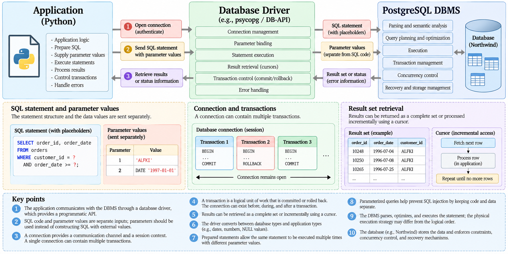{#fig-application-database-interface}

The separation does not imply that all business rules belong exclusively to one layer. Database constraints should protect invariants that must hold independently of the application, while application logic can enforce workflow and domain behaviour that cannot or should not be represented directly as database constraints.

The architecture should therefore distribute responsibilities according to their semantics rather than duplicate the same rule independently across every layer.

## From the Interface to PostgreSQL

The concepts developed in this section can later be implemented concretely from Python.

The implementation path will follow

$$
\boxed{
\text{Python}
\rightarrow
\text{PostgreSQL Driver}
\rightarrow
\text{Connection}
\rightarrow
\text{Parameterized SQL}
\rightarrow
\text{PostgreSQL}
\rightarrow
\text{Northwind}.
}
$$

The implementation will deliberately preserve the conceptual distinctions developed here. Connections will not be treated as transactions, parameter values will remain separate from SQL text, and SQL scripts will remain database operations rather than being embedded unnecessarily into application logic.

At this point, the logical path from an application to the database is largely established. Relations describe the data, SQL expresses operations, constraints define valid states, views provide logical abstractions, indexes provide alternative physical access paths, and database interfaces connect those mechanisms to application code.

The next step is to examine another responsibility of the DBMS: determining **who is permitted to perform which operations**. This leads to database authorization, privileges, roles, and the principle of least privilege.

# Authorization and Access Control

A database system may contain information that should not be accessible or modifiable by every user or application. Preserving data integrity therefore requires more than ensuring that values satisfy keys, foreign keys, and other constraints. The DBMS must also determine **who is permitted to perform particular operations on particular database objects** [@ullman2009database].

This responsibility is known as **authorization** or **access control**.

Conceptually, an authorization decision involves three components:

$$
\boxed{
\text{Principal}
+
\text{Object}
+
\text{Privilege}.
}
$$

A principal identifies the user or role requesting an operation, the object identifies the database resource being accessed, and the privilege specifies the operation that may be performed.

For example,

$$
(\text{analyst},\text{orders},\texttt{SELECT})
$$

can represent permission for an analyst to query the `orders` relation.

Access control therefore establishes a boundary around otherwise valid database operations. A query can be syntactically correct, semantically meaningful, and still be rejected because the requesting principal lacks the required privilege.

## Authentication and Authorization

**Authentication** and **authorization** address different questions.

Authentication asks:

$$
\boxed{\text{Who is the client?}}
$$

Authorization asks:

$$
\boxed{\text{What is that client allowed to do?}}
$$

A client may authenticate successfully and establish a database session while still lacking permission to access particular relations or perform particular operations.

Thus,

$$
\boxed{\text{Authentication} \neq \text{Authorization}.}
$$

Authentication establishes an identity or authenticated principal. Authorization evaluates that principal's permissions with respect to database objects and operations.

The distinction can be represented as

$$
\text{Client}
\xrightarrow{\text{Authentication}}
\text{Principal}
\xrightarrow{\text{Authorization}}
\text{Permitted Operations}.
$$

Both mechanisms contribute to database security, but successful authentication does not imply unrestricted database access.

## Principals and Database Objects

An authorization system operates over subjects that request access and objects that are protected.

A **principal** may represent an individual database user, an application identity, or a role through which privileges are assigned.

Protected database objects can include relations, views, schemas, sequences, routines, and other objects supported by the DBMS.

Conceptually,

$$
P=
\{\text{principals}\},
$$

$$
O=
\{\text{database objects}\},
$$

and

$$
A=
\{\text{permitted actions}\}.
$$

An authorization policy determines which combinations

$$
(p,o,a)\in P\times O\times A
$$

are permitted.

This model separates identity from the resources and operations being controlled.

## Privileges

A **privilege** grants permission to perform a particular category of operation on a database object.

Common table privileges include operations such as

```text
SELECT
INSERT
UPDATE
DELETE
```

These privileges correspond to different capabilities. Permission to read a table does not imply permission to modify it, and permission to insert rows does not necessarily imply permission to delete them.

Conceptually,

$$
\texttt{SELECT}
\neq
\texttt{INSERT}
\neq
\texttt{UPDATE}
\neq
\texttt{DELETE}.
$$

This separation allows permissions to reflect the actual responsibilities of users and applications.

For example, an analytical application may require

$$
\{\texttt{SELECT}\}
$$

over a collection of relations while requiring no data-modification privileges at all.

An order-processing application may require a different set:

$$
\{\texttt{SELECT},\texttt{INSERT},\texttt{UPDATE}\}.
$$

Authorization should therefore be derived from required operations rather than from a general notion of database access.

## GRANT

SQL provides `GRANT` for assigning privileges.

Conceptually, a statement such as

```sql
GRANT SELECT
ON orders
TO analyst;
```

establishes the authorization

$$
(\text{analyst},\text{orders},\texttt{SELECT}).
$$

Several privileges can be granted together:

```sql
GRANT SELECT, INSERT, UPDATE
ON orders
TO order_application;
```

The resulting principal can perform the granted operations subject to other applicable database rules.

Authorization does not override integrity constraints. A principal permitted to insert into `orders` still cannot successfully insert a row that violates a primary-key, foreign-key, or other enforced constraint.

Therefore,

$$
\boxed{
\text{Authorized Operation}
\neq
\text{Automatically Valid Operation}.
}
$$

Authorization determines whether the principal may attempt the operation; integrity constraints determine whether the resulting database state is permitted.

## REVOKE

Privileges may also need to be removed.

SQL provides `REVOKE` for this purpose:

```sql
REVOKE UPDATE
ON orders
FROM analyst;
```

Conceptually,

$$
\text{Authorization State}
\xrightarrow{\texttt{REVOKE}}
\text{More Restrictive Authorization State}.
$$

Granting and revoking privileges allows database permissions to evolve as responsibilities change.

The consequences of revoking privileges can become more complex when permissions have been delegated to other principals. The general principle, however, remains that authorization itself is part of database state and must be managed explicitly rather than assumed to remain permanently fixed.

## Roles

Assigning privileges directly to every individual principal can become difficult to manage as the number of users and applications increases.

A **role** provides an intermediate abstraction through which privileges can be grouped according to responsibilities.

Suppose several analysts require the same read-only access. Rather than assigning identical privileges independently,

$$
\begin{aligned}
U_1 &\rightarrow \{\text{privileges}\},\\
U_2 &\rightarrow \{\text{privileges}\},\\
U_3 &\rightarrow \{\text{privileges}\},
\end{aligned}
$$

the permissions can conceptually be associated with a role:

$$
\text{Analyst Role}
\rightarrow
\{\text{required privileges}\},
$$

and principals can then be associated with that role:

$$
\{U_1,U_2,U_3\}
\rightarrow
\text{Analyst Role}.
$$

This introduces a useful indirection:

$$
\boxed{
\text{Principal}
\rightarrow
\text{Role}
\rightarrow
\text{Privileges}.
}
$$

Roles make authorization easier to reason about because permissions can be aligned with functions such as analyst, reporting application, order-processing service, or database administrator.

For example, conceptually,

```sql
CREATE ROLE reporting;

GRANT SELECT
ON customers, orders, order_details, products
TO reporting;
```

defines a role whose purpose is read access to the relevant relations. Individual users or application identities can then receive that role according to the mechanisms provided by the DBMS.

## Role-Based Access Control

Using roles to group privileges is an example of **role-based access control**.

Rather than asking separately which permissions every individual user should possess, the system first identifies responsibilities:

$$
\text{Responsibility}
\rightarrow
\text{Role}
\rightarrow
\text{Privileges}.
$$

Users are then associated with the roles required for their responsibilities.

This reduces duplication and makes authorization policies easier to inspect.

For example,

$$
\begin{aligned}
\text{Reporting} &\rightarrow \{\texttt{SELECT}\},\\
\text{Order Processing} &\rightarrow \{\texttt{SELECT},\texttt{INSERT},\texttt{UPDATE}\},\\
\text{Administration} &\rightarrow \{\text{broader administrative privileges}\}.
\end{aligned}
$$

The exact privileges depend on the system, but the design principle is general: authorization should correspond to responsibilities rather than being assigned arbitrarily.

## Principle of Least Privilege

A central authorization principle is **least privilege**: a principal should receive only the privileges required to perform its intended function.

If $R(p)$ denotes the privileges required by principal $p$ and $G(p)$ denotes the privileges actually granted, the ideal relationship is

$$
G(p)\approx R(p),
$$

with

$$
R(p)\subseteq G(p)
$$

only to the extent necessary for the principal to operate correctly.

Unnecessary privileges increase the set of operations that can be performed accidentally or maliciously.

For example, if a reporting process only executes queries, granting

$$
\{\texttt{SELECT},\texttt{INSERT},\texttt{UPDATE},\texttt{DELETE}\}
$$

provides capabilities that the process does not require.

A more appropriate authorization would be

$$
\{\texttt{SELECT}\}.
$$

Least privilege therefore reduces the potential consequences of application defects, compromised credentials, or incorrect operations.

It can be summarized as

$$
\boxed{
\text{Grant what is required, not what might be convenient}.
}
$$

## Views and Authorization

Views can be combined with privileges to expose a restricted representation of underlying data.

Suppose an employee relation contains information that should not be available to a reporting user:

```text
employees
------------------------------------------------
employee_id
first_name
last_name
title
birth_date
home_address
...
```

A view can expose only the required attributes:

```sql
CREATE VIEW employee_directory AS
SELECT
    employee_id,
    first_name,
    last_name,
    title
FROM employees;
```

Authorization can then be designed around the view rather than unrestricted access to the base relation.

Conceptually,

$$
\text{Base Relation}
\xrightarrow{\text{Projection}}
\text{Restricted View}
\xrightarrow{\text{Privilege}}
\text{Authorized Principal}.
$$

This combines two different mechanisms. The view defines the logical information exposed, while the authorization system controls who may access that representation.

Thus,

$$
\boxed{
\text{View}
\neq
\text{Privilege},
}
$$

even though they can work together to create a controlled database interface.

## Application Identities

Applications themselves commonly connect to databases using an assigned database identity.

The authorization model should therefore apply not only to human users but also to application components:

$$
\text{Application}
\xrightarrow{\text{Authentication}}
\text{Database Principal}
\xrightarrow{\text{Privileges}}
\text{Database Operations}.
$$

An application that only reads analytical data should not require broad modification privileges merely because the database contains writable relations.

Similarly, different application components may justify different identities when their responsibilities differ substantially.

This provides an additional layer of protection. Even if application logic attempts an unintended operation, the DBMS can reject it when the application's database principal lacks the corresponding privilege.

Authorization therefore complements application-level controls rather than replacing or duplicating them.

## Authorization and SQL Injection

Parameterized queries and authorization address different aspects of database security.

Parameterized queries protect the boundary between

$$
\text{SQL Code}
\quad\text{and}\quad
\text{Data}.
$$

Authorization limits the operations available to the authenticated principal:

$$
\text{Principal}
\quad\text{and}\quad
\text{Permitted Operations}.
$$

These mechanisms are complementary.

If an application contains an SQL-injection vulnerability but its database principal has unrestricted privileges, the potential impact may be large. If the same application operates under least privilege, the range of operations available through the compromised interface may be smaller.

This does not make authorization a substitute for parameterization.

$$
\boxed{
\text{Parameterized Queries}
+
\text{Least Privilege}
}
$$

provide separate layers of protection against different failure modes.

## Integrity and Authorization

Integrity constraints and authorization also solve different problems.

Integrity asks:

$$
\boxed{\text{Is this database state valid?}}
$$

Authorization asks:

$$
\boxed{\text{Is this principal permitted to perform this operation?}}
$$

Suppose a user attempts

```sql
DELETE FROM customers
WHERE customer_id = 'ALFKI';
```

Several independent questions may arise:

$$
\begin{aligned}
&\text{Is the user permitted to delete from customers?}\\
&\text{Would the deletion violate referential integrity?}\\
&\text{Is the statement part of a transaction that will eventually commit?}
\end{aligned}
$$

These questions belong to different DBMS mechanisms.

The operation succeeds only when the relevant requirements are simultaneously satisfied:

$$
\boxed{
\text{Authorization}
+
\text{Integrity}
+
\text{Transaction Semantics}
\rightarrow
\text{Permitted Database Transition}.
}
$$

Keeping these mechanisms conceptually separate makes it easier to understand why a DBMS may reject an apparently valid SQL statement.

## Access Control as a Database Responsibility

Authorization completes another part of the responsibilities introduced at the beginning of these notes.

A DBMS does not merely store and retrieve data. It mediates access to shared persistent state:

$$
\text{Principal}
\rightarrow
\text{Authorization}
\rightarrow
\text{SQL Operation}
\rightarrow
\text{Integrity Enforcement}
\rightarrow
\text{Database State}.
$$

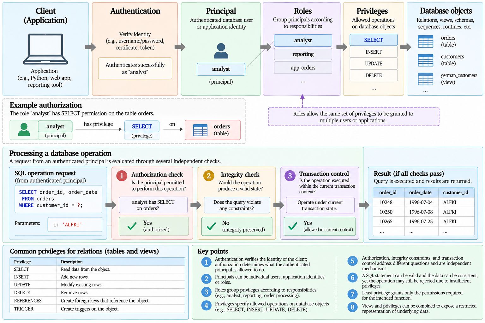{#fig-database-authorization}

The model can be summarized through four distinct questions:

$$
\boxed{
\begin{aligned}
\text{Authentication:}&\quad \text{Who are you?}\\
\text{Authorization:}&\quad \text{What may you do?}\\
\text{Integrity:}&\quad \text{Is the resulting state valid?}\\
\text{Transactions:}&\quad \text{How is the state transition controlled?}
\end{aligned}
}
$$

These mechanisms interact, but none can be reduced to another.

With the principal relational structures, SQL interface, constraints, views, indexes, application interfaces, and authorization mechanisms established, the next sections can extend the query model beyond ordinary non-recursive relational expressions. One particularly important extension is **recursive SQL**, which allows queries to express computations whose results depend iteratively on previously derived results.

# Recursive SQL

Ordinary SQL queries construct a result from relations that are already available when the query begins. Some problems, however, have a recursive structure: determining one part of the result may reveal additional data that must itself be processed before the complete result is known.

Hierarchies and graphs provide common examples. An employee may report to a manager, who reports to another manager; a component may contain subcomponents that themselves contain further components; a node may be connected to other nodes through paths of unknown length. In these cases, the number of relational operations required cannot always be written explicitly in advance.

**Recursive SQL** extends the query language so that a derived relation can participate in the computation of additional rows of that same relation. SQL commonly expresses this through a recursive Common Table Expression (CTE).

The central idea can be represented as

$$
\boxed{
\text{Initial Result}
\rightarrow
\text{Recursive Expansion}
\rightarrow
\text{Fixed Point}.
}
$$

The syntax is useful, but the fixed-point interpretation provides the more general understanding of what the recursive query computes.

## Recursive Relations

Consider a simplified employee hierarchy:

| employee_id | employee_name | manager_id |
|:---:|:---:|:---:|
| 1 | Alice | NULL |
| 2 | Bob | 1 |
| 3 | Carol | 1 |
| 4 | David | 2 |
| 5 | Emma | 2 |
| 6 | Frank | 4 |

The relation can be represented as

$$
\operatorname{Employees}(
\text{employee\_id},
\text{employee\_name},
\text{manager\_id}
).
$$

The `manager_id` attribute refers back to another tuple in the same relation.

For example,

$$
\text{Bob}\rightarrow\text{Alice}
$$

indicates that Bob reports to Alice, while

$$
\text{David}\rightarrow\text{Bob}\rightarrow\text{Alice}
$$

describes a path through several levels of the hierarchy.

A conventional self-join can find relationships of a known depth. One join can identify an employee's manager; another can identify the manager's manager. But if the hierarchy can contain an arbitrary number of levels, the required number of joins is not known in advance.

This is the type of problem for which recursion becomes useful.

## Recursive Common Table Expressions

A recursive CTE contains two conceptually distinct parts:

$$
\boxed{
\text{Anchor Term}
+
\text{Recursive Term}.
}
$$

The **anchor term** produces the initial rows. The **recursive term** uses rows already discovered to derive additional rows.

A recursive employee hierarchy can be expressed as

```sql
WITH RECURSIVE employee_hierarchy AS (
    SELECT
        employee_id,
        employee_name,
        manager_id,
        0 AS depth
    FROM employees
    WHERE employee_id = 1

    UNION ALL

    SELECT
        e.employee_id,
        e.employee_name,
        e.manager_id,
        h.depth + 1
    FROM employees AS e
    JOIN employee_hierarchy AS h
        ON e.manager_id = h.employee_id
)
SELECT
    employee_id,
    employee_name,
    manager_id,
    depth
FROM employee_hierarchy;
```

The anchor term is

```sql
SELECT
    employee_id,
    employee_name,
    manager_id,
    0 AS depth
FROM employees
WHERE employee_id = 1
```

and establishes the starting point of the computation.

If employee `1` is Alice, the initial recursive result is

$$
R_0=
\{\text{Alice}\}.
$$

The recursive term

```sql
SELECT
    e.employee_id,
    e.employee_name,
    e.manager_id,
    h.depth + 1
FROM employees AS e
JOIN employee_hierarchy AS h
    ON e.manager_id = h.employee_id
```

uses the rows already discovered to find employees whose `manager_id` refers to them.

The recursion continues until no additional rows can be produced.

## Step-by-Step Evaluation

The employee example can be understood iteratively.

The anchor produces

$$
R_0=
\{\text{Alice}\}.
$$

Using Alice, the recursive term finds her direct reports:

$$
\Delta_1=
\{\text{Bob},\text{Carol}\}.
$$

The accumulated result becomes

$$
R_1=
R_0\cup\Delta_1
=
\{\text{Alice},\text{Bob},\text{Carol}\}.
$$

The newly discovered employees reveal another level:

$$
\Delta_2=
\{\text{David},\text{Emma}\}.
$$

Therefore,

$$
R_2=
R_1\cup\Delta_2.
$$

David then reveals Frank:

$$
\Delta_3=
\{\text{Frank}\},
$$

giving

$$
R_3=
R_2\cup\Delta_3.
$$

The next recursive step discovers nothing new:

$$
\Delta_4=\varnothing.
$$

At this point the computation terminates.

The complete result is

$$
R^*
=
\{
\text{Alice},
\text{Bob},
\text{Carol},
\text{David},
\text{Emma},
\text{Frank}
\}.
$$

The superscript $*$ indicates that the iterative process has reached its final result.

## Fixed-Point Interpretation

The recursive computation can be formalized using an operator $F$ that expands the current result.

Starting with the anchor relation $R_0$,

$$
R_1=F(R_0),
$$

$$
R_2=F(R_1),
$$

and more generally,

$$
R_{i+1}=F(R_i).
$$

The computation terminates when applying the recursive transformation produces no change:

$$
R_{k+1}=R_k.
$$ {#eq-recursive-fixed-point}

At this stage,

$$
F(R_k)=R_k.
$$

The relation $R_k$ is therefore a **fixed point** of the transformation.

For recursive queries that accumulate discovered tuples monotonically, the sequence can be represented as

$$
R_0
\subseteq
R_1
\subseteq
R_2
\subseteq
\cdots
\subseteq
R_k.
$$

Each iteration adds information without removing information already derived.

The computation stops when

$$
R_{k+1}-R_k=\varnothing.
$$

This interpretation is more general than the SQL syntax itself. Recursive SQL provides a practical mechanism for expressing iterative relational computation whose final result is reached when further application of the recursive rule contributes nothing new.

## Anchor and Recursive Terms

The anchor and recursive terms perform fundamentally different roles.

The anchor answers:

$$
\boxed{\text{Where does the computation begin?}}
$$

The recursive term answers:

$$
\boxed{\text{How is the next part of the result derived?}}
$$

Without an anchor, the recursion has no initial state. Without a recursive term, no iterative expansion occurs.

The structure can therefore be viewed as

$$
R_0=A,
$$

where $A$ is the anchor result, followed by

$$
\Delta_{i+1}=G(\Delta_i,R_i),
$$

where $G$ represents the recursive rule.

The accumulated result becomes

$$
R_{i+1}=R_i\cup\Delta_{i+1}.
$$

This delta-oriented interpretation is useful because each iteration conceptually discovers another frontier of the hierarchy or graph.

For the employee hierarchy,

$$
\begin{aligned}
\Delta_0 &= \{\text{Alice}\},\\
\Delta_1 &= \{\text{Bob},\text{Carol}\},\\
\Delta_2 &= \{\text{David},\text{Emma}\},\\
\Delta_3 &= \{\text{Frank}\}.
\end{aligned}
$$

The sequence corresponds directly to increasing distance from the starting employee.

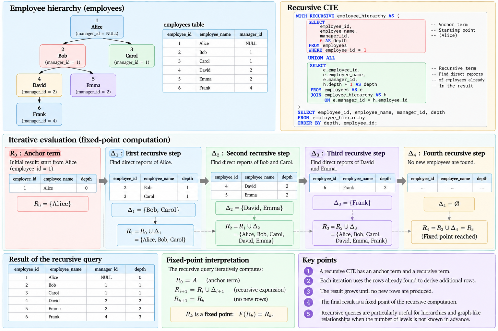{#fig-recursive-query-fixed-point}

## Depth

Recursive queries can carry additional state through each iteration.

In the employee example, the anchor assigns

$$
\text{depth}=0.
$$

Each recursive step computes

$$
\text{depth}_{\text{child}}
=
\text{depth}_{\text{parent}}+1.
$$

Thus,

$$
\begin{aligned}
\text{Alice} &: 0,\\
\text{Bob},\text{Carol} &: 1,\\
\text{David},\text{Emma} &: 2,\\
\text{Frank} &: 3.
\end{aligned}
$$

Depth is not necessarily stored in the underlying relation. It is derived from the recursive path taken through the hierarchy.

This illustrates an important property of recursive queries: they can compute information about relationships that is implicit in the database rather than stored directly in any individual tuple.

## Direct and Transitive Relationships

The underlying employee relation records only **direct** reporting relationships.

For example,

$$
\text{Frank}\rightarrow\text{David}
$$

and

$$
\text{David}\rightarrow\text{Bob}.
$$

It does not need to store explicitly that Frank is indirectly below Bob.

Recursion derives this relationship through a path:

$$
\text{Frank}
\rightarrow
\text{David}
\rightarrow
\text{Bob}.
$$

More generally, if relation $E(x,y)$ represents a direct edge from $x$ to $y$, recursive evaluation can derive the **transitive closure** $E^+$ containing pairs connected through paths of one or more edges.

The basic reasoning is

$$
E(x,y)
\Rightarrow
E^+(x,y),
$$

and

$$
E^+(x,y)\land E(y,z)
\Rightarrow
E^+(x,z).
$$

Repeated application derives paths whose length was not specified in advance.

This makes recursion particularly natural for hierarchies, dependency graphs, organizational structures, bills of materials, transportation networks, and other graph-like data represented relationally.

## Recursion and Self-Joins

A self-join and a recursive query should not be confused.

A self-join can traverse a fixed number of relationship levels.

For example, one self-join may obtain an employee and direct manager:

```sql
SELECT
    e.employee_name,
    m.employee_name AS manager_name
FROM employees AS e
LEFT JOIN employees AS m
    ON e.manager_id = m.employee_id;
```

Adding another join can obtain the manager's manager.

But the query structure must explicitly contain each traversal step.

If the required depth is known to be exactly three,

$$
E\bowtie E\bowtie E
$$

may be sufficient.

If the depth is not known beforehand, writing a fixed number of joins does not express the general problem.

Thus,

$$
\boxed{
\text{Self-Join}
\neq
\text{Recursive Traversal}.
}
$$

A self-join relates a table to itself once per explicit occurrence. Recursion allows the same relationship rule to be applied repeatedly until a termination condition is reached.

## UNION and UNION ALL

Recursive CTEs commonly combine the anchor and recursive terms using either `UNION` or `UNION ALL`.

The distinction follows the set and bag semantics introduced earlier.

`UNION` eliminates duplicate rows, while `UNION ALL` preserves them.

This difference can affect both semantics and termination.

If recursive expansion repeatedly generates rows that have already been seen, duplicate elimination can prevent those rows from being added again under an appropriate recursive formulation. With `UNION ALL`, repeated paths may continue to produce repeated rows unless the query contains another mechanism that bounds or prevents the recursion.

The choice should therefore reflect the semantics of the recursive problem rather than being treated only as a performance decision.

## Cycles

Not every recursive relationship forms a tree.

Suppose the underlying data contains

$$
A\rightarrow B,
$$

$$
B\rightarrow C,
$$

and

$$
C\rightarrow A.
$$

The graph contains a cycle:

$$
A
\rightarrow
B
\rightarrow
C
\rightarrow
A
\rightarrow
\cdots
$$

A recursive traversal that does not detect previously visited nodes or otherwise restrict the recursion may continue revisiting the same states.

This reveals a fundamental distinction:

$$
\boxed{
\text{Recursive Definition}
\neq
\text{Guaranteed Termination}.
}
$$

Termination depends on the recursive rule, the data, duplicate semantics, and any explicit conditions imposed by the query.

When cycles are possible, recursive queries may need to track visited nodes, restrict depth, eliminate repeated states, or use DBMS facilities designed for cycle handling.

The problem is algorithmic as well as relational: recursion over graph-structured data requires reasoning about termination.

## Recursive SQL as Graph Traversal

A recursive hierarchy query can be interpreted as a graph traversal.

Let

$$
G=(V,E)
$$

be a directed graph, where employees are vertices and reporting relationships are edges.

Starting from vertex $v_0$, the recursive query discovers

$$
V_0=\{v_0\},
$$

then vertices reachable in one step,

$$
V_1,
$$

then two steps,

$$
V_2,
$$

and so on.

The reachable set is

$$
V^*
=
\bigcup_{i=0}^{k}V_i.
$$

This creates a direct conceptual bridge between relational databases and graph algorithms.

The DBMS is not being transformed into a general-purpose graph-processing system. Rather, recursive SQL provides a declarative way to express certain graph computations over relationships represented in relations.

## Recursion Remains Declarative

Although a recursive query describes an iterative computation, it remains declarative.

The query specifies the anchor, recursive relationship, and desired result. It does not normally prescribe the low-level physical algorithm through which the DBMS must execute every iteration.

Thus,

$$
\boxed{
\text{Recursive Logical Evaluation}
\neq
\text{Physical Execution Algorithm}.
}
$$

As with ordinary SQL, the DBMS retains responsibility for implementing the requested computation using its execution machinery.

This distinction will become more important once query execution and optimization are studied.

## When Recursion Is Appropriate

Recursive SQL is appropriate when the structure of the problem itself is recursive and the number of relationship levels cannot be conveniently fixed in advance.

Typical examples include organizational hierarchies, category trees, bills of materials, dependency chains, ancestor-descendant relationships, and reachability through graph-like data.

It should not be introduced merely because several joins make a query visually long. If the relationship depth is fixed and known, ordinary joins may express the problem more directly.

The design question is therefore

$$
\boxed{
\text{Is the data relationship recursively defined?}
}
$$

rather than

$$
\boxed{
\text{Can this query be written using }\texttt{WITH RECURSIVE}\text{?}
}
$$

The distinction keeps recursion tied to the semantics of the problem.

## From Recursive Queries to Analytical Workloads

Recursive SQL extends the expressive power of SQL by allowing iterative relational computations. It does not fundamentally change the underlying storage model: the data can still be represented through ordinary relations, keys, and references.

The progression can be summarized as

$$
\boxed{
\text{Direct Relationship}
\rightarrow
\text{Recursive Rule}
\rightarrow
\text{Repeated Expansion}
\rightarrow
\text{Fixed Point}.
}
$$

This completes an important extension of ordinary relational querying. A different extension arises when the purpose of the database workload changes from processing individual operational events to analysing large collections of historical data.

This distinction leads to **operational and analytical workloads**, including the concepts of OLTP, OLAP, fact and dimension tables, and dimensional organization.

# Operational and Analytical Workloads

Database systems support workloads with substantially different objectives. Some applications continuously record individual business events such as orders, payments, inventory movements, or customer updates. Others examine large collections of historical data to identify patterns, calculate summaries, compare periods, and support decisions.

These workloads are commonly described as **Online Transaction Processing (OLTP)** and **Online Analytical Processing (OLAP)**, respectively.

The distinction should not be interpreted primarily as a classification of database products. It describes characteristics of the workload:

$$
\boxed{\text{OLTP} \neq \text{OLAP}.}
$$

The same organization may require both, and the same underlying business data may participate in operational processing at one stage and analytical processing at another.

Understanding the distinction is important because database design cannot be separated entirely from how the data will be used.

## Operational Workloads

An OLTP workload is centered on individual business transactions.

Examples include placing an order, registering a payment, updating an address, changing inventory, or creating a customer account.

A typical operation affects a relatively small portion of the database:

```sql
UPDATE products
SET units_in_stock = units_in_stock - 1
WHERE product_id = 42;
```

or

```sql
INSERT INTO orders (
    customer_id,
    employee_id,
    order_date
)
VALUES (
    'ALFKI',
    5,
    CURRENT_DATE
);
```

The workload may contain a large number of such operations, often executed concurrently.

Conceptually,

$$
\text{OLTP}
\rightarrow
\text{Many Short Transactions}
+
\text{Frequent Updates}
+
\text{Fine-Grained Access}.
$$

Correctness is particularly important because these operations modify the current state of the organization. An order should not disappear because another user is modifying inventory, and a committed payment should survive a system failure.

Consequently, OLTP workloads place strong demands on transaction management, concurrency control, integrity enforcement, and recovery.

## Analytical Workloads

An OLAP workload is primarily concerned with analysing collections of data rather than modifying individual operational records.

A query may ask:

```sql
SELECT
    c.country,
    EXTRACT(YEAR FROM o.order_date) AS order_year,
    SUM(
        od.unit_price
        * od.quantity
        * (1 - od.discount)
    ) AS sales
FROM customers AS c
JOIN orders AS o
    ON c.customer_id = o.customer_id
JOIN order_details AS od
    ON o.order_id = od.order_id
GROUP BY
    c.country,
    EXTRACT(YEAR FROM o.order_date);
```

This query may read many rows while producing a comparatively small aggregated result.

Conceptually,

$$
\text{OLAP}
\rightarrow
\text{Large Reads}
+
\text{Aggregation}
+
\text{Historical Analysis}.
$$

Analytical queries often combine several relations, scan substantial portions of the available data, group rows along multiple dimensions, and compute aggregate measures.

The workload is therefore different from repeatedly locating and modifying individual tuples.

## OLTP and OLAP

The contrast can be summarized as follows:

| Characteristic | OLTP | OLAP |
|:---:|:---:|:---:|
| Primary objective | Process operational events | Analyse collections of data |
| Typical operations | Insert, update, delete, point lookup | Scan, join, aggregate |
| Rows touched per operation | Usually relatively few | Potentially many |
| Transactions | Frequent and usually short | Fewer, often read-intensive |
| Updates | Continuous | Usually less central to analytical queries |
| Time orientation | Current operational state | Often historical |
| Typical questions | "Record this order" | "How did sales vary by country and year?" |

These are tendencies rather than strict rules. An operational application can execute reports, and an analytical system can receive updates.

The important point is that different access patterns place different demands on the database system.

Thus,

$$
\boxed{\text{Workload Characteristics} \rightarrow \text{Design Trade-offs}.}
$$

## Schema Design and Workload

Normalization reduces redundancy and protects update semantics, which makes it particularly valuable for operational data that changes frequently.

An analytical workload may prioritize different properties. Queries may repeatedly join the same entities and aggregate measures over large datasets. In such cases, additional redundancy or precomputation can sometimes reduce query complexity and execution cost.

This does not mean

$$
\text{OLTP}=\text{normalized}
$$

and

$$
\text{OLAP}=\text{denormalized}.
$$

Such an equivalence would be too strong.

Rather,

$$
\boxed{
\text{Schema Design}
=
f(
\text{Data Semantics},
\text{Integrity Requirements},
\text{Workload}
).
}
$$

Normalization remains a logical design tool, while analytical organization introduces additional trade-offs motivated by repeated query patterns.

## Analytical Grain

Before designing an analytical relation, its **grain** must be defined.

The grain states what one row represents.

For example, an order relation may have the grain

$$
\boxed{\text{One row per order}},
$$

while `order_details` may have

$$
\boxed{\text{One row per product within an order}}.
$$

An analytical dataset could instead represent

$$
\boxed{\text{One row per product sale}},
$$

or

$$
\boxed{\text{One row per customer per month}}.
$$

These are fundamentally different representations.

Suppose a table contains

| customer_id | month | total_sales |
|:---:|:---:|:---:|
| ALFKI | 1997-01 | 1240.50 |
| ALFKI | 1997-02 | 840.00 |

Its grain is not one row per order. It is one row per

$$
(\text{customer},\text{month}).
$$

This distinction determines what can be aggregated correctly.

If the grain is misunderstood, measures may be duplicated or aggregated at an unintended level.

Therefore,

$$
\boxed{\text{Define the Grain Before Interpreting the Measures}.}
$$

This principle is especially important when several analytical relations are joined.

## Facts and Dimensions

A common analytical organization distinguishes **facts** from **dimensions**.

A **fact** represents a measurable event or observation. A **dimension** provides descriptive context through which those facts can be analysed.

For a sales dataset, a fact relation might contain

```text
SalesFact
--------------------------------
date_key
customer_key
product_key
quantity
sales_amount
discount_amount
```

while dimensions might include

```text
CustomerDimension
--------------------------------
customer_key
customer_name
city
country
```

and

```text
ProductDimension
--------------------------------
product_key
product_name
category
supplier
```

The fact relation answers

$$
\boxed{\text{What was measured?}}
$$

while dimensions help answer

$$
\boxed{\text{Along which perspectives should it be analysed?}}
$$

For example,

$$
\text{sales amount}
$$

may be analysed by

$$
\text{customer},
\quad
\text{product},
\quad
\text{location},
\quad
\text{time}.
$$

The distinction is analytical rather than intrinsic to the relational model. Both facts and dimensions are represented as relations.

## Measures

A fact relation commonly contains numerical **measures**.

Examples include

$$
\text{quantity},
\qquad
\text{sales amount},
\qquad
\text{discount},
\qquad
\text{cost}.
$$

Suppose the sales value of an order line is defined as

$$
s_i
=
p_iq_i(1-d_i),
$$

where $p_i$ is unit price, $q_i$ is quantity, and $d_i$ is the discount fraction.

Total sales over a set $G$ of fact rows can then be calculated as

$$
S(G)
=
\sum_{i\in G}
p_iq_i(1-d_i).
$$

If $G$ represents all sales for Germany during 1997, the same measure is aggregated over that analytical slice.

The meaning of an aggregate therefore depends jointly on

$$
\boxed{\text{Measure}+\text{Grain}+\text{Grouping Dimensions}.}
$$

A numerical column alone does not establish the meaning of an analytical result.

## Dimensions

Dimensions provide descriptive attributes used to group, filter, and interpret facts.

A customer dimension may provide a hierarchy such as

$$
\text{Customer}
\rightarrow
\text{City}
\rightarrow
\text{Country},
$$

while a time dimension may support

$$
\text{Day}
\rightarrow
\text{Month}
\rightarrow
\text{Quarter}
\rightarrow
\text{Year}.
$$

These relationships allow the same underlying facts to be analysed at different levels.

For example,

$$
\operatorname{SUM}(\text{sales})
$$

can be computed by customer, city, country, month, year, product, or combinations of these dimensions.

This multidimensional interpretation is one of the defining characteristics of analytical workloads.

## Star Schemas

A common dimensional organization is the **star schema**.

A central fact relation contains measures and references to surrounding dimension relations:

$$
\begin{array}{ccccc}
&&\text{Date Dimension}&&\\
&&|&&\\
\text{Customer Dimension}
&-&
\text{Sales Fact}
&-&
\text{Product Dimension}\\
&&|&&\\
&&\text{Employee Dimension}&&
\end{array}
$$

The central fact table may have a structure such as

```text
SalesFact
--------------------------------
date_key
customer_key
product_key
employee_key
quantity
sales_amount
```

Each dimension provides descriptive information associated with one of those keys.

The structure resembles a star because several dimensions surround a central fact relation.

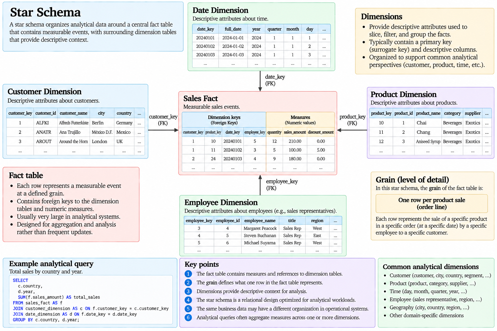{#fig-star-schema}

The star schema reduces the number of relationships an analytical query must navigate compared with a highly normalized operational schema, at the cost of introducing a representation optimized for a different workload.

This is not a replacement for relational modelling. A star schema is itself relational; it organizes relations according to analytical semantics.

## Operational and Analytical Representations

The same business event can appear differently in operational and analytical schemas.

An operational order may be distributed across relations such as

$$
\text{Customers},
\quad
\text{Orders},
\quad
\text{OrderDetails},
\quad
\text{Products}.
$$

This organization supports integrity and operational updates.

An analytical representation may transform those records into a fact table with dimension references:

$$
\text{SalesFact}
(
\text{date\_key},
\text{customer\_key},
\text{product\_key},
\text{quantity},
\text{sales\_amount}
).
$$

Conceptually,

$$
\text{Operational Data}
\xrightarrow{\text{Transformation}}
\text{Analytical Representation}.
$$

The transformation does not imply that one representation is universally superior. Each serves a different workload.

This distinction is central:

$$
\boxed{
\text{Operational Schema}
\neq
\text{Analytical Schema}
}
$$

because their design objectives differ.

## Aggregation Across Dimensions

Suppose `SalesFact` contains a measure `sales_amount` and references customer and date dimensions.

Sales by country can be represented conceptually as

$$
S(c)
=
\sum_{i:\operatorname{country}(i)=c}
\text{sales\_amount}_i.
$$

Sales by country and year become

$$
S(c,y)
=
\sum_{i:
\operatorname{country}(i)=c
\land
\operatorname{year}(i)=y}
\text{sales\_amount}_i.
$$

The same facts can therefore be grouped at different dimensional levels.

For example,

```sql
SELECT
    c.country,
    d.year,
    SUM(f.sales_amount) AS total_sales
FROM sales_fact AS f
JOIN customer_dimension AS c
    ON f.customer_key = c.customer_key
JOIN date_dimension AS d
    ON f.date_key = d.date_key
GROUP BY
    c.country,
    d.year;
```

The result grain is

$$
\boxed{\text{One row per country per year}.}
$$

The query does not change the grain of the stored facts. It constructs a new aggregated relation whose grain is determined by the grouping attributes.

## Roll-Up and Drill-Down

Analytical queries often move between levels of aggregation.

Starting from

$$
\text{City},
$$

a query may aggregate upward to

$$
\text{Country}.
$$

This operation is commonly described as **roll-up**.

Conversely, moving from country-level summaries to city-level summaries is commonly described as **drill-down**.

Conceptually,

$$
\text{City}
\xrightarrow{\text{Roll-Up}}
\text{Country}
$$

and

$$
\text{Country}
\xrightarrow{\text{Drill-Down}}
\text{City}.
$$

Similarly,

$$
\text{Month}
\rightarrow
\text{Quarter}
\rightarrow
\text{Year}
$$

provides increasing levels of temporal aggregation.

These operations do not require a fundamentally different relational model. They represent systematic changes in grouping level over dimensional attributes.

## ROLLUP

SQL can generate several hierarchical aggregation levels in one grouped query using constructs such as `ROLLUP`.

Conceptually,

```sql
GROUP BY ROLLUP (country, year)
```

can request grouping levels corresponding approximately to

$$
(\text{country},\text{year}),
$$

$$
(\text{country}),
$$

and

$$
().
$$

The empty grouping set represents the grand total.

If $S(c,y)$ denotes sales for country $c$ and year $y$, the roll-up can additionally derive

$$
S(c)
=
\sum_y S(c,y)
$$

and

$$
S
=
\sum_c\sum_y S(c,y).
$$

`ROLLUP` is therefore useful when the grouping attributes have a natural hierarchical interpretation.

## CUBE

`CUBE` generalizes multidimensional aggregation by producing grouping combinations across the specified dimensions.

For two dimensions, country and year, the grouping sets conceptually include

$$
(\text{country},\text{year}),
$$

$$
(\text{country}),
$$

$$
(\text{year}),
$$

and

$$
().
$$

Thus, if the dimensions are

$$
D_1,D_2,\ldots,D_n,
$$

a full cube conceptually considers combinations drawn from those dimensions.

The number of possible grouping sets can grow as

$$
2^n.
$$

For example,

$$
n=3
$$

dimensions can generate

$$
2^3=8
$$

grouping combinations.

This exponential growth is one reason multidimensional aggregation must be used deliberately rather than mechanically.

The purpose here is not to develop a complete OLAP language, but to recognize that analytical SQL can request several aggregation levels over the same underlying facts.

## Precomputation

Analytical workloads often repeat expensive aggregations over large collections of data.

Suppose a query repeatedly computes

$$
S(c,y)
$$

from millions of individual sales rows.

One strategy is to calculate the result from base data whenever it is requested:

$$
\text{Facts}
\xrightarrow{\text{Query}}
S(c,y).
$$

Another strategy is to store a previously computed aggregate:

$$
\text{Facts}
\xrightarrow{\text{Precompute}}
\text{Stored Aggregate}.
$$

This is precisely the type of trade-off introduced earlier with materialized views.

Precomputation can reduce repeated query work, but it introduces additional storage and maintenance:

$$
\boxed{
\text{Query-Time Computation}
\quad\leftrightarrow\quad
\text{Precomputation + Maintenance}.
}
$$

Analytical workloads make this trade-off particularly important because the cost of repeated aggregation can be substantial.

## Workload and Physical Design

The OLTP/OLAP distinction also influences physical database design.

A highly selective operational lookup may benefit from an index:

```sql
WHERE order_id = ?
```

while an analytical query that reads a large fraction of a relation may obtain less benefit from the same access path.

Similarly, a physical organization useful for frequent small updates may differ from one appropriate for repeated large scans and aggregations.

This reinforces a principle introduced with indexes:

$$
\boxed{\text{There Is No Universally Optimal Physical Design}.}
$$

Physical structures should be evaluated relative to the workload they support.

Later sections will make this relationship more precise by introducing pages, I/O costs, index structures, physical query operators, and cost-based optimization.

## OLTP and OLAP as Workload Characteristics

It is tempting to reduce the distinction to two separate categories of systems:

$$
\text{System A}=\text{OLTP},
$$

$$
\text{System B}=\text{OLAP}.
$$

In practice, the more durable conceptual distinction concerns the workload.

A particular database system may support both operational and analytical queries, although their conflicting requirements can motivate different schemas, physical structures, replicas, or specialized systems.

The important reasoning direction is therefore

$$
\boxed{
\text{Workload}
\rightarrow
\text{Requirements}
\rightarrow
\text{Logical and Physical Design Decisions}.
}
$$

rather than

$$
\boxed{
\text{Database Product}
\rightarrow
\text{Fixed Workload Category}.
}
$$

This perspective also explains why database design cannot be evaluated only by examining schemas in isolation. A schema that performs well for one access pattern may be inappropriate for another.

## From Structured Relations to Flexible Data

The relational model assumes a clearly defined logical structure in which tuples conform to relation schemas. Many modern applications also need to store data whose structure varies between records, evolves rapidly, or contains nested collections.

This motivates **semistructured data**.

The distinction should not be interpreted as structured versus completely structureless information. Semistructured data still contains organization and relationships, but its structure may be represented within the data itself rather than entirely through a fixed relational schema.

The next section therefore extends the discussion beyond conventional relational attributes to semistructured representations and their practical expression through document-oriented formats such as JSON.

# Semistructured Data

The relational model represents data through relations whose tuples conform to a defined schema. This structure provides a strong foundation for integrity, querying, and data independence, but not every dataset encountered by an application has a completely uniform shape. Some records contain optional or varying attributes, some contain nested structures, and some evolve more rapidly than a fixed relational schema conveniently accommodates.

Such information is commonly described as **semistructured data** [@ullman2009database].

The distinction should not be interpreted as

$$
\text{Structured Data}
\quad\text{versus}\quad
\text{Unstructured Data}.
$$

Semistructured data occupies a different position. It contains recognizable structure, but that structure may be irregular, nested, or represented together with the data itself rather than imposed entirely through a fixed relation schema.

Conceptually,

$$
\boxed{
\text{Semistructured}
\neq
\text{Structureless}.
}
$$

This distinction is important because flexible representation does not imply the absence of organization.

## Structured and Semistructured Representations

Consider a conventional relational representation of products:

| product_id | product_name | category | unit_price |
|:---:|:---:|:---:|:---:|
| 1 | Chai | Beverages | 18.00 |
| 2 | Chang | Beverages | 19.00 |

Every tuple follows the same relation schema:

$$
\operatorname{Products}(
\text{product\_id},
\text{product\_name},
\text{category},
\text{unit\_price}
).
$$

The attributes are defined independently of the individual tuples, and each tuple is interpreted according to that common structure.

Now consider two product descriptions:

```json
{
  "product_id": 1,
  "product_name": "Chai",
  "category": "Beverages",
  "unit_price": 18.00
}
```

and

```json
{
  "product_id": 2,
  "product_name": "Chang",
  "category": "Beverages",
  "unit_price": 19.00,
  "origin": {
    "country": "Thailand",
    "region": "Central"
  },
  "tags": ["tea", "beverage"]
}
```

The two objects share part of their structure but need not contain exactly the same fields. The second object also contains nested information and a collection of values.

The structure is still explicit and interpretable, but it is not represented through a single flat tuple shape.

This motivates the distinction

$$
\boxed{
\text{Fixed Uniform Schema}
\neq
\text{Only Form of Structured Information}.
}
$$

## Self-Describing Structure

Semistructured representations are often described as **self-describing** because structural information appears together with the represented values.

In

```json
{
  "product_name": "Chai",
  "unit_price": 18.00
}
```

the names

```text
product_name
unit_price
```

occur as part of the representation itself.

A relational tuple, by contrast, is interpreted according to a schema defined separately:

$$
\operatorname{Products}(
\text{product\_name},
\text{unit\_price}
).
$$

Conceptually,

$$
\begin{aligned}
\text{Relational Representation:}&\quad
\text{Schema}+\text{Tuples},\\
\text{Semistructured Representation:}&\quad
\text{Values with Embedded Structural Information}.
\end{aligned}
$$

This does not mean that semistructured data has no external schema or validation rules. It means that structural labels and nesting can be represented directly within individual data objects.

## Irregular Structure

One characteristic of semistructured data is that similar objects may contain different sets of attributes.

For example,

```json
{
  "customer_id": "ALFKI",
  "company_name": "Alfreds Futterkiste",
  "country": "Germany"
}
```

and

```json
{
  "customer_id": "ANATR",
  "company_name": "Ana Trujillo Emparedados y helados",
  "country": "Mexico",
  "contact": {
    "name": "Ana Trujillo",
    "title": "Owner"
  }
}
```

represent the same broad kind of entity while containing different structures.

In a conventional relation, the schema establishes a common set of attributes for every tuple. Missing values may be represented through `NULL`, but the attributes themselves remain part of the schema.

Semistructured representations can instead omit an attribute entirely.

This gives an important distinction:

$$
\boxed{
\text{Missing Attribute}
\neq
\text{Attribute with NULL Value}.
}
$$

Whether this distinction matters depends on the application and the semantics assigned to the representation.

## Nested Data

Relational schemas are commonly constructed from flat tuples whose attribute values belong to appropriate domains. Semistructured formats naturally represent nested objects and collections.

For example,

```json
{
  "order_id": 10248,
  "customer_id": "VINET",
  "items": [
    {
      "product_id": 11,
      "quantity": 12
    },
    {
      "product_id": 42,
      "quantity": 10
    }
  ]
}
```

contains an order together with a collection of order items.

The corresponding relational design might use two relations:

$$
\operatorname{Orders}(
\text{order\_id},
\text{customer\_id}
)
$$

and

$$
\operatorname{OrderDetails}(
\text{order\_id},
\text{product\_id},
\text{quantity}
).
$$

The relationship is represented through matching key values:

$$
\text{OrderDetails.order\_id}
\longrightarrow
\text{Orders.order\_id}.
$$

The semistructured representation instead embeds the child collection inside the parent object.

Thus,

$$
\boxed{
\text{Referential Representation}
\neq
\text{Nested Representation}.
}
$$

Both can describe the same conceptual relationship while organizing the information differently.

## Trees as a Data Model

Nested semistructured data can often be interpreted naturally as a tree.

Consider

```json
{
  "customer": {
    "customer_id": "ALFKI",
    "company_name": "Alfreds Futterkiste",
    "address": {
      "city": "Berlin",
      "country": "Germany"
    }
  }
}
```

The object has a root containing a `customer` member, which itself contains scalar values and another nested object.

Conceptually,

$$
\text{Root}
\rightarrow
\text{Customer}
\rightarrow
\begin{cases}
\text{customer\_id}\\
\text{company\_name}\\
\text{Address}
\end{cases}
$$

and

$$
\text{Address}
\rightarrow
\begin{cases}
\text{city}\\
\text{country}.
\end{cases}
$$

This tree structure differs from the relational model, where relationships are primarily expressed through relations, tuples, and values rather than through parent-child nesting.

The tree interpretation also motivates **path-based querying**: a value can be identified by navigating through a sequence of structural components.

For example, conceptually,

$$
\text{customer}
\rightarrow
\text{address}
\rightarrow
\text{country}
$$

identifies the country nested within the customer object.

## JSON

**JavaScript Object Notation (JSON)** is a widely used textual representation for semistructured data.

Its principal structural forms include objects, arrays, and scalar values.

An object associates names with values:

```json
{
  "product_id": 1,
  "product_name": "Chai"
}
```

An array represents an ordered collection:

```json
[
  "tea",
  "beverage",
  "imported"
]
```

These forms can be nested recursively:

```json
{
  "product_id": 1,
  "supplier": {
    "supplier_id": 8,
    "country": "UK"
  },
  "tags": [
    "tea",
    "beverage"
  ]
}
```

The recursive structure can be described abstractly as

$$
\text{JSON Value}
=
\begin{cases}
\text{Object},\\
\text{Array},\\
\text{Scalar},\\
\text{Null}.
\end{cases}
$$

Objects and arrays may themselves contain further JSON values, producing arbitrarily nested structures.

## Schema Flexibility

One motivation for semistructured representations is **schema flexibility**.

Suppose different products have category-specific properties:

```json
{
  "product_id": 101,
  "category": "book",
  "properties": {
    "author": "Example Author",
    "isbn": "978..."
  }
}
```

while another contains

```json
{
  "product_id": 102,
  "category": "monitor",
  "properties": {
    "screen_size": 27,
    "resolution": "2560x1440",
    "refresh_rate": 144
  }
}
```

Representing every possible category-specific property as a column in one relation could produce a large collection of attributes that are irrelevant to most rows.

A flexible nested representation may be more natural for the variable portion of the data.

This does not imply that flexible schemas are universally preferable.

The trade-off can be represented as

$$
\boxed{
\text{Schema Rigidity}
\quad\leftrightarrow\quad
\text{Representation Flexibility}.
}
$$

A fixed relational schema provides strong uniformity and makes many constraints explicit. A flexible representation accommodates variation more naturally but may shift some responsibility for validation and interpretation elsewhere.

## Schemaless Does Not Mean Structureless

Systems supporting flexible documents are sometimes described as **schemaless**.

The term can be misleading if interpreted literally.

Consider

```json
{
  "order_id": 10248,
  "customer_id": "VINET",
  "items": [...]
}
```

An application consuming this object still expects `order_id` to identify an order, `customer_id` to identify a customer, and `items` to contain a particular kind of collection.

The application therefore depends on structure and semantics even if the database does not enforce every aspect through a rigid table definition.

Thus,

$$
\boxed{
\text{Schemaless}
\neq
\text{No Schema Expectations}.
}
$$

More precisely, schema responsibility may be distributed differently among storage, validation, application logic, and data-processing components.

Flexible representation removes neither semantics nor the need to reason about data quality.

## Relational and Semistructured Representations

Relational and semistructured representations should not be treated as mutually exclusive alternatives for an entire system.

A relational schema may be appropriate for stable entities and relationships whose integrity must be strongly enforced, while a semistructured attribute may be useful for variable or externally supplied information.

Conceptually,

$$
\text{Relational Structure}
+
\text{Semistructured Component}
$$

can coexist within the same database design.

For example, a product may have relational attributes

$$
(
\text{product\_id},
\text{product\_name},
\text{unit\_price}
)
$$

and a flexible `properties` document containing category-specific information.

The design question is not simply

$$
\text{Relational or JSON?}
$$

but rather

$$
\boxed{
\text{Which representation best expresses the semantics and access patterns of each part of the data?}
}
$$

## Querying Nested Data

Querying semistructured data requires operations that can navigate nested structures.

Suppose a document contains

```json
{
  "customer": {
    "name": "Alfreds Futterkiste",
    "address": {
      "city": "Berlin",
      "country": "Germany"
    }
  }
}
```

Retrieving the country requires navigating the path

$$
\text{customer.address.country}.
$$

A query language or DBMS therefore needs mechanisms corresponding conceptually to

$$
\text{Object Navigation},
$$

$$
\text{Array Navigation},
$$

$$
\text{Path Selection},
$$

and possibly

$$
\text{Nested Filtering and Transformation}.
$$

The exact syntax differs between formats and systems, but the underlying problem is general: queries must address values whose location is described structurally rather than only by relation and attribute names.

## JSON in a Relational Database

Modern relational database systems can store semistructured values alongside conventional relational data.

Conceptually, a table might have the structure

```text
products
------------------------------------------------
product_id
product_name
unit_price
properties
```

where the first attributes are conventional relational columns and `properties` contains a JSON document.

This creates a hybrid representation:

$$
\boxed{
\text{Relational Core}
+
\text{Semistructured Extension}.
}
$$

The relational columns can represent stable properties used for keys, joins, constraints, and common predicates, while the document can represent attributes whose structure varies more substantially.

This arrangement is particularly useful when flexibility is localized rather than characteristic of the complete data model.

## PostgreSQL JSON and JSONB

PostgreSQL provides concrete data types for storing JSON documents, including `json` and `jsonb`.

At the conceptual level, both allow JSON data to participate in a relational table:

```sql
CREATE TABLE product_catalog (
    product_id    INTEGER PRIMARY KEY,
    product_name  VARCHAR(100) NOT NULL,
    properties    JSONB
);
```

A row can then combine conventional relational values with a nested document:

```json
{
  "origin": {
    "country": "India"
  },
  "tags": [
    "tea",
    "beverage"
  ]
}
```

The purpose here is not yet to develop PostgreSQL-specific operators or storage internals. The important point is that a relational DBMS can support semistructured values without abandoning the relational organization of the surrounding database.

Thus,

$$
\boxed{
\text{RDBMS}
\neq
\text{Only Scalar Flat Data}.
}
$$

The distinction between PostgreSQL `json` and `jsonb`, their physical representations, indexing possibilities, and query operators belongs to the concrete implementation layer and can be examined experimentally later.

## Relational Columns or JSON?

A flexible document should not automatically replace relational modelling.

Suppose every order has exactly one `customer_id`, and that value participates in joins and referential integrity. Storing the identifier as a conventional column allows the relationship to be represented directly:

```text
orders.customer_id
    -> customers.customer_id
```

Placing the same fundamental relationship only inside a flexible document can make relational integrity and ordinary relational operations less direct.

Conversely, highly variable optional metadata may not justify creating a large collection of rarely populated columns.

A useful design principle is therefore:

$$
\boxed{
\begin{aligned}
\text{Stable, relationally important structure}
&\rightarrow
\text{Relational attributes},\\
\text{Variable, nested, or heterogeneous structure}
&\rightarrow
\text{Potential semistructured representation}.
\end{aligned}
}
$$

This is not an absolute rule. Query patterns, constraints, update behaviour, data volume, and physical implementation also matter.

## Structure and Constraints

Flexible representation changes how constraints may be expressed but does not eliminate the need for them.

Suppose a JSON object is expected to contain

```json
{
  "currency": "NZD",
  "amount": 125.50
}
```

The application may rely on several implicit requirements:

$$
\text{currency exists},
$$

$$
\text{amount is numeric},
$$

$$
\text{amount}\geq0.
$$

If those requirements are not enforced by the database schema, they still exist as domain assumptions.

This leads to an important distinction:

$$
\boxed{
\text{Constraint Not Declared}
\neq
\text{Constraint Not Required}.
}
$$

A system must decide where such invariants are validated and how invalid or unexpected structures will be handled.

The greater the flexibility of the stored representation, the more important it becomes to make these assumptions explicit somewhere in the system.

## XML and Semistructured Data

XML historically provided an important representation for semistructured information and forms a substantial part of the development of semistructured database systems [@ullman2009database].

For example,

```xml
<customer>
    <customer_id>ALFKI</customer_id>
    <company_name>Alfreds Futterkiste</company_name>
    <address>
        <city>Berlin</city>
        <country>Germany</country>
    </address>
</customer>
```

has the same broad characteristics discussed for JSON: named structural elements, nesting, and a tree-like representation.

Technologies such as XPath and XQuery provide mechanisms for navigating and querying XML structures.

For the purposes of these notes, their detailed syntax is not necessary. The enduring database concepts are the more general ones:

$$
\boxed{
\text{Nested Structure}
+
\text{Path-Based Navigation}
+
\text{Flexible Schema}.
}
$$

JSON provides the practical representation used later in these notes, while XML remains an important historical and conceptual example of the same broader class of data.

## Logical Representation and Physical Storage

Semistructured data also reinforces a distinction already encountered throughout relational database systems.

A JSON document has a logical structure consisting of objects, arrays, names, and values. The way a DBMS physically stores that structure is a separate problem.

Therefore,

$$
\boxed{
\text{Logical Document Structure}
\neq
\text{Physical Storage Representation}.
}
$$

Two DBMS data types may expose similar logical JSON operations while storing the underlying information differently.

Likewise, an index over a path or value inside a document is a physical access mechanism, not part of the logical meaning of the document itself.

These distinctions will become clearer once the physical organization of database systems is examined directly.

## From Logical Data to Physical Storage

The notes have so far concentrated primarily on the logical and interface layers of a relational database system. Relations, schemas, dependencies, SQL, constraints, views, application interfaces, authorization, recursive queries, analytical organization, and semistructured values describe what information is represented and how users or applications interact with it.

The DBMS must ultimately implement these abstractions using finite memory and persistent storage.

A relation containing millions of tuples must be represented as physical records. Records must be placed into pages. Pages must move between persistent storage and memory. Queries must operate over those pages, and indexes must provide physical paths to particular records.

The next layer can therefore be summarized as

$$
\boxed{
\text{Logical Relations}
\rightarrow
\text{Records}
\rightarrow
\text{Pages}
\rightarrow
\text{Buffers}
\rightarrow
\text{Persistent Storage}.
}
$$

Understanding this physical organization is necessary before the internal structure of indexes, query-execution algorithms, and cost-based optimization can be developed rigorously.

# Physical Storage

The relational model deliberately separates the logical organization of data from its physical representation. A query operates conceptually over relations and tuples, but a DBMS cannot store an abstract relation directly. Tuples must ultimately be encoded as records, records must occupy finite regions of storage, and data must be transferred into memory before the processor can operate on it.

This creates a physical hierarchy beneath the relational abstraction:

$$
\boxed{
\text{Relation}
\rightarrow
\text{Records}
\rightarrow
\text{Pages}
\rightarrow
\text{Storage}.
}
$$

During execution, another component becomes essential:

$$
\text{Persistent Storage}
\leftrightarrow
\text{Buffer Pool}
\leftrightarrow
\text{Database Operations}.
$$

Understanding this layer is necessary because database performance depends not only on how many tuples an operation processes, but also on how those tuples are physically organized and how much data must move between storage and memory [@ullman2009database].

## The Memory Hierarchy

Computer systems provide several forms of storage with different capacities, access costs, and persistence properties. At a high level, the hierarchy can be represented as

$$
\text{CPU}
\leftrightarrow
\text{Main Memory}
\leftrightarrow
\text{Persistent Storage}.
$$

Main memory provides comparatively fast access but has limited capacity and is normally volatile. Persistent storage provides substantially greater capacity and retains data across ordinary system restarts, but accessing it is more expensive.

A database system must therefore bridge two requirements:

$$
\boxed{
\text{Persistence}
+
\text{Efficient Access}.
}
$$

The database primarily resides on persistent storage, while active portions are brought into memory as required.

The precise physical characteristics of storage devices have changed substantially over time. Traditional magnetic disks, solid-state devices, operating-system caches, storage controllers, and cloud storage layers differ in their detailed behaviour. The durable database principle is that **moving data through the storage hierarchy has a cost**, and DBMS algorithms are designed partly to control that movement.

## Pages

Database systems do not normally transfer individual attributes or tuples independently between persistent storage and memory. Storage is managed in larger fixed-size units commonly called **pages** or **blocks**.

If the page size is $B$ bytes, the database can conceptually be viewed as a collection

$$
P_1,P_2,\ldots,P_n,
$$

where each $P_i$ contains up to $B$ bytes of physical database information.

A relation occupying many pages can therefore be represented abstractly as

$$
R
\rightarrow
\{P_1,P_2,\ldots,P_{B(R)}\},
$$

where $B(R)$ denotes the number of pages occupied by relation $R$.

This introduces a fundamental physical unit:

$$
\boxed{\text{Page}=\text{Basic Unit of Database Storage and Transfer}.}
$$

The exact mechanisms vary among DBMS implementations, but page-oriented reasoning provides the basis for understanding storage, buffering, indexes, query execution, and recovery.

## Why Pages Matter

Suppose a query requires one tuple located somewhere within a page.

Conceptually, the logical request is

$$
\text{Retrieve Tuple }t.
$$

At the physical level, the DBMS may need to bring the containing page into memory:

$$
P_i
\rightarrow
\text{Memory}.
$$

Once the page is available, the required tuple can be located within it.

Thus,

$$
\boxed{
\text{Logical Tuple Access}
\neq
\text{Independent Physical Tuple Transfer}.
}
$$

This distinction explains why database cost models frequently count page accesses rather than individual attribute comparisons.

If many required tuples occupy the same page, one page transfer may make all of them available. If a small number of tuples are scattered across many pages, substantially more physical access may be required.

Physical locality therefore matters.

## Records

A logical tuple must be encoded physically as a **record**.

Suppose the logical tuple is

$$
t=
(
10248,
\text{VINET},
1996\text{-}07\text{-}04
).
$$

The relational model treats this as an assignment of values to attributes. Physical storage must additionally represent information such as field encodings, lengths, nullability, and record-management metadata.

Conceptually,

$$
\boxed{\text{Logical Tuple} \neq \text{Physical Record}.}
$$

The tuple belongs to the relational model. The record is the DBMS representation used to store that tuple physically.

This distinction becomes especially important for variable-length attributes, nullable fields, row metadata, and updates that change the amount of space required by a record.

## Fixed-Length Records

The simplest physical model assumes that every record has the same size $R$ bytes.

If a page contains $B$ usable bytes, the maximum number of complete records that fit on one page is approximately

$$
bfr
=
\left\lfloor
\frac{B}{R}
\right\rfloor,
$$ {#eq-blocking-factor}

where $bfr$ is the **blocking factor**, or number of records per page.

For example, if

$$
B=8192\text{ bytes}
$$

and

$$
R=200\text{ bytes},
$$

then

$$
bfr
=
\left\lfloor
\frac{8192}{200}
\right\rfloor
=
\left\lfloor40.96\right\rfloor
=
40.
$$

Approximately forty complete records fit within the page under this simplified model.

If a relation contains $n$ records, the number of pages required is approximately

$$
P
=
\left\lceil
\frac{n}{bfr}
\right\rceil.
$$ {#eq-relation-pages}

For

$$
n=100{,}000
$$

records and

$$
bfr=40,
$$

we obtain

$$
P
=
\left\lceil
\frac{100{,}000}{40}
\right\rceil
=
2500.
$$

This simple calculation establishes a connection between logical cardinality and physical storage requirements.

The model deliberately ignores page headers, record metadata, fragmentation, and other implementation details. Its purpose is not to predict an exact PostgreSQL relation size but to establish the physical quantities required for later cost reasoning.

## Variable-Length Records

Real database records are often not fixed in length.

A relation may contain attributes such as

```text
VARCHAR
TEXT
JSON
```

whose stored representations can vary substantially between rows.

For example,

```text
company_name = 'Around the Horn'
```

requires less character data than a much longer company name.

Records may also contain nullable attributes, and different storage representations may introduce metadata whose size depends on the row.

Consequently,

$$
R_1
\neq
R_2
\neq
\cdots
$$

may hold for the physical sizes of records belonging to the same logical relation.

The simple blocking-factor equation is therefore an approximation when applied to variable-length records.

A DBMS needs a page organization that can locate records even when their positions and sizes change.

## Page Layout

A page contains more than raw tuple values. The DBMS requires metadata describing how the available space is organized.

A simplified page can be represented as

```text
+-----------------------------------+
| Page Header                       |
+-----------------------------------+
| Record / Slot Information         |
|                                   |
|          Free Space               |
|                                   |
| Physical Record Data              |
+-----------------------------------+
```

The **page header** stores information required to manage the page. The record-management area identifies records or their locations. The remaining space contains the physical record representations and unused capacity.

The exact layout is implementation-specific, but the general problem is universal:

$$
\boxed{
\text{How can records be inserted, deleted, moved, and located within a finite page?}
}
$$

A common solution for variable-length records is the **slotted page**.

## Slotted Pages

A slotted page separates logical record identifiers within the page from the physical byte positions of the records.

Conceptually,

```text
+--------------------------------------+
| Page Header                          |
+--------------------------------------+
| Slot 1 -> Record A                   |
| Slot 2 -> Record B                   |
| Slot 3 -> Record C                   |
| ...                                  |
|                                      |
|            Free Space                |
|                                      |
|                     Record C         |
|                     Record B         |
|                     Record A         |
+--------------------------------------+
```

Each slot contains information that allows the DBMS to locate the corresponding record.

If record $i$ is described by slot $s_i$, the mapping can be represented as

$$
s_i
\rightarrow
(\text{offset}_i,\text{length}_i).
$$

The offset identifies where the record begins within the page, while the length identifies how much space it occupies.

The important advantage is indirection. A record can sometimes move within the page while its slot remains stable.

Thus,

$$
\boxed{
\text{Logical Record Position}
\neq
\text{Physical Byte Offset}.
}
$$

This allows free space to be reorganized without necessarily changing every external reference to a record on that page.

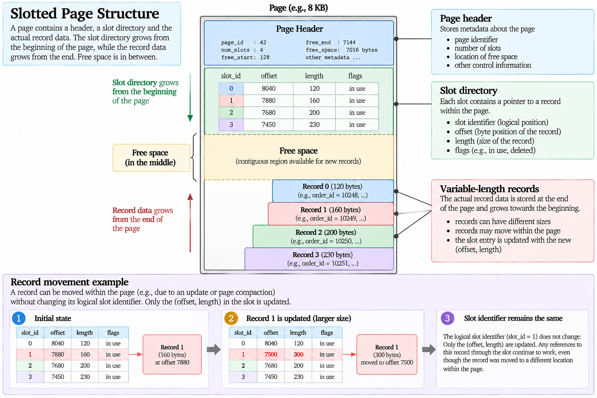{#fig-slotted-page}

## Record Identifiers

A DBMS needs a way to identify a physical record.

A simplified **record identifier** can be represented as

$$
RID=(\text{page identifier},\text{slot identifier}).
$$

For example,

$$
RID=(42,7)
$$

conceptually identifies the record referenced by slot 7 on page 42.

An index can store such a locator rather than embedding the complete table record in every index entry.

This gives a physical path of the form

$$
\text{Search Key}
\rightarrow
\text{Index Entry}
\rightarrow
RID
\rightarrow
\text{Page}
\rightarrow
\text{Record}.
$$

The precise representation differs between database systems, but the concept will become important when index structures are introduced.

A record identifier is physical metadata and should not be confused with a relational key:

$$
\boxed{
\text{RID}
\neq
\text{Primary Key}.
}
$$

A primary key identifies a tuple according to the logical database schema. A record identifier locates a physical representation according to the DBMS storage organization.

## Insertions and Free Space

When a new tuple is inserted, the DBMS must find enough physical space for its record.

Conceptually,

$$
\text{INSERT}
\rightarrow
\text{Find Suitable Page}
\rightarrow
\text{Allocate Space}
\rightarrow
\text{Create Record}.
$$

If a page has sufficient free space, the record may be placed there and a new slot created.

If not, another page must be selected or allocated.

Variable-length records make free-space management more complicated because available capacity can become distributed across pages and within individual pages.

A DBMS may therefore maintain metadata describing which pages are likely to contain enough free space for new records.

The logical statement

```sql
INSERT INTO ...
```

thus hides a physical allocation problem beneath the relational interface.

## Deletions and Updates

Deleting a tuple does not merely remove an abstract member from a relation. Its physical record must also be handled.

The corresponding slot may be marked unused, record space may become available, and the page may eventually be reorganized.

Updates can be even more complicated.

Suppose a variable-length value changes from

```text
'UK'
```

to

```text
'United Kingdom'
```

and the new physical record no longer fits in the same space.

The DBMS may need to move or reorganize the record.

This reinforces the value of indirection:

$$
\text{Slot}
\rightarrow
\text{Record Location}
$$

allows some physical movement without requiring every logical reference to encode the record's exact byte position.

The details are implementation-specific, but the general principle is that logical updates can imply nontrivial physical storage operations.

## Sequential Scans

Suppose relation $R$ occupies

$$
B(R)
$$

pages.

A complete sequential scan must conceptually examine every page:

$$
P_1,P_2,\ldots,P_{B(R)}.
$$

A first-order page-I/O cost model therefore gives

$$
C_{\text{scan}}(R)
\approx
B(R).
$$ {#eq-sequential-scan-cost}

If a relation occupies 2500 pages,

$$
C_{\text{scan}}(R)
\approx
2500
$$

page accesses under the simplified model.

The expression deliberately abstracts away device-specific timing, caching, prefetching, and CPU work.

Its value lies in providing a common unit for comparing algorithms:

$$
\boxed{\text{How many pages must be accessed?}}
$$

This question will later allow scans, indexes, sorting algorithms, and join strategies to be compared quantitatively.

## Page I/O as a Cost Model

Database algorithms perform both computation and data movement.

A more complete runtime model might conceptually involve

$$
T
=
T_{\text{CPU}}
+
T_{\text{memory}}
+
T_{\text{I/O}}
+
T_{\text{other}}.
$$

However, database theory often begins with page I/O because moving pages between persistent storage and memory has historically been one of the dominant costs for large datasets.

Thus, instead of predicting wall-clock time directly, a cost model may estimate

$$
C(Q)
=
\text{Number of Page I/O Operations}.
$$

This distinction is important:

$$
\boxed{
\text{Estimated I/O Cost}
\neq
\text{Wall-Clock Runtime}.
}
$$

The model is an abstraction used to reason about relative algorithmic cost. Real execution time also depends on hardware, caching, concurrency, CPU work, operating-system behaviour, and many other factors.

Later, PostgreSQL's query planner will provide estimated costs in its own abstract units. Those estimates should likewise not be interpreted directly as elapsed milliseconds.

## The Buffer Pool

If every database operation had to retrieve every required page from persistent storage repeatedly, execution would be unnecessarily expensive.

A DBMS therefore maintains a region of main memory called the **buffer pool**.

The buffer pool contains copies of database pages currently available in memory:

$$
\mathcal{B}
=
\{P_{i_1},P_{i_2},\ldots,P_{i_m}\}.
$$

When an operation requires page $P_i$, the DBMS first determines whether that page is already present in the buffer pool.

If

$$
P_i\in\mathcal{B},
$$

the request is a **buffer hit**.

If

$$
P_i\notin\mathcal{B},
$$

the DBMS must obtain the page from persistent storage before it can be used.

Conceptually,

$$
\text{Page Request}
\rightarrow
\begin{cases}
\text{Buffer Hit}, & P_i\in\mathcal{B},\\
\text{Storage Read}, & P_i\notin\mathcal{B}.
\end{cases}
$$

The buffer pool therefore acts as an intermediary between logical database operations and persistent storage.

## Buffer Frames

The buffer pool can be viewed as a collection of **frames**, each capable of holding one database page.

If the buffer contains $M$ frames,

$$
\mathcal{B}
=
\{F_1,F_2,\ldots,F_M\}.
$$

A frame may currently contain page $P_i$:

$$
F_j\mapsto P_i.
$$

The DBMS must maintain metadata describing which page occupies each frame and whether that page can safely be replaced.

This introduces another distinction:

$$
\boxed{
\text{Database Page}
\neq
\text{Buffer Frame}.
}
$$

A page is part of the persistent database organization. A frame is a region of memory temporarily holding a copy of a page.

The same database page may be loaded into a frame, modified there, written back to persistent storage, and later loaded again.

## Buffer Hits and Misses

Suppose a query requests pages

$$
P_4,P_{12},P_4,P_7.
$$

If none is initially buffered, the first requests for $P_4$, $P_{12}$, and $P_7$ require storage access.

The second request for $P_4$ may be served directly from memory if the page remains buffered.

Thus, four logical page requests need not imply four physical storage reads.

This distinction can be written as

$$
\boxed{
\text{Logical Page Access}
\neq
\text{Physical Storage Access}.
}
$$

The effectiveness of buffering depends on the workload, available memory, replacement decisions, and patterns of data reuse.

This is one reason a theoretical page-I/O model and an observed runtime can differ significantly.

## Buffer Replacement

The buffer pool has finite capacity. If all frames are occupied and another page must be loaded, the DBMS must choose a page whose frame can be reused.

Conceptually,

$$
|\mathcal{B}|=M
$$

and a request for a new page requires

$$
\text{Choose Victim Page}
\rightarrow
\text{Reuse Frame}.
$$

A replacement policy attempts to retain pages likely to be useful while removing pages whose immediate reuse is less likely.

General caching algorithms such as Least Recently Used provide useful intuition, but database buffer managers may use policies adapted to database workloads and concurrency.

The important principle is that memory is finite:

$$
\boxed{
\text{Working Set}
>
\text{Available Buffer Frames}
\Rightarrow
\text{Replacement Is Necessary}.
}
$$

The amount of available memory will later determine which query-execution algorithms are feasible and how expensive they are.

## Pinning Pages

Not every buffered page can necessarily be replaced immediately.

An operation may currently be reading or modifying a page. The buffer manager must ensure that the frame is not reused while the page is actively required.

Conceptually, such a page can be considered **pinned**:

$$
\text{Pinned Page}
\Rightarrow
\text{Not Currently Eligible for Replacement}.
$$

Once the operation releases the page, it may again become a candidate for replacement.

This mechanism illustrates that buffer management is not simply a cache lookup. It must coordinate memory use with active database operations.

## Dirty Pages

A buffered page initially represents a copy of a page obtained from persistent storage.

If the page is modified in memory, the buffered copy may no longer match the persistent copy.

Such a page is called **dirty**.

Conceptually,

$$
P_i^{\text{memory}}
\neq
P_i^{\text{storage}}.
$$

The page must eventually be written back to persistent storage if its changes are to become part of the durable database representation.

A clean page can often be discarded from the buffer because an equivalent persistent copy already exists.

A dirty page cannot simply be discarded without accounting for its modifications.

Therefore,

$$
\boxed{
\text{Clean Eviction}
\neq
\text{Dirty Eviction}.
}
$$

A dirty page may require a write before its frame can be safely reused.

## Dirty Pages and Commit

It is tempting to assume that committing a transaction means immediately writing every modified database page to its final location on persistent storage.

That is not generally required.

Conceptually,

$$
\boxed{
\texttt{COMMIT}
\neq
\text{Flush Every Modified Data Page}.
}
$$

Modern database recovery mechanisms allow modified data pages to remain in memory after commit under appropriate logging rules.

This is a crucial separation between **transaction durability** and **immediate data-page persistence**.

The mechanism that makes this possible is based on logging, particularly **Write-Ahead Logging (WAL)**, which will be developed in the transaction and recovery section.

For now, the important observation is that buffer management and recovery are connected:

$$
\text{Modified Buffer Pages}
\leftrightarrow
\text{Logging and Recovery}.
$$

## Physical Locality

The organization of records across pages affects the cost of accessing them.

Suppose a query requires 100 tuples.

If those tuples occupy only 5 pages, the physical access requirement can be very different from the case in which they are distributed across 100 pages.

Conceptually,

$$
\begin{aligned}
100\text{ tuples on }5\text{ pages}
&\rightarrow
\text{high locality},\\
100\text{ tuples on }100\text{ pages}
&\rightarrow
\text{low locality}.
\end{aligned}
$$

Thus,

$$
\boxed{
\text{Number of Tuples Retrieved}
\neq
\text{Number of Pages Accessed}.
}
$$

This distinction will become especially important when indexes are studied.

An index may identify a small number of matching tuples, but retrieving them can still be expensive if their physical records are scattered across many pages.

## Logical Independence and Physical Relevance

The relational model intentionally shields applications from most storage details.

An application can issue

```sql
SELECT
    company_name
FROM customers
WHERE customer_id = 'ALFKI';
```

without knowing which page contains the corresponding record.

This is a major advantage:

$$
\text{Logical Query}
\not\Rightarrow
\text{Explicit Physical Navigation}.
$$

However, physical independence should not be interpreted as physical irrelevance.

The same logical query may have dramatically different execution costs depending on relation size, page organization, buffering, available indexes, and memory.

Thus,

$$
\boxed{
\text{Logical Data Independence}
\neq
\text{Physical Performance Independence}.
}
$$

Applications need not specify physical navigation, but the DBMS must still solve the physical access problem efficiently.

## From Pages to Index Structures

The physical model developed in this section provides the quantities required to understand indexes more precisely.

A relation has

$$
T(R)
$$

tuples and occupies

$$
B(R)
$$

pages.

A complete scan has approximate cost

$$
C_{\text{scan}}(R)
\approx
B(R).
$$

The database has a finite number

$$
M
$$

of buffer frames available to an operation.

An index becomes useful when it provides an alternative path that can locate the required records using fewer relevant page accesses than competing strategies.

The next question is therefore no longer merely

$$
\boxed{\text{What is an index?}}
$$

but

$$
\boxed{\text{How can an index physically organize search keys so that records can be located efficiently?}}
$$

Answering that question leads to **index structures**, particularly B+ trees and hashing.

# Index Structures

A sequential scan provides a general mechanism for accessing a relation: examine its pages and test the relevant tuples. If relation $R$ occupies $B(R)$ pages, the first-order cost is

$$
C_{\text{scan}}(R)\approx B(R).
$$

This strategy remains useful when a substantial fraction of the relation is required, but it can perform unnecessary work when a query needs only a small number of tuples.

An **index** provides an additional physical structure that organizes search-key values so that the DBMS can locate relevant records without necessarily scanning every page of the relation [@ullman2009database].

Conceptually,

$$
\boxed{
\text{Search Key}
\rightarrow
\text{Index Structure}
\rightarrow
\text{Record Location}.
}
$$

The index does not change the logical contents of the relation. It introduces an alternative physical access path.

## Search Keys and Index Entries

Let $K$ denote the search key of an index. An index contains entries derived from values of $K$ together with information that allows the corresponding records to be located.

A simplified entry can be represented as

$$
(k,r),
$$

where $k$ is a search-key value and $r$ identifies the corresponding record or records.

Using the record identifiers introduced previously, an entry might conceptually contain

$$
(k,RID).
$$

For example,

$$
(\text{ALFKI},(42,7))
$$

could associate the search-key value `ALFKI` with slot 7 of page 42.

The resulting access path is

$$
\text{ALFKI}
\rightarrow
\text{Index Entry}
\rightarrow
(42,7)
\rightarrow
\text{Record}.
$$

If the search key is not unique, one value may correspond to several records:

$$
k
\rightarrow
\{RID_1,RID_2,\ldots,RID_m\}.
$$

This reinforces the distinction established earlier:

$$
\boxed{
\text{Search Key}
\neq
\text{Candidate Key}.
}
$$

An index search key organizes access. It need not uniquely identify a tuple.

## Ordered Indexes

An **ordered index** maintains search-key values according to an ordering.

Suppose an index is built over `customer_id`. Its entries can conceptually appear as

```text
ALFKI  -> RID
ANATR  -> RID
ANTON  -> RID
AROUT  -> RID
BERGS  -> RID
...
```

Because the keys are ordered, the structure can support both exact lookup and range-oriented navigation.

For equality,

```sql
WHERE customer_id = 'ALFKI'
```

the objective is to locate a particular key.

For a range,

```sql
WHERE customer_id >= 'ANATR'
  AND customer_id < 'BERGS'
```

the objective is to locate the beginning of the range and then continue through adjacent ordered entries.

This gives ordered indexes an important property:

$$
\boxed{
\text{Ordered Search Keys}
\rightarrow
\text{Equality and Range Access}.
}
$$

Maintaining a large ordered structure efficiently under insertions and deletions requires more than simply storing all entries in one sorted file. Tree-based index structures solve this problem.

## Dense and Sparse Indexes

An ordered index can be classified conceptually according to how completely it represents the underlying search-key values.

A **dense index** contains an index entry for every relevant search-key occurrence or record.

Conceptually,

$$
\text{Record}
\rightarrow
\text{Index Entry}.
$$

A **sparse index** contains entries for only some search-key values, often identifying regions or pages from which the search continues.

For example,

```text
Index
----------------
10  -> Page 1
30  -> Page 2
50  -> Page 3
70  -> Page 4
```

might indicate the first search-key value associated with each ordered data page.

To find value $57$, the index can identify the region beginning at $50$ and direct the search to the corresponding data page.

A sparse index therefore relies on an ordering relationship between the index and the underlying data.

The conceptual distinction is

$$
\boxed{
\begin{aligned}
\text{Dense Index} &\rightarrow \text{Entry for every indexed record or key occurrence},\\
\text{Sparse Index} &\rightarrow \text{Entries identify selected positions or regions}.
\end{aligned}
}
$$

Modern DBMS index implementations are more sophisticated than this simple classification, but dense and sparse indexes provide useful intuition for how an auxiliary structure can trade index size against the amount of additional searching required after an index entry is found.

## Multilevel Indexes

An index can itself become too large to search efficiently as a flat structure.

Suppose an ordered index occupies many pages. Searching those pages sequentially would merely move part of the original scanning problem into the index.

The solution is to index the index.

Conceptually,

$$
\text{Data}
\leftarrow
\text{Level 1 Index}
\leftarrow
\text{Level 2 Index}
\leftarrow
\cdots
$$

Each higher level contains fewer entries because one entry can direct the search toward an entire region of the level below.

This hierarchy naturally leads to balanced search trees.

## B-Trees and B+ Trees

Database indexes commonly use balanced tree structures designed to store many keys in each node. The most important structure for relational database indexing is the **B+ tree**.

Unlike a binary search tree, whose node may distinguish only two directions, a B+ tree node can contain many search-key values and many child pointers.

If an internal node contains keys

$$
k_1<k_2<\cdots<k_m,
$$

those keys divide the search space into ranges leading to different child nodes.

Conceptually,

$$
(-\infty,k_1),
[k_1,k_2),
\ldots,
[k_m,\infty).
$$

A search compares the desired key with the separator values and follows the corresponding child pointer.

The process repeats until a leaf is reached.

## B+ Tree Structure

A B+ tree consists conceptually of three kinds of components:

$$
\boxed{
\text{Root}
\rightarrow
\text{Internal Nodes}
\rightarrow
\text{Leaf Nodes}.
}
$$

Internal nodes guide the search. Leaf nodes contain the searchable entries associated with the indexed values.

A simplified tree might appear as

```text
                    [ 30 | 60 ]
                   /     |      \
                  /      |       \
                 /       |        \
        [10 20 25] [30 40 50] [60 70 80]
```

A search for $40$ begins at the root.

Because

$$
30\leq40<60,
$$

the middle child is selected.

The leaf

$$
[30,40,50]
$$

contains the desired search key.

Thus the search follows one path from root to leaf rather than examining every index page.

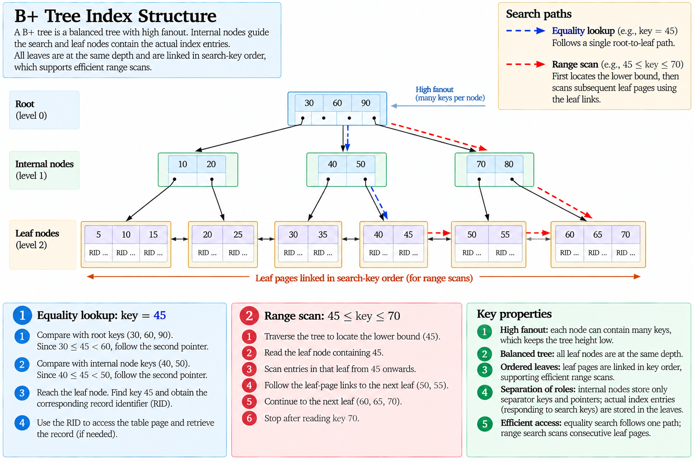{#fig-bplus-tree}

## Fanout

The number of child pointers that can be stored in an internal node is called its **fanout**.

If an index page has size $B$, each search key requires approximately $K$ bytes, and each pointer requires approximately $P$ bytes, an internal node with $f$ pointers and approximately $f-1$ separator keys must satisfy

$$
fP+(f-1)K\leq B.
$$

Rearranging,

$$
f(P+K)\leq B+K,
$$

so the maximum fanout is approximately

$$
f
\leq
\left\lfloor
\frac{B+K}{P+K}
\right\rfloor.
$$ {#eq-btree-fanout}

Suppose

$$
B=8192,
\qquad
K=16,
\qquad
P=8.
$$

Then

$$
f
\leq
\left\lfloor
\frac{8192+16}{16+8}
\right\rfloor
=
\left\lfloor
\frac{8208}{24}
\right\rfloor
=
342.
$$

The precise capacity depends on page headers and implementation details, but the important result is that database tree nodes can have **hundreds of children**.

This high fanout is what makes B+ trees very shallow even for large indexes.

## Tree Height

Suppose a balanced tree has average fanout $f$ and must address approximately $N$ leaf-level entries.

Ignoring occupancy details, the number of levels required is approximately

$$
h
\approx
\log_f N.
$$ {#eq-btree-height}

If

$$
f=300
$$

and

$$
N=100{,}000{,}000,
$$

then

$$
h
\approx
\log_{300}(100{,}000{,}000).
$$

Since

$$
300^3=27{,}000{,}000
$$

and

$$
300^4=8{,}100{,}000{,}000,
$$

only a few tree levels are sufficient to distinguish among an enormous number of entries.

The practical significance is more important than the exact logarithm:

$$
\boxed{
\text{High Fanout}
\rightarrow
\text{Low Height}
\rightarrow
\text{Few Index Pages per Search}.
}
$$

This explains why the database version of a balanced search tree differs from the binary trees commonly introduced in general data-structure courses.

## Equality Search

Suppose an index on `customer_id` is used for

```sql
SELECT
    *
FROM customers
WHERE customer_id = 'ALFKI';
```

A B+ tree search conceptually performs

$$
\text{Root}
\rightarrow
\text{Internal Node}
\rightarrow
\cdots
\rightarrow
\text{Leaf}.
$$

If the tree has height $h$, the search requires approximately

$$
O(h)
$$

index-page accesses, followed potentially by access to the page containing the table record.

Under the simplified model,

$$
C_{\text{lookup}}
\approx
h+C_{\text{data}},
$$

where $C_{\text{data}}$ represents the cost of retrieving the corresponding table data.

For a shallow tree, this can be much smaller than

$$
B(R)
$$

when only a small number of records is required.

This is the physical reason an index can make a highly selective lookup inexpensive.

## Range Search

B+ trees are particularly useful for range predicates because their leaf entries are maintained in search-key order.

Suppose a query requests

```sql
WHERE unit_price >= 20
  AND unit_price <= 30
```

The tree first locates the leaf containing the lower boundary:

$$
20.
$$

From there, the DBMS can continue through successive leaf entries until values exceed

$$
30.
$$

Conceptually,

$$
\text{Tree Traversal to }20
\rightarrow
\text{Sequential Leaf Scan}
\rightarrow
30.
$$

The cost can therefore be approximated as

$$
C_{\text{range}}
\approx
h+L+D,
$$

where $L$ is the number of relevant leaf pages and $D$ represents the data-page accesses required to retrieve matching records.

This gives B+ trees an important advantage over access structures designed only for exact equality:

$$
\boxed{
\text{B+ Tree}
\rightarrow
\text{Efficient Equality Search}
+
\text{Efficient Range Search}.
}
$$

## Linked Leaf Pages

Leaf pages in a B+ tree are commonly connected in search-key order.

Conceptually,

```text
[10 20 25] <-> [30 40 50] <-> [60 70 80]
```

Once the first relevant leaf has been located, subsequent values can be reached without repeatedly traversing the tree from the root.

This property supports operations such as

```sql
WHERE unit_price BETWEEN 20 AND 80
```

and can also provide useful ordering to later query operations.

Thus, the leaf level acts both as the destination of point searches and as an ordered sequence through which ranges can be traversed.

## Balanced Height

A B+ tree maintains all leaves at the same depth.

Therefore, searches do not encounter one key after two levels and another after twenty levels because of an unbalanced insertion history.

Conceptually,

$$
\boxed{
\text{Every Root-to-Leaf Path Has the Same Length}.
}
$$

This bounded and predictable height is fundamental to the structure's performance.

Maintaining the property requires the tree to reorganize itself as entries are inserted and deleted.

## Insertions and Node Splitting

Suppose a leaf has no remaining capacity and a new index entry must be inserted.

The B+ tree cannot simply append indefinitely to that node.

Instead, the overflowing node can be split into two nodes, and an appropriate separator key is propagated upward.

Conceptually,

$$
\text{Full Node}
+
\text{New Entry}
\rightarrow
\text{Split}
\rightarrow
\text{Two Nodes}
+
\text{Parent Update}.
$$

If the parent also overflows, the split can propagate toward the root.

In the extreme case, the root itself splits and a new root is created:

$$
h
\rightarrow
h+1.
$$

The tree therefore grows structurally while preserving balance.

This is a key reason B+ trees remain effective under dynamic insertions rather than requiring the entire index to be rebuilt whenever new values arrive.

## Deletions

Deletion produces the opposite structural problem.

Removing entries may leave a node with too few entries to satisfy the tree's occupancy requirements.

The structure can respond by redistributing entries between neighbouring nodes or merging nodes when appropriate.

Conceptually,

$$
\text{Delete Entry}
\rightarrow
\begin{cases}
\text{No Structural Change},\\
\text{Redistribution},\\
\text{Merge}.
\end{cases}
$$

Changes may propagate upward, just as splits can propagate during insertion.

The precise rules depend on the tree definition and implementation, but the invariant remains:

$$
\boxed{
\text{Updates Preserve Search Order and Balanced Height}.
}
$$

## B+ Tree Search Cost and Caching

The simplified search cost

$$
C_{\text{lookup}}\approx h+C_{\text{data}}
$$

should not be interpreted as requiring a physical storage read for every level of every lookup.

Upper tree levels are small and frequently accessed, making them strong candidates to remain in the buffer pool.

A logical traversal might therefore visit

$$
P_{\text{root}},
P_{\text{internal}},
P_{\text{leaf}},
P_{\text{data}},
$$

while some of these pages are already buffered.

Thus,

$$
\boxed{
\text{Tree Page Access}
\neq
\text{Necessarily Physical I/O}.
}
$$

The tree-height model explains the structure of the search. Actual storage activity depends on buffering and the current state of memory.

## Composite Search Keys

A B+ tree can be constructed over more than one attribute.

Suppose an index is defined on

```sql
CREATE INDEX idx_orders_customer_date
ON orders (customer_id, order_date);
```

Its search key is the ordered pair

$$
(\text{customer\_id},\text{order\_date}).
$$

The entries are ordered lexicographically.

For keys

$$
(a_1,b_1)
$$

and

$$
(a_2,b_2),
$$

we have

$$
(a_1,b_1)<(a_2,b_2)
$$

when

$$
a_1<a_2
$$

or

$$
a_1=a_2
\quad\text{and}\quad
b_1<b_2.
$$

Therefore, entries for one customer occupy a contiguous ordered region in which `order_date` provides the secondary ordering.

This makes the index naturally suitable for a query such as

```sql
WHERE customer_id = 'ALFKI'
  AND order_date >= DATE '1997-01-01'
```

because the search first isolates the `ALFKI` portion of the index and can then traverse the relevant date range.

## The Prefix Property

The ordering of a composite index explains why its attribute order matters.

For an index

$$
(A,B),
$$

the complete ordering is primarily by $A$.

Consequently, predicates fixing or restricting $A$ can often exploit the ordered structure naturally.

A predicate involving only $B$, however, does not generally identify one contiguous region of the index because values of $B$ occur separately within each value of $A$.

Conceptually,

```text
A1 B1
A1 B2
A1 B3
A2 B1
A2 B2
A2 B3
A3 B1
...
```

Searching for

$$
B=B_2
$$

alone encounters matching entries throughout multiple $A$ groups.

Thus,

$$
\boxed{
\operatorname{Index}(A,B)
\neq
\operatorname{Index}(B,A).
}
$$

The physical ordering explains the practical importance of the **leftmost prefix** of a composite B+ tree search key.

This is not an arbitrary SQL rule. It follows from how the entries are ordered.

## Index Lookup Does Not Eliminate Data Access

Finding an index entry does not necessarily mean that all required query attributes are available.

Suppose an index contains only

$$
(\text{customer\_id},RID)
$$

and a query requests

```sql
SELECT
    company_name,
    city
FROM customers
WHERE customer_id = 'ALFKI';
```

The index can locate the relevant record, but the DBMS may still need to access the corresponding table page to retrieve `company_name` and `city`.

Conceptually,

$$
\text{Index Search}
\rightarrow
RID
\rightarrow
\text{Table Page}
\rightarrow
\text{Required Attributes}.
$$

Therefore,

$$
\boxed{
\text{Index Match}
\neq
\text{Query Completed}.
}
$$

This distinction will later become important when comparing index scans, table access, and covering access strategies.

## Physical Locality and Index Access

Suppose a predicate matches 1000 records.

An index can identify those records efficiently, but their physical table records may occupy very different numbers of pages.

If the records are concentrated in

$$
20
$$

pages, retrieving them may be relatively inexpensive.

If they are scattered across

$$
900
$$

pages, the data-access cost can be much larger.

Thus, an approximate index-access cost is better understood as

$$
C_{\text{index}}
\approx
C_{\text{tree}}
+
C_{\text{matching index pages}}
+
C_{\text{data pages}}.
$$

The number of matching tuples alone does not determine the final cost.

This reinforces the distinction

$$
\boxed{
\text{Logical Selectivity}
\neq
\text{Physical Locality}.
}
$$

Both influence whether index access is advantageous.

## Why an Index May Not Be Used

Suppose relation $R$ occupies

$$
10{,}000
$$

pages.

A predicate matches almost every tuple.

An index might still locate those matching entries, but if retrieving the corresponding records requires accessing most of the relation's pages anyway, the index traversal introduces additional work without avoiding much table access.

A sequential scan costs approximately

$$
C_{\text{scan}}(R)\approx10{,}000.
$$

An index-based strategy might require

$$
C_{\text{index}}
=
C_{\text{tree}}
+
C_{\text{leaf}}
+
C_{\text{data}}.
$$

If

$$
C_{\text{data}}\approx10{,}000,
$$

the index provides little advantage.

Therefore,

$$
\boxed{
\text{Index Exists}
\not\Rightarrow
\text{Index Scan Is Cheapest}.
}
$$

The optimizer's responsibility is to compare these alternatives using statistics and a cost model. That decision will be developed later.

## Hash Indexes

Ordered trees are not the only possible index structures.

A **hash index** applies a hash function to a search-key value to determine the bucket in which corresponding entries should be located.

Conceptually,

$$
h(k)
\rightarrow
\text{Bucket}.
$$

For example,

$$
h(\text{ALFKI})=17
$$

directs the lookup toward bucket 17.

The goal is to distribute search-key values across buckets so that an equality lookup can identify a small region of the index directly.

Conceptually,

$$
\text{Search Key}
\xrightarrow{h}
\text{Bucket}
\rightarrow
\text{Matching Entries}.
$$

This provides a fundamentally different organization from an ordered B+ tree.

## Equality Search with Hashing

For a predicate

```sql
WHERE customer_id = 'ALFKI'
```

the hash value can be computed directly:

$$
b=h(\text{ALFKI}).
$$

The search then examines the corresponding bucket rather than navigating an ordered tree.

Under suitable conditions, this provides efficient equality access.

Hashing is therefore naturally associated with predicates of the form

$$
A=c.
$$

The essential property is

$$
\boxed{
\text{Same Search-Key Value}
\rightarrow
\text{Same Hash Destination}.
}
$$

Collisions remain possible because different values can map to the same bucket, so the bucket must still distinguish the actual keys.

## Hashing and Range Queries

A hash function deliberately distributes values according to hash results rather than preserving their natural ordering.

Suppose

$$
10<20<30.
$$

Their hash destinations might nevertheless be

$$
h(10)=7,
$$

$$
h(20)=2,
$$

$$
h(30)=11.
$$

There is no requirement that neighbouring key values occupy neighbouring buckets.

Consequently, a range such as

$$
20\leq A\leq50
$$

does not correspond naturally to a contiguous sequence of hash buckets.

This gives the central contrast:

$$
\boxed{
\begin{aligned}
\text{B+ Tree} &\rightarrow \text{Preserves Search-Key Order},\\
\text{Hash Index} &\rightarrow \text{Uses Hash-Based Distribution}.
\end{aligned}
}
$$

Hashing is therefore naturally suited to equality access, while B+ trees also support ordered and range access.

## Dynamic Hashing

A fixed number of hash buckets can become problematic as the indexed relation grows.

If too many values map into the available buckets, overflow structures become necessary and lookup performance can deteriorate.

Dynamic hashing techniques allow the bucket organization to expand as data grows.

Methods such as **extendible hashing** and **linear hashing** solve this problem using different mechanisms [@ullman2009database].

Their detailed algorithms are not necessary for the present purpose. The important principle is that a practical hash index must accommodate changes in relation size without requiring a complete static reorganization after every period of growth.

Conceptually,

$$
\text{Growing Data}
\rightarrow
\text{Bucket Expansion}
\rightarrow
\text{Redistribution of Selected Entries}.
$$

This plays a role analogous to node splitting in a B+ tree: the physical structure adapts while preserving efficient access.

## B+ Trees and Hashing

The two structures can now be compared according to the access patterns they naturally support.

| Property | B+ Tree | Hash Index |
|:---:|:---:|:---:|
| Equality lookup | Efficient | Efficient |
| Range lookup | Efficient | Not naturally supported |
| Ordered traversal | Yes | No |
| Prefix ordering for composite keys | Yes | No comparable natural ordering |
| Dynamic growth | Node splits and merges | Bucket expansion |
| Core organization | Ordered hierarchy | Hash distribution |

The comparison should not be interpreted as

$$
\text{B+ Tree}>\text{Hash Index}
$$

or the reverse.

The appropriate structure depends on the workload.

If the dominant operation is

$$
A=c,
$$

hashing may be attractive.

If the workload includes

$$
A=c,
$$

$$
A<c,
$$

$$
a\leq A\leq b,
$$

or ordered traversal, an ordered tree provides capabilities that hashing does not naturally provide.

Thus,

$$
\boxed{
\text{Index Structure}
=
f(\text{Access Pattern}).
}
$$

## Indexes and Write Cost

Every index is an additional physical structure that must remain consistent with the underlying data.

An insertion into an indexed relation may require

$$
\text{Insert Table Record}
+
\text{Insert Index Entry}.
$$

An update to an indexed attribute may require removing an old entry and inserting a new one.

A deletion may require removing corresponding entries.

For $m$ indexes affected by a modification, the DBMS must maintain multiple physical structures:

$$
\text{Table Modification}
\rightarrow
\{I_1,I_2,\ldots,I_m\}.
$$

Consequently,

$$
\boxed{
\text{More Indexes}
\neq
\text{Always Better Performance}.
}
$$

Indexes trade additional storage and modification cost for potentially cheaper retrieval.

This trade-off becomes particularly important in OLTP workloads with frequent writes.

## Index Design Is a Workload Decision

An index should not be designed by examining columns in isolation.

Suppose a table contains

```text
customer_id
order_date
employee_id
ship_country
freight
```

The fact that all these attributes can be indexed does not imply that all should be indexed.

The useful questions concern the workload:

$$
\begin{aligned}
&\text{Which predicates occur frequently?}\\
&\text{Which predicates are selective?}\\
&\text{Which joins use these attributes?}\\
&\text{Which orderings are useful?}\\
&\text{Which attributes change frequently?}\\
&\text{How many table pages must still be retrieved?}
\end{aligned}
$$

The design process is therefore

$$
\boxed{
\text{Workload}
\rightarrow
\text{Candidate Access Paths}
\rightarrow
\text{Cost Trade-offs}
\rightarrow
\text{Index Design}.
}
$$

This explains why index recommendations made without knowledge of the workload are inherently limited.

## Logical Queries and Physical Access Paths

At the SQL level, a query states a logical requirement:

```sql
SELECT
    order_id,
    order_date
FROM orders
WHERE customer_id = 'ALFKI';
```

Several physical strategies may satisfy it:

$$
\begin{aligned}
P_1 &= \text{Sequential Scan},\\
P_2 &= \text{B+ Tree Index Access},\\
P_3 &= \text{Hash Index Access}.
\end{aligned}
$$

These plans are logically equivalent if they return the same required result, but their physical costs can differ substantially.

Thus,

$$
\boxed{
\text{Logical Query}
\rightarrow
\{\text{Alternative Physical Access Paths}\}.
}
$$

An index does not instruct the DBMS to use it. It expands the set of available physical alternatives.

Selecting among those alternatives belongs to query optimization.

## From Access Paths to Query Execution

Indexes solve only part of the physical execution problem.

A query may need to scan relations, sort records, eliminate duplicates, compute groups, join several inputs, and pass intermediate results between operators.

For example,

```sql
SELECT
    c.country,
    SUM(od.unit_price * od.quantity)
FROM customers AS c
JOIN orders AS o
    ON c.customer_id = o.customer_id
JOIN order_details AS od
    ON o.order_id = od.order_id
GROUP BY c.country;
```

requires substantially more than locating one indexed value.

The DBMS must choose physical algorithms for

$$
\text{Scanning},
\quad
\text{Joining},
\quad
\text{Grouping},
\quad
\text{Aggregation},
$$

and must determine how intermediate tuples move between those operations.

The next layer is therefore **Query Execution**:

$$
\boxed{
\text{Logical Operators}
\rightarrow
\text{Physical Algorithms}
\rightarrow
\text{Page and Memory Costs}.
}
$$

With pages, buffer frames, B+ trees, hashing, and physical access paths now established, those algorithms can be analysed quantitatively rather than treated as a black box.

# Query Execution

A SQL query describes a logical result rather than a sequence of physical storage operations. After parsing, semantic analysis, and logical transformation, the DBMS must ultimately execute the query using concrete algorithms that operate over records, pages, buffers, and indexes.

A relational-algebra expression such as

$$
R\bowtie S
$$

specifies a logical join, but it does not determine how that join must be computed. The DBMS may use nested loops, blocks of buffered pages, an index, sorting, or hashing.

This establishes a fundamental distinction:

$$
\boxed{
\text{Logical Operator}
\neq
\text{Physical Operator}.
}
$$

The logical operator defines **what** result must be produced. A physical operator defines **how** that result is produced.

For the same logical query, several physical execution plans may therefore be correct:

$$
\text{Logical Query}
\rightarrow
\{P_1,P_2,\ldots,P_n\}.
$$

The plans are logically equivalent when they produce the same required result, but their execution costs may differ substantially [@ullman2009database].

## A Page-Oriented Cost Model

To compare physical algorithms, a simplified cost model is required.

Let

$$
T(R)
$$

denote the number of tuples in relation $R$,

$$
B(R)
$$

the number of pages occupied by $R$, and

$$
M
$$

the number of buffer pages available to the operation.

The principal cost considered in this section is page I/O:

$$
C(P)
=
\text{number of page reads and writes required by physical plan }P.
$$

This deliberately abstracts away CPU cost, storage-device characteristics, operating-system caching, concurrency, and other implementation details.

Thus,

$$
\boxed{
\text{Estimated Page-I/O Cost}
\neq
\text{Actual Execution Time}.
}
$$

The model is useful because it exposes how relation size, memory, and algorithm choice affect the amount of data movement required.

## Table Scans

The simplest physical operator is a sequential scan.

If relation $R$ occupies $B(R)$ pages, scanning the complete relation requires approximately

$$
C_{\text{scan}}(R)
=
B(R).
$$ {#eq-query-scan-cost}

Suppose

$$
B(R)=10{,}000.
$$

Then

$$
C_{\text{scan}}(R)
\approx
10{,}000
$$

page reads under the simplified model.

A scan can simultaneously evaluate a predicate. For

```sql
SELECT *
FROM orders
WHERE freight > 100;
```

the DBMS can read each page of `orders`, examine its tuples, and emit those satisfying

$$
\text{freight}>100.
$$

The selection does not necessarily require an additional physical pass:

$$
\operatorname{SeqScan}_{P}(R)
\rightarrow
\sigma_P(R).
$$

This illustrates how a logical operator may be incorporated directly into a physical access operator.

## Selection by Index

If a suitable index exists, selection may instead use an index access path.

Conceptually,

$$
\sigma_{A=c}(R)
$$

can be executed using either

$$
\operatorname{SeqScan}(R)
$$

or

$$
\operatorname{IndexScan}_{A}(R).
$$

The sequential strategy costs approximately

$$
B(R),
$$

whereas the index strategy includes index traversal and retrieval of relevant table pages:

$$
C_{\text{index}}
\approx
C_{\text{index traversal}}
+
C_{\text{matching data pages}}.
$$

The cheaper strategy depends on selectivity, physical locality, buffering, and index structure.

Thus, even the apparently simple logical operator

$$
\sigma
$$

already admits multiple physical implementations.

## Sorting

Sorting is required by several database operations.

An explicit SQL request such as

```sql
ORDER BY order_date
```

requires ordered output unless an existing physical access path already provides the required order.

Sorting can also support duplicate elimination, grouping, merge joins, and other internal operations.

If the entire input fits in available memory, the relation can be read, sorted in memory, and emitted.

For large relations, however,

$$
B(R)>M,
$$

so the complete input cannot be held in memory simultaneously.

The DBMS then requires an **external sorting algorithm**.

## External Merge Sort

External merge sort divides sorting into two broad stages:

$$
\boxed{
\text{Run Generation}
\rightarrow
\text{Merge}.
}
$$

During run generation, up to $M$ pages are read into memory, sorted internally, and written back as a sorted run.

If relation $R$ contains $B(R)$ pages, the approximate number of initial runs is

$$
N_0
=
\left\lceil
\frac{B(R)}{M}
\right\rceil.
$$

For example, if

$$
B(R)=1000
$$

and

$$
M=100,
$$

then

$$
N_0
=
\left\lceil
\frac{1000}{100}
\right\rceil
=
10.
$$

The first phase produces approximately ten sorted runs.

## Merge Passes

After initial runs have been produced, they must be merged.

With $M$ buffer pages, one page is required for output, leaving approximately

$$
M-1
$$

input buffers.

The DBMS can therefore merge up to approximately $M-1$ runs in one pass.

If the number of initial runs is $N_0$, the number of merge passes is approximately

$$
p
=
\left\lceil
\log_{M-1}N_0
\right\rceil.
$$

Each complete pass reads and writes approximately $B(R)$ pages.

Under the simplified model, the total sorting cost is therefore approximately

$$
C_{\text{sort}}(R)
\approx
2B(R)(1+p).
$$ {#eq-external-sort-cost}

The first factor of

$$
2B(R)
$$

corresponds to reading the input and writing the initial sorted runs. Each subsequent merge pass contributes another read and write of the relation.

The exact cost can differ when the final output is pipelined directly into another operator rather than written to storage, but the formula provides a useful baseline.

## Example of External Sorting

Suppose

$$
B(R)=10{,}000
$$

and

$$
M=101.
$$

Initial run generation produces

$$
N_0
=
\left\lceil
\frac{10{,}000}{101}
\right\rceil
=
100
$$

runs.

Since

$$
M-1=100,
$$

all initial runs can be merged in one merge pass:

$$
p=1.
$$

The approximate cost becomes

$$
C_{\text{sort}}(R)
\approx
2(10{,}000)(1+1)
=
40{,}000
$$

page I/O operations.

This example reveals why memory matters algorithmically:

$$
\boxed{
M
\rightarrow
\text{Number of Runs}
\rightarrow
\text{Number of Merge Passes}
\rightarrow
\text{I/O Cost}.
}
$$

Memory does not merely make the same algorithm slightly faster. It can change the number of complete passes required over the data.

## Duplicate Elimination

The logical duplicate-elimination operator

$$
\delta(R)
$$

can be implemented in several ways.

A sorting-based strategy first orders tuples so that duplicates become adjacent:

$$
\text{Sort}
\rightarrow
\text{Compare Adjacent Tuples}
\rightarrow
\text{Emit One Representative}.
$$

If the input is

```text
A
C
A
B
C
A
```

sorting produces

```text
A
A
A
B
C
C
```

and a sequential pass can emit

```text
A
B
C
```

Duplicate elimination can also be implemented using hashing by assigning equal values to the same hash partition or in-memory hash entry.

Therefore,

$$
\boxed{
\delta
\neq
\text{One Specific Physical Algorithm}.
}
$$

The logical requirement is unique output; sorting and hashing are alternative physical strategies.

## Grouping and Aggregation

A logical grouping operation such as

$$
\gamma_{\text{country};\,\operatorname{SUM}(\text{sales})}(R)
$$

also admits multiple implementations.

A sorting-based strategy orders the input by the grouping attributes:

$$
\text{Sort by Group Key}
\rightarrow
\text{Process Consecutive Groups}.
$$

A hash-based strategy maps tuples to groups using a hash function:

$$
h(\text{group key})
\rightarrow
\text{Aggregate State}.
$$

For a query such as

```sql
SELECT
    country,
    COUNT(*)
FROM customers
GROUP BY country;
```

the physical implementation might maintain a hash table conceptually containing

```text
Germany -> count
Mexico  -> count
UK      -> count
...
```

Each input tuple updates the state associated with its group.

Again,

$$
\boxed{
\texttt{GROUP BY}
\neq
\text{Necessarily Sort}.
}
$$

Sorting and hashing provide alternative physical implementations.

## Join Execution

Joins are among the most important and potentially expensive relational operations.

Consider

$$
R\bowtie_{R.A=S.B}S.
$$

At the logical level, the requirement is simply to produce pairs of tuples satisfying

$$
r.A=s.B.
$$

At the physical level, the DBMS must determine how candidate pairs will be found.

Several algorithms are possible:

$$
\boxed{
\begin{aligned}
&\text{Tuple Nested-Loop Join},\\
&\text{Block Nested-Loop Join},\\
&\text{Index Nested-Loop Join},\\
&\text{Sort-Merge Join},\\
&\text{Hash Join}.
\end{aligned}
}
$$

Their logical output may be equivalent, but their costs and requirements differ substantially.

## Tuple Nested-Loop Join

The simplest join algorithm compares each tuple of one relation with tuples of the other.

Conceptually,

```text
for each tuple r in R:
    for each tuple s in S:
        if r.A = s.B:
            emit (r, s)
```

If $R$ is the outer relation and the pages of $S$ must effectively be scanned for each tuple of $R$, the approximate page-I/O cost is

$$
C_{\text{TNLJ}}
\approx
B(R)
+
T(R)B(S).
$$ {#eq-tuple-nested-loop-cost}

The first term reads $R$. The second reflects repeated scanning of $S$.

Suppose

$$
B(R)=100,
$$

$$
T(R)=10{,}000,
$$

and

$$
B(S)=500.
$$

Then

$$
C_{\text{TNLJ}}
\approx
100
+
10{,}000(500)
=
5{,}000{,}100.
$$

The algorithm is simple but can be extremely expensive.

## Outer and Inner Relations

Nested-loop joins distinguish an **outer** input from an **inner** input.

The choice matters.

If $R$ is outer,

$$
C
\approx
B(R)+T(R)B(S),
$$

while reversing the roles gives

$$
C'
\approx
B(S)+T(S)B(R).
$$

These quantities can differ substantially.

Thus,

$$
\boxed{
R\bowtie S
=
S\bowtie R
}
$$

logically does not imply

$$
\boxed{
C(R\text{ outer},S\text{ inner})
=
C(S\text{ outer},R\text{ inner}).
}
$$

Logical commutativity therefore creates physical alternatives with potentially different costs.

This observation will become central to query optimization.

## Block Nested-Loop Join

Tuple nested loops fail to exploit the fact that multiple pages of the outer relation can be held in memory simultaneously.

A **block nested-loop join** loads a block of outer pages into the available buffers and scans the inner relation once for that complete block.

With $M$ available buffer pages, approximately

$$
M-2
$$

pages can be allocated to the outer block, leaving one buffer for the inner input and one for output.

The number of outer blocks is approximately

$$
\left\lceil
\frac{B(R)}{M-2}
\right\rceil.
$$

For each outer block, the complete inner relation is scanned.

The resulting cost is approximately

$$
C_{\text{BNLJ}}
\approx
B(R)
+
\left\lceil
\frac{B(R)}{M-2}
\right\rceil
B(S).
$$ {#eq-block-nested-loop-cost}

This is one of the most useful formulas in physical query processing.

## Block Nested-Loop Example

Suppose

$$
B(R)=1000,
$$

$$
B(S)=5000,
$$

and

$$
M=102.
$$

The number of outer pages that can be held simultaneously is

$$
M-2=100.
$$

Therefore,

$$
\left\lceil
\frac{1000}{100}
\right\rceil
=
10
$$

outer blocks are required.

The cost is

$$
C_{\text{BNLJ}}
\approx
1000+10(5000)
=
51{,}000.
$$

If only

$$
M=12
$$

buffers were available, the outer block would contain only

$$
10
$$

pages.

Then

$$
\left\lceil
\frac{1000}{10}
\right\rceil
=
100,
$$

and the cost would become

$$
1000+100(5000)
=
501{,}000.
$$

Thus,

$$
\boxed{
\text{More Memory}
\rightarrow
\text{Larger Outer Blocks}
\rightarrow
\text{Fewer Inner Scans}.
}
$$

This is a direct quantitative connection between buffer availability and query cost.

## Choosing the Outer Relation

For block nested loops, the smaller relation is often attractive as the outer input because fewer outer blocks imply fewer complete scans of the inner relation.

However, the decision depends on both relation sizes and available memory.

If

$$
B(R)\leq M-2,
$$

the entire outer relation fits into the outer block.

The cost becomes approximately

$$
C_{\text{BNLJ}}
\approx
B(R)+B(S).
$$

Each relation then needs to be read only once under the simplified model.

This illustrates an important general principle:

$$
\boxed{
\text{Memory Can Change the Effective Complexity of Physical Execution}.
}
$$

## Index Nested-Loop Join

Suppose the inner relation $S$ has an index on its join attribute.

Rather than scanning all of $S$ for each outer tuple, the DBMS can use the outer tuple's join value to probe the index.

Conceptually,

```text
for each tuple r in R:
    use index on S.B to find tuples where S.B = r.A
    emit matching pairs
```

The approximate cost becomes

$$
C_{\text{INLJ}}
\approx
B(R)
+
T(R)C_{\text{index lookup}}.
$$ {#eq-index-nested-loop-cost}

This can be highly effective when

$$
T(R)
$$

is relatively small and each index lookup retrieves few inner tuples.

For example, joining a small collection of customers to a large indexed `orders` relation may be substantially cheaper than repeatedly scanning all order pages.

## When Index Nested Loops Become Expensive

An index nested-loop join is not automatically efficient merely because an index exists.

Suppose the outer relation contains millions of tuples.

The join may require millions of index probes:

$$
T(R)
\times
C_{\text{index lookup}}.
$$

If each lookup also causes scattered data-page accesses, the physical cost can become large.

Therefore,

$$
\boxed{
\text{Indexed Inner Relation}
\not\Rightarrow
\text{Index Nested Loop Is Cheapest}.
}
$$

The usefulness of the algorithm depends on outer cardinality, index depth, selectivity, locality, buffering, and the number of matching inner tuples.

## Sort-Merge Join

A **sort-merge join** exploits ordering on the join attributes.

For

$$
R\bowtie_{R.A=S.B}S,
$$

the algorithm conceptually performs:

$$
\text{Sort }R\text{ on }A,
$$

$$
\text{Sort }S\text{ on }B,
$$

followed by

$$
\text{Merge the Ordered Inputs}.
$$

Once both inputs are ordered, matching key values can be identified by advancing through the two sequences.

Conceptually,

```text
R:  1  2  4  4  7
S:  2  3  4  4  8
       ^     ^
```

The algorithm advances whichever side has the smaller key and emits matching combinations when the keys agree.

## Sort-Merge Join Cost

If neither relation is already ordered appropriately, the approximate cost is

$$
C_{\text{SMJ}}
\approx
C_{\text{sort}}(R)
+
C_{\text{sort}}(S)
+
B(R)
+
B(S).
$$ {#eq-sort-merge-join-cost}

The final terms represent the merge scan over the two sorted inputs.

If one or both inputs are already available in the required order, some sorting work may be avoided.

This reveals an important idea:

$$
\boxed{
\text{Physical Properties of Intermediate Results Have Value}.
}
$$

An ordering produced for one operator may reduce the cost of a later operator.

This concept will reappear in query optimization as an **interesting order**.

## Hash Join

For an equality join,

$$
R.A=S.B,
$$

hashing provides another important strategy.

A hash join uses the same hash function conceptually on both join attributes:

$$
h(R.A),
\qquad
h(S.B).
$$

If

$$
R.A=S.B,
$$

then the two values must hash to the same destination:

$$
h(R.A)=h(S.B).
$$

The algorithm can therefore avoid comparing tuples assigned to different hash partitions.

In the simplest in-memory case, one relation is used to build a hash table and the other probes it.

The phases are

$$
\boxed{
\text{Build}
\rightarrow
\text{Probe}.
}
$$

## Build and Probe

Suppose $R$ is the smaller relation and fits in available memory.

The DBMS builds a hash table on the join attribute:

$$
H[h(r.A)]
\leftarrow
r.
$$

Then each tuple $s\in S$ is processed by computing

$$
h(s.B)
$$

and examining only the corresponding hash bucket.

Conceptually,

```text
Build:
    R -> hash table

Probe:
    S -> hash(key) -> candidate R tuples -> join
```

If $R$ fits in memory, the approximate page cost can approach

$$
C_{\text{hash join}}
\approx
B(R)+B(S),
$$

ignoring output cost.

Both inputs are read approximately once.

This can make hash join extremely effective for large equality joins.

## Grace Hash Join

If the build relation does not fit in memory, both relations can first be partitioned using a hash function.

Suppose the partitions are

$$
R_1,R_2,\ldots,R_k
$$

and

$$
S_1,S_2,\ldots,S_k.
$$

The same hash function ensures that tuples capable of joining are placed in corresponding partitions:

$$
r.A=s.B
\Rightarrow
r\in R_i
\land
s\in S_i
$$

for some $i$.

The original join can then be decomposed as

$$
R\bowtie S
=
\bigcup_{i=1}^{k}
(R_i\bowtie S_i).
$$

Each pair can be processed independently.

Under favourable memory assumptions, partitioning reads and writes both relations once, followed by another read during the build/probe phase.

The approximate cost is therefore

$$
C_{\text{Grace Hash}}
\approx
3\big(B(R)+B(S)\big).
$$ {#eq-grace-hash-cost}

The formula is a simplified idealization, but it reveals why hashing can provide a linear-I/O strategy for large equality joins.

## Hash Join and Join Predicates

Hash join relies on equality because equal values can be guaranteed to hash to the same partition.

For

$$
R.A=S.B,
$$

the implication

$$
R.A=S.B
\Rightarrow
h(R.A)=h(S.B)
$$

supports partitioning.

For a range predicate such as

$$
R.A<S.B,
$$

hash values provide no corresponding ordering relationship.

Thus,

$$
\boxed{
\text{Hash Join}
\rightarrow
\text{Equality-Oriented Join Algorithm}.
}
$$

Sort-merge and nested-loop strategies can support broader classes of predicates.

Physical operator selection therefore depends partly on the semantics of the logical predicate.

## Comparing Join Algorithms

The principal join strategies can now be compared conceptually:

| Algorithm | Main Requirement | Approximate Cost Characteristic | Particularly Useful When |
|:---:|:---:|:---:|:---:|
| Tuple nested loop | None | Potentially very high | Very small inputs or simple fallback |
| Block nested loop | Buffer memory | Repeated inner scans per outer block | One input is small relative to memory |
| Index nested loop | Index on inner join key | Outer scan + repeated index probes | Outer input is small and probes are selective |
| Sort-merge join | Ordered inputs or sorting | Sort both inputs + merge | Large joins, ordered data, range-compatible processing |
| Hash join | Equality predicate | Partition/build/probe | Large equality joins |

There is no universally best join algorithm.

The correct physical choice depends on

$$
\boxed{
B(R),
B(S),
T(R),
T(S),
M,
\text{indexes},
\text{ordering},
\text{predicate},
\text{statistics}.
}
$$

This is precisely why query optimization is necessary.

## Materialization

A physical operator can produce an intermediate result and write it to storage before the next operator begins.

This strategy is called **materialization**.

Conceptually,

$$
O_1
\rightarrow
\boxed{\text{Stored Intermediate Result}}
\rightarrow
O_2.
$$

If intermediate relation $I$ occupies $B(I)$ pages, materializing it may require approximately

$$
B(I)
$$

writes followed later by

$$
B(I)
$$

reads.

The additional I/O is approximately

$$
2B(I).
$$

Materialization can nevertheless be useful when the result must be reused, when an operator requires its complete input, or when execution boundaries make storing the intermediate result appropriate.

## Pipelining

An alternative is **pipelining**.

Instead of storing the complete intermediate result, an operator passes tuples directly to the next operator as they are produced:

$$
O_1
\rightarrow
O_2
\rightarrow
O_3.
$$

For example, a scan may emit tuples satisfying a predicate directly into a join operator without first constructing a complete temporary relation.

Conceptually,

$$
\boxed{
\text{Tuple Produced}
\rightarrow
\text{Tuple Consumed}.
}
$$

Pipelining can reduce intermediate storage and allow downstream processing to begin earlier.

However, not every physical operator can produce useful output incrementally.

## Streaming and Blocking Operators

A **streaming** operator can produce output before consuming its entire input.

A selection is naturally streaming:

$$
t
\rightarrow
P(t)
\rightarrow
\begin{cases}
\text{emit }t,\\
\text{discard }t.
\end{cases}
$$

A conventional full sort is **blocking** because it generally cannot guarantee the first output tuple until the input has been processed sufficiently to establish global ordering.

Conceptually,

$$
\text{Selection}
\rightarrow
\text{Streaming},
$$

while

$$
\text{Sort}
\rightarrow
\text{Blocking}.
$$

This distinction influences whether operators can be pipelined.

Thus,

$$
\boxed{
\text{Pipelining}
\neq
\text{Always Possible}.
}
$$

Physical operator properties constrain the structure of the execution pipeline.

## The Iterator Model

A common conceptual model for physical execution treats operators as iterators.

Each operator supports operations analogous to

```text
open()
next()
close()
```

A parent operator requests the next tuple from its child:

$$
\text{Parent.next()}
\rightarrow
\text{Child.next()}.
$$

For a plan such as

$$
\pi
\left(
\sigma
\left(
R\bowtie S
\right)
\right),
$$

the physical operators can be arranged as a tree:

```text
        Projection
            |
        Selection
            |
           Join
          /    \
       Scan R  Scan S
```

A request for one result tuple propagates downward through the tree until the required input tuples are obtained, after which results flow upward.

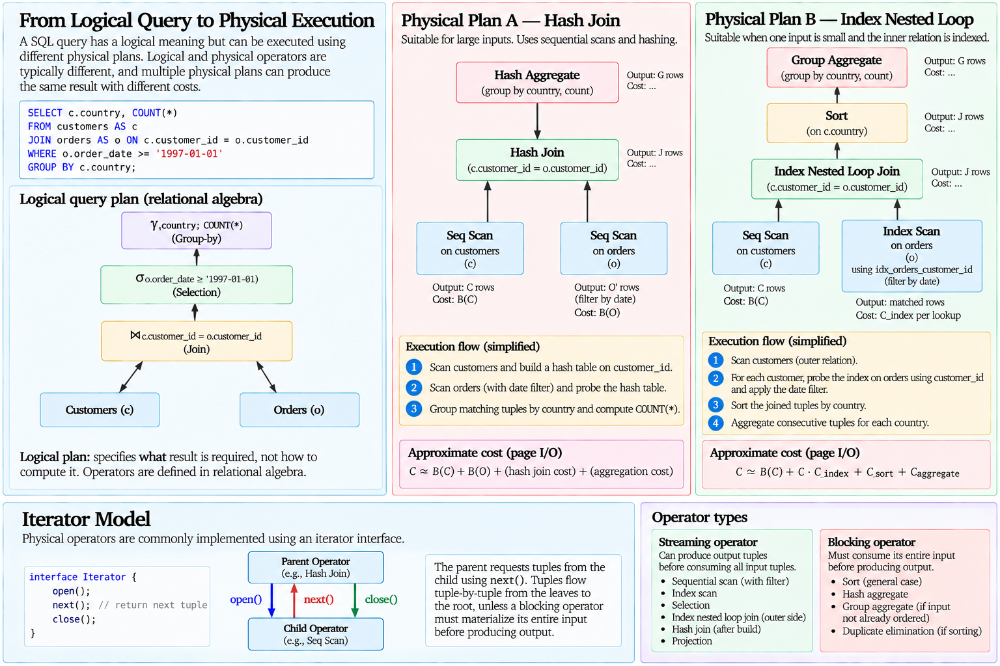{#fig-physical-query-execution}

The iterator model provides a useful abstraction for understanding pipelined execution without requiring each operator to know the complete implementation of its neighbours.

## Logical and Physical Plans

A **logical plan** describes relational operations.

For example,

$$
\pi_{\text{company\_name}}
\left(
\sigma_{\text{country}=\text{'Germany'}}
(
\text{Customers}
)
\right).
$$

A physical plan assigns concrete algorithms to those operations.

One possibility is

```text
Projection
    |
Sequential Scan
    filter: country = 'Germany'
```

while another may be

```text
Projection
    |
Index Scan on country
```

Both can implement the same logical expression.

For joins, the number of alternatives becomes much larger:

$$
\text{Logical Join}
\rightarrow
\begin{cases}
\text{Nested Loop},\\
\text{Index Nested Loop},\\
\text{Sort-Merge},\\
\text{Hash Join}.
\end{cases}
$$

Therefore,

$$
\boxed{
\text{Logical Plan}
\neq
\text{Physical Plan}.
}
$$

The logical plan establishes semantics; the physical plan establishes execution strategy.

## Equivalent Plans Can Have Different Costs

Suppose the logical query contains

$$
(R\bowtie S)\bowtie T.
$$

Associativity permits the equivalent expression

$$
R\bowtie(S\bowtie T).
$$

At the logical level,

$$
(R\bowtie S)\bowtie T
=
R\bowtie(S\bowtie T)
$$

under the appropriate join conditions.

Physically, however, the intermediate relations can have very different sizes.

If

$$
T(R\bowtie S)
$$

is small while

$$
T(S\bowtie T)
$$

is enormous, the first order may be substantially cheaper.

Furthermore, each logical join can independently use different physical algorithms.

The number of possible execution strategies therefore grows rapidly with query complexity.

This leads to the central problem of query optimization:

$$
\boxed{
\text{Which Equivalent Physical Plan Has the Lowest Estimated Cost?}
}
$$

## From Execution to Optimization

Physical query execution has established that a logical operator does not determine one algorithm.

A selection can use a scan or an index.

A grouping operation can use sorting or hashing.

A join can use nested loops, an index, sorting, or hashing.

Intermediate results can be materialized or pipelined.

Available memory changes algorithm costs.

Existing orderings and indexes create additional alternatives.

The execution problem can therefore be summarized as

$$
\text{Logical Query}
\rightarrow
\text{Many Valid Physical Plans}.
$$

The DBMS needs a systematic method for choosing among them.

To do so, it must answer questions such as

$$
\begin{aligned}
&\text{How many tuples will a predicate return?}\\
&\text{How many distinct values does an attribute contain?}\\
&\text{How large will a join result be?}\\
&\text{Which predicates should be evaluated first?}\\
&\text{Which join order should be used?}\\
&\text{Which physical operator is cheapest?}
\end{aligned}
$$

These questions require statistics, cardinality estimation, equivalence transformations, plan enumeration, and cost models.

They form the subject of **Query Optimization**.

# Query Optimization

A SQL query specifies the result that should be produced, but it generally leaves the physical method of producing that result unspecified. As the previous section showed, the same logical operation may be implemented by several physical algorithms, and equivalent logical expressions can produce intermediate relations of substantially different sizes.

The DBMS must therefore choose among alternative execution strategies.

This is the role of the **query optimizer**.

Conceptually,

$$
\boxed{
\text{SQL Query}
\rightarrow
\text{Logical Alternatives}
\rightarrow
\text{Physical Alternatives}
\rightarrow
\text{Cost Estimation}
\rightarrow
\text{Selected Plan}.
}
$$

The optimizer does not normally execute every possible plan and measure which one is fastest. It predicts their relative costs using information about the relations, available indexes, physical properties, and statistical characteristics of the data [@ullman2009database].

The central optimization problem can therefore be expressed as

$$
P^*
=
\arg\min_{P\in\mathcal{P}(Q)}
C(P),
$$ {#eq-optimal-query-plan}

where $\mathcal{P}(Q)$ is the set of candidate physical plans considered for query $Q$, $C(P)$ is the estimated cost of plan $P$, and $P^*$ is the plan selected by the optimizer.

This formulation immediately introduces two difficulties. The optimizer cannot normally enumerate every conceivable plan for a complex query, and it does not know the true cost of a plan before execution. Query optimization is therefore fundamentally a problem of **search under imperfect information**.

## From SQL to Execution

Before a query can be executed, it passes through several conceptual stages.

A simplified compilation pipeline is

$$
\boxed{
\text{SQL}
\rightarrow
\text{Parsing}
\rightarrow
\text{Semantic Analysis}
\rightarrow
\text{Logical Plan}
\rightarrow
\text{Optimization}
\rightarrow
\text{Physical Plan}
\rightarrow
\text{Execution}.
}
$$

Parsing determines whether the query conforms to the grammar of the language and constructs an internal representation of its syntax.

Semantic analysis determines whether the referenced relations and attributes exist, whether names can be resolved, and whether the requested operations are meaningful in the database context.

This establishes another useful distinction:

$$
\boxed{
\text{Syntactically Valid}
\neq
\text{Semantically Valid}.
}
$$

For example,

```sql
SELECT nonexistent_column
FROM customers;
```

can be grammatically valid SQL while failing semantic analysis because the referenced attribute does not exist.

Once the query has been validated, it can be represented through logical relational operations and transformed into candidate execution strategies.

## SQL Text and Logical Plans

Consider

```sql
SELECT
    c.company_name,
    o.order_id
FROM customers AS c
JOIN orders AS o
    ON c.customer_id = o.customer_id
WHERE c.country = 'Germany';
```

A corresponding logical expression is

$$
\pi_{\text{company\_name},\text{order\_id}}
\left(
\sigma_{\text{country}=\text{'Germany'}}
(\text{Customers})
\bowtie_{\text{customer\_id}}
\text{Orders}
\right).
$$

The SQL text and relational expression are not identical representations:

$$
\boxed{
\text{SQL Text}
\neq
\text{Logical Plan}.
}
$$

SQL is the declarative interface presented to the user. The logical plan is an internal representation of the operations required to produce the result.

Likewise,

$$
\boxed{
\text{Logical Plan}
\neq
\text{Physical Plan}.
}
$$

The logical join still does not specify whether the DBMS should use a hash join, merge join, nested loop, or another available implementation.

## Equivalent Logical Expressions

Relational algebra provides equivalence rules that allow one expression to be replaced by another without changing the required result.

For example, selections can often be combined:

$$
\sigma_{P_1}
\left(
\sigma_{P_2}(R)
\right)
=
\sigma_{P_1\land P_2}(R).
$$

Independent selections commute:

$$
\sigma_{P_1}
\left(
\sigma_{P_2}(R)
\right)
=
\sigma_{P_2}
\left(
\sigma_{P_1}(R)
\right).
$$

For suitable joins,

$$
R\bowtie S
=
S\bowtie R,
$$

and

$$
(R\bowtie S)\bowtie T
=
R\bowtie(S\bowtie T).
$$

These equivalences allow the optimizer to construct logically equivalent expressions whose physical costs may differ.

The purpose of rewriting is therefore not to change the answer:

$$
\boxed{
\text{Equivalent Logical Expression}
\rightarrow
\text{Potentially Different Execution Cost}.
}
$$

## Selection Pushdown

One of the most important transformations is to evaluate selective predicates as early as possible when semantics permit.

Suppose

$$
\sigma_{P}(R\bowtie S)
$$

contains predicate $P$ referring only to attributes of $R$.

Then the expression can often be rewritten as

$$
\sigma_P(R)\bowtie S.
$$

Suppose

$$
T(R)=1{,}000{,}000
$$

but

$$
T(\sigma_P(R))=10{,}000.
$$

Applying the predicate before the join reduces the relevant input from one million tuples to ten thousand.

Conceptually,

$$
1{,}000{,}000
\xrightarrow{\sigma_P}
10{,}000
\xrightarrow{\bowtie S}
\cdots
$$

can be preferable to constructing a much larger join intermediate and filtering afterward.

This transformation is commonly described as **selection pushdown**.

Its purpose is to reduce the amount of data processed by later operators:

$$
\boxed{
\text{Reduce Intermediate Cardinality Early}.
}
$$

However, a transformation is valid only when it preserves the query's semantics. Rules involving outer joins, `NULL`, aggregation, and other SQL constructs require greater care than simple inner-join algebra suggests.

## Projection Pushdown

A similar idea applies to attributes.

If later operators require only a subset of the attributes of a relation, unnecessary attributes can sometimes be removed early.

Conceptually,

$$
\pi_{A,B}
\left(
R\bowtie S
\right)
$$

may allow portions of the inputs to be projected before the join, provided attributes required by the join and subsequent operations are preserved.

Reducing tuple width can reduce the size of intermediate results:

$$
\text{Fewer Attributes per Tuple}
\rightarrow
\text{Potentially Fewer Pages}.
$$

Thus, optimization concerns both

$$
\text{number of tuples}
$$

and

$$
\text{size of each tuple}.
$$

This is another reason cardinality alone does not completely determine physical cost.

## Product Followed by Selection

A join can be expressed algebraically as a selection over a Cartesian product:

$$
R\bowtie_{R.A=S.B}S
=
\sigma_{R.A=S.B}(R\times S).
$$

Executing the expression literally by constructing

$$
R\times S
$$

would generally be wasteful.

If

$$
T(R)=100{,}000
$$

and

$$
T(S)=1{,}000{,}000,
$$

the Cartesian product contains

$$
10^{5}\times10^{6}
=
10^{11}
$$

tuple pairs before the predicate is applied.

A physical join algorithm instead incorporates the predicate while locating matching tuples.

Thus, a fundamental rewrite is conceptually

$$
\sigma_{\theta}(R\times S)
\rightarrow
R\bowtie_{\theta}S.
$$

The example demonstrates why logical equivalence alone is insufficient. Equivalent expressions can imply radically different naive execution strategies.

## Statistics

To choose among physical plans, the optimizer needs information about the stored data.

Important statistical quantities include

$$
T(R)=\text{number of tuples in }R,
$$

$$
B(R)=\text{number of pages occupied by }R,
$$

and

$$
V(R,A)=\text{number of distinct values of attribute }A\text{ in }R.
$$

For example, if

$$
T(\text{Customers})=91
$$

and there are

$$
V(\text{Customers},\text{country})=21
$$

distinct countries, these values provide information from which the optimizer can estimate the cardinality of predicates involving `country`.

Statistics may also describe value distributions rather than only relation-level counts.

The optimizer uses such information to estimate the amount of data that will flow through candidate plans.

## Selectivity

The **selectivity** of predicate $P$ over relation $R$ can be defined as

$$
s_P
=
\frac{T(\sigma_P(R))}{T(R)}.
$$ {#eq-predicate-selectivity}

Therefore,

$$
0\leq s_P\leq1.
$$

If

$$
T(R)=1{,}000{,}000
$$

and the predicate returns

$$
10{,}000
$$

tuples, then

$$
s_P
=
\frac{10{,}000}{1{,}000{,}000}
=
0.01.
$$

The predicate selects one percent of the relation.

The output cardinality can then be written as

$$
T(\sigma_P(R))
=
s_PT(R).
$$

A highly selective predicate has a small value of $s_P$ and substantially reduces the number of tuples.

Selectivity is central to optimization because many physical decisions depend on how much data is expected to survive a predicate.

## Equality Selection

Suppose the optimizer knows

$$
V(R,A),
$$

the number of distinct values of attribute $A$.

For the predicate

$$
A=c,
$$

a simple model assumes that values are distributed uniformly.

Under this assumption, approximately

$$
\frac{1}{V(R,A)}
$$

of the tuples contain any particular value.

Therefore,

$$
T(\sigma_{A=c}(R))
\approx
\frac{T(R)}{V(R,A)}.
$$ {#eq-equality-selection-estimate}

For example, if

$$
T(R)=1{,}000{,}000
$$

and

$$
V(R,A)=100,
$$

then

$$
T(\sigma_{A=c}(R))
\approx
\frac{1{,}000{,}000}{100}
=
10{,}000.
$$

The estimated selectivity is

$$
s_{A=c}
\approx
0.01.
$$

This calculation is simple and useful, but it depends on an assumption that may be badly wrong.

## Uniformity Is an Assumption

Suppose a customer relation contains customers from many countries, but half of all customers are located in one country.

If

$$
V(R,\text{country})=20,
$$

the uniformity estimate predicts

$$
s_{\text{country}=c}
\approx
\frac{1}{20}
=
0.05
$$

for every country.

But one particular country may actually have

$$
s=0.50.
$$

The estimate can therefore differ by an order of magnitude.

This distinction is fundamental:

$$
\boxed{
\text{Uniformity}
=
\text{Modelling Assumption},
\quad
\text{Not a Property Guaranteed by Real Data}.
}
$$

Real-world data frequently contains skew.

The optimizer therefore benefits from statistics capable of representing more than a distinct-value count.

## Histograms

A **histogram** summarizes the distribution of values across portions of an attribute's domain.

Suppose an attribute contains values ranging from 0 to 1000.

Rather than assuming uniform distribution across the complete range, a histogram may divide the domain into buckets and record information about the values occurring within each region.

Conceptually,

```text
Value Range        Frequency
--------------------------------
0 - 10             high
11 - 100           medium
101 - 500          low
501 - 1000         very low
```

The optimizer can use this information to estimate predicates such as

$$
A<50
$$

more accurately than a model based only on minimum, maximum, and number of distinct values.

Histograms are summaries, not complete copies of the data.

They therefore represent a trade-off:

$$
\boxed{
\text{Small Statistical Summary}
\leftrightarrow
\text{Approximation of Data Distribution}.
}
$$

More detailed statistics may improve estimates but also require additional storage and maintenance.

## Range Selectivity

Suppose attribute $A$ has values between

$$
A_{\min}
$$

and

$$
A_{\max}.
$$

For a range predicate

$$
A<c,
$$

a very simple uniform model might estimate selectivity as

$$
s
\approx
\frac{c-A_{\min}}
{A_{\max}-A_{\min}}.
$$

If

$$
A_{\min}=0,
\qquad
A_{\max}=1000,
\qquad
c=200,
$$

then

$$
s
\approx
\frac{200}{1000}
=
0.2.
$$

The estimated cardinality is

$$
T(\sigma_{A<200}(R))
\approx
0.2T(R).
$$

Again, the estimate depends on distributional assumptions.

Histograms can provide a more realistic approximation when values are skewed.

## Combined Predicates

Suppose a query contains

$$
P_1\land P_2.
$$

If the predicates were statistically independent, their combined selectivity could be estimated as

$$
s_{P_1\land P_2}
\approx
s_{P_1}s_{P_2}.
$$ {#eq-independent-predicate-selectivity}

For example, if

$$
s_{P_1}=0.1
$$

and

$$
s_{P_2}=0.2,
$$

then

$$
s_{P_1\land P_2}
\approx
0.02.
$$

However, independence is another assumption.

Suppose

$$
P_1:
\text{city}=\text{'Auckland'}
$$

and

$$
P_2:
\text{country}=\text{'New Zealand'}.
$$

These predicates are clearly correlated.

Multiplying their independent selectivities can substantially misestimate the result.

Thus,

$$
\boxed{
\text{Predicate Independence}
=
\text{Assumption},
\quad
\text{Not a General Property of Data}.
}
$$

Correlation is one of the principal difficulties in cardinality estimation.

## Join Cardinality

Estimating the size of a join is particularly important because join cardinalities influence both join ordering and physical algorithm selection.

Consider

$$
R\bowtie_{R.A=S.B}S.
$$

A commonly used simplifying estimate is

$$
T(R\bowtie S)
\approx
\frac{T(R)T(S)}
{\max(V(R,A),V(S,B))}.
$$ {#eq-join-cardinality-estimate}

To understand the formula, suppose

$$
T(R)=100{,}000,
$$

$$
T(S)=1{,}000{,}000,
$$

$$
V(R,A)=10{,}000,
$$

and

$$
V(S,B)=20{,}000.
$$

Then

$$
T(R\bowtie S)
\approx
\frac{100{,}000\times1{,}000{,}000}
{20{,}000}
=
5{,}000{,}000.
$$

The formula assumes a simplified relationship between the distributions of the join attributes.

It should therefore be interpreted as an estimator, not an identity.

## Foreign-Key Joins

Some schema constraints provide stronger information than generic statistical assumptions.

Suppose every tuple in `orders` contains a non-null `customer_id` referencing exactly one tuple in `customers`.

Then for

$$
\text{Orders}
\bowtie_{\text{customer\_id}}
\text{Customers},
$$

each order matches exactly one customer.

Consequently,

$$
T(
\text{Orders}
\bowtie
\text{Customers}
)
=
T(\text{Orders})
$$

for the corresponding inner join under these assumptions.

This demonstrates an important principle:

$$
\boxed{
\text{Schema Constraints Can Inform Cardinality Reasoning}.
}
$$

Keys and referential constraints are not only mechanisms for integrity. They also describe properties of the data that can assist query reasoning.

## Cardinality Propagates Through a Plan

Consider a plan

$$
(R\bowtie S)\bowtie T.
$$

To estimate the cost of the second join, the optimizer must estimate

$$
T(R\bowtie S).
$$

If that estimate is wrong, the error becomes an input to the next estimation step.

Suppose the actual intermediate cardinality is

$$
100{,}000
$$

but the optimizer estimates

$$
1{,}000.
$$

A physical strategy that appears attractive for one thousand tuples may be poor for one hundred thousand.

Thus,

$$
\boxed{
\text{Bad Cardinality Estimate}
\rightarrow
\text{Bad Cost Estimate}
\rightarrow
\text{Potentially Bad Plan}.
}
$$

This is one of the most important causal chains in query optimization.

## Access-Path Selection

Suppose a relation has an index on attribute $A$ and the query contains

$$
A=c.
$$

The optimizer may compare at least two alternatives:

$$
P_1=\operatorname{SeqScan}(R)
$$

and

$$
P_2=\operatorname{IndexScan}_A(R).
$$

The sequential scan has approximate page cost

$$
C(P_1)\approx B(R).
$$

The index plan depends on tree traversal, matching index entries, and data-page retrieval.

If the estimated selectivity is very low,

$$
s_P\ll1,
$$

the index may be attractive.

If

$$
s_P\approx1,
$$

a sequential scan may be cheaper.

Therefore,

$$
\boxed{
\text{Predicate}
+
\text{Index}
\neq
\text{Automatic Index Scan}.
}
$$

The optimizer chooses an access path according to estimated cost.

## Physical Properties

The cost of a plan depends not only on which tuples it produces but also on properties of the produced data.

Suppose one plan produces tuples already ordered by

$$
A.
$$

Another plan produces the same tuples in no useful order.

If a later operation requires

```sql
ORDER BY A
```

or a merge join on $A$, the first plan may avoid a separate sorting operation.

Thus, two plans producing the same logical relation can differ in useful **physical properties**.

Conceptually,

$$
P_1
\rightarrow
(R,\text{ordered by }A),
$$

while

$$
P_2
\rightarrow
(R,\text{unordered}).
$$

The relational result is equivalent, but the physical state is not.

This yields another important distinction:

$$
\boxed{
\text{Logical Equivalence}
\neq
\text{Physical Equivalence}.
}
$$

## Interesting Orders

An ordering is particularly valuable when it can reduce the cost of a later operation.

Such an ordering is commonly described as an **interesting order**.

Suppose a query joins on

$$
customer\_id
$$

and later groups by

$$
customer\_id.
$$

A plan that produces join output already ordered by `customer_id` may allow the grouping operation to exploit that order.

The optimizer may therefore retain a plan that is not the cheapest way to produce an intermediate relation in isolation because its ordering reduces the cost of subsequent operators.

This illustrates why optimization cannot always be performed by independently choosing the cheapest implementation for each operator.

The objective is to minimize the cost of the **complete plan**.

## Join Ordering

Consider three relations:

$$
R,
\quad
S,
\quad
T.
$$

Two possible join orders are

$$
(R\bowtie S)\bowtie T
$$

and

$$
R\bowtie(S\bowtie T).
$$

Suppose

$$
T(R)=1{,}000{,}000,
$$

$$
T(S)=100{,}000,
$$

and

$$
T(T)=10{,}000.
$$

These base cardinalities alone do not determine the best order.

Suppose

$$
T(R\bowtie S)=50{,}000{,}000
$$

while

$$
T(S\bowtie T)=5{,}000.
$$

Then joining $S$ and $T$ first creates a dramatically smaller intermediate result.

Conceptually,

$$
R\bowtie
\underbrace{(S\bowtie T)}_{5{,}000}
$$

may be preferable to

$$
\underbrace{(R\bowtie S)}_{50{,}000{,}000}
\bowtie T.
$$

Join ordering is therefore often one of the most consequential decisions made by the optimizer.

## Growth of the Search Space

With two relations, few join orders exist.

As the number of relations grows, the number of possible join trees grows rapidly.

Even considering only permutations of $n$ relations gives

$$
n!
$$

possible sequences.

For

$$
n=5,
$$

$$
5!=120.
$$

For

$$
n=10,
$$

$$
10!=3{,}628{,}800.
$$

The true physical-plan space is larger because each logical join can itself have multiple physical implementations, and access paths and physical properties create additional alternatives.

Therefore,

$$
\boxed{
\text{Optimization}
\neq
\text{Exhaustively Execute Every Possible Plan}.
}
$$

The optimizer needs algorithms that search the plan space selectively.

## Dynamic Programming

A classical approach to join-order optimization uses **dynamic programming**.

The central idea is to construct good plans for small subsets of relations and reuse those results when constructing plans for larger subsets.

Suppose the query contains

$$
\{R,S,T\}.
$$

The optimizer first considers useful plans for individual relations:

$$
\{R\},
\quad
\{S\},
\quad
\{T\}.
$$

It then constructs plans for pairs:

$$
\{R,S\},
\quad
\{R,T\},
\quad
\{S,T\}.
$$

Finally, it uses those results to construct plans covering

$$
\{R,S,T\}.
$$

The principle is

$$
\boxed{
\text{Optimal Subplans}
\rightarrow
\text{Candidate Larger Plans}.
}
$$

This avoids repeatedly solving identical subproblems.

Classical System R-style optimization, often associated with Selinger and colleagues, provides an important historical foundation for this approach to cost-based relational optimization.

## Cheapest Does Not Mean One Plan per Relation Set

Suppose two plans produce the same intermediate relation.

Plan $P_1$ costs

$$
100
$$

and produces unordered output.

Plan $P_2$ costs

$$
110
$$

but produces output ordered by an attribute required later.

Discarding $P_2$ merely because

$$
110>100
$$

may eliminate the globally better plan.

An optimizer may therefore retain several plans for the same logical subexpression when they provide different useful physical properties.

This reinforces the distinction between

$$
\text{cheapest intermediate result}
$$

and

$$
\text{cheapest complete execution plan}.
$$

Local optimality does not necessarily imply global optimality.

## Cost Models

Once candidate plans have been generated, their costs must be estimated.

A simplified theoretical model may count page I/O:

$$
C(P)
=
C_{\text{reads}}
+
C_{\text{writes}}.
$$

A practical DBMS may incorporate additional factors representing sequential access, random access, CPU processing, tuple handling, parallel execution, and other implementation-specific costs.

The optimizer therefore works with a model:

$$
\widehat{C}(P),
$$

where the hat emphasizes that the value is an estimate.

The selected plan is more accurately represented as

$$
P^*
=
\arg\min_{P\in\mathcal{P}(Q)}
\widehat{C}(P).
$$

This distinction matters because

$$
\boxed{
\widehat{C}(P)
\neq
C_{\text{actual}}(P).
}
$$

The optimizer minimizes estimated cost, not unknowable future runtime.

## The Optimizer Is Not Omniscient

Query optimization is sometimes described as though the DBMS simply identifies the best plan.

A more accurate description is:

$$
\boxed{
\text{Statistics}
+
\text{Assumptions}
+
\text{Cost Model}
+
\text{Search Strategy}
\rightarrow
\text{Chosen Plan}.
}
$$

Each component can introduce approximation.

Statistics may be stale.

Histograms may summarize distributions imperfectly.

Attributes may be correlated.

The cost model may not perfectly represent the hardware or current buffer state.

The search algorithm may not consider every possible plan.

Therefore,

$$
\boxed{
\text{Chosen Plan}
\neq
\text{Provably Fastest Possible Execution}.
}
$$

The optimizer selects what appears to be a good plan according to the information and alternatives available to it.

This is not a defect in the idea of optimization. It is an unavoidable consequence of making planning decisions before executing the query.

## Estimated Cost and Runtime

Suppose the optimizer estimates

$$
\widehat{C}(P_1)=100
$$

and

$$
\widehat{C}(P_2)=150.
$$

It may select $P_1$.

These numbers should not automatically be interpreted as

$$
100\text{ ms}
$$

and

$$
150\text{ ms}.
$$

Cost units are part of the optimizer's internal comparison model.

Therefore,

$$
\boxed{
\text{Estimated Cost}
\neq
\text{Execution Time}.
}
$$

The useful interpretation is relative:

$$
\widehat{C}(P_1)<\widehat{C}(P_2)
$$

means that the optimizer's model predicts $P_1$ to be preferable among those alternatives.

## PostgreSQL EXPLAIN

PostgreSQL exposes its planned execution strategy through `EXPLAIN`.

For example,

```sql
EXPLAIN
SELECT
    *
FROM orders
WHERE customer_id = 'ALFKI';
```

may display a plan containing an access operator together with estimated costs and cardinalities.

Conceptually, `EXPLAIN` answers:

$$
\boxed{
\text{What does PostgreSQL expect to do?}
}
$$

It exposes information such as the selected physical operators, estimated plan costs, estimated number of output rows, and the structure of the execution tree.

This makes `EXPLAIN` an important bridge between theoretical query optimization and an actual DBMS.

## EXPLAIN ANALYZE

`EXPLAIN ANALYZE` goes further by executing the query and reporting execution measurements alongside planner estimates.

Conceptually,

$$
\texttt{EXPLAIN}
\rightarrow
\text{Estimated Plan},
$$

while

$$
\texttt{EXPLAIN ANALYZE}
\rightarrow
\text{Estimated Plan + Observed Execution}.
$$

This enables comparison between

$$
T_{\text{estimated}}
$$

and

$$
T_{\text{actual}}.
$$

If an operator is estimated to produce

$$
100
$$

rows but actually produces

$$
100{,}000,
$$

the discrepancy provides evidence that the optimizer's cardinality model did not represent the data accurately for that operation.

This is often more informative than simply observing that a query is slow.

The diagnostic chain becomes

$$
\boxed{
\text{Estimate}
\rightarrow
\text{Plan Choice}
\rightarrow
\text{Observed Execution}.
}
$$

## Reading Plans as Trees

An execution plan should be interpreted structurally rather than as a flat list of operations.

For example,

```text
Aggregate
    |
Hash Join
   /     \
Scan R   Scan S
```

indicates that the scans produce input for the hash join, whose output is consumed by the aggregate.

Execution therefore flows conceptually from the leaves upward:

$$
\text{Base Relations}
\rightarrow
\text{Physical Operators}
\rightarrow
\text{Intermediate Results}
\rightarrow
\text{Final Result}.
$$

The estimated or observed row count at each node describes the amount of data flowing into the next stage.

This is why cardinality estimates are so important: they connect the operators throughout the complete plan.

## Diagnosing a Poor Plan

When an execution plan performs poorly, immediately assuming that the chosen operator is intrinsically wrong can obscure the underlying cause.

Suppose PostgreSQL selects an index nested-loop join because it estimates the outer input will contain

$$
100
$$

rows.

If the actual outer input contains

$$
1{,}000{,}000
$$

rows, the resulting large number of index probes may perform poorly.

The visible symptom is

$$
\text{expensive nested loop},
$$

but the causal problem may be

$$
\text{bad cardinality estimate}.
$$

The diagnostic reasoning should therefore proceed through the chain

$$
\boxed{
\text{Statistics}
\rightarrow
\text{Cardinality Estimates}
\rightarrow
\text{Cost Estimates}
\rightarrow
\text{Plan Choice}
\rightarrow
\text{Observed Runtime}.
}
$$

This is more useful than treating query tuning as a collection of isolated rules.

## Optimization as a Layered Problem

The complete path from SQL to physical execution can now be represented as

$$
\boxed{
\begin{aligned}
\text{SQL}
&\rightarrow
\text{Logical Representation}\\
&\rightarrow
\text{Equivalent Logical Plans}\\
&\rightarrow
\text{Physical Implementations}\\
&\rightarrow
\text{Cardinality Estimates}\\
&\rightarrow
\text{Cost Estimates}\\
&\rightarrow
\text{Plan Selection}\\
&\rightarrow
\text{Execution}.
\end{aligned}
}
$$

Each layer answers a different question.

The logical representation asks:

$$
\text{What operations produce the required result?}
$$

Logical rewriting asks:

$$
\text{Which equivalent expressions are available?}
$$

Physical planning asks:

$$
\text{Which algorithms can implement those operations?}
$$

Cardinality estimation asks:

$$
\text{How much data is expected to flow through each operator?}
$$

Cost estimation asks:

$$
\text{How expensive is each candidate plan expected to be?}
$$

Plan selection asks:

$$
\text{Which candidate appears cheapest?}
$$

Keeping these questions separate prevents several common conceptual errors.

## Query Optimization and Data Independence

The optimizer provides a practical consequence of physical data independence.

The user writes

```sql
SELECT ...
```

without specifying

```text
use a B+ tree,
build a hash table,
allocate this many buffers,
join these relations first,
then sort this intermediate result.
```

Instead,

$$
\text{Declarative Query}
\rightarrow
\text{Optimizer}
\rightarrow
\text{Physical Strategy}.
$$

The physical strategy can change as data volumes, statistics, indexes, and system conditions change while the SQL query remains unchanged.

Thus,

$$
\boxed{
\text{Same SQL}
\not\Rightarrow
\text{Same Physical Plan Forever}.
}
$$

This adaptability is one of the principal advantages of declarative database languages.

## From Query Processing to Transaction Management

Storage, indexing, execution, and optimization explain how a DBMS can process a query efficiently.

They do not yet explain how the database remains correct when several operations execute concurrently or when the system fails during an update.

Suppose two transactions simultaneously modify the same account, or a failure occurs after some modified pages have reached persistent storage but others have not.

Efficient query execution alone cannot guarantee a valid database state.

The next problem is therefore

$$
\boxed{
\text{Correct Execution in the Presence of Concurrency and Failure}.
}
$$

This leads to **Transaction Management**, where the central concepts will include transactions, schedules, serializability, locking, two-phase locking, deadlocks, multiversion concurrency control, recoverability, logging, Write-Ahead Logging, checkpoints, and crash recovery.

# Transaction Management

A database system must do more than execute individual queries correctly. Multiple users and applications may access the same data concurrently, transactions may modify several pages before completing, and failures may occur at arbitrary points during execution.

Consider a transfer of $100$ monetary units between two accounts:

```text
Account A: -100
Account B: +100
```

The intended operation is not merely two independent updates. The database should move from one valid state to another in which either the complete transfer has occurred or none of it has.

At the same time, another transaction may be reading or modifying either account.

This creates two closely related problems:

$$
\begin{aligned}
\text{Concurrency Control}
&\rightarrow
\text{Correct Interleaving of Transactions},\\
\text{Recovery}
&\rightarrow
\text{Correct Behaviour in the Presence of Failure}.
\end{aligned}
$$

Together they form the foundation of **transaction management** [@ullman2009database].

## Transactions

A **transaction** is a logical unit of database work consisting of one or more operations that should be treated according to a defined correctness model.

A transaction can be represented abstractly as

$$
T_i=
\langle
o_1,o_2,\ldots,o_n
\rangle,
$$

where each $o_j$ is an operation such as a read, write, insertion, deletion, or computation involving database data.

For example,

```sql
BEGIN;

UPDATE accounts
SET balance = balance - 100
WHERE account_id = 1;

UPDATE accounts
SET balance = balance + 100
WHERE account_id = 2;

COMMIT;
```

contains two database modifications but represents one logical operation.

The transaction boundary states that the application intends these statements to participate in one unit of work.

A transaction may terminate successfully with

```sql
COMMIT;
```

or its effects may be abandoned through

```sql
ROLLBACK;
```

The important distinction is therefore

$$
\text{SQL Statement}
\neq
\text{Transaction}.
$$

A transaction may contain one statement or many statements.

## ACID Properties

Transaction processing is traditionally described through four properties known as **ACID**:

$$
\text{Atomicity}
+
\text{Consistency}
+
\text{Isolation}
+
\text{Durability}.
$$

These terms are useful, but each describes a different aspect of transactional correctness and should not be treated as interchangeable guarantees.

### Atomicity

Atomicity requires that a transaction's effects behave as one logical unit with respect to completion.

If transaction $T$ performs

$$
w(A)
$$

and

$$
w(B),
$$

a failure should not leave the database in a state corresponding to an unintended partial transaction.

Conceptually,

$$
T
\rightarrow
\text{All Relevant Effects}
\quad\text{or}\quad
\text{No Relevant Effects}.
$$

For the transfer example, deducting $100$ from account A without completing the corresponding credit to account B would violate the intended atomic unit.

Atomicity is closely connected to recovery mechanisms because the DBMS must be able to eliminate the effects of transactions that do not complete successfully.

### Consistency

Consistency means that a transaction is expected to preserve the integrity requirements of the database when moving between valid states.

If database state $D$ satisfies constraint set $\mathcal{C}$,

$$
D\models\mathcal{C},
$$

then a correct transaction should produce a new state $D'$ such that

$$
D'\models\mathcal{C}.
$$

Conceptually,

$$
\text{Valid State}
\xrightarrow{\text{Correct Transaction}}
\text{Valid State}.
$$

The DBMS can enforce declared constraints such as primary keys, foreign keys, uniqueness, and checks, but application-level correctness may also depend on business rules not fully represented by the database schema.

Thus, ACID consistency should not be interpreted as the DBMS automatically knowing every semantic rule of the application.

### Isolation

Isolation concerns concurrent execution.

Suppose transactions $T_1$ and $T_2$ execute at the same time.

Their individual operations may physically interleave:

$$
o_1(T_1),
o_1(T_2),
o_2(T_1),
o_2(T_2),
\ldots
$$

Isolation requires the DBMS to control these interactions according to its concurrency model so that unacceptable interference is prevented.

The strongest conceptual reference point is serial execution:

$$
T_1
\rightarrow
T_2
$$

or

$$
T_2
\rightarrow
T_1.
$$

Concurrency control seeks to obtain useful parallelism while preserving an appropriate notion of correctness.

### Durability

Durability concerns committed transactions.

Once the DBMS reports that a transaction has committed, its committed effects must survive failures covered by the system's durability model.

Conceptually,

$$
\texttt{COMMIT}
\rightarrow
\text{Durable Transaction Outcome}.
$$

As introduced in the storage section, this does **not** imply that every modified data page must immediately be written to its final persistent location:

$$
\texttt{COMMIT}
\neq
\text{Flush Every Modified Data Page}.
$$

Logging and recovery mechanisms allow durability to be provided without requiring this expensive policy.

## ACID Properties Are Related but Distinct

Atomicity and durability are principally connected to recovery.

Isolation is principally connected to concurrency control.

Consistency depends on the combined behaviour of transactions, integrity constraints, concurrency control, recovery, and application logic.

A useful conceptual map is therefore

$$
\begin{aligned}
\text{Atomicity}
&\leftrightarrow
\text{Recovery},\\
\text{Isolation}
&\leftrightarrow
\text{Concurrency Control},\\
\text{Durability}
&\leftrightarrow
\text{Logging and Recovery},\\
\text{Consistency}
&\leftrightarrow
\text{Correct Transactions and Constraints}.
\end{aligned}
$$

The boundaries are not absolute, but the distinction prevents ACID from becoming a collection of vague slogans.

## Concurrent Execution

Serial execution would provide a simple model:

```text
T1:  read(A) write(A) commit
T2:                          read(A) write(A) commit
```

Only one transaction performs work at a time.

This can severely limit throughput and resource utilization.

A DBMS therefore allows transactions to overlap:

```text
T1:  read(A)          write(A)          commit
T2:          read(B)           write(B)          commit
```

If the transactions operate on independent data, this interleaving may be harmless and substantially more efficient.

The difficulty appears when concurrent transactions interact through the same database items.

Concurrency therefore creates a trade-off:

$$
\text{More Concurrency}
\leftrightarrow
\text{More Potential Interaction}.
$$

Concurrency control determines which interactions are safe under the chosen correctness model.

## Schedules

A **schedule** describes the order in which operations from multiple transactions are executed while preserving the internal order of operations within each individual transaction.

Suppose

$$
T_1:
r_1(A),w_1(A)
$$

and

$$
T_2:
r_2(A),w_2(A).
$$

One possible schedule is

$$
S=
r_1(A),
w_1(A),
r_2(A),
w_2(A).
$$

This schedule is serial because all operations of $T_1$ occur before all operations of $T_2$.

Another schedule is

$$
S'=
r_1(A),
r_2(A),
w_1(A),
w_2(A).
$$

This schedule is interleaved.

The question is not merely whether a schedule is interleaved, but whether its interactions preserve the required transactional semantics.

## Serial Schedules

A schedule is **serial** when transactions execute without interleaving.

For transactions

$$
T_1,T_2,\ldots,T_n,
$$

a serial schedule executes a permutation such as

$$
T_3
\rightarrow
T_1
\rightarrow
T_2
\rightarrow
\cdots
$$

with each transaction completing its database operations before the next transaction begins.

Serial schedules provide a useful correctness baseline because transactions do not interfere concurrently.

However, requiring every execution to be physically serial would sacrifice much of the performance benefit of concurrency.

The objective is therefore not necessarily

$$
\text{Concurrent Schedule}
=
\text{Serial Schedule},
$$

but rather to identify concurrent schedules that are equivalent, according to an appropriate criterion, to some serial schedule.

This leads to **serializability**.

## Serializable Schedules

A schedule is **serializable** when its effect is equivalent to that of some serial ordering of the same transactions.

Thus,

$$
\text{Serial}
\Rightarrow
\text{Serializable},
$$

but

$$
\text{Serializable}
\not\Rightarrow
\text{Serial}.
$$

A serializable schedule may contain substantial interleaving.

For example, if $T_1$ operates only on $A$ and $T_2$ only on $B$,

$$
r_1(A),
r_2(B),
w_1(A),
w_2(B)
$$

is interleaved but may be equivalent to either serial order because the transactions do not interfere.

Serializability therefore provides a way to retain concurrency without abandoning a serial correctness reference.

## Conflicting Operations

To reason about serializability, it is useful to identify operations whose order matters.

Two operations **conflict** when they belong to different transactions, access the same database item, and at least one of them is a write.

For item $X$, the principal cases are

| Operation Pair | Conflict? |
|:---:|:---:|
| $r_i(X),r_j(X)$ | No |
| $r_i(X),w_j(X)$ | Yes |
| $w_i(X),r_j(X)$ | Yes |
| $w_i(X),w_j(X)$ | Yes |

Two reads do not conflict because exchanging their order does not change the values read or the database state.

A read and a write can conflict because reversing them may change which value is observed.

Two writes conflict because reversing them may change the final stored value.

Thus,

$$
\text{Conflict}
\rightarrow
\text{Operation Ordering May Affect Behaviour}.
$$

## Conflict Equivalence

Two schedules are **conflict equivalent** when they contain the same operations and preserve the relative ordering of every pair of conflicting operations.

Suppose two adjacent operations belong to different transactions and do not conflict.

Then their order can be exchanged without affecting conflict equivalence.

By repeatedly exchanging adjacent non-conflicting operations, one schedule may sometimes be transformed into another.

A schedule is **conflict serializable** when it is conflict equivalent to some serial schedule.

This gives a practical and important sufficient framework for reasoning about serializability.

However,

$$
\text{Conflict Serializability}
\neq
\text{Serializability in General}.
$$

Conflict serializability is a restricted notion based on conflict equivalence. Other notions, such as view serializability, can classify additional schedules as serializable.

Conflict serializability is particularly useful because it can be tested efficiently using a graph.

## Precedence Graphs

Given a schedule $S$, construct a **precedence graph** whose vertices are transactions:

$$
V=
\{T_1,T_2,\ldots,T_n\}.
$$

Add a directed edge

$$
T_i\rightarrow T_j
$$

whenever an operation of $T_i$ precedes and conflicts with an operation of $T_j$ on the same item.

The resulting graph captures ordering constraints imposed by the schedule.

The central result is

$$
S\text{ is conflict serializable}
\iff
G(S)\text{ is acyclic}.
$$ {#eq-conflict-serializability}

If the graph is acyclic, any topological ordering of its vertices gives a serial transaction order conflict-equivalent to the schedule.

## Precedence Graph Example

Consider

$$
T_1:
r_1(A),w_1(A),r_1(B),w_1(B)
$$

and

$$
T_2:
r_2(A),w_2(A).
$$

Suppose the schedule is

$$
r_1(A),
w_1(A),
r_2(A),
w_2(A),
r_1(B),
w_1(B).
$$

Because

$$
w_1(A)
$$

occurs before the conflicting operations of $T_2$ on $A$, the graph contains

$$
T_1\rightarrow T_2.
$$

There is no edge in the opposite direction.

The graph is therefore

```text
T1 ------> T2
```

which is acyclic.

A corresponding serial order is

$$
T_1,T_2.
$$

The interleaved schedule is conflict serializable.

## A Nonserializable Schedule

Now consider

$$
T_1:
r_1(A),w_1(A),r_1(B),w_1(B)
$$

and

$$
T_2:
r_2(B),w_2(B),r_2(A),w_2(A).
$$

Suppose the schedule orders the conflicting operations so that $T_1$ acts first on $A$:

$$
T_1\rightarrow T_2,
$$

while $T_2$ acts first on $B$:

$$
T_2\rightarrow T_1.
$$

The precedence graph contains a cycle:

```text
T1 ------> T2
 ^          |
 |          |
 +----------+
```

No topological ordering exists.

Therefore,

$$
S
$$

is not conflict serializable.

The cycle means the schedule simultaneously requires

$$
T_1<T_2
$$

and

$$
T_2<T_1
$$

in any equivalent serial ordering, which is impossible.

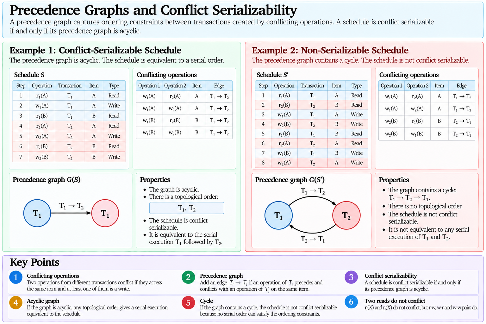{#fig-precedence-graph}

## Serializability Does Not Specify an Implementation

The precedence graph provides a way to analyse a completed schedule.

A DBMS, however, needs mechanisms that control execution while transactions are running.

It would be impractical to execute arbitrary operations and only afterward discover that the resulting schedule was invalid.

Concurrency-control protocols therefore constrain execution so that desirable schedules are produced.

One major family of protocols is based on **locking**.

## Locks

A lock associates access permissions with a database item.

The two fundamental lock modes are

$$
S=\text{Shared}
$$

and

$$
X=\text{Exclusive}.
$$

A shared lock is associated with reading.

An exclusive lock is associated with writing.

The basic compatibility matrix is

| Requested / Held | $S$ | $X$ |
|:---:|:---:|:---:|
| $S$ | Compatible | Incompatible |
| $X$ | Incompatible | Incompatible |

Several transactions may therefore hold shared locks on the same item simultaneously:

$$
S_i(X)+S_j(X)
\rightarrow
\text{Allowed}.
$$

But an exclusive lock conflicts with another shared or exclusive lock:

$$
X_i(X)+S_j(X)
\rightarrow
\text{Conflict},
$$

$$
X_i(X)+X_j(X)
\rightarrow
\text{Conflict}.
$$

This reflects the same basic logic as conflicting read and write operations.

## Lock-Based Execution

Before reading item $A$, a transaction can request

$$
S(A).
$$

Before writing $A$, it can request

$$
X(A).
$$

If the requested lock is compatible with locks already held by other transactions, it is granted.

Otherwise, the transaction waits.

Conceptually,

$$
\text{Lock Request}
\rightarrow
\begin{cases}
\text{Grant}, & \text{compatible},\\
\text{Wait}, & \text{incompatible}.
\end{cases}
$$

Locks therefore transform potential data conflicts into synchronization between transactions.

However, simply using locks is not sufficient to guarantee serializability.

The timing of lock acquisition and release matters.

## Two-Phase Locking

**Two-Phase Locking (2PL)** divides a transaction's locking behaviour into two phases.

During the **growing phase**, locks may be acquired but not released.

During the **shrinking phase**, locks may be released but no new locks may be acquired.

Conceptually,

$$
\underbrace{\text{Acquire Locks}}_{\text{Growing Phase}}
\rightarrow
\underbrace{\text{Release Locks}}_{\text{Shrinking Phase}}.
$$

The point at which a transaction obtains its final lock is sometimes called its **lock point**.

Two-phase locking provides an important result:

$$
\text{2PL}
\Rightarrow
\text{Conflict-Serializable Schedules}.
$$

The protocol prevents transactions from releasing locks and later acquiring new ones in a way that could create arbitrary cyclic conflict dependencies.

## Why Two Phases Matter

Consider a transaction that could perform

```text
lock-X(A)
write(A)
unlock(A)

lock-X(B)
write(B)
unlock(B)
```

while another transaction accesses $A$ and $B$ in the opposite order.

Because the first transaction releases $A$ before acquiring $B$, another transaction can interpose operations that create incompatible ordering requirements between the two items.

Two-phase locking prohibits this pattern.

Once a transaction begins releasing locks, it cannot acquire additional locks.

Thus,

$$
\text{First Unlock}
\rightarrow
\text{No Further Lock Acquisition}.
$$

The protocol constrains schedules sufficiently to guarantee conflict serializability.

## Two-Phase Does Not Mean Two Lock Modes

The term **two-phase locking** refers to the temporal phases

$$
\text{growing}
\rightarrow
\text{shrinking},
$$

not to the existence of two lock modes $S$ and $X$.

Therefore,

$$
\text{Two-Phase Locking}
\neq
\text{Shared + Exclusive Locks}.
$$

The concepts are related but independent.

This distinction is particularly important because the term "two-phase" will later appear again in **two-phase commit**, which is a different protocol solving a different problem.

## Strict Two-Phase Locking

Basic 2PL guarantees conflict serializability, but locks may still be released before a transaction commits.

A stronger variant is **strict two-phase locking**, in which exclusive locks are retained until the transaction commits or aborts.

Conceptually,

$$
X\text{-locks held by }T
\rightarrow
\texttt{COMMIT or ROLLBACK}.
$$

This prevents another transaction from reading or overwriting values written by an uncommitted transaction.

Strictness simplifies recovery because other transactions cannot observe or overwrite uncommitted writes.

Thus,

$$
\text{Concurrency-Control Policy}
\leftrightarrow
\text{Recovery Complexity}.
$$

This connection will become important when recoverable and strict schedules are examined later.

## Lock Granularity

Locks can protect objects at different levels of granularity.

Examples include

$$
\text{Database},
\qquad
\text{Table},
\qquad
\text{Page},
\qquad
\text{Row}.
$$

Coarse-grained locks protect large portions of the database with relatively few lock-management operations, but they reduce concurrency.

Fine-grained locks allow transactions to operate independently on different records but require more locks and more lock-management overhead.

This produces a trade-off:

$$
\begin{aligned}
\text{Coarse Granularity}
&\rightarrow
\text{Lower Lock Overhead, Lower Concurrency},\\
\text{Fine Granularity}
&\rightarrow
\text{Higher Lock Overhead, Higher Potential Concurrency}.
\end{aligned}
$$

The appropriate granularity depends on the workload and DBMS implementation.

## Multiple-Granularity Locking

If locks can exist simultaneously at several levels of a hierarchy, the DBMS must coordinate them.

Suppose transaction $T_1$ intends to lock one row of table $R$, while transaction $T_2$ requests an exclusive lock on the complete table.

The system needs to recognize that these requests interact even though they refer to different levels.

**Intention locks** communicate that a transaction holds or intends to acquire finer-grained locks below a particular object.

Conceptually,

$$
\text{Table}
\rightarrow
\text{Pages}
\rightarrow
\text{Rows}.
$$

An intention lock at the table level can indicate that finer-grained locks exist below it.

The detailed compatibility rules are implementation-specific, but the conceptual purpose is

$$
\text{Coordinate Locks Across Multiple Granularities}.
$$

This allows coarse- and fine-grained locking to coexist without requiring the DBMS to inspect every lower-level object for each higher-level lock request.

## Lock Upgrades

A transaction may initially read an item and later decide to modify it.

It may therefore need to convert

$$
S(A)
$$

into

$$
X(A).
$$

This is a **lock upgrade**.

The upgrade can be granted only when no incompatible locks held by other transactions prevent exclusive access.

Lock conversions introduce additional interactions among transactions and can participate in deadlocks.

They demonstrate again that concurrency control is not simply a matter of attaching static read/write labels to objects; lock state evolves during transaction execution.

## Deadlocks

Locking can cause transactions to wait.

Waiting creates the possibility of a **deadlock**.

Suppose

$$
T_1
$$

holds an exclusive lock on $A$ and requests $B$.

At the same time,

$$
T_2
$$

holds an exclusive lock on $B$ and requests $A$.

Then

$$
T_1
\rightarrow
\text{waits for }T_2
$$

and

$$
T_2
\rightarrow
\text{waits for }T_1.
$$

Neither transaction can proceed.

Conceptually,

```text
T1 holds A, waits for B
        ↓             ↑
T2 waits for A, holds B
```

This is a deadlock.

## Wait-For Graphs

Deadlocks can be represented using a **wait-for graph**.

Each vertex represents a transaction.

An edge

$$
T_i\rightarrow T_j
$$

means that $T_i$ is waiting for a resource currently held by $T_j$.

A cycle indicates deadlock:

$$
T_1\rightarrow T_2\rightarrow\cdots\rightarrow T_1.
$$

Thus,

$$
\text{Cycle in Wait-For Graph}
\rightarrow
\text{Deadlock}.
$$

This graph should not be confused with the precedence graph used for conflict serializability.

A precedence graph represents ordering constraints among conflicting database operations.

A wait-for graph represents current waiting dependencies among transactions.

Therefore,

$$
\text{Precedence Graph}
\neq
\text{Wait-For Graph}.
$$

They may both contain transactions and directed edges, but the edges mean different things.

## Deadlock Detection

A DBMS can allow deadlocks to occur and detect them.

Conceptually,

$$
\text{Lock Waits}
\rightarrow
\text{Wait-For Graph}
\rightarrow
\text{Cycle Detection}.
$$

When a cycle is found, at least one participating transaction must be chosen as a **victim** and aborted so that its locks can be released.

For example,

$$
T_1\rightarrow T_2\rightarrow T_1
$$

may be resolved by aborting $T_2$:

$$
\operatorname{abort}(T_2)
\rightarrow
\operatorname{releaseLocks}(T_2)
\rightarrow
T_1\text{ proceeds}.
$$

The victim transaction may later be restarted.

Deadlock detection therefore trades occasional rollback work for greater freedom in lock acquisition.

## Deadlock Prevention

Another strategy attempts to prevent cycles from forming.

Protocols can impose ordering rules on transactions or resources so that certain waits are prohibited.

For example, if every transaction acquired resources according to one globally consistent order,

$$
A<B<C<\cdots,
$$

the circular waiting pattern

$$
T_1\text{ holds }A\text{ and waits for }B,
$$

$$
T_2\text{ holds }B\text{ and waits for }A
$$

could not arise if both transactions obeyed the same acquisition order.

Practical systems can use more sophisticated prevention mechanisms, but the general principle is

$$
\text{Deadlock Prevention}
\rightarrow
\text{Restrict Waiting Patterns Before a Cycle Forms}.
$$

## Deadlock and Starvation

A transaction is **starved** when it is repeatedly delayed or restarted such that it makes no effective progress, even though the system as a whole continues to operate.

This differs from deadlock.

In a deadlock, a set of transactions waits cyclically and none can proceed without intervention.

In starvation, one transaction may continually lose access to resources while other transactions continue successfully.

Therefore,

$$
\text{Deadlock}
\neq
\text{Starvation}.
$$

Likewise,

$$
\text{Deadlock Freedom}
\not\Rightarrow
\text{Starvation Freedom}.
$$

A concurrency-control policy must consider both safety and progress.

## The Cost of Locking

Locks protect correctness but introduce overhead.

The DBMS must maintain lock-table state, process lock requests, block transactions, wake waiting transactions, detect or prevent deadlocks, and manage lock lifetimes.

Furthermore, a long-running transaction may hold locks for a long period and delay many other transactions.

Thus,

$$
\text{Correctness Mechanism}
\rightarrow
\text{Runtime Cost}.
$$

This is a recurring systems principle: guarantees require resources and coordination.

Locking is therefore not the only possible concurrency-control strategy.

## Timestamp-Based Concurrency Control

Another family of concurrency-control protocols assigns transactions logical timestamps and uses those timestamps to constrain conflicting operations.

Conceptually,

$$
TS(T_1)<TS(T_2)
$$

defines an ordering in which $T_1$ is logically older than $T_2$.

Read and write rules can then reject operations that would violate the required timestamp ordering.

The essential idea is

$$
\text{Timestamp Order}
\rightarrow
\text{Required Conflict Order}.
$$

Unlike lock-based protocols, timestamp ordering does not fundamentally rely on transactions waiting for locks.

Conflicting operations that violate the required ordering may instead cause transactions to abort and restart.

The detailed algorithms vary, but the conceptual contrast is useful:

$$
\begin{aligned}
\text{Locking}
&\rightarrow
\text{Control by Access Permission and Waiting},\\
\text{Timestamp Ordering}
&\rightarrow
\text{Control by Logical Transaction Order}.
\end{aligned}
$$

## Optimistic Concurrency Control

Locking assumes that conflicts are sufficiently important to justify controlling access before conflicting operations complete.

**Optimistic concurrency control** takes a different approach.

Transactions are allowed to perform much of their work without acquiring the same form of restrictive locks and are checked for conflicts before their results are accepted.

A simplified structure is

$$
\text{Read}
\rightarrow
\text{Validate}
\rightarrow
\text{Write}.
$$

If validation determines that the transaction can commit without violating the concurrency rules, its writes are accepted.

Otherwise, it may be aborted and restarted.

Optimistic methods are attractive when conflicts are relatively rare because they avoid some blocking overhead.

However, when conflicts are frequent, repeated aborts can become expensive.

This creates another workload-dependent trade-off:

$$
\text{Low Conflict}
\rightarrow
\text{Optimism May Be Attractive},
$$

while

$$
\text{High Conflict}
\rightarrow
\text{Validation Failures May Be Expensive}.
$$

## Multiversion Concurrency Control

Locking need not require readers and writers to interact through a single current physical value.

A **multiversion** system can maintain multiple versions of a logical data item.

Suppose item $X$ has versions

$$
X_1,X_2,\ldots,X_k.
$$

Different transactions may be permitted to observe different versions according to the concurrency-control rules.

Conceptually,

$$
\text{One Logical Item}
\rightarrow
\text{Multiple Physical Versions}.
$$

This can allow a reader to observe an appropriate earlier version while another transaction creates a newer version.

The central idea is that a read does not necessarily need to conflict physically with the creation of a new version when an appropriate visible version already exists.

## Visibility

In a multiversion system, reading an item becomes a question of **visibility**.

A transaction does not simply ask

$$
\text{What is the latest physical version?}
$$

It asks conceptually

$$
\text{Which Version Is Visible to This Transaction?}
$$

The answer depends on the particular multiversion concurrency-control protocol and isolation semantics.

A transaction may therefore read version

$$
X_i
$$

while a newer version

$$
X_{i+1}
$$

already exists physically.

This separates

$$
\text{physical recency}
$$

from

$$
\text{transactional visibility}.
$$

## Snapshots

A useful conceptual model is that a transaction reads from a **snapshot** representing an allowed view of the database.

Suppose transaction $T_1$ begins before $T_2$ commits a modification to $X$.

Depending on the isolation rules, $T_1$ may continue seeing the earlier version while a later transaction sees the new version.

Conceptually,

```text
time ---------------------------------------------------->

X1 -----------------------> visible to T1
             X2 --------------------------> visible later

T1:       [----------------------]
T2:              [---- write X2 ---- commit]
```

The database can therefore support concurrent reading and writing without forcing every reader to observe every newly created version immediately.

{#fig-mvcc-visibility}

## MVCC Does Not Eliminate Concurrency Control

It is tempting to interpret multiversioning as eliminating conflicts.

It does not.

Concurrent transactions can still attempt incompatible writes, violate integrity constraints, or create executions inconsistent with the required isolation semantics.

Therefore,

$$
\text{MVCC}
\neq
\text{No Concurrency Control}.
$$

Multiversioning changes how some conflicts are managed, particularly interactions between readers and writers.

The DBMS still requires rules for version creation, visibility, write conflicts, transaction completion, and removal of obsolete versions.

## MVCC and PostgreSQL

PostgreSQL uses a multiversion concurrency-control architecture, making MVCC particularly relevant to the practical implementation associated with these notes.

However, the general theory of multiversion concurrency control should not be equated directly with one implementation.

Thus,

$$
\text{Textbook Multiversion Protocol}
\neq
\text{PostgreSQL MVCC Implementation}.
$$

The conceptual model developed here provides the foundation for later examining PostgreSQL-specific behaviour such as row versions, snapshots, isolation levels, and version cleanup without treating those implementation details as properties of the relational model itself.

## Isolation Is Not One Binary Property

The theoretical concept of serializability provides a strong correctness reference, but practical database systems expose different **isolation levels** that permit different concurrency behaviours.

The central engineering trade-off is

$$
\text{Stronger Isolation}
\leftrightarrow
\text{Potentially Greater Coordination Cost}.
$$

Lower isolation may permit behaviours that stronger isolation prevents, while allowing greater concurrency or lower coordination overhead.

The exact semantics of SQL isolation levels and PostgreSQL's implementation will be treated in the practical portion of the notes.

At the theoretical level, the essential distinction is between

$$
\text{serial execution},
$$

$$
\text{serializable concurrent execution},
$$

and

$$
\text{weaker concurrency guarantees}.
$$

These should not be collapsed into one concept.

## Serializability Is Not Recoverability

Serializability concerns whether concurrent operations are equivalent to an acceptable serial ordering.

It does not by itself determine whether transactions can be safely committed or rolled back after reading values produced by other transactions.

Consider

$$
w_1(A),
r_2(A),
\operatorname{commit}(T_2),
\operatorname{abort}(T_1).
$$

Transaction $T_2$ has read a value written by $T_1$ and committed before $T_1$ successfully completed.

If $T_1$ later aborts, $T_2$ has already committed based on data that should no longer exist.

This problem is not captured merely by asking whether the schedule is serializable.

Therefore,

$$
\text{Serializability}
\neq
\text{Recoverability}.
$$

Concurrency correctness and recovery correctness interact, but they answer different questions.

## From Concurrency to Recovery

The discussion so far has focused on interactions among transactions that are executing concurrently.

A second problem remains.

Suppose a transaction modifies several pages and the system fails after some changes have reached persistent storage but before others have done so.

Or suppose an uncommitted transaction modifies a buffer page that must be evicted.

Or suppose a transaction commits while some of its modified data pages remain dirty in the buffer pool.

These cases require the DBMS to determine

$$
\begin{aligned}
&\text{Which transaction effects must survive?}\\
&\text{Which transaction effects must disappear?}\\
&\text{How can the database reconstruct the correct state after failure?}
\end{aligned}
$$

Answering these questions requires a stronger understanding of recoverable schedules, dirty data, logging, Write-Ahead Logging, UNDO and REDO, checkpoints, and crash recovery.

These mechanisms form the recovery side of transaction management.

## Recoverability

Serializability addresses whether the interleaving of concurrent transactions is equivalent to an acceptable serial execution. Recovery introduces a different question: whether the dependencies created among transactions allow the system to commit and abort them safely.

Suppose transaction $T_1$ writes item $A$ and transaction $T_2$ subsequently reads that value:

$$
w_1(A),
r_2(A).
$$

Transaction $T_2$ now depends on data produced by $T_1$.

If $T_1$ later aborts, the value read by $T_2$ should not have become part of a committed result.

A schedule is **recoverable** if whenever transaction $T_j$ reads a value written by transaction $T_i$, $T_j$ does not commit before $T_i$ commits.

If

$$
w_i(X)
<
r_j(X),
$$

and $r_j(X)$ reads the value produced by $w_i(X)$, recoverability requires

$$
c_i<c_j,
$$

where $c_i$ and $c_j$ denote the commit events of the corresponding transactions.

The dependency

$$
T_i
\rightarrow
T_j
$$

must therefore be reflected in commit order:

$$
\text{Read Dependency}
\rightarrow
\text{Commit Dependency}.
$$

## An Unrecoverable Schedule

Consider

$$
w_1(A),
r_2(A),
c_2,
a_1,
$$

where $c_i$ denotes commit and $a_i$ denotes abort.

Transaction $T_2$ reads the value written by $T_1$ and then commits.

Afterward, $T_1$ aborts.

The system now faces a fundamental problem: $T_2$ has committed based on a value that should no longer be considered valid.

The schedule is therefore unrecoverable.

The problem is not that the DBMS cannot restore $A$. The deeper problem is that it has already declared $T_2$ successful.

Once a commit has been acknowledged, ordinary rollback should not invalidate that committed transaction.

Thus,

$$
\text{Recoverability}
\rightarrow
\text{Do Not Commit a Transaction Before the Transactions It Depends On}.
$$

## Dirty Reads

When a transaction reads a value written by another transaction that has not yet committed, it performs a **dirty read**.

Consider

$$
w_1(A),
r_2(A),
a_1.
$$

At the time of $r_2(A)$, transaction $T_1$ has not committed.

The value read by $T_2$ is therefore provisional.

If $T_1$ aborts, the value on which $T_2$ has based its work disappears from the valid history.

Dirty reads create dependencies on uncommitted state and complicate recovery.

## Cascading Rollback

Suppose

$$
T_1
$$

writes $A$, $T_2$ reads that uncommitted value and writes $B$, and $T_3$ subsequently reads the uncommitted value of $B$.

The dependency chain is

$$
T_1
\rightarrow
T_2
\rightarrow
T_3.
$$

If $T_1$ aborts, $T_2$ may also need to abort because it consumed invalidated data.

If $T_2$ aborts, $T_3$ may then need to abort for the same reason.

Conceptually,

$$
a_1
\rightarrow
a_2
\rightarrow
a_3.
$$

This phenomenon is called **cascading rollback**.

A single transaction failure can therefore propagate through a chain of read dependencies.

Avoiding such chains simplifies recovery considerably.

## Avoiding Cascading Rollback

A schedule **avoids cascading rollback** when transactions read only values written by committed transactions.

If $T_j$ reads a value produced by $T_i$, then $T_i$ must already have committed:

$$
w_i(X)
<
c_i
<
r_j(X).
$$

This property is stronger than recoverability.

A recoverable schedule may permit a transaction to read uncommitted data as long as it waits for the writer to commit before committing itself.

An avoid-cascading-rollback schedule prevents the dirty read in the first place.

Therefore,

$$
\text{Avoids Cascading Rollback}
\Rightarrow
\text{Recoverable}.
$$

The converse does not necessarily hold.

## Strict Schedules

A still stronger property is **strictness**.

A schedule is strict when, after transaction $T_i$ writes item $X$, no other transaction may read or write $X$ until $T_i$ commits or aborts.

Conceptually,

$$
w_i(X)
\rightarrow
\left[
\text{No }r_j(X)\text{ or }w_j(X)
\right]
\rightarrow
c_i\text{ or }a_i.
$$

Strictness prevents both dirty reads and dirty writes.

The relationship among the properties is

$$
\text{Strict}
\Rightarrow
\text{Avoids Cascading Rollback}
\Rightarrow
\text{Recoverable}.
$$ {#eq-recovery-schedule-hierarchy}

The reverse implications do not hold in general.

This hierarchy explains why strict concurrency-control protocols are attractive: they simplify the recovery problem as well as the concurrency problem.

## Strictness and Strict Two-Phase Locking

The connection with the previous discussion of locking is now clearer.

Under strict two-phase locking, exclusive locks are retained until commit or abort.

If transaction $T_i$ writes $X$, another transaction cannot obtain an incompatible lock on $X$ before $T_i$ terminates.

Thus, strict 2PL naturally prevents other transactions from reading or overwriting uncommitted writes protected by those locks.

This demonstrates an important systems relationship:

$$
\text{Concurrency-Control Protocol}
\rightarrow
\text{Properties of the Recoverable Schedule}.
$$

Recovery and concurrency control are distinct mechanisms, but their design cannot be considered independently.

## Failure Models

Recovery mechanisms depend on the kinds of failures the system is expected to handle.

A useful conceptual distinction is among **transaction failures**, **system failures**, and **media failures**.

A transaction failure affects an individual transaction. Examples include constraint violations, deadlock victim selection, application-requested rollback, or an execution error.

A system failure interrupts volatile execution state. Examples include a DBMS crash, operating-system failure, or loss of power. Main-memory contents may be lost while persistent storage remains available.

A media failure damages or loses persistent data itself. Examples include storage-device failure or corrupted persistent files.

These failures require different recovery mechanisms:

$$
\begin{aligned}
\text{Transaction Failure}
&\rightarrow
\text{Rollback},\\
\text{System Failure}
&\rightarrow
\text{Crash Recovery},\\
\text{Media Failure}
&\rightarrow
\text{Backup and Restore + Logged History}.
\end{aligned}
$$

The remainder of this section focuses primarily on transaction and system failure.

## The Recovery Problem

Suppose transaction $T_1$ updates pages $P_1$ and $P_2$.

The pages are modified first in the buffer pool:

```text
Persistent Storage
        |
        v
    Buffer Pool
     P1   P2
      \   /
       T1
```

At some later time, dirty pages may be written back to persistent storage.

A crash can occur between any of these events.

At the moment of failure, persistent storage may therefore contain some transaction effects but not others.

The recovery system must reconstruct a state consistent with transaction outcomes.

The fundamental questions are

$$
\begin{aligned}
&\text{Did the transaction commit?}\\
&\text{Which of its changes reached persistent data pages?}\\
&\text{Which committed changes are still missing from those pages?}\\
&\text{Which uncommitted changes must be removed?}
\end{aligned}
$$

Answering these questions requires information that survives the failure.

This is the role of the **log**.

## Logging

A database log is an append-oriented sequence of records describing transaction and recovery-relevant events.

Conceptually, a log may contain records such as

```text
<START T1>
<T1, P1, update information>
<T1, P2, update information>
<COMMIT T1>
```

The exact representation depends on the recovery architecture.

The essential purpose is to preserve enough information to determine what happened and, when necessary, reconstruct or reverse relevant effects.

A log is not simply a copy of the database.

It is a chronological record of changes and transaction events used to support recovery.

## UNDO and REDO

Recovery can require two conceptually different operations.

**UNDO** reverses effects of transactions that should not remain in the recovered database.

**REDO** reapplies effects of transactions that should remain but whose changes may not yet be reflected in persistent data pages.

Thus,

$$
\begin{aligned}
\text{UNDO}
&\rightarrow
\text{Remove Effects That Must Not Survive},\\
\text{REDO}
&\rightarrow
\text{Restore Effects That Must Survive}.
\end{aligned}
$$

Whether UNDO or REDO is necessary depends strongly on the buffer-management policy.

## Steal and No-Steal

Suppose transaction $T$ modifies a page in the buffer pool but has not yet committed.

Should the buffer manager be allowed to write that dirty page to persistent storage?

Under a **steal** policy, it may.

Under a **no-steal** policy, pages containing uncommitted modifications cannot be written to their persistent data locations.

The distinction is

$$
\begin{aligned}
\text{Steal}
&\rightarrow
\text{Uncommitted Changes May Reach Persistent Data Pages},\\
\text{No-Steal}
&\rightarrow
\text{Uncommitted Changes Remain Out of Persistent Data Pages}.
\end{aligned}
$$

Steal gives the buffer manager greater freedom.

For example, if memory pressure requires a dirty page to be evicted, the DBMS does not have to retain that page merely because its transaction remains active.

But this flexibility creates a recovery consequence.

If an uncommitted modification reaches persistent storage and the transaction later aborts or the system crashes, that modification must be removed.

Therefore,

$$
\text{Steal}
\rightarrow
\text{UNDO May Be Required}.
$$ {#eq-steal-undo}

This result follows directly from the possibility of persistent uncommitted state.

## Force and No-Force

Now consider what happens at commit.

Under a **force** policy, all pages modified by a transaction must be written to their persistent data locations before the transaction is considered committed.

Under a **no-force** policy, a transaction may commit while some of its modified data pages remain only in the buffer pool.

Thus,

$$
\begin{aligned}
\text{Force}
&\rightarrow
\text{All Modified Data Pages Persisted at Commit},\\
\text{No-Force}
&\rightarrow
\text{Some Modified Data Pages May Remain Dirty After Commit}.
\end{aligned}
$$

No-force avoids requiring potentially many random page writes during every commit.

However, if a committed dirty page has not yet been written when the system crashes, its committed change is absent from the persistent data page.

The recovery system must be able to reconstruct it.

Therefore,

$$
\text{No-Force}
\rightarrow
\text{REDO May Be Required}.
$$ {#eq-no-force-redo}

## The Four Buffer Policies

Steal/no-steal and force/no-force describe independent decisions.

Their combinations imply different recovery requirements:

| Buffer Policy | UNDO Needed? | REDO Needed? |
|---|---:|---:|
| No-Steal + Force | No | No |
| No-Steal + No-Force | No | Yes |
| Steal + Force | Yes | No |
| Steal + No-Force | Yes | Yes |

The simplest recovery combination is

$$
\text{No-Steal + Force},
$$

because uncommitted changes never reach persistent data pages and committed changes are forced there before commit completes.

But this simplicity constrains the buffer manager and can make commit expensive.

A more flexible combination is

$$
\text{Steal + No-Force}.
$$

It permits dirty pages from active transactions to be written when necessary and permits transactions to commit without forcing every modified data page.

The price of that flexibility is the need to support both

$$
\text{UNDO}
$$

and

$$
\text{REDO}.
$$

This is a recurring database-systems trade-off:

$$
\text{Runtime Flexibility}
\leftrightarrow
\text{Recovery Complexity}.
$$

## Why COMMIT Does Not Require Every Data Page

The no-force policy explains the earlier statement

$$
\texttt{COMMIT}
\neq
\text{Flush Every Modified Data Page}.
$$

Suppose transaction $T_1$ modifies one hundred pages.

Forcing all one hundred pages to their persistent data locations before acknowledging commit could create substantial I/O latency.

Instead, the DBMS can make a smaller durable record of the transaction's changes and allow the data pages themselves to be written later.

This requires an ordering rule:

$$
\text{Recovery Information Must Become Durable Before the Data Page That Depends on It}.
$$

That principle leads to **Write-Ahead Logging**.

## Write-Ahead Logging

**Write-Ahead Logging (WAL)** requires recovery-relevant log information to reach durable storage before the corresponding modified data page is written to its persistent database location.

Conceptually,

$$
\text{Log Record Durable}
\rightarrow
\text{Modified Data Page May Be Flushed}.
$$ {#eq-wal-page-rule}

This ordering guarantees that if an uncommitted modification reaches a persistent data page, the system already has durable information from which the modification can be recovered appropriately.

A second rule connects logging to commit.

Before the DBMS reports a transaction as committed, the log information required to establish that commit and recover the transaction's relevant effects must be durable.

Conceptually,

$$
\text{Required Log Records Durable}
\rightarrow
\texttt{COMMIT Acknowledged}.
$$ {#eq-wal-commit-rule}

The critical distinction is that WAL forces **log information**, not necessarily every modified **data page**, at commit.

Thus,

$$
\text{Durable Commit}
\neq
\text{All Data Pages Already Updated on Persistent Storage}.
$$

{#fig-write-ahead-logging}

## Why the Log Is Written First

Suppose an uncommitted transaction modifies page $P$.

If the DBMS wrote $P$ to persistent storage before preserving the corresponding recovery information, a crash could occur immediately afterward.

Persistent storage would then contain the transaction's modification, but the recovery system might lack the durable information needed to reason about or reverse it.

WAL prevents this ordering.

The safe sequence is

$$
\text{Update in Buffer}
\rightarrow
\text{Log Durable}
\rightarrow
\text{Data Page Flush}.
$$

The data page may be written much later, but never before the required log information.

This is the meaning of **write ahead**.

## Log Sequence Numbers

Log records require an ordering.

A common abstraction is the **Log Sequence Number (LSN)**.

Each log record receives a monotonically increasing identifier:

$$
LSN_1<LSN_2<LSN_3<\cdots
$$

The LSN establishes the position of a record in the log history.

Pages can also record information identifying the most recent logged update reflected in that page.

Conceptually,

$$
pageLSN(P)
$$

identifies the latest relevant log record already incorporated into page $P$.

This allows recovery to reason about whether a particular logged operation may already be reflected in a persistent page.

LSNs therefore connect

$$
\text{Log Order}
$$

with

$$
\text{Page State}.
$$

## Idempotent Recovery

Crash recovery may itself be interrupted by another crash.

Recovery operations should therefore be designed so that restarting recovery does not corrupt the database by blindly applying effects multiple times.

For REDO, the system needs a way to determine whether a logged action is already reflected in a page.

Information such as page LSNs can support this decision.

Conceptually,

$$
pageLSN(P)\geq LSN(r)
$$

can indicate that the effect associated with log record $r$ has already been incorporated into the page according to the recovery protocol.

Recovery can then avoid unnecessary reapplication.

This illustrates why log ordering metadata is not merely bookkeeping; it supports repeatable recovery after repeated failures.

## Checkpoints

If the log has accumulated millions of records, recovery should not normally begin by reconsidering the complete history of the database.

A **checkpoint** records recovery-relevant information that allows the system to reduce the amount of earlier history that must be examined after a crash.

Conceptually,

$$
\text{Long Log History}
\rightarrow
\text{Checkpoint}
\rightarrow
\text{Smaller Recovery Search Region}.
$$

A checkpoint does not necessarily mean that every dirty page has been forced to persistent storage.

Modern checkpointing can record enough information about active transactions and dirty pages to establish a useful recovery starting point without completely stopping the system and flushing everything.

Therefore,

$$
\text{Checkpoint}
\neq
\text{Complete Database Flush}.
$$

A checkpoint is primarily a recovery coordination mechanism.

## Crash Recovery

After a system failure, the persistent database can contain a mixture of states.

Some effects of committed transactions may already be present.

Some effects of committed transactions may still be absent because dirty pages had not yet been flushed.

Some effects of uncommitted transactions may be present because the buffer manager used a steal policy.

The recovery procedure must reconcile these possibilities.

At a high level, crash recovery needs to determine

$$
\begin{aligned}
&\text{Which transactions committed?}\\
&\text{Which transactions were incomplete?}\\
&\text{Which pages contain which logged effects?}\\
&\text{Which committed effects require REDO?}\\
&\text{Which uncommitted effects require UNDO?}
\end{aligned}
$$

The durable log provides the historical information required to answer these questions.

## Analysis, REDO, and UNDO

A highly influential recovery architecture is **ARIES**, whose crash-recovery procedure is commonly explained through three broad phases:

$$
\text{Analysis}
\rightarrow
\text{REDO}
\rightarrow
\text{UNDO}.
$$

During **Analysis**, the recovery system reconstructs information about the state of transactions and dirty pages around the time of the crash.

During **REDO**, it repeats relevant logged actions so that persistent pages reflect the required history.

During **UNDO**, it reverses the effects of transactions that did not successfully commit.

The broad logic is therefore

$$
\begin{aligned}
\text{Analysis}
&\rightarrow
\text{Determine Recovery State},\\
\text{REDO}
&\rightarrow
\text{Reconstruct Required Effects},\\
\text{UNDO}
&\rightarrow
\text{Remove Incomplete Transaction Effects}.
\end{aligned}
$$

The purpose here is not to reproduce every detail of ARIES, but to understand why a practical steal/no-force architecture naturally requires coordinated analysis, redo, and undo.

## ARIES and PostgreSQL

ARIES provides an important conceptual framework for understanding WAL-based recovery, but it should not be equated with PostgreSQL's implementation.

Therefore,

$$
\text{ARIES}
\neq
\text{PostgreSQL Recovery Architecture}.
$$

PostgreSQL uses Write-Ahead Logging and crash-recovery mechanisms, but its storage and concurrency architecture has its own implementation details.

The theoretical value of ARIES in these notes is to expose the recovery problem clearly: durable log ordering, page state, transaction state, redo of necessary history, and treatment of incomplete work.

## Compensation During Recovery

UNDO itself modifies the recovery state.

If recovery reverses an earlier operation and another crash occurs before recovery completes, the next recovery process must know which undo actions have already been performed.

Recovery systems can therefore log information describing compensation for previously logged actions.

In ARIES terminology, these are associated with **Compensation Log Records**.

Conceptually,

$$
\text{UNDO Action}
\rightarrow
\text{Logged Recovery Progress}.
$$

This makes recovery itself recoverable.

The concept should not be confused with business-level compensation.

A recovery compensation record describes low-level recovery progress.

A business compensation might instead perform a new semantic action such as issuing a refund after an already committed purchase.

Therefore,

$$
\text{Recovery Compensation}
\neq
\text{Business Compensation}.
$$

## Rollback and Compensation

A **rollback** attempts to eliminate the effects of an uncommitted transaction according to the database recovery model.

A **compensating transaction** performs a new transaction whose business effect counteracts an earlier committed transaction.

Suppose an order has already committed and triggered external processes.

It may no longer be meaningful to pretend that the original transaction never happened.

The application may instead execute another transaction:

```text
Original committed transaction:
    Charge customer
    Create order

Later compensating transaction:
    Refund customer
    Cancel order
```

Thus,

$$
\text{Rollback}
\neq
\text{Compensation}.
$$

Rollback belongs to transaction atomicity and recovery before the transaction's outcome becomes final.

Compensation represents a new semantic action after earlier work may already have become durable and externally visible.

This distinction becomes especially important in distributed and long-running workflows.

## Group Commit

If every committing transaction required a completely separate durable log write, commit latency could become dominated by persistent-storage synchronization.

A DBMS can sometimes amortize this cost through **group commit**.

Suppose transactions

$$
T_1,T_2,\ldots,T_k
$$

become ready to commit within a short interval.

Their required log records can be made durable through a shared storage synchronization operation.

Conceptually,

$$
\{T_1,T_2,\ldots,T_k\}
\rightarrow
\text{One Coordinated Durable Log Flush}.
$$

Each transaction still has its own logical commit outcome, but the physical durability work can be shared.

This demonstrates another recurring distinction:

$$
\text{Logical Transaction Boundary}
\neq
\text{One Dedicated Physical I/O Operation}.
$$

## Recovery and the Buffer Pool

The relationship among the buffer manager, WAL, and recovery can now be stated explicitly.

When a transaction updates a page:

1. the page can be modified in the buffer pool;
2. a corresponding log record is generated;
3. WAL constrains when the dirty page may be written;
4. the transaction may commit after the required log information becomes durable;
5. the dirty data page may be written later;
6. after a crash, the log allows the system to reconstruct the required persistent state.

Thus, the buffer pool is not merely a performance cache.

Its dirty-page behaviour is part of the recovery architecture.

The earlier distinction

$$
\text{Logical Page Access}
\neq
\text{Physical Storage Access}
$$

now has a transactional consequence: memory and persistent storage can temporarily contain different representations of the database state, and WAL coordinates their safe reconciliation.

## Log, Checkpoint, and Backup

Three recovery concepts should remain distinct:

$$
\text{Log}
\neq
\text{Checkpoint}
\neq
\text{Backup}.
$$

The **log** records recovery-relevant history.

A **checkpoint** provides a recovery reference point that limits or structures how much log history must be reconsidered after a crash.

A **backup** preserves a separate copy of database state from which data can be restored after failures that cannot be repaired merely by replaying local crash-recovery information.

Their roles can be summarized as

| Mechanism | Principal Role |
|---|---|
| Log | Record change history required for recovery |
| Checkpoint | Bound and organize crash-recovery work |
| Backup | Restore database state after loss or damage |

A media failure may require restoring a backup and then applying subsequent logged changes, if the recovery architecture supports that procedure.

Thus,

$$
\text{Crash Recovery}
\neq
\text{Media Recovery}.
$$

## Durability as a Protocol Property

Durability is sometimes described simply as "data is written to disk."

That description is too weak for understanding a DBMS.

Durability emerges from an ordering protocol involving transaction state, log records, persistent log storage, buffer pages, and eventual data-page writes.

Conceptually,

$$
\text{Transaction Update}
\rightarrow
\text{WAL}
\rightarrow
\text{Durable Commit Information}
\rightarrow
\text{Deferred Data-Page Propagation}.
$$

The DBMS can therefore acknowledge a durable transaction without requiring all of its modified pages to have reached their final persistent locations.

The log bridges the temporal gap between

$$
\text{transaction commit}
$$

and

$$
\text{eventual data-page persistence}.
$$

## Transaction Management as a Unified System

Concurrency control and recovery can now be placed within one conceptual structure.

Concurrency control asks:

$$
\text{Which interleavings of active transactions are acceptable?}
$$

Recoverability asks:

$$
\text{Which dependencies permit transactions to commit safely?}
$$

Recovery asks:

$$
\text{How is the correct state reconstructed when execution does not complete normally?}
$$

The mechanisms interact:

$$
\begin{aligned}
\text{Serializability}
&\rightarrow
\text{Correct Concurrent Ordering},\\
\text{Strictness}
&\rightarrow
\text{Controlled Exposure of Uncommitted Writes},\\
\text{WAL}
&\rightarrow
\text{Durable Recovery Information},\\
\text{UNDO}
&\rightarrow
\text{Remove Effects That Must Not Survive},\\
\text{REDO}
&\rightarrow
\text{Restore Effects That Must Survive}.
\end{aligned}
$$

This explains why transaction management cannot be reduced to the ACID acronym.

ACID describes desired properties.

Concurrency-control and recovery protocols provide mechanisms through which those properties can be approached and enforced.

## From Local Transactions to Distributed Systems

The transaction model developed so far assumes that one DBMS controls the relevant data and recovery state.

When data and computation are distributed across several nodes, additional problems appear.

A query may require data movement between machines.

A relation may be partitioned across nodes.

Copies of the same logical data may exist at several locations.

A transaction may modify resources managed by multiple independent participants.

The central question then changes from

$$
\text{Can one DBMS commit this transaction correctly?}
$$

to

$$
\text{Can several participating systems agree on one transaction outcome?}
$$

This introduces **parallel and distributed database systems**, where partitioning, communication cost, data movement, replication, distributed query processing, and distributed commit become central concerns.

# Parallel and Distributed Database Systems

The database architecture considered so far has largely assumed that storage, query processing, concurrency control, and recovery are coordinated within one database system. Large workloads introduce a natural question: can data and computation be divided across multiple processing units or machines?

Two related but distinct ideas arise:

$$
\text{Parallel Database Processing}
$$

and

$$
\text{Distributed Database Processing}.
$$

Parallel processing primarily seeks to perform database work simultaneously using multiple computational resources.

Distributed processing additionally introduces independent machines connected through a network, making data location, communication, coordination, and partial failure explicit concerns [@ullman2009database].

Therefore,

$$
\text{Parallelism}
\neq
\text{Distribution}.
$$

A database can exploit several processors within one system without being a distributed database, while a distributed database may also use parallelism within and across its nodes.

## Why Parallelize Database Work?

Suppose a sequential operation processes $N$ units of work and requires time

$$
T_1.
$$

With $p$ processing units, an idealized execution might suggest

$$
T_p
\approx
\frac{T_1}{p}.
$$

The corresponding ideal speedup would be

$$
S_p
=
\frac{T_1}{T_p}
\approx
p.
$$

Real database workloads rarely achieve perfect linear speedup.

Parallel execution introduces coordination, communication, synchronization, startup costs, uneven work distribution, and resource contention.

A more realistic decomposition is

$$
T_p
\approx
T_{\text{local work}}
+
T_{\text{communication}}
+
T_{\text{coordination}}
+
T_{\text{imbalance}}.
$$

Increasing the number of workers can reduce local computation while increasing some of the other terms.

Thus,

$$
\text{More Workers}
\not\Rightarrow
\text{Proportional Speedup}.
$$

## Elapsed Time and Total Work

Parallel execution can reduce elapsed time without reducing the total amount of computational work performed.

Suppose one worker requires

$$
100\text{ seconds}
$$

to process a relation.

Four workers might each perform approximately

$$
25\text{ seconds}
$$

of useful computation simultaneously.

The elapsed time may approach $25$ seconds under ideal conditions, but the aggregate processing work remains approximately

$$
4\times25
=
100\text{ worker-seconds}.
$$

Additional coordination may actually increase total work.

Therefore,

$$
\text{Less Elapsed Time}
\neq
\text{Less Total Work}.
$$

This distinction is fundamental when evaluating parallel database systems.

## Parallel Database Architectures

Parallel database architectures can be classified according to how processors, memory, and storage are shared.

A **shared-memory** architecture allows multiple processors to access common memory and storage.

A **shared-disk** architecture gives processors separate memory while allowing access to shared persistent storage.

A **shared-nothing** architecture gives each processing node its own processor, memory, and storage.

Conceptually,

```text
Shared Memory
Processors → Shared Memory → Shared Storage

Shared Disk
Processor + Memory ─┐
Processor + Memory ─┼→ Shared Storage
Processor + Memory ─┘

Shared Nothing
Processor + Memory + Storage
Processor + Memory + Storage
Processor + Memory + Storage
```

Shared-nothing systems are particularly important conceptually because data and computation must be explicitly distributed among nodes.

Each node can process its local data independently when possible.

When an operation requires data located elsewhere, communication becomes part of query execution.

## Data Partitioning

A relation can be divided into partitions so that different portions are stored or processed separately.

The principal distinction is between **horizontal** and **vertical** partitioning.

Horizontal partitioning divides tuples:

$$
R
=
R_1
\cup
R_2
\cup
\cdots
\cup
R_p.
$$

Each partition has approximately the same attributes but contains different tuples.

For example, orders might be partitioned by year:

```text
Orders
├── Orders_2024
├── Orders_2025
└── Orders_2026
```

Vertical partitioning divides attributes.

If

$$
R(A,B,C,D,E),
$$

a vertical decomposition might create

$$
R_1(A,B,C)
$$

and

$$
R_2(A,D,E).
$$

A key such as $A$ is generally retained where necessary so that the original tuples can be reconstructed.

Horizontal partitioning is especially important for parallel query execution because different workers can process different tuple partitions simultaneously.

## Partitioning Functions

Horizontal partitions can be assigned according to different rules.

A **range partitioning** function might assign tuples according to intervals:

$$
h(x)=
\begin{cases}
1, & x<100,\\
2, & 100\leq x<200,\\
3, & x\geq200.
\end{cases}
$$

A **hash partitioning** function might use

$$
h(x)\bmod p,
$$

where $p$ is the number of partitions.

For example,

$$
partition(customer\_id)
=
hash(customer\_id)\bmod4.
$$

Range partitioning can preserve useful ordering relationships.

Hash partitioning can distribute equality-based keys across partitions relatively evenly when the hash function and data distribution behave well.

No partitioning method is universally optimal.

The useful partitioning depends on the workload.

## Partitioning and Local Computation

Partitioning becomes valuable when an operation can be performed largely on local data.

Suppose

$$
R
=
R_1\cup R_2\cup\cdots\cup R_p.
$$

A selection can often be evaluated independently:

$$
\sigma_P(R)
=
\sigma_P(R_1)
\cup
\sigma_P(R_2)
\cup
\cdots
\cup
\sigma_P(R_p).
$$

Workers can therefore evaluate

$$
\sigma_P(R_i)
$$

in parallel.

Similarly, partial aggregates can often be computed locally and combined later.

For example, if each partition computes a local count

$$
c_i,
$$

the global count is

$$
COUNT(R)
=
\sum_{i=1}^{p}c_i.
$$

This pattern is fundamental:

$$
\text{Partition}
\rightarrow
\text{Local Computation}
\rightarrow
\text{Combine}.
$$

The efficiency of parallel execution depends strongly on how much work can remain local.

## Parallel Scans

Suppose relation $R$ occupies

$$
B(R)
$$

pages distributed approximately evenly across $p$ workers.

A sequential scan requires approximately

$$
B(R)
$$

page accesses in the simplified model developed earlier.

If the partitions can be scanned concurrently, each worker handles approximately

$$
\frac{B(R)}{p}
$$

pages.

Ignoring overhead, elapsed scan time may therefore decrease substantially.

However, actual performance depends on storage bandwidth, partition balance, worker coordination, memory, and other shared resources.

The expression

$$
\frac{B(R)}{p}
$$

should therefore be interpreted as an idealized distribution of work rather than a guaranteed runtime reduction.

## Parallel Aggregation

Many aggregates support a two-stage strategy.

Suppose relation $R$ is partitioned as

$$
R_1,R_2,\ldots,R_p.
$$

For `SUM`, each worker computes

$$
s_i
=
SUM(R_i).
$$

The final result is

$$
SUM(R)
=
\sum_{i=1}^{p}s_i.
$$

For `COUNT`,

$$
COUNT(R)
=
\sum_{i=1}^{p}COUNT(R_i).
$$

For `AVG`, simply averaging the local averages is generally incorrect when partitions contain different numbers of tuples.

Instead, each worker can produce

$$
(s_i,n_i),
$$

where

$$
s_i=SUM(R_i)
$$

and

$$
n_i=COUNT(R_i).
$$

Then

$$
AVG(R)
=
\frac{\sum_i s_i}
{\sum_i n_i}.
$$

This example illustrates that parallelization depends on the algebraic structure of the operator.

## Parallel Joins

Joins are more difficult because matching tuples may initially reside on different nodes.

Suppose relations $R$ and $S$ are joined on attributes $A$ and $B$:

$$
R\bowtie_{R.A=S.B}S.
$$

If both relations are already partitioned compatibly on the join attributes, corresponding partitions can be joined locally:

$$
R_i\bowtie S_i.
$$

The global result is then

$$
R\bowtie S
=
\bigcup_{i=1}^{p}
(R_i\bowtie S_i).
$$

This is an attractive situation because most computation remains local.

If the relations are not compatibly partitioned, tuples may have to move between nodes.

This operation is commonly called **repartitioning** or a **shuffle**.

## Repartitioning and Shuffle

Suppose $R$ and $S$ must be joined on `customer_id`, but their existing partitions do not place equal `customer_id` values on the same workers.

The system can apply a common partitioning function:

$$
h(customer\_id)\bmod p.
$$

Each tuple is sent to the worker determined by that function.

After redistribution,

$$
R_i
$$

and

$$
S_i
$$

contain tuples whose join keys map to the same partition.

The workers can then compute

$$
R_i\bowtie S_i
$$

locally.

Conceptually,

$$
\text{Initial Partitions}
\rightarrow
\text{Shuffle by Join Key}
\rightarrow
\text{Local Joins}
\rightarrow
\text{Combined Result}.
$$

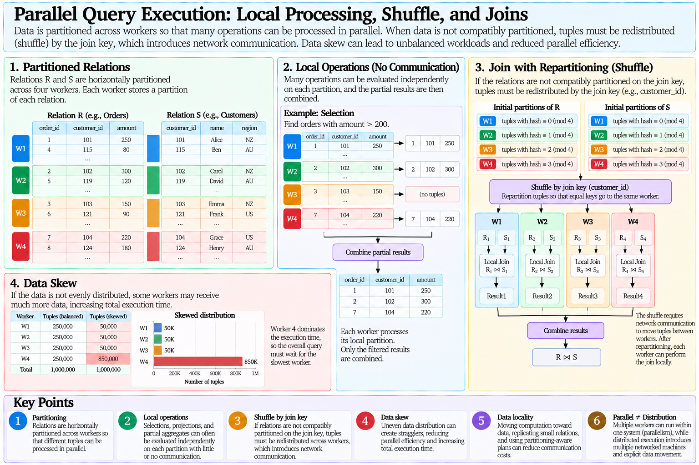{#fig-parallel-query-execution}

## Communication Cost

On one machine, the simplified cost models used earlier emphasized page I/O and memory.

In a distributed environment, another term becomes important:

$$
C_{\text{network}}.
$$

A simplified distributed cost model can therefore be written as

$$
C
=
C_{\text{local I/O}}
+
C_{\text{CPU}}
+
C_{\text{network}}
+
C_{\text{coordination}}.
$$

Moving a large relation across the network may dominate the cost of a distributed query.

This changes optimization decisions.

An algorithm that is attractive when all data is local may become unattractive when it requires substantial data transfer.

Thus,

$$
\text{Local Query Cost}
\neq
\text{Distributed Query Cost}.
$$

## Data Locality

A central goal of distributed query processing is to move computation toward data when possible rather than moving large quantities of data unnecessarily.

Suppose relation $R$ is very large and relation $S$ is small.

Instead of redistributing both relations, the system might send copies of $S$ to the nodes holding partitions of $R$.

Each node computes

$$
R_i\bowtie S
$$

locally.

Conceptually,

$$
\text{Small Relation}
\rightarrow
\text{Replicate}
\rightarrow
\text{Local Joins with Large Partitions}.
$$

This is often described as a broadcast-style join strategy.

Whether it is beneficial depends on relation sizes, number of workers, memory, and network cost.

## Semijoin Reduction

Another technique can reduce the amount of data transferred for a distributed join.

Suppose relation $R$ is located at site $A$ and relation $S$ at site $B$, with a join on attribute $K$.

Instead of immediately transferring all of $R$ or $S$, site $A$ can send only the relevant join-key projection:

$$
\pi_K(R).
$$

Site $B$ uses those keys to identify tuples of $S$ that can participate in the join.

Conceptually,

$$
S'
=
S\ltimes R,
$$

where $\ltimes$ denotes a semijoin.

Only the reduced relation $S'$ may then need to be transferred.

The purpose is

$$
\text{Small Key Information}
\rightarrow
\text{Filter Remote Data}
\rightarrow
\text{Reduce Network Transfer}.
$$

The extra processing is worthwhile only when the reduction in communication exceeds its additional cost.

## Data Skew

Parallel execution assumes that work can be divided reasonably evenly.

Real data frequently violates this assumption.

Suppose a relation is partitioned among four workers:

$$
\begin{aligned}
T(R_1)&=250{,}000,\\
T(R_2)&=250{,}000,\\
T(R_3)&=250{,}000,\\
T(R_4)&=250{,}000.
\end{aligned}
$$

The distribution is balanced.

Now suppose a skewed partitioning produces

$$
\begin{aligned}
T(R_1)&=50{,}000,\\
T(R_2)&=50{,}000,\\
T(R_3)&=50{,}000,\\
T(R_4)&=850{,}000.
\end{aligned}
$$

Even though the total number of tuples is unchanged, worker 4 dominates completion time.

If the query must wait for every worker,

$$
T_{\text{parallel}}
\approx
\max_i T_i
+
\text{overhead}.
$$

Thus,

$$
\text{Parallelism}
\neq
\text{Balanced Parallelism}.
$$

Data skew can turn nominally parallel execution into a workload dominated by one or a few workers.

## Sources of Skew

Skew can arise from uneven base data, poor partitioning functions, highly frequent key values, or intermediate results whose distributions differ from the original relations.

For example, hashing normally distributes many distinct values effectively, but if a join key contains one extremely frequent value, all tuples containing that value may still map to the same partition.

Therefore,

$$
\text{Good Hash Function}
\neq
\text{Guaranteed Balanced Workload}.
$$

The data distribution itself matters.

This connects distributed execution back to the statistical issues encountered in query optimization.

## Partitioning and Query Optimization

Partitioning is a physical property that can affect the cost of future operations.

Suppose two relations are already partitioned on their join key.

The optimizer may exploit this property and avoid repartitioning.

Another plan producing the same logical relations but destroying useful partitioning may require a later shuffle.

Thus,

$$
\text{Logical Equivalence}
\neq
\text{Equivalent Distribution Properties}.
$$

This is analogous to the earlier concept of interesting orders.

Ordering can be a useful physical property on one machine.

Partitioning becomes an additional useful physical property in parallel and distributed execution.

## Replication

Partitioning divides data across locations.

**Replication** creates multiple physical copies of logical data.

If relation $R$ has replicas

$$
R^{(1)},R^{(2)},\ldots,R^{(k)},
$$

the system may use different replicas to serve different requests or provide resilience against node failures.

Replication can improve read locality and availability, but modifications create a coordination problem.

A write to the logical item may need to be reflected across several physical replicas.

Therefore,

$$
\text{Logical Item}
\neq
\text{Single Physical Copy}.
$$

Replication introduces a trade-off:

$$
\text{More Replicas}
\rightarrow
\text{Potentially Better Read Availability and Locality}
$$

but also

$$
\text{More Replicas}
\rightarrow
\text{More Write Coordination}.
$$

## Partitioning and Replication Are Different

Partitioning and replication solve different problems.

Partitioning distributes different portions of the data:

$$
R
=
R_1\cup R_2\cup\cdots\cup R_p.
$$

Replication stores additional copies:

$$
R
\rightarrow
R^{(1)},R^{(2)},\ldots,R^{(k)}.
$$

A system can use both simultaneously.

For example, a database may be horizontally partitioned across nodes while maintaining replicas of each partition.

Therefore,

$$
\text{Partitioning}
\neq
\text{Replication}.
$$

## Distributed Databases

A **distributed database** contains logically related data whose physical storage or processing spans multiple networked sites.

The goal is often to provide a coherent database abstraction despite physical distribution.

Distribution introduces several additional questions:

- Where is each data item located?
- Which node should execute each operation?
- When should data move between nodes?
- How should replicated data be coordinated?
- What happens when one participant fails while others remain operational?
- How can a transaction involving several sites reach one outcome?

These problems do not arise in the same form when one DBMS instance controls all relevant state.

## Distributed Query Processing

Consider a query joining relation $R$ stored at site $A$ with relation $S$ stored at site $B$:

$$
R\bowtie S.
$$

Several strategies may be possible.

The system could transfer $R$ to $B$.

It could transfer $S$ to $A$.

It could repartition both relations across several sites.

It could reduce one relation through filtering or a semijoin before transfer.

It could move both to a third execution site.

The optimizer must therefore consider not only relational and physical operators but also **data placement**.

Conceptually,

$$
\text{Distributed Plan}
=
\text{Operator Choices}
+
\text{Data-Movement Choices}.
$$

Network communication becomes part of physical query planning.

## Local and Global Transactions

A **local transaction** accesses resources controlled by one database participant.

A **distributed transaction** involves resources managed by more than one participant.

Suppose transaction $T$ updates databases at sites $A$ and $B$.

Locally, each site may be capable of committing or aborting its own work.

But transaction $T$ requires one global outcome:

$$
\text{Commit at }A
\land
\text{Commit at }B
$$

or

$$
\text{Abort at }A
\land
\text{Abort at }B.
$$

It would be unacceptable for the transaction to produce

$$
\text{Commit at }A
\land
\text{Abort at }B.
$$

Thus,

$$
\text{Local Atomicity}
\neq
\text{Global Atomicity}.
$$

A coordination protocol is required.

## Distributed Commit

The distributed commit problem asks how multiple participants can agree on one transaction outcome despite communication and failure.

A classical protocol for this purpose is **Two-Phase Commit (2PC)**.

The protocol involves a **coordinator** and a set of **participants**.

The two conceptual phases are

$$
\text{Prepare}
\rightarrow
\text{Commit or Abort Decision}.
$$

In the first phase, the coordinator asks participants whether they are prepared to commit.

A participant that votes to commit must reach a state in which it can later honour that decision even if failures occur.

In the second phase, the coordinator determines the global outcome and communicates it to the participants.

## Two-Phase Commit: Phase 1

Suppose transaction $T$ involves participants

$$
P_1,P_2,\ldots,P_n.
$$

The coordinator sends a prepare request:

$$
C
\rightarrow
\{P_1,P_2,\ldots,P_n\}.
$$

Each participant determines whether it can commit its local portion.

It returns a vote:

$$
vote_i
\in
\{\text{YES},\text{NO}\}.
$$

If participant $P_i$ votes `YES`, it must preserve enough durable state to remain prepared while waiting for the global decision.

Conceptually,

$$
\text{YES Vote}
\rightarrow
\text{Prepared State}.
$$

The participant cannot simply forget the transaction after promising that it can commit.

## Two-Phase Commit: Phase 2

If every required participant votes `YES`, the coordinator can decide

$$
\text{GLOBAL COMMIT}.
$$

If any required participant votes `NO`, the coordinator decides

$$
\text{GLOBAL ABORT}.
$$

The coordinator records the decision and sends it to the participants.

Conceptually,

$$
\begin{aligned}
\forall i,\ vote_i=\text{YES}
&\rightarrow
\text{COMMIT},\\
\exists i,\ vote_i=\text{NO}
&\rightarrow
\text{ABORT}.
\end{aligned}
$$

Participants then complete their local transaction according to the global decision.

{#fig-two-phase-commit}

## The Blocking Limitation of Two-Phase Commit

Two-phase commit provides a mechanism for reaching a coordinated transaction outcome, but it introduces an important limitation.

Suppose participant $P_1$ has voted `YES` and entered the prepared state.

Before it receives the final decision, the coordinator becomes unavailable.

Participant $P_1$ cannot safely decide independently whether to commit or abort because either decision could contradict the global outcome.

It may therefore have to wait until the decision can be recovered.

Conceptually,

$$
\text{Prepared}
+
\text{Coordinator Unavailable}
\rightarrow
\text{Participant May Block}.
$$

This is the classical blocking limitation of two-phase commit.

The protocol coordinates atomic commitment; it does not eliminate the consequences of partial failures.

## Two-Phase Commit Is Not Two-Phase Locking

Two different mechanisms encountered in these notes contain the phrase "two-phase."

**Two-Phase Locking (2PL)** is a concurrency-control protocol:

$$
\text{Growing Lock Phase}
\rightarrow
\text{Shrinking Lock Phase}.
$$

Its purpose is related to conflict serializability.

**Two-Phase Commit (2PC)** is a distributed atomic-commit protocol:

$$
\text{Prepare}
\rightarrow
\text{Global Decision}.
$$

Its purpose is to coordinate one transaction outcome across multiple participants.

Therefore,

$$
\text{2PL}
\neq
\text{2PC}.
$$

The similarity in terminology does not imply similarity in function.

## Parallelism, Distribution, and Correctness

Parallel and distributed execution extend rather than replace the database concepts developed earlier.

Relational algebra still describes logical operations.

Physical query execution still requires algorithms.

The optimizer still estimates costs.

Transactions still require correctness.

But physical distribution introduces additional dimensions:

$$
\begin{aligned}
\text{Query Execution}
&\rightarrow
\text{Data Placement and Communication},\\
\text{Optimization}
&\rightarrow
\text{Network and Parallel Costs},\\
\text{Transactions}
&\rightarrow
\text{Cross-Node Coordination},\\
\text{Recovery}
&\rightarrow
\text{Partial Failure and Distributed State}.
\end{aligned}
$$

The database abstraction remains logical, while the implementation problem becomes distributed.

## PostgreSQL Context

PostgreSQL can use parallel execution for suitable operations within a database instance, allowing multiple worker processes to participate in portions of a query plan.

This provides a useful concrete setting for observing ideas such as parallel scans, parallel joins, and partial aggregation.

However,

$$
\text{PostgreSQL Parallel Query}
\neq
\text{Distributed Database System}.
$$

Parallel execution within one PostgreSQL instance should not be confused with partitioning one logical database across independent networked database nodes.

The theoretical treatment in this section is therefore broader than the PostgreSQL implementation required for the practical part of these notes.

## From Distribution to Information Integration

A distributed database assumes that physically separated data participates in a coordinated database architecture.

A different problem appears when independently designed and independently controlled data sources must be used together.

Two systems may describe the same customer using different identifiers.

They may represent dates, currencies, addresses, or product categories differently.

Their schemas may use different structures and terminology.

Neither system may have been designed with the other in mind.

This is not merely a problem of moving tuples between nodes.

It is a problem of reconciling **meaning**.

Thus,

$$
\text{Distributed Database}
\neq
\text{Information Integration}.
$$

The next section examines how heterogeneous and autonomous data sources can be mapped, reconciled, queried, and traced within an integrated view.


# References

::: {#refs}
:::