# Introduction

Programming provides a way to express computational processes in a form that a computer can execute. A computational problem begins with some input, applies a sequence of well-defined operations, and produces an output. The nature of the input and output depends on the problem: they may consist of numbers, text, images, measurements, records, or more complex structures.

An **algorithm** describes the finite sequence of steps used to perform this transformation. It specifies what must be done without necessarily prescribing how those steps are expressed in a particular programming language. A **program** is a concrete representation of one or more algorithms, together with the data and supporting logic required for their execution.

The relationship can be represented schematically as:

$$
\text{Input}
\longrightarrow
\text{Algorithm}
\longrightarrow
\text{Output}.
$$

For example, consider the problem of finding the largest measurement in a collection. The input is a sequence of measurements, the algorithm examines the values while maintaining the largest value encountered so far, and the output is the maximum measurement. The same algorithmic idea can be implemented in different programming languages and executed on different machines.

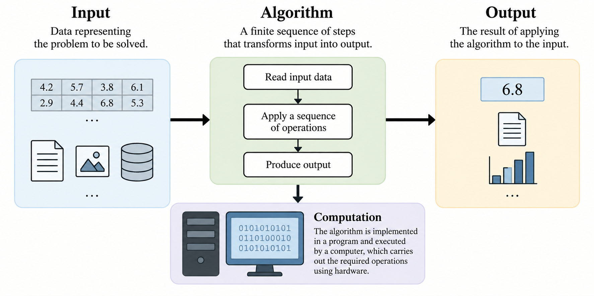{#fig-computational-process}

Figure @fig-computational-process illustrates this general relationship. The algorithm provides the logical procedure, while computation refers to carrying out the operations described by that procedure. In practical computing systems, those operations are ultimately executed by hardware, although programming languages provide abstractions that allow programs to be expressed without working directly with machine instructions.

## Python as a Programming Language

Python is a high-level, general-purpose programming language. It provides abstractions for representing data, expressing computations, organising programs, and building larger software systems. The language includes a relatively small core together with a large standard library and an extensive ecosystem of external packages.

Python programs are written as source code. A source file conventionally uses the `.py` extension and contains statements that can define objects, perform computations, control execution, define functions and classes, or interact with external resources.

For example:

```python
measurements = [4.2, 5.7, 3.8, 6.1]
largest = max(measurements)

print(largest)
```

The source code describes the computation, but it is not executed directly by the processor in this form. Python implementations provide the machinery required to interpret the language and execute its instructions. This separation allows the programmer to work with concepts such as numbers, strings, functions, collections, and objects rather than processor instructions and memory addresses.

Python can be used interactively, where expressions and statements are evaluated as they are entered, or through scripts containing a sequence of instructions to be executed. Interactive execution is useful for exploration and experimentation, while scripts provide a persistent and reproducible representation of a computation. Both forms use the same language and follow the same underlying object model.

The usefulness of Python does not come only from its syntax. Much of its behaviour follows from a small number of underlying ideas: values are represented by objects, names refer to those objects, operations are defined by their types, and larger abstractions are constructed by combining objects and behaviours. Understanding these ideas is more important than memorising individual language constructs.

# Objects, Types, and Names

A useful starting point for understanding Python is that computation operates on **objects**. Numbers, strings, lists, functions, classes, modules, and many other entities manipulated by a Python program are represented as objects.

Every object has three fundamental properties:

- an **identity**, which distinguishes it from other objects during its lifetime;
- a **type**, which determines the operations and behaviour supported by the object;
- a **value**, representing the information associated with the object.

Consider:

```python
temperature = 21.5
```

It is tempting to describe this statement by saying that a variable called `temperature` contains the value `21.5`. Although convenient in simple examples, that description becomes misleading once aliasing, mutability, function arguments, and container objects are considered.

A more accurate model is that Python creates or obtains an object representing the floating-point value `21.5` and binds the name `temperature` to that object:

$$
\texttt{temperature}
\longrightarrow
\texttt{float object representing }21.5.
$$

The assignment statement therefore establishes a relationship between a **name** and an **object**.

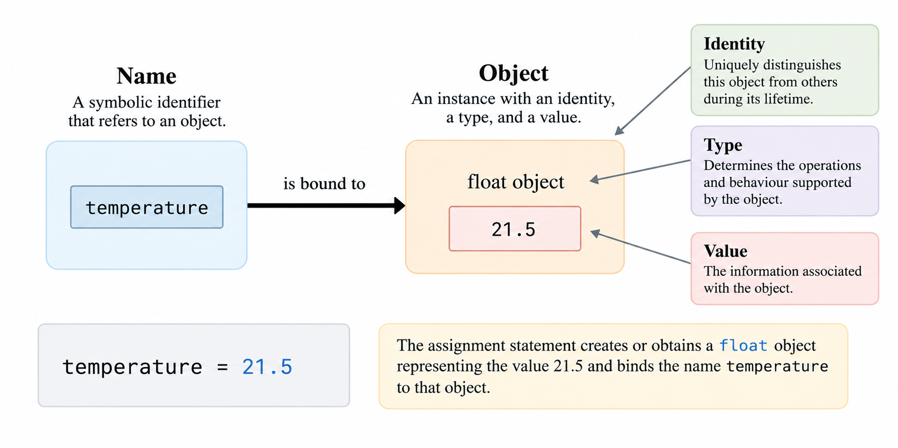{#fig-name-object-binding}

This distinction is fundamental because names and objects have different roles. A name belongs to a namespace and can later be bound to another object. The object exists independently of the particular name used to access it.

For example:

```python
temperature = 21.5
temperature = 18.0
```

The second assignment does not modify the floating-point object representing `21.5`. Instead, the name `temperature` is rebound to another object:

$$
\begin{aligned}
\texttt{temperature}
&\longrightarrow 21.5
\\[4pt]
&\downarrow
\\[-2pt]
\texttt{temperature}
&\longrightarrow 18.0.
\end{aligned}
$$

This behaviour is especially important because many Python objects are immutable: once created, their value cannot be changed. Reassigning a name that refers to an immutable object therefore changes the binding, not the object itself.

## Dynamic Typing

The type belongs to the object rather than to the name. This is the basis of Python's **dynamic typing**.

A name can therefore refer to objects of different types at different points during execution:

```python
result = 42
result = 3.14
result = "complete"
```

The name `result` has not changed its own type. Rather, it has successively been bound to an `int`, a `float`, and a `str` object.

The type of an object can be inspected with `type()`:

```python
value = 42

type(value)
```

which reports `int`.

Types are important because they determine the operations that an object supports and the meaning of those operations. Addition, for example, has different behaviour depending on the operands:

```python
2 + 3
"data" + "base"
```

The first expression performs numerical addition, while the second performs string concatenation. The `+` operator does not have a single meaning independent of its operands; its behaviour is determined by their types.

Python provides several fundamental built-in types. Among those used throughout these notes are:

| Type | Purpose | Mutable |
|:---:|:---:|:---:|
| `bool` | Boolean values | No |
| `int` | Integer numbers | No |
| `float` | Floating-point numbers | No |
| `complex` | Complex numbers | No |
| `str` | Text | No |
| `list` | Mutable sequence | Yes |
| `tuple` | Immutable sequence | No |
| `dict` | Key-value mapping | Yes |
| `set` | Set of distinct objects | Yes |
| `frozenset` | Immutable set | No |

The distinction between mutable and immutable objects will become important throughout the discussion of Python. It affects assignment, function calls, copying, hashing, and the behaviour of data structures.

## Assignment and Aliasing

Because assignment binds names to objects, more than one name can refer to the same object. This situation is known as **aliasing**.

Consider:

```python
alpha = [1, 2, 3]
beta = alpha
```

After the second assignment, no second list has been created. Both names refer to the same list:

$$
\begin{aligned}
\texttt{alpha} &\searrow\\
                 & [1,2,3]\\
\texttt{beta}  &\nearrow
\end{aligned}
$$

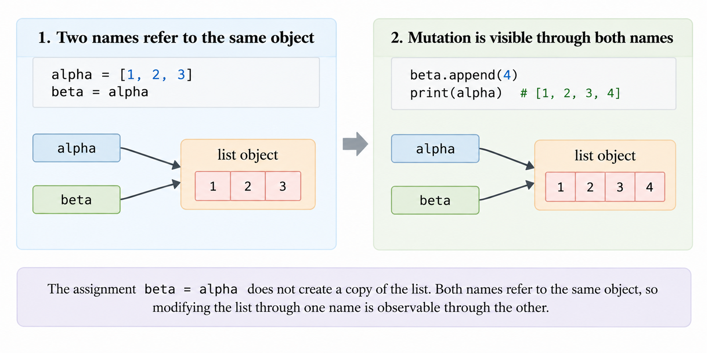{#fig-python-aliasing}

The consequence becomes visible when the object is modified:

```python
beta.append(4)

print(alpha)
```

which produces:

```text
[1, 2, 3, 4]
```

The assignment to `beta` did not copy the list. Since `alpha` and `beta` refer to the same mutable object, a mutation performed through one name is observable through the other.

This must be distinguished from **rebinding**:

```python
beta = beta + [5]
```

The expression on the right creates a new list, after which `beta` is rebound to that new object. The original list remains associated with `alpha`.

The difference is therefore:

$$
\boxed{
\text{mutation changes an object}
\qquad
\text{whereas}
\qquad
\text{assignment changes a binding}.
}
$$

This distinction is one of the central ideas in Python's object model. It will reappear when considering mutable containers, function arguments, copying, class instances, and data structures.

## Identity and Equality

Aliasing introduces an important distinction between two different questions that can be asked about objects:

1. Are two names referring to the same object?
2. Do two objects represent equivalent values?

Python provides different operators for these questions. The operators `is` and `is not` compare **identity**, while `==` and `!=` compare **equality**.

Consider two independently created lists:

```python
alpha = [1, 2, 3]
beta = [1, 2, 3]
```

The lists contain the same values, so:

```python
alpha == beta
```

evaluates to `True`. However:

```python
alpha is beta
```

evaluates to `False`, because `alpha` and `beta` refer to two distinct list objects.

The distinction can be expressed as:

$$
\text{identity}
\neq
\text{equality}.
$$

Identity concerns the object itself. Equality concerns whether two objects are considered equivalent according to the semantics of their types.

The situation changes if one name is assigned directly to the other:

```python
alpha = [1, 2, 3]
beta = alpha
```

Now:

```python
alpha is beta
```

evaluates to `True`, because both names refer to the same object. Since an object is also equal to itself under the usual equality semantics, `alpha == beta` is also `True`.

The two cases can therefore be distinguished conceptually as:

$$
\begin{aligned}
\texttt{alpha == beta}
&\rightarrow
\text{equivalent values},
\\
\texttt{alpha is beta}
&\rightarrow
\text{same object}.
\end{aligned}
$$

For most value comparisons, equality is the relevant relation. Identity testing is appropriate when the program specifically needs to determine whether two references designate the same object. A common example is comparison with `None`:

```python
if result is None:
    ...
```

Here the intention is not to ask whether `result` has a value equivalent to `None`, but whether it refers to the particular object used by Python to represent the absence of a value.

This distinction becomes even more important with user-defined classes. The meaning of equality can be defined as part of the behaviour of a type, whereas identity remains a property of the individual object. Equality will therefore be revisited when the Python object model and special methods are considered in greater detail.

## Mutability and Immutability

The effect of aliasing depends strongly on whether the referenced object is **mutable** or **immutable**.

A mutable object can change its state after it has been created. Lists, dictionaries, and sets are common examples. An immutable object cannot change its value after creation. Numbers, strings, tuples, and frozensets are examples of immutable built-in types.

Consider a list:

```python
values = [10, 20, 30]
```

The operation:

```python
values.append(40)
```

changes the existing list object. The binding of the name `values` does not need to change:

$$
\texttt{values}
\longrightarrow
[10,20,30]
$$

becomes:

$$
\texttt{values}
\longrightarrow
[10,20,30,40].
$$

The object has been mutated.

Now consider an integer:

```python
count = 10
count = count + 1
```

An integer object cannot be changed from $10$ into $11$. The expression on the right-hand side is evaluated first, producing an integer object representing $11$. The name `count` is then rebound to that object.

Conceptually:

$$
\texttt{count}
\longrightarrow
10
$$

is replaced by:

$$
\texttt{count}
\longrightarrow
11.
$$

The integer object representing $10$ has not been modified.

This distinction explains why superficially similar operations may have different consequences when aliases exist.

For example:

```python
alpha = [1, 2]
beta = alpha

alpha.append(3)
```

Since the list is mutable, both names still refer to the modified object:

```text
alpha -> [1, 2, 3]
beta  -> [1, 2, 3]
```

By contrast:

```python
alpha = 10
beta = alpha

alpha = alpha + 1
```

does not alter the object to which `beta` refers. Instead, `alpha` is rebound:

```text
alpha -> 11
beta  -> 10
```

Mutability is therefore not simply a property used to classify built-in types. It has direct consequences for how state changes propagate through a program.

An important subtlety is that the immutability of a container does not imply that every object referenced by the container is itself immutable. A tuple, for example, cannot have its references replaced after creation, but it may contain a mutable object:

```python
record = ("sensor-01", [21.4, 21.7])
record[1].append(22.0)
```

The tuple itself has not been modified: it still refers to the same string and the same list. The list contained within it, however, is mutable and has changed.

Thus, immutability concerns the state of the object under consideration, not necessarily the state of every object reachable from it.

## Copying Objects

Aliasing is useful when several parts of a program are intended to operate on the same object. In other situations, independent state is required.

Suppose an existing collection is used as the starting point for another collection:

```python
original = [10, 20, 30]
working = original
```

This does not create an independent list. The assignment creates another reference to the same object:

$$
\begin{aligned}
\texttt{original} &\searrow\\
                   &[10,20,30]\\
\texttt{working}  &\nearrow
\end{aligned}
$$

Consequently:

```python
working.append(40)
```

also changes what is observed through `original`.

If an independent outer list is required, a new list can be constructed:

```python
working = list(original)
```

or, equivalently for a list:

```python
working = original.copy()
```

Now `original` and `working` refer to distinct list objects. Adding or removing an element from one list does not change the other.

For flat collections containing immutable elements, this distinction is often sufficient. Nested mutable structures reveal a deeper issue.

Consider:

```python
original = [
    ["A", 10],
    ["B", 20],
]

working = original.copy()
```

Two list objects now exist at the outer level, but their elements still refer to the same inner lists.

The structure is conceptually:

$$
\begin{aligned}
\texttt{original} &\longrightarrow
\text{outer list}_1
\searrow
\\
&&
\text{inner objects}
\\
\texttt{working} &\longrightarrow
\text{outer list}_2
\nearrow
\end{aligned}
$$

This is a **shallow copy**. The outer container has been duplicated, but the objects referenced by that container have not.

Therefore:

```python
working[0][1] = 99
```

also changes:

```python
original[0]
```

because:

```python
working[0] is original[0]
```

is `True`.

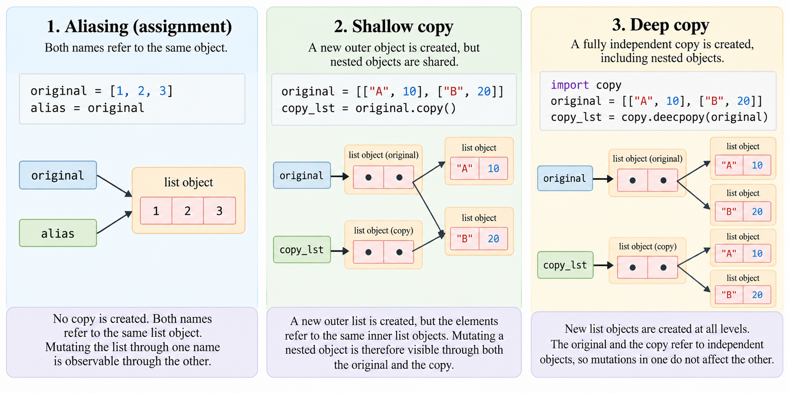{#fig-python-copying}

When the nested objects must also be independent, a **deep copy** may be required. Python provides this operation through the `copy` module:

```python
import copy

working = copy.deepcopy(original)
```

A deep copy recursively constructs independent copies of the objects contained within the structure rather than merely duplicating the outer container.

The three situations can be summarised as:

$$
\begin{aligned}
\text{assignment}
&\rightarrow
\text{same object},
\\
\text{shallow copy}
&\rightarrow
\text{new outer object, shared nested objects},
\\
\text{deep copy}
&\rightarrow
\text{independent copied structure}.
\end{aligned}
$$

Deep copying should not be understood as a universally preferable form of copying. Sharing objects can be intentional and efficient, while duplicating an entire object structure may be unnecessary or inappropriate. The relevant question is whether the state represented by the objects is intended to be shared.

The distinction between references and copies will become particularly important when working with nested containers and data structures. Many Python containers are **referential structures**: they store references to objects rather than embedding independent copies of those objects. Understanding what is copied and what remains shared is therefore necessary for reasoning correctly about their behaviour.

# Expressions and Operators

Objects become useful in a computation through the operations that can be performed on them. An **expression** combines objects, names, literals, operators, and function calls to produce a value.

For example:

```python
subtotal = price * quantity
```

contains the expression:

```python
price * quantity
```

which is evaluated before the resulting object is bound to the name `subtotal`.

The meaning of an operator depends on the types of its operands. The expression:

```python
2 + 3
```

performs numerical addition, while:

```python
"data" + "science"
```

performs string concatenation.

This is not merely syntactic convenience. Operators are part of the behaviour provided by types. Python uses a common notation for operations that may have different meanings for different kinds of objects.

Expressions may combine several operations:

```python
result = a + b * c
```

In such cases, Python applies a defined operator precedence. Multiplication is evaluated before addition, so the expression is interpreted as:

```python
result = a + (b * c)
```

rather than:

```python
result = (a + b) * c
```

Explicit parentheses should be used when they clarify the intended grouping, even when the default precedence would produce the same result.

Operators can broadly express arithmetic, comparison, identity, membership, and logical relationships. Their detailed behaviour will be introduced together with the types and control structures for which they are relevant rather than treated as an isolated catalogue of syntax.

This is particularly useful for Boolean expressions. Conditions such as:

```python
temperature > 30
```

or:

```python
value is None
```

do not merely perform computations; they produce Boolean results that can determine which parts of a program are executed. This provides the connection between expressions and **control flow**, which determines how execution proceeds through a program.

## Boolean Expressions and Logical Operators

Many computations require decisions rather than only the production of numerical or textual values. A program may need to determine whether a measurement exceeds a threshold, whether a collection contains an element, or whether several conditions hold simultaneously.

These decisions are expressed through Boolean values. Python provides the type `bool`, whose two possible values are:

```python
True
False
```

Comparison operators produce Boolean results. For example:

```python
temperature = 28.5

temperature > 25
```

evaluates to `True`, while:

```python
temperature < 20
```

evaluates to `False`.

The usual ordering comparisons are:

| Operator | Meaning |
|:---:|:---:|
| `a < b` | $a$ is less than $b$ |
| `a <= b` | $a$ is less than or equal to $b$ |
| `a > b` | $a$ is greater than $b$ |
| `a >= b` | $a$ is greater than or equal to $b$ |
| `a == b` | $a$ and $b$ are equal |
| `a != b` | $a$ and $b$ are not equal |

As discussed previously, `is` and `is not` answer a different question: they compare object identity rather than value equality.

Python also supports chained comparisons. A mathematical condition such as:

$$
0 \leq x < 1
$$

can be written directly as:

```python
0 <= x < 1
```

This expresses the intended relationship more naturally than writing the two comparisons separately.

More complex conditions can be constructed with the logical operators `not`, `and`, and `or`.

For propositions $P$ and $Q$, their behaviour can be summarised by the following truth table:

| $P$ | $Q$ | `P and Q` | `P or Q` |
|:---:|:---:|:---:|:---:|
| `False` | `False` | `False` | `False` |
| `False` | `True` | `False` | `True` |
| `True` | `False` | `False` | `True` |
| `True` | `True` | `True` | `True` |

Negation reverses the truth value:

| $P$ | `not P` |
|:---:|:---:|
| `False` | `True` |
| `True` | `False` |

These operators allow conditions to represent the actual logical requirements of a problem. For example:

```python
temperature > 20 and temperature < 30
```

requires both comparisons to hold, while:

```python
status == "warning" or status == "critical"
```

requires at least one of them.

Logical expressions should generally be written to make the underlying condition evident. Parentheses can be useful when several operators are combined, even when Python's precedence rules would make them unnecessary:

```python
(is_valid and has_data) or use_default
```

The purpose of such expressions is not merely to produce `True` or `False`. They provide the logical basis for controlling which computations a program performs.

### Truth Values

Conditions in Python do not always require an explicit `bool` object. Objects of other types can be evaluated in a Boolean context.

Several common values are considered false, including numeric zero, `None`, and empty containers:

```python
0
0.0
""
[]
{}
set()
None
```

Nonzero numbers and nonempty containers are generally considered true.

This allows conditions such as:

```python
records = [...]

if records:
    ...
```

rather than:

```python
if len(records) > 0:
    ...
```

The first form expresses the relevant question directly: whether `records` contains data.

Truth-value testing should nevertheless be used when its meaning is clear. Different states may need to be distinguished explicitly. For example, an empty collection and `None` may both evaluate as false while representing different situations in a program.

### Short-Circuit Evaluation

The operators `and` and `or` are evaluated from left to right and use **short-circuit evaluation**. Python evaluates the second operand only when it is necessary to determine the result.

For:

```python
P and Q
```

if `P` is false, the complete expression cannot be true, regardless of `Q`. Therefore `Q` does not need to be evaluated.

Similarly, for:

```python
P or Q
```

if `P` is true, the complete expression is already true and `Q` does not need to be evaluated.

This behaviour has practical consequences. Consider a search through a sequence:

```python
index = 0

while index < len(data) and data[index] != target:
    index += 1
```

The first condition verifies that `index` is valid before the expression attempts to access:

```python
data[index]
```

When `index == len(data)`, the first condition is false. Because `and` short-circuits, the second condition is not evaluated, preventing an invalid access beyond the end of the sequence.

The order of the conditions is therefore significant. Writing:

```python
while data[index] != target and index < len(data):
    ...
```

would not provide the same protection, because `data[index]` would be evaluated first.

Short-circuit evaluation is consequently more than an optimisation. It can be part of the correctness of an expression.

# Control Flow

A program consisting only of expressions evaluated sequentially would follow the same path every time it executes. Most computations require greater flexibility: some operations should occur only under certain conditions, while others must be repeated until a task is complete.

**Control flow** determines the order in which statements are executed.

Python provides two fundamental mechanisms for changing sequential execution:

- **selection**, which chooses among alternative paths;
- **iteration**, which repeats a computation.

These mechanisms are expressed primarily through conditional statements and loops.

Python uses indentation to define blocks of statements. Indentation is therefore part of the structure of the language rather than merely a formatting convention.

For example:

```python
if temperature > 30:
    alert = True
    message = "High temperature"

log_temperature(temperature)
```

The two indented statements belong to the conditional block. The final statement lies outside it and is executed regardless of the condition.

## Conditional Execution

An `if` statement allows execution to depend on a condition evaluated at runtime.

Consider a simple classification:

```python
if temperature > 30:
    status = "high"
else:
    status = "normal"
```

Exactly one of the two assignments is performed. The selected path depends on the Boolean value of:

```python
temperature > 30
```

More than two mutually exclusive cases can be represented with `elif`:

```python
if temperature < 10:
    status = "low"
elif temperature <= 30:
    status = "normal"
else:
    status = "high"
```

The conditions are evaluated in order. Once one evaluates to true, its corresponding block is executed and the remaining alternatives are skipped.

This ordering matters whenever conditions overlap. Consider:

```python
if score >= 50:
    grade = "pass"
elif score >= 80:
    grade = "distinction"
```

A score of `90` satisfies the first condition, so the second condition is never reached. The intended classification requires the more restrictive condition first:

```python
if score >= 80:
    grade = "distinction"
elif score >= 50:
    grade = "pass"
else:
    grade = "fail"
```

Conditional logic therefore involves more than writing syntactically valid comparisons. The branches must partition the relevant cases in a way that represents the problem correctly.

Several independent `if` statements should also be distinguished from a single `if`–`elif`–`else` chain. With independent statements:

```python
if condition_a:
    ...

if condition_b:
    ...
```

both blocks may execute. In an `if`–`elif` chain, at most one branch is selected.

This difference reflects two different logical structures: independent conditions versus mutually exclusive alternatives.

## Iteration

Many computational tasks involve applying an operation repeatedly. A collection may need to be processed element by element, a search may continue until a target is found, or a numerical method may iterate until a convergence criterion is satisfied.

Python provides two principal loop constructs:

```python
for
while
```

They both express repetition, but they correspond to different ways of describing when repetition should continue.

### Iteration over an Iterable

A `for` loop consumes values from an **iterable**:

```python
measurements = [4.2, 5.7, 3.8, 6.1]

for value in measurements:
    print(value)
```

The important idea is that Python's `for` loop is fundamentally an iteration over values, not a counter-based loop. During each iteration, the loop variable is bound to the next object produced by the iterable.

For example, a maximum can be computed as:

```python
measurements = [4.2, 5.7, 3.8, 6.1]

largest = measurements[0]

for value in measurements[1:]:
    if value > largest:
        largest = value
```

The loop directly expresses the operation being performed: examine each remaining measurement and update the current maximum when a larger value is encountered.

This pattern appears throughout algorithms:

$$
\boxed{
\text{initial state}
\rightarrow
\text{process next element}
\rightarrow
\text{update state}
\rightarrow
\text{repeat}.
}
$$

The variable `largest` represents the state accumulated by the computation. After each iteration, it contains the largest value encountered so far.

### Ranges and the Half-Open Convention

Some computations require positions rather than only values. Python provides `range` for generating sequences of integers suitable for iteration.

The expression:

```python
range(n)
```

represents the integers:

$$
0,1,2,\ldots,n-1.
$$

The upper bound $n$ is excluded. More generally:

```python
range(start, stop)
```

follows the half-open interval:

$$
[\text{start},\text{stop}).
$$

This convention is particularly useful for indexing. A sequence of length $n$ has valid positions:

$$
0,1,\ldots,n-1,
$$

which correspond exactly to:

```python
range(n)
```

For example:

```python
for index in range(len(data)):
    print(index, data[index])
```

There is, however, no reason to introduce an index when only the values are needed. If the position and value are both relevant, Python provides `enumerate`:

```python
for index, value in enumerate(data):
    print(index, value)
```

This expresses the intention more directly than manually managing an index.

### Condition-Controlled Iteration

A `while` loop is appropriate when repetition is governed by a condition rather than by consuming a predefined iterable:

```python
while condition:
    ...
```

The condition is evaluated before every iteration. Execution continues while it remains true.

Consider an iterative approximation in which successive estimates are computed until the change becomes sufficiently small:

```python
estimate = initial_estimate

while error > tolerance:
    estimate = update(estimate)
    error = compute_error(estimate)
```

The number of iterations is not necessarily known beforehand. Termination depends on the evolving state of the computation.

This distinguishes the two principal loop forms conceptually:

$$
\begin{aligned}
\texttt{for}
&\rightarrow
\text{iterate over values from an iterable},
\\
\texttt{while}
&\rightarrow
\text{repeat while a condition holds}.
\end{aligned}
$$

A `while` loop must eventually make progress toward making its condition false unless nontermination is intentional. Failure to update the relevant state produces an infinite loop.

For example:

```python
index = 0

while index < len(data):
    process(data[index])
    index += 1
```

terminates because `index` increases on each iteration and eventually reaches `len(data)`.

This idea of **progress toward termination** becomes important when reasoning about algorithm correctness. A loop should not only perform the intended operation during each iteration; there must also be a reason why the process eventually stops.

### Early Termination

Sometimes a loop does not need to examine every possible element. Once the required information has been obtained, continuing would perform unnecessary work.

A search is a typical example:

```python
found = False

for value in data:
    if value == target:
        found = True
        break
```

The `break` statement terminates the nearest enclosing loop immediately.

The `continue` statement has a different purpose. It terminates only the current iteration and proceeds with the next one:

```python
for value in data:
    if value < 0:
        continue

    process(value)
```

Here negative values are skipped while iteration continues over the remaining elements.

Both constructs can simplify control flow when used deliberately. Excessive use, however, can make the execution path difficult to follow. A loop should generally retain a clear termination condition and a clear purpose.

Python also allows a loop to have an `else` clause. The `else` block executes when the loop finishes normally rather than through `break`.

This is useful for searches:

```python
for value in data:
    if value == target:
        print("Target found")
        break
else:
    print("Target not found")
```

The `else` clause expresses a precise condition: the loop exhausted its iterable without encountering a `break`.

This behaviour can initially appear unusual, but it avoids maintaining a separate Boolean flag when the relevant distinction is simply whether the search terminated early.

Control structures provide the machinery for expressing algorithmic processes, but larger programs also require a way to isolate computations behind well-defined interfaces. This is the role of **functions**, which allow behaviour to be named, parameterised, reused, and composed.

# Functions

As programs grow, repeatedly expressing the same computation becomes difficult to maintain and reason about. More importantly, many computations represent meaningful operations that should be understood independently of the details required to perform them.

A **function** provides a named abstraction for such a computation. It defines an interface through which information is supplied, performs a particular operation, and may return a result.

Consider the task of computing the mean of a collection of measurements. Without a function, the calculation could be written directly wherever it is needed:

```python
mean = sum(measurements) / len(measurements)
```

If the same operation is required in several parts of a program, however, repeating the expression also repeats knowledge about how the computation is performed. A function gives that operation a name:

```python
def mean(values):
    return sum(values) / len(values)
```

The caller can then use:

```python
average = mean(measurements)
```

without depending on the internal steps of the calculation.

This separation establishes a simple interface:

$$
\text{arguments}
\longrightarrow
\text{function}
\longrightarrow
\text{return value}.
$$

A useful function therefore does more than avoid duplicated code. It isolates a coherent operation behind a defined contract: what information the function expects, what it computes, what it returns, and whether it changes any externally visible state.

## Parameters and Arguments

The names declared in a function definition are its **parameters**:

```python
def scale(value, factor):
    return value * factor
```

When the function is called:

```python
result = scale(12, 0.5)
```

the objects supplied by the caller are its **arguments**. In this call, `12` is associated with the parameter `value`, and `0.5` with `factor`.

This distinction is useful, but the more important question is how information is passed into a function.

Python's parameter passing follows the same object-and-binding model introduced earlier. A function call creates local parameter names and binds them to the objects supplied by the caller.

Suppose:

```python
measurements = [4.2, 5.7, 3.8]
```

and a function is called as:

```python
process(measurements)
```

for a definition:

```python
def process(data):
    ...
```

During the call, the local parameter `data` refers to the same list object as `measurements`:

$$
\begin{aligned}
\texttt{measurements} &\searrow\\
                       &\text{list object}\\
\texttt{data}         &\nearrow
\end{aligned}
$$

The list is not copied merely because it was passed to a function.

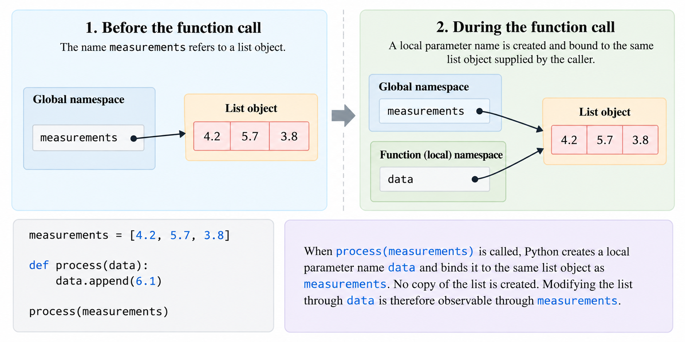{#fig-function-parameter-binding}

This model is more precise than describing Python simply as either "pass by value" or "pass by reference". The essential mechanism is **object binding**: the function receives references to objects, and its parameter names are local bindings to those objects.

The consequences follow directly from the distinction between mutation and rebinding.

Consider:

```python
def add_measurement(data, value):
    data.append(value)
```

Calling:

```python
measurements = [4.2, 5.7]
add_measurement(measurements, 3.8)
```

modifies the original list:

```text
[4.2, 5.7, 3.8]
```

because `data` and `measurements` refer to the same mutable object.

By contrast:

```python
def replace_data(data):
    data = [0.0, 0.0]
```

followed by:

```python
measurements = [4.2, 5.7]
replace_data(measurements)
```

does not replace the caller's list. The assignment changes only the local binding `data`.

The distinction is therefore the same one encountered earlier:

$$
\boxed{
\text{mutation can affect a shared object, whereas rebinding a parameter is local to the function}.
}
$$

This behaviour is not a special rule for function arguments. It follows directly from Python's general assignment semantics.

## Positional and Keyword Arguments

Arguments can be associated with parameters by position:

```python
def convert_temperature(value, scale):
    ...
```

```python
convert_temperature(20, "C")
```

Here the first argument is bound to `value` and the second to `scale`.

Python also allows arguments to be supplied by parameter name:

```python
convert_temperature(value=20, scale="C")
```

These are **keyword arguments**. They can make a call clearer when the meaning of a value would otherwise be ambiguous.

For example:

```python
compute_interval(10, 0.95, True)
```

reveals little about the meaning of the final two arguments, while:

```python
compute_interval(
    sample_size=10,
    confidence=0.95,
    corrected=True,
)
```

makes the interface considerably clearer.

Keyword arguments also allow optional parameters to be specified selectively when defaults are available.

Functions may accept a variable number of positional or keyword arguments through `*args` and `**kwargs`. Conceptually, these collect additional arguments into a tuple and a dictionary, respectively:

```python
def function(*args, **kwargs):
    ...
```

This mechanism is useful for interfaces whose number of inputs is genuinely variable or for forwarding arguments to another function. It should not be used merely to avoid defining a clear interface when the expected parameters are known.

## Default Arguments

A parameter can provide a default value:

```python
def power(base, exponent=2):
    return base ** exponent
```

The function can then be called as:

```python
power(4)
```

which uses the default value `2`, or as:

```python
power(4, 3)
```

which explicitly supplies the exponent.

Defaults are useful when one behaviour is common but alternative behaviour should remain available.

There is, however, an important consequence of Python's object model: **default argument objects are created when the function definition is evaluated, not each time the function is called**.

Consider:

```python
def collect(value, items=[]):
    items.append(value)
    return items
```

A first call:

```python
collect(1)
```

returns:

```text
[1]
```

but a subsequent call:

```python
collect(2)
```

returns:

```text
[1, 2]
```

rather than a new list containing only `2`.

The reason is that the default list is a single mutable object associated with the function definition. Calls that omit `items` repeatedly use that same object:

$$
\text{function definition}
\longrightarrow
\text{one default list object}.
$$

The usual pattern for an independently created mutable value is therefore:

```python
def collect(value, items=None):
    if items is None:
        items = []

    items.append(value)
    return items
```

Now a new list is created during each call in which no collection is supplied.

This example brings together several earlier concepts:

$$
\boxed{
\text{object lifetime}
+
\text{mutability}
+
\text{aliasing}
+
\text{function definition semantics}.
}
$$

The issue is not that lists are unsuitable as function arguments. The issue is the unintended persistence of a mutable default object between calls.

## Return Values

A function communicates a result to its caller with `return`:

```python
def square(value):
    return value * value
```

Executing `return` immediately terminates the current function call and provides the referenced object to the caller.

The returned object can then be bound to a name:

```python
result = square(5)
```

Conceptually, the result of the function call participates in assignment like any other expression:

$$
\texttt{result}
\longrightarrow
\text{object returned by }\texttt{square(5)}.
$$

A function does not need an explicit `return` statement. If execution reaches the end of the function without one, Python returns `None`.

For example:

```python
def display(value):
    print(value)
```

Calling:

```python
result = display(10)
```

prints `10`, but `result` is bound to `None`.

This distinction separates two different effects:

```python
print(value)
```

produces output, whereas:

```python
return value
```

provides an object to the caller.

Confusing these operations often leads to functions that are unnecessarily difficult to reuse. A function that computes a value can usually be composed more easily when it returns that value and leaves presentation to another part of the program.

Python functions can appear to return several values:

```python
def bounds(values):
    return min(values), max(values)
```

However, this does not return two independent objects through two separate channels. The comma constructs a tuple, so the function returns one tuple object:

```python
limits = bounds(data)
```

The common form:

```python
lower, upper = bounds(data)
```

works because the returned tuple is subsequently unpacked into two names.

## Scope and Namespaces

Functions introduce local names, which raises another question: when a name appears in an expression, how does Python determine which object it refers to?

A **namespace** associates names with objects. A **scope** determines the region of a program in which a particular namespace is directly relevant for name resolution.

Consider:

```python
threshold = 10

def classify(value):
    limit = threshold

    if value > limit:
        return "high"

    return "normal"
```

During a call to `classify`, the names `value` and `limit` belong to the function's local scope. The name `threshold`, however, is not defined locally, so Python searches an enclosing namespace and finds the global binding.

Name resolution follows nested scopes. A useful description is the **LEGB** order:

$$
\boxed{
\text{Local}
\rightarrow
\text{Enclosing}
\rightarrow
\text{Global}
\rightarrow
\text{Built-in}.
}
$$

The local scope belongs to the current function call. Enclosing scopes arise from lexically enclosing functions. Global scope corresponds to the module, while the built-in namespace contains names provided by Python such as `len`, `sum`, and `print`.

If no binding can be found through the relevant scopes, name resolution fails with a `NameError`.

Local bindings are independent of bindings with the same name in another scope:

```python
value = 100

def transform():
    value = 10
    return value
```

The assignment inside `transform` creates a local binding. It does not change the global binding:

```python
transform()  # 10
value        # 100
```

This separation is important for modular reasoning. A function should normally be understandable from its parameters, local state, and clearly identified external dependencies rather than relying on uncontrolled global state.

Python provides `global` and `nonlocal` when rebinding a name from another scope is genuinely required. Their existence is important for understanding the language, but routine function design should not depend on them unnecessarily. Explicit inputs and outputs generally make data flow easier to understand.

## Functions as Objects

Functions themselves are objects in Python. A function definition creates a function object and binds a name to it.

For example:

```python
def square(value):
    return value * value
```

establishes a relationship conceptually similar to:

$$
\texttt{square}
\longrightarrow
\text{function object}.
$$

Because functions are **first-class objects**, they can be assigned to other names:

```python
operation = square

operation(5)
```

They can also be stored in data structures, passed as arguments, and returned by other functions.

This allows behaviour itself to become part of a program's data flow.

A simple example is sorting records according to a particular component:

```python
records = [
    ("A", 3.2),
    ("B", 2.7),
    ("C", 4.1),
]

def measurement(record):
    return record[1]

ordered = sorted(records, key=measurement)
```

The `sorted` function receives another function through its `key` parameter. For each record, that function determines the value used for ordering.

The important abstraction is:

$$
\text{data}
+
\text{behaviour supplied as an argument}.
$$

A function that receives another function or returns one is commonly called a **higher-order function**.

This mechanism is widely useful because an algorithm can remain fixed while part of its behaviour is supplied by the caller. Sorting, for example, does not need a separate implementation for every possible interpretation of ordering.

### Anonymous Functions

For short operations that do not need a reusable name, Python provides `lambda` expressions.

The previous key function could be written as:

```python
ordered = sorted(records, key=lambda record: record[1])
```

A lambda creates a function object, but its body is restricted to a single expression.

This makes it useful for small, local transformations. It is not inherently preferable to a named function. When behaviour has a meaningful role, requires documentation, or becomes difficult to read as a single expression, a regular function definition is clearer.

## Closures

First-class functions become particularly useful when combined with lexical scope.

Consider a function that constructs another function:

```python
def make_multiplier(factor):
    def multiply(value):
        return value * factor

    return multiply
```

Calling:

```python
double = make_multiplier(2)
```

returns the inner function. The call to `make_multiplier` has already finished, but:

```python
double(5)
```

still produces:

```text
10
```

The returned function retains access to the binding of `factor` from the enclosing scope in which it was defined.

This combination of a function and its retained lexical environment is known as a **closure**.

Conceptually:

$$
\boxed{
\text{closure}
=
\text{function}
+
\text{captured environment}.
}
$$

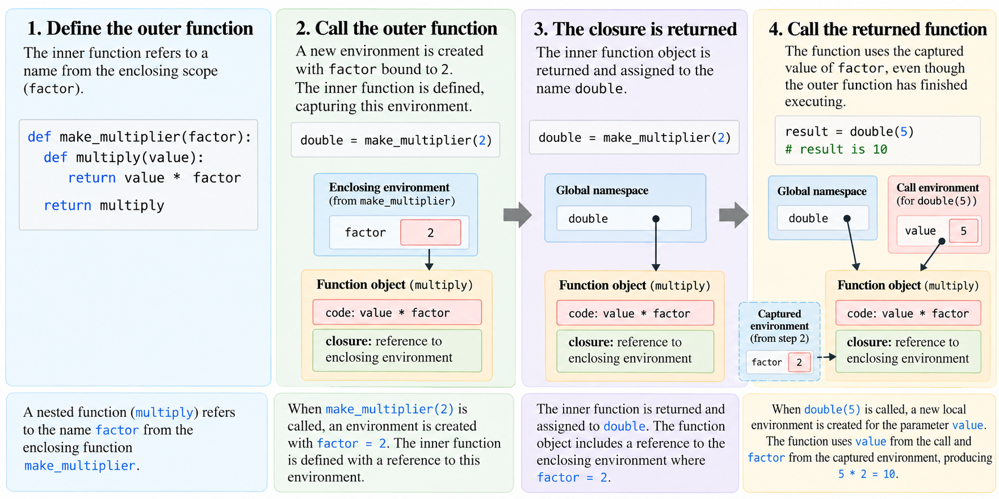{#fig-python-closure}

Closures allow behaviour to be configured without introducing global state. In the previous example, `make_multiplier(2)` and `make_multiplier(3)` can create independent functions whose behaviour depends on different captured values.

If an inner function must rebind a variable in an enclosing function rather than merely read it, Python provides the `nonlocal` statement. This is useful in some stateful closures, although explicit objects may become clearer when the amount of retained state or behaviour grows substantially.

## Side Effects and Function Design

A function may return a value, modify an existing object, perform input or output, or combine several of these behaviours. Operations that affect state outside the function's local computation are commonly called **side effects**.

For example:

```python
def square(value):
    return value * value
```

computes a result without modifying its argument or producing external output.

By contrast:

```python
def normalise_in_place(values):
    ...
```

may deliberately modify the supplied collection, while:

```python
def write_report(data, path):
    ...
```

necessarily interacts with an external resource.

Side effects are not inherently undesirable. Mutation, file operations, database access, logging, and user interaction are necessary in real programs. What matters is that the behaviour of a function is deliberate and visible through its interface and documentation.

A useful function generally has a coherent responsibility. Its inputs should be explicit, its return value should have a clear meaning, and mutations or other side effects should not be surprising.

For example, a function named:

```python
compute_mean(values)
```

would be unexpected if it also modified `values` or wrote a file. Those operations are unrelated to the abstraction suggested by the function's name.

Separating computation from presentation or external interaction often improves composability:

```python
result = compute_statistics(data)
display_statistics(result)
```

The first function can then be reused independently of how the result is displayed.

## Documentation and Type Annotations

A function's implementation describes how it performs a computation, but callers primarily need to understand its **contract**.

A docstring can document that contract:

```python
def mean(values):
    """
    Compute the arithmetic mean of a non-empty collection.

    Inputs
    ------
    values : iterable of numbers
        Values used in the calculation.

    Outputs
    -------
    float
        Arithmetic mean of the supplied values.
    """
    return sum(values) / len(values)
```

Useful documentation explains assumptions, inputs, outputs, side effects, and exceptional conditions when they are not already evident. It should not simply translate each line of implementation into prose.

Python also supports **type annotations**:

```python
def scale(value: float, factor: float) -> float:
    return value * factor
```

Annotations communicate intended types to readers and to external tools. They do not, by themselves, impose runtime type checking.

For collections, annotations can describe more structured interfaces:

```python
def normalise(values: list[float]) -> list[float]:
    ...
```

and unions can express alternatives:

```python
def find_value(...) -> int | None:
    ...
```

Type annotations therefore complement Python's dynamic typing rather than replacing it. Objects still carry their types at runtime, while annotations provide additional information about the intended interface.

A function is most useful when its interface captures a meaningful unit of behaviour while hiding details that the caller does not need to know. This principle of **abstraction** will recur throughout the notes. Data structures expose operations without requiring callers to know their internal representation, and classes extend the same idea by combining persistent state with related behaviour.

# Numeric Types

Numerical computation requires more than a generic notion of "number". Integers, real-valued approximations, and complex numbers have different mathematical properties and different computational representations. Python reflects these distinctions through several built-in numeric types.

The principal numeric types are:

| Type | Mathematical role | Representation |
|:---:|:---:|:---:|
| `int` | Integers | Arbitrary-precision integer |
| `float` | Approximation to real numbers | Fixed-precision floating point |
| `complex` | Complex numbers | Pair of floating-point components |

These types support many of the same arithmetic operators, but their internal representations and numerical behaviour differ substantially.

## Integers

Python's `int` type represents integers:

```python
count = 42
offset = -7
```

Unlike fixed-width integer types commonly found in lower-level languages, Python integers are not restricted to a predetermined range such as $[-2^{31},2^{31}-1]$. Their representation can grow as required by the magnitude of the value, subject to available memory.

For example:

```python
value = 2 ** 200
```

produces an exact integer rather than an overflow caused by exceeding a fixed machine-word size.

This does not mean that arbitrarily large integers have constant computational cost. Larger values require more memory and, eventually, more work for arithmetic operations. The distinction between the mathematical operation and its computational cost will become important when algorithm analysis is introduced.

### Positional Representation

An integer can be represented in any positional numeral system. For a base $b$, a sequence of digits

$$
d_kd_{k-1}\ldots d_1d_0
$$

represents the value

$$
N
=
\sum_{i=0}^{k} d_i b^i,
$$

where:

$$
0 \leq d_i < b.
$$

Decimal notation uses $b=10$. For example:

$$
472
=
4(10^2)+7(10^1)+2(10^0)
=
400+70+2.
$$

Computers commonly use binary representation, where $b=2$ and each digit is either $0$ or $1$. Thus:

$$
101101_2
=
1(2^5)
+
0(2^4)
+
1(2^3)
+
1(2^2)
+
0(2^1)
+
1(2^0),
$$

so:

$$
101101_2
=
32+8+4+1
=
45_{10}.
$$

Python allows integer literals to be written explicitly in several bases:

```python
binary = 0b101101
octal = 0o55
decimal = 45
hexadecimal = 0x2D
```

All four names refer to integer objects representing the same mathematical value. The notation used in the source code does not create a different numeric type.

This distinction is useful:

$$
\boxed{
\text{numeral representation}
\neq
\text{numeric value}.
}
$$

Binary, octal, decimal, and hexadecimal are different textual representations of integers, not different kinds of integer objects.

### Integer Division and Remainders

Division requires particular care because several different operations can be meant by "divide".

The `/` operator performs **true division**:

```python
27 / 4
```

and produces:

```text
6.75
```

The `//` operator performs floor division:

```python
27 // 4
```

which produces:

```text
6
```

while `%` computes the corresponding remainder:

```python
27 % 4
```

which produces:

```text
3
```

These operations are related mathematically. For integers $n$ and $m$, with $m\neq0$, define:

$$
q
=
\left\lfloor\frac{n}{m}\right\rfloor
$$

and:

$$
r
=
n-qm.
$$

Then:

$$
\boxed{
n=qm+r.
}
$$ {#eq-division-algorithm}

For:

$$
n=27,
\qquad
m=4,
$$

we obtain:

$$
q
=
\left\lfloor\frac{27}{4}\right\rfloor
=
6,
$$

and therefore:

$$
r
=
27-(6)(4)
=
3.
$$

Hence:

$$
27=(6)(4)+3.
$$

This identity explains the relationship between Python's operators:

```python
q = n // m
r = n % m
```

so that:

```python
n == q * m + r
```

holds.

The use of the floor is particularly important for negative values. Consider:

$$
n=-27,
\qquad
m=4.
$$

Since:

$$
-\frac{27}{4}=-6.75,
$$

flooring gives:

$$
q=\lfloor-6.75\rfloor=-7,
$$

not $-6$. The remainder is then:

$$
r
=
-27-(-7)(4)
=
1.
$$

Thus:

$$
-27=(-7)(4)+1.
$$

Correspondingly:

```python
-27 // 4
```

produces `-7`, while:

```python
-27 % 4
```

produces `1`.

Floor division should therefore not be understood simply as "discarding the decimal part". Truncation toward zero and flooring toward negative infinity are different operations for negative values.

The quotient-remainder relationship appears naturally in many algorithms, including cyclic indexing, divisibility tests, conversion between numeral systems, and hashing.

## Floating-Point Numbers

Integers can be represented exactly, provided sufficient memory is available. Representing arbitrary real numbers is fundamentally different.

Between any two distinct real numbers there are infinitely many other real numbers. A computer with finite memory cannot represent all of them exactly. Numerical computation therefore uses finite approximations.

Python's `float` type provides such a representation.

Typical floating-point literals include:

```python
temperature = 21.5
probability = 0.125
avogadro = 6.022e23
```

The important point is that a floating-point value should not generally be interpreted as an exact real number. It is a representable machine number used to approximate one.

### Binary Fractions

The source of many apparently surprising floating-point results becomes clearer by considering positional representation again.

A decimal fraction can be written as:

$$
0.d_1d_2d_3\ldots
=
\sum_{i=1}^{\infty} d_i10^{-i}.
$$

For example:

$$
0.125
=
1(10^{-1})
+
2(10^{-2})
+
5(10^{-3}).
$$

Binary fractions use powers of $2$ instead:

$$
0.b_1b_2b_3\ldots_2
=
\sum_{i=1}^{\infty} b_i2^{-i}.
$$

The decimal value $0.125$ has a finite binary representation:

$$
0.125
=
\frac{1}{8}
=
2^{-3}
=
0.001_2.
$$

However, many decimal fractions do not have finite binary representations. The familiar decimal value:

$$
0.1=\frac{1}{10}
$$

is one of them.

Since:

$$
10=2\cdot5,
$$

the denominator contains a factor other than $2$. Consequently, its binary fractional expansion does not terminate. A finite binary floating-point representation must therefore store an approximation to $0.1$, not the exact rational number $1/10$.

This is analogous to representing:

$$
\frac{1}{3}
$$

in decimal notation:

$$
0.333333\ldots
$$

A finite decimal representation must eventually be rounded.

### Floating-Point Representation

A floating-point number separates significant digits from scale. Conceptually, a nonzero value can be represented in the form:

$$
x
=
(-1)^s
\times
m
\times
2^e,
$$

where:

- $s$ determines the sign;
- $m$ is the significand;
- $e$ is the exponent.

The exponent determines the scale of the number, while the significand determines its precision.

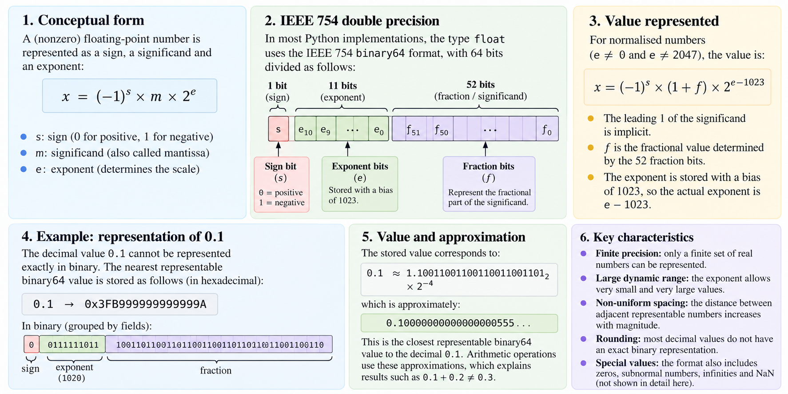{#fig-floating-point-representation}

Python floating-point arithmetic on ordinary implementations uses finite binary precision. Consequently, only a finite subset of the real numbers can be represented directly.

If the exact real value $x$ is not representable, it must be mapped to a nearby machine number:

$$
x
\longrightarrow
\operatorname{fl}(x),
$$

where $\operatorname{fl}(x)$ denotes its floating-point representation.

This approximation occurs before subsequent arithmetic is considered.

### Representation Error

The effect is visible in a familiar example:

```python
0.1 + 0.2 == 0.3
```

which evaluates to:

```text
False
```

This does not indicate an error in addition. The decimal literals themselves are converted to nearby representable binary floating-point values. Arithmetic is then performed on those approximations and rounded to another representable value.

Conceptually:

$$
\operatorname{fl}(0.1)
+
\operatorname{fl}(0.2)
$$

need not equal:

$$
\operatorname{fl}(0.3)
$$

exactly.

Inspecting the result with sufficient decimal precision reveals the difference:

```python
format(0.1 + 0.2, ".17f")
```

gives approximately:

```text
0.30000000000000004
```

The error is very small, but exact equality is a strict condition.

This is why floating-point results should generally not be compared for exact equality when rounding error may be present.

### Comparing Floating-Point Values

Suppose a computation produces $a$ and another produces $b$. Instead of requiring:

$$
a=b,
$$

we can ask whether the difference is sufficiently small:

$$
|a-b|\leq \varepsilon,
$$

where $\varepsilon$ is a tolerance appropriate to the problem.

An absolute tolerance alone can be inadequate when values vary greatly in magnitude. A difference of $10^{-6}$ may be negligible when comparing values near $10^6$ but substantial when comparing values near $10^{-7}$.

A more useful comparison combines relative and absolute tolerances. Conceptually, two values may be considered sufficiently close when:

$$
|a-b|
\leq
\max
\left(
\varepsilon_{\mathrm{rel}}
\max(|a|,|b|),
\varepsilon_{\mathrm{abs}}
\right).
$$ {#eq-floating-point-closeness}

Python's `math.isclose` provides this form of comparison:

```python
import math

math.isclose(a, b, rel_tol=1e-9, abs_tol=1e-12)
```

The tolerances should reflect the numerical problem rather than being chosen merely to force a desired result.

### Machine Precision

Because floating-point numbers are discrete, representable values have gaps between them. Near $1$, there is a smallest representable value greater than $1$.

Machine epsilon is commonly used to describe this scale. Informally, it characterises the separation between $1$ and the next larger representable floating-point number.

Python exposes information about its floating-point representation through:

```python
import sys

sys.float_info
```

including the value:

```python
sys.float_info.epsilon
```

For the usual binary64 representation, this is approximately:

$$
\varepsilon_{\text{machine}}
\approx
2.22\times10^{-16}.
$$

This value should not be interpreted as a universal tolerance for numerical comparisons. It characterises floating-point precision near $1$; an appropriate tolerance still depends on the scale and purpose of a computation.

Another important consequence is that floating-point spacing is not constant over the entire number line. As magnitude increases, the distance between adjacent representable values also increases.

Thus floating point provides a trade-off:

$$
\boxed{
\text{large dynamic range}
\quad\text{with}\quad
\text{finite relative precision}.
}
$$

### Accumulation of Rounding Error

A small representation error may become relevant when an operation is repeated many times.

Consider:

```python
total = 0.0

for _ in range(10):
    total += 0.1
```

Mathematically, the expected result is:

$$
10(0.1)=1.
$$

The computed floating-point value, however, need not be exactly $1$ because each addition operates on finite approximations.

This does not imply that floating-point arithmetic is unreliable. It means that numerical algorithms must be designed with finite precision in mind.

Python provides `math.fsum` for more accurate summation of floating-point values:

```python
import math

total = math.fsum(values)
```

The existence of such algorithms illustrates an important principle: mathematically equivalent formulations need not have equivalent numerical behaviour on a finite computer.

## Numerical Stability

Representation error is unavoidable in finite-precision arithmetic, but algorithms differ in how strongly they amplify that error.

A classic example is subtraction between nearly equal numbers. Suppose:

$$
x=1.234567
$$

and:

$$
y=1.234566.
$$

The difference is:

$$
x-y=0.000001.
$$

Most leading significant digits cancel. If $x$ and $y$ are themselves approximations, the relative error in the small difference can be much larger than the relative errors in the original values. This phenomenon is known as **catastrophic cancellation**.

A more instructive example appears in the quadratic formula. For:

$$
ax^2+bx+c=0,
$$

the roots are:

$$
x_{1,2}
=
\frac{-b\pm\sqrt{b^2-4ac}}{2a}.
$$ {#eq-quadratic-formula}

Mathematically, this formula is exact. Numerically, if:

$$
b^2\gg4ac
$$

and the sign causes two nearly equal quantities to be subtracted, one root may suffer substantial cancellation.

This distinction motivates the concept of **numerical stability**. A numerically stable method is designed so that small errors introduced by finite representation do not grow unnecessarily during the computation.

The general lesson is important:

$$
\boxed{
\text{mathematical equivalence does not guarantee computational equivalence}.
}
$$

This principle will recur in numerical algorithms, optimisation, statistics, and machine learning.

## Complex Numbers

Some computations naturally require numbers beyond the real line. Python provides the built-in `complex` type for values of the form:

$$
z=a+bi,
$$

where:

$$
i^2=-1.
$$

Python writes the imaginary unit as `j`:

```python
z = 3 + 4j
```

The real and imaginary components are available as:

```python
z.real
z.imag
```

For:

$$
z=3+4i,
$$

the complex conjugate is:

$$
\bar{z}=3-4i,
$$

and can be obtained with:

```python
z.conjugate()
```

The magnitude, or modulus, is:

$$
|z|
=
\sqrt{a^2+b^2}.
$$

For $z=3+4i$:

$$
|z|
=
\sqrt{3^2+4^2}
=
5.
$$

Python therefore gives:

```python
abs(3 + 4j)
```

as `5.0`.

A complex number can also be represented in polar form. If:

$$
r=|z|
$$

and $\theta$ is its argument, then:

$$
z
=
r(\cos\theta+i\sin\theta).
$$

Using Euler's identity:

$$
e^{i\theta}
=
\cos\theta+i\sin\theta,
$$

this becomes:

$$
\boxed{
z=re^{i\theta}.
}
$$ {#eq-complex-polar-form}

The rectangular and polar forms emphasise different aspects of the same number:

$$
a+bi
\quad\longleftrightarrow\quad
re^{i\theta}.
$$

Python's `cmath` module provides functions designed for complex-valued computation.

Complex numbers arise naturally in applications involving oscillations, Fourier analysis, signal processing, control systems, electrical engineering, computational physics, and quantum mechanics. Their inclusion as a built-in numeric type allows Python to represent these computations directly without constructing a separate numerical abstraction.

The numeric types considered here illustrate a broader principle that will recur throughout the notes: an abstract mathematical object and its computational representation are related, but they are not identical. Understanding both levels is necessary for reasoning about the correctness, limitations, and computational behaviour of a program.

# Strings

Programs frequently manipulate information that is textual rather than numerical: names, messages, file contents, identifiers, documents, and data received from external systems. Python represents text through the `str` type.

A string is an **immutable sequence of Unicode characters**. This description combines three important properties:

- it is a sequence, so order and position matter;
- its elements represent Unicode text;
- it is immutable, so an existing string cannot be modified after creation.

These properties determine most of the behaviour of strings in Python.

## String Literals

String literals can be delimited by either single or double quotation marks:

```python
language = "Python"
message = 'Data processing complete'
```

The choice does not create different types of strings. It can simply make a literal easier to express when one kind of quotation mark occurs in the text:

```python
message = "Python's object model"
```

Special characters can be represented with **escape sequences**. For example:

```python
message = "first line\nsecond line"
```

uses `\n` to represent a newline, while:

```python
columns = "name\tvalue"
```

uses `\t` to represent a tab.

A backslash itself must normally be escaped:

```python
path = "C:\\data\\results"
```

When backslashes should be interpreted literally, Python also provides **raw string literals**:

```python
pattern = r"\d+\.\d+"
```

The prefix `r` changes how backslashes in the literal are interpreted when the string is created. It does not create a different string type.

Triple-quoted strings allow text to span several lines directly:

```python
message = """Processing complete.
The results are ready for inspection."""
```

They are also used for docstrings, as introduced in the discussion of functions.

## Strings as Sequences

Because a string is a sequence, each character has a position. Python uses zero-based indexing.

For:

```python
text = "Python"
```

the positions are:

$$
\begin{array}{c|cccccc}
\text{index} & 0 & 1 & 2 & 3 & 4 & 5\\
\hline
\text{character} & P & y & t & h & o & n
\end{array}
$$

Therefore:

```python
text[0]
```

produces:

```text
'P'
```

and:

```python
text[5]
```

produces:

```text
'n'
```

Python has no separate built-in character type. Indexing a string returns another string whose length is one.

Negative indices describe positions relative to the end:

```python
text[-1]
```

returns the final character, while:

```python
text[-2]
```

returns the second-to-last character.

For a sequence of length $n$, the correspondence is:

$$
\text{index }-k
\longleftrightarrow
n-k,
$$

whenever the resulting position lies within the sequence.

### Slicing

A contiguous part of a string can be selected using slicing:

```python
text[start:stop]
```

As with `range`, Python follows the half-open convention:

$$
[\text{start},\text{stop}).
$$

The starting position is included and the stopping position is excluded.

For example:

```python
text = "Python"

text[1:4]
```

returns:

```text
'yth'
```

because the selected indices are:

$$
1,2,3.
$$

The number of selected elements is therefore simply:

$$
\text{stop}-\text{start}.
$$

This is one reason the half-open convention is convenient.

Either boundary can be omitted:

```python
text[:3]
text[3:]
```

and a third component specifies a step:

```python
text[start:stop:step]
```

For example:

```python
text[::2]
```

selects every second character, while:

```python
text[::-1]
```

traverses the string in reverse order.

The same indexing and slicing conventions will later apply to other sequence types, particularly lists and tuples.

## String Immutability

Although characters can be accessed by position, they cannot be replaced in an existing string.

For example:

```python
text = "Python"
text[0] = "J"
```

raises an exception.

The reason is not a special restriction on indexing. It follows from the fact that `str` objects are immutable.

To obtain different text, a new string must be constructed:

```python
text = "J" + text[1:]
```

The name `text` is then rebound to the newly created string.

Conceptually:

$$
\text{old string}
\longrightarrow
\text{new string}
$$

rather than:

$$
\text{modify existing string}.
$$

This is the same distinction between mutation and rebinding introduced earlier.

String methods follow this principle. For example:

```python
text = "Python"

lowercase = text.lower()
```

does not modify `text`. The method produces another string:

```text
text       -> 'Python'
lowercase  -> 'python'
```

Immutability makes string values stable once created, but it also has computational consequences when many transformations are performed.

## Concatenation and Repetition

Strings support concatenation with `+`:

```python
first = "data"
second = "science"

title = first + " " + second
```

which produces:

```text
'data science'
```

Repetition is expressed with `*`:

```python
separator = "-" * 40
```

These operations produce new strings because existing strings cannot be modified.

This becomes relevant when constructing a large string incrementally. Consider:

```python
result = ""

for word in words:
    result += word
```

Conceptually, each concatenation may require constructing a new string containing the accumulated text. Repeated concatenation can therefore perform substantially more copying than the final string alone would suggest.

When many pieces must be combined, a more appropriate operation is usually:

```python
result = "".join(words)
```

Here the intended operation is explicit: combine a collection of strings using a separator.

For example:

```python
fields = ["sensor-01", "21.5", "active"]

line = ",".join(fields)
```

produces:

```text
'sensor-01,21.5,active'
```

The difference illustrates a principle that will recur throughout the study of data structures:

$$
\boxed{
\text{an operation's syntax does not by itself reveal its computational cost}.
}
$$

Understanding representation is necessary to reason about efficiency.

## Membership and Comparison

The membership operators `in` and `not in` can be used with strings:

```python
"data" in "data science"
```

evaluates to `True`.

The searched value may contain more than one character, so string membership can express substring search as well as single-character membership.

Strings also support lexicographic comparison:

```python
"algorithm" < "array"
```

Comparison proceeds according to the ordering of the underlying characters, examining corresponding positions until a difference determines the result.

Conceptually, for two strings:

$$
S=s_0s_1\ldots s_{n-1}
$$

and:

$$
T=t_0t_1\ldots t_{m-1},
$$

the first position $k$ for which:

$$
s_k\neq t_k
$$

determines their order. If no such position exists within the shorter string, the shorter sequence precedes the longer one.

This same notion of lexicographic ordering applies more generally to ordered sequences.

## String Transformations

Python provides many string methods, but they are easier to understand when grouped by purpose rather than memorised individually.

Case transformations include:

```python
text.lower()
text.upper()
text.title()
```

Whitespace can be removed from the boundaries of a string with:

```python
text.strip()
text.lstrip()
text.rstrip()
```

Search and replacement operations include:

```python
text.find(substring)
text.startswith(prefix)
text.endswith(suffix)
text.replace(old, new)
```

Strings can also be classified according to their contents:

```python
text.isalpha()
text.isdigit()
text.isalnum()
text.isspace()
```

These methods answer questions about a string or construct a transformed string; they do not modify the original object.

Two particularly important operations are **splitting** and **joining**.

A string can be decomposed into pieces:

```python
record = "sensor-01,21.5,active"

fields = record.split(",")
```

producing:

```python
["sensor-01", "21.5", "active"]
```

Conversely:

```python
record = ",".join(fields)
```

constructs a string from those pieces.

The two operations therefore move between two useful representations:

$$
\text{structured sequence of strings}
\longleftrightarrow
\text{single textual representation}.
$$

This pattern appears frequently when processing files, delimited records, logs, and other textual data.

## String Formatting

Programs often need to construct text from values of different types. Python's formatted string literals, or **f-strings**, provide a direct mechanism:

```python
sensor = "A17"
temperature = 21.537

message = f"Sensor {sensor}: {temperature:.2f} C"
```

which produces:

```text
'Sensor A17: 21.54 C'
```

The expression inside `{}` is evaluated and its value is incorporated into the resulting string.

Formatting specifications can control details such as precision, alignment, width, and numeric representation:

```python
value = 0.87342

message = f"Accuracy: {value:.2%}"
```

producing:

```text
'Accuracy: 87.34%'
```

Formatting should be distinguished from the underlying value. The floating-point object has not changed because it is displayed with two decimal places. Formatting constructs a textual representation of that value.

Thus:

$$
\boxed{
\text{value}
\neq
\text{textual representation of the value}.
}
$$

This distinction is important when reading and writing data: text may represent a number, but it remains text until it is parsed into a numeric object.

For example:

```python
value = float("21.5")
```

converts textual data into a floating-point object, while:

```python
text = f"{value:.1f}"
```

constructs text from that numeric object.

## Unicode Text

Text processing becomes more subtle when programs must represent languages and symbols beyond a small character set. Python strings use **Unicode**, which provides a common system for identifying textual characters.

A Unicode **code point** is an integer associated with a character. Python provides `ord` to obtain the code point of a character:

```python
ord("A")
```

and `chr` for the inverse operation:

```python
chr(65)
```

Thus:

$$
\text{character}
\longleftrightarrow
\text{Unicode code point}.
$$

A Python string should therefore be understood as text expressed through Unicode characters, rather than as a sequence of raw bytes.

This distinction becomes important when text crosses the boundary between a Python program and an external representation such as a file or network message.

## Text and Bytes

Computers ultimately store and transmit information as bytes. Unicode text therefore needs an **encoding** when it is converted into a byte representation.

Python distinguishes these concepts explicitly:

```text
str    -> Unicode text
bytes  -> binary data
```

An encoding defines how Unicode characters are represented as bytes. UTF-8 is a widely used encoding.

A string can be encoded:

```python
text = "café"

data = text.encode("utf-8")
```

The result is a `bytes` object rather than another string.

The inverse operation is decoding:

```python
text = data.decode("utf-8")
```

The relationship is:

$$
\boxed{
\texttt{str}
\xrightarrow{\text{encode}}
\texttt{bytes}
\xrightarrow{\text{decode}}
\texttt{str}.
}
$$

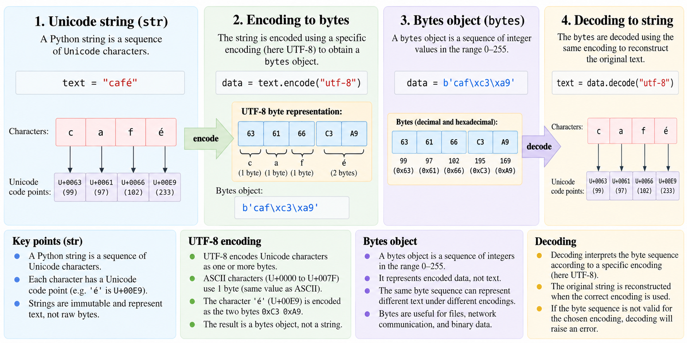{#fig-text-encoding-decoding}

The encoding must be known because the same byte sequence can have different interpretations under different encoding schemes, and not every byte sequence is valid under every encoding.

This distinction is especially important for file and network I/O. A program may reason about characters and strings internally, while external systems store or transmit encoded bytes.

Confusing text with its encoded representation is a common source of errors. The two abstractions should therefore remain separate:

$$
\boxed{
\text{text is a sequence of characters;}
\qquad
\text{encoded data is a sequence of bytes}.
}
$$

Strings provide the first major example of a **sequence abstraction** in Python. Their indexing, slicing, iteration, membership, and ordering behaviour will reappear in other sequence types. The next step is to examine Python's built-in containers, where mutability, references, ordering, uniqueness, and key-based access lead to different ways of organising collections of objects.

# Built-in Collections

A single object is sufficient when a computation concerns one value. Most programs, however, operate on collections: observations in a dataset, words in a document, records indexed by identifiers, or distinct elements accumulated during a search.

Different problems require different ways of organising those objects. Sometimes order matters; sometimes values must be associated with keys; sometimes uniqueness and membership are more important than position.

Python provides several fundamental collection types:

| Type | Organisation | Mutable | Typical access |
|:---:|:---:|:---:|:---:|
| `list` | Ordered sequence | Yes | Position |
| `tuple` | Ordered sequence | No | Position |
| `dict` | Key-value mapping | Yes | Key |
| `set` | Collection of distinct elements | Yes | Membership |
| `frozenset` | Collection of distinct elements | No | Membership |

These types should not be viewed simply as alternative containers. Each represents a different abstraction and therefore supports different operations naturally.

A useful first question when choosing a collection is not:

> Which Python type should be used?

but rather:

> How is the information organised, and which operations must the program perform?

The appropriate representation follows from that requirement.

## Lists

A `list` represents an ordered, mutable sequence of object references.

Lists can contain objects of different types:

```python
record = ["sensor-01", 21.5, True]
```

and their length can change during execution:

```python
measurements = [21.5, 21.8]

measurements.append(22.1)
```

producing:

```text
[21.5, 21.8, 22.1]
```

Because lists are sequences, they support the indexing and slicing conventions already introduced for strings:

```python
measurements[0]
measurements[-1]
measurements[1:3]
```

The crucial difference is mutability. A list element can be replaced:

```python
measurements[0] = 21.6
```

without constructing an entirely new list.

This makes lists suitable when a program needs an ordered collection whose contents may evolve.

### Lists Store References

A Python list should not be understood as a row of independent copies of its elements. Conceptually, the list contains **references to objects**.

Consider:

```python
first = [1, 2]
second = [3, 4]

matrix = [first, second]
```

The structure can be represented as:

$$
\texttt{matrix}
\longrightarrow
[
\text{reference to }\texttt{first},
\text{reference to }\texttt{second}
].
$$

The nested lists remain independent objects.

Therefore:

```python
first.append(5)
```

also changes what is observed through:

```python
matrix[0]
```

because both paths reach the same object.

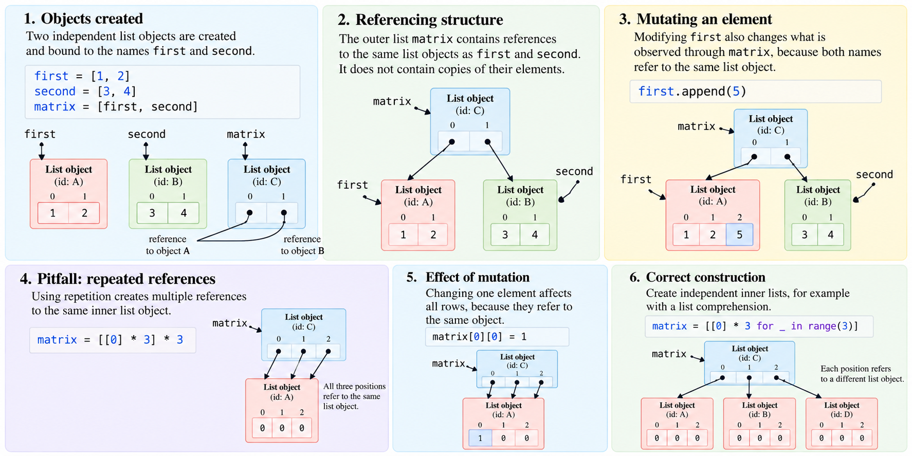{#fig-list-reference-structure}

This referential model explains an important construction pitfall:

```python
matrix = [[0] * 3] * 3
```

At first sight, this appears to create three independent rows:

```text
[
    [0, 0, 0],
    [0, 0, 0],
    [0, 0, 0],
]
```

but the repetition duplicates the reference to the inner list rather than constructing three independent inner lists.

Consequently:

```python
matrix[0][0] = 1
```

produces a structure equivalent to:

```text
[
    [1, 0, 0],
    [1, 0, 0],
    [1, 0, 0],
]
```

All three positions in the outer list refer to the same inner object.

When independent rows are intended, each row must be created separately:

```python
matrix = [[0] * 3 for _ in range(3)]
```

This example is another consequence of the same object model introduced earlier. The behaviour is not a special property of matrices; it follows from references, aliasing, and mutability.

### List Operations

Lists support operations that reflect their sequence abstraction.

An element can be added to the end:

```python
values.append(10)
```

several elements can be appended:

```python
values.extend(other_values)
```

and an element can be inserted at a particular position:

```python
values.insert(index, value)
```

Elements can be removed by position:

```python
value = values.pop()
```

or by matching a value:

```python
values.remove(target)
```

These operations may appear similar from the perspective of the public interface, but they do not necessarily have the same computational cost. Adding an element at the end and inserting one at the beginning impose different requirements on the underlying representation.

We will analyse these differences after examining how Python sequences are represented internally.

### List Comprehensions

Many lists are constructed by applying a transformation or condition to values from another iterable.

For example:

```python
squares = []

for value in range(10):
    squares.append(value ** 2)
```

can be expressed as a list comprehension:

```python
squares = [value ** 2 for value in range(10)]
```

A condition can also be included:

```python
positive_squares = [
    value ** 2
    for value in data
    if value > 0
]
```

A comprehension should be understood as a compact expression for constructing a collection, not merely as shorter syntax for a loop.

Conceptually:

$$
\text{iterable}
\longrightarrow
\text{optional selection}
\longrightarrow
\text{transformation}
\longrightarrow
\text{new list}.
$$

When the transformation or filtering logic becomes complicated, an explicit loop may communicate the computation more clearly. Concision is useful only while the structure of the operation remains evident.

## Tuples

A `tuple` is an ordered sequence like a list, but the tuple itself is immutable.

A tuple can be created as:

```python
point = (3.0, 4.0)
```

and supports indexing, slicing, iteration, and other non-mutating sequence operations:

```python
point[0]
point[-1]
```

However:

```python
point[0] = 5.0
```

is invalid because the tuple does not allow its stored references to be replaced.

Tuples are particularly useful when several related values form a fixed structure. A coordinate:

```python
point = (3.0, 4.0)
```

or a record:

```python
observation = ("sensor-01", 21.5, True)
```

may naturally represent a collection whose structure is not intended to change.

### Tuple Construction and Unpacking

The comma, rather than the parentheses themselves, is what fundamentally defines a tuple.

For example:

```python
point = 3.0, 4.0
```

creates the same two-element tuple as:

```python
point = (3.0, 4.0)
```

This becomes especially visible for a one-element tuple:

```python
single = (42,)
```

Without the comma:

```python
single = (42)
```

the parentheses merely group the expression and the result is an integer.

Tuples interact naturally with unpacking:

```python
x, y = point
```

The elements of the tuple are bound to the corresponding names.

The same mechanism explains multiple assignment:

```python
a, b = b, a
```

The right-hand side creates a tuple-like collection of values before those values are assigned to the names on the left.

Unpacking can also capture a variable number of elements:

```python
first, *middle, last = values
```

where `middle` receives the elements not assigned to the fixed positions.

### Immutability Is Not Recursive

As with strings, tuple immutability applies to the tuple object itself. It does not imply that every referenced object is immutable.

Consider:

```python
record = ("sensor-01", [21.5, 21.8])
```

The tuple cannot be changed to refer to a different list at its second position:

```python
record[1] = other_values
```

but the existing list can still be modified:

```python
record[1].append(22.1)
```

The tuple continues to contain the same reference; the referenced object has changed.

This distinction can be expressed as:

$$
\boxed{
\text{immutable container}
\not\Rightarrow
\text{immutable object graph}.
}
$$

It also explains why immutability and hashability are related but not identical concepts. Whether an object can be used as a hash key depends on the stability of its equality and hash behaviour, not merely on the absence of assignment syntax at the outermost level. This will become clearer when dictionaries and hash tables are considered.

## Dictionaries

Sequences organise elements by position. Many problems require a different relationship: a value should be retrieved according to a meaningful **key**.

For example, suppose measurements are associated with sensor identifiers:

```python
temperatures = {
    "sensor-01": 21.5,
    "sensor-02": 19.8,
    "sensor-03": 22.1,
}
```

Retrieving:

```python
temperatures["sensor-02"]
```

asks for the value associated with the key `"sensor-02"`, not for the object occupying a particular numerical position.

A `dict` therefore represents a **mapping**:

$$
\text{key}
\longrightarrow
\text{value}.
$$

More formally, if $K$ is a set of keys and $V$ a collection of possible values, a mapping associates each stored key with one value:

$$
f:K\rightarrow V.
$$

The keys are unique within a dictionary, while different keys may map to equal values.

This abstraction is appropriate whenever the natural question is:

> What value is associated with this key?

rather than:

> What object occupies this position?

### Access and Update

A value can be retrieved by key:

```python
temperature = temperatures["sensor-01"]
```

and a new association can be created:

```python
temperatures["sensor-04"] = 20.7
```

Assigning to an existing key replaces the associated value:

```python
temperatures["sensor-01"] = 21.9
```

The dictionary therefore remains a mapping from unique keys to values.

Attempting direct indexing with a key that is not present raises a `KeyError`. When absence is expected, `get` can provide an alternative:

```python
temperature = temperatures.get("sensor-10")
```

which returns `None` if the key is absent, or:

```python
temperature = temperatures.get("sensor-10", 0.0)
```

which provides an explicit default.

It is important to distinguish a missing key from a key whose associated value happens to be `None`:

```python
configuration = {"threshold": None}
```

Here `"threshold"` is present even though:

```python
configuration.get("threshold")
```

returns `None`.

When that distinction matters, membership should be tested explicitly:

```python
if "threshold" in configuration:
    ...
```

### Dictionary Views and Iteration

Iterating directly over a dictionary produces its keys:

```python
for sensor in temperatures:
    ...
```

Python also provides views of keys, values, and key-value pairs:

```python
temperatures.keys()
temperatures.values()
temperatures.items()
```

For example:

```python
for sensor, temperature in temperatures.items():
    print(sensor, temperature)
```

The objects returned by `keys()`, `values()`, and `items()` are views rather than independent snapshots of all dictionary contents. They remain associated with the dictionary and reflect its current state.

This is another example of why understanding object relationships matters beyond syntax.

### Hashable Keys

Dictionary keys must satisfy a requirement known as **hashability**.

A hashable object provides a hash value that remains stable while the object is used as a key and has equality semantics compatible with hashing. Immutable built-in values such as strings, integers, and appropriate tuples are commonly used as keys:

```python
coordinates = {
    (0, 0): "origin",
    (1, 0): "east",
}
```

A list cannot normally be used as a dictionary key because it is mutable:

```python
invalid = {[1, 2]: "value"}
```

would fail.

The reason for this restriction follows from the internal mechanism used to implement dictionaries: Python relies on hashing to locate keys efficiently. If a key could change in a way that changed its hash while stored, the structure could no longer reliably locate it.

We will develop this mechanism formally when studying **maps and hash tables**. For now, the important distinction is:

$$
\boxed{
\text{dictionary interface}
\rightarrow
\text{mapping by key},
}
$$

while hashing is one implementation technique that makes this interface efficient.

## Sets

A `set` represents a collection of distinct hashable elements.

For example:

```python
observed = {"A", "B", "C"}
```

Unlike a list or tuple, a set is not organised around positional access. Its central operations concern **membership** and **set relationships**.

For example:

```python
"B" in observed
```

asks whether `"B"` belongs to the collection.

Repeated values do not create repeated elements:

```python
values = {1, 1, 2, 2, 3}
```

represents the set:

$$
\{1,2,3\}.
$$

This makes sets useful when uniqueness is part of the problem itself.

For example:

```python
unique_categories = set(categories)
```

constructs the distinct values appearing in an iterable.

### Set Operations

Python sets support the standard operations of mathematical set theory.

For sets $A$ and $B$, the union:

$$
A\cup B
$$

contains elements belonging to either set and can be written:

```python
A | B
```

The intersection:

$$
A\cap B
$$

contains elements common to both:

```python
A & B
```

The difference:

$$
A\setminus B
$$

contains elements in $A$ but not in $B$:

```python
A - B
```

and the symmetric difference:

$$
A\triangle B
$$

contains elements belonging to exactly one of the sets:

```python
A ^ B
```

For example:

```python
expected = {"A", "B", "C", "D"}
observed = {"A", "C", "E"}

missing = expected - observed
unexpected = observed - expected
```

The representation closely matches the underlying mathematical reasoning.

Sets also support subset and superset relationships:

```python
A <= B
A >= B
```

and disjointness can be tested with:

```python
A.isdisjoint(B)
```

This makes sets particularly useful when a problem is naturally expressed in terms of membership rather than position.

### Mutable and Immutable Sets

The ordinary `set` type is mutable:

```python
observed.add("D")
observed.remove("A")
```

Python also provides `frozenset`, an immutable set type:

```python
required = frozenset({"A", "B", "C"})
```

Because its membership cannot change after creation, a `frozenset` can itself be hashable when its elements satisfy the necessary requirements. It can therefore participate in structures where an ordinary mutable set cannot, including use as a dictionary key or as an element of another set.

## Choosing a Collection

The built-in collections provide different ways of expressing relationships among objects.

A list is appropriate when **order and positional access** matter and the sequence may change. A tuple represents an ordered structure whose references are intended to remain fixed. A dictionary expresses an association between **keys and values**. A set represents **membership and uniqueness**.

These distinctions are semantic before they are computational.

For example, suppose a program records the sequence in which events occurred:

```python
events = [...]
```

A list is natural because order is meaningful.

If each event must instead be retrieved by a unique identifier:

```python
events_by_id = {...}
```

a dictionary expresses the problem more directly.

If the only requirement is to know which event categories have appeared:

```python
categories = {...}
```

a set removes positional information that the problem does not require.

Choosing an appropriate abstraction often simplifies the algorithm itself because the operations provided by the data structure correspond to the questions the program needs to answer.

At the same time, these abstractions are implemented by concrete representations in memory. Those representations determine how much memory is required and how efficiently operations such as indexing, insertion, deletion, and membership can be performed.

To understand those consequences, it is necessary to move below the public interface and examine how sequence structures are represented internally.

# Algorithm Analysis

Two programs can produce exactly the same result while requiring very different amounts of computational work. For small inputs, the difference may be negligible. As the input grows, however, the choice of algorithm and data structure can determine whether a computation remains practical.

Consider the problem of finding the largest element of a non-empty sequence:

```python
def find_max(data):
    largest = data[0]

    for value in data[1:]:
        if value > largest:
            largest = value

    return largest
```

The algorithm examines the elements and maintains the largest value encountered so far. If the input contains more elements, more comparisons are required.

This suggests that computational cost should be described as a function of the **input size**:

$$
T(n),
$$

where $n$ measures the size of the problem and $T(n)$ represents the amount of work required.

The appropriate definition of $n$ depends on the problem. For a sequence algorithm, it may be the number of elements. For a graph algorithm, both the number of vertices and edges may matter. For an integer algorithm, the number of bits required to represent the integer may be more meaningful than its numerical value.

Algorithm analysis provides a framework for reasoning about these costs independently of a particular execution on a particular machine.

## Experimental Analysis

One direct way to study performance is to implement an algorithm and measure its execution time.

Conceptually:

$$
t_{\text{elapsed}}
=
t_{\text{end}}
-
t_{\text{start}}.
$$

Repeating the experiment for increasing input sizes can reveal how runtime changes as the problem grows.

This approach is useful. Empirical measurements can expose implementation overhead, memory behaviour, interpreter costs, caching effects, and other characteristics of an actual computing environment.

However, experimental timing alone has important limitations.

The observed result depends on factors such as:

- hardware;
- operating system;
- Python implementation and version;
- other processes using the machine;
- details of the implementation;
- the particular inputs used in the experiment.

Furthermore, an algorithm must already have been implemented before it can be measured.

Suppose two implementations are timed and one requires $0.4$ seconds while another requires $0.7$ seconds. This tells us something about those executions, but it does not by itself explain how their costs will behave if the input becomes ten, one thousand, or one million times larger.

Empirical analysis and theoretical analysis therefore answer related but different questions:

$$
\begin{aligned}
\text{experimental analysis}
&\rightarrow
\text{observed performance},
\\
\text{asymptotic analysis}
&\rightarrow
\text{growth of computational cost}.
\end{aligned}
$$

The two approaches are complementary rather than competing.

## A Model of Computation

To reason about an algorithm without depending on a particular processor, we can count elementary computational steps rather than measuring seconds.

Examples of such **primitive operations** include:

- binding a name to an object;
- retrieving an object associated with a name;
- performing an arithmetic operation;
- comparing two values;
- accessing a sequence element by index;
- calling or returning from a function.

The precise duration of these operations varies in a real computer. For asymptotic analysis, however, they can often be treated as operations whose cost is bounded independently of the input size.

If an algorithm performs $f(n)$ primitive operations on an input of size $n$, its running time can be modelled as proportional to:

$$
T(n)\propto f(n).
$$

The objective is not usually to predict the exact number of processor cycles. Instead, we want to understand how the amount of work changes as $n$ grows.

For the maximum-search algorithm, each element is examined once and each iteration performs a bounded amount of work. The number of operations therefore grows proportionally to $n$.

This is a **linear** growth pattern.

## Best, Average, and Worst Cases

An algorithm does not necessarily perform the same amount of work for every input of the same size.

Consider a sequential search:

```python
def contains(data, target):
    for value in data:
        if value == target:
            return True

    return False
```

If `target` is the first element, only one comparison is required. If it is the last element, or does not occur at all, the algorithm may examine the entire sequence.

For inputs of size $n$, we can therefore distinguish:

$$
T_{\text{best}}(n),
\qquad
T_{\text{average}}(n),
\qquad
T_{\text{worst}}(n).
$$

The **best case** describes the least work required by any input of size $n$.

The **worst case** describes the greatest work required by any input of size $n$.

The **average case** describes expected performance under a specified probability distribution over possible inputs.

The last qualification is essential. An average cannot be defined meaningfully without assumptions about how inputs occur.

For sequential search, for example, the expected number of comparisons depends on how likely the target is to occur and where it is likely to appear.

Worst-case analysis is often particularly useful because it provides a guarantee:

$$
T(n)
\leq
T_{\text{worst}}(n)
$$

for every input of size $n$.

This does not imply that worst-case behaviour is always the only relevant measure. Average-case and expected analyses are important for many algorithms and data structures. The appropriate measure depends on the question being studied.

## Common Growth Functions

A relatively small set of functions appears repeatedly in algorithm analysis.

The most common growth classes considered in these notes are:

$$
1,
\qquad
\log n,
\qquad
n,
\qquad
n\log n,
\qquad
n^2,
\qquad
n^3,
\qquad
a^n,
$$

where $a>1$ is a constant.

Their relative growth for sufficiently large $n$ is:

$$
1
<
\log n
<
n
<
n\log n
<
n^2
<
n^3
<
a^n.
$$

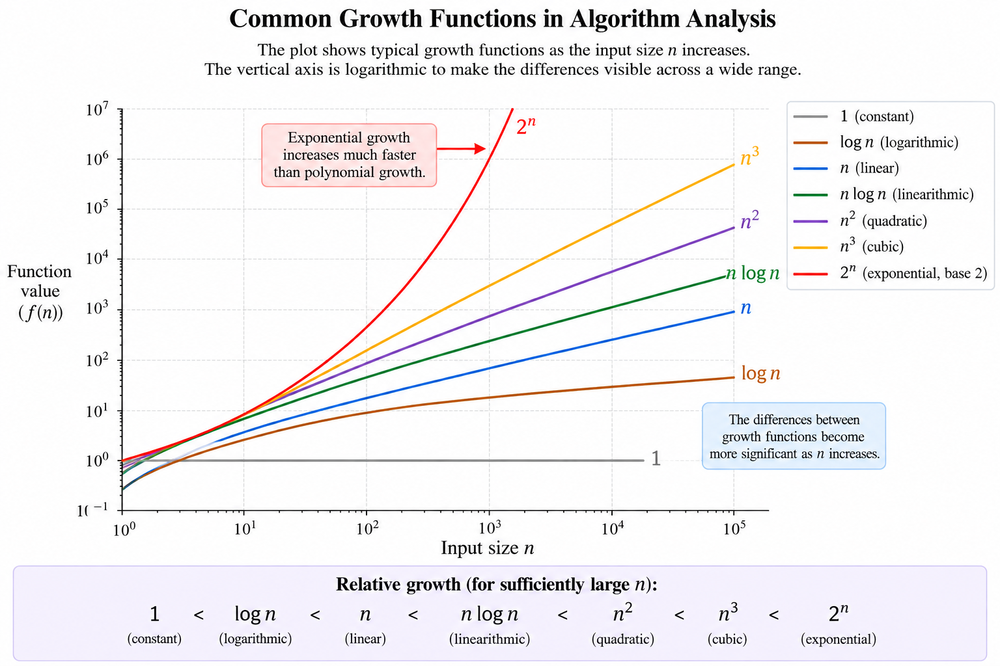{#fig-algorithm-growth-rates}

The differences become increasingly important as the input grows.

### Constant Growth

A constant-time operation requires an amount of work that does not grow with $n$:

$$
T(n)=c.
$$

For example, accessing one element of an array-like sequence by a known index can be constant time under an appropriate representation.

Constant time does not mean that an operation takes literally one instruction or the same number of nanoseconds on every machine. It means that its cost does not grow as a function of the input size being analysed.

### Logarithmic Growth

A logarithmic process often appears when the remaining problem is reduced by a constant factor at each step.

Suppose an input of size $n$ is repeatedly divided by $2$:

$$
n,
\frac{n}{2},
\frac{n}{2^2},
\ldots,
\frac{n}{2^k}.
$$

The process ends when the remaining size reaches approximately $1$:

$$
\frac{n}{2^k}\leq1.
$$

Therefore:

$$
n\leq2^k.
$$

Taking logarithms base $2$:

$$
\log_2 n\leq k.
$$

Thus the required number of reductions grows proportionally to:

$$
\log n.
$$

Binary search is a fundamental example of this pattern.

The logarithm base is generally omitted in asymptotic analysis because logarithms with different constant bases differ only by a constant factor:

$$
\log_a n
=
\frac{\log_b n}{\log_b a}.
$$

Since:

$$
\frac{1}{\log_b a}
$$

is constant with respect to $n$, the asymptotic growth class is unchanged.

### Linear Growth

A linear algorithm performs an amount of work proportional to the input size:

$$
T(n)=cn+d.
$$

Processing each element of a sequence once is a typical example:

```python
total = 0

for value in data:
    total += value
```

If the sequence contains $n$ elements, the loop executes $n$ times.

Ignoring constant factors and lower-order terms, the dominant growth is:

$$
n.
$$

### Linearithmic Growth

Many efficient divide-and-conquer algorithms have running times proportional to:

$$
n\log n.
$$

This can arise when a computation performs approximately $\log n$ levels of decomposition while processing a total of $n$ elements at each level.

Merge sort will later provide an important example.

Linearithmic growth is substantially slower than linear growth for sufficiently large inputs, but substantially better than quadratic growth.

### Quadratic Growth

Quadratic behaviour commonly appears when each of $n$ elements is compared or combined with a number of other elements proportional to $n$.

A simple nested loop illustrates the pattern:

```python
for i in range(n):
    for j in range(n):
        process(i, j)
```

The inner operation executes:

$$
n\cdot n=n^2
$$

times.

Quadratic behaviour can also arise when the inner loop does not always execute exactly $n$ times.

Consider:

```python
for i in range(n):
    for j in range(i + 1):
        process(i, j)
```

The number of executions is:

$$
1+2+3+\cdots+n.
$$

Using the arithmetic-series identity:

$$
\sum_{i=1}^{n}i
=
\frac{n(n+1)}{2},
$$

we obtain:

$$
T(n)
=
\frac{n^2+n}{2}.
$$

The dominant term is proportional to $n^2$, so the growth is quadratic.

### Cubic and Exponential Growth

Three nested loops whose ranges are each proportional to $n$ can produce cubic growth:

$$
T(n)\propto n^3.
$$

Exponential growth has the form:

$$
T(n)\propto a^n,
\qquad a>1.
$$

The distinction between polynomial and exponential growth is substantial. If the input size increases by one, a polynomial changes by an amount determined by powers of $n$, while an exponential function is multiplied repeatedly by a constant factor.

For example:

$$
2^{10}=1024,
$$

but:

$$
2^{50}
=
1\,125\,899\,906\,842\,624.
$$

Algorithms with exponential running time therefore become impractical rapidly as input size increases.

## Asymptotic Analysis

Exact operation counts can become complicated and often include details that do not determine how an algorithm scales.

Suppose an algorithm performs:

$$
T(n)=8n+5
$$

primitive operations.

As $n$ becomes large, the additive constant becomes increasingly insignificant relative to the linear term. Furthermore, whether one iteration corresponds to eight primitive operations or twelve may depend on implementation details.

Asymptotic analysis focuses instead on the **rate of growth**.

This allows algorithms to be compared according to their dominant computational behaviour while ignoring constant factors and lower-order terms when those terms do not affect the growth class.

Three notations are particularly useful:

$$
O(g(n)),
\qquad
\Omega(g(n)),
\qquad
\Theta(g(n)).
$$

They express asymptotic upper bounds, lower bounds, and tight bounds respectively.

## Big-O Notation

Let $f(n)$ and $g(n)$ be positive functions for sufficiently large $n$.

We say that:

$$
f(n)=O(g(n))
$$

if there exist constants:

$$
c>0
$$

and:

$$
n_0\geq1
$$

such that:

$$
0\leq f(n)\leq cg(n)
$$

for every:

$$
n\geq n_0.
$$ {#eq-big-o-definition}

The function $g(n)$ therefore provides an asymptotic upper bound for $f(n)$ up to a constant factor.

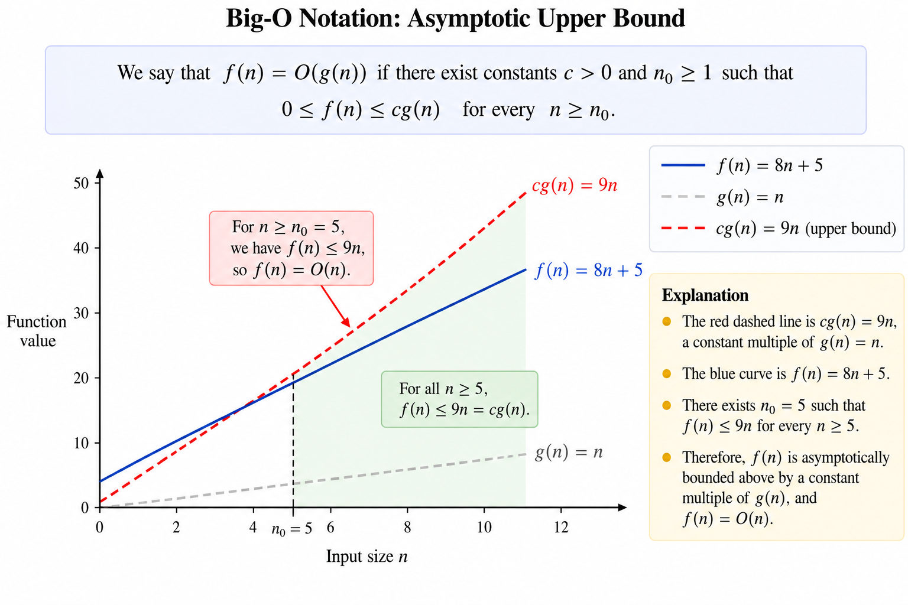{#fig-big-o-upper-bound}

Consider:

$$
f(n)=8n+5.
$$

We want to show:

$$
8n+5=O(n).
$$

According to the definition, we need constants $c$ and $n_0$ such that:

$$
8n+5\leq cn
$$

for all:

$$
n\geq n_0.
$$

For $n\geq5$:

$$
5\leq n.
$$

Therefore:

$$
8n+5
\leq
8n+n
=
9n.
$$

Thus we may choose:

$$
c=9,
\qquad
n_0=5,
$$

which proves:

$$
8n+5=O(n).
$$

The constants are not unique. The purpose is simply to establish that such constants exist.

### Dominant Terms

Big-O notation explains formally why constant factors and lower-order terms can often be omitted.

Consider:

$$
f(n)=4n^2+3n+7.
$$

For:

$$
n\geq1,
$$

we have:

$$
3n\leq3n^2
$$

and:

$$
7\leq7n^2.
$$

Therefore:

$$
4n^2+3n+7
\leq
4n^2+3n^2+7n^2
=
14n^2.
$$

Hence:

$$
f(n)=O(n^2).
$$

The quadratic term determines the asymptotic upper bound.

However, Big-O should not be interpreted as meaning "the exact running time is the dominant term". It describes a bound on growth.

For example:

$$
n=O(n^2)
$$

is mathematically true, although $O(n)$ is a tighter upper bound for a linear function.

## Big-Omega Notation

Big-Omega provides the corresponding asymptotic lower bound.

We say:

$$
f(n)=\Omega(g(n))
$$

if there exist constants:

$$
c>0
$$

and:

$$
n_0\geq1
$$

such that:

$$
f(n)\geq cg(n)
$$

for all:

$$
n\geq n_0.
$$ {#eq-big-omega-definition}

For example:

$$
f(n)=8n+5
$$

satisfies:

$$
8n+5\geq8n
$$

for all positive $n$.

Therefore:

$$
8n+5=\Omega(n).
$$

Big-Omega is useful when establishing that an algorithm or problem cannot require asymptotically less than a certain amount of work.

## Big-Theta Notation

When the same function provides both an asymptotic upper and lower bound, we obtain a **tight asymptotic bound**.

We say:

$$
f(n)=\Theta(g(n))
$$

if:

$$
f(n)=O(g(n))
$$

and:

$$
f(n)=\Omega(g(n)).
$$

Equivalently, there exist positive constants $c_1$, $c_2$, and $n_0$ such that:

$$
c_1g(n)
\leq
f(n)
\leq
c_2g(n)
$$

for every:

$$
n\geq n_0.
$$ {#eq-big-theta-definition}

For:

$$
f(n)=8n+5,
$$

we have already established:

$$
8n+5=O(n).
$$

We also know:

$$
8n+5\geq8n.
$$

Therefore:

$$
8n+5=\Omega(n).
$$

Combining both results:

$$
\boxed{
8n+5=\Theta(n).
}
$$

Big-Theta is often the most informative notation when the growth rate can be characterised tightly.

The three notations can be summarised as:

$$
\begin{aligned}
O(g(n))
&\rightarrow
\text{asymptotic upper bound},
\\
\Omega(g(n))
&\rightarrow
\text{asymptotic lower bound},
\\
\Theta(g(n))
&\rightarrow
\text{asymptotically tight bound}.
\end{aligned}
$$

## Analysing Loops

The complexity of many Python algorithms can be determined by examining how often their fundamental operations execute.

Consider:

```python
def find_max(data):
    largest = data[0]

    for value in data:
        if value > largest:
            largest = value

    return largest
```

For a sequence of size $n$, the loop performs $n$ iterations. Each iteration requires a bounded number of primitive operations.

Thus:

$$
T(n)=an+b
$$

for constants $a$ and $b$, and therefore:

$$
T(n)=\Theta(n).
$$

Nested loops require more care. The complexity is determined by the total number of executions, not merely by counting the number of syntactic loop statements.

For:

```python
for i in range(n):
    for j in range(n):
        process(i, j)
```

the operation executes:

$$
\sum_{i=1}^{n}n
=
n^2
$$

times.

Therefore:

$$
T(n)=\Theta(n^2).
$$

For a triangular loop:

```python
for i in range(n):
    for j in range(i):
        process(i, j)
```

the number of executions is:

$$
\sum_{i=0}^{n-1}i.
$$

Using:

$$
\sum_{i=0}^{n-1}i
=
\frac{n(n-1)}{2},
$$

we obtain:

$$
T(n)
=
\frac{n^2-n}{2}
=
\Theta(n^2).
$$

The exact operation count differs from the rectangular nested loop, but both belong to the same asymptotic growth class.

## Correctness and Efficiency

An efficient algorithm is useful only if it is correct.

Algorithm analysis therefore involves two distinct questions:

1. Does the algorithm produce the required result?
2. How much computational resource does it require?

Testing can provide evidence that an implementation behaves correctly for selected inputs, but it does not generally prove correctness for all possible inputs.

Mathematical reasoning can provide stronger guarantees.

### Loop Invariants

A **loop invariant** is a property that remains true at a specified point during every iteration of a loop.

Consider again the maximum-search algorithm:

```python
def find_max(data):
    largest = data[0]

    for value in data[1:]:
        if value > largest:
            largest = value

    return largest
```

A useful invariant is:

> After processing the first $k$ elements, `largest` is the maximum of those $k$ elements.

This can be justified in three stages.

**Initialization.** Before the loop processes the remaining elements, `largest` is assigned:

```python
largest = data[0]
```

so it is trivially the maximum of the first element.

**Maintenance.** Assume that before processing the next value, `largest` is the maximum of all elements examined so far.

If the next value is greater:

```python
if value > largest:
    largest = value
```

the new value becomes the maximum.

Otherwise `largest` remains unchanged and is still the maximum.

Therefore the invariant remains true after the next element is processed.

**Termination.** When the loop finishes, all $n$ elements have been processed. By the invariant, `largest` is therefore the maximum of the entire sequence.

This establishes the correctness of the algorithm.

The reasoning has the same logical structure as mathematical induction:

$$
\boxed{
\text{initialisation}
\rightarrow
\text{maintenance}
\rightarrow
\text{termination}.
}
$$

Loop invariants will be useful later when reasoning about searching, sorting, data structure operations, and graph algorithms.

## Time and Space Complexity

Running time is not the only computational resource that matters. Algorithms also require memory.

The **space complexity** of an algorithm describes how its memory requirements grow with input size.

For example, an algorithm that processes a sequence while maintaining only a fixed number of additional variables may require:

$$
O(1)
$$

auxiliary space.

An algorithm that constructs an additional sequence proportional to the input size may require:

$$
O(n)
$$

auxiliary space.

This distinction becomes important because algorithms may trade one resource for another. Additional memory can sometimes reduce running time, while an in-place algorithm may conserve memory at the cost of more computation.

The appropriate analysis therefore depends on the resources relevant to the problem:

$$
\boxed{
\text{algorithmic efficiency}
=
\text{time requirements}
+
\text{space requirements}
+
\text{problem constraints}.
}
$$

Asymptotic analysis now provides the vocabulary needed to examine Python's data structures more deeply. We can return to sequence types and ask not only what operations they provide, but how their internal representation determines the cost of indexing, insertion, deletion, resizing, and iteration.

# Array-Based Sequences

The built-in sequence interface explains what operations can be performed on lists and tuples, but it does not explain why indexing is fast, why inserting an element near the beginning can be expensive, or why repeated calls to `append` remain efficient even though a list occasionally needs additional storage.

These properties arise from the underlying representation.

An **array** provides a contiguous region of memory divided into a sequence of cells of fixed size. If the address of the first cell is known and every cell occupies $s$ bytes, the address of the cell at index $j$ can be computed as:

$$
\operatorname{address}(j)
=
\operatorname{address}(0)+js.
$$ {#eq-array-address}

The position of an element can therefore be calculated directly rather than found by traversing the preceding elements.

This is the fundamental reason that indexed access in an array is constant time:

$$
T_{\text{access}}(n)=O(1).
$$

The result depends on the representation, not merely on the syntax of indexing.

## Referential and Compact Arrays

There are two conceptually different ways in which an array can represent a sequence.

A **compact array** stores the representation of each element directly within the array cells:

$$
[\;x_0\;][\;x_1\;][\;x_2\;]\cdots[\;x_{n-1}\;].
$$

A **referential array** instead stores references to objects located elsewhere:

$$
[\;r_0\;][\;r_1\;][\;r_2\;]\cdots[\;r_{n-1}\;],
$$

where each $r_i$ identifies another object.

Python lists and tuples follow the referential model. The array underlying the sequence maintains an ordered collection of object references rather than embedding independent copies of arbitrary Python objects. 

This explains why a list can contain heterogeneous objects:

```python
record = [42, "sensor-01", 21.5, True]
```

The array cells do not need to accommodate the different internal representations of an integer, a string, a floating-point value, and a Boolean value. Each cell stores a reference of a uniform size.

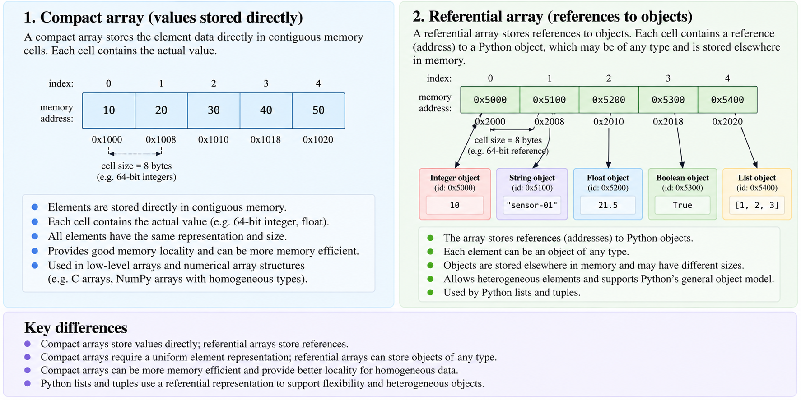{#fig-compact-referential-arrays}

The flexibility of referential storage comes with additional indirection. Accessing:

```python
data[j]
```

first identifies the reference stored at position $j$ and then reaches the corresponding object.

Compact arrays can avoid this additional layer when the elements have a uniform representation. They may therefore use less memory and can provide better locality because the actual data values are stored consecutively. 

This distinction will become particularly important when numerical arrays are considered later. Python's general-purpose `list` prioritises flexibility, while numerical array structures can exploit homogeneous representations for more compact and efficient numerical computation.

## Fixed Capacity

A low-level array has a fixed number of cells. Once storage has been allocated for $N$ elements, an additional element cannot simply be placed at position $N$ if no cell exists there.

This creates a problem for a structure such as a Python list:

```python
values = []

values.append(10)
values.append(20)
values.append(30)
```

From the user's perspective, the list appears able to grow whenever necessary. A fixed array cannot provide that behaviour directly.

One possible strategy would be to allocate exactly enough storage after every insertion. If a sequence containing $n$ elements receives one additional element, a new array of size $n+1$ could be created and all existing references copied into it.

The process would be:

$$
\text{allocate larger array}
\rightarrow
\text{copy existing references}
\rightarrow
\text{insert new reference}.
$$

But copying $n$ existing references requires:

$$
\Theta(n)
$$

time. Repeating this operation for every append would make growing a sequence unnecessarily expensive.

A more efficient solution is the **dynamic array**.

## Dynamic Arrays

A dynamic array separates two quantities:

$$
n
=
\text{number of elements currently stored},
$$

and:

$$
N
=
\text{capacity of the underlying array}.
$$

The invariant is:

$$
0\leq n\leq N.
$$

When:

$$
n<N,
$$

there is unused capacity and a new element can be appended directly into the next available cell.

When:

$$
n=N,
$$

the underlying array is full. The structure must allocate a larger array, copy the existing references, and replace the old array.

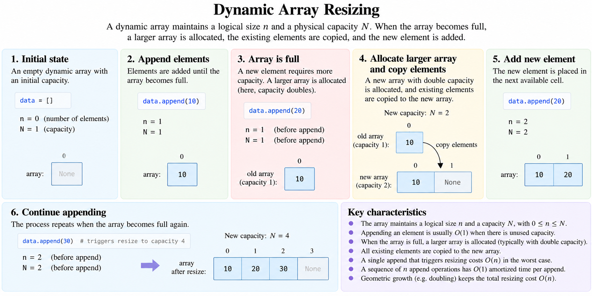{#fig-dynamic-array-resizing}

A simplified resizing strategy is:

$$
N_{\text{new}}=2N.
$$

After resizing, the sequence contains the same $n$ elements but has enough unused capacity for many subsequent append operations.

The important idea is that the expensive resizing operation does **not** occur on every append.

Suppose the capacities evolve as:

$$
1,2,4,8,16,\ldots
$$

A resize occurs only when the number of stored elements reaches one of these capacity boundaries.

Most append operations therefore require only:

1. storing one reference in the next available cell;
2. increasing the logical size.

Those operations take constant time.

A resize is more expensive because all existing references must be copied.

Thus, the worst-case cost of a single append can be:

$$
O(n),
$$

while most individual appends cost:

$$
O(1).
$$

To describe the cost of a long sequence of appends correctly, we need a stronger form of analysis.

## Amortized Analysis

**Amortized analysis** studies the total cost of a sequence of operations and distributes that cost across the operations in the sequence.

This differs from average-case analysis. No probability distribution over inputs is required. The objective is to establish a deterministic bound on the total cost of a sequence of operations.

Consider a dynamic array whose capacity doubles whenever it becomes full.

Starting from capacity $1$, the resize operations copy approximately:

$$
1,2,4,8,\ldots
$$

existing references.

Suppose $n$ append operations are performed. If:

$$
2^k\leq n<2^{k+1},
$$

then the total number of references copied during all resize events is bounded by:

$$
1+2+4+\cdots+2^k.
$$

This is a geometric series. For:

$$
S_k
=
1+2+4+\cdots+2^k,
$$

multiplying by $2$ gives:

$$
2S_k
=
2+4+8+\cdots+2^{k+1}.
$$

Subtracting the first equation from the second:

$$
2S_k-S_k
=
2^{k+1}-1,
$$

and therefore:

$$
S_k
=
2^{k+1}-1.
$$

Since:

$$
2^k\leq n,
$$

we have:

$$
2^{k+1}\leq2n.
$$

Hence:

$$
S_k
<
2n.
$$

The total work spent copying references during all resize operations is therefore:

$$
O(n).
$$

The $n$ ordinary insertions themselves also require:

$$
O(n)
$$

total work.

Consequently, the complete sequence of $n$ append operations requires:

$$
O(n)+O(n)=O(n).
$$

Dividing the total cost across the $n$ operations gives:

$$
\frac{O(n)}{n}
=
O(1).
$$

Therefore:

$$
\boxed{
\text{dynamic-array append has }O(1)\text{ amortized time}.
}
$$

Goodrich establishes the same result for a dynamic array whose capacity doubles when full: $n$ appends from an initially empty structure require $O(n)$ total time. 

This statement must be interpreted carefully. It does **not** mean that every individual append is constant time. A particular append that triggers resizing can require linear time.

Rather:

$$
\boxed{
\text{worst-case individual append}=O(n),
\qquad
\text{amortized append}=O(1).
}
$$

The distinction is fundamental when analysing dynamic data structures.

### Why Geometric Growth Matters

The amortized result depends on increasing capacity sufficiently aggressively.

Suppose instead that a fixed amount $c$ were added whenever the array became full:

$$
c,2c,3c,\ldots,mc.
$$

To reach capacity proportional to $n$, the number of resize events would itself be proportional to $n$.

The total amount of copying would be proportional to:

$$
c+2c+3c+\cdots+mc.
$$

Factoring out $c$:

$$
c\sum_{i=1}^{m}i
=
c\frac{m(m+1)}{2}.
$$

Since:

$$
m=\Theta(n),
$$

for fixed $c$, the total cost grows as:

$$
\Theta(n^2).
$$

Thus a seemingly small implementation decision produces a major asymptotic difference:

$$
\begin{aligned}
\text{geometric capacity growth}
&\rightarrow O(n)
\text{ total resizing work},
\\
\text{fixed capacity increments}
&\rightarrow \Theta(n^2)
\text{ total resizing work}.
\end{aligned}
$$

This is a useful example of why data structure design cannot be separated from algorithm analysis. Goodrich similarly contrasts geometric expansion with fixed-increment expansion, showing that the latter leads to quadratic total work over a sequence of appends. 

Geometric growth also introduces a trade-off. Reserving unused capacity consumes additional memory, but it avoids frequent reallocations. A dynamic array deliberately uses some extra space to obtain efficient growth.

## Insertion and Deletion

Efficient append does not imply that every insertion into an array-based sequence is efficient.

Suppose:

```python
data = [10, 20, 30, 40]
```

and a new element must be inserted at position $1$:

```python
data.insert(1, 15)
```

The resulting sequence is:

```text
[10, 15, 20, 30, 40]
```

Before `15` can occupy position $1$, the references to:

```text
20, 30, 40
```

must be shifted one position to the right.

If a sequence contains $n$ elements and insertion occurs at index $k$, approximately:

$$
n-k
$$

references may need to be moved.

Therefore:

$$
T_{\text{insert}}(n,k)
=
O(n-k+1)
$$

in the amortized sense when possible resizing is included. :chatgpt-content-reference{index="4"}

Near the end of the sequence, little shifting is required. Near the beginning:

$$
k\approx0,
$$

so:

$$
T_{\text{insert}}(n,0)
=
O(n).
$$

Deletion has the same structural issue. Removing the element at position $k$ leaves a gap, so later references must be shifted left to preserve contiguous positional indexing.

Thus:

$$
T_{\text{delete}}(n,k)
=
O(n-k)
$$

for positional deletion from an array-based sequence. 

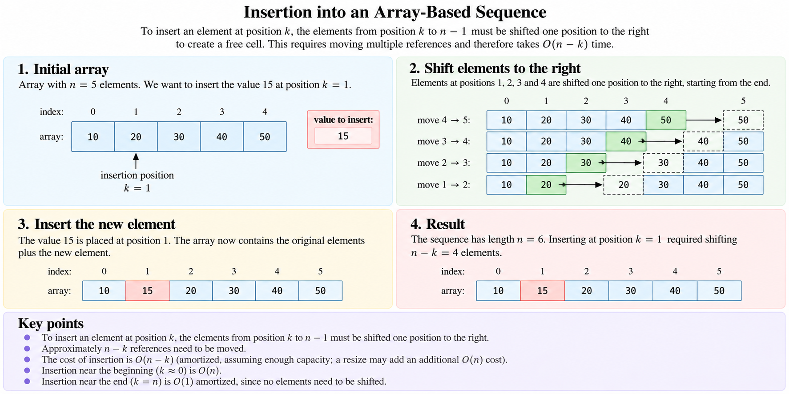{#fig-array-insertion-shifting}

This explains why:

```python
data.append(value)
```

and:

```python
data.insert(0, value)
```

have fundamentally different performance characteristics even though both add one element.

The difference follows directly from the representation.

## Complexity of Common Sequence Operations

The representation of lists and tuples allows the costs of several common operations to be understood systematically.

For a sequence of length $n$:

| Operation | Complexity | Reason |
|:---:|:---:|:---:|
| `len(data)` | $O(1)$ | Length is maintained explicitly |
| `data[j]` | $O(1)$ | Direct array indexing |
| `data[j] = value` | $O(1)$ | Replace one stored reference |
| `value in data` | $O(n)$ worst case | Sequential search |
| `data.count(value)` | $O(n)$ | Entire sequence must be examined |
| `data[j:k]` | $O(k-j)$ | A new sequence must be constructed |
| `data1 + data2` | $O(n_1+n_2)$ | New sequence contains both operands |
| `data.append(value)` | $O(1)$ amortized | Occasional resizing |
| `data.insert(k, value)` | $O(n-k)$ amortized | Shift subsequent references |
| `data.pop()` | $O(1)$ amortized | Remove final element |
| `data.pop(k)` | $O(n-k)$ amortized | Shift subsequent references |

These bounds are consistent with Goodrich's analysis of Python's list and tuple operations. In particular, length and indexed access are constant-time operations, while searching and sequence construction depend on the number of elements examined or created. 

The table should not be memorised as an arbitrary collection of facts. Most entries follow from three questions:

1. Can the required location be calculated directly?
2. How many existing references must be examined or moved?
3. Must a new sequence be constructed?

For example, indexing:

```python
data[j]
```

calculates one array position and is therefore $O(1)$.

Membership:

```python
target in data
```

may need to examine every element and is therefore $O(n)$ in the worst case.

Slicing:

```python
data[j:k]
```

constructs a new sequence containing approximately $k-j$ references and therefore requires time proportional to the size of the result.

The internal representation provides the explanation behind the asymptotic bound.

## Lists and Tuples

Lists and tuples share the same fundamental sequence abstraction and both support constant-time indexed access. Their different mutability requirements, however, affect their storage needs.

A list must support future growth. Its dynamic-array representation may therefore maintain unused capacity.

A tuple is immutable. Once created, its number of elements cannot change, so it does not need spare capacity to support later append operations. This can make tuples more memory-efficient than equivalent lists. 

The distinction illustrates a broader design principle:

$$
\boxed{
\text{the operations an abstraction promises influence the representation it requires}.
}
$$

Supporting mutation and growth provides flexibility, but that flexibility has implementation costs.

## Multidimensional Data

A Python list is one-dimensional in its immediate structure, but nested lists can represent data with several logical dimensions.

For example:

```python
matrix = [
    [1, 2, 3],
    [4, 5, 6],
    [7, 8, 9],
]
```

can be interpreted as a $3\times3$ matrix.

Accessing:

```python
matrix[i][j]
```

performs two successive reference operations:

$$
\text{outer list}
\rightarrow
\text{row object}
\rightarrow
\text{element}.
$$

This is not the same representation as a single compact two-dimensional numerical array. Each row is itself an independent Python object, and different rows could even have different lengths:

```python
data = [
    [1, 2],
    [3, 4, 5],
    [6],
]
```

Nested lists therefore provide a flexible representation of multidimensional logical structure, but they do not impose rectangular shape, homogeneous element types, or compact numerical storage.

These distinctions motivate specialised numerical array structures. Later, when NumPy arrays are introduced, the contrast between general-purpose referential containers and homogeneous multidimensional arrays will explain important differences in memory layout, vectorisation, broadcasting, and computational performance.

Array-based sequences provide efficient indexed access because their positions have a direct relationship to memory locations. Their weakness is equally structural: maintaining contiguous positions makes insertion and deletion away from the end potentially expensive.

This trade-off motivates another family of sequence structures. **Linked structures** abandon direct array indexing and instead connect elements through explicit references, changing both the representation and the computational costs of sequence operations.

# Recursion

Many computational problems contain smaller instances of the same problem. A directory may contain other directories, a tree contains subtrees, and a search interval can be reduced to a smaller interval with the same structure.

When a problem has this form, its solution can often be expressed **recursively**: solve a simple case directly, and reduce every more complex case to one or more smaller instances of the same problem.

The factorial function provides a simple mathematical example. For an integer $n \geq 0$:

$$
n!
=
\begin{cases}
1, & n=0,\\
n(n-1)!, & n\geq1.
\end{cases}
$$ {#eq-recursive-factorial}

The definition contains two essential components:

- a **base case**, which is solved directly;
- a **recursive case**, which reduces the problem to a smaller instance.

The corresponding Python function follows the mathematical definition closely:

```python
def factorial(n):
    if n == 0:
        return 1

    return n * factorial(n - 1)
```

For example:

```python
factorial(4)
```

requires:

$$
4!
=
4(3!)
=
4(3(2!))
=
4(3(2(1!)))
=
4(3(2(1(0!)))).
$$

Once the base case is reached:

$$
0!=1,
$$

the pending operations can be completed in reverse order:

$$
1!=1,
$$

$$
2!=2,
$$

$$
3!=6,
$$

and finally:

$$
4!=24.
$$

This illustrates the central structure of recursion:

$$
\boxed{
\text{problem}
\rightarrow
\text{smaller instance}
\rightarrow
\cdots
\rightarrow
\text{base case}.
}
$$

A recursive definition is therefore not circular when each recursive call makes genuine progress toward a case that can be solved without further recursion. 

## Recursive Execution and Activation Records

A recursive call is an ordinary function call. What makes recursion distinctive is that several invocations of the same function may be active simultaneously.

Each function invocation has its own execution state. Conceptually, Python maintains an **activation record**, or frame, containing information such as the call's parameters, local variables, and the point to which execution must return after a nested call completes. 

For:

```python
factorial(4)
```

the active calls develop as:

$$
\begin{aligned}
\texttt{factorial(4)}
&\rightarrow
\texttt{factorial(3)}
\\
&\rightarrow
\texttt{factorial(2)}
\\
&\rightarrow
\texttt{factorial(1)}
\\
&\rightarrow
\texttt{factorial(0)}.
\end{aligned}
$$

At the deepest point, five calls are active. Each has a distinct local binding for `n`.

The calls can be viewed as a stack:

```text
factorial(0)    <- current call
factorial(1)
factorial(2)
factorial(3)
factorial(4)    <- initial call
```

When `factorial(0)` returns, its activation record is no longer needed and execution resumes in `factorial(1)`. The process continues until the original invocation returns.

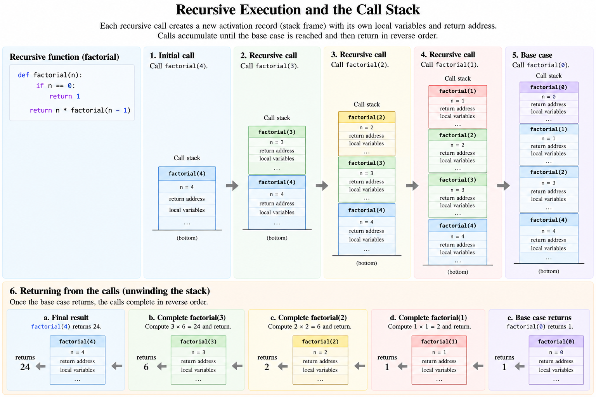{#fig-recursion-call-stack}

This explains an important computational consequence of recursion: active recursive calls require memory.

If recursion reaches depth $d$, the space required for its active call frames is generally proportional to:

$$
O(d),
$$

in addition to any other data structures used by the algorithm.

Recursion therefore affects both time and space complexity.

## Designing a Recursive Algorithm

A recursive algorithm should satisfy two fundamental requirements.

First, there must be one or more cases that can be solved directly:

$$
\text{base case}.
$$

Second, every recursive path must make progress toward such a case:

$$
\text{current problem}
\rightarrow
\text{strictly smaller problem}.
$$

Consider summing the first $n$ elements of a sequence $S$.

For:

$$
n=0,
$$

the sum is:

$$
0.
$$

For:

$$
n>0,
$$

the sum can be decomposed as:

$$
\operatorname{sum}(S,n)
=
\operatorname{sum}(S,n-1)
+
S[n-1].
$$

This leads naturally to:

```python
def linear_sum(data, n):
    if n == 0:
        return 0

    return linear_sum(data, n - 1) + data[n - 1]
```

The correctness of the recursive step depends on a simple observation: if the first $n-1$ elements have already been summed correctly, adding the element at position $n-1$ produces the sum of the first $n$ elements.

This is closely related to mathematical induction.

A typical recursive correctness argument therefore has the structure:

1. show that the base case is correct;
2. assume that the recursive call correctly solves the smaller problem;
3. show that the current call correctly constructs the larger solution from it.

The relationship between recursion and induction is not accidental. Both reason about structures defined in terms of smaller instances of themselves.

## Analysing Recursive Algorithms

A recursive algorithm must be analysed across all of the calls it generates.

For `linear_sum`, each call reduces $n$ by one:

$$
n,
n-1,
n-2,
\ldots,
1,
0.
$$

There are therefore:

$$
n+1
$$

function invocations.

Each call performs only constant nonrecursive work, so:

$$
T(n)
=
T(n-1)+O(1).
$$

Expanding the recurrence:

$$
T(n)
=
T(n-2)+O(1)+O(1),
$$

then:

$$
T(n)
=
T(n-3)+3O(1),
$$

and eventually:

$$
T(n)
=
T(0)+nO(1).
$$

Therefore:

$$
\boxed{
T(n)=O(n).
}
$$

Because all $n+1$ calls can be simultaneously active before the base case returns, the recursion depth is:

$$
O(n),
$$

and the additional space used by the call stack is also:

$$
O(n).
$$

Goodrich uses this linear summation as a representative example of linear recursion and derives the same linear running time. 

This illustrates an important point: a recursive algorithm may have the same asymptotic running time as an iterative algorithm while using more auxiliary memory because of its activation records.

## Binary Search

Recursion becomes more compelling when the structure of the algorithm itself repeatedly reduces a problem.

Suppose a sorted sequence contains $n$ values. To search for a target, we can inspect the middle element.

If the middle value equals the target, the search is complete.

If the target is smaller, only the left half can contain it.

If the target is larger, only the right half can contain it.

A recursive implementation can be expressed as:

```python
def binary_search(data, target, low, high):
    if low > high:
        return False

    mid = (low + high) // 2

    if target == data[mid]:
        return True

    if target < data[mid]:
        return binary_search(data, target, low, mid - 1)

    return binary_search(data, target, mid + 1, high)
```

Each recursive call reduces the number of remaining candidates by approximately one half:

$$
n,
\frac{n}{2},
\frac{n}{2^2},
\frac{n}{2^3},
\ldots
$$

After $k$ reductions:

$$
\frac{n}{2^k}
$$

candidates remain.

The recursion terminates when this quantity becomes smaller than $1$:

$$
\frac{n}{2^k}<1.
$$

Therefore:

$$
n<2^k,
$$

and hence:

$$
k>\log_2 n.
$$

The recursion depth is consequently:

$$
O(\log n).
$$

Since each invocation performs constant work apart from the recursive call:

$$
\boxed{
T(n)=O(\log n).
}
$$

This is the same logarithmic behaviour introduced earlier, now expressed through recursive problem reduction. 

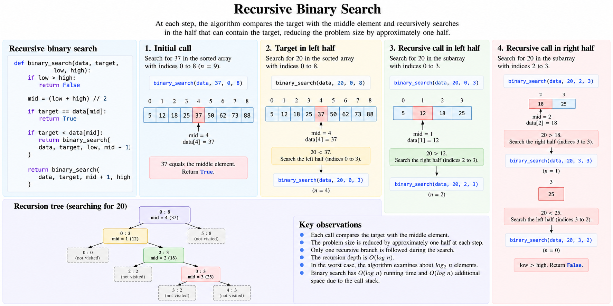{#fig-recursive-binary-search}

The example also shows that the word *binary* does not necessarily describe the number of recursive calls. During one invocation of binary search, at most one recursive branch is followed. Its recursion is therefore structurally **linear**, even though the problem size is divided by two at each step. 

## Linear, Binary, and Multiple Recursion

Recursive algorithms can be classified according to how many recursive calls a single invocation may initiate.

In **linear recursion**, each invocation makes at most one recursive call:

$$
R(n)
\rightarrow
R(n-1).
$$

Factorial, linear summation, and binary search have this structure.

In **binary recursion**, one invocation may make two recursive calls:

$$
R(n)
\rightarrow
\begin{cases}
R_1(\cdot),\\
R_2(\cdot).
\end{cases}
$$

For example, a sequence can be summed by recursively dividing it into two halves:

```python
def binary_sum(data, start, stop):
    if start >= stop:
        return 0

    if start == stop - 1:
        return data[start]

    mid = (start + stop) // 2

    return (
        binary_sum(data, start, mid)
        + binary_sum(data, mid, stop)
    )
```

The recursion forms a tree rather than a single chain.

For $n$ elements, the problem is repeatedly divided until each terminal subproblem contains one element. The depth is:

$$
O(\log n),
$$

because the subproblem size is halved at each level.

However, logarithmic depth does **not** imply logarithmic running time.

Across the complete recursion tree, the algorithm makes:

$$
2n-1
$$

calls when $n$ is a power of two. Therefore:

$$
T(n)=O(n).
$$

At the same time, only one path through the recursion tree is simultaneously active, so the additional call-stack space is:

$$
O(\log n).
$$

Thus:

$$
\boxed{
\text{recursion depth}
\neq
\text{number of recursive calls}.
}
$$

Goodrich uses this binary summation example precisely to distinguish $O(\log n)$ recursion depth from $O(n)$ total running time. 

Finally, **multiple recursion** occurs when one invocation may generate more than two recursive calls. Traversing a directory whose subdirectories are themselves recursively explored is a natural example. The number of recursive calls depends on the branching structure of the underlying problem. 

These categories describe the **shape of the recursion**, not its asymptotic running time.

## Recursion Trees

When an invocation generates several recursive calls, a **recursion tree** provides a useful representation of the computation.

Each node represents one function invocation, and its children represent the recursive calls initiated by that invocation.

For binary summation of eight elements, the structure is conceptually:

```text
                    [0:8]
                  /       \
              [0:4]       [4:8]
              /   \       /   \
           [0:2] [2:4] [4:6] [6:8]
            / \    / \    / \    / \
           0   1  2   3  4   5  6   7
```

The tree exposes two different quantities.

Its height determines the maximum number of simultaneously active nested calls:

$$
\text{depth}=O(\log n).
$$

The total number of nodes determines how many invocations occur:

$$
\text{calls}=O(n).
$$

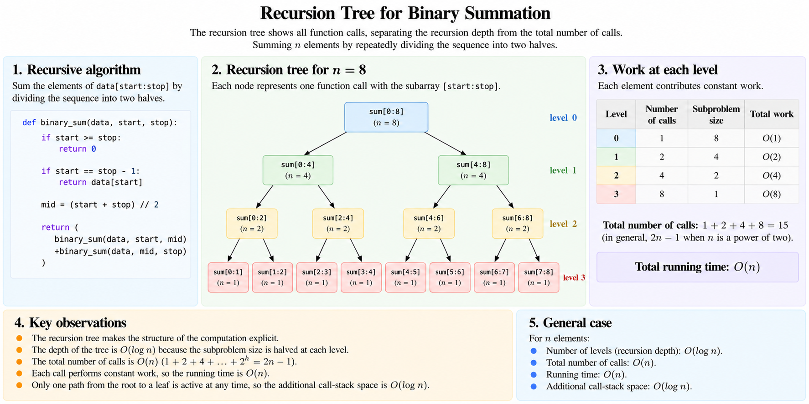{#fig-recursion-tree}

This distinction becomes essential in divide-and-conquer algorithms and tree algorithms, where recursive structure is often the most natural representation of the computation.

## Inefficient Recursion

A recursive formulation can be mathematically correct while being computationally poor.

The Fibonacci sequence is defined by:

$$
F_0=0,
$$

$$
F_1=1,
$$

and:

$$
F_n=F_{n-1}+F_{n-2},
\qquad n\geq2.
$$

A direct translation is:

```python
def fibonacci(n):
    if n <= 1:
        return n

    return fibonacci(n - 1) + fibonacci(n - 2)
```

The problem is that the recursion repeatedly computes the same values.

For example, evaluating $F_5$ requires both $F_4$ and $F_3$. But computing $F_4$ itself also requires $F_3$:

$$
F_5
\rightarrow
\begin{cases}
F_4
\rightarrow
\begin{cases}
F_3\\
F_2
\end{cases}
\\
F_3
\end{cases}
$$

The repeated subproblems multiply rapidly, producing exponential running time.

The recursive definition of Fibonacci is elegant, but a literal implementation fails to preserve previously computed information.

Goodrich contrasts this formulation with a linear recursive version that returns two consecutive Fibonacci values, allowing the second value already computed by one call to be reused by the next. That version requires only $O(n)$ time. :chatgpt-content-reference{index="7"}

The example illustrates a general principle:

$$
\boxed{
\text{a natural recursive definition does not guarantee an efficient recursive algorithm}.
}
$$

The structure of the recursive calls must still be analysed.

Later techniques such as memoization and dynamic programming address this problem more generally by retaining solutions to repeated subproblems.

## Termination and Recursion Depth

Every recursive path must eventually reach a base case.

Consider an incorrect function:

```python
def recurse(n):
    return recurse(n)
```

The recursive call receives exactly the same problem as its caller. No progress is made toward termination.

More subtle errors can arise when the argument changes but does not necessarily approach the base case.

A recursive algorithm should therefore have a clear **progress measure**: some quantity that moves monotonically toward a terminating condition.

Examples include:

$$
n\rightarrow n-1,
$$

for factorial, and:

$$
n\rightarrow\frac{n}{2},
$$

for binary search.

Without such progress, recursion can continue indefinitely in principle.

In practice, Python limits the number of simultaneously active recursive calls. Exceeding that limit raises a recursion-related runtime error rather than allowing the call stack to grow without bound. The exact configured limit should be treated as an implementation property rather than as part of the recursive algorithm itself.

This makes deep linear recursion particularly relevant in Python. An algorithm whose recursion depth is:

$$
O(n)
$$

may encounter the interpreter's recursion limit for sufficiently large $n$, even if the algorithm is otherwise logically correct.

By contrast, an algorithm with depth:

$$
O(\log n)
$$

can handle much larger problem sizes before call depth becomes a concern. Goodrich makes this distinction explicitly when comparing recursive structures in Python. :chatgpt-content-reference{index="8"}

Changing the interpreter's recursion limit can sometimes accommodate a legitimate computation, but it does not correct an algorithm whose recursion fails to terminate or whose recursive structure is unnecessarily deep.

## Recursion and Iteration

Recursion and iteration are both mechanisms for expressing repeated computation, but they organise state differently.

An iterative algorithm typically stores evolving state explicitly:

```python
result = 1

for value in range(2, n + 1):
    result *= value
```

A recursive formulation can instead distribute state across function invocations:

```python
def factorial(n):
    if n == 0:
        return 1

    return n * factorial(n - 1)
```

Both compute the same mathematical function.

For factorial, the iterative version is generally simpler operationally: it avoids a sequence of nested function calls and requires only constant auxiliary state. Recursion provides little structural advantage in this particular problem.

Other problems are different. Trees, directory hierarchies, divide-and-conquer algorithms, and recursive combinatorial structures naturally contain smaller instances of themselves. In those cases, recursion can mirror the structure of the problem directly.

The appropriate question is therefore not whether recursion is intrinsically better or worse than iteration, but whether the recursive decomposition makes the algorithm easier to express and reason about without introducing unacceptable computational costs.

### Tail Recursion

A recursive call is **tail recursive** when it is the final operation performed by the function.

For example, an accumulator-based formulation may have the structure:

```python
def process(n, result):
    if n == 0:
        return result

    return process(n - 1, updated_result)
```

Nothing remains to be computed after the recursive call returns.

In some programming languages, tail calls can be transformed into iteration so that additional call-stack frames are not required. A programmer should not assume such an optimisation when reasoning about ordinary Python recursion. For Python code, an explicit iterative formulation is generally preferable when the only purpose of recursion would be to express a long tail-recursive chain.

The deeper value of recursion lies elsewhere: it provides a direct computational language for **recursive structure**.

That structure will become increasingly important in the data structures that follow. Linked structures are defined through references between nodes, while trees are inherently recursive: every subtree is itself a tree. Recursion will therefore reappear not as an isolated language feature, but as a natural way to traverse and manipulate recursively organised data.

# Linked Structures

Array-based sequences obtain efficient positional access by storing references in contiguous memory. That representation also creates an important limitation: inserting or deleting an element away from the end may require shifting many existing references.

A different representation is possible.

Instead of determining the position of an element from its location inside a contiguous array, a **linked structure** stores elements in individual objects called **nodes** and connects those nodes through references.

Conceptually, a sequence containing three elements can be represented as:

$$
\boxed{A}
\longrightarrow
\boxed{B}
\longrightarrow
\boxed{C}.
$$

The logical order of the elements is determined by the links between nodes rather than by adjacent positions in an array.

This changes the fundamental trade-off of the structure. Direct indexed access is lost, but insertion and deletion can become very efficient when the relevant location is already known.

## Nodes and Links

A node combines an element with one or more references that describe its relationship to other nodes.

For a singly linked structure, a node can be modelled conceptually as:

$$
\text{node}
=
(\text{element},\text{next}).
$$

A minimal Python representation might therefore have the form:

```python
class Node:
    def __init__(self, element, next_node=None):
        self.element = element
        self.next = next_node
```

The `element` attribute refers to the object stored by the sequence, while `next` refers to the next node.

A sequence:

```text
A, B, C
```

can then be represented as:

$$
\texttt{head}
\longrightarrow
[A\mid\bullet]
\longrightarrow
[B\mid\bullet]
\longrightarrow
[C\mid\texttt{None}].
$$

The final node contains no reference to a successor, so its `next` field is `None`.

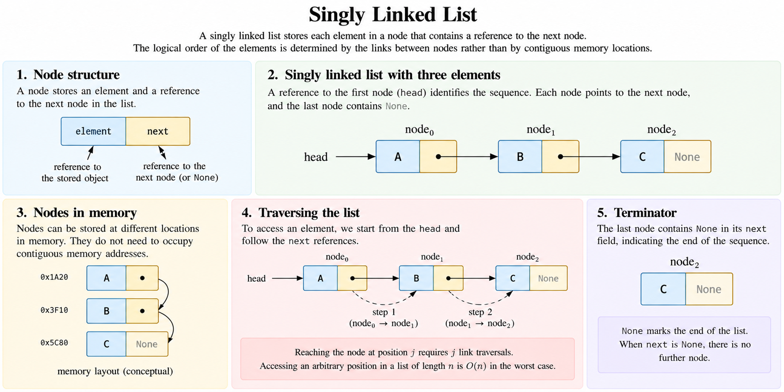{#fig-singly-linked-list}

The nodes themselves need not occupy consecutive memory locations. What matters is that each node identifies the next node in the logical sequence.

This distinction separates **logical adjacency** from **physical adjacency**:

$$
\boxed{
\text{linked sequence}
\rightarrow
\text{order determined by references, not memory position}.
}
$$

## Singly Linked Lists

A **singly linked list** is a sequence of nodes in which each node maintains a reference to its successor.

A list typically maintains a reference to its first node:

```text
head
```

and may also maintain:

```text
tail
```

to identify the final node efficiently.

If the list contains $n$ elements:

$$
v_0,v_1,\ldots,v_{n-1},
$$

their nodes satisfy:

$$
\text{node}_0.next
=
\text{node}_1,
$$

$$
\text{node}_1.next
=
\text{node}_2,
$$

and so on, until:

$$
\text{node}_{n-1}.next
=
\texttt{None}.
$$

Unlike an array, there is no address calculation analogous to:

$$
\operatorname{address}(j)
=
\operatorname{address}(0)+js.
$$

To reach the node at position $j$, traversal must begin from a known node and repeatedly follow `next`.

Starting from the head:

$$
\text{head}
\rightarrow
\text{node}_0
\rightarrow
\text{node}_1
\rightarrow
\cdots
\rightarrow
\text{node}_j.
$$

This requires $j$ link traversals.

Therefore:

$$
T_{\text{access}}(j)=O(j),
$$

and accessing an arbitrary position in a list of length $n$ has worst-case complexity:

$$
\boxed{
T_{\text{access}}(n)=O(n).
}
$$

This is the principal cost paid for abandoning contiguous positional storage.

## Insertion at the Head

Linked structures become attractive when elements must be inserted or removed without shifting the remainder of the sequence.

Suppose the list is:

$$
\texttt{head}
\longrightarrow
A
\longrightarrow
B
\longrightarrow
C.
$$

To insert a new node $X$ at the beginning, only two relationships need to change.

First:

$$
X.next
=
\texttt{head}.
$$

Then:

$$
\texttt{head}
=
X.
$$

The result is:

$$
\texttt{head}
\longrightarrow
X
\longrightarrow
A
\longrightarrow
B
\longrightarrow
C.
$$

No existing elements need to be shifted.

The amount of work does not depend on the number of nodes already stored. Therefore:

$$
\boxed{
T_{\text{insert-head}}(n)=O(1).
}
$$

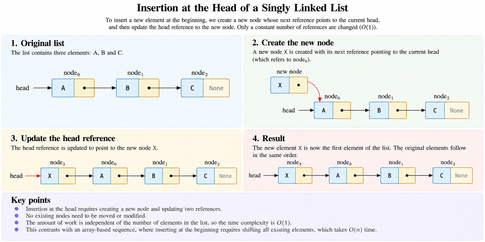{#fig-linked-list-head-insertion}

This contrasts directly with insertion at the beginning of an array-based sequence, where $n$ existing references may need to move:

$$
\begin{aligned}
\text{array insertion at head}
&\rightarrow O(n),
\\
\text{linked-list insertion at head}
&\rightarrow O(1).
\end{aligned}
$$

The improvement follows from representation, not from a different syntax for insertion.

## Deletion at the Head

Removing the first node is similarly direct.

Suppose:

$$
\texttt{head}
\longrightarrow
A
\longrightarrow
B
\longrightarrow
C.
$$

The second node can be obtained through:

$$
\texttt{head.next}.
$$

The head reference can then be changed to:

$$
\texttt{head}
=
\texttt{head.next}.
$$

The resulting structure is:

$$
\texttt{head}
\longrightarrow
B
\longrightarrow
C.
$$

Again, the number of references changed is independent of $n$:

$$
\boxed{
T_{\text{delete-head}}(n)=O(1).
}
$$

If no remaining reference reaches the removed node, it is no longer part of the linked structure and can eventually be reclaimed by Python's memory-management system.

## Insertion at the Tail

If only a `head` reference is maintained, reaching the final node requires traversing the complete list:

$$
O(n).
$$

Maintaining a `tail` reference avoids that traversal.

For a new node $X$:

$$
\texttt{tail.next}=X
$$

followed by:

$$
\texttt{tail}=X.
$$

Therefore, when the tail is explicitly maintained:

$$
T_{\text{insert-tail}}(n)=O(1).
$$

The empty-list case requires additional care because the first inserted node becomes both:

$$
\texttt{head}
$$

and:

$$
\texttt{tail}.
$$

This illustrates a recurring design principle: maintaining additional state can make an operation more efficient, but the structure must preserve that state correctly after every update.

## Deletion at the Tail

The situation is different for deletion.

Suppose:

$$
A
\longrightarrow
B
\longrightarrow
C
\longrightarrow
D.
$$

Even if `tail` directly identifies $D$, a singly linked node contains no reference to its predecessor.

To remove $D$, the structure must find $C$ so that:

$$
C.next
=
\texttt{None}
$$

and:

$$
\texttt{tail}
=
C.
$$

Finding $C$ requires traversal from the head:

$$
A
\rightarrow
B
\rightarrow
C.
$$

Therefore:

$$
\boxed{
T_{\text{delete-tail}}(n)=O(n)
}
$$

for a singly linked list.

This asymmetry is fundamental:

$$
\text{next node}
\rightarrow
\text{directly available},
$$

but:

$$
\text{previous node}
\rightarrow
\text{not directly available}.
$$

The limitation motivates doubly linked structures.

## Insertion and Deletion at an Interior Position

Suppose a new node $X$ must be inserted after a known node $A$:

$$
A
\longrightarrow
B.
$$

The update can be performed as:

$$
X.next=B
$$

followed by:

$$
A.next=X.
$$

The result is:

$$
A
\longrightarrow
X
\longrightarrow
B.
$$

Once $A$ is already known, the insertion requires only a constant number of reference updates:

$$
O(1).
$$

Deletion follows the same principle. If:

$$
A
\longrightarrow
B
\longrightarrow
C
$$

and $A$ is known, $B$ can be bypassed by setting:

$$
A.next=C.
$$

Thus deletion of the successor of a known node is also:

$$
O(1).
$$

There is an important qualification.

If the program knows only that the element is at logical position $j$, it must first traverse the list to reach the relevant node. That search requires:

$$
O(j)
$$

time.

The distinction is therefore:

$$
\boxed{
\text{locating a position}
\neq
\text{updating a known position}.
}
$$

Linked lists provide constant-time structural updates **once the required nodes are known**. They do not provide constant-time arbitrary positional access.

## Circularly Linked Lists

A singly linked list does not have to terminate with:

```python
None
```

The final node can instead refer back to the first node:

$$
A
\rightarrow
B
\rightarrow
C
\rightarrow
A.
$$

This produces a **circularly linked list**.

If a reference to the tail is maintained, the head is available through:

$$
\texttt{tail.next}.
$$

Thus a single external reference can identify both ends of the structure:

$$
\begin{aligned}
\text{tail}
&=
\texttt{tail},
\\
\text{head}
&=
\texttt{tail.next}.
\end{aligned}
$$

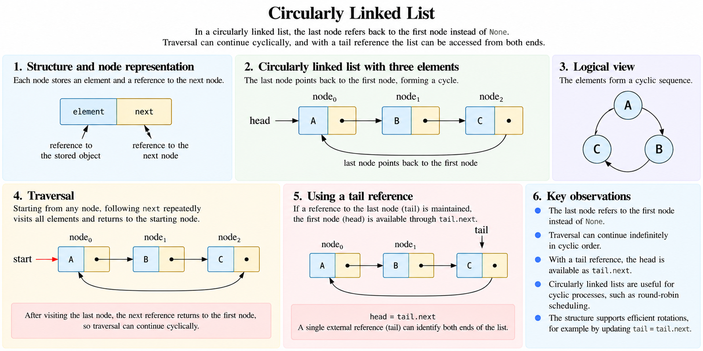{#fig-circularly-linked-list}

Circular structures are natural when processing is itself cyclic. Examples include repeated turn allocation, round-robin scheduling, cyclic buffers, and processes in which the element following the last element is conceptually the first.

A rotation can be achieved particularly simply:

```python
tail = tail.next
```

because the former head becomes the new tail and the next node becomes the new head. Goodrich uses this property to motivate circular lists for round-robin scheduling. 

The structure therefore illustrates another important relationship between representation and algorithm:

$$
\boxed{
\text{a representation that matches the problem structure can simplify the operation itself}.
}
$$

## Doubly Linked Lists

The main limitation of a singly linked list is directional asymmetry. From a node, its successor is immediately available, but its predecessor is not.

A **doubly linked list** stores both relationships.

A node can be represented conceptually as:

$$
\text{node}
=
(\text{prev},\text{element},\text{next}).
$$

For a sequence:

$$
A,B,C,
$$

the structure becomes:

$$
A
\rightleftarrows
B
\rightleftarrows
C.
$$

Each interior node has:

$$
\texttt{next}
\rightarrow
\text{successor}
$$

and:

$$
\texttt{prev}
\rightarrow
\text{predecessor}.
$$

This additional reference requires more memory per node, but provides symmetric navigation and update operations. Goodrich introduces the doubly linked representation precisely to overcome the inability of a singly linked list to efficiently identify a predecessor when only the current node is known. 

### Sentinel Nodes

Boundary conditions complicate linked-list implementations.

Without additional structure, insertion at the beginning differs from insertion in the interior because the first node has no predecessor. Similarly, deletion of the final node requires handling the absence of a successor.

A common solution is to introduce two special nodes:

- a **header sentinel** before the first real element;
- a **trailer sentinel** after the last real element.

These nodes do not represent elements of the user-visible sequence.

For:

$$
A,B,C,
$$

the representation becomes:

$$
\text{header}
\rightleftarrows
A
\rightleftarrows
B
\rightleftarrows
C
\rightleftarrows
\text{trailer}.
$$

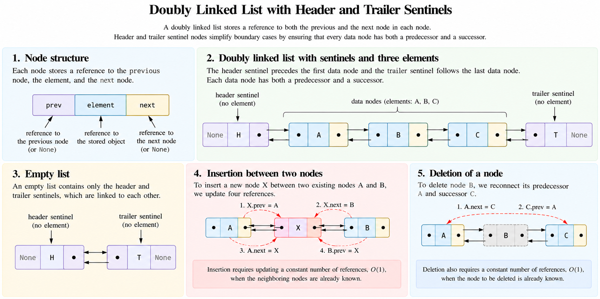{#fig-doubly-linked-list-sentinels}

An empty list can then be represented simply as:

$$
\text{header}
\rightleftarrows
\text{trailer}.
$$

The advantage is not asymptotic efficiency. The advantage is **uniformity**.

Every insertion can be treated as insertion between two existing nodes, and every data-node deletion involves a node with both a predecessor and successor. Goodrich emphasises that the small additional storage required for the sentinels removes several boundary special cases from the implementation. 

This is an example of a broader software-design principle:

$$
\boxed{
\text{a small representational cost can substantially simplify invariants and update logic}.
}
$$

## Insertion in a Doubly Linked List

Suppose two adjacent nodes are:

$$
A
\rightleftarrows
B
$$

and a new node $X$ must be inserted between them.

Initially:

$$
A.next=B
$$

and:

$$
B.prev=A.
$$

The new node is created with:

$$
X.prev=A
$$

and:

$$
X.next=B.
$$

The neighbouring references are then updated:

$$
A.next=X
$$

and:

$$
B.prev=X.
$$

The resulting structure is:

$$
A
\rightleftarrows
X
\rightleftarrows
B.
$$

Only a fixed number of references are modified. Therefore, when the neighbouring nodes are already known:

$$
\boxed{
T_{\text{insert}}(n)=O(1).
}
$$

## Deletion in a Doubly Linked List

Suppose:

$$
A
\rightleftarrows
B
\rightleftarrows
C
$$

and node $B$ must be removed.

Because $B$ directly identifies both neighbours:

$$
B.prev=A
$$

and:

$$
B.next=C.
$$

The list can bypass $B$ by setting:

$$
A.next=C
$$

and:

$$
C.prev=A.
$$

The resulting sequence is:

$$
A
\rightleftarrows
C.
$$

Again, only a constant number of references must be changed:

$$
\boxed{
T_{\text{delete}}(n)=O(1)
}
$$

when the node to be deleted is already known.

Goodrich's basic doubly linked implementation uses exactly this pattern: insertion links a new node between a predecessor and successor, while deletion directly reconnects the deleted node's two neighbours. 

This is a significant difference from a singly linked list. If only a reference to $B$ is available, the singly linked representation cannot directly determine $A$, whereas the doubly linked representation can.

## Positions and Encapsulation

A linked-list implementation could expose node objects directly to users. Doing so would allow a caller to identify locations efficiently, but it would also expose the internal representation.

A user could potentially modify links incorrectly:

```python
node.next = ...
```

and violate the structural invariants of the list.

It would also couple client code to implementation details such as sentinel nodes or the precise node representation.

A stronger abstraction separates the notion of a **position** from the node used internally to implement it.

A position represents the location of an element in a sequence:

$$
\text{position}
\rightarrow
\text{location in the collection},
$$

while the underlying node remains encapsulated.

A positional-list interface can then provide operations such as:

```text
first()
last()
before(p)
after(p)
```

and updates such as:

```text
add_before(p, value)
add_after(p, value)
delete(p)
replace(p, value)
```

without exposing node manipulation.

This separation is important conceptually:

$$
\boxed{
\text{ADT interface}
\neq
\text{internal representation}.
}
$$

Goodrich's positional-list ADT explicitly introduces a `Position` abstraction for this reason: direct node references would expose low-level implementation details, weaken structural integrity, and make future changes to the representation more difficult. 

If implemented using a doubly linked list, operations relative to an already known valid position can be performed in worst-case:

$$
O(1)
$$

time. :chatgpt-content-reference{index="5"}

This provides an important example of **encapsulation** in data-structure design. The efficient mechanism is retained internally while the public interface expresses the logical abstraction rather than the storage details.

## Array-Based and Link-Based Sequences

Array-based and linked sequences represent different compromises rather than a hierarchy in which one structure is universally superior.

The central differences can be summarised as:

| Property | Array-based sequence | Linked sequence |
|:---:|:---:|:---:|
| Indexed access | $O(1)$ | $O(n)$ worst case |
| Traverse all elements | $O(n)$ | $O(n)$ |
| Insert at known linked position | Requires shifting in general | $O(1)$ |
| Delete at known linked position | Requires shifting in general | $O(1)$ |
| Memory layout | Contiguous references | Separate node objects |
| Extra structural storage | Capacity overhead | Link references per node |
| Growth | May require resizing | Node-by-node allocation |

The asymptotic comparison is only part of the decision.

Array-based structures generally benefit from simpler representation, lower per-element structural overhead, and better memory locality. Linked structures require node allocation and additional references, and traversal follows objects that need not be contiguous in memory. Goodrich notes that even operations with the same asymptotic complexity can therefore have different constant factors, and that linked structures generally require more auxiliary storage per element. 

Linked structures, however, provide strong guarantees for structural updates. Once the relevant location is known, insertion or deletion can modify a constant number of links without shifting the remaining elements. They also avoid the occasional large resizing operation required by a dynamic array. 

The choice should therefore follow the operations required by the problem:

$$
\boxed{
\text{representation}
\rightarrow
\text{available operations}
\rightarrow
\text{computational costs}.
}
$$

This principle is more general than the comparison between arrays and linked lists. A data structure is useful because its representation makes some operations efficient while accepting costs elsewhere.

The next step is to separate this implementation question from the **abstract behaviour** expected by a data structure. Stacks, queues, and deques provide a clear example: each specifies how elements may enter and leave a collection, while several different internal representations can be used to implement that behaviour.

# Stacks, Queues, and Deques

A data structure can be described at different levels of abstraction.

At the implementation level, we may ask whether elements are stored in a dynamic array, a linked structure, or some other representation.

At the interface level, however, the important question is often different:

> Which operations are permitted, and what behaviour must those operations provide?

An **abstract data type** (ADT) defines a collection through its operations and their semantics without prescribing a particular internal representation.

This distinction can be expressed as:

$$
\boxed{
\text{ADT}
=
\text{behaviour and interface}
\neq
\text{implementation}.
}
$$

Stacks, queues, and deques illustrate this principle particularly clearly. All three maintain collections of elements, but they impose different rules on where elements may be inserted, accessed, and removed.

## Stacks

A **stack** stores elements according to the **last-in, first-out** principle:

$$
\text{LIFO}
=
\text{Last In, First Out}.
$$

The most recently inserted element is the first one that can be removed.

Conceptually:

```text
        top
         ↓
       ┌───┐
       │ D │  <- most recently inserted
       ├───┤
       │ C │
       ├───┤
       │ B │
       ├───┤
       │ A │  <- first inserted
       └───┘
```

If the insertion order is:

$$
A,B,C,D,
$$

the removal order is:

$$
D,C,B,A.
$$

The structure therefore exposes only one distinguished end: the **top**.

### The Stack ADT

The fundamental stack operations are:

```text
push(e)
pop()
top()
```

with supporting operations:

```text
is_empty()
len()
```

Their semantics are:

| Operation | Behaviour |
|:---:|:---:|
| `push(e)` | Add `e` to the top |
| `pop()` | Remove and return the top element |
| `top()` | Return the top element without removing it |
| `is_empty()` | Determine whether the stack contains no elements |
| `len()` | Return the number of elements |

Calling `pop()` or `top()` on an empty stack is an invalid operation and should be handled explicitly by the implementation.

Goodrich defines the stack ADT in precisely these LIFO terms, separating its permitted operations from the representation used to implement them. 

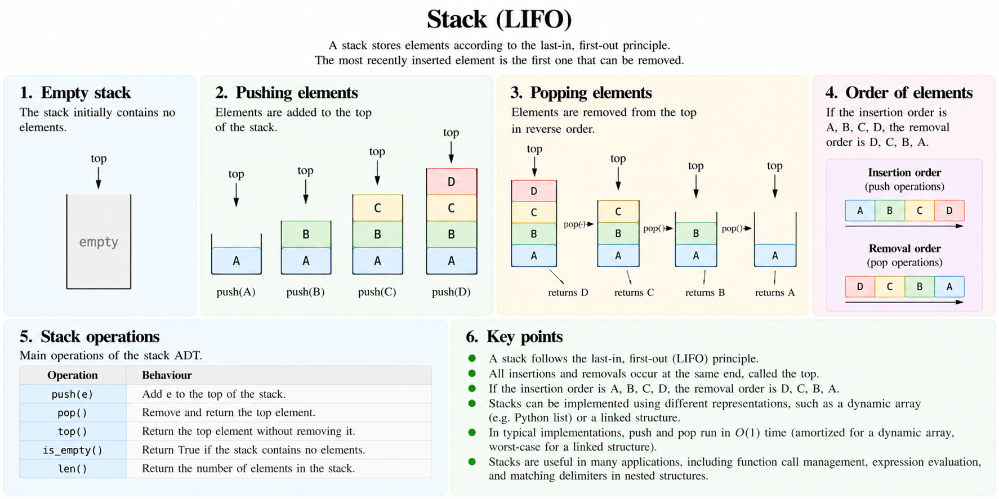{#fig-stack-lifo}

### Array-Based Stack

A Python list provides a natural representation for a stack if the end of the list is treated as the top.

The correspondence is:

$$
\begin{aligned}
\texttt{push(e)}
&\rightarrow
\texttt{append(e)},
\\
\texttt{pop()}
&\rightarrow
\texttt{pop()},
\\
\texttt{top()}
&\rightarrow
\texttt{data[-1]}.
\end{aligned}
$$

For example:

```python
stack = []

stack.append("A")
stack.append("B")
stack.append("C")

value = stack.pop()
```

After the three insertions:

```text
[A, B, C]
       ↑
      top
```

and:

```python
stack.pop()
```

returns:

```text
C
```

without requiring any remaining element to be shifted.

Because the right end of a Python list corresponds to the end of its dynamic array, both insertion and removal there have amortized constant cost:

$$
\texttt{push}=O(1)
\quad\text{amortized},
$$

$$
\texttt{pop}=O(1)
\quad\text{amortized}.
$$

Accessing the top element is:

$$
O(1).
$$

A formal stack class can therefore be implemented as an **adapter** around a list: the list provides the storage mechanism while the stack interface exposes only the operations appropriate to the ADT.

This restriction is meaningful. A Python list also permits:

```python
data.insert(3, value)
data.pop(2)
data[5] = value
```

but those operations do not belong to the stack abstraction.

Thus:

$$
\boxed{
\text{using a list as storage}
\neq
\text{exposing the complete list interface}.
}
$$

Goodrich uses this array-based implementation to illustrate exactly this separation: Python's list already provides the necessary end operations, but it also exposes behaviours that a stack should not permit. 

### Linked Stack

The same ADT can instead be implemented with a singly linked list.

If the head represents the top:

$$
\texttt{top}
\longrightarrow
A
\longrightarrow
B
\longrightarrow
C,
$$

then `push` is insertion at the head and `pop` is deletion at the head.

From the previous section:

$$
T_{\text{insert-head}}(n)=O(1)
$$

and:

$$
T_{\text{delete-head}}(n)=O(1).
$$

Therefore:

$$
\begin{aligned}
\texttt{push}
&=O(1),
\\
\texttt{pop}
&=O(1),
\\
\texttt{top}
&=O(1).
\end{aligned}
$$

Unlike the dynamic-array implementation, these update bounds are worst-case rather than amortized.

The observable stack behaviour is unchanged.

This demonstrates why ADT and implementation must be kept conceptually separate:

$$
\boxed{
\text{same abstraction}
\rightarrow
\text{different representations}.
}
$$

### Stacks and Reversal

The LIFO rule naturally reverses order.

Suppose elements are pushed in the sequence:

$$
x_0,x_1,x_2,\ldots,x_{n-1}.
$$

The first element removed is:

$$
x_{n-1},
$$

followed by:

$$
x_{n-2},
$$

and eventually:

$$
x_0.
$$

Thus:

$$
\boxed{
\text{push in forward order}
+
\text{pop all elements}
=
\text{reverse order}.
}
$$

This simple property makes stacks useful whenever a computation must later revisit information in the opposite order from which it was encountered.

The recursion call stack studied earlier is an important example. Function calls accumulate in one order and complete in the reverse order.

### Matching Delimiters

Stacks also arise naturally when processing **nested structures**.

Consider:

```text
{[(a + b) * c] - d}
```

Each opening delimiter must eventually be matched by a corresponding closing delimiter, and nested delimiters must close in reverse order.

When an opening delimiter is encountered:

```text
(
[
{
```

it is pushed onto a stack.

When a closing delimiter is encountered:

```text
)
]
}
```

the top opening delimiter is popped and checked.

For:

```text
{ [ ( ) ] }
```

the opening delimiters arrive as:

$$
\{,\ [,\ (
$$

and must close as:

$$
),\ ],\ \}.
$$

That is exactly LIFO behaviour.

The algorithm can be expressed conceptually as:

```python
for token in expression:
    if token is opening:
        stack.push(token)

    elif token is closing:
        if stack.is_empty():
            return False

        if not matches(stack.pop(), token):
            return False

return stack.is_empty()
```

Each token is processed at most once and each stack operation is constant time, so for $n$ tokens:

$$
\boxed{
T(n)=O(n).
}
$$

The same structural principle can be used for nested markup such as paired HTML tags. Goodrich uses both delimiter matching and HTML tag matching as applications of the stack ADT. 

The important point is not the particular syntax of parentheses or tags. A stack is appropriate because **nested structures close in the reverse order in which they open**.

## Queues

A **queue** follows the **first-in, first-out** principle:

$$
\text{FIFO}
=
\text{First In, First Out}.
$$

Elements enter at the **back** and leave from the **front**.

If the insertion order is:

$$
A,B,C,D,
$$

the removal order is:

$$
A,B,C,D.
$$

Conceptually:

```text
front                         back
  ↓                             ↓
[A] -> [B] -> [C] -> [D]
```

The element that has waited longest is processed first.

### The Queue ADT

The fundamental operations are:

```text
enqueue(e)
dequeue()
first()
```

together with:

```text
is_empty()
len()
```

Their semantics are:

| Operation | Behaviour |
|:---:|:---:|
| `enqueue(e)` | Add `e` to the back |
| `dequeue()` | Remove and return the front element |
| `first()` | Return the front element without removing it |
| `is_empty()` | Determine whether the queue is empty |
| `len()` | Return the number of elements |

Goodrich defines the queue ADT through this FIFO discipline: insertion occurs at the back while access and deletion occur at the front. :chatgpt-content-reference{index="3"}

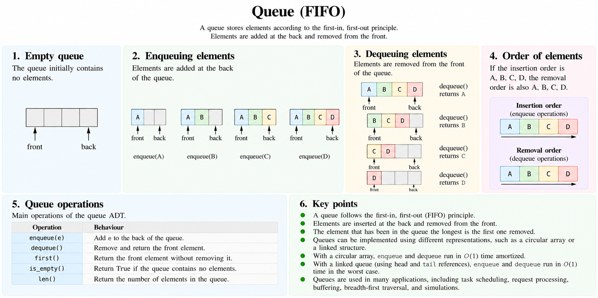{#fig-queue-fifo}

Queues appear whenever arrival order matters: task scheduling, request processing, buffering, breadth-first traversal, simulations, and producer-consumer systems all contain queue-like behaviour.

## Why `list.pop(0)` Is a Poor Queue

A direct implementation might use:

```python
queue = []

queue.append(value)
queue.pop(0)
```

The semantics appear correct:

- `append` inserts at the back;
- `pop(0)` removes from the front.

The representation, however, makes dequeue inefficient.

Suppose:

```text
[A, B, C, D]
```

is stored in a contiguous array and `A` is removed.

The remaining references must shift:

```text
before:
[A, B, C, D]

after removing A:
[_, B, C, D]

after shifting:
[B, C, D, _]
```

Approximately $n-1$ references may need to move.

Therefore:

$$
\boxed{
\texttt{list.pop(0)}=\Theta(n).
}
$$

Goodrich identifies precisely this problem with the naïve array-based queue: although `append` is efficient, removing index zero forces all subsequent elements to shift. :chatgpt-content-reference{index="4"}

This is an important example of why selecting a data structure based only on convenient syntax can be misleading.

The question should instead be:

$$
\boxed{
\text{does the representation support the required operations efficiently?}
}
$$

## Circular Arrays

An efficient array-based queue avoids shifting elements.

Instead of requiring the front element to remain at index zero, the queue maintains the index of its current front.

Suppose an underlying array has capacity:

$$
N.
$$

If the front is at index:

$$
f,
$$

and the queue contains:

$$
s
$$

elements, the next free position at the back can be calculated as:

$$
\boxed{
(f+s)\bmod N.
}
$$ {#eq-circular-queue-back}

The modulo operation allows the logical queue to wrap around the end of the physical array.

For example, with capacity:

$$
N=8,
$$

a queue might occupy:

```text
index:    0   1   2   3   4   5   6   7
        +---+---+---+---+---+---+---+---+
data:   | G | H |   |   |   | D | E | F |
        +---+---+---+---+---+---+---+---+
                              ↑
                            front
```

The logical order is:

$$
D,E,F,G,H,
$$

even though the physical representation crosses the array boundary.

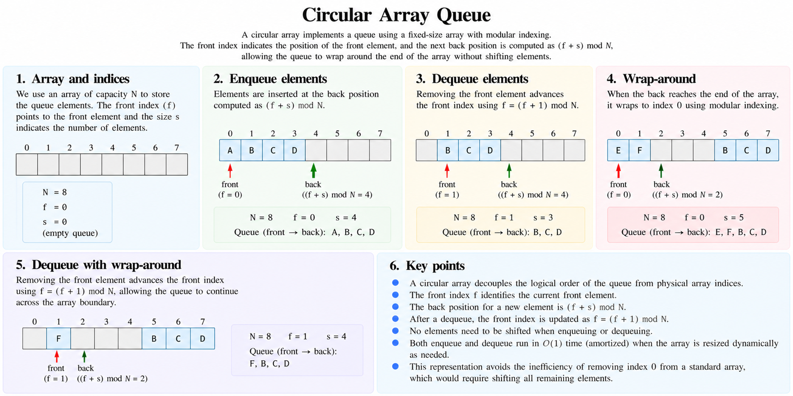{#fig-circular-array-queue}

If the front element is removed, the new front index is:

$$
f_{\text{new}}
=
(f+1)\bmod N.
$$ {#eq-circular-queue-front}

No elements need to move.

Similarly, the next enqueue position is determined by modular arithmetic rather than by shifting the existing queue.

Goodrich develops the circular-array representation specifically to prevent the front from forcing repeated shifts or allowing unused space to accumulate indefinitely before the logical queue. 

### Queue Complexity

With a circular dynamic array:

$$
\begin{aligned}
\texttt{first}
&=O(1),
\\
\texttt{is\_empty}
&=O(1),
\\
\texttt{len}
&=O(1).
\end{aligned}
$$

Insertion and deletion are also constant time except when resizing is required.

Therefore:

$$
\boxed{
\texttt{enqueue}=O(1)
\text{ amortized},
}
$$

and:

$$
\boxed{
\texttt{dequeue}=O(1)
\text{ amortized}.
}
$$

The storage requirement for $n$ elements is:

$$
O(n).
$$

These are the bounds established by Goodrich for the array-based queue implementation. 

The analysis combines two ideas developed earlier:

$$
\text{circular indexing}
+
\text{dynamic-array resizing}.
$$

Modular arithmetic prevents shifting, while geometric resizing provides amortized constant-time growth.

## Linked Queues

A queue can also be implemented using a singly linked list.

Maintain:

```text
head -> front
tail -> back
```

For:

$$
A,B,C,
$$

the structure is:

```text
front                         back
  ↓                             ↓
[A] -> [B] -> [C] -> None
 ↑                 ↑
head              tail
```

To enqueue a new element $D$:

$$
\texttt{tail.next}
=
D,
$$

then:

$$
\texttt{tail}
=
D.
$$

To dequeue:

$$
\texttt{head}
=
\texttt{head.next}.
$$

Both require only a constant number of reference updates.

Thus:

$$
\begin{aligned}
\texttt{enqueue}
&=O(1),
\\
\texttt{dequeue}
&=O(1),
\\
\texttt{first}
&=O(1).
\end{aligned}
$$

These are worst-case bounds.

Again, the FIFO semantics are independent of the representation:

$$
\boxed{
\text{Queue ADT}
\rightarrow
\begin{cases}
\text{circular dynamic array},\\
\text{singly linked list}.
\end{cases}
}
$$

## Double-Ended Queues

A **double-ended queue**, or **deque**, generalises both stacks and queues by allowing insertion and deletion at either end.

Its fundamental update operations are:

```text
add_first(e)
add_last(e)
delete_first()
delete_last()
```

and its accessors include:

```text
first()
last()
is_empty()
len()
```

Goodrich defines the deque ADT symmetrically in exactly this way. 

Conceptually:

```text
       front                    back
         ↓                        ↓
     [ A ] <-> [ B ] <-> [ C ] <-> [ D ]
       ↑                           ↑
 insert/delete                 insert/delete
```

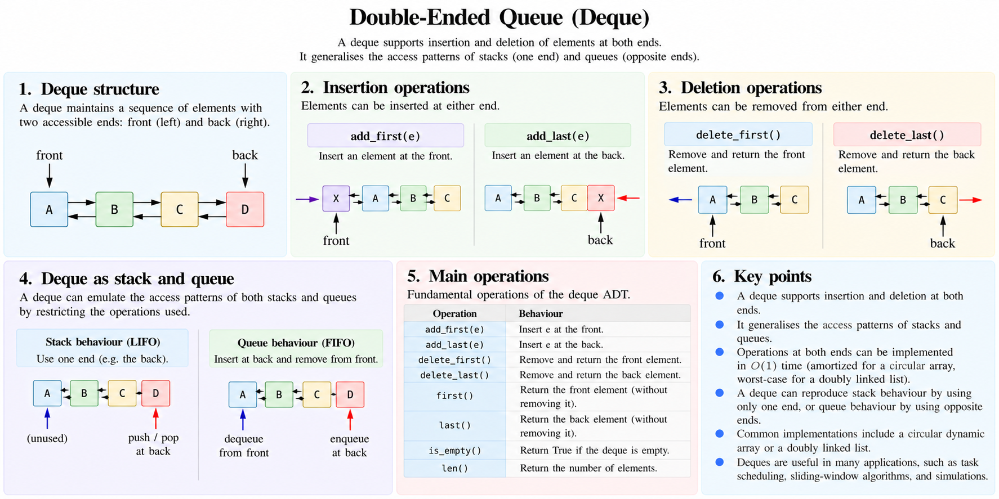{#fig-deque-operations}

A deque can reproduce stack behaviour by using only one end:

$$
\text{push}
\rightarrow
\texttt{add\_last},
$$

$$
\text{pop}
\rightarrow
\texttt{delete\_last}.
$$

It can reproduce queue behaviour by inserting at one end and removing from the other:

$$
\text{enqueue}
\rightarrow
\texttt{add\_last},
$$

$$
\text{dequeue}
\rightarrow
\texttt{delete\_first}.
$$

Thus, in terms of permitted operations:

$$
\boxed{
\text{deque}
\supset
\text{stack and queue access patterns}.
}
$$

This does not mean that every application should use the most general possible interface. Restricting operations can express important invariants about how a collection is intended to be used.

## Implementing a Deque

A deque can be implemented with a circular dynamic array.

If the current front index is:

$$
f,
$$

moving one position backward can be calculated as:

$$
f_{\text{new}}
=
(f-1)\bmod N.
$$

The index of the current last element can be calculated from the front and current size:

$$
\boxed{
\text{back}
=
(f+s-1)\bmod N.
}
$$ {#eq-deque-back-index}

This allows both ends of the logical sequence to move through the physical array without shifting the existing elements. Goodrich describes the array-based deque as a direct extension of the circular-array queue, using the same front, size, and modular-indexing principles. 

A doubly linked list is another natural representation.

Because each node has both:

```text
prev
next
```

and the structure can maintain direct access to both boundaries, insertion and deletion at either end require only a constant number of link updates.

The two implementations therefore provide similar asymptotic interfaces:

| Operation | Circular dynamic array | Doubly linked list |
|:---:|:---:|:---:|
| Add first | $O(1)$ amortized | $O(1)$ |
| Add last | $O(1)$ amortized | $O(1)$ |
| Delete first | $O(1)$ amortized | $O(1)$ |
| Delete last | $O(1)$ amortized | $O(1)$ |
| First | $O(1)$ | $O(1)$ |
| Last | $O(1)$ | $O(1)$ |
| Space | $O(n)$ | $O(n)$ |

Again, equal asymptotic bounds do not imply identical practical behaviour. Array-based implementations and linked implementations differ in memory layout, allocation patterns, resizing behaviour, and constant factors.

## Python and `collections.deque`

Python provides a general-purpose deque in the `collections` module:

```python
from collections import deque
```

Its interface naturally supports operations at both ends:

```python
data = deque()

data.append("A")
data.append("B")
data.appendleft("C")

data.pop()
data.popleft()
```

Conceptually:

```text
appendleft(e)  -> add at front
append(e)      -> add at back
popleft()      -> remove from front
pop()          -> remove from back
```

For queue-like code, this interface expresses the required behaviour more directly than repeatedly removing index zero from a Python list.

For example:

```python
from collections import deque

queue = deque()

queue.append("A")
queue.append("B")
queue.append("C")

first = queue.popleft()
```

The intent is immediately visible:

$$
\text{insert at back}
+
\text{remove from front}
\rightarrow
\text{FIFO queue}.
$$

Similarly, using:

```python
append()
pop()
```

on one end produces LIFO behaviour.

The broader lesson is not simply to prefer one Python class over another. It is to choose a structure whose supported operations correspond to the semantics and performance requirements of the problem.

## Choosing the Appropriate ADT

Stacks, queues, and deques differ primarily in the order in which elements become available.

A stack answers:

> Which element was inserted most recently?

A queue answers:

> Which element has been waiting longest?

A deque permits:

> Which element should be processed from either boundary?

Their access disciplines can be summarised as:

$$
\begin{aligned}
\text{Stack}
&\rightarrow
\text{LIFO},
\\
\text{Queue}
&\rightarrow
\text{FIFO},
\\
\text{Deque}
&\rightarrow
\text{both ends}.
\end{aligned}
$$

The choice of ADT should therefore precede the choice of representation.

First determine the required behaviour:

$$
\text{problem}
\rightarrow
\text{ADT}.
$$

Then determine how that abstraction should be implemented:

$$
\text{ADT}
\rightarrow
\text{representation}.
$$

Together:

$$
\boxed{
\text{problem}
\rightarrow
\text{abstraction}
\rightarrow
\text{representation}
\rightarrow
\text{complexity}.
}
$$

This sequence of decisions is one of the central ideas of data-structure design.

The same distinction becomes even more important for hierarchical data. A tree defines relationships between parents, children, ancestors, and descendants independently of whether those relationships are represented through linked nodes or an array. Trees therefore provide the next major step from linear collections to structured, non-linear data.

# Object-Oriented Programming

Python's object model provides more than built-in types such as integers, strings, lists, and dictionaries. Programmers can define new types whose objects combine state with operations that act on that state.

This capability is particularly important for data structures.

A stack, linked list, tree, priority queue, or graph is not merely a collection of functions operating on unrelated variables. Each represents a coherent abstraction with:

- internal state;
- structural invariants;
- permitted operations;
- defined behaviour.

Object-oriented programming provides one way to express that relationship directly.

A **class** defines the structure and behaviour associated with a type of object, while an **instance** is a particular object created according to that definition.

Conceptually:

$$
\boxed{
\text{class}
\rightarrow
\text{instances}
}
$$

and each instance combines:

$$
\boxed{
\text{state}
+
\text{behaviour}.
}
$$

This complements the distinction introduced earlier between an abstract data type and its implementation. An ADT specifies what behaviour a structure should provide; a class can provide a concrete Python implementation of that abstraction.

## Classes and Instances

Consider a simple two-dimensional point:

```python
class Point:
    def __init__(self, x, y):
        self.x = x
        self.y = y

    def distance_squared(self):
        return self.x**2 + self.y**2
```

Creating:

```python
p = Point(3, 4)
```

produces an instance of `Point`.

The instance maintains state:

```python
p.x
p.y
```

and provides behaviour:

```python
p.distance_squared()
```

The relationship can be represented conceptually as:

```text
          Point
            │
        instantiation
            │
            ▼
      ┌─────────────┐
 p -> │ x = 3       │
      │ y = 4       │
      │-------------│
      │ behaviour   │
      └─────────────┘
```

The object `p` has its own identity, type, and state, consistent with the Python object model developed earlier.

A second instance:

```python
q = Point(8, 2)
```

has the same type:

```python
type(p) is type(q)
```

but a different identity and potentially different state.

Thus:

$$
\text{same class}
\not\Rightarrow
\text{same object}.
$$

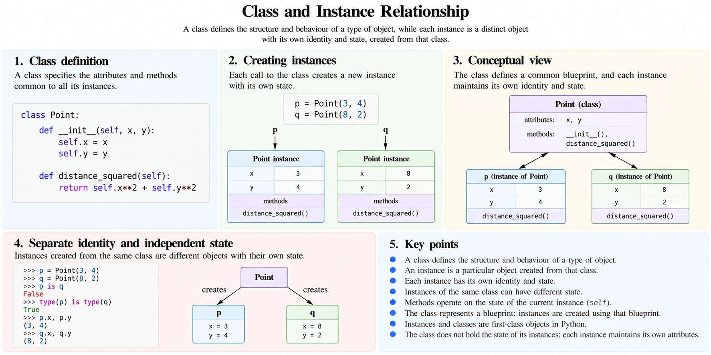{#fig-class-instance-relationship}

## Instance State and `self`

Inside an instance method, Python conventionally names the current instance:

```python
self
```

For:

```python
p.distance_squared()
```

the method operates on `p`.

Conceptually, the call corresponds to passing the instance to the method:

```python
Point.distance_squared(p)
```

This explains expressions such as:

```python
self.x
```

They mean:

> retrieve the attribute named `x` from the current instance.

The name `self` is not a special keyword. It is a strong Python convention that makes the role of the first instance-method parameter explicit.

Each instance can therefore maintain independent state:

```python
p = Point(3, 4)
q = Point(8, 2)

p.x = 10
```

Changing `p.x` does not change `q.x`, because `p` and `q` are different objects.

The state belongs to the instances, not to the local execution of the method.

## Construction and `__init__`

The method:

```python
__init__
```

is invoked as part of instance initialisation.

For:

```python
p = Point(3, 4)
```

Python creates a new instance and then uses:

```python
Point.__init__(p, 3, 4)
```

to initialise its state.

A typical constructor therefore establishes the object's initial **invariants**.

Suppose a bounded counter should never begin with a negative limit:

```python
class Counter:
    def __init__(self, limit):
        if limit < 0:
            raise ValueError("limit must be non-negative")

        self.limit = limit
        self.value = 0
```

The constructor prevents the object from beginning in an invalid state.

This is an important responsibility of class design:

$$
\boxed{
\text{construction}
\rightarrow
\text{establish valid state}.
}
$$

Later methods should preserve the relevant invariants as the object changes.

For a linked list, for example, those invariants concern relationships between nodes. For a heap, they will include structural and ordering properties. For a search tree, they will involve relationships between keys and subtrees.

## Instance and Class Attributes

Attributes do not all have the same ownership.

An **instance attribute** belongs to a particular instance:

```python
self.x = x
```

A **class attribute** belongs to the class object itself and is shared through the class namespace:

```python
class Point:
    dimensions = 2
```

Then:

```python
Point.dimensions
```

and normally:

```python
p.dimensions
```

both resolve to:

```text
2
```

unless the instance defines an attribute of the same name.

This distinction matters particularly for mutable objects.

Consider:

```python
class Container:
    values = []
```

The list is created as a class attribute. Instances that access it without shadowing the name therefore reach the same mutable object.

That may produce unintended shared state.

If each instance should own an independent list, it belongs in the instance initialisation:

```python
class Container:
    def __init__(self):
        self.values = []
```

This is another manifestation of the aliasing and mutability principles introduced earlier. Object-oriented syntax does not change Python's underlying reference semantics.

## Encapsulation

A class should expose the behaviour needed by its clients without requiring those clients to depend on unnecessary implementation details.

This principle is **encapsulation**.

Suppose a stack is implemented using:

```python
self._data = []
```

Client code should interact through operations such as:

```python
stack.push(value)
stack.pop()
stack.top()
```

rather than manipulating:

```python
stack._data
```

directly.

The distinction is:

$$
\begin{aligned}
\text{public interface}
&\rightarrow
\text{what clients may rely on},
\\
\text{internal representation}
&\rightarrow
\text{how the behaviour is implemented}.
\end{aligned}
$$

If clients depend only on the public interface, the implementation may later change:

$$
\text{dynamic array}
\rightarrow
\text{linked representation}
$$

without requiring client code to change.

This is one of the principal benefits of encapsulation: implementation decisions can evolve while the abstraction remains stable. Goodrich emphasises this separation between public interfaces and internal details as a central object-oriented design principle. 

### Non-Public Members

Python does not enforce strict private access in the same manner as some languages.

By convention, a name beginning with a single underscore:

```python
_data
```

communicates that the member is intended for internal use.

For example:

```python
class Stack:
    def __init__(self):
        self._data = []
```

The underscore does not make `_data` inaccessible. It communicates an interface boundary:

> client code should not rely on this member.

Goodrich similarly describes the leading underscore as Python's convention for members that are considered non-public implementation details. 

Encapsulation in Python therefore depends substantially on disciplined interface design rather than absolute access restriction.

## Methods and Object Behaviour

Methods define operations associated with objects.

Consider:

```python
class Counter:
    def __init__(self):
        self._value = 0

    def increment(self):
        self._value += 1

    def value(self):
        return self._value
```

The object maintains state:

$$
\texttt{\_value}
$$

and exposes controlled operations over that state.

This is often preferable to allowing arbitrary external mutation because methods can preserve invariants.

For example:

```python
def increment(self):
    if self._value == self._limit:
        raise ValueError("counter limit reached")

    self._value += 1
```

can ensure:

$$
0\leq\texttt{\_value}\leq\texttt{\_limit}.
$$

The public method is therefore not merely syntactic packaging around an assignment. It defines a valid transition between object states.

This perspective becomes especially useful for mutable data structures:

$$
\boxed{
\text{method}
=
\text{controlled state transition}.
}
$$

## Special Methods

Python allows user-defined classes to participate in the language's standard syntax through **special methods**, conventionally written with double underscores.

Examples include:

```text
__len__
__getitem__
__setitem__
__contains__
__iter__
__eq__
__lt__
__str__
__repr__
```

These methods connect an object's implementation to Python syntax.

For example:

```python
len(obj)
```

can invoke:

```python
obj.__len__()
```

while:

```python
obj[j]
```

can invoke:

```python
obj.__getitem__(j)
```

and:

```python
x in obj
```

may be supported through:

```python
obj.__contains__(x)
```

or related iteration behaviour.

Thus Python's operators and built-in functions form part of an extensible object protocol.

The relationship is conceptually:

$$
\boxed{
\text{Python syntax}
\rightarrow
\text{special method protocol}
\rightarrow
\text{object behaviour}.
}
$$

Goodrich uses this mechanism extensively when constructing custom sequence-like classes and data structures. 

### Operator Overloading

Special methods also allow operators to acquire meanings appropriate to a user-defined type.

For example, a vector class might define:

```python
def __add__(self, other):
    ...
```

so that:

```python
u + v
```

produces vector addition.

This is **operator overloading**: the operator remains syntactically the same, but its behaviour depends on the types of its operands.

This should preserve the conceptual meaning expected from the abstraction. Defining:

```python
u + v
```

is useful when addition has a natural interpretation for the type. Overloading operators with surprising or unrelated behaviour weakens rather than improves the interface.

Special methods are therefore most useful when they make a custom object behave naturally within Python's existing protocols.

## Sequence Protocols

Consider a custom sequence class that supports:

```python
len(sequence)
```

and:

```python
sequence[j]
```

through:

```python
__len__()
```

and:

```python
__getitem__()
```

respectively.

Those two operations already establish a substantial part of sequence behaviour.

A simplified structure might be:

```python
class Sequence:
    def __len__(self):
        ...

    def __getitem__(self, j):
        ...
```

Higher-level operations can then be expressed in terms of those primitive behaviours.

For example, membership can conceptually be implemented as:

```python
def __contains__(self, value):
    for j in range(len(self)):
        if self[j] == value:
            return True

    return False
```

The implementation does not need to know whether the sequence internally uses:

- an array;
- a linked structure;
- a mathematical formula;
- some other representation.

It relies only on the public behaviours:

$$
\texttt{len(self)}
$$

and:

$$
\texttt{self[j]}.
$$

This is a powerful abstraction principle:

$$
\boxed{
\text{higher-level behaviour can be constructed from a small primitive interface}.
}
$$

Goodrich uses the `Sequence` abstraction to demonstrate exactly this relationship: operations such as membership, `index`, and `count` can be defined generically once length and indexed access are supplied. :chatgpt-content-reference{index="4"}

## Iteration

Python's iteration model is also protocol-based.

When evaluating:

```python
for value in collection:
    process(value)
```

Python needs a mechanism for obtaining elements successively from `collection`.

An **iterator** is an object that represents the state of such a traversal.

Conceptually:

$$
\text{iterable}
\rightarrow
\text{iterator}
\rightarrow
x_0,x_1,x_2,\ldots
$$

Python's iterator protocol centres on:

```python
__iter__()
```

and:

```python
__next__()
```

Calling:

```python
iter(collection)
```

requests an iterator.

Repeated calls to:

```python
next(iterator)
```

produce successive values until the iterator signals that no values remain.

This separates two concepts:

$$
\begin{aligned}
\text{iterable}
&\rightarrow
\text{object that can produce an iterator},
\\
\text{iterator}
&\rightarrow
\text{object representing one traversal}.
\end{aligned}
$$

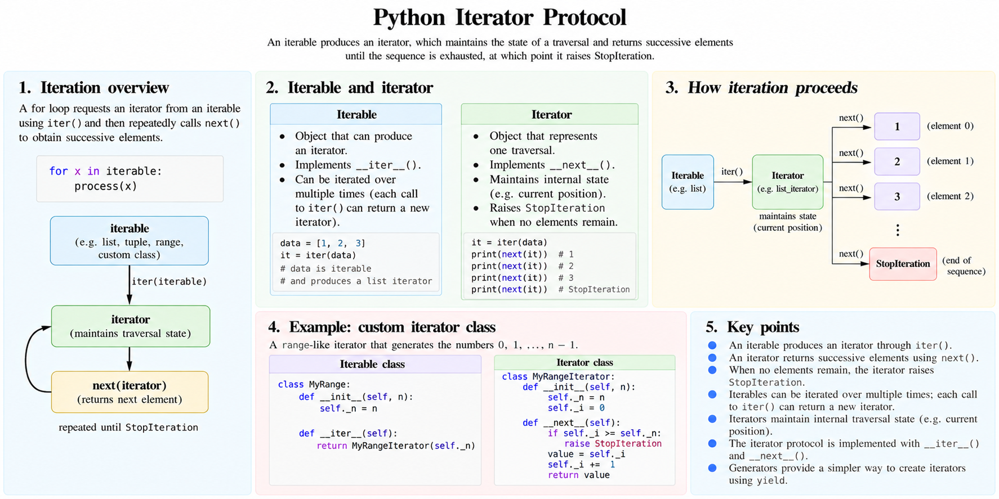{#fig-python-iterator-protocol}

The distinction allows multiple independent traversals over the same collection because each iterator can maintain its own traversal state.

Iteration is therefore not merely syntax associated with `for`. It is an interface between an algorithm and a collection.

An algorithm can request:

> give me the next element

without knowing how the collection stores that element internally.

This is another example of abstraction through protocol.

## Generators

Python provides **generators** as a concise way to implement iterative behaviour.

A function containing:

```python
yield
```

does not behave like an ordinary function that computes a single result and terminates. Instead, its execution can suspend while preserving local state and later resume from that point.

For example:

```python
def countdown(n):
    while n > 0:
        yield n
        n -= 1
```

Using:

```python
for value in countdown(3):
    print(value)
```

produces:

```text
3
2
1
```

without first constructing:

```python
[3, 2, 1]
```

as a complete collection.

The generator therefore separates:

$$
\text{producing values}
$$

from:

$$
\text{storing all values simultaneously}.
$$

For a sequence of $n$ generated values, eager materialisation may require:

$$
O(n)
$$

additional storage.

A generator can often retain only the state needed to produce the next value:

$$
O(1)
$$

additional state for simple generators such as the example above.

The precise space requirement depends on the generator's internal state, but the broader principle is important:

$$
\boxed{
\text{iteration does not require materialising an entire collection}.
}
$$

This becomes valuable when processing large data streams, traversing structures, or constructing algorithmic pipelines.

## Inheritance

A class can reuse and specialise behaviour defined by another class through **inheritance**.

Suppose:

```python
class Base:
    ...
```

and:

```python
class Derived(Base):
    ...
```

Then `Derived` is a subclass of `Base`, while `Base` is its superclass.

Conceptually:

$$
\text{Base}
\longrightarrow
\text{Derived}.
$$

The subclass inherits available behaviour from the superclass and may:

- use inherited methods unchanged;
- add new behaviour;
- override inherited behaviour.

Goodrich describes inheritance in terms of **specialisation** and **extension**: a subclass may refine existing behaviour while also introducing capabilities not present in its superclass. 

### Extending a Class

Suppose a base class defines:

```python
class Collection:
    def __init__(self):
        self._size = 0

    def __len__(self):
        return self._size
```

A subclass can inherit the length behaviour and add operations specific to its abstraction.

The inherited implementation need not be rewritten.

This can reduce duplication when several related classes genuinely share behaviour and invariants.

### Overriding

A subclass may provide a new implementation of an inherited method.

For example:

```python
class BaseCollection:
    def describe(self):
        return "collection"


class SortedCollection(BaseCollection):
    def describe(self):
        return "sorted collection"
```

Calling:

```python
obj.describe()
```

uses the implementation appropriate to the actual object.

Overriding allows a subclass to specialise inherited behaviour while retaining the broader interface.

Goodrich also notes that overriding can improve efficiency. A generic sequence might implement membership through linear traversal, while a specialised representation may be able to determine membership more efficiently. :chatgpt-content-reference{index="6"}

This connects inheritance directly to algorithmic design:

$$
\boxed{
\text{same interface}
+
\text{specialised representation}
\rightarrow
\text{specialised algorithm}.
}
$$

## `super()`

A subclass sometimes needs to extend rather than replace the initialisation or behaviour of its superclass.

Python provides:

```python
super()
```

for cooperative access to inherited behaviour.

For example:

```python
class NamedPoint(Point):
    def __init__(self, x, y, name):
        super().__init__(x, y)
        self.name = name
```

The superclass establishes:

```python
x
y
```

while the subclass adds:

```python
name
```

This avoids duplicating the superclass initialisation logic.

The design principle is:

$$
\boxed{
\text{reuse established behaviour rather than reproduce it}.
}
$$

Inheritance is most valuable when the subclass genuinely satisfies the conceptual relationship represented by the superclass, rather than merely sharing a few lines of code.

## Polymorphism

**Polymorphism** allows the same operation to be applied to objects of different concrete types when those objects support the required behaviour.

Suppose an algorithm requires only:

```python
len(data)
```

and iteration over `data`.

The algorithm need not necessarily know whether `data` is:

```text
list
tuple
str
custom sequence
```

If each object supports the required protocol, the same algorithm can operate on all of them.

This can be expressed as:

$$
\boxed{
\text{algorithm depends on behaviour}
\quad
\text{rather than concrete representation}.
}
$$

In Python, polymorphism frequently arises without an explicit inheritance relationship.

A function such as:

```python
def first_item(data):
    return data[0]
```

can operate on any object that meaningfully supports indexed access.

The function asks for a capability:

```text
getitem
```

rather than requiring one particular concrete class.

This style is commonly described as **duck typing**.

Goodrich contrasts this implicit behavioural approach with formal abstract base classes: Python often allows an abstraction to be used simply because an object supports the expected operations, with incompatibilities appearing at runtime if those expectations are not satisfied. 

## Abstract Base Classes

Duck typing is flexible, but some designs benefit from explicitly defining a common interface.

An **abstract base class** (ABC) describes behaviour expected from concrete subclasses and may prevent direct instantiation until required operations have been implemented.

Conceptually:

$$
\text{Abstract Interface}
\longrightarrow
\begin{cases}
\text{Concrete Implementation A},\\
\text{Concrete Implementation B},\\
\text{Concrete Implementation C}.
\end{cases}
$$

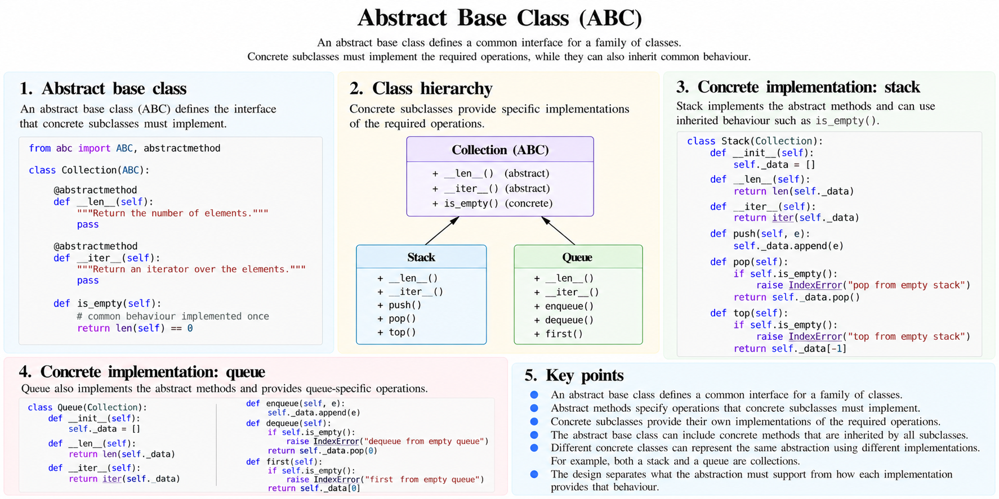{#fig-abstract-base-class}

For example, a sequence abstraction might require concrete implementations of:

```text
__len__()
__getitem__()
```

while providing generic implementations of:

```text
__contains__()
index()
count()
```

in terms of those primitives.

This is an example of the **template method** pattern:

$$
\boxed{
\text{generic algorithm}
+
\text{required primitive operations}
=
\text{reusable behaviour}.
}
$$

Goodrich uses the sequence abstraction as the central example: once a subclass supplies concrete length and indexed-access operations, inherited higher-level sequence behaviours become well defined. 

Python's `abc` facilities can formally declare such requirements, while the standard library provides established abstract collection interfaces.

The conceptual value is larger than the syntax. An ABC separates:

$$
\text{what a family of objects must support}
$$

from:

$$
\text{how each concrete object provides it}.
$$

## Composition and Inheritance

Inheritance is not the only way to construct an abstraction from existing components.

**Composition** builds an object by containing and coordinating other objects.

The stack implementation introduced earlier is a simple example:

```python
class Stack:
    def __init__(self):
        self._data = []
```

A stack **has a** list as part of its representation:

$$
\text{Stack}
\rightarrow
\text{contains List}.
$$

It is not conceptually a specialised kind of list.

Therefore composition is more appropriate than:

```python
class Stack(list):
    ...
```

The distinction is commonly expressed as:

$$
\begin{aligned}
\text{inheritance}
&\rightarrow
\text{is-a relationship},
\\
\text{composition}
&\rightarrow
\text{has-a relationship}.
\end{aligned}
$$

A stack implemented with a list has a storage component whose interface is deliberately hidden behind the stack abstraction.

Composition also allows the representation to change independently:

$$
\text{list-backed stack}
\rightarrow
\text{linked stack}
$$

while preserving the same public stack interface.

This reinforces the principle developed throughout these notes:

$$
\boxed{
\text{public abstraction should not unnecessarily expose internal representation}.
}
$$

## Designing Classes Around Responsibilities

A class should represent a coherent responsibility rather than simply collect related variables and functions.

A useful design process asks:

> What state does this object own?

> What invariants must it preserve?

> What operations should clients be allowed to perform?

> Which details should remain internal?

Goodrich frames object-oriented design similarly in terms of responsibilities, independence, and clearly defined behaviours. 

For a data structure, this produces a progression such as:

$$
\text{required operations}
\rightarrow
\text{public interface}
\rightarrow
\text{representation}
\rightarrow
\text{invariants}
\rightarrow
\text{implementation}.
$$

This is more robust than beginning with a collection of attributes and adding methods opportunistically.

### Prefer Small Public Interfaces

A class should expose the operations required by its abstraction, not every operation that its internal representation happens to support.

If a stack uses a list internally, exposing arbitrary indexed assignment would weaken the stack abstraction.

If a tree stores linked nodes internally, allowing external code to modify arbitrary parent and child references could violate tree invariants.

A narrow interface makes invalid states harder to construct and implementation changes easier to manage.

### Preserve Invariants Locally

Operations that modify a structure should leave it in a valid state.

For a doubly linked list, for example:

$$
x.next=y
$$

should correspond consistently with:

$$
y.prev=x.
$$

The class should centralise the code responsible for maintaining those relationships rather than requiring client code to manipulate links directly.

Encapsulation therefore has an algorithmic role as well as a software-engineering role: it protects the assumptions on which data-structure operations depend.

## Object-Oriented Design and Data Structures

The object-oriented mechanisms introduced here are not independent features to be used merely because Python provides them.

They support a hierarchy of abstraction:

$$
\boxed{
\text{problem}
\rightarrow
\text{ADT}
\rightarrow
\text{public interface}
\rightarrow
\text{class}
\rightarrow
\text{internal representation}.
}
$$

At each level, unnecessary details from the level below can be hidden.

For a stack:

$$
\text{LIFO abstraction}
\rightarrow
\texttt{push/pop/top}
\rightarrow
\text{Stack class}
\rightarrow
\text{dynamic array or linked nodes}.
$$

For a sequence:

$$
\text{ordered collection}
\rightarrow
\texttt{len/index/iteration}
\rightarrow
\text{sequence implementation}
\rightarrow
\text{chosen storage representation}.
$$

Inheritance can share behaviour across genuinely related abstractions. Composition can build structures from independent components. Special methods allow custom types to participate naturally in Python's protocols. Iterators separate traversal from representation. Abstract interfaces allow algorithms to depend on capabilities rather than concrete implementations.

These mechanisms become especially valuable as data structures become more complex.

The linear structures considered so far organise elements along a single sequence. The next structures introduce hierarchy. **Trees** represent elements through parent-child relationships, and their recursive structure will bring together many of the ideas developed so far: nodes and references, recursion, iteration, abstract interfaces, inheritance, and algorithmic complexity.


# References

::: {#refs}
:::