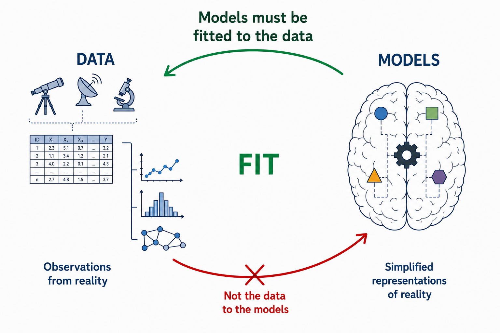
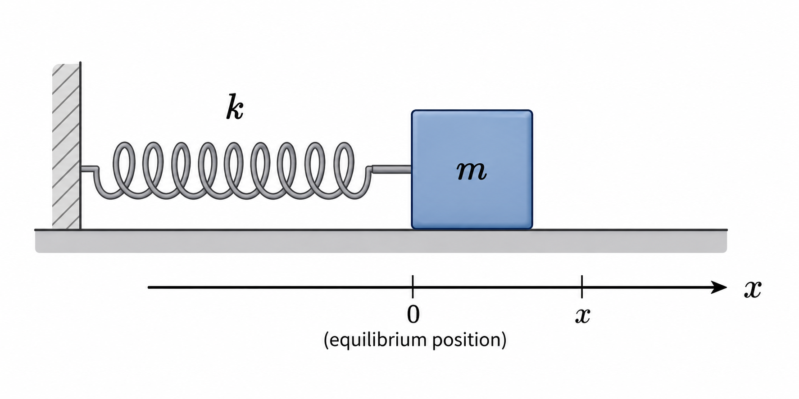
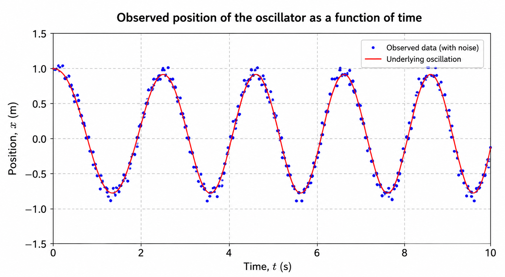
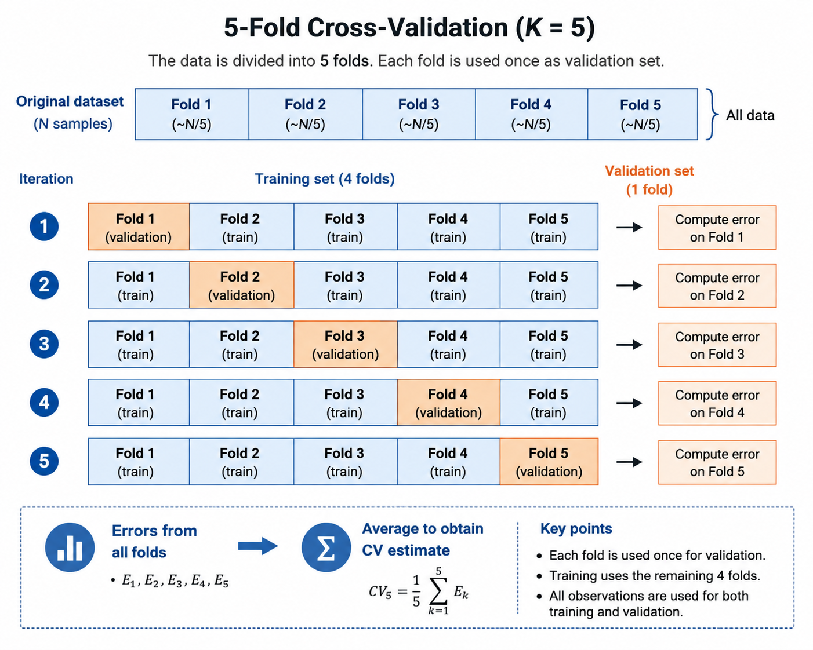
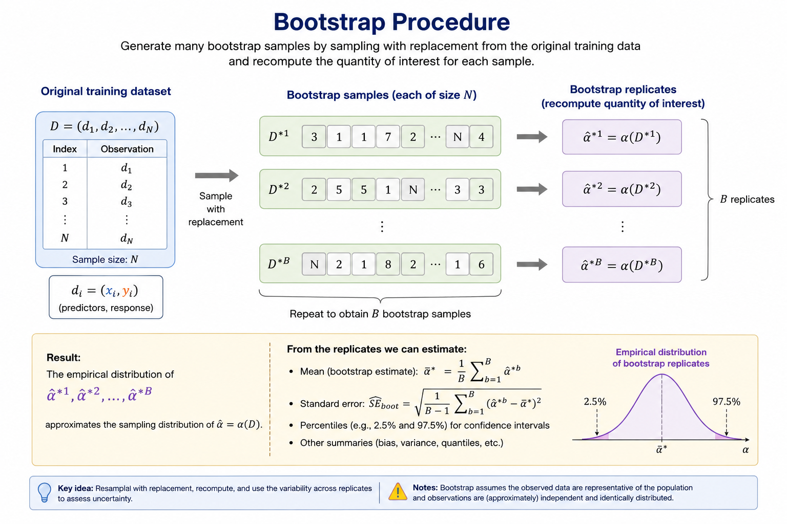

# From Data to Models

The maxim commonly attributed to the English philosopher [Francis Bacon](https://en.wikipedia.org/wiki/Francis_Bacon), ***scientia potentia est*** — [*knowledge is power*](https://en.wikipedia.org/wiki/Knowledge_is_power) — provides a useful starting point for understanding both the scope and the limitations of what we now call **Data Science**. Although nothing resembling the modern discipline existed in Bacon's time, his view of knowledge contains the seed of an idea that remains fundamental to Data Science: claims about the world should ultimately be accountable to empirical evidence.

The debate over how human beings acquire knowledge long predates Bacon. It can be traced back to Greek philosophy, particularly Plato and Aristotle, and was later developed by medieval scholasticism through the **problem of universals** and the opposition between realism and nominalism. Bacon, however, placed particular emphasis on experience. He argued that scientific knowledge should be grounded in careful and systematic observation of nature, with **inductive reasoning** playing a central role in moving from particular observations towards more general claims. Although the specific procedures of the Baconian method did not have a lasting influence, the broader principles behind his approach were highly influential in the development of scientific methodology. For this reason, Bacon is commonly regarded as one of the founders of the scientific method and as the father of empiricism.

This distinction provides a useful conceptual starting point for Data Science. We can separate two closely related components of the process of acquiring knowledge: the **empirical evidence** obtained from observations, represented by data, and the conceptual or mathematical structures through which we interpret that evidence, represented by models.

In this context, a useful working definition is:

> **A model is an abstract and simplified representation of some aspect of reality.**

This definition immediately establishes an important principle: **models must be fitted to the data, not the data to the models**.

Data are not reality itself. They are observations or measurements of reality and may contain noise, measurement error, sampling bias, or other imperfections. Nevertheless, they constitute the empirical evidence against which our models must be evaluated. If a model is inconsistent with the available evidence, we should question, revise, or replace the model rather than manipulate the evidence merely to preserve it.

Moreover, there is generally no single model capable of completely representing a phenomenon. Different models may capture different aspects of the same underlying process, rely on different assumptions, or provide different trade-offs between simplicity, interpretability, and predictive performance. Models should therefore be regarded as provisional representations that can be refined or replaced as new evidence becomes available.

This relationship between data and models is summarised in @fig-data-and-models.

{#fig-data-and-models width=90%}

This emphasis on empirical evidence does not diminish the importance of constructing models to interpret the data. On the contrary, model construction is an essential part of scientific reasoning. To understand why, it is useful to return to the distinction between **induction** and **deduction**.

Inductive reasoning allows us to move from particular observations towards more general hypotheses. It is therefore crucial for recognising patterns and generating explanations. However, induction has a fundamental limitation: observations can *support* a general conclusion, but they can never *prove* its universal truth with logical certainty.

This difficulty was famously formulated by David Hume in the eighteenth century and is known as the [***problem of induction***](https://en.wikipedia.org/wiki/Problem_of_induction). Past observations, however numerous or consistent, do not logically guarantee that the same regularity will continue to hold in the future.

A well-known illustration of this problem is the [***turkey illusion***](https://en.wikipedia.org/wiki/Turkey_illusion), a variation of an example originally introduced by Bertrand Russell using a chicken. Consider a turkey that observes that every morning its owner brings it food. After hundreds of consistent observations — on rainy days and sunny days, in warm weather and cold — the turkey becomes increasingly confident that it will continue to be fed every morning. Yet one day, instead of being fed, it is slaughtered. A single event contradicts a conclusion that appeared to be supported by an overwhelming amount of previous evidence.

The lesson is fundamental: no number of past observations can logically guarantee the truth of a universal claim about the future. The turkey's mistake was not that it relied on observations, but that it extrapolated an observed regularity without understanding the underlying mechanism responsible for it — in this case, the intentions of the person feeding it.

Karl Popper developed this problem further by emphasising **falsifiability**. Induction cannot establish a universal scientific theory as certainly true merely by accumulating confirming observations, whereas evidence inconsistent with its predictions may provide grounds for rejecting or revising it. In practice, scientific testing is more complicated than a single observation mechanically falsifying an entire theory, but the underlying principle remains important: scientific models must expose themselves to empirical testing.

None of this implies that induction is a poor method of reasoning. It serves a different purpose. Induction remains essential for identifying patterns and generating hypotheses and conjectures. It can be understood in probabilistic rather than absolute terms: observations can increase or decrease the degree of support for a hypothesis without certifying its truth.

Scientific inquiry therefore combines **induction** and **deduction**. Induction helps us move from observations towards hypotheses; deduction allows us to derive testable predictions from those hypotheses and compare them with empirical evidence. Successful predictions provide support for a hypothesis under the conditions tested, but they do not establish it as an absolute truth. Failed predictions may require the hypothesis, its assumptions, or even the experimental procedure to be reconsidered.

For our purposes, the scientific process can be usefully represented through a **hypothetico-deductive cycle**, consisting broadly of the following stages:

- **Systematic observation** of a phenomenon.
- **Formulation of hypotheses or models** to explain the observed patterns.
- **Deduction of testable predictions** from those hypotheses.
- **Empirical evaluation** of the predictions using new observations or data.
- **Revision, refinement, or replacement** of the hypotheses in light of the evidence.

@fig-hd-algorithm illustrates this iterative process.

{#fig-hd-algorithm width=70%}

The construction of useful models is, of course, considerably more difficult than this simplified representation might suggest. Choosing an appropriate representation, defining an objective, estimating model parameters, evaluating performance, and determining whether the resulting model generalises beyond the observed data introduce a new set of problems.

For this reason, the process of building models deserves separate treatment and is the subject of the next section.

# Approaches to Modelling

The relationships underlying an observed phenomenon are rarely given to us explicitly. Scientists usually begin with observations obtained from experiments, measurements, or other data-generating processes and attempt to identify patterns and relationships among them.

Mathematics provides a particularly useful language for expressing these relationships in a compact and precise form. The process of constructing an abstract and simplified representation of a phenomenon is what we call **modelling**.

Models are generally built for two closely related purposes:

- **Explanation and understanding:** to describe relationships in the data and improve our understanding of the phenomenon that generated them.
- **Prediction and estimation:** to estimate outcomes for observations that have not yet been seen.

These objectives are related, but they are not the same. A model may provide useful insight into an underlying mechanism without being the best possible predictor. Conversely, a model may achieve strong predictive performance while providing relatively little insight into the mechanism that generated the data.

Prediction also has an important practical role. It allows us to assess whether a model remains useful beyond the observations used to construct it and, in applied settings, to anticipate future or unknown outcomes.

To make these ideas concrete, consider a simple physical experiment.

## A Simple Harmonic Oscillator

Suppose that a spring with spring constant $k$ is fixed to a wall at one end and attached to an object of mass $m$ at the other. For simplicity, assume that the object moves horizontally over an ideal frictionless surface.

We displace the object slightly from its equilibrium position — without stretching the spring beyond its elastic regime — and release it. We observe that the object moves repeatedly backwards and forwards.

This system, illustrated in @fig-simple-harmonic-oscillator, is known as a **simple harmonic oscillator**.

{#fig-simple-harmonic-oscillator width=70%}

Suppose that we want to describe the dynamics of the system. We can measure the position $x$ of the object at different times $t$ and record the resulting observations as shown in @tbl-oscillator-data.

| Position $x$ | Time $t$ |
|:------------:|:--------:|
| $x_0=x_{\max}$ | $t_0=0$ |
| $x_2$ | $t_2$ |
| $\vdots$ | $\vdots$ |
| $x_i$ | $t_i$ |
| $\vdots$ | $\vdots$ |
| $x_N$ | $t_N$ |

: Position of the mass observed at different times. {#tbl-oscillator-data}

Using terminology common in statistics and machine learning, we can regard time $t$ as the **predictor**, **covariate**, or **independent variable**, and position $x$ as the **response** or **dependent variable**.

At its simplest, our modelling problem can be written as

$$
x=f(t),
$$ {#eq-oscillator-functional-relation}

where $f$ represents the unknown relationship between time and position.

This notation should not be interpreted as implying that modelling problems generally reduce to finding an explicit algebraic relationship directly between predictors and responses. In many scientific problems, relationships are expressed through differential equations involving the variables, their derivatives, and other quantities. In more complex data-science problems, there may be no useful explicit analytical expression at all.

The relevant question is therefore:

> **How do we determine the model $f$?**

There are several ways to approach this problem. Two useful perspectives are **theory-informed modelling** and **data-driven modelling**.

## Theory-Informed Modelling

Suppose first that we have an established theory describing the system.

For the harmonic oscillator, classical mechanics provides such a theory. According to [Newton's second law of motion](https://en.wikipedia.org/wiki/Newton%27s_laws_of_motion), the net force acting on an object is related to its acceleration by

$$
\mathbf{F}=m\mathbf{a}.
$$ {#eq-newton-second-law}

Newton's second law does not, by itself, specify the particular force acting on the mass. For that we need an additional description of the spring.

Within its elastic regime, [Hooke's law](https://en.wikipedia.org/wiki/Hooke%27s_law) states that the restoring force exerted by a spring is proportional to its displacement from equilibrium and acts in the opposite direction:

$$
F=-kx.
$$ {#eq-hookes-law}

Because the motion is one-dimensional and acceleration is the second derivative of position with respect to time,

$$
a(t)=\frac{d^2x}{dt^2}=\ddot{x}(t).
$$ {#eq-acceleration-position}

Combining @eq-newton-second-law and @eq-hookes-law gives the equation of motion

$$
m\frac{d^2x}{dt^2}=-kx.
$$ {#eq-oscillator-equation-motion}

Defining the angular frequency $\omega$ by

$$
\omega^2:=\frac{k}{m},
$$ {#eq-angular-frequency}

the equation of motion becomes

$$
\ddot{x}+\omega^2x=0.
$$ {#eq-simple-harmonic-ode}

Its general solution is

$$
x(t)=A\cos(\omega t)+B\sin(\omega t),
$$ {#eq-simple-harmonic-general-solution}

where $A$ and $B$ are constants determined by the initial conditions.

Suppose that the object is initially displaced to its maximum position and released from rest:

$$
x(0)=x_{\max},
\qquad
v(0)=0,
$$ {#eq-oscillator-initial-conditions}

where

$$
v(t)=\frac{dx}{dt}.
$$ {#eq-oscillator-velocity-definition}

Applying the first initial condition to @eq-simple-harmonic-general-solution,

$$
x(0)
=
A\cos(0)+B\sin(0)
=
A,
$$ {#eq-oscillator-first-condition}

and therefore

$$
A=x_{\max}.
$$ {#eq-oscillator-A}

Differentiating @eq-simple-harmonic-general-solution gives

$$
v(t)
=
-A\omega\sin(\omega t)
+
B\omega\cos(\omega t).
$$ {#eq-oscillator-velocity}

Evaluating this expression at $t=0$,

$$
v(0)=B\omega.
$$ {#eq-oscillator-second-condition}

Since $v(0)=0$ and $\omega\neq0$,

$$
B=0.
$$ {#eq-oscillator-B}

The particular solution is therefore

$$
x(t)=x_{\max}\cos(\omega t).
$$ {#eq-simple-harmonic-solution}

We have obtained the functional relationship introduced in @eq-oscillator-functional-relation:

$$
f(t)=x_{\max}\cos(\omega t).
$$ {#eq-oscillator-derived-function}

The important point here is not the harmonic oscillator itself, but **how the model was obtained**.

We began with general theoretical principles — Newton's laws and Hooke's law — and proceeded deductively. The theory constrained the possible behaviour of the system, led to a differential equation, and ultimately determined a functional form for the relationship between position and time.

The resulting model can then be compared with experimental observations. For example, rather than assuming that the initial conditions are known exactly, we could fit the more general model

$$
x(t)=A\cos(\omega t+\phi)
$$ {#eq-oscillator-parametric-model}

to the observations in @tbl-oscillator-data using a suitable estimation procedure, such as least squares. This would provide estimates $\hat{A}$, $\hat{\omega}$, and $\hat{\phi}$.

The estimated angular frequency could then be compared with the theoretical value

$$
\omega=\sqrt{\frac{k}{m}},
$$ {#eq-oscillator-theoretical-frequency}

where $k$ and $m$ are obtained from independent measurements.

This illustrates an important distinction:

> **Model specification and model fitting are not the same thing.**

In this example, physical theory largely determines the **structure of the model**. The experimental data then allow us to **estimate its unknown parameters** and assess whether its predictions are consistent with the observed behaviour of the system.

The same equation of motion could also be obtained through a different theoretical framework, such as [Lagrangian mechanics](https://en.wikipedia.org/wiki/Lagrangian_mechanics). The derivation would be different, but the basic modelling strategy would remain the same: prior theoretical knowledge places strong constraints on the class of models that we consider plausible.

At a high level, this approach can be summarised as

$$
\begin{gathered}
\text{Theory}
\longrightarrow
\text{General principles}
\longrightarrow
\text{Mathematical model}
\\[6pt]
\Downarrow
\\[-2pt]
\text{Functional relationship}
\longrightarrow
\text{Fit to data}
\longrightarrow
\text{Empirical evaluation}
\end{gathered}
$$

## Data-Driven Modelling

Now consider the same experiment from a different perspective.

Suppose that we know nothing about Newtonian mechanics, Hooke's law, or the differential equation governing the system. We are given only the observations in @tbl-oscillator-data.

What can we learn from the data alone?

A natural first step is to visualise the observations by plotting position against time. In a real experiment, measurements would contain some degree of noise, so we might obtain a pattern similar to that shown in @fig-oscillator-observations.

{#fig-oscillator-observations width=80%}

Examining the plot reveals several patterns. The position oscillates between approximately constant upper and lower values, the period appears approximately constant, and the object is close to its maximum displacement at $t=0$.

There is clearly structure in the data even though we do not know the physical mechanism responsible for it.

At this point, we can follow different data-driven modelling strategies.

### Prespecifying a Functional Form

One possibility is to use the observed patterns, together with our mathematical knowledge, to propose a plausible functional relationship.

The periodic behaviour might suggest a trigonometric function such as

$$
f(t;A,\omega,\phi)
=
A\cos(\omega t+\phi).
$$ {#eq-oscillator-ad-hoc-model}

This looks very similar to the model obtained previously, but there is an important difference.

In the theory-informed approach, the trigonometric form emerged **deductively** from the differential equation governing the physical system. Here, we have proposed it **inductively** from patterns observed in the data.

Once the functional form has been specified, we can estimate its unknown parameters from the observations:

$$
\hat{\boldsymbol{\theta}}
=
(\hat{A},\hat{\omega},\hat{\phi}).
$$ {#eq-oscillator-estimated-parameters}

For example, we could estimate them by minimising the residual sum of squares:

$$
\hat{\boldsymbol{\theta}}
=
\arg\min_{\boldsymbol{\theta}}
\sum_{i=1}^{N}
\left[
x_i-f(t_i;\boldsymbol{\theta})
\right]^2.
$$ {#eq-oscillator-least-squares}

We can then evaluate how well the fitted model describes observations that were not used to estimate its parameters.

Although this is a data-driven approach, it still incorporates substantial prior knowledge. We have explicitly chosen the mathematical form of the relationship. The data determine the parameter estimates, but the analyst has determined the basic structure of the model.

### Learning a Flexible Relationship from Data

A different strategy is to avoid specifying an explicit functional relationship such as a cosine in advance.

Instead, we select a sufficiently flexible **model class** and use the observed data to learn a particular function within that class.

We can represent this abstractly as

$$
\hat{x}=f_{\boldsymbol{\theta}}(t),
$$ {#eq-flexible-model}

where $\boldsymbol{\theta}$ represents the quantities learned during training.

A neural network is one example. Neural networks are **parametric models** — often with very large numbers of parameters — but we do not generally need to prescribe an explicit analytical relationship between predictor and response such as

$$
x(t)=A\cos(\omega t+\phi).
$$

Instead, we specify an architecture and a learning procedure, and the parameters are estimated from the observations. With a squared-error objective, the training problem could be written abstractly as

$$
\hat{\boldsymbol{\theta}}
=
\arg\min_{\boldsymbol{\theta}}
\sum_{i=1}^{N}
\left[
x_i-f_{\boldsymbol{\theta}}(t_i)
\right]^2.
$$ {#eq-flexible-model-training}

Decision trees, random forests, boosting methods, neural networks, splines, and many other statistical and machine-learning methods provide different ways of learning flexible relationships from data without requiring the analyst to specify a simple explicit equation relating predictors to responses.

This does not mean that these methods learn without assumptions.

Every modelling method restricts, in some way, the relationships that can be learned. A linear model assumes a particular linear structure. A decision tree represents relationships through recursive partitions of the predictor space. A neural network is constrained by its architecture, connectivity, activation functions, optimisation procedure, and other design choices.

These choices introduce what is commonly called **inductive bias**: the assumptions that make some solutions more likely or accessible to a learning algorithm than others.

Machine learning therefore does not remove assumptions from modelling. Instead, many machine-learning methods allow us to replace a strongly prespecified functional relationship with a more flexible class of possible relationships and let the data play a larger role in determining the particular function that is learned.

This data-driven approach can be summarised broadly as

$$
\begin{gathered}
\text{Data}
\longrightarrow
\text{Observed patterns}
\longrightarrow
\text{Model class}
\\[6pt]
\Downarrow
\\[-2pt]
\text{Learning from data}
\longrightarrow
\text{Empirical evaluation}
\end{gathered}
$$

## Theory-Informed and Data-Driven Modelling

We can now summarise the two perspectives.

In **theory-informed modelling**, established knowledge about the underlying mechanism strongly constrains the mathematical structure of the model:

$$
\begin{gathered}
\text{Theory}
\longrightarrow
\text{General principles}
\longrightarrow
\text{Mathematical model}
\\[6pt]
\Downarrow
\\[-2pt]
\text{Functional relationship}
\longrightarrow
\text{Parameter estimation}
\longrightarrow
\text{Empirical evaluation}
\end{gathered}
$$

In **data-driven modelling**, the relationship is inferred primarily from observations:

$$
\begin{gathered}
\text{Data}
\longrightarrow
\text{Observed patterns}
\\[6pt]
\Downarrow
\\[-2pt]
\begin{cases}
\text{Prespecified functional form}
\longrightarrow
\text{Parameter estimation}
\\[6pt]
\text{Flexible model class}
\longrightarrow
\text{Learning from data}
\end{cases}
\\[6pt]
\Downarrow
\\[-2pt]
\text{Empirical evaluation}
\end{gathered}
$$

These approaches are not mutually exclusive. They are better understood as different ways of incorporating available information into the modelling process.

In practice, many models lie somewhere between the two. Domain knowledge may guide feature selection or feature engineering, constrain parameter values, inform the choice of model class, or rule out relationships that are scientifically or operationally implausible.

The key distinction is therefore not whether assumptions are present — **all models make assumptions** — but how much structure is specified before learning from the data and where that structure comes from.

This distinction becomes particularly relevant when we move from physical systems to many real-world data-science problems.

In the harmonic oscillator, we have well-established physical laws that provide a strong theoretical description of the underlying mechanism. In many business problems, no comparable theory exists.

Consider **credit-card fraud detection**. There is no equivalent of Newton's laws from which we can derive an equation governing whether a transaction will be fraudulent. Similarly, in **customer churn prediction**, there is no fundamental theory from which individual customer behaviour can be deduced.

Instead, we have data: transaction histories, customer characteristics, behavioural variables, temporal information, previous outcomes, and many other potentially useful observations.

The modelling problem is therefore different. We want to use the information contained in those observations to learn relationships that remain useful when applied to cases that were not part of the original dataset.

This is where **machine learning** becomes particularly useful.

Machine-learning methods provide systematic ways of learning relationships from data when the underlying mechanism is unknown, too complex to derive analytically, or not conveniently represented by a prespecified functional form.

However, this flexibility introduces an important difficulty. A sufficiently flexible model may learn not only meaningful structure but also noise, accidental regularities, or peculiarities of the particular dataset used to train it.

The central question is therefore not simply

> **Can the model fit the observed data?**

but rather

> **Can the model learn a relationship from observed data that remains useful on data it has never seen?**

This ability is known as **generalisation**, and it is one of the central problems in machine learning.

It provides the starting point for understanding how machine-learning models are trained, evaluated, selected, and ultimately used in practice.

# Machine Learning Modelling

The previous section introduced data-driven modelling as a way of learning relationships from observations when an explicit theoretical description of the underlying mechanism is unavailable, incomplete, or impractical. We can now formulate this problem more precisely.

Suppose that we observe $N$ instances, each described by $M$ predictors. For the $i$-th observation, we collect the predictor values into the vector

$$
\mathbf{x}_i
=
\begin{pmatrix}
x_{i1}\\
x_{i2}\\
\vdots\\
x_{iM}
\end{pmatrix}
=
(x_{i1},x_{i2},\ldots,x_{iM})^\top
\in\mathbb{R}^M.
$$ {#eq-predictor-vector}

The complete set of predictors can then be arranged into the matrix

$$
\mathbf{X}
=
\begin{pmatrix}
\mathbf{x}_1^\top\\
\mathbf{x}_2^\top\\
\vdots\\
\mathbf{x}_N^\top
\end{pmatrix}
=
\begin{pmatrix}
x_{11} & x_{12} & \cdots & x_{1M}\\
x_{21} & x_{22} & \cdots & x_{2M}\\
\vdots & \vdots & \ddots & \vdots\\
x_{N1} & x_{N2} & \cdots & x_{NM}
\end{pmatrix}
\in\mathbb{R}^{N\times M}.
$$ {#eq-predictor-matrix}

Each row of $\mathbf{X}$ represents one observation, while each column represents one predictor. In other words, $\mathbf{x}_i^\top$ is the $i$-th row of the predictor matrix.

If a response is available for each observation, we denote the individual response by $y_i$ and collect all responses into the vector

$$
\mathbf{y}
=
\begin{pmatrix}
y_1\\
y_2\\
\vdots\\
y_N
\end{pmatrix}
\in\mathbb{R}^N.
$$ {#eq-response-vector}

The nature of $y_i$ depends on the problem. It may represent a numerical quantity, such as house price, energy consumption, demand, or the position of the harmonic oscillator considered previously. Alternatively, it may indicate membership in one of a finite set of classes, such as whether a transaction is legitimate or fraudulent. These two cases lead naturally to **regression** and **classification**, respectively, which will be discussed in the next section.

Before considering these learning problems separately, it is useful to formulate the modelling problem in general terms.

## Learning an Unknown Relationship

Consider first a regression problem. We assume that the response can be represented as

$$
y_i
=
f(\mathbf{x}_i)
+
\varepsilon_i,
$$ {#eq-statistical-learning-model}

where $f$ is a fixed but unknown function relating the predictors to the response, while $\varepsilon_i$ represents the component of the response that is not explained by the predictors available to the model.

A common assumption is that the error has zero conditional mean,

$$
\mathbb{E}
\left[
\varepsilon_i
\mid
\mathbf{x}_i
\right]
=
0.
$$ {#eq-error-zero-conditional-mean}

In the simplest homoscedastic setting, we additionally assume that

$$
\operatorname{Var}
\left(
\varepsilon_i
\mid
\mathbf{x}_i
\right)
=
\sigma^2.
$$ {#eq-error-conditional-variance}

Under the zero conditional mean assumption, $f(\mathbf{x}_i)$ represents the conditional expected value of the response. Indeed,

$$
\begin{aligned}
\mathbb{E}
\left[
y_i
\mid
\mathbf{x}_i
\right]
&=
\mathbb{E}
\left[
f(\mathbf{x}_i)
+
\varepsilon_i
\mid
\mathbf{x}_i
\right]
\\[4pt]
&=
f(\mathbf{x}_i)
+
\mathbb{E}
\left[
\varepsilon_i
\mid
\mathbf{x}_i
\right]
\\[4pt]
&=
f(\mathbf{x}_i).
\end{aligned}
$$ {#eq-conditional-expectation-derivation}

The function $f$ therefore represents the systematic relationship between the available predictors and the response. In practice, however, $f$ is unknown. Given a training dataset

$$
\mathcal{D}
=
\left\{
(\mathbf{x}_i,y_i)
\right\}_{i=1}^{N},
$$ {#eq-training-dataset}

our objective is to construct an estimate $\hat f$ of the unknown function $f$. For a previously unseen observation $\mathbf{x}_0$, the corresponding prediction is

$$
\hat y_0
=
\hat f(\mathbf{x}_0).
$$ {#eq-prediction-new-observation}

This provides a useful working description of supervised machine learning: given observed predictor-response pairs, we attempt to learn a relationship from the training data that remains useful when applied to previously unseen observations.

The last part of this statement is fundamental. The objective is not merely to reproduce the training observations. A model that fits its training data extremely well but performs poorly when presented with new observations has limited predictive value. The central objective is therefore **generalisation**.

## The Nature of the Data

The notation $\mathbf{x}_i\in\mathbb{R}^M$ may suggest that machine-learning datasets always begin as conventional tables containing numerical columns. This is not the case. The mathematical representation used by a learning algorithm depends on the nature of the information being analysed.

In a conventional business problem, an observation may naturally be represented as a collection of variables. A customer, for example, may be described by demographic, transactional, and behavioural information, while a financial transaction may contain an amount, timestamp, merchant information, location, and characteristics derived from previous transactions.

Other types of data require different representations. Images consist of numerical pixel values arranged spatially and form the natural input to **Computer Vision** problems. Text consists of sequences of linguistic units that can be transformed into numerical representations for **Natural Language Processing (NLP)**. Modern **Large Language Models (LLMs)** provide a particularly prominent example of learning from very large collections of textual data.

The purpose of mentioning these examples here is not to develop those fields separately, but to emphasise a general point: **the nature and structure of the observed data strongly influence how the learning problem should be represented and which modelling approaches are appropriate**.

The abstract notation $\mathbf{x}_i$ should therefore be understood as a mathematical representation of the information available to the learning algorithm, rather than necessarily as a row from an ordinary spreadsheet.

## Reducible and Irreducible Prediction Error

The model in @eq-statistical-learning-model also reveals an important limitation of prediction.

Consider a particular unseen predictor vector $\mathbf{x}_0$, whose response is

$$
y_0
=
f(\mathbf{x}_0)
+
\varepsilon_0.
$$ {#eq-response-test-point}

Suppose for the moment that $\mathbf{x}_0$ and the fitted function $\hat f$ are fixed, so that the only remaining source of variability is $\varepsilon_0$. The squared prediction error is $\left[y_0-\hat f(\mathbf{x}_0)\right]^2$. Taking its expected value with respect to $\varepsilon_0$ gives

$$
\begin{aligned}
\mathbb{E}_{\varepsilon_0}
\left[
\left(
y_0-\hat f(\mathbf{x}_0)
\right)^2
\right]
&=
\mathbb{E}_{\varepsilon_0}
\left[
\left(
f(\mathbf{x}_0)
+
\varepsilon_0
-
\hat f(\mathbf{x}_0)
\right)^2
\right].
\end{aligned}
$$

Expanding the square,

$$
\begin{aligned}
\mathbb{E}_{\varepsilon_0}
\left[
\left(
y_0-\hat f(\mathbf{x}_0)
\right)^2
\right]
={}&
\mathbb{E}_{\varepsilon_0}
\left[
\left(
f(\mathbf{x}_0)
-
\hat f(\mathbf{x}_0)
\right)^2
\right]
\\[4pt]
&+
2\mathbb{E}_{\varepsilon_0}
\left[
\left(
f(\mathbf{x}_0)
-
\hat f(\mathbf{x}_0)
\right)
\varepsilon_0
\right]
\\[4pt]
&+
\mathbb{E}_{\varepsilon_0}
\left[
\varepsilon_0^2
\right].
\end{aligned}
$$ {#eq-error-decomposition-expansion}

Since $f(\mathbf{x}_0)$ and $\hat f(\mathbf{x}_0)$ are fixed with respect to $\varepsilon_0$,

$$
\mathbb{E}_{\varepsilon_0}
\left[
\left(
f(\mathbf{x}_0)
-
\hat f(\mathbf{x}_0)
\right)^2
\right]
=
\left(
f(\mathbf{x}_0)
-
\hat f(\mathbf{x}_0)
\right)^2.
$$

For the cross term,

$$
\begin{aligned}
\mathbb{E}_{\varepsilon_0}
\left[
\left(
f(\mathbf{x}_0)
-
\hat f(\mathbf{x}_0)
\right)
\varepsilon_0
\right]
&=
\left(
f(\mathbf{x}_0)
-
\hat f(\mathbf{x}_0)
\right)
\mathbb{E}_{\varepsilon_0}
[\varepsilon_0]
\\[4pt]
&=
0.
\end{aligned}
$$

Finally, using the identity $\operatorname{Var}(Z)=\mathbb{E}[Z^2]-\mathbb{E}[Z]^2$,

$$
\begin{aligned}
\mathbb{E}
\left[
\varepsilon_0^2
\right]
&=
\operatorname{Var}(\varepsilon_0)
+
\left(
\mathbb{E}[\varepsilon_0]
\right)^2
\\[4pt]
&=
\sigma^2.
\end{aligned}
$$

Substituting these results into @eq-error-decomposition-expansion,

$$
\mathbb{E}_{\varepsilon_0}
\left[
\left(
y_0-\hat f(\mathbf{x}_0)
\right)^2
\right]
=
\left[
f(\mathbf{x}_0)
-
\hat f(\mathbf{x}_0)
\right]^2
+
\sigma^2.
$$ {#eq-reducible-irreducible-error}

The first term, $\left[f(\mathbf{x}_0)-\hat f(\mathbf{x}_0)\right]^2$, measures the discrepancy between the underlying relationship and our estimate of that relationship. This component is **reducible**, at least in principle. A more appropriate model, better data, more informative predictors, or an improved learning procedure may reduce it.

The second term, $\sigma^2$, is the **irreducible error** associated with the variability that remains after conditioning on the predictors available to the model.

Thus, the expected prediction error at $\mathbf{x}_0$ can be understood conceptually as

$$
\text{Prediction Error}
=
\text{Reducible Error}
+
\text{Irreducible Error}.
$$ {#eq-reducible-irreducible-summary}

The term *irreducible* must be interpreted relative to the information available to the model. Some variation assigned to $\varepsilon$ may arise because relevant variables were not measured or were omitted from the predictor set. If additional informative predictors become available, part of what was previously treated as unexplained variability may become predictable.

Other components may arise from measurement error or from variability that is genuinely unpredictable at the level at which the problem is being modelled.

The practical objective is therefore not necessarily to drive prediction error to zero. Rather, it is to reduce the component that can reasonably be reduced while recognising the uncertainty that remains.

## Learning a Model from Data

Once a model class has been selected, learning generally consists of determining the particular model within that class that best satisfies a specified objective.

For a parametrised model, we write $f_{\boldsymbol{\theta}}(\mathbf{x})$, where

$$
\boldsymbol{\theta}
=
(\theta_0,\theta_1,\ldots,\theta_P)^\top
$$ {#eq-parameter-vector}

denotes the parameters to be learned from the training data.

Training can often be expressed abstractly as an optimisation problem:

$$
\hat{\boldsymbol{\theta}}
=
\arg\min_{\boldsymbol{\theta}}
\mathcal{L}
\left(
\boldsymbol{\theta};
\mathbf{X},
\mathbf{y}
\right),
$$ {#eq-general-learning-problem}

where $\mathcal{L}$ is an objective function that quantifies how well a particular choice of $\boldsymbol{\theta}$ satisfies the learning objective.

Once $\hat{\boldsymbol{\theta}}$ has been estimated, the fitted model is $\hat f(\mathbf{x})=f_{\hat{\boldsymbol{\theta}}}(\mathbf{x})$.

The precise objective function depends on the modelling problem. For ordinary linear regression, for example, we may write

$$
f_{\boldsymbol{\theta}}(\mathbf{x}_i)
=
\theta_0
+
\theta_1x_{i1}
+
\cdots
+
\theta_Mx_{iM},
$$ {#eq-linear-model-general}

and estimate the parameters by minimising the **Residual Sum of Squares (RSS)**:

$$
\operatorname{RSS}(\boldsymbol{\theta})
=
\sum_{i=1}^{N}
\left[
y_i
-
f_{\boldsymbol{\theta}}(\mathbf{x}_i)
\right]^2.
$$ {#eq-rss-general}

The parameter estimate is therefore

$$
\hat{\boldsymbol{\theta}}
=
\arg\min_{\boldsymbol{\theta}}
\operatorname{RSS}(\boldsymbol{\theta}).
$$ {#eq-rss-optimisation}

Other methods use different objective functions. Logistic regression, for example, is commonly fitted by maximum likelihood, or equivalently by minimising the negative log-likelihood. Neural networks may use mean squared error for regression problems or cross-entropy for classification problems, among many other possible objectives.

Although the details differ, the general learning process can be represented schematically as

$$
\begin{gathered}
\text{Choose a model class}
\longrightarrow
\text{Define a learning objective}
\\[6pt]
\Downarrow
\\[-2pt]
\text{Optimise the objective}
\longrightarrow
\text{Obtain a fitted model}
\longrightarrow
\text{Evaluate generalisation}.
\end{gathered}
$$

This perspective also helps explain why machine learning draws naturally from several technical disciplines. **Statistics** provides tools for estimation, uncertainty, inference, and the analysis of data; **numerical analysis and optimisation** provide methods for solving estimation problems that may not admit convenient analytical solutions; and **computer science** provides the algorithms, data structures, and computational systems required to implement these methods efficiently and at scale.

These disciplines overlap substantially, and machine learning should not be understood simply as their arithmetic sum. Rather, modern machine learning draws on each of them to learn useful relationships from data and, crucially, to determine whether those relationships remain useful beyond the observations on which they were learned.

# Classification of Machine Learning Algorithms

Machine-learning methods can be classified in different ways depending on the nature of the data, the information available during training, and the objective of the learning process.

At a broad level, three major learning paradigms are commonly distinguished:

- **Supervised Learning (SL)**
- **Unsupervised Learning (UL)**
- **Reinforcement Learning (RL)**

The distinction between them is not primarily determined by the particular algorithm being used, but by the structure of the learning problem.

In supervised learning, the model learns from observations for which a response is available. In unsupervised learning, no response is provided and the objective is to identify structure in the observed data. Reinforcement learning considers a different setting in which an agent learns through interaction with an environment and the consequences of its actions.

These three paradigms provide a useful general framework for organising machine-learning problems.

## Supervised Learning

In **supervised learning**, the training dataset consists of predictor-response pairs:

$$
\mathcal{D}
=
\left\{
(\mathbf{x}_i,y_i)
\right\}_{i=1}^{N}.
$$ {#eq-supervised-learning-dataset}

The predictor vector $\mathbf{x}_i$ contains the information available for the $i$-th observation, while $y_i$ provides the corresponding response that the model is expected to learn to predict.

The objective is to use the training data to estimate a relationship between predictors and response that can subsequently be applied to previously unseen observations.

As introduced in the previous section, this relationship can be represented abstractly as

$$
y_i
=
f(\mathbf{x}_i)
+
\varepsilon_i,
$$

and the learning procedure produces an estimate $\hat f$ of the unknown relationship $f$.

For a new observation $\mathbf{x}_0$, the model produces the prediction $\hat y_0=\hat f(\mathbf{x}_0)$.

The nature of the response $y$ leads to two fundamental types of supervised-learning problems: **regression** and **classification**.

### Regression

In a **regression problem**, the response represents a numerical quantity that can vary over a range of values.

Examples include predicting house prices, estimating energy consumption, forecasting demand, predicting temperature, or estimating the position of the harmonic oscillator considered previously.

The objective is to learn a function

$$
\hat f:
\mathcal{X}
\longrightarrow
\mathbb{R}
$$ {#eq-regression-mapping}

that maps the predictor information to a numerical prediction.

The simplest and most fundamental regression model is **linear regression**. For $M$ predictors, it assumes a relationship of the form

$$
y_i
=
\theta_0
+
\theta_1x_{i1}
+
\theta_2x_{i2}
+
\cdots
+
\theta_Mx_{iM}
+
\varepsilon_i.
$$ {#eq-linear-regression-preview}

Using the parameter vector

$$
\boldsymbol{\theta}
=
(\theta_0,\theta_1,\ldots,\theta_M)^\top,
$$

the model is completely determined once its parameters have been estimated from the training data.

Linear regression is particularly useful as a starting point because it is mathematically transparent, computationally inexpensive, and relatively easy to interpret. It also provides the foundation for understanding many concepts that appear throughout statistical learning, including parameter estimation, residuals, loss functions, model assumptions, inference, and regularisation.

However, the relationship between predictors and response need not be linear. More flexible regression methods include regression trees, random forests, boosting methods, support vector regression, spline-based models, and neural networks.

Despite their differences, these methods address the same general problem: estimating a numerical response from the information contained in the predictors.

### Classification

In a **classification problem**, the response indicates membership in one of a finite set of classes.

For a binary classification problem, for example,

$$
y_i
\in
\{0,1\}.
$$ {#eq-binary-response}

In credit-card fraud detection, we might define

$$
y_i
=
\begin{cases}
0, & \text{legitimate transaction},\\
1, & \text{fraudulent transaction}.
\end{cases}
$$ {#eq-fraud-response}

The learning problem is therefore different from regression. Rather than estimating an unrestricted numerical response, the objective is to determine which class is most appropriate for a new observation.

Conceptually, a classifier defines a mapping

$$
\hat f:
\mathcal{X}
\longrightarrow
\mathcal{C},
$$ {#eq-classification-mapping}

where $\mathcal{C}$ denotes the set of possible classes.

For binary classification,

$$
\mathcal{C}
=
\{0,1\}.
$$

Many classification algorithms approach the problem by estimating class probabilities rather than assigning a class directly. In the binary case, for example, a model may estimate

$$
P
\left(
Y=1
\mid
\mathbf{X}=\mathbf{x}
\right).
$$ {#eq-conditional-class-probability}

A classification rule can then be constructed from the estimated probability. For example, using a threshold $c$,

$$
\hat y
=
\begin{cases}
1,
&
\hat P(Y=1\mid\mathbf{X}=\mathbf{x})\geq c,
\\[4pt]
0,
&
\hat P(Y=1\mid\mathbf{X}=\mathbf{x})<c.
\end{cases}
$$ {#eq-binary-classification-rule}

The threshold need not necessarily be $0.5$. Its appropriate value depends on the problem, the relative consequences of different types of error, and the purpose for which the model will be used.

A fundamental baseline for binary classification is **logistic regression**. Despite its name, logistic regression is used primarily as a classification method because it models the probability that an observation belongs to a particular class.

The model can be written as

$$
P
\left(
Y=1
\mid
\mathbf{X}=\mathbf{x}
\right)
=
\frac{
1
}{
1+
\exp
\left[
-
\left(
\theta_0
+
\sum_{j=1}^{M}\theta_jx_j
\right)
\right]
}.
$$ {#eq-logistic-regression-preview}

Equivalently, if $\tilde{\mathbf{x}}=(1,x_1,\ldots,x_M)^\top$ includes the intercept term,

$$
P
\left(
Y=1
\mid
\mathbf{X}=\mathbf{x}
\right)
=
\frac{1}
{1+\exp(-\boldsymbol{\theta}^{\top}\tilde{\mathbf{x}})}.
$$ {#eq-logistic-regression-vector-preview}

The logistic function maps any real-valued linear combination of the predictors into the interval $(0,1)$, allowing the result to be interpreted as a probability.

Other classification methods include decision trees, random forests, boosting methods, support vector machines, nearest-neighbour methods, and neural networks.

Regression and classification can therefore be summarised schematically as

$$
\begin{gathered}
\text{Supervised Learning}
\\[6pt]
\Downarrow
\\[-2pt]
\begin{cases}
\text{Regression}
&
\longrightarrow \text{ Numerical response}
\\[4pt]
\text{Classification}
&
\longrightarrow \text{ Class membership}
\end{cases}
\end{gathered}
$$

The distinction is conceptually simple but important: **regression and classification differ primarily in the nature of the response and consequently in the learning objective, not necessarily in the complexity of the algorithm**.

Indeed, several families of models can be adapted to both problems. Trees, random forests, boosting methods, support vector machines, and neural networks all have regression and classification variants.

## Unsupervised Learning

In **unsupervised learning**, no response variable is supplied with the observations. The dataset therefore has the form

$$
\mathcal{D}
=
\left\{
\mathbf{x}_i
\right\}_{i=1}^{N}.
$$ {#eq-unsupervised-learning-dataset}

There is no $y_i$ whose relationship with the predictors can be learned. The objective is instead to identify useful structure, regularities, or representations within the observed data themselves.

This makes unsupervised learning fundamentally different from supervised prediction. There is no externally supplied response against which a prediction can be directly compared.

Two important unsupervised-learning problems are **clustering** and **dimensionality reduction**.

### Clustering

**Clustering** attempts to organise observations into groups such that observations within the same group are, according to some criterion, more similar to one another than to observations belonging to other groups.

Starting from

$$
\mathcal{D}
=
\left\{
\mathbf{x}_1,
\mathbf{x}_2,
\ldots,
\mathbf{x}_N
\right\},
$$

the objective is to identify a collection of groups

$$
C_1,C_2,\ldots,C_K
$$

from the structure of the data themselves.

Unlike classification, these groups are not supplied beforehand as known responses. They are inferred from patterns present in the predictor space.

This distinction is important. If observations have already been labelled as belonging to classes and the objective is to predict those labels, the problem is classification. If no such labels exist and the objective is to discover groups from the observations themselves, the problem is clustering.

Two classical examples are **K-means clustering** and **hierarchical clustering**.

Clustering can be useful for exploratory analysis, customer segmentation, grouping documents or products, identifying patterns in scientific data, and discovering potentially meaningful subpopulations before a more specific modelling problem has been formulated.

### Dimensionality Reduction

Datasets with many predictors can contain substantial redundancy. Several variables may describe similar aspects of the observations, or much of the variation in the data may lie approximately within a lower-dimensional structure.

**Dimensionality reduction** attempts to construct a representation

$$
\mathbf{x}_i
\in
\mathbb{R}^{M}
\quad
\longrightarrow
\quad
\mathbf{z}_i
\in
\mathbb{R}^{K},
\qquad
K<M,
$$ {#eq-dimensionality-reduction}

while preserving information or structure considered relevant to the problem.

A classical example is **Principal Component Analysis (PCA)**, which constructs new orthogonal directions that successively capture as much variance in the data as possible.

Dimensionality reduction may be useful for visualisation, data compression, noise reduction, exploratory analysis, feature construction, or as a preprocessing stage for another learning algorithm.

The key distinction from supervised learning remains the same: the transformation is learned from the structure of the predictors themselves rather than from their relationship with an observed response.

## Reinforcement Learning

**Reinforcement Learning (RL)** considers a substantially different learning problem.

Rather than learning from a fixed collection of predictor-response pairs, an **agent** interacts sequentially with an **environment**.

At time $t$, the agent observes information about the current state $s_t$ and selects an action $a_t$. As a consequence of that action, the environment produces a reward $r_{t+1}$ and transitions to a new state $s_{t+1}$.

The interaction can be represented schematically as

$$
(s_t,a_t)
\longrightarrow
(r_{t+1},s_{t+1}).
$$ {#eq-reinforcement-learning-transition}

The objective is to learn how actions should be selected in different states in order to maximise reward over time.

The agent's behaviour is described by a **policy** $\pi$, which can be represented probabilistically as

$$
\pi(a\mid s)
=
P(A_t=a\mid S_t=s).
$$ {#eq-reinforcement-learning-policy}

Unlike supervised learning, the agent is not normally given the correct action for each state. Instead, it must learn from the consequences of the actions it takes.

This introduces an important additional difficulty: the actions chosen by the learner influence the future observations and rewards that become available.

A simplified representation of the learning process is

$$
\begin{gathered}
\text{State}
\longrightarrow
\text{Agent}
\longrightarrow
\text{Action}
\\[6pt]
\Downarrow
\\[-2pt]
\text{Environment}
\longrightarrow
\text{Reward and New State}
\longrightarrow
\text{Agent}.
\end{gathered}
$$

Reinforcement learning is particularly relevant to sequential decision-making problems such as robotics, control systems, game-playing agents, resource allocation, and other situations in which present decisions affect future outcomes.

For the purposes of these notes, the important point is the conceptual distinction among the three broad learning paradigms:

- **Supervised Learning:** learn a relationship using observed predictors and responses.
- **Unsupervised Learning:** discover structure from observations without an associated response.
- **Reinforcement Learning:** learn actions through sequential interaction with an environment and the rewards generated by those actions.

## Parametric and Non-Parametric Models

The distinction between supervised, unsupervised, and reinforcement learning describes the **learning setting**. A different classification concerns the mathematical structure of the models used within those settings.

One traditional distinction is between **parametric** and **non-parametric** methods.

### Parametric Models

A **parametric model** represents the relationship to be learned through a fixed finite-dimensional parameter vector

$$
\boldsymbol{\theta}
=
(\theta_0,\theta_1,\ldots,\theta_P)^\top.
$$

Once the model structure has been specified, the number of parameters is fixed and learning consists primarily of estimating their values from the available data.

Linear regression provides the simplest example:

$$
f_{\boldsymbol{\theta}}(\mathbf{x})
=
\theta_0
+
\sum_{j=1}^{M}
\theta_jx_j.
$$ {#eq-parametric-linear-example}

Once $\hat{\boldsymbol{\theta}}$ has been estimated, the fitted relationship is completely specified.

Parametric models need not be simple. A neural network is also a parametric model. For a fixed architecture, it contains a finite number of parameters, even though that number may be extremely large.

This is an important distinction:

> **Parametric does not mean simple, and it does not mean that the model contains only a small number of parameters.**

What makes the model parametric is that, once its structure is fixed, it is represented by a finite-dimensional parameter vector.

### Non-Parametric Models

The term **non-parametric** can be misleading because it does not mean that the method contains no parameters, hyperparameters, or quantities that must be determined.

Rather, a non-parametric method does not restrict the relationship being learned to a fixed finite-dimensional parameterisation whose dimension remains unchanged as the amount of available data increases.

Its effective complexity can therefore grow with the training data.

Nearest-neighbour methods provide an intuitive example. In **K-Nearest Neighbours (KNN)**, prediction for a new observation depends directly on observations retained from the training set rather than on reducing the entire fitted relationship to a fixed vector $\hat{\boldsymbol{\theta}}$.

Other examples include several kernel-based and spline-based methods.

Non-parametric methods are often more flexible because they impose fewer restrictions on the form of the relationship that can be learned. This flexibility, however, generally comes with requirements of its own, including sufficient data and appropriate control of model complexity.

## Functional Form and Model Flexibility

The parametric/non-parametric distinction should not be confused with the earlier distinction between specifying an explicit functional form and using a flexible model class.

For example, suppose we explicitly assume

$$
f(t)
=
\theta_0\cos(\theta_1t).
$$

This is a parametric model with a clearly prescribed analytical form.

A deep neural network is also parametric, but its functional form is not usually specified at the level of an explicit relationship between the original predictors and response such as the expression above. Instead, we specify an architecture containing many elementary transformations and learn a potentially very complex function through the parameters of that architecture.

Thus, both models are parametric, but the nature of the assumptions imposed on the relationship is very different.

This is why, in practical machine learning, the distinction between parametric and non-parametric methods is useful but does not by itself describe how restrictive or flexible a model is.

A more general question is:

> **What family of relationships can the model represent, and what assumptions constrain what it can learn?**

Every learning method imposes some assumptions or preferences on the possible relationships that can be learned. These constitute its **inductive bias**.

Without such restrictions, learning from finite data would not be possible in any meaningful sense: infinitely many relationships could be made consistent with a finite collection of observations.

Model assumptions are therefore not inherently undesirable. The practical issue is whether those assumptions are appropriate for the problem and whether the resulting model generalises to observations beyond the training sample.

This brings us to one of the central problems in machine learning. Increasing model flexibility can improve our ability to capture genuine structure in the data, but it can also increase sensitivity to the particular observations used during training.

The consequences of this tension are **underfitting**, **overfitting**, and the **bias–variance trade-off**, which provide the starting point for understanding the scope and limitations of machine-learning models.

# Scope and Limitations of ML Models

The flexibility of machine-learning models is one of their main strengths. It allows them to represent relationships that may be difficult to derive analytically or describe through a simple prespecified functional form.

That flexibility, however, also introduces an important difficulty.

A model may fit the available training data extremely well and still perform poorly when applied to new observations. Training performance alone is therefore not sufficient to assess whether a useful relationship has been learned.

The central question is one of **generalisation**:

> **Can the model learn a relationship from the observed data that remains useful when applied to observations it has not seen before?**

Two common failure modes illustrate this problem: **underfitting** and **overfitting**.

## Underfitting and Overfitting

A model **underfits** when it is too restrictive to capture important structure in the data.

Suppose, for example, that the underlying relationship between a predictor and a response is strongly nonlinear, but we insist on fitting a linear relationship. Even if the model parameters are estimated optimally, the model class itself may be incapable of representing the relevant structure.

The resulting model will generally perform poorly on both the training data and unseen observations.

Underfitting is therefore associated with insufficient model flexibility.

At the opposite extreme, a model **overfits** when it adapts too closely to the particular training dataset.

A sufficiently flexible model may capture not only the systematic relationship between predictors and response but also noise, accidental fluctuations, unusual observations, or patterns that are specific to the training sample.

In that case, the training error may become very small while prediction performance on unseen observations deteriorates.

The distinction can therefore be summarised as follows:

- **Underfitting:** the model fails to capture relevant structure in the data.
- **Overfitting:** the model captures structure that is specific to the training sample and does not generalise.

The objective is not to choose the model that fits the training data most closely. Rather, a useful model must be flexible enough to learn meaningful structure while remaining sufficiently constrained to generalise beyond the observations used for fitting.

This tension can be studied more formally through the **bias–variance trade-off**.

## Bias–Variance Trade-off

The fitted model obtained from a learning algorithm depends on the particular training dataset used.

Suppose that the same underlying data-generating process could be observed repeatedly, producing different training datasets

$$
\mathcal{D}_1,
\mathcal{D}_2,
\ldots
$$

drawn from the same population.

If the same learning procedure were fitted independently to each of these datasets, we would generally obtain different fitted functions,

$$
\hat f_{\mathcal{D}_1},
\hat f_{\mathcal{D}_2},
\ldots
$$

because the observations contained in each training sample would differ.

This variability in the fitted model is central to understanding generalisation error.

Consider a fixed unseen predictor vector $\mathbf{x}_0$. Suppose that its response is generated according to

$$
y_0
=
f(\mathbf{x}_0)
+
\varepsilon_0,
$$ {#eq-bias-variance-response}

where

$$
\mathbb{E}[\varepsilon_0]=0
$$

and

$$
\operatorname{Var}(\varepsilon_0)=\sigma^2.
$$

For a model fitted on a random training dataset $\mathcal{D}$, the prediction at $\mathbf{x}_0$ is $\hat f_{\mathcal{D}}(\mathbf{x}_0)$.

We are interested in the expected squared prediction error at $\mathbf{x}_0$:

$$
\operatorname{Err}(\mathbf{x}_0)
=
\mathbb{E}_{\mathcal{D},\varepsilon_0}
\left[
\left(
y_0
-
\hat f_{\mathcal{D}}(\mathbf{x}_0)
\right)^2
\right].
$$ {#eq-expected-test-error}

Substituting @eq-bias-variance-response,

$$
\begin{aligned}
\operatorname{Err}(\mathbf{x}_0)
&=
\mathbb{E}_{\mathcal{D},\varepsilon_0}
\left[
\left(
f(\mathbf{x}_0)
+
\varepsilon_0
-
\hat f_{\mathcal{D}}(\mathbf{x}_0)
\right)^2
\right].
\end{aligned}
$$ {#eq-bias-variance-substitution}

Expanding the square,

$$
\begin{aligned}
\operatorname{Err}(\mathbf{x}_0)
={}&
\mathbb{E}
\left[
\left(
f(\mathbf{x}_0)
-
\hat f_{\mathcal{D}}(\mathbf{x}_0)
\right)^2
\right]
\\[4pt]
&+
2
\mathbb{E}
\left[
\left(
f(\mathbf{x}_0)
-
\hat f_{\mathcal{D}}(\mathbf{x}_0)
\right)
\varepsilon_0
\right]
\\[4pt]
&+
\mathbb{E}
\left[
\varepsilon_0^2
\right].
\end{aligned}
$$ {#eq-bias-variance-expansion}

Because the noise associated with the unseen observation has zero mean and is independent of the fitted model,

$$
\begin{aligned}
\mathbb{E}
\left[
\left(
f(\mathbf{x}_0)
-
\hat f_{\mathcal{D}}(\mathbf{x}_0)
\right)
\varepsilon_0
\right]
&=
\mathbb{E}_{\mathcal{D}}
\left[
f(\mathbf{x}_0)
-
\hat f_{\mathcal{D}}(\mathbf{x}_0)
\right]
\mathbb{E}_{\varepsilon_0}
[\varepsilon_0]
\\[4pt]
&=
0.
\end{aligned}
$$

Also,

$$
\begin{aligned}
\mathbb{E}
\left[
\varepsilon_0^2
\right]
&=
\operatorname{Var}(\varepsilon_0)
+
\left(
\mathbb{E}[\varepsilon_0]
\right)^2
\\[4pt]
&=
\sigma^2.
\end{aligned}
$$

Therefore,

$$
\operatorname{Err}(\mathbf{x}_0)
=
\mathbb{E}_{\mathcal{D}}
\left[
\left(
f(\mathbf{x}_0)
-
\hat f_{\mathcal{D}}(\mathbf{x}_0)
\right)^2
\right]
+
\sigma^2.
$$ {#eq-bias-variance-predecomposition}

The remaining expectation describes how much the fitted model differs from the underlying relationship because the training sample varies.

To decompose this term, define for simplicity

$$
f_0
:=
f(\mathbf{x}_0)
$$

and

$$
\hat f_0
:=
\hat f_{\mathcal{D}}(\mathbf{x}_0).
$$

Then we need to analyse

$$
\mathbb{E}_{\mathcal{D}}
\left[
(f_0-\hat f_0)^2
\right].
$$

Add and subtract $\mathbb{E}_{\mathcal{D}}[\hat f_0]$ inside the difference:

$$
\begin{aligned}
f_0-\hat f_0
&=
f_0
-
\mathbb{E}_{\mathcal{D}}[\hat f_0]
+
\mathbb{E}_{\mathcal{D}}[\hat f_0]
-
\hat f_0.
\end{aligned}
$$

Squaring both sides,

$$
\begin{aligned}
(f_0-\hat f_0)^2
={}&
\left(
f_0
-
\mathbb{E}_{\mathcal{D}}[\hat f_0]
\right)^2
\\[4pt]
&+
2
\left(
f_0
-
\mathbb{E}_{\mathcal{D}}[\hat f_0]
\right)
\left(
\mathbb{E}_{\mathcal{D}}[\hat f_0]
-
\hat f_0
\right)
\\[4pt]
&+
\left(
\mathbb{E}_{\mathcal{D}}[\hat f_0]
-
\hat f_0
\right)^2.
\end{aligned}
$$ {#eq-bias-variance-square-expansion}

Now take expectation with respect to the training dataset:

$$
\begin{aligned}
\mathbb{E}_{\mathcal{D}}
\left[
(f_0-\hat f_0)^2
\right]
={}&
\left(
f_0
-
\mathbb{E}_{\mathcal{D}}[\hat f_0]
\right)^2
\\[4pt]
&+
2
\left(
f_0
-
\mathbb{E}_{\mathcal{D}}[\hat f_0]
\right)
\mathbb{E}_{\mathcal{D}}
\left[
\mathbb{E}_{\mathcal{D}}[\hat f_0]
-
\hat f_0
\right]
\\[4pt]
&+
\mathbb{E}_{\mathcal{D}}
\left[
\left(
\mathbb{E}_{\mathcal{D}}[\hat f_0]
-
\hat f_0
\right)^2
\right].
\end{aligned}
$$

The middle term is zero because

$$
\begin{aligned}
\mathbb{E}_{\mathcal{D}}
\left[
\mathbb{E}_{\mathcal{D}}[\hat f_0]
-
\hat f_0
\right]
&=
\mathbb{E}_{\mathcal{D}}[\hat f_0]
-
\mathbb{E}_{\mathcal{D}}[\hat f_0]
\\[4pt]
&=
0.
\end{aligned}
$$

Hence,

$$
\begin{aligned}
\mathbb{E}_{\mathcal{D}}
\left[
(f_0-\hat f_0)^2
\right]
={}&
\left(
f_0
-
\mathbb{E}_{\mathcal{D}}[\hat f_0]
\right)^2
\\[4pt]
&+
\mathbb{E}_{\mathcal{D}}
\left[
\left(
\hat f_0
-
\mathbb{E}_{\mathcal{D}}[\hat f_0]
\right)^2
\right].
\end{aligned}
$$ {#eq-bias-variance-components}

The first term is the squared bias. The bias of the learning procedure at $\mathbf{x}_0$ is

$$
\operatorname{Bias}
\left[
\hat f(\mathbf{x}_0)
\right]
=
\mathbb{E}_{\mathcal{D}}
\left[
\hat f_{\mathcal{D}}(\mathbf{x}_0)
\right]
-
f(\mathbf{x}_0),
$$ {#eq-bias-definition}

so

$$
\operatorname{Bias}^2
\left[
\hat f(\mathbf{x}_0)
\right]
=
\left(
\mathbb{E}_{\mathcal{D}}
[
\hat f_{\mathcal{D}}(\mathbf{x}_0)
]
-
f(\mathbf{x}_0)
\right)^2.
$$ {#eq-squared-bias-definition}

The second term is the variance of the fitted prediction:

$$
\operatorname{Var}
\left[
\hat f(\mathbf{x}_0)
\right]
=
\mathbb{E}_{\mathcal{D}}
\left[
\left(
\hat f_{\mathcal{D}}(\mathbf{x}_0)
-
\mathbb{E}_{\mathcal{D}}
[
\hat f_{\mathcal{D}}(\mathbf{x}_0)
]
\right)^2
\right].
$$ {#eq-variance-definition}

Substituting these definitions into @eq-bias-variance-predecomposition gives the bias–variance decomposition:

$$
\operatorname{Err}(\mathbf{x}_0)
=
\sigma^2
+
\operatorname{Bias}^2
\left[
\hat f(\mathbf{x}_0)
\right]
+
\operatorname{Var}
\left[
\hat f(\mathbf{x}_0)
\right].
$$ {#eq-bias-variance-decomposition}

Conceptually,

$$
\text{Expected Test Error}
=
\text{Irreducible Error}
+
\text{Bias}^2
+
\text{Variance}.
$$ {#eq-bias-variance-summary}

The three components have different interpretations.

### Irreducible Error

The term $\sigma^2$ represents the variability in the response that remains after conditioning on the predictors available to the model.

Within the assumed data-generating process, this component cannot be reduced by changing the learning algorithm alone.

As discussed previously, however, *irreducible* is relative to the available information. If additional relevant predictors become available, some variability previously contained in the error term may become predictable.

### Bias

Bias measures the systematic difference between the average prediction produced by the learning procedure and the underlying relationship:

$$
\operatorname{Bias}
\left[
\hat f(\mathbf{x}_0)
\right]
=
\mathbb{E}_{\mathcal{D}}
\left[
\hat f_{\mathcal{D}}(\mathbf{x}_0)
\right]
-
f(\mathbf{x}_0).
$$

A high-bias model makes similar systematic errors across different training datasets. This usually occurs when the model class is too restrictive to represent the relevant relationship.

High bias is therefore commonly associated with **underfitting**.

### Variance

Variance measures how much the fitted prediction changes when the training dataset changes:

$$
\operatorname{Var}
\left[
\hat f(\mathbf{x}_0)
\right]
=
\mathbb{E}_{\mathcal{D}}
\left[
\left(
\hat f_{\mathcal{D}}(\mathbf{x}_0)
-
\mathbb{E}_{\mathcal{D}}
[
\hat f_{\mathcal{D}}(\mathbf{x}_0)
]
\right)^2
\right].
$$

A high-variance learning procedure is sensitive to the particular observations included in the training sample.

Small changes in the training data may therefore produce substantially different fitted models.

High variance is commonly associated with **overfitting**.

## Model Complexity and the Bias–Variance Trade-off

Bias and variance are often affected in opposite directions by model flexibility.

A highly constrained model may be unable to represent important structure in the data. Its bias may therefore be high. However, because the model is strongly restricted, different training datasets tend to produce relatively similar fitted models, resulting in low variance.

As model flexibility increases, the model can represent a wider range of relationships. This usually reduces bias.

At the same time, the fitted model can become more sensitive to the particular observations contained in the training set, which tends to increase variance.

A common conceptual pattern is therefore

$$
\begin{gathered}
\text{Increasing Model Flexibility}
\\[6pt]
\Downarrow
\\[-2pt]
\text{Bias}^2 \downarrow
\qquad
\text{Variance} \uparrow.
\end{gathered}
$$

The expected test error may consequently reach a minimum at an intermediate level of model complexity.

Figure @fig-bias-variance-tradeoff illustrates this behaviour conceptually.

{#fig-bias-variance-tradeoff width=90%}

The figure should not be interpreted as a universal quantitative law. The precise shapes of the curves depend on the data-generating process, model class, sample size, regularisation, optimisation procedure, and other characteristics of the learning problem.

Its purpose is to illustrate the qualitative tension between bias and variance.

The left-hand region corresponds broadly to relatively restrictive models, for which high bias and **underfitting** are more likely. The right-hand region corresponds broadly to highly flexible models, for which increased variance and **overfitting** become more likely.

The minimum of the expected test-error curve represents a useful balance between these competing effects.

It is also important not to equate model complexity simply with the number of parameters.

A model with many parameters may behave in a relatively constrained manner if it is strongly regularised, while a model with fewer explicit parameters may still be highly flexible. Effective complexity depends on the model class, architecture, regularisation, feature representation, sample size, training procedure, and other restrictions imposed on the learning process.

The practical objective is therefore not to maximise or minimise complexity in isolation, but to choose a degree of flexibility that supports reliable generalisation.

## Training Error and Test Error

The distinction between training performance and generalisation performance is fundamental.

Let the training dataset be

$$
\mathcal{D}_{\text{train}}
=
\left\{
(\mathbf{x}_i,y_i)
\right\}_{i=1}^{N_{\text{train}}}.
$$

Once the model has been fitted, the **training error** measures its performance on the same observations used during training.

For a regression problem using mean squared error,

$$
\operatorname{MSE}_{\text{train}}
=
\frac{1}{N_{\text{train}}}
\sum_{i=1}^{N_{\text{train}}}
\left[
y_i
-
\hat f(\mathbf{x}_i)
\right]^2.
$$ {#eq-training-mse}

The training error is useful for understanding how well the model fits the observed sample, but it is generally an optimistic measure of future predictive performance because the model parameters were chosen using those same observations.

What we ultimately want to estimate is the **test error**, or prediction error: the expected error obtained when the fitted model is applied to new observations that were not used during training.

If a sufficiently large independent test dataset is available,

$$
\mathcal{D}_{\text{test}}
=
\left\{
(\mathbf{x}_j,y_j)
\right\}_{j=1}^{N_{\text{test}}},
$$

the test error can be estimated directly. For squared-error regression,

$$
\operatorname{MSE}_{\text{test}}
=
\frac{1}{N_{\text{test}}}
\sum_{j=1}^{N_{\text{test}}}
\left[
y_j
-
\hat f(\mathbf{x}_j)
\right]^2.
$$ {#eq-test-mse}

In practice, however, data are often limited, and allocating a large fraction of the available observations to an independent test set may be inefficient.

This motivates methods that estimate generalisation performance using the available training data more effectively.

## The Validation Set Approach

The simplest approach is to divide the available data randomly into two subsets:

- a **training set**, used to fit the model;
- a **validation set**, used to estimate predictive performance.

Suppose that

$$
\mathcal{D}
=
\mathcal{D}_{\text{train}}
\cup
\mathcal{D}_{\text{validation}},
$$

with the two subsets containing different observations.

The model is fitted using $\mathcal{D}_{\text{train}}$ and then evaluated on $\mathcal{D}_{\text{validation}}$.

For squared-error regression, the validation error may be estimated as

$$
\operatorname{MSE}_{\text{validation}}
=
\frac{1}{N_{\text{validation}}}
\sum_{i\in\mathcal{D}_{\text{validation}}}
\left[
y_i
-
\hat f_{\text{train}}(\mathbf{x}_i)
\right]^2.
$$ {#eq-validation-mse}

This approach is simple and computationally inexpensive, but it has two important limitations.

First, the estimated validation error can be highly dependent on the particular random split. Different observations in the training and validation sets may produce noticeably different estimates of predictive performance.

Second, only a fraction of the available data are used to fit the model. A model trained on the complete dataset would generally have access to more information and may perform better than a model trained on the reduced training subset. The validation error can therefore provide a somewhat pessimistic estimate of the performance of a model ultimately trained on all available data.

Cross-validation addresses these limitations by repeating the training-validation process across different subsets of the data.

## Cross-Validation

**Cross-validation** is a resampling procedure designed primarily to estimate how well a learning method is expected to perform on unseen observations and to support decisions about model selection and tuning.

Rather than relying on a single train-validation split, cross-validation repeatedly changes which observations are used for training and which are used for validation.

Two important forms are **$K$-fold cross-validation** and **Leave-One-Out Cross-Validation (LOOCV)**.

### K-Fold Cross-Validation

In **$K$-fold cross-validation**, the available training data are divided into $K$ approximately equal, non-overlapping subsets or folds:

$$
\mathcal{D}
=
\mathcal{D}^{(1)}
\cup
\mathcal{D}^{(2)}
\cup
\cdots
\cup
\mathcal{D}^{(K)}.
$$

The procedure consists of $K$ iterations.

At iteration $k$, fold $\mathcal{D}^{(k)}$ is used for validation, while the remaining $K-1$ folds are used for training.

Thus,

$$
\mathcal{D}_{\text{train}}^{(-k)}
=
\mathcal{D}
\setminus
\mathcal{D}^{(k)}.
$$

Let $\hat f^{(-k)}$ denote the model fitted without fold $k$.

For a regression problem using squared error, the validation error for fold $k$ is

$$
\operatorname{MSE}^{(k)}
=
\frac{1}{N_k}
\sum_{i\in\mathcal{D}^{(k)}}
\left[
y_i
-
\hat f^{(-k)}(\mathbf{x}_i)
\right]^2,
$$ {#eq-cv-fold-error}

where $N_k$ is the number of observations in the $k$-th fold.

The cross-validation estimate is then obtained by averaging the error across all folds:

$$
\operatorname{CV}_{K}
=
\frac{1}{K}
\sum_{k=1}^{K}
\operatorname{MSE}^{(k)}.
$$ {#eq-kfold-cv}

In this way, every observation is used for validation exactly once and for training in the remaining $K-1$ fits.

Figure @fig-kfold-cross-validation illustrates the procedure for $K=5$.

{#fig-kfold-cross-validation width=65%}

The choice of $K$ involves a practical trade-off.

With a small value of $K$, each model is trained on a smaller fraction of the available data, which may introduce more bias into the estimate of performance.

As $K$ increases, each fitted model uses a larger fraction of the data. However, the different training sets become increasingly similar to one another, and the resulting validation estimates may become more correlated.

Values such as $K=5$ or $K=10$ are widely used in practice because they often provide a reasonable balance between computational cost and estimation quality, although there is no universally optimal value of $K$.

Cross-validation is particularly useful for **model selection** and **hyperparameter tuning**.

Suppose, for example, that a learning method depends on a hyperparameter $\lambda$. For several candidate values, we can compute

$$
\operatorname{CV}_{K}(\lambda)
$$

and choose

$$
\hat\lambda
=
\arg\min_{\lambda}
\operatorname{CV}_{K}(\lambda).
$$ {#eq-cv-hyperparameter-selection}

Once the modelling choices have been made, the final selected model can be fitted using the chosen configuration.

### Leave-One-Out Cross-Validation

**Leave-One-Out Cross-Validation (LOOCV)** is the limiting case of $K$-fold cross-validation in which

$$
K=N.
$$

Each validation fold therefore contains a single observation.

For observation $i$, the model is fitted using all observations except $(\mathbf{x}_i,y_i)$. Denote this fitted model by $\hat f^{(-i)}$.

The prediction error for the omitted observation is

$$
\left[
y_i
-
\hat f^{(-i)}(\mathbf{x}_i)
\right]^2.
$$

The LOOCV estimate for squared-error regression is therefore

$$
\operatorname{CV}_{\text{LOO}}
=
\frac{1}{N}
\sum_{i=1}^{N}
\left[
y_i
-
\hat f^{(-i)}(\mathbf{x}_i)
\right]^2.
$$ {#eq-loocv}

LOOCV has the advantage that each fitted model uses $N-1$ observations, so the training datasets are almost as large as the complete dataset.

However, the method has two practical drawbacks.

First, it can be computationally expensive because the model may need to be fitted $N$ times.

Second, the training sets used in different iterations are extremely similar. The resulting error estimates can therefore be strongly correlated, which can increase the variance of the overall cross-validation estimate relative to moderate values of $K$.

For these reasons, $K$-fold cross-validation with values such as $5$ or $10$ is often preferred in practical machine-learning workflows.

## Model Selection and Model Evaluation

Cross-validation also makes it important to distinguish **model selection** from **model evaluation**.

Model selection concerns decisions made while constructing the model, such as:

- which model class to use;
- which predictors or representations to include;
- how much regularisation to apply;
- which hyperparameters to choose;
- how much model complexity to allow.

These decisions may be guided by cross-validation or by a dedicated validation set.

Model evaluation asks a different question:

> **How well does the final selected modelling procedure perform on genuinely unseen data?**

For this reason, when sufficient data are available, an independent **test set** should be kept separate from the model-selection process.

Repeatedly consulting the test set while choosing models or tuning hyperparameters gradually incorporates information from the test observations into the modelling process. The resulting test performance can then become optimistically biased.

A useful workflow is therefore

$$
\begin{gathered}
\text{Training Data}
\longrightarrow
\text{Model Fitting and Selection}
\\[6pt]
\Downarrow
\\[-2pt]
\text{Final Selected Model}
\longrightarrow
\text{Independent Test Evaluation}.
\end{gathered}
$$

Cross-validation is primarily a tool for model selection and estimation of out-of-sample performance during model development. A final test set, when available, provides an independent assessment after those modelling decisions have been completed.

## Bootstrap Method

Cross-validation is primarily concerned with predictive performance. A related but different problem is estimating the **uncertainty or sampling variability** of a statistic, parameter estimate, prediction, or fitted model.

This is one of the main purposes of the **bootstrap**.

Suppose that we are interested in estimating an unknown quantity $\theta$ using an estimator $\hat\theta$ calculated from the observed training data.

After obtaining $\hat\theta$, a natural question is:

> **How much would this estimate change if we obtained a different sample from the same underlying population?**

For simple estimators, this sampling variability may sometimes be derived analytically. For more complicated estimators or learning procedures, analytical derivations may be difficult or unavailable.

The bootstrap provides a computational approach to approximating this variability from the observed data themselves.

Let the training dataset be

$$
\mathcal{D}
=
(d_1,d_2,\ldots,d_N),
$$

where, in a supervised-learning problem, each observation may be written as $d_i=(\mathbf{x}_i,y_i)$.

A bootstrap sample $\mathcal{D}^{*b}$ is obtained by drawing $N$ observations **with replacement** from $\mathcal{D}$:

$$
\mathcal{D}^{*b}
=
(d_1^{*b},d_2^{*b},\ldots,d_N^{*b}),
$$

for

$$
b=1,2,\ldots,B.
$$

Because sampling is performed with replacement, an original observation may appear several times in a bootstrap sample, while another observation may not appear at all.

The process is repeated $B$ times, generating

$$
\mathcal{D}^{*1},
\mathcal{D}^{*2},
\ldots,
\mathcal{D}^{*B}.
$$

Suppose that $\hat\theta$ is the quantity calculated from the original dataset. Applying the same estimation procedure to each bootstrap sample produces the bootstrap replicates

$$
\hat\theta^{*1},
\hat\theta^{*2},
\ldots,
\hat\theta^{*B}.
$$

Figure @fig-bootstrap-method provides a schematic representation of this procedure.

{#fig-bootstrap-method width=85%}

The empirical distribution of the bootstrap replicates approximates the sampling distribution of the estimator.

For example, the mean of the bootstrap replicates is

$$
\overline{\hat\theta}^{\,*}
=
\frac{1}{B}
\sum_{b=1}^{B}
\hat\theta^{*b},
$$ {#eq-bootstrap-mean}

and the bootstrap estimate of the standard error is

$$
\widehat{\operatorname{SE}}_{\text{boot}}
(\hat\theta)
=
\sqrt{
\frac{1}{B-1}
\sum_{b=1}^{B}
\left(
\hat\theta^{*b}
-
\overline{\hat\theta}^{\,*}
\right)^2
}.
$$ {#eq-bootstrap-standard-error}

The bootstrap can therefore be used to study the variability of parameter estimates, model predictions, feature importance measures, and other quantities whose sampling behaviour is difficult to obtain analytically.

It can also be used to construct confidence intervals and to study the stability of a learning procedure.

## Cross-Validation and Bootstrap

Cross-validation and bootstrap are both **resampling methods**, and both involve repeatedly working with modified versions of the observed dataset.

However, their main purposes are different.

Cross-validation asks primarily:

> **How well is this learning procedure expected to predict new observations?**

Bootstrap asks primarily:

> **How variable or uncertain is this estimated quantity across repeated samples?**

Thus,

- **Cross-validation** is primarily used for estimating out-of-sample predictive performance, model comparison, and hyperparameter selection.
- **Bootstrap** is primarily used for estimating sampling variability, uncertainty, and stability.

The two procedures are therefore complementary rather than interchangeable.

## What Machine Learning Can and Cannot Do

The discussion above also clarifies some important limitations of machine-learning models.

Machine learning can identify statistical structure in the information made available to it. It can exploit complex relationships among predictors, learn useful representations, and provide predictions in situations where an explicit analytical model may be unavailable or impractical.

However, a model cannot reliably learn information that is absent from the data.

If relevant predictors are not available, if the training data are systematically biased, if the sample is not representative of the population in which the model will be deployed, or if the data-generating process changes substantially over time, predictive performance may deteriorate even when the training procedure itself is technically correct.

The quality of a machine-learning model therefore depends not only on the algorithm but also on the quality and relevance of the data on which it was trained.

A second important limitation concerns the distinction between **prediction** and **causality**.

A predictive model may discover that two variables are strongly associated and use that relationship effectively for prediction. This does not imply that changing one of those variables would cause the other to change.

The question

> *What is likely to happen?*

is not the same as

> *What would happen if we intervened?*

The latter is a causal question and generally requires additional assumptions, experimental design, or specialised causal-inference methods.

A third limitation follows from the distinction between training and deployment environments.

Machine-learning models are evaluated under some assumed relationship between the training data and future observations. If that relationship changes — for example because customer behaviour, market conditions, fraud strategies, regulations, measurement processes, or operational systems change — past predictive performance may no longer accurately describe future performance.

This phenomenon is commonly referred to as **distribution shift** or, in some contexts, **concept drift**.

Consequently, machine-learning performance is always conditional on the context in which the model is trained and used.

In practice, reliable modelling depends on several factors:

- the quality and representativeness of the data;
- the predictors available at prediction time;
- the assumptions and inductive biases of the chosen model class;
- the learning objective;
- the model-selection procedure;
- the evaluation strategy;
- and the stability of the environment in which the model will operate.

Machine learning should therefore not be understood as a procedure that extracts an unconstrained truth directly from data. It learns useful relationships or representations within the information, assumptions, and objectives supplied to the learning process.

The appropriate standard is not whether a model is sophisticated, fashionable, or capable of fitting the training data particularly closely.

The appropriate standard is whether it provides **reliable, useful, and properly validated performance for the problem it is intended to solve**.

