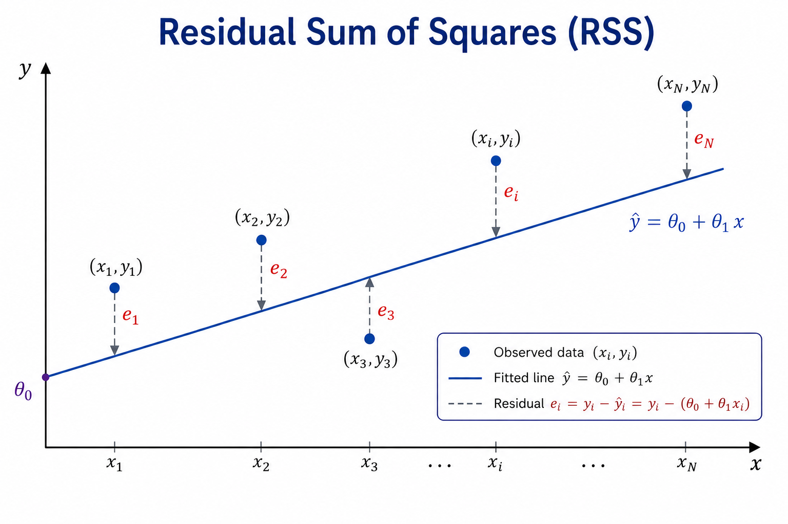

**Linear regression** is a statistical method used to model the relationship between a response variable and one or more predictors, or covariates. When there is a single predictor, the model is called **Simple Linear Regression**; when there are two or more predictors, it is called **Multiple Linear Regression**.

Linear regression is a fundamental statistical model and is also widely used as a supervised machine learning method for regression problems. It provides a natural starting point for studying regression, introducing many of the concepts that also appear in more sophisticated models.

# Simple Linear Regression

Suppose we have a training dataset

$$
\mathcal{D} = \{(x_i,y_i)\}_{i=1}^{N},
$$ {#eq-training-dataset}

where $x_i$ is the predictor and $y_i$ is the corresponding response for observation $i$. In tabular form,

|    $y$   |    $x$   |
| :------: | :------: |
|   $y_1$  |   $x_1$  |
|   $y_2$  |   $x_2$  |
| $\vdots$ | $\vdots$ |
|   $y_i$  |   $x_i$  |
| $\vdots$ | $\vdots$ |
|   $y_n$  |   $x_N$  |

: Training dataset for simple linear regression. {#tbl-training-dataset}

Suppose that the conditional mean of the response can reasonably be modeled as a linear function of the predictor. The simple linear regression model is

$$
y_i = \theta_0 + \theta_1 x_i + \varepsilon_i,
$$ {#eq-simple-linear-regression}

where $\theta_0$ is the **intercept**, $\theta_1$ is the **slope**, and $\varepsilon_i$ is an error term representing the part of $y_i$ that is not explained by the linear relationship.

The systematic component of the model is therefore

$$
\mathbb{E}[Y \mid X=x] = \theta_0 + \theta_1 x.
$$ {#eq-conditional-mean}

The goal is to estimate the unknown parameters $\theta_0$ and $\theta_1$ from the observed data. Once estimates $\hat{\theta}_0$ and $\hat{\theta}_1$ have been obtained, the fitted regression line is

$$
\hat{y}_i = \hat{\theta}_0 + \hat{\theta}_1 x_i.
$$ {#eq-fitted-regression-line}

For each observation, the difference between the observed response and its fitted value is called the **residual**:

$$
e_i = y_i - \hat{y}_i.
$$ {#eq-residual}

The question is then how to choose $\hat{\theta}_0$ and $\hat{\theta}_1$ so that the fitted line represents the observed data as well as possible. The standard approach is **Ordinary Least Squares**.

## Ordinary Least Squares

{#fig-rss width=90%}

```{python}
# Linear regression parameters

def min_sq(x,y):
    """
    Short Description

    Inputs:
    -------
    x, y

    Outputs:
    --------
    theta_1, theta_0

    Author:
    -------
    Rodrigo Kang
    """
    x_bar, y_bar = np.mean(x), np.mean(y)
    theta_1 = np.dot(x - x_bar, y - y_bar) / np.linalg.norm(x - x_bar)**2
    theta_0 = y_bar - theta_1 * x_bar
    return [theta_1, theta_0]
```