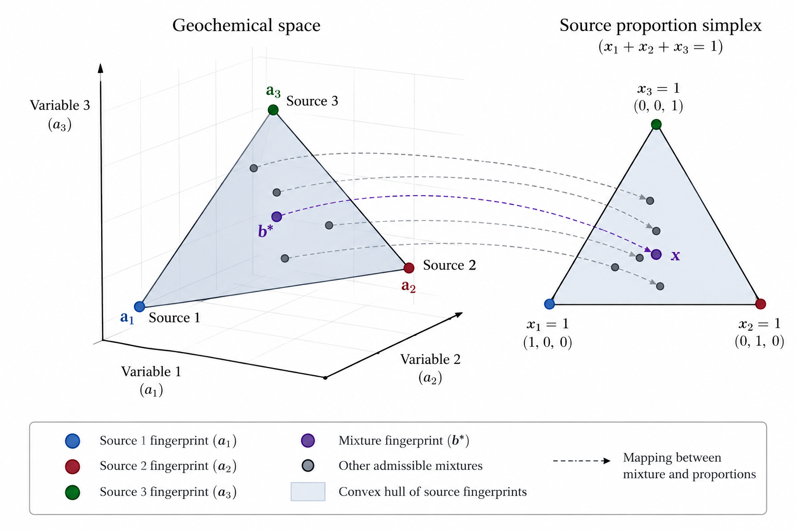
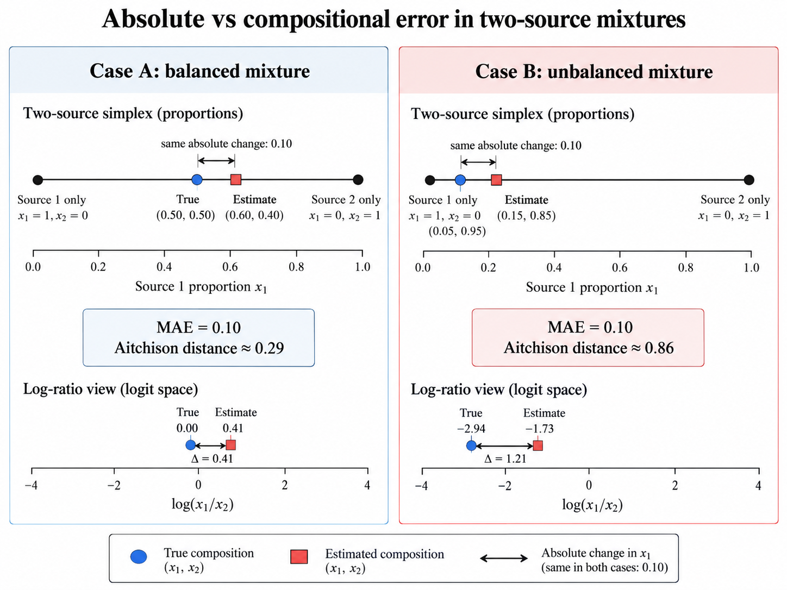

# Introduction

Geochemical mixing models are used to estimate the relative contributions of different sources to an observed mixture. These problems arise in several fields, including environmental sciences, sediment transport, petroleum geochemistry, and geological provenance studies. Although the physical processes involved may differ, the underlying mathematical problem is often the same: determining the proportions of several sources from a set of measured chemical characteristics.

A common approach consists of representing each source by a geochemical fingerprint, defined as a collection of measured tracer concentrations, chromatographic peak intensities, or other chemical properties. If these quantities behave conservatively during mixing, the fingerprint of the resulting mixture can be expressed as a weighted combination of the individual source fingerprints. The weights represent the unknown source proportions and must satisfy the physical requirements of non-negativity and mass conservation.

The estimation of these proportions constitutes an **inverse problem**. While the forward problem describes how known source proportions produce a mixture, the inverse problem seeks to recover those proportions from the observed chemical composition. Its solution is complicated by measurement uncertainty, similarities between source fingerprints, and the possibility that the observed mixture cannot be reproduced exactly by the assumed model.

Several approaches have been developed to address these difficulties. McCaffrey et al. [-@mccaffrey2011geochemical] examined geochemical allocation using linear mixing relationships and least-squares estimation. Nouvelle et al. [-@nouvelle2012novel] investigated the use of chromatographic peak ratios, which can reduce sensitivity to common scaling effects in the measured signals. Sandoval et al. [-@sandoval2022original] developed a probabilistic formulation based on the distribution of ratios of normally distributed variables, leading to a maximum likelihood estimation procedure.

These approaches share the same general objective but differ in their treatment of the observations and their statistical assumptions. Methods based on least squares estimate the source proportions by minimizing discrepancies between measured and reconstructed fingerprints. Ratio-based methods use relative relationships between chemical variables, while probabilistic formulations incorporate an explicit model of measurement uncertainty into the estimation procedure.

The following sections develop these formulations, beginning with the linear mixing model and its geometric properties. Particular attention is given to the mathematical derivations, statistical assumptions, and numerical methods required to obtain physically meaningful estimates.

# Geochemical Mixing Models

## Linear Mixing Model

Consider a system containing $K$ distinct sources, each characterised by $N_p$ measurable geochemical variables. These variables may represent concentrations of chemical elements, chromatographic peak heights, peak areas, or other quantities that can be related to the composition of a mixture.

For each source $k$, its geochemical fingerprint is represented by the vector

$$
\mathbf{a}_k =
\begin{bmatrix}
a_{1,k} \\
a_{2,k} \\
\vdots \\
a_{N_p,k}
\end{bmatrix}
\in \mathbb{R}^{N_p},
$$ {#eq-source-fingerprint}

where $a_{n,k}$ denotes the measured value of variable $n$ for source $k$.

Let $x_k$ denote the proportion of material contributed by source $k$ to the final mixture. Under the assumption of linear mixing, the theoretical value of variable $n$ in the mixture is given by

$$
b_n^\ast =
\sum_{k=1}^{K} x_k a_{n,k},
\qquad n=1,\ldots,N_p.
$$ {#eq-linear-mixing-components}

The superscript $\ast$ distinguishes the theoretical value predicted by the mixing model from the corresponding measured value.

This relationship expresses the conservation of each measured constituent during mixing. The contribution of a source to a particular variable is proportional to both its concentration in that source and the amount of material contributed by the source.

The formulation assumes that the selected variables follow an additive mixing relationship. This is generally appropriate for conserved chemical concentrations expressed on a consistent mass basis. When chromatographic intensities or other instrumental responses are used, linearity additionally requires that the measured signals be proportional to the relevant constituent quantities under comparable analytical conditions.

### Matrix Formulation

The individual source fingerprints can be arranged as columns of a matrix,

$$
\mathbf{A} =
\begin{bmatrix}
a_{1,1} & a_{1,2} & \cdots & a_{1,K} \\
a_{2,1} & a_{2,2} & \cdots & a_{2,K} \\
\vdots & \vdots & \ddots & \vdots \\
a_{N_p,1} & a_{N_p,2} & \cdots & a_{N_p,K}
\end{bmatrix}
\in \mathbb{R}^{N_p \times K},
$$ {#eq-source-signature-matrix}

while the unknown source proportions are collected in the vector

$$
\mathbf{x} =
\begin{bmatrix}
x_1 \\
x_2 \\
\vdots \\
x_K
\end{bmatrix}
\in \mathbb{R}^{K}.
$$ {#eq-source-proportions-vector}

Similarly, the theoretical mixture fingerprint is represented by

$$
\mathbf{b}^\ast =
\begin{bmatrix}
b_1^\ast \\
b_2^\ast \\
\vdots \\
b_{N_p}^\ast
\end{bmatrix}
\in \mathbb{R}^{N_p}.
$$ {#eq-theoretical-mixture-vector}

The system of equations in @eq-linear-mixing-components can then be written compactly as

$$
\mathbf{b}^\ast = \mathbf{A}\mathbf{x}.
$$ {#eq-linear-mixing-model}

This expression constitutes the mathematical foundation of the linear mixing model. Given the source fingerprints and their proportions, the composition of the resulting mixture can be calculated directly.

In practice, however, the measured fingerprint is affected by analytical errors, natural variability, and possible deviations from the assumed mixing relationship. The observed mixture is therefore represented as

$$
\mathbf{b} = \mathbf{A}\mathbf{x} + \boldsymbol{\varepsilon},
$$ {#eq-observed-mixing-model}

where $\boldsymbol{\varepsilon}\in\mathbb{R}^{N_p}$ represents the discrepancy between the observed mixture and the ideal linear model.

The error term may include instrumental noise, uncertainties in the chemical measurements, and departures from the assumption that all relevant mixing processes are linear and conservative.

At this stage, no particular probability distribution is assigned to $\boldsymbol{\varepsilon}$. Its statistical properties will become important when developing the estimation procedures.

## Physical Constraints and the Simplex

The unknown coefficients $x_k$ represent proportions of material contributed by the individual sources. Consequently, they must satisfy two conditions.

First, no source can contribute a negative proportion of material:

$$
x_k \geq 0,
\qquad k=1,\ldots,K.
$$ {#eq-nonnegative-source-proportions}

Second, the total contribution of all sources must equal the complete mixture:

$$
\sum_{k=1}^{K} x_k = 1.
$$ {#eq-source-proportions-sum}

Together, these conditions define the feasible set

$$
\Delta^{K-1}
=
\left\{
\mathbf{x}\in\mathbb{R}^{K}
\,\middle|\,
x_k\geq 0,\;
\sum_{k=1}^{K}x_k=1
\right\}.
$$ {#eq-source-proportions-simplex}

The set $\Delta^{K-1}$ is known as the **standard simplex** of dimension $K-1$.

Its dimension follows from the equality constraint in @eq-source-proportions-sum, which removes one degree of freedom from the $K$ unknown proportions.

For a mixture containing two sources, the constraint gives

$$
x_2=1-x_1,
\qquad 0\leq x_1\leq 1.
$$ {#eq-two-source-simplex}

The feasible set is therefore a line segment. Each point on this segment represents a possible combination of the two sources.

For three sources, the relationship becomes

$$
x_3=1-x_1-x_2,
$$

with

$$
x_1\geq 0,\qquad
x_2\geq 0,\qquad
x_1+x_2\leq 1.
$$ {#eq-three-source-simplex}

The feasible set is now a triangle. Its vertices correspond to mixtures consisting entirely of one source, while points along its edges represent mixtures of two sources. Points in its interior correspond to combinations of all three sources.

{#fig-geochemical-mixing-geometry}

This geometric interpretation extends to the observed chemical fingerprints.

Since the theoretical mixture is a convex combination of the source fingerprints,

$$
\mathbf{b}^\ast
=
\sum_{k=1}^{K}x_k\mathbf{a}_k,
\qquad
\mathbf{x}\in\Delta^{K-1},
$$ {#eq-convex-combination-source-signatures}

the set of all theoretically admissible mixtures is the convex hull of the source fingerprints,

$$
\mathcal{C}
=
\operatorname{conv}
\left\{
\mathbf{a}_1,\ldots,\mathbf{a}_K
\right\}.
$$ {#eq-source-signature-convex-hull}

Thus, in the absence of measurement error and model discrepancies, every observed mixture must lie within this convex hull.

When measurement errors are present, the observed fingerprint may lie outside the feasible region. In such cases, the inverse problem consists of finding the admissible combination of sources that best approximates the measured composition.

## The Inverse Mixing Problem

The linear mixing model describes the forward relationship between source proportions and the resulting mixture. In most applications, however, the proportions are unknown, while the mixture fingerprint and the individual source signatures can be measured or estimated.

The objective is therefore to determine $\mathbf{x}$ from the observations $\mathbf{b}$ and the source matrix $\mathbf{A}$.

In the absence of measurement error, the problem reduces to solving

$$
\mathbf{A}\mathbf{x}=\mathbf{b},
\qquad
\mathbf{x}\in\Delta^{K-1}.
$$ {#eq-noiseless-inverse-mixing-problem}

Whether this system admits a unique solution depends on the relationships between the source fingerprints.

To examine this condition, consider the equality constraint

$$
x_K=1-\sum_{k=1}^{K-1}x_k.
$$

Substituting this expression into the linear mixing model gives

$$
\begin{aligned}
\mathbf{b}^\ast
&=
\sum_{k=1}^{K-1}x_k\mathbf{a}_k
+
\left(
1-\sum_{k=1}^{K-1}x_k
\right)\mathbf{a}_K\\
&=
\mathbf{a}_K
+
\sum_{k=1}^{K-1}
x_k(\mathbf{a}_k-\mathbf{a}_K).
\end{aligned}
$$ {#eq-reduced-linear-mixing-model}

The mixture is therefore determined by $K-1$ coefficients and the differences between the source fingerprints.

If the vectors

$$
\mathbf{a}_1-\mathbf{a}_K,\;
\mathbf{a}_2-\mathbf{a}_K,\;
\ldots,\;
\mathbf{a}_{K-1}-\mathbf{a}_K
$$

are linearly independent, the source proportions are uniquely determined by an exact mixture within the model.

Conversely, if these vectors are linearly dependent, different combinations of source proportions may produce identical fingerprints. This situation is particularly relevant when several sources possess similar chemical characteristics.

Even when the solution is theoretically unique, nearly dependent source fingerprints can make the estimation numerically unstable. Small variations in the observations may then produce substantial changes in the estimated proportions.

The ability to distinguish individual sources is therefore determined not only by the number of measured variables, but also by the differences between their geochemical signatures.

### Estimation in the Presence of Measurement Error

When measurement uncertainty is considered, the observed mixture will generally not satisfy the linear system exactly.

The discrepancy between the measured fingerprint and the model prediction is represented by the residual vector

$$
\mathbf{e}(\mathbf{x})
=
\mathbf{b}-\mathbf{A}\mathbf{x}.
$$ {#eq-mixing-residual-vector}

One possible estimation strategy is to identify the source proportions that minimise the squared Euclidean norm of this residual vector:

$$
\hat{\mathbf{x}}
=
\underset{\mathbf{x}\in\Delta^{K-1}}{\arg\min}
\left\|
\mathbf{b}-\mathbf{A}\mathbf{x}
\right\|_2^2.
$$ {#eq-constrained-mixing-estimation}

This formulation leads to a constrained least-squares problem. The constraints ensure that the estimated proportions remain physically admissible, while the objective function measures the discrepancy between the observed mixture and its reconstruction.

The properties of the resulting estimator depend on the assumptions made about the errors and the numerical method used to solve the optimisation problem. These aspects will be developed in the following sections.

## Ratio-Based Mixing Models

The linear mixing model operates directly on the measured geochemical variables. An alternative approach is to work with ratios between pairs of variables.

This representation is particularly useful when the measured fingerprint is affected by multiplicative scaling factors, such as variations in sample quantity or instrumental response.

For two measured variables $i$ and $j$, define the observed ratio

$$
r_{ij}
=
\frac{b_i}{b_j},
\qquad b_j\neq 0.
$$ {#eq-observed-geochemical-ratio}

Under the linear mixing model, the corresponding theoretical ratio is

$$
R_{ij}^\ast(\mathbf{x})
=
\frac{b_i^\ast}{b_j^\ast}.
$$ {#eq-theoretical-geochemical-ratio}

Substituting the linear mixing relationships for both variables gives

$$
R_{ij}^\ast(\mathbf{x})
=
\frac{
\displaystyle\sum_{k=1}^{K}x_k a_{i,k}
}{
\displaystyle\sum_{k=1}^{K}x_k a_{j,k}
}.
$$ {#eq-ratio-based-mixing-model}

Unlike the original mixing relationship, this expression is generally nonlinear in the source proportions.

It is important to distinguish the ratio of the mixture from a weighted average of the ratios of the individual sources. In general,

$$
\frac{
\displaystyle\sum_{k=1}^{K}x_k a_{i,k}
}{
\displaystyle\sum_{k=1}^{K}x_k a_{j,k}
}
\neq
\sum_{k=1}^{K}
x_k\frac{a_{i,k}}{a_{j,k}}.
$$ {#eq-ratio-of-mixtures}

Consequently, the estimation of source proportions from ratios requires a formulation that respects the relationship in @eq-ratio-based-mixing-model.

### Invariance to Common Scaling

An important property of ratios is their invariance under multiplication by a common nonzero factor.

Suppose the measured fingerprint is affected by a positive scaling factor $c$ such that

$$
\tilde{\mathbf{b}}=c\mathbf{b},
\qquad c>0.
$$

The corresponding ratio becomes

$$
\tilde{r}_{ij}
=
\frac{\tilde{b}_i}{\tilde{b}_j}
=
\frac{cb_i}{cb_j}
=
\frac{b_i}{b_j}
=
r_{ij}.
$$ {#eq-ratio-scale-invariance}

The common factor cancels, leaving the ratio unchanged.

This property can reduce sensitivity to variations that affect all measured variables proportionally. It does not, however, eliminate errors that affect variables differently, nor does it guarantee that ratios are statistically more stable than the original measurements.

In particular, ratios involving small denominators can become highly sensitive to measurement noise. The uncertainty of a ratio must therefore be considered separately from the uncertainty of its individual components.

### Statistical Implications

Although ratios provide a useful representation of relative geochemical information, their statistical behaviour differs from that of the original measurements.

If the measured variables are random quantities, their ratio is also a random variable. Even when the individual measurements follow normal distributions, the resulting ratio does not generally follow a normal distribution.

This distinction is important when constructing statistical estimators. A least-squares criterion applied directly to ratios and a likelihood derived from their probability distribution represent different assumptions about measurement uncertainty.

Ratios may also be transformed logarithmically when their values are strictly positive. Such transformations preserve relative information but introduce a different scale for measuring discrepancies. A model formulated in log-ratio space should therefore be distinguished from one based on the probability distribution of untransformed ratios.

The probabilistic properties of ratios, including the derivation of their probability density function and the corresponding maximum likelihood estimator, will be examined after developing the least-squares approach.

# Least-Squares Deconvolution

The linear mixing model provides a direct relationship between the geochemical signatures of individual sources and the composition of an observed mixture. Estimating the unknown source proportions requires solving this relationship in the presence of measurement errors and, in general, more observations than unknown parameters.

Least-squares estimation offers a natural starting point. The method identifies the source proportions that minimise the squared discrepancies between the observed mixture and the composition predicted by the model. Its mathematical structure is relatively simple, and the resulting optimisation problem can be examined analytically.

The geochemical allocation approach discussed by McCaffrey et al. [-@mccaffrey2011geochemical] provides a basis for this formulation. Practical applications may also incorporate normalisation, statistical screening of chromatographic variables, and constrained numerical optimisation to improve the reliability and physical interpretation of the estimates.

## Ordinary Least Squares

Consider the linear mixing model

$$
\mathbf{b}=\mathbf{A}\mathbf{x}+\boldsymbol{\varepsilon},
$$

where $\mathbf{A}\in\mathbb{R}^{N_p\times K}$ contains the source fingerprints, $\mathbf{b}\in\mathbb{R}^{N_p}$ represents the observed mixture, and $\mathbf{x}\in\mathbb{R}^{K}$ contains the unknown source proportions.

The residual vector associated with a candidate solution $\mathbf{x}$ is

$$
\mathbf{e}=\mathbf{b}-\mathbf{A}\mathbf{x}.
$$

Ordinary least squares (OLS) estimates the unknown coefficients by minimising the residual sum of squares (RSS),

$$
RSS(\mathbf{x})
=
\sum_{n=1}^{N_p}
\left(
b_n-\sum_{k=1}^{K}a_{n,k}x_k
\right)^2.
$$ {#eq-least-squares-rss}

In matrix notation, the same expression becomes

$$
RSS(\mathbf{x})
=
\mathbf{e}^{T}\mathbf{e}
=
(\mathbf{b}-\mathbf{A}\mathbf{x})^{T}
(\mathbf{b}-\mathbf{A}\mathbf{x}).
$$ {#eq-least-squares-matrix-objective}

The unconstrained least-squares estimator is therefore defined by

$$
\hat{\mathbf{x}}_{\mathrm{OLS}}
=
\underset{\mathbf{x}\in\mathbb{R}^{K}}{\arg\min}
RSS(\mathbf{x}).
$$ {#eq-unconstrained-least-squares-estimator}

At this stage, the optimisation does not impose non-negativity or the requirement that the source proportions sum to one.

### Derivation of the Normal Equations

The least-squares objective can be expanded using the distributive properties of matrix multiplication:

$$
\begin{aligned}
RSS(\mathbf{x})
&=
(\mathbf{b}-\mathbf{A}\mathbf{x})^{T}
(\mathbf{b}-\mathbf{A}\mathbf{x})\\
&=
\mathbf{b}^{T}\mathbf{b}
-\mathbf{x}^{T}\mathbf{A}^{T}\mathbf{b}
-\mathbf{b}^{T}\mathbf{A}\mathbf{x}
+\mathbf{x}^{T}\mathbf{A}^{T}\mathbf{A}\mathbf{x}.
\end{aligned}
$$ {#eq-least-squares-objective-expansion}

Since $\mathbf{x}^{T}\mathbf{A}^{T}\mathbf{b}$ is a scalar, it is equal to its transpose:

$$
\mathbf{x}^{T}\mathbf{A}^{T}\mathbf{b}
=
\mathbf{b}^{T}\mathbf{A}\mathbf{x}.
$$

The objective can consequently be written as

$$
RSS(\mathbf{x})
=
\mathbf{b}^{T}\mathbf{b}
-
2\mathbf{x}^{T}\mathbf{A}^{T}\mathbf{b}
+
\mathbf{x}^{T}\mathbf{A}^{T}\mathbf{A}\mathbf{x}.
$$ {#eq-least-squares-simplified-objective}

To find its stationary points, we differentiate with respect to the vector $\mathbf{x}$.

The first term does not depend on $\mathbf{x}$, so its derivative is zero. For the second term, the matrix $\mathbf{A}^{T}\mathbf{b}$ is constant and

$$
\nabla_{\mathbf{x}}
\left(
-2\mathbf{x}^{T}\mathbf{A}^{T}\mathbf{b}
\right)
=
-2\mathbf{A}^{T}\mathbf{b}.
$$

For the quadratic term, the matrix differentiation identity

$$
\nabla_{\mathbf{x}}
(\mathbf{x}^{T}\mathbf{M}\mathbf{x})
=
(\mathbf{M}+\mathbf{M}^{T})\mathbf{x}
$$

can be applied with $\mathbf{M}=\mathbf{A}^{T}\mathbf{A}$.

Since $\mathbf{A}^{T}\mathbf{A}$ is symmetric,

$$
\nabla_{\mathbf{x}}
\left(
\mathbf{x}^{T}\mathbf{A}^{T}\mathbf{A}\mathbf{x}
\right)
=
2\mathbf{A}^{T}\mathbf{A}\mathbf{x}.
$$

Combining these expressions gives

$$
\nabla_{\mathbf{x}}RSS(\mathbf{x})
=
-2\mathbf{A}^{T}\mathbf{b}
+
2\mathbf{A}^{T}\mathbf{A}\mathbf{x}.
$$ {#eq-least-squares-gradient}

Setting the gradient equal to zero,

$$
-2\mathbf{A}^{T}\mathbf{b}
+
2\mathbf{A}^{T}\mathbf{A}\hat{\mathbf{x}}
=
\mathbf{0},
$$

leads to the **normal equations**,

$$
\mathbf{A}^{T}\mathbf{A}\hat{\mathbf{x}}
=
\mathbf{A}^{T}\mathbf{b}.
$$ {#eq-least-squares-normal-equations}

If $\mathbf{A}$ has full column rank, the matrix $\mathbf{A}^{T}\mathbf{A}$ is invertible, and the unique solution is

$$
\boxed{
\hat{\mathbf{x}}_{\mathrm{OLS}}
=
(\mathbf{A}^{T}\mathbf{A})^{-1}
\mathbf{A}^{T}\mathbf{b}
}
$$ {#eq-least-squares-analytical-solution}

This expression provides an analytical estimate of the source proportions without requiring an iterative optimisation procedure.

### Convexity and Uniqueness

The nature of the stationary point can be examined through the Hessian matrix of the objective.

Differentiating @eq-least-squares-gradient once more yields

$$
\nabla_{\mathbf{x}}^{2}RSS(\mathbf{x})
=
2\mathbf{A}^{T}\mathbf{A}.
$$ {#eq-least-squares-hessian}

For any vector $\mathbf{z}\in\mathbb{R}^{K}$,

$$
\mathbf{z}^{T}\mathbf{A}^{T}\mathbf{A}\mathbf{z}
=
\|\mathbf{A}\mathbf{z}\|_2^2
\geq 0.
$$

Therefore, $\mathbf{A}^{T}\mathbf{A}$ is positive semidefinite, and the least-squares objective is convex.

If $\mathbf{A}$ has full column rank, then

$$
\|\mathbf{A}\mathbf{z}\|_2^2>0
\qquad
\text{for every }\mathbf{z}\neq\mathbf{0}.
$$

In this case, the Hessian is positive definite, the objective is strictly convex, and the solution in @eq-least-squares-analytical-solution is the unique global minimum.

If the columns of $\mathbf{A}$ are linearly dependent, the normal equations do not determine a unique coefficient vector. Different source proportions may produce the same reconstructed mixture.

This distinction is important in geochemical applications, where source fingerprints can be highly similar even when they originate from physically distinct materials.

### Statistical Interpretation

The least-squares estimator can also be examined from a statistical perspective.

Suppose that the observations follow the linear model

$$
\mathbf{b}
=
\mathbf{A}\mathbf{x}
+
\boldsymbol{\varepsilon},
$$

with errors satisfying

$$
\mathbb{E}[\boldsymbol{\varepsilon}]
=
\mathbf{0},
\qquad
\operatorname{Cov}(\boldsymbol{\varepsilon})
=
\sigma^2\mathbf{I}.
$$ {#eq-least-squares-error-assumptions}

The first condition states that the errors have zero mean. The second assumes that they are uncorrelated and possess a common variance $\sigma^2$.

Under these assumptions, and treating $\mathbf{A}$ as fixed and known, the OLS estimator is unbiased when $\mathbf{A}$ has full column rank:

$$
\mathbb{E}[\hat{\mathbf{x}}_{\mathrm{OLS}}]
=
\mathbf{x}.
$$ {#eq-least-squares-unbiasedness}

To see this, substitute the observation model into the analytical estimator:

$$
\begin{aligned}
\hat{\mathbf{x}}_{\mathrm{OLS}}
&=
(\mathbf{A}^{T}\mathbf{A})^{-1}
\mathbf{A}^{T}
(\mathbf{A}\mathbf{x}+\boldsymbol{\varepsilon})\\
&=
\mathbf{x}
+
(\mathbf{A}^{T}\mathbf{A})^{-1}
\mathbf{A}^{T}\boldsymbol{\varepsilon}.
\end{aligned}
$$ {#eq-least-squares-estimator-decomposition}

Taking expectations immediately gives @eq-least-squares-unbiasedness.

The covariance matrix of the estimator is

$$
\operatorname{Cov}(\hat{\mathbf{x}}_{\mathrm{OLS}})
=
\sigma^2(\mathbf{A}^{T}\mathbf{A})^{-1}.
$$ {#eq-least-squares-estimator-covariance}

This relationship connects estimation uncertainty with the properties of the source matrix. When the fingerprints are nearly linearly dependent, $\mathbf{A}^{T}\mathbf{A}$ becomes ill-conditioned, and the estimated proportions can be highly sensitive to measurement errors.

The derivation of OLS does not require normally distributed errors. Normality becomes relevant when the estimator is interpreted through maximum likelihood.

If

$$
\boldsymbol{\varepsilon}
\sim
\mathcal{N}(\mathbf{0},\sigma^2\mathbf{I}),
$$

the negative log-likelihood, apart from terms that do not depend on $\mathbf{x}$, is proportional to

$$
\frac{1}{2\sigma^2}
\|\mathbf{b}-\mathbf{A}\mathbf{x}\|_2^2.
$$ {#eq-gaussian-least-squares-likelihood}

Consequently, minimising the residual sum of squares is equivalent to maximising the Gaussian likelihood with respect to $\mathbf{x}$.

This equivalence provides a probabilistic interpretation of least squares under the stated error assumptions. It does not, by itself, ensure that the resulting coefficients satisfy the physical constraints of a mixing model.

## Normalisation of Geochemical Measurements

Geochemical fingerprints frequently contain variables with substantially different magnitudes. In chromatographic data, for example, some peaks may exhibit considerably greater intensities than others.

Since the least-squares objective depends on squared absolute differences, variables with large numerical values can dominate the estimation. A comparatively small discrepancy in a high-intensity peak may contribute more to the objective than a large relative discrepancy in a low-intensity peak.

One approach to reducing this imbalance is to normalise the observations using the corresponding source measurements.

### Row-Wise Normalisation

For each measured variable $n$, define the scaling factor

$$
s_n
=
\max_{1\leq k\leq K}a_{n,k},
$$ {#eq-geochemical-row-scaling-factor}

assuming non-negative measurements and $s_n>0$.

The normalised source signatures are then

$$
a_{n,k}^{\prime}
=
\frac{a_{n,k}}{s_n},
\qquad
k=1,\ldots,K,
$$ {#eq-geochemical-normalised-sources}

and the observed mixture is transformed using the same factor:

$$
b_n^{\prime}
=
\frac{b_n}{s_n}.
$$ {#eq-geochemical-normalised-mixture}

This transformation preserves the linear relationship for each variable because

$$
b_n^{\prime}
=
\sum_{k=1}^{K}x_k a_{n,k}^{\prime}
+
\frac{\varepsilon_n}{s_n}.
$$ {#eq-geochemical-normalised-mixing-model}

For non-negative source measurements, the normalised source values lie between zero and one. Under an exact convex mixing model, the theoretical mixture values also belong to this interval. Measurement errors, however, may cause the observed values to fall outside it.

The transformation can be expressed in matrix form by defining

$$
\mathbf{W}
=
\operatorname{diag}
\left(
\frac{1}{s_1},
\frac{1}{s_2},
\ldots,
\frac{1}{s_{N_p}}
\right).
$$ {#eq-geochemical-normalisation-matrix}

The transformed variables satisfy

$$
\mathbf{A}^{\prime}
=
\mathbf{W}\mathbf{A},
\qquad
\mathbf{b}^{\prime}
=
\mathbf{W}\mathbf{b}.
$$

Applying least squares to the normalised data produces

$$
\begin{aligned}
RSS^{\prime}(\mathbf{x})
&=
\|\mathbf{b}^{\prime}-\mathbf{A}^{\prime}\mathbf{x}\|_2^2\\
&=
\|\mathbf{W}(\mathbf{b}-\mathbf{A}\mathbf{x})\|_2^2\\
&=
\sum_{n=1}^{N_p}
\frac{
\left(b_n-\sum_{k=1}^{K}a_{n,k}x_k\right)^2
}{
s_n^2
}.
\end{aligned}
$$ {#eq-geochemical-normalised-rss}

The expression shows that row-wise normalisation is mathematically equivalent to a weighted least-squares criterion, with each residual weighted by the inverse square of the corresponding scaling factor.

This distinction matters because normalisation does more than change the numerical representation of the data: it changes the relative contribution of each observation to the objective function.

### Statistical Consequences of Normalisation

Normalisation can improve the balance between variables measured on different scales, but its statistical consequences depend on the underlying error structure.

Suppose the original measurement errors have covariance matrix

$$
\operatorname{Cov}(\boldsymbol{\varepsilon})
=
\boldsymbol{\Sigma}.
$$

After normalisation, their covariance becomes

$$
\operatorname{Cov}(\mathbf{W}\boldsymbol{\varepsilon})
=
\mathbf{W}\boldsymbol{\Sigma}\mathbf{W}^{T}.
$$ {#eq-normalised-error-covariance}

Therefore, normalisation does not generally make the measurement errors homoscedastic.

If the scaling factors are very small, their inverse weights may amplify the influence of noisy, low-intensity variables. Conversely, variables with large intensities receive smaller weights, even when their measurements are comparatively precise.

When the error covariance is known or can be estimated reliably, a more explicitly statistical alternative is generalised least squares,

$$
\hat{\mathbf{x}}_{\mathrm{GLS}}
=
\underset{\mathbf{x}}{\arg\min}
(\mathbf{b}-\mathbf{A}\mathbf{x})^{T}
\boldsymbol{\Sigma}^{-1}
(\mathbf{b}-\mathbf{A}\mathbf{x}).
$$ {#eq-geochemical-generalised-least-squares}

This formulation accounts for the variances and correlations of the measurement errors, provided that $\boldsymbol{\Sigma}$ is positive definite.

Row-wise normalisation and generalised least squares should therefore be distinguished. The former is a scaling procedure, whereas the latter is based on an explicit covariance model.

In applications where reliable estimates of the error covariance are unavailable, normalisation remains a practical alternative, provided its influence on the final estimates is examined.

## Cross-Validation and Statistical Filtering

The quality of a geochemical fingerprint depends not only on the number of measured variables but also on their consistency with the assumed mixing model.

Some observations may be affected by instrumental artefacts, poor analytical resolution, unusually large measurement errors, or departures from conservative mixing behaviour. Including such variables without examination may distort the estimated source proportions.

Statistical filtering seeks to identify observations that are poorly reproduced by the model and assess whether their exclusion is justified.

A useful approach combines leave-one-out cross-validation (LOOCV) with measures of prediction error.

### Leave-One-Out Cross-Validation

Consider the system containing $N_p$ measured variables. In LOOCV, one observation is excluded from the estimation procedure, and the remaining observations are used to predict the excluded value.

For each $n=1,\ldots,N_p$, let

$$
\mathbf{A}^{(-n)}
\in\mathbb{R}^{(N_p-1)\times K}
$$

denote the matrix obtained by removing row $n$ from $\mathbf{A}$, and let $\mathbf{b}^{(-n)}$ be the corresponding observation vector.

The source proportions are estimated from the reduced system:

$$
\hat{\mathbf{x}}^{(-n)}
=
\underset{\mathbf{x}}{\arg\min}
\left\|
\mathbf{b}^{(-n)}
-
\mathbf{A}^{(-n)}\mathbf{x}
\right\|_2^2.
$$ {#eq-geochemical-loocv-estimator}

For an unconstrained least-squares problem with full column rank, this gives

$$
\hat{\mathbf{x}}^{(-n)}
=
\left[
(\mathbf{A}^{(-n)})^{T}
\mathbf{A}^{(-n)}
\right]^{-1}
(\mathbf{A}^{(-n)})^{T}
\mathbf{b}^{(-n)}.
$$ {#eq-geochemical-loocv-analytical-solution}

If the estimation procedure includes physical constraints, the reduced problem should be solved under the same constraints.

Let $\mathbf{a}_n^{T}$ denote row $n$ of the original source matrix. The excluded observation is predicted as

$$
\hat{b}_n^{(-n)}
=
\mathbf{a}_n^{T}\hat{\mathbf{x}}^{(-n)}.
$$ {#eq-geochemical-loocv-prediction}

The corresponding cross-validation residual is

$$
e_n^{(\mathrm{cv})}
=
b_n-\hat{b}_n^{(-n)}.
$$ {#eq-geochemical-loocv-residual}

Repeating the procedure for every measured variable produces the vector

$$
\mathbf{e}^{(\mathrm{cv})}
=
\begin{bmatrix}
e_1^{(\mathrm{cv})}\\
e_2^{(\mathrm{cv})}\\
\vdots\\
e_{N_p}^{(\mathrm{cv})}
\end{bmatrix}.
$$ {#eq-geochemical-loocv-residual-vector}

Unlike an ordinary fitted residual, each cross-validation residual is obtained from a model that was estimated without using the corresponding observation.

This reduces the direct influence of an observation on its own predicted value and provides a useful diagnostic of how well the remaining geochemical variables support its reconstruction.

The residuals are not necessarily statistically independent, since the reduced datasets overlap. Moreover, the procedure can become unstable if removing a variable leaves insufficient information to distinguish the sources.

### Symmetric Relative Error

Absolute residuals can be difficult to compare when the measured variables differ substantially in magnitude.

A scale-independent diagnostic used for non-negative measurements is the **Symmetric Relative Error (SRE)**,

$$
SRE_n
=
\frac{
|b_n-\hat{b}_n^{(-n)}|
}{
b_n+\hat{b}_n^{(-n)}
},
$$ {#eq-geochemical-symmetric-relative-error}

provided that the denominator is positive.

For non-negative observed and predicted values,

$$
0\leq SRE_n\leq 1.
$$

The measure is zero when the observation and prediction coincide. Larger values indicate increasing relative discrepancies.

For example, the pairs $(b_n,\hat{b}_n)=(10,9)$ and $(100,90)$ produce the same SRE, despite having different absolute errors.

This property makes the measure useful for comparing chromatographic peaks or other measurements with different characteristic magnitudes.

If both values are zero, the expression is undefined and requires separate treatment. The measure is also not appropriate without modification when the observations or predictions can take negative values.

It is important to distinguish the SRE from a signed residual. Since the SRE is non-negative, it does not preserve the direction of the prediction error and should not be expected to follow a symmetric, zero-centred normal distribution.

### Statistical Assessment of Residuals

Before identifying observations with unusually large errors, the distribution of the cross-validation residuals can be examined.

One possibility is to assess compatibility with normality using the Shapiro–Wilk test.

For a sample of $N_p$ residuals, the test statistic is

$$
W_{\mathrm{SW}}
=
\frac{
\left(
\sum_{n=1}^{N_p}
c_n e_{(n)}^{(\mathrm{cv})}
\right)^2
}{
\sum_{n=1}^{N_p}
\left(
e_n^{(\mathrm{cv})}
-
\bar{e}^{(\mathrm{cv})}
\right)^2
},
$$ {#eq-geochemical-shapiro-wilk-statistic}

where $e_{(n)}^{(\mathrm{cv})}$ denotes the ordered residuals, $\bar{e}^{(\mathrm{cv})}$ is their sample mean, and the coefficients $c_n$ are determined from the expected order statistics and covariance structure of a sample from a normal distribution.

The null hypothesis is that the observations arise from a normal distribution.

A small p-value provides evidence against normality, while failure to reject the null hypothesis does not establish that the residuals are normally distributed.

The test may also be affected by dependence between cross-validation residuals.

When relative-error diagnostics such as the SRE are used instead, normality tests require additional caution. Because these diagnostics are bounded and non-negative, their distributions can be asymmetric even when the underlying measurement errors are Gaussian.

A distinction should therefore be maintained between checking the distribution of signed residuals and examining the magnitude of relative prediction errors.

### Identification of Unusual Observations

A practical filtering procedure can use the SRE values to identify variables with unusually large relative discrepancies.

When their empirical distribution is sufficiently regular, one possible screening threshold is

$$
SRE_n
>
\mu_{\mathrm{SRE}}
+
3\sigma_{\mathrm{SRE}},
$$ {#eq-geochemical-three-sigma-filter}

where $\mu_{\mathrm{SRE}}$ and $\sigma_{\mathrm{SRE}}$ denote the sample mean and standard deviation of the relative errors.

This criterion is motivated by the conventional three-standard-deviation rule. For a normally distributed variable, approximately 99.7% of observations lie within three standard deviations of the mean.

However, this probability cannot be transferred directly to the SRE because its distribution is not generally normal. In this setting, the threshold should be understood as a screening heuristic rather than a probability guarantee.

When the distribution is strongly asymmetric or contains unusually large observations, a robust alternative is based on the interquartile range (IQR).

Let $Q_1$ and $Q_3$ denote the first and third quartiles of the SRE values. Define

$$
IQR=Q_3-Q_1.
$$ {#eq-geochemical-interquartile-range}

An observation may then be flagged when

$$
SRE_n
>
Q_3+1.5\,IQR.
$$ {#eq-geochemical-iqr-filter}

Unlike a standard-deviation threshold, the IQR criterion is less sensitive to extreme observations because it is based on quartiles.

Neither criterion establishes that a flagged measurement is necessarily incorrect. Large residuals may indicate poor measurement quality, but they can also arise from source similarity, model misspecification, or genuine chemical behaviour that is not represented by the assumed mixing relationship.

For this reason, statistical filtering should be regarded as a diagnostic procedure rather than an automatic justification for discarding measurements.

### Refitting After Statistical Filtering

Once the observations to be retained have been selected, the source proportions can be estimated again using the reduced dataset.

Let $\mathcal{I}$ denote the set of retained variables, and define

$$
\mathbf{A}_{\mathcal{I}}
=
\{a_{n,k}:n\in\mathcal{I}\},
\qquad
\mathbf{b}_{\mathcal{I}}
=
\{b_n:n\in\mathcal{I}\}.
$$

The final estimator can then be formulated as

$$
\hat{\mathbf{x}}
=
\underset{\mathbf{x}\in\Delta^{K-1}}{\arg\min}
\left\|
\mathbf{b}_{\mathcal{I}}
-
\mathbf{A}_{\mathcal{I}}\mathbf{x}
\right\|_2^2.
$$ {#eq-geochemical-filtered-estimation}

If normalisation is used, the same transformation should be applied consistently to the retained observations and their corresponding source measurements.

Filtering may improve the agreement between the model and the observations, but removing variables also reduces the information available for estimation. The retained source fingerprints must therefore remain sufficiently distinguishable to support a stable solution.

Furthermore, residual-based selection and refitting on the same dataset can introduce selection effects. Improvements in the residual sum of squares after filtering should not be interpreted automatically as improvements in the accuracy of the recovered source proportions.

## Constrained Least-Squares Estimation

The analytical OLS solution does not generally satisfy the physical requirements of a mixing model.

Even when the observations are generated from a mixture with non-negative proportions summing to one, measurement errors can cause the unconstrained solution to contain negative coefficients or coefficients whose sum differs from unity.

Such solutions minimise the unconstrained quadratic objective but cannot be interpreted directly as physical source contributions.

A more appropriate formulation imposes the mixing constraints within the optimisation problem.

### Quadratic Programming Formulation

The constrained least-squares estimator is defined as

$$
\boxed{
\begin{aligned}
\hat{\mathbf{x}}
&=
\underset{\mathbf{x}}{\arg\min}
\frac{1}{2}
\|\mathbf{A}\mathbf{x}-\mathbf{b}\|_2^2\\
\text{subject to}\qquad
&\sum_{k=1}^{K}x_k=1,\\
&x_k\geq 0,
\qquad k=1,\ldots,K.
\end{aligned}
}
$$ {#eq-geochemical-constrained-least-squares}

The factor $1/2$ does not change the minimiser, but simplifies the derivatives.

The upper bounds $x_k\leq 1$ follow automatically from non-negativity and the sum-to-one constraint, so they need not be imposed separately.

Expanding the objective gives

$$
f(\mathbf{x})
=
\frac{1}{2}\mathbf{x}^{T}\mathbf{A}^{T}\mathbf{A}\mathbf{x}
-
\mathbf{x}^{T}\mathbf{A}^{T}\mathbf{b}
+
\frac{1}{2}\mathbf{b}^{T}\mathbf{b}.
$$ {#eq-geochemical-quadratic-objective}

The gradient and Hessian are

$$
\nabla f(\mathbf{x})
=
\mathbf{A}^{T}
(\mathbf{A}\mathbf{x}-\mathbf{b}),
$$ {#eq-geochemical-constrained-gradient}

and

$$
\nabla^2 f(\mathbf{x})
=
\mathbf{A}^{T}\mathbf{A}.
$$ {#eq-geochemical-constrained-hessian}

Since the Hessian is positive semidefinite and the simplex is convex, the optimisation problem is convex.

Therefore, every local minimum is also a global minimum.

A solution always exists because the feasible simplex is non-empty and compact, and the objective is continuous. Uniqueness of the source proportions additionally requires sufficient independence between the source fingerprints within the feasible affine space.

### Karush–Kuhn–Tucker Conditions

The constrained problem can be characterised using the Karush–Kuhn–Tucker (KKT) conditions.

Introduce a scalar Lagrange multiplier $\lambda$ for the equality constraint and non-negative multipliers $\boldsymbol{\mu}=(\mu_1,\ldots,\mu_K)^T$ for the inequalities $x_k\geq 0$.

The Lagrangian is

$$
\mathcal{L}(\mathbf{x},\lambda,\boldsymbol{\mu})
=
\frac{1}{2}
\|\mathbf{A}\mathbf{x}-\mathbf{b}\|_2^2
+
\lambda(\mathbf{1}^{T}\mathbf{x}-1)
-
\boldsymbol{\mu}^{T}\mathbf{x}.
$$ {#eq-geochemical-least-squares-lagrangian}

The stationarity condition is obtained by differentiating with respect to $\mathbf{x}$:

$$
\nabla_{\mathbf{x}}\mathcal{L}
=
\mathbf{A}^{T}(\mathbf{A}\mathbf{x}-\mathbf{b})
+
\lambda\mathbf{1}
-
\boldsymbol{\mu}
=
\mathbf{0}.
$$ {#eq-geochemical-kkt-stationarity}

The complete KKT system consists of four conditions.

**Stationarity**

$$
\mathbf{A}^{T}(\mathbf{A}\mathbf{x}-\mathbf{b})
+
\lambda\mathbf{1}
-
\boldsymbol{\mu}
=
\mathbf{0}.
$$

**Primal feasibility**

$$
\mathbf{1}^{T}\mathbf{x}=1,
\qquad
\mathbf{x}\geq\mathbf{0}.
$$

**Dual feasibility**

$$
\boldsymbol{\mu}\geq\mathbf{0}.
$$

**Complementary slackness**

$$
\mu_kx_k=0,
\qquad
k=1,\ldots,K.
$$ {#eq-geochemical-kkt-complementarity}

Complementary slackness means that, for each source, either its estimated contribution is positive and the associated multiplier is zero, or its contribution is zero and the inequality constraint may be active.

This property is relevant when some candidate sources do not contribute to the observed mixture. The solution may then lie on a boundary of the simplex rather than in its interior.

For the convex problem in @eq-geochemical-constrained-least-squares, the KKT conditions are sufficient for global optimality. They are also necessary because the constraints satisfy the usual constraint qualification conditions.

## Sequential Least Squares Programming

The constrained least-squares problem can be solved using quadratic programming methods. One available numerical approach is **Sequential Least Squares Programming (SLSQP)**, which belongs to the broader family of Sequential Quadratic Programming (SQP) algorithms.

SQP methods solve constrained nonlinear optimisation problems by constructing a sequence of quadratic approximations to the objective and linear approximations to the constraints.

Although the geochemical least-squares objective is already quadratic and its constraints are linear, SLSQP provides a general numerical framework that can also accommodate more complicated formulations.

### Quadratic Subproblem

Consider a general constrained optimisation problem,

$$
\begin{aligned}
\min_{\mathbf{x}}\quad &f(\mathbf{x})\\
\text{subject to}\quad
&h(\mathbf{x})=0,\\
&g_k(\mathbf{x})\geq 0.
\end{aligned}
$$ {#eq-general-sqp-problem}

At iteration $t$, let $\mathbf{x}^{(t)}$ denote the current estimate and $\mathbf{d}$ a proposed search direction.

A second-order approximation to the objective is

$$
f(\mathbf{x}^{(t)}+\mathbf{d})
\approx
f(\mathbf{x}^{(t)})
+
\nabla f(\mathbf{x}^{(t)})^{T}\mathbf{d}
+
\frac{1}{2}\mathbf{d}^{T}\mathbf{B}^{(t)}\mathbf{d},
$$ {#eq-sqp-quadratic-approximation}

where $\mathbf{B}^{(t)}$ is an approximation to the Hessian of the Lagrangian.

The constraints are approximated to first order:

$$
h(\mathbf{x}^{(t)}+\mathbf{d})
\approx
h(\mathbf{x}^{(t)})
+
\nabla h(\mathbf{x}^{(t)})^{T}\mathbf{d},
$$

and

$$
g_k(\mathbf{x}^{(t)}+\mathbf{d})
\approx
g_k(\mathbf{x}^{(t)})
+
\nabla g_k(\mathbf{x}^{(t)})^{T}\mathbf{d}.
$$

These expressions define a quadratic programming subproblem whose solution provides a search direction for the next iteration.

For constrained geochemical least squares, the subproblem takes the form

$$
\begin{aligned}
\min_{\mathbf{d}}\quad&
\nabla f(\mathbf{x}^{(t)})^{T}\mathbf{d}
+
\frac{1}{2}
\mathbf{d}^{T}\mathbf{B}^{(t)}\mathbf{d}\\
\text{subject to}\quad&
\mathbf{1}^{T}(\mathbf{x}^{(t)}+\mathbf{d})=1,\\
&\mathbf{x}^{(t)}+\mathbf{d}\geq\mathbf{0}.
\end{aligned}
$$ {#eq-geochemical-slsqp-subproblem}

Because the mixing constraints are linear, their representations in this subproblem are exact rather than approximations.

The objective is also quadratic, with the constant Hessian $\mathbf{A}^{T}\mathbf{A}$. Consequently, an exact quadratic programming solver could work directly with the original problem.

SLSQP instead uses a general iterative framework, typically maintaining a quasi-Newton approximation to the Hessian of the Lagrangian.

### Quasi-Newton Approximation

The matrix $\mathbf{B}^{(t)}$ is commonly updated through a Broyden–Fletcher–Goldfarb–Shanno (BFGS) strategy.

The purpose of this update is to approximate the curvature of the Lagrangian using information obtained from successive iterations, without explicitly computing its full Hessian.

In the present least-squares formulation, the Hessian of the objective is available analytically. Nevertheless, the quasi-Newton structure is useful when the same optimisation framework is applied to nonlinear objectives whose second derivatives are difficult or expensive to evaluate.

The search direction obtained from the quadratic subproblem is used to construct the next estimate,

$$
\mathbf{x}^{(t+1)}
=
\mathbf{x}^{(t)}
+
\alpha_t\mathbf{d}^{(t)},
$$ {#eq-geochemical-slsqp-update}

where $\alpha_t$ is a step length selected according to the optimisation procedure.

The iterations continue until the prescribed convergence conditions are satisfied.

These conditions involve the objective function, the first-order optimality conditions, and the extent to which the constraints are satisfied.

::: {.callout-note appearance="simple" icon=false collapse="false"}

**Algorithm:** *Sequential Least Squares Programming (SLSQP)*

\medskip

Iteratively minimise the constrained least-squares objective by solving quadratic subproblems and updating an approximation to the Hessian of the Lagrangian.

\medskip

**Input:** source matrix $\mathbf{A}$, observed mixture $\mathbf{b}$, feasible initial proportions $\mathbf{x}^{(0)}\in\Delta^{K-1}$, convergence tolerance $\tau>0$, maximum number of iterations $T$.  
**Output:** estimated source proportions $\hat{\mathbf{x}}$ and termination status.

1. Initialise $\mathbf{x}^{(0)}$ and a positive-definite Hessian approximation $\mathbf{B}^{(0)}$.

2. For $t=0,1,\ldots,T-1$:

   a. Evaluate the objective function and its gradient:

   $$
   f(\mathbf{x}^{(t)})
   =
   \frac{1}{2}
   \|\mathbf{A}\mathbf{x}^{(t)}-\mathbf{b}\|_2^2,
   $$

   $$
   \mathbf{g}_t
   =
   \mathbf{A}^{T}
   (\mathbf{A}\mathbf{x}^{(t)}-\mathbf{b}).
   $$

   b. Solve the quadratic subproblem:

   $$
   \begin{aligned}
   \min_{\mathbf{d}}\quad&
   \mathbf{g}_t^{T}\mathbf{d}
   +
   \frac{1}{2}
   \mathbf{d}^{T}\mathbf{B}^{(t)}\mathbf{d}\\
   \text{subject to}\quad&
   \mathbf{1}^{T}
   (\mathbf{x}^{(t)}+\mathbf{d})=1,\\
   &
   \mathbf{x}^{(t)}+\mathbf{d}\geq\mathbf{0}.
   \end{aligned}
   $$

   c. Check the first-order optimality conditions. If the KKT residuals are below the prescribed tolerance, terminate with convergence.

   d. Choose a step length $\alpha_t\in(0,1]$ that provides sufficient decrease in the objective while preserving feasibility.

   e. Update the source proportions:

   $$
   \mathbf{x}^{(t+1)}
   =
   \mathbf{x}^{(t)}
   +
   \alpha_t\mathbf{d}^{(t)}.
   $$

   f. Update $\mathbf{B}^{(t)}$ using a safeguarded BFGS approximation based on successive gradients of the Lagrangian.

3. If the maximum number of iterations is reached without satisfying the convergence criterion, terminate with the corresponding status.

4. Return the final estimate $\hat{\mathbf{x}}$ and termination status.

:::

### Numerical Considerations

The use of SLSQP makes it possible to impose the physical mixing constraints directly during estimation, subject to the numerical tolerances of the solver.

However, the choice of optimisation algorithm does not remove the statistical or structural limitations of the underlying mixing model.

In particular, three issues remain relevant.

First, nearly identical source fingerprints can make the estimated proportions sensitive to small variations in the observations, even when the solution is constrained.

Second, the least-squares objective assigns importance to residuals according to their magnitude or the weights introduced during preprocessing. If these weights do not adequately represent the measurement uncertainty, the resulting estimates may be statistically inefficient.

Third, numerical convergence and physical feasibility are different properties. A solver may return a nearly feasible point without satisfying the constraints exactly, particularly when convergence tolerances are relatively loose.

For these reasons, the estimated solution should be examined through its constraint residuals, reconstruction errors, and sensitivity to changes in the observations.

When the objective is convex and the constraints are linear, as in the present formulation, a dedicated quadratic programming method is also a valid alternative to SLSQP.

## Limitations of Least-Squares Deconvolution

Least-squares deconvolution provides a straightforward and interpretable method for estimating source proportions from measured geochemical fingerprints.

Its main advantages follow from the linear structure of the mixing model and the convexity of the quadratic objective. Under suitable rank conditions, the unconstrained estimator can be obtained analytically, while physical constraints can be incorporated through quadratic programming.

Nevertheless, the quality of the estimates depends on several assumptions.

The first concerns the validity of the linear mixing relationship. Chemical reactions, fractionation, differential transport, or non-conservative tracer behaviour may cause the observed mixture to deviate systematically from a linear combination of the source fingerprints.

The second concerns source distinguishability. If two or more sources have similar geochemical signatures, the inverse problem may become poorly conditioned. Constrained optimisation prevents physically impossible coefficients but does not create information that is absent from the measurements.

The third concerns the representation of measurement uncertainty. Ordinary least squares treats residuals symmetrically through their squared magnitudes. Normalisation and statistical filtering can modify the influence of individual observations, but they do not replace an explicit stochastic model when the error structure is complex.

These considerations become particularly important when the measured variables are expressed as ratios. Although ratios can reduce the influence of common multiplicative factors, they also have probability distributions that differ from those of the original measurements.

A probabilistic deconvolution method can address this distinction by deriving an estimation criterion from the distribution of the observed ratios rather than applying a quadratic loss without accounting for their statistical properties.

The next section develops this approach, beginning with the probability distribution of the ratio of two normally distributed variables and its application to geochemical mixing models.

# Probabilistic Deconvolution

Least-squares deconvolution estimates source proportions by minimising discrepancies between measured and reconstructed geochemical fingerprints. Its statistical interpretation is straightforward when the measurement errors are independent, normally distributed, and have constant variance. However, these assumptions do not necessarily remain appropriate when the observations are expressed as ratios of geochemical variables.

Ratios are often used to reduce the influence of multiplicative factors affecting the measured signals. Although this transformation preserves useful relative information, it also changes the statistical properties of the observations. In particular, the ratio of two normally distributed random variables is not generally normally distributed, even when the original measurements are independent.

A probabilistic approach accounts for this distinction by deriving the probability distribution of the observed ratios and using it to construct an estimation criterion. The method developed by Sandoval et al. [-@sandoval2022original] follows this principle, formulating geochemical deconvolution as a maximum likelihood estimation problem.

The mathematical development begins with a model of measurement uncertainty and proceeds through the derivation of the probability density function of a ratio of normal random variables.

## Measurement Error Model

Consider a geochemical fingerprint containing $N_p$ measured variables. Each observation is represented as the sum of a theoretical value and a random measurement error,

$$
b_n=b_n^\ast+\lambda_n,
\qquad n=1,\ldots,N_p,
$$ {#eq-probabilistic-measurement-model}

where $b_n^\ast$ denotes the value predicted by the mixing model and $\lambda_n$ represents measurement uncertainty.

Assume initially that the measurement errors follow normal distributions,

$$
\lambda_n\sim\mathcal{N}(0,\sigma_n^2),
$$ {#eq-probabilistic-gaussian-errors}

where $\sigma_n^2$ is the variance associated with variable $n$.

For two variables $i$ and $j$, define the corresponding random measurements as

$$
B_i\sim\mathcal{N}(b_i^\ast,\sigma_i^2),
\qquad
B_j\sim\mathcal{N}(b_j^\ast,\sigma_j^2).
$$ {#eq-probabilistic-random-measurements}

The capital letters distinguish the random variables from their observed realisations $b_i$ and $b_j$.

We initially assume that $B_i$ and $B_j$ are independent, with strictly positive standard deviations. Their joint probability density is therefore the product of their marginal densities:

$$
\begin{aligned}
p_{B_i,B_j}(u,v)
&=
p_{B_i}(u)p_{B_j}(v)\\
&=
\frac{1}{2\pi\sigma_i\sigma_j}
\exp\left[
-\frac{1}{2}
\left(
\frac{u-b_i^\ast}{\sigma_i}
\right)^2
\right]\\
&\quad\times
\exp\left[
-\frac{1}{2}
\left(
\frac{v-b_j^\ast}{\sigma_j}
\right)^2
\right].
\end{aligned}
$$ {#eq-probabilistic-joint-gaussian-density}

The observed geochemical ratio is

$$
r_{ij}=\frac{b_i}{b_j},
\qquad b_j\neq0,
$$

while the corresponding random variable is

$$
R_{ij}=\frac{B_i}{B_j}.
$$ {#eq-probabilistic-random-ratio}

The theoretical ratio predicted by the mixing model is

$$
R_{ij}^\ast=\frac{b_i^\ast}{b_j^\ast},
$$ {#eq-probabilistic-theoretical-ratio}

provided $b_j^\ast\neq0$.

The objective is to determine the probability density $p_{R_{ij}}(r)$, which describes the statistical behaviour of the observed ratio under the assumed measurement model.

A direct application of the Gaussian density is not appropriate because $R_{ij}$ is a nonlinear transformation of two normally distributed variables. Its distribution must instead be obtained from their joint probability density.

## Distribution of the Ratio of Two Normal Variables

### Change of Variables and Jacobian

To derive the distribution of $R_{ij}$, consider the transformation

$$
R=\frac{B_i}{B_j},
\qquad
T=B_j.
$$ {#eq-ratio-variable-transformation}

The inverse transformation is

$$
B_i=RT,
\qquad
B_j=T.
$$ {#eq-ratio-inverse-transformation}

For particular realisations, we write $r$ and $t$ for the transformed variables.

The Jacobian of the inverse transformation is

$$
\mathbf{J}
=
\begin{pmatrix}
\dfrac{\partial B_i}{\partial r}
&
\dfrac{\partial B_i}{\partial t}
\\[8pt]
\dfrac{\partial B_j}{\partial r}
&
\dfrac{\partial B_j}{\partial t}
\end{pmatrix}
=
\begin{pmatrix}
t&r\\
0&1
\end{pmatrix}.
$$ {#eq-ratio-jacobian-matrix}

Its determinant is

$$
\det(\mathbf{J})=t.
$$ {#eq-ratio-jacobian-determinant}

The change-of-variables formula requires the absolute value of this determinant. Consequently,

$$
dB_i\,dB_j
=
|t|\,dr\,dt.
$$ {#eq-ratio-transformed-volume-element}

The joint density of the transformed variables becomes

$$
p_{R,T}(r,t)
=
p_{B_i,B_j}(rt,t)|t|.
$$ {#eq-ratio-transformed-joint-density}

To obtain the density of $R$, the auxiliary variable $T$ must be eliminated by marginalisation:

$$
p_R(r)
=
\int_{-\infty}^{\infty}
p_{R,T}(r,t)\,dt.
$$ {#eq-ratio-marginal-density}

Substituting the transformed joint density gives

$$
p_R(r)
=
\int_{-\infty}^{\infty}
p_{B_i,B_j}(rt,t)|t|\,dt.
$$ {#eq-ratio-marginal-density-jacobian}

The absolute-value factor is essential. It accounts for the change in the volume element introduced by the transformation.

Substituting the independent Gaussian densities from @eq-probabilistic-joint-gaussian-density yields

$$
\begin{aligned}
p_R(r)
&=
\frac{1}{2\pi\sigma_i\sigma_j}
\int_{-\infty}^{\infty}
|t|\\
&\quad\times
\exp\left[
-\frac{1}{2}
\left(
\frac{rt-b_i^\ast}{\sigma_i}
\right)^2
\right]\\
&\quad\times
\exp\left[
-\frac{1}{2}
\left(
\frac{t-b_j^\ast}{\sigma_j}
\right)^2
\right]dt.
\end{aligned}
$$ {#eq-ratio-gaussian-marginal-integral}

This integral provides the starting point for deriving the probability density of the ratio.

### Reduction of the Quadratic Exponent

The product of exponentials in @eq-ratio-gaussian-marginal-integral can be combined into a single exponential:

$$
\begin{aligned}
p_R(r)
&=
\frac{1}{2\pi\sigma_i\sigma_j}
\int_{-\infty}^{\infty}
|t|\\
&\quad\times
\exp\left\{
-\frac{1}{2}
\left[
\frac{(rt-b_i^\ast)^2}{\sigma_i^2}
+
\frac{(t-b_j^\ast)^2}{\sigma_j^2}
\right]
\right\}dt.
\end{aligned}
$$ {#eq-ratio-combined-exponent}

We begin by expanding the two quadratic terms.

For the numerator variable,

$$
\frac{(rt-b_i^\ast)^2}{\sigma_i^2}
=
\frac{r^2}{\sigma_i^2}t^2
-
2\frac{rb_i^\ast}{\sigma_i^2}t
+
\frac{(b_i^\ast)^2}{\sigma_i^2}.
$$ {#eq-ratio-first-quadratic-expansion}

Similarly, for the denominator variable,

$$
\frac{(t-b_j^\ast)^2}{\sigma_j^2}
=
\frac{1}{\sigma_j^2}t^2
-
2\frac{b_j^\ast}{\sigma_j^2}t
+
\frac{(b_j^\ast)^2}{\sigma_j^2}.
$$ {#eq-ratio-second-quadratic-expansion}

Adding these expressions gives a quadratic polynomial in $t$:

$$
\frac{(rt-b_i^\ast)^2}{\sigma_i^2}
+
\frac{(t-b_j^\ast)^2}{\sigma_j^2}
=
At^2-2Bt+C,
$$ {#eq-ratio-quadratic-polynomial}

where

$$
A=\frac{r^2}{\sigma_i^2}+\frac{1}{\sigma_j^2},
$$

$$
B=\frac{rb_i^\ast}{\sigma_i^2}
+\frac{b_j^\ast}{\sigma_j^2},
$$

and

$$
C=
\frac{(b_i^\ast)^2}{\sigma_i^2}
+
\frac{(b_j^\ast)^2}{\sigma_j^2}.
$$ {#eq-ratio-quadratic-coefficients}

Since $\sigma_i$ and $\sigma_j$ are strictly positive, $A>0$ for every real $r$.

The quadratic polynomial can be rewritten by completing the square:

$$
At^2-2Bt+C
=
A\left(t-\frac{B}{A}\right)^2
+
C-\frac{B^2}{A}.
$$ {#eq-ratio-completing-square}

The term $C-B^2/A$ does not depend on $t$, so it can be taken outside the integral. Before doing so, it is useful to simplify its algebraic expression.

Define

$$
D=r^2\sigma_j^2+\sigma_i^2.
$$ {#eq-ratio-definition-d}

The coefficient $A$ can then be written as

$$
\begin{aligned}
A
&=
\frac{r^2}{\sigma_i^2}
+
\frac{1}{\sigma_j^2}\\
&=
\frac{r^2\sigma_j^2+\sigma_i^2}
{\sigma_i^2\sigma_j^2}\\
&=
\frac{D}{\sigma_i^2\sigma_j^2}.
\end{aligned}
$$ {#eq-ratio-coefficient-a-reduction}

Likewise,

$$
B
=
\frac{
rb_i^\ast\sigma_j^2
+
b_j^\ast\sigma_i^2
}{
\sigma_i^2\sigma_j^2
}.
$$ {#eq-ratio-coefficient-b-reduction}

It follows that

$$
\frac{B^2}{A}
=
\frac{
\left(
rb_i^\ast\sigma_j^2
+
b_j^\ast\sigma_i^2
\right)^2
}{
\sigma_i^2\sigma_j^2D
}.
$$ {#eq-ratio-b-squared-over-a}

The coefficient $C$ can also be expressed with a common denominator:

$$
C
=
\frac{
(b_i^\ast)^2\sigma_j^2
+
(b_j^\ast)^2\sigma_i^2
}{
\sigma_i^2\sigma_j^2
}.
$$ {#eq-ratio-coefficient-c-reduction}

Therefore,

$$
\begin{aligned}
C-\frac{B^2}{A}
&=
\frac{1}{\sigma_i^2\sigma_j^2D}
\Big[
\big(
(b_i^\ast)^2\sigma_j^2
+
(b_j^\ast)^2\sigma_i^2
\big)D\\
&\qquad-
\big(
rb_i^\ast\sigma_j^2
+
b_j^\ast\sigma_i^2
\big)^2
\Big].
\end{aligned}
$$ {#eq-ratio-constant-term-common-denominator}

Expanding the first term in the numerator gives

$$
\begin{aligned}
&
\big(
(b_i^\ast)^2\sigma_j^2
+
(b_j^\ast)^2\sigma_i^2
\big)D\\
&=
r^2(b_i^\ast)^2\sigma_j^4
+
(b_i^\ast)^2\sigma_i^2\sigma_j^2\\
&\quad+
r^2(b_j^\ast)^2\sigma_i^2\sigma_j^2
+
(b_j^\ast)^2\sigma_i^4.
\end{aligned}
$$ {#eq-ratio-constant-first-expansion}

The second term becomes

$$
\begin{aligned}
&
\big(
rb_i^\ast\sigma_j^2
+
b_j^\ast\sigma_i^2
\big)^2\\
&=
r^2(b_i^\ast)^2\sigma_j^4
+
2rb_i^\ast b_j^\ast\sigma_i^2\sigma_j^2
+
(b_j^\ast)^2\sigma_i^4.
\end{aligned}
$$ {#eq-ratio-constant-second-expansion}

Subtracting the second expression from the first, the terms proportional to $r^2(b_i^\ast)^2\sigma_j^4$ and $(b_j^\ast)^2\sigma_i^4$ cancel.

The remaining numerator is

$$
\begin{aligned}
&\sigma_i^2\sigma_j^2
\left[
(b_i^\ast)^2
+
r^2(b_j^\ast)^2
-
2rb_i^\ast b_j^\ast
\right]\\
&\qquad=
\sigma_i^2\sigma_j^2
(b_i^\ast-rb_j^\ast)^2.
\end{aligned}
$$ {#eq-ratio-constant-factorisation}

Substituting this result into @eq-ratio-constant-term-common-denominator gives

$$
\boxed{
C-\frac{B^2}{A}
=
\frac{(b_i^\ast-rb_j^\ast)^2}{D}
}
$$ {#eq-ratio-reduced-constant-term}

The original quadratic exponent can therefore be expressed as

$$
At^2-2Bt+C
=
A\left(t-\frac{B}{A}\right)^2
+
\frac{(b_i^\ast-rb_j^\ast)^2}{D}.
$$ {#eq-ratio-final-quadratic-reduction}

This decomposition separates the dependence on the integration variable $t$ from the remaining factors.

Substituting it into @eq-ratio-combined-exponent gives

$$
\begin{aligned}
p_R(r)
&=
\frac{1}{2\pi\sigma_i\sigma_j}
\exp\left[
-\frac{(b_i^\ast-rb_j^\ast)^2}{2D}
\right]\\
&\quad\times
\int_{-\infty}^{\infty}
|t|
\exp\left[
-\frac{A}{2}
\left(t-\frac{B}{A}\right)^2
\right]dt.
\end{aligned}
$$ {#eq-ratio-reduced-density-integral}

The problem has now been reduced to evaluating an integral involving the absolute value of a normally weighted variable.

### Evaluation of the Gaussian Integral

Define

$$
I
=
\int_{-\infty}^{\infty}
|t|
\exp\left[
-\frac{A}{2}
\left(t-\frac{B}{A}\right)^2
\right]dt.
$$ {#eq-ratio-absolute-gaussian-integral}

To simplify this integral, introduce the variable

$$
z=\sqrt{A}\left(t-\frac{B}{A}\right).
$$ {#eq-ratio-gaussian-substitution}

Solving for $t$,

$$
t=\frac{z}{\sqrt{A}}+\frac{B}{A},
$$

and differentiating,

$$
dt=\frac{dz}{\sqrt{A}}.
$$

The integral becomes

$$
I
=
\frac{1}{\sqrt{A}}
\int_{-\infty}^{\infty}
\left|
\frac{z}{\sqrt{A}}+\frac{B}{A}
\right|
e^{-z^2/2}\,dz.
$$ {#eq-ratio-transformed-gaussian-integral}

Factoring the positive quantity $1/\sqrt{A}$ inside the absolute value gives

$$
I
=
\frac{1}{A}
\int_{-\infty}^{\infty}
\left|
z+\frac{B}{\sqrt{A}}
\right|
e^{-z^2/2}\,dz.
$$ {#eq-ratio-factored-gaussian-integral}

We now introduce the substitution

$$
s=\frac{z}{\sqrt{2}},
\qquad
dz=\sqrt{2}\,ds,
$$

and define

$$
\alpha=\frac{B}{\sqrt{2A}}.
$$ {#eq-ratio-definition-alpha}

The integral reduces to

$$
I
=
\frac{2}{A}
\int_{-\infty}^{\infty}
|s+\alpha|e^{-s^2}\,ds.
$$ {#eq-ratio-reduced-absolute-integral}

For convenience, let

$$
J(\alpha)
=
\int_{-\infty}^{\infty}
|s+\alpha|e^{-s^2}\,ds.
$$ {#eq-ratio-definition-j}

The absolute value changes its expression at $s=-\alpha$. The integral must therefore be separated into two intervals:

$$
\begin{aligned}
J(\alpha)
&=
\int_{-\alpha}^{\infty}
(s+\alpha)e^{-s^2}\,ds\\
&\quad+
\int_{-\infty}^{-\alpha}
(-s-\alpha)e^{-s^2}\,ds.
\end{aligned}
$$ {#eq-ratio-j-separated-integrals}

We evaluate each term separately.

#### First Integral

Consider

$$
J_+
=
\int_{-\alpha}^{\infty}
(s+\alpha)e^{-s^2}\,ds.
$$

Separating the terms gives

$$
J_+
=
\int_{-\alpha}^{\infty}
s e^{-s^2}\,ds
+
\alpha
\int_{-\alpha}^{\infty}
e^{-s^2}\,ds.
$$ {#eq-ratio-positive-integral-decomposition}

The first integral follows from

$$
\frac{d}{ds}e^{-s^2}
=
-2se^{-s^2}.
$$

Thus,

$$
\begin{aligned}
\int_{-\alpha}^{\infty}
se^{-s^2}\,ds
&=
\left[
-\frac{1}{2}e^{-s^2}
\right]_{-\alpha}^{\infty}\\
&=
\frac{1}{2}e^{-\alpha^2}.
\end{aligned}
$$ {#eq-ratio-positive-integral-first-term}

The second integral can be expressed using the error function, defined by

$$
\operatorname{erf}(z)
=
\frac{2}{\sqrt{\pi}}
\int_0^z e^{-u^2}\,du.
$$ {#eq-ratio-error-function}

Splitting the interval at zero,

$$
\int_{-\alpha}^{\infty}
e^{-s^2}\,ds
=
\int_{-\alpha}^{0}
e^{-s^2}\,ds
+
\int_0^\infty e^{-s^2}\,ds.
$$

The first term is

$$
\int_{-\alpha}^{0}
e^{-s^2}\,ds
=
\frac{\sqrt{\pi}}{2}
\operatorname{erf}(\alpha),
$$

while the Gaussian integral gives

$$
\int_0^\infty e^{-s^2}\,ds
=
\frac{\sqrt{\pi}}{2}.
$$

Consequently,

$$
\int_{-\alpha}^{\infty}
e^{-s^2}\,ds
=
\frac{\sqrt{\pi}}{2}
\left[
1+\operatorname{erf}(\alpha)
\right].
$$ {#eq-ratio-positive-gaussian-integral}

Combining the results,

$$
\boxed{
J_+
=
\frac{1}{2}e^{-\alpha^2}
+
\frac{\alpha\sqrt{\pi}}{2}
\left[
1+\operatorname{erf}(\alpha)
\right]
}
$$ {#eq-ratio-positive-integral-result}

#### Second Integral

The second contribution is

$$
J_-
=
\int_{-\infty}^{-\alpha}
(-s-\alpha)e^{-s^2}\,ds.
$$

Applying the substitution $u=-s$ gives

$$
J_-
=
\int_{\alpha}^{\infty}
(u-\alpha)e^{-u^2}\,du.
$$ {#eq-ratio-negative-integral-substitution}

Separating the terms,

$$
J_-
=
\int_{\alpha}^{\infty}
ue^{-u^2}\,du
-
\alpha
\int_{\alpha}^{\infty}
e^{-u^2}\,du.
$$ {#eq-ratio-negative-integral-decomposition}

The first integral is

$$
\begin{aligned}
\int_{\alpha}^{\infty}
ue^{-u^2}\,du
&=
\left[
-\frac{1}{2}e^{-u^2}
\right]_{\alpha}^{\infty}\\
&=
\frac{1}{2}e^{-\alpha^2}.
\end{aligned}
$$ {#eq-ratio-negative-integral-first-term}

To evaluate the second integral, introduce the complementary error function,

$$
\operatorname{erfc}(z)
=
1-\operatorname{erf}(z)
=
\frac{2}{\sqrt{\pi}}
\int_z^\infty e^{-u^2}\,du.
$$ {#eq-ratio-complementary-error-function}

It follows that

$$
\int_{\alpha}^{\infty}
e^{-u^2}\,du
=
\frac{\sqrt{\pi}}{2}
\left[
1-\operatorname{erf}(\alpha)
\right].
$$ {#eq-ratio-negative-gaussian-integral}

Therefore,

$$
\boxed{
J_-
=
\frac{1}{2}e^{-\alpha^2}
-
\frac{\alpha\sqrt{\pi}}{2}
\left[
1-\operatorname{erf}(\alpha)
\right]
}
$$ {#eq-ratio-negative-integral-result}

#### Combining Both Integrals

Adding @eq-ratio-positive-integral-result and @eq-ratio-negative-integral-result gives

$$
\begin{aligned}
J(\alpha)
&=
J_++J_-\\
&=
\frac{1}{2}e^{-\alpha^2}
+
\frac{\alpha\sqrt{\pi}}{2}
[1+\operatorname{erf}(\alpha)]\\
&\quad+
\frac{1}{2}e^{-\alpha^2}
-
\frac{\alpha\sqrt{\pi}}{2}
[1-\operatorname{erf}(\alpha)].
\end{aligned}
$$ {#eq-ratio-combined-j-integral}

The constant terms involving $\alpha\sqrt{\pi}/2$ cancel. The remaining terms combine to give

$$
\boxed{
J(\alpha)
=
e^{-\alpha^2}
+
\alpha\sqrt{\pi}\operatorname{erf}(\alpha)
}
$$ {#eq-ratio-j-final-result}

Recalling that

$$
I=\frac{2}{A}J(\alpha),
$$

we obtain

$$
I
=
\frac{2}{A}
\left[
e^{-\alpha^2}
+
\alpha\sqrt{\pi}\operatorname{erf}(\alpha)
\right].
$$ {#eq-ratio-i-in-terms-of-alpha}

Finally, substituting $\alpha=B/\sqrt{2A}$ yields

$$
\boxed{
\begin{aligned}
I
&=
\frac{2}{A}
\exp\left(-\frac{B^2}{2A}\right)\\
&\quad+
\frac{B\sqrt{2\pi}}{A^{3/2}}
\operatorname{erf}
\left(
\frac{B}{\sqrt{2A}}
\right).
\end{aligned}
}
$$ {#eq-ratio-absolute-integral-final-result}

This expression completes the evaluation of the integral required to obtain the distribution of the ratio.

### Derivation of the Probability Density Function

Returning to @eq-ratio-reduced-density-integral,

$$
p_R(r)
=
\frac{1}{2\pi\sigma_i\sigma_j}
\exp\left[
-\frac{(b_i^\ast-rb_j^\ast)^2}{2D}
\right]I.
$$ {#eq-ratio-density-before-substitution}

Substituting the result from @eq-ratio-absolute-integral-final-result gives

$$
\begin{aligned}
p_R(r)
&=
\frac{1}{2\pi\sigma_i\sigma_j}
\exp\left[
-\frac{(b_i^\ast-rb_j^\ast)^2}{2D}
\right]\\
&\quad\times
\left[
\frac{2}{A}e^{-B^2/(2A)}
+
\frac{B\sqrt{2\pi}}{A^{3/2}}
\operatorname{erf}
\left(
\frac{B}{\sqrt{2A}}
\right)
\right].
\end{aligned}
$$ {#eq-ratio-density-expanded}

The probability density consists of two contributions, which we denote by $T_1$ and $T_2$.

#### First Contribution

The first term is

$$
T_1
=
\frac{1}{\pi\sigma_i\sigma_j A}
\exp\left[
-\frac{(b_i^\ast-rb_j^\ast)^2}{2D}
-
\frac{B^2}{2A}
\right].
$$ {#eq-ratio-density-first-term}

From @eq-ratio-reduced-constant-term,

$$
C-\frac{B^2}{A}
=
\frac{(b_i^\ast-rb_j^\ast)^2}{D}.
$$

Therefore,

$$
\frac{(b_i^\ast-rb_j^\ast)^2}{D}
+
\frac{B^2}{A}
=
C.
$$

The exponential factor simplifies to

$$
\exp\left(-\frac{C}{2}\right).
$$

Using

$$
A=\frac{D}{\sigma_i^2\sigma_j^2},
$$

the prefactor becomes

$$
\frac{1}{\pi\sigma_i\sigma_j A}
=
\frac{\sigma_i\sigma_j}{\pi D}.
$$

Hence,

$$
\boxed{
T_1
=
\frac{\sigma_i\sigma_j}{\pi D}
\exp\left[
-\frac{1}{2}
\left(
\frac{(b_i^\ast)^2}{\sigma_i^2}
+
\frac{(b_j^\ast)^2}{\sigma_j^2}
\right)
\right]
}
$$ {#eq-ratio-density-first-term-result}

#### Second Contribution

The second term is

$$
\begin{aligned}
T_2
&=
\frac{B}{\sqrt{2\pi}\sigma_i\sigma_j A^{3/2}}
\exp\left[
-\frac{(b_i^\ast-rb_j^\ast)^2}{2D}
\right]\\
&\quad\times
\operatorname{erf}
\left(
\frac{B}{\sqrt{2A}}
\right).
\end{aligned}
$$ {#eq-ratio-density-second-term}

Using the definitions of $A$, $B$, and $D$,

$$
\frac{B}{\sigma_i\sigma_j A^{3/2}}
=
\frac{
rb_i^\ast\sigma_j^2+b_j^\ast\sigma_i^2
}{
D^{3/2}
}.
$$ {#eq-ratio-second-term-prefactor}

Similarly,

$$
\frac{B}{\sqrt{2A}}
=
\frac{
rb_i^\ast\sigma_j^2+b_j^\ast\sigma_i^2
}{
\sqrt{2}\sigma_i\sigma_j\sqrt{D}
}.
$$ {#eq-ratio-second-term-erf-argument}

Defining

$$
\phi(r)
=
\frac{
rb_i^\ast\sigma_j^2+b_j^\ast\sigma_i^2
}{
\sqrt{2}\sigma_i\sigma_j\sqrt{D}
},
$$ {#eq-ratio-definition-phi}

the second contribution becomes

$$
\boxed{
\begin{aligned}
T_2
&=
\frac{
rb_i^\ast\sigma_j^2+b_j^\ast\sigma_i^2
}{
\sqrt{2\pi}D^{3/2}
}\\
&\quad\times
\exp\left[
-\frac{(b_i^\ast-rb_j^\ast)^2}{2D}
\right]
\operatorname{erf}(\phi(r)).
\end{aligned}
}
$$ {#eq-ratio-density-second-term-result}

The full probability density is obtained by adding these contributions:

$$
\boxed{
p_R(r)=T_1+T_2
}
$$ {#eq-ratio-density-two-term-form}

This expression is the probability density of the ratio of two independent normal variables, written in terms of their means and standard deviations.

### Compact Form of the Density

The distribution can be expressed more compactly using the theoretical ratio and the relative measurement uncertainties.

Define

$$
R_{ij}^\ast
=
\frac{b_i^\ast}{b_j^\ast},
\qquad
\sigma_{ij}
=
\frac{\sigma_j}{\sigma_i}.
$$ {#eq-ratio-relative-parameters}

These definitions assume $b_j^\ast\neq0$.

The quantity $D$ can then be written as

$$
D
=
\sigma_i^2
\left(
1+r^2\sigma_{ij}^2
\right).
$$ {#eq-ratio-d-relative-form}

Similarly,

$$
\begin{aligned}
\frac{(b_i^\ast)^2}{\sigma_i^2}
+
\frac{(b_j^\ast)^2}{\sigma_j^2}
&=
\frac{(b_j^\ast)^2}{\sigma_j^2}
\left[
(R_{ij}^\ast)^2
\sigma_{ij}^2+1
\right].
\end{aligned}
$$ {#eq-ratio-exponent-relative-form}

The first contribution becomes

$$
\begin{aligned}
T_1
&=
\frac{\sigma_{ij}}
{\pi(1+r^2\sigma_{ij}^2)}\\
&\quad\times
\exp\left[
-\frac{(b_j^\ast)^2}{2\sigma_j^2}
\left(
1+(R_{ij}^\ast)^2\sigma_{ij}^2
\right)
\right].
\end{aligned}
$$ {#eq-ratio-first-term-compact}

The argument of the error function can also be expressed using the relative parameters:

$$
\phi_{ij}
=
\frac{b_j^\ast}{\sigma_j}
\frac{
1+rR_{ij}^\ast\sigma_{ij}^2
}{
\sqrt{2(1+r^2\sigma_{ij}^2)}
}.
$$ {#eq-ratio-phi-compact}

From the completed-square identity,

$$
\frac{B^2}{2A}
=
\frac{C}{2}
-
\frac{(b_i^\ast-rb_j^\ast)^2}{2D}
=
\phi_{ij}^2.
$$ {#eq-ratio-phi-exponential-identity}

It follows that the second contribution can be expressed as a multiple of the first:

$$
T_2
=
T_1\sqrt{\pi}\,
\phi_{ij}
e^{\phi_{ij}^2}
\operatorname{erf}(\phi_{ij}).
$$ {#eq-ratio-second-term-compact}

Define the correction term

$$
\gamma_{ij}
=
\sqrt{\pi}\,
\phi_{ij}
e^{\phi_{ij}^2}
\operatorname{erf}(\phi_{ij}).
$$ {#eq-ratio-gamma-definition}

Combining the two contributions gives

$$
\boxed{
\begin{aligned}
p_{R_{ij}}(r)
&=
\frac{\sigma_{ij}}
{\pi(1+r^2\sigma_{ij}^2)}
\\
&\quad\times
\exp\left[
-\frac{(b_j^\ast)^2}{2\sigma_j^2}
\left(
1+(R_{ij}^\ast)^2\sigma_{ij}^2
\right)
\right]
\\
&\quad\times
(1+\gamma_{ij}).
\end{aligned}
}
$$ {#eq-ratio-normal-final-density}

This is the compact probability density formulation used in the probabilistic deconvolution method of Sandoval et al. [-@sandoval2022original].

The correction term $\gamma_{ij}$ incorporates the contribution of the error function arising from the absolute value in the Jacobian. The distribution depends on the true peak intensities, their measurement uncertainties, and the observed ratio.

The density is defined over the real line under the Gaussian measurement model. Although chromatographic intensities are physically non-negative, an untruncated Gaussian error model assigns a nonzero probability to negative measured values.

The compact representation assumes a nonzero theoretical denominator. The original two-term density remains applicable without this particular ratio parameterisation.

## Statistical Properties of the Ratio Distribution

The derived density differs substantially from a normal distribution.

One important difference concerns its tails. Since the denominator is normally distributed, it can take values arbitrarily close to zero. Even when the probability of such values is small, their occurrence can produce ratios of very large magnitude.

This produces heavy-tailed behaviour that is not captured by a Gaussian approximation.

For non-degenerate independent normal variables, the ratio density has tails that decrease proportionally to $1/r^2$ as $|r|$ becomes large. Consequently, ordinary moments such as the mean and variance are not generally finite in the usual sense.

The distribution may also be asymmetric, particularly when the two measurements have different relative uncertainties.

These properties explain why a quadratic error criterion applied directly to observed ratios need not correspond to their actual probability distribution.

{#fig-ratio-of-normals-density}

The distinction between individual ratios and collections of ratios is also relevant.

Even when the original peak measurements are independent, ratios sharing a common peak are generally dependent. For example, $R_{12}=B_1/B_2$ and $R_{13}=B_1/B_3$ both depend on $B_1$.

Therefore, the probability density derived above describes an individual ratio. Constructing a likelihood from several ratios requires attention to the dependence introduced by their shared measurements.

## Relationship to the Mixing Model

The distribution derived above provides the statistical relationship between an observed ratio and its underlying theoretical value. To estimate source proportions, the theoretical peak intensities must be connected to the mixing model.

For a standard linear mixing relationship,

$$
b_n^\ast(\mathbf{x})
=
\sum_{k=1}^{K}x_ka_{n,k},
$$ {#eq-probabilistic-linear-mixing}

the corresponding theoretical ratio is

$$
R_{ij}^\ast(\mathbf{x})
=
\frac{
\displaystyle\sum_{k=1}^{K}x_ka_{i,k}
}{
\displaystyle\sum_{k=1}^{K}x_ka_{j,k}
}.
$$ {#eq-probabilistic-mixing-ratio}

This relationship makes the density $p_{R_{ij}}$ a function of the unknown source proportions.

A more general representation can also account for differences in the relative quantities used to characterise the source fingerprints. In the formulation considered by Sandoval et al., the theoretical peak intensity is expressed as

$$
b_n^\ast
=
\sum_{k=1}^{K}
x_ka_{n,k}
\frac{m_K}{m_k},
$$ {#eq-probabilistic-mass-adjusted-mixing}

where $m_k$ denotes the reference mass associated with source $k$.

The relative mass parameters can be collected in the vector

$$
\mathbf{MR}
=
\left(
\frac{m_K}{m_1},
\ldots,
\frac{m_K}{m_{K-1}}
\right).
$$ {#eq-probabilistic-relative-mass-parameters}

The final source is used as the reference, so its corresponding mass ratio is unity.

Under this formulation, the theoretical ratio becomes

$$
R_{ij}^\ast(\mathbf{x},\mathbf{MR})
=
\frac{
\displaystyle\sum_{k=1}^{K}
x_ka_{i,k}\frac{m_K}{m_k}
}{
\displaystyle\sum_{k=1}^{K}
x_ka_{j,k}\frac{m_K}{m_k}
}.
$$ {#eq-probabilistic-mass-adjusted-ratio}

Consequently, the probability density of each observed ratio depends on the unknown source proportions and, when included, the relative mass parameters.

This connection transforms the ratio distribution from a description of measurement uncertainty into the basis of a parameter estimation procedure.

Rather than minimising squared differences between observed and theoretical ratios, the probabilistic approach seeks parameter values that make the observed ratios most plausible under the assumed statistical model.

The next section develops this estimation criterion through the negative log-likelihood, including its simplification under a constant coefficient of variation and the derivation of the corresponding parameter estimation equations.

# Maximum Likelihood Estimation

The probability distribution derived in the preceding section provides a statistical description of geochemical ratios under normally distributed measurement errors. Unlike least-squares estimation, which minimises a prescribed measure of discrepancy, maximum likelihood estimation determines the parameters that assign the greatest probability density to the observed data.

The approach developed by Sandoval et al. [-@sandoval2022original] uses the distribution of ratios of normal variables to construct an objective function for geochemical deconvolution. The unknown source proportions enter this distribution through the theoretical peak intensities, while the measurement variances describe the uncertainty associated with the observations.

The resulting estimation problem is nonlinear. Nevertheless, an assumption of constant relative measurement uncertainty allows the likelihood to be simplified considerably and leads to an iterative procedure for estimating the model parameters.

## Likelihood of Geochemical Ratios

Consider a collection of observed geochemical ratios

$$
\mathcal{R}
=
\{r_{ij}:(i,j)\in\mathcal{P}\},
$$ {#eq-ml-observed-ratio-set}

where $\mathcal{P}$ denotes the set of selected pairs of measured variables and $N_R=|\mathcal{P}|$ is the number of ratios.

For each pair, the observed ratio is

$$
r_{ij}=\frac{b_i}{b_j},
$$

and the corresponding theoretical ratio is

$$
R_{ij}^\ast
=
\frac{b_i^\ast}{b_j^\ast}.
$$

The theoretical peak intensities depend on the mixing parameters. Under the mass-adjusted formulation introduced previously,

$$
b_n^\ast(\mathbf{x},\mathbf{MR})
=
\sum_{k=1}^{K}
x_k a_{n,k}\frac{m_K}{m_k}.
$$ {#eq-ml-mass-adjusted-model}

The unknown parameters include the source proportions $\mathbf{x}$, the relative mass parameters $\mathbf{MR}$, and the quantities governing measurement uncertainty.

For independent Gaussian measurements, the probability density of an individual ratio was derived as

$$
\begin{aligned}
p_{R_{ij}}(r_{ij})
&=
\frac{\sigma_{ij}}
{\pi(1+r_{ij}^2\sigma_{ij}^2)}
\\
&\quad\times
\exp\left[
-\frac{(b_j^\ast)^2}{2\sigma_j^2}
\left(
1+(R_{ij}^\ast)^2\sigma_{ij}^2
\right)
\right]
\\
&\quad\times
(1+\gamma_{ij}),
\end{aligned}
$$ {#eq-ml-ratio-probability-density}

where

$$
\sigma_{ij}=\frac{\sigma_j}{\sigma_i},
$$

$$
\gamma_{ij}
=
\sqrt{\pi}\,
\phi_{ij}
e^{\phi_{ij}^2}
\operatorname{erf}(\phi_{ij}),
$$

and

$$
\phi_{ij}
=
\frac{b_j^\ast}{\sigma_j}
\frac{
1+r_{ij}R_{ij}^\ast\sigma_{ij}^2
}{
\sqrt{2(1+r_{ij}^2\sigma_{ij}^2)}
}.
$$ {#eq-ml-ratio-density-parameters}

For a collection of mutually independent ratios, the likelihood is obtained by multiplying their individual densities:

$$
\mathcal{L}(\boldsymbol{\theta}\mid\mathcal{R})
=
\prod_{(i,j)\in\mathcal{P}}
p_{R_{ij}}(r_{ij}\mid\boldsymbol{\theta}),
$$ {#eq-ml-ratio-likelihood}

where $\boldsymbol{\theta}$ denotes the unknown model parameters.

Taking the natural logarithm converts the product into a sum:

$$
\ell(\boldsymbol{\theta})
=
\sum_{(i,j)\in\mathcal{P}}
\ln p_{R_{ij}}(r_{ij}\mid\boldsymbol{\theta}).
$$ {#eq-ml-ratio-log-likelihood}

Maximising this expression is equivalent to minimising the negative log-likelihood,

$$
NLL(\boldsymbol{\theta})
=
-\sum_{(i,j)\in\mathcal{P}}
\ln p_{R_{ij}}(r_{ij}\mid\boldsymbol{\theta}).
$$ {#eq-ml-general-negative-log-likelihood}

There is an important distinction when several ratios share measured variables. Although the original peak measurements may be independent, ratios containing a common peak are generally dependent. In such cases, the product in @eq-ml-ratio-likelihood is not the exact joint likelihood of all ratios.

The same objective can still be constructed from the individual densities, but it should then be interpreted as a *composite likelihood*. Its maximiser is a maximum composite-likelihood estimator rather than, strictly speaking, a maximum likelihood estimator based on the complete joint distribution.

The following derivations apply to the sum of individual negative log-densities in either case. Their interpretation as a full likelihood requires an appropriate independence structure.

## Constant Coefficient of Variation

The general ratio density depends on the standard deviations $\sigma_i$ and $\sigma_j$ associated with the individual measurements.

Estimating a separate variance for every geochemical variable can introduce a large number of unknown parameters. This becomes particularly difficult when repeated measurements are unavailable or the number of observations is limited.

A simpler formulation assumes that the standard deviation of each measurement is proportional to its theoretical value.

For every variable $n$, let

$$
\boxed{
\sigma_n=c_v b_n^\ast,
\qquad c_v>0
}
$$ {#eq-ml-constant-coefficient-variation}

where $c_v$ is a common coefficient of variation.

This assumption is appropriate for strictly positive theoretical intensities and corresponds to a constant relative standard deviation across the measured variables.

The measurement variances are then

$$
\sigma_n^2=c_v^2(b_n^\ast)^2.
$$ {#eq-ml-constant-relative-variance}

Thus, the absolute measurement variance increases quadratically with the magnitude of the theoretical peak intensity.

The assumption does not imply that all variables have the same absolute uncertainty. Instead, it states that their relative uncertainties are equal.

### Simplification of the Relative Standard Deviations

For two variables $i$ and $j$,

$$
\sigma_i=c_v b_i^\ast,
\qquad
\sigma_j=c_v b_j^\ast.
$$

Recall the definition

$$
\sigma_{ij}
=
\frac{\sigma_j}{\sigma_i}.
$$

Substituting the expressions above,

$$
\begin{aligned}
\sigma_{ij}
&=
\frac{c_v b_j^\ast}{c_v b_i^\ast}\\
&=
\frac{b_j^\ast}{b_i^\ast}\\
&=
\frac{1}{R_{ij}^\ast}.
\end{aligned}
$$ {#eq-ml-relative-sigma-reduction}

Consequently,

$$
\sigma_{ij}^2
=
\frac{1}{(R_{ij}^\ast)^2}.
$$ {#eq-ml-relative-sigma-squared}

These relationships substantially simplify the probability density.

### Simplification of the Exponential Term

The exponential factor in @eq-ml-ratio-probability-density is

$$
E_{ij}
=
\exp\left[
-\frac{(b_j^\ast)^2}{2\sigma_j^2}
\left(
1+(R_{ij}^\ast)^2\sigma_{ij}^2
\right)
\right].
$$ {#eq-ml-original-exponential-factor}

Using @eq-ml-relative-sigma-squared,

$$
\begin{aligned}
1+(R_{ij}^\ast)^2\sigma_{ij}^2
&=
1+(R_{ij}^\ast)^2
\frac{1}{(R_{ij}^\ast)^2}\\
&=2.
\end{aligned}
$$ {#eq-ml-exponential-factor-reduction}

Furthermore,

$$
\frac{(b_j^\ast)^2}{\sigma_j^2}
=
\frac{(b_j^\ast)^2}
{c_v^2(b_j^\ast)^2}
=
\frac{1}{c_v^2}.
$$

The exponent therefore reduces to

$$
-\frac{1}{2c_v^2}\cdot2
=
-\frac{1}{c_v^2}.
$$

Hence,

$$
\boxed{
E_{ij}
=
\exp\left(-\frac{1}{c_v^2}\right)
}
$$ {#eq-ml-simplified-exponential-factor}

Under the constant coefficient of variation assumption, this exponential factor is the same for every ratio.

### Simplification of the Denominator

The denominator of the density contains

$$
1+r_{ij}^2\sigma_{ij}^2.
$$

Substituting @eq-ml-relative-sigma-squared,

$$
\begin{aligned}
1+r_{ij}^2\sigma_{ij}^2
&=
1+r_{ij}^2
\frac{1}{(R_{ij}^\ast)^2}\\
&=
1+\frac{r_{ij}^2}{(R_{ij}^\ast)^2}.
\end{aligned}
$$ {#eq-ml-density-denominator-reduction}

The prefactor of the probability density consequently becomes

$$
\begin{aligned}
\frac{\sigma_{ij}}
{\pi(1+r_{ij}^2\sigma_{ij}^2)}
&=
\frac{1/R_{ij}^\ast}
{\pi\left(1+\dfrac{r_{ij}^2}{(R_{ij}^\ast)^2}\right)}\\
&=
\frac{1}
{\pi R_{ij}^\ast
\left(1+\dfrac{r_{ij}^2}{(R_{ij}^\ast)^2}\right)}.
\end{aligned}
$$ {#eq-ml-simplified-density-prefactor}

### Simplification of the Error-Function Argument

The remaining quantity to simplify is

$$
\phi_{ij}
=
\frac{b_j^\ast}{\sigma_j}
\frac{
1+r_{ij}R_{ij}^\ast\sigma_{ij}^2
}{
\sqrt{2(1+r_{ij}^2\sigma_{ij}^2)}
}.
$$

From the constant coefficient of variation assumption,

$$
\frac{b_j^\ast}{\sigma_j}
=
\frac{1}{c_v}.
$$

The numerator of the second factor becomes

$$
\begin{aligned}
1+r_{ij}R_{ij}^\ast\sigma_{ij}^2
&=
1+r_{ij}R_{ij}^\ast
\frac{1}{(R_{ij}^\ast)^2}\\
&=
1+\frac{r_{ij}}{R_{ij}^\ast}.
\end{aligned}
$$ {#eq-ml-phi-numerator-reduction}

Similarly, its denominator is

$$
\sqrt{
2\left(
1+\frac{r_{ij}^2}{(R_{ij}^\ast)^2}
\right)
}.
$$

Combining these results,

$$
\boxed{
\phi_{ij}
=
\frac{1}{c_v}
\frac{
1+\dfrac{r_{ij}}{R_{ij}^\ast}
}{
\sqrt{
2\left(
1+\dfrac{r_{ij}^2}{(R_{ij}^\ast)^2}
\right)
}
}
}
$$ {#eq-ml-simplified-phi}

For convenience, introduce the notation

$$
\omega_{ij}
=
\frac{1}{c_v}
\frac{
1+\dfrac{r_{ij}}{R_{ij}^\ast}
}{
\sqrt{
2\left(
1+\dfrac{r_{ij}^2}{(R_{ij}^\ast)^2}
\right)
}
}.
$$ {#eq-ml-omega-definition}

The correction term in the probability density can then be written as

$$
v_{ij}
=
\sqrt{\pi}\,
\omega_{ij}
e^{\omega_{ij}^2}
\operatorname{erf}(\omega_{ij}).
$$ {#eq-ml-v-definition}

Under this notation,

$$
\gamma_{ij}=v_{ij}.
$$

The quantities $\omega_{ij}$ and $v_{ij}$ capture the dependence of the ratio density on the theoretical ratios, the observed ratios, and the coefficient of variation.

## Simplified Probability Density

Substituting the previous results into @eq-ml-ratio-probability-density gives

$$
\boxed{
p_{R_{ij}}(r_{ij})
=
\frac{
\exp(-1/c_v^2)
}{
\pi R_{ij}^\ast
\left(
1+\dfrac{r_{ij}^2}{(R_{ij}^\ast)^2}
\right)
}
(1+v_{ij})
}
$$ {#eq-ml-simplified-ratio-density}

This expression is substantially more convenient than the original density.

The separate standard deviations $\sigma_i$ and $\sigma_j$ have been replaced by the common parameter $c_v$, while the theoretical ratio $R_{ij}^\ast$ is determined by the mixing model.

Consequently, the density can be written as

$$
p_{R_{ij}}
\left(
r_{ij}
\mid
\mathbf{x},\mathbf{MR},c_v
\right).
$$ {#eq-ml-conditional-ratio-density}

The source proportions and relative mass parameters enter through $R_{ij}^\ast$, whereas $c_v$ controls the relative measurement uncertainty.

The following derivation assumes positive theoretical peak intensities, ensuring that $R_{ij}^\ast>0$ and that the logarithms introduced below are well defined.

## Derivation of the Negative Log-Likelihood

For the selected collection of ratios, consider the product of their individual densities,

$$
\mathcal{L}
=
\prod_{(i,j)\in\mathcal{P}}
p_{R_{ij}}(r_{ij}).
$$ {#eq-ml-simplified-likelihood}

The negative logarithm is

$$
\begin{aligned}
NLL
&=
-\ln\mathcal{L}\\
&=
-\sum_{(i,j)\in\mathcal{P}}
\ln p_{R_{ij}}(r_{ij}).
\end{aligned}
$$ {#eq-ml-negative-log-likelihood-definition}

We first derive the contribution of an individual ratio.

Substituting @eq-ml-simplified-ratio-density,

$$
\begin{aligned}
-\ln p_{R_{ij}}(r_{ij})
=
-\ln\Bigg[
&\frac{
\exp(-1/c_v^2)
}{
\pi R_{ij}^\ast
\left(
1+\dfrac{r_{ij}^2}{(R_{ij}^\ast)^2}
\right)
}\\
&\times(1+v_{ij})
\Bigg].
\end{aligned}
$$ {#eq-ml-individual-negative-log-density}

Using the properties

$$
\ln(ab)=\ln a+\ln b
$$

and

$$
\ln\left(\frac{a}{b}\right)
=
\ln a-\ln b,
$$

we obtain

$$
\begin{aligned}
\ln p_{R_{ij}}(r_{ij})
&=
-\frac{1}{c_v^2}
-\ln\pi
-\ln R_{ij}^\ast\\
&\quad
-\ln\left(
1+\frac{r_{ij}^2}{(R_{ij}^\ast)^2}
\right)
+\ln(1+v_{ij}).
\end{aligned}
$$ {#eq-ml-individual-log-density-expansion}

Multiplying by $-1$ gives

$$
\begin{aligned}
-\ln p_{R_{ij}}(r_{ij})
&=
\frac{1}{c_v^2}
+\ln\pi
+\ln R_{ij}^\ast\\
&\quad+
\ln\left(
1+\frac{r_{ij}^2}{(R_{ij}^\ast)^2}
\right)
-\ln(1+v_{ij}).
\end{aligned}
$$ {#eq-ml-individual-negative-log-density-expanded}

The complete negative log-likelihood follows by summing this expression over all selected ratios:

$$
\begin{aligned}
NLL
&=
\sum_{(i,j)\in\mathcal{P}}
\left[
\frac{1}{c_v^2}
+\ln\pi
\right]\\
&\quad+
\sum_{(i,j)\in\mathcal{P}}
\Bigg[
\ln R_{ij}^\ast
+
\ln\left(
1+\frac{r_{ij}^2}{(R_{ij}^\ast)^2}
\right)
-\ln(1+v_{ij})
\Bigg].
\end{aligned}
$$ {#eq-ml-negative-log-likelihood-expanded}

The first sum contains terms that do not depend on the particular ratio. Since there are $N_R$ selected ratios,

$$
\sum_{(i,j)\in\mathcal{P}}
\left[
\frac{1}{c_v^2}+\ln\pi
\right]
=
N_R
\left(
\ln\pi+\frac{1}{c_v^2}
\right).
$$ {#eq-ml-common-likelihood-terms}

Define

$$
\begin{aligned}
J(\mathbf{x},\mathbf{MR},c_v)
=
\sum_{(i,j)\in\mathcal{P}}
\Bigg[
&\ln R_{ij}^\ast\\
&+
\ln\left(
1+\frac{r_{ij}^2}{(R_{ij}^\ast)^2}
\right)\\
&-
\ln(1+v_{ij})
\Bigg].
\end{aligned}
$$ {#eq-ml-j-objective-definition}

The negative log-likelihood can now be written in the compact form

$$
\boxed{
NLL
=
N_R\left(
\ln\pi+\frac{1}{c_v^2}
\right)
+
J(\mathbf{x},\mathbf{MR},c_v)
}
$$ {#eq-ml-final-negative-log-likelihood}

This is the central objective function used in the maximum likelihood formulation.

The term $J$ contains the dependence on the source proportions and relative mass parameters through the theoretical ratios. It also depends on $c_v$ through the quantities $\omega_{ij}$ and $v_{ij}$.

The remaining term depends only on the coefficient of variation and the number of ratios.

For a fixed value of $c_v$, the quantity

$$
N_R\left(
\ln\pi+\frac{1}{c_v^2}
\right)
$$

is constant with respect to $\mathbf{x}$ and $\mathbf{MR}$. Therefore, minimising the full negative log-likelihood with respect to these parameters is equivalent to minimising $J$.

This property provides the basis for separating the parameter estimation procedure into two alternating steps.

## Estimation of the Coefficient of Variation

The coefficient of variation is an unknown parameter that controls the relative uncertainty of the peak measurements.

Its estimation can be formulated by differentiating the negative log-likelihood with respect to $c_v$, while holding the source proportions and relative mass parameters fixed.

An interior stationary point must satisfy

$$
\frac{\partial NLL}{\partial c_v}=0.
$$ {#eq-ml-cv-first-order-condition}

Using @eq-ml-final-negative-log-likelihood,

$$
\frac{\partial NLL}{\partial c_v}
=
\frac{\partial}{\partial c_v}
\left[
N_R\left(
\ln\pi+\frac{1}{c_v^2}
\right)
\right]
+
\frac{\partial J}{\partial c_v}.
$$ {#eq-ml-cv-derivative-decomposition}

We evaluate these terms separately.

### Derivative of the First Term

Since $\ln\pi$ is constant,

$$
\begin{aligned}
\frac{\partial}{\partial c_v}
\left[
N_R\left(
\ln\pi+\frac{1}{c_v^2}
\right)
\right]
&=
N_R\frac{d}{dc_v}(c_v^{-2})\\
&=
-\frac{2N_R}{c_v^3}.
\end{aligned}
$$ {#eq-ml-cv-constant-term-derivative}

### Derivative of the Objective Function J

Recall that

$$
\begin{aligned}
J
=
\sum_{(i,j)\in\mathcal{P}}
\Bigg[
&\ln R_{ij}^\ast
+
\ln\left(
1+\frac{r_{ij}^2}{(R_{ij}^\ast)^2}
\right)\\
&-\ln(1+v_{ij})
\Bigg].
\end{aligned}
$$

When differentiating with respect to $c_v$, the theoretical ratios are held fixed. Therefore, the first two terms in each summand do not contribute to the derivative.

It follows that

$$
\begin{aligned}
\frac{\partial J}{\partial c_v}
&=
-\sum_{(i,j)\in\mathcal{P}}
\frac{\partial}{\partial c_v}
\ln(1+v_{ij})\\
&=
-\sum_{(i,j)\in\mathcal{P}}
\frac{1}{1+v_{ij}}
\frac{\partial v_{ij}}{\partial c_v}.
\end{aligned}
$$ {#eq-ml-cv-j-derivative}

The remaining task is to evaluate $\partial v_{ij}/\partial c_v$.

### Derivative of the Correction Term

From @eq-ml-v-definition,

$$
v_{ij}
=
\sqrt{\pi}\,
\omega_{ij}
e^{\omega_{ij}^2}
\operatorname{erf}(\omega_{ij}).
$$

For convenience, define

$$
f(\omega)
=
\sqrt{\pi}\,
\omega e^{\omega^2}
\operatorname{erf}(\omega).
$$ {#eq-ml-correction-function}

Then

$$
v_{ij}=f(\omega_{ij}).
$$

The derivative of $f$ is obtained using the product rule:

$$
\begin{aligned}
f'(\omega)
=
\sqrt{\pi}\Bigg[
&e^{\omega^2}\operatorname{erf}(\omega)\\
&+
2\omega^2e^{\omega^2}
\operatorname{erf}(\omega)\\
&+
\omega e^{\omega^2}
\frac{d}{d\omega}
\operatorname{erf}(\omega)
\Bigg].
\end{aligned}
$$ {#eq-ml-correction-derivative-expansion}

The derivative of the error function is

$$
\frac{d}{d\omega}
\operatorname{erf}(\omega)
=
\frac{2}{\sqrt{\pi}}e^{-\omega^2}.
$$ {#eq-ml-erf-derivative}

Substituting this identity,

$$
\begin{aligned}
f'(\omega)
&=
\sqrt{\pi}e^{\omega^2}
\operatorname{erf}(\omega)
(1+2\omega^2)\\
&\quad+
\sqrt{\pi}\omega e^{\omega^2}
\frac{2}{\sqrt{\pi}}e^{-\omega^2}.
\end{aligned}
$$

The last term simplifies to $2\omega$, so

$$
f'(\omega)
=
\sqrt{\pi}e^{\omega^2}
\operatorname{erf}(\omega)
(1+2\omega^2)
+
2\omega.
$$ {#eq-ml-correction-derivative-simplified}

Since

$$
v=f(\omega)
=
\sqrt{\pi}\,
\omega e^{\omega^2}
\operatorname{erf}(\omega),
$$

we have, for $\omega\neq0$,

$$
\sqrt{\pi}e^{\omega^2}
\operatorname{erf}(\omega)
=
\frac{v}{\omega}.
$$

Therefore,

$$
\begin{aligned}
f'(\omega)
&=
\frac{v}{\omega}
(1+2\omega^2)
+
2\omega\\
&=
\frac{v}{\omega}
+
2\omega v
+
2\omega.
\end{aligned}
$$

Factoring the last two terms gives

$$
\boxed{
f'(\omega)
=
\frac{v}{\omega}
+
2\omega(1+v)
}
$$ {#eq-ml-correction-final-derivative}

The expression extends continuously to $\omega=0$ through the original derivative.

### Dependence of Omega on the Coefficient of Variation

From @eq-ml-omega-definition,

$$
\omega_{ij}
=
\frac{1}{c_v}
\frac{
1+\dfrac{r_{ij}}{R_{ij}^\ast}
}{
\sqrt{
2\left(
1+\dfrac{r_{ij}^2}{(R_{ij}^\ast)^2}
\right)
}
}.
$$

Define

$$
k_{ij}
=
\frac{
1+\dfrac{r_{ij}}{R_{ij}^\ast}
}{
\sqrt{
2\left(
1+\dfrac{r_{ij}^2}{(R_{ij}^\ast)^2}
\right)
}
}.
$$ {#eq-ml-k-definition}

With the theoretical ratios held fixed, $k_{ij}$ does not depend on $c_v$.

Hence,

$$
\omega_{ij}=\frac{k_{ij}}{c_v}.
$$ {#eq-ml-omega-cv-dependence}

Differentiating,

$$
\begin{aligned}
\frac{\partial\omega_{ij}}{\partial c_v}
&=
-\frac{k_{ij}}{c_v^2}\\
&=
-\frac{\omega_{ij}}{c_v}.
\end{aligned}
$$ {#eq-ml-omega-cv-derivative}

We can now apply the chain rule to $v_{ij}=f(\omega_{ij})$:

$$
\frac{\partial v_{ij}}{\partial c_v}
=
f'(\omega_{ij})
\frac{\partial\omega_{ij}}{\partial c_v}.
$$ {#eq-ml-v-chain-rule}

Substituting the derived expressions,

$$
\begin{aligned}
\frac{\partial v_{ij}}{\partial c_v}
&=
\left[
\frac{v_{ij}}{\omega_{ij}}
+
2\omega_{ij}(1+v_{ij})
\right]
\left(
-\frac{\omega_{ij}}{c_v}
\right)\\
&=
-\frac{1}{c_v}
\left[
v_{ij}
+
2\omega_{ij}^2(1+v_{ij})
\right].
\end{aligned}
$$ {#eq-ml-v-cv-derivative}

This result can be substituted directly into the derivative of $J$.

### Derivative of the Negative Log-Likelihood

Recall that

$$
\frac{\partial J}{\partial c_v}
=
-\sum_{(i,j)\in\mathcal{P}}
\frac{1}{1+v_{ij}}
\frac{\partial v_{ij}}{\partial c_v}.
$$

Using @eq-ml-v-cv-derivative,

$$
\begin{aligned}
\frac{\partial J}{\partial c_v}
&=
\frac{1}{c_v}
\sum_{(i,j)\in\mathcal{P}}
\frac{
v_{ij}+2\omega_{ij}^2(1+v_{ij})
}{
1+v_{ij}
}.
\end{aligned}
$$ {#eq-ml-j-cv-derivative-expanded}

Separating the numerator,

$$
\begin{aligned}
\frac{
v_{ij}+2\omega_{ij}^2(1+v_{ij})
}{
1+v_{ij}
}
&=
\frac{v_{ij}}{1+v_{ij}}
+
2\omega_{ij}^2.
\end{aligned}
$$ {#eq-ml-j-derivative-factorisation}

Therefore,

$$
\boxed{
\frac{\partial J}{\partial c_v}
=
\frac{1}{c_v}
\sum_{(i,j)\in\mathcal{P}}
\left[
2\omega_{ij}^2
+
\frac{v_{ij}}{1+v_{ij}}
\right]
}
$$ {#eq-ml-j-final-cv-derivative}

Combining this expression with @eq-ml-cv-constant-term-derivative gives

$$
\boxed{
\frac{\partial NLL}{\partial c_v}
=
-\frac{2N_R}{c_v^3}
+
\frac{1}{c_v}
\sum_{(i,j)\in\mathcal{P}}
\left[
2\omega_{ij}^2
+
\frac{v_{ij}}{1+v_{ij}}
\right]
}
$$ {#eq-ml-final-cv-gradient}

### First-Order Optimality Condition

At an interior stationary point,

$$
\frac{\partial NLL}{\partial c_v}=0.
$$

Substituting @eq-ml-final-cv-gradient,

$$
-\frac{2N_R}{c_v^3}
+
\frac{1}{c_v}
\sum_{(i,j)\in\mathcal{P}}
\left[
2\omega_{ij}^2
+
\frac{v_{ij}}{1+v_{ij}}
\right]
=
0.
$$ {#eq-ml-cv-stationary-equation}

Multiplying by $c_v^3$,

$$
-2N_R
+
c_v^2
\sum_{(i,j)\in\mathcal{P}}
\left[
2\omega_{ij}^2
+
\frac{v_{ij}}{1+v_{ij}}
\right]
=
0.
$$ {#eq-ml-cv-stationary-rearrangement}

Rearranging,

$$
c_v^2
\sum_{(i,j)\in\mathcal{P}}
\left[
2\omega_{ij}^2
+
\frac{v_{ij}}{1+v_{ij}}
\right]
=
2N_R.
$$

Solving algebraically for $c_v^2$ gives

$$
c_v^2
=
\frac{
2N_R
}{
\displaystyle
\sum_{(i,j)\in\mathcal{P}}
\left[
2\omega_{ij}^2
+
\frac{v_{ij}}{1+v_{ij}}
\right]
}.
$$ {#eq-ml-cv-squared-equation}

Taking reciprocals,

$$
c_v^{-2}
=
\frac{1}{2N_R}
\sum_{(i,j)\in\mathcal{P}}
\left[
2\omega_{ij}^2
+
\frac{v_{ij}}{1+v_{ij}}
\right].
$$ {#eq-ml-cv-inverse-squared-equation}

Distributing the factor $1/2$ inside the sum gives

$$
\boxed{
c_v^{-2}
=
\frac{1}{N_R}
\sum_{(i,j)\in\mathcal{P}}
\left[
\omega_{ij}^2
+
\frac{v_{ij}}{2(1+v_{ij})}
\right]
}
$$ {#eq-ml-cv-final-estimation-equation}

This is the implicit equation for the coefficient of variation derived from the first-order optimality condition.

It is important to note that $\omega_{ij}$ and $v_{ij}$ both depend on $c_v$. Consequently, @eq-ml-cv-final-estimation-equation does not provide a closed-form estimator.

Instead, it defines a nonlinear scalar equation whose roots are candidates for stationary points of the negative log-likelihood.

A numerical procedure is required to determine its solutions. A stationary point must subsequently be examined to establish whether it corresponds to a minimum.

## Iterative Parameter Estimation

The preceding derivations provide the two components required for estimating the model parameters.

For fixed $c_v$, the source proportions and relative mass parameters can be estimated by minimising $J$.

For fixed mixing parameters, the coefficient of variation can be updated using @eq-ml-cv-final-estimation-equation.

These operations lead to an alternating estimation procedure corresponding to the probabilistic deconvolution approach of Sandoval et al. [-@sandoval2022original].

### Initialisation

The source proportions must satisfy the physical mixing constraints,

$$
\mathbf{x}^{(0)}\in\Delta^{K-1}.
$$ {#eq-ml-initial-source-proportions}

A simple initial choice is a uniform composition,

$$
x_k^{(0)}=\frac{1}{K},
\qquad k=1,\ldots,K,
$$ {#eq-ml-uniform-initial-composition}

although other admissible initial values may be used when prior information is available.

The relative mass parameters are initialised as

$$
\mathbf{MR}^{(0)}
=
\left(
\frac{m_K}{m_1},
\ldots,
\frac{m_K}{m_{K-1}}
\right)^{(0)}.
$$ {#eq-ml-initial-relative-masses}

These parameters must be positive. Their admissible values should be determined by the measurement conventions and any independent information available about the source quantities.

Finally, assign a strictly positive initial coefficient of variation,

$$
c_v^{(0)}>0.
$$ {#eq-ml-initial-coefficient-variation}

The initial values determine the starting point of the nonlinear optimisation.

### Updating the Mixing Parameters

At iteration $t$, consider the current estimate $c_v^{(t)}$.

The theoretical peak intensities are computed from

$$
b_n^\ast(\mathbf{x},\mathbf{MR})
=
\sum_{k=1}^{K}
x_k a_{n,k}\frac{m_K}{m_k},
$$

and the associated theoretical ratios are

$$
R_{ij}^\ast(\mathbf{x},\mathbf{MR})
=
\frac{
b_i^\ast(\mathbf{x},\mathbf{MR})
}{
b_j^\ast(\mathbf{x},\mathbf{MR})
}.
$$ {#eq-ml-iterative-theoretical-ratios}

Using the observed ratios and the current coefficient of variation, the objective $J$ is evaluated.

The parameter update is formulated as

$$
\boxed{
\begin{aligned}
(\mathbf{x}^{(t+1)},\mathbf{MR}^{(t+1)})
=
\underset{\mathbf{x},\mathbf{MR}}{\arg\min}
\quad&
J(\mathbf{x},\mathbf{MR},c_v^{(t)})\\
\text{subject to}\quad&
\mathbf{x}\in\Delta^{K-1},\\
&\mathbf{MR}\in\mathcal{M},
\end{aligned}
}
$$ {#eq-ml-iterative-mixing-optimisation}

where $\mathcal{M}$ denotes the admissible domain of the relative mass parameters.

The objective is nonlinear because the theoretical ratios depend on the mixing parameters through quotients of weighted sums.

Constrained nonlinear optimisation methods can be used to solve this subproblem. Unlike the quadratic least-squares formulation, the probabilistic objective is not generally convex.

The estimates obtained may therefore depend on the initial conditions and the numerical strategy used. Several initialisations can be useful when the objective contains multiple stationary points.

### Updating the Coefficient of Variation

Once the mixing parameters have been updated, they are held fixed while the coefficient of variation is estimated.

Define the scalar function

$$
\begin{aligned}
F(c_v)
&=
c_v^{-2}\\
&\quad-
\frac{1}{N_R}
\sum_{(i,j)\in\mathcal{P}}
\left[
\omega_{ij}(c_v)^2
+
\frac{
v_{ij}(c_v)
}{
2(1+v_{ij}(c_v))
}
\right].
\end{aligned}
$$ {#eq-ml-cv-root-function}

The updated coefficient of variation is obtained by solving

$$
F(c_v)=0,
\qquad c_v>0.
$$ {#eq-ml-cv-root-problem}

One possible numerical strategy is to solve this one-dimensional root-finding problem directly.

Alternatively, the stationary equation can be rearranged to define a fixed-point iteration:

$$
\boxed{
c_v^{(s+1)}
=
\left\{
\frac{1}{N_R}
\sum_{(i,j)\in\mathcal{P}}
\left[
\omega_{ij}(c_v^{(s)})^2
+
\frac{
v_{ij}(c_v^{(s)})
}{
2[1+v_{ij}(c_v^{(s)})]
}
\right]
\right\}^{-1/2}
}
$$ {#eq-ml-cv-fixed-point-iteration}

where $s$ denotes the iterations used to solve the scalar equation.

The resulting estimate becomes the coefficient of variation for the next outer iteration,

$$
c_v^{(t+1)}
=
\hat{c}_v
\left(
\mathbf{x}^{(t+1)},
\mathbf{MR}^{(t+1)}
\right).
$$ {#eq-ml-cv-outer-update}

The fixed-point representation does not guarantee convergence for arbitrary initial values. Direct minimisation of the negative log-likelihood with respect to $c_v$ is another possible approach when solving the stationary equation is numerically difficult.

### Convergence Criterion

The alternating procedure continues until the estimates become sufficiently stable.

A convergence criterion based on the relative change in the coefficient of variation is

$$
\frac{
|c_v^{(t+1)}-c_v^{(t)}|
}{
c_v^{(t)}
}
<
\delta_0,
$$ {#eq-ml-relative-cv-convergence}

where $\delta_0>0$ is a prescribed tolerance.

A value such as $\delta_0=0.01$ corresponds to requiring a relative change of less than one percent.

However, stability of $c_v$ alone does not establish that the complete parameter vector has converged.

For a more reliable assessment, the procedure should also examine changes in the mixing parameters and the negative log-likelihood.

For example, the relative change in the objective can be monitored through

$$
\frac{
|NLL^{(t+1)}-NLL^{(t)}|
}{
1+|NLL^{(t)}|
}
<
\delta_{\mathrm{NLL}}.
$$ {#eq-ml-objective-convergence}

The numerical procedure should also verify that the estimated source proportions satisfy their constraints and that the coefficient of variation remains positive.

Convergence to a stationary point is not sufficient to establish global optimality when the objective is non-convex.

### Final Parameter Estimates

After convergence, the estimated parameter vector is written as

$$
\hat{\boldsymbol{\theta}}
=
\left(
\hat{\mathbf{x}},
\hat{\mathbf{MR}},
\hat{c}_v
\right).
$$ {#eq-ml-final-parameter-vector}

When the likelihood represents the exact joint distribution and the parameters are identifiable, minimising the negative log-likelihood yields maximum likelihood estimates.

When the objective is constructed from dependent, overlapping ratios, the result should instead be interpreted as a composite-likelihood estimate.

In either case, the estimates must be assessed in relation to the information available in the geochemical measurements and the assumptions made about the mixing process.

## Identifiability of the Mixing Parameters

The mass-adjusted mixing formulation introduces additional parameters through the ratios $m_K/m_k$.

These parameters require particular attention because the observed geochemical ratios do not necessarily contain enough information to determine both the source proportions and the relative mass parameters independently.

To examine this issue, define

$$
\rho_k=\frac{m_K}{m_k},
\qquad \rho_K=1.
$$ {#eq-ml-mass-adjustment-factors}

The theoretical peak intensities become

$$
b_n^\ast
=
\sum_{k=1}^{K}
x_k\rho_k a_{n,k}.
$$ {#eq-ml-mass-adjusted-intensities}

The corresponding ratio is

$$
R_{ij}^\ast
=
\frac{
\displaystyle\sum_{k=1}^{K}
x_k\rho_k a_{i,k}
}{
\displaystyle\sum_{k=1}^{K}
x_k\rho_k a_{j,k}
}.
$$ {#eq-ml-mass-adjusted-ratio-identifiability}

The numerator and denominator depend on the parameters through the products $x_k\rho_k$.

Define normalised effective proportions

$$
y_k
=
\frac{x_k\rho_k}
{\displaystyle\sum_{\ell=1}^{K}x_\ell\rho_\ell}.
$$ {#eq-ml-effective-mixture-proportions}

Since $x_k\geq0$ and $\rho_k>0$, these quantities satisfy

$$
y_k\geq0,
\qquad
\sum_{k=1}^{K}y_k=1.
$$

The theoretical ratio can then be rewritten as

$$
\boxed{
R_{ij}^\ast
=
\frac{
\displaystyle\sum_{k=1}^{K}y_k a_{i,k}
}{
\displaystyle\sum_{k=1}^{K}y_k a_{j,k}
}
}
$$ {#eq-ml-effective-ratio-model}

Thus, the ratios depend on the effective proportions $\mathbf{y}$, rather than separately on $\mathbf{x}$ and $\boldsymbol{\rho}$.

For any admissible positive mass-adjustment factors, the same effective proportions can be obtained by choosing

$$
x_k
=
\frac{y_k/\rho_k}
{\displaystyle\sum_{\ell=1}^{K}y_\ell/\rho_\ell}.
$$ {#eq-ml-recover-proportions-given-mass-factors}

Consequently, geochemical ratios alone generally cannot identify both sets of parameters uniquely.

This ambiguity must be resolved through additional information, such as independently determined mass-adjustment factors, calibration measurements, or other constraints that genuinely distinguish the parameter combinations.

Bounds on the relative mass parameters may restrict the range of admissible solutions, but they do not necessarily establish uniqueness.

When the relative mass parameters are known, the estimation problem simplifies to recovering the source proportions and the coefficient of variation. When they are unknown, the identifiable quantities may be limited to the effective proportions unless further information is provided.

This distinction is a property of the mathematical model rather than of the optimisation algorithm.

## Numerical Considerations

The probabilistic formulation introduces several numerical difficulties that are less prominent in ordinary least-squares deconvolution.

One concerns the evaluation of the correction term

$$
v_{ij}
=
\sqrt{\pi}\,
\omega_{ij}
e^{\omega_{ij}^2}
\operatorname{erf}(\omega_{ij}).
$$

For large values of $|\omega_{ij}|$, the exponential factor can become extremely large. Direct evaluation may therefore overflow, even when the resulting negative log-likelihood remains finite.

Since the objective contains $\ln(1+v_{ij})$, a numerically stable formulation should evaluate this logarithmic quantity without unnecessarily constructing very large intermediate values.

Similarly, the expressions involving

$$
\ln\left(
1+\frac{r_{ij}^2}{(R_{ij}^\ast)^2}
\right)
$$

must be handled carefully when observed or theoretical ratios have very different magnitudes.

A second issue concerns the optimisation landscape. The theoretical ratios are nonlinear functions of the source proportions and, where applicable, the relative mass parameters. The corresponding negative log-likelihood may contain multiple stationary points or poorly conditioned regions.

A third issue arises from the dependence between ratios. Using numerous overlapping ratios can increase the number of terms in the objective without providing the equivalent amount of independent information. Conventional uncertainty estimates obtained from an independence-based likelihood may consequently be inappropriate.

Finally, the validity of the Gaussian measurement model must be considered. The ratio density is exact under the assumed independent, untruncated normal distributions, but its suitability for a particular geochemical dataset depends on whether those assumptions adequately describe the measurement process.

The use of the exact ratio distribution therefore provides a more explicit statistical formulation, but does not eliminate the need to assess model assumptions, parameter identifiability, and numerical stability.

## Comparison with Least-Squares Estimation

The least-squares and probabilistic formulations address the same inverse mixing problem but adopt different criteria for estimating the unknown parameters.

In least-squares deconvolution, the source proportions are determined by minimising a quadratic function of the residuals between measured and reconstructed fingerprints.

Under independent Gaussian errors with constant variance, this objective has a maximum likelihood interpretation.

The probabilistic ratio-based method instead starts from the distribution induced by dividing two normally distributed measurements. This distribution is generally asymmetric and heavy-tailed, and its likelihood is not equivalent to a quadratic penalty on the difference between observed and theoretical ratios.

The distinction becomes important when measurement uncertainty is substantial, particularly when the denominator of a ratio is poorly determined.

The probabilistic formulation accounts explicitly for the assumed measurement variability, while the least-squares formulation offers a simpler optimisation problem with well-understood convexity properties.

Neither approach is universally preferable. Their suitability depends on the quality of the source fingerprints, the validity of the measurement error assumptions, the information available for identifying the source contributions, and the numerical properties of the resulting estimation problem.

The next section examines how the estimated compositions can be evaluated and compared, with particular attention to metrics that respect the relative nature of compositional data.

# Model Evaluation and Compositional Metrics

The estimation of source proportions is only one part of a geochemical deconvolution problem. Once a solution has been obtained, its quality must be assessed in relation to the observed mixture, the assumptions of the model, and, when available, the true source proportions.

Different evaluation criteria capture different aspects of estimation error. Conventional metrics such as Mean Absolute Error (MAE) and Mean Absolute Percentage Error (MAPE) measure discrepancies between individual source contributions. These measures are straightforward to interpret, but they do not explicitly account for the relative structure of compositional data.

Source proportions belong to the simplex, where the components are non-negative and sum to one. Consequently, an increase in one component necessarily produces a corresponding decrease in one or more others. The components cannot be interpreted as independent quantities.

Aitchison distance provides an alternative measure based on logarithmic ratios between components. It compares compositions through their relative relationships rather than their absolute differences, making it particularly appropriate when the proportions of individual sources are the principal quantities of interest.

The following sections develop these metrics and examine how they can be used to evaluate deconvolution methods under different conditions.

## Evaluation of Source Proportions

Consider a mixture containing $K$ sources, with true composition

$$
\mathbf{x}^\ast
=
\begin{bmatrix}
x_1^\ast &
x_2^\ast &
\cdots &
x_K^\ast
\end{bmatrix}^{T},
$$

and estimated composition

$$
\hat{\mathbf{x}}
=
\begin{bmatrix}
\hat{x}_1 &
\hat{x}_2 &
\cdots &
\hat{x}_K
\end{bmatrix}^{T}.
$$

Both vectors are assumed to satisfy the physical mixing constraints,

$$
x_k^\ast\geq0,
\qquad
\hat{x}_k\geq0,
$$

and

$$
\sum_{k=1}^{K}x_k^\ast
=
\sum_{k=1}^{K}\hat{x}_k
=
1.
$$ {#eq-eval-compositional-constraints}

The estimation error for source $k$ is

$$
e_k
=
\hat{x}_k-x_k^\ast.
$$ {#eq-eval-component-error}

A positive value indicates an overestimation of the corresponding source contribution, while a negative value indicates an underestimation.

Since both compositions sum to one,

$$
\begin{aligned}
\sum_{k=1}^{K}e_k
&=
\sum_{k=1}^{K}\hat{x}_k
-
\sum_{k=1}^{K}x_k^\ast\\
&=1-1=0.
\end{aligned}
$$ {#eq-eval-zero-sum-error}

Thus, the component errors are not independent. Any overestimation must be compensated by underestimation elsewhere in the composition.

This property is fundamental when interpreting the performance of a deconvolution method.

## Mean Absolute Error

Mean Absolute Error measures the average magnitude of the discrepancies between the estimated and true source proportions.

It is defined as

$$
\boxed{
MAE(\mathbf{x}^\ast,\hat{\mathbf{x}})
=
\frac{1}{K}
\sum_{k=1}^{K}
|x_k^\ast-\hat{x}_k|
}
$$ {#eq-eval-mean-absolute-error}

The absolute value prevents positive and negative errors from cancelling.

Since the source proportions are dimensionless, MAE is also dimensionless. When the proportions are expressed as fractions between zero and one, MAE measures the average absolute error in those fractions.

For example, an MAE of $0.05$ corresponds to an average discrepancy of five percentage points per source.

### Relationship to the L1 Norm

The MAE can be written using the $L^1$ norm:

$$
MAE
=
\frac{1}{K}
\|\hat{\mathbf{x}}-\mathbf{x}^\ast\|_1.
$$ {#eq-eval-mae-l1-norm}

For probability vectors or compositions on the simplex, the total variation distance is

$$
d_{\mathrm{TV}}(\mathbf{x}^\ast,\hat{\mathbf{x}})
=
\frac{1}{2}
\sum_{k=1}^{K}
|x_k^\ast-\hat{x}_k|.
$$ {#eq-eval-total-variation-distance}

Therefore,

$$
MAE
=
\frac{2}{K}
d_{\mathrm{TV}}(\mathbf{x}^\ast,\hat{\mathbf{x}}).
$$ {#eq-eval-mae-total-variation}

This relationship shows that MAE measures the absolute redistribution of source contributions, scaled by the number of sources.

Because the total variation distance between two compositions cannot exceed one,

$$
0\leq MAE\leq\frac{2}{K}.
$$ {#eq-eval-mae-bounds}

### Two-Source Mixtures

For a mixture containing two sources,

$$
\mathbf{x}^\ast
=
\begin{bmatrix}
x_1^\ast\\
1-x_1^\ast
\end{bmatrix},
\qquad
\hat{\mathbf{x}}
=
\begin{bmatrix}
\hat{x}_1\\
1-\hat{x}_1
\end{bmatrix}.
$$

The MAE becomes

$$
\begin{aligned}
MAE
&=
\frac{1}{2}
\left[
|x_1^\ast-\hat{x}_1|
+
|(1-x_1^\ast)-(1-\hat{x}_1)|
\right]\\
&=
\frac{1}{2}
\left[
|x_1^\ast-\hat{x}_1|
+
|\hat{x}_1-x_1^\ast|
\right].
\end{aligned}
$$

Since both absolute differences are equal,

$$
\boxed{
MAE
=
|x_1^\ast-\hat{x}_1|
}
$$ {#eq-eval-mae-two-sources}

Thus, for a two-source mixture, MAE is simply the absolute error in either source proportion.

This result follows directly from the sum-to-one constraint: an error in one component necessarily produces an error of equal magnitude and opposite sign in the other.

### Limitations

MAE is easy to calculate and interpret, but it does not distinguish errors according to the relative abundance of a source.

For example, increasing a source proportion from $0.50$ to $0.60$ produces the same absolute error as increasing it from $0.05$ to $0.15$.

In the first case, the estimated contribution is twenty percent greater than the true contribution. In the second, it is three times as large.

MAE assigns the same discrepancy to both cases because it measures differences on the original proportion scale.

This behaviour is not necessarily undesirable. Absolute errors are meaningful when the principal concern is the amount of material allocated incorrectly. However, they do not fully describe differences in the relative relationships between sources.

## Mean Absolute Percentage Error

Mean Absolute Percentage Error measures the average absolute error relative to the true value of each component.

For strictly positive reference proportions, it is defined as

$$
\boxed{
MAPE(\mathbf{x}^\ast,\hat{\mathbf{x}})
=
\frac{100}{K}
\sum_{k=1}^{K}
\left|
\frac{x_k^\ast-\hat{x}_k}{x_k^\ast}
\right|
}
$$ {#eq-eval-mean-absolute-percentage-error}

The factor $100$ expresses the result as a percentage.

Unlike MAE, the contribution of each component depends on the magnitude of its true proportion.

For a particular source,

$$
APE_k
=
100
\left|
\frac{x_k^\ast-\hat{x}_k}{x_k^\ast}
\right|
$$ {#eq-eval-absolute-percentage-error}

is the Absolute Percentage Error.

A source with a small true contribution can therefore make a substantial contribution to MAPE, even when its absolute estimation error is relatively small.

### Sensitivity to Small Proportions

Consider a source with true contribution $x_k^\ast>0$ and estimated contribution

$$
\hat{x}_k=x_k^\ast+\delta_k.
$$

Its absolute percentage error is

$$
APE_k
=
100\frac{|\delta_k|}{x_k^\ast}.
$$ {#eq-eval-mape-relative-error}

For a fixed absolute error $|\delta_k|$, the percentage error increases as $x_k^\ast$ decreases.

In particular,

$$
\lim_{x_k^\ast\to0^+}
100\frac{|\delta_k|}{x_k^\ast}
=
+\infty,
$$ {#eq-eval-mape-small-denominator-limit}

when $|\delta_k|$ remains strictly positive.

Consequently, MAPE can become extremely large when a source contributes only a small fraction of the mixture.

If $x_k^\ast=0$, the metric is undefined.

This limitation is particularly relevant in deconvolution problems where some sources may be absent or contribute only trace amounts.

MAPE is also asymmetric with respect to the reference and estimated compositions. Exchanging $\mathbf{x}^\ast$ and $\hat{\mathbf{x}}$ generally changes its value because the denominator changes.

For these reasons, MAPE is best regarded as a complementary diagnostic rather than a complete measure of compositional discrepancy.

## Compositional Data and Relative Information

The limitations of conventional error metrics motivate a more careful examination of the geometry of source proportions.

A composition is a vector of non-negative components whose sum is fixed. In the present setting, the components represent the relative contributions of the individual sources.

For strictly positive compositions, the relevant domain is the interior of the simplex,

$$
\Delta_{+}^{K-1}
=
\left\{
\mathbf{x}\in\mathbb{R}^{K}
\;\middle|\;
x_k>0,\;
\sum_{k=1}^{K}x_k=1
\right\}.
$$ {#eq-eval-positive-simplex}

The distinction between absolute values and relative relationships is central to compositional data analysis.

For example, consider two source contributions $x_i$ and $x_j$. Their ratio,

$$
\frac{x_i}{x_j},
$$

describes the contribution of source $i$ relative to source $j$.

This information is not captured directly by the difference $x_i-x_j$.

### Closure Operation

For a vector of strictly positive quantities

$$
\mathbf{z}
=
\begin{bmatrix}
z_1&\cdots&z_K
\end{bmatrix}^{T},
$$

define the closure operation

$$
\mathcal{C}(\mathbf{z})
=
\frac{\mathbf{z}}
{\displaystyle\sum_{k=1}^{K}z_k}.
$$ {#eq-eval-closure-operation}

Closure transforms a positive vector into a composition whose components sum to one.

An important property is invariance under common positive scaling:

$$
\begin{aligned}
\mathcal{C}(c\mathbf{z})
&=
\frac{c\mathbf{z}}
{\displaystyle\sum_{k=1}^{K}cz_k}\\
&=
\frac{\mathbf{z}}
{\displaystyle\sum_{k=1}^{K}z_k}\\
&=
\mathcal{C}(\mathbf{z}),
\end{aligned}
$$ {#eq-eval-closure-scale-invariance}

for every $c>0$.

Thus, compositions retain relative information but discard the overall scale of the original quantities.

For any two components,

$$
\frac{\mathcal{C}(\mathbf{z})_i}
{\mathcal{C}(\mathbf{z})_j}
=
\frac{z_i}{z_j}.
$$ {#eq-eval-closure-ratio-preservation}

This property explains why ratios provide a natural representation of compositional information.

### Log-Ratio Representation

For strictly positive components, the logarithm of a ratio is

$$
\ln\left(\frac{x_i}{x_j}\right)
=
\ln x_i-\ln x_j.
$$ {#eq-eval-log-ratio}

Log-ratios transform multiplicative relationships into additive differences.

They also possess a useful symmetry:

$$
\ln\left(\frac{x_i}{x_j}\right)
=
-\ln\left(\frac{x_j}{x_i}\right).
$$ {#eq-eval-log-ratio-symmetry}

If the relative contributions are equal, their log-ratio is zero.

If source $i$ contributes more than source $j$, the log-ratio is positive; otherwise, it is negative.

This representation provides the basis for the geometry introduced by Aitchison.

It should be distinguished from the probabilistic treatment of measurement ratios developed previously. Log-ratio geometry describes relationships between components of a composition, whereas the distribution of a ratio of normal variables describes the uncertainty induced by a measurement process.

## Centred Log-Ratio Transformation

The Centred Log-Ratio (CLR) transformation maps a strictly positive composition to a vector of logarithmic coordinates.

For

$$
\mathbf{x}\in\Delta_{+}^{K-1},
$$

define its geometric mean as

$$
g(\mathbf{x})
=
\left(
\prod_{k=1}^{K}x_k
\right)^{1/K}.
$$ {#eq-eval-geometric-mean}

The CLR transformation is

$$
\operatorname{clr}(\mathbf{x})
=
\begin{bmatrix}
\ln\dfrac{x_1}{g(\mathbf{x})}\\[6pt]
\ln\dfrac{x_2}{g(\mathbf{x})}\\
\vdots\\
\ln\dfrac{x_K}{g(\mathbf{x})}
\end{bmatrix}.
$$ {#eq-eval-clr-transformation}

Each transformed component expresses the logarithm of its proportion relative to the geometric mean of all components.

Since

$$
\ln g(\mathbf{x})
=
\frac{1}{K}
\sum_{k=1}^{K}\ln x_k,
$$

the $k$-th CLR coordinate can equivalently be written as

$$
\operatorname{clr}(\mathbf{x})_k
=
\ln x_k
-
\frac{1}{K}
\sum_{\ell=1}^{K}\ln x_\ell.
$$ {#eq-eval-clr-centred-expression}

### Zero-Sum Property

Summing the CLR coordinates gives

$$
\begin{aligned}
\sum_{k=1}^{K}
\operatorname{clr}(\mathbf{x})_k
&=
\sum_{k=1}^{K}\ln x_k
-
\sum_{k=1}^{K}
\frac{1}{K}
\sum_{\ell=1}^{K}\ln x_\ell\\
&=
\sum_{k=1}^{K}\ln x_k
-
\sum_{\ell=1}^{K}\ln x_\ell\\
&=0.
\end{aligned}
$$ {#eq-eval-clr-zero-sum}

Therefore,

$$
\boxed{
\sum_{k=1}^{K}
\operatorname{clr}(\mathbf{x})_k=0
}
$$ {#eq-eval-clr-zero-sum-property}

The CLR transformation maps the interior of the simplex onto the $(K-1)$-dimensional subspace

$$
\mathcal{H}
=
\left\{
\mathbf{z}\in\mathbb{R}^{K}
\;\middle|\;
\sum_{k=1}^{K}z_k=0
\right\}.
$$ {#eq-eval-clr-hyperplane}

Although the CLR representation contains $K$ coordinates, only $K-1$ are independent.

This reflects the same dimensional constraint present in the original composition.

The transformation is useful for defining distances between compositions, even though its coordinates are linearly dependent.

## Aitchison Distance

Aitchison distance measures the discrepancy between two strictly positive compositions through their relative component relationships.

For $\mathbf{x},\mathbf{y}\in\Delta_{+}^{K-1}$, it is defined as the Euclidean distance between their CLR representations:

$$
\boxed{
d_A(\mathbf{x},\mathbf{y})
=
\left\|
\operatorname{clr}(\mathbf{x})
-
\operatorname{clr}(\mathbf{y})
\right\|_2
}
$$ {#eq-eval-aitchison-distance}

Expanding the Euclidean norm,

$$
d_A(\mathbf{x},\mathbf{y})
=
\sqrt{
\sum_{k=1}^{K}
\left[
\operatorname{clr}(\mathbf{x})_k
-
\operatorname{clr}(\mathbf{y})_k
\right]^2
}.
$$ {#eq-eval-aitchison-clr-form}

Using the definitions of the CLR coordinates,

$$
\boxed{
d_A(\mathbf{x},\mathbf{y})
=
\sqrt{
\sum_{k=1}^{K}
\left[
\ln\frac{x_k}{g(\mathbf{x})}
-
\ln\frac{y_k}{g(\mathbf{y})}
\right]^2
}
}
$$ {#eq-eval-aitchison-geometric-mean}

The distance is zero if and only if the two compositions are identical.

Unlike MAE, Aitchison distance measures differences in relative structure rather than absolute component discrepancies.

### Derivation of the Pairwise Log-Ratio Form

An alternative expression for Aitchison distance can be obtained directly from pairwise log-ratios.

Define

$$
z_k=\ln\left(\frac{x_k}{y_k}\right),
$$ {#eq-eval-log-relative-components}

and let

$$
\bar{z}
=
\frac{1}{K}\sum_{k=1}^{K}z_k.
$$ {#eq-eval-mean-log-relative-component}

The difference between the CLR coordinates is

$$
\begin{aligned}
&\operatorname{clr}(\mathbf{x})_k
-
\operatorname{clr}(\mathbf{y})_k\\
&=
\ln x_k
-
\frac{1}{K}\sum_{\ell=1}^{K}\ln x_\ell
-
\ln y_k
+
\frac{1}{K}\sum_{\ell=1}^{K}\ln y_\ell\\
&=
\ln\left(\frac{x_k}{y_k}\right)
-
\frac{1}{K}
\sum_{\ell=1}^{K}
\ln\left(\frac{x_\ell}{y_\ell}\right)\\
&=z_k-\bar{z}.
\end{aligned}
$$ {#eq-eval-clr-difference-reduction}

Consequently,

$$
d_A^2(\mathbf{x},\mathbf{y})
=
\sum_{k=1}^{K}(z_k-\bar{z})^2.
$$ {#eq-eval-aitchison-centred-squared}

Expanding the squared terms,

$$
\begin{aligned}
\sum_{k=1}^{K}(z_k-\bar{z})^2
&=
\sum_{k=1}^{K}z_k^2
-
2\bar{z}\sum_{k=1}^{K}z_k
+
K\bar{z}^2\\
&=
\sum_{k=1}^{K}z_k^2
-
K\bar{z}^2,
\end{aligned}
$$ {#eq-eval-centred-sum-expansion}

where we used

$$
\sum_{k=1}^{K}z_k=K\bar{z}.
$$

Now consider the sum of squared pairwise differences,

$$
S
=
\sum_{i<j}(z_i-z_j)^2.
$$ {#eq-eval-pairwise-squared-differences}

Because each unordered pair appears once,

$$
S
=
\frac{1}{2}
\sum_{i=1}^{K}
\sum_{j=1}^{K}
(z_i-z_j)^2.
$$

Expanding,

$$
\begin{aligned}
S
&=
\frac{1}{2}
\sum_{i=1}^{K}
\sum_{j=1}^{K}
(z_i^2+z_j^2-2z_iz_j)\\
&=
K\sum_{k=1}^{K}z_k^2
-
\left(
\sum_{k=1}^{K}z_k
\right)^2\\
&=
K\sum_{k=1}^{K}z_k^2
-
K^2\bar{z}^2.
\end{aligned}
$$ {#eq-eval-pairwise-sum-expansion}

Dividing by $K$,

$$
\frac{S}{K}
=
\sum_{k=1}^{K}z_k^2-K\bar{z}^2.
$$

Comparing this expression with @eq-eval-centred-sum-expansion gives

$$
\sum_{k=1}^{K}(z_k-\bar{z})^2
=
\frac{1}{K}
\sum_{i<j}(z_i-z_j)^2.
$$ {#eq-eval-centred-pairwise-identity}

Finally,

$$
\begin{aligned}
z_i-z_j
&=
\ln\left(\frac{x_i}{y_i}\right)
-
\ln\left(\frac{x_j}{y_j}\right)\\
&=
\ln\left(\frac{x_i}{x_j}\right)
-
\ln\left(\frac{y_i}{y_j}\right).
\end{aligned}
$$ {#eq-eval-pairwise-log-ratio-difference}

Substituting into the distance expression,

$$
\boxed{
d_A(\mathbf{x},\mathbf{y})
=
\sqrt{
\frac{1}{K}
\sum_{i<j}
\left[
\ln\left(\frac{x_i}{x_j}\right)
-
\ln\left(\frac{y_i}{y_j}\right)
\right]^2
}
}
$$ {#eq-eval-aitchison-pairwise-form}

This formulation makes the interpretation of Aitchison distance explicit: it measures the combined differences between all pairwise log-ratios in the two compositions.

### Two-Source Mixtures

For a mixture containing two sources,

$$
\mathbf{x}
=
\begin{bmatrix}
x_1\\x_2
\end{bmatrix},
\qquad
\mathbf{y}
=
\begin{bmatrix}
y_1\\y_2
\end{bmatrix},
$$

there is only one pairwise ratio.

Setting $K=2$ in @eq-eval-aitchison-pairwise-form gives

$$
\boxed{
d_A(\mathbf{x},\mathbf{y})
=
\frac{1}{\sqrt{2}}
\left|
\ln\left(\frac{x_1}{x_2}\right)
-
\ln\left(\frac{y_1}{y_2}\right)
\right|
}
$$ {#eq-eval-aitchison-two-sources}

Since the components sum to one,

$$
x_2=1-x_1,
\qquad
y_2=1-y_1.
$$

Therefore,

$$
d_A(\mathbf{x},\mathbf{y})
=
\frac{1}{\sqrt{2}}
\left|
\ln\left(\frac{x_1}{1-x_1}\right)
-
\ln\left(\frac{y_1}{1-y_1}\right)
\right|.
$$ {#eq-eval-aitchison-two-source-logit}

The quantity

$$
\ln\left(\frac{x_1}{1-x_1}\right)
$$

is the logit transformation of the first source proportion.

Thus, for two-source mixtures, Aitchison distance is proportional to the absolute difference between the logits of the two compositions.

This result also explains why Aitchison distance becomes increasingly sensitive to changes in proportions near the boundaries of the simplex.

## Comparison of Absolute and Compositional Errors

The difference between MAE and Aitchison distance can be illustrated using two hypothetical mixtures.

First, consider

$$
\mathbf{x}^\ast
=
\begin{bmatrix}
0.50\\0.50
\end{bmatrix},
\qquad
\hat{\mathbf{x}}
=
\begin{bmatrix}
0.60\\0.40
\end{bmatrix}.
$$

The MAE is

$$
MAE=0.10.
$$

The Aitchison distance is

$$
d_A
=
\frac{1}{\sqrt{2}}
\left|\ln\left(\frac{0.60}{0.40}\right)\right|.
$$ {#eq-eval-balanced-mixture-distance}

Now consider a mixture in which one source has a much smaller contribution:

$$
\mathbf{x}^\ast
=
\begin{bmatrix}
0.05\\0.95
\end{bmatrix},
\qquad
\hat{\mathbf{x}}
=
\begin{bmatrix}
0.15\\0.85
\end{bmatrix}.
$$

The MAE is again

$$
MAE=0.10.
$$

However, the Aitchison distance becomes

$$
d_A
=
\frac{1}{\sqrt{2}}
\left|
\ln\left(\frac{0.15}{0.85}\right)
-
\ln\left(\frac{0.05}{0.95}\right)
\right|.
$$ {#eq-eval-unbalanced-mixture-distance}

Although both estimates have the same absolute error, the second produces a considerably larger Aitchison distance because the relative contribution of the smaller source changes more substantially.

{#fig-absolute-vs-compositional-error}

This distinction makes Aitchison distance particularly informative when the relative contributions of minor sources are important.

It does not imply that every error near the boundary is necessarily more consequential for the application. The choice of metric should reflect whether absolute allocation accuracy or relative compositional agreement is the principal objective.

## Properties and Limitations of Aitchison Distance

Aitchison distance inherits the fundamental properties of a metric from the Euclidean distance between CLR coordinates.

For strictly positive compositions $\mathbf{x}$, $\mathbf{y}$, and $\mathbf{z}$, it satisfies non-negativity,

$$
d_A(\mathbf{x},\mathbf{y})\geq0,
$$

identity of indiscernibles,

$$
d_A(\mathbf{x},\mathbf{y})=0
\iff
\mathbf{x}=\mathbf{y},
$$

symmetry,

$$
d_A(\mathbf{x},\mathbf{y})
=
d_A(\mathbf{y},\mathbf{x}),
$$

and the triangle inequality,

$$
d_A(\mathbf{x},\mathbf{z})
\leq
d_A(\mathbf{x},\mathbf{y})
+
d_A(\mathbf{y},\mathbf{z}).
$$ {#eq-eval-aitchison-metric-properties}

The distance also respects common relative changes applied to both compositions.

For a strictly positive vector $\mathbf{z}$, define the compositional perturbation

$$
\mathbf{x}\oplus\mathbf{z}
=
\mathcal{C}
\left(
x_1z_1,\ldots,x_Kz_K
\right).
$$ {#eq-eval-compositional-perturbation}

Aitchison distance is invariant under the same perturbation applied to both compositions:

$$
d_A(
\mathbf{x}\oplus\mathbf{z},
\mathbf{y}\oplus\mathbf{z}
)
=
d_A(\mathbf{x},\mathbf{y}).
$$ {#eq-eval-aitchison-perturbation-invariance}

This follows because the additional log-ratio terms introduced by $\mathbf{z}$ cancel when the two perturbed compositions are compared.

### Treatment of Zero Components

A major practical limitation of Aitchison distance is that its logarithmic formulation requires strictly positive components.

If a source proportion is zero, expressions such as

$$
\ln x_k
$$

and

$$
\ln\left(\frac{x_i}{x_k}\right)
$$

are undefined.

Zero proportions may arise naturally in source allocation, particularly when the optimisation problem permits solutions on the boundary of the simplex.

A zero estimate can represent the exclusion of a source from the reconstructed mixture. It should not automatically be interpreted as a numerical error.

Several approaches are possible when zero components occur. One is to analyse the support of the composition separately from the positive proportions. Another is to use an alternative error metric that remains defined at the boundary.

Small positive replacements are sometimes used to make logarithmic transformations possible. However, replacing zeros by arbitrary positive values changes the composition and can affect the resulting Aitchison distance.

Such replacements require a clear interpretation and a sensitivity analysis, particularly when zeros may represent genuinely absent sources rather than measurements below a detection threshold.

Aitchison distance is therefore most appropriate when the compared compositions have strictly positive components, or when zeros can be treated using a scientifically justified procedure.

### Dependence on Relative Differences

Aitchison distance is sensitive to relative discrepancies, especially for small proportions.

This sensitivity can be useful when minor sources must be estimated accurately, but it can also make the metric unstable when very small components are affected by substantial uncertainty.

A relatively small absolute perturbation of a component close to zero can produce a large change in its logarithm.

Consequently, Aitchison distance should be interpreted together with information about the uncertainty and practical significance of the individual source contributions.

There is no universal numerical threshold that separates acceptable from unacceptable Aitchison distances. Interpretation depends on the dimensionality of the composition, the precision required, and the distribution of the true source proportions.

## Evaluation with Known Source Proportions

When the true source proportions are known, the accuracy of a deconvolution method can be assessed directly.

This setting commonly arises when mixtures are constructed from predefined source contributions or when a controlled mathematical model is used to generate observations.

Let

$$
\left\{
(\mathbf{x}_m^\ast,\hat{\mathbf{x}}_m)
\right\}_{m=1}^{M}
$$

denote the true and estimated compositions for $M$ mixtures.

For each mixture, the estimation error can be evaluated using MAE, MAPE, and Aitchison distance, subject to the conditions under which each metric is defined.

The average Aitchison distance over the set of mixtures is

$$
\overline{d}_A
=
\frac{1}{M}
\sum_{m=1}^{M}
d_A(
\mathbf{x}_m^\ast,
\hat{\mathbf{x}}_m
).
$$ {#eq-eval-mean-aitchison-distance}

Similarly, the average MAE is

$$
\overline{MAE}
=
\frac{1}{M}
\sum_{m=1}^{M}
MAE(
\mathbf{x}_m^\ast,
\hat{\mathbf{x}}_m
).
$$ {#eq-eval-mean-mae}

These aggregated measures summarise performance across several mixtures.

However, averages can conceal substantial differences between individual cases. A method may perform well for balanced mixtures while producing larger errors when one source dominates.

For this reason, the distribution of errors across mixtures should also be examined, particularly when the intended application includes compositions with markedly different source contributions.

### Sensitivity to Measurement Noise

Controlled mixtures also allow the response of an estimator to measurement noise to be examined.

Suppose the observations are generated according to

$$
\mathbf{b}^{(s)}
=
\mathbf{A}\mathbf{x}^\ast
+
\boldsymbol{\varepsilon}^{(s)},
$$ {#eq-eval-noisy-observations}

where $s$ identifies a realisation of the measurement error.

Applying an estimation method to each realisation produces

$$
\hat{\mathbf{x}}^{(s)},
\qquad s=1,\ldots,S.
$$

The resulting distribution of estimates provides information about the sensitivity of the method to measurement uncertainty.

For example, the mean estimated contribution of source $k$ is

$$
\overline{x}_k
=
\frac{1}{S}
\sum_{s=1}^{S}\hat{x}_k^{(s)}.
$$ {#eq-eval-mean-estimated-proportion}

Its empirical bias relative to the true contribution is

$$
\widehat{\operatorname{Bias}}_k
=
\overline{x}_k-x_k^\ast.
$$ {#eq-eval-component-estimation-bias}

The empirical variance is

$$
\widehat{\operatorname{Var}}(\hat{x}_k)
=
\frac{1}{S-1}
\sum_{s=1}^{S}
\left(
\hat{x}_k^{(s)}-\overline{x}_k
\right)^2.
$$ {#eq-eval-component-estimation-variance}

These quantities distinguish systematic estimation errors from variability induced by the measurement process.

However, the component estimates remain dependent because they must sum to one. Their variances should therefore not be interpreted as describing independent sources of uncertainty.

For a strictly positive set of reference and estimated compositions, the distribution of Aitchison distances provides an additional assessment of overall compositional accuracy.

The behaviour observed under simulated noise depends on the assumed error-generating process. It does not, by itself, establish robustness to forms of measurement error or model misspecification that were not included in the evaluation.

## Evaluation without Known Source Proportions

In many applications, the true source proportions are unknown. This is precisely the reason for performing deconvolution.

Under these conditions, MAE, MAPE, and Aitchison distance cannot be calculated against a true reference composition.

Model evaluation must instead rely on the agreement between observed and reconstructed measurements, the stability of the estimated parameters, and the plausibility of the underlying assumptions.

### Reconstruction Error

For a linear mixing model, the reconstructed fingerprint is

$$
\hat{\mathbf{b}}
=
\mathbf{A}\hat{\mathbf{x}}.
$$ {#eq-eval-reconstructed-fingerprint}

The reconstruction residual is

$$
\mathbf{e}
=
\mathbf{b}-\hat{\mathbf{b}}.
$$ {#eq-eval-reconstruction-residual}

The residual sum of squares is

$$
RSS
=
\|\mathbf{b}-\mathbf{A}\hat{\mathbf{x}}\|_2^2.
$$ {#eq-eval-reconstruction-rss}

A small RSS indicates that the estimated composition reproduces the observations closely under the assumed model.

However, a good reconstruction does not necessarily imply that the source proportions have been recovered accurately.

If two sources possess nearly identical fingerprints, several combinations of source proportions may produce very similar reconstructed mixtures.

In the limiting case where two source signatures are identical, their individual contributions cannot be distinguished using the corresponding mixing observations alone.

Thus, reconstruction quality and parameter identifiability are separate properties.

For models based on geochemical ratios, the analogous comparison concerns the agreement between observed ratios $r_{ij}$ and theoretical ratios $R_{ij}^\ast$.

When a probabilistic model is used, the negative log-likelihood provides an additional measure of compatibility between the observations and the assumed measurement distribution.

These criteria are not directly interchangeable. In particular, RSS and negative log-likelihood values should not be compared numerically as though they were measurements on the same scale.

### Stability of the Estimated Composition

A further consideration is the sensitivity of the estimates to changes in the observations and modelling choices.

The estimated source proportions may depend on the selection of geochemical variables, their normalisation, the treatment of unusual observations, and the initial conditions used in nonlinear optimisation.

A stable method should produce reasonably consistent estimates under perturbations that are small relative to the expected measurement uncertainty.

Large changes in the estimated composition may indicate poor source distinguishability, sensitivity to the preprocessing procedure, or numerical difficulties in solving the inverse problem.

Stability alone is not proof of accuracy. A method can produce consistently biased estimates when its underlying assumptions are incorrect.

Nevertheless, sensitivity analysis provides useful information about the reliability of an estimated composition when its true value is unavailable.

## Practical Interpretation of Evaluation Metrics

MAE, MAPE, and Aitchison distance provide complementary descriptions of estimation error.

MAE measures absolute differences between source contributions. It is straightforward to interpret in terms of proportions or percentage points and remains defined when some source contributions are zero.

MAPE measures errors relative to the true contribution of each source. It can be informative when relative percentage errors are important, but becomes unstable for small reference proportions and is undefined when those proportions are zero.

Aitchison distance measures differences between the relative relationships of the source contributions. Its log-ratio formulation is consistent with the geometry of strictly positive compositional data and can reveal discrepancies that are less apparent when only absolute errors are considered.

For controlled evaluations in which all source proportions are strictly positive and known, Aitchison distance provides a suitable principal measure of compositional agreement, while MAE and MAPE offer complementary interpretations.

When zero components are present, the treatment of those zeros becomes part of the evaluation methodology and must be stated explicitly.

More generally, the comparison of deconvolution methods should account for the following considerations:

- The accuracy of the estimated source proportions when reference compositions are available.
- The sensitivity of the estimates to measurement noise and preprocessing choices.
- The ability of the selected geochemical variables to distinguish the individual sources.
- The satisfaction of the physical mixing constraints.
- The numerical stability and convergence of the estimation procedure.
- The validity of the statistical assumptions used to construct the estimation criterion.

No single metric captures all these properties.

A method may provide a small reconstruction error but poorly identified source proportions. Another may produce stable estimates while systematically underestimating a minor source. Similarly, a probabilistic formulation may describe measurement uncertainty more explicitly without necessarily guaranteeing a more accurate solution under every set of conditions.

Evaluation should therefore consider both the mathematical properties of the estimator and the characteristics of the measurements from which the source proportions are inferred.

# Concluding Remarks

Geochemical deconvolution provides a mathematical framework for estimating the contributions of individual sources to an observed mixture. Although the underlying mixing relationships are often relatively simple, recovering the source proportions requires careful consideration of measurement uncertainty, source distinguishability, and the physical constraints imposed on the solution.

The linear mixing model provides the foundation for least-squares estimation. Its quadratic objective admits an analytical solution under suitable rank conditions, while constrained optimisation ensures that the estimated proportions remain physically admissible. Normalisation and statistical filtering can improve the treatment of heterogeneous measurements, but their effectiveness depends on the characteristics of the data and the assumptions underlying the estimation procedure.

Ratio-based formulations offer a different treatment of geochemical information. By expressing measurements relative to one another, they can reduce sensitivity to common multiplicative effects. However, ratios also introduce statistical complications. In particular, the distribution of the ratio of two normally distributed variables differs substantially from a Gaussian distribution, motivating the probabilistic formulation developed by Sandoval et al. [-@sandoval2022original]. The resulting maximum likelihood approach provides an explicit treatment of measurement uncertainty, although its nonlinear structure requires more demanding numerical procedures and careful consideration of parameter identifiability.

The evaluation of estimated source proportions presents a related difficulty. Because the contributions form a composition, conventional error metrics do not fully describe discrepancies in their relative structure. Aitchison distance provides a suitable measure of compositional agreement when all components are strictly positive, while MAE and MAPE offer complementary interpretations of absolute and relative errors. When reference compositions are unavailable, reconstruction accuracy, sensitivity analysis, and the consistency of model assumptions become particularly important.

Ultimately, the reliability of a deconvolution method depends on more than the numerical solution of its optimisation problem. The selected geochemical variables must contain sufficient information to distinguish the sources, the mixing model must adequately describe the underlying process, and the statistical assumptions must be appropriate for the measurements. No estimation procedure can compensate fully for a lack of identifiable information or systematic departures from the assumed model.

These considerations provide a basis for selecting and evaluating geochemical mixing methods across different applications, with particular emphasis on the relationship between mathematical formulation, statistical inference, and the physical interpretation of the estimated source contributions.

# References

::: {#refs}
:::